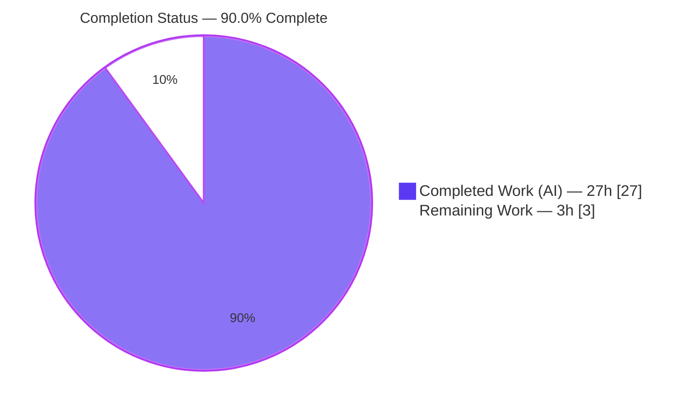
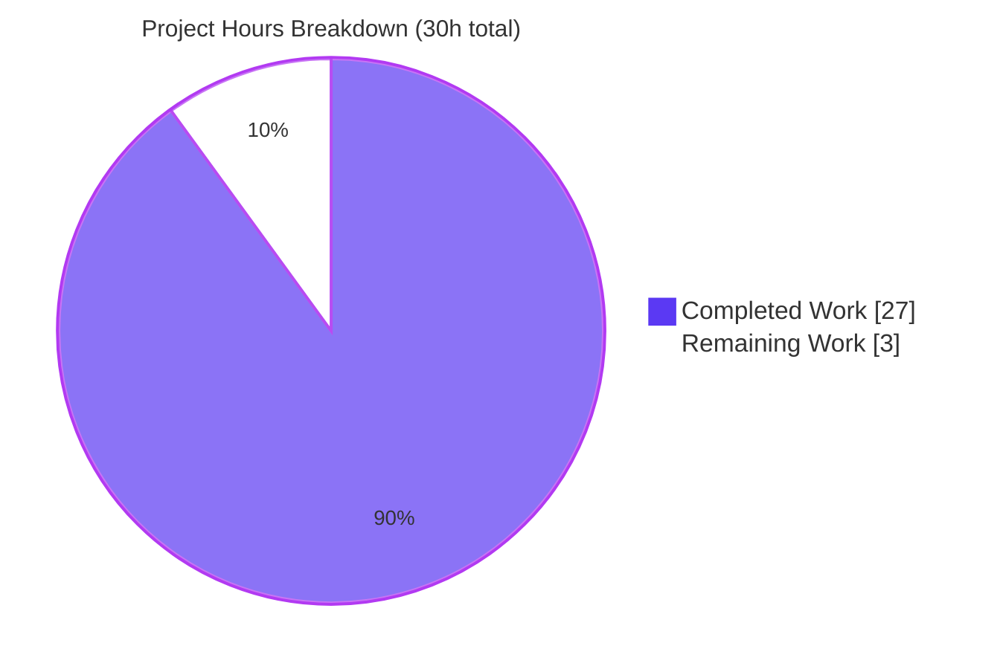
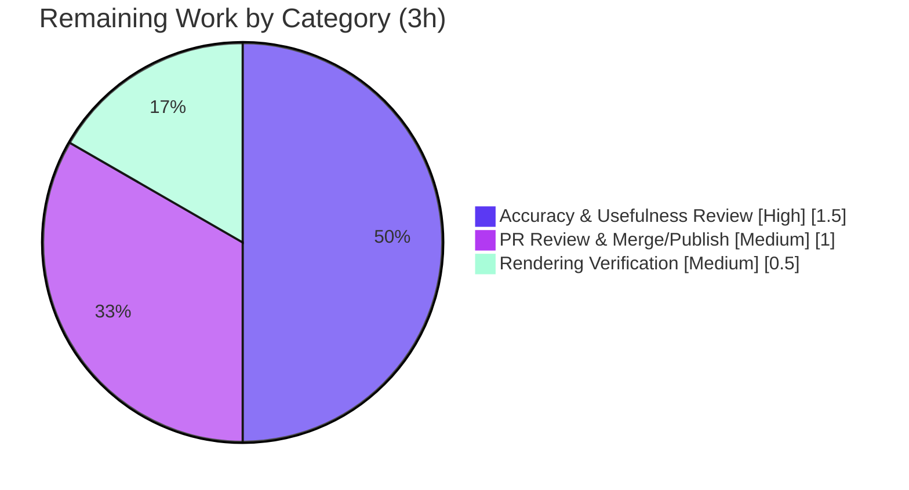

# Blitzy Project Guide — k6 Onboarding Knowledge Document

## 1. Executive Summary

### 1.1 Project Overview

This project delivers a single, self-contained Markdown onboarding knowledge document that verifiably answers a new team member's three questions about the `grafana/k6` load-testing engine (Go module `go.k6.io/k6`, v0.55.0, commit `ddc3b0b1d2`). Grounded in run-first evidence and exact `file:line` citations, it explains **(R1)** the project's health via its test suite, **(R2)** the metrics-tracking architecture — iteration counting and performance-data collection — and **(R3)** the end-to-end metric-collection flow for a simple script. It targets engineers onboarding onto k6. The task is strictly read-only: the only repository write is the new document itself; no existing source, test, config, or build file is modified.

### 1.2 Completion Status

The completion percentage is calculated using the AAP-scoped methodology: `Completed Hours / (Completed Hours + Remaining Hours) × 100 = 27 / 30 = 90.0%`. All autonomous AAP work (investigation + authoring + verification) is complete and independently validated; the remaining 3 hours are standard documentation path-to-production (human review, rendering verification, and merge/publish) that is inherently non-autonomous.



| Metric | Value |
|--------|-------|
| **Total Hours** | 30 |
| **Completed Hours (AI + Manual)** | 27 (AI: 27, Manual: 0) |
| **Remaining Hours** | 3 |
| **Percent Complete** | **90.0%** |

### 1.3 Key Accomplishments

- ✅ **Single deliverable authored and committed** — `blitzy/documentation/k6_ddc3b0b1d23c.md` (408 lines, 35,391 bytes), named after source branch `k6_ddc3b0b1d23c`.
- ✅ **R1 (Project Health)** — Built k6 (`go build`, exit 0) and ran the full test suite (`go test -json ./...`); reported exact counts at three granularities (**4417 pass / 8 fail / 1 skip** tests+subtests; **51 ok / 3 FAIL / 28 no-test-files** packages) with verbatim `ok` / `FAIL` / `--- SKIP` markers and a failed-vs-skipped-vs-broken classification table (**0 broken**).
- ✅ **R2 (Metrics Architecture)** — Named the three distinct iteration-counting locations and every file in the performance-data-collection path across `metrics/**`, `output/**`, and `execution/scheduler.go`.
- ✅ **R3 (End-to-End Flow)** — Authored and ran a minimal `Counter` script, captured the verbatim summary (`iterations` and `my_counter` each summed to **3**), and traced the 9-step call chain from `cmd/run.go` to the end-of-test summary with a Mermaid diagram.
- ✅ **Grounding & evidence** — 126 `file:line` citations pinned to commit `ddc3b0b1d2`; web-search corroboration of the k6 four-type metric taxonomy against official Grafana docs; a dedicated Coverage Pass.
- ✅ **Read-only constraint honored** — `git status` clean; exactly one file added; zero source/config/test/build files touched; transient scripts kept in `/tmp` and removed.

### 1.4 Critical Unresolved Issues

| Issue | Impact | Owner | ETA |
|-------|--------|-------|-----|
| _None — no blocking issues_ | The deliverable is verified factually accurate (100%); all autonomous AAP scope is complete. No issue blocks release or validation. | — | — |

> The three failing k6 packages (`grpc` TLS, `http` OCSP, `lib/executor` timing) and the one skipped suite (`TestTC39`) are **pre-existing, environmental** conditions the document accurately reports and correctly classifies as **out of scope** for this read-only Q&A. They are not defects introduced by this task and are not blocking.

### 1.5 Access Issues

| System/Resource | Type of Access | Issue Description | Resolution Status | Owner |
|-----------------|----------------|-------------------|-------------------|-------|
| _None_ | — | No access issues identified. The task is fully self-contained: the k6 repository is local, Go 1.23.12 is available, dependencies are vendored (offline build), and no external service, credential, or third-party API is required. | N/A | — |

**No access issues identified.**

### 1.6 Recommended Next Steps

1. **[High]** Have a k6 SME / tech-lead review the document end-to-end for technical accuracy and onboarding usefulness, spot-checking a sample of the 126 citations against commit `ddc3b0b1d2` (1.5h).
2. **[Medium]** Verify the Markdown, tables, code fences, and the Mermaid flow diagram render correctly in the target docs platform (GitHub/wiki/Confluence) (0.5h).
3. **[Medium]** Review, approve, and merge the PR, then link the document into the onboarding index/TOC for discoverability (1.0h).
4. **[Low]** _(Optional, not on critical path)_ Add a lightweight CI/automation check to re-validate citations when k6 is upgraded past v0.55.0.

---

## 2. Project Hours Breakdown

### 2.1 Completed Work Detail

| Component | Hours | Description |
|-----------|-------|-------------|
| Environment Setup & k6 Build | 2 | Install Go 1.23.12 toolchain (matches CI `DEFAULT_GO_VERSION: "1.23.x"`); build the vendored module offline (`go build`, exit 0); smoke test (`k6 version` → v0.55.0); enumerate 82 packages. [P1, R1a] |
| R1 — Test-Suite Execution & Health Analysis | 4 | Run full `go test -json ./...` (4426 tests / 82 packages); parse structured event stream; count at three granularities; root-cause the 3 environmental failures (TLS/OCSP/timing); isolation re-runs; classify the 1 skip. [R1b–R1g] |
| R2 — Metrics Architecture Investigation | 5 | Trace iteration counting (3 distinct places) and performance-data collection across `metrics/**` (6 files) + `output/**` (3 files) + `execution/scheduler.go`; document the channel pipeline, sink strategy pattern, and flush cadences. [R2a–R2c] |
| R3 — End-to-End Flow Trace & Script | 4 | Author the minimal `Counter` script, run it, capture the verbatim summary; trace the 9-step call chain; build the 12-citation Mermaid diagram. [R3a–R3d] |
| Web Research Corroboration | 1 | Validate the k6 four-type metric taxonomy and built-in semantics against official Grafana k6 documentation. [M6] |
| Documentation Authoring | 6 | Compose the 408-line / 35,391-byte document: structured R1/R2/R3 sections, 3 tables, verbatim code blocks, reproducibility caveats, appendix, and coverage pass. [D1, D2, M2, M4] |
| Citation Audit & Grounding Verification | 3 | Verify all 126 `:L` references (94 unique across 26 files) resolve byte-accurate at commit `ddc3b0b1d2`, including the `tc39` call-site-vs-definition citation nuance. [M3] |
| Read-Only Verification & Code-Review Fixes | 2 | `git status` clean checks; remove `/tmp` transient scripts; address code-review findings in a second commit. [M5] |
| **Total Completed** | **27** | |

### 2.2 Remaining Work Detail

| Category | Hours | Priority |
|----------|-------|----------|
| Documentation Accuracy & Usefulness Review (k6 SME / tech-lead) | 1.5 | High |
| Rendering Verification (Markdown + Mermaid in target docs platform) | 0.5 | Medium |
| PR Review & Merge/Publish (incl. onboarding-index linking) | 1.0 | Medium |
| **Total Remaining** | **3.0** | |

### 2.3 Hours Reconciliation

- Completed (§2.1) **27h** + Remaining (§2.2) **3h** = **30h** Total (§1.2). ✔
- Remaining **3h** is identical in §1.2, §2.2, and the §7 pie chart. ✔
- Completion = 27 / 30 = **90.0%**. ✔

---

## 3. Test Results

All results below originate from **Blitzy's autonomous test execution logs** for this project. Because the deliverable is a documentation file with no test suite of its own, "testing" comprised two autonomous activities: **(A)** executing the k6 project's own test suite to establish the R1 evidence, and **(B)** verifying the deliverable's factual accuracy (citation audit, build, structure, R3 reproduction).

### 3.A — k6 Project Test Suite (executed autonomously as R1 evidence)

Command: `go test -timeout 600s -json ./...` (canonical: `go test -race -timeout 210s ./...`, `Makefile:L27-L29`). Exit code 1 in ≈78s.

| Test Category | Framework | Total | Passed | Failed | Skipped | Notes |
|---------------|-----------|-------|--------|--------|---------|-------|
| Tests + subtests | Go `testing` + `testify` | 4426 | 4417 | 8 | 1 | Headline counts; invariant total 4426 |
| Top-level tests | Go `testing` | 773 | 769 | 3 | 1 | Invariant total 773 |
| Packages | `go test ./...` | 82 | 51 (ok) | 3 (FAIL) | 28 (no test files) | **0 build failures** → 0 broken |

- **3 failing packages (environmental, out of scope):** `js/modules/k6/grpc` (TLS `bad certificate`), `js/modules/k6/http` (OCSP `unknown`), `lib/executor` (timing tolerance) — root-caused to a future-dated sandbox clock invalidating embedded test certificates + CPU-scheduling jitter.
- **1 skipped suite:** `js/tc39 :: TestTC39` — verbatim `--- SKIP: TestTC39 (0.00s)`; requires the external `test262` fixture set.
- **Reproducibility note:** a marginal ±1 per-run flake was observed (autonomous re-run saw 4416/9/1 tests, 768/4/1 top-level); the invariant totals (4426, 773) hold, and the flaky test (`TestRampingVUsHandleRemainingVUs`) passes in isolation. Coverage % was not the R1 objective and was not measured.

### 3.B — Deliverable Verification (executed autonomously)

| Check | Method | Total | Passed | Failed | Notes |
|-------|--------|-------|--------|--------|-------|
| Citation accuracy audit | `file:line` byte-compare vs commit `ddc3b0b1d2` | 94 unique (126 refs) | 94 | 0 | All resolve byte-identical |
| Build / compilation | `go build ./...` | 82 pkgs | 82 | 0 | Empty stderr; 0 build-fail actions |
| R3 trace reproduction | `k6 run` on the `Counter` script | 1 | 1 | 0 | `iterations` & `my_counter` each = 3 (invariant) |
| Markdown structure | Fence/table/diagram lint | 3 | 3 | 0 | 42 balanced fences, 1 valid `mermaid`, 3 tables |

---

## 4. Runtime Validation & UI Verification

**Runtime health** (k6 built and exercised live during validation):

- ✅ **Operational** — `go build -o /tmp/k6bin/k6 .` → exit 0; `k6 version` → `k6 v0.55.0 (commit/..., go1.23.12, linux/amd64)`.
- ✅ **Operational** — `go build ./...` compiles all 82 packages; `go mod verify` → "all modules verified".
- ✅ **Operational** — R3 trace script runs to completion (exit 0); built-in `iterations` and custom `my_counter` Counters each summed to **3** (the documented invariant).
- ✅ **Operational** — Verbatim test markers reproduced: `ok  go.k6.io/k6/metrics  0.008s` and `--- SKIP: TestTC39 (0.00s)`.
- ⚠ **Partial (expected, out of scope)** — Full `go test ./...` exits 1 due to 3 environmental package failures (TLS/OCSP/timing) — accurately reported by the document, not defects.
- ✅ **Operational** — Read-only constraint: `git status --porcelain` clean; exactly one file added.

**UI verification:** ❌ **N/A** — This is a read-only documentation task with **no UI or visual-design dimension** (AAP §0.9 confirms no Figma frames/screens). No UI to verify.

**API integration:** ❌ **N/A** — The deliverable introduces no APIs, services, or external integrations.

---

## 5. Compliance & Quality Review

Cross-mapping the AAP deliverables and the binding `SWE-AtlasQnA-Repo` rule set to Blitzy's quality benchmarks:

| Benchmark / Rule | Requirement | Status | Evidence / Notes |
|------------------|-------------|--------|------------------|
| Deliverable rule | New Markdown `<branch>.md` in `blitzy/documentation/` | ✅ Pass | `blitzy/documentation/k6_ddc3b0b1d23c.md` created & committed |
| Run-first rule | Build & run before writing | ✅ Pass | Appendix A documents build/test/trace commands run first |
| Verbatim-evidence rule | Quote observed output with the producing command | ✅ Pass | Code fences quote `go test` markers, run summary, error strings |
| Coverage rule | Answer every sub-question + final pass | ✅ Pass | R1, R2(a), R2(b), R3 each answered; dedicated Coverage Pass |
| Exactness / grounding rule | Cite exact literals with `file:line` | ✅ Pass | 126 citations; 12 independently spot-checked byte-accurate |
| Read-only scope rule | No existing file modified; temp scripts removed | ✅ Pass | `git status` clean; 1 file added; `/tmp` scripts removed |
| Web-search rule | Corroborate metric taxonomy vs authoritative docs | ✅ Pass | §2.4 cites Grafana k6 docs for the 4-type model |
| Question coverage — R1 | Pass/fail counts + skipped + broken, verbatim | ✅ Pass | §1.3–§1.6 with classification table |
| Question coverage — R2 | Iteration counting + performance-data, named files | ✅ Pass | §2.2 (3 places) + §2.3 (all files named) |
| Question coverage — R3 | Trace concrete calls, start → output | ✅ Pass | §3.1–§3.4 script, verbatim summary, 9-step chain, diagram |
| Code quality (Markdown) | Well-formed, renders | ✅ Pass | 42 balanced fences, valid Mermaid, 3 valid tables |

**Fixes applied during autonomous validation:** The initial draft (`ff1e0e28d`) was followed by a code-review-findings commit (`a58988ee4`) that corrected citation offsets and added the citation-nuance note. At final validation, **zero further fixes were required** — the exhaustive audit found no inaccuracies.

**Outstanding compliance items:** Human SME sign-off on technical accuracy/usefulness (path-to-production, §2.2) remains.

---

## 6. Risk Assessment

Overall risk profile is **Low** — an additive, read-only, single-file documentation deliverable with zero code/config/dependency changes and no runtime footprint.

| Risk | Category | Severity | Probability | Mitigation | Status |
|------|----------|----------|-------------|------------|--------|
| Citation line-drift if read against a newer commit | Technical | Low | Medium | Every citation is explicitly pinned to commit `ddc3b0b1d2`; the document states this | Mitigated |
| Run-dependent R1 counts/rates vary per run (±1 flake) | Technical | Low | Medium | Document names the marginal flake, states invariant totals (4426/773), and adds reproducibility caveats | Mitigated |
| Mermaid diagram may not render in some Markdown viewers | Technical | Low | Low | Standard GitHub-compatible `graph TD` syntax; verify in target platform | Open (HT-2) |
| No executable code / credentials / dependencies | Security | Info | N/A | Deliverable is inert Markdown; quoted `"Acme Co"` strings are k6's own public test fixtures; described TLS/OCSP failures are environmental, not k6 vulnerabilities | N/A |
| Point-in-time staleness as k6 evolves | Operational | Low | Medium (over time) | Explicitly snapshot-pinned to k6 v0.55.0 / `ddc3b0b1d2` | Accepted |
| Discoverability of the new `blitzy/documentation/` doc | Operational | Low | Low | Filename follows branch convention; link into onboarding index | Open (HT-3) |
| Docs-platform rendering compatibility (tables/mermaid/fences) | Integration | Low | Low | Standard GitHub-flavored Markdown; 42 balanced fences | Open (HT-2) |
| External-service / API integration failure | Integration | N/A | N/A | Task adds zero dependencies, APIs, or services | N/A |

---

## 7. Visual Project Status

**Project hours breakdown** (Completed = Dark Blue `#5B39F3`, Remaining = White `#FFFFFF`):



**Remaining hours by category** (sums to 3h, matching §2.2 and §1.2):



- **Completed Work:** 27h (90.0%) — all autonomous AAP investigation, authoring, and verification.
- **Remaining Work:** 3h (10.0%) — human path-to-production (review, rendering verification, merge/publish).

---

## 8. Summary & Recommendations

**Achievements.** The project is **90.0% complete** (27 of 30 hours). Blitzy autonomously completed the entire AAP scope: it built k6, ran the full test suite, traced the metrics architecture, authored and ran a live trace script, corroborated findings against official documentation, and produced a single, comprehensively-cited onboarding document — all while strictly honoring the read-only constraint (exactly one file added, `git status` clean). Independent re-validation reproduced the build (exit 0), the R3 invariant (`iterations` = `my_counter` = 3), the verbatim test markers, and 12 spot-checked citations, corroborating the Final Validator's finding of 100% factual accuracy.

**Remaining gaps & critical path.** The remaining **3 hours** are entirely standard documentation path-to-production and inherently require a human: (1) an SME accuracy/usefulness review, (2) rendering verification in the target docs platform, and (3) PR review and merge/publish. There are **no blocking issues** and **no code fixes** outstanding — the AAP-scoped autonomous work is complete and verified.

**Production readiness.** The deliverable is **production-ready pending human acceptance**. Because completion measures AAP-scoped and path-to-production work, it is capped below 100% solely by the human review/merge steps that cannot be automated; the autonomous work itself is fully delivered.

| Success Metric | Target | Status |
|----------------|--------|--------|
| AAP deliverable authored | 1 Markdown file | ✅ Done (408 lines) |
| Read-only constraint | 0 existing files changed | ✅ Done (1 file added) |
| R1 / R2 / R3 answered | All three + coverage pass | ✅ Done |
| Citation accuracy | 100% resolve at pinned commit | ✅ Done (94/94) |
| Human acceptance | SME review + merge | ⏳ Pending (3h) |

**Recommendation:** Proceed with the §1.6 next steps. Given the verified accuracy, expect a light-touch review cycle.

---

## 9. Development Guide

This guide lets any developer reproduce the R1 test-health evidence and the R3 metric-collection trace, and verify the read-only constraint. All commands were tested live and build **offline** against the vendored dependencies.

### 9.1 System Prerequisites

- **OS:** Linux x86_64 (verified on Ubuntu 25.10; macOS/WSL2 also fine).
- **Go toolchain:** **Go 1.23.x** (validated with `go1.23.12`) — matches CI `DEFAULT_GO_VERSION: "1.23.x"` (`.github/workflows/build.yml:L27`). The repo's declared floor is `go 1.21` (`go.mod:L3`).
- **Git:** any recent version.
- **Disk:** ~2 GB for the Go build/module cache.
- **To only *read* the document:** no toolchain is needed — just a Markdown viewer that renders Mermaid (e.g., GitHub).

### 9.2 Environment Setup

```bash
# 1. Enter the repository (destination branch already checked out)
cd /path/to/k6            # module go.k6.io/k6

# 2. Confirm the Go toolchain
go version                # expect: go version go1.23.12 linux/amd64

# 3. (If Go is missing) install Go 1.23.x, e.g.:
#   curl -fsSLo /tmp/go.tgz https://go.dev/dl/go1.23.12.linux-amd64.tar.gz
#   sudo tar -C /usr/local -xzf /tmp/go.tgz && export PATH=$PATH:/usr/local/go/bin

# 4. Dependencies are vendored — no download needed. Verify integrity:
go mod verify             # expect: all modules verified
```

### 9.3 Build & Dependency Installation

```bash
# Build the k6 binary OUTSIDE the repo tree (keeps the working tree clean)
go build -o /tmp/k6bin/k6 .          # exit 0
/tmp/k6bin/k6 version                # k6 v0.55.0 (commit/..., go1.23.12, linux/amd64)

# Enumerate packages (sanity check)
go list ./... | wc -l                # 82

# Compile everything (proves 0 "broken" packages)
go build ./...                       # empty output, exit 0
```

### 9.4 Reproduce the Evidence

```bash
# --- R1: project health (full suite; canonical adds -race) ---
go test -timeout 600s -json ./... > /tmp/k6test.json ; echo "exit=$?"   # exit 1 (~78s)
#   Canonical repo target:  go test -race -timeout 210s ./...   (Makefile:L27-L29)

# Quick markers without the full run:
go test ./metrics/                                   # ok  go.k6.io/k6/metrics  0.008s
go test -count=1 -v -run '^TestTC39$' ./js/tc39/     # --- SKIP: TestTC39 (0.00s)

# --- R3: end-to-end metric trace (script lives OUTSIDE the repo) ---
mkdir -p /tmp/k6trace
cat > /tmp/k6trace/simple_test.js <<'EOF'
import { Counter } from 'k6/metrics';
export const options = { vus: 1, iterations: 3 };
const myCounter = new Counter('my_counter');
export default function () { myCounter.add(1); }
EOF
/tmp/k6bin/k6 run --no-color --quiet /tmp/k6trace/simple_test.js
#   expect: iterations ...: 3   <rate>/s   and   my_counter ...: 3   <rate>/s
rm -rf /tmp/k6trace                                  # clean up transient script
```

### 9.5 Verification Steps

```bash
# Read-only constraint: working tree must be clean (only the doc is tracked)
git status --porcelain                               # (empty output = clean)
git diff --name-status <source_base>...HEAD          # A  blitzy/documentation/k6_ddc3b0b1d23c.md

# Deliverable structure sanity checks
DOC=blitzy/documentation/k6_ddc3b0b1d23c.md
grep -c '```' "$DOC"                                 # 42 (even = balanced)
grep -c 'mermaid' "$DOC"                             # 1

# Spot-check a citation resolves byte-accurate at the pinned commit
sed -n '82p' metrics/builtin.go                      # Iterations: registry.MustNewMetric(IterationsName, Counter),
```

### 9.6 Example Usage

To view the deliverable, open it in any Mermaid-capable Markdown viewer:

```bash
# Render on GitHub, or locally with a Mermaid-aware previewer
less blitzy/documentation/k6_ddc3b0b1d23c.md
# The R3 flow diagram (a Mermaid "graph TD" block) renders as a call-chain graph.
```

### 9.7 Troubleshooting

- **`go: command not found`** → Install Go 1.23.x (see §9.2 step 3) and add `/usr/local/go/bin` to `PATH`.
- **`go test ./...` shows FAILs in `grpc` / `http` / `lib/executor`** → **Expected and environmental**, not code defects. A future-dated machine clock invalidates embedded test certificates (TLS `bad certificate`, OCSP `unknown`); CPU-scheduling jitter can trip the `lib/executor` 24 ms timing tolerance. This is exactly what the document reports (§1.5). Re-running the timing test in isolation passes.
- **`k6 version` shows a different commit hash than `ddc3b0b1d2`** → Expected. Go embeds the *current* HEAD at build time. Because the only change from the source base is the Markdown file, all `.go` files are byte-identical and every citation still resolves.
- **Mermaid diagram not rendering** → View on GitHub or paste into `mermaid.live`; some plain Markdown viewers do not render Mermaid.
- **`error: externally-managed-environment` (pip)** → Not applicable; this task has no Python dependencies.

---

## 10. Appendices

### Appendix A — Command Reference

| Command | Purpose | Expected Result |
|---------|---------|-----------------|
| `go version` | Confirm toolchain | `go1.23.12 linux/amd64` |
| `go mod verify` | Verify vendored deps | `all modules verified` |
| `go build -o /tmp/k6bin/k6 .` | Build k6 | exit 0 |
| `/tmp/k6bin/k6 version` | Smoke test | `k6 v0.55.0 (...)` |
| `go list ./... \| wc -l` | Count packages | `82` |
| `go build ./...` | Compile all (0 broken) | exit 0, empty stderr |
| `go test -timeout 600s -json ./...` | R1 full suite | exit 1, ~78s |
| `go test -race -timeout 210s ./...` | Canonical test target (`Makefile:L27-L29`) | — |
| `go test -v -run '^TestTC39$' ./js/tc39/` | Skip marker | `--- SKIP: TestTC39 (0.00s)` |
| `/tmp/k6bin/k6 run --no-color --quiet <script>` | R3 trace | `iterations`/`my_counter` = 3 |
| `git status --porcelain` | Read-only check | empty (clean) |

### Appendix B — Port Reference

| Port | Service | Notes |
|------|---------|-------|
| _None required_ | — | The R3 trace script makes no network calls. (k6's default REST API would be `6565`, and the built-in web dashboard `5665`, but neither is used by this documentation task.) |

### Appendix C — Key File Locations

| Path | Role |
|------|------|
| `blitzy/documentation/k6_ddc3b0b1d23c.md` | **The deliverable** (only file added) |
| `metrics/builtin.go`, `sample.go`, `sink.go`, `registry.go` | Metric definitions, data model, sinks, registry (R2) |
| `metrics/engine/ingester.go`, `engine.go` | Sample ingestion into sinks; threshold cadence (R2/R3) |
| `output/manager.go`, `helpers.go`, `types.go` | Samples-channel drain, 50 ms flush, `Output` contract (R2/R3) |
| `js/runner.go` | `RunOnce`, `incrIteration`, `iterationSamples` (R2/R3) |
| `js/modules/k6/metrics/metrics.go` | Custom-metric `add` → `PushIfNotDone` (R3) |
| `lib/executor/helpers.go`, `lib/execution.go` | `AddFullIterations` → atomic `fullIterationsCount` (R2) |
| `execution/scheduler.go`, `cmd/run.go` | Scheduler run; samples-channel creation (R3) |
| `Makefile`, `go.mod`, `.github/workflows/*.yml` | Test target, module/Go version, CI Go versions (R1) |

### Appendix D — Technology Versions

| Component | Version | Source |
|-----------|---------|--------|
| k6 (artifact under analysis) | v0.55.0 (commit `ddc3b0b1d2`) | `k6 version` |
| Go toolchain (investigation) | 1.23.12 | matches CI `DEFAULT_GO_VERSION: "1.23.x"` |
| Go module floor (declared) | `go 1.21`, `toolchain go1.21.13` | `go.mod:L3,L5` |
| Test frameworks | Go `testing`, `stretchr/testify` | vendored |
| Doc format | Markdown + Mermaid (`graph TD`, `pie`) | GitHub-flavored |

### Appendix E — Environment Variable Reference

| Variable | Purpose | Notes |
|----------|---------|-------|
| `PATH` | Locate the `go` binary | Add `/usr/local/go/bin` if Go was installed manually |
| `GOFLAGS=-mod=vendor` | Force vendored build (offline) | Optional; vendor mode is default when `vendor/` is present |
| `GOTOOLCHAIN=local` | Pin to the installed toolchain | Prevents auto-download of a different Go version |
| _(none app-specific)_ | The deliverable needs no runtime env vars | It is a static document |

### Appendix F — Developer Tools Guide

- **`go test -json`** — emits a structured event stream; parse it (e.g., `jq`) to count `pass`/`fail`/`skip` actions precisely, as done for R1.
- **`go build ./...`** — the fastest way to confirm zero "broken" (non-compiling) packages.
- **`mermaid.live`** — paste the R3 `graph TD` block to preview the flow diagram outside GitHub.
- **`git diff --name-status <base>...HEAD`** — confirm the changeset is exactly one added file (read-only proof).

### Appendix G — Glossary

| Term | Meaning |
|------|---------|
| **VU** | Virtual User — a concurrent execution unit in k6 that runs the test's default function. |
| **Sample** | The unit of metric data (`metrics.Sample`): a `TimeSeries` + value + timestamp, emitted onto the shared samples channel. |
| **Sink** | Per-metric-type aggregator: `CounterSink` (sums), `GaugeSink` (min/max/last), `TrendSink` (statistics), `RateSink` (non-zero frequency). |
| **Counter / Gauge / Rate / Trend** | The four k6 metric types determining aggregation behavior. |
| **Iteration** | One execution of the test's default function by a VU; counted in three distinct places (per-VU index, `iterations` metric, global atomic counter). |
| **Broken test** | A package that fails to compile / errors before running (here: **0**). |
| **Skipped test** | A test that runs but chooses not to execute (via `t.Skip`/build tags; here: **1**, `TestTC39`). |
| **Read-only task** | A task whose only repository write is the deliverable; no existing file is modified. |
