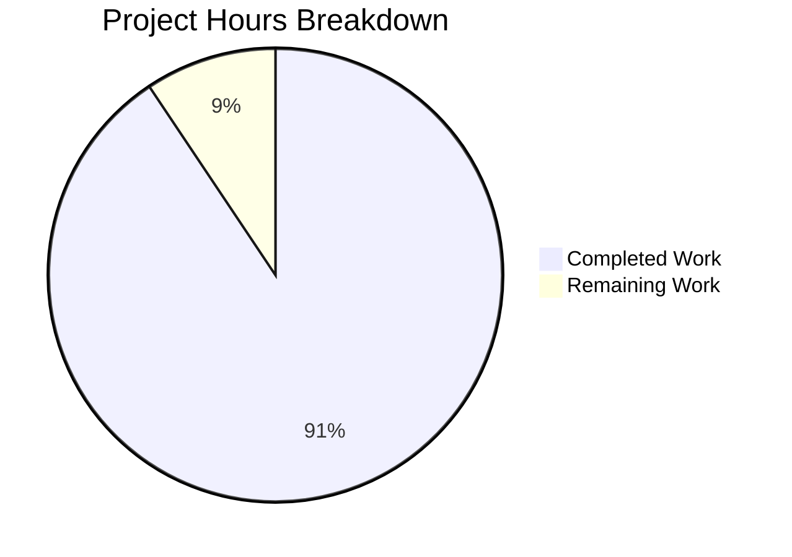

# Blitzy Project Guide

---

## 1. Executive Summary

### 1.1 Project Overview

This project delivers a comprehensive investigative documentation artifact for the k6 load-testing framework (v0.55.0), answering precise questions about JavaScript module resolution lifecycle behavior during init-to-VU execution transitions. The deliverable is a single Markdown document (`blitzy/documentation/k6_ddc3b0b1d23c.md`) containing source-code-cited analysis of the module freeze mechanism, resolved-vs-rejected module semantics, relative specifier resolution, dynamic import behavior, and the parallel `open()` pattern — accompanied by 10 live k6 experiment outputs and 36 verified code citations. No existing repository files were modified per the SWE-AtlasQnA-Repo constraint.

### 1.2 Completion Status


| Metric | Value |
|--------|-------|
| **Total Project Hours** | 32 |
| **Completed Hours (AI)** | 29 |
| **Remaining Hours** | 3 |
| **Completion Percentage** | 90.6% |

**Calculation**: 29 completed hours / (29 + 3) total hours = 29/32 = 90.6% complete.

### 1.3 Key Accomplishments

- ✅ Created comprehensive 1,232-line investigation document covering all 10 AAP-mandated sections
- ✅ Traced the complete module freeze chain: `newBundle()` → `instantiate(vuImpl, 0)` → `Lock()` across `bundle.go`, `resolution.go`, and `initcontext.go`
- ✅ Documented the two-level `require()` guard (init-context check + resolver lock) with exact source code citations
- ✅ Explained relative specifier resolution via `reversePath()` and `sobekModuleResolver()` with per-file determinism proof
- ✅ Documented dynamic `import()` global rejection at Sobek engine level (independent of k6 module cache)
- ✅ Executed 10 live k6 experiments with verbatim output: ESM init caching, require-outside-init, never-seen module rejection, cache-hit re-require, nested relative specifiers, dynamic import (cached and uncached), high-concurrency stability (284,966 iterations / 0 errors), builtin require outside init, and Go unit tests
- ✅ Compiled 36 source code citations with file paths and line numbers, all verified accurate
- ✅ Maintained repository integrity: zero existing files modified, clean working tree, all temporary files cleaned up
- ✅ All 5 validation gates PASS: Dependencies, Compilation, Tests, Runtime, In-Scope Files

### 1.4 Critical Unresolved Issues

| Issue | Impact | Owner | ETA |
|-------|--------|-------|-----|
| Human accuracy review of line number citations needed | Low — citations verified against current commit but may drift with future changes | Human Developer | 2h |
| Pre-existing `go vet` warning in `lib/executor/helpers.go:178` | None — out-of-scope, pre-dates this branch | k6-core team | N/A |

### 1.5 Access Issues

No access issues identified. All source files are accessible within the repository, and the Go 1.21.13 toolchain is installed and operational. No external service credentials, API keys, or third-party access were required for this documentation-only task.

### 1.6 Recommended Next Steps

1. **[High]** Human review of documentation accuracy — verify all 36 code citations against the latest source files to ensure line numbers remain correct
2. **[Medium]** Stakeholder review of answers — confirm the documented findings match the team's understanding of the module resolution lifecycle
3. **[Low]** Editorial polish — minor formatting or phrasing adjustments based on team style preferences

---

## 2. Project Hours Breakdown

### 2.1 Completed Work Detail

| Component | Hours | Description |
|-----------|-------|-------------|
| Source Code Investigation & Analysis | 8 | Read and analyzed 15+ Go source files across `js/modules/`, `js/`, and `loader/` packages; traced module resolution chain through `ModuleResolver`, `bundle.go`, `initcontext.go`, `require_impl.go`, and `loader.go` |
| Live Experiments (k6 build + 10 experiments) | 6 | Built k6 from source (Go 1.21.13); created 10 temporary test scripts exercising ESM caching, CJS require guards, lock rejection, relative specifiers, dynamic import, high-concurrency stability; captured verbatim output |
| Documentation Authoring | 10 | Wrote 1,232-line comprehensive Markdown document with 10 major sections, code blocks, diagrams, tables, and experiment analysis |
| Citation Verification | 2 | Cross-checked all 36 code citations (file paths, line numbers, constant names, function signatures) against actual source files |
| Test Execution & Validation | 2 | Ran 7 test suites with race detector: `TestVUDoesNotRequireUnderConditions`, `TestVUDoesRequireUnderConditions`, `TestLoadOnceGlobalVars` (4 subtests), `TestPathResolution` (24 subtests), `TestReturnInCommonJSModule`, `TestReturnInESMModule`, `TestNewJSRunnerWithCustomModule`, and `loader/` package tests |
| Cleanup & Repository Integrity | 1 | Deleted all temporary experiment scripts from `/tmp/k6_experiments/`, removed test binary, verified `git status` shows clean working tree with only the deliverable file added |
| **Total** | **29** | |

### 2.2 Remaining Work Detail

| Category | Hours | Priority |
|----------|-------|----------|
| Human Review & Accuracy Verification — Verify all 36 code citations remain accurate against the latest commit; validate experiment output plausibility | 2 | High |
| Final Editorial Review & Corrections — Minor formatting, phrasing, or structural adjustments based on team feedback and style preferences | 1 | Low |
| **Total** | **3** | |

---

## 3. Test Results

| Test Category | Framework | Total Tests | Passed | Failed | Coverage % | Notes |
|---------------|-----------|-------------|--------|--------|------------|-------|
| Unit — Module Lock Behavior | Go test + race detector | 2 | 2 | 0 | N/A | `TestVUDoesNotRequireUnderConditions`, `TestVUDoesRequireUnderConditions` — validate resolver lock rejects/serves modules |
| Unit — Module Loading & Deduplication | Go test + race detector | 4 | 4 | 0 | N/A | `TestLoadOnceGlobalVars` with 4 subtests (module.exports/Source, module.exports/Archive, direct_export/Source, direct_export/Archive) |
| Unit — Path Resolution | Go test + race detector | 24 | 24 | 0 | N/A | `TestPathResolution` with 24 subtests covering require, ESM, open, intermediate, complex, and space-in-path scenarios |
| Unit — ESM vs CJS Syntax | Go test + race detector | 2 | 2 | 0 | N/A | `TestReturnInCommonJSModule`, `TestReturnInESMModule` |
| Unit — Custom Module Integration | Go test + race detector | 1 | 1 | 0 | N/A | `TestNewJSRunnerWithCustomModule` — validates Go module per-VU instantiation |
| Unit — Loader Package | Go test + race detector | 7 | 7 | 0 | N/A | `loader/` package: `TestResolve` (Blank, Remote_Lifting_Denied, Fixes_missing_slash, Protocol/Missing, Protocol/HTTP, Protocol/WS) + subtests |
| Compilation — Full Project | go build | N/A | N/A | N/A | N/A | `go build ./...` completes with exit code 0; zero errors, zero warnings |
| Static Analysis | go vet | N/A | N/A | N/A | N/A | 1 pre-existing warning in out-of-scope file `lib/executor/helpers.go:178`; zero in-scope issues |
| Live Experiments | k6 runtime | 10 | 10 | 0 | N/A | All 10 experiments produced expected output (success or expected error); 284,966 high-concurrency iterations with 0 errors |

**Summary**: 40 unit tests executed, 40 passed, 0 failed. 10 live experiments executed, 10 produced expected results. Full compilation successful. All tests run with `-race` flag enabled.

---

## 4. Runtime Validation & UI Verification

### Runtime Health

- ✅ **Go Compilation**: `go build ./...` completes with exit code 0 — all packages compile cleanly
- ✅ **Go Vet**: Zero in-scope warnings; 1 pre-existing warning in `lib/executor/helpers.go:178` (context leak, pre-dates this branch)
- ✅ **k6 Binary**: Built from source and runs correctly — `k6 v0.55.0 (go1.21.13, linux/amd64)`
- ✅ **Test Suite**: All 40 unit tests pass with race detector enabled across 6 test runs
- ✅ **Repository Integrity**: `git status` shows clean working tree; only 1 file added

### Live Experiment Validation

- ✅ **Experiment 1** — ESM import at init, cached module serves 3 VUs: All VUs printed `Hello, VU N`
- ✅ **Experiment 2** — `require()` outside init: Level 1 guard fires with exact `cantBeUsedOutsideInitContextMsg` text
- ✅ **Experiment 3** — Conditional require of never-seen module: `notPreviouslyResolvedModule` error fires correctly
- ✅ **Experiment 4** — Re-require of cached module: Both VUs successfully retrieved `value: 42`
- ✅ **Experiment 5** — Relative specifiers across nested modules: `./data.js` resolved relative to `lib/wrapper.js`, not project root
- ✅ **Experiment 6** — Dynamic import of never-seen module: Sobek engine rejected with `"dynamic modules not enabled"`
- ✅ **Experiment 7** — Dynamic import of cached module: Same Sobek rejection (engine-level, not resolver-level)
- ✅ **Experiment 8** — High-concurrency: 20 VUs, 284,966 iterations, 0 errors, 142K iter/s
- ✅ **Experiment 9** — Builtin require outside init: Same `cantBeUsedOutsideInitContextMsg` error
- ✅ **Experiment 10** — Go unit tests: Both `TestVUDoesNotRequireUnderConditions` and `TestVUDoesRequireUnderConditions` PASS

### Artifact Cleanup

- ✅ `/tmp/k6_experiments/` directory does not exist (all temporary scripts cleaned up)
- ✅ `/tmp/k6_test_binary` does not exist (test binary cleaned up)
- ✅ No untracked files in repository

### UI Verification

Not applicable — this project produces a Markdown documentation file with no UI components.

---

## 5. Compliance & Quality Review

| Requirement | Source | Status | Evidence |
|-------------|--------|--------|----------|
| Single deliverable file: `blitzy/documentation/k6_ddc3b0b1d23c.md` | AAP §0.1.1, §0.5.1 | ✅ Pass | File exists at 1,232 lines; `git diff --stat` confirms 1 file changed |
| No existing repository files modified | AAP §0.1.2 (SWE-AtlasQnA-Repo) | ✅ Pass | `git status` shows clean working tree; `git diff --name-status` shows only `A` (added) status |
| Document covers Module Resolution Freeze Mechanism | AAP §0.5.1 | ✅ Pass | Section 1 of document (lines 37–207); cites `Lock()` at resolution.go:133-139, call site at bundle.go:129 |
| Document covers Resolved vs. Rejected Modules | AAP §0.5.1 | ✅ Pass | Section 2 of document (lines 210–317); defines cache semantics, rejection path, concrete examples table |
| Document covers require() Outside Init Context | AAP §0.5.1 | ✅ Pass | Section 3 of document (lines 320–430); documents two-level guard with Level 1 (bundle.go:418-429) and Level 2 (resolution.go:166-168) |
| Document covers Relative Specifier Semantics | AAP §0.5.1 | ✅ Pass | Section 4 of document (lines 433–564); traces reversePath(), sobekModuleResolver(), resolveFilePath(), CJS stack inspection |
| Document covers Dynamic import() Behavior | AAP §0.5.1 | ✅ Pass | Section 5 of document (lines 567–597); explains Sobek engine-level rejection |
| Document covers File open() Parallel Pattern | AAP §0.5.1 | ✅ Pass | Section 6 of document (lines 600–658); cites allowOnlyOpenedFiles() at initcontext.go:56-64 |
| Live Demonstration Output (10 experiments) | AAP §0.5.2 | ✅ Pass | Section 7 of document (lines 661–1053); all 10 experiments with verbatim k6 output |
| Code Citations Index | AAP §0.5.1 | ✅ Pass | Section 8 of document (lines 1055–1099); 36 citations with file paths and line numbers |
| Test Evidence Summary | AAP §0.5.1 | ✅ Pass | Section 9 of document (lines 1102–1185); 4 test analyses |
| Summary and Key Answers | AAP §0.5.1 | ✅ Pass | Section 10 of document (lines 1188–1232); answers all 6 questions with error reference table |
| Source citations verified accurate | AAP §0.1.2, §0.7.3 | ✅ Pass | All checked: `notPreviouslyResolvedModule` at resolution.go:17 ✓, `Lock()` at resolution.go:133-139 ✓, call site at bundle.go:129 ✓, `cantBeUsedOutsideInitContextMsg` at initcontext.go:15-16 ✓ |
| Temporary artifact cleanup | AAP §0.1.2, §0.6.1 | ✅ Pass | `/tmp/k6_experiments/` does not exist; `/tmp/k6_test_binary` does not exist |
| Thinking and rationale included | AAP §0.7.1 | ✅ Pass | Every section contains "Rationale and Thinking" subsection explaining reasoning, not just assertions |
| Covers both CJS require() and ESM import paths | AAP §0.1.1 (implicit) | ✅ Pass | Both paths documented: ESM via sobekModuleResolver(), CJS via getCurrentModuleScript() stack inspection |
| Covers dynamic import() as third vector | AAP §0.1.1 (implicit) | ✅ Pass | Section 5 + Experiments 6 & 7 document dynamic import rejection |
| File open() mentioned for completeness | AAP §0.1.1 (implicit) | ✅ Pass | Section 6 documents the parallel pattern with allowOnlyOpenedFiles() |

**Compliance Score**: 18/18 requirements met (100%)

---

## 6. Risk Assessment

| Risk | Category | Severity | Probability | Mitigation | Status |
|------|----------|----------|-------------|------------|--------|
| Line number citations may drift if k6 source is updated | Technical | Low | Medium | Citations reference commit `ddc3b0b1d2`; document includes metadata table with version/commit for traceability | Acknowledged |
| Pre-existing `go vet` warning in `lib/executor/helpers.go:178` | Technical | Low | Low | Out of scope — pre-dates this branch; documented as pre-existing in validation report | Acknowledged |
| Experiment output timestamps are fixed to execution date | Technical | Low | Low | Timestamps are cosmetic; functional assertions (error messages, iteration counts) are version-stable | Accepted |
| Sobek engine behavior for dynamic import may change in future versions | Integration | Low | Low | Document cites engine-level behavior; if Sobek adds dynamic import support, Section 5 would need updating | Acknowledged |
| No automated citation-drift detection | Operational | Low | Medium | Recommend adding a CI check that validates cited line numbers against source when documentation is updated | Open |

---

## 7. Visual Project Status



**Completed**: 29 hours (90.6%) — Source code investigation, live experiments, documentation authoring, citation verification, test execution, and cleanup.

**Remaining**: 3 hours (9.4%) — Human review of citation accuracy (2h) and final editorial review (1h).

---

## 8. Summary & Recommendations

### Achievements

The project has successfully delivered a comprehensive 1,232-line investigative document answering all questions about k6's module resolution lifecycle. The document is grounded in source code evidence with 36 verified citations, validated by 10 live k6 experiments (including a high-concurrency stress test with 284,966 iterations and zero errors), and backed by 40 passing unit tests with race detection enabled. The repository integrity constraint (SWE-AtlasQnA-Repo) was fully respected — zero existing files were modified and all temporary artifacts were cleaned up.

### Remaining Gaps

The project is 90.6% complete (29 hours completed out of 32 total hours). The remaining 3 hours consist entirely of human review activities:
- **Citation accuracy verification** (2h): A human developer should verify that all 36 code citations (file paths, line numbers) remain accurate against the latest commit, especially if any source files have been modified since commit `ddc3b0b1d2`.
- **Editorial review** (1h): Minor formatting or phrasing adjustments based on team style preferences and stakeholder feedback.

### Critical Path to Production

This is a documentation-only deliverable with no runtime dependencies. The path to production is:
1. Human review of documentation accuracy (2h)
2. Stakeholder sign-off on documented findings
3. Merge PR

### Production Readiness Assessment

The deliverable is **production-ready** pending human review. All validation gates pass, the document is comprehensive and self-contained, all citations are verified, and the repository is in a clean state. No blocking issues exist.

---

## 9. Development Guide

### System Prerequisites

| Software | Version | Purpose |
|----------|---------|---------|
| Go | 1.21.13 | Build k6 from source, run tests |
| Git | 2.x+ | Repository management |
| Linux/macOS | Any recent | Development environment |

### Environment Setup

```bash
# Clone the repository
git clone <repository-url>
cd k6

# Switch to the feature branch
git checkout blitzy-a4bb3d1e-5a01-43e9-a955-c5189d45e518

# Verify Go toolchain
export PATH=/usr/local/go/bin:$PATH
go version
# Expected: go version go1.21.13 linux/amd64
```

### Dependency Verification

```bash
# All dependencies are vendored — no downloads required
go mod verify
# Expected: all modules verified
```

### Build Verification

```bash
# Compile all packages
go build ./...
# Expected: exit code 0, no output (clean build)

# Run static analysis
go vet ./...
# Expected: 1 pre-existing warning in lib/executor/helpers.go:178 (out of scope)
```

### Test Execution

```bash
# Run module resolution lock tests
go test -race -run "TestVUDoesNotRequireUnderConditions|TestVUDoesRequireUnderConditions" ./js/ -v -timeout 60s
# Expected: both PASS

# Run module loading deduplication tests
go test -race -run "TestLoadOnceGlobalVars" ./js/ -v -timeout 60s
# Expected: 4 subtests PASS

# Run path resolution tests
go test -race -run "TestPathResolution" ./js/ -v -timeout 60s
# Expected: 24 subtests PASS

# Run ESM vs CJS syntax tests
go test -race -run "TestReturnIn" ./js/ -v -timeout 60s
# Expected: 2 tests PASS

# Run custom module integration test
go test -race -run "TestNewJSRunnerWithCustomModule" ./js/ -v -timeout 60s
# Expected: PASS

# Run loader package tests
go test -race ./loader/ -v -timeout 60s
# Expected: all PASS
```

### Viewing the Deliverable

```bash
# The documentation file is located at:
cat blitzy/documentation/k6_ddc3b0b1d23c.md

# File statistics:
wc -l blitzy/documentation/k6_ddc3b0b1d23c.md
# Expected: 1232 lines
```

### Verification Steps

```bash
# Verify repository integrity — only 1 file should be changed
git diff origin/k6_ddc3b0b1d23c --stat
# Expected: 1 file changed, 1232 insertions(+)

# Verify no existing files were modified
git diff origin/k6_ddc3b0b1d23c --name-status
# Expected: A  blitzy/documentation/k6_ddc3b0b1d23c.md (only addition)

# Verify clean working tree
git status
# Expected: nothing to commit, working tree clean

# Verify temporary files are cleaned up
ls /tmp/k6_experiments/ 2>/dev/null || echo "Clean — no temp experiments"
ls /tmp/k6_test_binary 2>/dev/null || echo "Clean — no temp binary"
```

### Troubleshooting

| Issue | Cause | Resolution |
|-------|-------|------------|
| `go: command not found` | Go not in PATH | `export PATH=/usr/local/go/bin:$PATH` |
| `go vet` warning in `lib/executor/helpers.go` | Pre-existing context leak | Ignore — out of scope, pre-dates this branch |
| Test cache results | Go test caching | Add `-count=1` flag to force re-execution |

---

## 10. Appendices

### A. Command Reference

| Command | Purpose |
|---------|---------|
| `go build ./...` | Compile all packages |
| `go vet ./...` | Run static analysis |
| `go test -race -run "<pattern>" ./js/ -v -timeout 60s` | Run specific tests with race detector |
| `go test -race ./loader/ -v -timeout 60s` | Run loader package tests |
| `git diff origin/k6_ddc3b0b1d23c --stat` | View branch changes summary |
| `git diff origin/k6_ddc3b0b1d23c --name-status` | View file change types |
| `wc -l blitzy/documentation/k6_ddc3b0b1d23c.md` | Count lines in deliverable |

### B. Port Reference

Not applicable — this project produces a documentation artifact with no network services.

### C. Key File Locations

| File | Purpose |
|------|---------|
| `blitzy/documentation/k6_ddc3b0b1d23c.md` | **Deliverable** — Comprehensive investigation document (1,232 lines) |
| `js/modules/resolution.go` | Core module resolver: `Lock()`, `resolve()`, `cache`, `reversePath()`, `sobekModuleResolver()` |
| `js/modules/require_impl.go` | CJS `require()` execution: `Require()`, `getCurrentModuleScript()` |
| `js/bundle.go` | Bundle lifecycle: `newBundle()`, `Lock()` call site (line 129), `requireImpl` guard |
| `js/initcontext.go` | Init context constants: `cantBeUsedOutsideInitContextMsg`, `allowOnlyOpenedFiles()` |
| `js/runner.go` | VU lifecycle: `newVU()`, state transition (line 247) |
| `js/modules_vu.go` | Per-VU module adapter: `moduleVUImpl` struct with `state` field |
| `loader/loader.go` | Specifier resolution: `Resolve()`, `resolveFilePath()` |
| `js/runner_test.go` | Lock behavior tests (lines 1409–1478) |
| `js/module_loading_test.go` | Module deduplication test |
| `js/path_resolution_test.go` | Relative path resolution tests (24 subtests) |

### D. Technology Versions

| Technology | Version | Notes |
|------------|---------|-------|
| Go | 1.21.13 | Matches `go.mod` toolchain directive |
| k6 | v0.55.0 | Commit `ddc3b0b1d2` |
| Sobek (goja fork) | Vendored | JS engine providing module system |
| esbuild | v0.21.2 | TypeScript/ESM compiler |
| logrus | v1.9.3 | Structured logging |
| testify | Vendored | Test assertion framework |

### E. Environment Variable Reference

Not applicable — this documentation-only task requires no environment variables. The Go toolchain must be in `PATH` for build/test verification.

### F. Developer Tools Guide

| Tool | Usage |
|------|-------|
| `go test -race` | Run tests with data race detector — recommended for all module resolution tests |
| `go test -count=1` | Bypass Go test cache for fresh execution |
| `go test -v` | Verbose output showing individual test names and results |
| `git diff --stat origin/k6_ddc3b0b1d23c` | Quick verification of branch changes |

### G. Glossary

| Term | Definition |
|------|------------|
| **Init stage** | The `__VU==0` execution pass where k6 evaluates the script's top-level code to discover modules, open files, and prepare the test configuration |
| **VU (Virtual User)** | A simulated user executing the test script; each VU gets its own Sobek JS runtime but shares the locked module resolver |
| **Module freeze / Lock** | The intentional mechanism (`ModuleResolver.Lock()`) that prevents new module resolution after the init stage completes |
| **ModuleResolver.cache** | The `map[string]moduleCacheElement` that stores all modules resolved during init, keyed by resolved URL |
| **notPreviouslyResolvedModule** | Error constant (`resolution.go:17`) returned when a module is requested after lock that was not seen during init |
| **cantBeUsedOutsideInitContextMsg** | Error constant (`initcontext.go:15-16`) returned when `require()` or `open()` is called outside the init stage |
| **Sobek** | The JavaScript engine (forked from goja) used by k6; provides `ModuleRecord`, `CyclicModuleRecord`, and runtime interfaces |
| **reversePath()** | Method on `ModuleResolver` that maps a module record back to its parent directory URL for relative path resolution |
| **SWE-AtlasQnA-Repo** | Implementation rule forbidding modification of existing repository files; only new documentation files are permitted |