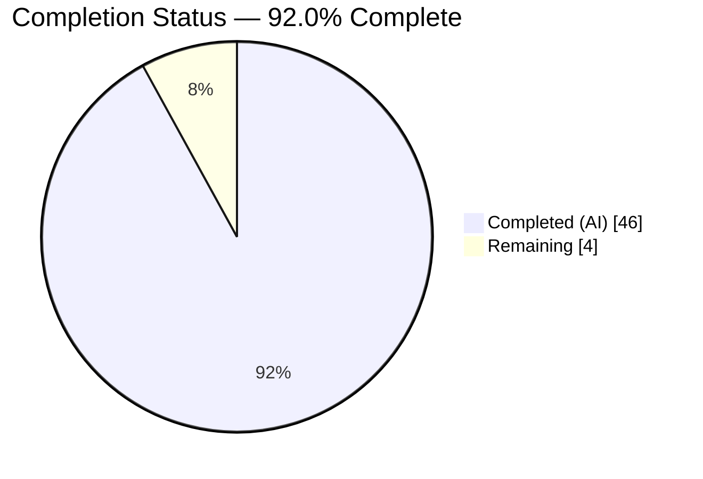
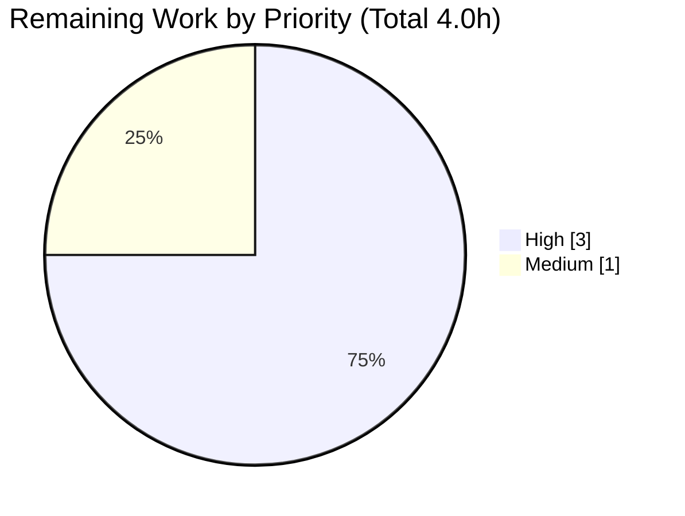

# Blitzy Project Guide — k6 Option Consolidation & Precedence Answer

> **Project:** Read-only, run-grounded documentation answer for `go.k6.io/k6` v0.55.0
> **Deliverable:** `blitzy/documentation/k6_ddc3b0b1d23c.md` (905 lines)
> **Branch:** `blitzy-011db4be-5410-4522-91ee-06e1a1b00b28` · **HEAD:** `98f7b3283ee27002ee39941dbd78511d338d9239` · **Baseline:** `ddc3b0b1d23c128e34e2792fc9075f9126e32375`

---

## 1. Executive Summary

### 1.1 Project Overview

This project delivers a single comprehensive, run-grounded answer document that explains how k6 (`go.k6.io/k6` v0.55.0) consolidates its option inputs — script `export const options`, CLI flags, a JSON config file, `K6_*` environment variables, and built-in defaults — into the one effective options set the execution scheduler consumes, precisely when that set is frozen, and how every VU observes it. It targets engineers onboarding onto the k6 codebase who are confused about "where the real options come from." The scope is read-only investigation across the CLI, core library, JS runtime, and execution engine; behavior is proven with real conflicting runs and verbatim output rather than assertion.

### 1.2 Completion Status



<!-- Brand colors: Completed = Dark Blue #5B39F3 ; Remaining = White #FFFFFF -->

| Metric | Hours |
|--------|-------|
| **Total Project Hours** | **50.0** |
| Completed Hours (AI: 46.0 + Manual: 0.0) | **46.0** |
| Remaining Hours | **4.0** |
| **Percent Complete** | **92.0%** |

**Calculation (PA1, AAP-scoped):** `Completion % = Completed ÷ (Completed + Remaining) × 100 = 46.0 ÷ 50.0 × 100 = 92.0%`.

### 1.3 Key Accomplishments

- ✅ **Run-first investigation honored** — k6 was built offline from vendored dependencies and executed *before* any prose was written; the answer is written from observation.
- ✅ **Precedence ladder established from source** — CLI > `K6_*` env > script `export const options` > JSON `--config` > defaults, anchored to `getConsolidatedConfig` (cmd/config.go:189) and the apply order at cmd/config.go:203.
- ✅ **Finalization/freeze point pinpointed** — `buildTestRunState` (cmd/test_load.go:265) via `SetOptions`, consumed by `execution.NewScheduler` (cmd/run.go:135).
- ✅ **Six conflicting experiments (A–F) captured verbatim** — including the two counterintuitive cases the user reported (script beats `--config`; CLI `--duration` erases a script `scenarios` map).
- ✅ **Multi-VU behavior proven** — every VU prints byte-identical effective options via `exec.test.options` (js/modules/k6/execution/execution.go:184).
- ✅ **65 exact `file:line` citations verified in-bounds** against the pinned source; 16/16 exact-literal cross-checks pass.
- ✅ **Read-only mandate satisfied** — exactly one file added; zero source files modified; all temporary artifacts removed; working tree clean.
- ✅ **Final Validator: 5/5 production-readiness gates PASS, zero corrections required.**

### 1.4 Critical Unresolved Issues

| Issue | Impact | Owner | ETA |
|-------|--------|-------|-----|
| _None._ No defects, compilation errors, or failing in-scope tests. The document is validator-confirmed 100% accurate and production-ready. | None | — | — |

### 1.5 Access Issues

| System/Resource | Type of Access | Issue Description | Resolution Status | Owner |
|-----------------|----------------|-------------------|-------------------|-------|
| — | — | No access issues identified. The build is fully offline (vendored deps); no credentials, registries, or third-party APIs are required. | N/A | — |

**No access issues identified.**

### 1.6 Recommended Next Steps

1. **[High]** Human SME technical review of all 905 lines — spot-check a sample of the 65 `file:line` citations against pinned source `ddc3b0b1d23c`, and confirm R1–R4 are each explicitly answered (≈2.5h).
2. **[High]** Approve and merge the PR adding `blitzy/documentation/k6_ddc3b0b1d23c.md` to the target branch (≈0.5h).
3. **[Medium]** Reviewer reproduction — build k6 offline, confirm the version banner, and re-run Experiments A/D/E/F to independently confirm exit codes and effective options (≈1.0h).
4. **[Low]** *(Optional, beyond current scope)* Add a CI job that rebuilds k6 and re-runs the experiments to guard against future citation/line-number drift.

---

## 2. Project Hours Breakdown

### 2.1 Completed Work Detail

| Component | Hours | Description |
|-----------|-------|-------------|
| Run-first build & version-check evidence block | 3.0 | Build k6 offline (vendored) and capture the `k6 vX.Y.Z (commit/…, go…, os/arch)` self-report as run-first evidence. |
| Option-pipeline source investigation & 65 `file:line` citations (14 files) | 9.0 | Read and cite every file participating in consolidation/derivation/finalization/runtime exposure. |
| R1 — Consolidation mechanism & precedence ladder (§2–§4) | 8.0 | Trace `getConsolidatedConfig`, `Config.Apply`, `Options.Apply` + execution-reset, and shortcut→scenario derivation. |
| R2 — Finalization / freeze-point analysis (§5) | 3.0 | Follow `derivedConfig` → `buildTestRunState`/`SetOptions` → `NewScheduler`. |
| R3 — Six conflicting experiments A–F (§6) | 7.0 | Design, run, and transcribe verbatim output for all six conflict setups incl. exit code 104. |
| Edge case — `-e`/`--env` divergence G1–G3 (§7) | 3.0 | Demonstrate observed behavior vs. generic docs claim; prove via the include-system-env-vars toggle. |
| R4 — Multi-VU behavior & runtime exposure (§8) | 2.0 | Prove all VUs observe identical frozen options via `exec.test.options`. |
| Web corroboration vs. Grafana docs + issue #688 (§9) | 2.0 | Validate the code-derived precedence model against official docs (code remains authoritative). |
| Coverage pass R1–R4 (§10) + QA exactness/grounding fixes | 3.0 | Explicit coverage mapping; correct literals and grounding per the rule. |
| Document structure/TOC, read-only integrity & cleanup | 1.0 | 10-section structure, TOC anchors, temp-artifact removal, clean-tree verification. |
| Final Validator end-to-end validation pass (5 gates) | 5.0 | Reproduce all runs, verify citations, confirm build/tests, confirm read-only/clean. |
| **Total Completed** | **46.0** | |

### 2.2 Remaining Work Detail

| Category | Hours | Priority |
|----------|-------|----------|
| Human SME technical review of the document | 2.5 | High |
| Reviewer reproduction of build + sample experiments (A/D/E/F) | 1.0 | Medium |
| PR approval & merge to target branch | 0.5 | High |
| **Total Remaining** | **4.0** | |

**Integrity note:** Section 2.1 (46.0) + Section 2.2 (4.0) = **50.0** Total Project Hours (matches Section 1.2). Remaining = **4.0** across Sections 1.2, 2.2, and 7.

---

## 3. Test Results

All results below originate from **Blitzy's autonomous validation logs for this project**. No new tests were authored (read-only documentation task); the pre-existing k6 suites that exercise the option-consolidation machinery the document describes were executed to validate accuracy.

| Test Category | Framework | Total Tests | Passed | Failed | Coverage % | Notes |
|---------------|-----------|-------------|--------|--------|-----------|-------|
| Consolidation (canonical) — `TestConfigConsolidation` | Go `testing` | 220 | 220 | 0 | n/a (behavioral) | Direct `getConsolidatedConfig` coverage; `ok go.k6.io/k6/cmd` (exit 0). The authoritative merge entry point. |
| Core library — `./lib` | Go `testing` | package suite | pass | 0 | n/a | Contains `Options.Apply` + execution-reset semantics. |
| Executors — `./lib/executor` | Go `testing` | package suite | pass | 0 | n/a | Contains `DeriveScenariosFromShortcuts` + conflict errors. |
| Execution engine — `./execution` | Go `testing` | package suite | pass | 0 | n/a | Contains `NewScheduler` consuming frozen `trs.Options`. |
| Exit codes — `./errext` | Go `testing` | package suite | pass | 0 | n/a | Contains `InvalidConfig ExitCode = 104`. |

**Build/verify (Blitzy logs):** offline vendored build `go build -o /tmp/k6bin .` → exit 0; `go mod verify` → "all modules verified".

**Out-of-scope pre-existing failures (not part of this deliverable):** two unrelated packages fail at baseline — `js/modules/k6/grpc` (TLS 1.3 "Acme Co" cert; upstream flaky #3551) and `js/modules/k6/http` (time-sensitive OCSP-stapling fixture). Both are outside option-consolidation scope, untouched by this doc, and unfixable under the read-only mandate.

---

## 4. Runtime Validation & UI Verification

**Runtime health (locally built `k6 v0.55.0`):**

- ✅ **Operational** — Offline vendored build produced a runnable binary; `--version` self-reports `k6 v0.55.0 (commit/…, go1.23.12, linux/amd64)`.
- ✅ **Operational** — Valid runs exit **0**; the same-tier `duration`+`scenarios` conflict exits **104** (`InvalidConfig`).

**Behavioral experiments (the proofs embedded in the document):**

- ✅ **Experiment A** — CLI `--vus 5 --duration 1s` beats script `{vus:2, duration:'3s'}`; banner `* default: 5 looping VUs for 1s (gracefulStop: 30s)`; all 5 VUs print identical effective options (`scenarios.default.executor = "constant-vus"`, `vus:5`, `duration:"1s"`).
- ✅ **Experiment D** — script `2 VUs / 3s` beats `--config` file's `7 / 7s`; banner `* default: 2 looping VUs for 3s` (the user's "config file didn't win" case).
- ✅ **Experiment E** — CLI `--duration 1s` erases the script's `my_named_scenario` map → synthetic `default` scenario for `1s` (the "scenario setting wins from a different place" case).
- ✅ **Experiment F** — same-tier `duration` + `scenarios` → exit **104**, error `using an execution configuration shortcut (`duration`) and `scenarios` simultaneously is not allowed`.
- ✅ **Experiments G1–G3** — `-e`/`--env` behavior under `--include-system-env-vars` toggle.

**UI Verification:** ⚠ **Not applicable.** k6 is a CLI load-testing tool and the deliverable is a markdown document — there is no graphical UI to verify. Runtime verification is via CLI banners, console output, and exit codes (above).

**API integration:** ⚠ **Not applicable.** No external services or APIs are involved in the option-consolidation pipeline or the build (fully offline, vendored).

---

## 5. Compliance & Quality Review

| AAP Deliverable / Rule | Benchmark | Status | Notes |
|------------------------|-----------|--------|-------|
| Single answer doc named after source branch | `blitzy/documentation/k6_ddc3b0b1d23c.md` exists | ✅ Pass | 905 lines; directory created. |
| Run-first methodology (build & run before writing) | Verbatim output captured | ✅ Pass | Build + all experiments reproduced. |
| Exact literals with `file:line` citations | No paraphrased values | ✅ Pass | 65 citations verified in-bounds; 16/16 literal cross-checks. |
| R1 — Consolidation mechanism & precedence | Addressed explicitly | ✅ Pass | §2–§4. |
| R2 — Finalization point | Addressed explicitly | ✅ Pass | §5. |
| R3 — Proof via ≥2 conflicting runs (values + scenarios) | Addressed explicitly | ✅ Pass | §6 (A–F). |
| R4 — Multi-VU behavior | Addressed explicitly | ✅ Pass | §8. |
| Read-only scope (no source edits, no extra code) | 1 file added, 0 changed | ✅ Pass | `git diff --name-status` = `A …k6_ddc3b0b1d23c.md`. |
| Temp artifacts removed; tree clean | `git status` clean | ✅ Pass | All `/tmp` artifacts deleted. |
| Coverage pass over R1–R4 | Present before finish | ✅ Pass | §10. |
| Web corroboration (code remains authoritative) | Official Grafana docs consulted | ✅ Pass | §9; issue #688 corroborates the reported confusion. |

**Fixes applied during autonomous validation:** default config path corrected to `~/.config/loadimpact/k6/config.json` (via `os.UserConfigDir()`); delivered-HEAD commit-hash reference generalized to reflect the moving self-reported commit. **Outstanding compliance items:** none.

---

## 6. Risk Assessment

| Risk | Category | Severity | Probability | Mitigation | Status |
|------|----------|----------|-------------|------------|--------|
| Self-reported version/commit hash drifts from a specific literal on rebuild | Technical | Low | Medium | Doc generalizes the commit reference and pins version `0.55.0` (lib/consts/consts.go:12). | Mitigated |
| Cited line numbers drift if source is later refactored | Technical | Low | Low | Citations pinned to baseline `ddc3b0b1d23c`; SME review + optional CI guard. | Mitigated |
| Documented `-e`/`--env` behavior diverges from generic docs statement | Technical | Low | Low | Doc treats observed behavior as authoritative and proves divergence via the include-system-env-vars toggle (§7). | Mitigated |
| Security exposure | Security | None | — | Single markdown file; no code, dependencies, secrets, or network calls introduced. | N/A |
| No CI gate re-validates citations/experiments over time | Operational | Low | Low | Optional future CI job noted in §1.6/§8; not required for this deliverable. | Open (acceptable) |
| Reproduction requires a Go 1.23.x toolchain + vendored tree | Operational | Low | Low | Dev Guide (§9) documents exact offline commands; deps fully vendored. | Mitigated |
| Merge-only integration step pending human approval | Integration | Low | High | Single-file, non-conflicting addition; H2 task defined. | Open (pending human) |

**Summary:** No High or Medium risks; no security concerns; no blocking issues.

---

## 7. Visual Project Status


<!-- Brand colors: Completed Work = Dark Blue #5B39F3 ; Remaining Work = White #FFFFFF ; accent stroke Violet-Black #B23AF2 -->



**Integrity:** "Remaining Work" = **4.0h** equals the Remaining Hours in Section 1.2 and the sum of the Section 2.2 Hours column. "Completed Work" (46) + "Remaining Work" (4) = 50 Total. Priority pie: High = 3.0 (SME review 2.5 + merge 0.5), Medium = 1.0 (reproduction) → 4.0 total.

---

## 8. Summary & Recommendations

The project is **92.0% complete (46 of 50 hours)**. All Agent Action Plan deliverables are done: the answer document authoritatively resolves the onboarding confusion by tracing option consolidation through one function — `getConsolidatedConfig` (cmd/config.go:189) — establishing the precedence ladder **CLI > `K6_*` env > script `export const options` > JSON `--config` > defaults**, explaining the execution-reset semantics that cause a higher-tier `--duration` to erase a lower-tier `scenarios` map, pinpointing the freeze point at `buildTestRunState` (cmd/test_load.go:265), and proving all of it with six verbatim conflicting runs plus a multi-VU demonstration. Every claim is grounded in an exact `file:line` citation and captured output; the Final Validator confirmed all five production-readiness gates with zero corrections.

**Remaining gaps (4.0h, all human sign-off):** SME technical review (2.5h), reviewer reproduction (1.0h), and PR approval/merge (0.5h). There is no engineering rework — the remainder is the standard human path-to-production for a documentation deliverable.

**Critical path to production:** SME review → reviewer reproduction (optional-parallel) → merge. **Success metrics:** all R1–R4 explicitly answered (met); 65/65 citations in-bounds (met); read-only integrity preserved (met); consolidation test suite 220/220 pass (met).

**Production readiness:** **Ready to merge** pending human review. No blocking issues, no security surface.

| Metric | Value |
|--------|-------|
| Completion | **92.0%** |
| Completed / Total Hours | **46.0 / 50.0** |
| Remaining Hours | **4.0** |
| In-scope defects / blockers | 0 |
| Production-readiness gates passed | 5 / 5 |

---

## 9. Development Guide

### 9.1 System Prerequisites

- **OS:** Linux (x86_64) — validated on Ubuntu; macOS/WSL also supported by k6.
- **Go toolchain:** Go **1.23.x** (validated `go1.23.12`). The repo declares `go 1.21` / `toolchain go1.21.13` in `go.mod`; building with `GOTOOLCHAIN=local` uses the locally installed Go.
- **Git:** any recent version (to inspect the pinned commit).
- **Network:** none required — dependencies are fully vendored.

### 9.2 Environment Setup

```bash
# 1) Enter the repository root
cd /path/to/k6            # this project: the branch checkout root

# 2) Confirm the toolchain (expect go1.23.x)
go version

# 3) No env files or services are required — the build/run is fully offline.
```

### 9.3 Build (offline, vendored)

```bash
# Build the k6 binary to a temp path without touching the repo
GOTOOLCHAIN=local GOFLAGS=-mod=vendor CGO_ENABLED=0 go build -o /tmp/k6bin .

# Verify dependency integrity (expect: "all modules verified")
GOFLAGS=-mod=vendor go mod verify

# Confirm the binary self-reports the version (commit hash will vary per build)
/tmp/k6bin --version
# → k6 v0.55.0 (commit/<short>, go1.23.12, linux/amd64)
```

### 9.4 Reproduce the Proofs (verification steps)

```bash
# Experiment A — CLI beats script; all VUs share identical effective options
cat > /tmp/a.js <<'EOF'
import exec from 'k6/execution';
export const options = { vus: 2, duration: '3s' };
export default function () {
  const o = exec.test.options;
  console.log(`vus=${o.vus} duration=${o.duration} scenarios=${JSON.stringify(o.scenarios)}`);
}
EOF
/tmp/k6bin run --vus 5 --duration 1s /tmp/a.js ; echo "exit=$?"
# Banner: "* default: 5 looping VUs for 1s (gracefulStop: 30s)"; exit=0

# Experiment F — same-tier duration + scenarios conflict → exit 104
cat > /tmp/f.js <<'EOF'
export const options = { duration: '1s',
  scenarios: { s: { executor: 'shared-iterations', vus: 1, iterations: 1 } } };
export default function () {}
EOF
/tmp/k6bin run /tmp/f.js ; echo "exit=$?"
# Error: "using an execution configuration shortcut (`duration`) and `scenarios` simultaneously is not allowed"; exit=104

# Canonical consolidation test (220 subtests, expect exit 0)
GOFLAGS=-mod=vendor GOTOOLCHAIN=local go test ./cmd/ -run TestConfigConsolidation -count=1
# → ok go.k6.io/k6/cmd

# Cleanup temp artifacts (keep the repo clean)
rm -f /tmp/k6bin /tmp/a.js /tmp/f.js
```

### 9.5 Read Only the Deliverable

```bash
sed -n '1,60p' blitzy/documentation/k6_ddc3b0b1d23c.md   # TL;DR + precedence ladder
wc -l blitzy/documentation/k6_ddc3b0b1d23c.md            # → 905
```

### 9.6 Troubleshooting

- **`error: externally-managed-environment` (pip):** unrelated to this Go build; ignore.
- **Build tries to reach the network / `missing go.sum entry`:** ensure `GOFLAGS=-mod=vendor` is set so the vendored tree is used.
- **`go: downloading …` or toolchain switch:** set `GOTOOLCHAIN=local` to pin to the installed Go and avoid auto-download.
- **`--version` shows a different commit hash than a doc literal:** expected — the self-reported commit is build-specific; the version `0.55.0` is the stable literal.
- **Exit code is not 104 for the conflict run:** confirm the script sets *both* a shortcut (`duration`) *and* a `scenarios` map in the same tier.

---

## 10. Appendices

### A. Command Reference

| Purpose | Command |
|---------|---------|
| Build (offline) | `GOTOOLCHAIN=local GOFLAGS=-mod=vendor CGO_ENABLED=0 go build -o /tmp/k6bin .` |
| Verify deps | `GOFLAGS=-mod=vendor go mod verify` |
| Version | `/tmp/k6bin --version` |
| Consolidation test | `GOFLAGS=-mod=vendor go test ./cmd/ -run TestConfigConsolidation -count=1` |
| Run a script | `/tmp/k6bin run [--vus N] [--duration Ds] script.js` |
| Read-only integrity | `git status --porcelain` ; `git diff ddc3b0b1d23c..HEAD --name-status` |

### B. Port Reference

Not applicable — no server or listening port is involved in the option-consolidation pipeline, the build, or the deliverable.

### C. Key File Locations

| File | Role | Key anchors |
|------|------|-------------|
| `blitzy/documentation/k6_ddc3b0b1d23c.md` | **The deliverable** | 905 lines, 10 sections |
| `cmd/config.go` | Merge point | `getConsolidatedConfig` :189; `Config.Apply` :70; precedence comment :180–186; apply order :203 |
| `lib/options.go` | Per-field merge | `Options` :228; `Apply` :357; execution-reset :365–377; `DefaultScenarioName` :21 |
| `lib/executor/execution_config_shortcuts.go` | Shortcut→scenario | `DeriveScenariosFromShortcuts` :52; conflict error :11–19 |
| `cmd/test_load.go` | Freeze point | `consolidateDeriveAndValidateConfig` :203–226; `buildTestRunState` :265–284 |
| `cmd/run.go` | Scheduler wiring | `conf := test.derivedConfig` :127; `NewScheduler` :135 |
| `execution/scheduler.go` | Consumes frozen opts | `NewScheduler` :38; `options := trs.Options` :39 |
| `js/modules/k6/execution/execution.go` | Runtime exposure | `exec.test.options` :184–196; init-context guard :164 |
| `errext/exitcodes/codes.go` | Conflict exit code | `InvalidConfig ExitCode = 104` :36 |

### D. Technology Versions

| Component | Version |
|-----------|---------|
| k6 (`Version` const) | `0.55.0` (lib/consts/consts.go:12) |
| Go toolchain (build) | `go1.23.12` |
| `go.mod` declared / toolchain | `go 1.21` / `go1.21.13` |
| `github.com/spf13/pflag` | 1.0.5 |
| `gopkg.in/guregu/null.v3` | 3.3.0 |
| `github.com/mstoykov/envconfig` | 1.5.0 |

### E. Environment Variable Reference

| Variable | Effect | Reference |
|----------|--------|-----------|
| `K6_CONFIG` | Overrides the JSON config-file path | cmd/state/state.go:163 |
| `K6_*` (e.g. `K6_ITERATIONS`) | Real process env vars parsed into config (higher precedence than script) | `readEnvConfig` cmd/config.go:173 |
| `-e`/`--env KEY=VALUE` | Injects `__ENV` script variables **only** — does *not* set k6 options directly | `getRuntimeOptions` cmd/runtime_options.go:61 |
| `GOFLAGS=-mod=vendor` | Forces vendored build (offline) | build-time |
| `GOTOOLCHAIN=local` | Pins to installed Go; no auto-download | build-time |

Default config-file path: `~/.config/loadimpact/k6/config.json` (via `os.UserConfigDir()`), overridable with `-c`/`--config` (cmd/root.go:173) or `K6_CONFIG`.

### F. Developer Tools Guide

- **Go `testing`** — run the canonical consolidation suite (`TestConfigConsolidation`) and the in-scope package suites (`./lib`, `./lib/executor`, `./execution`, `./errext`).
- **git** — verify read-only integrity: `git status --porcelain` (clean) and `git diff ddc3b0b1d23c..HEAD --name-status` (single added file).
- **The built `/tmp/k6bin`** — reproduce Experiments A–F and the multi-VU proof; observe banners and exit codes.

### G. Glossary

| Term | Meaning |
|------|---------|
| **Effective options** | The single, final `lib.Options` value the scheduler consumes after consolidation + derivation. |
| **Consolidation** | Merging the four option sources in precedence order via `getConsolidatedConfig`. |
| **Execution-reset** | The block in `Options.Apply` that zeroes lower-tier `duration`/`iterations`/`stages`/`scenarios` when a higher tier sets any of them. |
| **Shortcut flags** | `--vus`/`--duration`/`--iterations`/`--stage`, converted into an explicit scenario by `DeriveScenariosFromShortcuts`. |
| **Freeze point** | `buildTestRunState`, where effective options are re-injected via `SetOptions` and handed to the scheduler. |
| **VU** | Virtual User — a concurrent execution context; each receives a shared-nothing copy of the frozen options via `exec.test.options`. |
| **`InvalidConfig` (104)** | Exit code returned on invalid/conflicting configuration. |

---

*Completion: 46.0 of 50.0 hours = 92.0% complete · Remaining: 4.0h (human sign-off) · Read-only mandate intact (1 file added, 0 source files changed).*