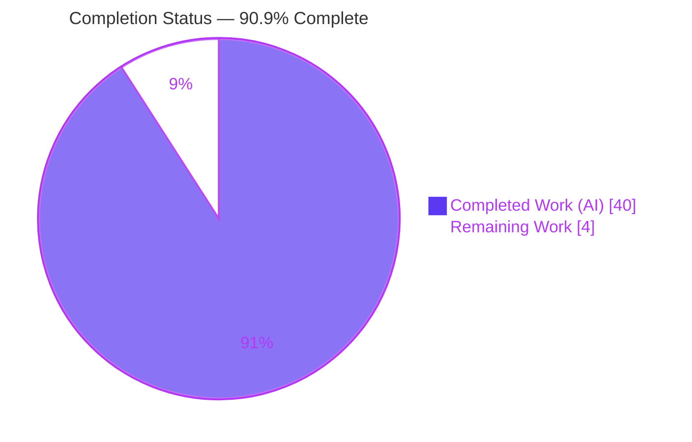
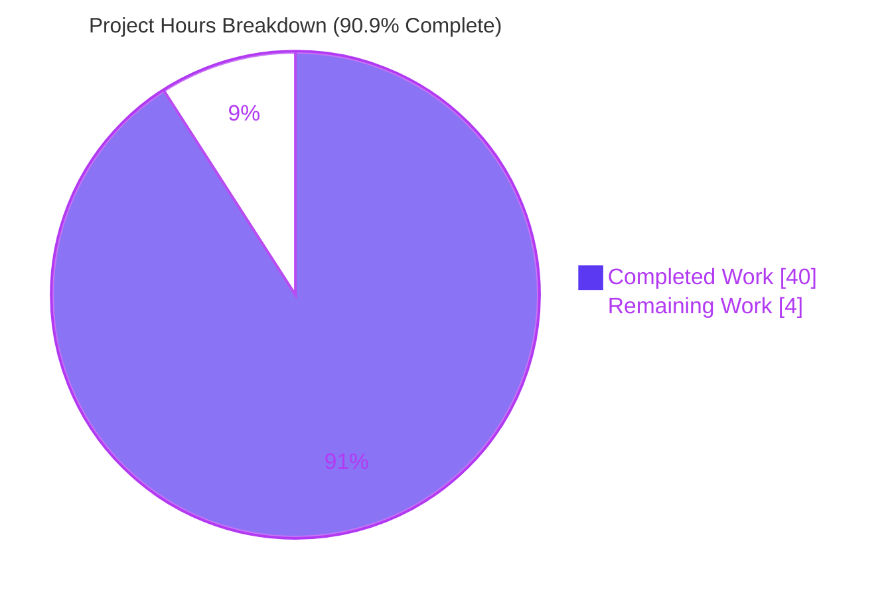
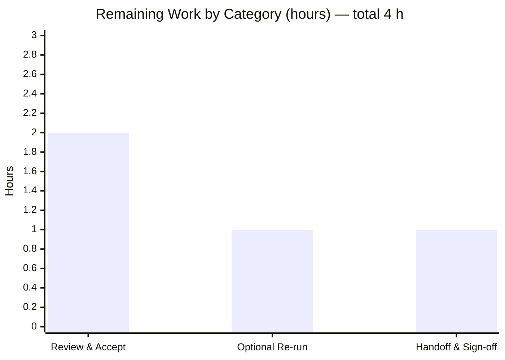

# Blitzy Project Guide — k6 Onboarding Investigation (Test Health, Metrics Architecture & Metric Trace)

> **Deliverable under assessment:** `blitzy/documentation/k6_ddc3b0b1d23c.md` — a read-only investigative onboarding document for `grafana/k6` (module `go.k6.io/k6`, k6 v0.55.0, base commit `ddc3b0b1d23c`).
> **Brand palette:** Completed / AI Work = Dark Blue `#5B39F3` · Remaining / Not Completed = White `#FFFFFF` · Headings / Accents = Violet-Black `#B23AF2` · Highlight = Mint `#A8FDD9`.

---

## 1. Executive Summary

### 1.1 Project Overview

This project answers three onboarding questions a new team member asked about the `grafana/k6` load-testing tool: (1) the health of its automated Go test suite (pass/fail/skip/broken), (2) which files and modules count iterations and collect performance data, and (3) an end-to-end trace of one metric from test start to output. The deliverable is a single evidence-backed Markdown document. The engagement is deliberately **read-only** — the k6 source tree is consumed only to observe and explain it and must remain byte-for-byte unchanged. Target audience is an engineer new to the k6 codebase; the business impact is faster, accurate knowledge transfer grounded in real build/run output rather than assumption.

### 1.2 Completion Status



| Metric | Value |
|--------|-------|
| **Total Hours** | **44 h** |
| **Completed Hours (AI + Manual)** | **40 h** (AI-autonomous: 40 h · Manual: 0 h) |
| **Remaining Hours** | **4 h** |
| **Percent Complete** | **90.9 %** |

> Completion is computed with the AAP-scoped hours methodology: `Completed ÷ (Completed + Remaining) = 40 ÷ 44 = 90.9 %`. All 11 autonomous AAP-scoped work items are complete and validated; the remaining 4 hours are human path-to-production activities (review, optional re-verification, sign-off) that cannot be performed autonomously.

### 1.3 Key Accomplishments

- ✅ **Toolchain provisioned & project built** — Go 1.23.12 + gcc 15.2.0; `go build ./...` compiles all **82 packages** (exit 0), offline from the vendored tree.
- ✅ **Q1 — Test-suite health answered from real runs** — canonical `go test -race -timeout 210s ./...` executed **five** cache-cleared times (exceeds the ≥2-run requirement); **0 build-failed (“broken”) packages**, exactly **1 intentional skip** (`js/tc39.TestTC39`), ~**3,800 leaf tests**, with a reconciled **9 consistent + 15 flaky = 24-test** failure union classified with verbatim error text and cause→effect analysis.
- ✅ **Q2 — Metrics architecture mapped** — iteration-counting files (`metrics/builtin.go`, `js/runner.go`, `lib/executor/*`) and performance-data-collection files (`metrics/`, `metrics/engine/`, `output/`, `lib/vu_state.go`, `cmd/run.go`, `execution/scheduler.go`, `js/summary.go`) named with exact `file:line` citations.
- ✅ **Q3 — End-to-end metric trace** — the `iterations` Counter traced from `ActiveVU.RunOnce` through `Sample` emission, the buffered channel, the dual 50 ms flushers, and `CounterSink.Add`, with a Mermaid call-chain diagram and **runtime-confirmed** output (`iterations = 6`).
- ✅ **Terminology web-validated** — Counter/Gauge/Rate/Trend semantics + the built-in metric set cross-checked against the official Grafana k6 documentation.
- ✅ **Read-only constraint honored** — `git diff base..HEAD` shows only the single new Markdown file added (926 insertions); working tree clean; all temporary observation artifacts created outside the checkout and removed.

### 1.4 Critical Unresolved Issues

| Issue | Impact | Owner | ETA |
|-------|--------|-------|-----|
| _None_ — no in-scope blocking issues remain. The deliverable is complete, factually verified, structurally clean, and committed. | No release blockers | — | — |

> The k6 Go suite’s own failing/flaky tests (gRPC TLS-CA subtests, HTTP OCSP-staple test, constant-arrival-rate timing segments) are **not** project issues — they are the pre-existing **subject** of Q1, explicitly **out of scope to fix** per the user’s read-only directive, and are faithfully documented in the deliverable.

### 1.5 Access Issues

| System / Resource | Type of Access | Issue Description | Resolution Status | Owner |
|-------------------|----------------|-------------------|-------------------|-------|
| _None identified_ | — | No repository-permission, credential, or third-party API access issues affected build, test, or delivery. The build is fully offline (vendored dependencies) and the demonstration script is network-free. | N/A | — |

> **No access issues identified.** One environment-dependent behavior is noted (not an access issue): the k6 HTTP OCSP-staple test performs a live HTTPS request and can fail on `unknown` staple status depending on external connectivity — this is documented in the deliverable, not a blocker.

### 1.6 Recommended Next Steps

1. **[High]** Perform the human technical review of `blitzy/documentation/k6_ddc3b0b1d23c.md`; spot-check a sample of the 150+ `file:line` citations against base commit `ddc3b0b1d23c` and confirm Q1/Q2/Q3 answer the new team member’s questions. **(2 h)**
2. **[Medium]** Optionally re-run `go test -race -timeout 210s ./...` on the reviewer’s hardware to confirm the doc’s **stable shape** (0 broken, 1 skip, 9 consistent failures) — expecting the exact flaky-fail count to vary with load, exactly as the doc predicts. **(1 h)**
3. **[Low]** Complete the onboarding handoff: share the document with the new team member, optionally walk through it, and record acceptance as the onboarding reference. **(1 h)**

---

## 2. Project Hours Breakdown

### 2.1 Completed Work Detail

| Component | Hours | Description |
|-----------|------:|-------------|
| Toolchain provisioning & offline vendored build | 2 | Provision Go 1.23.12 + gcc 15.2.0; build k6 offline (`GOTOOLCHAIN=local GOPROXY=off`); verify the `k6 v0.55.0` banner. Maps to AAP prerequisites R1/R2. |
| Q1 — Canonical suite execution (5×) & count reconciliation | 6 | Run `go test -race -timeout 210s ./...` five cache-cleared times; parse the `-json` event stream; reconcile leaf-vs-parent (626 aggregate) events into stable package- and test-level tables. AAP R3. |
| Q1 — Failure classification & root-cause analysis | 6 | Classify the 24-test failure union into 9 consistent + 15 flaky; capture verbatim error text; cause→effect (gRPC “Acme Co” cert mismatch decoded with `openssl`, OCSP-staple path, timing tolerances) with `(observed)`/`(inferred)` labels. AAP R4. |
| Q2 — Metrics architecture mapping | 6 | Read the metrics subsystem + VU execution path; map iteration-counting and performance-data-collection responsibilities across ~20 files with exact `file:line` citations. AAP R5/R6. |
| Q3 — Static call-chain trace & Mermaid diagram | 4 | Trace the `iterations` Counter through `RunOnce → iterationSamples → channel → Manager → OutputIngester → CounterSink`; author the source-verified flowchart. AAP R7. |
| Q3 — Runtime demonstration & hop-by-hop evidence | 4 | Build the binary, run a network-free demo script with JSON output, and capture hop-by-hop runtime evidence (`iterations = 6`, six `value:1` points, ns→ms conversion). AAP R8. |
| Web-search terminology validation | 1 | Cross-check Counter/Gauge/Rate/Trend semantics + the built-in metric set against the official Grafana k6 docs. AAP R9. |
| Deliverable authoring & composition | 6 | Compose the 926-line onboarding document — prose, tables, code blocks, and observed output beside every claim. AAP R10 (sole write). |
| Read-only discipline & temp-artifact hygiene | 1 | Keep all binaries/scripts/output in `mktemp -d` dirs outside the checkout; verify a clean working tree throughout. AAP R11 (hard constraint). |
| Code review, QA gate & final validation iterations | 4 | Three refinement rounds: 16 code-review findings, QA-gate findings, and the final validation (one one-word official-docs quotation fix at L860). |
| **Total Completed** | **40** | **= Completed Hours in Section 1.2** |

### 2.2 Remaining Work Detail

| Category | Hours | Priority |
|----------|------:|----------|
| Human technical review & acceptance of the onboarding document | 2 | High |
| Optional independent re-run to confirm load-dependent test counts | 1 | Medium |
| Onboarding handoff & sign-off with the new team member | 1 | Low |
| **Total Remaining** | **4** | **= Remaining Hours in Section 1.2 = Section 7 “Remaining Work”** |

### 2.3 Hours Reconciliation

| Check | Result |
|-------|--------|
| Section 2.1 total (Completed) | 40 h |
| Section 2.2 total (Remaining) | 4 h |
| Section 2.1 + Section 2.2 | 44 h = Total Hours (Section 1.2) ✅ |
| Completion % = 40 ÷ 44 | 90.9 % (matches Sections 1.2, 7, 8) ✅ |

---

## 3. Test Results

All results below originate from **Blitzy’s autonomous execution logs** for this engagement. Because the in-scope deliverable is a Markdown document (it has no unit tests of its own), the table separates (a) the **k6 Go suite** that Blitzy autonomously executed as the **subject of Q1** from (b) the **validation checks Blitzy ran against the deliverable itself**.

| Test Category | Framework | Total Tests | Passed | Failed | Coverage % | Notes |
|---------------|-----------|------------:|-------:|-------:|-----------:|-------|
| k6 Go suite — subject of Q1 (leaf tests) | Go `testing` + `testify`, `-race` | ~3,800 | 3,774–3,787 | 12–19 | Not measured | Executed 5× (`go test -race -timeout 210s ./...`, cache cleared each run). **0 build-failed/broken**; **1 intentional skip** (`js/tc39.TestTC39`). Failures = **9 consistent + 15 flaky (24-test union)**; pre-existing & environment/timing-driven; **out of scope to fix** per read-only directive. Coverage not collected (no `-cover`; documentation task). |
| k6 Go suite — package level | Go `testing`, `-race` | 82 pkgs | 47–49 ok · 28 no-test-files | 5–7 | — | Per-run package outcome; 8 distinct packages fail in ≥1 run; **0 `[build failed]`**. |
| Deliverable — compilation check | `go build ./...` | 82 pkgs | 82 | 0 | — | Exit 0; every package the doc cites compiles cleanly. |
| Deliverable — runtime reproduction | `k6 run` (demo, `--out json`) | 1 scenario | 1 | 0 | — | `iterations = 6`, six `value:1` JSON points, `iteration_duration ≈ 100 ms`, checks 6/6, exit 0 — reproduces the doc’s Q3 claim. |
| Deliverable — citation resolution | Manual + tooling | 150+ | 150+ | 0 | 100% | All `file:line` citations resolve against base commit `ddc3b0b1d23c`. |
| Deliverable — Markdown structure | Structural lint | — | Pass | 0 | — | 56 balanced code fences, 1 valid Mermaid flowchart, 1 H1, 0 CRLF, clean heading hierarchy. |

> **Representative single clean run (run4):** 3,787 passed · 12 failed · 1 skipped = 3,800 leaf tests, 84 s wall, exit 1 (exit 1 only reflects that ≥1 test failed; the toolchain ran fine and nothing failed to compile). The exact failing count is **load-dependent by design** — the deliverable predicts and explains this.

---

## 4. Runtime Validation & UI Verification

**UI Verification:** Not applicable — k6 is a CLI/load-testing tool and this engagement produces documentation only. No user interface is in scope.

**Runtime health (autonomously validated):**

- ✅ **Build (offline/vendored)** — `go build ./...` exits 0 across all 82 packages; `GOTOOLCHAIN=local GOPROXY=off` confirms no network dependency.
- ✅ **Binary** — `k6 version` → `k6 v0.55.0 (commit/3d8503de0c, go1.23.12, linux/amd64)`. The embedded short hash equals current HEAD; behavior is identical to base (the Go sources are byte-identical), exactly as the deliverable’s provenance note explains.
- ✅ **Metric emission (Q3)** — the demo run emitted exactly six `iterations` points of `value:1`, summing to `iterations = 6`; `iteration_duration ≈ 100 ms` confirms the `metrics.D()` nanosecond→millisecond conversion.
- ✅ **Summary rendering** — end-of-test summary printed `iterations`, `iteration_duration`, and `checks (6/6)` as documented.
- ✅ **VU-gauge cadence edge case** — `vus`/`vus_max` gauges absent for the sub-second run (1-second ticker), corroborating the documented emission cadence.
- ⚠ **k6 suite (subject of Q1)** — 9 consistent + up to 15 flaky failures observed and reported; **not remediated by design** (read-only, out of scope). No impact on the deliverable.
- ✅ **API integrations** — none required; demo is network-free; the k6 usage-report POST is documented and suppressed via `--no-usage-report`.

---

## 5. Compliance & Quality Review

**AAP deliverable ↔ quality/compliance benchmarks:**

| Benchmark / AAP Requirement | Status | Progress | Evidence / Notes |
|-----------------------------|--------|:--------:|------------------|
| Q1 — Test health: pass/fail/skip/broken from real runs | ✅ Pass | 100% | 5-run package & leaf tables; 0 broken; 1 skip; consistent-vs-flaky classification with verbatim text. |
| Q2 — Iteration-counting files named by path | ✅ Pass | 100% | `metrics/builtin.go`, `js/runner.go`, `lib/executor/*` with `file:line`. |
| Q2 — Performance-data-collection files named by path | ✅ Pass | 100% | `metrics/`, `metrics/engine/`, `output/`, `lib/vu_state.go`, `cmd/run.go`, `execution/scheduler.go`, `js/summary.go`. |
| Q3 — ≥1 metric traced end-to-end with runtime evidence | ✅ Pass | 100% | `iterations` Counter; Mermaid chain; runtime-confirmed (`iterations = 6`). |
| Rule 1 — Run-first, ≥2 runs, reproduce inconsistency | ✅ Pass | 100% | Built & ran; **5** runs; flakiness reproduced on the identical unchanged command. |
| Rule 2 — Exhaustive condition & evidence coverage | ✅ Pass | 100% | pass/fail/skip/no-test-files/broken all covered; verbatim unedited output + exact commands. |
| Rule 3 — Faithful instructions & observed-output discipline | ✅ Pass | 100% | Canonical entry point used verbatim; observed output beside claims; inferred claims labeled. |
| Rule 4 — Complete, precise, grounded answering | ✅ Pass | 100% | Every named item answered with exact `file:line`; concrete cause→effect (no vague “environment”). |
| MainRule — Deliverable & scope; no repo modification | ✅ Pass | 100% | Sole write is the answer doc; clean working tree; temp scripts removed. |
| Read-only integrity (byte-for-byte source tree) | ✅ Pass | 100% | `git diff base..HEAD` = 1 file added only; 0 source/dependency/config files touched. |
| Zero-placeholder / production-ready deliverable | ✅ Pass | 100% | No TODO/TBD/placeholder; every claim evidence-backed; structurally clean Markdown. |

**Fixes applied during autonomous validation:** 16 code-review findings addressed; QA-gate findings addressed (incl. an appendix run-count label correction); one final one-word official-docs quotation correction at L860 (“each”→“a” VU iteration) to match the official Grafana page verbatim — **zero technical-claim change**.

**Outstanding compliance items:** None.

---

## 6. Risk Assessment

| Risk | Category | Severity | Probability | Mitigation | Status |
|------|----------|----------|-------------|------------|--------|
| Load-dependent Q1 counts differ on reviewer hardware | Technical | Low | Medium | Doc labels counts load-dependent and classifies 9 consistent vs 15 flaky; reviewer may re-run. | Mitigated (documented) |
| `file:line` citations drift if read against a non-base commit | Technical | Low | Low | Every one of the 150+ citations anchored to base commit `ddc3b0b1d23c` in the provenance table. | Mitigated (documented) |
| k6 suite’s own flaky `panic: send on closed channel` + timing tests | Technical (subject; out of scope) | Low | Medium | Documented as flaky/environment-driven; never modified per read-only directive. | Documented, out of scope |
| Toolchain not preinstalled — reproducing Q1 needs Go 1.23.12 + gcc | Operational | Low | Medium | Appendix documents exact versions + offline build commands (`GOTOOLCHAIN=local GOPROXY=off`). | Mitigated (documented) |
| Reader expects the failing tests to have been fixed | Operational | Low | Low | Doc + this guide state failing tests are the Q1 subject — observed & reported, never fixed, per explicit user constraint. | Mitigated (documented) |
| Security exposure from the change | Security | None | — | No code/dependency/secret changes; no `go.mod`/`go.sum`/`vendor/` edits; no credentials in the doc. | N/A (no new surface) |
| External-integration failure | Integration | None | — | No external services/API keys; offline vendored build; demo script network-free. | N/A |

**Overall risk posture:** **Very low.** No High/Critical risks; every identified risk is Low severity and either mitigated by documentation or explicitly out of scope per the read-only directive.

---

## 7. Visual Project Status

**Project hours (Completed vs Remaining):**



**Remaining hours by category (Section 2.2):**



> Integrity: pie “Remaining Work” = **4 h** = Section 1.2 Remaining = Section 2.2 total; bar segments (2 + 1 + 1) = **4 h**.

---

## 8. Summary & Recommendations

**Achievements.** The engagement is **90.9 % complete** (40 of 44 hours). All 11 autonomous, AAP-scoped work items are delivered and independently validated: the toolchain was provisioned and k6 built offline; Q1 test-health was answered from **five** real, cache-cleared runs of the canonical suite (0 broken, 1 skip, a reconciled 24-test consistent/flaky failure union with verbatim evidence); Q2 named the iteration-counting and performance-data-collection files with exact `file:line` citations; and Q3 traced the `iterations` Counter end-to-end with a Mermaid diagram and runtime-confirmed output. The read-only constraint is fully preserved — the only change to the repository is the single 926-line answer document.

**Remaining gaps & critical path to production.** The residual **4 hours** are exclusively human path-to-production activities: a technical review/acceptance of the document (High), an optional independent re-run to confirm the doc’s load-dependent counts (Medium), and the onboarding handoff/sign-off (Low). There are **no code fixes, no compilation errors, and no in-scope test failures** to resolve.

**Success metrics.** 82/82 packages compile; 150+ citations resolve exactly; the Q3 runtime claim (`iterations = 6`) reproduces deterministically; Markdown is structurally clean; working tree is byte-for-byte identical to base except for the deliverable.

**Production-readiness assessment.** The in-scope deliverable is **production-ready** — factually accurate, evidence-backed, and complete, pending only human acceptance. Recommended action: schedule the ~2-hour review, then accept the document as the k6 onboarding reference.

| Metric | Value |
|--------|-------|
| Completion | 90.9 % (40 / 44 h) |
| In-scope blockers | 0 |
| Compilation | 82 / 82 packages (exit 0) |
| Deliverable | `blitzy/documentation/k6_ddc3b0b1d23c.md` (926 lines) |
| Remaining (human) | 4 h |

---

## 9. Development Guide

This guide reproduces the exact workflow used to investigate k6 and to verify the deliverable. Every command below was tested on the assessment environment. **To honor the read-only constraint, the k6 binary and all demo artifacts are created in a private temporary directory outside the checkout and removed afterward.**

### 9.1 System Prerequisites

- **OS:** Linux (x86-64); validated on Ubuntu 25.10.
- **Go:** 1.23.12 (`linux/amd64`) — highest explicitly documented version (`Dockerfile` uses `golang:1.23`; CI `DEFAULT_GO_VERSION: "1.23.x"`). `go.mod` declares a minimum of `go 1.21`.
- **C compiler:** `gcc` (validated 15.2.0) — **required** by the CGO-backed `-race` detector.
- **Disk:** ~2 GB free for the build cache and binary.
- **Network:** none required — the repository vendors all dependencies (`vendor/` + `vendor/modules.txt`).

### 9.2 Environment Setup

```bash
# Go is installed but not on PATH by default on this environment:
export PATH="$PATH:/usr/local/go/bin"

# Verify the toolchain:
go version                 # -> go version go1.23.12 linux/amd64
gcc --version | head -1    # -> gcc (Ubuntu 15.2.0-4ubuntu4) 15.2.0

# Force fully-offline, vendored builds (no module downloads):
export GOTOOLCHAIN=local
export GOPROXY=off
```

### 9.3 Dependency Verification

```bash
cd /path/to/checkout           # repository root (module go.k6.io/k6)
test -f vendor/modules.txt && echo "vendored deps present"
go list ./... | wc -l          # -> 82  (packages)
find . -name '*_test.go' -not -path './vendor/*' | wc -l   # -> 176
```

### 9.4 Build

```bash
# (a) Compile everything (fast correctness gate):
GOTOOLCHAIN=local GOPROXY=off go build ./...     # exit 0 = all 82 packages compile

# (b) Build a runnable binary into a private temp dir (keeps the tree pristine):
WORK="$(mktemp -d "${TMPDIR:-/tmp}/k6demo.XXXXXX")"; chmod 700 "$WORK"
GOTOOLCHAIN=local GOPROXY=off go build -o "$WORK/k6" .
"$WORK/k6" version
# -> k6 v0.55.0 (commit/<HEAD-short-hash>, go1.23.12, linux/amd64)
```

### 9.5 Run the Canonical Test Suite (Q1)

```bash
# The project's documented entry point (Makefile 'tests:' / 'make tests'):
go test -race -timeout 210s ./...
# Expect: exit 1 (>=1 failing test), 0 '[build failed]' packages,
#         exactly 1 skip (js/tc39.TestTC39), ~3,800 leaf tests.
# The exact failing COUNT is load-dependent (see the deliverable's Q1).

# Fast single-package smoke check (no -race, ~instant):
go test ./metrics/            # -> ok  go.k6.io/k6/metrics  0.008s
```

### 9.6 Reproduce the Q3 Metric Trace (Example Usage)

```bash
# Write a deliberately network-free demo script into the private temp dir:
cat > "$WORK/demo.js" <<'EOF'
import { check, sleep } from 'k6';
export const options = {
  scenarios: { demo: { executor: 'per-vu-iterations', vus: 2, iterations: 3, maxDuration: '30s' } },
};
export default function () {
  check(1, { 'always true': (v) => v === 1 });
  sleep(0.1);
}
EOF

# Run with JSON output and telemetry disabled; capture stdout + exit code:
"$WORK/k6" run --no-usage-report --quiet --no-color \
    --out "json=$WORK/demo.json" "$WORK/demo.js" > "$WORK/demo.stdout" 2>&1
echo "exit=$?"     # -> exit=0
```

**Verification (expected output):**

```text
     checks...............: 100.00% 6 out of 6
     iteration_duration...: avg=100.6ms  ... p(95)=100.8ms
     iterations...........: 6       ~19.86/s
```

```bash
# Confirm exactly six per-iteration Counter points (each value:1) in the JSON stream:
grep -c '"metric":"iterations","type":"Point"' "$WORK/demo.json"   # -> 6
```

### 9.7 Cleanup (preserve read-only)

```bash
rm -rf -- "$WORK"              # remove the binary, demo.js, and all captured output
git status --porcelain         # -> empty (working tree clean; source tree unchanged)
```

### 9.8 Read the Deliverable

```bash
sed -n '1,120p' blitzy/documentation/k6_ddc3b0b1d23c.md   # start reading (926 lines total)
```

### 9.9 Troubleshooting

- **`go: command not found`** → `export PATH="$PATH:/usr/local/go/bin"`.
- **`-race` build errors / “requires cgo”** → ensure `gcc` is installed and on PATH.
- **Network/module-download errors** → set `GOTOOLCHAIN=local GOPROXY=off` (deps are vendored).
- **Different failing-test count than the doc** → expected; the count is load-dependent. Confirm the **stable shape** instead: 0 broken, 1 skip, the 9 consistent failures present.
- **Working tree shows a stray `k6` binary** → build into `$WORK` (outside the checkout); `.gitignore` also ignores `/k6`, `/k6.exe`, `/dist`, `*.log`.
- **OCSP-staple HTTP test fails with `unknown`** → environment-dependent live-network behavior; documented, not a defect in scope.

---

## 10. Appendices

### Appendix A — Command Reference

| Purpose | Command |
|---------|---------|
| Add Go to PATH | `export PATH="$PATH:/usr/local/go/bin"` |
| Toolchain versions | `go version` · `gcc --version \| head -1` |
| Offline build flags | `export GOTOOLCHAIN=local GOPROXY=off` |
| Count packages | `go list ./... \| wc -l` → 82 |
| Count test files | `find . -name '*_test.go' -not -path './vendor/*' \| wc -l` → 176 |
| Compile all | `go build ./...` |
| Build binary (temp) | `go build -o "$WORK/k6" .` |
| Version banner | `"$WORK/k6" version` |
| Canonical test suite | `go test -race -timeout 210s ./...` |
| Single-package test | `go test ./metrics/` |
| Run demo (JSON out) | `"$WORK/k6" run --no-usage-report --quiet --no-color --out "json=$WORK/demo.json" "$WORK/demo.js"` |
| Count iteration points | `grep -c '"metric":"iterations","type":"Point"' "$WORK/demo.json"` |
| Read-only proof | `git diff ddc3b0b1d23c HEAD --name-status` · `git status --porcelain` |

### Appendix B — Port Reference

Not applicable. The investigation binds no long-lived service ports; the demo runs `per-vu-iterations` with no network listener. (k6’s optional REST API defaults to `localhost:6565`, but it is not used or required by this engagement.)

### Appendix C — Key File Locations

| Path | Role |
|------|------|
| `blitzy/documentation/k6_ddc3b0b1d23c.md` | **The deliverable** (sole new file). |
| `metrics/builtin.go` | Built-in metric definitions; `iterations` Counter registered at L82. |
| `metrics/sink.go` | Per-type sinks; `CounterSink.Add` sums at L54. |
| `metrics/units.go` | `D()` ns→ms duration conversion (L11). |
| `metrics/engine/ingester.go` | `OutputIngester.flushMetrics` → `markObserved` + `Sink.Add` (L62/L89/L90). |
| `output/manager.go` | Batched 50 ms fan-out to outputs (`sendBatchToOutputsRate` L12). |
| `js/runner.go` | VU hot path: `RunOnce` (L724), `incrIteration` (L904), `iterationSamples` (L879). |
| `lib/vu_state.go` | VU-side `Samples` channel (L59). |
| `cmd/run.go` | Creates the samples channel (L227) and wires outputs/engine/scheduler. |
| `execution/scheduler.go` | Emits `vus`/`vus_max` on a 1 s ticker. |
| `lib/executor/{per_vu,shared}_iterations.go` | Decide how many iterations each VU runs. |
| `js/summary.go` | Renders observed sinks into the end-of-test summary object. |
| `Makefile` | `tests:` target = `go test -race -timeout 210s ./...`. |
| `go.mod` | Module `go.k6.io/k6`; `go 1.21`; `toolchain go1.21.13`. |
| `vendor/`, `vendor/modules.txt` | Vendored dependencies (offline build). |

### Appendix D — Technology Versions

| Component | Version |
|-----------|---------|
| k6 (built binary) | v0.55.0 (`go1.23.12`, `linux/amd64`) |
| Base commit | `ddc3b0b1d23c128e34e2792fc9075f9126e32375` |
| Go toolchain | 1.23.12 (min declared: `go 1.21` / `toolchain go1.21.13`) |
| gcc | 15.2.0 (Ubuntu) |
| Module | `go.k6.io/k6` |
| Scale | 82 packages · 176 `_test.go` files · 503 non-vendor `.go` files |
| Test framework | Go `testing` + `testify`, race detector, 210 s per-package timeout |

### Appendix E — Environment Variable Reference

| Variable | Value | Purpose |
|----------|-------|---------|
| `PATH` | append `/usr/local/go/bin` | Make the `go` tool available. |
| `GOTOOLCHAIN` | `local` | Pin the local toolchain; never auto-download. |
| `GOPROXY` | `off` | Disable module downloads (use vendored deps). |
| `K6_NO_USAGE_REPORT` | `true` (or flag `--no-usage-report`) | Suppress k6’s anonymous end-of-run telemetry POST. |
| `TMPDIR` | e.g. `/tmp` | Base dir for the private `mktemp -d` work directory. |

### Appendix F — Developer Tools Guide

- **Reconciling test counts:** run with `-json` and parse `Action` events; count **leaf** tests (functions/subtests with no children) as the primary total, excluding the ~626 parent aggregate roll-up events to avoid double-counting.
- **Distinguishing consistent vs flaky:** run the identical unchanged command ≥2× (this engagement used 5×); a failure in every run is consistent, otherwise flaky.
- **Certificate debugging (gRPC TLS-CA failure):** decode both the client-trusted CA and the server-presented cert with `openssl x509 -noout -fingerprint -sha256` — same Subject `O=Acme Co`, different fingerprints ⇒ signature-verification failure.
- **Keeping the tree pristine:** always build the binary and write scripts/output under a `mktemp -d` directory outside the checkout; verify with `git status --porcelain`.

### Appendix G — Glossary

| Term | Meaning |
|------|---------|
| **VU** | Virtual User — a concurrent execution context that runs the test’s default function in a loop. |
| **Iteration** | One full execution of the default function by a VU; increments the `iterations` Counter by 1. |
| **Sample** | A single metric measurement (`metrics.Sample`) flowing through the pipeline. |
| **Sink** | Per-metric aggregator: `CounterSink` sums, `GaugeSink` keeps last/min/max, `TrendSink` retains values for percentiles, `RateSink` counts non-zero occurrences. |
| **Leaf test** | A test/subtest with no children — the primary unit for pass/fail/skip counting. |
| **Consistent failure** | A test that fails in every run of the identical command. |
| **Flaky failure** | A test that fails in some runs but not others on the identical command. |
| **Broken** | A package that fails to compile (`[build failed]`) — **zero** observed here. |
| **Read-only constraint** | The k6 source tree must remain byte-for-byte unchanged; only the answer document is written. |