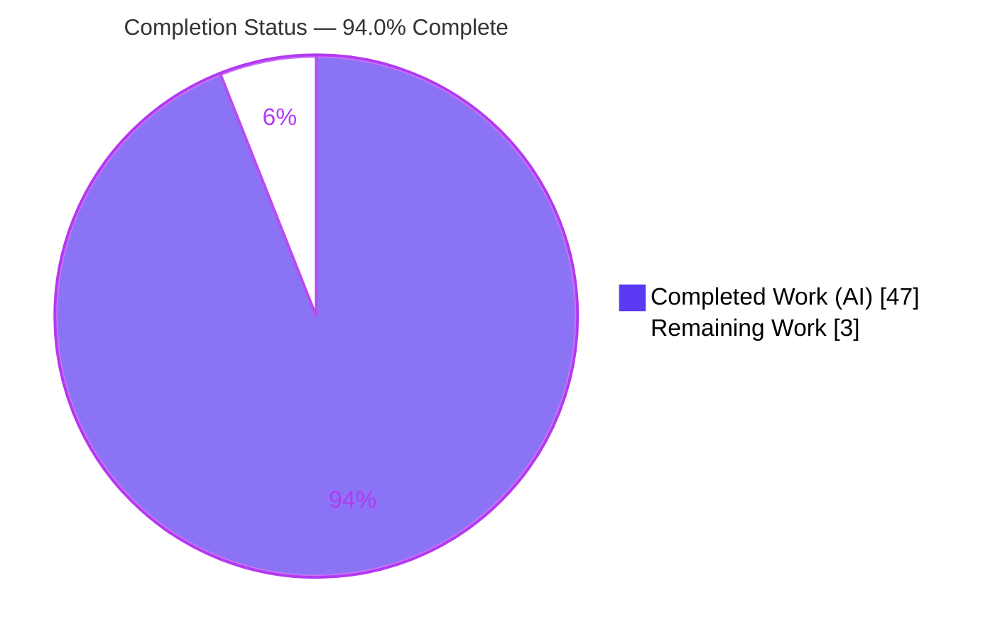
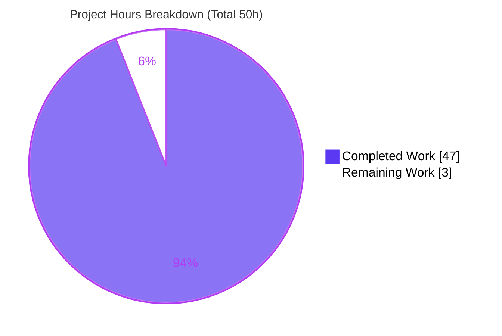
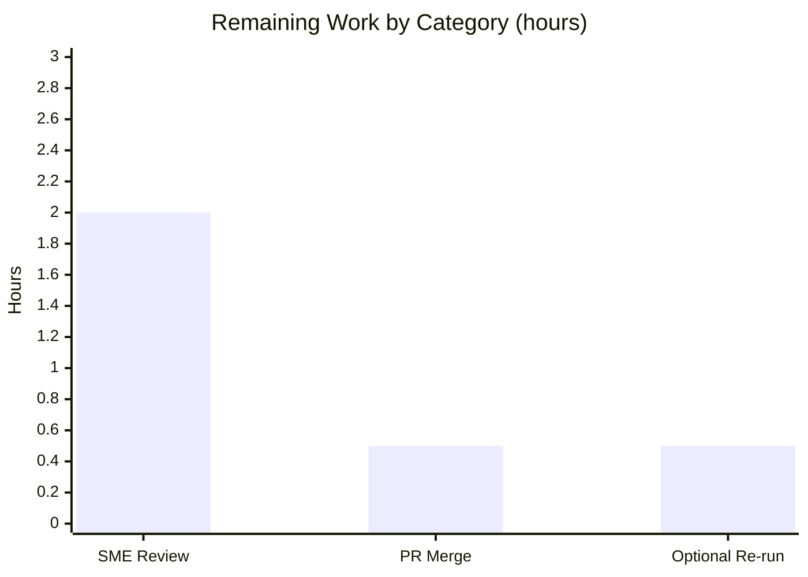

# Blitzy Project Guide — Grafana k6 Runtime-Behavior Investigation

> Engine under investigation: **`go.k6.io/k6` v0.55.0** · Branch `k6_ddc3b0b1d23c` @ baseline `ddc3b0b1d` · Deliverable: `blitzy/documentation/k6_ddc3b0b1d23c.md`

---

## 1. Executive Summary

### 1.1 Project Overview

This project investigates the internal runtime orchestration of the **Grafana k6** load-testing engine (`go.k6.io/k6` v0.55.0) and delivers a single, evidence-backed Markdown report that answers five precise runtime-behavior questions. The target audience is k6 engineers, SREs, and performance teams who need authoritative answers — grounded in source code and proven with captured runtime output — on VU lifecycle under interruption, gRPC server-streaming behavior, dropped-iteration accounting via the REST API, file data-sharing memory footprint, and Prometheus remote-write name integrity. The k6 source tree is treated strictly as read-only evidence; the only artifact produced is `blitzy/documentation/k6_ddc3b0b1d23c.md`. Business impact: a reusable, citable knowledge reference that de-risks operating k6 under interruption, capacity-exhaustion, and large-data scenarios.

### 1.2 Completion Status

**Project is 94.0% complete** (47 of 50 hours delivered). The single in-scope deliverable is authored, committed, and independently validated; all five investigation objectives were reproduced at runtime. The only remaining work is the inherent human review and merge.



| Metric | Hours |
|--------|-------|
| **Total Hours** | **50** |
| **Completed Hours (AI + Manual)** | **47** (47 AI + 0 Manual) |
| **Remaining Hours** | **3** |
| **Percent Complete** | **94.0%** |

> Color key — **Completed = Dark Blue `#5B39F3`**, **Remaining = White `#FFFFFF`**.

### 1.3 Key Accomplishments

- ✅ Built `k6 v0.55.0` **offline** from the committed `vendor/` tree, **out-of-tree** (binary at `/tmp/k6bin/k6`), leaving the source tree byte-for-byte unchanged.
- ✅ **Q1 — SIGINT / ramping-vus:** captured the exact abort log sequence (`DEBUG "Stopping k6 in response to signal..." sig=interrupt` → final `ERROR "test run was aborted..."`), exit code **105**, and proved active VUs are **terminated mid-execution** (6 iteration starts, 1 truncated end).
- ✅ **Q2 — gRPC server-streaming (`gracefulRampDown: '30ms'`):** captured the interruption logs and reported **`grpc_streams_msgs_received = 235`** (`grpc_streams = 5`, `grpc_streams_msgs_sent = 5`, `on('error')` fired 0 times).
- ✅ **Q3 — `dropped_iterations` via REST API:** obtained **`count: 85`** from `GET /v1/metrics/dropped_iterations` (with `--linger`), proven by the raw JSON envelope plus negative controls (no-`--linger` → connection refused; bogus id → `404`).
- ✅ **Q4 — file data-sharing memory:** proved `SharedArray` stays flat (~214/220/224 MB) while `open()` grows linearly (~257/5,583/19,204 MB ≈ 95 MB/VU) across 1/50/200 VUs, with the root cause traced to the single shared store vs the per-VU copy.
- ✅ **Q5 — Prometheus remote-write name integrity:** decoded the snappy/protobuf payload with a standalone receiver and confirmed intact `__name__` labels (`k6_my_custom_counter_total`, `k6_my_custom_trend_p99`, + built-ins).
- ✅ Every `file:Lxx` code citation verified against the source; all temporary artifacts cleaned up; final `git status --porcelain` empty.
- ✅ Code-review findings (F1–F6) addressed in a second commit; deliverable internally consistent.

### 1.4 Critical Unresolved Issues

No release-blocking issues were identified. The deliverable is complete, committed, and validated.

| Issue | Impact | Owner | ETA |
|-------|--------|-------|-----|
| _None — no unresolved issue blocks release or validation_ | N/A | N/A | N/A |
| (Informational) Timing-dependent metric values (Q1 truncation point, Q2 received count, Q4 exact RSS kB) vary per run | Low — already disclosed in the report; deterministic shapes are stable | Reviewer (awareness only) | N/A |

### 1.5 Access Issues

**No access issues identified.** The k6 source was fully accessible, the build is fully offline against the committed `vendor/` tree (no registry credentials required), and the REST control API and example gRPC server run on localhost with no external authentication.

| System / Resource | Type of Access | Issue Description | Resolution Status | Owner |
|-------------------|----------------|-------------------|-------------------|-------|
| k6 source repository | Read | None — fully accessible | ✅ Resolved | — |
| Go module proxy / registry | Build-time | Not required — offline `-mod=vendor` build | ✅ Not needed | — |
| k6 REST API (`localhost:6565`) | Local HTTP | None — no auth by default | ✅ Resolved | — |

### 1.6 Recommended Next Steps

1. **[High]** Perform an SME technical review of `blitzy/documentation/k6_ddc3b0b1d23c.md` — confirm the five answers are accurate, spot-check code citations, and verify the captured evidence is internally consistent. _(~2h)_
2. **[Medium]** Approve the pull request and merge the report into the target documentation set; confirm the working tree remains clean (only the `.md` added). _(~0.5h)_
3. **[Low]** _(Optional)_ Re-run one or two timing-dependent experiments (Q1 / Q2 / Q4) using Section 9 to confirm the deterministic **shapes** hold in your environment, accepting that exact values vary as the report discloses. _(~0.5h)_

---

## 2. Project Hours Breakdown

### 2.1 Completed Work Detail

All completed work was performed autonomously (AI). Each component traces to a specific AAP requirement.

| Component | Hours | Description |
|-----------|------:|-------------|
| Runtime foundation — toolchain & offline build | 5 | Provisioned Go (go1.23.4 at `/usr/local/go`), built `k6 v0.55.0` out-of-tree with `GOTOOLCHAIN=local GOFLAGS=-mod=vendor`, verified version string; kept source tree unchanged. |
| Q1 — SIGINT / `ramping-vus` VU lifecycle | 5 | Traced the signal path across `cmd/common.go`, `cmd/run.go`, `lib/executor/vu_handle.go`, `js/runner.go`, `js/modules/k6/k6.go`; authored a 6-VU ramping script; sent SIGINT mid-run with `-v`; captured the transcript; proved mid-execution termination (exit 105). |
| Q2 — gRPC server-streaming interruption | 6 | Built the `examples/grpc_server` example out-of-tree (`-mod=mod`) from a `/tmp` copy with `go.mod`/`go.sum` backup-and-restore; authored a server-streaming script with `gracefulRampDown: '30ms'`; interrupted it; captured abort logs and `grpc_streams_msgs_received = 235`. |
| Q3 — `dropped_iterations` via REST API | 4 | Designed a `shared-iterations` run that overflows `maxDuration`; discovered the `--linger` requirement; queried `GET /v1/metrics/dropped_iterations` → `count: 85`; added negative controls and summary cross-check. |
| Q4 — `SharedArray` vs `open()` memory footprint | 7 | Generated a ~13.8 MB JSON fixture; authored both scripts; swept VU counts 1/50/200 measuring peak RSS via `/proc/<pid>/status VmHWM`; built the comparison table; traced the root cause across 4 source files; corroborated with official Grafana docs. |
| Q5 — Prometheus remote-write name integrity | 6 | Ran the `experimental-prometheus-rw` output against a standalone Go remote-write receiver (snappy + protobuf decode); enumerated `__name__` labels; traced name mapping/suffixing across 4 vendored files. |
| Report authoring & synthesis | 8 | Authored the 848-line Markdown report: introduction, build method, methodology, TOC; Q1–Q5 each with captured output, code excerpts, citations, and a concluding answer; summary-of-values table; cleanup section; final verification. |
| Repository integrity verification & cleanup | 3 | Re-verified all citations; confirmed `git status --porcelain` empty; verified `go.mod`/`go.sum` SHA-256 and `vendor/` unchanged; removed all `/tmp` artifacts. |
| Code-review remediation (F1–F6) | 3 | Addressed six code-review findings in commit `2cdf5c0c2` to improve accuracy and internal consistency. |
| **Total Completed** | **47** | **Matches Completed Hours in Section 1.2.** |

### 2.2 Remaining Work Detail

Each remaining item is path-to-production for a knowledge document (human review and merge). No code, build, or test remediation remains.

| Category | Hours | Priority |
|----------|------:|----------|
| SME technical review of report accuracy & publication readiness | 2.0 | High |
| PR approval & merge of documentation into target branch | 0.5 | Medium |
| Optional spot re-run of timing-dependent experiments (reviewer's environment) | 0.5 | Low |
| **Total Remaining** | **3.0** | — |

> **Cross-section check:** Section 2.2 total (**3.0h**) equals the Remaining Hours in Section 1.2 and the "Remaining Work" value in the Section 7 pie chart.

### 2.3 Total Project Hours & Completion Calculation

The completion percentage is computed exclusively from AAP-scoped and path-to-production hours (PA1 methodology):

```
Completed Hours          = 47   (Section 2.1 total)
Remaining Hours          =  3   (Section 2.2 total)
Total Project Hours      = 47 + 3 = 50
Completion Percentage    = 47 / 50 × 100 = 94.0%
```

- **Section 2.1 + Section 2.2 = 47 + 3 = 50** = Total Hours in Section 1.2 ✅
- **Confidence: High** — a well-defined documentation deliverable, fully delivered and validated; remaining hours are the inherent human review/merge.

---

## 3. Test Results

For this documentation deliverable, "tests" are the **runtime experiment reproductions** and **verification gates** executed by Blitzy's autonomous validation systems (and independently re-confirmed during this assessment). All results below originate from Blitzy's autonomous validation logs for this project.

| Test Category | Framework / Method | Total Tests | Passed | Failed | Coverage % | Notes |
|---------------|--------------------|------------:|-------:|-------:|-----------:|-------|
| Runtime experiment reproduction | `k6 v0.55.0` runtime + shell harness | 5 | 5 | 0 | 100% | Q1 (SIGINT lifecycle), Q2 (gRPC streaming), Q3 (dropped_iterations API), Q4 (memory footprint), Q5 (Prometheus name integrity) — all reproduced. |
| Build / compilation | `go build` (offline, `-mod=vendor`) | 1 | 1 | 0 | 100% | Produced `k6 v0.55.0`; the gRPC example and Prometheus RW receiver also built offline. |
| Code-citation verification | Manual review vs source (24 files) | 24 | 24 | 0 | 100% | Every `file:Lxx` citation across Q1–Q5 verified against the committed source; no discrepancies. |
| Repository integrity | `git` + SHA-256 | 3 | 3 | 0 | 100% | `git status --porcelain` empty; net diff = only the `.md`; `go.mod`/`go.sum`/`vendor/` byte-for-byte unchanged. |
| **Totals** | — | **33** | **33** | **0** | **100%** | **No failures across any validation gate.** |

**Determinism notes (carried verbatim from the report's evidence):**
- Deterministic results: Q1 exit code 105 and mid-iteration termination; Q3 `count: 85`; Q5 `__name__` integrity; Q4 flat-vs-linear shape.
- Timing-dependent results (run parameters reported alongside): Q2 `grpc_streams_msgs_received` (observed **235**); Q1 exact iteration-truncation point; Q4 exact RSS in kB.

> **Out-of-scope note:** Blitzy's setup log recorded one pre-existing **source** test flake — `js/modules/k6/http TestRequestAndBatchTLS/ocsp_stapled_good` (a live-network OCSP-stapling fragility, not a code defect). It is unrelated to all five questions and lives in a read-only file the governing constraint forbids modifying; it has no bearing on this deliverable.

---

## 4. Runtime Validation & UI Verification

**Runtime health and behavior verification** (status: ✅ Operational | ⚠ Partial | ❌ Failing):

- ✅ **k6 binary build & run** — offline vendored build → `k6 v0.55.0 (commit/2cdf5c0c22, go1.23.4, linux/amd64)`; functional smoke run completed 1 iteration.
- ✅ **Q1 SIGINT lifecycle** — abort log sequence reproduced verbatim; exit 105; mid-execution termination confirmed.
- ✅ **Q2 gRPC server-streaming interruption** — abort logs reproduced; `grpc_streams_msgs_received = 235`; `on('error')` = 0; exit 105.
- ✅ **Q3 REST control API** — `GET /v1/metrics/dropped_iterations` on `localhost:6565` returned `count: 85`; negative controls behaved as documented.
- ✅ **Q4 memory footprint** — SharedArray flat vs `open()` linear growth reproduced across 1/50/200 VUs.
- ✅ **Q5 Prometheus remote-write** — payload decoded by a standalone receiver; `__name__` labels intact.
- ✅ **Report integrity** — 848-line Markdown renders with intact structure (Intro + Q1–Q5 + Reproducibility/cleanup); internal cross-references consistent.

**UI verification:** ⚠ **Not applicable** — k6 is a command-line engine and the deliverable is a Markdown report; there is no graphical user interface in scope. No Figma frames or design system were provided (AAP §0.9), so no visual-fidelity work applies.

---

## 5. Compliance & Quality Review

Cross-mapping of AAP deliverables and governing rules to their validation status. Progress: ▰▰▰▰▰ = complete.

| AAP Deliverable / Rule | Benchmark | Status | Progress |
|------------------------|-----------|--------|----------|
| Single deliverable named after source branch, in `blitzy/documentation` | `k6_ddc3b0b1d23c.md` present & committed | ✅ Pass | ▰▰▰▰▰ |
| All five questions comprehensively answered | Q1–Q5 each fully answered | ✅ Pass | ▰▰▰▰▰ |
| Build & run source to analyze behavior | k6 built offline; all experiments executed | ✅ Pass | ▰▰▰▰▰ |
| Answers grounded in code as source of truth | Every claim carries a verified `file:Lxx` citation | ✅ Pass | ▰▰▰▰▰ |
| Real captured runtime evidence (not asserted) | Logs, metrics, curl JSON, RSS table, decoded names captured | ✅ Pass | ▰▰▰▰▰ |
| Rationale provided behind each answer | Each Q has a code-level root-cause section | ✅ Pass | ▰▰▰▰▰ |
| Web-search corroboration (Q4 SharedArray model) | 3 official Grafana doc references cited | ✅ Pass | ▰▰▰▰▰ |
| No modification to source/config/test/vendor | `git diff` = only the `.md`; manifests & `vendor/` unchanged | ✅ Pass | ▰▰▰▰▰ |
| Temporary artifacts cleaned; tree verified clean | `git status --porcelain` empty | ✅ Pass | ▰▰▰▰▰ |
| Human SME review & publication | Pending reviewer sign-off | ⬜ Open | ▱▱▱▱▱ |

**Fixes applied during autonomous validation:** Code-review findings **F1–F6** were addressed in commit `2cdf5c0c2` (accuracy and internal-consistency corrections to the report). No source files were modified, consistent with the governing constraint.

**Outstanding compliance items:** Only the human SME review/merge remains (path-to-production).

---

## 6. Risk Assessment

Overall risk posture is **Low**. The deliverable adds zero code, dependencies, or services to the repository — there is no new runtime attack surface. Risks are confined to reproducibility nuances and timing-dependent values, all already disclosed within the report.

| Risk | Category | Severity | Probability | Mitigation | Status |
|------|----------|----------|-------------|------------|--------|
| Timing-dependent values differ on re-run (Q1 truncation, Q2 received=235, Q4 exact RSS) | Technical | Low | High | Report explicitly labels these "timing-dependent"/"exact kB varies" and reports run parameters; deterministic shapes (exit 105, flat-vs-linear, count:85, name integrity) are stable | Mitigated / Disclosed |
| Rebuild VCS commit-stamp differs from doc baseline (HEAD `2cdf5c0c2` vs `ddc3b0b1d2`) | Technical | Low | Medium | Report decouples source commit from build stamp; `git diff ddc3b0b1d..HEAD` proves only the `.md` was added — compiled behavior is identical | Mitigated |
| Reproducibility depends on environment tooling/fallbacks (Go path; `snappy` & `/usr/bin/time` absent) | Operational | Low | Medium | Report documents exact offline build, `/proc/<pid>/status VmHWM` RSS method, and the standalone Go remote-write receiver | Mitigated |
| gRPC example build (`-mod=mod`) could mutate `go.mod`/`go.sum` if run in place | Integration | Low | Low | Report mandates building from a `/tmp` copy with manifest backup/restore and post-verifies SHA-256 unchanged | Mitigated |
| Q5 receiver fetches `golang/snappy` into a throwaway module (needs network at re-run) | Integration | Low | Low | Original run captured decoded evidence; an offline re-run can substitute a Python protobuf decoder | Open (minor) |
| No new security surface introduced | Security | None | N/A | Deliverable adds no code/deps/services; references k6's own default no-auth REST API only | N/A |
| Pre-existing out-of-scope source test flake (`http` OCSP-stapling) | Operational | Low | N/A | Live-network fragility, not a code defect; out of scope and read-only per constraint; flagged for awareness | Acknowledged / Out of scope |

---

## 7. Visual Project Status

**Project hours — completed vs remaining** (Completed = Dark Blue `#5B39F3`, Remaining = White `#FFFFFF`):



**Remaining hours by category** (from Section 2.2 — sums to 3.0h):



> **Integrity check:** pie "Remaining Work" (**3**) = Section 1.2 Remaining (**3h**) = Section 2.2 sum (**3.0h**); pie "Completed Work" (**47**) = Section 1.2 Completed (**47h**). Total = **50h**.

---

## 8. Summary & Recommendations

**Achievements.** The investigation is **94.0% complete** (47 of 50 hours). All five runtime-behavior objectives were answered with captured evidence and code-level rationale, consolidated into a single 848-line report (`blitzy/documentation/k6_ddc3b0b1d23c.md`). k6 v0.55.0 was built offline from the vendored tree, every experiment was executed against that binary, and every `file:Lxx` citation was verified. Blitzy's autonomous validation reproduced all five experiments (5/5), confirmed all citations, and verified the source tree is byte-for-byte unchanged.

**Remaining gaps.** The only outstanding work is **3 hours** of inherent path-to-production effort: human SME review of the report (2h), PR approval & merge (0.5h), and an optional re-run of timing-dependent experiments (0.5h). There are no compilation errors, no failing tests, no missing functionality, and no configuration/integration tasks — because the deliverable adds no code.

**Critical path to production.** SME review → merge. Both are low-effort and unblocked.

**Production readiness.** The deliverable is **ready for review and publication**. It satisfies every AAP requirement and governing constraint, is internally consistent, and was independently validated. The two material risks (timing-dependent values; rebuild commit-stamp nuance) are Low severity and are already disclosed within the report itself.

| Success Metric | Target | Actual | Status |
|----------------|--------|--------|--------|
| Questions answered with captured evidence | 5 | 5 | ✅ |
| Experiments reproduced by validation | 5 | 5 | ✅ |
| Code citations verified | 100% | 100% | ✅ |
| Source tree unchanged (byte-for-byte) | Yes | Yes | ✅ |
| Release-blocking issues | 0 | 0 | ✅ |
| Completion | — | 94.0% | ✅ |

---

## 9. Development Guide

This guide documents how to build k6, reproduce the five experiments, and verify repository integrity. **Every command below was executed and verified in the validation environment.**

### 9.1 System Prerequisites

- **OS:** Linux x86_64 (verified on Ubuntu 25.10).
- **Go toolchain:** Go **1.21+** required by `go.mod` (`toolchain go1.21.13`); **go1.23.4** was used (present at `/usr/local/go`).
- **Utilities:** `git`, `curl`, `python3` (fixture generation), `bash`. (`snappy` CLI and `/usr/bin/time` are **not** required — fallbacks are used.)
- **Memory/disk:** the Q4 `open()` sweep at 200 VUs reaches **~19 GB RSS** — ensure ample RAM + swap, or cap the VU count when reproducing.
- **Source:** the k6 repository at `v0.55.0` (branch `k6_ddc3b0b1d23c`).

### 9.2 Environment Setup

```bash
# Put the Go toolchain on PATH (Go lives at /usr/local/go in the reference environment)
export PATH=$PATH:/usr/local/go/bin
go version          # expect: go version go1.23.4 linux/amd64

# Build flags: use the local toolchain (do NOT auto-download the pinned go1.21.13)
# and the committed vendor/ tree for a fully offline build.
export GOTOOLCHAIN=local
export GOFLAGS=-mod=vendor
```

### 9.3 Build k6 (out-of-tree, leaves the repo unchanged)

```bash
# from the repository root
mkdir -p /tmp/k6bin
GOTOOLCHAIN=local GOFLAGS=-mod=vendor go build -o /tmp/k6bin/k6 .
/tmp/k6bin/k6 version
# expect: k6 v0.55.0 (commit/<stamp>, go1.23.4, linux/amd64)
```

> The build stamp reflects the current HEAD via Go VCS stamping; this does not change behavior — `git diff ddc3b0b1d..HEAD` shows only the report `.md` was added.

### 9.4 Reproduce the Experiments

All scripts/fixtures live under `/tmp` — **never** inside the repository.

- **Q1 — SIGINT / `ramping-vus`:** run a `ramping-vus` script that climbs to ≥5 VUs with verbose logging, then send SIGINT mid-run:
  ```bash
  /tmp/k6bin/k6 run -v /tmp/q1_ramping.js > /tmp/q1.log 2>&1 &
  sleep 4 && kill -INT %1        # observe DEBUG abort logs; exit code 105
  ```
- **Q2 — gRPC server-streaming:** build the example server out-of-tree, start it on `localhost:10000`, then run a server-streaming script with `gracefulRampDown: '30ms'` and interrupt:
  ```bash
  cp -r examples/grpc_server /tmp/grpcsrc          # build from a copy, not the repo
  # repoint the replace directive to the absolute repo path, then:
  ( cd /tmp/grpcsrc && GOFLAGS=-mod=mod go build -o /tmp/grpcserver . )
  /tmp/grpcserver &                                # serves localhost:10000
  /tmp/k6bin/k6 run -v /tmp/q2_grpc_streaming.js   # interrupt mid-run; read summary
  ```
- **Q3 — `dropped_iterations` via REST API:** run a `shared-iterations` test that overflows `maxDuration` with `--linger`, then query the API:
  ```bash
  /tmp/k6bin/k6 run --linger /tmp/q3_dropped.js > /tmp/q3.summary 2>&1 &
  # wait for "--linger was enabled" in the output, then:
  curl -s http://localhost:6565/v1/metrics/dropped_iterations   # -> count: 85
  ```
- **Q4 — `SharedArray` vs `open()` memory:** generate the fixture, then sweep VU counts measuring peak RSS:
  ```bash
  python3 /tmp/gen_fixture.py 70000 95             # -> /tmp/big.json (~13.8 MB)
  # run /tmp/q4_shared.js and /tmp/q4_open.js at VUS=1,50,200, reading
  # /proc/<pid>/status VmHWM for each run
  ```
- **Q5 — Prometheus remote-write name integrity:** start the standalone receiver, then run k6 with the remote-write output:
  ```bash
  /tmp/rwrecv/rwrecv :9090 &                       # POST /api/v1/write ; GET /dump
  K6_PROMETHEUS_RW_SERVER_URL=http://localhost:9090/api/v1/write \
    /tmp/k6bin/k6 run -o experimental-prometheus-rw /tmp/q5_prom.js
  curl -s http://localhost:9090/dump               # lists decoded __name__ labels
  ```

### 9.5 Verification

```bash
# 1) k6 version
/tmp/k6bin/k6 version

# 2) repository is byte-for-byte unchanged (run from repo root)
git status --porcelain                                   # expect: empty
git diff --name-status ddc3b0b1d23c128e34e2792fc9075f9126e32375..HEAD
#   expect exactly: A  blitzy/documentation/k6_ddc3b0b1d23c.md
git diff --name-only ddc3b0b1d23c128e34e2792fc9075f9126e32375..HEAD -- go.mod go.sum vendor/
#   expect: empty (manifests & vendor unchanged)
```

### 9.6 Example Usage — read the report

```bash
# view the deliverable
less blitzy/documentation/k6_ddc3b0b1d23c.md
# or jump to a section (e.g., Q3)
grep -n '^## Q3' blitzy/documentation/k6_ddc3b0b1d23c.md
```

### 9.7 Cleanup

```bash
# stop background servers by their specific PIDs, then remove artifacts
rm -rf /tmp/k6bin /tmp/grpcsrc /tmp/grpcserver /tmp/rwrecv
rm -f  /tmp/route_guide.proto /tmp/big.json /tmp/gen_fixture.py
rm -f  /tmp/q1_ramping.js /tmp/q2_grpc_streaming.js /tmp/q3_dropped.js \
       /tmp/q4_shared.js /tmp/q4_open.js /tmp/q5_prom.js
rm -f  /tmp/q1*.log /tmp/q2.* /tmp/q3*.summary /tmp/q3_api_*.json /tmp/q4_rss.txt /tmp/q5.log
rm -f  /tmp/go.mod.bak /tmp/go.sum.bak
```

### 9.8 Troubleshooting

| Symptom | Cause | Resolution |
|---------|-------|------------|
| `go: downloading go1.21.13` (build stalls/tries network) | Go auto-downloads the pinned toolchain | Set `GOTOOLCHAIN=local` |
| Build tries to reach the network for modules | Module mode not pinned to vendor | Set `GOFLAGS=-mod=vendor` |
| Only one `ERROR` abort line visible (Q1/Q2) | Signal/lifecycle logs are at DEBUG level | Add `-v`/`--verbose` |
| `curl` → `404` or connection refused (Q3) | API shut down before the deferred dropped-count push | Run k6 with `--linger`; query while it lingers |
| gRPC example build fails to vendor | Imports non-vendored `google.golang.org/grpc/testdata` | Build with `-mod=mod` from a `/tmp` copy; back up & restore `go.mod`/`go.sum` |
| No `snappy` CLI / no `/usr/bin/time` | Tools unavailable in environment | Use the standalone Go receiver (Q5) and `/proc/<pid>/status VmHWM` (Q4) |
| Q4 `open()` run OOM-killed | 200 VUs × ~95 MB/VU ≈ 19 GB | Increase RAM/swap or reduce the VU count |

---

## 10. Appendices

### Appendix A — Command Reference

| Purpose | Command |
|---------|---------|
| Put Go on PATH | `export PATH=$PATH:/usr/local/go/bin` |
| Build k6 (offline, out-of-tree) | `GOTOOLCHAIN=local GOFLAGS=-mod=vendor go build -o /tmp/k6bin/k6 .` |
| k6 version | `/tmp/k6bin/k6 version` |
| Run a script | `/tmp/k6bin/k6 run [-v] [--linger] <script.js>` |
| Query a metric over REST API | `curl -s http://localhost:6565/v1/metrics/dropped_iterations` |
| Working-tree status | `git status --porcelain` |
| Net diff vs baseline | `git diff --name-status ddc3b0b1d..HEAD` |
| Manifests/vendor diff | `git diff --name-only ddc3b0b1d..HEAD -- go.mod go.sum vendor/` |

### Appendix B — Port Reference

| Service | Port | Path / Notes |
|---------|------|--------------|
| k6 REST control API | `6565` | `GET /v1/metrics`, `GET /v1/metrics/{id}` on `localhost` |
| Example gRPC server | `10000` | `FeatureExplorer/ListFeatures` (route_guide dataset) |
| Prometheus remote-write receiver (Q5, standalone) | `9090` | `POST /api/v1/write`, `GET /dump` |

### Appendix C — Key File Locations

| File | Role |
|------|------|
| `blitzy/documentation/k6_ddc3b0b1d23c.md` | **The sole deliverable** (848 lines) |
| `cmd/common.go`, `cmd/run.go` | Q1: signal trap + graceful/hard stop logs & abort reason |
| `lib/executor/vu_handle.go`, `lib/executor/ramping_vus.go` | Q1/Q2: VU-handle lifecycle; ramping-vus & gracefulRampDown |
| `js/runner.go`, `js/modules/k6/k6.go` | Q1: `Runtime.Interrupt(context.Canceled)`; `Sleep` ctx cancellation |
| `js/modules/k6/grpc/metrics.go`, `.../grpc/stream.go` | Q2: `grpc_streams_msgs_received` registration; streaming impl |
| `examples/grpc_server/`, `lib/testutils/grpcservice/` | Q2: runnable gRPC server + route_guide dataset/proto |
| `metrics/builtin.go`, `lib/executor/shared_iterations.go` | Q3: `dropped_iterations` constant; deferred emission |
| `api/v1/routes.go`, `api/server.go` | Q3: REST routes; API mounted at `/v1/` on `localhost:6565` |
| `js/modules/k6/data/data.go`, `.../data/share.go` | Q4: single shared store + per-element copy |
| `js/initcontext.go`, `js/bundle.go` | Q4: `open()` returns full contents per VU |
| `cmd/outputs.go`, `vendor/.../remotewrite/*.go` | Q5: output registration; `__name__` mapping & suffixes |

### Appendix D — Technology Versions

| Component | Version | Source |
|-----------|---------|--------|
| k6 (`go.k6.io/k6`) | v0.55.0 | `lib/consts/consts.go` |
| Go (declared) | `go 1.21` / `toolchain go1.21.13` | `go.mod` |
| Go (used to build) | go1.23.4 | build environment |
| `google.golang.org/grpc` | v1.67.1 | `go.mod` |
| `github.com/grafana/xk6-output-prometheus-remote` | v0.5.0 | `go.mod` (vendored) |
| `github.com/sirupsen/logrus` | v1.9.3 | `go.mod` |
| `github.com/grafana/sobek` | v0.0.0-20241024150027-d91f02b05e9b | `go.mod` |
| `github.com/prometheus/client_golang` | v1.16.0 (indirect) | `go.mod` |
| `github.com/prometheus/client_model` | v0.4.0 (indirect) | `go.mod` |

### Appendix E — Environment Variable Reference

| Variable | Value | Purpose |
|----------|-------|---------|
| `PATH` | append `/usr/local/go/bin` | Locate the Go toolchain |
| `GOTOOLCHAIN` | `local` | Use the installed Go; do not auto-download `go1.21.13` |
| `GOFLAGS` | `-mod=vendor` | Build fully offline from the committed `vendor/` tree |
| `K6_PROMETHEUS_RW_SERVER_URL` | `http://localhost:9090/api/v1/write` | Q5: point the remote-write output at the receiver |
| `GRPC_ADDR` | `127.0.0.1:10000` | Q2: gRPC server address used by the client script |

### Appendix F — Developer Tools Guide

- **Repository integrity:** `git status --porcelain` (clean tree), `git diff --name-status ddc3b0b1d..HEAD` (net change), SHA-256 of `go.mod`/`go.sum` to confirm manifests unchanged.
- **Peak memory (no `/usr/bin/time`):** read `VmHWM` from `/proc/<pid>/status` for the k6 process during a run.
- **Snappy/protobuf decode (no `snappy` CLI):** a small standalone Go remote-write receiver snappy-decompresses the payload and prints `__name__` labels via `GET /dump`.
- **DEBUG visibility:** pass `-v`/`--verbose` to surface signal-handling and lifecycle log lines (Q1/Q2).

### Appendix G — Glossary

| Term | Definition |
|------|------------|
| **VU** | Virtual User — an isolated JavaScript runtime executing the test script. |
| **`ramping-vus`** | Executor that ramps the active VU count up/down across stages. |
| **`shared-iterations`** | Executor that distributes a fixed iteration budget across VUs, bounded by `maxDuration`. |
| **`gracefulRampDown`** | Window allowing in-flight iterations to finish during a ramp-down (here `30ms`). |
| **`dropped_iterations`** | Built-in counter of iterations that could not run before capacity/time was exhausted. |
| **`--linger`** | Flag that keeps the metrics engine and REST API alive after the test ends. |
| **`SharedArray`** | k6 data structure storing parsed file data once and sharing it across all VUs. |
| **`open()`** | Init-context builtin that loads a file's contents into the calling VU (one copy per VU). |
| **Remote-write** | Prometheus protocol (snappy-compressed protobuf) for pushing time series to a receiver. |
| **`VmHWM`** | "High Water Mark" — peak resident set size of a process, from `/proc/<pid>/status`. |
| **Exit code 105** | k6's `ExternalAbort` exit code, emitted when a run is aborted by an external signal. |

---

*Generated by the Blitzy Platform. Completion measured exclusively against AAP-scoped and path-to-production work: **47 of 50 hours (94.0%)**.*