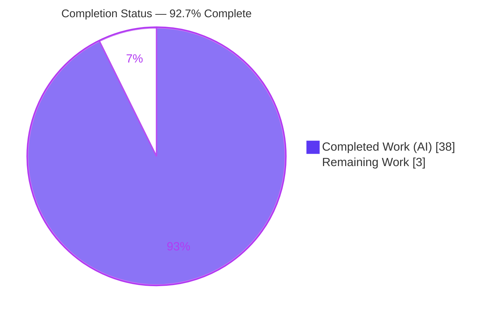
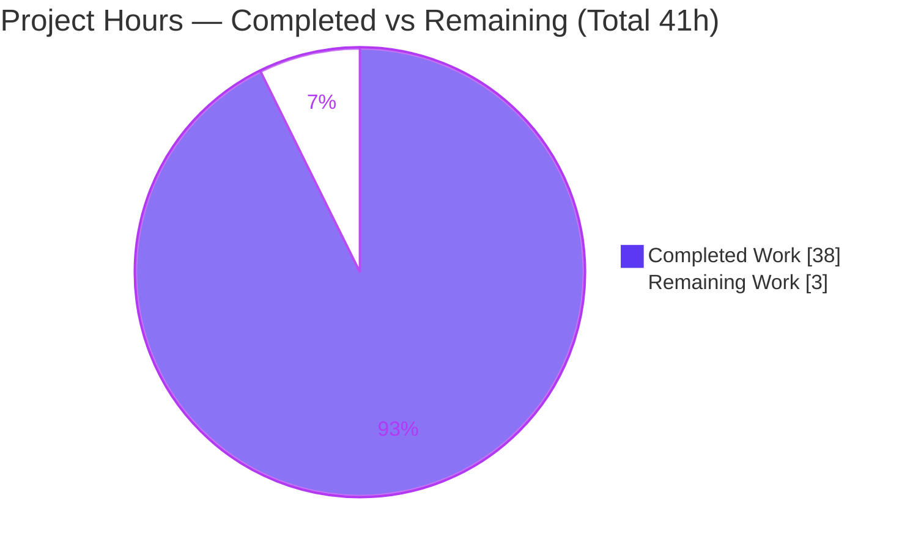
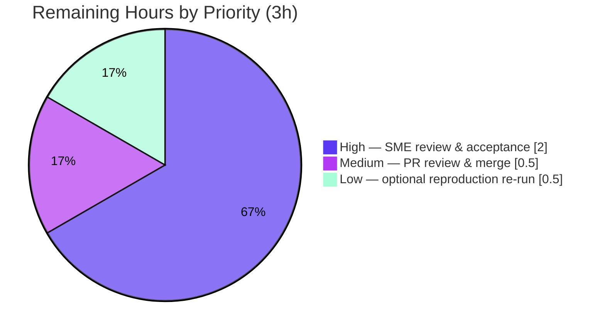

# Blitzy Project Guide — k6 Module-Resolution Q&A Investigation

> **Project type:** Documentation (read-only Q&A investigation) governed by the **SWE-AtlasQnA-Repo** rule set.
> **Repository:** `go.k6.io/k6` (k6 load-testing tool) · **Branch:** `blitzy-bc6eb6d7-40bb-4644-9404-01c29fe588df` · **Base commit:** `ddc3b0b1d23c` · **HEAD:** `7baa58fe9`
> **Brand color key:** <span style="color:#5B39F3">■</span> Completed / AI Work = Dark Blue `#5B39F3` · <span style="color:#FFFFFF">□</span> Remaining = White `#FFFFFF` · Headings/Accents = Violet-Black `#B23AF2` · Highlight = Mint `#A8FDD9`

---

## 1. Executive Summary

### 1.1 Project Overview

This project answers a single technical investigation question about the k6 load-testing tool: **why do some k6 scripts behave fine during `init` but start failing once the test is running with many Virtual Users (VUs) — especially when code loads JavaScript modules "dynamically" rather than only at startup?** The deliverable is one rigorously evidence-backed Markdown document that leads with the corrected direct answer — **the gate is init-vs-runtime state (a module-resolver lock), not CPU/memory "pressure"** — then explains the exact freeze mechanism, defines *already-resolved* versus *new* modules, describes call-stack-driven relative-specifier resolution, and proves every claim with real `k6 run` output plus exact `file:line` source citations. The intended audience is k6 users and JS-runtime engineers. The k6 source tree is investigated strictly read-only and left byte-for-byte unchanged.

### 1.2 Completion Status



<span style="color:#5B39F3">■</span> **Completed (Dark Blue #5B39F3): 38 h** · <span style="color:#FFFFFF">□</span> **Remaining (White #FFFFFF): 3 h**

| Metric | Value |
|--------|-------|
| **Total Hours** | **41 h** |
| Completed Hours (AI + Manual) | 38 h (38 h AI · 0 h manual) |
| Remaining Hours | 3 h |
| **Percent Complete** | **92.7 %** (38 ÷ 41) |

> Completion % is computed with the PA1 AAP-scoped, hours-based methodology: `Completed ÷ (Completed + Remaining) × 100 = 38 ÷ 41 = 92.7 %`. The work universe is the AAP deliverable plus the investigation/build/run activities that produce it, plus path-to-production human acceptance. There is no deployment pipeline, runtime service, or CI change in scope.

### 1.3 Key Accomplishments

- ✅ **Direct-answer-first document** delivered at `blitzy/documentation/k6_ddc3b0b1d23c.md` (1,507 lines), correcting the user's "pressure" framing to the true init-vs-runtime lock gate.
- ✅ **Canonical k6 built from source** (`GOFLAGS=-mod=vendor go build`, Go 1.23.12) → `k6 v0.55.0` — run-first methodology satisfied.
- ✅ **11 empirical conditions (B1–B8) reproduced** through the real `k6 run` CLI, each run twice and at 5/50 VU scale, with complete unedited output and exit codes (`0/107/0/0/0/255/0/0/107/0/107`).
- ✅ **~50 exact `file:line` citations across 13 files**; independent spot-check of 15 citations found **zero mismatches**.
- ✅ **Three mechanisms kept strictly apart**: resolver lock, init-only global-function guard, and host-level dynamic-`import()` disablement.
- ✅ **External corroboration** against official k6 docs, issues #3020/#3534/#3856, v0.53.0 release notes, and pkg.go.dev (9 reference links).
- ✅ **Coverage pass (§10)** maps all 18 named items to value + `file:line` + observed evidence + causal reason.
- ✅ **Absolute repository integrity**: single-file delta from base; zero source files changed; working tree clean; all temporary scripts held outside the checkout and removed.

### 1.4 Critical Unresolved Issues

| Issue | Impact | Owner | ETA |
|-------|--------|-------|-----|
| _None._ All in-scope work is complete, validated, and committed. No blocking issues. | — | — | — |

### 1.5 Access Issues

| System/Resource | Type of Access | Issue Description | Resolution Status | Owner |
|-----------------|----------------|-------------------|-------------------|-------|
| Public internet (from CI/offline container) | Outbound network | The pre-existing, out-of-scope test `TestRequestAndBatchTLS/ocsp_stapled_good` performs a live HTTPS request to `www.wikipedia.org` and asserts an OCSP-stapled `GOOD` status; it cannot pass without internet. Unrelated to module resolution; fails identically at the pristine baseline. | Documented / Accepted (out of scope; read-only constraint forbids editing the source test) | Reviewing engineer |

No access issues affect the in-scope deliverable, the build, or the module-resolution reproductions. The build is fully offline-reproducible via vendored dependencies.

### 1.6 Recommended Next Steps

1. **[High]** Have a k6/JS-runtime SME technically review and accept the answer document — confirm all question parts are addressed and spot-check a sample of the `file:line` citations at commit `ddc3b0b1d23c`.
2. **[Medium]** Review the single-file PR diff, confirm repository integrity (`git diff ddc3b0b1d23c --name-status` = one added file), and merge to the target branch.
3. **[Low]** Optionally rebuild canonical k6 and independently re-run reproductions B1 (exit 0) and B2 (exit 107) to re-confirm the documented behavior.

---

## 2. Project Hours Breakdown

### 2.1 Completed Work Detail

| Component | Hours | Description |
|-----------|-------|-------------|
| Environment setup & canonical k6 build *(methodology: run-first)* | 3 | Install Go 1.23.12; offline vendored build (`GOFLAGS=-mod=vendor go build`); verify `k6 v0.55.0` banner; handle the VCS commit-stamp nuance. |
| Module-resolution source investigation & ~50 `file:line` citations across 13 files *(R1–R4 mechanism)* | 9 | Trace the resolver `Lock()`, cache-before-lock ordering, the two guards, host-level `import()` disablement, call-stack capture, and `reversePath()`; pin exact citations. |
| Empirical reproduction: 11 conditions (B1–B8) each run ×2 + 5/50 VU scale *(R5)* | 7 | Design fixtures; execute via the real `k6 run` CLI; capture complete unedited output and exit codes; confirm ≥2-run stability and load-independence. |
| External corroboration research *(web mandate)* | 3 | Official k6 test-lifecycle & init-context docs, issues #3020/#3534/#3856, v0.53.0 release notes, pkg.go.dev. |
| Authoring the 1,507-line answer document *(R6)* | 10 | Direct-answer-first structure; §1–§10 + Appendix A.1–A.9; Mermaid decision flow; evidence tables; Observed/Inferred/External labeling; §10 coverage pass. |
| QA remediation (3 commits) + citation re-audit + empirical re-runs *(validation)* | 5 | F1–F9 code-review findings; banner/F-1/F-2 QA fixes; A.2 baseline-ref fix; full re-audit; markdown well-formedness. |
| Temporary-artifact cleanup & repository-integrity verification *(integrity constraint)* | 1 | Remove `/tmp/k6test` fixtures; verify clean `git status` and single-file `git diff`. |
| **Total Completed** | **38** | Matches Section 1.2 Completed Hours. |

### 2.2 Remaining Work Detail

| Category | Hours | Priority |
|----------|-------|----------|
| SME technical review & acceptance of the answer document | 2.0 | High |
| PR diff review, repository-integrity confirmation & merge | 0.5 | Medium |
| Optional independent re-run of key empirical reproductions (B1/B2) | 0.5 | Low |
| **Total Remaining** | **3.0** | Matches Section 1.2 Remaining Hours and the Section 7 pie "Remaining Work". |

### 2.3 Hours Reconciliation

| Check | Result |
|-------|--------|
| Section 2.1 total (Completed) | 38 h |
| Section 2.2 total (Remaining) | 3 h |
| **2.1 + 2.2** | **41 h = Total Project Hours (Section 1.2)** ✓ |
| Completion % | 38 ÷ 41 = **92.7 %** ✓ (matches Sections 1.2, 7, 8) |

---

## 3. Test Results

All tests below originate from Blitzy's autonomous validation logs for this project (in-repo Go tests exercised via `go test`, plus empirical CLI reproductions via `k6 run`). This is a read-only documentation task, so "tests" comprise (a) the k6 in-repo tests that encode the documented behavior and (b) the empirical reproduction conditions that produce the answer's evidence.

| Test Category | Framework | Total Tests | Passed | Failed | Coverage % | Notes |
|---------------|-----------|-------------|--------|--------|-----------|-------|
| In-scope module-resolution unit tests | Go `testing` | 2 | 2 | 0 | n/a | `TestVUDoesRequireUnderV0Condition`, `TestVUDoesNotRequireUnderConditions` (`js/runner_test.go:L1385-1432`); asserts the reject substring `was not previously resolved during initialization (__VU==0)`. |
| Empirical reproduction — success paths | k6 CLI (`k6 run`) | 5 | 5 | 0 | n/a | B1 already-resolved (5 & 50 VUs) exit `0`; B3 `require()`/`open()` in `default()` exit `0`; B4 `import()` at iteration exit `0`; B5 relative specifiers exit `0`; B6 parent-dir warning exit `0`. |
| Empirical reproduction — expected-failure paths | k6 CLI (`k6 run`) | 4 | 4 | 0 | n/a | Expected non-zero exits observed & stable: B2 never-seen (2 & 50 VUs) exit `107`; B4 `import()` at init exit `255`; B6 disk-not-found exit `107`. "Passed" = produced the documented outcome across both runs. |
| Independent re-verification (this assessment) | Go `testing` + k6 CLI | 3 | 3 | 0 | n/a | Re-ran the 2 in-scope Go tests (PASS) and reproduced B1 (exit 0), B2 (exit 107 + verbatim reject), B3 (init-only guard error) — all match the deliverable. |

**Exit-code matrix (both runs, from deliverable §A.5):** `0 / 107 / 0 / 0 / 0 / 255 / 0 / 0 / 107 / 0 / 107` — identical across two runs for every condition (stable; load-independent).

**Out-of-scope test (not counted above):** `TestRequestAndBatchTLS/ocsp_stapled_good` (`js/modules/k6/http/request_test.go:L2192`) fails in the offline environment because it performs a live network request. It is unrelated to module resolution, fails identically at the pristine baseline, and is excluded from the in-scope totals.

---

## 4. Runtime Validation & UI Verification

This project has **no UI** and **no long-running service**; runtime validation is the behavior of the k6 CLI binary under the reproduction scripts.

**Runtime health**
- ✅ **Canonical build** — `GOFLAGS=-mod=vendor go build` completes with zero errors; produces a ~65 MB binary.
- ✅ **Version banner** — `k6 v0.55.0 (commit/<HEAD>, go1.23.12, linux/amd64)`; version `0.55.0` fixed at `lib/consts/consts.go:L12`.
- ✅ **CLI execution** — `k6 run --no-usage-report …` executes every observation script and exits with the documented codes.

**Behavioral verification (API/mechanism outcomes)**
- ✅ **Already-resolved module requirable by later VUs** — B1: every VU gets a cache hit while locked; run exits `0` (5 & 50 VUs).
- ✅ **Never-seen module reliably fails** — B2: `the module "./never_seen.js" was not previously resolved during initialization (__VU==0)`; exit `107` (2 & 50 VUs).
- ✅ **Init-only guard on global functions** — B3: `require()`/`open()` inside `default()` → `the "require" function is only available in the init stage …`; iteration-time exit `0`.
- ✅ **Dynamic `import()` disabled at host** — B4: `dynamic modules not enabled in the host program`; init `255`, iteration `0`.
- ✅ **Relative specifiers resolve by executing module** — B5: same `./leaf.js` resolves to `X-leaf` vs `Y-leaf` depending on the referencing module/frame.
- ✅ **Warning vs error distinction** — B6: `open()` parent-dir notice is a `level=warning` (init-only, exit `0`); the disk-not-found sibling is fatal (exit `107`).

**UI Verification:** ⚠ Not applicable — the deliverable is a Markdown document and the target is a CLI tool; no browser UI exists to verify.

---

## 5. Compliance & Quality Review

Cross-map of AAP deliverables and SWE-AtlasQnA-Repo methodology rules to their status. Fixes applied during autonomous validation are noted.

| Requirement / Rule | Benchmark | Status | Evidence |
|--------------------|-----------|--------|----------|
| **R1** Init-vs-runtime discrepancy | Explained + proven | ✅ Pass | §1, §2, §10 items 1/3/6; `js/bundle.go:L125-129` |
| **R2** Freeze semantics (`Lock()`) | Mechanism + call site | ✅ Pass | §3, §10 item 2; `js/modules/resolution.go:L133-139`, `js/bundle.go:L129` |
| **R3** Already-resolved vs new | Cache-before-lock defined | ✅ Pass | §4, §10 items 4/5; `js/modules/resolution.go:L162-167` |
| **R4** Relative specifiers / call stack | Call-stack-driven resolution | ✅ Pass | §5, §8.5, §10 items 9/10; `require_impl.go:L185-196`, `resolution.go:L198-211` |
| **R5** Empirical proof + exact text | Verbatim output, exit codes | ✅ Pass | §8 B1–B8, §A.5; reject string `resolution.go:L17` |
| **R6** Single Markdown deliverable | Correct path & name | ✅ Pass | `blitzy/documentation/k6_ddc3b0b1d23c.md` (1,507 lines) |
| Run-first methodology | Build & run before writing | ✅ Pass | §1 "How this document was produced"; Appendix A.1 |
| Canonical entry point only | Real `k6 run` CLI | ✅ Pass | Appendix A.4 commands |
| Complete, unedited output | No truncation | ✅ Pass | §8 full transcripts |
| ≥2-run stability + scale | Two runs, higher VU scale | ✅ Pass | §A.5 (both runs), §8.7 (50 VUs) |
| Observed vs Inferred labeling | Explicit labels | ✅ Pass | Pervasive `[Observed]`/`[Inferred]`/`[External]` |
| Web corroboration | Official docs + issue tracker | ✅ Pass | §9 (9 reference links) |
| Coverage pass | Each named item mapped | ✅ Pass | §10 (18 items) |
| Read-only source constraint | No source file changed | ✅ Pass | `git diff ddc3b0b1d23c` = single added `.md` |
| Cleanup / repository integrity | Temp scripts removed; clean tree | ✅ Pass | §A.6/A.7; `git status --porcelain` empty |

**Fixes applied during autonomous validation:** F1–F9 code-review remediations and QA findings (banner/F-1/F-2) in the first two agent commits; and one final accuracy fix — Appendix A.2's baseline reference was changed from a drift-prone relative form (`git rev-parse HEAD~1`) to the immutable-hash form (`git rev-parse ddc3b0b1d23c`), committed as `7baa58fe9`.

**Outstanding compliance items:** None in scope.

---

## 6. Risk Assessment

| Risk | Category | Severity | Probability | Mitigation | Status |
|------|----------|----------|-------------|------------|--------|
| Version drift — the answer is pinned to k6 `v0.55.0` / commit `ddc3b0b1d23c`; future versions may shift line numbers or change the lock mechanism. | Technical | Low | Medium | Exact-commit pin; §9.6 version-drift disclaimer; immutable-hash baseline reference; Go source byte-identical between HEAD and base. | Mitigated |
| Citation line-number fragility if read against a different commit. | Technical | Low | Low | All ~50 citations pinned to `ddc3b0b1d23c`; integrity proof invariant to commit layering. | Mitigated |
| Build commit-stamp nuance — the banner's `commit/…` field reflects the checked-out HEAD, not the base (observed `7baa58fe98` vs documented `ddc3b0b1d2`). | Technical | Low | Low | §1 explains `vcs.revision` behavior; the canonical A.1 banner was produced from a clean clone at the base commit. | Documented |
| SME may dispute a mechanism interpretation during review. | Technical / Process | Low | Low | Every claim carries `file:line` + observed §8 evidence + external §9 corroboration + §10 coverage pass. | Mitigated |
| Reproducing runs requires the Go 1.23.x toolchain + vendored deps. | Operational | Low | Low | Fully offline-reproducible via `vendor/`; complete unedited output is included, so re-execution is not required to trust the answer. | Mitigated |
| Out-of-scope, network-dependent test (`ocsp_stapled_good`) fails offline and could be mistaken for a regression. | Integration | Low | Medium | Documented as pre-existing/unrelated; fails identically at the pristine baseline; lives in a separate HTTP/TLS module. | Accepted (out of scope) |
| Security surface. | Security | None | — | Read-only task; no code/deps/config changed; source tree byte-for-byte unchanged; no secrets in the document or fixtures. | N/A |

**Overall risk posture:** **Low.** The deliverable is fully validated, cited, corroborated, and committed with absolute repository integrity; no risk is blocking.

---

## 7. Visual Project Status

**Project Hours Breakdown** (Completed = Dark Blue `#5B39F3`, Remaining = White `#FFFFFF`):



**Remaining Work by Priority** (from Section 2.2 — sums to 3 h):



> **Integrity check:** the pie chart "Remaining Work" (3 h) equals Section 1.2 Remaining Hours (3 h) and the sum of the Section 2.2 Hours column (2.0 + 0.5 + 0.5 = 3.0 h). "Completed Work" (38 h) equals Section 1.2 Completed Hours and the sum of the Section 2.1 Hours column.

---

## 8. Summary & Recommendations

**Achievements.** The project delivers a single, direct-answer-first Markdown document (1,507 lines) that comprehensively and empirically answers the k6 module-resolution question. It corrects the user's "under pressure / lots of VUs" framing to the true cause — an **init-vs-runtime resolver lock** — and keeps three distinct mechanisms strictly apart: the resolver lock (`the module … was not previously resolved during initialization (__VU==0)`), the init-only guard on global `require()`/`open()`, and host-level disablement of dynamic ESM `import()`. Every mechanism claim is grounded in an exact `file:line` citation and every behavioral claim in complete, unedited `k6 run` output captured across two runs and at 5/50 VU scale.

**Remaining gaps.** None technical. The remaining **3 hours** are exclusively path-to-production human activities: SME technical review & acceptance (2.0 h), PR review + integrity confirmation + merge (0.5 h), and an optional independent reproduction re-run (0.5 h). There is no implementation, bug-fix, configuration, or deployment work outstanding.

**Critical path to production.** SME acceptance → merge. Because the source tree is unchanged and the deliverable is self-contained (it embeds all captured output and exact build/run commands), production readiness hinges solely on human sign-off.

**Success metrics.** 6/6 AAP requirements complete; all SWE-AtlasQnA-Repo methodology rules satisfied; in-scope tests pass; 15-sample citation audit with zero mismatches; absolute repository integrity (single-file delta, clean tree).

**Production-readiness assessment.** The project is **92.7 % complete** (38 of 41 hours). It is **ready for SME review and merge**; the deliverable is accurate, empirically grounded, fully cited, externally corroborated, well-formed, and committed. Per honest-assessment principles, completion is capped below 100 % to reflect the required human acceptance gate.

| Metric | Value |
|--------|-------|
| AAP requirements complete | 6 / 6 |
| Completion (AAP-scoped, hours-based) | 92.7 % |
| In-scope tests passing | 2 / 2 Go tests; 11 / 11 reproduction conditions |
| Repository integrity | Absolute (1 file added, 0 source files changed) |
| Blocking issues | 0 |

---

## 9. Development Guide

This guide reproduces the investigation behind the answer document. All commands are copy-pasteable and were tested during this assessment. **Fixtures must live outside the repository checkout** (e.g., under `/tmp/k6test`) to preserve repository integrity.

### 9.1 System Prerequisites

- **Go toolchain 1.23.x** — the highest explicitly documented supported line (`Dockerfile` → `golang:1.23-alpine3.20`; CI `DEFAULT_GO_VERSION: "1.23.x"`). k6's own module baseline is `go 1.21` / `toolchain go1.21.13`. Verified environment: `go1.23.12`.
- **Git** (for baseline and integrity verification).
- **OS/arch:** any Go-supported platform; verified on `linux/amd64`.
- **Disk:** ~1 GB free (repository ≈ 134 MB + ~65 MB binary + Go build cache).
- **Network:** not required — dependencies are fully vendored for an offline build.

### 9.2 Environment Setup

```bash
# Ensure the Go toolchain is on PATH (adjust if installed elsewhere)
export PATH=$PATH:/usr/local/go/bin
go version   # expect: go version go1.23.12 linux/amd64

# Work from the repository root
cd /path/to/k6   # the checkout containing go.mod (module go.k6.io/k6)
```

No environment variables, databases, caches, or message queues are required.

### 9.3 Dependency Installation

Dependencies are **vendored** — nothing to download. Verify them:

```bash
GOFLAGS=-mod=vendor go mod verify
# expect: all modules verified
```

### 9.4 Build (canonical binary)

```bash
# Offline, reproducible build using vendored dependencies (equivalent to the Makefile `build:` target)
GOFLAGS=-mod=vendor go build -o /tmp/k6bin/k6 .

# Verify the version banner
/tmp/k6bin/k6 version
# expect: k6 v0.55.0 (commit/<HEAD-hash>, go1.23.12, linux/amd64)
```

> **Note on the `commit/…` field.** It reflects the git HEAD at build time (read from `vcs.revision`). Building from this branch stamps the current HEAD (e.g., `7baa58fe98`); the document's canonical banner (`commit/ddc3b0b1d2`) was produced from a clean clone at the base commit `ddc3b0b1d23c`. The binary behavior is identical either way.

### 9.5 Verification

```bash
# (a) In-scope module-resolution tests — expect PASS
GOFLAGS=-mod=vendor go test -run '^(TestVUDoesRequireUnderV0Condition|TestVUDoesNotRequireUnderConditions)$' ./js/ -v -count=1

# (b) Repository integrity — expect empty status and a single added file
git status --porcelain
git diff ddc3b0b1d23c --name-status
# expect: A	blitzy/documentation/k6_ddc3b0b1d23c.md
```

### 9.6 Example Usage — reproduce the core answer

```bash
# Create fixtures OUTSIDE the checkout
mkdir -p /tmp/k6test && cd /tmp/k6test
printf '%s\n' "module.exports = { name: 'lib_a' };"      > lib_a.js
printf '%s\n' "module.exports = { name: 'never_seen' };" > never_seen.js

cat > already_resolved.js <<'EOF'
var a = require('./lib_a.js');
if (__VU > 0) { var again = require('./lib_a.js'); console.log('VU', __VU, 're-required', again.name); }
export default function () { }
EOF

cat > never_seen_first.js <<'EOF'
if (__VU > 0) { require('./never_seen.js'); }
export default function () { }
EOF

# B1 — already-resolved module IS requirable by later VUs (SUCCESS, exit 0)
/tmp/k6bin/k6 run --no-usage-report --vus 5 --iterations 20 already_resolved.js ; echo "exit=$?"   # expect exit=0

# B2 — a never-seen module reliably FAILS (exit 107 + verbatim reject string)
/tmp/k6bin/k6 run --no-usage-report --vus 2 --iterations 4 never_seen_first.js ; echo "exit=$?"     # expect exit=107
# stderr contains:
#   the module "./never_seen.js" was not previously resolved during initialization (__VU==0)

# Cleanup — leave the repository byte-for-byte unchanged
cd / && rm -rf /tmp/k6test /tmp/k6bin
```

### 9.7 Troubleshooting

- **`go: command not found`** → `export PATH=$PATH:/usr/local/go/bin` (or your Go install's `bin`).
- **Banner shows a different `commit/…` than `ddc3b0b1d2`** → expected; the field is the checked-out HEAD. Build from a clean clone at `ddc3b0b1d23c` for the canonical stamp.
- **`dynamic modules not enabled in the host program` when using `import()`** → expected; k6 disables dynamic ESM `import()` at the Sobek host level.
- **`require()`/`open()` "only available in the init stage"** → expected when called inside `default()`/an iteration function (init-only guard); move the call to the module top level (init).
- **`TestRequestAndBatchTLS/ocsp_stapled_good` fails** → pre-existing, network-dependent, out-of-scope (HTTP/TLS module); unrelated to module resolution — ignore for this task.
- **Repository shows unexpected changes** → ensure fixtures were created under `/tmp` (outside the checkout), not inside the repository.

---

## 10. Appendices

### A. Command Reference

| Purpose | Command |
|---------|---------|
| Check Go version | `go version` |
| Verify vendored deps | `GOFLAGS=-mod=vendor go mod verify` |
| Build canonical k6 | `GOFLAGS=-mod=vendor go build -o /tmp/k6bin/k6 .` |
| Version banner | `/tmp/k6bin/k6 version` |
| In-scope tests | `GOFLAGS=-mod=vendor go test -run '^(TestVUDoesRequireUnderV0Condition\|TestVUDoesNotRequireUnderConditions)$' ./js/ -v -count=1` |
| Run a script | `/tmp/k6bin/k6 run --no-usage-report [--vus N --iterations M] <script.js>` |
| Working-tree status | `git status --porcelain` |
| Delta from base | `git diff ddc3b0b1d23c --name-status` |
| Agent commits | `git log --author="agent@blitzy.com" --oneline ddc3b0b1d23c..HEAD` |

### B. Port Reference

Not applicable — the k6 CLI and this documentation task expose no network services or ports.

### C. Key File Locations

| Path | Role |
|------|------|
| `blitzy/documentation/k6_ddc3b0b1d23c.md` | **The deliverable** (1,507 lines) |
| `js/modules/resolution.go` | Resolver core: `locked` flag (`L35`), `Lock()` (`L133-139`), cache-before-lock (`L162-167`), reject string (`L17`), `reversePath()` (`L198-211`) |
| `js/modules/require_impl.go` | `require()` impl; call-stack capture `getCurrentModuleScript()` (`L185-196`); parent-dir warn helper (`L144-163`) |
| `js/bundle.go` | Init instantiate (`L125`) → `Lock()` (`L129`); init-only guards (`L424-429`, `L445-449`); `inInitContext` (`L439`) |
| `js/initcontext.go` | `cantBeUsedOutsideInitContextMsg` (`L15-16`) |
| `js/runner_test.go` | In-repo tests (`L1385-1407`, `L1409-1432`, assert `L1431`) |
| `vendor/github.com/grafana/sobek/vm.go` | Host-level dynamic-`import()` rejection (`L5009-5010`) |
| `lib/consts/consts.go` | Version `0.55.0` (`L12`), `FullVersion()` (`L17`) |
| `errext/exitcodes/codes.go` | `ScriptException = 107` (`L48`) |

### D. Technology Versions

| Component | Version | Source |
|-----------|---------|--------|
| k6 (built binary) | v0.55.0 | `lib/consts/consts.go:L12` |
| Go toolchain (build) | go1.23.12 | verified `go version`; CI `DEFAULT_GO_VERSION 1.23.x` |
| Go module baseline | go 1.21 / toolchain go1.21.13 | `go.mod:L3,L5` |
| Canonical build image | `golang:1.23-alpine3.20` | `Dockerfile:L1` |
| Platform (verified) | linux/amd64 | version banner |

### E. Environment Variable Reference

| Variable | Value | Purpose |
|----------|-------|---------|
| `PATH` | append `/usr/local/go/bin` | make the Go toolchain available |
| `GOFLAGS` | `-mod=vendor` | force offline, vendored, reproducible builds |

No application secrets, credentials, or service endpoints are required.

### F. Developer Tools Guide

| Tool | Use |
|------|-----|
| `go build` / `go test` | Build the canonical binary; run in-scope module-resolution tests |
| `k6 run` | Canonical entry point for empirical reproductions (use `--no-usage-report`) |
| `git status` / `git diff` / `git log` | Verify repository integrity and agent authorship |
| Exit-code capture | Append `; echo "exit=$?"` to each `k6 run` to record the process exit code |

### G. Glossary

| Term | Definition |
|------|------------|
| **Init context** | The module top-level body that runs once per VU instantiation before iterations begin. |
| **VU (Virtual User)** | A concurrent execution unit; each VU has its own Sobek runtime and shared-nothing heap. |
| **Resolver lock** | The `locked` boolean flipped by `ModuleResolver.Lock()` after `__VU==0` init; blocks resolving new specifiers. |
| **Already-resolved** | A cache hit in the resolver keyed by resolved specifier — served even when locked. |
| **New module** | A cache miss encountered while locked — rejected with the `(__VU==0)` error. |
| **Guard 1** | The init-only guard on global `require()`/`open()` (`vu.state != nil` → rejected). |
| **Guard 2** | The resolver lock rejecting new specifiers from a module body after init. |
| **Sobek** | k6's maintained goja fork (JavaScript engine); disables dynamic ESM `import()` at the host. |
| **Exit 107** | `ScriptException` — a fatal script error (e.g., the reject error, disk-not-found). |
| **Exit 255** | Observed exit for a dynamic `import()` used at init (host-level rejection). |

---

*This Blitzy Project Guide was generated from the Agent Action Plan, the Final Validator logs, and independent re-verification (build, tests, reproductions, citation spot-check, and repository-integrity checks) performed during this assessment. All hours and percentages are consistent across Sections 1.2, 2.1, 2.2, 7, and 8 (Total 41 h · Completed 38 h · Remaining 3 h · 92.7 % complete).*