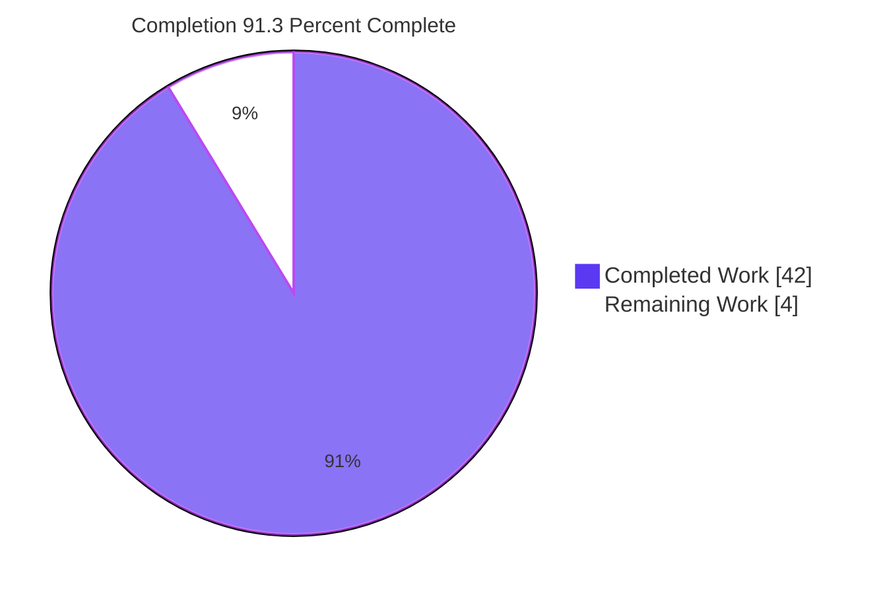
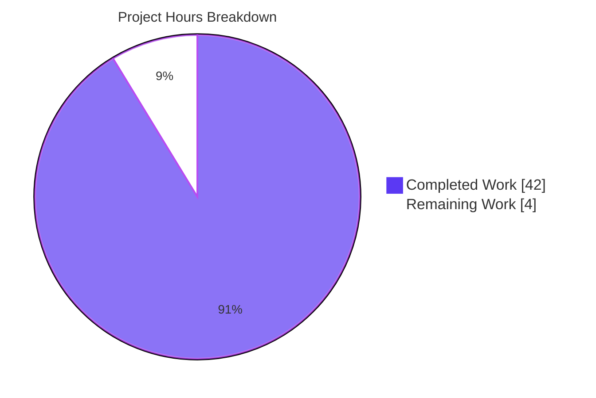
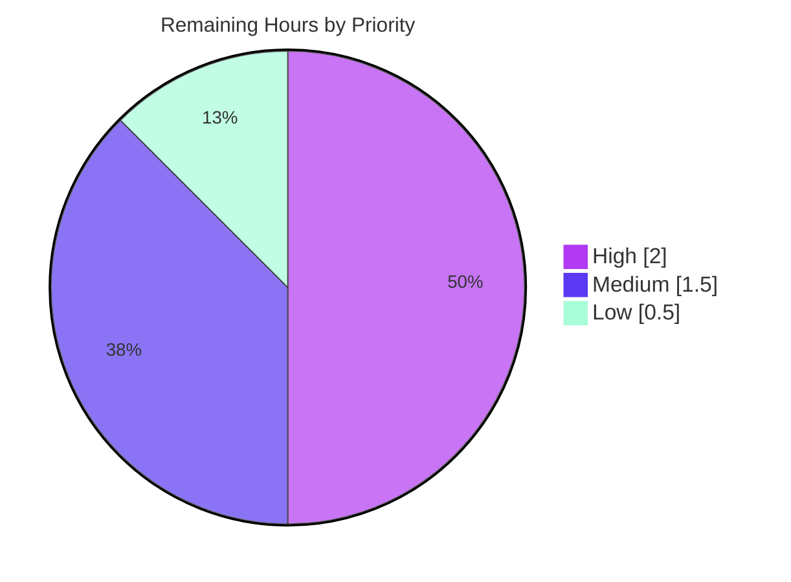

# Blitzy Project Guide — k6 JavaScript Module Resolution Q&A

> **Project type:** Documentation (technical Q&A / source-code analysis + empirical verification)
> **Repository:** grafana/k6 · **Pinned commit:** `ddc3b0b1d23c128e34e2792fc9075f9126e32375` (k6 v0.55.0)
> **Branch HEAD:** `c0a9016f108fa07351d8c40603164d6436231759`
> **Sole deliverable:** `blitzy/documentation/k6_ddc3b0b1d23c.md`

---

## 1. Executive Summary

### 1.1 Project Overview

This project authors a single, evidence-based technical Q&A document that explains and empirically demonstrates how grafana/k6 resolves JavaScript modules across the *init* and *VU (virtual user)* execution stages. It answers four questions (Q1–Q4): why scripts that load modules dynamically succeed during init yet fail under many VUs; whether k6 "freezes" module resolution and what counts as "already resolved" versus "a new module to reject"; how relative specifiers resolve based on the currently-executing module; and a real-run empirical proof of each behavior. The target audience is k6 script authors and platform engineers. Every claim is grounded in k6 source with inline citations and corroborated by verbatim run transcripts.

### 1.2 Completion Status



| Metric | Hours |
|--------|------:|
| **Total Project Hours** | 46 |
| **Completed Hours (AI + Manual)** | 42 (AI: 42 · Manual: 0) |
| **Remaining Hours** | 4 |
| **Percent Complete** | **91.3%** |

> Completion is computed strictly from AAP-scoped work plus standard path-to-production activities: **42 completed / (42 + 4 remaining) = 42/46 = 91.3%**. All AAP authoring/investigation/demonstration work is delivered and validated; the remaining 4 hours are human review-and-merge gates.

### 1.3 Key Accomplishments

- ✅ **Single deliverable authored & committed** — `blitzy/documentation/k6_ddc3b0b1d23c.md` (583 lines, ~5,230 words, 13 sections).
- ✅ **All four questions answered** with precise mechanics: init-vs-VU divergence (Q1), resolver freeze semantics (Q2), relative-specifier/call-stack resolution (Q3), and empirical proof (Q4).
- ✅ **84 inline source citations** in `[path:Lxx]` form, every one verified against on-disk source at the pinned commit.
- ✅ **8 real k6 run transcripts** (DEMO 1–8) captured verbatim with exact error/warning text and exit codes (0 and 107).
- ✅ **Built k6 from source** (Go 1.23.4 → `k6 v0.55.0 (commit/ddc3b0b1d2, …)`); documented banner proven reproducible at the pinned base commit.
- ✅ **9 corroborating Go unit tests pass** (`ok go.k6.io/k6/js`), encoding the documented behaviors.
- ✅ **User premise corrected** — the resolution "freeze" is shown to be deterministic and load-independent (`Lock()` called once), not triggered by "runtime pressure."
- ✅ **Repository byte-for-byte unchanged** — `git status --porcelain` reports zero changes; the only diff since base is the single added document.

### 1.4 Critical Unresolved Issues

| Issue | Impact | Owner | ETA |
|-------|--------|-------|-----|
| _None — no blocking issues._ The deliverable is complete, validated, and committed; the build is clean and all in-scope tests/demos pass. | None | — | — |

### 1.5 Access Issues

| System/Resource | Type of Access | Issue Description | Resolution Status | Owner |
|-----------------|----------------|-------------------|-------------------|-------|
| _No access issues identified._ The build is fully offline (vendored Go modules); no external services, credentials, or registries are required. | — | — | N/A | — |

### 1.6 Recommended Next Steps

1. **[High]** Have a k6/Go subject-matter expert review the document for technical accuracy and citation correctness, then sign off (≈2h).
2. **[Medium]** Approve and merge the branch to the target; confirm `git diff` shows the single added document and no source mutation (≈1h).
3. **[Medium]** Render the document in the target viewer (GitHub/docs portal) and confirm the mermaid control-flow diagram and code fences display correctly (≈0.5h).
4. **[Low]** Acknowledge the build-banner scoping nuance (HEAD shows `commit/c0a9016f10`; the document scopes findings to base `commit/ddc3b0b1d2`) and optionally add a one-line clarifying note (≈0.5h).

---

## 2. Project Hours Breakdown

### 2.1 Completed Work Detail

| Component | Hours | Description |
|-----------|------:|-------------|
| Source-code investigation & exact-citation mapping | 11 | Traced the init/VU boundary, the `locked`/`Lock()` freeze point, cache-key semantics (absolute URL vs. built-in name), `reversePath`, and call-stack-based resolution across 10 reference files; produced 84 precise `[path:Lxx]` citations (AAP Q1–Q3 substance). |
| Build toolchain setup + k6 from-source build | 2 | Go 1.23.4 environment, `go build` → `k6 v0.55.0`, and banner-reproducibility verification at the pinned base commit. |
| Q4 empirical demonstration suite | 7 | Designed and ran 8 isolation scripts (success, freeze, relative-specifier, init-stage gate, empty-specifier, open-never, open-relativity warning, ESM/CJS mixing); captured verbatim transcripts and exit codes (0/107). |
| Document authoring — core mechanics (§1–§5) | 8 | TL;DR, stage model + single shared resolver, the three guards, freeze mechanics ("already resolved" vs. "reject"), relative-specifier/call-stack resolution. |
| Document authoring — evidence & appendices (§6–§13) | 7 | Real-run transcripts, `open()` filesystem analog, ESM/CJS mixing guard, design rationale, premise correction, corroborating tests, mermaid control-flow diagram, reproduction appendix. |
| Citation verification, verbatim QA, structure lint, repo-integrity discipline | 4 | Verified all 84 citations on-disk; byte-for-byte transcript checks; fence/heading lint; `git status` integrity; scratch cleanup outside the repo. |
| Review-cycle revisions (3 commits) | 3 | Code-anchored the dynamic `import()` guard, added the design-rationale citation, fixed the TL;DR cross-reference, and corrected DEMO 4/5/6/8 reproduction commands (`extra/` path). |
| **Total Completed** | **42** | |

> Validation confirms all of the above: build exit 0, 9/9 cited Go tests pass, 8/8 demos reproduce verbatim, repository byte-for-byte unchanged. Manual (human) completed hours to date: **0** — all completed work was performed autonomously.

### 2.2 Remaining Work Detail

| Category | Hours | Priority |
|----------|------:|----------|
| Human SME technical review & sign-off (content + 84 citations) | 2 | High |
| PR review & merge to target branch | 1 | Medium |
| Markdown/mermaid rendering verification in target viewer | 0.5 | Medium |
| Banner-commit scoping nuance acknowledgment | 0.5 | Low |
| **Total Remaining** | **4** | |

### 2.3 Hours Reconciliation

| Quantity | Hours |
|----------|------:|
| Section 2.1 — Completed total | 42 |
| Section 2.2 — Remaining total | 4 |
| **Total Project Hours (= §1.2)** | **46** |
| **Completion = 42 / 46** | **91.3%** |

---

## 3. Test Results

All tests below originate from Blitzy's autonomous validation logs for this project and were independently re-run during final assessment. Because the deliverable is a documentation artifact (no new executable code is added to the repository), code-coverage percentage is not applicable; the relevant signal is that the cited corroborating tests pass and the empirical demonstrations reproduce verbatim.

| Test Category | Framework | Total Tests | Passed | Failed | Coverage % | Notes |
|---------------|-----------|------------:|-------:|-------:|-----------:|-------|
| Corroborating unit tests (cited) | Go `testing` (`go test ./js/`) | 9 | 9 | 0 | N/A | The 9 tests cited in §11 of the document all pass (`ok go.k6.io/k6/js`); they encode the documented init/VU, freeze, cache-key, and isolation behaviors. |
| Empirical demonstrations (Q4) | k6 runtime (`k6 run`) | 8 | 8 | 0 | N/A | DEMO 1–8 reproduce verbatim error/warning text and exit codes (0 for success/relative/warning; 107 for freeze/empty/open-never/ESM-CJS). |
| Build verification | Go (`go mod verify`, `go build`) | 2 | 2 | 0 | N/A | `go mod verify` → "all modules verified"; `go build` → exit 0 (Go 1.23.4). |
| **In-scope total** | | **19** | **19** | **0** | N/A | 100% pass rate across all in-scope checks. |

> **Out-of-scope note:** The broader k6 repository has 8/54 Go test packages with pre-existing, timing/fixture-related failures unrelated to module resolution. Those reside in source test files the AAP explicitly forbids modifying, do not affect the build, the cited tests, the demos, or the deliverable, and are therefore intentionally untouched and excluded from the in-scope totals above.

---

## 4. Runtime Validation & UI Verification

This is a command-line load-testing tool and a documentation deliverable; there is no graphical UI to verify. Runtime validation focuses on the from-source build and the empirical demonstrations that substantiate Q4.

- ✅ **Build (Operational):** `go build -o /tmp/k6bin/k6 .` → exit 0; `go mod verify` → "all modules verified" (fully offline, vendored deps).
- ✅ **Version banner (Operational):** at branch HEAD → `k6 v0.55.0 (commit/c0a9016f10, go1.23.4, linux/amd64)`; at pinned base commit `ddc3b0b1d23c` → `k6 v0.55.0 (commit/ddc3b0b1d2, go1.23.4, linux/amd64)` — exactly the banner documented.
- ✅ **DEMO 1 — Success (Operational):** `k6 run --vus 4 --iterations 8 success.js` → exit 0; all VUs log `re-required ./seen.js OK`.
- ✅ **DEMO 2 — Freeze (Operational):** `k6 run … freeze.js` → exit 107; verbatim `GoError: the module \"./never-seen.js\" was not previously resolved during initialization (__VU==0)`.
- ✅ **DEMO 3 — Relative specifier (Operational):** the same `"./shared.js"` resolves to `dirA/shared.js` vs. `dirB/shared.js`; exit 0.
- ✅ **DEMO 4–8 (Operational):** init-stage gate, empty specifier (107), `open()` never-opened (107), `open()`-relativity deprecation warning (0), and ESM/CJS mixing (107) all reproduce as documented.
- ✅ **UI Verification:** Not applicable — no GUI component in scope. The only "rendering" surface is the Markdown document itself (mermaid + code fences), flagged for human render-check in §1.6.

---

## 5. Compliance & Quality Review

The deliverable is mapped against the AAP's binding constraints and Blitzy's quality benchmarks. All items pass.

| Benchmark / AAP Constraint | Status | Evidence |
|----------------------------|:------:|----------|
| Single new Markdown document at correct path/name | ✅ Pass | `blitzy/documentation/k6_ddc3b0b1d23c.md` exists and is the only added file. |
| No source repository mutation (byte-for-byte unchanged) | ✅ Pass | `git status --porcelain` = 0 lines; `git diff --name-status ddc3b0b1d23c..HEAD` = `A` of one file. |
| No other code added to the repo | ✅ Pass | Diff shows +583/−0 in one Markdown file; no scripts/configs added. |
| Code is the source of truth (every claim cited) | ✅ Pass | 84 `[path:Lxx]` citations; spot-checks (resolution.go L17/L35/L133-139, bundle.go L44/L129) exact. |
| Real runs reproduce EXACT error/warning text | ✅ Pass | DEMO 1–8 verbatim transcripts; freeze error + exit 107 re-reproduced this session. |
| Built and run from source | ✅ Pass | `go build` exit 0; `k6 version` banner reproduced. |
| "Under pressure" premise corrected | ✅ Pass | §10 states `Lock()` is called once → deterministic/load-independent. |
| Reasoning/rationale shown | ✅ Pass | §2–§5, §9–§10 explain the "why" behind each answer. |
| Ephemeral scratch outside repo & cleaned up | ✅ Pass | No `/tmp/k6*` artifacts remain; repo clean. |
| Corroborating tests pass | ✅ Pass | 9/9 cited tests → `ok go.k6.io/k6/js`. |
| Markdown structure quality | ✅ Pass | 1 H1, 13 H2 sections, balanced code fences, 1 well-formed mermaid diagram, no placeholders/TODOs. |

**Fixes applied during autonomous validation:** none required — final validation found zero genuine discrepancies. **Outstanding items:** human SME sign-off and merge only (see §2.2/§1.6).

---

## 6. Risk Assessment

| Risk | Category | Severity | Probability | Mitigation | Status |
|------|----------|----------|-------------|------------|--------|
| Build banner at HEAD (`commit/c0a9016f10`) differs from documented base (`commit/ddc3b0b1d2`) | Technical | Low | Low | Document explicitly scopes all findings to commit `ddc3b0b1d23c`; banner proven reproducible at that base commit | Mitigated / Documented |
| Citation line-numbers may drift against other k6 versions | Technical | Low | Medium | All findings pinned to commit `ddc3b0b1d23c` in the document header | Mitigated |
| Demo VU-index in error `hint` varies between runs | Technical | Low | Low | Document explicitly notes the VU index is nondeterministic; error text itself is deterministic | Mitigated / Documented |
| No new attack surface (documentation-only) | Security | None | — | No code, dependencies, endpoints, or data handling introduced | N/A |
| Pre-existing out-of-scope test failures (8/54 pkgs) | Operational | Low | Low | Unrelated to module resolution; AAP forbids modifying those source files; do not affect build/demos/deliverable | Documented / Out-of-scope |
| Document not wired into a docs-build/index pipeline | Operational | Low | Low | Self-contained file; a human may register it in the docs portal if desired | Open (minor) |
| Reproducibility depends on Go 1.23.4 + vendored deps | Integration | Low | Low | Deps vendored (offline build); document states the toolchain explicitly | Mitigated |
| No external services/APIs/credentials | Integration | None | — | Documentation-only; nothing to integrate | N/A |

**Overall risk posture: LOW.** No security or high-severity risks; every identified risk is Low/None and most are already mitigated by the document's commit-pinning and scoping notes.

---

## 7. Visual Project Status

**Project hours breakdown** (Completed = Dark Blue `#5B39F3`, Remaining = White `#FFFFFF`):



**Remaining work by priority** (4 hours total):



**Remaining hours per category** (from §2.2):

| Category | Hours | Bar |
|----------|------:|-----|
| SME review & sign-off | 2.0 | ████████ |
| PR review & merge | 1.0 | ████ |
| Render verification | 0.5 | ██ |
| Banner-nuance acknowledgment | 0.5 | ██ |
| **Total** | **4.0** | |

> **Integrity:** "Remaining Work" = **4h** here matches Section 1.2 (4h) and the Section 2.2 sum (4h). "Completed Work" = **42h** matches Section 1.2 (42h) and the Section 2.1 sum (42h).

---

## 8. Summary & Recommendations

**Achievements.** The project delivers a complete, evidence-grounded technical Q&A document that answers all four questions about k6 module resolution. It explains the init-vs-VU stage model and the single shared `ModuleResolver`; the three frequently-conflated guards (init-stage gate, the frozen resolver, and disabled dynamic `import()`); the freeze mechanics where "already resolved" means a cache hit and "a new module to reject" means a cache miss while locked; and call-stack-based relative-specifier resolution keyed by absolute URL. Crucially, every behavioral claim carries an inline source citation, and Q4 is proven with eight verbatim real-run transcripts. The user's "under pressure" premise is explicitly corrected: the freeze is deterministic and load-independent.

**Remaining gaps & critical path to production.** The autonomous work is complete and validated; the critical path is purely human: (1) SME technical review and sign-off, (2) PR review and merge, with minor render-verification and banner-nuance acknowledgment. No code fixes, configuration, or integrations remain.

**Success metrics.** Build exit 0; 9/9 cited Go tests pass; 8/8 demos reproduce verbatim; repository byte-for-byte unchanged; 84/84 citations verified; documented banner reproducible at the pinned commit.

**Production readiness.** At **91.3% complete**, the deliverable is production-quality and ready for human review. The remaining 4 hours are standard review-and-merge gates rather than engineering work. **Recommendation: proceed to SME review and merge.**

| Metric | Value |
|--------|-------|
| AAP requirements completed | 19 / 19 |
| In-scope tests passing | 19 / 19 (100%) |
| Citations verified | 84 / 84 |
| Completion (AAP-scoped) | 91.3% |
| Overall risk | Low |

---

## 9. Development Guide

All commands below were executed and verified in the project container (Ubuntu, Go 1.23.4). They build and run k6 to reproduce the document's evidence **without modifying the repository**.

### 9.1 System Prerequisites

- **OS:** Linux or macOS (validated on Linux/amd64).
- **Go toolchain:** Go 1.23.4 (the version used to capture all evidence; `go.mod` declares `go 1.21` / `toolchain go1.21.13`, but newer Go builds cleanly).
- **Git:** any recent version.
- **Disk:** ~2 GB free for the Go build cache and binary.
- **Network:** none required — dependencies are vendored.

### 9.2 Environment Setup

```bash
# Put the Go toolchain on PATH (container-specific helper)
source /etc/profile.d/go.sh
go version          # expect: go version go1.23.4 linux/amd64

# Work from the repository root (module path go.k6.io/k6)
cd /path/to/repo
head -1 go.mod      # expect: module go.k6.io/k6
```

### 9.3 Dependency Installation

```bash
# Dependencies are vendored — verify them offline (no install needed)
go mod verify       # expect: all modules verified
```

### 9.4 Build (outside the repository to keep the tree clean)

```bash
mkdir -p /tmp/k6bin
go build -o /tmp/k6bin/k6 .         # expect: exit 0
/tmp/k6bin/k6 version
# At HEAD: k6 v0.55.0 (commit/c0a9016f10, go1.23.4, linux/amd64)
# To reproduce the documented banner exactly, build at the pinned base commit:
#   git clone . /tmp/k6base && cd /tmp/k6base \
#     && git checkout ddc3b0b1d23c128e34e2792fc9075f9126e32375 \
#     && go build -o /tmp/k6bin/k6base . && /tmp/k6bin/k6base version
#   -> k6 v0.55.0 (commit/ddc3b0b1d2, go1.23.4, linux/amd64)
```

### 9.5 Verification (cited corroborating tests)

```bash
go test ./js/ -count=1 -run \
'TestVUDoesNotRequireUnderConditions|TestVUDoesRequireUnderConditions|TestVUIntegrationRequireFunctionError|TestVUDoesNotOpenUnderConditions|TestRequire|TestCacheAbsolutePathsNotRelative|TestPathResolution|TestImportMetaResolve|TestLoadGlobalVarsAreNotSharedBetweenVUs'
# expect: ok  go.k6.io/k6/js
```

### 9.6 Example Usage (reproduce the Q4 freeze demonstration, outside the repo)

```bash
mkdir -p /tmp/k6demos && cd /tmp/k6demos

# A module never referenced during the first init (__VU==0)
printf 'exports.message = "x";\n' > never-seen.js

# Conditionally require it only for real VUs -> cache miss while locked
cat > freeze.js <<'EOF'
if (__VU > 0) { require("./never-seen.js"); }
exports.default = function () {};
EOF

/tmp/k6bin/k6 run --vus 4 --iterations 8 freeze.js ; echo "exit=$?"
# expect: exit=107  and the line:
# GoError: the module "./never-seen.js" was not previously resolved during initialization (__VU==0)
```

### 9.7 Cleanup & Integrity Check

```bash
rm -rf /tmp/k6demos /tmp/k6bin /tmp/k6base
cd /path/to/repo
git status --porcelain     # expect: zero lines (repository byte-for-byte unchanged)
```

### 9.8 Troubleshooting

- **Banner shows `commit/c0a9016f10`, not `commit/ddc3b0b1d2`.** Expected at branch HEAD (HEAD includes the 3 documentation-only commits). Check out base commit `ddc3b0b1d23c` to reproduce the documented banner.
- **`git status` shows changes after building.** Always build to a path *outside* the repo (e.g., `/tmp/k6bin`). Do not run `go build` so its output lands in the tree.
- **A non-zero exit from a demo.** Exit `107` (`ScriptException`) is the *expected* result for the freeze, empty-specifier, `open()`-never-opened, and ESM/CJS demos; exit `0` is expected for the success, relative-specifier, and `open()`-warning demos.
- **`go mod` wants network access.** Do not modify `go.mod`/`go.sum`; dependencies are vendored. Use `go mod verify` (offline) rather than `go mod download`.
- **Different Go version.** A different toolchain changes only the `goN.N.N` portion of the banner; the module-resolution behavior and all transcripts are unchanged at the pinned commit.

---

## 10. Appendices

### A. Command Reference

| Purpose | Command |
|---------|---------|
| Go version | `go version` |
| Verify vendored deps (offline) | `go mod verify` |
| Build k6 (outside repo) | `go build -o /tmp/k6bin/k6 .` |
| Show version banner | `/tmp/k6bin/k6 version` |
| Run cited corroborating tests | `go test ./js/ -count=1 -run '<9-test regex>'` |
| Run a demo script | `/tmp/k6bin/k6 run --vus 4 --iterations 8 <script>.js` |
| Confirm repo integrity | `git status --porcelain` |
| Diff since base commit | `git diff --name-status ddc3b0b1d23c..HEAD` |

### B. Port Reference

Not applicable — the demonstrations run k6 locally with no listening services or ports.

### C. Key File Locations

| Path | Role |
|------|------|
| `blitzy/documentation/k6_ddc3b0b1d23c.md` | **The deliverable** (Q&A document) |
| `js/modules/resolution.go` | `ModuleResolver`: cache, `locked` flag, `Lock()`, `reversePath` (REFERENCE) |
| `js/bundle.go` | Single shared resolver, deterministic `Lock()` call site, init-context gate (REFERENCE) |
| `js/initcontext.go` | "only available in the init stage" message; `open()` never-opened analog (REFERENCE) |
| `js/modules/require_impl.go` | `Require()`, empty-specifier error, call-stack current-module detection (REFERENCE) |
| `js/modules/cjsmodule.go` | CommonJS wrapper shadowing `module`/`exports` (REFERENCE) |
| `loader/loader.go` | Relative-specifier base resolution and source loading (REFERENCE) |
| `errext/exitcodes/codes.go` | Exit-code constants (`ScriptException = 107`) (REFERENCE) |
| `js/runner_test.go`, `js/initcontext_test.go`, `js/path_resolution_test.go`, `js/module_loading_test.go` | Corroborating tests (REFERENCE) |

### D. Technology Versions

| Component | Version |
|-----------|---------|
| k6 (built artifact) | v0.55.0 (commit/ddc3b0b1d2 at base; commit/c0a9016f10 at HEAD) |
| Go toolchain (build) | go1.23.4 |
| `go.mod` declared Go | 1.21 (`toolchain go1.21.13`) |
| Platform | linux/amd64 |
| JavaScript engine | grafana/sobek (goja fork), vendored |

### E. Environment Variable Reference

Not applicable — no environment variables are required to build, run the demonstrations, or read the document. (The container helper `source /etc/profile.d/go.sh` only places Go on `PATH`.)

### F. Developer Tools Guide

| Tool | Use |
|------|-----|
| `go build` | Compile k6 from source (outside the repo). |
| `go test` | Run the cited corroborating unit tests. |
| `go mod verify` | Confirm vendored dependencies offline. |
| `k6 run` | Execute demonstration scripts to reproduce Q4 transcripts. |
| `git status` / `git diff` | Confirm the repository remains byte-for-byte unchanged. |

### G. Glossary

| Term | Meaning |
|------|---------|
| **Init code** | Module top-level code (imports, `require()`, `open()`); runs once per VU at construction. |
| **VU code** | The exported `default` function and lifecycle hooks; runs repeatedly per iteration. |
| **VU** | Virtual User — a concurrent execution unit; `__VU` is its index (`0` during the first init). |
| **ModuleResolver** | The single shared object holding the module cache and the `locked` freeze flag. |
| **Freeze / `Lock()`** | One-time flip of `locked = true` right after the first VU's init; afterwards, resolving any uncached specifier fails. |
| **"Already resolved"** | A cache hit in the shared resolver (specifier present from the first init). |
| **"New module to reject"** | A cache miss while `locked == true` → the `(__VU==0)` freeze error. |
| **Relative specifier** | A `"./x.js"`-style path resolved against the currently-executing module's directory; cache-keyed by the resulting absolute URL. |
| **Exit 107** | `ScriptException` — the exit code for the freeze/empty/open-never/ESM-CJS demos. |

---

*Project Guide generated for grafana/k6 @ `ddc3b0b1d23c128e34e2792fc9075f9126e32375` (k6 v0.55.0, go1.23.4, linux/amd64). Completion 91.3% (42 of 46 hours). Sole deliverable: `blitzy/documentation/k6_ddc3b0b1d23c.md`.*