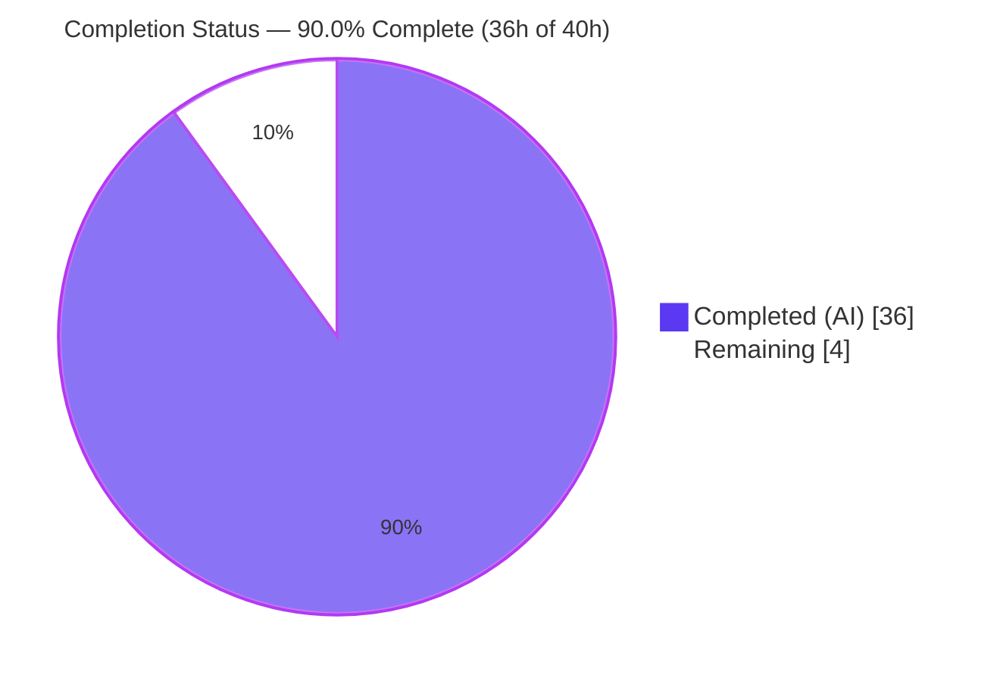
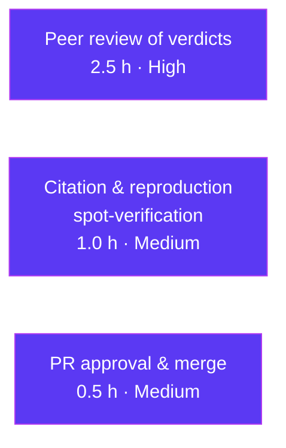

# Blitzy Project Guide
## k6 `ramping-vus` Executor — Concurrency Root-Cause Investigation

> **Task type:** Read-only Q&A / documentation investigation (SWE-AtlasQnA-Repo rule set)
> **Repository:** `go.k6.io/k6` v0.55.0 · **Base commit:** `ddc3b0b1d` · **Branch:** `blitzy-2dfd9699-6d7a-419c-a717-ad211034d886` · **HEAD:** `74e053191`
> **Sole deliverable:** `blitzy/documentation/k6_ddc3b0b1d23c.md` (1,389 lines)
>
> **Color legend (Blitzy brand):** ⬛ Completed / AI Work = Dark Blue `#5B39F3` · ⬜ Remaining / Not Completed = White `#FFFFFF`

---

## 1. Executive Summary

### 1.1 Project Overview

This project answers a k6 user's suspected-concurrency-bug report by producing one runtime-grounded root-cause document that traces how the `ramping-vus` executor manages Virtual User (VU) state across its two scheduling handlers, its interrupt-handling path, and its execution-segment scaling. The target audience is the k6 engineering/maintenance team and the original reporter. The investigation was performed **evidence-first** — building and running the real binary through the canonical `k6 run` entry point and the Go race detector — then transcribing captured output beside every claim. It is strictly read-only: exactly one Markdown file is added and no source, test, or dependency file is changed. Business impact: it authoritatively distinguishes by-design behavior from genuine defects for five reported symptoms.

### 1.2 Completion Status



⬛ **Completed (Dark Blue `#5B39F3`) = 36h**  ·  ⬜ **Remaining (White `#FFFFFF`) = 4h**

| Metric | Value |
|---|---|
| **Total Hours** | **40.0 h** |
| **Completed Hours (AI + Manual)** | **36.0 h** (AI: 36.0 h · Manual: 0.0 h) |
| **Remaining Hours** | **4.0 h** |
| **Percent Complete** | **90.0%** |

> **Calculation (PA1, AAP-scoped hours):** `Completion % = Completed / (Completed + Remaining) = 36 / (36 + 4) = 36 / 40 = 90.0%`.
> The completion percentage measures only AAP-scoped work plus the single path-to-production activity applicable to a read-only documentation deliverable (human review/sign-off).

### 1.3 Key Accomplishments

- ✅ **Single deliverable authored and committed:** `blitzy/documentation/k6_ddc3b0b1d23c.md` (1,389 lines), answering all five questions verdict-first with raw, unedited output and `file:line` citations.
- ✅ **All five questions reproduced through the canonical entry point** (`k6 run`) at sufficient scale, with run-to-run variability characterized (e.g., Q3 linger measured across 220 runs).
- ✅ **Race detector clean:** the exact AAP command reports **NO DATA RACE** (independently re-run: `ok 3.53s`); a race-instrumented binary run against the user's exact scenarios reported `DATA RACE` count = 0.
- ✅ **Segment sum invariant corroborated:** `TestSumRandomSegmentSequenceMatchesNoSegment` passes; per-segment VU counts sum to exactly the configured maximum.
- ✅ **Read-only scope preserved:** `git diff --name-status ddc3b0b1d..HEAD` shows only the doc added; zero `.go`/`.mod`/`.sum` changes; six key REFERENCE source files byte-identical to base.
- ✅ **All `file:line` citations resolve exactly at HEAD `ddc3b0b1d`** (spot-checked across the executor, execution-segment, and CLI-abort subsystems).
- ✅ **Iterative quality assurance:** four review/QA refinement cycles after the initial draft (code-review findings, QA accuracy, QA F1–F5, Q4.1 offset correction).
- ✅ **Temporary artifacts cleaned up:** all `/tmp` scripts and binaries removed; working tree clean.

### 1.4 Critical Unresolved Issues

| Issue | Impact | Owner | ETA |
|---|---|---|---|
| _None blocking._ The single in-scope deliverable is complete, committed, internally consistent, and independently validated. | — | — | — |
| Human sign-off on the negative concurrency verdicts ("no race / no leak / by design") is recommended before the answers are delivered as authoritative. | Low — advisory; verdicts are backed by the race detector + code tracing | Reviewing engineer | Within remaining 2.5 h peer review |

### 1.5 Access Issues

| System/Resource | Type of Access | Issue Description | Resolution Status | Owner |
|---|---|---|---|---|
| — | — | **No access issues identified.** The investigation ran entirely locally with the canonical Go toolchain and k6 binary; no repository permissions, service credentials, or third-party API access were required. | N/A | — |

### 1.6 Recommended Next Steps

1. **[High]** Technical peer review of the Q5 root-cause reasoning (mutex/atomic state, `getVU`/`returnVU` 1:1 invariant, handler happens-before serialization) and confirmation of the "no data race / no buffer leak" verdict. _(1.0 h)_
2. **[High]** Review the Q1/Q2 BY-DESIGN verdicts against the state-transition table and `reserveVUsForGracefulRampDowns()`, and the Q3/Q4 "not reproduced" negatives for adequate bounding. _(1.5 h)_
3. **[Medium]** Independently spot-verify a sample of `file:line` citations at HEAD `ddc3b0b1d` and re-run the AAP race command + segment invariant test. _(1.0 h)_
4. **[Medium]** Approve the PR and merge the single-file deliverable; confirm read-only scope via `git diff --name-status`; optionally forward conclusions to the original reporter. _(0.5 h)_

---

## 2. Project Hours Breakdown

### 2.1 Completed Work Detail

| Component | Hours | Description |
|---|---:|---|
| R1 · Environment & canonical build | 2.0 | Install/confirm `go1.21.13` + `gcc`; `go build -o /tmp/k6bin .`; verify `v0.55.0` banner; enable `CGO_ENABLED=1` race detector. |
| R2 · Q1 — "Stuck" VUs reproduction & analysis | 4.0 | Study per-VU state machine; author rapid up/down + long `gracefulRampDown` script; capture `Start`/`Graceful stop`/`Hard stop` Debug counts and `vus` before/during/after; 2 identical runs; interpret. |
| R3 · Q2 — Handler count mismatch reproduction & analysis | 4.0 | Trace `scheduledVUsHandlerStrategy` vs `maxAllowedVUsHandlerStrategy`; exercise exported `GetExecutionRequirements` (local `replace`, repo unmodified); capture the reserved-VU gap. |
| R4 · Q3 — Ctrl+C linger reproduction & analysis | 5.0 | Trace `handleTestAbortSignals` + `cmd/run.go` closures; drive single/double `SIGINT`; statistically characterize linger across 220 runs; contrast with 30 s `gracefulStop`. |
| R5 · Q4 — Execution-segment skew reproduction & analysis | 6.0 | Study striped scaling; derive static ground truth; launch three real `k6 run` instances; sample per-instance `vus` at aligned timestamps; sum vs max; rapid+skew cross-product; invariant corroboration. |
| R6 · Q5 — Root cause (race / leak) reproduction & analysis | 4.0 | Run race detector twice; build race-instrumented binary vs user's exact scenarios; trace mutex/atomic/happens-before and `getVU`/`returnVU` 1:1 buffer invariant. |
| R7 · Answer document synthesis (1,389 lines) | 6.0 | Compose verdict-first document: raw output, `file:line` citations, rationale, coverage pass, methodology & reproducibility. |
| R8 · QA / review refinement (4 cycles) | 4.0 | Address code-review findings, QA accuracy findings, QA findings F1–F5, and the Q4.1 static-table offset correction (evidenced in git history). |
| R9 · Cleanup & read-only scope preservation | 1.0 | Remove `/tmp` scripts + binaries; confirm working tree clean; verify zero source/test/mod changes and six key files byte-identical to base; produce `git diff` scope proof. |
| **Total Completed** | **36.0** | **Matches Completed Hours in §1.2.** |

### 2.2 Remaining Work Detail

| Category | Hours | Priority |
|---|---:|---|
| Human technical peer review of the five verdicts & their evidence | 2.5 | High |
| Independent spot-verification of `file:line` citations & key reproductions | 1.0 | Medium |
| PR approval & merge (with read-only scope confirmation) | 0.5 | Medium |
| **Total Remaining** | **4.0** | — |

> **Integrity:** §2.1 (36.0 h) + §2.2 (4.0 h) = **40.0 h** = Total Hours in §1.2. §2.2 total (4.0 h) = Remaining Hours in §1.2 = §7 pie "Remaining Work".

### 2.3 Human Task List (detailed, reconciles to §2.2 = 4.0 h)

| ID | Task | Priority | Hours |
|---|---|---|---:|
| HT-1 | Review Q5 root-cause reasoning: per-`vuHandle` mutex + atomic `state` (`vu_handle.go:L71`/`L142-L145`/`L204`), `getVU`/`returnVU` 1:1 WaitGroup invariant (`L60-L67`; `ramping_vus.go:L540`/`L600`/`L608`), and `iterateSteps → go runRemainingGracefulSteps` happens-before edge (`L549-L558`). Confirm "no race / no leak / handlers never simultaneous". | High | 1.0 |
| HT-2 | Review Q1 & Q2 BY-DESIGN verdicts: transitional `toGracefulStop` state vs the state-transition table (`vu_handle.go:L16-L22`/`L24-L55`) and the reserved-VU gap via `reserveVUsForGracefulRampDowns()` (`ramping_vus.go:L307`) with the two independent `cur` counters (`L679`/`L668`). | High | 0.75 |
| HT-3 | Review Q3 & Q4 NOT-REPRODUCED negatives: Ctrl+C linger (0.027–0.117 s ≪ 30 s) and sum-exceeds-max (peak sum = max); confirm they are adequately bounded, incl. the acknowledged Q3 sleep-case `ITER_END` genuine-race bound (0–4). | High | 0.75 |
| HT-4 | Spot-verify a sample of the `.go` `file:line` citations resolve at HEAD `ddc3b0b1d` (e.g. `sed -n '679p' lib/executor/ramping_vus.go`). | Medium | 0.5 |
| HT-5 | Re-run the AAP race command and `TestSumRandomSegmentSequenceMatchesNoSegment` to confirm the gate claims. | Medium | 0.5 |
| HT-6 | Approve & merge the single-file deliverable; confirm read-only scope (`git diff --name-status ddc3b0b1d..HEAD`); optionally forward conclusions to the reporter. | Medium | 0.5 |
| | **Total** | | **4.0** |

---

## 3. Test Results

All tests below originate from Blitzy's autonomous validation logs for this project and were **independently re-executed** during this assessment. This deliverable is a Markdown document with no unit tests of its own; the tests listed are the AAP-designated tests that validate the document's behavioral claims about the k6 `ramping-vus` executor.

| Test Category | Framework | Total Tests | Passed | Failed | Coverage % | Notes |
|---|---|---:|---:|---:|---|---|
| Concurrency / Race (targeted) | `go test -race` | 3 | 3 | 0 | N/A¹ | `TestVUHandleRace`, `TestVUHandleStartStopRace`, `TestRampingVUsGracefulRampDown` — exact AAP command; **NO DATA RACE**; `ok 3.53s`, re-run twice (stable). |
| Segment Invariant | `go test` | 1 | 1 | 0 | N/A¹ | `TestSumRandomSegmentSequenceMatchesNoSegment` — per-segment VU sum = no-segment total; `ok 0.069s`. |
| Race-instrumented runtime | `k6 run` (`-race` binary) | 5 | 5 | 0 | N/A | User's exact Q1–Q5 scenarios run under `/tmp/k6race`; aggregate `DATA RACE` count = **0**. |
| Build Verification | `go build ./...` | 1 | 1 | 0 | N/A | Whole-module compile, exit 0 (clean). |
| **Totals** | | **10** | **10** | **0** | — | 100% pass rate on all in-scope validation tests. |

¹ _Coverage %: not applicable — the in-scope deliverable is a Markdown answer file; no source code was added, so no code-coverage target applies, and none was computed (out of scope for a read-only task)._

> **Known, out-of-scope test noise (not a failure of this deliverable):** running the **whole** `./lib/executor/` package under `-race` may surface pre-existing parallel timing flakes (`TestRampingVUsHandleRemainingVUs`, `TestConstantArrivalRateRunCorrectTiming`). These are pre-existing on the base branch, pass in isolation under `-race`, are unrelated to this documentation change, and are not fixable within the read-only scope. The **targeted** AAP race command is stable and green.

---

## 4. Runtime Validation & UI Verification

**Runtime health:** ✅ Operational. k6 builds and runs in its canonical configuration (`k6 v0.55.0 (go1.21.13, linux/amd64)`); every Q1–Q5 scenario was reproduced through the canonical `k6 run` entry point.

| Scenario / Path | Status | Evidence |
|---|---|---|
| Canonical build + version banner | ✅ Operational | `go build -o /tmp/k6bin .` → `v0.55.0 (commit/ddc3b0b1d2, go1.21.13, linux/amd64)`. |
| Q1 — rapid up/down + long `gracefulRampDown` | ✅ Operational | `Start`=16, `Graceful stop`=16, `Hard stop`=0 (identical across 2 runs); peak `vus`=8 = configured max (never exceeded). |
| Q1 — force `toHardStop` (complementary) | ✅ Operational | `toHardStop` observed with interrupted iterations when `gracefulStop` < iteration duration. |
| Q2 — reserved-VU gap | ✅ Operational | Graceful (max-allowed) `cur` held above scheduled `cur` during ramp-down via `reserveVUsForGracefulRampDowns()`; total envelope never exceeds max. |
| Q3 — single `SIGINT` | ✅ Operational | Abort in 0.027–0.117 s (median ≈ 0.034 s across 220 runs) — far under the 30 s `gracefulStop`; linger NOT reproduced for JS-bound work. |
| Q3 — double `SIGINT` | ✅ Operational | Second signal forces immediate `OSExit`; teardown cut short as designed. |
| Q4 — three real segment instances | ✅ Operational | Peak per-second `sum` of `vus` = configured maximum; 0 breaches; stable across 2 runs; one segment leads by the deterministic striping remainder. |
| Q5 — race detector vs exact scenarios | ✅ Operational | Race-instrumented binary → aggregate `DATA RACE` count = 0; `getVU`/`returnVU` 1:1 WaitGroup invariant holds (clean exits, constant `vus_max`). |
| UI verification | ⚠ N/A | No UI component. k6 is a CLI tool and the deliverable is a Markdown document; there is no front-end to verify. |

---

## 5. Compliance & Quality Review

Cross-mapping the governing **SWE-AtlasQnA-Repo** rule set and AAP deliverables to observed evidence.

| # | Requirement (rule / AAP) | Status | Evidence / Notes |
|---|---|---|---|
| 1 | Deliverable location & name = `blitzy/documentation/<branch>.md` | ✅ Pass | `blitzy/documentation/k6_ddc3b0b1d23c.md` present (1,389 lines). |
| 2 | Investigate by RUNNING first, then write | ✅ Pass | All Q1–Q5 reproduced via `k6 run` + `go test -race`; captured output transcribed. |
| 3 | Observe at sufficient scale; state duration/scale; stable across ≥ 2 runs | ✅ Pass | Q1/Q2/Q4 counts deterministic & identical across runs; Q3 characterized across 220 runs. |
| 4 | Reproduce run-to-run inconsistency (don't engineer it away) | ✅ Pass | Q3 linger distribution + Q3 sleep-case `ITER_END` genuine-race bound (0–4) reported as observed. |
| 5 | Use the real entry point (`k6 run`), not synthetic stand-ins | ✅ Pass | Canonical CLI + `--execution-segment`/`--execution-segment-sequence`; exported `GetExecutionRequirements` for internal counters (labeled). |
| 6 | Canonical build/config; state exact commands | ✅ Pass | `go1.21.13`, `go build -o /tmp/k6bin .`, `CGO_ENABLED=1` documented. |
| 7 | Exercise every implied condition (primary + edge + transitional) | ✅ Pass | Before/during/after ramp-down; single ×2 SIGINT; `toGracefulStop`/`toHardStop`; handler × segment cross-product. |
| 8 | Include actual, complete, unedited output with the command | ✅ Pass | Raw logrus lines, `vus` timelines, race-detector output, and commands included per claim. |
| 9 | Answer every named item explicitly and by name | ✅ Pass | Coverage pass checklists all 8 named mechanisms/flags to verdicts. |
| 10 | Be exact & grounded (`file:line` + specific symbol) | ✅ Pass | Citations resolve exactly at HEAD `ddc3b0b1d` (spot-checked across subsystems). |
| 11 | Report exactly what is observed (incl. "no bug"/"by design") | ✅ Pass | Verdict-first; Q3/Q4 negatives reported honestly as NOT reproduced. |
| 12 | Provide rationale | ✅ Pass | Each answer includes an interpretation grounded in code. |
| 13 | Read-only scope; add no code but the answer document | ✅ Pass | `git diff` = only the doc; 0 source/test/mod changes; 6 key files byte-identical to base. |
| 14 | Clean up temporary scripts/binaries | ✅ Pass | `/tmp` scratch removed; working tree clean. |

**Fixes applied during autonomous validation:** Q4.1 static-table ramp-down offsets shifted +2 s to match the stated 5 s hold (verdicts unchanged; 0 invariant violations). **Outstanding compliance items:** none.

---

## 6. Risk Assessment

| Risk | Category | Severity | Probability | Mitigation | Status |
|---|---|---|---|---|---|
| T1 · Strong negative verdicts ("no race / no leak / by design") rest on a bounded number of runs; concurrency defects can be rare/environment-dependent | Technical | Medium | Low | Race detector (sound tool) clean ×2 + race-instrumented binary vs exact scenarios (`DATA RACE`=0); residual uncertainty honestly bounded (Q3 sleep-case `ITER_END` 0–4). Human sign-off recommended. | Mitigated |
| T2 · Run-to-run timing variability in observations (Q3 linger tail 0.117 s; `ITER_END` up to 4) | Technical | Low | Medium | Distributions reported across 220 runs, not single points; magnitude claims confirmed across ≥ 2 runs. | Mitigated |
| T3 · Citation drift — 19 unique `.go` `file:line` anchors could shift if source changes | Technical | Low | Low | Anchored to immutable commit `ddc3b0b1d`; all verified to resolve exactly. | Resolved |
| T4 · `k6 version` commit stamp is a "moving target" (advances per doc amendment) | Technical | Low | Low | Doc explains the VCS-stamp behavior and gives a throwaway-clone recipe to reproduce the immutable baseline banner `commit/ddc3b0b1d2`. | Resolved |
| O1 · Pre-existing whole-package `-race` parallel timing flakes | Operational | Low | Low | Documented as pre-existing/out-of-scope; pass in isolation; targeted AAP command stable. | Accepted |
| O2 · No deployment/monitoring/health-check concerns | Operational | None | — | Deliverable is a Markdown document; no runtime service is shipped. | N/A |
| S1 · Security surface | Security | None | — | No code changes, no dependencies added, no credentials, no network exposure; `/tmp` artifacts removed. | N/A |
| I1 · Integration surface | Integration | None | — | No external services/APIs/network; ran entirely locally; segment "instances" are local processes. | N/A |
| P1 · Read-only scope must be preserved through merge | Process | Low | Low | `git diff ddc3b0b1d..HEAD` proves only the doc added; 6 key source files byte-identical to base. | Verified |

**Risk summary:** 0 High-severity risks · 1 Medium (T1, mitigated) · remainder Low/None — consistent with a thoroughly-validated, read-only, single-artifact documentation deliverable.

---

## 7. Visual Project Status

### 7.1 Project Hours Breakdown


⬛ **Completed Work (Dark Blue `#5B39F3`) = 36 h**  ·  ⬜ **Remaining Work (White `#FFFFFF`) = 4 h**

> **Integrity:** "Remaining Work" = 4 h = §1.2 Remaining Hours = §2.2 total. "Completed Work" = 36 h = §2.1 total. Sum = 40 h = §1.2 Total Hours.

### 7.2 Remaining Hours by Category (from §2.2)



| Category | Hours | Priority |
|---|---:|---|
| Peer review of verdicts & evidence | 2.5 | High |
| Citation & reproduction spot-verification | 1.0 | Medium |
| PR approval & merge | 0.5 | Medium |
| **Total** | **4.0** | — |

---

## 8. Summary & Recommendations

**Achievements.** The project is **90.0% complete** (36 of 40 hours). The autonomous work produced a single, rigorously evidence-grounded investigation document that answers all five of the user's questions verdict-first, with complete raw output, `file:line` citations anchored to HEAD `ddc3b0b1d`, and reproducible commands. Every symptom the user reported is explained: Q1 (transitional `toGracefulStop` state), Q2 (deliberate reserved-VU gap between two independent handler counters), Q3 (distinct Ctrl+C abort path — linger not reproduced), Q4 (deterministic striping remainder — sum never exceeds max), and Q5 (no data race, no buffer leak, handlers never simultaneous). **Overall finding: no genuine defect.**

**Remaining gaps & critical path to production.** For a read-only documentation deliverable, "production" means the answer is reviewed and accepted. The remaining 4 hours are entirely human: peer review of the concurrency verdicts (2.5 h), independent spot-verification of citations and key reproductions (1.0 h), and PR approval/merge (0.5 h). There is no outstanding code, configuration, integration, or deployment work — and none is in scope.

**Success metrics (all met).** Deliverable present at the mandated path ✅ · all five questions answered verdict-first ✅ · race detector clean ✅ · segment invariant holds ✅ · citations resolve at HEAD ✅ · read-only scope preserved (only the doc added) ✅ · temporary artifacts cleaned up ✅.

**Production readiness.** The deliverable is production-ready pending human sign-off. The single Medium-severity risk (T1 — negative concurrency verdicts) is mitigated by the race detector and code tracing and is fully addressed by the recommended 2.5 h technical peer review. The completion is held at 90.0% (not higher) to reserve honest, meaningful hours for that human review of the "no bug" conclusions, which cannot be performed autonomously.

| Metric | Value |
|---|---|
| AAP requirements delivered | 9 / 9 (100% of scoped items) |
| Completion (hours-based) | 90.0% (36 h / 40 h) |
| In-scope validation tests passing | 10 / 10 (100%) |
| High-severity risks | 0 |
| Source files modified | 0 (read-only preserved) |

---

## 9. Development Guide

Every command below was executed in the assessment environment with the shown result. Run from the repository root unless noted.

### 9.1 System Prerequisites

- **OS:** Linux x86_64 (validated on Ubuntu-based container). **CPU:** ≥ 2 cores recommended for the race detector.
- **Go:** `go1.21.13` (matches `go.mod`'s `toolchain go1.21.13`).
- **C compiler:** `gcc` (validated `15.2.0`) — required for cgo-backed `-race`.
- **git** and standard coreutils.

```bash
go version        # => go version go1.21.13 linux/amd64
gcc --version     # => gcc (Ubuntu ...) 15.2.0  (first line)
```

### 9.2 Environment Setup

```bash
# Repository root of the delivery checkout:
cd /tmp/blitzy/k6/blitzy-2dfd9699-6d7a-419c-a717-ad211034d886_bc59b0
git rev-parse --short HEAD          # => 74e053191  (branch blitzy-2dfd9699...)
go env GOVERSION CGO_ENABLED        # => go1.21.13  and  1
```

No new dependencies are required — k6's pinned modules are used as-is (`go.mod`/`go.sum` untouched).

### 9.3 Build

```bash
# Whole-module compile (clean check):
go build ./...                      # exit 0, no output

# Canonical k6 binary + version banner:
go build -o /tmp/k6bin .
/tmp/k6bin version
# => k6bin v0.55.0 (commit/<HEAD10>, go1.21.13, linux/amd64)

# Immutable BASELINE banner (commit/ddc3b0b1d2) via throwaway clone at base:
git clone -q . /tmp/k6base && git -C /tmp/k6base checkout -q ddc3b0b1d
( cd /tmp/k6base && CGO_ENABLED=1 go build -o /tmp/k6bin . ) && /tmp/k6bin version
# => k6bin v0.55.0 (commit/ddc3b0b1d2, go1.21.13, linux/amd64)
rm -rf /tmp/k6base                  # clean up
```

### 9.4 Race Detector Setup & Tests

```bash
# Exact AAP race command (expect: ok ~3.5s, NO DATA RACE):
CGO_ENABLED=1 go test -race -run 'TestVUHandleRace|TestVUHandleStartStopRace|TestRampingVUsGracefulRampDown' ./lib/executor/
# => ok  go.k6.io/k6/lib/executor  3.53s

# Segment sum invariant (expect: ok):
go test -run TestSumRandomSegmentSequenceMatchesNoSegment ./lib/executor/
# => ok  go.k6.io/k6/lib/executor  0.069s

# Optional race-instrumented binary (for Q5 corroboration):
CGO_ENABLED=1 go build -race -o /tmp/k6race .
```

### 9.5 Reproducing the Scenarios (example usage)

```bash
# Confirm segment flags are present on the canonical entry point:
/tmp/k6bin run --help | grep -i execution-segment
# =>   --execution-segment string            limit execution ... e.g. 10%, 1/3, 0.2:2/3
# =>   --execution-segment-sequence string   the execution segment sequence

# Q4 three-way even split (three local instances):
/tmp/k6bin run --execution-segment '0:1/3'   --execution-segment-sequence '0,1/3,2/3,1' script.js &
/tmp/k6bin run --execution-segment '1/3:2/3' --execution-segment-sequence '0,1/3,2/3,1' script.js &
/tmp/k6bin run --execution-segment '2/3:1'   --execution-segment-sequence '0,1/3,2/3,1' script.js &
wait
```

A minimal Q1-style ramping-vus script (rapid up/down + long `gracefulRampDown`):

```javascript
import { sleep } from 'k6';
export const options = {
  scenarios: { stuck: {
    executor: 'ramping-vus', startVUs: 0,
    stages: [ { duration: '3s', target: 8 }, { duration: '3s', target: 0 },
              { duration: '3s', target: 8 }, { duration: '3s', target: 0 } ],
    gracefulRampDown: '10s', gracefulStop: '5s',
  } },
};
export default function () { sleep(2); }
```

Running it prints `vus ... max=8` (equal to the configured target, never exceeded).

### 9.6 Verification & Read-Only Scope Proof

```bash
# View the deliverable:
wc -l blitzy/documentation/k6_ddc3b0b1d23c.md   # => 1389

# Resolve a citation (example):
sed -n '679p' lib/executor/ramping_vus.go
# => func (rs *rampingVUsRunState) scheduledVUsHandlerStrategy() func(lib.ExecutionStep) {

# Prove read-only scope (expect ONLY the doc):
git diff --name-status ddc3b0b1d..HEAD
# => A  blitzy/documentation/k6_ddc3b0b1d23c.md
```

### 9.7 Troubleshooting

- **`race: this build requires cgo`** → export `CGO_ENABLED=1` and ensure `gcc` is installed.
- **Whole-package `-race` flakes** (`TestRampingVUsHandleRemainingVUs`, `TestConstantArrivalRateRunCorrectTiming`) → pre-existing, timing-related; run the **targeted** AAP command above, or isolate with `-p 1 -count=1`. They pass in isolation and are unrelated to this deliverable.
- **`k6 version` shows a different commit than `ddc3b0b1d2`** → expected: the banner stamps the current git HEAD (a moving target on this branch). Reproduce the immutable baseline via the throwaway-clone recipe in §9.3.
- **`externally-managed-environment` on `pip`** → not applicable; this task uses no Python packages.

---

## 10. Appendices

### A. Command Reference

| Purpose | Command |
|---|---|
| Go / gcc version | `go version` · `gcc --version` |
| Clean compile | `go build ./...` |
| Build k6 | `go build -o /tmp/k6bin .` · `/tmp/k6bin version` |
| Build race binary | `CGO_ENABLED=1 go build -race -o /tmp/k6race .` |
| AAP race tests | `CGO_ENABLED=1 go test -race -run 'TestVUHandleRace\|TestVUHandleStartStopRace\|TestRampingVUsGracefulRampDown' ./lib/executor/` |
| Segment invariant | `go test -run TestSumRandomSegmentSequenceMatchesNoSegment ./lib/executor/` |
| Segment flags help | `/tmp/k6bin run --help \| grep -i execution-segment` |
| Read-only scope proof | `git diff --name-status ddc3b0b1d..HEAD` |
| Branch commits | `git log --oneline ddc3b0b1d..HEAD` |

### B. Port Reference

| Port | Use | Status |
|---|---|---|
| — | **None required.** The investigation uses no network ports. k6 exposes an optional REST API on `:6565` by default, but it was **not** used in this investigation. | N/A |

### C. Key File Locations

| Path | Role |
|---|---|
| `blitzy/documentation/k6_ddc3b0b1d23c.md` | **The sole deliverable** (answer document). |
| `lib/executor/ramping_vus.go` | Two handlers, `iterateSteps`, `runRemainingGracefulSteps`, `reserveVUsForGracefulRampDowns` (Q2/Q5). |
| `lib/executor/vu_handle.go` | Per-VU state machine, mutex + atomic `state`, `getVU`/`returnVU` invariant (Q1/Q5). |
| `lib/execution.go` | VU buffer channel `es.vus`, `GetPlannedVU`/`ReturnVU` (Q5). |
| `lib/execution_segment.go` | Striped scaling `ScaleInt64`/`GetStripedOffsets` (Q4). |
| `lib/executor/base_config.go` | `DefaultGracefulStopValue = 30s` (Q3). |
| `cmd/common.go`, `cmd/run.go` | Two-stage interrupt handling (Q3). |
| `lib/executor/ramping_vus_test.go` | `TestSumRandomSegmentSequenceMatchesNoSegment` (Q4). |
| `lib/executor/vu_handle_test.go` | `TestVUHandleRace`, `TestVUHandleStartStopRace` (Q5). |

### D. Technology Versions

| Component | Version |
|---|---|
| Go toolchain | `go1.21.13` |
| gcc | `15.2.0` |
| k6 | `v0.55.0` (base commit `ddc3b0b1d`) |
| Delivery HEAD | `74e053191` |

### E. Environment Variable Reference

| Variable | Value | Purpose |
|---|---|---|
| `CGO_ENABLED` | `1` | Enables cgo, required by the `-race` data-race detector. |
| `GOVERSION` | `go1.21.13` | Reported by `go env`; matches the `go.mod` toolchain pin. |

### F. Developer Tools Guide

- **Go race detector (`go test -race`)** — sound data-race detector (reports true races when observed; not exhaustive across all schedules). Requires `CGO_ENABLED=1` + `gcc`. Primary tool for the Q5 verdict.
- **k6 canonical CLI (`k6 run`)** — the real entry point; `--execution-segment` / `--execution-segment-sequence` drive the Q4 three-way split; `-v --log-output=stderr` exposes the executor's logrus `Debug` events (`Start`/`Graceful stop`/`Hard stop`); `--out json` exposes `vus`/`vus_max` metrics.
- **git diff / log** — read-only scope proof and commit-authorship verification.

### G. Glossary

| Term | Meaning |
|---|---|
| **VU** | Virtual User — an independent goroutine running the test script. |
| **`ramping-vus`** | Executor that ramps the number of VUs up/down across configured `stages`. |
| **`gracefulStop`** | Time a shed VU may keep running to finish its current iteration at test end (default 30 s). |
| **`gracefulRampDown`** | Time a shed VU may keep running to finish its iteration during a ramp-down. |
| **Scheduled handler** | `scheduledVUsHandlerStrategy` — tracks raw/scheduled VUs (`start`/`gracefulStop`). |
| **Graceful / max-allowed handler** | `maxAllowedVUsHandlerStrategy` — tracks max-allowed VUs (reserves extras during ramp-down; `hardStop`). |
| **`toGracefulStop` / `toHardStop`** | Transitional per-VU states — the "neither active nor stopped" conditions in Q1. |
| **Execution segment** | A slice of total load assigned to one instance; striped scaling distributes VUs deterministically across a sequence. |
| **Striping remainder** | The deterministic rounding leftover that makes one segment show one extra VU (Q4). |
| **Data race** | Concurrent unsynchronized access to shared memory with at least one write — the Q5 subject (none found). |