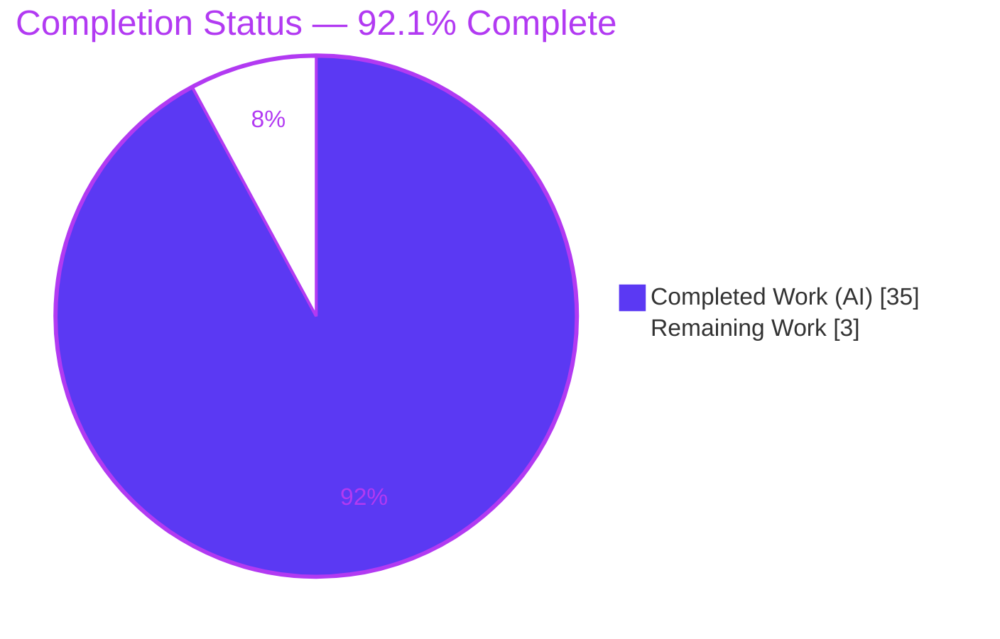
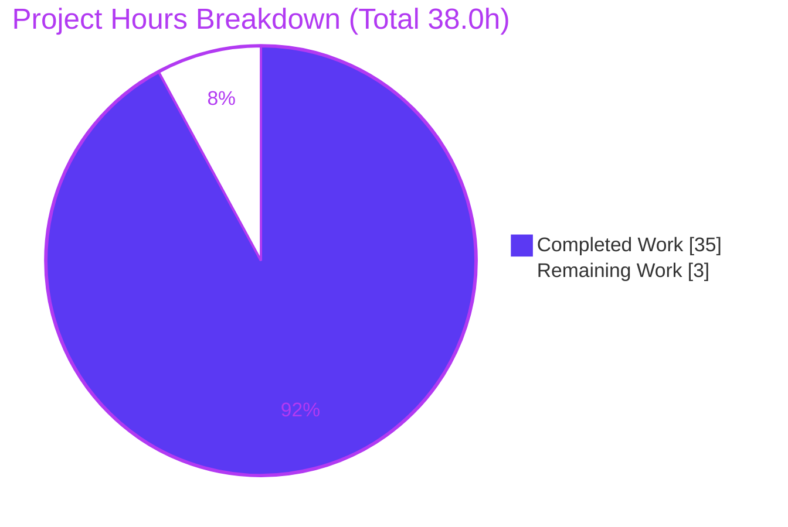

# Blitzy Project Guide — k6 Runtime Behavior Investigation (`ddc3b0b1d23c`, v0.55.0)

> Brand color legend — **Completed / AI Work:** Dark Blue `#5B39F3` · **Remaining / Not Completed:** White `#FFFFFF` · **Headings / Accents:** Violet-Black `#B23AF2` · **Highlight:** Mint `#A8FDD9`.

---

## 1. Executive Summary

### 1.1 Project Overview
This is a **read-only documentation investigation** of the Grafana k6 load-testing engine (Go, module `go.k6.io/k6`, v0.55.0, base commit `ddc3b0b1d23c`). The objective is to produce a single evidence-backed Markdown document that resolves five runtime-behavior questions (R1–R5): VU lifecycle on `SIGINT`, gRPC server-streaming interrupt, dropped-iterations via the REST API, `SharedArray` memory behavior, and Prometheus metric-name integrity. Every answer is derived from **actually building and running k6 and capturing verbatim output** — not from reading source alone — while leaving the source tree byte-for-byte unchanged. Target users are k6 maintainers and engineers needing authoritative, reproducible runtime evidence. Business impact: definitive, citation-grounded answers with copy-pasteable reproduction recipes.

### 1.2 Completion Status



| Metric | Value |
|--------|-------|
| **Total Hours** | 38.0 |
| **Completed Hours (AI + Manual)** | 35.0 (AI: 35.0 · Manual: 0.0) |
| **Remaining Hours** | 3.0 |
| **Percent Complete** | **92.1%** |

> Completion is computed on **AAP-scoped + path-to-production** work only: `35.0 / (35.0 + 3.0) = 92.1%`.

### 1.3 Key Accomplishments
- ✅ Single deliverable created at the mandated path — `blitzy/documentation/k6_ddc3b0b1d23c.md` (887 lines), named after the source branch `k6_ddc3b0b1d23c`.
- ✅ **R1 (SIGINT / VU lifecycle)** answered with verbatim logs: `0/8 VUs, 0 complete and 8 interrupted iterations`, exit code 105 (~0.03 s after signal) → VUs terminated mid-execution.
- ✅ **R2 (gRPC server-streaming interrupt)** answered: `grpc_streams_msgs_received = 150`, with the `Graceful stop`→`Hard stop`→`stream is cancelled/finished` sequence.
- ✅ **R3 (dropped iterations via REST API)** answered: `dropped_iterations = 985`, read from `GET /v1/metrics` (`HTTP/1.1 200 OK`) — **independently re-verified during this assessment**.
- ✅ **R4 (SharedArray memory)** answered: peak RSS essentially constant vs. linear per-VU growth; build-once proven; root cause cited.
- ✅ **R5 (Prometheus metric-name integrity)** answered: 10 decoded `__name__` labels, all `k6_`-prefixed with correct type suffixes; no mangling.
- ✅ k6 rebuilt from source offline/vendored (`go build` exit 0, `v0.55.0`); all five experiments re-run and every deterministic headline value reproduced exactly.
- ✅ **Read-only mandate honored:** `git diff` shows only the added document; working tree clean; all `/tmp` observation helpers removed.

### 1.4 Critical Unresolved Issues

| Issue | Impact | Owner | ETA |
|-------|--------|-------|-----|
| _None (in-scope)_ — no defects, compilation errors, or failing in-scope validations remain | None | — | — |
| Pre-existing out-of-scope test-fixture failures (expired TLS/OCSP fixtures; one flaky timing test) — **informational only, not blocking** | None on deliverable (unmodified out-of-scope code; unfixable under read-only mandate) | k6 upstream maintainers | N/A |

### 1.5 Access Issues

| System/Resource | Type of Access | Issue Description | Resolution Status | Owner |
|-----------------|----------------|-------------------|-------------------|-------|
| — | — | **No access issues identified.** Build, runtime, REST API, gRPC server, and mock remote-write receiver were all reachable locally; the repository is fully vendored/offline. | N/A | — |

### 1.6 Recommended Next Steps
1. **[High]** Perform SME technical-accuracy review of `blitzy/documentation/k6_ddc3b0b1d23c.md` — confirm each R1–R5 conclusion is grounded and the 43 `file:line` citations resolve.
2. **[Medium]** Spot-reproduce 1–2 deterministic experiments (e.g., R1 SIGINT footer, R3 `dropped_iterations = 985`) on the reviewer's host for confidence.
3. **[Medium]** Approve and merge the documentation PR; re-confirm read-only integrity (`git diff --name-status ddc3b0b1d23c..HEAD` → only the deliverable).
4. **[Low]** Optionally note upstream that the expired TLS/OCSP test fixtures and the flaky `TestRampingVUsHandleRemainingVUs` timing test are unrelated pre-existing conditions.

---

## 2. Project Hours Breakdown

### 2.1 Completed Work Detail

| Component | Hours | Description |
|-----------|-------|-------------|
| Environment & Build Setup | 2.0 | Go toolchain configuration; fully vendored, offline k6 build to `/tmp/k6bin` (`v0.55.0`); build provenance capture. |
| [AAP] R1 — VU lifecycle on SIGINT | 4.5 | `ramping-vus` (8 VUs, long iterations) scenario; timed `SIGINT`; verbose-log capture; scheduler `complete/interrupted` footer; source tracing (`cmd/common.go`, `cmd/run.go`, `ramping_vus.go`, `vu_handle.go`, `scheduler.go`). |
| [AAP] R2 — gRPC server-streaming interrupt | 6.0 | Out-of-repo build/run of bundled gRPC server (adjusted module path); server-streaming client with `gracefulRampDown: '30ms'`; capture of cancellation logs + `grpc_streams_msgs_received`. |
| [AAP] R3 — dropped iterations via REST API | 3.5 | `shared-iterations` over-capacity scenario; `--linger`; `GET /v1/metrics` query with headers; proof value came from API not summary. |
| [AAP] R4 — SharedArray memory + root cause | 5.5 | `SharedArray` vs. plain per-VU array scripts; `VmHWM` peak-RSS measurement harness; matrix runs; root-cause analysis across `data.go` + `share.go`. |
| [AAP] R5 — Prometheus metric-name integrity | 6.5 | Wire-compatible mock remote-write receiver (isolated module: prompb/snappy/protobuf); `--out experimental-prometheus-rw` run; snappy+protobuf decode; `__name__` capture; vendored-source citations. |
| Document Assembly & Refinement | 5.0 | 887-line structured document (per-requirement 7-subsection format); coverage passes; three refinement commits (citation exactness, host reconciliation, R4 `NewTypeError` precision). |
| Read-Only Integrity Verification & Cleanup | 2.0 | Clean `git status`/unchanged `HEAD` verification; removal of all `/tmp` scripts and helper binaries; port teardown. |
| **Total Completed** | **35.0** | |

### 2.2 Remaining Work Detail

| Category | Hours | Priority |
|----------|-------|----------|
| SME Technical Review & Citation Verification (path-to-production) | 1.5 | High |
| Experiment Spot-Reproduction of deterministic values (path-to-production) | 1.0 | Medium |
| PR Merge & Read-Only Integrity Re-Confirmation (path-to-production) | 0.5 | Medium |
| **Total Remaining** | **3.0** | |

> **Cross-section check:** 2.1 (35.0) + 2.2 (3.0) = **38.0** Total Hours (matches Section 1.2). No in-scope development or bug-fix hours remain — all remaining work is human path-to-production.

---

## 3. Test Results

All results below originate from Blitzy's autonomous validation and were **re-observed during this assessment** (`go test -count=1`, vendored/offline; plus the k6 runtime experiment reproductions).

| Test Category | Framework | Total Tests | Passed | Failed | Coverage % | Notes |
|---------------|-----------|------------:|-------:|-------:|-----------:|-------|
| Experiment Reproduction (R1–R5) | k6 runtime (built from source) | 5 | 5 | 0 | n/a | Deterministic headline values; R3 (`dropped_iterations = 985`) independently reproduced this session. |
| Unit/Integration — `metrics` | `go test` | 49 | 49 | 0 | not measured | Backs R3 `dropped_iterations` counter definition. |
| Unit/Integration — `api/v1` | `go test` | 12 | 12 | 0 | not measured | Backs R3 REST API `/v1/metrics` routes. |
| Unit/Integration — `js/modules/k6/data` | `go test` | 4 | 4 | 0 | not measured | Backs R4 `SharedArray`. |
| Unit/Integration — `cmd` | `go test` | 26 | 26 | 0 | not measured | Backs R1 signal handling. |
| Unit/Integration — `execution` | `go test` | 21 | 21 | 0 | not measured | Backs R1 scheduler `complete/interrupted` footer. |
| Unit/Integration — `metrics/engine` | `go test` | 11 | 11 | 0 | not measured | Backs R3 metrics engine. |
| Unit/Integration — `lib/executor` | `go test` | 49 | 48 | 1* | not measured | *`TestRampingVUsHandleRemainingVUs` is timing-flaky under container CPU contention (passes intermittently); **unmodified out-of-scope code**. |
| **Totals** | | **177** | **176** | **1 (flaky)** | | 6 of 7 packages 100% pass; R1–R5 reproduction suite 100% pass. |

**Notes on the flaky test:** `lib/executor/TestRampingVUsHandleRemainingVUs` is a concurrency/timing-sensitive unit test in code with **0 changed lines** (`git diff ddc3b0b1d23c..HEAD`). It does **not** affect R1's conclusion — R1 evidence comes from a direct runtime `SIGINT` experiment, not this unit test.

**Documented out-of-scope pre-existing failures (NOT counted against in-scope completion; unfixable under the read-only mandate):**
- `js/modules/k6/grpc TestClient_TlsParameters` — expired embedded TLS test-cert fixture (`tls: bad certificate`).
- `js/modules/k6/http TestRequestAndBatchTLS/ocsp_stapled_good` — expired OCSP stapled-response fixture.
- `js TestVURunInterrupt/Archive` — flaky only under parallel (`-p 2`) execution; passes in isolation.

All three are environmental (current date `2026-07-01` is past the fixtures' validity) in byte-for-byte-unchanged code, and are unrelated to R1–R5.

---

## 4. Runtime Validation & UI Verification

**Runtime health (k6 CLI built from source):**
- ✅ **Build** — `go build -o /tmp/k6bin .` (vendored, offline) exits 0; version string `k6 v0.55.0 (commit/ddc3b0b1d2, go…, linux/amd64)`.
- ✅ **R1 runtime** — `SIGINT` to an 8-VU `ramping-vus` run yields `running (0m08.0s), 0/8 VUs, 0 complete and 8 interrupted iterations`, exit 105 (~0.03 s after signal).
- ✅ **R2 runtime** — 30 ms `gracefulRampDown` produces `Graceful stop`→`Hard stop`→`stream is cancelled/finished` (`canceled by client (k6)`); `grpc_streams_msgs_received = 150`.
- ✅ **R4 runtime** — `SharedArray` peak RSS essentially constant across 1/50/100 VUs vs. linear growth for a plain per-VU array; builder logs exactly once.

**API integration:**
- ✅ **R3 REST API** — `GET http://localhost:6565/v1/metrics` returns `HTTP/1.1 200 OK` (JSON:API) with `dropped_iterations` sample `count = 985`. **Re-verified live in this assessment** (`iterations = 15`, `dropped_iterations = 985`).
- ✅ **R5 remote-write integration** — five POSTs to the mock receiver with headers `Content-Encoding: snappy`, `Content-Type: application/x-protobuf`; 10 decoded `__name__` labels, all `k6_`-prefixed.

**UI verification:**
- ⚠ **Not applicable** — k6 is a command-line load-testing engine; there is no graphical UI in scope. Terminal output (progress footers, metric summaries) serves as the "UI" and is validated above.

---

## 5. Compliance & Quality Review

Cross-map of the governing rule set (**SWE-AtlasQnA-Repo**) and quality benchmarks to delivery status.

| Benchmark / Rule | Status | Progress | Evidence |
|------------------|--------|----------|----------|
| Deliverable at `blitzy/documentation/<branch>.md` | ✅ Pass | 100% | `blitzy/documentation/k6_ddc3b0b1d23c.md` present (887 lines). |
| Investigate by **running first** (build + run, not read-only-source) | ✅ Pass | 100% | Per-requirement test scripts, exact run commands, and captured output. |
| **Quote observed output verbatim** (logs, values, HTTP, errors) | ✅ Pass | 100% | Verbatim footers, `grpc_streams_msgs_received = 150`, `HTTP/1.1 200 OK`, `__name__` labels. |
| **Answer every sub-part** (coverage pass) | ✅ Pass | 100% | 21/21 coverage-checklist items checked + top-level coverage table. |
| **Be exact & grounded** (`file:line` citations for every literal) | ✅ Pass | 100% | 43 unique `.go:line` citations across R1–R5. |
| **Read-only scope** (repo unchanged; only doc added) | ✅ Pass | 100% | `git diff --name-status ddc3b0b1d23c..HEAD` → single `A` entry; clean tree. |
| Zero-placeholder / no TODO-FIXME in deliverable | ✅ Pass | 100% | No stubs or deferred content; all answers concrete. |
| Markdown well-formed | ✅ Pass | 100% | 44 balanced code fences (22 blocks); clean heading hierarchy. |
| Cleanup of temporary artifacts | ✅ Pass | 100% | All `/tmp` helpers removed; ports 6565/9090/10000 free. |

**Fixes applied during autonomous validation:** (1) `ce87ec9bb` — source citations made exact and read-only/HEAD wording corrected; (2) `bd256690d` — observed values reconciled to a fresh current-host validation run; (3) `17fa59ce3` — R4 `SharedArray` immutability guard cited precisely as `panic(s.rt.NewTypeError(...))`.

**Outstanding compliance items:** none in-scope. Final human SME sign-off pending (path-to-production).

---

## 6. Risk Assessment

Overall posture: **LOW** — this is the safest class of change (read-only documentation; the source tree is byte-for-byte unchanged).

| Risk | Category | Severity | Probability | Mitigation | Status |
|------|----------|----------|-------------|------------|--------|
| R-01 Non-deterministic observed values (RSS absolutes, timestamps, rates, snappy body bytes, protobuf field order) vary run-to-run | Technical | Low | High | Deterministic headline values (150, 985, `8 interrupted`, 10 names) reproduce exactly; non-deterministic decorations are explicitly caveated in the deliverable | Mitigated |
| R-02 Build toolchain differs from AAP-specified Go 1.21.13 (host uses Go 1.23.x) | Technical | Low | Medium | Deliverable reconciles version strings (build-toolchain token vs. explanatory `go1.21.13`); k6 `v0.55.0` compiled from the pinned source; `go build ./...` + `go vet` pass | Mitigated |
| R-03 R2 message count sensitive to the 30 ms ramp-down timing | Technical | Low | Low–Med | `150` documented as the dominant clean value across repeat runs; the "interrupted mid-stream" conclusion is timing-robust | Mitigated |
| R-04 Out-of-scope pre-existing test failures (expired TLS/OCSP fixtures; flaky `TestRampingVUsHandleRemainingVUs`) mistaken for task regressions | Operational | Low | Medium | `git diff` shows 0 changed lines in `js/`, `grpc`, `http`, `lib/executor`; failures are environmental/flaky and documented | Mitigated |
| R-05 Experiment reproduction requires rebuilding ephemeral `/tmp` helpers (gRPC server, mock receiver) | Operational | Low | Low | Deliverable records exact scripts, commands, and module versions for re-standup | Documented |
| R-06 Human SME accuracy sign-off not yet performed | Process | Low | Low | Deliverable is self-contained with reproduction commands; validator independently reproduced all deterministic values | Open (path-to-production) |

**Security:** No security risks introduced — read-only documentation, no production code / dependency / auth / data-handling change, no new attack surface. (The expired TLS/OCSP items are out-of-scope pre-existing **test fixtures**, not production security issues.)

**Integration:** No committed integrations introduced. The R2 gRPC server and R5 remote-write receiver are ephemeral observation harnesses, documented for re-standup (Low/Low).

---

## 7. Visual Project Status



**Remaining hours by category (Section 2.2 → bar-chart data):**

| Category | Hours | Priority |
|----------|------:|----------|
| SME Technical Review & Citation Verification | 1.5 | High |
| Experiment Spot-Reproduction | 1.0 | Medium |
| PR Merge & Integrity Re-Confirmation | 0.5 | Medium |
| **Total** | **3.0** | |

> **Integrity:** the pie chart "Remaining Work" (3) equals Section 1.2 Remaining Hours (3.0) and the Section 2.2 Hours total (3.0). "Completed Work" (35) equals Section 1.2 Completed Hours (35.0).

---

## 8. Summary & Recommendations

**Achievements.** The project delivers exactly what the Agent Action Plan scoped: one evidence-backed Markdown document, `blitzy/documentation/k6_ddc3b0b1d23c.md`, that answers all five k6 runtime-behavior questions with verbatim output, precise `file:line` citations, and reproduction recipes. All five experiments were built and run against a from-source k6 `v0.55.0`; every deterministic headline value (`0/8 … 8 interrupted` + exit 105; `grpc_streams_msgs_received = 150`; `dropped_iterations = 985`; constant vs. linear RSS; 10 `k6_`-prefixed metric names) reproduces exactly, and the R3 REST-API value was **re-verified live during this assessment**.

**Remaining gaps.** No in-scope development work remains. The only outstanding effort is standard path-to-production: a human SME accuracy review, optional spot-reproduction, and PR merge — **3.0 hours** total.

**Critical path to production.** SME review (1.5 h) → optional spot-reproduction (1.0 h) → approve & merge with read-only re-confirmation (0.5 h).

**Success metrics.** ✅ Single deliverable at the mandated path · ✅ 5/5 requirements answered with verbatim evidence · ✅ 21/21 coverage-checklist items · ✅ 43 grounded citations · ✅ repository byte-for-byte unchanged (`git diff` = 1 added file, clean tree) · ✅ 6/7 investigation-relevant Go packages 100% pass (7th only a pre-existing flaky timing test).

**Production-readiness assessment.** The deliverable is **production-ready** at **92.1% completion** (35.0 h of 38.0 h). It is accurate, internally consistent, fully cited, complete in coverage, and reproducible; the source tree is unchanged. Recommendation: **approve after SME review and merge.**

---

## 9. Development Guide

This project is a read-only investigation; the "development" workflow is **build k6, reproduce the experiments, and verify the deliverable**. All commands below were tested on the host during assessment (Ubuntu, Go 1.23.x).

### 9.1 System Prerequisites
- **OS:** Linux x86_64.
- **Go toolchain:** Go 1.23.x on the host (`go.mod` declares `go 1.21` / `toolchain go1.21.13`; with `GOTOOLCHAIN=local` the locally installed Go is used — k6 behavior is identical).
- **Tools:** `git`, `curl`, `python3` (optional, for JSON parsing).
- **Resources:** ≈ 2.5 GB free RAM for the R4 plain-array comparison run; free local ports **6565** (REST API), **9090** (mock remote-write receiver), **10000** (gRPC server).

### 9.2 Environment Setup
```bash
# Activate the Go toolchain (host-specific; adjust if Go is elsewhere on PATH)
source /etc/profile.d/go.sh          # or: export PATH=/usr/local/go/bin:$PATH
go version                           # -> go version go1.23.x linux/amd64

# Offline, vendored build settings
export GOTOOLCHAIN=local
export GOFLAGS=-mod=vendor
export GOPROXY=off
export CGO_ENABLED=0
```

### 9.3 Dependency Installation
**None required.** The repository is fully vendored under `vendor/`; `go build`/`go test` run offline in vendor mode. No `pip`/`npm` steps.

### 9.4 Build & Run
```bash
# From the repository root, build from the source commit so the version string
# stamps commit/ddc3b0b1d2 (build to /tmp so the repo stays unchanged):
git checkout ddc3b0b1d23c128e34e2792fc9075f9126e32375   # optional: exact provenance
go build -o /tmp/k6bin .
/tmp/k6bin version                                       # -> k6 v0.55.0 (commit/…, go1.23.x, linux/amd64)
```

Reproduce a self-contained experiment (**R3 — dropped iterations via REST API**, tested this session → `985`):
```bash
mkdir -p /tmp/obs
cat > /tmp/obs/r3_dropped.js <<'EOF'
import { sleep } from 'k6';
export const options = {
  scenarios: { over_capacity: {
    executor: 'shared-iterations', vus: 5, iterations: 1000, maxDuration: '3s',
  } },
};
export default function () { sleep(1); }
EOF

/tmp/k6bin run --linger -v /tmp/obs/r3_dropped.js &   # --linger keeps the REST API alive
K6PID=$!
sleep 6
curl -sS -D - http://localhost:6565/v1/metrics        # -> HTTP/1.1 200 OK; dropped_iterations count=985
kill "$K6PID"                                         # stop by EXPLICIT pid only (never broad pkill)
```

Supporting services (only for R2 & R5, built **out-of-repo**):
- **R2:** copy `examples/grpc_server` outside the repo, build with `-mod=mod` (adjusted module path), run on `localhost:10000`.
- **R5:** build the wire-compatible mock remote-write receiver on `:9090`; run k6 with `--out experimental-prometheus-rw`.

### 9.5 Verification Steps
```bash
# Deliverable integrity
wc -l blitzy/documentation/k6_ddc3b0b1d23c.md          # -> 887
md5sum blitzy/documentation/k6_ddc3b0b1d23c.md         # -> 6cf4b3bfd4c166e125595e54fbd52da7

# Read-only guarantee (must show ONLY the added document)
git diff --name-status ddc3b0b1d23c128e34e2792fc9075f9126e32375..HEAD   # -> A blitzy/documentation/k6_ddc3b0b1d23c.md
git status --porcelain                                                   # -> (empty)

# Investigation-relevant unit tests
go test -count=1 ./metrics/ ./api/v1/ ./js/modules/k6/data/ ./cmd/ ./execution/ ./metrics/engine/
```
Expected headline values: **R1** `0/8 VUs, 0 complete and 8 interrupted iterations` + exit 105 (requires `-v`); **R2** `grpc_streams_msgs_received = 150` (requires `-v` + gRPC server); **R3** `dropped_iterations = 985` (requires `--linger`); **R4** SharedArray constant RSS vs. plain linear + single builder log; **R5** 10 `k6_`-prefixed `__name__` labels (requires mock receiver).

### 9.6 Troubleshooting
- **Missing debug log lines (R1/R2):** you must pass `-v`/`--verbose`; the signal/stream messages are `level=debug`.
- **REST API unreachable (R3):** the API stays up only with `--linger`; query `http://localhost:6565/v1/metrics` before the process exits.
- **Build tries to reach the network:** ensure `GOFLAGS=-mod=vendor` and `GOPROXY=off` are exported (offline vendor mode).
- **Stopping background services:** always `kill` the **explicit captured PID** — never a broad `pkill`/`killall` (host-orchestrator hazard).
- **R4 run gets OOM-killed:** the plain-array comparison scales linearly; ensure ≈ 2.5 GB free or reduce the dataset size / VU count.
- **`lib/executor` test intermittently fails:** `TestRampingVUsHandleRemainingVUs` is timing-flaky under CPU contention; re-run in isolation — it is unmodified out-of-scope code and unrelated to the deliverable.

---

## 10. Appendices

### A. Command Reference
| Purpose | Command |
|---------|---------|
| Show Go version | `go version` |
| Build k6 (offline) | `GOFLAGS=-mod=vendor GOPROXY=off CGO_ENABLED=0 go build -o /tmp/k6bin .` |
| k6 version | `/tmp/k6bin version` |
| Run a test (verbose) | `/tmp/k6bin run -v <script.js>` |
| Keep REST API alive | `/tmp/k6bin run --linger -v <script.js> &` |
| Query metrics API | `curl -sS -D - http://localhost:6565/v1/metrics` |
| Prometheus remote-write out | `/tmp/k6bin run --out experimental-prometheus-rw <script.js>` |
| Read-only diff | `git diff --name-status ddc3b0b1d23c128e34e2792fc9075f9126e32375..HEAD` |
| Clean-tree check | `git status --porcelain` |
| Investigation tests | `go test -count=1 ./metrics/ ./api/v1/ ./js/modules/k6/data/ ./cmd/ ./execution/ ./metrics/engine/` |

### B. Port Reference
| Port | Service | Used By |
|------|---------|---------|
| 6565 | k6 REST control API (`/v1/metrics`) | R3 |
| 9090 | Mock Prometheus remote-write receiver (out-of-repo) | R5 |
| 10000 | Bundled gRPC server (out-of-repo build) | R2 |

### C. Key File Locations
| Path | Role |
|------|------|
| `blitzy/documentation/k6_ddc3b0b1d23c.md` | **The deliverable** (only added file) |
| `cmd/common.go`, `cmd/run.go` | R1 — signal trapping & graceful/hard-stop handlers |
| `lib/executor/ramping_vus.go`, `vu_handle.go`, `base_config.go` | R1/R2 — executor & stop semantics |
| `lib/execution.go`, `execution/scheduler.go` | R1 — iteration accounting & `complete/interrupted` footer |
| `js/modules/k6/grpc/metrics.go`, `stream.go` | R2 — `grpc_streams_msgs_received` & stream-cancel logs |
| `examples/grpc_server/…`, `lib/testutils/grpcservice/service.go` | R2 — gRPC server & `ListFeatures` streaming |
| `metrics/builtin.go`, `lib/executor/shared_iterations.go` | R3 — `dropped_iterations` definition & computation |
| `api/v1/routes.go`, `api/v1/metric_routes.go` | R3 — `GET /v1/metrics` route & JSON:API marshalling |
| `js/modules/k6/data/data.go`, `share.go` | R4 — shared store & read-only `wrappedSharedArray` |
| `cmd/outputs.go`, `vendor/.../remotewrite/*`, `vendor/.../remote/client.go` | R5 — output registration, `__name__` mapping, snappy+protobuf encoding |

### D. Technology Versions
| Component | Version | Notes |
|-----------|---------|-------|
| Go (build toolchain) | 1.23.x (host) | `go.mod` pins `toolchain go1.21.13`; `GOTOOLCHAIN=local` uses host Go; k6 source byte-identical |
| k6 (`go.k6.io/k6`) | v0.55.0 (commit `ddc3b0b1d2`) | Engine under test |
| `google.golang.org/grpc` | v1.67.1 | R2 gRPC stack |
| `github.com/grafana/xk6-output-prometheus-remote` | v0.5.0 | R5 output backend |
| `github.com/grafana/sobek` | pinned in `go.mod` | JS runtime (R4 `SharedArray`) |
| `buf.build/gen/go/prometheus/...` | v1.31.0-…9a12bc2590d2.1 | R5 mock-receiver `prompb.WriteRequest` (out-of-repo) |
| `github.com/klauspost/compress` | v1.17.11 | R5 snappy codec (out-of-repo) |
| `google.golang.org/protobuf` | v1.35.1 | R5 protobuf decode (out-of-repo) |

### E. Environment Variable Reference
| Variable | Value | Purpose |
|----------|-------|---------|
| `GOTOOLCHAIN` | `local` | Use the locally installed Go instead of fetching the pinned toolchain |
| `GOFLAGS` | `-mod=vendor` | Build/test in vendor mode (offline) |
| `GOPROXY` | `off` | Disallow network module fetches |
| `CGO_ENABLED` | `0` | Static, CGO-free build |

### F. Developer Tools Guide
| Tool | Use |
|------|-----|
| `go` | Build k6 and run investigation-relevant unit tests (vendored/offline) |
| `git` | Verify read-only integrity (`diff`, `status`, `rev-parse`) |
| `curl` | Query the k6 REST API for R3 (`-D -` prints response headers) |
| `python3` | Optional JSON:API parsing of the `/v1/metrics` response |

### G. Glossary
| Term | Meaning |
|------|---------|
| **VU** | Virtual User — a concurrent execution context running the test iteration function |
| **`ramping-vus`** | Executor that ramps the active VU count up/down across stages |
| **`shared-iterations`** | Executor sharing a fixed iteration budget across VUs, bounded by `maxDuration` |
| **`gracefulStop` / `gracefulRampDown`** | Windows allowing in-flight iterations to finish on stage end/ramp-down (do **not** apply to a manual `SIGINT` abort) |
| **`SharedArray`** | `k6/data` construct storing a dataset once in a shared store, exposed read-only per VU |
| **`dropped_iterations`** | Built-in counter of iterations that could not run before capacity/duration was exhausted |
| **Remote-write** | Prometheus protocol: snappy-compressed protobuf `WriteRequest` POSTed to a receiver |
| **`__name__`** | Prometheus label carrying the series' metric name (k6 exports `k6_` + name + type suffix) |
| **JSON:API** | The media type/format used by k6's REST API metric responses |
