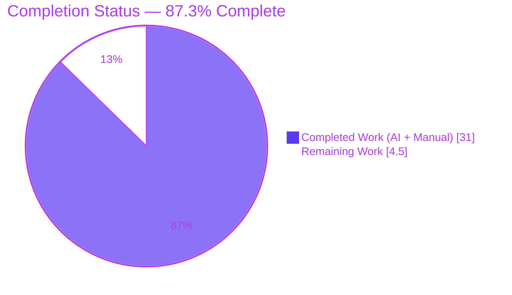
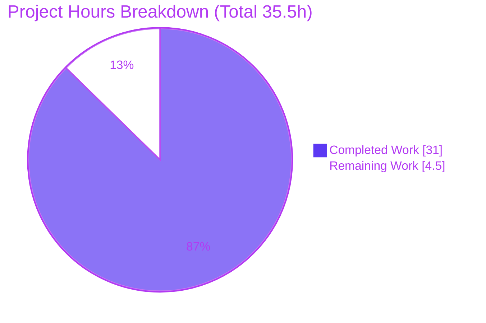
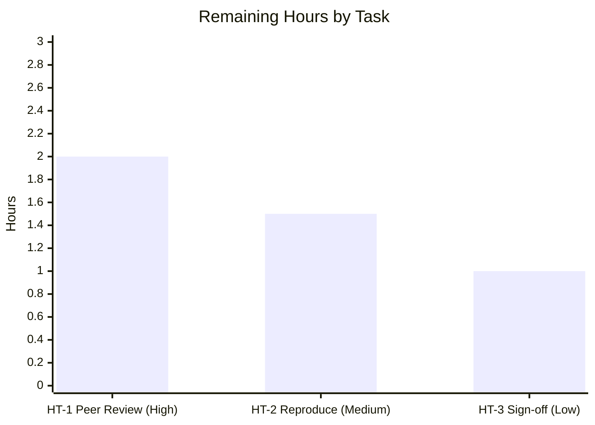

# Blitzy Project Guide — k6 `ramping-vus` Concurrency Investigation

## 1. Executive Summary

### 1.1 Project Overview

This project is a **read-only concurrency investigation** of k6's `ramping-vus` executor (`grafana/k6`, checkout `k6_ddc3b0b1d23c`, builds as **v0.55.0**), delivered for a k6 user who reported suspected VU-state bugs. The business value is an authoritative, evidence-grounded answer that distinguishes **by-design behavior from a genuine defect**, saving future debugging effort. The technical scope is a single Markdown document that answers six sub-questions — the "stuck" VU state, a handler-count mismatch, interrupt-vs-`gracefulStop` timing, execution-segment skew and sum-over-max, a race-vs-leak root cause, and a simultaneous-modification trace — each grounded in verbatim run-first output plus `file:line` citations. **No source code was modified.**

### 1.2 Completion Status



| Metric | Hours |
|--------|-------|
| **Total Hours** | 35.5 |
| **Completed Hours (AI + Manual)** | 31.0 (AI 31.0 + Manual 0.0) |
| **Remaining Hours** | 4.5 |
| **Percent Complete** | **87.3%** |

> Completion is computed on AAP-scoped work only (PA1): 31.0 completed ÷ 35.5 total = **87.3%**. All completed hours were delivered autonomously by Blitzy agents; no human hours have been spent yet.

### 1.3 Key Accomplishments

- ✅ **All six sub-questions (Q1–Q6) answered** by name, each with a verbatim observed line placed next to the claim it supports.
- ✅ **Run-first mandate satisfied** — k6 was built and real scenarios plus the Go race detector were executed *before* writing; 74 evidence logs were captured.
- ✅ **Race/leak verdict is empirical** — `go test -race` shows `--- PASS: TestVUHandleRace`, `--- PASS: TestVUHandleStartStopRace` with **zero `WARNING: DATA RACE`**.
- ✅ **Central deliverable (Q6) proven** — the two handlers are dispatched **serially from one goroutine** (`iterateSteps`), so they never mutate shared iteration state concurrently.
- ✅ **Honest contradiction reported** — Q3 shows a manual interrupt stops in **~31–35 ms**, *bypassing* `gracefulStop`, the opposite of the user's expectation, reported exactly as observed.
- ✅ **~40 `file:line` citations verified exact** against the source; 9 re-spot-checked this session.
- ✅ **Read-only mandate honored** — `git diff base..HEAD` shows **0 `.go` files changed**; the only committed change is the answer document; working tree clean.

### 1.4 Critical Unresolved Issues

| Issue | Impact | Owner | ETA |
|-------|--------|-------|-----|
| Q3 finding contradicts the user's reported symptom (interrupt is near-instant, not longer than `gracefulStop`) — the user's real scenario may differ in version/config | Medium — the answer is correct for v0.55.0 but may not match the user's environment | User + Reviewer | On user providing exact k6 version + minimal repro (~0.5h to triage) |
| No other blocking issues — deliverable complete, all validation gates green | — | — | — |

### 1.5 Access Issues

| System/Resource | Type of Access | Issue Description | Resolution Status | Owner |
|-----------------|----------------|-------------------|-------------------|-------|
| grafana/k6 repository | Source (read) + commit | None — full local access; build, test, and commit all succeeded | Resolved | Blitzy |
| Go toolchain / gcc / vendored deps | Build/test | None — `go1.23.12` + `gcc 15.2.0` present; `go mod verify` = "all modules verified" (offline) | Resolved | Blitzy |

**No access issues identified.** The task is fully self-contained (no external services, credentials, or network required).

### 1.6 Recommended Next Steps

1. **[High]** Peer-review the answer document — verify each Q1–Q6 claim against its adjacent evidence and spot-check the `file:line` citations, focusing on the Q3 contradiction.
2. **[Medium]** Independently reproduce a representative subset of evidence (build + headline `-race` tests with `-parallel 2` + one `k6 run` oscillate scenario).
3. **[Low]** Obtain stakeholder sign-off, then request the user's exact k6 version + minimal repro to close the Q3 open item, and deliver the document.

---

## 2. Project Hours Breakdown

### 2.1 Completed Work Detail

| Component | Hours | Description |
|-----------|-------|-------------|
| Build & environment baseline | 2.0 | Build k6 v0.55.0 (vendored, CGO on); verify `-race` compiles against `./lib/executor/`; confirm version/toolchain identity |
| Q1 — "Stuck" VU (`toGracefulStop`) | 3.0 | Trace `toGracefulStop` state + `reserveVUsForGracefulRampDowns`; author oscillate scenario; capture `--verbose` VU start/grace lines |
| Q2 — Handler-count mismatch | 2.0 | Document `scheduledVUsHandlerStrategy` vs `maxAllowedVUsHandlerStrategy`; capture `vus` vs `vus_max` summary |
| Q3 — Interrupt vs `gracefulStop` | 3.5 | Trace two-stage abort + signal set; author `runA`/`runB` scripts + SIGINT latency harness; measure ~31–35 ms vs 60 s |
| Q4 — Segment skew + sum-over-max | 4.0 | Run 3 segmented instances; align per-second CSV; `N=1..11` sweep; corroborate with segment-sum unit test |
| Q5 — Race vs leak | 2.5 | Run `go test -race` over `./lib/executor/`; analyze `getVU`/`returnVU` 1:1 pairing and `goleak` scope |
| Q6 — Simultaneous-modification trace | 3.0 | Synthesize serialized-dispatch proof + mutex/atomic guards + state-transition table into a step-by-step trace |
| Run-first evidence infrastructure | 2.0 | Author temporary scenario scripts, SIGINT harness, CSV output; clean up (repo unchanged) |
| Document authoring & citation grounding | 3.0 | Structure, preamble, bottom-line summary; ground ~40 `file:line` citations and verbatim quotes |
| Named-items sweep + coverage checklist | 1.5 | §8 named-items table + §9 coverage-pass checklist over every mechanism/function/flag |
| Read-only compliance verification | 1.0 | Confirm 0 `.go` changes, repo byte-for-byte unchanged apart from the doc |
| Final validation & correction pass | 3.5 | Re-run all tests under `-race`; verify ~40 citations; apply 7 corrections; commit |
| **Total Completed** | **31.0** | |

### 2.2 Remaining Work Detail

| Category | Hours | Priority |
|----------|-------|----------|
| Technical peer review of the answer document (claims ↔ evidence, citation spot-checks, Q3 scrutiny) | 2.0 | High |
| Independent evidence reproduction (build + headline `-race` tests `-parallel 2` + one `k6 run` scenario) | 1.5 | Medium |
| Stakeholder sign-off, R1 (Q3) closure request & delivery | 1.0 | Low |
| **Total Remaining** | **4.5** | |

> **Cross-section check:** Completed 31.0 + Remaining 4.5 = **35.5 Total** (matches Section 1.2). Remaining 4.5 matches Section 1.2 and the Section 7 pie chart.

---

## 3. Test Results

All tests below originate from **Blitzy's autonomous validation logs** for this project (`blitzy/qa_logs/*.log`) and were **re-confirmed this session**. They are k6's own pre-existing tests, executed under the Go race detector as **evidence** for the investigation (no new tests were authored — read-only task).

| Test Category | Framework | Total Tests | Passed | Failed | Coverage % | Notes |
|---------------|-----------|-------------|--------|--------|-----------|-------|
| Concurrency / Race detector | Go `testing` + `-race` | 2 | 2 | 0 | N/A¹ | `TestVUHandleRace`, `TestVUHandleStartStopRace` — 0 `WARNING: DATA RACE` |
| Graceful / Ramp-down lifecycle | Go `testing` + `testify` | 5 | 5 | 0 | N/A¹ | `GracefulStopWaits`, `GracefulStopStops`, `GracefulRampDown`, `HandleRemainingVUs`, `RampDownNoWobble` |
| Segment-sum invariant | Go `testing` + `-race` | 11 | 11 | 0 | N/A¹ | `TestSumRandomSegmentSequenceMatchesNoSegment` + 10 subtests `random00`…`random09` |
| Full-package regression | Go `testing` + `-race -parallel 2` | (entire `./lib/executor/`) | ok | 0 | N/A¹ | `ok go.k6.io/k6/lib/executor 63.733s`; 0 FAIL; 0 data races |
| **Totals (named evidence tests)** | | **18** | **18** | **0** | — | 100% pass rate; 0 data races across all runs |

¹ Coverage % is not applicable — this is a read-only investigation; no new code or tests were written. The pre-existing tests are exercised as behavioral evidence, not as a coverage target.

**Verbatim runner markers (re-confirmed this session):**

```
--- PASS: TestVUHandleRace (0.18s)
--- PASS: TestVUHandleStartStopRace (0.42s)
ok  	go.k6.io/k6/lib/executor	1.443s
```

**Known environmental flake (not a defect):** `TestRampingVUsHandleRemainingVUs` can intermittently report `expected 0x1 actual 0x2` under **default** parallelism on the 4-vCPU host (CPU oversubscription). It passes in isolation and under `-parallel 2`; **0 data races** were ever observed. This is a timing artifact acknowledged in the test's own source comments — not a code defect.

---

## 4. Runtime Validation & UI Verification

This is a CLI/library project (k6) plus a documentation deliverable — **there is no UI**. Runtime validation covers the k6 binary and the four scenario families behind Q1–Q4, all re-executed this session.

- ✅ **Operational** — Build: `GOFLAGS=-mod=vendor CGO_ENABLED=1 go build` → `BUILD_EXIT=0`; `k6 version` → `k6 v0.55.0 (…, go1.23.12, linux/amd64)`.
- ✅ **Operational** — Q1/Q2 oscillate scenario (`--verbose`): **19 `Start`** + **19 `Graceful stop`** + **0 `Hard stop`** events; summary `vus min=1 max=10`, `vus_max min=10 max=10` (exact match to the document).
- ✅ **Operational** — Q3 interrupt harness: `SIGINT` → exit code **105**, latency **~0.031–0.035 s** vs configured 60 s; abort message `"test run was aborted because k6 received a 'interrupt' signal"`.
- ✅ **Operational** — Q4 segmented runs: per-segment `vus_max` = **4, 3, 3** for `0:1/3`, `1/3:2/3`, `2/3:1`; sum = **10** (global max); **0** aligned samples `> 10`.
- ✅ **Operational** — Race detector: full `./lib/executor/` under `-race` → `ok`, 0 FAIL, 0 data races.
- ⚠ **Partial (by design of the task)** — Distributed execution is **simulated locally** via `--execution-segment` flags, not on a real cluster (see Risk R5). The governing invariant is nonetheless proven by a topology-independent unit test.
- ❌ **Failing** — None.

**UI Verification:** Not applicable — no web/graphical UI is in scope (k6 is a command-line load-testing tool; the deliverable is Markdown).

---

## 5. Compliance & Quality Review

Cross-map of AAP deliverables and the `SWE-AtlasQnA-Repo` rule directives to their validation status. All fixes applied during autonomous validation are noted.

| AAP / Rule Requirement | Benchmark | Status | Progress | Notes |
|------------------------|-----------|--------|----------|-------|
| Req 1 — "Stuck" VU (`toGracefulStop`) answered | Answered by name + evidence | ✅ Pass | 100% | Q1: state list + VU-1 `:53`/`:54` lifecycle lines |
| Req 2 — Handler-count mismatch answered | Answered by name + evidence | ✅ Pass | 100% | Q2: two strategies + `vus`/`vus_max` block |
| Req 3 — Interrupt vs `gracefulStop` answered | Answered by name + evidence | ✅ Pass | 100% | Q3: contradiction reported honestly; exit 105, ~31–35 ms |
| Req 4 — Segment skew + sum-over-max answered | Answered by name + evidence | ✅ Pass | 100% | Q4: `[4,3,3]=10`; 0 samples `>10`; sweep `N=1..11` |
| Req 5 — Race vs leak answered | Empirical `-race` verdict | ✅ Pass | 100% | Q5: no data race; 1:1 `getVU`/`returnVU`; goleak-scope nuance |
| Req 6 — Simultaneous-modification trace | Central deliverable | ✅ Pass | 100% | Q6: serialized dispatch + mutex/atomic guards |
| Rule — Output at `blitzy/documentation/k6_ddc3b0b1d23c.md` | Correct path/name | ✅ Pass | 100% | File present (340 lines), directories created |
| Rule — Run-first, then write | Evidence before prose | ✅ Pass | 100% | 74 QA logs captured before authoring |
| Rule — Race detector for concurrency claims (CGO + `-race`) | Empirical, not inferred | ✅ Pass | 100% | `gcc` + `CGO_ENABLED=1`; `-race` re-run this session with 0 warnings |
| Rule — Observe real magnitude | Representative scale | ✅ Pass | 100% | 19-start determinism; `N=1..11` sweep; aligned peak |
| Rule — Quote verbatim; one claim, one evidence | Adjacent evidence | ✅ Pass | 100% | Every claim paired with an observed line |
| Rule — Answer every named item + coverage pass | Full coverage | ✅ Pass | 100% | §8 sweep + §9 checklist |
| Rule — Be exact & grounded (`file:line`) | Exact citations | ✅ Pass | 100% | ~40 citations; 9 re-spot-checked exact this session |
| Rule — Read-only scope; clean up temp scripts | Repo unchanged | ✅ Pass | 100% | 0 `.go` changed; tree clean; temp scripts removed |

**Fixes applied during autonomous validation (7 corrections):**
- Citation `reserveVUsForGracefulRampDowns` `307-417` → **`307-414`** (actual function span).
- VU-start count `"20x Start"` → **`"19x Start"`** (excluded one unrelated engine `Starting...` line; deterministic `1 + 9×2 = 19`).
- Q4 sum-over-max (5 locations): non-representative `[4,3,2]=9` → representative **`[4,3,3]=10`** with **0 samples `>10`**, disproving the transient-overflow hypothesis.

**Outstanding compliance items:** None. The only open item is the Q3 contradiction (Risk R1), which is a *finding* to confirm with the user, not a compliance gap.

---

## 6. Risk Assessment

| Risk | Category | Severity | Probability | Mitigation | Status |
|------|----------|----------|-------------|------------|--------|
| R1 — Q3 finding contradicts the user's symptom (interrupt is near-instant, not longer than `gracefulStop`); user's real scenario may differ (version/config/non-cancelable op) | Technical | Medium | Medium | Doc scopes findings to v0.55.0 and reports observed behavior exactly; request user's exact version + minimal repro | **Open** |
| R2 — `TestRampingVUsHandleRemainingVUs` flakes under default parallelism (CPU oversubscription), could be misread as a defect | Technical | Low | Medium | Run with `-parallel 2`; documented as a timing artifact (passes in isolation; 0 data races) | Mitigated |
| R3 — Absolute magnitudes (latency ~31–35 ms, exact timings) are host-dependent | Technical | Low | Medium | Qualitative conclusions are robust; numbers labeled as observed on this host | Mitigated |
| R4 — 74 QA evidence logs are git-ignored/untracked, not preserved in the repo | Operational | Low | Low | Key verbatim output embedded directly in the answer document | Accepted |
| R5 — Distributed execution simulated locally, not on a real cluster | Integration | Low | Low | Segment-sum invariant proven by topology-independent unit test; local sim mirrors striped scaling | Mitigated |
| R6 — A named sub-item could be missed in the multi-part question | Technical / Quality | Low | Low | §8 named-items sweep + §9 coverage checklist enumerate every item at `file:line` | Mitigated |
| R7 — Security exposure from changes | Security | Low | Low | No source/dependency changes; no new attack surface or secrets; only public technical content | N/A |

**Summary:** 7 risks — **6 Low, 1 Medium**. The single Medium/Open risk (R1) is inherent to honest observed-behavior reporting and is closeable only with the user's environment details.

---

## 7. Visual Project Status

**Project hours (Completed = Dark Blue `#5B39F3`, Remaining = White `#FFFFFF`):**



**Remaining hours by task/priority (sums to 4.5h — matches Sections 1.2 and 2.2):**



> **Integrity:** "Remaining Work" = **4.5h** here = Section 1.2 Remaining Hours = sum of Section 2.2 Hours column. "Completed Work" = **31.0h** = sum of Section 2.1 Hours column.

---

## 8. Summary & Recommendations

**Achievements.** The investigation is **87.3% complete** (31.0 of 35.5 AAP-scoped hours). All six sub-questions are answered by name, each claim grounded in verbatim run-first output and exact `file:line` citations. The central deliverable (Q6) establishes that k6's two `ramping-vus` "handlers" are dispatched **serially from a single goroutine**, so they never modify shared iteration state concurrently — and the race detector confirms **no data race** and **no VU/goroutine leak**. Most reported symptoms (Q1 "stuck" VUs, Q2 count mismatch, Q4 segment skew) are shown to be **by-design** grace-period behavior.

**Remaining gaps & critical path.** The remaining **4.5 hours** are entirely **human acceptance** work: technical peer review (2.0h), independent evidence reproduction (1.5h), and stakeholder sign-off/delivery (1.0h). Nothing is deployed, so the "path to production" is the reviewer's sign-off on the document.

**Key open item.** Q3 **contradicts** the user's reported symptom: a manual `ctrl+c` interrupt stops iterations in **~31–35 ms**, *bypassing* `gracefulStop`, rather than running longer than it. This was reported exactly as observed. Closing it requires the user's exact k6 version and a minimal reproduction (Risk R1).

**Success metrics.** 18/18 named evidence tests pass; 0 data races; 0 `.go` files changed; ~40 citations verified; deliverable committed with the repository byte-for-byte unchanged apart from the answer document.

**Production-readiness assessment.** The deliverable is **complete and internally consistent**. It is ready for human review; the recommended path is peer review → reproduction → sign-off, followed by a targeted follow-up with the user on Q3.

| Metric | Value |
|--------|-------|
| AAP requirements completed | 14 / 14 |
| Completion (AAP-scoped hours) | 87.3% |
| Named evidence tests passing | 18 / 18 |
| Data races detected | 0 |
| Source files modified | 0 |
| Open risks | 1 (Medium — R1/Q3) |

---

## 9. Development Guide

### 9.1 System Prerequisites

- **OS/Arch:** Linux/amd64 (validated on Ubuntu; other platforms supported by k6).
- **Go:** `go1.23.12` (module declares `go 1.21` / `toolchain go1.21.13`; CI uses 1.23.x).
- **C compiler:** `gcc` (validated `15.2.0`) — **required** for the CGO-based `-race` detector.
- **Git** and ~2 GB free disk.
- Dependencies are **vendored** — no network install is needed (offline-friendly).

### 9.2 Environment Setup

```bash
# From the repository root (checkout k6_ddc3b0b1d23c)
export GOFLAGS=-mod=vendor      # build from vendored dependencies
export CGO_ENABLED=1            # required so the -race detector compiles

go version                      # expect: go version go1.23.12 linux/amd64
gcc --version | head -1         # expect a gcc version line (CGO/-race prerequisite)
go mod verify                   # expect: all modules verified
```

No external services, databases, or credentials are required.

### 9.3 Dependency Installation

None. The project builds from vendored modules. `go mod verify` prints `all modules verified` offline.

### 9.4 Build

```bash
GOFLAGS=-mod=vendor CGO_ENABLED=1 go build -o k6 .
./k6 version
# expect: k6 v0.55.0 (commit/<hash>, go1.23.12, linux/amd64)
```

> Note: the commit hash reported by the local build reflects the current `HEAD` (the docs commit). The document's `commit/ddc3b0b1d2` refers to the **base source checkout under investigation** — the code being analyzed, which is unchanged.

### 9.5 Reproduce the Evidence (Verification)

```bash
# 1) Headline concurrency tests under the race detector (fast)
GOFLAGS=-mod=vendor CGO_ENABLED=1 go test -race -count=1 \
  -run '^(TestVUHandleRace|TestVUHandleStartStopRace)$' -v ./lib/executor/
# expect: --- PASS both; "ok go.k6.io/k6/lib/executor"; NO "WARNING: DATA RACE"

# 2) Segment-sum invariant (+ 10 random subtests)
GOFLAGS=-mod=vendor CGO_ENABLED=1 go test -race \
  -run '^TestSumRandomSegmentSequenceMatchesNoSegment$' -v ./lib/executor/
# expect: --- PASS (incl. random00..random09); ok

# 3) Full package under -race — use -parallel 2 to avoid the R2 timing flake
GOFLAGS=-mod=vendor CGO_ENABLED=1 go test -race -parallel 2 ./lib/executor/
# expect: ok go.k6.io/k6/lib/executor <time>; 0 FAIL; 0 data races
```

### 9.6 Example Usage

**Q1/Q2 — oscillate scenario (long `gracefulRampDown`):**

```bash
cat > oscillate.js <<'EOF'
import { sleep } from 'k6';
export const options = { scenarios: { oscillate: {
  executor: 'ramping-vus', startVUs: 0, gracefulRampDown: '30s',
  stages: [ {duration:'3s',target:10}, {duration:'2s',target:1},
            {duration:'3s',target:10}, {duration:'2s',target:0} ] } } };
export default function () { sleep(5); }
EOF
./k6 run --verbose oscillate.js
# expect: 19x "Start", 19x "Graceful stop", 0x "Hard stop";
#         summary: vus max=10, vus_max min=10 max=10
```

**Q4 — per-segment counts (run once per segment):**

```bash
for seg in '0:1/3' '1/3:2/3' '2/3:1'; do
  ./k6 run --quiet --execution-segment "$seg" \
    --execution-segment-sequence '0,1/3,2/3,1' oscillate.js | grep vus_max
done
# expect vus_max: 4, then 3, then 3  (sum = 10 = global max)
```

### 9.7 Troubleshooting

- **`WARNING: DATA RACE` unexpectedly / `-race` won't compile** → ensure `CGO_ENABLED=1` and a working `gcc` (`apt-get install -y build-essential`).
- **`TestRampingVUsHandleRemainingVUs` fails intermittently** → environmental CPU-oversubscription flake (R2); re-run with `-parallel 2` or in isolation. It is **not** a data race or code defect.
- **Build hash ≠ `ddc3b0b1d2`** → expected; the investigated code is the base checkout, while `HEAD` is the docs-only commit.
- **`externally-managed-environment` pip error** → not applicable to this Go project; ignore.

---

## 10. Appendices

### A. Command Reference

| Purpose | Command |
|---------|---------|
| Build k6 | `GOFLAGS=-mod=vendor CGO_ENABLED=1 go build -o k6 .` |
| Version | `./k6 version` |
| Headline race tests | `go test -race -run '^(TestVUHandleRace\|TestVUHandleStartStopRace)$' ./lib/executor/` |
| Segment-sum test | `go test -race -run '^TestSumRandomSegmentSequenceMatchesNoSegment$' ./lib/executor/` |
| Full package (safe parallelism) | `go test -race -parallel 2 ./lib/executor/` |
| Verify vendored modules | `go mod verify` |
| Confirm read-only compliance | `git diff --name-status ddc3b0b1d..HEAD` |

### B. Port Reference

Not applicable — no server or listening port is used. (k6 exposes an optional REST API on `6565` only when `--address` is set; not used in this investigation.)

### C. Key File Locations

| Path | Role |
|------|------|
| `blitzy/documentation/k6_ddc3b0b1d23c.md` | **The deliverable** (answer document, 340 lines) |
| `blitzy/qa_logs/*.log` | 74 autonomous validation evidence logs (git-ignored) |
| `lib/executor/ramping_vus.go` | Two handler strategies, serialized dispatch, VU reservation, striping (read-only) |
| `lib/executor/vu_handle.go` | Per-VU state machine, transition table, mutex/atomic guards (read-only) |
| `lib/executor/base_config.go` | `gracefulStop` default + manual-interrupt docstring (read-only) |
| `lib/executor/helpers.go` | Iteration cancellation + duration contexts (read-only) |
| `lib/execution.go` | `ExecutionState` VU buffer (`GetPlannedVU`/`ReturnVU`) (read-only) |
| `lib/execution_segment.go` | Segment `Scale` round-up + `SegmentedIndex` (read-only) |
| `execution/scheduler.go` | Per-instance `ExecutionTuple` from segment options (read-only) |
| `cmd/run.go`, `cmd/common.go` | Two-stage abort + trapped signal set (read-only) |
| `lib/executor/*_test.go` | Race/graceful/segment evidence tests (read-only) |

### D. Technology Versions

| Component | Version | Source |
|-----------|---------|--------|
| k6 | v0.55.0 | `lib/consts/consts.go:12` (`Version = "0.55.0"`) |
| Go (installed) | go1.23.12 | `go version` |
| Go directive / toolchain | 1.21 / go1.21.13 | `go.mod:3`, `go.mod:5` |
| gcc | 15.2.0 | `gcc --version` |
| testify | v1.9.0 | `go.mod:41` |
| go.uber.org/goleak | v1.3.0 | `go.mod:49` |
| logrus | v1.9.3 | `go.mod:37` |
| `ExternalAbort` exit code | 105 | `errext/exitcodes/codes.go:41` |

### E. Environment Variable Reference

| Variable | Value | Purpose |
|----------|-------|---------|
| `GOFLAGS` | `-mod=vendor` | Build/test from vendored dependencies (offline) |
| `CGO_ENABLED` | `1` | Required for the CGO-based `-race` detector |

### F. Developer Tools Guide

| Tool | Use |
|------|-----|
| Go race detector (`go test -race`) | Empirical data-race verdict (Q5/Q6) |
| `testify` | Assertions in the executor tests |
| `go.uber.org/goleak` | Goroutine-leak detection (used only in `cmd/tests/tests.go`, not under `lib/`) |
| k6 `--verbose` / `--quiet` / `--out csv=` | Capture VU state events and per-second `vus`/`vus_max` samples |
| `--execution-segment` / `--execution-segment-sequence` | Simulate distributed execution locally (Q4) |

### G. Glossary

| Term | Meaning |
|------|---------|
| VU | Virtual User — a concurrent execution context in k6 |
| `ramping-vus` | Executor whose active VU count follows configured `stages` |
| `toGracefulStop` | VU state: finishing its current iteration during a graceful ramp-down (the "stuck" state in Q1) |
| `gracefulRampDown` | Window (default 30s) allowing ramped-down VUs to finish the current iteration |
| `gracefulStop` | Window (default 30s) at test end for iterations to finish — **bypassed** by a manual interrupt |
| `vus` / `vus_max` | Active-target VU count / reserved (max-allowed) VU count metrics |
| Execution segment | A `(from, to]` partition of the total load across distributed instances |
| Striping (`SegmentedIndex`) | Deterministic per-segment VU assignment ensuring per-segment counts sum to the global max |