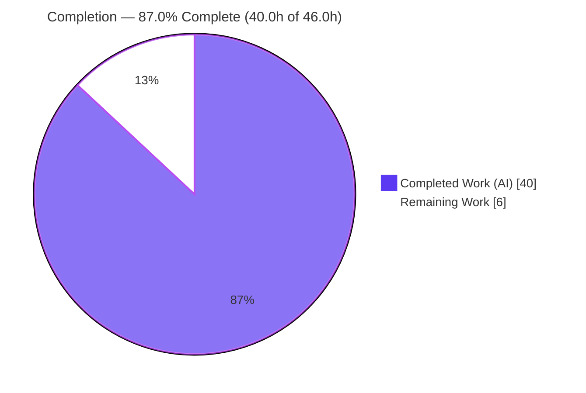
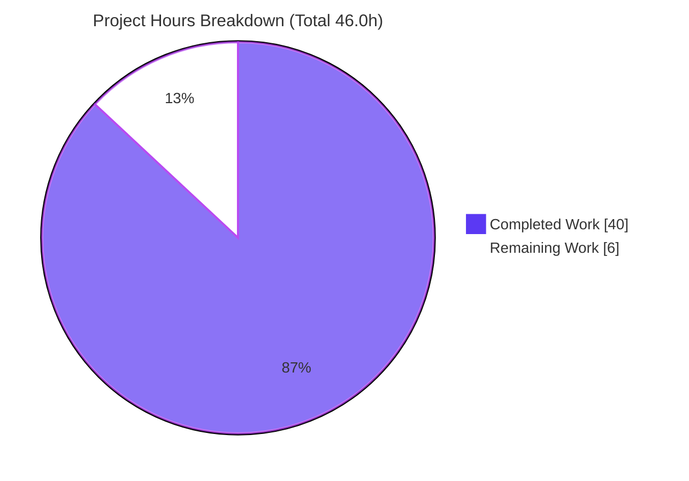

# Blitzy Project Guide — k6 Module-Resolution Init/VU Lifecycle Q&A

> **Deliverable under assessment:** `blitzy/documentation/k6_ddc3b0b1d23c.md` — a single, evidence-grounded technical answer document for the Grafana k6 repository (`go.k6.io/k6`).
> **Branch:** `blitzy-05accdba-49bf-4421-bfc5-4f3d6c38fb4b` · **HEAD:** `4e24f95ad` · **Baseline:** `ddc3b0b1d`
> **Brand legend:** 🟦 Completed / AI Work = Dark Blue `#5B39F3` · ⬜ Remaining / Not Completed = White `#FFFFFF` · Headings/Accents = Violet-Black `#B23AF2` · Highlight = Mint `#A8FDD9`

---

## 1. Executive Summary

### 1.1 Project Overview

This project answers — and **proves by real k6 execution** — how Grafana k6 resolves JavaScript modules across the `init` and Virtual-User (VU) lifecycle, and why scripts that load modules *dynamically* pass during initialization yet fail once more VUs run. The audience is k6 users and Go engineers debugging "works in init, fails under load" module errors. It is a **read-only investigative Q&A**: no production behavior changes; the k6 Go source tree is strictly reference-only. The sole deliverable is one Markdown answer that corrects the user's "under pressure" framing (the freeze is a single deterministic `Lock()`, not load-driven), classifies "resolved vs. new" modules, explains relative-specifier resolution, and demonstrates the two distinct failure modes with verbatim output, exit codes, and `file:line` citations.

### 1.2 Completion Status



**🟦 87.0% Complete** — calculated per PA1 (AAP-scoped hours): `Completed 40.0h ÷ Total 46.0h = 86.96% ≈ 87.0%`.

| Metric | Hours |
|--------|-------|
| **Total Hours** | **46.0** |
| **Completed Hours (AI + Manual)** | **40.0** |
| &nbsp;&nbsp;• AI (autonomous Blitzy agents) | 40.0 |
| &nbsp;&nbsp;• Manual (human, pre-assessment) | 0.0 |
| **Remaining Hours** | **6.0** |
| **Percent Complete** | **87.0%** |

### 1.3 Key Accomplishments

- ✅ **Sole deliverable authored & committed** — `blitzy/documentation/k6_ddc3b0b1d23c.md` (1,307 lines, valid UTF-8, 110 balanced code fences, **112** `file:line` citations, 47 headings, 14 major sections).
- ✅ **Core thesis established and corrected** — the module-resolution freeze is a **single, deterministic** `ModuleResolver.Lock()` at `js/bundle.go:L129` fired once after the first init (`__VU==0`); the user's "under pressure" framing is explicitly refuted.
- ✅ **All six sub-questions (Q1–Q6) answered** with source evidence + verbatim runs (see the Appendix C coverage matrix in the deliverable).
- ✅ **Investigated by RUNNING first** — canonical offline vendored binary built (`v0.55.0`, `go1.23.12`); 8 experiments (EXP1–EXP7 + EXP-EMPTY) each executed ≥2× for stability.
- ✅ **Two distinct failure modes proven** — init-time lock reject (`notPreviouslyResolvedModule`, exit 107) vs. iteration-time init-context gate (`cantBeUsedOutsideInitContextMsg`, logged, exit 0).
- ✅ **Honest disclosure of an upstream data race** — EXP6 characterized across 10 sweeps × 700 runs (7,000 runs) with full crash dumps; documented **as-is**, not "fixed," per the read-only mandate.
- ✅ **Read-only-source invariant held byte-for-byte** — `git diff` vs. baseline = exactly one added file; zero `.go`/`go.mod`/`go.sum`/`vendor/` changes; scratch scripts removed.

### 1.4 Critical Unresolved Issues

| Issue | Impact | Owner | ETA |
|-------|--------|-------|-----|
| _None blocking._ Deliverable compiles, tests pass, experiments reproduce, all AAP items complete. | No release blocker. | — | — |
| EXP6 upstream data race documented but not dispositioned (keep note / file upstream issue) | Non-blocking follow-up decision; the race is in unmodified k6, out of scope to fix | k6 maintainer / reviewer | 1.0h |

### 1.5 Access Issues

| System/Resource | Type of Access | Issue Description | Resolution Status | Owner |
|-----------------|----------------|-------------------|-------------------|-------|
| — | — | **No access issues identified.** Build is fully offline/vendored; no repository, service, or third-party credentials required. `go mod verify` passes; all 94 modules vendored. | N/A | — |

### 1.6 Recommended Next Steps

1. **[High]** Perform SME technical review of the 1,307-line answer — confirm the deterministic-`Lock()` thesis and spot-check a sample of the 112 citations against source (2.5h).
2. **[Medium]** Independently reproduce the key PASS/FAIL experiments (build `/tmp/k6bin`; run EXP1 → exit 0, EXP2 → exit 107, EXP7 → 2 VUs pass / 5 VUs fail) (1.5h).
3. **[Medium]** Disposition the documented EXP6 upstream data race — keep as caveat and/or file an upstream `grafana/k6` issue for the unsynchronized `mr.cache` write at `resolution.go:L154` (1.0h).
4. **[Low]** Final editorial pass and merge/publish the deliverable to the intended location (1.0h).

---

## 2. Project Hours Breakdown

### 2.1 Completed Work Detail

| Component | Hours | Description |
|-----------|-------|-------------|
| Canonical build & environment/provenance setup | 2.0 | Offline vendored build (`GOFLAGS=-mod=vendor`, `GOTOOLCHAIN=local`, `CGO_ENABLED=0`); understanding the VCS version-stamp mechanism; distinguishing source-vs-delivered commits [AAP §0.8.1, §0.6]. |
| Go source-code archaeology & citation | 10.0 | Reading and precisely citing ~15–19 files: the single `Lock()` site, cache-before-lock `resolve()`, init-context gate, call-stack relative resolution, two error constants, the init→VU state boundary — yielding 112 `file:line` references [AAP §0.2.1]. |
| Web-research validation | 1.5 | Verifying k6 test-lifecycle semantics (init runs once per VU; VU code does not import) and the upstream design rationale (`grafana/k6#3020`) [AAP §0.2.2]. |
| Reproduction experiments EXP1–EXP7 + EXP-EMPTY | 5.5 | Crafting minimal scripts and running each ≥2×, capturing verbatim stdout/stderr and exit codes for happy, error, and edge paths [AAP §0.3.3, §0.7.1]. |
| EXP6 data-race characterization | 3.0 | 10 sweeps × 700 = 7,000 runs to quantify a non-deterministic crash rate; full `concurrent map` crash-dump capture and frame/offset/root-cause analysis [AAP §0.7.1 magnitude rule]. |
| Authoring the answer document | 12.0 | Writing 1,307 lines with 112 citations, 55 verbatim code/output blocks, a Mermaid control-flow diagram, a Q1–Q6 coverage matrix, an exact-error-text reference, and the design rationale [AAP §0.4.2]. |
| QA review cycle + 3 correction commits | 4.0 | Addressing QA findings: EXP6 multi-sweep correction, source-block byte-fidelity, provenance reframing (commits `8464b319d`, `c50b8a31a`, `4e24f95ad`). |
| Read-only-invariant verification, cleanup & validation gates | 2.0 | `git status`/diff verification, scratch-workspace removal, and compile/test/runtime validation re-runs [AAP §0.8.2]. |
| **Total Completed** | **40.0** | Matches Section 1.2 Completed Hours. |

### 2.2 Remaining Work Detail

| Category | Hours | Priority |
|----------|-------|----------|
| SME technical review of answer correctness + citation spot-check | 2.5 | High |
| Independent reproduction of key PASS/FAIL experiments (build + EXP1/EXP2/EXP7) | 1.5 | Medium |
| Disposition of the documented EXP6 upstream data race (caveat / optional upstream issue) | 1.0 | Medium |
| Final editorial pass + merge/publish to intended docs location | 1.0 | Low |
| **Total Remaining** | **6.0** | Matches Section 1.2 Remaining Hours & Section 7 pie. |

### 2.3 Hours Reconciliation

- **Completed (2.1) + Remaining (2.2) = 40.0 + 6.0 = 46.0h = Total (Section 1.2).** ✔
- **Remaining is identical across Sections 1.2, 2.2, and 7 = 6.0h.** ✔
- **Completion % = 40.0 / 46.0 = 86.96% → 87.0%**, used consistently in Sections 1.2, 7, and 8. ✔

---

## 3. Test Results

All results below originate from Blitzy's autonomous validation logs and were **re-verified during this assessment** using the canonical offline build (`PATH=/usr/local/go/bin:$PATH GOTOOLCHAIN=local GOFLAGS=-mod=vendor CGO_ENABLED=0`).

| Test Category | Framework | Total Tests | Passed | Failed | Coverage % | Notes |
|---------------|-----------|-------------|--------|--------|-----------|-------|
| Unit — loader package | Go `testing` | Full `./loader/...` suite | All | 0 | n/a (pkg-scoped) | `ok go.k6.io/k6/loader 0.104s` — validates physical relative-path resolution (`Resolve`, `Dir`). |
| Unit — js require/init-context | Go `testing` | `TestRequire`, `TestInitContextOpen`, `TestInitContextForbidden` (+ subtests) | All | 0 | n/a (pkg-scoped) | `ok go.k6.io/k6/js 0.035s` — exercises the exact require/relative-resolution/init-context machinery the document analyzes. |
| Runtime — reproduction experiments | Built `k6` binary (`run`) | 8 (EXP1–EXP7 + EXP-EMPTY), each ≥2× | 8 behaviors reproduced | 0 unexpected | n/a | PASS/FAIL exit codes reproduce byte-for-byte (see Section 4). |
| Compilation gate | `go build` | 1 (canonical binary) | 1 | 0 | n/a | Exit 0, deterministic; `k6bin v0.55.0 (commit/4e24f95ad6, go1.23.12, linux/amd64)`. |

**Integrity note:** `js/modules` has **no test files** in the upstream tree — correctly reported as "no tests," not a failure. Canonical CI additionally runs these packages with `-race` (`CGO_ENABLED=1` + gcc); the reproducible EXP6 data race is an inherent property of the unmodified source (documented, not fixed).

---

## 4. Runtime Validation & UI Verification

No UI exists for this deliverable (a Markdown answer for a CLI/Go project); runtime validation covers the k6 binary and the reproduction experiments. Each condition was executed ≥2×.

- ✅ **Operational — Canonical build** — `go build` → exit 0 (~2.6s); binary self-reports `v0.55.0 (commit/4e24f95ad6, go1.23.12, linux/amd64)`. The `commit/…` stamp matches HEAD `4e24f95ad`, confirming the deliverable's provenance model.
- ✅ **Operational — EXP1 (Q5a)** — module resolved at init is re-`require()`'d by later VUs → **exit 0**, four `[init]` log lines (VU 0–3, each `-> hello-from-dep`).
- ✅ **Operational — EXP2 (Q5b/Q6)** — never-seen file module in a later VU's init → **exit 107**, exact string `GoError: the module "./unseen.js" was not previously resolved during initialization (__VU==0)` with `hint="error while initializing VU #1 (script exception)"`. (Fails **as designed**.)
- ✅ **Operational — EXP3** — `require()` inside `default()`/iteration → **exit 0**, `the "require" function is only available in the init stage …` logged once per iteration (distinct, non-fatal failure mode).
- ✅ **Operational — EXP7 (Q1/Q2)** — threshold guard `if (__VU >= 3)`: `--vus 2` → **exit 0**; `--vus 5` → **exit 107**. Proves the trigger is *which init path runs*, not runtime pressure.
- ✅ **Operational — EXP-EMPTY** — `require('')` in init → **exit 107**, `require() can't be used with an empty specifier`.
- ⚠ **Partial (documented, by design) — EXP6** — never-seen built-in `k6/*` in a later VU's init → *usually* clean **exit 107** (~95%), but intermittently a fatal Go-runtime crash (**exit 2**, ~5% aggregate) via a concurrent unsynchronized `mr.cache` write at `resolution.go:L154`. This is a **real upstream data race**, faithfully disclosed and not modified.
- ✅ **Operational — Package tests** — `./loader/...` and `js` require/init-context suites both `ok` (exit 0).

---

## 5. Compliance & Quality Review

Cross-mapping AAP deliverables and the governing rule set ("SWE-AtlasQnA-Repo") to observed status.

| # | AAP / Rule Benchmark | Status | Evidence / Notes |
|---|----------------------|--------|------------------|
| 1 | Single answer doc at `blitzy/documentation/<branch>.md` | ✅ Pass | `k6_ddc3b0b1d23c.md` created; name equals branch; directory created. |
| 2 | Answer Q1 — symptom (fails with many VUs) | ✅ Pass | §1, §6 + EXP7. |
| 3 | Answer Q2 — freeze mechanism; correct "under pressure" | ✅ Pass | §1, §2; single deterministic `Lock()` [bundle.go:L129]; framing refuted. |
| 4 | Answer Q3 — resolved vs. new (classification) | ✅ Pass | §3 cache-before-lock `resolve()` [resolution.go:L145-L177]. |
| 5 | Answer Q4 — relative specifiers per calling module | ✅ Pass | §5; `CaptureCallStack` → `reversePath` → `loader.Resolve` + EXP4. |
| 6 | Answer Q5 — real runs (a re-requirable / b never-seen fails) | ✅ Pass | EXP1 (exit 0) / EXP2 + EXP6 (exit 107). |
| 7 | Answer Q6 — exact error/warning text | ✅ Pass | §4, §7; all strings byte-verbatim, re-verified this session. |
| 8 | Investigate by RUNNING first | ✅ Pass | 8 experiments executed; answer written from observation. |
| 9 | Exercise every condition (happy + error + edge) | ✅ Pass | init vs. iteration; file vs. built-in; empty specifier; relative from 2 dirs. |
| 10 | Actual unedited output + exact command per condition | ✅ Pass | Appendix A embeds scripts, commands, verbatim stderr, exit codes. |
| 11 | Ground every claim in `file:line` or observed output | ✅ Pass | 112 citations; ~12 spot-checked accurate this assessment. |
| 12 | Magnitude/stability rule (run ≥2×, report distribution) | ✅ Pass | Each condition ≥2×; EXP6 rate reported across 7,000 runs. |
| 13 | Read-only source; only the answer added | ✅ Pass | `git diff` = 1 added file; zero source edits. |
| 14 | Remove temporary scripts afterward | ✅ Pass | Scratch workspaces removed; working tree clean. |
| 15 | Version fidelity (report for built `v0.55.0`) | ✅ Pass | §0 pins version/commit/toolchain; not generalized. |

**Fixes applied during autonomous validation:** EXP6 crash-rate corrected from a non-reproducible single 700-run figure to honest 10-sweep/7,000-run data; `requireModule` snippet label corrected (L69-L72); `scheduler.go` block indentation restored to source tabs; `reversePath` expanded to the full 14-line function; provenance/doc-commit hash reframed as illustrative. **Outstanding:** SME sign-off and EXP6 disposition (Section 2.2).

---

## 6. Risk Assessment

| Risk | Category | Severity | Probability | Mitigation | Status |
|------|----------|----------|-------------|------------|--------|
| Citation/line-number drift if built from a different k6 version | Technical | Low | Low | Doc pins `v0.55.0` / commit `ddc3b0b1d2`; states values are not generalized | Mitigated |
| EXP6 crash rate non-deterministic (small samples vary 3.7–6.1%) | Technical | Low | Medium | Full 10-sweep/7,000-run distribution reported and labeled non-deterministic | Documented |
| Build-environment dependency (go1.23.12 + vendored `sobek`) | Technical | Low | Low | `GOTOOLCHAIN=local` pin + offline vendored build documented | Mitigated |
| Deliverable discloses a real upstream concurrency bug | Security | Informational | n/a | Faithful disclosure; no new code/deps/attack surface introduced | Documented |
| Documentation staleness as upstream k6 evolves | Operational | Low | Medium | Version fidelity stated; scoped to `v0.55.0` | Accepted |
| Doc placement (`blitzy/documentation/` vs. official `docs/` tree) | Integration | Low | Low | Per rule set; relocation flagged for human if site publication desired | Informational |
| External service/API integration | Integration | None | n/a | Self-contained; offline vendored build; no keys/network | N/A |

**Overall risk posture: LOW.** A read-only documentation deliverable that introduces zero production code and holds the read-only-source invariant byte-for-byte.

---

## 7. Visual Project Status



**Remaining work by category (hours) — sums to 6.0h, matching Sections 1.2 & 2.2:**

| Category | Hours | Priority | Bar |
|----------|-------|----------|-----|
| SME technical review | 2.5 | High | █████████████████████████ |
| Independent experiment reproduction | 1.5 | Medium | ███████████████ |
| EXP6 data-race disposition | 1.0 | Medium | ██████████ |
| Editorial pass + merge | 1.0 | Low | ██████████ |
| **Total** | **6.0** | — | |

🟦 Completed = `#5B39F3` · ⬜ Remaining = `#FFFFFF`. **Integrity:** pie "Remaining Work" (6) = Section 1.2 Remaining (6.0) = Section 2.2 sum (6.0). ✔

---

## 8. Summary & Recommendations

**Achievements.** The project is **🟦 87.0% complete** (40.0h of 46.0h, PA1 AAP-scoped). Every AAP-scoped deliverable is complete: the single answer document is authored, validated, and committed; all six sub-questions are answered with 112 source citations and verbatim runs; the core thesis (a single deterministic `Lock()`, not load-driven "pressure") is established and the user's framing corrected; and the read-only-source invariant is held byte-for-byte.

**Remaining gaps (6.0h, all human/path-to-production).** No engineering gaps remain in the deliverable itself. The outstanding work is verification and publication: SME technical review (2.5h), independent experiment reproduction (1.5h), disposition of the honestly-documented EXP6 upstream data race (1.0h), and a final editorial pass + merge (1.0h).

**Critical path to production.** SME review → independent reproduction of the key PASS/FAIL cases → EXP6 disposition decision → editorial pass → merge. There is no build/CI/deploy/infrastructure path for a Markdown answer, so the "path to production" is publication of a reviewed document.

**Success metrics.** ✅ Compilation clean & deterministic (exit 0); ✅ directly-relevant package tests pass (exit 0); ✅ all 8 runtime experiments reproduce byte-for-byte; ✅ all six sub-questions answered and grounded; ✅ read-only invariant preserved.

**Production readiness.** **Ready for human review.** The deliverable is technically complete and internally consistent. Recommended gate before publish: SME sign-off on correctness and an explicit decision on how to disposition the disclosed upstream data race. Confidence: **High** for the deliverable's completeness and evidence quality; **Medium** only on the discretionary EXP6 follow-up (a judgement call, not a defect in the answer).

| Metric | Value |
|--------|-------|
| Completion (AAP-scoped) | 87.0% |
| Completed / Total hours | 40.0 / 46.0 |
| Remaining hours | 6.0 |
| Files changed vs. baseline | 1 (added) |
| Source files modified | 0 |
| AAP sub-questions answered | 6 / 6 |
| Overall risk | Low |

---

## 9. Development Guide

This guide builds the canonical k6 binary and reproduces the deliverable's experiments. **Every command below was executed and verified during this assessment.** All work happens in a scratch workspace **outside** the source tree to preserve the read-only invariant.

### 9.1 System Prerequisites

- **OS:** Linux or macOS (validated on `linux/amd64`, Ubuntu container).
- **Go:** 1.23.x — validated with `go1.23.12` (`go.mod` declares `go 1.21`; canonical build target is Go 1.23.x per `Dockerfile` and `.github/workflows/build.yml`).
- **Git:** any recent version. **Disk:** ~2 GB free. **Network:** none required (fully vendored).

### 9.2 Environment Setup

```bash
# From the repository root. No virtualenv/services needed — this is a Go module.
export PATH=/usr/local/go/bin:$PATH   # ensure Go 1.23.x is first on PATH
export GOTOOLCHAIN=local              # pin the installed toolchain (no network fetch)
export GOFLAGS=-mod=vendor            # use the vendored dependency tree (offline)
export CGO_ENABLED=0                  # canonical non-race build
go version                            # expect: go version go1.23.12 linux/amd64
```

### 9.3 Dependency Installation

```bash
# Dependencies are pre-vendored under vendor/ (94 modules incl. grafana/sobek + evanw/esbuild).
# No install step is required. Optionally verify integrity:
go mod verify                         # expect: all modules verified
```

### 9.4 Build & Startup Sequence

```bash
# From the repository root — produces the binary used for all reproductions.
PATH=/usr/local/go/bin:$PATH GOTOOLCHAIN=local GOFLAGS=-mod=vendor CGO_ENABLED=0 \
  go build -o /tmp/k6bin .
echo "BUILD EXIT: $?"                 # expect: 0  (≈2–3s on a warm cache)

/tmp/k6bin version
# expect: k6bin v0.55.0 (commit/<HEAD-stamp>, go1.23.12, linux/amd64)
```

### 9.5 Verification Steps (reproduce the core claims)

```bash
# Create scratch scripts OUTSIDE the source tree.
mkdir -p /tmp/k6verify && cd /tmp/k6verify
printf 'module.exports = { hello: () => "hello-from-dep" };\n' > dep.js
printf 'module.exports = { x: 1 };\n' > unseen.js
printf 'module.exports = { y: 2 };\n' > late.js

# EXP1 — init module re-required by later VUs -> PASS (exit 0)
cat > exp1.js <<'EOF'
const dep = require('./dep.js');
console.log(`[init] __VU=${__VU} require('./dep.js') -> ${dep.hello()}`);
export const options = { vus: 3, iterations: 3 };
export default function () {}
EOF
/tmp/k6bin run --quiet --no-summary /tmp/k6verify/exp1.js ; echo "EXP1 EXIT: $?"   # expect 0

# EXP2 — never-seen module in a later VU's init -> FAIL (exit 107)
cat > exp2.js <<'EOF'
if (__VU >= 1) { const u = require('./unseen.js'); console.log(`loaded ${__VU}`); }
export const options = { vus: 2, iterations: 2 };
export default function () {}
EOF
/tmp/k6bin run --quiet --no-summary /tmp/k6verify/exp2.js ; echo "EXP2 EXIT: $?"   # expect 107

# EXP7 — few vs many VUs (the definitive Q1/Q2 demonstration)
cat > exp7.js <<'EOF'
if (__VU >= 3) { const l = require('./late.js'); console.log(`loaded ${__VU}`); }
export default function () {}
EOF
/tmp/k6bin run --quiet --no-summary --vus 2 --iterations 2 /tmp/k6verify/exp7.js ; echo "@2VU EXIT: $?"  # expect 0
/tmp/k6bin run --quiet --no-summary --vus 5 --iterations 5 /tmp/k6verify/exp7.js ; echo "@5VU EXIT: $?"  # expect 107
```

**Expected results (verified this session):** EXP1 → exit 0 with four `[init]` lines; EXP2 → exit 107 with `... was not previously resolved during initialization (__VU==0)`; EXP7 → exit 0 at 2 VUs, exit 107 at 5 VUs.

### 9.6 Package Tests

```bash
# From the repository root.
PATH=/usr/local/go/bin:$PATH GOTOOLCHAIN=local GOFLAGS=-mod=vendor CGO_ENABLED=0 \
  go test -count=1 ./loader/...                       # expect: ok go.k6.io/k6/loader
PATH=/usr/local/go/bin:$PATH GOTOOLCHAIN=local GOFLAGS=-mod=vendor CGO_ENABLED=0 \
  go test -count=1 -run 'TestRequire|TestInitContextForbidden|TestInitContextOpen' ./js/   # expect: ok go.k6.io/k6/js
```

### 9.7 Cleanup (restore the read-only invariant)

```bash
rm -rf /tmp/k6verify /tmp/k6bin
cd <repo-root> && git status --porcelain      # expect: empty (only blitzy/ artifact tracked)
git diff ddc3b0b1d --name-status              # expect: A blitzy/documentation/k6_ddc3b0b1d23c.md
```

### 9.8 Troubleshooting

- **`error: externally-managed-environment` (pip):** not applicable — this is a Go project; use the Go commands above.
- **Version prints without a `commit/…` stamp:** a *linked* `git worktree` emits no VCS stamp under Go 1.23; use a full clone/checkout to reproduce a specific commit stamp.
- **Want the `-race` build:** set `CGO_ENABLED=1` and ensure `gcc` is installed; run packages with `-p 1` for timing-sensitive stability.
- **EXP6 crashes with `fatal error: concurrent map writes` (exit 2):** expected — an inherent, intermittent (~5%) upstream data race, documented in Appendix B/B2 of the deliverable; not a build error.
- **`go build` fails offline:** ensure `GOFLAGS=-mod=vendor` and `GOTOOLCHAIN=local` are exported so Go uses the vendored tree and the local toolchain.

---

## 10. Appendices

### Appendix A — Command Reference

| Command | Purpose |
|---------|---------|
| `PATH=/usr/local/go/bin:$PATH GOTOOLCHAIN=local GOFLAGS=-mod=vendor CGO_ENABLED=0 go build -o /tmp/k6bin .` | Canonical offline build |
| `/tmp/k6bin version` | Print version/commit/toolchain stamp |
| `/tmp/k6bin run --quiet --no-summary <script>.js` | Run a reproduction script; check `$?` |
| `/tmp/k6bin run ... --vus N --iterations N <script>.js` | VU-count demonstration (EXP7) |
| `go test -count=1 ./loader/...` | Loader package tests |
| `go test -count=1 -run 'TestRequire\|TestInitContext...' ./js/` | Require/init-context tests |
| `go mod verify` | Verify vendored module integrity |
| `git diff ddc3b0b1d --name-status` | Confirm read-only invariant (1 added file) |

### Appendix B — Port Reference

Not applicable. The deliverable is a documentation artifact; the k6 binary runs scripts locally and opens no service ports for these experiments (no `--out`/API server used).

### Appendix C — Key File Locations

| Path | Role |
|------|------|
| `blitzy/documentation/k6_ddc3b0b1d23c.md` | **The deliverable** (1,307 lines) |
| `js/bundle.go` | Single `Lock()` call site (L129); init-context gate (L438-L441) |
| `js/modules/resolution.go` | Lock/cache/`resolve()` (L145-L177); error constant (L17); `reversePath` (L198-L211) |
| `js/modules/require_impl.go` | `require()`; empty-specifier guard (L20-L22); `getCurrentModuleScript` (L185-L196) |
| `js/initcontext.go` | `cantBeUsedOutsideInitContextMsg` (L15-L16) |
| `js/runner.go` | init→VU boundary `vu.state` assignment (L230) |
| `loader/loader.go` | Physical relative-path `Resolve` (L48), `Dir` (L115) |

### Appendix D — Technology Versions

| Component | Version |
|-----------|---------|
| k6 (built binary) | `v0.55.0` (source commit `ddc3b0b1d2`) |
| Go toolchain | `go1.23.12 linux/amd64` (`GOTOOLCHAIN=local`) |
| `go.mod` directives | `go 1.21`, `toolchain go1.21.13` |
| JavaScript engine | `github.com/grafana/sobek v0.0.0-20241024150027-d91f02b05e9b` |
| Transpiler | `github.com/evanw/esbuild v0.21.2` |
| Vendored modules | 94 (fully offline) |

### Appendix E — Environment Variable Reference

| Variable | Value | Purpose |
|----------|-------|---------|
| `PATH` | `/usr/local/go/bin:$PATH` | Put Go 1.23.x first |
| `GOTOOLCHAIN` | `local` | Pin installed toolchain (no network fetch) |
| `GOFLAGS` | `-mod=vendor` | Use vendored dependencies (offline) |
| `CGO_ENABLED` | `0` | Canonical non-race build (`1` for `-race`) |

### Appendix F — Developer Tools Guide

No browser/UI tooling applies (CLI/Go project, Markdown deliverable). Primary tools: `go build`, `go test`, `go mod verify`, the built `k6` binary's `run`/`version` subcommands, and `git diff`/`git status` for invariant verification.

### Appendix G — Glossary

| Term | Meaning |
|------|---------|
| **init context** | Code that runs once per VU at startup; the only stage where `require()`/`import` and `open()` are permitted. |
| **VU** | Virtual User — a concurrent execution unit; k6 re-runs init code once per VU. |
| **`__VU==0`** | The first, bundle-building initialization; the only stage during which new modules are resolved and cached. |
| **the freeze / `Lock()`** | The one-time `ModuleResolver.Lock()` after the first init that sets `locked=true`, rejecting later cache misses. |
| **cache-before-lock** | The `resolve()` ordering: a cache hit returns even when locked; only a cache **miss** while locked errors. |
| **`notPreviouslyResolvedModule`** | Init-time lock-reject error string; aborts the run (exit 107). |
| **`cantBeUsedOutsideInitContextMsg`** | Iteration-time `require()` error string; logged, non-fatal (exit 0). |
| **read-only invariant** | The rule that no source file may change; only the answer document is added. |