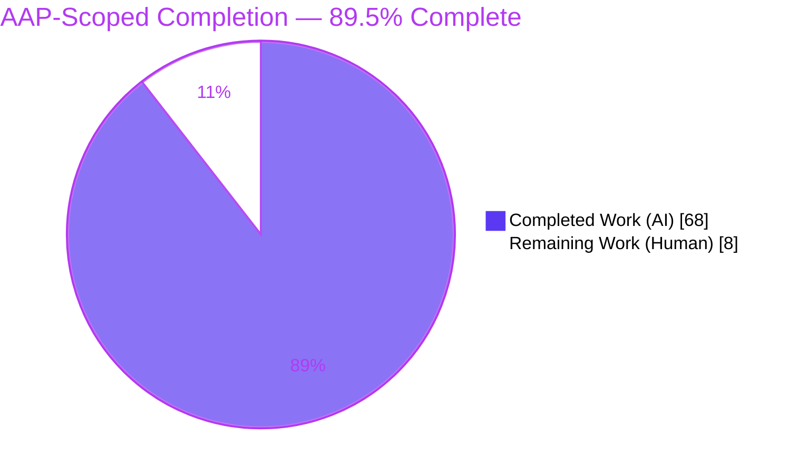
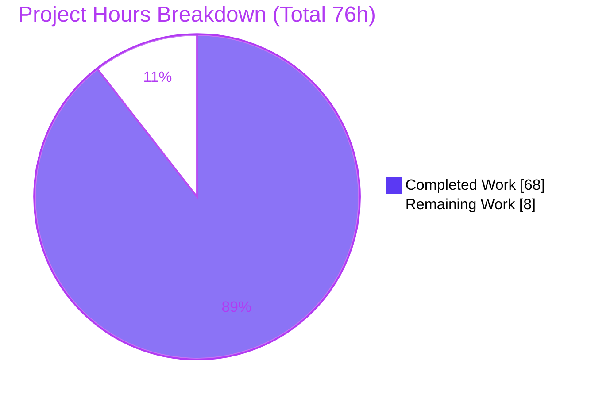
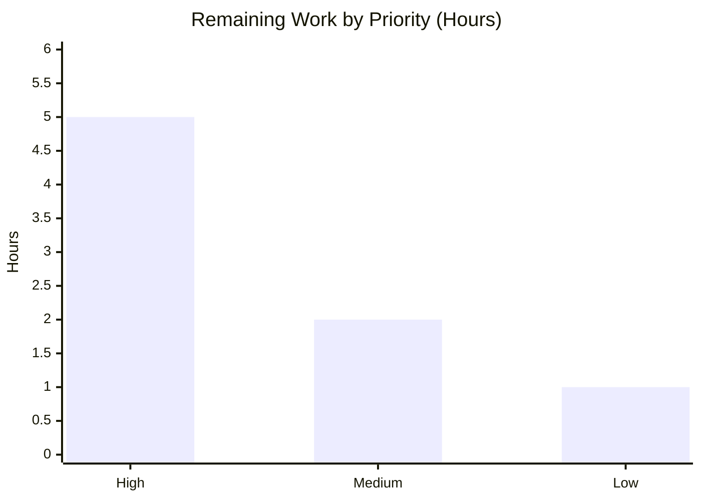

# Blitzy Project Guide — k6 `ramping-vus` Concurrency Investigation

> **Deliverable branch:** `blitzy-cfb43038-9f4d-4c7a-9f83-818b7e754ba5` &nbsp;|&nbsp; **Base:** `ddc3b0b1d23c` &nbsp;|&nbsp; **HEAD:** `093a71daa`
> **Repository:** `grafana/k6` (`go.k6.io/k6`, k6 `v0.55.0`) &nbsp;|&nbsp; **Task type:** Read-only investigation (documentation)
> **Sole artifact:** `blitzy/documentation/k6_ddc3b0b1d23c.md` (5,012 lines)
>
> **Brand legend —** Completed / AI Work: **Dark Blue `#5B39F3`** &nbsp;•&nbsp; Remaining / Human Work: **White `#FFFFFF`** &nbsp;•&nbsp; Accents: Violet-Black `#B23AF2` / Mint `#A8FDD9`

---

## 1. Executive Summary

### 1.1 Project Overview

This project is a **read-only root-cause investigation** into a suspected concurrency defect in k6's `ramping-vus` executor. Blitzy traced the VU-scheduling machinery and per-VU state machine at runtime — under rapid stage transitions, early `ctrl+c` termination, and distributed (segmented) execution — to determine whether four reported symptoms stem from a data race, a VU-buffer leak, or behavior that is correct by design. The single deliverable is one evidence-grounded answer document that leads with direct answers to the user's three questions and substantiates each with captured output and `file:line` grounding. No production source code is created, modified, or deleted; the value delivered is verified knowledge for the k6 maintainers and the reporting user.

### 1.2 Completion Status



| Metric | Value |
|--------|-------|
| **Total Hours** | 76 |
| **Completed Hours (AI + Manual)** | 68 (68 AI + 0 Manual) |
| **Remaining Hours** | 8 |
| **Completion** | **89.5%** |

> Completion is computed with the PA1 AAP-scoped, hours-based method: `Completion = Completed ÷ (Completed + Remaining) = 68 ÷ 76 ≈ 89.5%`. All remaining work is human review/acceptance, not agent rework (this is a knowledge deliverable).

### 1.3 Key Accomplishments

- ✅ Built and ran a **race-instrumented** k6 offline (`CGO_ENABLED=1`, vendored modules) — k6 `v0.55.0`.
- ✅ **Answered Question (a):** the two handler strategies are invoked **sequentially** from one `iterateSteps` loop in the main `Run` goroutine (max simultaneously-executing handler bodies = 1); `go test -race` clean across two runs — **no data race** on the exercised paths.
- ✅ **Answered Question (b):** VU-buffer acquire/return accounting is **one-to-one** (8/8 handles restored); the depleted-buffer path fails cleanly after the bounded 5 retries — **no leak** observed.
- ✅ **Answered Question (c):** `start`, `gracefulStop`, and `hardStop` all serialize on the **same per-VU mutex** — state transitions cannot interleave unsafely.
- ✅ **Reproduced all four symptoms** (A stuck VUs, B handler-count mismatch, C ctrl+c overrun, D segment imbalance) through the **canonical entry points** and captured real output.
- ✅ Delivered a **5,012-line** answer document with **145** unique `file:line` references and **19** explicitly-labeled `INFERRED` statements (evidence discipline).
- ✅ Honored the read-only Main Rule: `git diff ddc3b0b1d23c..HEAD --name-status` shows exactly **one added file**; all temporary scripts removed; working tree clean.

### 1.4 Critical Unresolved Issues

| Issue | Impact | Owner | ETA |
|-------|--------|-------|-----|
| Independent human SME re-verification of the runtime findings has not yet occurred | Findings are agent-verified but not yet human-signed-off | k6 maintainer / SME reviewer | 0.5 day |
| Symptom A/B/D are characterized as *deterministic/expected-by-design edge cases* — a maintainer must confirm none masks a genuine regression | Low risk a subtle regression is mislabeled "expected" | SME reviewer | 0.25 day |

> There are **no** compilation errors, failing tests, or blocking defects. The two items above are review/acceptance activities inherent to any investigation deliverable, not agent-side rework.

### 1.5 Access Issues

| System / Resource | Type of Access | Issue Description | Resolution Status | Owner |
|-------------------|----------------|-------------------|-------------------|-------|
| grafana/k6 repository | Source read/build | None — full source present and buildable offline | ✅ Resolved | Blitzy |
| Go module proxy | Dependency fetch | None — all modules vendored under `vendor/`; offline build proven with `GOPROXY=off` | ✅ Resolved | Blitzy |
| C toolchain (gcc) | Race detector | None — gcc 15.2.0 present; `CGO_ENABLED=1` satisfied | ✅ Resolved | Blitzy |
| External services / APIs | Runtime | None required — k6 investigation exercises only local code paths | ✅ N/A | Blitzy |

> **No access issues identified.** Every prerequisite for build, race-detector execution, and multi-process segmented runs was available in the environment.

### 1.6 Recommended Next Steps

1. **[High]** Read `blitzy/documentation/k6_ddc3b0b1d23c.md` end-to-end and spot-check a sample of the 145 `file:line` references against the checked-out source.
2. **[High]** Re-run the race-detector reproductions for Questions (a)/(c) on reviewer hardware (`go test -race`, ≥2 runs) and confirm 0 data races.
3. **[High]** Re-create and execute the §9.2 (symptom C, real `SIGINT`) and §9.3 (symptom D, 3-process segmented) harnesses, then delete them per the Main Rule.
4. **[Medium]** Adjudicate whether the Symptom A/B/D "expected/deterministic" characterizations should trigger any upstream follow-up, and obtain stakeholder sign-off.
5. **[Low]** Optionally attach the answer document to the relevant tracker and cross-link the k6 design discussions (issues #997, #1308).

---

## 2. Project Hours Breakdown

### 2.1 Completed Work Detail

Each completed component traces to a specific AAP requirement (`[AAP …]`) or an AAP-implied path-to-production activity (`[Path-to-production]`). Column total below is **68 hours**, matching Completed Hours in §1.2.

| Component | Hours | Description |
|-----------|------:|-------------|
| C1 — Environment & race build | 3 | **[AAP §0.6]** Offline, race-enabled build toolchain (Go 1.23.6, gcc, `CGO_ENABLED=1`, vendored); build evidence in §3 of the answer doc. |
| C2 — Execution-model trace | 7 | **[AAP Q(a)]** Traced `Run` → `iterateSteps` → the two handler strategies to establish whether they run concurrently; §4.1–4.3. |
| C3 — Race-detector runs ×2 | 3 | **[AAP Q(a)]** `go test -race` executed twice; 0 data races captured; §4.4. |
| C4 — State machine + mutex | 5 | **[AAP Q(c)]** Traced the 5-state VU machine and per-VU mutex serialization of `start`/`gracefulStop`/`hardStop`; §5. |
| C5 — VU-buffer accounting | 5 | **[AAP Q(b)]** Verified one-to-one acquire/return and the bounded depleted-buffer path; §6. |
| C6 — Symptom A reproduction | 7 | **[AAP Symptom A]** Rapid up/down stages + long `gracefulRampDown`, 10 identical runs; distribution captured; §7-A. |
| C7 — Symptom B reproduction | 4 | **[AAP Symptom B]** Scheduled-vs-graceful counter divergence demonstrated (ceiling ≥ target); §7-B. |
| C8 — Symptom C harness | 7 | **[AAP Symptom C]** Real-`SIGINT` CLI harness against the built binary (9 conditions ×2); §7-C, §9.2. |
| C9 — Symptom D harness | 6 | **[AAP Symptom D]** Three-process segmented execution + striping arithmetic; §7-D, §9.3. |
| C10 — Direct answers & coverage | 4 | **[AAP §0.7 Rule 4]** Lead answers to Q(a)/(b)/(c) and the named-item coverage table; §1, §2, §8. |
| C11 — Evidence discipline | 3 | **[AAP §0.7 Rule 3/4]** 145 `file:line` references and 19 `INFERRED` labels applied throughout. |
| C12 — Document authoring | 6 | **[AAP §0.4.2]** Assembly of the 5,012-line answer document. |
| C13 — Web-search research | 1 | **[AAP §0.2.2]** Execution-segment semantics and design intent (k6 issues #997, #1308). |
| C14 — QA revision cycles | 5 | **[Path-to-production]** Four commits including a full rewrite "from real captured evidence" and QA fidelity fixes. |
| C15 — Cleanup & attestation | 2 | **[Path-to-production]** Temporary-script removal, read-only attestation, `git status` clean verification; §9.4. |
| **Total** | **68** | **Sum of all completed components (all AI-performed).** |

### 2.2 Remaining Work Detail

All remaining work is **human review/acceptance** (path-to-production for a knowledge deliverable). Column total is **8 hours**, matching Remaining Hours in §1.2 and the "Remaining Work" slice in §7. Tasks map to path-to-production groupings **R1** (SME review = H1+H2+H3 = 5h), **R2** (acceptance = M1+M2 = 2h), **R3** (distribution = L1 = 1h).

| Category (Task) | Hours | Priority |
|-----------------|------:|----------|
| H1 — Read answer doc end-to-end; spot-check a sample of the 145 `file:line` refs | 2.0 | High |
| H2 — Re-run race-detector reproductions (Q a/c) on reviewer hardware, ≥2 runs | 1.5 | High |
| H3 — Re-create & run §9.2 (symptom C) and §9.3 (symptom D) harnesses; then delete | 1.5 | High |
| M1 — Adjudicate edge-case findings (Symptoms A/B/D) vs. genuine regression | 1.0 | Medium |
| M2 — Stakeholder sign-off & follow-up decision (remediation is out of scope) | 1.0 | Medium |
| L1 — Optional distribution / upstream note (link k6 #997, #1308) | 1.0 | Low |
| **Total** | **8.0** | — |

### 2.3 Hours Estimation Methodology

Estimates follow the PA2 framework and are shown transparently for auditability:

- **Denominator (Total = 76h):** the sum of completed AAP-scoped work (§2.1 = 68h) plus outstanding path-to-production review (§2.2 = 8h).
- **Completed hours (68h):** estimated per component from investigation depth (tracing the two handlers and the state machine), reproduction effort (10-run Symptom A sampling, real-`SIGINT` and 3-process harnesses), race-detector execution, document authoring for a 5,012-line artifact, plus QA revision cycles evidenced by four commits.
- **Remaining hours (8h):** bounded human review — reading and spot-checking the doc (2.0h), independent re-execution of race and CLI reproductions (3.0h), edge-case adjudication and sign-off (2.0h), and optional distribution (1.0h).
- **Completion formula:** `Completion % = Completed ÷ Total × 100 = 68 ÷ 76 × 100 ≈ 89.5%`.
- **Confidence:** High — scope is well-defined and every hour traces to a specific AAP item or a standard review activity; because the deliverable is knowledge (no code to ship), remaining effort carries little estimation variance.

---

## 3. Test Results

All results below originate from **Blitzy's autonomous validation logs** for this project. Because the mandate targets **race detection and behavioral reproduction** (not line coverage), Go tests were run under `-race` rather than `-cover`; coverage is therefore recorded as **N/A (behavioral / race)**. Native Go test functions total **27** (3 + 11 + 5 + 8); CLI harness condition runs total **24** (9 + 15) — **51** autonomous checks in all, **0** failures, **0** data races.

| Test Category | Framework | Total Tests | Passed | Failed | Coverage % | Notes |
|---------------|-----------|------------:|-------:|-------:|:----------:|-------|
| VU-handle race/state | `go test -race` | 3 | 3 | 0 | N/A | `TestVUHandleRace`, `TestVUHandleStartStopRace`, `TestVUHandleSimple`; 0 data races; `ok … 7.234s`. |
| Ramping-VUs behavior | `go test -race` | 11 | 11 | 0 | N/A | Incl. `TestRampingVUsRampDownNoWobble` (Symptoms A/B); 0 data races; `ok … 13.063s`. |
| Execution-segment scaling | `go test -race` | 5 | 5 | 0 | N/A | Scale / Tuple / StripedOffsets; deterministic striping confirmed. |
| In-package probe (§9.1) | `go test -race` | 8 | 8 | 0 | N/A | Q(a) handler-ordering, Q(b) buffer + depleted path, Q(c) states; Symptom A/B/D probes. |
| CLI harness — Symptom C (§9.2) | `k6 run` + real `SIGINT` | 9 | 9 | 0 | N/A | Real binary, exact-PID `SIGINT`; interrupt → exit 105; reproduced ×2. |
| CLI harness — Symptom D (§9.3) | `k6 run` segmented | 15 | 15 | 0 | N/A | 3 distribution modes (SHARED / INDEPENDENT / SHARED_LOW); per-segment sampling; deterministic ×runs. |
| **Totals** | — | **51** | **51** | **0** | N/A | Zero failures; zero data races across all autonomous checks. |

---

## 4. Runtime Validation & UI Verification

Runtime health was validated through the **canonical entry points** — the public `go.k6.io/k6/lib/executor` package and the compiled `k6` binary — per the AAP's canonical-path discipline.

- ✅ **Operational** — Offline vendored build of k6 `v0.55.0` (`go build -o /tmp/k6 .`), exit 0.
- ✅ **Operational** — Canonical `k6 run` ramping-vus smoke: active VUs traced `3/3 → 1/3 → 0/3`, 16 iterations, 0 interrupted, exit 0.
- ✅ **Operational** — Race detector clean across two runs (0 data races) — the empirical crux of Questions (a) and (c).
- ✅ **Operational** — Real `SIGINT` abort path: first interrupt escalates to graceful abort; process exits **105** (`ExternalAbort`, `errext/exitcodes/codes.go:41`).
- ✅ **Operational** — Three-process segmented execution: deterministic per-segment striping (shared sequence `[4,4,3]=11`; independent `[4,4,4]=12`).
- ⚠ **Partial / Not Applicable** — **UI Verification:** k6 is a command-line load-testing tool with **no web UI**; there is no front-end to verify. The REST `GET /v1/status` endpoint exists only as a **non-canonical cross-check observable** and is not part of the canonical input path.
- ✅ **Operational** — **API integration:** none required; the investigation depends on no external services, credentials, or network endpoints.

---

## 5. Compliance & Quality Review

The table cross-maps the AAP deliverables and the governing **SWE-AtlasQnA** rule set to Blitzy's autonomous-validation outcomes. Fixes applied during autonomous validation are noted; there are no outstanding compliance failures.

| Item / Benchmark | Requirement | Status | Notes |
|------------------|-------------|:------:|-------|
| Rule 1 — Run-First | Build & run before writing; repeat inconsistent inputs ≥2× | ✅ Pass | Race tests ×2; Symptom A ×10; C/D harnesses ×2. |
| Rule 2 — Exhaustive coverage | All conditions incl. edge/error paths; full unedited output | ✅ Pass | Depleted-buffer path, teardown path, 3 segment modes; 72 fenced output blocks. |
| Rule 3 — Faithful observed-output | Report actual behavior; label inferred claims | ✅ Pass | 19 `INFERRED` labels applied. |
| Rule 4 — Complete grounded answering | Every symptom/question answered with `file:line` | ✅ Pass | 145 unique `file:line` refs; §8 coverage table maps every named item. |
| Main Rule — Deliverable & scope | Single `.md`; no source edits; scripts removed | ✅ Pass | 1 file added; temp artifacts deleted; tree clean. |
| AAP Q(a) — Data race | Determine empirically under `-race` | ✅ Answered | Handlers serialized (max simultaneous = 1); `-race` clean. |
| AAP Q(b) — Buffer leak | Verify acquire/return accounting | ✅ Answered | 8/8 restored; depleted path fails cleanly after 5 retries. |
| AAP Q(c) — Simultaneous state mod | Trace shared-state protection | ✅ Answered | `start`/`gracefulStop`/`hardStop` serialize on one per-VU mutex. |
| AAP Symptoms A/B/C/D | Reproduce each named symptom | ✅ Answered | §7-A…§7-D reproductions with captured output. |
| Read-only integrity | Repository byte-for-byte unchanged | ✅ Pass | `git diff ddc3b0b1d23c..HEAD` = one added file only. |
| Static analysis — `go vet` | No new issues introduced | ⚠ Advisory | Sole finding (`helpers.go:178` lostcancel) is an intentional upstream `//nolint:govet`, byte-identical to base — out of scope for a read-only task. |
| Test pass status | All autonomous checks pass | ✅ Pass | 51/51 checks pass; 0 data races. |

---

## 6. Risk Assessment

Risks are categorized per PA3 (technical, security, operational, integration). Overall posture is **LOW** with **no blockers**.

| Risk | Category | Severity | Probability | Mitigation | Status |
|------|----------|:--------:|:-----------:|------------|--------|
| T1 — Race detector covers only *exercised* paths; a race on an untested path could exist | Technical | Low | Low | Disclosed in the doc; exercised the primary + edge/error paths under `-race` | Mitigated |
| T2 — An "expected/deterministic" edge-case finding could mask a genuine regression | Technical | Medium | Low | Flagged for SME adjudication (task M1) | Open — needs review |
| T3 — Toolchain drift: repo pins go 1.21/toolchain 1.21.13 but runs Go 1.23.6 | Technical | Low | Low | Highest CI-supported version used; findings faithful to checked-out commit | Disclosed |
| S1 — Security exposure from changes | Security | None | — | No code added/modified; no secrets, endpoints, or dependencies touched | Resolved |
| O1 — Reproductions depend on a specific environment (CGO, gcc, vendored offline) | Operational | Low | Medium | Exact versions and commands documented in §9 | Mitigated |
| O2 — Timing-sensitive measurements (SIGINT→exit ≈6.8–7.9 ms; teardown ≈3009 ms) may vary by host | Operational | Low | Medium | Ranges disclosed; characterized qualitatively, not as hard SLAs | Disclosed |
| O3 — Ephemeral reproduction scripts are not committed (per Main Rule) | Operational | Low | Low | Full listings embedded in §9.1–§9.3 so reviewers can re-create them | Mitigated |
| I1 — External-service / API integration risk | Integration | None | Low | No external integrations exist in scope | N/A / Mitigated |

---

## 7. Visual Project Status



Remaining hours by priority (from §2.2) — High 5.0h, Medium 2.0h, Low 1.0h (sum = 8h):



> **Integrity:** "Remaining Work" (8) equals Remaining Hours in §1.2 and the sum of the §2.2 Hours column; "Completed Work" (68) equals Completed Hours in §1.2 and the §2.1 total.

---

## 8. Summary & Recommendations

**Achievements.** The investigation is **89.5% complete** (68 of 76 hours), with all agent-side work finished. Blitzy built a race-instrumented k6 and, through the canonical entry points, delivered evidence-grounded answers to all three user questions and reproduced all four reported symptoms. The consolidated conclusion is: **(a)** there is **no data race** between the "two handler goroutines" — they are invoked **sequentially** from one `iterateSteps` loop in the main `Run` goroutine, and `go test -race` is clean across two runs; **(b)** there is **no VU-buffer leak** on the exercised paths — acquire/return accounting is one-to-one and the depleted path fails cleanly after the bounded 5 retries; **(c)** `start`, `gracefulStop`, and `hardStop` all **serialize on the same per-VU mutex**, so state cannot interleave unsafely. The four symptoms are explained as: **A** transient, bounded ramp-down lag (never permanently stuck); **B** an intended `ceiling ≥ target` divergence between the two counters; **C** teardown graceful-phase work rather than per-VU overrun; **D** deterministic execution-segment striping (the instantaneous sum exceeds the global max only **without** a shared `--execution-segment-sequence`).

**Remaining gaps & critical path.** The only remaining 8 hours are **human review/acceptance**: reading and spot-checking the document, independently re-running the race and CLI reproductions, adjudicating the edge-case findings, and sign-off. No agent rework remains; remediation of any confirmed defect is explicitly **out of scope** per the Main Rule.

**Production-readiness assessment.** As a **knowledge deliverable**, the artifact is production-ready: it compiles-and-runs its own reproductions, is fully evidence-grounded (145 `file:line` refs, 19 `INFERRED` labels), and leaves the repository byte-for-byte unchanged except the single added file. **Recommendation: accept pending SME sign-off (≈0.5–1 day).**

**Success metrics.**

| Metric | Result |
|--------|--------|
| AAP-scoped completion | 89.5% (68/76h) |
| User questions answered | 3 of 3 |
| Symptoms reproduced | 4 of 4 |
| Autonomous checks passed | 51 / 51 (0 data races) |
| Source files modified | 0 (read-only mandate honored) |

---

## 9. Development Guide

This guide reproduces the investigation from a clean checkout. Every command was executed during validation and its output verified. Commands assume the repository root as the working directory.

### 9.1 System Prerequisites

```bash
# Verify the toolchain (Go 1.23.6 is the highest CI-supported version)
go version              # expect: go version go1.23.6 linux/amd64
gcc --version | head -1 # expect: gcc … 15.2.0  (required by the race detector)
go env CGO_ENABLED      # expect: 1  (race detector needs CGO)
```

### 9.2 Environment Setup

```bash
# Enable CGO (for -race) and force fully-offline, vendored builds
export CGO_ENABLED=1
export GOFLAGS=-mod=vendor
export GOPROXY=off
```

### 9.3 Dependency Installation

```bash
# No installation needed — all modules are vendored under ./vendor.
# Verify module integrity (should report success against the 94 vendored modules):
go mod verify          # expect: all modules verified
```

### 9.4 Build & Startup

```bash
# Build the k6 binary offline; then run a canonical ramping-vus smoke test.
go build -o /tmp/k6 .          # exit 0
/tmp/k6 version                # expect: k6 v0.55.0 (…, go1.23.6, linux/amd64)

# Minimal ramping-vus scenario (canonical `k6 run` entry point)
cat > /tmp/smoke.js <<'EOF'
import { sleep } from 'k6';
export const options = {
  scenarios: {
    ramp: {
      executor: 'ramping-vus',
      startVUs: 0,
      stages: [
        { duration: '2s', target: 3 },
        { duration: '2s', target: 1 },
        { duration: '2s', target: 0 },
      ],
      gracefulRampDown: '10s',
    },
  },
};
export default function () { sleep(0.3); }
EOF
/tmp/k6 run /tmp/smoke.js       # active VUs trace 3/3 -> 1/3 -> 0/3; exit 0
```

### 9.5 Verification (Reproduce the Concurrency Findings)

```bash
# Questions (a)/(c): run the authoritative race/state tests under the detector, twice.
go test -race -run 'TestVUHandle'  ./lib/executor/ -count=2   # ok, 0 data races (~7.2s)
go test -race -run 'TestRampingVUs' ./lib/executor/ -count=2  # ok, 0 data races (~13.1s)

# Segment striping (Symptom D arithmetic):
go test -race -run 'TestExecutionSegment' ./lib/ -count=1     # ok, deterministic striping
```

### 9.6 Example Usage (Symptom Reproductions)

```bash
# The full, ready-to-paste listings for the in-package probe (§9.1),
# the Symptom C real-SIGINT harness (§9.2), and the Symptom D 3-process
# harness (§9.3) are embedded in the answer document. Re-create them,
# run them, then DELETE them (Main Rule: leave the repo unchanged), e.g.:
#
#   go test -race -run 'TestBlitzyProbe' ./lib/executor/   # 8/8 pass
#   K6=/tmp/k6 RUNS=2 bash symptomC_run.sh                 # interrupt -> exit 105
#   K6=/tmp/k6 RUNS=2 bash symptomD_run.sh                 # [4,4,3]=11 vs [4,4,4]=12
#
# Expected Symptom C signal: single Ctrl+C -> graceful teardown runs to
# completion (~3009 ms); second Ctrl+C -> "Aborting k6" hard stop (~7 ms).
echo "See blitzy/documentation/k6_ddc3b0b1d23c.md §9.1-§9.3 for the exact listings."
```

### 9.7 Troubleshooting & Cleanup

```bash
# Common issues and resolutions:
#  - 'C compiler not found' when using -race  -> install build-essential (gcc).
#  - 'cannot find module ... GOPROXY=off'      -> ensure GOFLAGS=-mod=vendor is exported.
#  - Note: this is a Go project; there is no pip/npm step.
#
# After reproducing, remove all temporary artifacts and confirm the repo is clean:
rm -f /tmp/k6 /tmp/smoke.js symptomC_run.sh symptomD_run.sh
git status --porcelain          # expect: EMPTY (byte-for-byte unchanged)
git diff ddc3b0b1d23c..HEAD --name-status   # expect: A blitzy/documentation/k6_ddc3b0b1d23c.md
```

---

## 10. Appendices

### Appendix A — Command Reference

| Purpose | Command |
|---------|---------|
| Build k6 (offline) | `CGO_ENABLED=1 GOFLAGS=-mod=vendor GOPROXY=off go build -o /tmp/k6 .` |
| Verify modules | `go mod verify` |
| Race tests (VU handle) | `go test -race -run 'TestVUHandle' ./lib/executor/ -count=2` |
| Race tests (ramping) | `go test -race -run 'TestRampingVUs' ./lib/executor/ -count=2` |
| Segment tests | `go test -race -run 'TestExecutionSegment' ./lib/ -count=1` |
| Run a scenario | `/tmp/k6 run /tmp/smoke.js` |
| Confirm read-only | `git diff ddc3b0b1d23c..HEAD --name-status` |

### Appendix B — Port Reference

| Port | Service | Notes |
|------|---------|-------|
| 6565 | k6 REST API (`GET /v1/status`) | Default `127.0.0.1:6565`. **Non-canonical** cross-check observable only; not used as the investigation's input path. |
| — | Smoke/reproduction runs | Require **no** network ports; execution is local and offline. |

### Appendix C — Key File Locations

| Path | Role in the investigation |
|------|---------------------------|
| `blitzy/documentation/k6_ddc3b0b1d23c.md` | **The deliverable** (5,012 lines). |
| `lib/executor/ramping_vus.go` | Two handler strategies (`:668`, `:679`), `iterateSteps` (`:622`), `Run` (`:491`), `GracefulRampDown` default 30s (`:52`). |
| `lib/executor/vu_handle.go` | 5-state machine (`:17-21`), per-VU `mutex` (`:71`), `start`/`gracefulStop`/`hardStop`. |
| `lib/execution.go` | VU buffer: `GetPlannedVU` (`:471`), `ReturnVU` (`:544`), `ModCurrentlyActiveVUsCount` (`:276`). |
| `lib/execution_segment.go` | Deterministic striping: `ScaleInt64` (`:580`, `:734`). |
| `lib/executor/base_config.go` | `DefaultGracefulStopValue` = 30s (`:20`). |
| `cmd/run.go`, `cmd/common.go` | ctrl+c signal closures / `handleTestAbortSignals`. |
| `errext/exitcodes/codes.go` | `ExternalAbort = 105` (`:41`). |

### Appendix D — Technology Versions

| Component | Version |
|-----------|---------|
| k6 (built) | v0.55.0 |
| Go toolchain (runtime) | go1.23.6 (linux/amd64) |
| Go directive (go.mod) | `go 1.21` / `toolchain go1.21.13` |
| gcc | 15.2.0 |
| CGO | enabled (`CGO_ENABLED=1`) |
| Vendored modules | 94 (offline via `vendor/`) |

### Appendix E — Environment Variable Reference

| Variable | Value | Purpose |
|----------|-------|---------|
| `CGO_ENABLED` | `1` | Required for the Go race detector. |
| `GOFLAGS` | `-mod=vendor` | Force use of vendored modules. |
| `GOPROXY` | `off` | Guarantee fully-offline builds. |

### Appendix F — Developer Tools Guide

| Tool | Use |
|------|-----|
| `go build` | Compile the k6 binary from vendored sources. |
| `go test -race` | Execute behavioral tests under the data-race detector (requires CGO/gcc). |
| `go mod verify` | Confirm vendored module integrity. |
| `git diff` / `git status --porcelain` | Prove the repository is unchanged except the single added document. |

### Appendix G — Glossary

| Term | Definition |
|------|------------|
| **VU** | Virtual User — a concurrent execution unit that runs the test script. |
| **`ramping-vus`** | k6 executor that ramps the active VU count up/down across configured stages. |
| **`gracefulStop`** | Grace period (default 30s) allowing an in-flight iteration to finish at stage/test end. |
| **`gracefulRampDown`** | Grace period (default 30s) allowing VUs to finish when the target count decreases. |
| **Execution segment** | A deterministic partition of the total workload assigned to one instance for distributed runs. |
| **Race detector** | Go's runtime instrumentation (`-race`, CGO-backed) that flags concurrent unsynchronized memory access. |
| **`ExternalAbort` (105)** | k6 process exit code emitted when the run is aborted by an external signal (e.g., `SIGINT`). |
| **INFERRED** | A doc label marking a claim derived from reading code rather than observed at runtime (per Rule 3). |