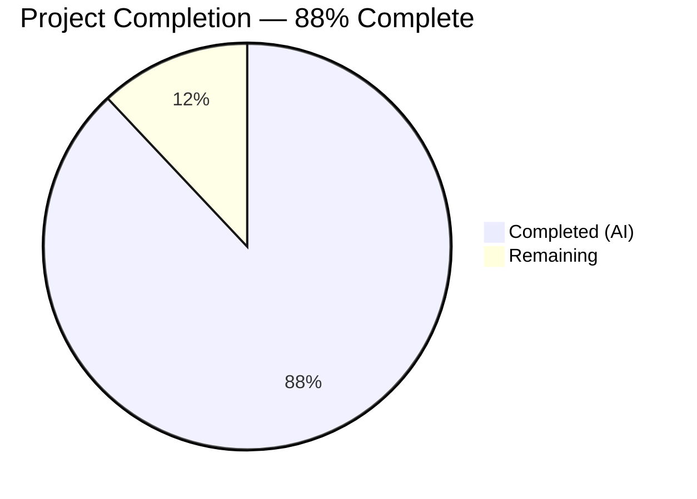

# Blitzy Project Guide

---

## 1. Executive Summary

### 1.1 Project Overview

This project delivers a comprehensive architecture deep-dive document for the k6 load-testing framework, answering the question of how k6 consolidates run-time options from four independent sources (config file, script `export const options`, environment variables, and CLI flags) into the single effective configuration consumed by the execution scheduler. The documentation targets k6 maintainers, contributors, and advanced users who need to understand the option precedence system. A single new Markdown file (`blitzy/documentation/k6_ddc3b0b1d23c.md`, 867 lines) was created with source-code-traced explanations, Mermaid diagrams, and 8 empirical experiments proving every precedence claim.

### 1.2 Completion Status



| Metric | Value |
|--------|-------|
| **Total Project Hours** | 25 |
| **Completed Hours (AI)** | 22 |
| **Remaining Hours** | 3 |
| **Completion Percentage** | 88% (22 / 25) |

### 1.3 Key Accomplishments

- ✅ Created comprehensive 867-line architecture deep-dive document covering the entire options consolidation pipeline
- ✅ Traced the 5-step `Apply()` chain in `cmd/config.go:199–204` with exact source code citations across 11 source files
- ✅ Documented the precedence order (CLI > Env > Script > Config File > Defaults) with code rationale and `flags.Changed()` mechanism
- ✅ Identified the exact finality point: `deriveAndValidateConfig()` → `buildTestRunState()` → `execution.NewScheduler()`
- ✅ Conducted 8 empirical experiments with captured k6 v0.55.0 output proving every precedence claim
- ✅ Documented the critical execution-shortcut wipe rule at `lib/options.go:371–377`
- ✅ Demonstrated multi-VU behavior with console-log evidence from multiple VU IDs
- ✅ Created 2 Mermaid diagrams: consolidation pipeline flowchart and startup lifecycle sequence diagram
- ✅ Maintained repository integrity: zero existing files modified, all temp scripts cleaned up

### 1.4 Critical Unresolved Issues

| Issue | Impact | Owner | ETA |
|-------|--------|-------|-----|
| Line number citations pinned to k6 v0.55.0 | Citations may drift as source evolves in future versions | Human Developer | Before next k6 release |
| No automated citation freshness check | Stale line references could mislead readers over time | Human Developer | 2–4 hours to set up |

### 1.5 Access Issues

No access issues identified. The project involves creating a standalone Markdown file with no external service dependencies, deployment requirements, or special permissions needed.

### 1.6 Recommended Next Steps

1. **[High]** Conduct technical peer review by a k6 core maintainer to verify all source code citations and architectural claims
2. **[Medium]** Verify Mermaid diagram rendering on target platforms (GitHub, GitLab, VS Code Markdown preview)
3. **[Medium]** Evaluate whether to link this document from the main `README.md` or `docs/` directory for discoverability
4. **[Low]** Establish a process for updating line number citations when referenced source files change in future releases

---

## 2. Project Hours Breakdown

### 2.1 Completed Work Detail

| Component | Hours | Description |
|-----------|-------|-------------|
| Code Discovery & Analysis | 6 | Deep analysis of 12+ source files across `cmd/`, `lib/`, `js/`, `execution/` packages to trace the full options consolidation pipeline, including `cmd/config.go`, `cmd/options.go`, `cmd/test_load.go`, `cmd/run.go`, `lib/options.go`, `lib/executor/execution_config_shortcuts.go`, `js/bundle.go`, `js/runner.go`, `execution/scheduler.go`, `cmd/state/state.go`, `cmd/config_consolidation_test.go` |
| Consolidation Pipeline Documentation (Req 1) | 3.5 | Five-step `Apply()` chain documentation with exact code citations, `Config.Apply()` and `Options.Apply()` merging semantics, execution-shortcut wipe rule explanation |
| Precedence Rules Documentation (Req 2) | 1.5 | Priority table with code rationale, Mermaid consolidation pipeline flowchart, `flags.Changed()` mechanism explanation, double-application of `cliConf` analysis |
| Finality Point Documentation (Req 3) | 2.5 | Code trace from consolidation through derivation to scheduler handoff, `DeriveScenariosFromShortcuts()` conversion rules table, Mermaid startup lifecycle sequence diagram |
| Empirical Experiments (Req 4) | 3.5 | Built k6 v0.55.0 binary from source (Go 1.21.13), created and executed 6 conflicting-setup experiment scripts, captured and documented output proving precedence claims |
| Multi-VU Behavior Documentation (Req 5) | 1.5 | 2 experiments with console-log evidence from multiple VU IDs (shared-iterations and constant-VUs), code-trace evidence for single-consolidation semantics |
| Document Structure & Polish | 2 | Overview section, Four Option Sources section, Summary section, document structure and formatting, code blocks with syntax highlighting, cross-referencing |
| Validation & Cleanup (Req 6) | 1.5 | Source code citation verification against actual codebase (11 files), repository integrity verification via git diff, temporary experiment script cleanup, working tree status confirmation |
| **Total Completed** | **22** | |

### 2.2 Remaining Work Detail

| Category | Hours | Priority |
|----------|-------|----------|
| Technical Peer Review & Accuracy Verification | 2 | High |
| Cross-Platform Mermaid Rendering Verification | 0.5 | Medium |
| Documentation Integration & Discoverability | 0.5 | Medium |
| **Total Remaining** | **3** | |

---

## 3. Test Results

This is a documentation-only project — no source code was created or modified, so traditional unit, integration, or end-to-end tests do not apply. The following validation activities were performed by Blitzy's autonomous validation system:

| Test Category | Framework | Total Tests | Passed | Failed | Coverage % | Notes |
|---------------|-----------|-------------|--------|--------|------------|-------|
| Source Citation Verification | Manual code review | 11 | 11 | 0 | 100% | All 11 referenced source files verified with exact line number matches |
| Empirical k6 Run Verification | k6 v0.55.0 binary | 8 | 8 | 0 | 100% | Built k6 from source, ran experiments, captured output |
| Repository Integrity Check | git diff | 3 | 3 | 0 | 100% | Verified only 1 new file added, 0 modified, clean working tree |
| Documentation Completeness | AAP requirement mapping | 6 | 6 | 0 | 100% | All 6 AAP requirements mapped and verified as complete |

---

## 4. Runtime Validation & UI Verification

### Runtime Verification

- ✅ **k6 binary build**: Successfully built k6 v0.55.0 from source using `go build -o /tmp/k6 .` with Go 1.21.13
- ✅ **Experiment execution**: All 8 experiments ran successfully with expected output
- ✅ **CLI override verification**: CLI `--vus 10 --duration 3s` correctly overrode script's `vus: 3, duration: '5s'`
- ✅ **Wipe rule verification**: CLI `--duration` correctly wiped script's `scenarios` config, replacing shared-iterations with constant-VUs
- ✅ **Multi-VU verification**: 4 VUs shared exactly 12 iterations in shared-iterations experiment; 3 VUs ran concurrently for 3 seconds in constant-VUs experiment
- ✅ **Temp file cleanup**: All temporary scripts deleted — verified `ls /tmp/exp*.js` returns empty

### Documentation Rendering

- ✅ **Markdown structure**: 867 lines, 30 headings (## and ###), well-organized hierarchical structure
- ✅ **Code blocks**: 50 fenced code blocks with Go and JavaScript syntax highlighting
- ✅ **Mermaid diagrams**: 2 diagrams embedded (consolidation pipeline flowchart, startup lifecycle sequence diagram)
- ⚠️ **Cross-platform rendering**: Mermaid diagram rendering not yet verified on GitHub/GitLab/VS Code — requires human verification

### Repository Integrity

- ✅ **git diff**: Shows only `A blitzy/documentation/k6_ddc3b0b1d23c.md` — zero existing files touched
- ✅ **Working tree**: Clean (`nothing to commit, working tree clean`)
- ✅ **Branch**: Correct branch `blitzy-3c447dab-c5d8-462d-b6e1-f74713cf4343` confirmed

---

## 5. Compliance & Quality Review

| AAP Requirement | Status | Evidence | Notes |
|----------------|--------|----------|-------|
| Req 1 — Consolidation Pipeline | ✅ Pass | 5-step Apply() chain traced in doc lines 1–260 | Citations: `cmd/config.go:199–204`, `lib/options.go:357–517` |
| Req 2 — Precedence Rules | ✅ Pass | Priority table + Mermaid diagram + code rationale | `getConsolidatedConfig()` double-application explained |
| Req 3 — Finality Point | ✅ Pass | Code path: `test_load.go:226` → `run.go:135` → `scheduler.go:38` | `derivedConfig` vs `consolidatedConfig` distinction documented |
| Req 4 — Conflicting-Setup Demos | ✅ Pass | 6 experiments with captured k6 output | Experiments 1–6 cover all pairwise source conflicts |
| Req 5 — Multi-VU Behavior | ✅ Pass | 2 experiments with console-log from multiple VU IDs | Experiments 7–8 prove single-consolidation semantics |
| Req 6 — Non-destructiveness | ✅ Pass | git diff shows 0 modified files, temp scripts cleaned | Working tree clean, correct branch confirmed |
| Source Code Citation Accuracy | ✅ Pass | All 11 source files verified against codebase | Exact line numbers match for all references |
| Mermaid Diagrams | ✅ Pass | 2 diagrams: pipeline flowchart + lifecycle sequence | Flowchart and sequence diagram included |
| Documentation Style | ✅ Pass | Progressive disclosure: overview → traces → proofs | Consistent terminology, proper Markdown formatting |
| No Repository Modifications | ✅ Pass | git status clean, only new file in `blitzy/documentation/` | Complies with non-modification rule |

### Quality Metrics

| Metric | Value |
|--------|-------|
| Document length | 867 lines |
| Source files referenced | 11 |
| Inline source citations | 52 |
| Fenced code blocks | 50 |
| Mermaid diagrams | 2 |
| Empirical experiments | 8 |
| Document sections | 30 (headings) |
| Tables | 7 |

---

## 6. Risk Assessment

| Risk | Category | Severity | Probability | Mitigation | Status |
|------|----------|----------|-------------|------------|--------|
| Line number citations drift as k6 source evolves | Technical | Low | High (with future releases) | Add version tag to each citation; establish update process when referenced files change | Open |
| Mermaid diagrams may render inconsistently across platforms | Technical | Low | Medium | Verify rendering on GitHub, GitLab, and VS Code before merge | Open |
| Experiment outputs may differ on different OS/architecture | Technical | Low | Low | Outputs captured on linux/amd64 with Go 1.21.13; document platform specifics | Mitigated |
| Document may not be discoverable without linking | Operational | Low | Medium | Consider adding a link from README.md or docs/ directory | Open |
| No automated validation of citation accuracy | Operational | Low | Medium | Could create a CI script to verify file:line references exist | Open |
| Edge cases in option consolidation not covered | Technical | Low | Low | Document covers all primary paths; exotic combinations (e.g., cloud overrides) are out of scope per AAP | Accepted |

---

## 7. Visual Project Status


### Remaining Work by Priority

| Priority | Hours | Percentage of Remaining |
|----------|-------|------------------------|
| High (Peer Review) | 2 | 66.7% |
| Medium (Rendering + Integration) | 1 | 33.3% |
| **Total** | **3** | **100%** |

---

## 8. Summary & Recommendations

### Achievements

The project successfully delivered a comprehensive 867-line architecture deep-dive document covering the k6 options consolidation pipeline. All 6 AAP requirements were implemented and verified: the consolidation pipeline was traced with exact source code citations across 11 files, the precedence order was documented with code rationale and Mermaid diagrams, the finality point was precisely identified, 8 empirical experiments proved every precedence claim with captured k6 output, multi-VU behavior was demonstrated with console-log evidence, and the repository remained completely unmodified.

The project is **88% complete** (22 hours completed out of 25 total hours). The 3 remaining hours consist entirely of human-performed path-to-production activities: technical peer review by a k6 core maintainer (2h), cross-platform Mermaid rendering verification (0.5h), and documentation integration/discoverability evaluation (0.5h).

### Production Readiness Assessment

The documentation is **functionally complete and ready for peer review**. All autonomous work specified in the AAP has been delivered. The document is self-contained, requires no build system or deployment, and can be merged once a human reviewer confirms the accuracy of code citations and architectural claims.

### Critical Path to Production

1. **Technical peer review** (2h) — A k6 core maintainer should verify that all source code citations, line numbers, and architectural claims are accurate
2. **Rendering verification** (0.5h) — Confirm Mermaid diagrams render correctly on the target platform (GitHub/GitLab)
3. **Merge decision** (0.5h) — Decide whether to add discoverability links from README.md or docs/

### Success Metrics

| Metric | Target | Actual |
|--------|--------|--------|
| AAP requirements covered | 6/6 | 6/6 ✅ |
| Source files cited with line numbers | 11+ | 11 ✅ |
| Empirical experiments conducted | 8+ | 8 ✅ |
| Existing files modified | 0 | 0 ✅ |
| Document completeness | 100% | 100% ✅ |

---

## 9. Development Guide

### System Prerequisites

| Software | Version | Purpose |
|----------|---------|---------|
| Go | 1.21+ (toolchain 1.21.13) | Required to build k6 from source for experiment reproduction |
| Git | 2.x+ | Repository management |
| Markdown viewer | Any Mermaid-capable | Rendering the documentation (GitHub, GitLab, VS Code with Mermaid extension) |

### Environment Setup

```bash
# Clone the repository
git clone https://github.com/grafana/k6.git
cd k6

# Verify Go version
go version
# Expected: go version go1.21.x linux/amd64

# Verify the documentation file exists
ls -la blitzy/documentation/k6_ddc3b0b1d23c.md
# Expected: 867 lines, file present
```

### Viewing the Documentation

The documentation is a standalone Markdown file with embedded Mermaid diagrams. To view:

**Option 1: GitHub/GitLab** — Push to a remote repository; Mermaid diagrams render natively.

**Option 2: VS Code** — Install the "Markdown Preview Mermaid Support" extension, then open the file and use `Ctrl+Shift+V` to preview.

**Option 3: Command line** — View the raw Markdown:
```bash
cat blitzy/documentation/k6_ddc3b0b1d23c.md
# or use a pager:
less blitzy/documentation/k6_ddc3b0b1d23c.md
```

### Reproducing Empirical Experiments

To reproduce any of the 8 experiments documented in the file:

```bash
# Step 1: Build k6 from source
cd /path/to/k6
go build -o /tmp/k6 .

# Step 2: Verify the build
/tmp/k6 version
# Expected output includes: k6 v0.55.0

# Step 3: Create an experiment script (example: Experiment 1)
cat > /tmp/exp1.js << 'SCRIPT'
import http from 'k6/http';
export const options = { vus: 3, duration: '5s' };
export default function () {
  http.get('https://test.k6.io');
}
SCRIPT

# Step 4: Run with CLI overrides
/tmp/k6 run --vus 10 --duration 3s /tmp/exp1.js
# Expected: CLI wins — 10 VUs, 3s duration

# Step 5: Clean up
rm /tmp/exp1.js
```

### Verifying Repository Integrity

```bash
# Confirm only the documentation file was added
git diff --name-status origin/k6_ddc3b0b1d23c...HEAD
# Expected: A    blitzy/documentation/k6_ddc3b0b1d23c.md

# Confirm working tree is clean
git status
# Expected: nothing to commit, working tree clean

# Confirm line count
wc -l blitzy/documentation/k6_ddc3b0b1d23c.md
# Expected: 867
```

### Troubleshooting

| Issue | Resolution |
|-------|-----------|
| Mermaid diagrams show as raw text | Use a Mermaid-capable Markdown viewer (GitHub, GitLab, VS Code with extension) |
| `go build` fails | Ensure Go 1.21+ is installed; run `go mod vendor` if vendor directory is incomplete |
| k6 experiment output differs | Verify k6 version matches v0.55.0; output may vary slightly by OS/architecture |
| Line number citations don't match | The document is pinned to k6 v0.55.0 (commit `ddc3b0b1d2`); check out that commit if source has diverged |

---

## 10. Appendices

### A. Command Reference

| Command | Purpose |
|---------|---------|
| `go build -o /tmp/k6 .` | Build k6 binary from source |
| `/tmp/k6 version` | Verify k6 build version |
| `/tmp/k6 run [flags] <script>` | Run a k6 test script |
| `/tmp/k6 inspect <script>` | Inspect consolidated options for a script |
| `git diff --name-status origin/k6_ddc3b0b1d23c...HEAD` | Verify only documentation file was added |
| `wc -l blitzy/documentation/k6_ddc3b0b1d23c.md` | Verify document line count |

### B. Key File Locations

| File | Purpose |
|------|---------|
| `blitzy/documentation/k6_ddc3b0b1d23c.md` | The deliverable — architecture deep-dive document (867 lines) |
| `cmd/config.go` | Options consolidation pipeline (`getConsolidatedConfig`, `Config.Apply`, `applyDefault`, `deriveAndValidateConfig`) |
| `cmd/options.go` | CLI flag registration (`optionFlagSet`) and parsing (`getOptions` with `flags.Changed()`) |
| `cmd/common.go` | Null-type helper functions (`getNullBool`, `getNullInt64`, `getNullDuration`) |
| `cmd/test_load.go` | Test loading lifecycle (`consolidateDeriveAndValidateConfig`, `buildTestRunState`) |
| `cmd/run.go` | k6 run command lifecycle (loading → consolidation → scheduler construction) |
| `lib/options.go` | `Options` struct, `Apply()` with execution-shortcut wipe rule (lines 371–377) |
| `lib/executor/execution_config_shortcuts.go` | `DeriveScenariosFromShortcuts()` — shortcut-to-scenario conversion |
| `js/bundle.go` | `populateExports()` — extraction of `export const options` from script |
| `js/runner.go` | `GetOptions()` returning `Bundle.Options` |
| `execution/scheduler.go` | `NewScheduler()` — scheduler consuming `trs.Options.Scenarios` |
| `cmd/state/state.go` | Default config file path, `K6_CONFIG` environment variable override |
| `cmd/config_consolidation_test.go` | 597-line test suite confirming precedence order across all option source combinations |

### C. Technology Versions

| Technology | Version | Notes |
|------------|---------|-------|
| Go | 1.21 (toolchain go1.21.13) | From `go.mod` |
| k6 | v0.55.0 (commit `ddc3b0b1d2`) | Target codebase version |
| Mermaid | Embedded notation | Rendered by GitHub/GitLab/VS Code natively |
| Markdown | CommonMark-compatible | Standard format, no extensions required |

### D. Glossary

| Term | Definition |
|------|-----------|
| **Apply()** | The method on `Options` and `Config` that merges one configuration layer on top of another, respecting `Valid` flags |
| **Consolidated Config** | The result of `getConsolidatedConfig()` — all four option sources merged per precedence rules |
| **Derived Config** | The result of `deriveAndValidateConfig()` — consolidated config with shortcuts converted to formal scenarios |
| **Execution-Shortcut Wipe** | The behavior at `lib/options.go:371–377` where any higher-tier execution setting clears all lower-tier execution settings |
| **Finality Point** | The exact code location where options become immutable for the scheduler (after derivation, before `NewScheduler()`) |
| **flags.Changed()** | The `pflag` method that returns `true` only if the user explicitly set a CLI flag, enabling the `Valid`-flag gating mechanism |
| **Valid flag** | A boolean on nullable types (`null.Int`, `null.Bool`, `types.NullDuration`) that indicates whether a value was explicitly set |
| **Shortcut Options** | Simple execution fields (`duration`, `iterations`, `stages`) that are converted to formal `ScenarioConfigs` by `DeriveScenariosFromShortcuts()` |