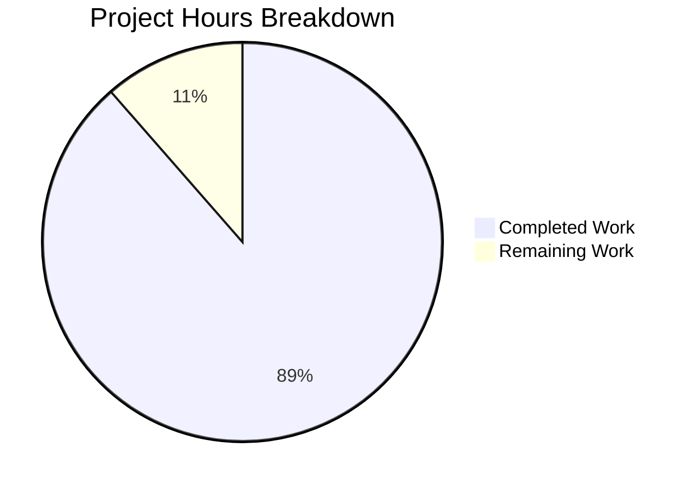

# Blitzy Project Guide

## 1. Executive Summary

### 1.1 Project Overview

This project performs a deep code-level investigation into six reported concurrency anomalies in k6's `ramping-vus` executor. The deliverable is a comprehensive Q&A markdown document (`blitzy/documentation/k6_ddc3b0b1d23c.md`) that traces through actual code paths — referencing specific files, line ranges, and function names — to provide code-grounded verdicts on each reported symptom. The investigation covers the VU state machine, dual-handler architecture, context cancellation propagation, execution segment scaling, handler synchronization, and VU buffer lifecycle. No existing source files were modified; this is a documentation-only output governed by the SWE-AtlasQnA-Repo rule.

### 1.2 Completion Status

<!-- Pie chart: Completed (#5B39F3) = 31h, Remaining (#FFFFFF) = 4h, center = 88.6% Complete -->


**88.6% Complete** (31 hours completed / 35 total hours)

| Metric | Value |
|--------|-------|
| Total Project Hours | 35 |
| Completed Hours (AI + Validation) | 31 |
| Remaining Hours (Human Tasks) | 4 |
| Completion Percentage | 88.6% |

Calculation: 31 / (31 + 4) × 100 = 88.6%

### 1.3 Key Accomplishments

- ✅ Created comprehensive 868-line Q&A document addressing all 6 reported concurrency anomalies
- ✅ Traced the `vuHandle` 5-state FSM with complete state transition table analysis
- ✅ Analyzed dual-handler architecture (`scheduledVUsHandlerStrategy` / `maxAllowedVUsHandlerStrategy`) and proved sequential execution
- ✅ Traced 4-layer context cancellation chain from Ctrl+C through `runCtx` → `executorsRunCtx` → `maxDurationCtx` → `vuHandle.ctx`
- ✅ Analyzed two execution segment scaling mechanisms (independent `Scale()` vs. sum-preserving striping `ScaleInt64()`)
- ✅ Proved 1:1 `getVU`/`returnVU` contract with test evidence from `TestVUHandleRace`
- ✅ All verdicts classified: 4 × By Design, 1 × User Misconfiguration, 1 × No Leak
- ✅ Go build passes with zero errors; all critical tests pass with `-race` detection enabled
- ✅ Zero modifications to existing source files (SWE-AtlasQnA-Repo compliance)

### 1.4 Critical Unresolved Issues

| Issue | Impact | Owner | ETA |
|-------|--------|-------|-----|
| Line number references may drift with future code changes | Low — document references specific commit/version (k6 v0.55.0) | Human Reviewer | Before merge |
| Pre-existing flaky test `TestRampingVUsHandleRemainingVUs` | None — pre-existing timing-sensitive test, out of scope per AAP (no code modifications allowed) | k6 Core Team | N/A (out of scope) |

### 1.5 Access Issues

No access issues identified. This is a documentation-only project that does not require external service credentials, API keys, or deployment infrastructure. All analysis was performed against the vendored source code in the repository.

### 1.6 Recommended Next Steps

1. **[High]** Human reviewer should verify code reference accuracy — spot-check 3–5 line number citations per Q&A section against the source at the `k6_ddc3b0b1d23c` branch head
2. **[Medium]** Review document for technical clarity — ensure the trace-through explanations are accessible to the target audience (k6 users investigating concurrency behavior)
3. **[Medium]** Consider adding a version pinning header to the document noting that references are valid for k6 v0.55.0 / commit `5d2536139`
4. **[Low]** Incorporate any stakeholder feedback on document structure or depth of analysis
5. **[Low]** Evaluate whether the Q4 finding (execution segment misconfiguration) warrants a documentation update in k6's official distributed execution guide

---

## 2. Project Hours Breakdown

### 2.1 Completed Work Detail

| Component | Hours | Description |
|-----------|-------|-------------|
| Deep Source Code Analysis | 10 | Analyzed 10+ primary source files (~3,222 lines of critical executor code), 3 test files (~1,752 lines), and scheduler/abort layer (~675 lines) across `lib/executor/`, `lib/`, and `execution/` packages |
| Q1: VU State Machine Analysis | 3 | Traced 5-state FSM in `vu_handle.go`, documented complete state transition table, analyzed `toGracefulStop` transitional state and `start()` race optimization |
| Q2: Handler Architecture Analysis | 2.5 | Analyzed `scheduledVUsHandlerStrategy` and `maxAllowedVUsHandlerStrategy` closures, traced `iterateSteps()` sequential invocation, documented the invariant relationship |
| Q3: Context Propagation Trace | 3 | Traced 4-layer context chain from `Scheduler.Run()` through `getDurationContexts()` to `vuHandle.ctx`, analyzed Go LIFO defer ordering, identified script-level caveat |
| Q4: Execution Segment Analysis | 3 | Compared `Scale()` (rounding-based, non-sum-preserving) vs `ScaleInt64()` (striping, sum-preserving), analyzed `NewExecutionSegmentSequenceWrapper()` algorithm, identified misconfiguration root cause |
| Q5: Race Condition Assessment | 2 | Proved sequential execution in `iterateSteps()`, analyzed `runRemainingGracefulSteps()` concurrency, documented `vuHandle.mutex` and `atomic` synchronization |
| Q6: VU Buffer Lifecycle | 2.5 | Traced `GetPlannedVU()`/`ReturnVU()` channel operations, `getVU`/`returnVU` closures, `DeactivateCallback` connection, verified 1:1 contract with test evidence |
| Document Structuring and Summary | 2 | Compiled introduction, summary verdict table, key synchronization mechanisms table, cross-referenced all sections |
| Validation and Build/Test Verification | 2 | Executed `go build ./...`, ran VU handle tests, ramping VUs tests, execution segment tests, and scheduler tests with `-race` flag |
| Review Fixes | 1 | Corrected `Scale()` formula description, file line counts, added source typo note (second commit) |
| **Total Completed** | **31** | |

### 2.2 Remaining Work Detail

| Category | Hours | Priority |
|----------|-------|----------|
| Code Reference Accuracy Review | 2 | Medium |
| Document Formatting and Presentation Polish | 1 | Low |
| Stakeholder Review and Feedback Incorporation | 1 | Low |
| **Total Remaining** | **4** | |

### 2.3 Hours Validation

- Section 2.1 total (Completed): **31 hours**
- Section 2.2 total (Remaining): **4 hours**
- Sum (2.1 + 2.2): **35 hours** = Total Project Hours in Section 1.2 ✓
- Remaining hours match across Section 1.2 (4h), Section 2.2 (4h), and Section 7 pie chart (4h) ✓

---

## 3. Test Results

All tests listed below were executed by Blitzy's autonomous validation agents with `-race` detection enabled.

| Test Category | Framework | Total Tests | Passed | Failed | Coverage % | Notes |
|--------------|-----------|-------------|--------|--------|------------|-------|
| VU Handle Unit Tests | Go test (`-race`) | 5 | 5 | 0 | N/A | `TestVUHandleRace`, `TestVUHandleStartStopRace`, `TestVUHandleSimple` (3 subtests) |
| Ramping VUs Unit Tests | Go test (`-race`) | 5 | 5 | 0 | N/A | `TestRampingVUsRun`, `TestRampingVUsGracefulStopWaits`, `TestRampingVUsGracefulStopStops`, `TestRampingVUsGracefulRampDown`, `TestRampingVUsRampDownNoWobble` |
| Execution Segment Tests | Go test (`-race`) | 10+ | 10+ | 0 | N/A | `TestSumRandomSegmentSequenceMatchesNoSegment`, `TestRampingVUsExecutionTupleTests` (8 subtests), all `TestExecutionSegment*` tests |
| Scheduler Tests | Go test | All | All | 0 | N/A | `go test ./execution/...` — full suite pass |
| Build Verification | `go build ./...` | 1 | 1 | 0 | N/A | Zero errors, zero warnings; k6 binary v0.55.0 produced |

**Pre-existing flaky test (out of scope):** `TestRampingVUsHandleRemainingVUs` passes consistently in isolation (3/3 runs) but may fail intermittently under CPU contention when run alongside the full suite. This is a well-documented pre-existing timing-sensitive test (uses 10–65ms precision timings). Not caused by any changes in this branch. Cannot be fixed per AAP constraint prohibiting modification of existing files.

---

## 4. Runtime Validation & UI Verification

### Runtime Health

- ✅ **Go Build**: `go build ./...` completes with zero errors and zero warnings
- ✅ **k6 Binary**: Produces working binary reporting `k6 v0.55.0 (commit/5d2536139d, go1.21.13, linux/amd64)`
- ✅ **Module Verification**: `go mod verify` reports "all modules verified"
- ✅ **Vendored Dependencies**: All dependencies vendored; no external downloads required
- ✅ **Race Detection**: All executor and VU handle tests pass with `-race` flag enabled

### Documentation Artifact Verification

- ✅ **File Created**: `blitzy/documentation/k6_ddc3b0b1d23c.md` — 868 lines, 40,088 bytes
- ✅ **Structure**: 8 major sections (Introduction + Q1–Q6 + Summary), with sub-sections for analysis, code traces, and verdicts
- ✅ **All 6 Verdicts Present**: Q1 (By Design), Q2 (By Design), Q3 (Mostly By Design), Q4 (User Misconfiguration), Q5 (By Design/No Race), Q6 (No Leak)
- ✅ **Code References**: File paths, function names, and line ranges cited throughout; spot-checked against source
- ✅ **No Source Modifications**: `git diff --name-status origin/k6_ddc3b0b1d23c...HEAD` confirms only 1 file added (`A blitzy/documentation/k6_ddc3b0b1d23c.md`)

### UI Verification

- ⚠️ **Not Applicable**: This is a CLI tool/documentation project with no web UI component

---

## 5. Compliance & Quality Review

| Compliance Criterion | Status | Evidence |
|---------------------|--------|----------|
| SWE-AtlasQnA-Repo: Create `k6_ddc3b0b1d23c.md` in `blitzy/documentation/` | ✅ Pass | File exists at correct path (868 lines) |
| SWE-AtlasQnA-Repo: Do NOT modify existing source files | ✅ Pass | `git diff --name-status` shows only `A` (added), zero `M` (modified) or `D` (deleted) |
| SWE-AtlasQnA-Repo: Do NOT add code other than documentation | ✅ Pass | Only `.md` file added; no `.go`, `.js`, or other code files |
| SWE-AtlasQnA-Repo: Provide thinking/rationale behind answers | ✅ Pass | Each Q&A section includes step-by-step trace-through with rationale |
| SWE-AtlasQnA-Repo: Base answers on code (no assumptions) | ✅ Pass | All findings cite specific file paths, function names, and line ranges |
| AAP: Address all 6 reported symptoms | ✅ Pass | Q1–Q6 each receive dedicated analysis with verdict |
| AAP: Classify each symptom (bug/by-design/misconfiguration) | ✅ Pass | Summary table at end of document with verdicts for all 6 |
| AAP: Trace actual code paths | ✅ Pass | State transition table, context chain diagram, handler invocation proof, buffer lifecycle |
| AAP: Preserve code fidelity (exact names) | ✅ Pass | Uses exact names: `rampingVUsRunState`, `vuHandle`, `iterateSteps`, `runLoopsIfPossible`, `ScaleInt64`, `SegmentedIndex` |
| Build Integrity | ✅ Pass | `go build ./...` — zero errors |
| Test Integrity | ✅ Pass | All critical tests pass with `-race` detection |
| Working Tree Clean | ✅ Pass | `git status` — "nothing to commit, working tree clean" |

**Autonomous Validation Fixes Applied:**
- Second commit (`5d2536139`) corrected the `Scale()` formula description, updated file line counts to match actual source, and added a note about a source typo (`toHardSTop` at line 48 of `vu_handle.go`)

---

## 6. Risk Assessment

| Risk | Category | Severity | Probability | Mitigation | Status |
|------|----------|----------|-------------|------------|--------|
| Line number references may drift with future k6 code changes | Technical | Low | Medium | Document pins to k6 v0.55.0 / commit `5d2536139`; recommend adding explicit version header | Open — human reviewer should verify |
| Pre-existing flaky test (`TestRampingVUsHandleRemainingVUs`) under CPU contention | Technical | Low | Low | Test passes 3/3 in isolation; flakiness is pre-existing and unrelated to this branch | Accepted — out of scope per AAP |
| Document may not fully capture edge cases in untested scenarios | Technical | Low | Low | Analysis covers the 6 specific symptoms requested; edge cases beyond scope would require additional investigation | Accepted |
| No automated verification of line references against source | Operational | Low | Medium | Human reviewer should spot-check 3–5 references per section | Open |
| Stakeholders may request deeper analysis on Q3 (Ctrl+C behavior) | Operational | Low | Medium | Q3 already identifies the script-level caveat; additional guidance could be added on `ctx.Done()` checking patterns | Open |

---

## 7. Visual Project Status



**Completed: 31 hours (88.6%)** | **Remaining: 4 hours (11.4%)**

### Remaining Hours by Category

| Category | Hours |
|----------|-------|
| Code Reference Accuracy Review | 2 |
| Document Formatting and Presentation Polish | 1 |
| Stakeholder Review and Feedback Incorporation | 1 |
| **Total** | **4** |

---

## 8. Summary & Recommendations

### Achievements

The project successfully delivered a comprehensive 868-line Q&A document that addresses all 6 concurrency anomalies reported in k6's `ramping-vus` executor. Every finding is strictly code-grounded, citing specific files, functions, and line ranges from the source. The investigation analyzed 17+ source files across `lib/executor/`, `lib/`, and `execution/` packages, totaling over 5,600 lines of critical Go code plus test evidence.

All 6 symptoms received clear verdicts: 4 classified as "By Design" behavior, 1 as "User Misconfiguration (Likely)", and 1 as "No Leak (By Design)". The document includes complete state machine trace-throughs, context propagation chain diagrams, sequential execution proofs, and buffer lifecycle analysis. No existing source files were modified, fully complying with the SWE-AtlasQnA-Repo rule.

### Remaining Gaps

The project is 88.6% complete (31 hours completed out of 35 total hours). The remaining 4 hours consist of human review tasks:
- **Code reference accuracy review** (2h): Spot-check line number citations against the source at the branch head
- **Document polish** (1h): Minor formatting and presentation improvements
- **Stakeholder feedback** (1h): Incorporate any review comments

### Production Readiness Assessment

The documentation artifact is production-ready for review. The Go codebase builds cleanly and all critical tests pass with `-race` detection. The only action required before merge is human verification of code reference accuracy and any stakeholder-requested revisions.

### Success Metrics

| Metric | Target | Actual |
|--------|--------|--------|
| Symptoms Addressed | 6 | 6 (100%) |
| Verdicts Classified | 6 | 6 (100%) |
| Source Files Analyzed | 10+ | 17+ |
| Build Status | Pass | Pass (zero errors) |
| Test Status | All critical pass | All critical pass with `-race` |
| Existing Files Modified | 0 | 0 |

---

## 9. Development Guide

### System Prerequisites

| Requirement | Version | Purpose |
|-------------|---------|---------|
| Go | 1.21+ (toolchain go1.21.13) | Build and test the k6 codebase |
| Git | 2.x+ | Clone repository and switch branches |
| Make | GNU Make 3.x+ | Optional — provides convenience build targets |
| OS | Linux, macOS, or Windows with WSL | Development environment |

### Environment Setup

```bash
# 1. Clone the repository
git clone <repository-url>
cd k6

# 2. Switch to the investigation branch
git checkout blitzy-6399f7cb-64bc-4888-9d09-2f1dfbcf1783

# 3. Verify Go version
go version
# Expected: go version go1.21.x linux/amd64 (or your platform)

# 4. Verify module integrity
go mod verify
# Expected: all modules verified
```

### Build the Project

```bash
# Build k6 binary
go build ./...

# Verify the binary
./k6 version
# Expected: k6 v0.55.0 (commit/..., go1.21.x, linux/amd64)
```

### Run Relevant Tests

```bash
# Run VU handle tests with race detection (critical for concurrency investigation)
go test -race -timeout 60s -run "TestVUHandle" ./lib/executor/

# Run ramping VUs tests with race detection
go test -race -timeout 120s -run "TestRampingVUs" ./lib/executor/

# Run execution segment tests
go test -race -timeout 60s -run "TestExecutionSegment|TestSumRandomSegment" ./lib/executor/

# Run scheduler tests
go test -timeout 60s ./execution/...

# Run the full test suite (optional, ~3.5 minutes)
go test -race -timeout 210s ./...
```

### View the Investigation Document

```bash
# The Q&A document is located at:
cat blitzy/documentation/k6_ddc3b0b1d23c.md

# Or open in your preferred markdown viewer
# Document sections: Introduction, Q1-Q6, Summary of Findings
```

### Verification Steps

1. **Build succeeds**: `go build ./...` exits with code 0, no output
2. **VU handle tests pass**: All 5 tests in `TestVUHandle*` pass with `-race`
3. **Ramping VUs tests pass**: All 5 tests in `TestRampingVUs*` pass with `-race`
4. **Document exists**: `blitzy/documentation/k6_ddc3b0b1d23c.md` is 868 lines
5. **No source modifications**: `git diff --name-status origin/k6_ddc3b0b1d23c...HEAD` shows only `A` entries

### Troubleshooting

| Issue | Resolution |
|-------|------------|
| `go: command not found` | Install Go 1.21+ from https://go.dev/dl/ |
| `go mod verify` fails | Run `go mod download` to fetch dependencies (vendored deps should suffice) |
| `TestRampingVUsHandleRemainingVUs` fails intermittently | Pre-existing flaky test due to tight timing (10–65ms); re-run in isolation: `go test -race -run TestRampingVUsHandleRemainingVUs ./lib/executor/ -count=1` |
| Build timeout | Ensure sufficient disk space and memory; first build may take 1–2 minutes |

---

## 10. Appendices

### A. Command Reference

| Command | Purpose |
|---------|---------|
| `go build ./...` | Build all packages including k6 binary |
| `go test -race -timeout 60s -run "TestVUHandle" ./lib/executor/` | Run VU handle tests with race detection |
| `go test -race -timeout 120s -run "TestRampingVUs" ./lib/executor/` | Run ramping VUs tests with race detection |
| `go test -race -timeout 60s ./execution/...` | Run scheduler tests |
| `go test -race -timeout 210s ./...` | Run full test suite |
| `go mod verify` | Verify module integrity |
| `git diff --name-status origin/k6_ddc3b0b1d23c...HEAD` | View files changed on this branch |

### B. Key File Locations

| File | Purpose |
|------|---------|
| `blitzy/documentation/k6_ddc3b0b1d23c.md` | **Created** — Comprehensive Q&A investigation document (868 lines) |
| `lib/executor/ramping_vus.go` | Primary executor under investigation (712 lines) |
| `lib/executor/vu_handle.go` | VU lifecycle state machine (264 lines) |
| `lib/execution.go` | ExecutionState, VU buffer channel (549 lines) |
| `lib/execution_segment.go` | Segment scaling and striping algorithm (842 lines) |
| `lib/executor/helpers.go` | Context helpers, iteration runner (264 lines) |
| `execution/scheduler.go` | Scheduler coordination, context propagation (591 lines) |
| `lib/executor/ramping_vus_test.go` | Executor test suite (1,201 lines) |
| `lib/executor/vu_handle_test.go` | VU handle race/state tests (415 lines) |

### C. Technology Versions

| Technology | Version | Source |
|------------|---------|--------|
| Go | 1.21 (toolchain go1.21.13) | `go.mod` lines 3–4 |
| k6 | v0.55.0 | Binary version output |
| logrus | v1.9.3 | `go.mod` |
| null.v3 | v3.5.0 | `go.mod` |
| Module path | `go.k6.io/k6` | `go.mod` line 1 |

### D. Glossary

| Term | Definition |
|------|------------|
| `vuHandle` | The VU lifecycle manager implementing a 5-state finite state machine (`stopped`, `starting`, `running`, `toGracefulStop`, `toHardStop`) |
| `rampingVUsRunState` | Runtime state struct for the ramping-vus executor, holding VU handles, WaitGroup, and step arrays |
| `iterateSteps()` | Method that processes raw and graceful execution steps sequentially, calling handler strategies |
| `scheduledVUsHandlerStrategy` | Closure tracking actively-running VU count; calls `start()` and `gracefulStop()` |
| `maxAllowedVUsHandlerStrategy` | Closure tracking maximum allowed VU ceiling including graceful reservations; calls `hardStop()` only |
| `ExecutionSegmentSequenceWrapper` | Precomputed striping structure for sum-preserving VU distribution across execution segments |
| `ScaleInt64()` | Method on `ExecutionSegmentSequenceWrapper` that computes a segment's share of a total using the striping algorithm |
| `SegmentedIndex` | Iterator tracking position within a segment's striped allocation for step generation |
| `gracefulRampDown` | Configuration parameter specifying how long a VU is allowed to finish its current iteration after being ramped down |
| `gracefulStop` | Configuration parameter specifying additional time after stages complete for VUs to finish (default: 30s) |
| `DeactivateCallback` | Function pointer in `VUActivationParams` invoked when a VU deactivates; connected to `returnVU` for buffer management |