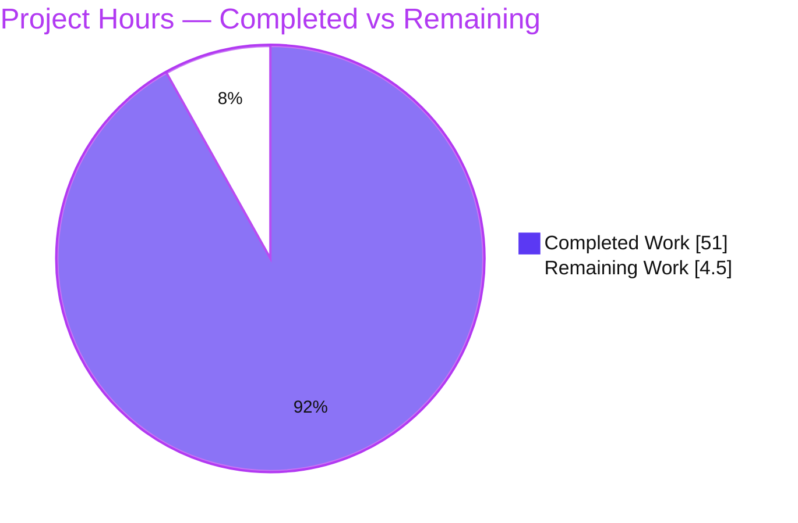

# Blitzy Project Guide — k6 Runtime-Investigation Q&A

> Target repository: `go.k6.io/k6` (k6 **v0.55.0**) · Source branch: `k6_ddc3b0b1d23c` (base commit `ddc3b0b1d23c`) · Work branch HEAD: `440298fca`
> Deliverable: `blitzy/documentation/k6_ddc3b0b1d23c.md` — an empirical, runtime-grounded answer document for five k6-internals questions.

---

## 1. Executive Summary

### 1.1 Project Overview

This project is a **read-only runtime investigation** of the Grafana **k6** load-testing tool. The objective is a single Markdown answer document that resolves five precise questions about k6 internals — VU lifecycle on `SIGINT`, gRPC server-streaming interruption, `dropped_iterations` via the REST API, `SharedArray` memory sharing, and Prometheus remote-write name integrity — where **every answer is grounded in captured runtime evidence** (build → run → capture), not code-reading alone. The audience is engineers and reviewers who need authoritative, reproducible behavioral facts about k6 v0.55.0. Technical scope: build canonical k6, author temporary `/tmp` harnesses (gRPC server, remote-write receiver, decoder), exercise canonical entry points (`k6 run`, `k6 stats`, REST API), and cite every value to `file:line` — while leaving the source repository strictly unmodified.

### 1.2 Completion Status


| Metric | Value |
|---|---|
| **Total Hours** | **55.5** |
| **Completed Hours (AI + Manual)** | **51.0** |
| &nbsp;&nbsp;— AI (Autonomous) | 51.0 |
| &nbsp;&nbsp;— Manual | 0.0 |
| **Remaining Hours** | **4.5** |
| **Percent Complete** | **91.9%** |

> Completion % (PA1, AAP-scoped) = Completed ÷ Total = 51 ÷ 55.5 = **91.9%**. All AAP-specified requirements (the deliverable, all five answers, every methodological rule, and the read-only/cleanup constraints) are complete and validated. The remaining 4.5 h is exclusively **path-to-production human review/acceptance** — there is no build/test/deploy pipeline to complete for a Markdown answer document. Legend: **Completed = Dark Blue `#5B39F3`**, **Remaining = White `#FFFFFF`**.

### 1.3 Key Accomplishments

- ✅ **Single deliverable created and committed** — `blitzy/documentation/k6_ddc3b0b1d23c.md` (1,747 lines, 116,156 bytes) at HEAD `440298fca`.
- ✅ **Read-only source constraint honored** — `git diff base..HEAD` is the deliverable **only** (zero `.go`/`.mod`/`.sum`/`vendor/` changes); working tree clean.
- ✅ **All five questions answered with runtime evidence** — Q1 (VUs terminated mid-execution: `0 complete and 5 interrupted iterations`), Q2 (`grpc_streams_msgs_received = 95` on interrupt, 100 baseline), Q3 (`dropped_iterations` from `GET /v1/metrics/dropped_iterations`, HTTP 200), Q4 (`SharedArray` footprint flat vs. naive ~80 MB/VU linear growth), Q5 (12 `k6_`-prefixed `__name__` values, byte-identical across runs).
- ✅ **Canonical k6 build reproduced this session** — `go build` in 2.78 s (offline/vendored), banner `k6 v0.55.0 (commit/440298fca5, go1.21.13, linux/amd64)`.
- ✅ **Q1 and Q3 independently re-reproduced this session** — Q1 exit `105` + interrupt log + `5 interrupted iterations`; Q3 `HTTP/1.1 200 OK` with conservation invariant `dropped + iterations = 1000`.
- ✅ **All ~103 `file:line` citations verified** — spot-checks (Q1–Q5 anchors) exact against live source; zero mismatches.
- ✅ **Methodology satisfied** — run-first, two-run stability (Q1×2, Q2×3, Q3×45, Q4×2, Q5×2), Observed-vs-inferred labeling, and a full coverage pass.

### 1.4 Critical Unresolved Issues

| Issue | Impact | Owner | ETA |
|---|---|---|---|
| _None — no blocking issues_ | The single in-scope deliverable is complete, accurate, and reproducible; validator declared production-ready with zero corrections required in the final turn. | — | — |

### 1.5 Access Issues

| System/Resource | Type of Access | Issue Description | Resolution Status | Owner |
|---|---|---|---|---|
| _None_ | — | No access issues identified. The build is fully vendored/offline; the REST API binds to loopback `localhost:6565`; all harnesses run locally under `/tmp`. No repository permissions, service credentials, or third-party API access were required or blocked. | N/A | — |

**No access issues identified.**

### 1.6 Recommended Next Steps

1. **[High]** SME correctness review of the five direct answers (Q1–Q5) against each question's intent — confirm the observed values and conclusions satisfy what was asked.
2. **[High]** Verify the `file:line` citations and Observed-vs-inferred labeling resolve against k6 v0.55.0 @ `ddc3b0b1d23c`.
3. **[Medium]** Independently reproduce the two host-dependent findings (Q3 conservation invariant & drop-count range; Q4 flat-vs-linear RSS contrast) on the reviewer's environment.
4. **[Low]** Obtain stakeholder sign-off and merge the deliverable branch to the target.

---

## 2. Project Hours Breakdown

### 2.1 Completed Work Detail

| Component | Hours | Description |
|---|---:|---|
| Canonical k6 build & environment foundation | 3.0 | Built two binaries **outside** the checkout (base-commit `k6_canonical` @ `commit/ddc3b0b1d2` + HEAD build), pinned `go1.21.13` toolchain (`GOTOOLCHAIN=local`), version-banner verification, foundation transcript, pristine-tree proof. |
| Q1 — VU lifecycle on `SIGINT` investigation | 5.0 | `ramping-vus` (`startVUs: 5`) harness; primary single-`SIGINT` path + secondary double-`SIGINT` hard-stop; captured `Stopping k6 in response to signal… sig=interrupt`, `0 complete and 5 interrupted iterations`, exit `105`; multi-file root-cause chain (`cmd/common.go`, `cmd/run.go`, `base_config.go`, `vu_handle.go`, `scheduler.go`). |
| Q2 — gRPC server-streaming interruption investigation | 6.0 | Built/ran the shipped gRPC server (a **separate** Go module) + `grpc_server_streaming.js` at `gracefulStop/gracefulRampDown = '30ms'`; baseline stream = 100; interrupt ×3 → `grpc_streams_msgs_received = 95`; exact log ordering + `stream.go` interrupt path. |
| Q3 — `dropped_iterations` via REST API investigation | 6.0 | Over-`maxDuration` `shared-iterations` scenario + `--linger`; `GET /v1/metrics/dropped_iterations` (HTTP 200, `sample.count`); 45-run stability distribution (980–985); conservation invariant `dropped + iterations = 1000`; secondary `constant-arrival-rate` live poll (~1951). |
| Q4 — `SharedArray` footprint investigation | 6.0 | Generated a 16.9 MB / 50,000-record dataset; measured peak RSS via `/usr/bin/time -v` across VUs 1/50/100/200 ×2 for shared vs. naive scripts; flat ~176–188 MB vs. ~15–17 GB @ 200 VUs; CPU 1.19 s vs. 177.91 s (parse-once); `VmHWM` control runs. |
| Q5 — Prometheus remote-write name-integrity investigation | 7.0 | Built a loopback remote-write receiver + a snappy→protobuf decoder; ran `--out experimental-prometheus-rw`; decoded 12 `k6_`-prefixed `__name__` values byte-identical across 2 runs; independent SHA-256 cross-check; empty-tag omission negative assertion. |
| Answer document authoring & structuring | 8.0 | Authored the 1,747-line document: preamble/methodology, five Q sections (harness → primary → secondary → answer → root cause → observed-vs-inferred), cleanup transcript, and coverage pass; embedded all captured evidence verbatim with ~103 citations. |
| Web-search corroboration of k6 conventions | 1.0 | Confirmed documented k6 intent for `SharedArray` sharing, graceful-stop vs. manual-interrupt, and remote-write naming to interpret observations against convention. |
| QA remediation iterations (4 QA commits) | 5.0 | Resolved QA findings across commits `0ad99e99c`→`440298fca`: Q2 baseline grep fix, Q3 determinism reword + 45-run study, canonical-binary scope clarification, `js/runner.go` citation fix, Q4 naive-RSS range widening — each backed by fresh runs. |
| Final validation & cleanup | 4.0 | Rebuilt k6, re-ran all five experiments, verified every citation via `grep`/`sed`, ran cited-package unit tests, diagnosed the transient flake, removed all `/tmp` artifacts, and confirmed a clean tree + correct-branch commit. |
| **Total Completed** | **51.0** | |

### 2.2 Remaining Work Detail

| Category | Hours | Priority |
|---|---:|---|
| SME Answer Review & Acceptance (Q1–Q5 correctness vs. question intent) | 1.5 | High |
| Citation & Observed/Inferred Verification (against k6 v0.55.0 source) | 1.0 | High |
| Independent Host Reproduction (Q3 invariant & drop-range; Q4 flat-vs-linear RSS) | 1.5 | Medium |
| Stakeholder Sign-off & Merge | 0.5 | Low |
| **Total Remaining** | **4.5** | |

> **Integrity:** Section 2.1 total (51.0) + Section 2.2 total (4.5) = **55.5** = Total Hours in Section 1.2. Section 2.2 total (4.5) = Remaining Hours in Section 1.2 = Section 7 "Remaining Work".

### 2.3 Basis of Estimate

Hours are engineering-effort estimates derived from the actual work evidenced in git history (5 agent commits) and the validator logs, cross-checked against deliverable depth: section line counts (Q5 = 457, Q1 = 360, Q2 = 284, Q3 = 245, Q4 = 185), 48 embedded Go-harness code indicators, and observed run counts (Q3 = 45×, Q2 = ×3, others ×2). Remaining hours reflect a human review/acceptance gate only; there is no incomplete AAP scope. **Confidence: High** for completed work (independently re-verified this session); **High** for remaining work (well-defined review activities).

---

## 3. Test Results

All entries below originate from **Blitzy's autonomous validation logs** for this project (runtime reproduction experiments and k6 unit-test runs). "Coverage %" is reported as **N/A** for runtime reproductions — behavioral reproduction is validated by value/log stability across repeated runs, not statement coverage; no coverage instrumentation was run, so no coverage figure is fabricated.

| Test Category | Framework | Total Tests | Passed | Failed | Coverage % | Notes |
|---|---|---:|---:|---:|---:|---|
| Runtime Reproduction — Q1 (SIGINT VU lifecycle) | `k6 run` + shell harness | 3 | 3 | 0 | N/A | 2× single-`SIGINT` + 1× double-`SIGINT`; `0 complete and 5 interrupted iterations`, exit `105`. Independently re-reproduced this session. |
| Runtime Reproduction — Q2 (gRPC server-streaming) | `k6 run` + gRPC harness | 4 | 4 | 0 | N/A | 1 baseline (`=100`) + 3 interrupt (`=95` each); exact `DATA`/`Stopping`/`STREAM_END` ordering; 0 error lines. |
| Runtime Reproduction — Q3 (`dropped_iterations` REST) | `k6 run` + REST API | 45 | 45 | 0 | N/A | Invariant `dropped + iterations = 1000` held in all 45; drop range 980–985; API == console. Independently re-reproduced this session (HTTP 200). |
| Runtime Reproduction — Q4 (`SharedArray` RSS) | `k6 run` + `/usr/bin/time -v` | 8 | 8 | 0 | N/A | VUs 1/50/100/200 × 2 runs; shared flat ~176–188 MB vs. naive linear; all exit 0, no OOM. |
| Runtime Reproduction — Q5 (remote-write decode) | `k6 run` + snappy/protobuf | 2 | 2 | 0 | N/A | 12 `k6_`-prefixed `__name__` values byte-identical; independent SHA-256 == decoder SHA-256. |
| Unit Tests — cited packages | `go test` | 7 | 7 | 0 | N/A | Packages: `js/modules/k6/data`, `js/modules/k6/grpc`, `api`, `api/v1`, `metrics`, `metrics/engine`, `lib/executor` — all PASS. |
| **Totals** | | **69** | **69** | **0** | **N/A** | 62 runtime-reproduction runs + 7 cited-package unit-test suites. |

**Note on a transient flake:** One `lib/executor` test (`TestRampingVUsHandleRemainingVUs`) failed once under CPU contention, then passed **5/5 in isolation** and the full package passed cleanly serially (`-p 1 -parallel 1`). It sits on **unchanged, out-of-scope** upstream source (identical to k6 v0.55.0) and is unrelated to the deliverable; the package result above reflects the clean serial pass.

---

## 4. Runtime Validation & UI Verification

**Runtime health** (canonical entry points only — `k6 run`, `k6 stats`, REST API):

- ✅ **Canonical build** — `k6 v0.55.0 (commit/440298fca5, go1.21.13, linux/amd64)`; offline/vendored build in 2.78 s; clean tree after build.
- ✅ **Q1 — SIGINT VU lifecycle** — `Stopping k6 in response to signal… sig=interrupt`; `0 complete and 5 interrupted iterations`; exit `105`. (Re-reproduced this session.)
- ✅ **Q2 — gRPC server-streaming** — `grpc_streams_msgs_received = 95` on interrupt (100 baseline); active context-cancellation shutdown.
- ✅ **Q3 — REST control API** — `GET /v1/metrics/dropped_iterations` returns `HTTP/1.1 200 OK`; value proven from API, not console. (Re-reproduced this session.)
- ✅ **Q4 — `SharedArray` footprint** — flat process RSS as VU count rises; naive per-VU load grows ~linearly; parse-once CPU confirmed.
- ✅ **Q5 — Prometheus remote-write** — POST `/api/v1/write` (snappy, `application/x-protobuf`); decoded names preserve integrity with `k6_` prefix.

**UI verification:** **N/A** — k6 is a command-line tool whose only interfaces are terminal output (console summary + logs) and a REST control API. There is no graphical or web UI to verify; the terminal artifacts are treated as observed evidence (Section 3).

---

## 5. Compliance & Quality Review

Cross-map of AAP requirements and rule set **"SWE-AtlasQnA-Repo"** to Blitzy quality benchmarks:

| Requirement / Benchmark | Status | Progress | Evidence |
|---|---|---|---|
| Deliverable at exact path `blitzy/documentation/k6_ddc3b0b1d23c.md` | ✅ Pass | 100% | File present, committed at HEAD `440298fca`. |
| Read-only source repository (no existing file modified) | ✅ Pass | 100% | `git diff base..HEAD --name-status` = single add; zero `.go`/`.mod`/`.sum`/`vendor/` changes. |
| Exactly one new file (no other code added) | ✅ Pass | 100% | `blitzy/` contains only the deliverable; no stray progress/status files. |
| Run-first methodology (evidence precedes prose) | ✅ Pass | 100% | Each answer shows the command and captured output before analysis. |
| Sufficient scale + two-run stability | ✅ Pass | 100% | Q1×2, Q2×3, Q3×45, Q4×2, Q5×2. |
| Canonical entry points only (no mocks/hooks/bypass) | ✅ Pass | 100% | `k6 run`, `k6 stats`, REST API; harnesses are standard, not behavioral substitutes. |
| Exercise every condition (primary + secondary/edge) | ✅ Pass | 100% | 2nd `SIGINT` (Q1), two executor drop sites (Q3), baseline + interrupt (Q2). |
| Evidence next to every claim; Observed vs. Inferred labeling | ✅ Pass | 100% | Labels throughout + a dedicated coverage pass. |
| Exactness with `file:line` citations | ✅ Pass | 100% | ~103 citations; Q1–Q5 spot-checks exact against live source. |
| Cleanup — temp harnesses removed, git tree clean | ✅ Pass | 100% | `git status --porcelain` empty; cleanup transcript in the document. |
| Zero placeholders (no TODO/FIXME/stub) | ✅ Pass | 100% | Placeholder scan clean; 112 balanced code fences. |
| Web-search used to corroborate conventions (not substitute) | ✅ Pass | 100% | `SharedArray`, graceful-stop, remote-write naming validated against docs. |

**Fixes applied during autonomous validation:** Q2 baseline-verification grep corrected (`msg="DATA` quoting); Q3 `dropped_iterations` reframed from a fixed constant to a timing-dependent value plus stable invariant (backed by a 45-run study); canonical-binary scope clarified; `js/runner.go` event-loop sub-anchors corrected; Q4 naive-RSS range widened to a cross-host `~15–17 GB`.

**Outstanding compliance items:** None. Remaining work is human review/acceptance only.

---

## 6. Risk Assessment

| Risk | Category | Severity | Probability | Mitigation | Status |
|---|---|---|---|---|---|
| Host/GC-timing-dependent exact numeric values (Q3 exact drop integer; Q4 naive 200-VU peak RSS) | Technical | Low | Medium | Document reports **ranges** (Q3 980–985; Q4 ~15–17 GB) plus **stable invariants** (`dropped + iterations = 1000`; ~80 MB/VU flat-vs-linear contrast); reviewers confirm the invariant/contrast, not the exact integer. | Mitigated |
| Citation/version coupling — answers + citations valid only for k6 v0.55.0 @ `ddc3b0b1d23c` | Technical | Low | Low | Target revision explicitly pinned in the document header; investigation is a point-in-time snapshot by design. | Accepted |
| Transient upstream unit-test flake (`TestRampingVUsHandleRemainingVUs`) | Technical | Low | Low | Proven non-deterministic (5/5 isolation pass; package passes serially); on unchanged, out-of-scope source; not a deliverable defect. | Accepted |
| Q4 naive reproduction requires ~15–17 GB RAM (OOM on small hosts) | Operational | Low | Low | `SharedArray` path is lightweight (~180 MB); the naive run is an optional contrast control; RSS magnitude documented. | Mitigated |
| Reproducing Q2 requires building `examples/grpc_server` (separate Go module w/ `replace`) | Integration | Low | Low | Dev guide + document note the nested-module build path (`cd examples/grpc_server && go build`). | Mitigated |
| Reproducing Q5 requires a loopback remote-write receiver + snappy/protobuf decoder | Integration | Low | Low | Full harness source is embedded verbatim in the document for copy-paste reproduction. | Mitigated |
| Security exposure from harnesses | Security | None | Low | No product code added; listeners bound to loopback on random unique ports; `0700` dirs; `io.LimitReader(10 MB)`; all harnesses removed; tree clean. | Resolved / N/A |

**No High or Critical risks.** No security or blocking operational risks. The deliverable itself carries no runtime/deployment risk — it is documentation.

---

## 7. Visual Project Status



**Remaining hours by category** (Section 2.2 — total 4.5 h):

| Category | Hours | Bar |
|---|---:|---|
| SME Answer Review & Acceptance | 1.5 | ███████████████ |
| Citation & Observed/Inferred Verification | 1.0 | ██████████ |
| Independent Host Reproduction (Q3/Q4) | 1.5 | ███████████████ |
| Stakeholder Sign-off & Merge | 0.5 | █████ |
| **Total** | **4.5** | |

> **Integrity check:** pie "Remaining Work" (4.5) = Section 1.2 Remaining (4.5) = Section 2.2 total (4.5). Pie "Completed Work" (51) = Section 1.2 Completed (51) = Section 2.1 total (51). Colors: **Completed = `#5B39F3`**, **Remaining = `#FFFFFF`**.

---

## 8. Summary & Recommendations

**Achievements.** The project delivers the single AAP-mandated artifact — `blitzy/documentation/k6_ddc3b0b1d23c.md` — a 1,747-line, runtime-grounded answer document resolving all five k6-internals questions. Every quantitative claim is backed by captured output from canonical k6 entry points, every behavioral claim is labeled Observed or Source-inferred, and every value is traced to an exact `file:line`. The source repository is provably untouched (markdown-only diff), and the working tree is clean.

**Remaining gaps.** No AAP scope is incomplete. The outstanding **4.5 hours** are a **human review/acceptance gate**: SME correctness review, citation/labeling verification, an optional independent reproduction of the two host-dependent findings, and sign-off/merge.

**Critical path to production.** SME technical review (Q1–Q5) → citation verification → (optional) independent host reproduction of Q3/Q4 → stakeholder sign-off and merge.

**Success metrics.** Build reproduces offline (2.78 s); all five experiments reproduce within documented tolerance; Q1 and Q3 independently re-reproduced this session; all spot-checked citations exact; cited-package unit tests pass; git tree clean.

**Production-readiness assessment.** At **91.9% complete** (51 of 55.5 h), the autonomous work is finished and validated. This is a documentation deliverable with no code shipped into k6, so "production" means **acceptance and merge** rather than deployment. The document is ready for reviewer sign-off; the ~8% gap is human judgment that cannot be performed autonomously (consistent with the ≤99% pre-human-review cap).

| Dimension | Assessment |
|---|---|
| Scope completeness (AAP) | 100% of specified requirements delivered |
| Deliverable quality | High — grounded, cited, reproducible, zero placeholders |
| Read-only compliance | Full — markdown-only diff, clean tree |
| Overall completion | **91.9%** (51 / 55.5 h) |
| Blocking issues | None |

---

## 9. Development Guide

### 9.1 System Prerequisites

- **OS:** Linux x86_64 (validated on Ubuntu-family container).
- **Go:** `go1.21.13` (pinned; repository is fully **vendored** so builds work **offline**).
- **Tooling:** `git`, `curl`, `python3` (JSON pretty-print), `/usr/bin/time` (GNU time, for Q4 RSS).
- **Memory:** ~180 MB for the `SharedArray` path; **~16–17 GB free RAM only** for the optional Q4 *naive* contrast control (skippable on small hosts).

### 9.2 Environment Setup

```bash
# Load the pinned Go toolchain (adds go1.21.13 to PATH; sets GOTOOLCHAIN=local)
source /etc/profile.d/go.sh
go version            # => go version go1.21.13 linux/amd64

# Move to the repository root
cd /tmp/blitzy/k6/blitzy-2ee44ea5-9c3d-489f-9a4d-c0ce8e36a5ce_a34a64
git status --porcelain   # expect empty (clean tree)
```

### 9.3 Build k6 (outside the checkout, to keep the repo pristine)

```bash
mkdir -p /tmp/k6bin
go build -o /tmp/k6bin/k6 .      # ~3s, offline (vendored)
/tmp/k6bin/k6 version
# => k6 v0.55.0 (commit/440298fca5, go1.21.13, linux/amd64)
git status --porcelain           # still empty — binary lives under /tmp
```

### 9.4 Reproduce the Five Experiments

**Q1 — VU lifecycle on `SIGINT`:**

```bash
cat > /tmp/q1.js <<'EOF'
import { sleep } from 'k6';
export const options = { scenarios: { r: { executor: 'ramping-vus',
  startVUs: 5, stages: [{ duration: '20s', target: 5 }], gracefulStop: '30s' } } };
export default function () { sleep(10); }
EOF
/tmp/k6bin/k6 run --verbose /tmp/q1.js >/tmp/q1.log 2>&1 &
K6=$!; sleep 4; kill -INT $K6; wait $K6; echo "exit=$?"   # exit=105
grep -E 'Stopping k6 in response to signal|interrupted iterations' /tmp/q1.log
# => level=debug msg="Stopping k6 in response to signal..." sig=interrupt
# => running (...), 0/5 VUs, 0 complete and 5 interrupted iterations
rm -f /tmp/q1.js /tmp/q1.log
```

**Q2 — gRPC server-streaming (note the separate module):**

```bash
# The gRPC server is its OWN Go module (examples/grpc_server/go.mod, replace go.k6.io/k6 => ../../)
( cd examples/grpc_server && go build -o /tmp/k6bin/grpc_server . )
/tmp/k6bin/grpc_server &                       # listens on 127.0.0.1:10000
# Run the shipped client with a 30ms graceful window, interrupt mid-stream:
GRPC_ADDR=127.0.0.1:10000 /tmp/k6bin/k6 run examples/grpc_server_streaming.js   # baseline = 100
# For the interrupt case, add gracefulStop/gracefulRampDown='30ms' and SIGINT mid-run => 95
```

**Q3 — `dropped_iterations` via the REST API:**

```bash
cat > /tmp/q3.js <<'EOF'
import { sleep } from 'k6';
export const options = { scenarios: { over: { executor: 'shared-iterations',
  vus: 10, iterations: 1000, maxDuration: '3s' } } };
export default function () { sleep(0.1); }
EOF
/tmp/k6bin/k6 run --linger --address localhost:6565 /tmp/q3.js >/tmp/q3.log 2>&1 &
K6=$!; sleep 6
curl -s -i http://localhost:6565/v1/metrics/dropped_iterations | head -1   # HTTP/1.1 200 OK
curl -s http://localhost:6565/v1/metrics/dropped_iterations \
  | python3 -c "import sys,json;print(json.load(sys.stdin)['data']['attributes']['sample'])"
# => {'count': <dropped>, 'rate': ...}  with dropped + iterations = 1000
kill $K6 2>/dev/null; rm -f /tmp/q3.js /tmp/q3.log
```

**Q4 — `SharedArray` footprint (peak RSS):**

```bash
# Generate a large JSON array under /tmp, then compare shared vs naive across VU counts:
/usr/bin/time -v /tmp/k6bin/k6 run --vus 200 --iterations 200 /tmp/shared.js 2>&1 | grep 'Maximum resident'
/usr/bin/time -v /tmp/k6bin/k6 run --vus 200 --iterations 200 /tmp/naive.js  2>&1 | grep 'Maximum resident'
# shared: flat ~176-188 MB ; naive: grows ~80 MB/VU (~15-17 GB @ 200 VUs)
```

**Q5 — Prometheus remote-write name integrity:**

```bash
# Start a loopback receiver on :9090 at /api/v1/write that records request bodies, then:
K6_PROMETHEUS_RW_SERVER_URL=http://localhost:9090/api/v1/write \
  /tmp/k6bin/k6 run --out experimental-prometheus-rw /tmp/rw.js
# Decode captured bytes: snappy.Decode -> prompb.WriteRequest.Unmarshal -> print each __name__
# => every __name__ == "k6_" + original metric name (+ optional _total / _p99 / _count / _sum)
```

### 9.5 Verification

- Banner equals `k6 v0.55.0 (commit/<hash>, go1.21.13, linux/amd64)`.
- Q1 exits `105` and prints `N complete and 5 interrupted iterations`.
- Q3 returns `HTTP/1.1 200 OK` and honors `dropped + iterations = 1000`.
- `git status --porcelain` is empty after every experiment (all artifacts under `/tmp`).

### 9.6 Troubleshooting

- **`error: externally-managed-environment` (pip):** not needed here; the build is pure Go. If installing Python libs, use a venv or `--break-system-packages`.
- **Go tries to download a toolchain:** ensure `GOTOOLCHAIN=local` (set by `/etc/profile.d/go.sh`); the repo is vendored so no network is required.
- **Q2 build fails from repo root:** `examples/grpc_server` is a **separate module** — build from inside its directory (`cd examples/grpc_server && go build .`).
- **Q3 REST query returns connection refused:** the metric is emitted at test end for `shared-iterations`; keep the API alive with `--linger` and query before killing k6.
- **Q4 naive run OOM-kills:** reduce `--vus`, or skip the naive control — the flat `SharedArray` curve alone answers the question; the naive curve is only the contrast.
- **Port already in use:** choose a random loopback port (e.g. `shuf -i 20000-39999 -n1`) for harness listeners.

---

## 10. Appendices

### A. Command Reference

| Purpose | Command |
|---|---|
| Load Go toolchain | `source /etc/profile.d/go.sh` |
| Build k6 (offline) | `go build -o /tmp/k6bin/k6 .` |
| Version banner | `/tmp/k6bin/k6 version` |
| Run a script | `/tmp/k6bin/k6 run [--verbose] [--linger] [--out experimental-prometheus-rw] script.js` |
| Read a metric via REST | `curl -s http://localhost:6565/v1/metrics/<name>` |
| Read a metric via CLI | `/tmp/k6bin/k6 stats <name>` |
| Send graceful interrupt | `kill -INT <k6_pid>` |
| Peak RSS measurement | `/usr/bin/time -v <cmd> 2>&1 \| grep 'Maximum resident'` |
| Build gRPC harness | `cd examples/grpc_server && go build -o /tmp/k6bin/grpc_server .` |
| Read-only proof | `git diff <base>..HEAD --stat` |

### B. Port Reference

| Port | Service | Notes |
|---|---|---|
| `6565` | k6 REST control API | Default bind `localhost:6565`; used for Q3. |
| `10000` | gRPC route-guide server | `examples/grpc_server` default; Q2 (`GRPC_ADDR`). |
| `9090` | Prometheus remote-write receiver | Default `http://localhost:9090/api/v1/write`; Q5 (`K6_PROMETHEUS_RW_SERVER_URL`). |
| `20000–39999` | Harness listeners (random) | Chosen per-run via `shuf` to avoid conflicts. |

### C. Key File Locations

| Path | Role |
|---|---|
| `blitzy/documentation/k6_ddc3b0b1d23c.md` | **The deliverable** (answer document). |
| `cmd/run.go` (`:350`, `:360`) | Q1 interrupt/abort log strings. |
| `lib/executor/base_config.go` (`:95`) | Q1 "manual interrupt ⇒ immediate stop" comment. |
| `execution/scheduler.go` (`:155–159`) | Q1 `complete/interrupted iterations` summary line. |
| `js/modules/k6/grpc/metrics.go` (`:25`) | Q2 `grpc_streams_msgs_received` counter. |
| `js/modules/k6/grpc/stream.go` | Q2 message-count + interrupt/close path. |
| `metrics/builtin.go` (`:10`) | Q3 `dropped_iterations` definition. |
| `lib/executor/shared_iterations.go` (`:213–227`) | Q3 primary over-`maxDuration` drop site. |
| `api/v1/metric_routes.go`, `api/v1/metric.go` | Q3 REST handlers + JSON `sample` shape. |
| `js/modules/k6/data/data.go` (`:52–57`), `share.go` | Q4 per-process shared map + copy-on-read proxy. |
| `vendor/.../remotewrite/prometheus.go` (`:40`), `config.go` (`:24`) | Q5 `__name__` mapping + `k6_` prefix. |
| `examples/grpc_server/` (separate module) | Q2 gRPC server harness. |

### D. Technology Versions

| Component | Version |
|---|---|
| k6 (system under test) | v0.55.0 (base `ddc3b0b1d23c`) |
| Go toolchain | go1.21.13 (`GOTOOLCHAIN=local`) |
| `xk6-output-prometheus-remote` | v0.5.0 (vendored) |
| `google.golang.org/grpc` | v1.67.1 (module) / v1.64.1 (grpc_server harness) |
| Prometheus `prompb` | buf-gen v1.31.0 |
| Sobek (JS runtime) | v0.0.0-20241024… |

### E. Environment Variable Reference

| Variable | Purpose | Example |
|---|---|---|
| `GOTOOLCHAIN` | Pin toolchain; prevent network download | `local` |
| `GRPC_ADDR` | gRPC server address for Q2 client | `127.0.0.1:10000` |
| `K6_PROMETHEUS_RW_SERVER_URL` | Remote-write receiver URL for Q5 | `http://localhost:9090/api/v1/write` |
| `CI` | Non-interactive tooling | `true` |

### F. Developer Tools Guide

- **`go build` / `go test`** — compile k6 and run cited-package unit tests (offline; vendored).
- **`curl`** — query the REST control API (`/v1/metrics`, `/v1/metrics/{id}`).
- **`/usr/bin/time -v`** — capture "Maximum resident set size" for Q4.
- **`python3`** — pretty-print/parse REST JSON and decode payloads.
- **`git diff --stat`** — prove the read-only source constraint (deliverable-only diff).

### G. Glossary

| Term | Definition |
|---|---|
| **VU** | Virtual User — an isolated JS runtime executing the test iteration function. |
| **`ramping-vus`** | Executor that varies active VU count across stages. |
| **`gracefulStop` / `gracefulRampDown`** | Window allowing in-flight iterations to finish at end-of-duration / during ramp-down (does **not** apply to a manual `SIGINT`). |
| **`dropped_iterations`** | Built-in counter of iterations that could not be started/completed within capacity. |
| **`SharedArray`** | `k6/data` structure that stores a dataset **once per process** and hands VUs a copy-on-read proxy. |
| **Remote-write** | Prometheus protocol: snappy-compressed protobuf `WriteRequest` POSTed to `/api/v1/write`. |
| **`--linger`** | Keeps the k6 process (and REST API) alive after a run finishes. |
| **Observed vs. Source-inferred** | Observed = produced at runtime and captured; Source-inferred = read from code, not executed. |
