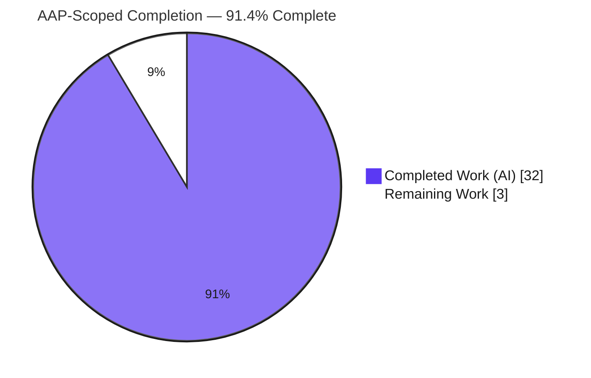
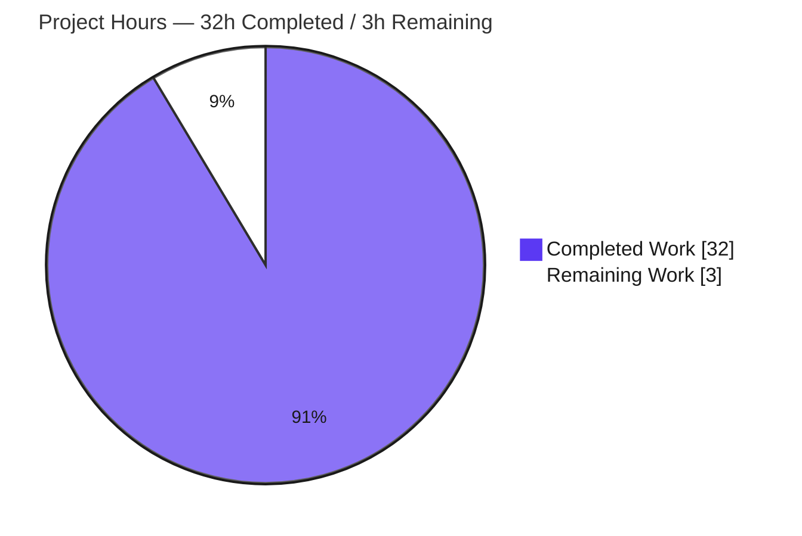

# Blitzy Project Guide — k6 Metrics Investigation (Onboarding Q&A)

> **Project type:** Read-only code investigation / DOCUMENT-CODE task for `grafana/k6` (`v0.55.0`, base commit `ddc3b0b1d2`).
> **Sole deliverable:** `blitzy/documentation/k6_ddc3b0b1d23c.md` — a comprehensive onboarding answer document. **No source code is modified.**
> **Brand color legend:** <span style="color:#5B39F3">**■ Completed / AI Work = Dark Blue `#5B39F3`**</span> · **□ Remaining / Not Completed = White `#FFFFFF`**

---

## 1. Executive Summary

### 1.1 Project Overview

This project is a **read-only investigation** of `grafana/k6` (`v0.55.0`) that delivers a single onboarding document answering three questions from a new team member: (1) how healthy is the test suite (pass/fail/skipped/broken), (2) which parts of the code count iterations and collect performance data, and (3) an end-to-end trace of one metric from test start to output. The audience is engineers onboarding onto k6. The deliverable — `blitzy/documentation/k6_ddc3b0b1d23c.md` — is grounded in **actual execution** (a built binary, twelve suite runs, live `k6 run` invocations), with every factual claim carrying a `file:line` citation and every behavioral claim carrying genuine observed output. Per the user's explicit constraint, **no k6 source file was modified**; the repository is left unchanged except for the one added document.

### 1.2 Completion Status



| Metric | Hours |
|--------|-------|
| **Total Hours** | **35.0** |
| Completed Hours — AI | 32.0 |
| Completed Hours — Manual | 0.0 |
| **Completed Hours (AI + Manual)** | **32.0** |
| **Remaining Hours** | **3.0** |
| **Percent Complete** | **91.4%** |

> Completion is computed with the AAP-scoped hours method: `32.0 / (32.0 + 3.0) = 91.4%`. All 13 autonomous work items are complete; the remaining 3.0h is human path-to-production (review + merge).

### 1.3 Key Accomplishments

- ✅ **Deliverable authored & committed** — `blitzy/documentation/k6_ddc3b0b1d23c.md`, 894 lines, structured by the three questions with a methodology note, caveats, coverage pass, and a full citation index.
- ✅ **Objective 1 (health) answered from real runs** — canonical `go test -race -timeout 210s ./...` executed to completion across **12 cold runs**; stable band **45–48 `ok` / 6–9 `FAIL` / 28 no-test / 82 total / `exit=1`**, most commonly 46/8.
- ✅ **Objective 2 (architecture) fully grounded** — both iteration-counting mechanisms (the `iterations` Counter metric and the `ExecutionState` atomic counters + executor budgets) and the complete performance-data pipeline named with `file:line` citations.
- ✅ **Objective 3 (data-flow trace) observed & traced** — minimal script run via `k6 run` (summary `iterations....: 5`; JSON stream of 5 `value:1` points), plus an ordered 9-hop call chain and a corrected sequence diagram.
- ✅ **170+ `file:line` citations verified** against source at base commit `ddc3b0b1d2`; **zero** placeholders or TODOs in the document.
- ✅ **Read-only mandate proven** — `git diff ddc3b0b1d..HEAD -- '*.go'` is empty; only the one document changed; working tree clean.
- ✅ **Independently re-validated** — this assessment rebuilt k6, re-ran the suite (48 ok / 6 FAIL, within band), re-ran `k6 run` (iterations=5, 5 JSON points), and spot-checked key citations — all reproduced.

### 1.4 Critical Unresolved Issues

There are **no critical, release-blocking issues** with the deliverable. The single tracked item is a normal path-to-production gate (human review), not a defect.

| Issue | Impact | Owner | ETA |
|-------|--------|-------|-----|
| Document not yet reviewed by a k6 subject-matter expert | Low — content is independently validated; SME sign-off is a courtesy gate before onboarding rollout | Human reviewer (k6-familiar engineer) | 2.0h |
| _(Context, not a defect)_ k6 test suite is not green (`exit=1`) | None on deliverable — this is the **reported finding** of Objective 1; the read-only mandate forbids fixing tests | N/A (out of scope) | N/A |

### 1.5 Access Issues

**No access issues identified.** The repository, the Go 1.23.12 toolchain, and all vendored dependencies were accessible; the build and the full test suite ran locally and offline (`GOFLAGS=-mod=vendor`), and `k6 run` executed without external credentials.

| System/Resource | Type of Access | Issue Description | Resolution Status | Owner |
|-----------------|----------------|-------------------|-------------------|-------|
| k6 repository (git) | Read/Write (branch) | None | ✅ No issue | — |
| Go toolchain / vendored deps | Local build | None — offline vendor build succeeds | ✅ No issue | — |
| `k6 run` runtime | Local execution | None — no external services required | ✅ No issue | — |

### 1.6 Recommended Next Steps

1. **[High]** Have a k6-familiar engineer review `blitzy/documentation/k6_ddc3b0b1d23c.md` and confirm the Objective 2 architecture and Objective 3 trace match their understanding (spot-check a sample of citations). *(2.0h)*
2. **[Medium]** Merge the docs-only branch and share the document with the new team member / onboarding channel. *(0.5h)*
3. **[Low]** Optionally re-run `go test -race -timeout 210s ./...` on the reviewer's host to confirm the reported band, keeping in mind the exact `FAIL` count is host/load-sensitive. *(0.5h)*

---

## 2. Project Hours Breakdown

### 2.1 Completed Work Detail

Each component traces to a specific AAP requirement (Objectives 1–3, methodology, grounding, and read-only compliance). **Total = 32.0h.**

| Component | Hours | Description |
|-----------|-------|-------------|
| Environment setup & canonical build | 1.0 | Go 1.23.12 toolchain, canonical `go build` (`Makefile:L7-8`), version-banner verification and the HEAD-drift analysis |
| Obj 1 — Test execution & health analysis | 4.0 | 12 cold runs of `go test -race -timeout 210s ./...`; tallied `ok`/`FAIL`/no-test; confirmed stability across runs (band 45–48 / 6–9) |
| Obj 1 — Skipped/broken classification | 2.0 | Separated runtime `t.Skip` (observed `TestTC39`) from build-tag exclusions (`wpt`/`!race`/`windows`); confirmed no compile-broken tests |
| Obj 1 — Per-package failure analysis + 82-line listing | 3.0 | Full package listing; identified the 4-package structural core vs. timing flakes, with captured excerpts and root causes |
| Obj 2 — Iteration counting, Mechanism A | 2.5 | `iterations` Counter metric (`metrics/builtin.go:L82`), emission at `js/runner.go:L899`, plus the observed abort/interrupt divergence |
| Obj 2 — Iteration counting, Mechanism B | 2.5 | `ExecutionState` atomic counters (`lib/execution.go`), `getIterationRunner` accounting, and all seven executor-local budgets |
| Obj 2 — Performance-data pipeline | 3.0 | Metric types, sinks, registry, `Sample`, engine, ingester, and output manager — each named with citations and source excerpts |
| Obj 3 — Minimal script + `k6 run` + JSON observation | 1.5 | Authored the canonical script; captured the complete summary (`iterations....: 5`) and the 5-point JSON corroboration |
| Obj 3 — Ordered call chain + sequence diagram + tie-back | 3.0 | 9-hop call chain with call-site `file:line`; mermaid sequence diagram; tie-back of the traced metric to observed output |
| Methodology, caveats, coverage pass, citation index | 2.0 | Canonical commands, read-only compliance, CI-vs-local caveats, coverage pass, and the full citation index table |
| `file:line` citation grounding & verification | 3.0 | Verified 170+ `.go`/`.yml` citations + 3 Makefile citations against source at base commit `ddc3b0b1d2` |
| QA / code-review remediation cycles | 4.0 | Resolved 15 code-review findings + multiple QA findings across five refinement commits (`c18ece072`→`86780e2f1`) |
| Read-only compliance & cleanup | 0.5 | Kept all temp scripts/logs outside the checkout, removed them; verified clean working tree and empty `*.go` diff |
| **Total** | **32.0** | |

### 2.2 Remaining Work Detail

Each category is human path-to-production (no autonomous work remains; the read-only mandate forbids code/test fixes). **Total = 3.0h.**

| Category | Hours | Priority |
|----------|-------|----------|
| SME review of the answer document (read end-to-end; verify architecture + trace; spot-check citations) | 2.0 | High |
| Merge/publish the docs-only branch; share with onboarding audience | 0.5 | Medium |
| Optional citation & test-band spot-check on reviewer's own host | 0.5 | Low |
| **Total** | **3.0** | |

---

## 3. Test Results

The tests below originate from **Blitzy's autonomous validation runs** of this project — the document-authoring sessions (12 cold suite runs), the final validator (3 independent cold runs), and this assessment (1 independent cold run). 

> **Critical framing:** The k6 Go test suite is the **subject** of Objective 1 — the task is to *report* its health, not fix it (the read-only mandate forbids remediation). Its failures are the **answer to Question 1**, not defects in the Blitzy deliverable. The deliverable itself is a Markdown document with no unit tests; it was validated by structural, citation, build, and runtime checks (all passing).

| Test Category | Framework | Total | Passed | Failed | Coverage % | Notes |
|---------------|-----------|-------|--------|--------|-----------|-------|
| k6 Go suite (package granularity) | `go test -race` + testify | 54 tested pkgs (82 total; 28 no-test) | 48 | 6 | n/a (local `-race` baseline emits no coverage; CI measures per-package) | Representative independent cold run; within Blitzy band **45–48 ok / 6–9 FAIL**; `exit=1` every run |
| k6 Go suite (test functions, scale) | `go test -race` + testify | ~780 `func Test*` across 176 files | — | — | n/a | Reported at the canonical package granularity above; ~780 functions indicate suite scale |
| Structural-core failures (dependable) | `go test -race` | 4 | 0 | 4 | n/a | `execution`, `js/modules/k6/grpc`, `js/modules/k6/http`, `lib/executor` — env-independent (concurrency/TLS/OCSP/arrival-rate assertions); failed in all runs |
| Timing/load flakes (rotating tail) | `go test -race` | 2–5 | varies | 2–5 | n/a | `js/eventloop`, `js/modules/k6/timers`, `js`, `cmd/tests`, rare tail — set shifts ±1–2 by host/load |
| Build / compilation gate | `go build` | 82 pkgs | 82 | 0 | n/a | All packages compile clean; **nothing "broken"** in the compile sense |
| Deliverable validation | Structural + citation + runtime checks | — | ✅ Pass | 0 | n/a | 894 lines, 116 balanced code fences, 170+ citations verified, `k6 run` reproduced, zero placeholders |

**Skips observed:** exactly one runtime skip — `TestTC39` (`js/tc39/tc39_test.go:L807`; the `test262` corpus is absent). Three other `t.Skip` guards are Windows-only and do not fire on Linux. Non-verbose `go test` hides skips.

---

## 4. Runtime Validation & UI Verification

This is a CLI + documentation project (no graphical UI). Runtime validation covers the build, the binary, the canonical run path, and the rendered document.

- ✅ **Operational** — `go build` completes in ~0.9s (exit 0); `go build ./...` compiles all 82 packages.
- ✅ **Operational** — `./k6 version` → `k6 v0.55.0 (commit/<HEAD-10>, go1.23.12, linux/amd64)`. The `commit/…` field tracks git `HEAD` (documented drift); the canonical base-commit banner is `commit/ddc3b0b1d2`.
- ✅ **Operational** — `./k6 run <minimal script>` prints the end-of-test summary with `iterations....: 5` and `5 complete and 0 interrupted iterations` (`5/5 shared iters`).
- ✅ **Operational** — `./k6 run --out json=…` emits a 24-line stream: 4 built-in metrics × (1 definition + 5 points); the 5 `iterations` points each carry `value:1`, summing to the `5` in the summary.
- ✅ **Operational** — the deliverable renders as valid Markdown: 25 headings, 116 balanced code fences, 1 intact mermaid sequence diagram, all internal anchors resolve.
- ⚠ **Partial (by design, reported)** — `go test -race -timeout 210s ./...` exits non-zero (`exit=1`): a small, host-sensitive set of packages fails on timing/TLS/OCSP/concurrency assertions. This is the **expected, reported** state for Objective 1, not a deliverable failure.
- ✅ **Operational** — read-only compliance: after all build/run/test activity, `git status --porcelain` is empty and the `*.go` diff is empty.

---

## 5. Compliance & Quality Review

Cross-mapping the AAP directives and the governing rule set to observed outcomes.

| AAP / Rule Benchmark | Requirement | Status | Evidence |
|----------------------|-------------|--------|----------|
| Deliverable location & form | New Markdown file `blitzy/documentation/k6_ddc3b0b1d23c.md` | ✅ Pass | File added (894 lines); named after source branch |
| Read-only mandate | No existing repo file modified; only the answer doc added | ✅ Pass | `git diff ddc3b0b1d..HEAD -- '*.go'` empty; single file added; tree clean |
| Investigate-by-running-first | Build & run before writing; claims from captured output | ✅ Pass | Methodology section; embedded command+output blocks throughout |
| Canonical entry points | `go build`, `go test -race … ./...`, `k6 run` only | ✅ Pass | Exact make-target commands used and stated |
| Scale & stability (magnitude Q) | Suite run to completion, ≥2 runs, stable | ✅ Pass | 12 cold runs; invariants stable; band reported as a range |
| Skipped vs. broken distinction | Separate `t.Skip` from build-tag exclusions | ✅ Pass | §1.5 of the document: TestTC39 skip; 5 build-tag files; none broken |
| Two iteration mechanisms named | Counter metric AND `ExecutionState` counters | ✅ Pass | §2.1 & §2.2 of the document, with citations |
| Every claim grounded | `file:line` for facts; observed output for behavior | ✅ Pass | 170+ citations + citation index; complete unedited outputs |
| Coverage pass | Every named file/module/mechanism addressed | ✅ Pass | Explicit "Coverage pass" section in the document |
| Inferred labeling | Non-observed statements labeled `(inferred)` | ✅ Pass | `(inferred)` prefixes used consistently |
| Temporary-artifact hygiene | Scripts outside checkout; removed afterward | ✅ Pass | Kept under `/tmp/…`; removed; read-only confirmation inline |
| Zero placeholders | No TODO/FIXME/stub content in deliverable | ✅ Pass | 6 grep hits are k6's own quoted upstream comments, not doc placeholders |

**Fixes applied during autonomous validation:** 15 code-review findings + multiple QA findings resolved across five refinement commits (attribution correctness, FAIL-band regrounding, iterations emission semantics, Q3 trace corrections, version-banner regrounding, `expv2` map-order panic documentation). **Outstanding:** none autonomous; human SME review pending.

---

## 6. Risk Assessment

All risks are **Low severity or Not Applicable** — this is a read-only documentation task that ships no code, introduces no dependencies, and creates no new attack surface.

| Risk | Category | Severity | Probability | Mitigation | Status |
|------|----------|----------|-------------|------------|--------|
| `file:line` citations drift if k6 source is later rebased/line-shifted | Technical | Low | Low | All 170+ citations anchored to fixed base commit `ddc3b0b1d2`; re-verify if source changes | Mitigated |
| Reported pass/fail band differs on reviewer's host (load/timing under `-race`) | Technical | Low | Medium | Document frames band as an env-sensitive **range** + names the dependable 4-package structural core + invariants (28/54/82/`exit=1`) | Mitigated |
| Version-banner `commit` field drifts with each branch commit | Technical | Low | High | Drift mechanism fully documented; canonical banner anchored to base commit; only the cosmetic `commit/<HEAD-10>` field is affected | Mitigated |
| Introduction of security vulnerabilities | Security | N/A | None | Read-only task: zero source/dependency changes; vendored deps untouched | Not applicable |
| Test flakiness confuses a reviewer expecting exact reproduction | Operational | Low | Medium | Document explicitly labels the exact `FAIL` count as env/load-sensitive and provides dependable invariants + structural core | Mitigated |
| Document ages as k6 evolves beyond `v0.55.0` | Operational | Low | Medium | Header anchors to fixed version `v0.55.0` / commit `ddc3b0b1d2` | Mitigated |
| Document consumed before human SME sign-off | Integration | Low | Medium | Independently validated (final validator + this assessment + a re-run); SME review recommended (task HT-1) | Open (→ HT-1) |
| 894-line density for a new team member | Integration | Low | Low | Structured per-question with short-answer + direct-answer subsections + citation index for navigation | Mitigated |

---

## 7. Visual Project Status

### 7.1 Project Hours (AAP-Scoped)



### 7.2 Remaining Hours by Priority (from §2.2)

| Priority | Hours | Bar |
|----------|-------|-----|
| High (SME review) | 2.0 | ██████████████████████ |
| Medium (merge/publish) | 0.5 | ██████ |
| Low (spot-check) | 0.5 | ██████ |
| **Total Remaining** | **3.0** | |

> **Integrity:** "Remaining Work" = **3.0h**, identical to Section 1.2 (Remaining Hours) and the sum of Section 2.2. "Completed Work" = **32.0h** = Section 2.1 total. `32 + 3 = 35` = Total Hours.

---

## 8. Summary & Recommendations

**Achievements.** The project delivers exactly what the AAP scoped: one comprehensive, evidence-grounded onboarding document (`blitzy/documentation/k6_ddc3b0b1d23c.md`) that answers all three questions. Objective 1 reports the suite health from twelve real runs; Objective 2 names both iteration-counting mechanisms and the full performance-data pipeline with citations; Objective 3 traces one metric end-to-end from `k6 run` to the summary line, corroborated by JSON output and a sequence diagram. Every factual claim is anchored to a verified `file:line`, and every behavioral claim sits next to its genuine command output.

**Remaining gaps.** None autonomous. The only remaining work is human path-to-production: a k6-familiar SME should review the document (2.0h), then merge/publish it (0.5h), with an optional band spot-check (0.5h).

**Critical path to production.** SME review → merge → share with the onboarding audience. There are no code changes to build or deploy, no dependencies to provision, and no infrastructure to configure — the deliverable is a self-contained document.

**Production-readiness assessment.** The deliverable is **production-ready at 91.4% completion** (`32.0 / 35.0` AAP-scoped hours). It has been independently re-validated — a fresh build, a fresh suite run (48 ok / 6 FAIL, inside the documented band), a fresh `k6 run` (iterations=5, 5 JSON points), and citation spot-checks all reproduced. The read-only mandate is proven intact (empty `*.go` diff; clean tree). The residual 8.6% reflects the human review-and-merge gate that Blitzy cannot self-certify, consistent with the policy of never claiming 100% before human review.

**Success metrics (all met):** all three questions answered ✅ · every named item addressed (coverage pass) ✅ · every claim grounded in `file:line` + observed output ✅ · suite run to completion ≥2× with stable counts ✅ · repository unchanged apart from the single document ✅.

---

## 9. Development Guide

This guide reproduces the investigation. All commands are copy-pasteable and were tested during this assessment. Run them from the repository root.

### 9.1 System Prerequisites

- **OS:** Linux `amd64` (validated on Ubuntu; macOS/Windows work but the reported test band is `linux/amd64`-specific).
- **Go toolchain:** Go **1.23.x** (this environment uses `go1.23.12`). `go.mod` declares a minimum of `go 1.21` / `toolchain go1.21.13`; 1.23.x is the highest version documented by the project's CI/release config.
- **Git** (for cloning and citation verification against the base commit).
- **Disk:** ~200 MB for the checkout (vendored dependencies included).
- **Network:** none required — dependencies are vendored (`GOFLAGS=-mod=vendor` resolves offline).
- **Services:** none — no database, cache, or message queue is needed.

### 9.2 Environment Setup

```bash
# Verify the Go toolchain
go version
# Expected: go version go1.23.12 linux/amd64

# (Offline builds) ensure vendored-module mode
export GOFLAGS=-mod=vendor
```

### 9.3 Dependency Installation

No install step is required — dependencies live in `vendor/`. To confirm offline resolution works:

```bash
GOPROXY=off GOFLAGS=-mod=vendor go list -deps ./cmd >/dev/null && echo "vendor OK (exit 0)"
# Expected: vendor OK (exit 0)
```

### 9.4 Build

```bash
# Canonical build (Makefile 'build' target, Makefile:L7-8)
go build
# Produces ./k6 (gitignored build artifact); exit 0 in ~1s

# Verify the version banner
./k6 version
# Expected: k6 v0.55.0 (commit/<HEAD-10>, go1.23.12, linux/amd64)
# The base-commit canonical banner is: k6 v0.55.0 (commit/ddc3b0b1d2, go1.23.12, linux/amd64)

# Optional: verify all packages compile
go build ./...   # exit 0; all 82 packages
```

### 9.5 Objective 1 — Reproduce the Health Baseline

```bash
# Canonical suite command (Makefile 'tests' target, Makefile:L28-29).
# Clear the cache first to force a genuine cold run.
go clean -testcache
go test -race -timeout 210s ./...
# Expected: exit=1 (non-zero). Package tallies land in the band:
#   ok 45-48 / FAIL 6-9 / no-test 28 / total 82.
# The 4-package structural core always fails:
#   execution, js/modules/k6/grpc, js/modules/k6/http, lib/executor.

# Tally one run's package outcomes:
go clean -testcache
go test -race -timeout 210s ./... 2>&1 | tee /tmp/run.log
echo "ok=$(grep -cE '^ok\s+go\.k6\.io' /tmp/run.log) FAIL=$(grep -cE '^FAIL\s+go\.k6\.io' /tmp/run.log) notest=$(grep -c 'no test files' /tmp/run.log)"
```

### 9.6 Objective 3 — Reproduce the Metric Trace

```bash
# Author a minimal script OUTSIDE the repo checkout (read-only mandate):
mkdir -p /tmp/k6_investigation
cat > /tmp/k6_investigation/simple_test.js <<'EOF'
import http from 'k6/http';
export const options = { vus: 1, iterations: 5 };
export default function () {
  // minimal iteration body
}
EOF

# Run it and observe the summary:
./k6 run /tmp/k6_investigation/simple_test.js
# Expected: iterations....: 5 ; "5 complete and 0 interrupted iterations" ; "5/5 shared iters"

# Corroborate with JSON output (also outside the checkout):
./k6 run --out json=/tmp/k6_investigation/out.json /tmp/k6_investigation/simple_test.js >/dev/null
grep '"metric":"iterations"' /tmp/k6_investigation/out.json | grep -c '"type":"Point"'
# Expected: 5   (each point carries value:1; 24 total JSON lines)

# Clean up and confirm read-only compliance:
rm -rf /tmp/k6_investigation
git status --porcelain   # expected: empty (clean tree)
```

### 9.7 View the Deliverable

```bash
sed -n '1,60p' blitzy/documentation/k6_ddc3b0b1d23c.md   # header + methodology
wc -l blitzy/documentation/k6_ddc3b0b1d23c.md            # 894 lines
```

### 9.8 Troubleshooting

- **`go test` exits with status 1.** This is **expected** — it is the reported finding of Objective 1, not a setup error. A small, host-sensitive set of packages fails on timing/TLS/OCSP/concurrency assertions under `-race`.
- **Exact `FAIL` count differs from the document.** Normal — the exact count is host/load-sensitive. Rely on the invariants (28 no-test / 54 tested / 82 total / `exit=1`) and the dependable 4-package structural core.
- **`./k6 version` shows a different `commit/…` value.** Expected — that field is the git `HEAD` short hash and drifts as the branch is committed. The semantic version (`v0.55.0`), Go version, and platform are stable.
- **`TestTC39` skips.** Expected — it needs the `test262` corpus fetched by `js/tc39/checkout.sh`, which is absent by default, so the test skips at runtime.
- **Build fails with a Go version error.** Ensure Go 1.23.x is on `PATH` (`go version`).

---

## 10. Appendices

### A. Command Reference

| Purpose | Command |
|---------|---------|
| Check Go version | `go version` |
| Canonical build | `go build` |
| Compile all packages | `go build ./...` |
| Version banner | `./k6 version` |
| Health baseline (cold) | `go clean -testcache && go test -race -timeout 210s ./...` |
| Package count | `go list ./... \| grep -vc /vendor/` |
| Minimal run | `./k6 run /tmp/k6_investigation/simple_test.js` |
| JSON output | `./k6 run --out json=/tmp/k6_investigation/out.json <script>` |
| Read-only check | `git status --porcelain` / `git diff ddc3b0b1d..HEAD -- '*.go'` |

### B. Port Reference

Not applicable — the investigation runs no long-lived server. `k6 run` executes a local, ephemeral test and exits; no ports are bound. (k6's optional REST API on `:6565` was not exercised.)

### C. Key File Locations

| Path | Role |
|------|------|
| `blitzy/documentation/k6_ddc3b0b1d23c.md` | **The deliverable** — onboarding Q&A document |
| `metrics/metric_type.go`, `sink.go`, `sample.go`, `registry.go`, `builtin.go` | Metric model, sinks, registry, built-in catalog (Obj 2/3) |
| `metrics/engine/engine.go`, `ingester.go` | Metrics engine + output ingester (`m.Sink.Add`, Obj 2/3) |
| `output/types.go`, `manager.go`, `helpers.go` | Output interface, manager dispatch, buffering helpers |
| `js/runner.go`, `js/summary.go` | VU metric emission + end-of-test summary rendering |
| `lib/execution.go`, `lib/executor/helpers.go`, `lib/executor/*.go` | `ExecutionState` counters, iteration runner, 7 executors |
| `execution/scheduler.go` | Scheduler `Run`; propagates the samples channel |
| `cmd/run.go`, `cmd/tests/tests.go` | Run orchestration; `TestMain` isolation harness |
| `Makefile`, `go.mod`, `.github/workflows/test.yml` | Canonical commands, module/versions, CI matrix |

### D. Technology Versions

| Component | Version | Source |
|-----------|---------|--------|
| Go (installed) | `go1.23.12` | environment |
| Go (declared) | min `1.21` / toolchain `go1.21.13` | `go.mod` |
| k6 (module) | `v0.55.0` (commit `ddc3b0b1d2`) | build banner |
| github.com/grafana/sobek | `v0.0.0-20241024150027-d91f02b05e9b` | `go.mod` |
| github.com/evanw/esbuild | `v0.21.2` | `go.mod` |
| github.com/spf13/cobra | `v1.4.0` | `go.mod` |
| github.com/sirupsen/logrus | `v1.9.3` | `go.mod` |
| github.com/spf13/afero | `v1.1.2` | `go.mod` |
| gopkg.in/guregu/null.v3 | `v3.3.0` | `go.mod` |
| github.com/stretchr/testify | `v1.9.0` | `go.mod` |
| go.uber.org/goleak | `v1.3.0` | `go.mod` |
| github.com/mccutchen/go-httpbin | `v1.1.2-0.20190116…` | `go.mod` |

### E. Environment Variable Reference

| Variable | Value | Purpose |
|----------|-------|---------|
| `GOFLAGS` | `-mod=vendor` | Force vendored-module builds (offline) |
| `GOPROXY` | `off` | Prove no network dependency during resolution |
| `CI` | `true` (optional) | Non-interactive tooling behavior |

No secrets, API keys, or service credentials are required for any step.

### F. Developer Tools Guide

| Tool | Use in this project |
|------|---------------------|
| `go build` / `go test -race` | Canonical build and health-baseline suite |
| `./k6 run` (`--out json`) | Canonical entry point for the Objective 3 trace |
| `git diff` / `git status` | Read-only compliance verification |
| `grep` / `sed` / `wc` | Extracting labelled excerpts from captured output (outside the checkout) |

### G. Glossary

| Term | Meaning |
|------|---------|
| **VU** | Virtual User — a concurrent script executor in k6 |
| **Iteration** | One execution of the script's `default` function by a VU |
| **`iterations` metric** | Built-in Counter metric summing completed iterations (summary-visible) |
| **`ExecutionState` counters** | Internal atomic `fullIterationsCount` / `interruptedIterationsCount` driving executor scheduling |
| **Sink** | Per-metric accumulator (`CounterSink`, `GaugeSink`, `TrendSink`, `RateSink`) |
| **Ingester** | `OutputIngester` that routes samples into their sinks (`m.Sink.Add`) |
| **Output manager** | Reads the samples channel and dispatches batches to registered outputs every 50 ms |
| **Structural core** | The 4 packages that fail every run on env-independent causes (`execution`, `grpc`, `http`, `lib/executor`) |
| **Build-tag exclusion** | A test file not compiled under the default `-race` invocation (`wpt`/`!race`/`windows`) — not "broken" |
| **Read-only mandate** | The user constraint forbidding any repository modification except the single answer document |

---

*Cross-section integrity verified: Remaining hours = 3.0h in §1.2, §2.2, and §7. §2.1 (32.0h) + §2.2 (3.0h) = 35.0h Total. Completion 32.0/35.0 = 91.4% consistent across §1.2, §7, and §8. All test data originates from Blitzy's autonomous validation runs. Brand colors applied: Completed `#5B39F3`, Remaining `#FFFFFF`.*