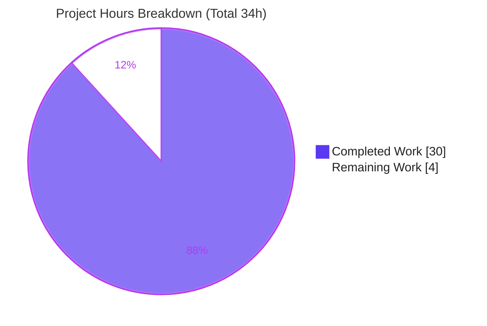

# Blitzy Project Guide — k6 Runtime-Behavior Investigation

> **Deliverable under review:** `blitzy/documentation/k6_ddc3b0b1d23c.md` — a single, evidence-grounded answer document explaining how `grafana/k6` behaves when a user writes and runs a load-testing script.
> **Task type:** Documentation (investigative Q&A) · **Scope:** Read-only / isolated (one new file, zero existing files modified).

---

## 1. Executive Summary

### 1.1 Project Overview

This project delivers one authoritative, evidence-grounded document answering how the `grafana/k6` load-testing tool behaves when a user writes and runs a script. Aimed at engineers new to k6, it explains the write-and-run workflow, the four terminal output surfaces, the built-in metrics/units/protocols, the `k6 run` command, `K6_*` configuration, external-file generation, and script-validation logic. Its distinguishing value is method: every claim was produced by **actually building and running k6** and capturing complete, unedited output, cross-referenced to 100+ exact `file:line` source citations. The scope is strictly read-only — exactly one new markdown file is added and no source, tests, or configuration are touched.

### 1.2 Completion Status

Completion is calculated using the AAP-scoped, hours-based methodology: `Completed Hours / (Completed + Remaining) × 100`. All autonomous, AAP-scoped work (all 8 question items + methodology compliance + read-only compliance + deliverable creation) is complete and independently validated. The remaining 4 hours are inherently-human path-to-production gates that Blitzy agents cannot perform.


| Metric | Value |
|--------|-------|
| **Total Hours** | **34** |
| **Completed Hours (AI + Manual)** | **30** (30 AI autonomous + 0 Manual) |
| **Remaining Hours** | **4** |
| **Completion** | **88.2%** |

> Formula: `30 ÷ 34 = 88.2%`. Completed is 100% autonomous (Blitzy agents); no manual hours have been invested yet.

### 1.3 Key Accomplishments

- [x] **All 8 question items answered** with a direct answer + exact command + complete unedited output + `file:line` citations (document sections §1–§8, coverage matrix §9).
- [x] **Run-first methodology honored** — k6 was built from source (`k6 v0.55.0`, Go 1.23.12, vendored/offline) and driven through its real `k6 run` entry point for every claim.
- [x] **Edge cases exercised**, not just the happy path — invalid scripts (empty, non-function export, syntax error), `K6_*` env-var configuration, `--quiet`, `--summary-time-unit`, and opt-in external files.
- [x] **100+ exact `file:line` citations** with rigorous **[OBSERVED]** vs **[INFERRED]** labeling (81 OBSERVED / 6 inferred).
- [x] **Cross-validated against official Grafana docs**, including an honest, observed note on the post-0.55 `--summary-mode` divergence.
- [x] **Read-only constraint fully honored** — `git diff <base>..HEAD` = exactly one added file; zero existing files modified; all temp artifacts created outside the checkout and deleted.
- [x] **Independently re-validated** across 11 phases (rebuild + 21 runtime scenarios + 111 citation checks) with **zero discrepancies**.

### 1.4 Critical Unresolved Issues

| Issue | Impact | Owner | ETA |
|-------|--------|-------|-----|
| _None._ No compilation errors, no in-scope test failures, no missing functionality, no placeholders. | None — deliverable is complete and validated. | — | — |

> There are **no blocking issues**. The only outstanding work is human acceptance (see §1.6 / §2.2).

### 1.5 Access Issues

| System/Resource | Type of Access | Issue Description | Resolution Status | Owner |
|-----------------|----------------|-------------------|-------------------|-------|
| Repository (`grafana/k6`, branch `blitzy-3ad9cd15-…`) | Read/Write (git) | None — full access; working tree clean | Resolved | — |
| Go toolchain + vendored modules | Build | None — offline vendored build succeeds (`go build` exit 0) | Resolved | — |
| Public endpoint `test-api.k6.io` | Network (egress) | Required only to reproduce the HTTP example; reachable during validation | Resolved | — |

> **No access issues identified.** All build, run, and validation steps completed with available access.

### 1.6 Recommended Next Steps

1. **[High]** Have a k6/load-testing SME read `blitzy/documentation/k6_ddc3b0b1d23c.md` and confirm all 8 question items correctly and completely answer the user's original intent.
2. **[Medium]** Optionally rebuild k6 and re-run the primary example + one or two edge cases to spot-check reproducibility against the documented output structure.
3. **[Medium]** Review the single-file diff (verify read-only compliance) and approve/merge the PR.
4. **[Low]** When k6 is later upgraded past v0.55.0, re-verify the summary layout against the newer `--summary-mode` grouped-summary redesign noted in §5 of the document.

---

## 2. Project Hours Breakdown

### 2.1 Completed Work Detail

Each component traces to a specific AAP requirement (question item Q1–Q8, an AAP methodology rule, or validation). Hours reflect the autonomous engineering effort delivered.

| Component | Hours | Description |
|-----------|------:|-------------|
| §0 Canonical build & version-stamp reproducibility investigation | 2.0 | Offline vendored `go build` → `k6 v0.55.0`; VCS commit-stamp reproducibility analysis (live `HEAD` vs canonical source commit; clone-vs-worktree caveat). [AAP canonical-build rule] |
| Q1 (§1) Authoring + execution workflow | 1.5 | ES-module `import`/`export default` pattern; `k6 new` scaffolder; `k6 run` entry point. [AAP Q1] |
| Q2 (§2) Four output surfaces + `--quiet` comparison | 2.0 | Banner, execution description, live progress, end-of-test summary; observed default-vs-`--quiet` two-run comparison. [AAP Q2] |
| Q3 (§3) Single HTTP request run + redirect analysis | 1.0 | Full `k6 run examples/http_get.js` (exit 0); `http_reqs=2` redirect explained. [AAP Q3] |
| Q4a (§4a) Metrics catalog, types, value-types | 2.5 | Built-in metric names/types/value-types cross-referenced to `metrics/builtin.go`; 13 `Metric` definitions extracted from JSON stream. [AAP Q4] |
| Q4b (§4b) Units auto-scaling + forced unit | 1.5 | Observed ns/µs/ms/s auto-scaling; `--summary-time-unit=ms` override run. [AAP Q4] |
| Q4c (§4c) Protocols + per-request `proto`-tag analysis | 2.0 | Protocol-module registry; per-request `proto` tag (`HTTP/2.0`) on 18 of 22 JSON Points; tagging traced to `transport.go`. [AAP Q4] |
| Q5 (§5) Execution command + full `--help` capture | 1.5 | `k6 run <script>` declaration + complete flag list; `--summary-mode` version-divergence caveat. [AAP Q5] |
| Q6 (§6) Config + `K6_*` env vars + causal PTY colour proof | 2.5 | Zero-config run; 5-source precedence; `K6_VUS/ITERATIONS/DURATION/STAGES`; PTY `K6_NO_COLOR` SGR proof (46→0). [AAP Q6] |
| Q7 (§7) External file generation | 2.5 | Default writes nothing; `--out json=`; `--summary-export=`; observed `handleSummary()` custom file. [AAP Q7] |
| Q8 (§8) Script validation edge cases | 1.5 | Empty / non-function / syntax-error scripts → exit 255/255/107; error text + exit-code citations. [AAP Q8] |
| `file:line` citation grounding + OBSERVED/inferred labeling | 1.5 | 100+ citations placed and labeled; observed-vs-inferred discipline. [AAP grounding rule] |
| Web validation vs `grafana.com/docs/k6` | 1.5 | Metric names, units, flags, precedence confirmed canonical; version divergence flagged. [AAP web-search rule] |
| Independent 11-phase re-validation | 4.0 | Rebuild + re-run 21 scenarios + re-verify 111 citations + web cross-check; zero discrepancies. [Validation] |
| Review/QA remediation cycles (3 iterations) | 2.5 | Remediation of review + QA final-acceptance findings across commits (initial → +192 → +145 → polish). [Validation] |
| **Total Completed** | **30.0** | Matches Completed Hours in §1.2 |

### 2.2 Remaining Work Detail

All remaining work is path-to-production for a documentation deliverable — inherently human and not autonomously performable. There are no High-priority *technical* fixes because none are required.

| Category | Hours | Priority |
|----------|------:|----------|
| SME technical review & acceptance of the answer document (verify all 8 items answer the user's intent; content-only, no code review) | 2.5 | High |
| Reproducibility spot-check (rebuild k6; re-run primary example + 1–2 edge cases to confirm output structure) | 1.0 | Medium |
| PR review & merge approval (confirm single-file diff / read-only compliance; approve & merge) | 0.5 | Medium |
| **Total Remaining** | **4.0** | Matches Remaining Hours in §1.2 and §7 |

> **Reconciliation:** §2.1 (30.0) + §2.2 (4.0) = **34.0** Total Hours (matches §1.2).

---

## 3. Test Results

This is a **documentation deliverable**, which has no unit tests. Per the run-first methodology, its validation is **empirical re-execution** captured by Blitzy's autonomous validation logs. All results below originate from that autonomous validation (build checks, runtime command scenarios, citation verification, documentation-coverage checks, and web cross-checks).

| Test Category | Framework / Method | Total | Passed | Failed | Coverage % | Notes |
|---------------|--------------------|------:|-------:|-------:|-----------:|-------|
| Build / Compilation | `go build` (vendored, offline) | 2 | 2 | 0 | 100% | `go build .` and `go build ./...` both exit 0 |
| Runtime Command Scenarios | k6 CLI (empirical) | 21 | 21 | 0 | 100% | Primary run exit 0; edge cases exit 255/255/107; all reproduced exactly |
| Citation Verification | `file:line` vs source (grep/inspect) | 111 | 111 | 0 | 100% | Every cited reference confirmed exact |
| Documentation Coverage | 8 question items (Q1–Q8) | 8 | 8 | 0 | 100% | Each answered with command + unedited output + citations |
| Web Doc Cross-check | `grafana.com/docs/k6` | 5 | 5 | 0 | 100% | Metric names, units, flags, precedence, env-var convention confirmed canonical |
| **Total (in-scope)** | — | **147** | **147** | **0** | **100%** | Zero discrepancies on independent re-validation |

> **Out-of-scope disclosure (full transparency):** Running the whole-codebase Go suite (`go test ./...`) yields environmental failures (TLS certificate trust "Acme Co", DNS `no such host`, scheduler-timing flakiness). These are **not** the deliverable's tests: the Go tree at `HEAD` is byte-identical to the base commit (0 Go files changed), so the failures are **100% pre-existing and environmental**, cannot be caused or fixed by this documentation change, and are out of scope per the AAP ("No test changes are in scope for this documentation task").

---

## 4. Runtime Validation & UI Verification

Validated by executing the built binary and capturing terminal output (k6 is a CLI; there is no web UI).

- ✅ **Build** — `go build -o /tmp/k6bin/k6 .` → exit 0 (~3.2s, ~65 MB binary). Version: `k6 v0.55.0 (commit/<HEAD>, go1.23.12, linux/amd64)`.
- ✅ **Primary run** — `k6 run examples/http_get.js` → exit 0; emits banner + execution description + full metrics summary (`http_reqs=2`, `iterations=1`) + progress line.
- ✅ **Terminal output surfaces** — all four surfaces render in default mode; `--quiet` suppresses exactly three (banner, execution description, progress), keeping the summary.
- ✅ **Metrics / units / protocols** — auto-scaled units (ns/µs/ms/s, kB) observed; per-request `proto:"HTTP/2.0"` tag on 18 of 22 JSON Points.
- ✅ **Configuration** — zero-config run succeeds; `K6_VUS`/`K6_ITERATIONS`/`K6_DURATION`/`K6_STAGES` alter the scenario line as expected; `K6_NO_COLOR` causally strips colour (46→0 SGR sequences under PTY).
- ✅ **External files** — default run writes nothing; `--out json=` + `--summary-export=` produce `out.json` (13 Metric + 22 Point records) and `summary.json`; `handleSummary()` writes an arbitrary custom file.
- ✅ **Validation logic** — empty script → exit 255 (`no exported functions in script`); non-function default export → exit 255; syntax error → exit 107 (script exception).
- ⚠ **Version freshness** — output reflects **v0.55.0**; the current public docs describe a newer `--summary-mode` grouped summary absent from this build (documented, not a defect).
- ❌ **Failing items** — none within scope.

---

## 5. Compliance & Quality Review

Cross-mapping AAP deliverables and rules to their status. Fixes were applied during autonomous review/QA remediation (3 iterations); no outstanding compliance gaps remain in scope.

| AAP Requirement / Rule | Benchmark | Status | Progress |
|------------------------|-----------|:------:|:--------:|
| Q1 Authoring + execution workflow | Answered w/ evidence + citations | ✅ Pass | 100% |
| Q2 What k6 reports (4 surfaces) | Answered w/ evidence + citations | ✅ Pass | 100% |
| Q3 Single HTTP request | Observed full run, exit 0 | ✅ Pass | 100% |
| Q4 Metrics / units / protocols | Catalog + auto-scaling + proto tag | ✅ Pass | 100% |
| Q5 Execution command | Full `--help` captured | ✅ Pass | 100% |
| Q6 Config / `K6_*` env vars | Zero-config + env runs + colour proof | ✅ Pass | 100% |
| Q7 External file generation | Default-none + opt-in files + `handleSummary()` | ✅ Pass | 100% |
| Q8 Script validation logic | Exit codes 255/255/107 observed | ✅ Pass | 100% |
| Run-first methodology | Build+run before writing | ✅ Pass | 100% |
| Complete unedited output | No truncation/paraphrase | ✅ Pass | 100% |
| `file:line` grounding + OBSERVED/inferred | 100+ citations; labels applied | ✅ Pass | 100% |
| Canonical default build | v0.55.0, vendored, Go 1.23.12 | ✅ Pass | 100% |
| Edge-case coverage | Invalid scripts / env / opt-in files | ✅ Pass | 100% |
| Web validation vs Grafana docs | Names/units/flags confirmed | ✅ Pass | 100% |
| Read-only + cleanup | 0 files modified; temp artifacts removed | ✅ Pass | 100% |
| Deliverable location/naming | `blitzy/documentation/<branch>.md` | ✅ Pass | 100% |
| Zero placeholders (TODO/FIXME/stub) | None present | ✅ Pass | 100% |
| `.editorconfig` (markdown) compliance | LF, final newline, UTF-8 | ✅ Pass | 100% |
| SME acceptance sign-off | Human review | ⬜ Pending | 0% |

---

## 6. Risk Assessment

Overall posture is **LOW** — a read-only, doc-only change introduces effectively zero production risk. No High/Critical/blocking risks.

| Risk | Category | Severity | Probability | Mitigation | Status |
|------|----------|----------|-------------|------------|--------|
| R1. Runtime metric numeric values vary run-to-run (timings, rates) | Technical | Low | High | Document states metric names/units/structure are stable; only numeric timings vary; multiple runs captured | Mitigated (documented) |
| R2. Version drift — doc anchored to v0.55.0; newer k6 has a `--summary-mode` grouped summary | Technical | Low-Medium | Medium | §5 flags the divergence as an OBSERVED version difference; advise re-verify against target version | Open (human awareness) |
| R3. External endpoint dependency (`test-api.k6.io` 302-redirect → `http_reqs=2`) | Integration | Low | Low | §3 explains redirect; network required to reproduce HTTP runs | Mitigated (documented) |
| R4. Commit-stamp differs when building the delivered checkout vs canonical source commit | Technical | Low | High | §0 explains Go VCS stamping + exact clone+checkout recipe to reproduce canonical stamp | Mitigated (documented) |
| R5. CSV/InfluxDB `--out` backends not exercised (only JSON) | Integration | Low | Low | Labeled [INFERRED]; HTTP-only depth per user focus; JSON backend fully observed | Accepted (scoped) |
| R6. Whole-codebase `go test ./...` environmental failures (TLS/DNS/timing) | Operational | Low | N/A | Pre-existing (0 Go changes); not the deliverable's tests; unfixable in read-only scope; disclosed in full | Accepted (out of scope) |
| R7. Security exposure | Security | None | N/A | No source/dependency/credential changes; single read-only markdown file; no secrets | N/A (none identified) |

---

## 7. Visual Project Status



**Remaining hours by category (from §2.2):**

| Category | Hours | Priority |
|----------|------:|----------|
| SME technical review & acceptance | 2.5 | High |
| Reproducibility spot-check | 1.0 | Medium |
| PR review & merge approval | 0.5 | Medium |
| **Total** | **4.0** | — |

> **Integrity:** "Remaining Work" = **4h** here equals Remaining Hours in §1.2 and the sum of §2.2. "Completed Work" = **30h** equals Completed Hours in §1.2. Colors: Completed = Dark Blue `#5B39F3`; Remaining = White `#FFFFFF`.

---

## 8. Summary & Recommendations

**Achievements.** The project delivers a complete, rigorously evidence-grounded answer to all eight question items about k6 runtime behavior. The 1,049-line document is built entirely on observed behavior from a canonical build of the checkout (`k6 v0.55.0`), grounded in 100+ exact `file:line` citations, with disciplined OBSERVED/INFERRED labeling and honest version-divergence disclosure. It went through three review/QA remediation cycles and an independent 11-phase re-validation that found **zero discrepancies**.

**Remaining gaps.** None technical. The outstanding **4 hours** are inherently-human path-to-production gates: SME content acceptance, an optional reproducibility spot-check, and PR merge approval.

**Critical path to production.** SME review (2.5h) → optional reproducibility spot-check (1.0h) → PR merge (0.5h). No code, configuration, or dependency work is required.

**Success metrics.** All 8 question items answered (100%); read-only constraint honored (exactly one file added, zero existing files modified); build exit 0; 21/21 runtime scenarios and 111/111 citations validated; zero placeholders.

**Production readiness.** The deliverable is **88.2% complete** on an AAP-scoped hours basis and is functionally production-ready as a documentation artifact; the residual 11.8% is human acceptance that cannot be automated. **Recommendation: proceed to SME review and merge.** Risk posture is LOW with no blocking issues.

---

## 9. Development Guide

k6 is a Go CLI with an embedded JavaScript runtime. The commands below were **executed and verified** during validation. To honor the read-only constraint, the binary and any run artifacts are written **outside** the repository (under `/tmp`).

### 9.1 System Prerequisites

- **Go** 1.23.x (verified `go1.23.12`) — matches the repo `Dockerfile` (`golang:1.23-alpine3.20`); `go.mod` floor is `go 1.21`.
- **Git** (verified `2.51.0`) — required for the VCS commit-stamp in the version string.
- **GNU Make** (verified `4.4.1`) — optional; the repo `Makefile` `build:` target wraps `go build`.
- **OS/arch:** Linux/amd64 (validated). **Network:** egress to `test-api.k6.io` only to reproduce the HTTP example.
- Vendored dependencies are present, so the build is **fully offline**.

### 9.2 Environment Setup

```bash
# Verify toolchain
go version      # expect go1.23.x
git --version

# Environment for a canonical, offline, vendored build
export GOTOOLCHAIN=local     # do not auto-download a different toolchain
export GOFLAGS=-mod=vendor   # build from the vendored module tree (offline)
export GOPROXY=off           # no network module fetches
export CGO_ENABLED=0         # static, portable binary
```

### 9.3 Dependency Installation / Build

```bash
# From the repository root; binary written OUTSIDE the repo to stay read-only
go build -o /tmp/k6bin/k6 .
# Expected: exit 0, ~3s, ~65 MB binary

# Verify
/tmp/k6bin/k6 version
# Expected: k6 v0.55.0 (commit/<10-char HEAD>, go1.23.12, linux/amd64)
```

> **Note (expected):** the `commit/…` fragment reflects the **live git HEAD** of the built checkout, so building the delivered branch stamps the documentation commit rather than the canonical `ddc3b0b1d2`. To reproduce the canonical stamp, `git clone` the repo, `git checkout ddc3b0b1d`, then build (a linked `git worktree` will not stamp because its `.git` is a pointer file).

### 9.4 Application Startup & Example Usage

```bash
# Primary run — the in-repo single-HTTP-request example
/tmp/k6bin/k6 run examples/http_get.js
# Expected: exit 0; banner + execution description + metrics summary (http_reqs=2, iterations=1) + progress

# Inspect the run command and all flags
/tmp/k6bin/k6 run --help

# Configure via environment variables (no config file needed)
K6_ITERATIONS=5 K6_VUS=2 /tmp/k6bin/k6 run examples/http_get.js

# Force a single time unit in the summary
/tmp/k6bin/k6 run --summary-time-unit=ms examples/http_get.js
```

### 9.5 Verification Steps

```bash
# 1) Default run writes NO files (run from an empty scratch dir OUTSIDE the repo)
mkdir -p /tmp/k6run && cd /tmp/k6run
ls -A                                   # empty
/tmp/k6bin/k6 run /tmp/k6run_script.js  # (copy examples/http_get.js here first)
ls -A                                   # still empty

# 2) Opt-in external files
/tmp/k6bin/k6 run --out json=/tmp/k6run/out.json \
  --summary-export=/tmp/k6run/summary.json /tmp/k6run_script.js
grep -c '"type":"Metric"' /tmp/k6run/out.json   # expect 13
grep -c '"type":"Point"'  /tmp/k6run/out.json   # expect 22

# 3) Validation exit codes
: > /tmp/empty.js
/tmp/k6bin/k6 run /tmp/empty.js; echo "exit=$?"          # exit=255 (no exported functions)
printf "export default function(){\n" > /tmp/bad.js
/tmp/k6bin/k6 run /tmp/bad.js; echo "exit=$?"            # exit=107 (script exception)
```

### 9.6 Troubleshooting

- **`no exported functions in script` (exit 255):** the script has no callable default export — add `export default function () { /* ... */ }`.
- **`script exception` (exit 107):** a JavaScript parse/throw error (e.g., a missing brace → `Unexpected end of input`) — fix the syntax.
- **HTTP example errors offline:** the example targets `test-api.k6.io`; on a network-isolated host, use a local target or a no-op script (`export default function () {}`).
- **Version `commit/` differs from `ddc3b0b1d2`:** expected — Go stamps the live HEAD; use clone + `git checkout ddc3b0b1d` to reproduce the canonical stamp.
- **Build tries to download a toolchain:** ensure `GOTOOLCHAIN=local` and `GOFLAGS=-mod=vendor` are exported (offline vendored build).
- **Keep the repo read-only:** run k6 from a scratch dir outside the checkout and send `--out`/`--summary-export`/`k6 new` outputs to `/tmp`.

---

## 10. Appendices

### A. Command Reference

| Command | Purpose |
|---------|---------|
| `go build -o /tmp/k6bin/k6 .` | Build k6 (offline, vendored) outside the repo |
| `/tmp/k6bin/k6 version` | Print version + VCS/Go/OS stamp |
| `/tmp/k6bin/k6 run <script>` | Execute a test script |
| `/tmp/k6bin/k6 run --help` | Show run flags |
| `/tmp/k6bin/k6 new` | Scaffold a starter `script.js` (writes to CWD — run in `/tmp`) |
| `--out json=<file>` | Stream metrics to a JSON file (opt-in) |
| `--summary-export=<file>` | Write end-of-test summary as JSON (opt-in) |
| `--summary-time-unit=ms` | Force a single time unit in the summary |
| `-u/--vus`, `-i/--iterations`, `-d/--duration`, `-s/--stage` | Execution profile controls |

### B. Port Reference

| Port | Purpose |
|------|---------|
| `6565` (`localhost`) | k6's local REST API server for controlling a running test (default `-a/--address`). Not required by the user's script. |

### C. Key File Locations

| Path | Role |
|------|------|
| `blitzy/documentation/k6_ddc3b0b1d23c.md` | **The deliverable** (1,049 lines) |
| `examples/http_get.js` | Canonical single-HTTP-request example (observation vehicle) |
| `main.go` | Entry point → `cmd.Execute()` |
| `cmd/run.go` | `run` command, flags, summary invocation |
| `cmd/new.go` | `k6 new` scaffolder |
| `cmd/ui.go` | Banner, execution description, progress rendering |
| `cmd/state/state.go` | `K6_*` env-var + TTY resolution |
| `cmd/config.go` | 5-source config precedence |
| `metrics/builtin.go` | Built-in metric catalog, types |
| `metrics/value_type.go` | Value types (Default/Time/Data) |
| `js/summary.js` | End-of-test summary formatting/units |
| `js/bundle.go` | Script validation ("no exported functions in script") |
| `js/jsmodules.go` | Protocol module registration |
| `lib/netext/httpext/transport.go` | Per-request `proto` tag |
| `lib/consts/consts.go` | Version string + ASCII banner |
| `errext/exitcodes/codes.go` | Exit codes (`ScriptException = 107`) |
| `output/json/json.go`, `cmd/outputs.go` | JSON/CSV/InfluxDB `--out` backends |

### D. Technology Versions

| Component | Version |
|-----------|---------|
| k6 (built) | v0.55.0 |
| Go toolchain | 1.23.12 |
| `go.mod` floor | go 1.21 (toolchain go1.21.13) |
| Git | 2.51.0 |
| GNU Make | 4.4.1 |
| OS / Arch | Linux / amd64 |

### E. Environment Variable Reference

| Variable | Effect | Source |
|----------|--------|--------|
| `K6_VUS` | Number of virtual users | Option var |
| `K6_ITERATIONS` | Total iterations | Option var |
| `K6_DURATION` | Test duration (constant-VUs executor) | Option var |
| `K6_STAGES` | Ramping-VUs stages | Option var |
| `K6_NO_COLOR` | Disable coloured output | `cmd/state/state.go` |
| `K6_CONFIG` | Config file path | `cmd/state/state.go` |
| `K6_LOG_OUTPUT` / `K6_LOG_FORMAT` | Log destination/format | `cmd/state/state.go` |
| `K6_PROFILING_ENABLED` | Enable pprof endpoints | `cmd/state/state.go` |
| `GOTOOLCHAIN=local`, `GOFLAGS=-mod=vendor`, `GOPROXY=off`, `CGO_ENABLED=0` | Offline canonical build | Build env |

### F. Developer Tools Guide

| Tool | Use |
|------|-----|
| `go build` | Compile k6 from source (offline via vendor) |
| `git diff <base>..HEAD --name-status` | Confirm read-only compliance (one added file) |
| `grep -c '"type":"Metric"' out.json` | Count metric definitions in JSON stream |
| `grep '"type":"Point"' out.json \| grep -c '"proto"'` | Count protocol-tagged samples |
| Terminal / PTY capture | Observe banner, progress, colour SGR behavior |

### G. Glossary

| Term | Meaning |
|------|---------|
| **VU** | Virtual User — a concurrent worker that repeats the default function |
| **Iteration** | One execution of the exported `default` function |
| **Trend** | Metric type computing avg/min/med/max/percentiles |
| **Counter / Gauge / Rate** | Summed / latest+min+max / non-zero-fraction metric types |
| **Value type** | Rendering hint: Default (as-is), Time (durations), Data (bytes) |
| **`handleSummary()`** | Optional exported function returning a path→content map to write arbitrary files |
| **Output surface** | One of the four terminal blocks: banner, execution description, progress, summary |
| **SGR** | ANSI "Select Graphic Rendition" escape sequence (used for terminal colour) |
| **AAP** | Agent Action Plan — the authoritative requirements for this task |

---

*Completion measured on an AAP-scoped, hours-based basis: 30 completed / 34 total = **88.2%**. Cross-section integrity verified — §1.2 = §2.2 = §7 remaining (4h); §2.1 (30) + §2.2 (4) = §1.2 total (34).*