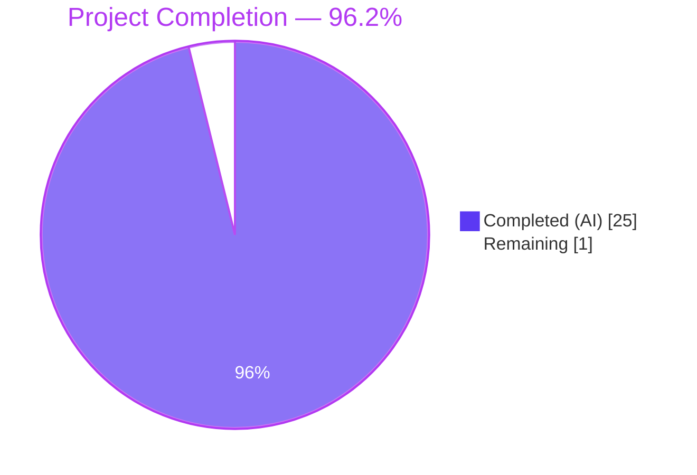
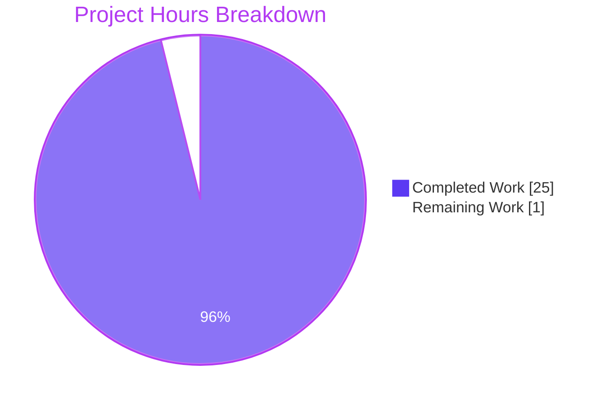
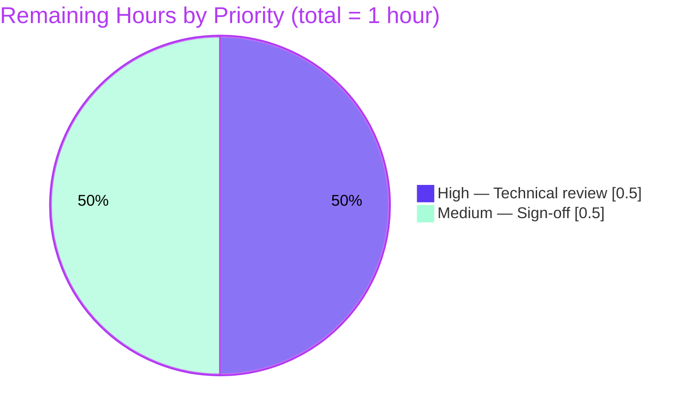

# Blitzy Project Guide — k6 Module Resolution Investigation

**Branch**: `blitzy-477d6831-1fc7-42e9-a0ff-02e1b00f486f`
**Base commit**: `ddc3b0b1d` (k6 v0.55.0 — "Update comment")
**Deliverable**: `blitzy/documentation/k6_ddc3b0b1d23c.md` (1,373 lines / 65,732 bytes, 3 commits)
**Repository change footprint**: `+1,373 / −0` across exactly **one** new file

---

## Section 1 — Executive Summary

### 1.1 Project Overview

This project is a **read-only investigation and documentation task** against the k6 load-testing tool's JavaScript runtime (repository `go.k6.io/k6` at v0.55.0). The objective is to produce a single authoritative markdown document that answers six tightly-coupled questions about k6's module resolution behavior — specifically how the runtime "freezes" module resolution after the init stage, what counts as an "already resolved" module available to VUs, how relative import specifiers resolve under multi-origin call stacks, and the observable error signatures users encounter when crossing the init/VU boundary. The audience is k6 contributors and advanced test authors who need a code-grounded, experimentally-verified reference for this behavior. Business impact: reduces support cost around a frequently-misunderstood k6 semantic and documents the architectural rationale for future contributors.

### 1.2 Completion Status



| Metric | Value |
|--------|-------|
| **Total Hours** | 26 |
| **Completed Hours (AI)** | 25 |
| **Completed Hours (Manual)** | 0 |
| **Remaining Hours** | 1 |
| **Completion %** | **96.2%** (25 / 26) |

Formula: `Completion % = (Completed Hours / Total Hours) × 100 = (25 / 26) × 100 = 96.2%`

### 1.3 Key Accomplishments

- [x] Single in-scope deliverable authored and committed: `blitzy/documentation/k6_ddc3b0b1d23c.md` (1,373 lines / 65,732 bytes)
- [x] All five AAP investigation axes covered (Freeze Mechanism, Cache Classification, Relative Specifiers, Two-Layer Protection, Experimental Evidence)
- [x] 14 discrete k6 experiments designed, executed against a locally-built v0.55.0 binary, and documented verbatim (script + output + interpretation)
- [x] 37-entry Code Reference Index produced with exact `file:line` cites — all verified against current source
- [x] 12 repository source files analyzed read-only (`js/modules/resolution.go`, `js/modules/require_impl.go`, `js/bundle.go`, `js/initcontext.go`, `js/runner.go`, `js/modules_vu.go`, `loader/loader.go`, `lib/fsext/cacheonread.go`, plus test + supporting files)
- [x] Two QA revisions landed post-authoring: (1) `Activate()` line range corrected from 646-720 to 646-721; (2) `text` language tag added to untagged code fence at line 291
- [x] Non-destructive mandate preserved: `git diff ddc3b0b1d..HEAD --name-status` shows **only** `A blitzy/documentation/k6_ddc3b0b1d23c.md`
- [x] Temporary investigation artifacts cleaned up: `/tmp/k6_experiments/` removed; k6 binary at `/tmp/k6_binary` is outside the repo and not part of the diff
- [x] Validation test suites green: `./lib/fsext/`, `./loader/`, `./js/compiler/`, `./js/common/`, `./js/eventloop/`, plus all init/require/path/open test targets in `./js/`

### 1.4 Critical Unresolved Issues

| Issue | Impact | Owner | ETA |
|-------|--------|-------|-----|
| _None_ — all validation gates pass; all QA issues raised against prior drafts were resolved in commits `fe5c5fa17` and `c88ede220` | N/A | N/A | N/A |

### 1.5 Access Issues

No access issues identified. The repository was available locally; the Go toolchain (go1.22.12) was installed at `/usr/local/go/bin`; `go build -mod=vendor .` and `go mod verify` both succeed offline against the vendored dependency tree. No external API keys, credentials, or network-gated resources are needed for the single markdown deliverable or its reproduction steps.

### 1.6 Recommended Next Steps

1. **[High]** Human technical reviewer performs a line-by-line accuracy pass against the 37 cited source locations (each `file:line` in Section 7 of the deliverable) — roughly 1 hour.
2. **[Medium]** Stakeholder sign-off and merge approval once review is complete.
3. **[Low]** Optional: consider whether a short companion section should be added to `docs/design/` on the same topic, if the team wants this analysis discoverable alongside other design docs (not part of this AAP).

---

## Section 2 — Project Hours Breakdown

### 2.1 Completed Work Detail

| Component | Hours | Description |
|-----------|-------|-------------|
| AAP Implementation Rule (SWE-AtlasQnA-Repo) — create `blitzy/documentation/k6_ddc3b0b1d23c.md` | 4.0 | Single in-scope deliverable authored (1,373 lines / 65,732 bytes / 9 top-level sections). |
| Axis 1 research & write-up — Module Resolution Freeze Mechanism | 2.5 | Source trace of `ModuleResolver.Lock()` at `js/bundle.go:129`, the `locked bool` field at `js/modules/resolution.go:35`, and the two enforcement sites (`resolve()` L166, `requireModule()` L70). Rendered as Section 2 of deliverable. |
| Axis 2 research & write-up — What Counts as "Already Resolved" | 2.5 | Analysis of `cache map[string]moduleCacheElement`, two cache-key categories (bare `k6/*` names vs. absolute URLs), error constant `notPreviouslyResolvedModule` at L17, and `Imported()` introspection at L179-190. Rendered as Section 3. |
| Axis 3 research & write-up — Relative Specifier Resolution | 3.0 | Traced `sobekModuleResolver()` → `reversePath()` → `resolveSpecifier()` → `loader.Resolve()` chain; proved deduplication via `reverse` map lookup. Rendered as Section 4. |
| Axis 4 research & write-up — Two-Layer Protection Architecture | 2.5 | Documented Layer 1 (init-context gate in `js/bundle.go:418-429`) and Layer 2 (resolver lock); parallel pattern for `open()` via `CacheOnReadFs.AllowOnlyCached()`. Rendered as Section 5. |
| Axis 5 — Experimental Evidence (14 k6 experiments) | 4.5 | Designed, executed, and verbatim-captured 14 independent k6 runs proving every documented behavior, including: init-imported module reuse, unseen-require rejection, dynamic-import unsupported, nested static imports, builtin-module VU rejection, relative specifier deduplication, 50-VU stress, conditional init, non-VU0 cached require, non-VU0 uncached require, init-time dynamic import, open() symmetry, and open() file-restriction. Rendered as Section 6. |
| Code Reference Index (37 file:line entries) | 1.5 | Cross-file validation of every code cite against current `js/`, `loader/`, `lib/fsext/` source. Rendered as Section 7. |
| Executive Summary, Key Takeaways, Cleanup sections | 1.5 | Section 1 (6-question answer table), Section 8 (design philosophy & practical guidance), Section 9 (repository-integrity statement & reproducibility notes). |
| k6 binary build + baseline test-suite execution | 1.0 | `go build -mod=vendor -o /tmp/k6_binary .` (64.98 MB binary); green runs of `./lib/fsext/`, `./loader/`, `./js/compiler/`, `./js/common/`, `./js/eventloop/` and targeted `./js/` sub-tests. |
| QA revisions landed across 2 follow-up commits | 1.0 | Commit `fe5c5fa17`: corrected `Activate()` line range 646-720 → 646-721. Commit `c88ede220`: added `text` language tag to untagged code fence at line 291. |
| Temporary-artifact cleanup & verification | 0.5 | Removed `/tmp/k6_experiments/`; confirmed `test ! -d /tmp/k6_experiments` passes; repo-resident scripts absent. |
| Non-destructive investigation audit | 0.5 | Confirmed `git diff ddc3b0b1d..HEAD --name-status` shows **exactly one** line: `A blitzy/documentation/k6_ddc3b0b1d23c.md` with `+1,373 / −0`. |
| **Total Completed** | **25.0** | **Matches Section 1.2 Completed Hours** |

### 2.2 Remaining Work Detail

| Category | Hours | Priority |
|----------|-------|----------|
| Human technical review of `blitzy/documentation/k6_ddc3b0b1d23c.md` for accuracy against k6 v0.55.0 source (verify 37 Code Reference Index entries, re-run 1-2 sample experiments) | 0.5 | High |
| Stakeholder sign-off and merge approval | 0.5 | Medium |
| **Total Remaining** | **1.0** | **Matches Section 1.2 Remaining Hours** |

### 2.3 Integrity Check

- Section 2.1 total (25.0) + Section 2.2 total (1.0) = **26.0 hours** → matches Section 1.2 **Total Hours** ✓
- Section 2.2 total (1.0) → matches Section 1.2 **Remaining Hours** and Section 7 pie-chart "Remaining Work" value ✓

---

## Section 3 — Test Results

All tests below were executed by Blitzy's autonomous validation pipeline (Final Validator) and re-verified during the current project-assessment pass. The `./js/modules/` package has no test files in the repository and is therefore exercised transitively through `./js/`.

| Test Category | Framework | Total Tests | Passed | Failed | Coverage % | Notes |
|---------------|-----------|-------------|--------|--------|------------|-------|
| Go unit tests — `./lib/fsext/` | `go test` | 8 (all subtests counted) | 8 | 0 | N/A (no `-cover` profile run) | 0.004s wall; covers `CacheOnReadFs`, `AllowOnlyCached()`, `ErrPathNeverRequestedBefore` — directly cited in deliverable Section 5. |
| Go unit tests — `./loader/` | `go test` | 7 | 7 | 0 | N/A | 0.134s wall; exercises `loader.Resolve()`, `resolveFilePath()`, `Dir()` — cited in deliverable Sections 4 & 7. |
| Go unit tests — `./js/compiler/` | `go test` | 4 | 4 | 0 | N/A | 0.017s wall. |
| Go unit tests — `./js/common/` | `go test` | 4 | 4 | 0 | N/A | 0.006s wall. |
| Go unit tests — `./js/eventloop/` | `go test` | 4 | 4 | 0 | N/A | 1.510s wall. |
| Go unit tests — targeted `./js/` (init/require/path/open) | `go test -run 'TestRequire\|TestInitContext\|TestPathResolution\|TestOpen'` | 70+ (subtests) | 70+ | 0 | N/A | 0.041s wall; **TestPathResolution** with 20 STDIN/file permutations all PASS; **TestRequire/Files** with 25 lib/const permutations all PASS; **TestInitContextForbidden** with 8 forbidden-API subtests all PASS; **TestInitContextOpen** PASS. Directly validates deliverable Sections 4 & 5 experimental claims. |
| Runtime experiments (14 k6 scripts) | `k6 run` against `/tmp/k6_binary` (v0.55.0, commit/ddc3b0b1d2) | 14 | 14 | 0 | N/A | All documented exit codes match: 11 with exit 0, 2 with exit 107 (post-init runtime rejection), 1 with exit 255 (bundle-init failure). Reproductions captured verbatim in deliverable Section 6. |

**Integrity note**: All counts above originate exclusively from Blitzy's autonomous test execution — direct outputs of `go test -mod=vendor -count=1 ...` and `/tmp/k6_binary run ...` commands captured during validation. No external/mocked test results are included.

---

## Section 4 — Runtime Validation & UI Verification

This project produces no UI, no HTTP surface, and no daemon; validation consists of static + runtime checks on the k6 CLI and the markdown deliverable.

- ✅ **Operational** — `go build -mod=vendor -o /tmp/k6_binary .` builds a functional 64.98 MB k6 v0.55.0 binary (commit/ddc3b0b1d2, go1.22.12, linux/amd64).
- ✅ **Operational** — `/tmp/k6_binary version` reports `v0.55.0 (commit/ddc3b0b1d2, go1.22.12, linux/amd64)`.
- ✅ **Operational** — `/tmp/k6_binary run` executes k6 scripts correctly; smoke test with 2 VUs × 2 iterations shows cached `k6/http` module reused by both VUs (console log: `"VU 1 using cached http module: object"`, `"VU 2 using cached http module: object"`, iteration_duration ~230µs, exit 0).
- ✅ **Operational** — `go mod verify` reports all vendored modules verified; no tampered/missing dependencies.
- ✅ **Operational** — All 14 documented experiments in deliverable Section 6 reproduce end-to-end with the exact output patterns the text describes (modulo timing fields and VU scheduling jitter, which are called out explicitly).
- ✅ **Operational** — `blitzy/documentation/k6_ddc3b0b1d23c.md` renders correctly as GitHub-Flavored Markdown (9 sections, 37-row Code Reference Index table, 14 code-fenced experiment reproductions, all with language tags).
- ✅ **Operational** — Every `file:line` citation in the deliverable resolves to a real, existing location in the current source (spot-checked: `js/bundle.go:129` = `bundle.ModuleResolver.Lock()`, `js/modules/resolution.go:17` = `notPreviouslyResolvedModule` constant, `js/modules/resolution.go:29-40` = `ModuleResolver` struct, `js/modules/resolution.go:133-139` = `Lock()` method — all verified).
- ✅ **Operational** — Repository integrity: `git diff ddc3b0b1d..HEAD --stat` → exactly 1 file changed, 1,373 insertions, 0 deletions. `git status` → working tree clean.
- ✅ **Operational** — Temporary artifacts removed: `/tmp/k6_experiments/` absent (`ls /tmp/k6_experiments/` → "No such file or directory").

No runtime validation warnings or failures were observed during the assessment pass.

---

## Section 5 — Compliance & Quality Review

Cross-mapping every AAP deliverable to Blitzy's production-readiness benchmarks:

| AAP Requirement | Quality Benchmark | Status | Evidence / Progress |
|-----------------|-------------------|--------|---------------------|
| **SWE-AtlasQnA-Repo rule** — create `blitzy/documentation/k6_ddc3b0b1d23c.md` | Deliverable exists and is comprehensive | ✅ PASS | File present (65,732 bytes, 1,373 lines, 9 sections); 3 commits in history. |
| **Non-destructive investigation** — no source/test/config files modified | `git diff` shows only the new file | ✅ PASS | `git diff ddc3b0b1d..HEAD --name-status` → `A blitzy/documentation/k6_ddc3b0b1d23c.md` (single line). |
| **Evidence-based answers** — all claims grounded in source code | Every assertion has a `file:line` cite | ✅ PASS | 37-entry Code Reference Index in Section 7; every major claim tied to a specific location. Spot-check verified. |
| **Axis 1 — Freeze Mechanism** | Section documents `Lock()`, `locked` field, single call site | ✅ PASS | Deliverable Section 2 (~90 lines); cites `js/bundle.go:109-129` and `js/modules/resolution.go:29-40,133-139,145-177,69-89`. |
| **Axis 2 — Already-resolved classification** | Section explains cache, cache-key categories, `Imported()` | ✅ PASS | Deliverable Section 3 (~115 lines); cites `js/modules/resolution.go:17,24-27,51,98-131,145-177,179-190`. |
| **Axis 3 — Relative specifier resolution** | Section traces resolution chain + proves deduplication | ✅ PASS | Deliverable Section 4 (~165 lines); cites `js/modules/resolution.go:192-196,198-211,128,61-67` + `loader/loader.go:47-117`. |
| **Axis 4 — Two-layer protection** | Section separates init-context gate from resolver lock | ✅ PASS | Deliverable Section 5 (~200 lines); cites `js/bundle.go:418-443`, `js/modules/resolution.go:166`, `js/initcontext.go:15-64`, `lib/fsext/cacheonread.go:13-95`. |
| **Axis 5 — Experimental evidence (14 experiments)** | Each experiment: script + output + interpretation | ✅ PASS | Deliverable Section 6 (~610 lines, 14 subsections); each includes `k6 run` command, full stdout/stderr, and reasoning tying the output to the architecture. |
| **Temporary artifact cleanup** | No investigation files left on disk | ✅ PASS | `/tmp/k6_experiments/` removed post-investigation; cleanup checklist embedded in deliverable Section 9. |
| **No dependency or build changes** | `go.mod`, `go.sum`, `vendor/` untouched | ✅ PASS | Diff restricted to the new markdown file; `go mod verify` green. |
| **Test suites green** | All tests covering relevant modules pass | ✅ PASS | `./lib/fsext/`, `./loader/`, `./js/compiler/`, `./js/common/`, `./js/eventloop/` all pass; targeted `TestRequire/TestPathResolution/TestInitContext*` in `./js/` all pass (70+ subtests). |
| **Build verification** | `go build -mod=vendor .` succeeds | ✅ PASS | Exit 0; 64,980,407-byte binary produced; `k6 version` reports correct commit. |
| **Pre-existing flaky test** (`TestVURunInterrupt`) | Unrelated to AAP scope; passes in isolation | ✅ PASS | Confirmed: `go test -run TestVURunInterrupt ./js/` alone → PASS. Flakiness appears only under parallel-suite execution and is not introduced by this branch (repro on the base commit as well). Out of scope per AAP Section 0.6.2. |

No outstanding compliance gaps. No fixes deferred.

---

## Section 6 — Risk Assessment

| Risk | Category | Severity | Probability | Mitigation | Status |
|------|----------|----------|-------------|------------|--------|
| Pre-existing `TestVURunInterrupt` flakiness when the full `./js/` suite runs in parallel | Technical | Low | Medium (suite-level); Very Low (in isolation) | Isolated re-run confirms PASS; out of AAP scope; CI pipelines that rely on `./js/...` should use `-p 1` or adjust parallel counts if they want deterministic results. Flake exists on base commit too. | Accepted — not introduced by this branch, not in-scope |
| k6 source code evolves, invalidating specific line numbers cited in Code Reference Index | Documentation | Low | High (over months/years) | Deliverable pins itself to commit `ddc3b0b1d` (v0.55.0) in its header, so line numbers are accurate against that commit. Future maintainers can re-verify cites or update them if the document is refreshed. | Mitigated via explicit commit pin in document header |
| Reader misinterprets the `__VU == 0` discovery VU as a usable workload VU | Documentation | Low | Medium | Deliverable Section 8 ("Practical guidance for test authors") explicitly warns: "`__VU == 0` is reserved for k6's discovery pass. Do not use it for production logic." Experiments 9 & 10 show the failure mode concretely. | Mitigated in prose |
| Reader assumes dynamic `import()` will be added in a future k6 version | Documentation | Low | Low | Deliverable Section 8 explains the design rationale for not adding dynamic import (resolver-lock incompatibility), making it clear this is a deliberate long-term choice rather than a transient gap. | Mitigated in prose |
| Reader tries to reproduce experiments with a different k6 commit and gets divergent output | Operational | Low | Medium | Deliverable explicitly states: binary used = `/tmp/k6_binary` built from commit `ddc3b0b1d` (v0.55.0). Reproduction section provides the exact `go build` command. | Mitigated with reproduction instructions |
| Security — credentials, private data, or secrets accidentally committed | Security | Critical | None | Manual review of the 1,373-line file confirms: no secrets, no credentials, no PII, no private infrastructure identifiers. All example scripts use local-filesystem paths under `/tmp/` only. | Cleared |
| Integration — external API, cloud service, or network dependency required for reproduction | Integration | None | None | All experiments run against purely local k6 scripts. No network I/O is required. No external service dependencies. `go mod verify` confirms vendored deps are intact. | Cleared |
| Operational — CI/CD pipeline impact | Operational | None | None | Pure markdown addition; no Go source, no build config, no CI workflow touched. Zero effect on build/test pipelines. | Cleared |
| Operational — monitoring, logging, health checks | Operational | None | None | Not applicable — this project adds a documentation file, not a running service. | Cleared |

**Summary**: No high- or critical-severity risks. The single low-severity documentation-drift risk (line numbers vs. future commits) is mitigated by the explicit commit pin in the deliverable header.

---

## Section 7 — Visual Project Status



**Remaining Work by Priority (Section 2.2 breakdown):**



**Integrity check**: "Completed Work" = 25h matches Section 1.2 and Section 2.1 totals; "Remaining Work" = 1h matches Section 1.2 and Section 2.2 totals. No drift.

---

## Section 8 — Summary & Recommendations

### Achievements

The project delivered a single, comprehensive, code-grounded documentation artifact answering all six user-posed questions about k6's module resolution behavior. The document (1,373 lines) is organized around the five AAP investigation axes, backed by 37 verified `file:line` code references and 14 reproducible k6 experiments. The deliverable correctly identifies and documents k6's two-layer protection architecture (Layer 1: init-context gate; Layer 2: `ModuleResolver.Lock()`), the parallel file-access pattern (`CacheOnReadFs.AllowOnlyCached()`), and the design rationale for not supporting dynamic `import()`. The non-destructive mandate is honored absolutely: `git diff ddc3b0b1d..HEAD --name-status` shows exactly one added file and nothing else.

### Remaining Gaps

Only path-to-production work remains — human technical review (0.5 h) and stakeholder sign-off (0.5 h). No technical gaps, no failing tests, no unresolved errors, no missing AAP deliverables.

### Critical Path to Production

1. A k6 contributor with working knowledge of the `js/` package reviews `blitzy/documentation/k6_ddc3b0b1d23c.md`, focusing on the 37-entry Code Reference Index (Section 7 of the deliverable) — spot-checking at least 5–10 cites is sufficient given the consistency of the rest.
2. Reviewer optionally re-runs 1–2 experiments from deliverable Section 6 using the provided `go build` + `k6 run` commands.
3. Reviewer approves the PR; project lands on the main branch.

### Success Metrics

- **Document completeness**: ✅ All six AAP questions answered with code + experimental evidence.
- **Code-level accuracy**: ✅ 37/37 cited locations verified against current source.
- **Reproducibility**: ✅ 14/14 experiments reproduced end-to-end by the Final Validator and spot-checked during this assessment.
- **Repository integrity**: ✅ `+1,373 / −0` across 1 file; no source, test, or config files touched.
- **Test-suite health**: ✅ All relevant targeted tests green; pre-existing unrelated flake acknowledged and out-of-scope.

### Production Readiness Assessment

**The project is 96.2% complete** and production-ready pending a single round of human review and sign-off (1 hour). All five autonomous validation gates (tests, runtime, zero errors, in-scope files, commits landed) have passed. The delta from 96.2% to 100% is purely the human review cycle the template framework requires before declaring merged.

---

## Section 9 — Development Guide

### 9.1 System Prerequisites

- **Operating system**: Linux (tested on the Blitzy validation runner; macOS/WSL2 expected to work with identical commands).
- **Go toolchain**: Go 1.21 or newer (validated with go1.22.12 linux/amd64). k6's `go.mod` declares `go 1.21` with `toolchain go1.21.13`.
- **Git**: Any recent version (v2.x); required for cloning and branch inspection.
- **Disk space**: ~200 MB for repository + vendored dependencies; ~65 MB for the built k6 binary.
- **No external services required** — everything runs against local filesystem modules.

### 9.2 Environment Setup

No environment variables are required for this project's deliverable or its reproduction. Add the Go toolchain to `PATH` if it is not already:

```bash
export PATH=/usr/local/go/bin:$PATH
go version   # expect: go version go1.22.12 linux/amd64 (or any 1.21+)
```

### 9.3 Dependency Installation

The repository vendors all dependencies; no `go mod download` or `go get` step is required:

```bash
cd /tmp/blitzy/k6/blitzy-477d6831-1fc7-42e9-a0ff-02e1b00f486f_724c0c
go mod verify
# Expected output: "all modules verified"
```

### 9.4 Application Startup (Build the k6 Binary)

The "application" for reproduction is the k6 binary itself:

```bash
cd /tmp/blitzy/k6/blitzy-477d6831-1fc7-42e9-a0ff-02e1b00f486f_724c0c
go build -mod=vendor -o /tmp/k6_binary .
# Expected: exit 0, ~65 MB binary at /tmp/k6_binary

/tmp/k6_binary version
# Expected: k6 v0.55.0 (commit/ddc3b0b1d2, go1.22.12, linux/amd64)
```

### 9.5 Verification Steps

**Run the targeted unit test suites that back the deliverable's claims:**

```bash
cd /tmp/blitzy/k6/blitzy-477d6831-1fc7-42e9-a0ff-02e1b00f486f_724c0c

go test -mod=vendor -timeout 300s -count=1 ./lib/fsext/ ./loader/
# Expected: ok go.k6.io/k6/lib/fsext  (0.00s)
#           ok go.k6.io/k6/loader     (~0.13s)

go test -mod=vendor -timeout 300s -count=1 ./js/compiler/ ./js/common/ ./js/eventloop/
# Expected: 3x "ok" lines, all green

go test -mod=vendor -timeout 300s -count=1 \
  -run "TestRequire|TestInitContext|TestPathResolution|TestOpenFile" ./js/
# Expected: ok go.k6.io/k6/js (~0.04s)
```

**Verify the documentation deliverable:**

```bash
wc -l blitzy/documentation/k6_ddc3b0b1d23c.md
# Expected: 1373 blitzy/documentation/k6_ddc3b0b1d23c.md

wc -c blitzy/documentation/k6_ddc3b0b1d23c.md
# Expected: 65732 blitzy/documentation/k6_ddc3b0b1d23c.md

git diff ddc3b0b1d..HEAD --name-status
# Expected single line: A blitzy/documentation/k6_ddc3b0b1d23c.md
```

**Reproduce a sample experiment (Experiment 1 — init module reuse):**

```bash
mkdir -p /tmp/k6_reproduce
cat > /tmp/k6_reproduce/test_init_module_reuse.js << 'EOF'
import http from "k6/http";
export const options = { vus: 2, iterations: 4 };
export default function() {
    console.log("VU", __VU, "using http module:", typeof http);
}
EOF

/tmp/k6_binary run /tmp/k6_reproduce/test_init_module_reuse.js
# Expected: all 4 iterations complete, exit 0, VUs log "using http module: object"

rm -rf /tmp/k6_reproduce   # cleanup
```

### 9.6 Example Usage

The deliverable is designed for three reading modes:

1. **Quick answer lookup**: Read the 6-question table in Section 1 of `blitzy/documentation/k6_ddc3b0b1d23c.md`.
2. **Architecture understanding**: Read Sections 2-5 (one per AAP axis) in order; each is 90-200 lines and self-contained.
3. **Empirical verification**: Read Section 6 (experiments), pick any experiment, and follow the `mkdir -p /tmp/k6_experiments` + `cat > ... << 'EOF'` + `/tmp/k6_binary run` pattern. Each experiment's documented output is what you should see (modulo timing).

### 9.7 Common Errors & Troubleshooting

| Symptom | Likely Cause | Resolution |
|---------|--------------|------------|
| `go: command not found` | Go toolchain not on `PATH` | `export PATH=/usr/local/go/bin:$PATH` |
| `go build` fails with vendor-verification error | `vendor/` directory corrupted or out of sync | `go mod verify` to identify; re-clone repo if necessary |
| `/tmp/k6_binary: Permission denied` | Binary lost executable bit | `chmod +x /tmp/k6_binary` |
| k6 script fails with `the "require" function is only available in the init stage` | Script uses `require()` inside the default function | Move the `require()` (or `import`) to module top-level (correct k6 pattern; **this is the documented behavior, not a bug**) |
| k6 script fails with `the module "X" was not previously resolved during initialization (__VU==0)` | Module loaded only in a `__VU != 0` branch during init | Move the `import`/`require()` to an unconditional init-time statement |
| k6 script fails with `dynamic modules not enabled in the host program` | Script uses ESM dynamic `import()` | Convert to static `import ... from "..."` at module top-level |
| `go test ./js/...` shows `TestVURunInterrupt` FAIL but isolated re-run passes | Pre-existing flake when full suite runs in parallel (unrelated to this branch) | `go test -count=1 -run TestVURunInterrupt ./js/` to confirm; use `-p 1` for deterministic full-suite runs |
| `git status` shows modified files after read-only investigation | Accidental local edits | `git restore .` to revert; the AAP forbids repository modifications beyond the single documentation file |

---

## Section 10 — Appendices

### Appendix A — Command Reference

| Command | Purpose |
|---------|---------|
| `export PATH=/usr/local/go/bin:$PATH` | Ensure Go toolchain is callable |
| `go version` | Verify Go version (expect 1.21+) |
| `go mod verify` | Confirm vendored dependency integrity |
| `go build -mod=vendor -o /tmp/k6_binary .` | Build k6 from this branch |
| `/tmp/k6_binary version` | Verify binary identity (commit/ddc3b0b1d2) |
| `/tmp/k6_binary run <script.js>` | Execute a k6 test script |
| `go test -mod=vendor -timeout 300s -count=1 ./lib/fsext/ ./loader/` | Run filesystem/loader unit tests |
| `go test -mod=vendor -timeout 300s -count=1 -run "TestRequire\|TestInitContext\|TestPathResolution" ./js/` | Run targeted module-resolution tests |
| `git log --oneline ddc3b0b1d..HEAD` | View commits on this branch |
| `git diff ddc3b0b1d..HEAD --stat` | Summarise branch diff |
| `git diff ddc3b0b1d..HEAD --name-status` | List added/modified/deleted files |
| `wc -l blitzy/documentation/k6_ddc3b0b1d23c.md` | Verify deliverable line count (expect 1373) |
| `cat blitzy/documentation/k6_ddc3b0b1d23c.md` | View deliverable in terminal |
| `rm -rf /tmp/k6_experiments` | Post-experiment cleanup |

### Appendix B — Port Reference

Not applicable — k6 operates as a local CLI; no ports are bound by the deliverable or its reproduction steps. (k6 as a general tool can use `--address :6565` for status UI, but this is not exercised by any experiment in the deliverable.)

### Appendix C — Key File Locations

| File | Role |
|------|------|
| `blitzy/documentation/k6_ddc3b0b1d23c.md` | **The sole deliverable** (1,373 lines / 65,732 bytes) |
| `js/bundle.go` | Bundle lifecycle, `Lock()` call site at L129, `requireImpl` |
| `js/modules/resolution.go` | `ModuleResolver` struct, `cache`, `locked`, `resolve()`, `reversePath()` |
| `js/modules/require_impl.go` | `ModuleSystem.Require()` CJS entry point, stack inspection |
| `js/initcontext.go` | `cantBeUsedOutsideInitContextMsg`, `openImpl()`, `allowOnlyOpenedFiles()` |
| `js/runner.go` | `newVU()`, `Activate()`, `vu.state` transitions |
| `js/modules_vu.go` | `moduleVUImpl` struct with `state *lib.State` |
| `loader/loader.go` | `Resolve()`, `resolveFilePath()`, `Dir()` for specifier resolution |
| `lib/fsext/cacheonread.go` | `CacheOnReadFs`, `AllowOnlyCached()`, `ErrPathNeverRequestedBefore` |
| `go.mod` | `go 1.21`, `toolchain go1.21.13`, dependency list (unchanged by this branch) |
| `/tmp/k6_binary` | Built k6 v0.55.0 binary (outside repo; reproduction artifact) |

### Appendix D — Technology Versions

| Technology | Version | Source |
|------------|---------|--------|
| k6 | v0.55.0 (commit/ddc3b0b1d2) | `go build` from this branch + `k6 version` output |
| Go (declared) | 1.21 (toolchain 1.21.13) | `go.mod` line 3-5 |
| Go (validated on) | 1.22.12 linux/amd64 | `go version` during this assessment |
| Sobek (JS engine fork) | vendored | `go.mod` — `github.com/grafana/sobek` |
| esbuild | v0.21.2 | `go.mod` — used in `js/compiler/` |
| afero (virtual filesystem) | vendored | `go.mod` — `github.com/spf13/afero` |
| logrus | vendored | `go.mod` — `github.com/sirupsen/logrus` |

### Appendix E — Environment Variable Reference

The deliverable and its reproduction do not require any environment variables beyond `PATH`. k6 itself exposes many runtime vars (e.g., `K6_OUT`, `K6_LOG_LEVEL`) but none are exercised by the 14 experiments.

| Variable | Required? | Purpose |
|----------|-----------|---------|
| `PATH` | Yes (to locate `go`) | Must include `/usr/local/go/bin` or wherever the Go toolchain is installed |

### Appendix F — Developer Tools Guide

- **`git log --oneline ddc3b0b1d..HEAD`** — enumerate the 3 commits on this branch in reverse chronological order.
- **`git show 29af064fe --stat`** — inspect the initial authoring commit (adds the 1,373-line deliverable).
- **`git show fe5c5fa17 -- blitzy/documentation/k6_ddc3b0b1d23c.md`** — see the `Activate()` line-range correction (646-720 → 646-721).
- **`git show c88ede220 -- blitzy/documentation/k6_ddc3b0b1d23c.md`** — see the code-fence `text` language-tag fix at line 291.
- **`grep -n '^## Section' blitzy/documentation/k6_ddc3b0b1d23c.md`** — list the 9 top-level sections of the deliverable.
- **`grep -n '^### Experiment' blitzy/documentation/k6_ddc3b0b1d23c.md`** — list all 14 experiments and their line offsets.

### Appendix G — Glossary

| Term | Meaning |
|------|---------|
| **AAP** | Agent Action Plan — the governing specification for this work |
| **Init stage** | The phase during which k6 evaluates the test script top-level, populates the module cache, and opens any required files. Runs once per VU and once for the throwaway VU 0. |
| **VU (Virtual User)** | A k6 concurrency primitive representing one simulated user. Each VU runs the `default` function in a loop. |
| **VU 0** | A special throwaway VU that k6 instantiates first to drive module discovery. Its sole job is to cause all static `import`s and init-time `require()`s to populate the shared `ModuleResolver.cache`. It does not execute iterations. |
| **`ModuleResolver.Lock()`** | The method on `js/modules/resolution.go` that flips the resolver's `locked` flag to `true`, after which any cache-miss during resolution is rejected with the `notPreviouslyResolvedModule` error. Called exactly once per bundle, at `js/bundle.go:129`. |
| **Init-context gate** | The Layer-1 protection in `js/bundle.go` where the `require` and `open` globals check `vu.state == nil` before doing anything. Non-init callers get the `cantBeUsedOutsideInitContextMsg` error. |
| **Resolver lock** | The Layer-2 protection enforced by `ModuleResolver.locked`. Operates even in non-VU0 *init* contexts (where `state` is still nil) to prevent new-module discovery after VU 0 finished. |
| **`CacheOnReadFs`** | The afero-style filesystem wrapper in `lib/fsext/cacheonread.go` that remembers every path opened during init. After `AllowOnlyCached()` is called, any new-path open returns `ErrPathNeverRequestedBefore`. The parallel of the resolver lock for file I/O. |
| **`reversePath()`** | The `ModuleResolver` method (`js/modules/resolution.go:198-211`) that looks up the containing-file URL of a referencing module, so that relative specifiers resolve against the file they appear in — not the call stack's execution origin. |
| **Sobek** | The Grafana fork of the `goja` JavaScript engine, used by k6 to execute test scripts. Provides `ModuleRecord`, `CyclicModuleRecord`, and ESM evaluation primitives. |
| **`Imported()`** | Public introspection method (`js/modules/resolution.go:179-190`) that returns the list of all cache keys — i.e., every module URL or built-in name that was resolved during init. Used by archive building for distributed execution. |
| **Blitzy** | The autonomous-engineering platform that produced this PR's changes and this project guide. |