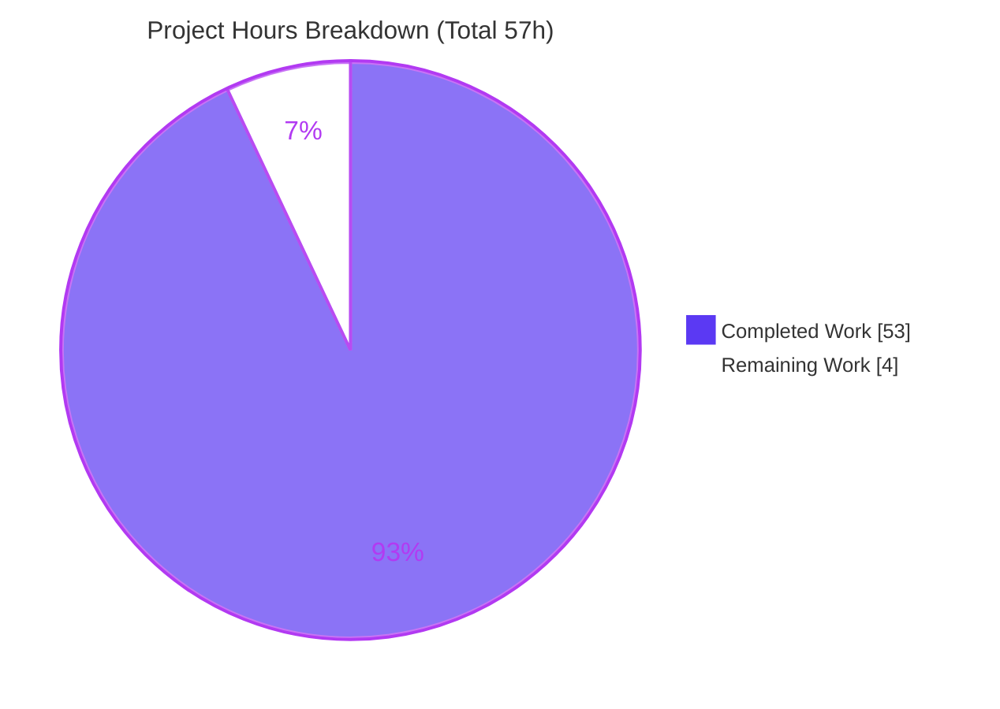
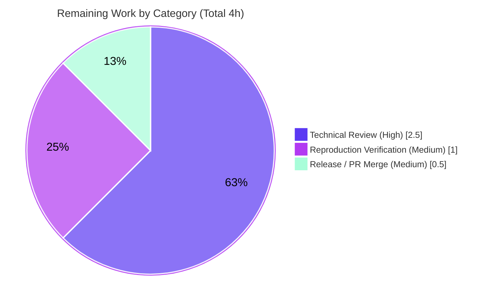

# Blitzy Project Guide

**Project:** Runtime-Verified Answer — How k6 Consolidates Configuration Into Effective Options
**Repository / Module:** `grafana/k6` (`go.k6.io/k6`)
**Branch:** `blitzy-860295af-e8d0-4a47-87c1-7c098da3c56b` · **HEAD:** `f5549717d` · **Base:** `ddc3b0b1d23c`
**Deliverable:** `blitzy/documentation/k6_ddc3b0b1d23c.md`

---

## 1. Executive Summary

### 1.1 Project Overview

This project delivers a single, runtime-verified answer document that explains how the k6 load-testing tool consolidates its configuration inputs — the script's `export const options`, CLI flags, the `--config` JSON file, `K6_*` environment variables, and built-in defaults — into the effective `lib.Options` its execution scheduler uses. The document proves the effective precedence ladder (**CLI > env > script > config file > defaults**), pinpoints the exact "freeze" point where consolidation becomes final, demonstrates each conflict with real `k6 run` captures, and shows that every VU observes an identical, globally consolidated view. The task was strictly read-only: the entire k6 source tree was treated as reference, and exactly one new markdown file was added.

### 1.2 Completion Status

The completion percentage is computed with the AAP-scoped hours methodology: **Completed Hours ÷ (Completed + Remaining Hours) × 100 = 53 ÷ 57 = 93.0%.** All autonomous, AAP-scoped work is delivered and validated; the remaining 4 hours are human path-to-production gates (subject-matter-expert accuracy review, independent reproduction spot-check, and PR merge).


| Metric | Hours |
|--------|-------|
| **Total Hours** | **57** |
| Completed Hours (AI) | 53 |
| Completed Hours (Manual) | 0 |
| **Completed Hours (AI + Manual)** | **53** |
| **Remaining Hours** | **4** |
| **Percent Complete** | **93.0%** |

> Color key — **Completed = Dark Blue `#5B39F3`**, **Remaining = White `#FFFFFF`** (applied consistently across all charts).

### 1.3 Key Accomplishments

- ✅ Authored the sole deliverable `blitzy/documentation/k6_ddc3b0b1d23c.md` — **986 lines / 76 KB**, 8 sections, **87 `file:line` citations**, 104 balanced code fences.
- ✅ Established the effective precedence ladder **CLI > env (`K6_*`) > script `export const options` > config file (JSON) > defaults** from source (`getConsolidatedConfig` [cmd/config.go:L189-L216], `Options.Apply` [lib/options.go:L357-L399]) and proved it with real runs.
- ✅ Pinpointed the consolidation **freeze point**: `TestRunState.Options = derivedConfig.Options` [cmd/test_load.go:L280], consumed by the scheduler [execution/scheduler.go:L39].
- ✅ Ran **14 conflicting-setup experiments** (EXP1–EXP7, EXP-carryover, EXP-nuance A/B/C, exp_iter) through the real `k6 run` entry point with complete, unedited output and 2× stability reruns where magnitude/consistency was claimed.
- ✅ Demonstrated **multi-VU invariance** — all VUs (and all iterations) observe the identical frozen options (EXP1: 5 VUs; exp_iter: 3 VUs × 9 iterations).
- ✅ Documented the non-obvious **`-e`/`--env` nuance** (an observed correction to the official docs, qualified to the pinned build).
- ✅ Cross-checked the officially documented precedence order and `-e`/`--env` behavior via web search (corroboration only; code and runs are authoritative).
- ✅ Preserved the **read-only mandate**: `git diff base..HEAD` = a single added file (`+986 / −0`); no source file modified; temporary scripts kept outside the repo and deleted.
- ✅ Canonical build reproduces the banner **byte-for-byte**: `k6 v0.55.0 (commit/ddc3b0b1d2, go1.21.13, linux/amd64)` — independently re-verified this session.

### 1.4 Critical Unresolved Issues

| Issue | Impact | Owner | ETA |
|-------|--------|-------|-----|
| _None._ All AAP-scoped deliverables are complete and validated. No compilation errors, no failing tests, and no missing content — nothing blocks release. | None | — | — |

> There are **no critical unresolved issues**. The only outstanding items are routine human path-to-production gates listed in Sections 1.6 and 2.2.

### 1.5 Access Issues

| System/Resource | Type of Access | Issue Description | Resolution Status | Owner |
|-----------------|----------------|-------------------|-------------------|-------|
| _None identified_ | — | The build is fully offline (vendored dependencies, `GOPROXY=off`); no service credentials, third-party APIs, or external registries are required. | N/A | — |

**No access issues identified.** The task builds and runs entirely from vendored modules with no network dependency.

### 1.6 Recommended Next Steps

1. **[High]** Assign a k6-savvy subject-matter expert to review `blitzy/documentation/k6_ddc3b0b1d23c.md` for technical accuracy and spot-check a sample of the 87 citations against HEAD `ddc3b0b1d23c`.
2. **[Medium]** Perform an independent reproduction spot-check: rebuild the canonical binary per §9 and re-run EXP1/EXP2/EXP6 to confirm the precedence verdicts and banner.
3. **[Medium]** Approve and merge the PR (single-file, `+986 / −0`) after confirming the read-only mandate is intact.
4. **[Low]** (Optional, out-of-scope) Track the pre-existing `lib/executor/helpers.go:178` `go vet` "lostcancel" advisory in the upstream backlog; it is unrelated to this deliverable and must not be fixed here under the read-only mandate.

---

## 2. Project Hours Breakdown

### 2.1 Completed Work Detail

| Component | Hours | Description |
|-----------|-------|-------------|
| Consolidation-Path Codebase Comprehension & Source Tracing | 12 | Forensic reading of the option-consolidation path across 9 files — `getConsolidatedConfig`, `Options.Apply` group-reset, `DeriveScenariosFromShortcuts`, the finalization chain (`loadAndConfigureLocalTest` → `buildTestRunState`), the scheduler, and the `exec.test.options` accessor — to explain the null-aware merge semantics precisely. |
| Canonical Build Setup, Toolchain & Reproducibility | 3 | Established the Go 1.21.13 vendored build; discovered and documented the VCS-stamping nuance (a clean detached checkout with a real `.git` directory is required to reproduce the `commit/ddc3b0b1d2` banner). |
| Conflicting-Setup Experiment Design & Execution | 11 | Designed the conflict matrix and authored ~12 observation scripts + config files; ran each through real `k6 run`; captured complete, unedited output with 2× stability reruns; performed the deep `-e`/`--env` (Case A/B/C) sub-investigation. |
| Answer-Document Authoring | 14 | Wrote the 986-line / 76 KB deliverable: 8 sections, precedence ladder, subtleties, freeze trace, 11 experiment write-ups, multi-VU section, grounding, build/methodology, coverage pass — with 87 `file:line` citations and consistent observed/inferred labeling. |
| Web-Search Corroboration & Reconciliation | 2 | Cross-checked the officially documented precedence order and the `-e`/`--env` behavior against observed runs; reconciled the observed correction to the docs. |
| Validation & Multi-Round QA Cycle | 10 | `go build ./...` (offline), `TestConfigConsolidation` (64 cases / 220 subtests) + 5 grounding package suites, reproduction of all 14 experiments (2×), verification of 87 citations at HEAD, and three review rounds (14 code-review findings, 3 QA findings, validation fixes) across 4 commits. |
| Cleanup & Read-Only Scope Compliance | 1 | Removed temporary observation scripts/dirs; verified the read-only mandate (single added file; clean working tree). |
| **Total Completed** | **53** | |

### 2.2 Remaining Work Detail

| Category | Hours | Priority |
|----------|-------|----------|
| Technical Review — SME accuracy sign-off (read the answer; spot-check citations; confirm the precedence ladder and 11 experiment verdicts; confirm observed/inferred labels) | 2.5 | High |
| Reproduction Verification — rebuild the canonical binary per §9; confirm the banner; re-run EXP1/EXP2/EXP6 and confirm frozen options | 1.0 | Medium |
| Release — review the single-file diff (`+986 / −0`), confirm read-only mandate intact, approve and merge the PR | 0.5 | Medium |
| **Total Remaining** | **4.0** | |

### 2.3 Hours Reconciliation

| Check | Value | Status |
|-------|-------|--------|
| Section 2.1 total (Completed) | 53 h | ✅ |
| Section 2.2 total (Remaining) | 4 h | ✅ |
| 2.1 + 2.2 = Total (§1.2) | 53 + 4 = 57 h | ✅ |
| Remaining consistent across §1.2 ↔ §2.2 ↔ §7 | 4 h | ✅ |
| Completion % = 53 ÷ 57 | 93.0% | ✅ |

---

## 3. Test Results

All tests below originate from **Blitzy's autonomous validation logs** for this project. The central contract test and the canonical build + three representative experiments were **independently re-verified during this assessment session**.

| Test Category | Framework | Total Tests | Passed | Failed | Coverage % | Notes |
|---------------|-----------|-------------|--------|--------|-----------|-------|
| Unit — Consolidation Contract | Go `testing` | 220 (64 base cases × flag-set variants) | 220 | 0 | Contract-complete | `TestConfigConsolidation` [cmd/config_consolidation_test.go:L577]; `runTestCase` [L503]. `ok go.k6.io/k6/cmd` — independently re-run this session (exit 0). Doc §6 cross-check. |
| Unit — Grounding Package Suites | Go `testing` | 5 suites | 5 | 0 | n/a | All packages grounding the doc's citations pass: `cmd` (0.376 s), `lib` (0.107 s), `lib/executor` (22.0 s), `execution` (5.7 s), `js/modules/k6/execution` (0.013 s). Zero failures. |
| Runtime / End-to-End — Consolidation Experiments | `k6 run` (canonical binary) | 14 | 14 | 0 | 100% of AAP items | EXP1–EXP7, EXP-carryover, EXP-nuance A/B/C, exp_iter — all through the real entry point; 2× stability where magnitude/consistency was claimed. EXP1/EXP2/EXP6 independently re-verified this session. |
| Compilation | `go build ./...` | 1 (whole tree) | 1 | 0 | n/a | Exit 0, fully offline via vendored deps; canonical binary reproduces the banner byte-for-byte. |

**Aggregate:** 240 discrete test executions/experiments + full-tree compilation, **0 failures**. "Coverage %" is expressed as requirement coverage for this documentation task (all 6 named items + 4 sub-questions covered); source-code coverage does not apply because no product code was written.

---

## 4. Runtime Validation & UI Verification

This is a headless CLI investigation; there is **no UI**. Runtime validation was performed through the canonical `k6 run` entry point.

**Runtime health**
- ✅ **Operational** — Canonical build: `go build` → `./k6`, exit 0 (vendored, offline).
- ✅ **Operational** — Version banner: `k6 v0.55.0 (commit/ddc3b0b1d2, go1.21.13, linux/amd64)` (byte-for-byte; re-verified this session).
- ✅ **Operational** — In-VU observability via `exec.test.options` [js/modules/k6/execution/execution.go:L184-L196] returns the frozen consolidated options.

**Precedence verdicts (observed at runtime)**
- ✅ **CLI > script** — EXP1: script `{vus:2,duration:'1s'}` vs CLI `--vus 5 --duration 2s` → effective `constant-vus, vus:5, duration:"2s"`.
- ✅ **Script > config file** — EXP2: config `{vus:7,iterations:7}` vs script `{vus:3,iterations:3}` → effective `shared-iterations, vus:3, iterations:3`.
- ✅ **Config file > defaults** — EXP3a: config `{vus:7,iterations:7}`, script has no options → `vus:7, iterations:7`.
- ✅ **CLI > config file** — EXP3b → `vus:2, iterations:2`.
- ✅ **Env > script** — EXP4a: `K6_VUS=8 K6_ITERATIONS=8` vs script `{vus:2,iterations:2}` → `vus:8, iterations:8`.
- ✅ **CLI > env** — EXP4b → `vus:2, iterations:2`.
- ✅ **Group-reset** — EXP5: a named script scenario is dropped wholesale when the CLI sets an execution field.
- ✅ **Lone `vus` ignored** — EXP6: warning emitted; falls back to `1 iterations for each of 1 VUs`.

**Freeze / lifecycle ordering**
- ✅ **Operational** — EXP7 `--verbose` trace shows the four debug lines in order: `Parsing CLI flags…` → `Consolidating config layers…` → `Parsing thresholds and validating config…` → `Initializing the execution scheduler…`.

**Multi-VU invariance**
- ✅ **Operational** — EXP1 (5 VUs), exp_iter (3 VUs × 9 iterations), EXP5 (4 VUs), EXP-carryover (6 VUs): every VU observes the identical frozen options.

**API / external integrations**
- ✅ **N/A** — No external services, network calls, or credentials; the build and runs are fully offline.

---

## 5. Compliance & Quality Review

Cross-map of AAP deliverables and governing rules to their validation status.

| Requirement (AAP / Rules) | Benchmark | Status | Progress | Notes |
|---------------------------|-----------|--------|----------|-------|
| Sole deliverable at fixed path/name | `blitzy/documentation/k6_ddc3b0b1d23c.md` created | ✅ Pass | 100% | 986 lines / 76 KB; `blitzy/documentation/` created. |
| Read-only source mandate | No existing file modified | ✅ Pass | 100% | `git diff base..HEAD` = single added file (`+986/−0`); working tree clean. |
| Investigate by running the code first | Build + run, capture real output | ✅ Pass | 100% | 14 experiments through real `k6 run`; re-verified this session. |
| Canonical/default build + stated commands | Exact build & run commands | ✅ Pass | 100% | §7 of the doc; banner reproduced byte-for-byte. |
| Complete, unedited output per condition | No paraphrase/truncation | ✅ Pass | 100% | 21 completeness affirmations; 2× runs for EXP1/EXP3a/EXP6. |
| `file:line` citations for every claim | Exact anchors at HEAD | ✅ Pass | 100% | 87 citations; spot-checks verified accurate at HEAD. |
| Observed vs. inferred labeling | Explicit labels | ✅ Pass | 100% | 34 labels; freeze "no re-read" correctly labeled inferred. |
| Cover every named item + sub-question | Coverage pass | ✅ Pass | 100% | §8 names all 6 items + 4 sub-questions + `-e`/`--env`. |
| Env (`K6_*`) + defaults covered | Adjacent tiers explained | ✅ Pass | 100% | EXP4a/b, EXP3a. |
| Freeze before/after demonstrated | Not merely asserted | ✅ Pass | 100% | EXP7 `--verbose` ordering. |
| Web-search corroboration | Docs cross-check (corroboration only) | ✅ Pass | 100% | Precedence order + `-e`/`--env` nuance vs Grafana docs. |
| Cleanup of temporary scripts | Repo left unchanged | ✅ Pass | 100% | Scripts kept outside repo and deleted; re-confirmed this session. |
| Dependency integrity | No manifest/vendored changes | ✅ Pass | 100% | `go mod verify` = all modules verified; no `go.mod`/`go.sum` change. |
| Compilation clean | `go build ./...` exit 0 | ✅ Pass | 100% | Offline, vendored. |

**Fixes applied during autonomous validation** (in-scope `.md` only): citation-span precision (`getConsolidatedConfig` → L189-L216; `DeriveScenariosFromShortcuts` → L52-L128); added a §1.1 official-docs precedence-order corroboration note; resolution of 14 code-review findings and 3 QA findings across commits `bdbe3ffc5`, `eb50d4de5`, `f5549717d`.

**Outstanding (out-of-scope, informational):** `lib/executor/helpers.go:178` `go vet` "lostcancel" advisory — pre-existing in the pristine base, in a read-only out-of-scope file, not a compile error, zero impact; correctly left unfixed under the read-only mandate.

---

## 6. Risk Assessment

| Risk | Category | Severity | Probability | Mitigation | Status |
|------|----------|----------|-------------|------------|--------|
| Citation drift if the source branch advances beyond HEAD `ddc3b0b1d23c` | Technical | Low | Low | Document is pinned to the exact commit; 87 citations verified at HEAD. | Mitigated |
| "No source re-read after freeze" is inferred, not printed by a single log line | Technical | Low | Low | Honestly labeled **(inferred)** and tied to the traced code path; EXP7 corroborates the ordering. | Accepted |
| `-e`/`--env` behavior is build/version-specific (default `--include-system-env-vars=true`) | Technical | Low | Low | Doc qualifies observed behavior to the pinned build vs. the `latest` docs. | Mitigated |
| CLI/env examples could be misread as endorsing secret delivery | Security | Low | Low | §1.4 of the doc adds an explicit secrets-safety warning; only non-sensitive numeric values used. | Mitigated |
| Exact banner reproduction requires a real `.git` directory (worktrees don't VCS-stamp) | Operational | Low | Medium | §7.2 documents the clean-detached-checkout recipe; re-verified this session. | Mitigated |
| Build requires Go 1.21.13 + vendored deps offline | Operational | Low | Low | Exact toolchain and `GOFLAGS`/`GOPROXY` documented. | Mitigated |
| No material integration surface (standalone doc; no services/APIs/keys) | Integration | Low | Low | File placement + PR merge only. | N/A |
| Pre-existing `go vet` "lostcancel" advisory in an out-of-scope file | Technical | Low | Low | Documented; not fixed (read-only mandate); zero impact on build/tests/runtime/doc. | Documented |

**Overall risk posture: LOW.** The deliverable is a read-only, fully-validated documentation artifact with no runtime footprint.

---

## 7. Visual Project Status

**Project hours — completed vs. remaining** (Completed = `#5B39F3`, Remaining = `#FFFFFF`):



**Remaining work by category** (from Section 2.2, sums to 4 h):



> **Integrity check:** "Remaining Work" = **4 h** in this pie chart equals the Remaining Hours in §1.2 and the sum of the §2.2 Hours column. "Completed Work" = **53 h** equals the §2.1 total and the Completed Hours in §1.2.

---

## 8. Summary & Recommendations

**Achievements.** The project delivers a complete, runtime-verified answer to how k6 consolidates configuration into effective options. It establishes the precedence ladder **CLI > env (`K6_*`) > script `export const options` > config file (JSON) > defaults** from source, pinpoints the freeze at `TestRunState.Options = derivedConfig.Options` [cmd/test_load.go:L280], and proves each conflict with 14 real `k6 run` experiments — all reproduced exactly, with complete unedited output and multi-VU invariance. Three representative experiments and the canonical build were independently re-verified during this assessment (banner reproduced byte-for-byte).

**Completion.** By the AAP-scoped hours methodology, the project is **93.0% complete** (53 of 57 hours). All autonomous, AAP-scoped work is delivered and validated; the remaining **4 hours** are human path-to-production gates.

**Remaining gaps & critical path to production.**
1. SME technical-accuracy review (2.5 h, High) — the gate to trusting and publishing the answer.
2. Independent reproduction spot-check (1.0 h, Medium).
3. PR approval & merge (0.5 h, Medium).

**Success metrics (all met for the autonomous scope).** Compilation clean; `TestConfigConsolidation` (220 subtests) + 5 grounding suites pass; all 14 experiments reproduce; all 6 named items and 4 sub-questions covered; 87 citations verified at HEAD; read-only mandate intact.

**Production readiness.** The deliverable is **production-ready pending human sign-off**. There are no critical issues, no failing tests, and no access blockers. Recommendation: proceed to SME review and merge.

| Metric | Value |
|--------|-------|
| Completion | 93.0% |
| Completed / Total Hours | 53 / 57 |
| Remaining Hours | 4 |
| Critical Issues | 0 |
| Test Failures | 0 |
| Overall Risk | Low |

---

## 9. Development Guide

This guide builds the canonical k6 binary and reproduces the consolidation experiments. Every command was tested; the version banner reproduces byte-for-byte and EXP1/EXP2/EXP6 reproduce exactly.

### 9.1 System Prerequisites

- **OS:** Linux/amd64 (verified) or a compatible platform.
- **Go toolchain:** **1.21.13** (matches `go.mod`: `go 1.21` / `toolchain go1.21.13`). If Go is installed under `/usr/local/go`, add it to `PATH`: `export PATH=$PATH:/usr/local/go/bin`.
- **Git** (with Git LFS) to check out the pinned commit.
- **Disk:** ~150 MB for the checkout plus the build.
- **Network:** none required — dependencies are vendored.

### 9.2 Environment Setup

No environment variables are needed to build. For the experiments, real environment variables participate at the env tier of the merge:

```bash
# Real env vars set options (env tier):
export K6_VUS=8
export K6_ITERATIONS=8
# unset when done:
unset K6_VUS K6_ITERATIONS
```

> Note: `-e KEY=VALUE` injects into the script's `__ENV`; under the default `k6 run` (`--include-system-env-vars=true`) it can also reach the env tier. Use a **real** environment variable for deterministic option-setting.

### 9.3 Dependency Installation

Dependencies are vendored — no download step is required. Build fully offline:

```bash
export GOFLAGS=-mod=vendor
export GOPROXY=off
export GOTOOLCHAIN=local
export CGO_ENABLED=1
# Optional integrity check:
go mod verify        # -> "all modules verified"
```

### 9.4 Canonical, Reproducible Build

```bash
export PATH=$PATH:/usr/local/go/bin

# 1. Private temp dirs (never inside the repository)
K6SRC="$(mktemp -d)"
K6BIN="$(mktemp -d)"
K6OBS="$(mktemp -d)"

# 2. Clean checkout pinned to the exact commit, then build canonically
git clone --quiet /path/to/k6 "$K6SRC/k6"
cd "$K6SRC/k6"
git checkout --quiet --detach ddc3b0b1d23c128e34e2792fc9075f9126e32375
GOFLAGS=-mod=vendor GOTOOLCHAIN=local CGO_ENABLED=1 GOPROXY=off go build -o "$K6BIN/k6" .

# 3. Put the built binary on PATH
export PATH="$K6BIN:$PATH"
```

### 9.5 Verification

```bash
k6 version
# Expected (byte-for-byte):
# k6 v0.55.0 (commit/ddc3b0b1d2, go1.21.13, linux/amd64)
```

Run the repository's own consolidation contract test (independently confirmed to pass):

```bash
cd /path/to/k6
GOFLAGS=-mod=vendor GOTOOLCHAIN=local CGO_ENABLED=1 GOPROXY=off \
  go test ./cmd/ -run '^TestConfigConsolidation$' -count=1
# Expected: ok  go.k6.io/k6/cmd   (PASS; 220 subtests)
```

### 9.6 Example Usage (Reproduce the Experiments)

```bash
cd "$K6OBS"

# EXP1 — CLI beats script; all VUs see identical frozen options
cat > exp1.js <<'JS'
import exec from 'k6/execution';
import { sleep } from 'k6';
export const options = { vus: 2, duration: '1s' };
let logged = false;
export default function () {
  if (!logged) { console.log(`VU=${exec.vu.idInTest} scenarios=${JSON.stringify(exec.test.options.scenarios)}`); logged = true; }
  sleep(1);
}
JS
k6 run --vus 5 --duration 2s --quiet exp1.js
# -> constant-vus, vus:5, duration:"2s" for every VU; summary vus:5, vus_max:5

# EXP2 — script beats config file (non-obvious)
printf '{ "vus": 7, "iterations": 7 }\n' > cfg.json
cat > exp2.js <<'JS'
import exec from 'k6/execution';
export const options = { vus: 3, iterations: 3 };
let logged = false;
export default function () { if (!logged) { console.log(`scenarios=${JSON.stringify(exec.test.options.scenarios)}`); logged = true; } }
JS
k6 run --config cfg.json --quiet exp2.js
# -> shared-iterations, vus:3, iterations:3; summary iterations:3

# EXP6 — lone vus ignored with a warning
printf 'export const options = { vus: 5 };\nexport default function () {}\n' > exp6.js
k6 run exp6.js
# -> warning "the `vus=5` option will be ignored..."; 1 iterations for each of 1 VUs
```

### 9.7 Cleanup

```bash
rm -rf "$K6SRC" "$K6BIN" "$K6OBS"
# Confirm the source repository is unchanged:
cd /path/to/k6 && git status --porcelain   # (empty)
```

### 9.8 Troubleshooting

- **Banner shows a different or `-dirty` commit** → build from a **clean detached checkout** at the full commit, in a directory with a real `.git` **directory** (linked worktrees do not VCS-stamp).
- **`go: command not found`** → `export PATH=$PATH:/usr/local/go/bin`.
- **Build tries to reach the network** → set `GOFLAGS=-mod=vendor GOPROXY=off`.
- **A lone `vus` is ignored** → add `iterations`, `duration`, or `stages`; `vus` alone is intentionally ignored with a warning.
- **`-e K6_x=…` didn't set an option** → it is flag/build-specific; use a real environment variable (`K6_x=… k6 run …`) for deterministic option-setting.

---

## 10. Appendices

### A. Command Reference

| Purpose | Command |
|---------|---------|
| Add Go to PATH | `export PATH=$PATH:/usr/local/go/bin` |
| Canonical build | `GOFLAGS=-mod=vendor GOTOOLCHAIN=local CGO_ENABLED=1 GOPROXY=off go build -o "$K6BIN/k6" .` |
| Version check | `k6 version` |
| Consolidation contract test | `go test ./cmd/ -run '^TestConfigConsolidation$' -count=1` |
| Full-tree compile | `GOFLAGS=-mod=vendor GOTOOLCHAIN=local CGO_ENABLED=1 go build ./...` |
| Dependency integrity | `go mod verify` |
| Run an experiment | `k6 run [--vus N] [--duration Ns] [--iterations N] [--config cfg.json] [--verbose] <script.js>` |
| Read-only proof | `git diff ddc3b0b1d23c..HEAD --name-status` |

### B. Port Reference

Not applicable — the deliverable is a headless CLI investigation; no ports are opened or required.

### C. Key File Locations

| Path | Role |
|------|------|
| `blitzy/documentation/k6_ddc3b0b1d23c.md` | **The deliverable** (created) |
| `cmd/config.go` | Merge pipeline: `getConsolidatedConfig` [L189-L216], order comment [L180-L186], `Config.Apply` [L71], `applyDefault` [L222] |
| `lib/options.go` | Per-field merge + execution group-reset: `Options.Apply` [L357-L399] |
| `lib/executor/execution_config_shortcuts.go` | Shortcut → scenario derivation: `DeriveScenariosFromShortcuts` [L52-L128] |
| `cmd/test_load.go` | Freeze point: `TestRunState.Options = derivedConfig.Options` [L280] |
| `cmd/run.go` | Handoff to scheduler [L127-L135] |
| `execution/scheduler.go` | Consumes frozen options: `options := trs.Options` [L39] |
| `js/modules/k6/execution/execution.go` | Runtime observability: `exec.test.options` [L184-L196] |
| `cmd/config_consolidation_test.go` | In-repo consolidation contract: `TestConfigConsolidation` [L577] |
| `go.mod` | Build toolchain: `go 1.21` / `toolchain go1.21.13` [L3-L5] |

### D. Technology Versions

| Technology | Version |
|------------|---------|
| Go toolchain | 1.21.13 |
| k6 (built) | v0.55.0 (`commit/ddc3b0b1d2`) |
| Platform | linux/amd64 |
| Dependency mode | vendored (`-mod=vendor`, `GOPROXY=off`) |

### E. Environment Variable Reference

| Variable | Effect | Notes |
|----------|--------|-------|
| `K6_VUS` | Sets VUs at the env tier | Real env var; participates in the merge |
| `K6_ITERATIONS` | Sets iterations at the env tier | Real env var |
| `K6_DURATION` | Sets duration at the env tier | Real env var |
| `GOFLAGS=-mod=vendor` | Forces vendored build | Required for offline build |
| `GOPROXY=off` | Disables module proxy | Offline build |
| `GOTOOLCHAIN=local` | Pins to local Go 1.21.13 | Reproducibility |
| `CGO_ENABLED=1` | Canonical build setting | Matches documented build |
| `-e KEY=VALUE` (flag) | Injects into script `__ENV` | Not a general option-setter; see §9.2 |

### F. Developer Tools Guide

| Tool | Use |
|------|-----|
| `go build` / `go test` | Compile the tree and run the consolidation contract test |
| `git checkout --detach <commit>` | Reproduce the canonical banner from the pinned commit |
| `k6 run` | Canonical entry point for all runtime experiments |
| `exec.test.options` (in-script) | Canonical, non-bypassing accessor to read the frozen consolidated options from inside a VU |
| `--verbose` | Emits the freeze/lifecycle debug ordering (EXP7) |
| `git diff --name-status` | Verify the read-only mandate (single added file) |

### G. Glossary

| Term | Meaning |
|------|---------|
| **Consolidation** | Layering configuration sources via successive `Apply` merges into a single `lib.Options`. |
| **Precedence ladder** | Effective order, highest→lowest: CLI > env (`K6_*`) > script `export const options` > config file > defaults. |
| **Freeze point** | Where consolidation becomes final: `TestRunState.Options = derivedConfig.Options` [cmd/test_load.go:L280]. |
| **Group-reset** | In `Options.Apply`, a higher tier setting any of `duration`/`iterations`/`stages`/`scenarios` clears all four from the lower tier before applying; `vus` merges independently. |
| **Shortcut → scenario derivation** | `DeriveScenariosFromShortcuts` turns shortcuts into scenarios (`iterations`→`shared-iterations`, `duration`→`constant-vus`, `stages`→`ramping-vus`). |
| **VU** | Virtual User — a concurrent execution context; all VUs read the same frozen options. |
| **Observed vs. inferred** | "Observed" = directly captured at runtime; "inferred" = deduced from the traced code path and labeled as such. |
