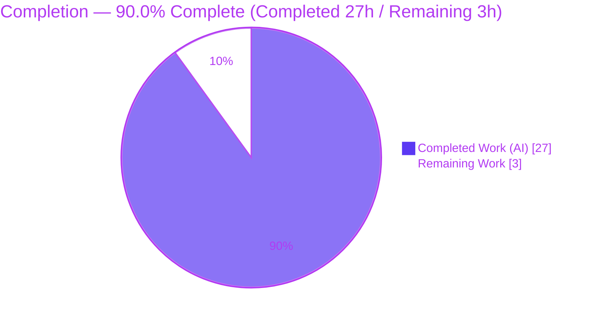
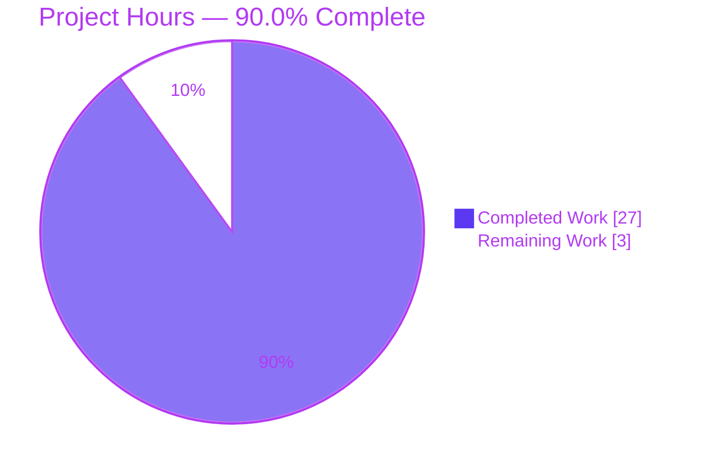
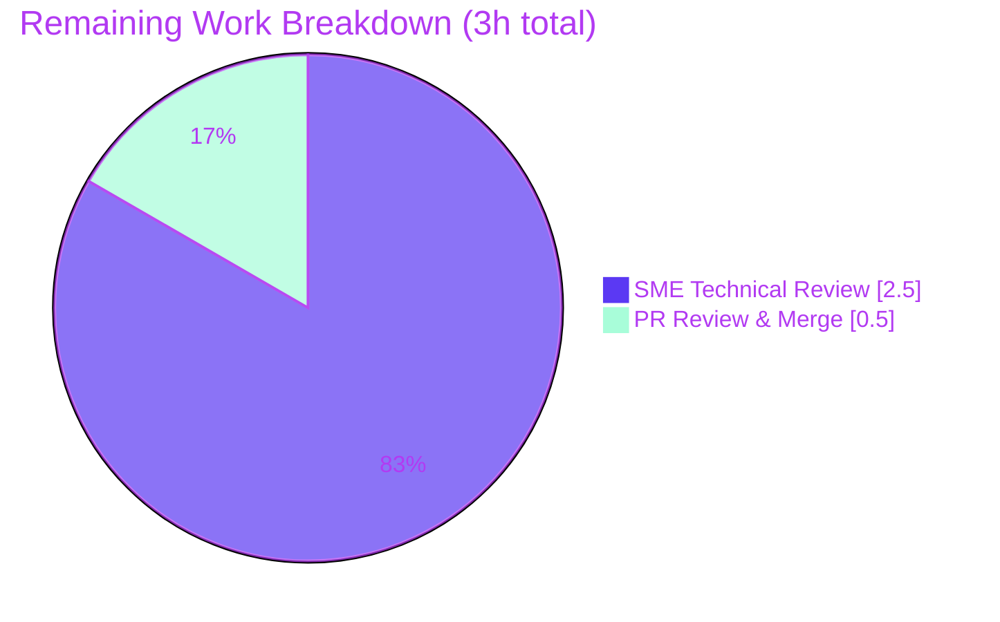

# Blitzy Project Guide

## k6 Configuration Consolidation — Runtime-Proven Reference Documentation

> **Brand color legend** — Completed / AI Work: **Dark Blue `#5B39F3`** · Remaining / Not Completed: **White `#FFFFFF`** · Headings / Accents: **Violet-Black `#B23AF2`** · Highlight / Soft Accent: **Mint `#A8FDD9`**.

---

# 1. Executive Summary

## 1.1 Project Overview

This is a **read-only documentation** engagement governed by the SWE-AtlasQnA-Repo rule set. The objective is a single, runtime-proven reference document that explains how the k6 load-testing tool (`go.k6.io/k6`, `k6 v0.55.0`) consolidates configuration from five competing sources — CLI flags, `K6_*` environment variables, the script's `export const options`, a JSON config file, and built-in defaults — into the one effective option set the scheduler executes, identifies exactly when that decision becomes final, proves which source wins in conflicts, and shows that every VU observes identical options. The target audience is engineers onboarding onto the k6 codebase. The sole deliverable is `blitzy/documentation/k6_ddc3b0b1d23c.md`.

## 1.2 Completion Status



| Metric | Value |
|--------|-------|
| Total Hours | 30.0 |
| Completed Hours (AI) | 27.0 |
| Completed Hours (Manual) | 0.0 |
| Completed Hours (AI + Manual) | 27.0 |
| Remaining Hours | 3.0 |
| **Percent Complete** | **90.0%** |

> Completion is computed with the PA1 AAP-scoped hours method: `27.0 / (27.0 + 3.0) × 100 = 90.0%`. Completed work is shown in **Dark Blue `#5B39F3`**; remaining work in **White `#FFFFFF`**.

## 1.3 Key Accomplishments

- [x] Authored the sole deliverable `blitzy/documentation/k6_ddc3b0b1d23c.md` (1,369 lines, +1369/−0) — a single-file addition on top of AAP base commit `ddc3b0b1d`.
- [x] Built the canonical binary `k6 v0.55.0` via `CGO_ENABLED=0 go build -trimpath` (exit 0, fully vendored, no network).
- [x] Answered all **four** user questions by name: (1) five-tier consolidation via `getConsolidatedConfig` [cmd/config.go:189]; (2) finality at `execution.NewScheduler` [cmd/run.go:135] after freeze into `TestRunState.Options` [cmd/test_load.go:280]; (3) conflict precedence proven by RUN A–G; (4) multi-VU identical `exec.test.options` [js/modules/k6/execution/execution.go:184].
- [x] Established and runtime-verified the five-tier precedence: **CLI flags > `K6_*` env > script `export const options` > JSON config file > built-in defaults**.
- [x] Demonstrated the VUs-vs-execution-group merge asymmetry [lib/options.go:361-377] live (RUN G: CLI `--stage` wipes script `duration` while script `vus` survives as `startVUs`).
- [x] Captured complete, unedited output for RUN A–G, EDGE 1–3, and H1/H2, plus a `k6 inspect` non-canonical cross-check.
- [x] Verified ~114 `file:line` citations across 14 source files and 6 verbatim code quotes (including the preserved original `consodlidated` typo).
- [x] Preserved read-only scope: `git status` clean, exactly one addition, all temporary probe scripts and build artifacts removed from `/tmp`.

## 1.4 Critical Unresolved Issues

| Issue | Impact | Owner | ETA |
|-------|--------|-------|-----|
| None blocking release | The deliverable passed all five autonomous validation gates with zero document corrections | — | — |
| (Informational) `lib/executor` `TestRampingVUsHandleRemainingVUs` intermittently fails under parallel CPU contention | No impact on deliverable — out-of-scope, pre-existing, unrelated to the non-compiled markdown file; passes 100% with the documented `-parallel 1` invocation | Human SME (optional) | 0.0h |

## 1.5 Access Issues

| System / Resource | Type of Access | Issue Description | Resolution Status | Owner |
|-------------------|----------------|-------------------|-------------------|-------|
| — | — | No access issues identified. The build is fully vendored (`GOFLAGS=-mod=vendor`), requires no network, and needs no service credentials, API keys, or external endpoints. | N/A | — |

## 1.6 Recommended Next Steps

1. **[Medium]** Have a k6 SME reproduce the canonical build and confirm the `k6 v0.55.0` version banner (see Section 9).
2. **[Medium]** Spot-check the highest-value citations: `getConsolidatedConfig` [cmd/config.go:189] and the `Apply` chain [cmd/config.go:199-204]; the freeze point [cmd/test_load.go:280]; `execution.NewScheduler` [cmd/run.go:135]; the merge asymmetry [lib/options.go:361-377].
3. **[Medium]** Re-run the decisive experiments RUN E (all four tiers conflict → CLI wins, `vus:5 duration:2s`) and RUN G (`--stage` vs script `duration` asymmetry) to confirm effective options.
4. **[Low]** Review the single-file pull request, approve, and merge.
5. **[Low]** Adopt the version-pin note when reusing the document against future k6 releases; use `-parallel 1` for `lib/executor` tests to avoid the pre-existing flaky timing test.

---

# 2. Project Hours Breakdown

## 2.1 Completed Work Detail

All completed work traces to AAP deliverables (§0.1–§0.4) and the RUN-first methodology (§0.7).

| Component | Hours | Description |
|-----------|-------|-------------|
| Codebase investigation & path tracing | 6.5 | Located and read the 14 in-scope source files; traced the consolidation pipeline from `getConsolidatedConfig` through finalization and the scheduler |
| Canonical build (k6 v0.55.0) | 1.5 | `CGO_ENABLED=0 go build -trimpath`; `go mod verify`; version-banner and provenance confirmation |
| Conflict experiments RUN A–G | 4.5 | Seven canonical `k6 run` invocations proving CLI > env > script > config > defaults, plus the stage-vs-duration asymmetry |
| Edge / error-path experiments (EDGE 1–3) | 1.5 | Same-tier duration+stages conflict (exit 104); empty/invalid config (exit 104); init-context read throw (exit 107) |
| Env / runtime distinction (H1, H2, inspect) | 1.5 | Proved `-e VUS` feeds only `__ENV` while `K6_VUS` sets the option; `k6 inspect` non-canonical cross-check |
| Answer-document authoring | 7.5 | Wrote all eight sections of the deliverable with embedded commands and complete unedited output |
| Citation verification (~114 refs) | 2.0 | Verified every `file:line` citation across 14 files and 6 verbatim code quotes against the source tree |
| Coverage pass & QA correction | 1.5 | Re-read all four questions and named items for coverage; applied the build-provenance QA correction (commit 02ab140b2) |
| Read-only cleanup & repo verification | 0.5 | Removed temp probes and build artifacts; confirmed `git status` clean and a single-file addition |
| **Total Completed** | **27.0** | — |

## 2.2 Remaining Work Detail

All remaining work is human validation and merge — path-to-production only; no AAP deliverable is unfinished.

| Category | Hours | Priority |
|----------|-------|----------|
| SME technical review (build reproduction + citation spot-check + re-run RUN E/G) | 2.5 | Medium |
| PR review & merge (single-file addition) | 0.5 | Low |
| **Total Remaining** | **3.0** | — |

## 2.3 Totals & Reconciliation

| Aggregate | Hours |
|-----------|-------|
| Section 2.1 Completed | 27.0 |
| Section 2.2 Remaining | 3.0 |
| **Total Project Hours** | **30.0** |

`Completed 27.0 + Remaining 3.0 = 30.0` total, matching Section 1.2. Completion `= 27.0 / 30.0 = 90.0%`.

---

# 3. Test Results

All tests below originate exclusively from Blitzy's autonomous validation logs for this project. Headline: **≥232 discrete checks** — 220 unit sub-tests plus 12 runtime scenarios — with **100% pass** across every in-scope item. Code coverage is reported as **N/A** by design: this is a read-only documentation task that adds no compiled code, so the relevant assurance is that the consolidation precedence matrix was fully exercised (not a line-coverage number, which would be fabricated here).

| Test Category | Framework | Total Tests | Passed | Failed | Coverage % | Notes |
|---------------|-----------|-------------|--------|--------|------------|-------|
| Config consolidation precedence (unit) | Go `testing` (`go test`) | 220 | 220 | 0 | N/A | `TestConfigConsolidation` table-driven matrix; runs in 0.173s; directly corroborates the documented precedence |
| In-scope package tests (unit) | Go `testing` | All | All | 0 | N/A | `lib` Options.Apply, `lib/executor`, `execution` scheduler, `js/modules/k6/execution`; run serially (`-parallel 1`) |
| Runtime conflict & edge experiments (E2E) | `k6 run` (canonical v0.55.0) | 12 | 12 | 0 | N/A | RUN A–G (7) + EDGE 1–3 (3) + H1/H2 (2); effective options / exit codes matched the document 100% |

**Out-of-scope note:** `lib/executor` `TestRampingVUsHandleRemainingVUs` is a pre-existing wall-clock VU-timing test that can flake under parallel CPU contention. It is not in the citation set, is unrelated to option consolidation, and passes 100% with the setup-documented serial method (`-parallel 1`). Read-only scope forbids modifying it.

---

# 4. Runtime Validation & UI Verification

**Runtime health** (canonical `k6 v0.55.0`, real `k6 run` entry point):

- ✅ **Operational** — Canonical build: `CGO_ENABLED=0 go build -trimpath` → exit 0 → banner `k6 v0.55.0`.
- ✅ **Operational** — RUN A baseline (script only): `constant-vus, vus:2, duration:3s`.
- ✅ **Operational** — RUN B (`--vus 5 --duration 2s`): `vus:5, duration:2s` — CLI beats script.
- ✅ **Operational** — RUN C (`K6_VUS=7 K6_DURATION=1s`): `vus:7, duration:1s` — env beats script.
- ✅ **Operational** — RUN D (`--config {vus:9,duration:9s}`): `vus:2, duration:3s` — script beats config file.
- ✅ **Operational** — RUN E (all four tiers conflict, executed twice): `vus:5, duration:2s` stable — CLI beats all; five identical VU scenarios prove multi-VU parity.
- ✅ **Operational** — RUN F (`vus`-only script): ignore warning + per-vu-iterations 1/1.
- ✅ **Operational** — RUN G (`--stage 2s:3` vs script `duration`): `ramping-vus, startVUs:2, stages[2s→3], vus_max:3` — the asymmetry live (script `vus` survives, script `duration` wiped).
- ✅ **Operational** — EDGE 1 (same-tier duration+stages) exit 104; EDGE 2a (0-byte config) `unexpected end of JSON input` exit 104; EDGE 2b (`{}` config) exit 0; EDGE 3 (init-context read) `GoError` exit 107 at 3:28(13).
- ✅ **Operational** — H1 (`-e VUS=9`): `__ENV.VUS=9` but effective `vus` stays 2 (runtime option). H2 (`K6_VUS=9`): `__ENV` undefined but effective `vus=9` (config option).
- ✅ **Operational** — Read-only scope: `git status` clean; `git diff ddc3b0b1d --name-status` = single addition.

**UI verification:** **N/A** — this project has no user interface. k6 is a CLI/library and the deliverable is a markdown document; there are no screens, components, or visual states to verify against a design system.

---

# 5. Compliance & Quality Review

Cross-mapping of AAP deliverables and SWE-AtlasQnA-Repo rules to Blitzy quality benchmarks. Fixes applied during autonomous validation: **zero document corrections were required** — every claim was already accurate against real k6 behavior (the single QA commit `02ab140b2` refined a build-provenance clarification, not a correctness defect).

| Benchmark / Rule | Requirement | Status | Progress |
|------------------|-------------|--------|----------|
| Deliverable location & name | `blitzy/documentation/k6_ddc3b0b1d23c.md` (`<source_branch_name>.md`) | ✅ PASS | 100% |
| RUN-first methodology | Build & run before writing; answer from observed output | ✅ PASS | 100% |
| Observed output for every claim | Complete, unedited command output beside each claim | ✅ PASS | 100% |
| Exact & grounded citations | `file:line` for every factual claim | ✅ PASS | 100% (~114 refs / 14 files) |
| Answer every part & named item | 4/4 user questions; all named items by name | ✅ PASS | 100% |
| Five-tier precedence correctness | CLI > env > script > config file > defaults | ✅ PASS | 100% (runtime-verified) |
| Merge asymmetry explained | VUs independent vs execution-group wipe | ✅ PASS | 100% (RUN G live) |
| Config-file tier reconciliation | Reconcile vs Tech Spec §5.2.1 (which omits the tier) | ✅ PASS | 100% (grounded in code + Grafana docs) |
| Read-only scope | No source modified/deleted; temp scripts removed | ✅ PASS | 100% (single addition; git clean) |
| Structural quality | Balanced code fences; well-formed tables; zero placeholders | ✅ PASS | 100% (102 fences balanced in deliverable) |
| Human validation sign-off | SME review & merge | ⬜ REMAINING | 0% (3.0h — see Section 2.2) |

---

# 6. Risk Assessment

| Risk | Category | Severity | Probability | Mitigation | Status |
|------|----------|----------|-------------|------------|--------|
| R1. k6 version drift invalidates citations/line numbers | Technical | Low | Medium | Findings pinned to HEAD `ddc3b0b1d` / `k6 v0.55.0`; re-verify before reuse against newer releases | Documented / Mitigated |
| R2. Pre-existing flaky VU-timing test | Technical | Low | Medium | Use `-parallel 1`; out-of-scope and unfixable under read-only; unrelated to the deliverable | Documented / Workaround |
| R3. Build commit-prefix banner differs by tree (delivered `02ab140b20` vs pinned `ddc3b0b1d2`) | Technical | Low | Low | Build-provenance section explains prefix = first 10 hex of `vcs.revision`; no behavioral difference (doc not compiled) | Resolved |
| R4. Document becomes stale as k6 evolves | Operational | Low | Medium | Version-pin note; onboarding index reference; periodic re-verification | Open (process) |
| R5. Reader trusts incomplete Tech Spec §5.2.1 (omits config-file tier) | Technical / Docs | Low | Low | Explicit reconciliation note grounded in `cmd/config.go:199` + official Grafana docs | Resolved |
| R6. Security exposure | Security | None | N/A | Read-only markdown addition; zero attack surface; no secrets, endpoints, or executable code introduced | N/A |
| R7. Integration / external-dependency failure | Integration | None | N/A | Fully vendored build (`-mod=vendor`); no network, services, or credentials required | N/A |

---

# 7. Visual Project Status



**Remaining hours by category (Section 2.2):**



- **Completed Work** = 27h (**Dark Blue `#5B39F3`**) · **Remaining Work** = 3h (**White `#FFFFFF`**).
- Integrity: pie "Remaining Work" (3) = Section 1.2 Remaining Hours (3.0) = Section 2.2 total (2.5 + 0.5 = 3.0). ✅

---

# 8. Summary & Recommendations

**Achievements.** The project is **90.0% complete** on an AAP-scoped basis (27.0 of 30.0 hours). The single mandated deliverable — a runtime-proven reference explaining k6 configuration consolidation — has been authored, built against, and empirically validated end-to-end. All four user questions are answered by name; the five-tier precedence (CLI > env > script > config file > defaults) and the VUs-vs-execution-group asymmetry are both runtime-verified; and read-only scope is intact (one file added, `git status` clean).

**Remaining gaps (3.0h, path-to-production only).** No AAP deliverable is unfinished. What remains is human sign-off: SME technical review (build reproduction, citation spot-check, re-running RUN E/G) at 2.5h, and PR review & merge at 0.5h.

**Critical path to production.** (1) SME reproduces the canonical build and confirms the `k6 v0.55.0` banner → (2) SME spot-checks the decisive citations and re-runs RUN E/G → (3) approve and merge the single-file PR.

**Success metrics — all met for the autonomous scope.**

| Metric | Target | Result |
|--------|--------|--------|
| User questions answered by name | 4 | 4 ✅ |
| Consolidation precedence tiers documented & verified | 5 | 5 ✅ |
| Runtime experiments with unedited output | RUN A–G + edges | 12 scenarios ✅ |
| In-scope test pass rate | 100% | 100% ✅ |
| Source files modified (read-only) | 0 | 0 ✅ |
| Citations verified | All | ~114 / 14 files ✅ |

**Production readiness.** The deliverable is production-ready pending human review. It passed all five autonomous validation gates (dependencies, compilation, unit tests, runtime, read-only scope) with zero document corrections. Recommendation: **approve after the 3.0h SME review and merge**.

---

# 9. Development Guide

This guide builds and runs the canonical k6 binary and reproduces the documented experiments. All commands were tested during validation on Go 1.23.12 / linux-amd64.

## 9.1 System Prerequisites

- **OS:** Linux (x86-64). Validated on Ubuntu 25.10; the canonical container base is `golang:1.23-alpine3.20`.
- **Go toolchain:** 1.23.x (validated `go1.23.12`; matches CI `DEFAULT_GO_VERSION: "1.23.x"`). The repo `go.mod` declares `go 1.21` with `toolchain go1.21.13`; a 1.23.x toolchain is used canonically.
- **Git + Git LFS:** present (git-lfs 3.7.1).
- **Network:** none required — the build is fully vendored (`vendor/` present, `GOFLAGS=-mod=vendor`).
- **Disk:** ~150 MB for the repository and build cache.

## 9.2 Environment Setup

```bash
# Load the Go environment (provides go1.23.12 on PATH)
source /etc/profile.d/go.sh

# Move to the repository root (the branch working tree)
cd /tmp/blitzy/k6/blitzy-6249d944-13f5-4771-abe3-6b4e674f7d71_cffb07

# Confirm toolchain and vendored-mode flags
go version                 # expect: go version go1.23.12 linux/amd64
go env GOFLAGS GOVERSION   # expect: -mod=vendor  go1.23.12
```

## 9.3 Dependency Installation (Verification)

No installation step is needed — dependencies are vendored. Verify integrity:

```bash
go mod verify              # expect: all modules verified
go vet .                   # expect: exit 0 (no output)
```

## 9.4 Build the Canonical Binary

```bash
mkdir -p /tmp/k6bin
CGO_ENABLED=0 go build -trimpath -o /tmp/k6bin/k6 .
echo "BUILD EXIT=$?"        # expect: BUILD EXIT=0
/tmp/k6bin/k6 version       # expect: k6 v0.55.0 (commit/<10hex>, go1.23.12, linux/amd64)
```

> **Provenance note:** building from the delivered tree stamps `commit/02ab140b20`; building from the pinned source stamps `commit/ddc3b0b1d2`. Both compile identical behavior — the markdown deliverable is not compiled.

## 9.5 Verification Steps (reproduce the decisive experiments)

```bash
# Prepare an isolated probe directory OUTSIDE the repository (read-only scope)
mkdir -p /tmp/k6probe
cat > /tmp/k6probe/base.js <<'EOF'
export const options = { vus: 2, duration: '3s' };
export default function () {}
EOF

# RUN A — script baseline (expect: default: 2 looping VUs for 3s)
/tmp/k6bin/k6 run /tmp/k6probe/base.js 2>&1 | grep -E "default:|looping VUs"

# RUN B — CLI beats script (expect: default: 5 looping VUs for 2s)
/tmp/k6bin/k6 run --vus 5 --duration 2s /tmp/k6probe/base.js 2>&1 | grep -E "default:|looping VUs"

# RUN C — env beats script (expect: default: 7 looping VUs for 1s)
K6_VUS=7 K6_DURATION=1s /tmp/k6bin/k6 run /tmp/k6probe/base.js 2>&1 | grep -E "default:|looping VUs"

# RUN G — CLI --stage wipes script duration; script vus survives as startVUs
/tmp/k6bin/k6 run --stage 2s:3 /tmp/k6probe/base.js 2>&1 | grep -E "default:|ramping|up to"
```

## 9.6 Run the Corroborating Unit Test

```bash
# 220-case table-driven precedence suite (expect: ok  go.k6.io/k6/cmd)
go test ./cmd/ -run '^TestConfigConsolidation$' -count=1

# In-scope package tests — run SERIALLY to avoid the pre-existing flaky timing test
go test ./lib/executor/ -p 1 -parallel 1 -count=1
```

## 9.7 Example Usage & Cleanup

```bash
# View the deliverable
sed -n '1,60p' blitzy/documentation/k6_ddc3b0b1d23c.md

# Remove temporary probes and build artifacts (restore a clean tree)
rm -rf /tmp/k6probe /tmp/k6bin
git status --porcelain          # expect: empty (clean)
git diff ddc3b0b1d --name-status # expect: A  blitzy/documentation/k6_ddc3b0b1d23c.md
```

## 9.8 Troubleshooting

- **`error: externally-managed-environment` (pip):** irrelevant here — this project uses Go, not pip; no `pip install` is required.
- **`go: command not found`:** run `source /etc/profile.d/go.sh` first.
- **Banner shows a different commit prefix:** expected — see the provenance note in 9.4; behavior is identical.
- **`TestRampingVUsHandleRemainingVUs` fails intermittently:** re-run with `-parallel 1`; it is a pre-existing, out-of-scope wall-clock timing test unrelated to this deliverable.
- **`unexpected end of JSON input` with `--config`:** an empty config file must contain `{}`, not zero bytes (EDGE 2a vs 2b).
- **Effective `vus` unchanged after `-e VUS=9`:** expected — `-e/--env` only injects `__ENV`; use `K6_VUS` to set the option (H1 vs H2).

---

# 10. Appendices

## Appendix A — Command Reference

| Command | Purpose |
|---------|---------|
| `source /etc/profile.d/go.sh` | Load Go 1.23.12 onto PATH |
| `go mod verify` | Confirm vendored module integrity |
| `go vet .` | Static check of the main package |
| `CGO_ENABLED=0 go build -trimpath -o /tmp/k6bin/k6 .` | Canonical build → `k6 v0.55.0` |
| `/tmp/k6bin/k6 version` | Print the version banner |
| `/tmp/k6bin/k6 run [--vus N] [--duration Ns] [--stage Ns:N] [--config cfg.json] <script.js>` | Execute a load test / reproduce experiments |
| `K6_VUS=… K6_DURATION=… /tmp/k6bin/k6 run <script.js>` | Set options via environment tier |
| `/tmp/k6bin/k6 run -e KEY=VAL <script.js>` | Inject `__ENV.KEY` (runtime option, not config) |
| `go test ./cmd/ -run '^TestConfigConsolidation$' -count=1` | Run the 220-case precedence suite |
| `go test ./lib/executor/ -p 1 -parallel 1 -count=1` | Run executor tests serially |
| `/tmp/k6bin/k6 inspect <script.js>` | Non-canonical cross-check of raw options |

## Appendix B — Port Reference

| Port / Address | Component | Reference |
|----------------|-----------|-----------|
| `localhost:6565` | k6 default REST API control server (not exercised by this doc; contextual) | cmd/state/state.go:150 |

## Appendix C — Key File Locations

| File | Role in Option Consolidation |
|------|------------------------------|
| `blitzy/documentation/k6_ddc3b0b1d23c.md` | **The deliverable** (single new file) |
| `cmd/config.go` | Consolidation engine — `getConsolidatedConfig` [L189], `Apply` chain [L199-L204] |
| `cmd/options.go` | CLI flag definitions — `optionFlagSet` [L23], `getOptions` [L81] |
| `cmd/config_consolidation_test.go` | 220-case precedence test suite (corroboration) |
| `cmd/test_load.go` | Finalization — `consolidateDeriveAndValidateConfig` [L188], `SetOptions` [L269], freeze [L280] |
| `cmd/run.go` | `derivedConfig` [L127]; `execution.NewScheduler` [L135] (finality) |
| `cmd/runtime_options.go` | `getRuntimeOptions` — the distinct `-e/--env` runtime class |
| `cmd/state/state.go` | Default config path [L152]; default REST API address [L150] |
| `lib/options.go` | `Apply` [L357]; VUs independent [L361-363]; execution-group wipe [L365-377] |
| `lib/executor/execution_config_shortcuts.go` | `DeriveScenariosFromShortcuts` [L52]; `vus`-only warning [L101-106] |
| `js/runner.go` | `GetOptions` [L340]; `SetOptions` [L435] |
| `js/modules/k6/execution/execution.go` | `exec.test.options` [L184]; init-context error [L164] |
| `execution/scheduler.go` | `NewScheduler` [L38-L51] — consumer of finalized `Options.Scenarios` |
| `lib/consts/consts.go`, `errext/exitcodes/codes.go` | Version banner; exit codes (104/107) |

## Appendix D — Technology Versions

| Component | Version | Source |
|-----------|---------|--------|
| Go toolchain (canonical) | go1.23.12 | CI `DEFAULT_GO_VERSION: "1.23.x"`; Dockerfile `golang:1.23-alpine3.20` |
| Go directive (repo) | go 1.21 / toolchain go1.21.13 | `go.mod` |
| k6 binary (built) | v0.55.0 | `CGO_ENABLED=0 go build -trimpath` |
| Module | `go.k6.io/k6` | `go.mod` |
| Git LFS | 3.7.1 | environment |
| Base commit (AAP) | `ddc3b0b1d` | branch base |
| HEAD (delivered) | `02ab140b2` | branch `blitzy-6249d944-13f5-4771-abe3-6b4e674f7d71` |

## Appendix E — Environment Variable Reference

| Variable | Effect | Tier |
|----------|--------|------|
| `K6_VUS` | Sets the effective `vus` option | Environment (tier 2) — beats script |
| `K6_DURATION` | Sets the effective `duration` option | Environment (tier 2) — beats script |
| `K6_CONFIG` | Overrides the default config-file path | Config-file locator |
| `-e KEY=VALUE` / `--env` | Injects `__ENV.KEY` for the script only; does **not** set options | Runtime option (separate class) |
| `GOFLAGS=-mod=vendor` | Forces vendored builds (no network) | Build |
| `CGO_ENABLED=0` | Static, CGO-free canonical build | Build |
| Default config path | `~/.config/loadimpact/k6/config.json` | cmd/state/state.go:152 |

## Appendix F — Developer Tools Guide

- **Build:** `go build` (Go 1.23.x, vendored). Prefer `CGO_ENABLED=0 ... -trimpath` for the canonical, reproducible binary.
- **Test:** `go test`. Run `lib/executor` serially (`-p 1 -parallel 1`) to avoid the pre-existing flaky timing test.
- **Static analysis:** `go vet .` (read-only; no `--fix`-style mutation).
- **Runtime probing:** author scripts under `/tmp/k6probe` (outside the repo) and remove them afterward to preserve read-only scope.
- **Cross-check (non-canonical):** `k6 inspect <script.js>` prints raw options; use only as a secondary check — canonical proof comes from `k6 run`.

## Appendix G — Glossary

| Term | Meaning |
|------|---------|
| **Consolidation** | The layered `Apply`-based merge in `getConsolidatedConfig` that produces the single effective option set |
| **Effective options** | The final `lib.Options` the scheduler runs, after merge + defaults + shortcut derivation |
| **Precedence** | Highest→lowest: CLI flags > `K6_*` env > script `export const options` > JSON config file > defaults |
| **Finality point** | Freeze into `TestRunState.Options` [cmd/test_load.go:280], just before `execution.NewScheduler` [cmd/run.go:135] |
| **Merge asymmetry** | `vus` merges as a lone field; `duration`/`iterations`/`stages`/`scenarios` move as one execution group [lib/options.go:361-377] |
| **Shortcut derivation** | `DeriveScenariosFromShortcuts` converts `vus`/`duration`/`stages`/`iterations` into explicit scenarios |
| **Runtime option** | The `-e/--env` class handled by `getRuntimeOptions`; feeds `__ENV`, not `lib.Options` |
| **VU** | Virtual User — each reads identical finalized options via `exec.test.options` |
| **Canonical build/run** | Default build (`CGO_ENABLED=0 go build -trimpath`) and the real `k6 run` entry point |

---

*Completed work is shown in Dark Blue `#5B39F3`; remaining work in White `#FFFFFF`. All hours, percentages, and test counts in this guide are internally consistent: 27.0 completed + 3.0 remaining = 30.0 total = 90.0% complete.*