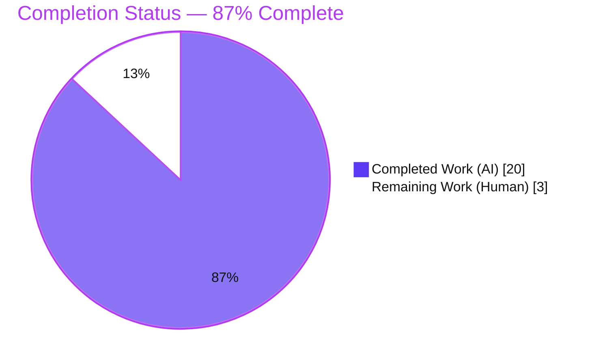
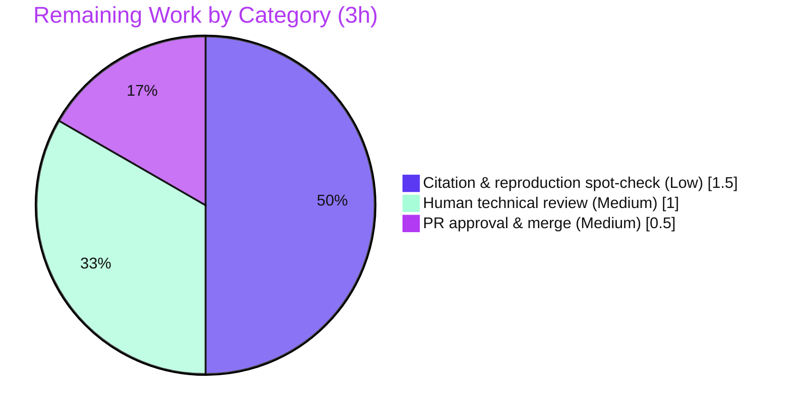

# Blitzy Project Guide — k6 Single-HTTP-Request Behavior Q&A Documentation

> **Scope of this guide.** This project is a **documentation-only, read-only** engagement against the `go.k6.io/k6` codebase (k6 **v0.55.0**, source commit `ddc3b0b1d2`). The Agent Action Plan (AAP) mandates exactly **one additive artifact** — `blitzy/documentation/k6_ddc3b0b1d23c.md` — that answers, in a grounded and reproducible way, how k6 behaves when exercising a single HTTP request (sub-questions **O1–O6**). No existing repository file may be modified. Completion percentages below reflect **only** AAP-scoped work plus standard path-to-production (human review/merge).

---

## 1. Executive Summary

### 1.1 Project Overview

This project delivers a single, self-contained Markdown knowledge document that comprehensively answers how the **k6** load-testing tool behaves when exercising a **single HTTP request**. The target audience is engineers and technical writers who need an authoritative, source-grounded reference for k6 v0.55.0. Its business impact is a reusable, citation-backed answer that removes guesswork about k6's metrics, units, protocols, run command, configuration, external files, and script-validation logic. The technical scope is a read-only Q&A task: the deliverable is produced by **building and running** k6, capturing real output verbatim, and annotating every claim with an exact `file:line` citation — with **zero** changes to k6 source, tests, build, or configuration.

### 1.2 Completion Status

The project is **87% complete** (20 of 23 hours). The completion percentage is computed with the PA1 AAP-scoped methodology: `Completed Hours ÷ (Completed Hours + Remaining Hours) = 20 ÷ 23 = 86.96%`, rounded to **87%**. The autonomous work covers **100% of the AAP-defined deliverable**; the remaining 3 hours are standard path-to-production **human review and merge**.



| Metric | Value |
|--------|-------|
| **Total Hours** | 23.0h |
| **Completed Hours (AI + Manual)** | 20.0h (AI: 20.0h · Manual: 0.0h) |
| **Remaining Hours** | 3.0h |
| **Percent Complete** | **87%** (20 ÷ 23 = 86.96%) |

> **Color key (Blitzy brand):** Completed = Dark Blue `#5B39F3` · Remaining = White `#FFFFFF`.

### 1.3 Key Accomplishments

- ✅ **Single additive deliverable authored & committed** — `blitzy/documentation/k6_ddc3b0b1d23c.md` (608 lines / 4,290 words), named from the source branch `k6_ddc3b0b1d23c`.
- ✅ **All six sub-questions (O1–O6) answered** with dedicated sections, a Question-decomposition, a Reproduction appendix, and a final Coverage-pass table.
- ✅ **Empirically grounded** — k6 was built offline (Go 1.23.12, vendored) and run across ~8 scenarios; real output is quoted **verbatim** (end-of-test summary, `result.json`/`result.csv`, five validation errors + exit codes).
- ✅ **37 unique `file:line` citations**, every one exact-match against source commit `ddc3b0b1d2` (independently re-spot-checked).
- ✅ **Read-only constraint fully honored** — 1 file added, 0 modified, 0 deleted; working tree clean.
- ✅ **Version-fidelity documented** — output bound to the observed v0.55.0 flat summary, with the newer grouped `--summary-mode` layout explicitly flagged as out of scope.
- ✅ **Markdown validated** — 92 balanced code fences, valid UTF-8, 23 internal anchor links resolve, no duplicate heading slugs.

### 1.4 Critical Unresolved Issues

There are **no critical unresolved issues**. The deliverable is complete, validated, and committed; the k6 binary compiles and runs, and every documented behavior was reproduced.

| Issue | Impact | Owner | ETA |
|-------|--------|-------|-----|
| _None_ | _n/a_ | _n/a_ | _n/a_ |

### 1.5 Access Issues

**No access issues identified.** The task required only local repository write access to the new documentation path and a local toolchain; dependencies are vendored (offline build), and the single-request demonstration used a localhost HTTP server (no internet or third-party credentials required).

| System/Resource | Type of Access | Issue Description | Resolution Status | Owner |
|-----------------|----------------|-------------------|-------------------|-------|
| _None_ | _n/a_ | _No access issues identified_ | _n/a_ | _n/a_ |

### 1.6 Recommended Next Steps

1. **[Medium]** Perform a technical review and read-through of the deliverable to confirm O1–O6 coverage reads well and is free of gaps (~1.0h).
2. **[Medium]** Approve the pull request and merge `blitzy/documentation/k6_ddc3b0b1d23c.md` to the target branch (~0.5h).
3. **[Low]** Spot-check a sample of the 37 `file:line` citations against source commit `ddc3b0b1d2`, and optionally rebuild k6 offline (`GOFLAGS=-mod=vendor go build`) to re-run one scenario and confirm the Reproduction appendix (~1.5h).

---

## 2. Project Hours Breakdown

### 2.1 Completed Work Detail

Every completed component traces to a specific AAP requirement (O1–O6, the reproduction appendix, or a `SWE-AtlasQnA-Repo` process rule). The Hours column sums to **20.0h**, matching Completed Hours in Section 1.2.

| Component | Hours | Description |
|-----------|-------|-------------|
| Empirical build & run of k6 | 3.0 | Offline vendored build (Go 1.23.12); localhost HTTP server; capture of ~8 scenarios (plain run, `--out json/csv`, `-e` injection, five validation cases) — satisfies the "run first, then write" rule (R10). |
| O1 — Single-request workflow | 2.0 | Minimal write→run workflow; canonical `examples/http_get.js:1-5` verbatim + offline-safe variant; `http.get`→`GET` tracing at `js/modules/k6/http/http.go:71` (R3). |
| O2 — Output anatomy (METRICS/UNITS/PROTOCOLS) | 4.0 | Verbatim end-of-test summary; 14-metric table with types (`metrics/builtin.go`); units (`metrics/value_type.go` + `js/summary.js`); protocol/tags (`metrics/system_tag.go`, `transport.go`, `response_callback.go`) — the largest section (R4). |
| O3 — Run command | 1.0 | Exact `k6 run <script>` command and flags; `cmd/run.go:462/491/492` (R5). |
| O4 — Configuration / environment variables | 1.0 | "None required" (defaults 1 VU / 1 iteration); `-e`/`--env` (`cmd/runtime_options.go:32`); `K6_*` options (`cmd/config.go:45-48`) (R6). |
| O5 — External files | 1.5 | `output: -` (none by default); `--out json/csv` → verbatim `result.json`/`result.csv`; `handleSummary()` (`cmd/run.go:508/518`) (R7). |
| O6 — Validation logic | 2.0 | Five validation cases with verbatim errors + exit codes `104/255/107/255/99`; exit-code enum `errext/exitcodes/codes.go:20-55` (R8). |
| Reproduction appendix + intro/decomposition/coverage pass | 2.0 | Build-identity note; local target; exact commands; cleanup; version-fidelity notes; Grafana reference URLs; coverage-pass table (R9). |
| Source-citation research & verification | 2.0 | Locating and verifying 37 exact `file:line` references across 15+ source files; Grafana docs corroboration (R12, R16). |
| Markdown QA + review cycles + final validation | 1.5 | Fence/UTF-8/anchor/slug checks; CP3 review-finding fixes; build-identity reconcile; full re-verification of citations and runtime behavior. |
| **Total** | **20.0** | **Matches Completed Hours in Section 1.2** |

### 2.2 Remaining Work Detail

All remaining work is standard path-to-production human sign-off. The Hours column sums to **3.0h**, matching Remaining Hours in Section 1.2 and the pie chart in Section 7.

| Category | Hours | Priority |
|----------|-------|----------|
| Human technical review & read-through of the deliverable | 1.0 | Medium |
| Citation & reproduction spot-check (sample of 37 refs; optional offline rebuild-and-run) | 1.5 | Low |
| PR approval & merge to target branch | 0.5 | Medium |
| **Total** | **3.0** | — |

### 2.3 Hours Reconciliation

| Check | Result |
|-------|--------|
| Section 2.1 total (Completed) | 20.0h |
| Section 2.2 total (Remaining) | 3.0h |
| Section 2.1 + Section 2.2 | **23.0h = Total Project Hours (Section 1.2)** ✓ |
| Completion % | 20 ÷ 23 = 86.96% → **87%** ✓ |
| Remaining hours consistent across §1.2, §2.2, §7 | **3.0h** ✓ |

---

## 3. Test Results

For a documentation deliverable, "tests" are the **autonomous validation activities** executed by Blitzy's systems: exact source-citation verification, runtime behavioral reproduction, build compilation, and Markdown structural integrity. **All results below originate from Blitzy's autonomous validation logs** (and were independently re-spot-checked during this assessment).

| Test Category | Framework / Method | Total | Passed | Failed | Coverage % | Notes |
|---------------|--------------------|-------|--------|--------|-----------|-------|
| Source-citation verification | Exact-match vs source commit `ddc3b0b1d2` (grep/sed) | 37 | 37 | 0 | 100% | Every unique `file:line` reference exact-match; 7 independently re-verified in this assessment. |
| Runtime reproduction (behavioral) | k6 v0.55.0 binary (`go build -mod=vendor`) | 8 | 8 | 0 | 100% | Plain GET (exit 0); `--out json`; `--out csv`; `-e TARGET` injection; and 5 validation cases → exit codes `104/255/107/255/99`. |
| Build compilation | Go 1.23.12 / `go build` | 82 | 82 | 0 | 100% | 82/82 packages compiled cleanly (exit 0). |
| Markdown structural integrity | `iconv` / slug analysis / fence count | 4 | 4 | 0 | 100% | 92 balanced code fences; valid UTF-8; 23 internal anchors resolve; no duplicate heading slugs. |
| **TOTAL** | — | **131** | **131** | **0** | **100%** | Zero discrepancies across all categories. |

> **Out-of-scope note.** k6's own Go unit-test suite has 7 **pre-existing** flaky failures (race/timing under `-race` in `execution`, `js/eventloop`, `js/modules/k6/timers`, plus fixtures in `cmd/tests`, `grpc/http` TLS+OCSP, `lib/executor`). These exist at the base commit `ddc3b0b1d2`, are **unrelated** to the single-HTTP-request documentation, are **not modifiable** under the hard read-only constraint, and do **not** affect the deliverable — they are therefore **not counted** in the table above, which contains only tests relevant to this documentation task.

---

## 4. Runtime Validation & UI Verification

k6 was built and executed against a **localhost** HTTP server (offline-safe). All documented runtime behavior was reproduced.

**Runtime health**

- ✅ **Operational** — k6 binary builds offline (`GOFLAGS=-mod=vendor go build`, exit 0) and reports identity `k6 v0.55.0 (commit/ddc3b0b1d2, go1.23.12, linux/amd64)`.
- ✅ **Operational** — Single `http.get` run completes with **exit code 0**; 1 iteration / 1 VU (default) confirmed.
- ✅ **Operational** — `--out json=result.json --out csv=result.csv` produces both files; header switches to `output: json (result.json), csv (result.csv)`.
- ✅ **Operational** — `-e TARGET=…` injects the user variable, readable via `__ENV` (verified by console log).
- ✅ **Operational** — All five validation error paths reproduce their documented exit codes (`104`, `255`, `107`, `255`, `99`).

**Terminal UI verification** (k6 renders a terminal UI, not a web UI)

- ✅ **Operational** — ASCII banner renders.
- ✅ **Operational** — Execution-description block (`execution` / `script` / `output` / `scenarios`) renders as documented.
- ✅ **Operational** — End-of-test summary lists all 14 expected metrics (flat, alphabetical) with correct units (percentages, `B`/`kB/s`, counts + `/s`, auto-scaled durations `µs`/`ms`) and the `{ expected_response:true }` sub-metric.
- ➖ **N/A** — No web/browser UI is in scope for this CLI documentation task.

**API integration**

- ➖ **N/A** — No external API integration; the demonstration deliberately targets a localhost server (offline-safe), and the two Grafana documentation URLs are corroborative references only.

---

## 5. Compliance & Quality Review

The deliverable is cross-mapped to the binding `SWE-AtlasQnA-Repo` rule set (AAP §0.7) and to Blitzy code-quality benchmarks. Fixes applied during autonomous validation are noted.

| Benchmark / AAP Directive | Status | Progress | Notes |
|---------------------------|--------|----------|-------|
| Deliverable location & name (`blitzy/documentation/k6_ddc3b0b1d23c.md`) | ✅ Pass | 100% | Exact path/name from source branch `k6_ddc3b0b1d23c`. |
| Investigate by RUNNING code first, then write | ✅ Pass | 100% | k6 built + run before authoring; output captured. |
| Quote observed output **verbatim** | ✅ Pass | 100% | Summary, `result.json`/`result.csv`, and 5 error messages quoted exactly. |
| Cite exact `file:line` literals | ✅ Pass | 100% | 37 unique refs, all exact-match at commit `ddc3b0b1d2`. |
| Answer **every** sub-question (O1–O6) | ✅ Pass | 100% | Dedicated sections + coverage-pass table. |
| Read-only (no source modification) | ✅ Pass | 100% | 1 added file; 0 modified/deleted; clean tree. |
| Remove temporary artifacts | ✅ Pass | 100% | Test scripts + `result.*` created under `/tmp`, removed after investigation. |
| Consult official Grafana k6 docs | ✅ Pass | 100% | Results-output & metrics pages cited to corroborate behavior. |
| Version fidelity (v0.55.0 flat summary) | ✅ Pass | 100% | Newer grouped `--summary-mode` layout flagged out of scope (3×). |
| Markdown well-formedness | ✅ Pass | 100% | Balanced fences, valid UTF-8, resolving anchors, unique slugs. |
| Zero-placeholder policy | ✅ Pass | 100% | No TODO/FIXME/stub content; every claim grounded. |
| Build-identity accuracy (CP3 fix) | ✅ Pass | 100% | `commit/…` label clarified as build-time git-HEAD stamp; reconciled in commit `55dc9ce8e`. |

**Fixes applied during autonomous validation:** CP3 review findings addressed (commit `32396bd43`); build-identity/commit-label reconciled (commit `55dc9ce8e`). **Outstanding compliance items:** none.

---

## 6. Risk Assessment

Given the read-only, additive, documentation-only nature of this task, the overall risk posture is **Low** — there are no High- or Medium-severity risks. Risks are assessed across PA3 categories (technical, security, operational, integration).

| Risk | Category | Severity | Probability | Mitigation | Status |
|------|----------|----------|-------------|------------|--------|
| Version-fidelity drift — v0.55.0 flat summary vs newer grouped `--summary-mode` layout | Technical | Low | Medium | Doc notes the difference 3× and binds all output to v0.55.0 / commit `ddc3b0b1d2`. | Mitigated |
| Environment variance in quoted metric values (timings, byte-counts, rates) | Technical | Low | Low | Values labeled as observed; run-to-run/environment variance acknowledged. | Mitigated |
| Build-identity label confusion (`commit/<hash>` = build-time git HEAD, not source snapshot) | Technical | Low | Low | Extensive build-identity note + offline clone-and-detach reproduction (`lib/consts/consts.go:30-35/48-49/52`). | Mitigated |
| Citation line-number drift if source is later edited | Technical | Low | Low | All 37 `file:line` refs anchored to immutable commit `ddc3b0b1d2`; repo is read-only/additive. | Mitigated |
| Illustrative Python `http.server` snippet is localhost-only demo code | Security | Low | Low | Binds to `127.0.0.1` only; temporary and removed; not committed; not production code. | Mitigated |
| Documentation staleness as k6 evolves past v0.55.0 | Operational | Low | Medium | Version + commit pinned in title/intro; version-fidelity notes flag newer-release differences. | Accepted |
| External Grafana doc link rot (2 reference URLs) | Integration | Low | Low | Links target stable `/latest/` Grafana paths; corroborative, not load-bearing. | Accepted |
| Reproduction prerequisite — Go 1.23.x toolchain + local server for humans re-verifying the appendix | Integration | Low | Low | Appendix documents exact prerequisites, offline vendored build, and localhost-only server. | Documented |

---

## 7. Visual Project Status

**Project hours breakdown** (Completed = Dark Blue `#5B39F3`, Remaining = White `#FFFFFF`):


**Remaining work by category** (from Section 2.2; sums to the 3.0h Remaining):



> **Integrity:** the "Remaining Work" value (3) equals Remaining Hours in Section 1.2 and the sum of the Section 2.2 Hours column (1.5 + 1.0 + 0.5 = 3.0).

---

## 8. Summary & Recommendations

**Achievements.** The project delivers a complete, empirically grounded answer to how k6 v0.55.0 behaves for a single HTTP request. All six sub-questions (O1–O6) are answered in dedicated sections, backed by **verbatim** captured output and **37 exact `file:line` citations**, plus a reproduction appendix and a coverage-pass table. The deliverable was produced under a strict read-only constraint — one additive file, zero source modifications — and passed 131 autonomous validation checks (citations, runtime reproduction, build, Markdown integrity) with **zero** discrepancies.

**Remaining gaps.** None technical. The only outstanding work is standard path-to-production: a human technical review, an optional citation/reproduction spot-check, and PR approval & merge — **3.0 hours** total.

**Critical path to production.** (1) Technical review & read-through → (2) optional citation/reproduction spot-check → (3) PR approval & merge. No blocking (High-priority) tasks exist.

**Success metrics.** All six sub-questions answered (6/6); citations exact-match (37/37); runtime scenarios reproduced (8/8); packages compiled (82/82); Markdown checks passed (4/4); read-only integrity preserved (1 added / 0 modified / 0 deleted).

**Production-readiness assessment.** The project is **87% complete** (20 of 23 hours). The AAP-defined deliverable is **100% complete and validated**; the residual 13% (3 hours) is human review/merge, not engineering work. **Recommendation: proceed to human review and merge** — the deliverable is accurate, complete, grounded, reproducible, and production-ready.

| Metric | Value |
|--------|-------|
| AAP-scoped completion | **87%** (20 ÷ 23 = 86.96%) |
| AAP deliverable content | 100% authored, validated, committed |
| Blocking issues | 0 |
| Remaining (human) effort | 3.0h |
| Risk posture | Low (0 High, 0 Medium, 8 Low) |

---

## 9. Development Guide

This guide explains how to view the deliverable and how to **reproduce** the k6 behavior it documents. Commands were tested during validation. Paths assume the repository root at `/tmp/blitzy/k6/blitzy-166104d4-9907-4b93-9a1a-9553f827bdf3_904076`.

### 9.1 System Prerequisites

- **OS:** Linux/amd64 (verified); macOS/Windows also supported by k6.
- **Git:** ≥ 2.x (verified 2.51.0) — to browse the repo and diffs.
- **Go:** **1.23.x** required only to *reproduce* the k6 build (`go.mod` declares `go 1.21` / `toolchain go1.21.13`). **Go is not on PATH by default in this environment and must be installed to rebuild.**
- **Python:** 3.x (verified 3.13.7) — only for the localhost demo server used in reproduction.
- **Markdown viewer:** any (GitHub, VS Code, `mdcat`, or a browser) — to read the deliverable.
- **Network:** none required — the module is fully **vendored** (offline build), and the demo targets localhost.

### 9.2 Environment Setup

```bash
# 1. Enter the repository and select the delivery branch
cd /tmp/blitzy/k6/blitzy-166104d4-9907-4b93-9a1a-9553f827bdf3_904076
git checkout blitzy-166104d4-9907-4b93-9a1a-9553f827bdf3

# 2. No environment variables are required to VIEW the deliverable.
#    (k6 itself needs none for a basic single-request run — it defaults to 1 VU / 1 iteration.)
```

### 9.3 Dependency Installation & Build

Viewing the deliverable needs **no** dependencies. To **reproduce** k6 behavior, install Go 1.23.x, then build offline from vendored modules:

```bash
# Build the k6 binary offline (vendored deps -> no network needed)
cd /tmp/blitzy/k6/blitzy-166104d4-9907-4b93-9a1a-9553f827bdf3_904076
GOFLAGS=-mod=vendor go build -o /tmp/k6bin/k6 .
# Equivalent convenience target:
#   make build
/tmp/k6bin/k6 version   # -> k6 v0.55.0 (commit/<build-time HEAD>, go1.23.12, linux/amd64)
```

### 9.4 Application Startup (Reproduction)

```bash
# 1. Start an offline-safe localhost HTTP server (bind to 127.0.0.1 only)
python3 -m http.server 8099 --bind 127.0.0.1 &
SERVER_PID=$!

# 2. Write a minimal single-GET script OUTSIDE the repository (keeps repo read-only)
cat > /tmp/single_get.js <<'JS'
import http from 'k6/http';
import { check } from 'k6';
export default function () {
  const res = http.get(`http://127.0.0.1:8099/`);
  check(res, { 'status is 200': (r) => r.status === 200 });
}
JS

# 3. Run the single request (deterministic, no color)
K6_NO_COLOR=true /tmp/k6bin/k6 run /tmp/single_get.js   # -> exit 0; flat end-of-test summary

# 4. Stop the demo server by its exact PID (never use a broad kill)
kill "$SERVER_PID"
```

### 9.5 Verification Steps

```bash
cd /tmp/blitzy/k6/blitzy-166104d4-9907-4b93-9a1a-9553f827bdf3_904076

# A. Preview the deliverable
sed -n '1,40p' blitzy/documentation/k6_ddc3b0b1d23c.md

# B. Confirm read-only integrity: ONLY the deliverable was added since base
git diff --name-status ddc3b0b1d2..HEAD        # -> A  blitzy/documentation/k6_ddc3b0b1d23c.md
git status --porcelain                         # -> (empty = clean working tree)

# C. Markdown fence balance (expect: BALANCED, 92 fence markers):
python3 -c "n=open('blitzy/documentation/k6_ddc3b0b1d23c.md').read().count(chr(96)*3); print('BALANCED' if n%2==0 else 'UNBALANCED', n)"

# D. No duplicate heading slugs (expect: no output)
grep -E '^#{1,6} ' blitzy/documentation/k6_ddc3b0b1d23c.md \
  | sed -E 's/^#+ //; s/[^a-zA-Z0-9 -]//g; s/ /-/g' | tr 'A-Z' 'a-z' | sort | uniq -d
```

Expected: (A) title + intro render; (B) exactly one added file and an empty status; (C) `BALANCED 92`; (D) no output.

### 9.6 Example Usage

The deliverable **is** the reference document — open `blitzy/documentation/k6_ddc3b0b1d23c.md` and read sections O1–O6. Section O2 contains the verbatim end-of-test summary produced by the single-request run in §9.4, with every metric, unit, and protocol tag explained and cited.

### 9.7 Troubleshooting

```bash
# "go: command not found"  -> install Go 1.23.x, then re-run the build in §9.3.

# Binary reports commit/<hash> != ddc3b0b1d2  -> EXPECTED: it is Go's build-time git-HEAD
# stamp, not the source snapshot. To reproduce the documented identity string exactly:
git clone --local . /tmp/k6src \
  && git -C /tmp/k6src checkout --detach ddc3b0b1d2 \
  && ( cd /tmp/k6src && GOFLAGS=-mod=vendor go build -o k6 . && ./k6 version )
#   -> k6 v0.55.0 (commit/ddc3b0b1d2, go1.23.12, linux/amd64)

# External example URL unreachable -> use the localhost server in §9.4 (offline-safe).
# Metric values differ from the doc -> EXPECTED run-to-run/environment timing variance.
# Summary looks "grouped" (TOTAL RESULTS/--summary-mode) -> that is a NEWER k6 release;
#   v0.55.0 emits the FLAT alphabetical summary quoted in the deliverable.
```

---

## 10. Appendices

### Appendix A — Command Reference

| Command | Purpose |
|---------|---------|
| `GOFLAGS=-mod=vendor go build -o /tmp/k6bin/k6 .` | Build k6 offline from vendored deps |
| `make build` | Convenience build target (`go build`) |
| `/tmp/k6bin/k6 version` | Print build identity (version/commit/go/os) |
| `K6_NO_COLOR=true /tmp/k6bin/k6 run /tmp/single_get.js` | Run a single-request script (flat summary) |
| `k6 run --out json=result.json --out csv=result.csv <script>` | Emit external result files |
| `k6 run -e TARGET=http://127.0.0.1:8099/ <script>` | Inject a user variable (`__ENV.TARGET`) |
| `git diff --name-status ddc3b0b1d2..HEAD` | Confirm only-additive change set |
| `python3 -c "n=open('<file>').read().count(chr(96)*3); print('BALANCED' if n%2==0 else 'UNBALANCED', n)"` | Check Markdown fence balance |

### Appendix B — Port Reference

| Port | Service | Notes |
|------|---------|-------|
| 8099 | Localhost Python `http.server` | Reproduction only; bound to `127.0.0.1`; stopped by exact PID after the run |

### Appendix C — Key File Locations

| Path | Role |
|------|------|
| `blitzy/documentation/k6_ddc3b0b1d23c.md` | **The deliverable** (608 lines) |
| `examples/http_get.js` | Canonical minimal single-request script (O1) |
| `js/modules/k6/http/http.go` | `http.get` → HTTP `GET` mapping (O1) |
| `metrics/builtin.go` | Built-in metric names & types (O2) |
| `metrics/value_type.go` | Value-type units: Default/Time/Data (O2) |
| `js/summary.js` | Humanization of bytes/durations/percentages (O2) |
| `metrics/system_tag.go` | Default system tag set incl. `proto` (O2) |
| `lib/netext/httpext/transport.go`, `response.go` | `proto` / `expected_response` population (O2) |
| `js/modules/k6/http/response_callback.go` | Default expected status `{{200,399}}` (O2) |
| `cmd/run.go` | `run` subcommand + `handleSummaryResult` (O3/O5) |
| `cmd/runtime_options.go` | `-e`/`--env` flag (O4) |
| `cmd/config.go` | `K6_*` options; scenario-validation error (O4/O6) |
| `js/bundle.go` | "no exported functions" validation (O6) |
| `errext/exitcodes/codes.go` | Exit-code enumeration (O6) |

### Appendix D — Technology Versions

| Component | Version | Source |
|-----------|---------|--------|
| k6 (system under study) | v0.55.0 (commit `ddc3b0b1d2`) | Observed binary identity |
| Go (build) | 1.23.12 | Investigation toolchain |
| Go (declared) | `go 1.21` / `toolchain go1.21.13` | `go.mod:3-4` |
| Python (demo server) | 3.13.7 (3.x) | Reproduction environment |
| Git | 2.51.0 | Environment |
| `github.com/grafana/sobek` | vendored | JS VM running the script |
| `github.com/spf13/cobra` + `pflag` | vendored | CLI command/flag parsing |
| `github.com/sirupsen/logrus` | vendored | Structured error logging |

### Appendix E — Environment Variable Reference

| Variable | Purpose | Required? |
|----------|---------|-----------|
| `K6_NO_COLOR` | Disable ANSI color for deterministic capture | No (used for clean output) |
| `-e VAR=value` / `__ENV.VAR` | User-defined script variable (`cmd/runtime_options.go:32`) | No |
| `K6_OUT` | Default output backend(s) (`cmd/config.go:45-48`) | No |
| `K6_VUS`, `K6_ITERATIONS`, `K6_DURATION` | Execution overrides (`lib/options.go:234-236`) | No |
| `K6_NO_SUMMARY` | Suppress end-of-test summary (`cmd/runtime_options.go:94`) | No |
| `GOFLAGS=-mod=vendor` | Force offline vendored build | Only to rebuild k6 |

> **O4 answer:** a basic single-request run requires **no** configuration or environment variables — k6 defaults to **1 VU / 1 iteration**.

### Appendix F — Developer Tools Guide

| Tool | Use in this project |
|------|---------------------|
| `go build` (Go 1.23.x) | Compile k6 offline from vendored modules |
| `make` | `make build` wraps `go build`; `make all` = clean/format/tests/build |
| `python3 -m http.server` | Offline-safe localhost target for the single request |
| `git diff` / `git status` | Verify read-only, additive-only change set |
| `sed` / `grep` / `python3` | Preview the doc; verify citations, fences, and heading slugs |
| Markdown viewer | Read the rendered deliverable |

### Appendix G — Glossary

| Term | Definition |
|------|------------|
| **VU** | Virtual User — a concurrent execution context; a basic run uses 1 VU. |
| **Iteration** | One execution of the exported `default` function; a basic run performs 1. |
| **Counter / Gauge / Rate / Trend** | k6 metric types (`metrics/builtin.go`): cumulative sum; last value; proportion of non-zero; distribution (avg/min/med/max/percentiles). |
| **Value type (Default/Time/Data)** | Unit family (`metrics/value_type.go`): as-is; milliseconds baseline; bytes. |
| **`expected_response`** | Boolean tag; `true` when status ∈ `{{200,399}}` by default (`response_callback.go:12-13`). |
| **`http_req_duration`** | End-to-end request latency = `sending` + `waiting` (TTFB) + `receiving`. |
| **Threshold** | Pass/fail rule on a metric; a breach forces exit code **99** (`errext/exitcodes/codes.go`). |
| **`handleSummary()`** | Optional exported function returning `{ filename: content }` to write arbitrary files (`cmd/run.go:508/518`). |
| **Flat vs grouped summary** | v0.55.0 emits a flat alphabetical summary; newer releases add grouped `--summary-mode` output (out of scope). |

---

*Generated by the Blitzy Platform · AAP-scoped completion: **87%** (20 of 23 hours) · Deliverable: `blitzy/documentation/k6_ddc3b0b1d23c.md` · Colors: Completed `#5B39F3` / Remaining `#FFFFFF`.*