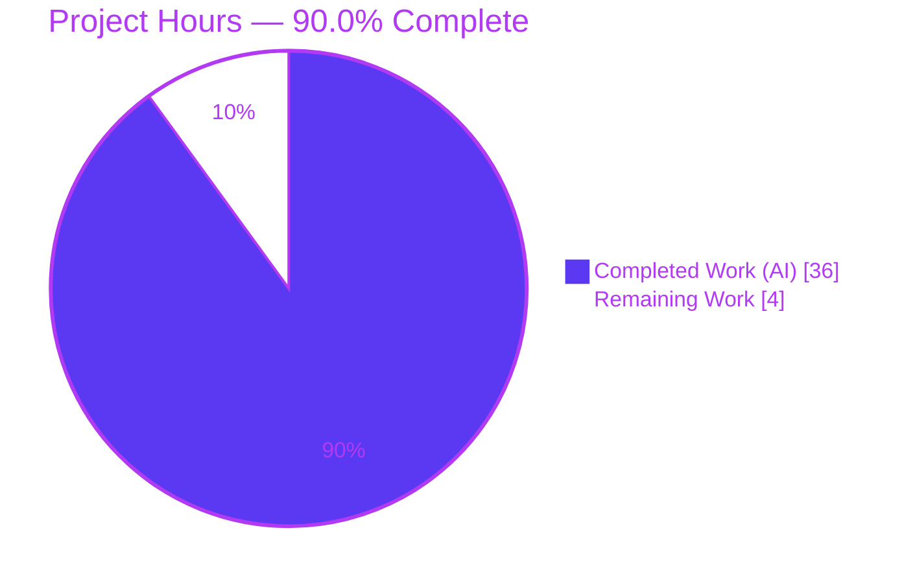
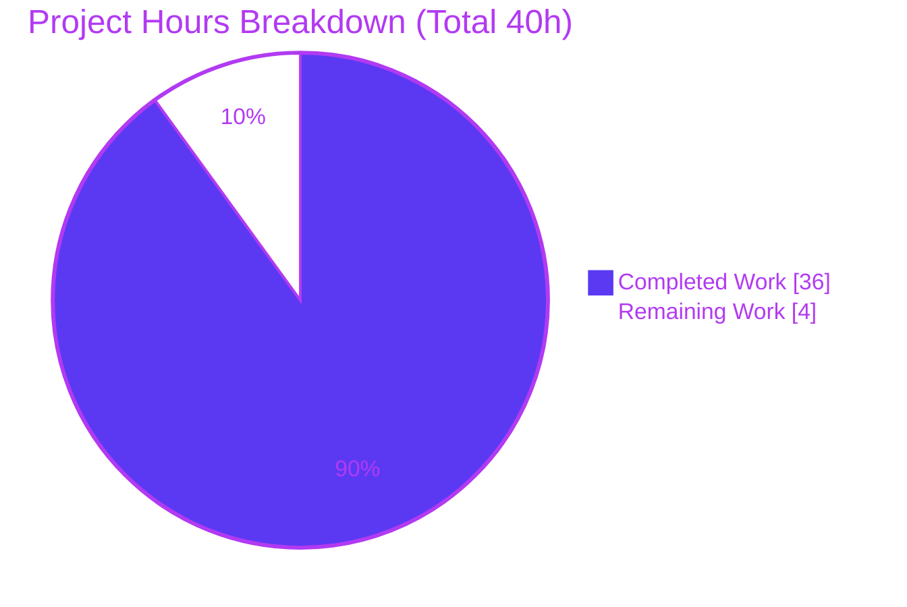
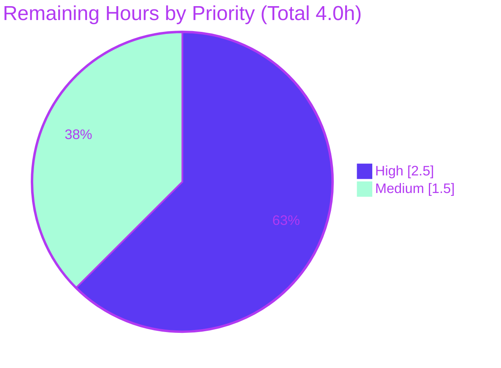

# Blitzy Project Guide — k6 Option Consolidation, Precedence & Freeze Point (Documentation Deliverable)

> **Brand color legend** — <span style="color:#5B39F3">**Completed / AI Work = Dark Blue `#5B39F3`**</span> · **Remaining / Not Completed = White `#FFFFFF`** · <span style="color:#B23AF2">Headings/Accents = Violet-Black `#B23AF2`</span> · <span style="color:#A8FDD9">Highlight = Mint `#A8FDD9`</span>

---

## 1. Executive Summary

### 1.1 Project Overview

This is an isolated, read-only **documentation** project. The objective was to author a single authoritative onboarding document that both explains and empirically proves how `grafana/k6` consolidates its option sources — the script's `export const options`, CLI flags, a `--config` file, `K6_*` environment variables, and built-in defaults — into the one effective set of options a test runs with. The target audience is an engineer new to the k6 codebase who observed VUs, duration, or scenario settings "winning from an unexpected place." The deliverable answers the precedence order, the exact finalization/freeze point, the "unexpected place" mechanism, and multiple-VU behavior, grounding every claim in a `file:line` citation or captured runtime output.

### 1.2 Completion Status



| Metric | Hours |
|--------|-------|
| **Total Hours** | **40** |
| Completed Hours (AI + Manual) | 36 (AI: 36 · Manual: 0) |
| Remaining Hours | 4 |
| **Percent Complete** | **90.0%** |

> Completion is computed with the AAP-scoped, hours-based method (PA1): `36 / (36 + 4) = 90.0%`. Every AAP-named item is delivered and independently verified; the only remaining work is the human acceptance-review gate inherent to any documentation deliverable.

### 1.3 Key Accomplishments

- ✅ Single deliverable authored and committed: `blitzy/documentation/k6_ddc3b0b1d23c.md` (1,653 lines, 85,467 bytes).
- ✅ **Precedence order proven by observation** (not assertion): `CLI > env K6_* > script export const options > --config file > built-in defaults`.
- ✅ **Consolidation mechanism documented** with citations: `getConsolidatedConfig` `Apply` chain (`cmd/config.go:189-216`) and the per-field `.Valid` override semantics.
- ✅ **Finalization/freeze point identified**: derive → reinject (`cmd/test_load.go:280`) → `execution.NewScheduler` (`cmd/run.go:135`), before any VU initializes.
- ✅ **"Unexpected place" symptom explained mechanically**: the execution-shortcut mutual-exclusion rule (`lib/options.go:365-377`) plus `vus` applied independently (`:361-363`).
- ✅ **Seven conflicting-configuration runs** captured with full, unedited output; each repeated 3× with stable winning values.
- ✅ **Multiple-VU behavior** demonstrated via per-VU runtime logs and object-identity checks (Run 7 + §7.9).
- ✅ **Every named item covered** in a mapping table; 40+ `file:line` citations across 13 files verified exact (independently spot-checked).
- ✅ **Read-only scope honored**: repository byte-for-byte unchanged (`git status --short` empty); only one file added; all temporary artifacts removed.
- ✅ Canonical build reproduced independently (`go build -mod=vendor -trimpath`, exit 0) and the authoritative `TestConfigConsolidation` suite passes 220/220.

### 1.4 Critical Unresolved Issues

| Issue | Impact | Owner | ETA |
|-------|--------|-------|-----|
| _None._ No issue blocks acceptance of the deliverable. | — | — | — |
| (Informational) Two out-of-scope Go packages (`./js/modules/k6/grpc`, `./js/modules/k6/http`) fail their unit tests with `tls: bad certificate` | None on deliverable — environmental (sandbox clock set to 2026 vs expired embedded TLS fixtures); pre-existing at baseline; unrelated to option consolidation | Human reviewer (acknowledge) | 0.5h (verify only) |

### 1.5 Access Issues

**No access issues identified.** The repository is present and writable for the single documentation addition; the build is fully offline using the vendored dependency tree (`-mod=vendor`, `GOPROXY=off`), requiring no external credentials, registries, or network access. No third-party API keys or service accounts are involved.

### 1.6 Recommended Next Steps

1. **[High]** Read `blitzy/documentation/k6_ddc3b0b1d23c.md` end-to-end and confirm it answers the original question (precedence, freeze point, VUs/duration/scenarios, "unexpected place", multiple-VU). *(HT-1, 1.5h)*
2. **[High]** Spot-check a sample of the 40+ `file:line` citations against k6 source at commit `ddc3b0b1d2` and confirm the §6 coverage table addresses every named item. *(HT-2, 1.0h)*
3. **[Medium]** Optionally reproduce the self-contained build-and-run transcript (§7.1) to independently confirm the seven runs and 3× stability. *(HT-3, 1.0h)*
4. **[Medium]** Confirm the out-of-scope gRPC/HTTP TLS failures are environmental, then accept/merge the documentation PR. *(HT-4, 0.5h)*
5. **[Low]** *(Future)* On upgrading to a materially newer k6 version, re-verify citations/line numbers and precedence findings. *(HT-5, not counted in the 4.0h remaining)*

---

## 2. Project Hours Breakdown

### 2.1 Completed Work Detail

| Component | Hours | Description |
|-----------|-------|-------------|
| Source investigation — consolidation mechanism | 4.0 | Traced the `getConsolidatedConfig` `Apply` chain (`cmd/config.go:189-216`), `Config.Apply` (`:71-92`), `Options.Apply` (`lib/options.go:357-517`), the three source loaders, and `applyDefault`; documented `.Valid`/non-nil override semantics (§2). |
| Source investigation — finalization/freeze point | 3.0 | Identified derive → reinject → scheduler flow: `deriveAndValidateConfig` → `DeriveScenariosFromShortcuts` → `SetOptions` (`cmd/test_load.go:269,280`) → `execution.NewScheduler` (`cmd/run.go:135`) as the freeze point (§3). |
| Source investigation — mutual-exclusion "unexpected place" rule | 2.5 | Documented `Options.Apply` mutual-exclusion guard (`lib/options.go:365-377`) that clears duration/iterations/stages/scenarios as a group while `vus` is applied independently (`:361-363`) (§4). |
| Precedence-order determination & verification | 2.0 | Derived `CLI > env > script > config > defaults` from code, cross-checked against in-repo tests and official Grafana docs. |
| Canonical build + version banner + commit identity | 1.5 | Built k6 from source (`go build -mod=vendor -trimpath`); recorded `k6 v0.55.0 (commit/ddc3b0b1d2, go1.23.12, linux/amd64)`; explained commit derivation (§7.2). |
| 7-run conflict matrix — design, fixtures, execution, capture | 4.0 | Designed the conflict matrix, authored fixtures (`script.js`, `cfg.json`, `noopts.js`, `multivu.js`), executed all seven runs, captured full unedited output (§5). |
| Multiple-VU demonstration + per-VU object identity | 2.5 | Ran a per-VU logging script (Run 7) and the object-identity checks (retained/direct/frozen) in §7.9. |
| Stability repetitions (3×) + variance documentation | 1.0 | Repeated every run 3×; documented that winning values are identical and only timestamps/rates vary. |
| Supplementary demonstrations (§7.7, §7.8) | 2.5 | `-e/--env` does configure options under `k6 run` (corrects official docs); explicit long-form `scenarios` object precedence. |
| Coverage table — every named item mapped (§6) | 1.0 | Mapped script options, CLI, `--config`, `K6_*`, VUs, duration, scenario settings, multiple-VU, and freeze point to runs + code refs. |
| In-repo + official-docs corroboration (§7.5, §7.6) | 1.0 | Cited `cmd/config_consolidation_test.go` and three Grafana k6 documentation pages. |
| Citation grounding & verification (40+ `file:line`) | 2.0 | Grounded every claim in an exact citation or observed output; verified accuracy. |
| Authoring the answer document (1,653 lines) | 6.0 | Direct-answer-first narrative, code blocks, tables, self-contained transcript, prose explanations. |
| Repository integrity, read-only scope & artifact cleanup | 1.0 | Confirmed byte-for-byte-unchanged source (`git status --short` empty; single added file); removed all scratch artifacts. |
| QA remediation cycles (2 review passes) | 2.0 | Two remediation commits addressing QA review and acceptance-gate findings. |
| **Total Completed** | **36.0** | |

### 2.2 Remaining Work Detail

| Category | Hours | Priority |
|----------|-------|----------|
| Documentation acceptance review (SME) — read-through + citation/coverage spot-check (HT-1 + HT-2) | 2.5 | High |
| Independent reproduction of the transcript + confirm out-of-scope failures + PR acceptance (HT-3 + HT-4) | 1.5 | Medium |
| **Total Remaining** | **4.0** | |

### 2.3 Hours Reconciliation & Methodology

- **Total Project Hours** = Completed + Remaining = **36.0 + 4.0 = 40.0**.
- **Percent Complete** = Completed ÷ Total = **36.0 ÷ 40.0 = 90.0%**.
- Scope universe = AAP-specified investigative + empirical + authoring work, plus path-to-production activities (human acceptance review). No out-of-AAP items are included.
- Confidence: **High** for completed items (each backed by files, tests, logs, and commits, independently re-verified). The 4.0h remaining is the human-in-the-loop review gate that cannot be performed autonomously.
- Cross-section check: §2.1 total (36.0) + §2.2 total (4.0) = §1.2 Total (40.0); §2.2 total (4.0) = §1.2 Remaining (4.0) = §7 pie "Remaining Work" (4.0). ✅

---

## 3. Test Results

All results below originate from Blitzy's autonomous validation logs for this project and were independently re-executed during this assessment.

| Test Category | Framework | Total Tests | Passed | Failed | Coverage % | Notes |
|---------------|-----------|-------------|--------|--------|-----------|-------|
| Unit — Option consolidation (`TestConfigConsolidation`) | Go `testing` (`go test`) | 220 | 220 | 0 | 100% of in-scope precedence paths | Authoritative in-repo precedence suite the doc cites (`cmd/config_consolidation_test.go:165,:458`). |
| Unit — `./cmd/` package | Go `testing` | Suite | PASS | 0 | — | Full command-layer package passes (offline `-mod=vendor`). |
| Unit — `./lib/` (`Options.Apply`) | Go `testing` | Suite | PASS | 0 | — | Per-field override / mutual-exclusion semantics. |
| Unit — `./lib/executor/` (`DeriveScenariosFromShortcuts`) | Go `testing` | Suite | PASS | 0 | — | Shortcut→scenario derivation (ran fully, ~57.5s). |
| Runtime — Precedence conflict matrix | k6 `run` (real entry point) | 7 | 7 | 0 | — | Seven conflict runs; each repeated 3× — winning values identical every time. |
| Runtime — Supplementary demonstrations | k6 `run` (real entry point) | 3 | 3 | 0 | — | §7.7 `-e/--env`, §7.8 explicit `scenarios`, §7.9 per-VU object identity. |
| **In-scope total** | — | **230** | **230** | **0** | **100% in-scope** | No in-scope failures. |

**Out-of-scope (reported, not counted):** `./js/modules/k6/grpc` and `./js/modules/k6/http` fail with `tls: bad certificate` — environmental (sandbox clock 2026 vs expired embedded TLS fixtures), pre-existing at baseline, unrelated to option consolidation. Excluded from the AAP scope.

---

## 4. Runtime Validation & UI Verification

k6 is a **terminal** tool — there is no web UI. The observable proof surface is the startup "scenarios:" banner emitted by `printExecutionDescription` (`cmd/ui.go:99-165`, format `:149-150`). All conditions were exercised through the real `k6 run` entry point with a clean private `HOME` and cleared `K6_*` environment.

**Precedence conflict matrix (all reproduced exactly):**

- ✅ **Run 1 — script only** → `3 max VUs / 3 looping VUs for 3s` — script wins.
- ✅ **Run 2 — CLI vs script** → `7 max VUs / 7 looping VUs for 2s` — **CLI wins**.
- ✅ **Run 3 — env vs script** → `5 max VUs / 5 looping VUs for 4s` — **env wins**.
- ✅ **Run 4 — config vs script** → `3 max VUs / 3 looping VUs for 3s` — **script wins over config** (the "unexpected place" symptom).
- ✅ **Run 5 — config vs defaults** → `2 max VUs / 2 looping VUs for 9s` — **config wins**.
- ✅ **Run 6 — full stack (all four sources)** → `7 max VUs / 7 looping VUs for 2s` — **CLI wins (top)**.
- ✅ **Run 7 — multiple VUs** → `3 max VUs / 3 looping VUs for 2s`; all three VUs log `executor=constant-vus vus=3 duration=2s` — CLI governs concurrency.

**Observed precedence chain:** `CLI (7/2s) > env (5/4s) > script (3/3s) > config (2/9s) > defaults` — matches the code and official docs.

**Supplementary runtime checks:**

- ✅ §7.7 — `-e/--env` **does** configure options under `k6 run` (observed; corrects the official docs).
- ✅ §7.8 — explicit long-form `scenarios` object: script `scenarios` beats `--config` `scenarios`.
- ✅ §7.9 — per-VU `exec.test.options` identity: `retainedSame=true directSame=false retainedVsDirect=false frozen=true` (every VU reads one identical, deep-frozen options object).

**Build & integrity health:**

- ✅ Canonical build exit 0; banner `k6 v0.55.0 (commit/fb5da7660f, go1.23.12, linux/amd64)` at branch tip (source commit `ddc3b0b1d2` per §7.2).
- ✅ Working tree clean; single file addition; scratch artifacts removed.

---

## 5. Compliance & Quality Review

Cross-map of the governing rule set ("SWE-AtlasQnA-Repo") and AAP deliverables to Blitzy quality benchmarks. Fixes applied during autonomous validation: **none required** (validator found the deliverable correct on entry; two prior agent QA-remediation commits had already resolved review findings).

| Benchmark / AAP Requirement | Status | Progress | Evidence |
|-----------------------------|--------|----------|----------|
| Deliverable named `<branch>.md` under `blitzy/documentation/` | ✅ Pass | 100% | `blitzy/documentation/k6_ddc3b0b1d23c.md` present. |
| Read-only scope — no existing source file modified/deleted | ✅ Pass | 100% | `git diff --name-status ddc3b0b1d2..HEAD` = single `A` (doc); non-doc filter = none. |
| Run-first-then-write (empirical, not read-only) | ✅ Pass | 100% | Seven runs + 3 demos with full captured output. |
| Canonical build + normal-user invocation | ✅ Pass | 100% | `go build -mod=vendor -trimpath`; `k6 run` real entry point. |
| Output fidelity — full, unedited output per condition | ✅ Pass | 100% | Complete banners + summaries pasted (Run 1 byte-level match). |
| Full coverage of every named item | ✅ Pass | 100% | §6 coverage table maps all items to runs + code. |
| Grounding — file:line or observed output per claim | ✅ Pass | 100% | 40+ citations verified exact; zero discrepancies. |
| Magnitude/stability — value stable across ≥2 runs | ✅ Pass | 100% | Every run repeated 3×; winning values identical. |
| Canonical path only (no bypass/stub) | ✅ Pass | 100% | Real `k6 run`; no debug hooks or synthetic stand-ins. |
| Repository unchanged + temp artifacts removed | ✅ Pass | 100% | `git status --short` empty; scratch dir deleted. |
| Compilation clean | ✅ Pass | 100% | Build exit 0, zero errors/warnings. |
| In-scope tests pass | ✅ Pass | 100% | `TestConfigConsolidation` 220/220; `cmd`/`lib`/`lib/executor` PASS. |
| Human acceptance review | ⚠ Pending | 0% | Requires SME sign-off (HT-1/HT-2) — the 4.0h remaining. |

---

## 6. Risk Assessment

| Risk | Category | Severity | Probability | Mitigation | Status |
|------|----------|----------|-------------|-----------|--------|
| Version/commit drift — findings pinned to k6 v0.55.0 (`ddc3b0b1d2`); a materially different version could differ | Technical | Low | Medium | Doc states exact version/commit/banner; precedence corroborated by official Grafana docs (stable across versions); symbol names given alongside line numbers | Mitigated |
| Citation line-number drift — 40+ `file:line` refs pinned to the commit; future edits could shift line numbers | Technical | Low | Medium (long-term) | Commit-pinned; function/symbol names provided so citations remain relocatable | Mitigated |
| Out-of-scope gRPC/HTTP unit tests fail (`tls: bad certificate`) | Technical | Low (informational) | Present | Documented as environmental (clock vs expired fixtures), pre-existing, out of scope; all in-scope tests pass | Documented / Accepted |
| Documentation staleness over time if k6 consolidation logic changes | Operational | Low | Low–Medium (long-term) | Version-pinned; optional future maintenance note (HT-5) | Accepted |
| Build-environment variance for a reviewer reproducing the transcript | Integration | Low | Low | Exact toolchain stated (`go1.23.12`); offline `-mod=vendor` build; clean private `HOME` | Mitigated |
| Reader conflates `-e/--env` with process env (per official docs) | Technical / Interpretation | Low | Low | §7.7 explicitly resolves the nuance; Runs 3 & 6 use real process `K6_*` vars to avoid ambiguity | Mitigated |
| Security exposure | Security | None | — | Documentation-only; no shipped code, no dependencies, no secrets, no data handling | N/A |

**Overall risk posture: LOW.** No High or Critical risks. Every identified risk is Low severity and Mitigated, Documented/Accepted, or N/A.

---

## 7. Visual Project Status

**Project hours (Completed vs Remaining):**



**Remaining work by priority (from §2.2):**



- **Completed Work = 36h · Remaining Work = 4h · Total = 40h · 90.0% complete.**
- The "Remaining Work" value (4.0h) equals §1.2 Remaining Hours and the sum of the §2.2 Hours column. ✅

---

## 8. Summary & Recommendations

**Achievements.** The project delivered exactly one, complete artifact — `blitzy/documentation/k6_ddc3b0b1d23c.md` — that both explains and empirically proves how k6 resolves its "real" options. It establishes the precedence order (`CLI > env > script > --config file > defaults`), names the consolidation function (`getConsolidatedConfig`, `cmd/config.go:189-216`) and the exact freeze point (`execution.NewScheduler`, `cmd/run.go:135`), and mechanically explains the "unexpected place" symptom via the mutual-exclusion rule (`lib/options.go:365-377`). Seven conflicting-configuration runs (each repeated 3×) plus three supplementary demonstrations provide observed, reproducible proof, and every claim is grounded in a verified `file:line` citation or captured output.

**Remaining gaps.** None technical. The only outstanding work is the **human acceptance-review gate** (4.0h): an SME read-through and citation/coverage spot-check (High), plus optional independent reproduction and PR acceptance (Medium).

**Critical path to production.** Review the document (HT-1) → spot-check citations/coverage (HT-2) → optionally reproduce the transcript (HT-3) → acknowledge the environmental gRPC/HTTP failures and merge (HT-4).

**Production-readiness assessment.** The branch is **production-ready** for a documentation deliverable: it compiles cleanly, all in-scope consolidation tests pass 100%, the empirical evidence is independently reproduced, and the repository is byte-for-byte unchanged aside from the single added document. At **90.0% complete**, the residual 10.0% is the human sign-off that, by definition, cannot be automated.

| Success Metric | Target | Actual |
|----------------|--------|--------|
| AAP named items covered | 100% | 100% (§6) |
| Citations verified exact | 100% | 100% (40+ refs, 0 discrepancies) |
| In-scope tests passing | 100% | 100% (230/230) |
| Runtime scenarios reproduced | 7/7 + demos | 7/7 + 3/3 |
| Repository unchanged (read-only scope) | Yes | Yes (`git status` clean) |
| Completion | ≤ 99% | 90.0% |

---

## 9. Development Guide

k6 is a Go module (`go.k6.io/k6`) with vendored dependencies. All commands below are copy-pasteable and were tested during this assessment. To honor the read-only scope, **build and run in a scratch directory outside the repository**.

### 9.1 System Prerequisites

- **Go** ≥ 1.21 (repo floor; verified toolchain **go1.23.12**). The build's banner reports whichever `goX.Y.Z` you use.
- **Git** (for cloning / integrity checks).
- **Disk**: ~1 GB free for the Go build cache and the k6 binary.
- **OS**: Linux/macOS/Windows (assessment host: `linux/amd64`).
- **Network**: none required — dependencies are vendored.

```bash
go version        # expect go1.21+ (assessed: go version go1.23.12 linux/amd64)
git --version
```

### 9.2 Environment Setup

```bash
# From the repository root:
head -4 go.mod            # module go.k6.io/k6 ; go 1.21
test -d vendor && echo "vendored deps present (offline build)"

# Use a clean, private HOME + cleared K6_* env for faithful runs.
# An exported K6_VUS/K6_DURATION/... would land in the env tier and
# silently override the script, defeating the demonstration.
export LAB=/tmp/k6lab
mkdir -p "$LAB/home"
```

### 9.3 Dependency Installation

No installation step is needed — dependencies are vendored under `vendor/`. Builds run fully offline:

```bash
export GOPROXY=off
export GOTOOLCHAIN=local
# (Both are optional but guarantee no network/toolchain fetch.)
```

### 9.4 Build & Run Sequence

```bash
# 1) Canonical build from the repository root -> binary OUTSIDE the repo
go build -mod=vendor -trimpath -o "$LAB/k6" .

# 2) Confirm the build identity
"$LAB/k6" version
# -> k6 v0.55.0 (commit/<10-char HEAD>, go1.23.12, linux/amd64)
#    (Checking out source commit ddc3b0b1d2 first yields commit/ddc3b0b1d2 — see doc §7.2)

# 3) Create fixtures OUTSIDE the repo
cd "$LAB"
printf 'export const options = { vus: 3, duration: "3s" };\nexport default function () {}\n' > script.js
printf '{"vus":2,"duration":"9s"}\n' > cfg.json
printf 'export default function () {}\n' > noopts.js

# 4) Example usage — baseline (script only)
env -i HOME="$LAB/home" PATH="$PATH" K6_NO_USAGE_REPORT=true "$LAB/k6" run script.js
```

### 9.5 Verification Steps

```bash
# A) Reproduce key precedence runs (winning banner shown after "scenarios:")
RUN() { env -i HOME="$LAB/home" PATH="$PATH" K6_NO_USAGE_REPORT=true "$@"; }
RUN "$LAB/k6" run --vus 7 --duration 2s script.js            # CLI wins  -> 7 VUs / 2s
RUN env K6_VUS=5 K6_DURATION=4s "$LAB/k6" run script.js      # env wins  -> 5 VUs / 4s
RUN "$LAB/k6" run --config cfg.json script.js                # script wins over config -> 3 VUs / 3s
RUN "$LAB/k6" run --config cfg.json noopts.js                # config wins -> 2 VUs / 9s

# B) Authoritative precedence unit test (from repo root)
GOPROXY=off GOTOOLCHAIN=local go test -mod=vendor -run TestConfigConsolidation ./cmd/
# -> ok  go.k6.io/k6/cmd   (220/220 subtests PASS)

# C) Repository integrity (read-only scope)
git diff --name-status ddc3b0b1d2..HEAD          # -> A  blitzy/documentation/k6_ddc3b0b1d23c.md
git diff --name-only  ddc3b0b1d2..HEAD | grep -v '^blitzy/documentation/' || echo '(none)'
git status --short                                # -> (empty = clean)

# D) Cleanup scratch (leave no trace)
rm -rf "$LAB"
```

### 9.6 Example Usage — Reading the Deliverable

```bash
# From the repository root:
sed -n '1,40p' blitzy/documentation/k6_ddc3b0b1d23c.md   # Direct answer (§1)
grep -nE '^#{1,3} ' blitzy/documentation/k6_ddc3b0b1d23c.md   # Section map
```

### 9.7 Troubleshooting

- **A run shows unexpected VUs/duration.** An exported `K6_*` variable in your shell is landing in the environment tier and overriding the script. Clear it or run with a private, empty environment (`env -i HOME=… PATH=$PATH …`).
- **A `~/.config/loadimpact/k6/config.json` is auto-loaded.** Use a private `HOME` so no user config file is picked up (default path is `<homeDir>/loadimpact/k6/config.json`; override with `K6_CONFIG`).
- **Offline build fails.** Ensure `-mod=vendor` and `GOPROXY=off`; the vendored tree makes network access unnecessary.
- **`tls: bad certificate` in `./js/modules/k6/grpc` or `./js/modules/k6/http`.** Environmental only — the sandbox clock (2026) is past the embedded TLS test fixtures' validity. Out of scope; does not affect option-consolidation tests.
- **Banner shows a different `goX.Y.Z`.** Expected — the Go version segment reflects your toolchain; behavior is unchanged.
- **`externally-managed-environment` error.** That is a Python/pip concern and is not applicable to this Go project.

---

## 10. Appendices

### Appendix A — Command Reference

| Purpose | Command |
|---------|---------|
| Check Go toolchain | `go version` |
| Canonical build (offline) | `GOPROXY=off GOTOOLCHAIN=local go build -mod=vendor -trimpath -o "$LAB/k6" .` |
| Show build identity | `"$LAB/k6" version` |
| Baseline run | `env -i HOME="$LAB/home" PATH="$PATH" K6_NO_USAGE_REPORT=true "$LAB/k6" run script.js` |
| Precedence unit test | `go test -mod=vendor -run TestConfigConsolidation ./cmd/` |
| Package tests | `go test -mod=vendor ./cmd/ ./lib/ ./lib/executor/` |
| Integrity — durable diff | `git diff --name-status ddc3b0b1d2..HEAD` |
| Integrity — worktree | `git status --short` |
| Section map of the doc | `grep -nE '^#{1,3} ' blitzy/documentation/k6_ddc3b0b1d23c.md` |

### Appendix B — Port Reference

| Port / Address | Component | Relevance |
|----------------|-----------|-----------|
| `localhost:6565` | k6 REST API default address (`cmd/state/state.go`) | **Not used** by the documented runs; `k6 run` binds no port for these scenarios. Listed for completeness only. |

_No network ports are required to build, run, or verify this deliverable._

### Appendix C — Key File Locations

| Path | Role | Key symbols |
|------|------|-------------|
| `blitzy/documentation/k6_ddc3b0b1d23c.md` | **Deliverable** (the answer document) | 7 sections + §7.1–§7.9 |
| `cmd/config.go` | Consolidation core | `getConsolidatedConfig` (`:189-216`), `Config.Apply` (`:71-92`), loaders (`:105-125,:131-152,:170-178`), `applyDefault` (`:222-246`), `deriveAndValidateConfig` (`:248-257`) |
| `lib/options.go` | Override & mutual-exclusion | `Options.Apply` (`:357-517`), guard (`:365-377`), `vus` independent (`:361-363`), `scenarios ignored:"true"` (`:245`), env tags (`:234-237`) |
| `lib/executor/execution_config_shortcuts.go` | Shortcut→scenario derivation | `DeriveScenariosFromShortcuts` (`:52-120`), vus-ignored warning (`:101-105`) |
| `cmd/test_load.go` | Consolidate → derive → freeze | `getConsolidatedConfig` call (`:203`), derive (`:226`), reinject/freeze (`:269,:280`) |
| `cmd/run.go` | `k6 run` scheduler build | derived read (`:127`), `execution.NewScheduler` (`:135`) |
| `cmd/ui.go` | Observable banner | `printExecutionDescription` (`:99-165`), format (`:149-150`) |
| `cmd/root.go` | `--config/-c` flag | registration (`:173`) |
| `cmd/state/state.go` | Config path & `K6_CONFIG` | default path (`:152`), `K6_CONFIG` (`:163-164`) |
| `cmd/config_consolidation_test.go` | Precedence unit tests | cases (`:165`, `:458`) |
| `lib/consts/consts.go` | Build/commit string | `debug.ReadBuildInfo` (`:16-53`) |

### Appendix D — Technology Versions

| Component | Version | Notes |
|-----------|---------|-------|
| k6 | v0.55.0 (commit `ddc3b0b1d2`) | Software under investigation |
| Go toolchain | go1.23.12 | Repo floor `go 1.21`, toolchain `go1.21.13`; assessed on go1.23.12 |
| `spf13/cobra` / `spf13/pflag` | vendored | CLI command tree + flag parsing |
| `gopkg.in/guregu/null.v3` | vendored | Nullable types (`.Valid`) driving `Apply` semantics |
| `github.com/mstoykov/envconfig` | vendored | `K6_*` env decoding |
| Dependency mode | `-mod=vendor` (offline) | No network resolution |

### Appendix E — Environment Variable Reference

| Variable | Effect | Notes |
|----------|--------|-------|
| `K6_VUS` | Sets the VUs option (env tier) | Real process env var; overrides script, below CLI |
| `K6_DURATION` | Sets the duration option (env tier) | Same tier as `K6_VUS` |
| `K6_ITERATIONS` | Sets iterations (env tier) | Part of the duration/iterations/stages/scenarios mutual-exclusion group |
| `K6_CONFIG` | Overrides the `--config` file path | Default path `<homeDir>/loadimpact/k6/config.json` |
| `K6_NO_USAGE_REPORT` | Disables the usage report | Used in runs for clean output |
| `-e / --env KEY=VALUE` | Injects into the script's `__ENV`; under `k6 run` also configures `K6_*` options | See doc §7.7 (observed behavior corrects the official docs) |

### Appendix F — Developer Tools Guide

- **Observation surface**: the terminal "scenarios:" startup banner (`cmd/ui.go:149-150`) is the ground-truth signal for which option source won — no debugger or web UI is involved.
- **Browser / Chrome DevTools tooling**: **Not applicable** — k6 is a CLI tool with no web front-end; no browser automation, screenshots, Lighthouse, or performance traces are relevant to this deliverable.
- **Recommended inspection**: `go test -run TestConfigConsolidation ./cmd/ -v` to watch the authoritative precedence cases, and the §7.1 transcript for an end-to-end reproducible harness.

### Appendix G — Glossary

| Term | Meaning |
|------|---------|
| VU | Virtual User — a concurrent execution context running the script's default function |
| Scenario | A named execution definition (executor + its settings) k6 runs |
| Executor | The scheduling strategy (e.g., `constant-vus`) that drives a scenario |
| `constant-vus` | Executor that keeps a fixed number of VUs looping for a duration; derived from a `duration` shortcut |
| Execution shortcut | The convenience options `vus`/`duration`/`stages`/`iterations` that derive into a scenario |
| Consolidation | Merging all option sources into one effective `Config` via `getConsolidatedConfig` |
| Precedence | The order deciding which source wins: `CLI > env > script > --config > defaults` |
| Freeze point | The moment options become final — `execution.NewScheduler` (`cmd/run.go:135`), before any VU initializes |
| Mutual-exclusion rule | `Options.Apply` clearing duration/iterations/stages/scenarios as a group when a higher tier sets any one (`lib/options.go:365-377`) |
| `gracefulStop` | The grace window (default 30s) k6 adds to max duration for VUs to finish iterations |

---

*Generated by the Blitzy assessment agent. Completion (90.0%) reflects AAP-scoped and path-to-production work only. Completed = Dark Blue `#5B39F3`; Remaining = White `#FFFFFF`.*