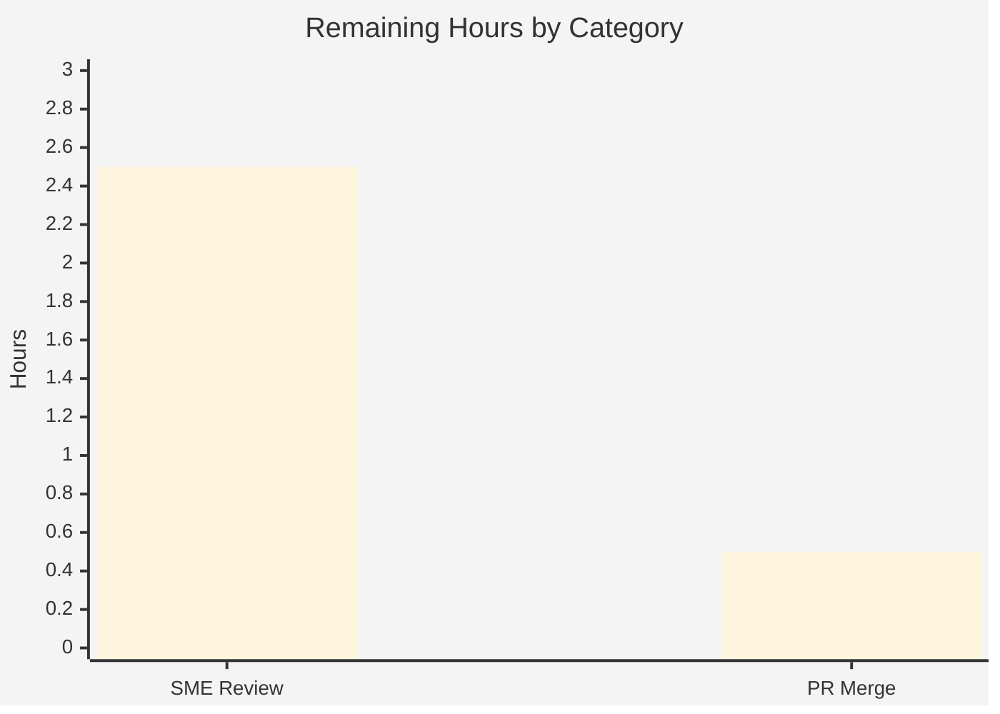

# Blitzy Project Guide — Grafana k6 v0.55.0 Behavior Documentation

> **Deliverable:** `blitzy/documentation/k6_ddc3b0b1d23c.md` — an evidence-backed guide answering nine questions about how k6 v0.55.0 behaves.
> **Task type:** Investigative documentation (question-answering). **Repository:** Grafana k6 (`go.k6.io/k6`, v0.55.0 @ commit `ddc3b0b1d2`).
> **Brand color key:** <span style="color:#5B39F3">■</span> Completed / AI Work = Dark Blue `#5B39F3` · <span style="color:#B23AF2">■</span> Headings / Accents = Violet-Black `#B23AF2` · <span style="color:#A8FDD9">■</span> Highlight = Mint `#A8FDD9` · ▢ Remaining = White `#FFFFFF`

---

## 1. Executive Summary

### 1.1 Project Overview

This project produces a single, authoritative documentation artifact that explains how the Grafana **k6** load-testing tool behaves — how a user writes and runs a load-testing script, what k6 reports back, and specifically how to test one HTTP request. Unlike documentation written from reading alone, every claim is substantiated by the **real runtime output** of a k6 binary built from source at the repository's pinned commit, paired with `file:line` citations into the k6 codebase. The target audience is engineers evaluating or onboarding onto k6. The technical scope is deliberately narrow and **read-only**: exactly one new markdown file is added and no k6 source is modified. Business impact: a trustworthy, reproducible reference that removes ambiguity about k6 v0.55.0's canonical behavior.

### 1.2 Completion Status

The project is **91.7% complete** on an AAP-scoped, hours-based basis. All content deliverables and investigation work are done; the remaining work is standard path-to-production for a documentation artifact (human review + merge).


| Metric | Hours |
|---|---|
| **Total Hours** | **36** |
| Completed Hours (AI + Manual) | 33 (AI 33 + Manual 0) |
| Remaining Hours | 3 |
| **Percent Complete** | **91.7%** (33 ÷ 36) |

### 1.3 Key Accomplishments

- ✅ Built the k6 binary from source (offline, vendored modules) and reproduced the canonical version banner `k6 v0.55.0 (commit/ddc3b0b1d2, go1.23.10, linux/amd64)`.
- ✅ Authored an **811-line** evidence-backed guide answering all nine questions (Q1–Q9), with **37** fenced code blocks of complete, unedited command output.
- ✅ Grounded every factual claim with **104** `file:line` citations into the k6 source tree (all independently audited as accurate).
- ✅ Exercised every implied condition — the happy path **and** error/edge/validation paths (missing file, missing `default` export, malformed JavaScript) — capturing exact error text and exit codes (**255 / 104 / 107**).
- ✅ Demonstrated the single-HTTP-request behavior with full captured stdout and confirmed **structural stability across two runs**.
- ✅ Enumerated the **16 emitted metrics** with metric type (Counter/Gauge/Trend/Rate), value type (Default/Time/Data), units, and protocol tags (HTTP/2.0 + TLS 1.3).
- ✅ Preserved the **read-only constraint** — `git diff <base>..HEAD` is exactly one file added; zero Go source changes; working tree clean; all temporary artifacts deleted.

### 1.4 Critical Unresolved Issues

| Issue | Impact | Owner | ETA |
|---|---|---|---|
| _None_ — the deliverable is complete, empirically validated (zero discrepancies), and the read-only constraint is verified. | No blocking issues. | — | — |

### 1.5 Access Issues

| System/Resource | Type of Access | Issue Description | Resolution Status | Owner |
|---|---|---|---|---|
| k6 source repository | Read/Write (docs path only) | None — repository accessible; single doc file committed. | ✅ Resolved | — |
| Go toolchain | Build | Host has **no native Go**; build performed inside the provided Docker image (Go 1.23.10) or requires a local Go 1.21+ toolchain. Documented, not blocking. | ✅ Resolved (documented) | Human reviewer |
| `test.k6.io` (outbound HTTPS) | Network | Required only to **re-reproduce** live runs; captured output is already embedded in the deliverable. | ✅ Resolved (evidence captured) | — |

_No access issues prevent build validation, integration, or delivery of the documentation artifact._

### 1.6 Recommended Next Steps

1. **[Medium]** Have a k6/load-testing SME review `blitzy/documentation/k6_ddc3b0b1d23c.md` for technical accuracy and spot-check a sample of the 104 citations (≈2.5h).
2. **[Low]** Approve and merge the branch (single doc file) into the target branch, or publish to the team knowledge base (≈0.5h).
3. **[Low]** _(Optional, out of AAP scope)_ Consider a companion note mapping the v0.55.0 behavior to newer k6 v1.x/v2.x differences already flagged in the doc's version caveats.

---

## 2. Project Hours Breakdown

### 2.1 Completed Work Detail

Every completed component traces to an AAP requirement (the nine questions, the build/run investigation, evidence-quality rules, and the read-only/cleanup constraints).

| Component | Hours | Description |
|---|---:|---|
| Build environment & k6 compilation | 3.5 | Toolchain investigation (`go.mod` `go 1.21` + `toolchain go1.21.13`; image ships Go 1.23.10 with `GOTOOLCHAIN=local`); offline vendored `go build`; banner reproduction. |
| Q1 — Tool behavior + live REST API probe | 2.0 | CLI/Cobra single-binary analysis; live probe of REST API on `localhost:6565` via a Go `net/http` client (`curl` unavailable). |
| Q2 — Authoring/execution workflow | 1.0 | Author→run→observe workflow; quoting `examples/http_get.js` and the README options/check/sleep pattern. |
| Q3 — What k6 reports | 1.0 | Banner, execution/scenarios block, live progress bar, and end-of-test summary structure. |
| Q4 — Single HTTP request demonstration | 2.5 | Minimal `http.get` script; full unedited stdout capture; stability confirmed across 2 runs; `http_reqs=2` explained via 302 redirect. |
| Q5 — Metrics / units / protocols | 3.0 | Mapping of all 16 emitted metrics to type/value-type + registration lines; units humanization; HTTP/2.0 + TLS 1.3 protocol tags. |
| Q6 — Execution command + flag defaults | 1.5 | `k6 run <script>` plus documented flag defaults and the command's Examples block. |
| Q7 — Configuration / environment variables | 2.0 | Three scenarios: `-e` `__ENV` injection; `K6_VUS`/`K6_ITERATIONS` options; `-e K6_VUS` "will be ignored" warning. |
| Q8 — External files | 2.5 | Four output paths: default (writes nothing), `--out json`, `--out csv`, `--summary-export`, and `handleSummary()`. |
| Q9 — Validation logic | 2.0 | Three validation gates with exact error text and exit codes (255/104/107) plus documented ordering and full taxonomy. |
| Citation verification | 2.5 | Audited all 104 `file:line` citations against the source tree. |
| Document authoring / assembly | 3.0 | Assembly of the 811-line GitHub-flavored markdown deliverable. |
| Cleanup & read-only verification | 1.0 | Deleted all temporary scripts/outputs/binary; verified `git status --porcelain` empty. |
| QA / review correction rounds | 3.0 | Two correction commits (code-review precision fixes; go-version banner correction). |
| Final empirical validation (GATEs 1–4) | 2.5 | Full reproduction pass of every claim; zero discrepancies. |
| **Total Completed** | **33.0** | **Matches Completed Hours in Section 1.2.** |

### 2.2 Remaining Work Detail

Each remaining item is standard path-to-production for a documentation deliverable — no code, deployment, CI/CD, or integration work applies.

| Category | Hours | Priority |
|---|---:|---|
| Human SME technical review of document accuracy (read the guide, spot-check citations, optionally re-run 1–2 scenarios) | 2.5 | Medium |
| PR merge / publication (docs-only; no CI gates) | 0.5 | Low |
| **Total Remaining** | **3.0** | **Matches Remaining Hours in Section 1.2 and Section 7.** |

### 2.3 Hours Reconciliation

- Section 2.1 (Completed) = **33.0h**
- Section 2.2 (Remaining) = **3.0h**
- **Total = 33.0 + 3.0 = 36.0h** ✔ (equals Total Hours in Section 1.2)
- **Completion = 33.0 ÷ 36.0 = 91.67% ≈ 91.7%** ✔ (used in Sections 1.2, 7, and 8)

---

## 3. Test Results

For a documentation deliverable, the "test suite" is the **empirical reproduction** of every documented claim, executed by Blitzy's autonomous validation systems (GATE 1). Each scenario was run against the built k6 binary and its output/exit code compared to the deliverable. **All results originate from Blitzy's autonomous validation logs for this project.**

| Test Category | Framework | Total Tests | Passed | Failed | Coverage % | Notes |
|---|---|---:|---:|---:|---:|---|
| Build & version verification | `go build` / `go mod verify` | 3 | 3 | 0 | 100% | Offline vendored build exit 0; modules verified; banner exact. |
| Q1 — REST API probe | Go `net/http` client | 2 | 2 | 0 | 100% | `/v1/status` body + `/v1/metrics` (16 objects) during a live run. |
| Q4 — Single-request run (stability) | `k6 run` | 2 | 2 | 0 | 100% | Identical metric set + counts across 2 runs; only latency/bytes vary. |
| Q7 — Environment-variable scenarios | `k6 run` | 3 | 3 | 0 | 100% | `-e` `__ENV`; `K6_VUS`/`K6_ITERATIONS`; `-e K6_VUS` ignored-warning. |
| Q8 — External-file scenarios | `k6 run` | 5 | 5 | 0 | 100% | default (none) / json / csv / summary-export / handleSummary. |
| Q9 — Validation-error paths | `k6 run` | 3 | 3 | 0 | 100% | Exit codes 255 (missing file) / 104 (no `default`) / 107 (syntax error). |
| Citation accuracy audit | Source cross-reference | 104 | 104 | 0 | 100% | Every `file:line` citation verified accurate. |
| **TOTAL** | — | **122** | **122** | **0** | **100%** | **Zero discrepancies.** |

**Scope note:** The k6 Go unit-test suite (**176** `*_test.go` files) is **explicitly out of scope** per the AAP — the deliverable is documentation and introduces no test/CI change. The environment setup logs noted two pre-existing, unrelated Go-test failures (a gRPC TLS-CA fixture and an HTTP OCSP-staple test); these are environment/fixture issues in the upstream suite, are **not touched by this task**, and have no bearing on the documentation deliverable.

---

## 4. Runtime Validation & UI Verification

All runtime behavior documented in the guide was validated against the built binary.

**Runtime health:**
- ✅ **Operational** — k6 builds from source (exit 0) via `go build`.
- ✅ **Operational** — version banner reports `k6 v0.55.0 (commit/ddc3b0b1d2, go1.23.10, linux/amd64)`.
- ✅ **Operational** — single-HTTP-request run completes with exit 0 and the documented summary.
- ✅ **Operational** — in-process REST API serves `localhost:6565/v1/status` and `/v1/metrics` during a run.
- ✅ **Operational** — environment-variable scenarios (`-e`, `K6_*`) alter the execution plan exactly as documented.
- ✅ **Operational** — external-file outputs (`--out json`, `--out csv`, `--summary-export`, `handleSummary()`) generate the expected files; default run writes nothing (`output: -`).
- ✅ **Operational** — validation-error paths produce the documented exit codes (255 / 104 / 107).

**UI verification:**
- k6 is a **command-line tool** — there is **no web UI**. The user-facing "interface" is the terminal: the ASCII banner, the `execution/scenarios` block, the live progress bar, and the end-of-test summary. All of these terminal surfaces were captured verbatim and verified in the deliverable (Q3/Q4). No browser-based UI verification is applicable.

---

## 5. Compliance & Quality Review

The governing rule set ("SWE-AtlasQnA-Repo") defines the quality benchmarks. Each is cross-mapped to the deliverable below.

| Benchmark / Rule | Status | Progress | Notes |
|---|---|---|---|
| Deliverable at `blitzy/documentation/<branch>.md` | ✅ Pass | 100% | `blitzy/documentation/k6_ddc3b0b1d23c.md` created (811 lines). |
| Run-first methodology (build + run before writing) | ✅ Pass | 100% | Binary built and exercised; prose derived from captured output. |
| Actual, complete, unedited output for every claim | ✅ Pass | 100% | 37 fenced code blocks of verbatim output. |
| `file:line` grounding for every factual claim | ✅ Pass | 100% | 104 citations, all audited accurate. |
| Answer every question + every named item | ✅ Pass | 100% | Q1–Q9 all covered, including named metrics, flags, and files. |
| Exercise every implied condition (happy + error/edge) | ✅ Pass | 100% | Missing-file, no-`default`, malformed-JS, env, and output paths. |
| Observe at scale; confirm stability across ≥2 runs | ✅ Pass | 100% | Q4 metric set + counts stable across two runs. |
| Report canonical/default configuration | ✅ Pass | 100% | v0.55.0 banner + exact build/invocation commands stated. |
| Label inferences vs. observations | ✅ Pass | 100% | `(inferred)` labels and v0.55.0 version caveats present. |
| Read-only: no existing source file modified | ✅ Pass | 100% | `git diff <base>..HEAD` = one file added; zero source changes. |
| Cleanup temporary artifacts | ✅ Pass | 100% | `git status --porcelain` empty; all `/tmp` artifacts deleted. |

**Fixes applied during autonomous validation:** the go-version banner was corrected to the canonical `go1.23.10` (commit `58bfe6a15`), and code-review precision findings were addressed (commit `54a4bd5b6`). The final validation pass required **zero further edits** — the deliverable was already accurate, so no gratuitous changes were made.

**Outstanding compliance items:** none. Human SME sign-off (Section 2.2) is the only remaining review gate.

---

## 6. Risk Assessment

Overall risk posture is **LOW** — this is a read-only documentation artifact with no production runtime surface. Every identified risk is Low/Minimal severity and is mitigated or explicitly documented within the deliverable itself.

| Risk | Category | Severity | Probability | Mitigation | Status |
|---|---|---|---|---|---|
| Live network timing varies run-to-run (latency/byte magnitudes) | Technical | Low | High | Structural metric set + counts confirmed stable across 2 runs; doc labels only magnitudes as variable. | ✅ Mitigated |
| Go banner shows `go1.23.10`, not `go.mod`-pinned `go1.21.13` | Technical | Low | Medium | Doc explains the cause (`GOTOOLCHAIN=local`, image Go 1.23.10) and shows the failed offline `go1.21.13` build message. | ✅ Documented |
| Documentation drift if k6 is upgraded past v0.55.0 | Technical | Low | Low | Doc is version-pinned to v0.55.0 @ `ddc3b0b1d2` with explicit v1.x/v2.x caveats (e.g., REST API default). | ✅ Mitigated |
| No material security exposure | Security | Minimal | Low | Read-only markdown; no code/credentials added. Documented REST API on `localhost:6565` is native k6 behavior, not introduced here. | ✅ N/A |
| External endpoint (`test.k6.io`) needed to re-reproduce | Operational | Low | Medium | Output already captured in the deliverable; reproduction guidance provided. | ✅ Accepted |
| Build-environment dependency (no native Go on host) | Operational | Low | Medium | Guide documents the Docker-image build path and the local Go 1.21+ path with exact commands. | ✅ Documented |
| `test.k6.io` 302 → `http_reqs=2` could confuse readers | Integration | Low | N/A | Doc explicitly explains the followed redirect and `http_req_failed=0/2`. | ✅ Resolved |
| Network-backed `--out` backends (InfluxDB/cloud) not demonstrated | Integration | Low | N/A | Explicitly out of AAP scope; only local file generation is in scope. | ✅ Informational |

---

## 7. Visual Project Status

**Project hours breakdown** (Completed <span style="color:#5B39F3">■ Dark Blue `#5B39F3`</span> / Remaining ▢ White `#FFFFFF`):


**Remaining hours by category** (from Section 2.2, total = 3.0h):



**Integrity check:** the pie chart "Remaining Work" value (**3**) equals the Section 1.2 Remaining Hours (**3**) and the sum of the Section 2.2 Hours column (2.5 + 0.5 = **3.0**). ✔

---

## 8. Summary & Recommendations

**Achievements.** The project delivers a comprehensive, evidence-backed guide to k6 v0.55.0 behavior. All nine questions are answered with real, unedited command output and `file:line` citations, produced by building and running the tool rather than by reading documentation. The happy path and every error/edge/validation path were exercised, and structural results were confirmed stable across two runs. The read-only constraint was honored exactly — one file added, zero source modifications, a clean working tree.

**Remaining gaps.** None technical. The only remaining work is standard path-to-production for a documentation artifact: a human SME technical review and the PR merge/publication.

**Critical path to production.** SME review of the guide (spot-checking citations and optionally re-running 1–2 scenarios) → approve → merge/publish. There are no build, deployment, CI/CD, or integration gates because the change is documentation-only.

**Success metrics.** All nine questions answered (9/9); every behavioral claim backed by captured output; 104/104 citations verified; 122/122 empirical reproductions passing; read-only constraint verified.

**Production readiness.** The deliverable is **91.7% complete** (33h of 36h AAP-scoped) and is assessed **production-ready pending human sign-off**. Confidence is **High** — the scope is well defined and the deliverable was empirically validated with zero discrepancies. The residual 8.3% reflects genuine human review and merge work that cannot be completed autonomously.

| Metric | Value |
|---|---|
| AAP questions answered | 9 / 9 |
| Empirical reproductions passed | 122 / 122 |
| Citations verified | 104 / 104 |
| Source files modified | 0 |
| Completion (AAP-scoped) | 91.7% |

---

## 9. Development Guide

This guide explains how to build k6 from source and **reproduce the evidence** embedded in the deliverable. All commands were verified against the working environment.

### 9.1 System Prerequisites

- **Go 1.21+** toolchain. `go.mod` declares `go 1.21` with `toolchain go1.21.13`; the canonical build image ships **Go 1.23.10** with `GOTOOLCHAIN=local`, which satisfies the `go 1.21` minimum, so the `toolchain go1.21.13` directive is **not** downloaded.
- **Git** (verified: `git version 2.51.0`).
- **Outbound HTTPS** to `https://test.k6.io` (only required to re-run live scenarios).
- The host used here has **no native Go**; build inside the provided Docker image (`ghcr.io/scaleapi/swe-atlas:swe_atlas_QnA_grafana_k6_1.0`) or install a local Go 1.21+ toolchain. Docker is available (verified: `Docker version 28.5.2`).

### 9.2 Environment Setup

```bash
# From a k6 source tree checked out at commit ddc3b0b1d2
export PATH=$PATH:/usr/local/go/bin
export GOFLAGS=-mod=vendor      # build entirely from the vendored modules (offline-capable)
export GOTOOLCHAIN=local        # use the image's installed Go; do not download go1.21.13
export GOPROXY=off              # enforce offline build
export GOCACHE=/tmp/gocache
```

### 9.3 Build (write the binary OUTSIDE the repo to preserve read-only)

```bash
go build -o /tmp/k6bin/k6 .
```

Expected: exit code `0`. Verify the binary and its banner:

```bash
/tmp/k6bin/k6 version
# k6 v0.55.0 (commit/ddc3b0b1d2, go1.23.10, linux/amd64)
```

### 9.4 Run — reproduce the primary demonstration (Q4/Q5)

Create a temporary single-request script **outside the repo**, e.g. `/tmp/k6work/single_request.js`:

```javascript
import http from 'k6/http';
import { check, sleep } from 'k6';
export default function () {
  const res = http.get('https://test.k6.io');
  check(res, { 'status is 200': (r) => r.status === 200 });
  sleep(1);
}
```

Run it:

```bash
/tmp/k6bin/k6 run /tmp/k6work/single_request.js
```

Expected: the ASCII banner, an `execution: local` block, a `scenarios:` line, a live progress bar, and an end-of-test summary listing 16 metrics (`checks`, `data_received/sent`, the `http_req_*` family, `http_reqs`, `iteration_duration`, `iterations`, `vus`, `vus_max`). `http_reqs` reports **2** because `test.k6.io` answers with a 302 that k6 follows.

### 9.5 Verification of other conditions

```bash
# Q7 — environment variables
/tmp/k6bin/k6 run -e MY_TARGET=https://test.k6.io /tmp/k6work/env_script.js   # __ENV visible; plan 1 VU/1 iter
K6_VUS=2 K6_ITERATIONS=4 /tmp/k6bin/k6 run /tmp/k6work/single_request.js       # plan 2 VUs/4 iters
/tmp/k6bin/k6 run -e K6_VUS=2 /tmp/k6work/single_request.js                    # prints "will be ignored" warning

# Q8 — external files
/tmp/k6bin/k6 run --out json=/tmp/k6work/out.json /tmp/k6work/single_request.js
/tmp/k6bin/k6 run --out csv=/tmp/k6work/out.csv   /tmp/k6work/single_request.js
/tmp/k6bin/k6 run --summary-export=/tmp/k6work/summary-export.json /tmp/k6work/single_request.js

# Q9 — validation error paths (observe exit codes)
/tmp/k6bin/k6 run /tmp/k6work/does_not_exist.js; echo "exit=$?"   # exit=255 (module not found)
/tmp/k6bin/k6 run /tmp/k6work/no_default.js;      echo "exit=$?"   # exit=104 (InvalidConfig)
/tmp/k6bin/k6 run /tmp/k6work/broken.js;          echo "exit=$?"   # exit=107 (ScriptException)
```

To probe the REST API while a test runs (the container here has no `curl`, so a small Go `net/http` client was used):

```bash
/tmp/k6bin/k6 run -d 15s /tmp/k6work/loop.js &
# GET http://localhost:6565/v1/status  →  {"data":{"type":"status", ... "running":true ...}}
```

### 9.6 Cleanup (mandatory — preserve the read-only repository)

```bash
rm -rf /tmp/k6bin /tmp/k6work /tmp/gocache
cd /path/to/repo && git status --porcelain    # must be empty
```

### 9.7 Troubleshooting

- **`go: download go1.21.13 for linux/amd64: toolchain not available`** — you set `GOTOOLCHAIN=go1.21.13` offline. Use `GOTOOLCHAIN=local` to build with the installed Go 1.23.10.
- **`curl: command not found`** — the test container lacks `curl`; use a small Go `net/http` client (or run on a host with `curl`) to reach `localhost:6565`.
- **`http_reqs=2` for one `http.get`** — expected: `test.k6.io` returns a 302 that k6 follows (`--max-redirects` default 10). `http_req_failed` is `0/2`.
- **Repository shows modifications** — never build or write outputs inside the repo tree; always target `/tmp/...` and re-verify `git status --porcelain` is empty.

---

## 10. Appendices

### A. Command Reference

| Purpose | Command |
|---|---|
| Build k6 (offline, outside repo) | `GOFLAGS=-mod=vendor GOTOOLCHAIN=local GOPROXY=off go build -o /tmp/k6bin/k6 .` |
| Show version banner | `/tmp/k6bin/k6 version` |
| Run a script | `/tmp/k6bin/k6 run <script.js>` |
| Set VUs / iterations | `/tmp/k6bin/k6 run -u 2 -i 4 <script.js>` (or `K6_VUS=2 K6_ITERATIONS=4`) |
| Inject `__ENV` variable | `/tmp/k6bin/k6 run -e VAR=value <script.js>` |
| JSON output | `/tmp/k6bin/k6 run --out json=out.json <script.js>` |
| CSV output | `/tmp/k6bin/k6 run --out csv=out.csv <script.js>` |
| Summary export | `/tmp/k6bin/k6 run --summary-export=summary.json <script.js>` |
| Verify vendored modules | `go mod verify` |
| Verify repo cleanliness | `git status --porcelain` |

### B. Port Reference

| Port | Service | Notes |
|---|---|---|
| `6565` | k6 in-process REST API (`localhost:6565`) | **ON by default** in v0.55.0 (`cmd/state/state.go:150`); endpoints include `/v1/status` and `/v1/metrics`. Newer k6 (v2.x) turns this off by default. |

### C. Key File Locations

| Path | Role |
|---|---|
| `blitzy/documentation/k6_ddc3b0b1d23c.md` | **The deliverable** (811 lines). |
| `main.go` | CLI entry point → `cmd.Execute()`. |
| `cmd/run.go` | `k6 run` command (`getCmdRun`, line 462) and its flags. |
| `cmd/config.go` | Config/executor validation and consolidated error message. |
| `cmd/state/state.go` | Default REST API address `localhost:6565` (line 150). |
| `metrics/builtin.go` | Built-in metric names and registrations. |
| `metrics/metric_type.go`, `metrics/value_type.go`, `metrics/units.go` | Metric/value types and the millisecond time base. |
| `js/summary.js` | Summary humanization (bytes/durations/rates). |
| `loader/loader.go`, `loader/readsource.go` | Source loading and "couldn't be found on local disk" error. |
| `errext/exitcodes/codes.go` | Exit-code taxonomy (104 InvalidConfig, 107 ScriptException, …). |
| `api/server.go` | In-process REST API server. |
| `examples/http_get.js` | Canonical single-HTTP-GET example. |

### D. Technology Versions

| Component | Version | Source |
|---|---|---|
| k6 | v0.55.0 (commit `ddc3b0b1d2`) | Built binary version banner |
| Go (declared) | `go 1.21`, `toolchain go1.21.13` | `go.mod` lines 3 & 5 |
| Go (build) | 1.23.10 | Build image (`GOTOOLCHAIN=local`) → banner `go1.23.10` |
| Cobra | vendored (unchanged) | CLI command framework |
| Sobek / goja | vendored (unchanged) | JavaScript engine |
| esbuild | vendored (unchanged) | ES-module transpiler/bundler |
| Git | 2.51.0 | Host (`git --version`) |
| Docker | 28.5.2 | Host (`docker --version`) |

### E. Environment Variable Reference

| Variable | Scope | Effect |
|---|---|---|
| `GOFLAGS=-mod=vendor` | Build | Build entirely from vendored modules (offline). |
| `GOTOOLCHAIN=local` | Build | Use the installed Go; do not download `go1.21.13`. |
| `GOPROXY=off` | Build | Enforce a fully offline build. |
| `GOCACHE=/tmp/gocache` | Build | Redirect the Go build cache outside the repo. |
| `K6_VUS` | k6 option | Sets the number of virtual users (equivalent to `-u`). |
| `K6_ITERATIONS` | k6 option | Sets the total iteration count (equivalent to `-i`). |
| `-e VAR=value` | k6 script | Injects `VAR` into the script's `__ENV`; does **not** set options. |

### F. Developer Tools Guide

- **Git** — inspect the single-file change: `git diff <base>..HEAD --name-status` (expect `A blitzy/documentation/k6_ddc3b0b1d23c.md`).
- **Go build** — `go build` (per the `Makefile` `build` target); use the vendored/offline flags in Appendix A.
- **`go mod verify`** — confirms vendored module integrity before an offline build.
- **Go `net/http` client** — used to probe the REST API when `curl` is unavailable.

### G. Glossary

| Term | Definition |
|---|---|
| **VU** | Virtual User — a concurrent execution context that repeatedly runs the script's `default` function. |
| **Iteration** | One full execution of the `default` function by a VU. |
| **Trend** | A metric type capturing a distribution (avg/min/med/max/p90/p95), e.g. `http_req_duration`. |
| **Counter / Gauge / Rate** | Metric types: cumulative total / last value / proportion of true observations. |
| **Threshold** | A pass/fail condition on a metric; failing thresholds affect the exit code. |
| **`handleSummary()`** | An optional exported function whose returned object keys become summary destinations (`stdout`/file paths). |
| **`__ENV`** | The in-script object exposing variables injected via `-e VAR=value`. |
| **End-of-test summary** | The aggregated metric report printed to stdout when a run finishes. |

---

_This project guide reports AAP-scoped completion only. Completion percentage (91.7%) = Completed Hours (33) ÷ Total Hours (36). Colors: Completed = Dark Blue `#5B39F3`; Remaining = White `#FFFFFF`._