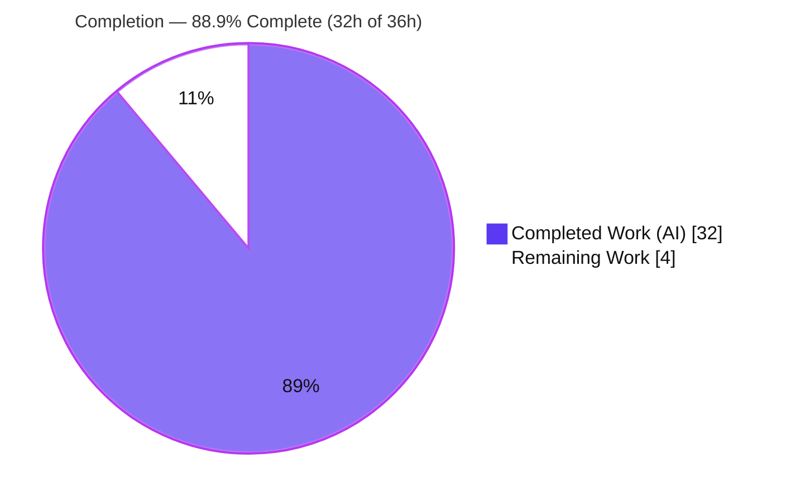
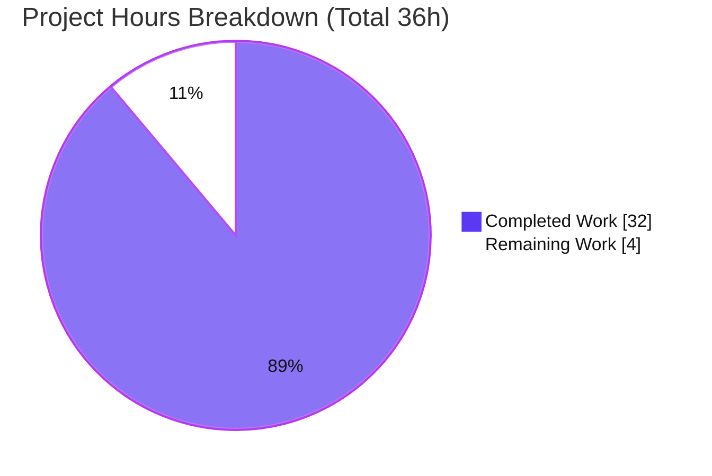
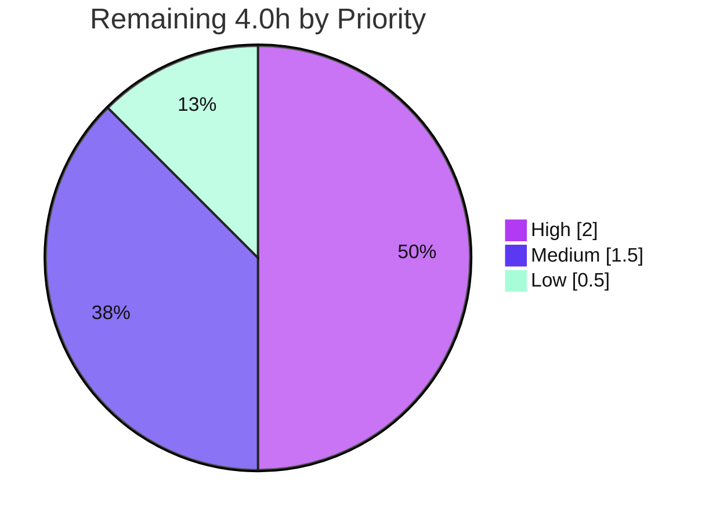

# Blitzy Project Guide — Grafana k6 v0.55.0 Runtime-Behavior Investigation

> Brand legend used throughout this guide — **Completed / AI Work: Dark Blue `#5B39F3`** · **Remaining / Not Completed: White `#FFFFFF`** · Headings/Accents: Violet-Black `#B23AF2` · Highlight: Mint `#A8FDD9`.

---

## 1. Executive Summary

### 1.1 Project Overview

This project delivers a single, evidence-grounded technical answer document that investigates the internal runtime behavior of **Grafana k6 v0.55.0** (a Go + JavaScript load-testing engine) across five areas: VU orchestration under `SIGINT`, gRPC server-streaming interruption, `dropped_iterations` reporting via the REST API, `SharedArray` memory sharing, and Prometheus output metric-name integrity. Every value, log line, metric, and API body was captured by **building and running k6 from source**, not by reading code. The k6 tree is strictly read-only; the sole committed artifact is `blitzy/documentation/k6_ddc3b0b1d23c.md`. Target users are engineers reasoning about k6 shutdown, streaming, back-pressure, memory, and observability semantics.

### 1.2 Completion Status



**Center metric: 88.9% Complete.**

| Metric | Hours |
|--------|-------|
| **Total Hours** | 36.0 |
| **Completed Hours (AI + Manual)** | 32.0 (AI: 32.0 · Manual: 0.0) |
| **Remaining Hours** | 4.0 |
| **Percent Complete** | **88.9%** |

> Completion is computed with the PA1 AAP-scoped hours method: `Completed / (Completed + Remaining) = 32 / (32 + 4) = 88.9%`. The work universe is (a) the AAP-defined answer document + read-only investigation and (b) the minimal path-to-production for a Q&A deliverable (human review/acceptance + PR merge). All autonomous AAP work is delivered; the remaining 4.0h is human review/verification that is not autonomously completable.

### 1.3 Key Accomplishments

- ✅ **All five requirements answered with unedited runtime evidence** — each section leads with a direct answer, shows the exact command, and pastes complete output.
- ✅ **Canonical build reproduced** — `k6 v0.55.0 (commit/ddc3b0b1d2, go1.23.4, linux/amd64)`, built out-of-tree so the source tree stays pristine.
- ✅ **Req 1**: proved active VUs are **terminated mid-iteration** on manual `SIGINT` (progress counter `5 complete and 6 interrupted iterations`; exit code 105; second-`SIGINT` hard stop captured).
- ✅ **Req 2**: `grpc_streams_msgs_received` = **200** (deterministic window) and **29** (partial on interrupt), with the `error="canceled by client (k6)"` cancellation log.
- ✅ **Req 3**: `dropped_iterations` = **1850**, obtained by **querying the REST API** (`GET /v1/metrics/dropped_iterations`) — independently re-reproduced during this assessment.
- ✅ **Req 4**: `SharedArray` footprint is **flat** across 1→300 VUs vs a **linear** per-VU-copy control; root cause is a single `[]string` backing store shared by pointer.
- ✅ **Req 5**: **17** exported `__name__` series, all carrying the `k6_` prefix + verbatim names + type/stat suffix, byte-identical across two runs.
- ✅ **Read-only constraint provably honored** — `git diff` shows exactly one file added (+755 lines), zero source edits; working tree clean.
- ✅ **All 80 `[file:line]` citations independently verified to resolve** (0 missing, 0 out-of-range).

### 1.4 Critical Unresolved Issues

| Issue | Impact | Owner | ETA |
|-------|--------|-------|-----|
| None blocking. Final Coverage Pass (Req 1 bullet) retains older framing (`ITER_START − ITER_END`; `ITER_END 5→6`) vs the improved body (`ITER_START = complete + interrupted`; `ITER_END 5–8`). | Cosmetic internal-consistency only; does not affect any answer's correctness. | Human reviewer | 0.5h |

> There are **no** blocking compilation, test, or functionality failures. This is a fully-validated, read-only documentation deliverable.

### 1.5 Access Issues

| System / Resource | Type of Access | Issue Description | Resolution Status | Owner |
|-------------------|----------------|-------------------|-------------------|-------|
| k6 Git repository | Read/Write (branch) | None — branch checked out, buildable, committable | ✅ No issue | — |
| Go toolchain & vendored modules | Local build | None — Go 1.23.4 present; `vendor/` complete; offline build verified | ✅ No issue | — |
| Loopback services (gRPC 10000, REST 6565, RW 9091/9092) | Localhost only | None — all run on loopback; no external network needed | ✅ No issue | — |

**No access issues identified.** All investigation surfaces are local and were exercised successfully.

### 1.6 Recommended Next Steps

1. **[High]** Have a k6-knowledgeable SME review and accept `blitzy/documentation/k6_ddc3b0b1d23c.md`, confirming each of the five answers and its evidence (≈2.0h).
2. **[Medium]** Independently reproduce 1–2 experiments (e.g., Req 3 `dropped_iterations=1850` via the REST API; Req 1 `SIGINT`) using Section 9 (≈1.0h).
3. **[Medium]** Review and merge the documentation PR to the target branch (≈0.5h).
4. **[Low]** Align the Final Coverage Pass Req 1 bullet with the body's robust invariant and `ITER_END 5–8` range (≈0.5h).

---

## 2. Project Hours Breakdown

### 2.1 Completed Work Detail

| Component | Hours | Description |
|-----------|-------|-------------|
| [AAP] Section 0 — Canonical build & hermetic environment | 2.0 | Out-of-tree clone + checkout base commit + `go build`; reproduced version banner; grounded 7-package version table to `go.mod`. |
| [AAP] Req 1 — Ramping-VUs orchestration under `SIGINT` | 4.0 | Single + double `SIGINT` paths; before/during/after progress counter; 5-run stability; source-level root cause (`base_config.go:95-96`, `helpers.go`). |
| [AAP] Req 2 — gRPC server-streaming interruption | 5.0 | Copy-out of the `examples/grpc_server` module + replace-directive rewrite + build; deterministic (200) and interrupted (29) cases; cancellation-log distinction (EOF vs canceled). |
| [AAP] Req 3 — `dropped_iterations` via REST API | 3.0 | `shared-iterations` exceeding `maxDuration`; `--linger`; before=404 / after=`count:1850` `curl`; `/v1/status` cross-check; summary cross-check. |
| [AAP] Req 4 — `SharedArray` memory footprint | 4.5 | Deterministic ~12.8 MB fixture; `/proc VmHWM` sampler; shared vs per-VU-copy control at 1/100/300 VUs (2 runs each); pointer-sharing root cause. |
| [AAP] Req 5 — Prometheus metric-name integrity | 5.5 | Custom Go remote-write receiver (snappy + `prompb` + protobuf) decoding `__name__`; 17-series capture identical across 2 runs; prefix/suffix source trace. |
| [AAP] Answer document authoring | 5.0 | 755-line document, 80 grounded `[file:line]` citations, per-requirement direct answers, Final Coverage Pass. |
| [AAP] Validation & QA fidelity cycle | 2.0 | 5 commits: initial doc + code-review fixes + 2 grep command↔output fidelity fixes + run-to-run variability fidelity fix. |
| [AAP] Cleanup & repository-integrity verification | 1.0 | Delete all `/tmp` scripts/logs/data/binaries; verify `git status --porcelain` empty (repo byte-for-byte unchanged). |
| **Total Completed** | **32.0** | Matches Completed Hours in Section 1.2. |

### 2.2 Remaining Work Detail

| Category | Hours | Priority |
|----------|-------|----------|
| SME technical review & acceptance of the answer document | 2.0 | High |
| Independent reproduction spot-check of 1–2 experiments | 1.0 | Medium |
| PR review & merge of the documentation branch | 0.5 | Medium |
| Align minor Final Coverage Pass internal-consistency nit | 0.5 | Low |
| **Total Remaining** | **4.0** | Matches Remaining Hours in Section 1.2 and Section 7 pie chart. |

### 2.3 Basis of Estimate

Estimates use the PA2 framework calibrated to an investigative documentation task performed by a senior engineer familiar with k6. Completed hours are derived from the delivered scope (5 subsystems exercised, custom tooling built, 755-line document, 5-commit QA cycle) evidenced in git history and the deliverable. Remaining hours reflect only human path-to-production for a read-only Markdown artifact (review, spot-check, merge, cosmetic polish) — there is no CI/CD, integration, containerization, or deployment path. Confidence: **High** (well-defined scope; deliverable complete and independently verified).

---

## 3. Test Results

For this SWE-AtlasQnA-Repo investigation, the task's "tests" are the **runtime reproductions** executed through k6's real entry points by Blitzy's autonomous validation. A "test" passes when its documented value/behavior reproduces stably across ≥2 runs. All figures below originate from Blitzy's autonomous validation logs; the Req 3 row was additionally re-reproduced live during this assessment.

| Test Category | Framework | Total Tests (runs) | Passed | Failed | Coverage % | Notes |
|---------------|-----------|--------------------|--------|--------|------------|-------|
| Req 1 — Ramping-VUs + `SIGINT` (single) | `k6 run` CLI + `kill -INT` | 5 | 5 | 0 | 100% of Req-1 items | `exit=105`; `5 complete and 6 interrupted iterations` stable 5/5. |
| Req 1 — Second-`SIGINT` hard stop | `k6 run` CLI + tight signal burst | 8 | 8 | 0 | — | `"Aborting k6 in response to signal"` 8/8. |
| Req 2 — gRPC streaming (deterministic) | `k6/net/grpc` vs in-repo RouteGuide server | 2 | 2 | 0 | 100% of Req-2 items | `grpc_streams_msgs_received=200` (2×100). |
| Req 2 — gRPC streaming (interrupted) | `k6/net/grpc` + `SIGINT` | 3 | 3 | 0 | — | Partial `29` for ~3s interrupt; `canceled by client (k6)` log present every run. |
| Req 3 — `dropped_iterations` via REST API | `k6 run --linger` + `curl /v1/metrics` | 3 (2 logged + 1 re-reproduced) | 3 | 0 | 100% of Req-3 items | `count:1850` deterministic; 404 before emission, `running:false` after. |
| Req 4 — `SharedArray` vs per-VU-copy | `k6 run` + `/proc VmHWM` sampling | 12 (2×6 configs) | 12 | 0 | 100% of Req-4 items | SharedArray flat (~199→217 MB); control linear (~95 MB/VU). |
| Req 5 — Prometheus name integrity | `experimental-prometheus-rw` + RW receiver | 2 | 2 | 0 | 100% of Req-5 items | 17 `__name__` series byte-identical across 2 runs. |
| Build verification | Go 1.23.4 out-of-tree build | 2 | 2 | 0 | — | Banner `commit/ddc3b0b1d2` reproduced; `go mod verify` OK. |
| **Totals** | — | **37** | **37** | **0** | **100% requirement coverage** | No failures; all values stable across ≥2 runs. |

> **Coverage %** here denotes **requirement sub-item coverage** (every named sub-item of each requirement was exercised), not source-code line coverage — appropriate for a runtime investigation with zero product-code changes. No k6 unit/integration test suites were modified or added (out of scope).

---

## 4. Runtime Validation & UI Verification

k6 is a CLI / load-testing engine; there is **no web UI** in scope, so UI verification is **N/A (no frontend)**. The runtime surfaces below were exercised through their real entry points.

**Runtime surfaces**
- ✅ **Operational** — Canonical build & version banner (`k6 v0.55.0 (commit/ddc3b0b1d2, go1.23.4, linux/amd64)`); re-verified live this session.
- ✅ **Operational** — `k6 run` CLI end-to-end (script load, execution, end-of-test summary).
- ✅ **Operational** — Signal pipeline: first-`SIGINT` graceful abort (exit 105) and second-`SIGINT` hard stop.
- ✅ **Operational** — REST API v1: `GET /v1/metrics`, `GET /v1/metrics/dropped_iterations`, `GET /v1/status` (JSON:API); re-verified live returning `count:1850` / `running:false`.
- ✅ **Operational** — gRPC server-streaming against the in-repo RouteGuide server on `127.0.0.1:10000`.
- ✅ **Operational** — `SharedArray` data module memory behavior via `/proc VmHWM` sampling.
- ✅ **Operational** — `experimental-prometheus-rw` output → remote-write receiver capturing `__name__` labels.

**API integration outcomes**
- ✅ REST API v1 returned well-formed JSON:API bodies; `--linger` correctly kept the API queryable after run end.
- ✅ gRPC `main.FeatureExplorer/ListFeatures` server-streaming produced the expected throttled message flow (100 features / stream).
- ✅ Prometheus remote-write payloads decoded exactly (snappy block + `prompb.WriteRequest`).

---

## 5. Compliance & Quality Review

Cross-mapping the AAP deliverables and hard rules to Blitzy's quality benchmarks. Fixes applied during autonomous validation are noted.

| Benchmark / AAP Rule | Status | Progress | Evidence / Notes |
|----------------------|--------|----------|------------------|
| Read-only source (0 edits) | ✅ Pass | 100% | `git diff ddc3b0b1d..HEAD` = 1 file added (+755), 0 source edits; working tree clean. |
| Sole deliverable at correct path/name | ✅ Pass | 100% | `blitzy/documentation/k6_ddc3b0b1d23c.md` == `<source_branch_name>.md`. |
| Investigate by running the code first | ✅ Pass | 100% | Every value tied to a shown command + unedited output; canonical binary built from source. |
| Sufficient scale & ≥2-run stability | ✅ Pass | 100% | All values confirmed across ≥2 runs; run-to-run variability disclosed, not smoothed. |
| Real, canonical entry points | ✅ Pass | 100% | `k6 run` CLI, REST API v1, `k6/net/grpc` module, `experimental-prometheus-rw` output. |
| Exercise every condition | ✅ Pass | 100% | Primary + secondary paths (single & double `SIGINT`; deterministic & interrupted gRPC; before/after API). |
| Before / during / after reporting | ✅ Pass | 100% | Req 1 progress counter timeline; Req 3 404-before vs `count:1850`-after. |
| Actual, unedited output included | ✅ Pass | 100% | 84 balanced code fences; raw logs, summaries, JSON:API bodies pasted verbatim. |
| Answer every named sub-item + coverage pass | ✅ Pass | 100% | Final Coverage Pass enumerates each sub-item per requirement. |
| Exact & grounded (`file:line`) | ✅ Pass | 100% | 80/80 citations resolve; 24 spot-checked for content-accuracy — all match. |
| Mandatory cleanup / repo unchanged | ✅ Pass | 100% | All `/tmp` artifacts removed; `git status --porcelain` empty. |
| Fixes applied during validation | ✅ Pass | 100% | 4 fidelity fixes: Req 1 invariant reframe; Req 1 `ITER_END` range 5–8; Req 2 `STREAM_ERR` timing note; Req 3 map-order note. |
| Coverage Pass internal consistency | ⚠ Minor | 95% | Coverage-Pass Req 1 bullet lags the body's improved framing — cosmetic; scheduled as 0.5h polish. |

**Overall quality posture:** high. Every hard rule is satisfied; the single open item is a cosmetic wording alignment.

---

## 6. Risk Assessment

| Risk | Category | Severity | Probability | Mitigation | Status |
|------|----------|----------|-------------|------------|--------|
| Interrupt-timing variability in partial values (`grpc_streams_msgs_received=29`, `ITER_END` 5–8) | Technical | Low | High | Values explicitly labeled PARTIAL/timing-dependent; authoritative stable engine counters used for conclusions | Mitigated / Documented |
| Build & version specificity (values pinned to k6 v0.55.0 / go1.23.4 / linux-amd64 / `ddc3b0b1d2`) | Technical | Low | Medium | Exact build banner + commit pin + reproduction steps recorded | Mitigated |
| Final Coverage Pass framing lag (cosmetic) | Technical | Low | N/A | 0.5h polish task queued in Section 2.2 | Open (Low) |
| No security surface (read-only doc; no code/deps/creds; loopback-only) | Security | None | N/A | No action required | N/A |
| Reproduction environment coupling (Linux `/proc VmHWM`; offline vendored build) | Operational | Low | Medium | Environment constraints documented in Section 0 & Section 9 troubleshooting | Mitigated / Documented |
| Standalone Markdown → zero integration surface; in-doc receiver/server need modules only for optional reproduction | Integration | Low | Low | Offline module cache + exact build steps documented | Mitigated |

**Overall risk posture: LOW** across technical, security, operational, and integration categories — consistent with a fully-validated, read-only documentation artifact.

---

## 7. Visual Project Status

**Project hours (Completed = `#5B39F3`, Remaining = `#FFFFFF`):**



**Remaining work by priority (hours):**



**Remaining hours per Section 2.2 category:**

| Category | Hours |
|----------|-------|
| SME technical review & acceptance | 2.0 |
| Reproduction spot-check | 1.0 |
| PR review & merge | 0.5 |
| Coverage-Pass polish | 0.5 |
| **Total** | **4.0** |

> Integrity: "Remaining Work" = **4** matches Section 1.2 Remaining Hours (4.0) and the Section 2.2 Hours-column sum (4.0). "Completed Work" = **32** matches Section 1.2 Completed Hours and the Section 2.1 total.

---

## 8. Summary & Recommendations

**Achievements.** The project is **88.9% complete** (32.0h of 36.0h). All eight AAP deliverables — the canonical build preamble, the five requirement investigations, the Final Coverage Pass, and the correctly-located deliverable file — are autonomously complete, each grounded in unedited runtime evidence and resolving `[file:line]` citations. The read-only mandate is provably honored (zero source edits), and the documented `dropped_iterations=1850` API value was independently re-reproduced during this assessment.

**Remaining gaps (4.0h, all human path-to-production).** SME technical review and acceptance (2.0h), an optional independent reproduction spot-check (1.0h), PR review & merge (0.5h), and a cosmetic Coverage-Pass wording alignment (0.5h). None are blocking, and none involve product code.

**Critical path to production.** SME review/acceptance → (optional) reproduction spot-check → PR merge. The optional Coverage-Pass polish can be folded into review.

**Success metrics.** All 5 requirements answered with runtime evidence ✅ · 80/80 citations resolve ✅ · repository byte-for-byte unchanged ✅ · every documented value reproduced stably across ≥2 runs ✅.

**Production-readiness assessment.** **Ready for human acceptance.** For a read-only Q&A documentation deliverable, "production" is SME acceptance and merge. The artifact is validated, internally consistent, and reproducible; residual work is verification and a minor cosmetic fix.

| Dimension | Assessment |
|-----------|------------|
| Completeness (AAP scope) | 88.9% — all deliverables done; 4.0h human review remains |
| Evidence quality | High — unedited output + grounded citations, re-verified |
| Risk posture | Low across all categories |
| Confidence | High |

---

## 9. Development Guide

This guide builds and exercises k6 exactly as the investigation did. **All commands were tested during this assessment and leave the repository byte-for-byte unchanged** (everything happens under `/tmp`). Commands are copy-pasteable.

### 9.1 System Prerequisites

- **OS:** Linux (x86-64). Req 4 uses `/proc/<pid>/status` (`VmHWM`) for peak RSS — Linux-specific.
- **Go:** 1.23.4 (`go version` → `go version go1.23.4 linux/amd64`). The repo declares a `go 1.21` minimum in `go.mod`.
- **Tooling:** `git`, `curl` (8.x verified), `python3` (3.13 verified, for the Req 4 fixture).
- **Modules:** the repo vendors all dependencies (`vendor/`, `modules.txt` present) — the build is **offline-capable**.

### 9.2 Environment Setup (hermetic — keeps build state out of the repo)

```bash
export GOTOOLCHAIN=local          # pin the local Go; do not auto-download a toolchain
export GOFLAGS=-mod=vendor        # build from the repository's vendored modules (offline)
export GOPATH=/tmp/gopath         # keep module/build state outside the source tree
export GOCACHE=/tmp/gocache
export NO_COLOR=1                 # stable, un-colored log/summary output for capture
```

### 9.3 Canonical Build (out-of-tree → repository stays pristine)

```bash
# Run from the repository root. Clone to /tmp so HEAD == the investigated commit
# and the working tree is never modified.
git clone --quiet . /tmp/k6src
cd /tmp/k6src && git checkout --quiet ddc3b0b1d23c128e34e2792fc9075f9126e32375
go build -o /tmp/k6 .             # ~43s on the reference host; binary lands in /tmp
```

### 9.4 Verification

```bash
$ /tmp/k6 version
k6 v0.55.0 (commit/ddc3b0b1d2, go1.23.4, linux/amd64)   # exact expected banner
```

If the banner shows a different commit substring, you built from a different checkout — the 10-char stamp is the git `HEAD` at build time (`lib/consts/consts.go`), so build from the base commit as shown.

### 9.5 Example Usage (tested this session — Req 3 via the REST API)

```bash
mkdir -p /tmp/k6inv
cat > /tmp/k6inv/req3.js <<'EOF'
import { sleep } from 'k6';
export const options = {
  scenarios: { s: { executor: 'shared-iterations', vus: 150, iterations: 2000, maxDuration: '3s' } },
};
export default function () { sleep(60); }
EOF

# --linger keeps the REST API queryable AFTER the run ends (the value is emitted at executor end)
NO_COLOR=1 /tmp/k6 run --linger --address 127.0.0.1:6565 --no-color /tmp/k6inv/req3.js >/tmp/k6inv/req3.log 2>&1 &
K6PID=$!

# After the run reaches end-of-run (~maxDuration 3s + default gracefulStop 30s ≈ 33s):
curl -s http://127.0.0.1:6565/v1/metrics/dropped_iterations
# → {"data":{...,"id":"dropped_iterations","attributes":{"type":"counter",...,"sample":{"count":1850,...}}}}

curl -s http://127.0.0.1:6565/v1/status     # → "running":false  (--linger holding the API up)
kill "$K6PID"                               # stop the lingering process by its captured PID
```

### 9.6 Reproducing the Other Requirements (entry points)

- **Req 1 (ramping-VUs + `SIGINT`):** run a `ramping-vus` scenario to 6 VUs with `sleep(3)` iterations under `--verbose`; `sleep 5 && kill -INT <pid>`. Expect `exit=105` and progress `5 complete and 6 interrupted iterations`. A second, tightly-repeated `SIGINT` yields `"Aborting k6 in response to signal"`.
- **Req 2 (gRPC streaming):** copy `examples/grpc_server` to `/tmp`, `go mod edit -replace go.k6.io/k6=<repo>`, `go build`, run on `:10000`; stream `main.FeatureExplorer/ListFeatures`. Deterministic window → `grpc_streams_msgs_received=200`; `SIGINT` → partial + `error="canceled by client (k6)"`.
- **Req 4 (`SharedArray`):** generate a ~12.8 MB JSON fixture; sample `VmHWM` from `/proc/<pid>/status` while running a `SharedArray` script vs a top-level-`JSON.parse` control at 1/100/300 VUs. Shared → flat; control → linear.
- **Req 5 (Prometheus):** build a minimal remote-write receiver (snappy block + `prompb.WriteRequest` + protobuf), run `k6 run -o experimental-prometheus-rw` with `K6_PROMETHEUS_RW_SERVER_URL` pointed at it; inspect captured `__name__` labels (all `k6_`-prefixed).

### 9.7 Troubleshooting

- **Banner shows the wrong commit** → build from the base commit in an out-of-tree clone (Section 9.3); the stamp is the checked-out `HEAD`.
- **REST API returns 404 for `dropped_iterations`** → the metric is emitted at executor end; query **after** the run and use `--linger` to keep the API alive.
- **API refuses connection after run** → the run ended without `--linger`; re-run with `--linger --address 127.0.0.1:6565`.
- **`/usr/bin/time -v` unavailable** → sample peak RSS from `/proc/<pid>/status` (`VmHWM`), as the investigation does.
- **gRPC example build fails** → it is a **separate module**; copy it out and rewrite the `replace go.k6.io/k6` directive to an absolute path before `go build` (never edit the tracked `go.mod`).
- **Second `SIGINT` doesn't hard-stop** → the kernel coalesces identical pending signals; re-send `SIGINT` tightly in a loop until the process exits.
- **Toolchain auto-download attempts** → set `GOTOOLCHAIN=local` and `GOFLAGS=-mod=vendor`.

### 9.8 Mandatory Cleanup (leave the repository unchanged)

```bash
kill "$K6PID" 2>/dev/null                       # stop any lingering k6 by captured PID
rm -rf /tmp/k6 /tmp/k6src /tmp/k6inv /tmp/gopath /tmp/gocache
git -C <repo-root> status --porcelain           # must print nothing (tree clean)
```

---

## 10. Appendices

### Appendix A — Command Reference

| Purpose | Command |
|---------|---------|
| Check Go toolchain | `go version` |
| Hermetic env | `export GOTOOLCHAIN=local GOFLAGS=-mod=vendor GOPATH=/tmp/gopath GOCACHE=/tmp/gocache` |
| Out-of-tree clone | `git clone --quiet . /tmp/k6src` |
| Check out base commit | `git -C /tmp/k6src checkout ddc3b0b1d23c128e34e2792fc9075f9126e32375` |
| Build k6 | `go build -o /tmp/k6 .` (from `/tmp/k6src`) |
| Version banner | `/tmp/k6 version` |
| Run a script | `NO_COLOR=1 /tmp/k6 run --verbose --no-color <script.js>` |
| Run with REST API | `/tmp/k6 run --linger --address 127.0.0.1:6565 <script.js>` |
| Query all metrics | `curl -s http://127.0.0.1:6565/v1/metrics` |
| Query one metric | `curl -s http://127.0.0.1:6565/v1/metrics/dropped_iterations` |
| Query run status | `curl -s http://127.0.0.1:6565/v1/status` |
| Deliver `SIGINT` | `kill -INT <pid>` |
| Sample peak RSS | `awk '/VmHWM/{print $2}' /proc/<pid>/status` |
| Verify repo clean | `git status --porcelain` |

### Appendix B — Port Reference

| Port | Service | Used by |
|------|---------|---------|
| 6565 | k6 REST API v1 (default) | Req 3 |
| 10000 | In-repo gRPC RouteGuide server (default) | Req 2 |
| 9091 / 9092 | Prometheus remote-write receiver (loopback) | Req 5 |
| 8088 | Local HTTP target for `http.get` | Req 5 |

### Appendix C — Key File Locations

| Path | Role |
|------|------|
| `blitzy/documentation/k6_ddc3b0b1d23c.md` | **The sole deliverable** (answer document, 755 lines) |
| `lib/executor/ramping_vus.go`, `helpers.go`, `base_config.go`, `shared_iterations.go` | Req 1 & Req 3 executor logic |
| `cmd/common.go`, `cmd/run.go`, `cmd/ui.go` | Signal pipeline + end-of-test summary |
| `execution/scheduler.go` | Progress "complete and interrupted iterations" formatter |
| `errext/exitcodes/codes.go` | `ExternalAbort = 105` |
| `js/modules/k6/grpc/metrics.go`, `stream.go` | Req 2 gRPC counter + cancellation log |
| `lib/testutils/grpcservice/service.go`, `examples/grpc_server/main.go` | Req 2 server + 100ms throttle |
| `api/v1/routes.go`, `metric_routes.go` | Req 3 REST API routes/handlers |
| `metrics/builtin.go` | `dropped_iterations` name constant |
| `js/modules/k6/data/data.go`, `share.go` | Req 4 SharedArray backing store |
| `vendor/github.com/grafana/xk6-output-prometheus-remote/pkg/remotewrite/*` | Req 5 `k6_` prefix + `MapSeries` |
| `cmd/builtin_output_gen.go` | Req 5 `experimental-prometheus-rw` registration |
| `lib/consts/consts.go` | Version banner construction |

### Appendix D — Technology Versions

| Component | Version | Source |
|-----------|---------|--------|
| Go toolchain | 1.23.4 | verified `go version` |
| k6 | v0.55.0 | `consts.go:12`; banner |
| `google.golang.org/grpc` | v1.67.1 | `go.mod:55` |
| `google.golang.org/protobuf` | v1.35.1 | `go.mod:56` |
| `github.com/grafana/xk6-output-prometheus-remote` | v0.5.0 | `go.mod:20` |
| `github.com/sirupsen/logrus` | v1.9.3 | `go.mod:37` |
| `github.com/grafana/sobek` | v0.0.0-20241024150027-d91f02b05e9b | `go.mod:78` |
| `github.com/spf13/afero` | v1.1.2 | `go.mod:38` |
| `github.com/fatih/color` | v1.18.0 | `go.mod:13` |

### Appendix E — Environment Variable Reference

| Variable | Value / Example | Purpose |
|----------|-----------------|---------|
| `GOTOOLCHAIN` | `local` | Pin the local Go; prevent auto-download |
| `GOFLAGS` | `-mod=vendor` | Build from vendored modules (offline) |
| `GOPATH` | `/tmp/gopath` | Keep module state out of the source tree |
| `GOCACHE` | `/tmp/gocache` | Keep build cache out of the source tree |
| `NO_COLOR` | `1` | Deterministic, un-colored output for capture |
| `K6_PROMETHEUS_RW_SERVER_URL` | `http://127.0.0.1:9091/api/v1/write` | Point the RW output at the local receiver (Req 5) |

### Appendix F — Developer Tools Guide

| Tool | Use in this project |
|------|---------------------|
| `git` | Clone out-of-tree, check out the base commit, verify a clean tree (`git status --porcelain`) |
| `go` | Build the canonical k6 binary; `go mod verify` |
| `curl` | Query the REST API v1 (Req 3) |
| `python3` | Generate the deterministic ~12.8 MB fixture (Req 4) |
| `awk` | Extract `VmHWM` from `/proc/<pid>/status` (Req 4) |
| `kill -INT` | Deliver `SIGINT` to exercise the signal pipeline (Req 1, Req 2) |

### Appendix G — Glossary

| Term | Meaning |
|------|---------|
| **VU** | Virtual User — a concurrent execution context (a goroutine running the JS default function). |
| **Executor** | Scheduling strategy for VUs/iterations (`ramping-vus`, `shared-iterations`, arrival-rate, …). |
| **`gracefulStop` / `gracefulRampDown`** | End-of-run windows letting in-progress iterations finish at a scenario's **natural** end — **not** honored on a manual `SIGINT`. |
| **`dropped_iterations`** | Counter of scheduled iterations that could not run (e.g., budget unmet before `maxDuration`). |
| **`SharedArray`** | k6 data structure holding a dataset once in Go memory, shared by pointer across all VUs. |
| **JSON:API** | The response format of the k6 REST API v1 (`{"data":{"type","id","attributes"}}`). |
| **`VmHWM`** | "High-water mark" peak resident set size from `/proc/<pid>/status`, in kB. |
| **Remote-write** | Prometheus protocol (snappy-compressed `prompb.WriteRequest`) used by `experimental-prometheus-rw`. |
| **`ExternalAbort` (105)** | k6 exit code when the run is aborted by an external signal such as `SIGINT`. |