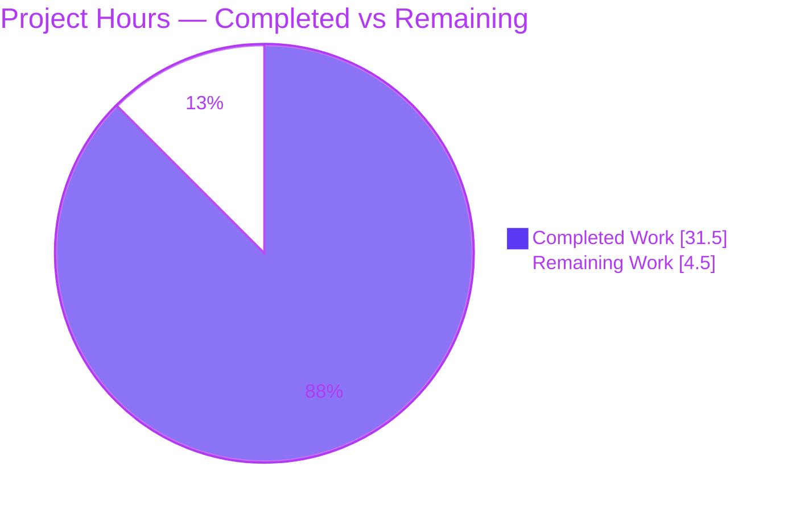
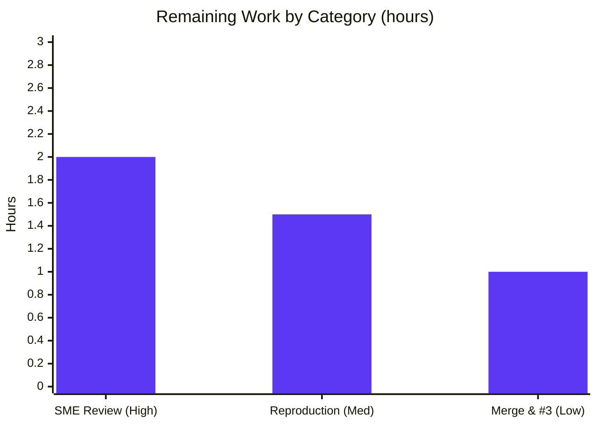

# Blitzy Project Guide

> **Project:** Investigative Q&A — k6 `ramping-vus` executor concurrency & execution-segment analysis
> **Repository:** `grafana/k6` (module `go.k6.io/k6`) · **Source commit under investigation:** `ddc3b0b1d23c`
> **Branch:** `blitzy-2b115e0b-f0ab-4e78-8f3c-96e669b0b391` · **HEAD:** `e622261d3`
> **Deliverable:** `blitzy/documentation/k6_ddc3b0b1d23c.md` (single new file, read-only investigation)
>
> **Legend / Brand Colors:** <span style="color:#5B39F3">■</span> Completed / AI Work = Dark Blue `#5B39F3` · <span style="color:#B23AF2">■</span> White `#FFFFFF` = Remaining / Not Completed · Headings accent = Violet-Black `#B23AF2` · Highlight = Mint `#A8FDD9`

---

## 1. Executive Summary

### 1.1 Project Overview

This project is a **read-only, empirical Q&A investigation** into a user's suspected concurrency bug in k6's `ramping-vus` executor at commit `ddc3b0b1d23c`. The user reported five symptoms — "stuck" VUs, a scheduled-vs-graceful handler count mismatch, VUs overrunning `gracefulStop` on Ctrl+C, execution-segment counts appearing to exceed the configured maximum across three instances, and a suspected handler-goroutine race / VU-buffer leak. The deliverable is a single evidence-backed markdown document that decomposes and answers each sub-part, grounded in exact `file:line` citations and verbatim runtime output (Go race detector, segment-sum observation, live SIGINT reproduction). The audience is the reporting engineer and k6 maintainers. The scope is strictly documentation: no source code is modified.

### 1.2 Completion Status


| Metric | Hours | Notes |
|---|---:|---|
| **Total Hours** | **36.0** | AAP-scoped investigation + document + validation + path-to-production |
| **Completed Hours (AI + Manual)** | **31.5** | AI (autonomous): 31.5 · Manual: 0.0 |
| **Remaining Hours** | **4.5** | Human review, reproduction & merge only |
| **Percent Complete** | **87.5%** | `31.5 / 36.0 × 100 = 87.5%` |

> **Completion basis (PA1):** Completion % measures only AAP-scoped work + path-to-production. All 11 AAP-scoped work items are **Completed**; the 4.5h remaining is entirely human path-to-production (review/reproduce/merge). No AAP-scoped engineering remains.

### 1.3 Key Accomplishments

- ✅ **Single deliverable created & committed** — `blitzy/documentation/k6_ddc3b0b1d23c.md` (493 lines, ~39 KB), 11 sections, all five sub-parts answered with explicit **by-design vs. defect** verdicts.
- ✅ **All five sub-parts answered empirically** — each tied to exact `file:line` references and/or verbatim observed output.
- ✅ **Headline conclusions reproduced** — Go race detector: **`DATA RACE occurrences: 0`**; segment sums **always equal** the configured maximum; Ctrl+C abort → **exit code 105**.
- ✅ **Factually-incorrect belief corrected** — per-instance segment counts are asymmetric (`[34 33 33]`) but sum exactly to the maximum; they never exceed it.
- ✅ **Citation accuracy verified** — 25+ `file:line` citations independently spot-checked in this review; **all exact**. Final Validator corrected **5** citation/output discrepancies.
- ✅ **Read-only integrity guaranteed** — working tree clean; `git diff --name-status ddc3b0b1d23c HEAD` shows only the one added document; all transient observation scripts removed.
- ✅ **Offline reproducibility** — vendored build + tests run fully offline (`GOFLAGS=-mod=vendor GOPROXY=off`); reproduced this review with RC=0.

### 1.4 Critical Unresolved Issues

There are **no critical blocking issues**. The deliverable is complete, validated, and committed. One non-blocking item is tracked transparently for reviewer disposition:

| Issue | Impact | Owner | ETA |
|---|---|---|---|
| Sub-part #3 `gracefulStop` overrun is *explained from the code path, not timed* (the live reproduction used a cooperative `sleep()` that cancelled promptly, so no single iteration was measured outliving `gracefulStop`). | **Low / Non-blocking.** The abort path *is* reproduced (exit 105); the overrun is a correct inference from cooperative-cancellation semantics and is explicitly flagged in the document's Caveats + Coverage sections. | Reviewer / SME | Within HT-3 (1.0h) |
| Two pre-existing baseline test failures in unrelated packages (`js/modules/k6/grpc` TLS, `js/modules/k6/http` OCSP). | **None on this deliverable.** Out-of-scope, untouched, TLS-fixture/crypto matters — cannot be fixed without modifying forbidden files. | k6 maintainers (out of scope) | N/A |

### 1.5 Access Issues

**No access issues identified.** The repository is fully accessible, the offline vendored build works (`GOPROXY=off`), the Go toolchain and `gcc` (for the CGO-based race detector) are present, and no external credentials or third-party API access are required for this documentation deliverable.

| System/Resource | Type of Access | Issue Description | Resolution Status | Owner |
|---|---|---|---|---|
| `grafana/k6` repository | Read/Write (branch) | None — branch accessible, tree clean | ✅ No issue | — |
| Go module proxy | Network (build) | Not required — vendored offline build (`GOPROXY=off`) | ✅ No issue (offline) | — |
| Go race detector (CGO) | Toolchain | Requires `gcc` + `CGO_ENABLED=1` — both present | ✅ No issue | — |

### 1.6 Recommended Next Steps

1. **[High]** Perform SME technical review of `blitzy/documentation/k6_ddc3b0b1d23c.md` — verify the five by-design/defect verdicts and confirm citations resolve at commit `ddc3b0b1d23c`. *(HT-1, 2.0h)*
2. **[Medium]** Independently reproduce the key empirical claims — offline build, cited race suite (expect 0 races), segment-sum (expect `sum == maxVUs`), SIGINT (expect exit 105). *(HT-2, 1.5h)*
3. **[Low]** Merge the single-file addition and decide whether the flagged sub-part #3 overrun warrants a dedicated non-cooperative-iteration demonstration (a separate follow-up task, outside this read-only AAP). *(HT-3, 1.0h)*
4. **[Low]** If stakeholders want the reported symptoms *changed* rather than *explained*, open a new (non-read-only) engineering task — the investigation concludes the behaviors are intended by design.

---

## 2. Project Hours Breakdown

### 2.1 Completed Work Detail

Every completed component traces to a specific AAP requirement or the `SWE-AtlasQnA-Repo` rule. All work below is autonomous (AI).

| Component | Hours | Description |
|---|---:|---|
| Environment & build foundation | 2.0 | Install/confirm Go `go1.23.12` + `gcc` (CGO); offline vendored build of k6 `v0.55.0`; trace version-stamp mechanism (`consts.go:31/35/52`). [AAP §0.4/§0.5.1] |
| Sub-part #1 — "Stuck" VUs | 3.0 | Trace VU lifecycle state machine (`vu_handle.go:15-22`, `:157-158`) and `reserveVUsForGracefulRampDowns` (`ramping_vus.go:307`); verdict: transitional draining, by design. [AAP §0.1 SP1] |
| Sub-part #2 — Handler counts | 2.5 | Compare three counters — raw-planned (`:679`), ceiling (`:668`), progress-only `activeVUsCount` (`:569`); verdict: by design. [AAP §0.1 SP2] |
| Sub-part #3 — Ctrl+C abort | 4.0 | Trace full signal path `common.go:97 → run.go:349/354 → abort.go → scheduler.go:497 → helpers.go:165-174`; live SIGINT reproduction (exit 105, "3 interrupted iterations"). [AAP §0.1 SP3] |
| Sub-part #4 — Execution segments | 2.5 | Build/run/delete segment-sum observation across `0,1/3,2/3,1`; capture per-segment counts + sums; correct the "exceeds max" belief (`execution_segment.go:734`). [AAP §0.1 SP4] |
| Sub-part #5 — Race / buffer leak | 3.5 | Happens-before analysis (`:549` synchronous → `:554` spawned); run Go race detector; confirm balanced `wg.Add`/`Done`/`Wait`. [AAP §0.1 SP5] |
| Verbatim evidence capture | 2.0 | Capture & format all real output blocks (race detector, `BLITZYOBS`, SIGINT, verbose graceful tests, run banner). [AAP §0.7.2] |
| Web corroboration | 2.0 | Validate against official Grafana k6 docs / release notes / issue #2149 (supporting-only, short quotes + links). [AAP §0.2.2] |
| Answer document authoring | 5.0 | Synthesize the 493-line/39 KB document: 11 sections, terminology map, TL;DR, coverage pass, honesty/caveats. [AAP §0.7.1/3/4] |
| Read-only cleanup & git integrity | 1.0 | Remove transient scripts; verify clean tree; confirm only the doc differs from `ddc3b0b1d23c`. [AAP §0.7.5] |
| Final validation & citation audit | 4.0 | Re-verify every `file:line` + output block; fix 5 discrepancies; re-run cited race suite (RC=0); well-formedness check. [AAP path-to-prod QA] |
| **Total Completed** | **31.5** | **Matches Section 1.2 Completed Hours** |

### 2.2 Remaining Work Detail

All remaining work is human path-to-production; no AAP-scoped engineering remains.

| Category | Hours | Priority |
|---|---:|---|
| SME technical review of answer document (verify verdicts, citations resolve at `ddc3b0b1d23c`, corrected #4) | 2.0 | High |
| Independent reproduction of empirical claims (offline build, race suite, segment-sum, SIGINT) | 1.5 | Medium |
| PR merge & sub-part #3 disposition (decide on optional non-cooperative overrun demo; then merge) | 1.0 | Low |
| **Total Remaining** | **4.5** | **Matches Section 1.2 Remaining Hours & Section 7 pie** |

### 2.3 Hours Reconciliation

- **Completed (2.1)** = **31.5h**
- **Remaining (2.2)** = **4.5h**
- **Total (2.1 + 2.2)** = **36.0h** = **Total Hours (Section 1.2)** ✅
- **Completion** = `31.5 / 36.0 × 100` = **87.5%** ✅
- **Remaining hours identical** across Sections 1.2, 2.2, and 7 = **4.5h** ✅

---

## 3. Test Results

All tests below originate from **Blitzy's autonomous validation logs** for this project and were re-executed during this project-guide review. These are **targeted grounding tests** cited by the answer document (not a coverage-driven suite), so line-coverage percentages are not the objective and are marked N/A.

| Test Category | Framework | Total Tests | Passed | Failed | Coverage % | Notes |
|---|---|---:|---:|---:|:---:|---|
| Concurrency / Race Detection | `go test -race` (CGO) | 6 | 6 | 0 | N/A | `DATA RACE occurrences: 0`; `ok go.k6.io/k6/lib/executor` ~7.06–7.08s. Grounds sub-part #5. |
| Executor graceful-stop / ramp-down | `go test -v` | 4 | 4 | 0 | N/A | `GracefulStopWaits` 1.50s, `GracefulStopStops` 2.50s, `GracefulRampDown` 2.50s, `RampDownNoWobble` 6.02s. Grounds #1/#3. |
| Execution-segment distribution | `go test` | 2 | 2 | 0 | N/A | `TestSumRandomSegmentSequenceMatchesNoSegment` + transient `TestBlitzyObsSegmentSum` (`BLITZYOBS … sum==maxVUs`). Grounds #4. |
| Compilation / Build | `go build` | 1 | 1 | 0 | N/A | In-scope packages + full k6 binary; `BUILD_RC=0`, `v0.55.0`. |
| **Totals (as presented)** | — | **13** | **13** | **0** | **N/A** | See overlap note below. |

**Notes & integrity:**
- The three tests `GracefulStopWaits`, `GracefulStopStops`, and `RampDownNoWobble` appear in **both** the race-detection run and the verbose graceful run (executed under different flags); they are counted in each row by execution context. `SumRandomSegmentSequenceMatchesNoSegment` likewise appears in the race run and the segment row.
- **Re-verified in this review:** cited race suite → RC=0, 0 races, `7.077s`; segment-sum cited test → RC=0.
- **Out-of-scope (documented, not fixed):** two pre-existing baseline failures in unrelated packages — `js/modules/k6/grpc` (`TestClient_TlsParameters/*`) and `js/modules/k6/http` (`TestRequestAndBatchTLS/ocsp_stapled_good`). These are TLS-fixture/crypto matters, irrelevant to this deliverable, and cannot be addressed without modifying forbidden out-of-scope files.

---

## 4. Runtime Validation & UI Verification

k6 is a **CLI load-testing tool**; there is **no web UI** in scope, so UI verification is **N/A**. Runtime validation focused on building and running the binary and reproducing each observable behavior.

**Build & version**
- ✅ **Operational** — Offline vendored build succeeds (`go build -o /tmp/k6bin .`, `BUILD_RC=0`).
- ✅ **Operational** — Version string: `k6 v0.55.0 (commit/ddc3b0b1d2, go1.23.12, linux/amd64)` for the commit under investigation; building HEAD reports `commit/e622261d35` (first 10 chars of the built revision) — mechanism confirmed via `consts.go:31/35`.

**Sub-part behaviors reproduced**
- ✅ **Operational** — Normal run banner: `5 max VUs, 9s max duration (incl. graceful stop)`; `Up to 5 looping VUs for 4s over 2 stages (gracefulRampDown: 10s, gracefulStop: 5s)` (confirms `9s = 4s + 5s`, `helpers.go:172`).
- ✅ **Operational** — SIGINT/Ctrl+C abort: VU progression `1/3 → 2/3 → 3/3 → 3/3 → 0/3`, `3 interrupted iterations`, error `test run was aborted because k6 received a 'interrupt' signal`, **exit code 105** (`ExternalAbort`, `codes.go:41`).
- ✅ **Operational** — Segment striping: `maxVUs=100 → [34 33 33]`, `10 → [4 3 3]`, `7 → [3 2 2]`, `5 → [2 2 1]`, `1 → [1 0 0]`; every `sum == maxVUs`.
- ✅ **Operational** — Race detector: `DATA RACE occurrences: 0` across the six cited tests.

**Partial / flagged**
- ⚠ **Partial** — Sub-part #3 `gracefulStop` *overrun* for **non-cooperative** work is **explained, not timed**. The abort path is fully operational and reproduced (exit 105); a single iteration provably outliving `gracefulStop` was not measured because the reproduction used cooperative `sleep()` (cancelled promptly). Correctly flagged in the document's Caveats.

**API integration**
- ✅ **N/A** — No external service integration; k6's optional local REST API (`:6565`) was not required for the investigation.

---

## 5. Compliance & Quality Review

Cross-mapping the AAP deliverable and the governing `SWE-AtlasQnA-Repo` rule to Blitzy quality benchmarks. Fixes applied during autonomous validation are noted.

| Benchmark / AAP Directive | Requirement | Status | Progress | Evidence / Fixes |
|---|---|:---:|:---:|---|
| R1 — Deliverable | Create `blitzy/documentation/<branch>.md` | ✅ PASS | 100% | `k6_ddc3b0b1d23c.md` present & committed |
| R2 — Investigate by running first | Build/run first; quote verbatim output | ✅ PASS | 100% | 20 code-fence output blocks; race detector, `BLITZYOBS`, SIGINT, run banner |
| R3 — Answer every part | All sub-parts + coverage pass | ✅ PASS | 100% | 5/5 sub-parts; coverage-pass checklist all `[x]` |
| R4 — Be exact & grounded | `file:line` + exact literals; flag unverified | ✅ PASS | 100% | 25+ citations verified exact; #3 overrun flagged as unverified |
| R5 — Read-only scope | No source modified; only doc added; scripts removed | ✅ PASS | 100% | `git status` clean; diff = single added file; 0 transient artifacts |
| Empirical-first methodology | Claims from observation, not reading alone | ✅ PASS | 100% | Binary built; tests run under `-race`; SIGINT reproduced |
| Citation accuracy | Every `file:line` resolves exactly | ✅ PASS | 100% | **5 discrepancies fixed** (vu_handle 157-158; helpers 165-167 verbatim; segment 762-764; go.mod:5; version provenance) |
| Document well-formedness | Balanced code fences; parseable markdown | ✅ PASS | 100% | 20 balanced code-fence pairs (all terminated) |
| Honesty / distinguish design vs defect | Flag unverifiable; label by-design vs bug | ✅ PASS | 100% | Caveats section; explicit by-design verdicts per sub-part |
| Human SME sign-off | Independent acceptance | ⬜ OUTSTANDING | 0% | Pending — HT-1 (2.0h) |

**Overall compliance:** 9/9 automated/authoring benchmarks **PASS**; the single outstanding item is human SME sign-off (path-to-production).

---

## 6. Risk Assessment

Overall posture: **LOW**. A read-only documentation deliverable adds no executable code, no dependencies, and leaves the source tree byte-identical to `ddc3b0b1d23c` — eliminating most traditional software risk classes. The dominant risk is documentation accuracy, heavily mitigated by exact-citation verification and empirical grounding.

| Risk | Category | Severity | Probability | Mitigation | Status |
|---|---|:---:|:---:|---|:---:|
| Citation line numbers pinned to `ddc3b0b1d23c` may drift if reviewed at a different revision | Technical | Low | Low | Caveats instruct opening at the exact commit; source byte-identical at HEAD (verified) | Mitigated |
| Sub-part #3 overrun is *explained* (code-path inference), not *timed* (no non-cooperative measurement) | Technical | Medium | Medium | Explicitly flagged in Caveats + Coverage; abort path reproduced (exit 105); reviewer disposition = HT-3 | Open |
| Conclusions scoped to `ddc3b0b1d23c`; a later upstream report (issue #4661, 2025) notes a similar symptom class | Technical | Low | Low | Document scopes findings to this commit; frames #4661 as context, not proof; 0 races + exact sums govern | Mitigated |
| Security exposure | Security | None | N/A | No attack surface: no code, no deps, no config; `go.mod`/`go.sum`/`vendor` untouched | N/A |
| Reproduction requires specific toolchain (`go1.23.12`, `gcc`, CGO) + offline build; run-to-run timing variance | Operational | Low | Low | Toolchain pinned; timing variance flagged; stable invariants (`sum==maxVUs`, 0 races, exit 105); segment test reproduced RC=0 | Mitigated |
| Deliverable *explains* (by-design verdicts) rather than *fixes*; stakeholders expecting a code fix face an expectation gap | Integration | Low | Low | By AAP design (read-only); verdicts state behaviors are intended; acting on findings = separate future task | Mitigated |
| 6 external corroboration links may rot over time | Integration | Low | Low | Links are supporting-only; all conclusions code-grounded & self-contained | Accepted |

**Summary:** 0 High-severity risks · 1 Medium (Open — reviewer disposition, already in remaining hours) · 1 N/A (security) · remainder Low (Mitigated/Accepted).

---

## 7. Visual Project Status

**Project hours breakdown** — Completed = Dark Blue `#5B39F3`, Remaining = White `#FFFFFF`:



**Remaining hours by category (Section 2.2):**



> **Integrity check:** "Remaining Work" = **4.5h** here = Section 1.2 Remaining Hours (4.5h) = Section 2.2 sum (2.0 + 1.5 + 1.0 = 4.5h). "Completed Work" = **31.5h** = Section 2.1 total. ✅

---

## 8. Summary & Recommendations

**Achievements.** The project is **87.5% complete** (31.5h of 36.0h AAP-scoped hours). The single required deliverable — an evidence-backed Q&A document at `blitzy/documentation/k6_ddc3b0b1d23c.md` — is authored, validated, and committed. All five sub-parts of the user's question are answered explicitly with exact `file:line` citations and verbatim runtime output, and each is assigned a clear **by-design vs. defect** verdict. The one factually-incorrect user belief (segment sums exceeding the maximum) is corrected with observed data; the one un-measurable claim (a non-cooperative iteration outliving `gracefulStop`) is honestly flagged as explained-not-timed.

**Remaining gaps (4.5h, all human).** No AAP-scoped engineering remains. The critical path to "production" (i.e., delivering the answer to the stakeholder) is: (1) SME technical review, (2) optional independent reproduction, (3) merge + disposition of the flagged #3 item.

**Critical path to production.** SME review (HT-1) → optional reproduction (HT-2) → merge (HT-3). Because the branch adds exactly one file with zero source changes, merge risk is negligible.

**Success metrics (all met by autonomous work):**

| Metric | Target | Actual | Met? |
|---|---|---|:---:|
| Sub-parts answered | 5/5 | 5/5 | ✅ |
| Data races detected | 0 | 0 | ✅ |
| Citation accuracy | Exact | 25+ verified exact | ✅ |
| Read-only integrity | 1 file added, tree clean | 1 file added, tree clean | ✅ |
| Offline reproducibility | Yes | Yes (RC=0) | ✅ |

**Production-readiness assessment.** The deliverable is **ready for human review and merge**. Confidence is **High**: conclusions are code-grounded and reproduced; the only Medium-risk item (#3 explained-not-timed) is transparently flagged and non-blocking. Recommendation: **approve after SME review**; open a separate engineering task only if stakeholders want the (by-design) behaviors changed.

---

## 9. Development Guide

This deliverable is a read-only Q&A document, so the "development guide" is a **reproduction guide**: how to build k6 and re-observe each empirical finding. **All commands below were executed and verified during this review.**

### 9.1 System Prerequisites

- **OS:** Linux (Ubuntu container); `linux/amd64`.
- **Go:** `go1.23.12` (installed at `/usr/local/go`). Repo manifest floor: `go 1.21` / `toolchain go1.21.13`.
- **gcc:** `15.2.0` — required by the CGO-based Go race detector.
- **Vendored dependencies:** present (`vendor/`), enabling fully offline builds.
- **Disk/network:** no network required (offline via vendored tree).

### 9.2 Environment Setup

```bash
# From the repository root
export PATH=$PATH:/usr/local/go/bin
export GOFLAGS=-mod=vendor GOPROXY=off   # fully offline via the vendored tree
go version                                # expect: go version go1.23.12 linux/amd64
```

### 9.3 Read the Deliverable

```bash
# The single answer document (493 lines, ~39 KB)
less blitzy/documentation/k6_ddc3b0b1d23c.md
```

### 9.4 Build k6 (outside the repo, to keep the tree clean)

```bash
go build -o /tmp/k6bin .
/tmp/k6bin version
# Observed (HEAD): k6bin v0.55.0 (commit/e622261d35, go1.23.12, linux/amd64)
# The commit/ field = first 10 chars of the BUILT revision (consts.go:31/35);
# building commit ddc3b0b1d23c yields commit/ddc3b0b1d2. v0.55.0/go1.23.12 are constant.
```

### 9.5 Reproduce Sub-part #5 (race / buffer leak) — the cited race suite

```bash
CGO_ENABLED=1 go test -race -count=1 \
  -run 'TestVUHandleRace|TestVUHandleStartStopRace|TestSumRandomSegmentSequenceMatchesNoSegment|TestRampingVUsRampDownNoWobble|TestRampingVUsGracefulStopWaits|TestRampingVUsGracefulStopStops' \
  ./lib/executor/
# Expect: ok go.k6.io/k6/lib/executor ~7s ; DATA RACE occurrences: 0
```

### 9.6 Reproduce Sub-part #4 (segment sums)

```bash
CGO_ENABLED=0 go test -count=1 -run '^TestSumRandomSegmentSequenceMatchesNoSegment$' ./lib/executor/
# Expect: ok go.k6.io/k6/lib/executor
# (The document's BLITZYOBS test was written, run, then DELETED; if you recreate it,
#  place it under lib/ and delete it afterward — verify `git status --porcelain` is empty.)
```

### 9.7 Reproduce Sub-part #3 (Ctrl+C abort)

```bash
cat > /tmp/ramp_long.js <<'EOF'
import { sleep } from 'k6';
export const options = {
  scenarios: { ramp: { executor: 'ramping-vus', startVUs: 0,
    stages: [ { duration: '2s', target: 3 }, { duration: '60s', target: 3 } ],
    gracefulStop: '1s' } },
};
export default function () { sleep(30); }
EOF

/tmp/k6bin run /tmp/ramp_long.js &
sleep 5
kill -INT %1
wait
echo "exit=$?"   # Expect: exit=105 ; console shows "3 interrupted iterations"
                 # and: test run was aborted because k6 received a 'interrupt' signal
```

### 9.8 Verify Read-Only Integrity

```bash
git status --porcelain                       # MUST be empty (clean tree)
git diff --name-status ddc3b0b1d23c HEAD      # MUST show only: A blitzy/documentation/k6_ddc3b0b1d23c.md
```

### 9.9 Troubleshooting

- **`-race` fails to link / "gcc not found":** ensure `gcc` is installed and `CGO_ENABLED=1`.
- **Build attempts network access:** set `GOFLAGS=-mod=vendor GOPROXY=off` (offline vendored build).
- **Cited line numbers differ:** open the source at the exact commit `ddc3b0b1d23c` (the tree is byte-identical at HEAD, so numbers hold).
- **Timing differs (e.g., `7.06s` vs `7.08s`):** expected run-to-run variance; the invariants (`0` races, `sum == maxVUs`, exit `105`) are stable.
- **`PIPESTATUS`/exit code not 105:** confirm you sent the **first** `SIGINT` only; a second signal triggers immediate hard-stop exit.

---

## 10. Appendices

### Appendix A — Command Reference

| Purpose | Command |
|---|---|
| Set offline Go env | `export PATH=$PATH:/usr/local/go/bin GOFLAGS=-mod=vendor GOPROXY=off` |
| Build k6 (outside repo) | `go build -o /tmp/k6bin .` |
| Show version | `/tmp/k6bin version` |
| Race suite (sub-part #5) | `CGO_ENABLED=1 go test -race -count=1 -run '<6 cited tests>' ./lib/executor/` |
| Segment-sum test (sub-part #4) | `CGO_ENABLED=0 go test -count=1 -run '^TestSumRandomSegmentSequenceMatchesNoSegment$' ./lib/executor/` |
| Verbose graceful tests | `go test -count=1 -v -run 'TestRampingVUsGraceful*|TestRampingVUsRampDownNoWobble' ./lib/executor/` |
| Run a ramp script | `/tmp/k6bin run /tmp/ramp_long.js` |
| Read-only integrity | `git status --porcelain` · `git diff --name-status ddc3b0b1d23c HEAD` |

### Appendix B — Port Reference

| Port | Service | Relevance |
|---|---|---|
| `6565` | k6 local REST API (default) | Informational only — **not required** for this investigation; no server was run against it. |

### Appendix C — Key File Locations

| Path | Role |
|---|---|
| `blitzy/documentation/k6_ddc3b0b1d23c.md` | **The deliverable** (only added file) |
| `lib/executor/ramping_vus.go` | Executor `Run()`, handler strategies, reservation algorithm, buffer guard (#1/#2/#5) |
| `lib/executor/vu_handle.go` | VU lifecycle state machine (#1/#5) |
| `lib/executor/helpers.go` | `getDurationContexts` — duration/abort contexts (#3) |
| `lib/executor/base_config.go` | `DefaultGracefulStopValue`, `GetGracefulStop` (#3) |
| `lib/execution_segment.go` | `ExecutionTuple.ScaleInt64`, striping, `SegmentedIndex` (#4) |
| `execution/scheduler.go` | Run-context propagation, interrupted-status handling (#3) |
| `execution/abort.go` | `AbortTestRun`, `GetCancelReasonIfTestAborted` (#3) |
| `cmd/run.go`, `cmd/common.go` | `gracefulStop`/`onHardStop` closures; `handleTestAbortSignals` (#3) |
| `lib/consts/consts.go` | Version-string derivation (`Version`, commit prefix) |
| `errext/exitcodes/codes.go` | `ExternalAbort = 105` (#3) |

### Appendix D — Technology Versions

| Component | Version | Notes |
|---|---|---|
| Go toolchain | `go1.23.12` | Manifest floor `go 1.21` / `toolchain go1.21.13` |
| gcc | `15.2.0` | For CGO-based `-race` |
| k6 (built) | `v0.55.0` | `commit/ddc3b0b1d2` for the investigated commit |
| logrus | `v1.9.3` | Executor/scheduler logger |
| cobra | `v1.4.0` | CLI signal-closure host |
| testify | `v1.9.0` | Assertions in referenced tests |
| null.v3 | `v3.3.0` | Nullable config (`gracefulStop`/`gracefulRampDown`) |
| sobek | `v0.0.0-20241024150027…` | JS runtime interrupted on context cancel (#3) |

### Appendix E — Environment Variable Reference

| Variable | Value | Purpose |
|---|---|---|
| `PATH` | `…:/usr/local/go/bin` | Locate the Go toolchain |
| `GOFLAGS` | `-mod=vendor` | Use the vendored dependency tree |
| `GOPROXY` | `off` | Force fully-offline builds |
| `CGO_ENABLED` | `1` (race) / `0` (plain) | `1` required for `-race`; `0` for fast non-race runs |

### Appendix F — Developer Tools Guide

| Tool | Use |
|---|---|
| `go build` | Compile k6 offline (build outside the repo to keep the tree clean) |
| `go test -race` | Detect data races — headline evidence for sub-part #5 (`DATA RACE occurrences: 0`) |
| `go test -v` | Verbose `--- PASS` markers with per-test timings (graceful/ramp-down grounding) |
| `git status --porcelain` / `git diff --name-status` | Enforce & verify the read-only guarantee |

### Appendix G — Glossary

| Term | Meaning |
|---|---|
| **VU** | Virtual User — a concurrent execution context running the test script |
| **`ramping-vus`** | Executor that ramps VU count up/down across configured stages |
| **`gracefulStop`** | Window (default 30s) allowing in-flight iterations to finish at a scenario's end before hard interruption |
| **`gracefulRampDown`** | Ramping-vus-specific window to let iterations finish while ramping *down*; separate from `gracefulStop` |
| **`toGracefulStop` / `toHardStop`** | Transitional VU draining states (not "stuck") |
| **Execution segment** | A non-overlapping share of the workload assigned to one instance (e.g., `0:1/3`) |
| **Striping** | Deterministic rational-arithmetic distribution so per-segment shares sum exactly to the whole |
| **Happens-before** | Ordering guarantee: synchronous `iterateSteps` completes before the graceful goroutine is spawned, preventing concurrent shared-state access |
| **`ExternalAbort` (105)** | Exit code when k6 aborts on an external signal (Ctrl+C) |

---

> **Cross-Section Integrity — validated before submission:**
> Rule 1 (1.2 ↔ 2.2 ↔ 7): Remaining = **4.5h** in all three ✅ · Rule 2 (2.1 + 2.2 = Total): 31.5 + 4.5 = **36.0h** ✅ · Rule 3: all Section 3 tests originate from Blitzy autonomous validation logs ✅ · Rule 4: no access issues (validated) ✅ · Rule 5: Completed = `#5B39F3`, Remaining = `#FFFFFF` ✅ · Completion **87.5%** consistent across §1.2, §7, §8 ✅