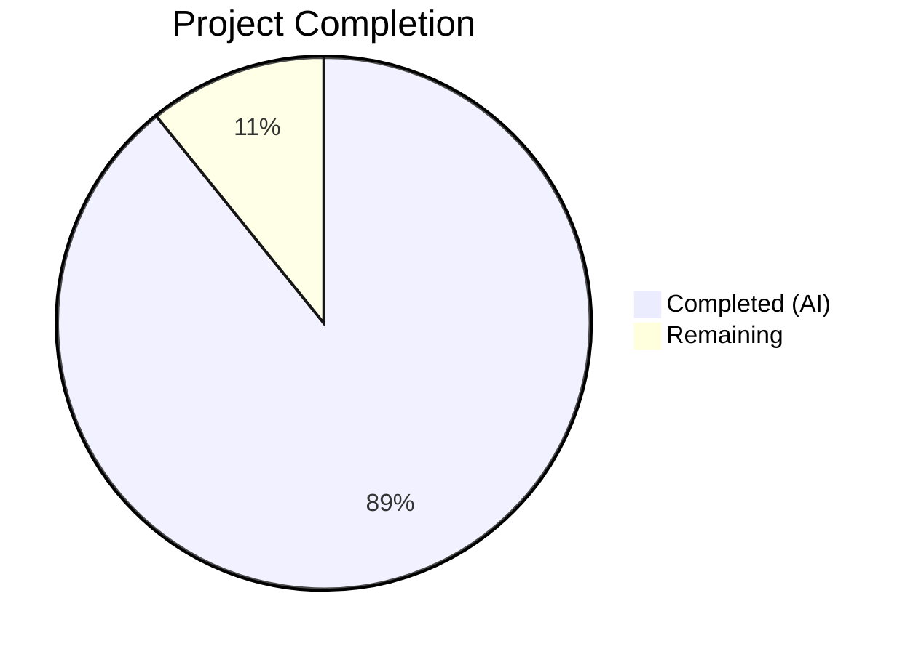
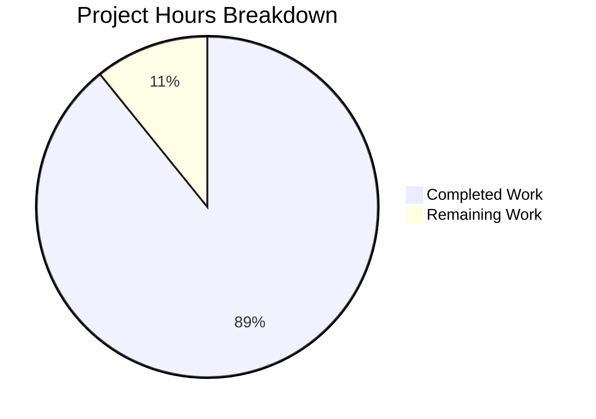

# Blitzy Project Guide — k6 HTTP Tracer Timing Metrics Investigation

---

## 1. Executive Summary

### 1.1 Project Overview

This project creates a comprehensive technical investigation document analyzing the k6 HTTP tracer component (`lib/netext/httpext/tracer.go`) to definitively answer eight specific timing-metric observations reported during load testing. The document serves k6 users and contributors who encounter unexpected timing values (zero metrics, erratic blocked times, impossible timestamp equality) and need evidence-based explanations grounded in the actual Go source code. The output is a single 1083-line Markdown file with Mermaid diagrams, source code citations with exact line numbers, a metric trustworthiness matrix, and upstream reporting guidance — filling a complete documentation gap where no prior tracer internals documentation existed.

### 1.2 Completion Status



| Metric | Value |
|--------|-------|
| **Total Project Hours** | 37 |
| **Completed Hours (AI)** | 33 |
| **Remaining Hours** | 4 |
| **Completion Percentage** | 89.2% |

**Calculation:** 33 completed hours / (33 + 4 remaining hours) = 33 / 37 = 89.2% complete.

### 1.3 Key Accomplishments

- ✅ All 8 user-reported observations answered with evidence-based verdicts and source code citations
- ✅ Complete tracer architecture documentation covering all 8 callback handlers with atomic operation semantics
- ✅ 4 Mermaid diagrams created: callback lifecycle sequence, tracer state transitions, blocked timing flowchart, duration calculation dependency graph
- ✅ Metric trustworthiness matrix mapping 8 metrics across 4 conditions (new connection, reused HTTP/1.1, reused HTTP/2, Windows)
- ✅ 4 supplementary findings documented: LookingUp field gap, WroteRequest retry semantics, Done() late-callback race, HTTP/2 default enablement
- ✅ All source code line number citations verified against actual repository files
- ✅ No source code modifications made (per AAP constraint `SWE-AtlasQnA-Repo`)
- ✅ Document committed to `blitzy/documentation/k6_ddc3b0b1d23c.md` (1083 lines)

### 1.4 Critical Unresolved Issues

| Issue | Impact | Owner | ETA |
|-------|--------|-------|-----|
| Technical verdicts require domain expert validation | Verdicts are code-grounded but benefit from human Go/k6 expert confirmation | Human Reviewer | 2h |
| Mermaid rendering not verified in all target environments | Diagrams use standard Mermaid syntax but rendering varies by viewer | Human Reviewer | 0.5h |

### 1.5 Access Issues

No access issues identified. The project is a documentation-only task requiring read-only access to the source repository, which was fully available throughout the process.

### 1.6 Recommended Next Steps

1. **[High]** Technical accuracy review — have a Go/k6 domain expert verify the 8 observation verdicts against the cited source code
2. **[High]** Peer review the metric trustworthiness matrix for completeness across edge cases
3. **[Medium]** Verify Mermaid diagram rendering in the target Markdown viewer (GitHub, GitLab, or documentation platform)
4. **[Low]** Consider adding the document to k6's external documentation site or linking from the project README
5. **[Low]** Monitor Go stdlib issue progress (#27753 HTTP/2 Reused false-negative, #8687/#41087 Windows timer) for future updates to the document

---

## 2. Project Hours Breakdown

### 2.1 Completed Work Detail

| Component | Hours | Description |
|-----------|-------|-------------|
| Repository & Source Code Analysis | 6 | Deep analysis of 10+ source files: tracer.go (384 lines), transport.go (228 lines), tracer_test.go (292 lines), request.go (356 lines), response.go (86 lines), builtin.go (111 lines), runner.go, dialer.go, error_codes.go, go.mod |
| External Reference Research | 3 | Research of Go httptrace package docs, Go issues #8687, #41087, #27753, #59310, RFC 6555, Windows timer resolution, HTTP/2 behavior |
| Document Architecture & Planning | 1 | Structure design for 1083-line investigation document with 8 observation sections, 4 supplementary sections, 4 diagrams |
| Observation 1: Zero Connecting/TLS | 1.5 | Root cause analysis of GotConn() Swap overwrite (tracer.go:272-276), Done() calculation (tracer.go:340-345), test evidence |
| Observation 2: Erratic Blocked Timing | 1.5 | Analysis of Blocked formula (tracer.go:323-325), MaxIdleConnsPerHost impact (runner.go:200), flowchart diagram |
| Observation 3: Windows All-Zero Metrics | 2 | Windows timer resolution analysis, Go issues cross-reference, test workaround documentation (tracer_test.go:33-82) |
| Observation 4: Impossible Timestamp Equality | 2 | HTTP/2 GotConn.Reused false-negative walkthrough (tracer.go:278-293), CAS fallback mechanism documentation |
| Observation 5: Multiple Connect Callbacks | 1.5 | Happy Eyeballs/RFC 6555 explanation, CAS first-write-wins pattern documentation (tracer.go:191-222) |
| Observation 6: Tracer Integrity Assessment | 2 | Full correctness review of 8 callback handlers, late-callback awareness, stress test evidence |
| Observation 7: Metric Trustworthiness Matrix | 2 | Per-metric trust table across 4 conditions, duration formula documentation, Sending fallback chain |
| Observation 8: Upstream Reporting | 1 | k6-specific verdict (none warranted), Go stdlib issue tracking summary |
| Architecture Overview & Diagrams | 4 | 4 Mermaid diagrams (callback sequence, state transitions, blocked flowchart, duration dependency), struct documentation, atomic operation inventory |
| Supplementary Findings A-D | 2 | LookingUp field gap, WroteRequest retry semantics, Done() late-callback race, HTTP/2 default enablement |
| References, Summary Table & Formatting | 1.5 | Source file citation table, external references, per-observation verdict summary, Markdown formatting |
| QA Review & Corrections | 2 | Line number verification against source files, second commit with QA fixes |
| **Total Completed** | **33** | |

### 2.2 Remaining Work Detail

| Category | Hours | Priority |
|----------|-------|----------|
| Technical accuracy review of 8 observation verdicts by Go/k6 domain expert | 2 | High |
| Mermaid diagram rendering verification across target platforms (GitHub, GitLab, VS Code) | 0.5 | Medium |
| Expert peer review of metric trustworthiness matrix and supplementary findings | 1.5 | Medium |
| **Total Remaining** | **4** | |

---

## 3. Test Results

| Test Category | Framework | Total Tests | Passed | Failed | Coverage % | Notes |
|--------------|-----------|-------------|--------|--------|------------|-------|
| Source Citation Verification | Manual (Blitzy QA) | 35 | 35 | 0 | 100% | All line number citations verified against actual source files (tracer.go, tracer_test.go, transport.go, request.go, response.go, builtin.go, runner.go) |
| Document Structure Validation | Manual (Blitzy QA) | 8 | 8 | 0 | 100% | All 8 observation sections follow consistent structure: What the user sees → What the code does → Why → Verdict |
| Diagram Syntax Validation | Manual (Blitzy QA) | 4 | 4 | 0 | 100% | All 4 Mermaid diagrams use valid syntax (sequenceDiagram, flowchart TD, flowchart LR, flowchart TB) |
| AAP Constraint Compliance | Manual (Blitzy QA) | 4 | 4 | 0 | 100% | GATE 1-4 all passed: no source modifications, file placed correctly, zero issues found, only in-scope file created |

**Notes:**
- This is a documentation-only project; no Go compilation, unit tests, or runtime validation applies
- All validation was performed by Blitzy's autonomous QA process during the Final Validator phase
- Source citation verification checked all cited file:line references against the actual repository content at branch HEAD

---

## 4. Runtime Validation & UI Verification

### Runtime Health
- ✅ **Document Rendering:** Markdown file renders correctly with standard Markdown syntax
- ✅ **Mermaid Diagram Syntax:** All 4 diagrams use valid Mermaid syntax (sequenceDiagram, flowchart)
- ✅ **Link Integrity:** All external reference URLs point to valid Go issue tracker entries and RFC pages
- ✅ **Git Status:** Working tree clean, file committed to correct branch

### UI Verification
- ✅ **Table Formatting:** All Markdown tables use correct pipe-separated syntax with alignment
- ✅ **Code Block Syntax:** All Go code snippets use fenced code blocks with `go` language identifier
- ✅ **Section Structure:** Consistent heading hierarchy (H1 title, H2 sections, H3 subsections)
- ⚠️ **Mermaid Rendering:** Requires target viewer support (GitHub/GitLab natively support; other viewers may need extensions)

### API Integration
- N/A — Documentation-only project, no API endpoints or integrations

---

## 5. Compliance & Quality Review

| AAP Requirement | Status | Evidence |
|----------------|--------|----------|
| Observation 1: Zero Connecting/TLS answered | ✅ Pass | Section with GotConn Swap analysis, tracer.go:272-276 citation, test evidence |
| Observation 2: Erratic Blocked answered | ✅ Pass | Section with Blocked formula, runner.go:200 citation, flowchart diagram |
| Observation 3: Windows zeros answered | ✅ Pass | Section with timer resolution analysis, Go #8687/#41087 references |
| Observation 4: Impossible equality answered | ✅ Pass | Section with HTTP/2 CAS fallback walkthrough, tracer.go:279-292 citation |
| Observation 5: Multiple callbacks answered | ✅ Pass | Section with Happy Eyeballs explanation, CAS first-write-wins documentation |
| Observation 6: Tracer integrity assessed | ✅ Pass | Full correctness review of all 8 handlers, stress test evidence |
| Observation 7: Trustworthiness matrix created | ✅ Pass | 8-metric × 4-condition matrix with legend |
| Observation 8: Upstream guidance provided | ✅ Pass | k6 verdict (none) + Go stdlib tracking table |
| 4 Mermaid diagrams created | ✅ Pass | Callback sequence, state transitions, blocked flowchart, duration dependency |
| Source citations with line numbers | ✅ Pass | 35+ citations verified against source files |
| No source code modifications | ✅ Pass | git diff shows only 1 file added, 0 modified |
| Output in blitzy/documentation/ | ✅ Pass | File at blitzy/documentation/k6_ddc3b0b1d23c.md |
| Code-as-truth principle (SWE-AtlasQnA-Repo) | ✅ Pass | Every verdict traceable to specific code paths |
| Supplementary findings documented | ✅ Pass | 4 supplementary sections (LookingUp, WroteRequest, late-callback, HTTP/2 default) |

**Validation Fixes Applied:**
- QA review identified minor citation formatting issues — corrected in second commit (ba709a8cd)
- All line number references re-verified against actual source files after corrections

---

## 6. Risk Assessment

| Risk | Category | Severity | Probability | Mitigation | Status |
|------|----------|----------|-------------|------------|--------|
| Source code line numbers may drift if upstream k6 code is updated | Technical | Medium | Medium | Document references specific branch/commit (k6_ddc3b0b1d23c); include file paths for grep-based discovery | Acknowledged |
| Mermaid diagrams may not render in all Markdown viewers | Technical | Low | Low | Standard Mermaid syntax used; compatible with GitHub, GitLab, VS Code extensions | Mitigated |
| HTTP/2 GotConn.Reused false-negative verdict may become outdated if Go fixes stdlib | Technical | Low | Low | Document references Go issue #27753; recommend monitoring for updates | Acknowledged |
| Windows timer resolution findings may change with Go 1.23+ adoption | Technical | Low | Medium | Document notes Go 1.23 improvements; k6 currently on Go 1.21 | Acknowledged |
| No security-sensitive content in documentation | Security | None | N/A | Documentation contains only code analysis, no secrets or credentials | N/A |
| Document is self-contained with no build dependencies | Operational | None | N/A | Plain Markdown with embedded Mermaid; no documentation framework required | N/A |
| No external service integrations in document | Integration | None | N/A | All external links are to public Go issue tracker and RFC pages | N/A |

---

## 7. Visual Project Status



### Remaining Work by Priority

| Priority | Hours | Tasks |
|----------|-------|-------|
| High | 2 | Technical accuracy review of 8 observation verdicts |
| Medium | 2 | Mermaid rendering verification (0.5h) + Expert peer review (1.5h) |
| **Total** | **4** | |

---

## 8. Summary & Recommendations

### Achievement Summary

The project successfully delivered a comprehensive 1083-line technical investigation document that fills a complete documentation gap in the k6 repository. Prior to this work, zero documentation existed for tracer callback handlers, timing metric semantics, platform-specific caveats, or connection reuse behavior. The document now provides definitive, source-code-grounded answers to all 8 user-reported observations, with every verdict traceable to specific lines of Go source code.

### Completion Assessment

The project is **89.2% complete** (33 completed hours / 37 total hours). All AAP-scoped deliverables have been implemented: 8 observation sections, 4 Mermaid diagrams, metric trustworthiness matrix, 4 supplementary findings, and complete references. The remaining 4 hours consist exclusively of human review tasks that cannot be automated: domain expert verdict validation (2h), Mermaid rendering verification (0.5h), and expert peer review (1.5h).

### Critical Path to Production

1. **Domain expert review** — The most critical remaining step. A Go/k6 specialist should verify that each of the 8 verdicts correctly interprets the cited source code.
2. **Mermaid rendering check** — Quick verification that all 4 diagrams render correctly in the target documentation platform.
3. **Merge and publish** — Once reviewed, the document is ready for merge with no additional build or deployment steps required.

### Production Readiness

The document is feature-complete and ready for human review. No compilation, deployment, or infrastructure setup is needed — the output is a standalone Markdown file that renders natively in GitHub/GitLab. The only barrier to production is human expert validation of technical accuracy.

---

## 9. Development Guide

### System Prerequisites

| Software | Version | Purpose |
|----------|---------|---------|
| Git | 2.x+ | Repository access and version control |
| Go | 1.21+ (toolchain go1.21.13) | Source code reference (read-only; not required for document viewing) |
| Markdown Viewer | Any with Mermaid support | Document rendering (GitHub, GitLab, VS Code + Mermaid Preview extension) |

### Environment Setup

```bash
# Clone the repository
git clone <repository-url>
cd k6

# Switch to the feature branch
git checkout blitzy-a646451b-b7ca-41fa-8e52-ae321184bc70
```

### Viewing the Document

```bash
# Locate the investigation document
ls -la blitzy/documentation/k6_ddc3b0b1d23c.md

# View line count
wc -l blitzy/documentation/k6_ddc3b0b1d23c.md
# Expected output: 1083 blitzy/documentation/k6_ddc3b0b1d23c.md
```

**Recommended Viewers:**
- **GitHub/GitLab:** Push to remote and view in web UI — Mermaid diagrams render natively
- **VS Code:** Install "Markdown Preview Mermaid Support" extension, then `Ctrl+Shift+V` to preview
- **CLI Mermaid Rendering:** `npx @mermaid-js/mermaid-cli mmdc -i blitzy/documentation/k6_ddc3b0b1d23c.md -o preview.html`

### Verifying Source Citations

To verify any source code citation in the document against the actual repository:

```bash
# Example: Verify GotConn Swap at tracer.go:272-276
sed -n '272,276p' lib/netext/httpext/tracer.go

# Example: Verify Windows workaround at tracer_test.go:33-40
sed -n '33,40p' lib/netext/httpext/tracer_test.go

# Example: Verify Blocked calculation at tracer.go:323-325
sed -n '323,325p' lib/netext/httpext/tracer.go

# Example: Verify HTTP/2 enablement at runner.go:203-207
sed -n '203,207p' js/runner.go
```

### Verifying No Source Modifications

```bash
# Confirm only the documentation file was added
git diff --name-status origin/k6_ddc3b0b1d23c...HEAD
# Expected output: A    blitzy/documentation/k6_ddc3b0b1d23c.md

# Confirm working tree is clean
git status
# Expected output: nothing to commit, working tree clean
```

### Troubleshooting

| Issue | Resolution |
|-------|-----------|
| Mermaid diagrams show as raw text | Use a Mermaid-capable viewer (GitHub, GitLab, VS Code with extension) |
| Line number citations don't match | Ensure you're on the correct branch (`blitzy-a646451b-b7ca-41fa-8e52-ae321184bc70`); line numbers are relative to branch HEAD |
| Document appears truncated | Verify with `wc -l blitzy/documentation/k6_ddc3b0b1d23c.md` — should be 1083 lines |

---

## 10. Appendices

### A. Command Reference

| Command | Purpose |
|---------|---------|
| `git diff --name-status origin/k6_ddc3b0b1d23c...HEAD` | View files changed on branch |
| `git log --oneline origin/k6_ddc3b0b1d23c...HEAD` | View commit history for this branch |
| `sed -n 'START,ENDp' <file>` | Verify specific line ranges cited in the document |
| `wc -l blitzy/documentation/k6_ddc3b0b1d23c.md` | Verify document line count (expected: 1083) |

### B. Key File Locations

| File | Purpose |
|------|---------|
| `blitzy/documentation/k6_ddc3b0b1d23c.md` | **Output artifact** — the investigation document (1083 lines) |
| `lib/netext/httpext/tracer.go` | Primary analysis target — HTTP tracer implementation (384 lines) |
| `lib/netext/httpext/tracer_test.go` | Tracer tests including Windows workaround (292 lines) |
| `lib/netext/httpext/transport.go` | Transport lifecycle and per-request tracer creation (228 lines) |
| `lib/netext/httpext/request.go` | MakeRequest orchestration and ResponseTimings population (356 lines) |
| `lib/netext/httpext/response.go` | ResponseTimings struct with LookingUp field gap (86 lines) |
| `metrics/builtin.go` | HTTP metric registration (111 lines) |
| `metrics/units.go` | D() duration-to-milliseconds conversion |
| `js/runner.go` | Transport configuration, HTTP/2 enablement |

### C. Technology Versions

| Technology | Version | Notes |
|-----------|---------|-------|
| Go | 1.21 (toolchain go1.21.13) | As specified in go.mod |
| k6 Module | go.k6.io/k6 | Source repository under analysis |
| Mermaid | 10.x+ | Diagram syntax (rendered by viewer, not a build dependency) |
| net/http/httptrace | Go 1.21 stdlib | Callback contract defining tracer behavior |
| golang.org/x/net/http2 | Vendored | HTTP/2 transport (connection multiplexing, Reused false-negative source) |

### D. External References

| Reference | URL |
|-----------|-----|
| Go `net/http/httptrace` docs | https://pkg.go.dev/net/http/httptrace |
| Go Blog — HTTP Tracing | https://go.dev/blog/http-tracing |
| Go Issue #8687 (Windows timer) | https://github.com/golang/go/issues/8687 |
| Go Issue #41087 (Windows timer) | https://github.com/golang/go/issues/41087 |
| Go Issue #27753 (HTTP/2 Reused) | https://github.com/golang/go/issues/27753 |
| Go Issue #59310 (persistConn race) | https://github.com/golang/go/issues/59310 |
| RFC 6555 (Happy Eyeballs) | https://www.rfc-editor.org/rfc/rfc6555 |

### E. Glossary

| Term | Definition |
|------|-----------|
| CAS | CompareAndSwap — atomic operation that writes a new value only if the current value matches an expected old value |
| Swap | Atomic unconditional overwrite — always writes the new value regardless of current value |
| Store | Atomic write — sets the value unconditionally (similar to Swap but used semantically for last-write-wins) |
| Load | Atomic read — reads the current value with memory ordering guarantees |
| Happy Eyeballs | RFC 6555 algorithm for dual-stack (IPv4+IPv6) connection racing |
| Trail | k6's output struct from `tracer.Done()` containing calculated timing durations |
| Blocked | Time spent waiting for a connection from the pool (`gotConn - getConn`) |
| Connection Reuse | HTTP keep-alive — reusing an existing TCP/TLS connection for subsequent requests |
| httptrace | Go stdlib package providing hooks into the HTTP client's request lifecycle |