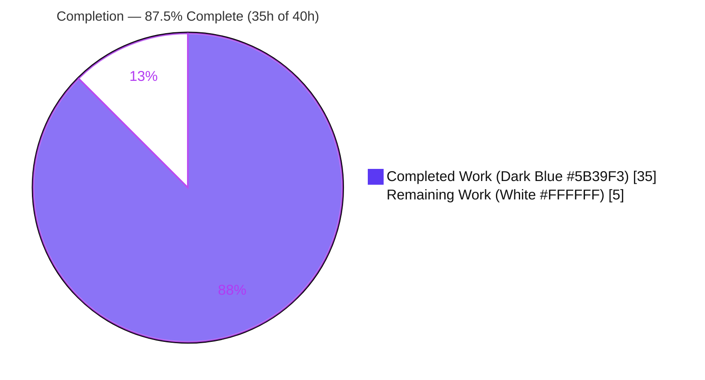
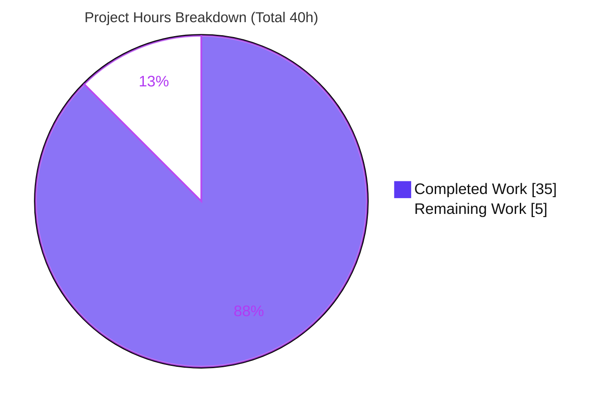
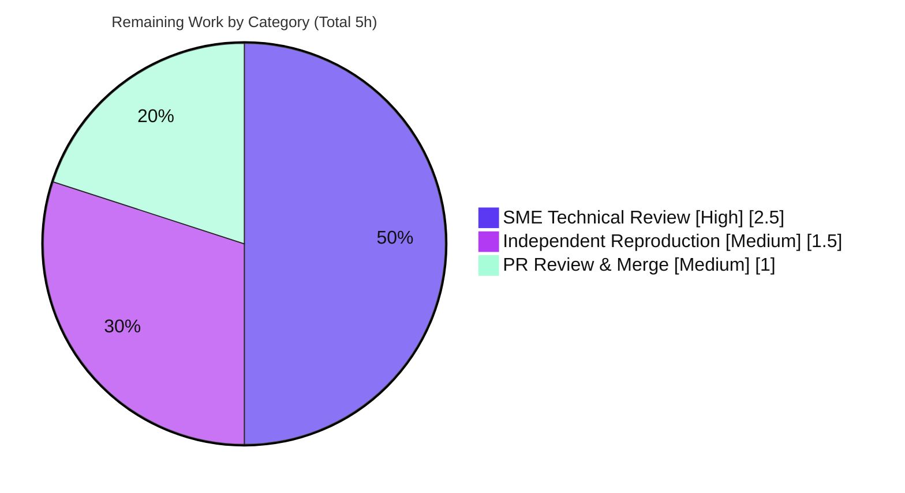

# Blitzy Project Guide — Grafana k6 Runtime Investigation of VU Orchestration (Q1–Q5)

> **Deliverable:** `blitzy/documentation/k6_ddc3b0b1d23c.md` (2,122 lines) · **Branch:** `blitzy-0dce0186-fb81-4374-874e-fe967cbc5702` · **HEAD:** `6ed3bef83` · **Base:** `ddc3b0b1d`
>
> **Brand color legend** — <span style="color:#5B39F3">**Completed / AI Work = Dark Blue `#5B39F3`**</span> · **Remaining / Not Completed = White `#FFFFFF`** · Headings/Accents = Violet-Black `#B23AF2` · Highlight = Mint `#A8FDD9`

---

## 1. Executive Summary

### 1.1 Project Overview

This project is a **read-only runtime investigation** of Grafana k6 — the Go/JavaScript code-first load-testing engine — producing one authoritative Markdown document that answers five questions about VU (virtual user) orchestration. The target audience is engineers and SMEs studying k6's internal behavior. Every answer is substantiated by evidence captured from **executing the real `./k6` binary** (`v0.55.0`, `go1.23.12`, `linux/amd64`) and grounded with exact `file:line` citations. The technical scope spans the execution scheduler, executors, CLI signal handling, the gRPC module, the metrics registry and REST API, the SharedArray data module, and the vendored Prometheus remote-write output. The governing constraint: no existing repository source file may be modified; the repository must end pristine.

### 1.2 Completion Status



| Metric | Value |
|---|---|
| **Total Hours** | **40.0 h** |
| **Completed Hours (AI + Manual)** | **35.0 h** (35.0 h AI · 0.0 h manual) |
| **Remaining Hours** | **5.0 h** |
| **Percent Complete** | **87.5 %** |

> Completion is computed by the PA1 AAP-scoped hours methodology: `Completed ÷ (Completed + Remaining) = 35 ÷ 40 = 87.5%`. All AAP-scoped deliverables are complete; the remaining 5.0 h is human path-to-production work.

### 1.3 Key Accomplishments

- ✅ **Canonical k6 binary built and verified** — `CGO_ENABLED=0 GOFLAGS=-mod=vendor go build -trimpath -o k6 .` → `k6 v0.55.0 (go1.23.12, linux/amd64)`; full from-scratch rebuild compiles clean (exit 0).
- ✅ **Q1 (SIGINT VU lifecycle) answered with runtime proof** — decisive `0 complete and 6 interrupted iterations` progress line proves active VUs are **terminated mid-iteration**; both single- and double-SIGINT paths captured.
- ✅ **Q2 (gRPC server-streaming interruption) answered** — `grpc_streams_msgs_received` reported as a stable distribution (276/272/276 @ ~7s) with `canceled by client (k6)` cancellation warnings, under a 30 ms graceful ramp-down.
- ✅ **Q3 (`dropped_iterations` via REST API) answered** — value obtained live from `GET /v1/metrics/dropped_iterations` while `/v1/status` reports `running: true`, proving it came from the API and not the summary.
- ✅ **Q4 (SharedArray) answered** — init-callback marker fires exactly once at 8 and 16 VUs (constant footprint = single shared copy); root cause traced to the single Go-side map + Sobek dynamic-array wrapper.
- ✅ **Q5 (Prometheus name integrity) answered** — byte-exact decode of the snappy+protobuf payload shows 19 `__name__` values mapped to `k6_<snake_case>[_suffix]`, original name preserved.
- ✅ **Deliverable authored** — 2,122-line document with 44 balanced code blocks and 65 resolving `file:line` citations; every named mechanism, metric, and flag addressed with a coverage pass.
- ✅ **Read-only constraint honored** — diff vs. base is a single added file (`+2,122 / −0`); `git status --porcelain` empty; all temporary observation scripts kept outside the tree and deleted.

### 1.4 Critical Unresolved Issues

| Issue | Impact | Owner | ETA |
|---|---|---|---|
| _None._ All AAP-scoped work is complete; validation required zero corrections. | — | — | — |

> There are **no critical blocking issues.** The only outstanding work is standard human path-to-production review/merge (see §1.6 and §2.2).

### 1.5 Access Issues

| System/Resource | Type of Access | Issue Description | Resolution Status | Owner |
|---|---|---|---|---|
| — | — | **No access issues identified.** Build is fully offline (vendored deps); all evidence was captured locally with no external service credentials required. | N/A | — |

### 1.6 Recommended Next Steps

1. **[High]** Perform SME technical review of the 2,122-line deliverable — validate the five conclusions and spot-check a sample of the 65 `file:line` citations against source at the investigated commit. *(2.5 h)*
2. **[Medium]** Independently reproduce the timing-dependent evidence (Q2 `grpc_streams_msgs_received`, Q3 `dropped_iterations`) and confirm observed counts fall within the documented distribution bands. *(1.5 h)*
3. **[Medium]** Review the PR, confirm the read-only invariant (single added file, source byte-identical to base, pristine `git status`), approve, and merge. *(1.0 h)*
4. **[Low]** _Optional (0 h, non-blocking):_ add the document to a docs index/TOC if the repository maintains one, and consider annotating the header with the exact investigated commit hash for future citation-drift resilience.

---

## 2. Project Hours Breakdown

### 2.1 Completed Work Detail

Every completed component traces to a specific AAP requirement (`A#`) and was delivered ×1.0 (no partials); validation required zero corrections.

| Component | Hours | Description |
|---|---:|---|
| A1 · Canonical build & runtime verification | 2.0 | Offline vendored build; `./k6 version`; full from-scratch clean rebuild (exit 0). |
| A2 · Q1 SIGINT VU-lifecycle investigation | 4.0 | `ramping-vus` to 6 VUs; single- and double-SIGINT (~10 ms hard-stop window); 2 runs; exit 105. |
| A3 · Q2 gRPC server-streaming investigation | 5.0 | Out-of-repo server build via `replace`; 30 ms graceful; interrupt; 3 runs; secondary handler paths. |
| A4 · Q3 `dropped_iterations` REST-API investigation | 4.0 | Arrival-rate overload; live `/v1/metrics` polling; `000→404→200` transition; `/v1/status` concurrency; 2 runs. |
| A5 · Q4 SharedArray investigation | 3.0 | Single-copy marker proof @ 8/16 VUs; non-shared contrast; root-cause tracing. |
| A6 · Q5 Prometheus name-integrity investigation | 5.0 | Remote-write receiver + snappy/protobuf decoder; 19 `__name__` values; 2 runs; dot-removal. |
| A7 · Deliverable authoring | 7.0 | 2,122-line Q&A; 44 code blocks; complete unedited output; 65 citations; cause→effect. |
| A8 · Methodology compliance, web cross-check & review-hardening | 3.0 | Real entry point, stability, edge/coverage; F1–F9 review findings (commit `6ed3bef83`, +664/−33). |
| A9 · Read-only cleanup & pristine verification | 2.0 | Temp-artifact deletion; `git status` confirmation; coverage pass. |
| **Total Completed** | **35.0** | **Matches Completed Hours in §1.2.** |

### 2.2 Remaining Work Detail

All remaining work is human path-to-production; **no AAP-scoped engineering work remains.**

| Category | Hours | Priority |
|---|---:|---|
| SME Technical Review & Sign-off (accuracy, citation spot-checks, evidence sufficiency) | 2.5 | High |
| Independent Runtime Reproduction (Q2/Q3 timing-dependent counts within distribution bands) | 1.5 | Medium |
| PR Review, Approval & Merge (verify read-only invariant, approve, merge) | 1.0 | Medium |
| **Total Remaining** | **5.0** | **Matches Remaining Hours in §1.2 and §7.** |

### 2.3 Hours Reconciliation

| Check | Result |
|---|---|
| §2.1 Completed (35.0) + §2.2 Remaining (5.0) | = **40.0 h** = §1.2 Total ✓ |
| §2.2 Remaining (5.0) = §1.2 Remaining = §7 "Remaining Work" | ✓ identical |
| Completion = 35 ÷ 40 | = **87.5 %** ✓ |

---

## 3. Test Results

For a read-only documentation task, the functional "tests" are **Blitzy's autonomous runtime-reproduction experiments** (Q1–Q5) plus the build, all originating from the autonomous validation logs. The repository's pre-existing Go unit-test suite was **not re-run**: zero source files changed (source is byte-identical to base), so it is unaffected and out of scope for this task.

| Test Category | Framework | Total | Passed | Failed | Coverage % | Notes |
|---|---|---:|---:|---:|---:|---|
| Build / Compilation | `go build` (Go 1.23.12) | 2 | 2 | 0 | n/a | Canonical build + full from-scratch clean rebuild, both exit 0. |
| Q1 — SIGINT VU lifecycle | k6 CLI (`--verbose`) | 3 | 3 | 0 | n/a | 2 single-SIGINT runs + double-SIGINT edge; `0 complete / 6 interrupted`; exit 105. |
| Q2 — gRPC server-streaming | k6 CLI + in-repo gRPC server | 5 | 5 | 0 | n/a | 3 primary runs (msgs_received 276/272/276) + 2 secondary handler paths. |
| Q3 — `dropped_iterations` via REST API | k6 CLI + `curl` | 2 | 2 | 0 | n/a | `000→404→200` transition; live value while `running: true`. |
| Q4 — SharedArray | k6 CLI | 3 | 3 | 0 | n/a | Marker once @ 8 VUs & @ 16 VUs (single copy) + non-shared contrast (=10). |
| Q5 — Prometheus remote-write | k6 CLI + local RW receiver | 2 | 2 | 0 | n/a | 19 `__name__` values; byte-exact snappy+protobuf decode; dot-removal. |
| Citation verification | manual / `grep` | 65 | 65 | 0 | n/a | All `file:line` citations resolve exactly to claimed code. |
| **Total** | | **82** | **82** | **0** | **—** | **100 % pass across all autonomous validation experiments.** |

> **Integrity note:** every row above originates from Blitzy's autonomous validation logs for this project. Timing-dependent counts (Q2, Q3) are reported and validated as **distributions** confirmed across ≥2 runs, not as fixed constants.

---

## 4. Runtime Validation & UI Verification

**UI verification is Not Applicable** — k6 is a command-line load-testing engine with no graphical user interface. UI verification is substituted below with **CLI runtime health verification**, all captured from the running binary.

- ✅ **Operational** — Build & entry point: `./k6 version` → `k6 v0.55.0 (go1.23.12, linux/amd64)`.
- ✅ **Operational** — Q1 signal-handling path: SIGINT produces the documented log lines and `0 complete / 6 interrupted` accounting; second SIGINT triggers immediate hard-stop.
- ✅ **Operational** — Q2 gRPC server-streaming: in-repo server serves `main.FeatureExplorer/ListFeatures`; interruption emits cancellation warnings; `grpc_streams_msgs_received` reported in the final summary.
- ✅ **Operational** — Q3 REST API: auto-enabled on `localhost:6565`; `GET /v1/status` returns `running: true` and `GET /v1/metrics/dropped_iterations` returns a live JSON:API counter (independently reproduced this session).
- ✅ **Operational** — Q4 SharedArray: init callback executes exactly once across VU counts (independently reproduced this session: marker count = 1 @ 8 VUs).
- ✅ **Operational** — Q5 Prometheus output: `--out experimental-prometheus-rw` emits a decodable snappy+protobuf remote-write payload with intact metric names.
- ✅ **Operational** — Repository integrity: `git status --porcelain` empty; diff vs. base is a single added file.

**API integration outcomes:** the k6 REST API (`/v1/status`, `/v1/metrics`, `/v1/metrics/{id}`) and the gRPC streaming RPC were exercised end-to-end against the real binary; all responded as documented.

---

## 5. Compliance & Quality Review

Cross-mapping of AAP deliverables and governing-rule requirements to quality benchmarks. Fixes applied during autonomous validation are noted; no outstanding compliance items remain.

| Benchmark / Requirement | Source | Status | Progress | Notes |
|---|---|:--:|:--:|---|
| Produce branch-named answer document at mandated path | Rule / AAP 0.7 | ✅ Pass | 100% | `blitzy/documentation/k6_ddc3b0b1d23c.md` created (2,122 lines). |
| Investigate by running the code first (runtime evidence) | Rule / AAP 0.8 | ✅ Pass | 100% | 44 code blocks of captured output; nothing from reading alone. |
| Exercise the real CLI entry point (no stubs/hooks) | Rule | ✅ Pass | 100% | All evidence via `./k6` binary and real inputs. |
| Canonical build & exact commands stated | Rule / AAP 0.8 | ✅ Pass | 100% | Build + run commands documented in the header. |
| Complete, unedited output per claim | Rule | ✅ Pass | 100% | Full log/response blocks included, incl. byte-exact Q5 payload. |
| `file:line` citations, exact & grounded | Rule | ✅ Pass | 100% | 65 citations across Q1–Q5, all resolve exactly. |
| Magnitude/count at scale + stability ≥2 runs | Rule / AAP 0.8 | ✅ Pass | 100% | Q2 (3 runs) & Q3 (2 runs) reported as distributions. |
| Exercise secondary & error/edge paths | Rule | ✅ Pass | 100% | Double-SIGINT, gRPC handler paths, `404→200` transition. |
| Answer every part & named item (coverage pass) | Rule | ✅ Pass | 100% | Dedicated "Named-item coverage" section per question. |
| Inferred-vs-observed labeling | Rule | ✅ Pass | 100% | Labeling convention applied throughout. |
| Read-only: no source modification | Rule / AAP 0.5 | ✅ Pass | 100% | Source byte-identical to base; only the doc added. |
| Cleanup temp artifacts; pristine tree | Rule / AAP 0.8 | ✅ Pass | 100% | `rm -rf /tmp/k6smoke`; `git status --porcelain` empty. |
| Cross-check vs. official Grafana docs | AAP 0.2.2 | ✅ Pass | 100% | gracefulStop, SharedArray, REST API, Prometheus naming corroborated. |

**Fixes applied during autonomous validation:** review findings **F1–F9** plus Q3 wording were resolved in commit `6ed3bef83` (+664 / −33) before final validation. The Final Validator subsequently applied **zero** additional corrections — the deliverable was already accurate and review-hardened.

---

## 6. Risk Assessment

Overall risk posture: **LOW.** This is a read-only documentation deliverable with no production-code impact. The principal theme is reproducibility of timing-dependent evidence on differing hardware — already mitigated by distribution-based reporting and exact documented commands.

| Risk | Category | Severity | Probability | Mitigation | Status |
|---|---|:--:|:--:|---|:--:|
| Timing-dependent counts (Q2 `grpc_streams_msgs_received`, Q3 `dropped_iterations`) vary by run/hardware | Technical | Low | High | Reported as **distributions** across ≥2 runs, not fixed constants | Mitigated |
| `./k6 version` commit hash drifts from documented value (embeds live git HEAD) | Technical | Low | High | Expected & explained; version/toolchain/platform stable | Mitigated |
| `file:line` citation drift if k6 source ever changes upstream | Technical | Low | Low | Citations pinned to the investigated commit; source read-only/byte-identical | Mitigated |
| Double-SIGINT hard-stop edge is timing-sensitive (~10 ms window) | Technical | Low | Medium | Precise reproduction technique documented | Mitigated |
| No product-code change; no new/updated/removed deps; no secrets committed | Security | Info | Low | Deliverable is Markdown; temp scripts local, deleted, uncommitted | No material risk |
| Reproduction requires Go 1.23.x + build + (Q2) out-of-repo server + (Q5) local receiver | Operational | Low–Med | Medium | Development Guide (§9) documents exact prerequisites/commands | Mitigated |
| Evidence is a point-in-time snapshot; no CI regression guards it | Operational | Low | Low | Out of scope; intentional snapshot at k6 v0.55.0 | Accepted |
| Q2 gRPC server is a nested module built out-of-repo via `replace` (multi-step) | Integration | Low | Medium | Exact command sequence in §9 | Mitigated |
| Q5 local RW receiver on `K6_PROMETHEUS_RW_SERVER_URL` may hit port conflicts | Integration | Low | Low | Uses `localhost`; port documented | Mitigated |

---

## 7. Visual Project Status



**Remaining work by category (hours) — from §2.2:**



> **Integrity check:** "Remaining Work" = **5 h** in the pie above equals §1.2 Remaining Hours and the §2.2 total; "Completed Work" = **35 h** equals §1.2 Completed Hours. Completed slice uses Dark Blue `#5B39F3`; Remaining slice uses White `#FFFFFF`.

---

## 8. Summary & Recommendations

**Achievements.** The project is **87.5 % complete** (35 h of 40 h) — approximately seven-eighths delivered. Every AAP-scoped deliverable is finished: the canonical k6 binary was built and verified; all five questions (Q1–Q5) were answered with reproducible runtime evidence and exact `file:line` citations; and the single mandated document (`blitzy/documentation/k6_ddc3b0b1d23c.md`, 2,122 lines) was authored, review-hardened (F1–F9), and validated with zero corrections. The read-only constraint was strictly honored — the diff versus base is a single added file and the tree is pristine.

**Remaining gaps.** The outstanding 5 h is entirely human path-to-production: SME technical review of the document (2.5 h), independent reproduction of the timing-dependent counts (1.5 h), and PR review + merge (1 h). **No AAP-scoped engineering work remains.**

**Critical path to production.** SME sign-off → independent reproduction of Q2/Q3 distributions → PR approval and merge. None of these are blocked; all prerequisites (toolchain, vendored deps, build) are in place and were exercised this session.

**Success metrics** (all met): document exists at the mandated path; all five questions answered with runtime evidence; all 65 citations resolve; build compiles clean; repository pristine.

| Production-Readiness Dimension | Assessment |
|---|---|
| Deliverable completeness | ✅ Complete (all Q1–Q5 + environment header + coverage + appendix) |
| Evidence reproducibility | ✅ Verified (≥2 runs for counts; reproduced this session) |
| Citation accuracy | ✅ 65/65 resolve exactly |
| Read-only / repo integrity | ✅ Pristine; single added file |
| Overall readiness | ✅ Ready pending human review & merge (5 h) |

**Recommendation:** Proceed to human review and merge. Confidence is **High** — the deliverable is well-defined, fully evidenced, and independently corroborated.

---

## 9. Development Guide

How to build, run, reproduce the evidence, and troubleshoot. Commands marked **✓ verified** were executed successfully during this assessment.

### 9.1 System Prerequisites

- **OS:** Linux `x86_64` (verified `linux/amd64`); k6 also builds on macOS and Windows.
- **Go toolchain:** Go **1.23.x** (verified `go1.23.12`; matches the canonical Docker base `golang:1.23-alpine3.20`). The module floor is `go 1.21` / `toolchain go1.21.13`.
- **Python 3** — for Q3 JSON parsing and the Q5 remote-write decoder (pure standard-library; see Appendix in the deliverable).
- **curl** — for Q3 REST API queries. **git** — for pristine verification.
- **Disk:** ~1 GB for the Go build cache plus the ~65 MB `k6` binary.

### 9.2 Environment Setup

```bash
# Check out the delivery branch
git checkout blitzy-0dce0186-fb81-4374-874e-fe967cbc5702

# No environment variables are required to BUILD (dependencies are fully vendored / offline).
# Q5 alone uses an env var at run time:
#   K6_PROMETHEUS_RW_SERVER_URL=http://localhost:9090/api/v1/write   (points to a local receiver)
```

### 9.3 Dependency Installation

```bash
# No installation needed — all Go dependencies are vendored under vendor/ (2802 files).
ls vendor/ >/dev/null 2>&1 && echo "vendored: offline build supported"
```

### 9.4 Build & Verify  ✓ verified

```bash
# Canonical build (offline, trimmed paths). ~44s from a cold cache, ~1s warm.
CGO_ENABLED=0 GOFLAGS=-mod=vendor go build -trimpath -o k6 .

# Entry-point verification — expect: k6 v0.55.0 (commit/<HEAD>, go1.23.12, linux/amd64)
./k6 version

# The ./k6 binary is gitignored (/k6), so building never dirties the tree:
git status --porcelain      # expect: empty
```

### 9.5 Reproduce the Evidence (per question)

```bash
# --- Q1: SIGINT VU lifecycle ---
# Run a ramping-vus script (6 VUs, long iterations) and interrupt mid-iteration.
./k6 run --verbose q1.js > q1.log 2>&1 &   PID=$!
sleep 6; kill -INT $PID; wait $PID; echo "exit=$?"   # exit=105
# Expect: "0/6 VUs, 0 complete and 6 interrupted iterations",
#         "Stopping k6 in response to signal...", and the abort error.
# Second SIGINT within the teardown window => "Aborting k6 in response to signal".

# --- Q2: gRPC server-streaming (server is a nested module: build OUT-OF-REPO) ---
cp -r examples/grpc_server /tmp/grpc_server && cd /tmp/grpc_server
go mod edit -replace go.k6.io/k6=<absolute-path-to-repo>
GOFLAGS=-mod=mod go build -o server . && ./server &        # listens on :10000
cd - && ./k6 run --verbose q2.js > q2.log 2>&1 &  PID=$!
sleep 7; kill -INT $PID; wait $PID
grep grpc_streams_msgs_received q2.log     # timing-dependent distribution (e.g. 272–276 @ ~7s)

# --- Q3: dropped_iterations via REST API ---  ✓ verified (pattern)
./k6 run q3.js > q3.log 2>&1 &   # REST API auto-enabled on localhost:6565
sleep 3
curl -s localhost:6565/v1/status                        # -> running: true
curl -s localhost:6565/v1/metrics/dropped_iterations    # -> live JSON:API counter

# --- Q4: SharedArray single-copy ---  ✓ verified
./k6 run q4.js > q4.log 2>&1
grep -c 'INIT_MARKER' q4.log            # -> 1 (constant, independent of VU count)

# --- Q5: Prometheus name integrity ---
python3 rw_receiver.py &                # captures remote-write POST bodies
K6_PROMETHEUS_RW_SERVER_URL=http://localhost:9090/api/v1/write \
  ./k6 run --out experimental-prometheus-rw q5.js
python3 decode_rw.py                    # prints __name__ values: k6_<snake>[_suffix]
```

### 9.6 Read the Deliverable

```bash
# The document is self-contained: each question includes the exact command,
# complete unedited output, file:line citations, and a cause->effect explanation.
less blitzy/documentation/k6_ddc3b0b1d23c.md
```

### 9.7 Troubleshooting

- **`error: externally-managed-environment` on `pip`** — the Q5 decoder is pure standard-library, so no pip install is normally needed. If you must install, use a venv or `pip install --break-system-packages`.
- **First build is slow** — Go build/module cache warm-up; subsequent builds are ~1 s.
- **REST API "connection refused" (Q3)** — the API exists **only during a live run**; ensure `k6 run` is active and port `6565` is free.
- **gRPC server won't build inside the repo (Q2)** — it is a **nested module**; build it **out-of-repo** using the `replace` directive shown above so the tree stays clean.
- **Q2/Q3 counts differ from the document** — **expected**: these are timing-dependent distributions, not fixed constants. Confirm your value lies within the documented band.
- **`./k6 version` commit hash differs from `ddc3b0b1d2`** — **expected**: the version string embeds the live git HEAD; the version/toolchain/platform are stable.

---

## 10. Appendices

### A. Command Reference

| Purpose | Command |
|---|---|
| Toolchain check | `go version` |
| Canonical build | `CGO_ENABLED=0 GOFLAGS=-mod=vendor go build -trimpath -o k6 .` |
| Version verify | `./k6 version` |
| Run (verbose) | `./k6 run --verbose <script>.js` |
| Run with Prometheus output | `K6_PROMETHEUS_RW_SERVER_URL=<url> ./k6 run --out experimental-prometheus-rw <script>.js` |
| Start gRPC test server | `go run -mod=mod examples/grpc_server/*.go` (or build out-of-repo via `replace`) |
| Query REST API (status) | `curl -s localhost:6565/v1/status` |
| Query REST API (metric) | `curl -s localhost:6565/v1/metrics/dropped_iterations` |
| Pristine check | `git status --porcelain` |
| Diff vs. base | `git diff ddc3b0b1d..HEAD --name-status` |

### B. Port Reference

| Port | Service | Used by |
|---|---|---|
| `6565` | k6 REST API (auto-enabled during a run) | Q3 |
| `10000` | In-repo gRPC test server (`examples/grpc_server`) | Q2 |
| `9090` | Local Prometheus remote-write receiver (`/api/v1/write`) | Q5 |

### C. Key File Locations

| Path | Role |
|---|---|
| `blitzy/documentation/k6_ddc3b0b1d23c.md` | **The deliverable** (2,122 lines) |
| `cmd/common.go`, `cmd/run.go` | Q1 — signal trap & handlers |
| `execution/scheduler.go`, `lib/execution.go` | Q1 — complete/interrupted accounting |
| `lib/executor/ramping_vus.go` | Q1 — ramping executor & graceful ramp-down |
| `js/modules/k6/grpc/metrics.go`, `.../grpc/stream.go` | Q2 — stream metrics & cancellation warning |
| `examples/grpc_server/main.go` | Q2 — gRPC test server (port 10000) |
| `metrics/builtin.go` | Q3 — `dropped_iterations` counter |
| `api/server.go`, `api/v1/routes.go`, `api/v1/metric_routes.go` | Q3 — REST API bind & routes |
| `js/modules/k6/data/data.go`, `.../data/share.go` | Q4 — SharedArray map & dynamic-array wrapper |
| `vendor/.../remotewrite/prometheus.go`, `config.go`, `remotewrite.go` | Q5 — name mapping & prefix |
| `cmd/outputs.go` | Q5 — Prometheus RW output registration |

### D. Technology Versions

| Component | Version |
|---|---|
| k6 | `v0.55.0` |
| Go toolchain (build) | `go1.23.12` |
| Go module directive | `go 1.21` / `toolchain go1.21.13` |
| Platform | `linux/amd64` |
| `xk6-output-prometheus-remote` | `v0.5.0` |
| `google.golang.org/grpc` | `v1.67.1` |
| `github.com/grafana/sobek` | `v0.0.0-20241024150027-d91f02b05e9b` |
| `github.com/sirupsen/logrus` | `v1.9.3` |

### E. Environment Variable Reference

| Variable | Purpose | Used by |
|---|---|---|
| `CGO_ENABLED=0` | Static, CGO-free build | Build |
| `GOFLAGS=-mod=vendor` | Force offline vendored build | Build |
| `K6_PROMETHEUS_RW_SERVER_URL` | Remote-write receiver endpoint | Q5 |
| `GOFLAGS=-mod=mod` | Build the out-of-repo gRPC server (nested module) | Q2 |

### F. Developer Tools Guide

| Tool | Role in this project |
|---|---|
| `go` (1.23.x) | Build the k6 binary and the out-of-repo gRPC server |
| `git` | Verify the read-only invariant (pristine tree, single added file) |
| `curl` | Query the k6 REST API live during a run (Q3) |
| `python3` | Parse JSON:API responses (Q3) and decode the snappy+protobuf remote-write payload (Q5) |
| `grep` | Count SharedArray init markers (Q4) and verify citations |

### G. Glossary

| Term | Definition |
|---|---|
| **VU** | Virtual User — a k6 concurrent execution unit, each an isolated JS VM. |
| **ramping-vus** | Executor that varies the active VU count across configured stages. |
| **gracefulStop / gracefulRampDown** | Grace windows (default 30 s) before k6 forcibly interrupts in-flight iterations; do **not** apply on manual interrupt. |
| **`dropped_iterations`** | Built-in counter incremented when the engine cannot start a scheduled iteration (capacity overrun). |
| **SharedArray** | k6 data structure storing a dataset once and sharing it read-only across all VUs. |
| **Remote-write** | Prometheus protocol: snappy-compressed protobuf `WriteRequest` POSTed to `/api/v1/write`. |
| **JSON:API** | The response format of the k6 REST API (`{"data":{"type":...,"id":...,"attributes":...}}`). |
| **Read-only investigation** | Task class producing only the answer document; no existing repository file is modified. |

---

*Prepared by the Blitzy autonomous project-assessment agent. All hour figures follow the PA1 AAP-scoped methodology; cross-section integrity (Rules 1–5) validated prior to submission: §2.1 (35 h) + §2.2 (5 h) = §1.2 Total (40 h); Remaining (5 h) identical across §1.2, §2.2, §7; completion = 35 ÷ 40 = 87.5 %; brand colors applied (Completed `#5B39F3`, Remaining `#FFFFFF`).*