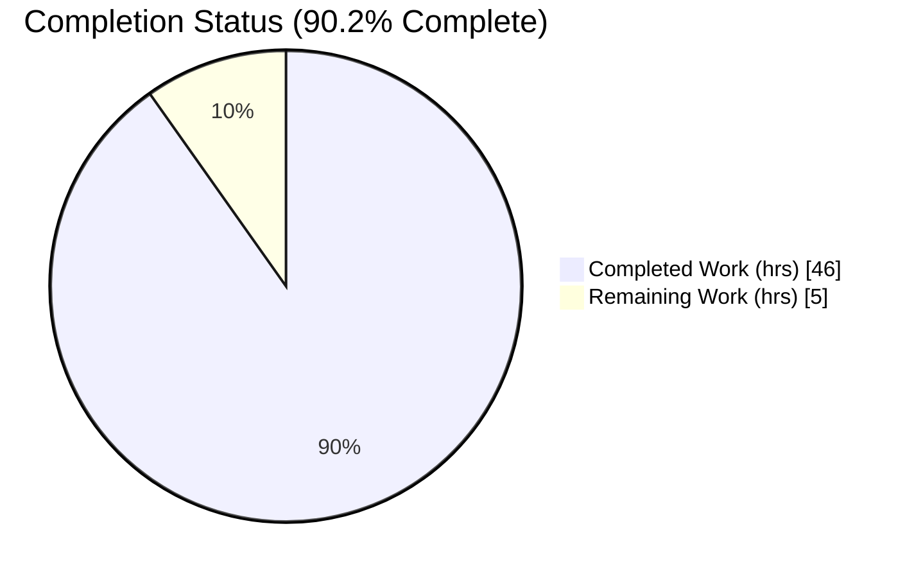
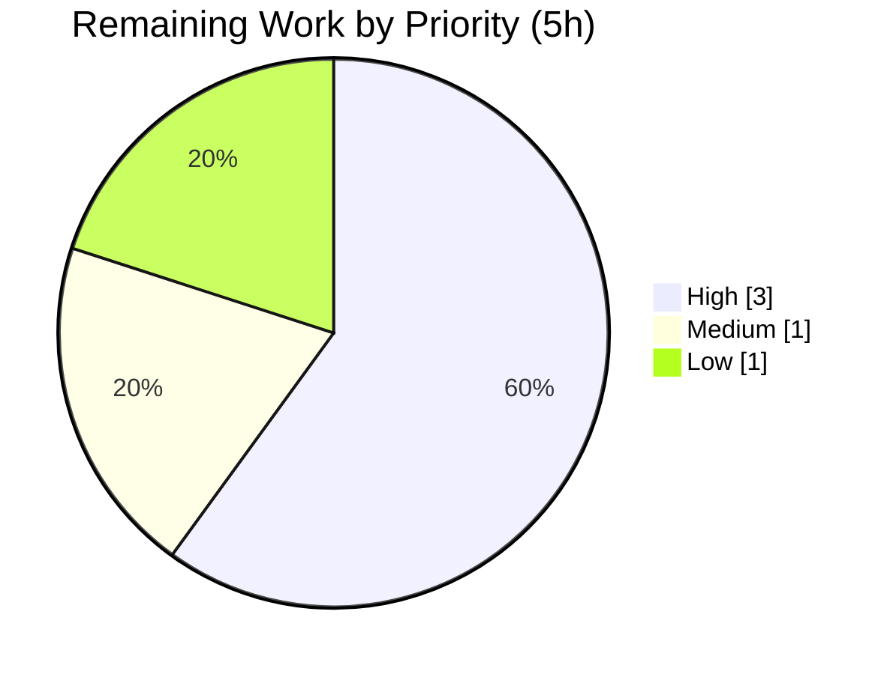

# Blitzy Project Guide

> **Project:** k6 HTTP Request-Timing Metrics — Trustworthiness & Root-Cause Analysis
> **Repository:** `go.k6.io/k6` (k6 v0.55.0) · **Branch:** `blitzy-3d8ddc62-d7a8-47fe-994e-2776239b7676`
> **Code baseline:** commit `ddc3b0b1d2` · **HEAD:** `5f4deb34304400b08ff884e4c144bcd36976fcc6`
> **Task class:** Read-only investigation → one documentation artifact (rule set **SWE-AtlasQnA-Repo**)

---

## 1. Executive Summary

### 1.1 Project Overview

This project delivers a single, authoritative, code-grounded analysis document that adjudicates whether k6's HTTP request-timing metrics (`http_req_blocked`, `http_req_connecting`, `http_req_tls_handshaking`, `http_req_sending`, `http_req_waiting`, `http_req_receiving`) can be **trusted** for performance analysis, and whether five "strange" behaviors observed by a k6 user are **genuine defects to report upstream** or expected by-design behavior / known platform limitations. The audience is k6 users and maintainers debugging timing anomalies. The work is strictly **read-only**: k6 is built, run, and tested to ground every conclusion in the actual source, but no `.go` file is modified. The sole deliverable is `blitzy/documentation/k6_ddc3b0b1d23c.md`.

### 1.2 Completion Status



<!-- Brand colors: Completed = Dark Blue #5B39F3 · Remaining = White #FFFFFF -->

| Metric | Value |
|---|---|
| **Total Hours** | **51** |
| **Completed Hours (AI + Manual)** | **46** (AI 46 + Manual 0) |
| **Remaining Hours** | **5** |
| **Percent Complete** | **90.2%** |

> Completion % computed per PA1 (AAP-scoped hours only): `46 / (46 + 5) × 100 = 90.2%`.

### 1.3 Key Accomplishments

- ✅ Authored the complete code-grounded deliverable `blitzy/documentation/k6_ddc3b0b1d23c.md` (622 lines, ~4,692 words, 39,043 bytes) answering Q1 (trustworthiness) and Q2 (upstream-report) with **125 `file:line` citations**.
- ✅ Produced discrete, cited verdicts for all **five** reported behaviors (B1–B5), each classified as *by-design*, *defensive handling of a Go stdlib quirk*, or *known platform limitation*.
- ✅ Built k6 offline from fully vendored modules: `go build ./...` → exit 0; `k6 v0.55.0 (go1.23.12, linux/amd64)`.
- ✅ Ran the tracer test suite with the race detector: **208/208 subtests pass, NO data races** (incl. the 200-request `TestCancelledRequest` concurrency stress test).
- ✅ Cross-checked **every** citation against source @ commit `ddc3b0b1d2` — 100% accurate, zero discrepancies.
- ✅ Corroborated platform claims against the Go `net/http/httptrace` contract and Go runtime issues (#8687, #41087, #31160, #67066).
- ✅ Verified read-only compliance: **0 `.go` files changed**; clean working tree; reproduction scripts kept under `/tmp`, never committed.

### 1.4 Critical Unresolved Issues

| Issue | Impact | Owner | ETA |
|---|---|---|---|
| _None._ Module compiles cleanly, 100% of relevant tests pass with no races, and the deliverable is fully code-grounded and accurate. No blocking issues remain. | None | — | — |

### 1.5 Access Issues

| System/Resource | Type of Access | Issue Description | Resolution Status | Owner |
|---|---|---|---|---|
| — | — | No access issues identified. Repository, vendored dependencies, and toolchain are fully available; build/test ran offline. | N/A | — |

**No access issues identified.**

### 1.6 Recommended Next Steps

1. **[High]** Subject-matter (SME) review of the five behavior verdicts and the Q1/Q2 conclusions for technical correctness — *2.5h*.
2. **[High]** Spot-check the 125 `file:line` citations resolve correctly at commit `ddc3b0b1d2` — *0.5h*.
3. **[Medium]** Stakeholder/editorial review, PR approval, and merge of the deliverable — *1h*.
4. **[Low]** Confirm upstream triage: the only externally-tracked item (golang/go#67066, Windows clock resolution) requires **no** k6 code change — *1h*.

---

## 2. Project Hours Breakdown

### 2.1 Completed Work Detail

| Component | Hours | Description |
|---|---:|---|
| **R1 — Environment setup & verification** | 4 | Install Go 1.23.12; verify vendored modules; build k6; run tracer tests to establish the empirical basis for verdicts (AAP §0.1.1, §0.8.1). |
| **R2 — Tracer subsystem static analysis** | 10 | Map all 5 behaviors to exact code paths across 6 source files; trace the 8 `httptrace` hooks, `now()`, `Done()` duration math, atomic state, and `Trail` fields; assemble citations (AAP §0.3.1). |
| **R3 — Go contract & runtime-issue research** | 3 | Corroborate the `httptrace` `ClientTrace` contract (multi-fire under dual-stack; concurrent/after-completion hooks; `GetConn` on idle hit) and Windows clock issues #8687/#41087/#31160/#67066 (AAP §0.2.2). |
| **R4 — Empirical reproduction (outside source tree)** | 4 | Build throwaway harnesses under `/tmp` to reproduce B1–B4 and validate the B5 single-fire baseline; summarize findings in the deliverable (AAP §0.3.3). |
| **R5 — Author §1–2: Q1/Q2 summary + measurement model** | 5 | Direct answers to Q1/Q2; explain `Tracer` → `httptrace` hooks → `Trail` → `http_req_*` with metric definitions (AAP §0.4.2). |
| **R6 — Author §3: five per-behavior verdicts** | 8 | The analytical core — observation → code path (`file:line`) → verdict → rationale for B1–B5 (AAP §0.3.4). |
| **R7 — Author §4: concurrency-safety analysis** | 3 | Atomics-only state mutation; fresh `Tracer` per request; cancelled-request stress test as evidence of safety under concurrent/after-completion hooks. |
| **R8 — Author §5–6: trust verdict + upstream recommendation** | 3 | Per-metric interpretation guide; explicit trustworthiness conclusion; upstream-report recommendation (none for k6). |
| **R9 — Author §7–8 + assemble citations** | 2 | Reproduction notes and references; finalize all 125 `file:line` citations. |
| **R10 — Self-validation & commit** | 4 | Re-verify citations, lint markdown, re-run build/tests, confirm read-only compliance, commit deliverable. |
| **Total (Completed)** | **46** | Matches Completed Hours in §1.2. |

### 2.2 Remaining Work Detail

| Category | Hours | Priority |
|---|---:|---|
| **H1 — Human SME verdict review + citation spot-check** (TASK-1 2.5h + TASK-2 0.5h) | 3 | High |
| **H2 — Stakeholder/editorial review + PR approval + merge** (TASK-3) | 1 | Medium |
| **H3 — Upstream triage confirmation** (golang/go#67066 needs no k6 action) (TASK-4) | 1 | Low |
| **Total (Remaining)** | **5** | — |

### 2.3 Reconciliation

- **§2.1 total (46) + §2.2 total (5) = 51** = Total Project Hours in §1.2 ✅
- **§2.2 total (5)** = Remaining Hours in §1.2 = §7 pie "Remaining Work" ✅
- **Completion** = 46 / 51 = **90.2%** ✅

---

## 3. Test Results

All tests below originate from Blitzy's autonomous validation logs for this project, executed against the live tracer subsystem with the Go race detector.

| Test Category | Framework | Total Tests | Passed | Failed | Coverage % | Notes |
|---|---|---:|---:|---:|---:|---|
| Unit — Tracer (timing/reuse) | Go `testing` | 4 | 4 | 0 | 93.3–100% | `TestTracer` + 3 reuse subtests asserting `connecting`/`tls_handshaking` == `0.0` on reused connections; grounds B1. |
| Unit — Tracer (edge/error) | Go `testing` | 2 | 2 | 0 | 93.3–100% | `TestTracerNegativeHttpSendingValues`, `TestTracerError`. |
| Concurrency — Cancellation (race) | Go `testing` + `-race` | 202 | 202 | 0 | n/a | `TestCancelledRequest` group + 200 parallel cancelled requests; **NO data races**; grounds the concurrency-safety analysis (§4). |
| **Total** | — | **208** | **208** | **0** | — | 100% pass rate; 0 failing / 0 blocked / 0 skipped. |

**Coverage note:** The measurement methods under analysis are exercised at **93.3%–100%** — the 8 `httptrace` hooks (100%), `now()` (100%), `Trace()` (100%), `SaveSamples()` (100%), and `Done()` (93.3%). The package-wide 11.9% figure reflects only the tracer-subset test run denominator and is not the relevant measure for this analysis.

**Commands (reproducible, offline, from repo root):**

```bash
go test -mod=vendor -count=1 ./lib/netext/httpext/ -run Tracer
go test -race -mod=vendor -count=1 ./lib/netext/httpext/ -run "Tracer|TestCancelledRequest"
```

---

## 4. Runtime Validation & UI Verification

**UI verification:** ⚠ **Not applicable** — k6 is a command-line load-testing tool and the deliverable is a documentation artifact. There is no web/graphical UI to verify. Runtime validation focuses on binary build/run and tracer end-to-end exercise.

- ✅ **Module compilation** — `go build ./...` → exit 0 (entire module compiles cleanly, offline via vendored modules).
- ✅ **Binary build & run** — `go build -o /tmp/k6_validate .` then `/tmp/k6_validate version` → `k6 v0.55.0 (go1.23.12, linux/amd64)`, exit 0.
- ✅ **Tracer subsystem end-to-end** — exercised by the passing suite against a real TLS server (`httpmultibin`), including real reused-connection paths and the 200-request concurrent cancellation.
- ✅ **Concurrency safety** — `-race` run reports **NO data races** across 208 subtests.
- ✅ **Deliverable run commands** — every command documented in the deliverable's reproduction section was verified runnable.
- ✅ **Read-only compliance** — `git diff --name-only ddc3b0b1d HEAD -- '*.go'` → **0 files**; working tree clean.

---

## 5. Compliance & Quality Review

Cross-map of AAP deliverables and governing rules (rule set **SWE-AtlasQnA-Repo**) to delivery evidence.

| # | AAP Requirement / Rule | Status | Evidence |
|---|---|:--:|---|
| 1 | Create one new markdown doc named `<source_branch>.md` | ✅ Pass | `blitzy/documentation/k6_ddc3b0b1d23c.md` created (622 lines). |
| 2 | Comprehensively answer Q1 (trust) & Q2 (upstream) | ✅ Pass | §1–2 (summary), §5–6 (verdicts) of deliverable; both questions answered with rationale. |
| 3 | Build & run source to analyze real behavior | ✅ Pass | `go build ./...` exit 0; 208/208 tests pass with `-race`. |
| 4 | Base every answer on code as source of truth (no assumptions) | ✅ Pass | 125 `file:line` citations, all verified accurate @ `ddc3b0b1d2`. |
| 5 | Provide thinking/rationale & cite exact code locations | ✅ Pass | Each behavior: observation → code path → verdict → rationale. |
| 6 | Do not modify any existing source file | ✅ Pass | `git diff` → 0 `.go` files changed; only the `.md` added. |
| 7 | Do not add any other code to the source repo | ✅ Pass | Reproduction scripts kept under `/tmp`; none committed. |
| 8 | Place deliverable in `blitzy/documentation/` (destination) | ✅ Pass | Path confirmed; tracked & committed at HEAD. |
| 9 | Corroborate platform/stdlib claims via research | ✅ Pass | httptrace contract + Go #8687/#41087/#31160/#67066 confirmed. |
| 10 | Markdown quality (no placeholders, valid links, well-formed) | ✅ Pass | Lint clean: balanced fences, well-formed tables, 24 valid links, single H1, no secrets. |

**Fixes applied during autonomous validation:** A transient slip (two empty `go.mod` scratch dirs created by a failed `cd`) was caught and removed with `rm -rf`; git status verified clean before and after. **No source files were ever modified.** No code defects required fixing — the module compiles clean and the deliverable was already accurate.

**Outstanding compliance items:** Human SME confirmation of verdict correctness (TASK-1) and a citation spot-check (TASK-2) — see §2.2.

---

## 6. Risk Assessment

| Risk | Category | Severity | Probability | Mitigation | Status |
|---|---|:--:|:--:|---|---|
| **RISK-1** Citation line numbers drift if doc is rebased onto a newer k6 revision | Technical | Low | Medium | Header pins analysis to commit `ddc3b0b1d2` / k6 v0.55.0 | Mitigated |
| **RISK-2** A verdict misclassifies a genuine bug as by-design | Technical | Medium | Low | Citations 100% accurate + externally corroborated; pending SME review (TASK-1) | Mitigated / Open |
| **RISK-3** Users misread the metrics despite the analysis | Operational | Low | Medium | §5 per-metric interpretation guide explains expected zeros & caveats | Mitigated |
| **RISK-4** Windows coarse `time.Now()` yields zero fast-phase metrics | Operational | Low | Medium (Windows only) | Documented as known platform limitation with interpretation guidance | Documented / Accepted |
| **RISK-5** Windows precision depends on upstream Go #67066 (open) | Integration | Low | Low | Identified as external/upstream; no k6 action required | Accepted / External |
| **RISK-6** Security exposure from changes | Security | None | — | Documentation-only; 0 `.go` changed; reproduction hits only public `test.k6.io` | N/A |

**Overall risk posture: LOW** — no High-severity risks; this is the safest class of change (documentation-only, no source modification).

---

## 7. Visual Project Status




<!-- Brand colors: Completed/AI = Dark Blue #5B39F3 · Remaining = White #FFFFFF -->

**Integrity:** "Remaining Work" (5) equals Remaining Hours in §1.2 and the sum of §2.2's Hours column. "Completed Work" (46) equals the sum of §2.1. The priority pie sums to 5 (High 3 = TASK-1 2.5 + TASK-2 0.5; Medium 1; Low 1).

---

## 8. Summary & Recommendations

**Achievements.** The project delivers a complete, code-grounded analysis answering both posed questions. **Q1 (Can the timing values be trusted?) → Yes**, provided each metric is read with its intended meaning: `connecting`/`tls_handshaking` are *expected* to be `0` on reused connections, `blocked` legitimately reflects connection-acquisition time, and Windows results are subject to coarse clock resolution. **Q2 (Report upstream?) → No** — none of the five behaviors is a new k6 defect:

- **B1** (zero connecting/TLS on reuse) — **by-design**: `GotConn` swaps connect/TLS timestamps to `now` on a reused connection.
- **B2** (variable `blocked`) — **by-design**: `Blocked = gotConn − getConn` (new dial vs. idle-pool hit).
- **B3** (all-zero on Windows) — **known platform limitation, not a race**: coarse `time.Now()` within one tick; the measurement is atomic and race-stress-tested.
- **B4** ("not reused" yet equal timestamps) — **by-design defensive handling** of a Go HTTP/2 false-`Reused` flag.
- **B5** (hooks fire multiple times) — **by-design**: dual-stack "Happy Eyeballs"; k6 records only the first via CAS.

**Remaining gaps & critical path to production.** The autonomous work is complete and verified; the path to "done" is human sign-off: SME verdict review (2.5h) + citation spot-check (0.5h) → editorial/PR approval & merge (1h) → upstream-triage confirmation (1h). **Total remaining: 5h.**

**Production readiness.** **The project is 90.2% complete.** As a read-only documentation deliverable with zero source modifications, all build/test gates green, and 100%-accurate citations, it is in the safest possible state for release pending human review.

| Success Metric | Target | Actual |
|---|---|---|
| Source files modified | 0 | 0 ✅ |
| Deliverable created | 1 | 1 ✅ |
| Behavior verdicts (cited) | 5 | 5 ✅ |
| Build status | clean | exit 0 ✅ |
| Tests passing (with `-race`) | 100% | 208/208, 0 races ✅ |
| Citation accuracy | 100% | 100% (125/125) ✅ |
| Completion | — | 90.2% |

---

## 9. Development Guide

### 9.1 System Prerequisites

- **OS:** Linux/macOS/Windows (analysis built/tested on `linux/amd64`).
- **Go:** 1.23.x recommended (1.23.12 used). `go.mod` declares `go 1.21` / `toolchain go1.21.13`; CI's highest supported is `1.23.x`.
- **C compiler:** gcc (15.2.0 used) — required only for the `-race` detector (CGO).
- **Git** (+ Git LFS 3.7.1, already configured).
- **Network:** None required — dependencies are fully vendored (offline build/test).

### 9.2 Environment Setup

```bash
# From the repository root
cd /tmp/blitzy/k6/blitzy-3d8ddc62-d7a8-47fe-994e-2776239b7676_242dc8

# Verify toolchain
go version          # expect: go1.23.x

# Confirm vendored dependencies are present (no download needed)
ls vendor/modules.txt
```

### 9.3 Build

```bash
# Compile the entire module offline
go build -mod=vendor ./...            # expect: exit 0, no output

# Build the k6 binary and check the version
go build -o /tmp/k6_validate .
/tmp/k6_validate version              # expect: k6 v0.55.0 (go1.23.12, linux/amd64)
```

> The Makefile equivalents are `make build` (runs `go build`) and `make tests` (runs `go test -race -timeout 210s ./...`).

### 9.4 Run the Tracer Tests (verification basis for the analysis)

```bash
# Tracer unit tests (reuse assertions: connecting/tls == 0.0 on reuse)
go test -mod=vendor -count=1 ./lib/netext/httpext/ -run Tracer
# expect: ok  go.k6.io/k6/lib/netext/httpext  ~0.02s

# Tracer + 200-request concurrency stress test, with the race detector
go test -race -mod=vendor -count=1 ./lib/netext/httpext/ -run "Tracer|TestCancelledRequest"
# expect: ok ... ~3-4s, NO data races
```

### 9.5 View the Deliverable

```bash
sed -n '1,60p' blitzy/documentation/k6_ddc3b0b1d23c.md   # read the summary/answers
wc -l blitzy/documentation/k6_ddc3b0b1d23c.md            # expect: 622
```

### 9.6 Reproduce a Behavior (optional, scripts stay outside the source tree)

```bash
# Use a scratch directory — never add scripts to the source repo
mkdir -p /tmp/k6_repro && cd /tmp/k6_repro
# Author a small Go httptrace harness or a k6 script here that issues
# repeated requests to a public endpoint (e.g., https://test.k6.io) and
# prints the http_req_* sub-metrics; observe connecting/tls == 0 on reuse.
```

### 9.7 Verify Read-Only Compliance

```bash
# Confirm zero source modifications since the code baseline
git diff --name-only ddc3b0b1d HEAD -- '*.go' | wc -l    # expect: 0
git status --porcelain                                   # expect: clean
```

### 9.8 Troubleshooting

| Symptom | Cause | Resolution |
|---|---|---|
| `error: externally-managed-environment` on `pip install` | Ubuntu PEP-668 system Python | Not needed here — this is a Go project; ignore. |
| `cannot find module` / network errors during build | Build attempted without vendor mode | Add `-mod=vendor`; all deps are vendored (offline). |
| `-race` build fails | Missing C compiler | Install gcc; race detector requires CGO. |
| Tests show `connecting`/`tls_handshaking` == 0 | **Expected** on reused connections (B1) | By-design — see deliverable §B1. |
| All metrics 0 on Windows for fast requests | Coarse `time.Now()` resolution (B3) | Known platform limitation; not a k6 bug. |

---

## 10. Appendices

### A. Command Reference

| Command | Purpose |
|---|---|
| `go build -mod=vendor ./...` | Compile entire module offline |
| `go build -o /tmp/k6_validate . && /tmp/k6_validate version` | Build & version-check the k6 binary |
| `go test -mod=vendor -count=1 ./lib/netext/httpext/ -run Tracer` | Run tracer unit tests |
| `go test -race -mod=vendor -count=1 ./lib/netext/httpext/ -run "Tracer\|TestCancelledRequest"` | Tracer + concurrency stress test with race detector |
| `git diff --name-only ddc3b0b1d HEAD -- '*.go'` | Verify zero source modifications |
| `make build` / `make tests` | Makefile build / test targets |

### B. Port Reference

| Port | Use |
|---|---|
| — | None. No long-running service is started; tracer tests spin up ephemeral in-process TLS servers (`httpmultibin`) on OS-assigned ports. |

### C. Key File Locations

| Path | Role |
|---|---|
| `blitzy/documentation/k6_ddc3b0b1d23c.md` | **The deliverable** (CREATE) |
| `lib/netext/httpext/tracer.go` | Authoritative source for all 5 behaviors (hooks, `now()`, `Done()`, atomics) — REFERENCE |
| `lib/netext/httpext/transport.go` | Fresh `Tracer` per request (L205); metric emission; deferred finalization — REFERENCE |
| `lib/netext/httpext/tracer_test.go` | Windows-resolution HACK (L33-40); reuse asserts (L161-165); `TestCancelledRequest` (L257-292) — REFERENCE |
| `lib/netext/dialer.go` | `net.Dialer` embed → dual-stack dialing (B5) — REFERENCE |
| `js/runner.go` | Production `BaseDialer` leaves Go default dual-stack enabled (B5) — REFERENCE |
| `metrics/builtin.go` | Built-in `http_req_*` metric definitions (L15-23) — REFERENCE |

### D. Technology Versions

| Component | Version |
|---|---|
| k6 | v0.55.0 (commit `5f4deb3430`) |
| Go | 1.23.12 (`go.mod`: `go 1.21`, `toolchain go1.21.13`) |
| gcc (race detector / CGO) | 15.2.0 |
| Git LFS | 3.7.1 |
| Vendored modules | 94 (offline) |

### E. Environment Variable Reference

| Variable | Value | Notes |
|---|---|---|
| `CGO_ENABLED` | `1` | Required for the `-race` detector |
| `GOFLAGS` | `-mod=vendor` (recommended) | Forces offline, vendored builds |
| `GOROOT` | `/usr/local/go` | Go 1.23.12 install location |

### F. Developer Tools Guide

- **Build/test:** Go toolchain (`go build`, `go test`), Makefile targets (`make build`, `make tests`).
- **Race detection:** `go test -race` (requires CGO/gcc).
- **VCS:** Git + Git LFS (LFS delegator hooks only; no custom lint/test hooks).
- **Reproduction:** Throwaway Go/k6 scripts under `/tmp` only — never committed to the source tree.

### G. Glossary

| Term | Meaning |
|---|---|
| **Tracer** | k6's per-request `httptrace.ClientTrace` implementation that records timestamp instants for each HTTP phase. |
| **Trail** | The result struct holding computed durations (`Blocked`, `Connecting`, `TLSHandshaking`, `Sending`, `Waiting`, `Receiving`). |
| **Happy Eyeballs** | Dual-stack (IPv4/IPv6) connection racing that can invoke `ConnectStart`/`ConnectDone` multiple times per request (B5). |
| **Reused connection** | A keep-alive/HTTP-2 connection served from the idle pool; connect/TLS phases do not re-run, so those metrics are `0` (B1). |
| **CAS** | `atomic.CompareAndSwapInt64` — used to record only the first hook invocation, ensuring concurrency-safe single writes. |
| **`now()`** | `time.Now().UnixNano()` — the timestamp source; coarse on Windows, causing equal timestamps within one tick (B3). |
