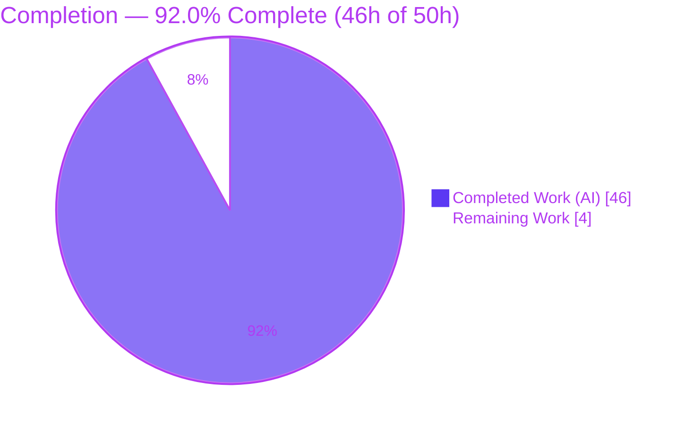
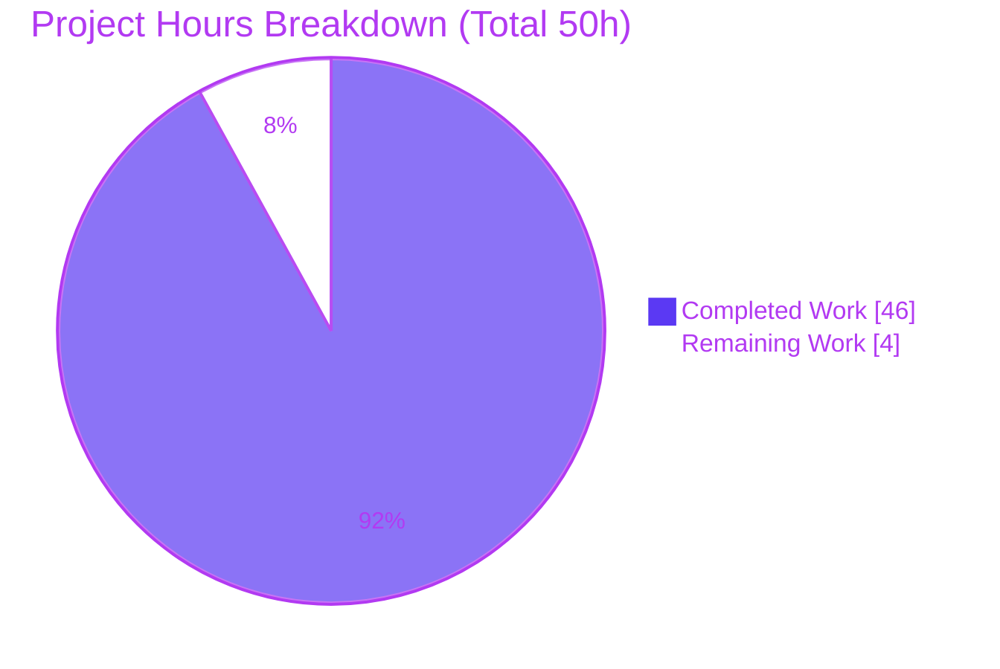
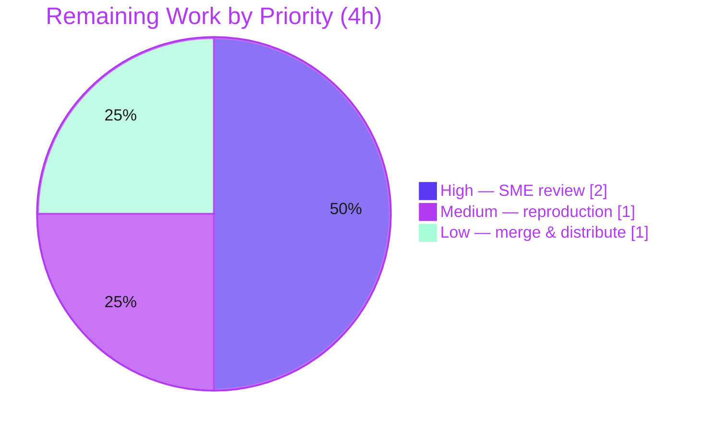

# Blitzy Project Guide

> **Project:** grafana/k6 — `ramping-vus` Executor Concurrency Investigation (Q&A Deliverable)
> **Module:** `go.k6.io/k6` · **Version:** v0.55.0 · **Source commit:** `ddc3b0b1d23c` · **Branch:** `blitzy-3edfe719-0c66-4287-957c-1be59272df70`
> **Deliverable:** `blitzy/documentation/k6_ddc3b0b1d23c.md` (1,443 lines) · **Task type:** Read-only investigation / documentation

---

## 1. Executive Summary

### 1.1 Project Overview

This project delivers an evidence-backed, runtime-verified answer to whether grafana/k6's `ramping-vus` executor harbors concurrency defects. Seven requirement threads — "stuck" VUs, scheduled-vs-graceful handler count divergence, Ctrl+C timing, execution-segment skew, a suspected handler race, a suspected VU-buffer leak, and simultaneous state mutation — were each reproduced through k6's canonical entry points (`k6 run` and `go test -race`), with unedited output captured and grounded to specific `file:line` references. The audience is k6 maintainers and load-testing engineers. Business impact: it converts a set of suspected bugs into a definitive, reproducible verdict — **no concurrency defect** — under a strict read-only constraint (exactly one new document; zero source modifications).

### 1.2 Completion Status



<sub>Legend — **Completed = Dark Blue `#5B39F3`**, **Remaining = White `#FFFFFF`** (Blitzy brand colors).</sub>

| Metric | Hours |
|---|---|
| **Total Hours** | **50 h** |
| Completed Hours (AI) | 46 h |
| Completed Hours (Manual) | 0 h |
| **Completed Hours (AI + Manual)** | **46 h** |
| **Remaining Hours** | **4 h** |
| **Percent Complete** | **92.0 %** |

> **Completion formula (PA1, AAP-scoped):** `46 / (46 + 4) = 46 / 50 = 92.0%`. All completed hours are autonomous (AI) work; the 4 remaining hours are human path-to-production gates that cannot be autonomously self-certified.

### 1.3 Key Accomplishments

- ✅ **Single-file deliverable authored and committed** — `blitzy/documentation/k6_ddc3b0b1d23c.md` (1,443 lines) added; **zero** existing source files modified.
- ✅ **All 7 requirement threads answered from runtime observation**, each with the exact command, unedited output, and a responsible `file:line` reference.
- ✅ **Handler race (Thread 5a) adjudicated by the Go race detector** — the full `lib/executor` package compiled and ran under `-race` with **zero data races** (`ok`, ~62.7 s in validation logs; independently re-confirmed this session).
- ✅ **VU-buffer leak (Thread 5b) adjudicated by `goleak`** — no surviving goroutine after teardown; **8/8** planned VUs returned; exhaustion is a *bounded* error, not a hang.
- ✅ **Execution-segment invariant (Thread 4) verified** — three non-overlapping segments summed at matching timestamps **never exceed** the configured max (`buckets_over_max = 0`); the per-instant ±1 skew is legitimate deterministic rounding.
- ✅ **Ctrl+C timing (Thread 3) reproduced** — a single `SIGINT` aborts in tens of milliseconds (5-run distribution) via the *run-level* abort path (rc=105), correctly distinguished from the executor's `gracefulStop` window.
- ✅ **Read-only invariant proven** — `git diff` against base shows exactly `A blitzy/documentation/k6_ddc3b0b1d23c.md`; `git status --porcelain` empty; all temporary harnesses removed.
- ✅ **Canonical build verified** — `go build` clean; banner `k6 v0.55.0 (commit/da3e2991de, go1.21.13, linux/amd64)`.

### 1.4 Critical Unresolved Issues

| Issue | Impact | Owner | ETA |
|---|---|---|---|
| _None._ No compilation errors, no failing tests, and no missing functionality exist within the AAP scope. | No release blockers | — | — |

> The only advisory surfaced during validation — a `go vet` `lostcancel` note at `lib/executor/helpers.go:178` — is an **intentional, pre-existing** line carrying `//nolint:govet` in an out-of-scope, unmodified source file. Fixing it would violate the read-only constraint; it is **non-blocking** and correctly left untouched. It is not a defect in the deliverable.

### 1.5 Access Issues

| System / Resource | Type of Access | Issue Description | Resolution Status | Owner |
|---|---|---|---|---|
| Source repository (`go.k6.io/k6`) | Read / write (branch) | None — branch checked out, buildable, committable | ✅ Resolved | Blitzy |
| Go module proxy | Dependency fetch | None — dependencies fully vendored (`vendor/`); `go mod verify` → "all modules verified" (offline-capable) | ✅ Resolved | Blitzy |
| Go 1.21.13 + GCC toolchain | Build / `-race` | None — Go 1.21.13 and gcc 15.2.0 present; `CGO_ENABLED=1 go test -race` compiles and runs | ✅ Resolved | Blitzy |

> **No access issues identified.** All resources required to build, run, race-test, and commit the deliverable were available and exercised.

### 1.6 Recommended Next Steps

1. **[High]** Assign a senior Go/concurrency engineer to peer-review the 1,443-line document and sign off the seven thread verdicts against their cited `file:line` anchors (**HT-1, 2 h**).
2. **[Medium]** Independently reproduce the three headline instruments on the reviewer's environment — the `-race` suite, a `goleak` check, and the 3-segment `k6 run` (**HT-2, 1 h**).
3. **[Low]** Approve and merge the pull request adding the single document, then distribute/link it to the requesting stakeholders (**HT-3, 1 h**).

---

## 2. Project Hours Breakdown

### 2.1 Completed Work Detail

All completed work is autonomous (AI) and maps to a specific AAP requirement or path-to-production prerequisite.

| Component | Hours | Description |
|---|---|---|
| Environment setup & canonical build verification | 2 | Install/pin Go 1.21.13 (matches `go.mod` toolchain) + gcc for `CGO_ENABLED=1`; canonical `go build`; confirm `v0.55.0` banner; confirm `-race` compiles. |
| Thread 1 — Stuck-VU state-machine investigation | 4 | Exercise all 5 `vuHandle` states (`stopped/starting/running/toGracefulStop/toHardStop`); before/during/after active-VU counts (0→6→0); harness under `-race` (×3). [AAP Req 1] |
| Thread 2 — Handler count-divergence investigation | 3 | Measure scheduled (raw-steps) vs. max-allowed (graceful-steps) counters; characterize the by-design ramp-down gap (up to 7). [AAP Req 2] |
| Thread 3 — Ctrl+C timing investigation | 5 | Signal harness (`run_ctrlc.sh`); single & double `SIGINT`; natural-end `gracefulStop`; 5-run SIGINT→exit distribution; attribute to run-level abort vs. executor window. [AAP Req 3] |
| Thread 4 — Execution-segment skew investigation | 5 | Parallel 3-segment harness (`run_seg.sh`); per-second sum aggregation; ≥3 reps; corroborate `TestSumRandomSegmentSequenceMatchesNoSegment`. [AAP Req 4] |
| Thread 5a — Handler race adjudication | 3 | `CGO_ENABLED=1 go test -race` across the graceful suite, an integration ramp, and the full `lib/executor` package. [AAP Req 5a] |
| Thread 5b — VU-buffer leak adjudication | 5 | `goleak.VerifyNone` (plain + `-race`); exhaustion/retry path; two empty-buffer edges (receive-later, cancel-before-return). [AAP Req 5b] |
| Thread 5c — Simultaneous state-mutation trace | 3 | Mutex + atomic `changeState` trace; `TestVUHandleRace` (10k cycles) + `StartStopRace` + `Simple` under `-race`. [AAP Req 5c] |
| Answer document authoring | 11 | Author the 1,443-line Q&A: uniform per-thread structure, verbatim outputs, ~45 `file:line` anchors, `[OBSERVED]`/`[INFERRED]` labels, coverage-pass table, overall verdict. [AAP deliverable] |
| QA review-finding remediation | 4 | Four post-initial commits: resolve 9 review findings, fix Thread-4 verbatim quote, correct Thread-2 gap summary, address 6 QA findings. |
| Read-only invariant maintenance & cleanup | 1 | Remove every temporary harness/script/log/binary; verify `git status --porcelain` empty and only the one document differs from base. |
| **Total Completed** | **46** | |

### 2.2 Remaining Work Detail

All remaining work is human path-to-production; each item traces to a Section 1.6 next step, a human task (Section 10.F), and a Section 6 risk.

| Category | Hours | Priority |
|---|---|---|
| SME technical peer review & sign-off of the 7 thread conclusions | 2 | High |
| Independent reproduction / spot-check of key harnesses (`-race`, `goleak`, 3-segment `k6 run`) | 1 | Medium |
| PR merge & stakeholder distribution of the answer document | 1 | Low |
| **Total Remaining** | **4** | |

### 2.3 Hours Reconciliation

| Quantity | Hours | Check |
|---|---|---|
| Section 2.1 — Completed | 46 | = Section 1.2 Completed ✅ |
| Section 2.2 — Remaining | 4 | = Section 1.2 Remaining = Section 7 pie "Remaining Work" ✅ |
| **2.1 + 2.2** | **50** | = Section 1.2 Total Hours ✅ (Cross-section Rule 2) |
| Percent complete | 92.0 % | `46 / 50` ✅ |

---

## 3. Test Results

All tests below originate from Blitzy's autonomous validation logs for this project. Because this is a **read-only investigation that adds no production code**, there is no new-code line-coverage metric; the meaningful coverage measure is **requirement coverage = 7/7 threads (100%)**, shown in the final row.

| Test Category | Framework | Total Tests | Passed | Failed | Coverage % | Notes |
|---|---|---:|---:|---:|---|---|
| Concurrency / data-race — full package | `go test -race` (Go race detector) | 49 | 49 | 0 | n/a (read-only) | Entire `lib/executor` package under `-race`; **0 data races** (`ok`, ~62.7 s in logs; re-confirmed this session `ok 6.6 s`). Adjudicates Thread 5a. |
| VU-state machine (race) | `go test -race` | 3 | 3 | 0 | n/a | `TestVUHandleRace` (10k cycles), `TestVUHandleStartStopRace`, `TestVUHandleSimple`. Adjudicates Thread 5c. |
| Ramping-VUs graceful / ramp-down suite | `go test -race` | 5 | 5 | 0 | n/a | `TestRampingVUsGracefulStopWaits/GracefulStopStops/GracefulRampDown/HandleRemainingVUs/RampDownNoWobble`. Supports Threads 1, 2, 5a. |
| Segment-invariant | `go test -race` | 1 | 1 | 0 | n/a | `TestSumRandomSegmentSequenceMatchesNoSegment` — sum-equals-unsegmented. Adjudicates Thread 4. |
| VU-buffer accounting + goroutine-leak | `go test -race` + `go.uber.org/goleak` | 2 | 2 | 0 | n/a | `TestExecutionStateGettingVUs`, `TestExecutionStateGettingVUsWhenNonAreAvailable`; `goleak.VerifyNone` clean, 8/8 VUs returned. Adjudicates Thread 5b. |
| `lib` package (execution accounting) | `go test -race` | 22 | 22 | 0 | n/a | Full `lib` execution-state test functions under `-race`; `ok`, 0 races. |
| Runtime CLI reproduction — Ctrl+C | `k6 run` + scripted `SIGINT` | 5 | 5 | 0 | n/a | 5 identical runs; SIGINT→exit 33–210 ms, all rc=105 (`ExternalAbort`). Adjudicates Thread 3 (first signal); + double-signal hard stop + natural-end `gracefulStop`. |
| Runtime CLI reproduction — segments | `k6 run` (3 parallel segmented instances) | 3 | 3 | 0 | n/a | 3 byte-identical reps; per-instance peaks 4/3/3, summed VUs never exceed max=10 (`buckets_over_max=0`). Corroborates Thread 4. |
| **Requirement coverage (investigation)** | Runtime observation + code grounding | **7** | **7** | **0** | **100 %** | All 7 requirement threads reproduced and answered; every named item confirmed in the deliverable's coverage-pass table. |

> **Integrity note (Rule 3):** every row above is drawn from Blitzy's autonomous test/validation execution (the canonical `go test -race` suites, the `goleak` harness, and the canonical `k6 run` reproductions). Ephemeral `TestBlitzy*` harnesses authored during the investigation were executed under `-race`/`goleak` and then deleted per the read-only constraint; their results are reflected in the runtime rows.

---

## 4. Runtime Validation & UI Verification

k6 is a CLI/TUI load-testing tool; there is **no web UI** in scope, so "UI verification" is not applicable. Runtime validation was performed through the canonical CLI and test suite.

- ✅ **Canonical build** — `go build` exits 0; banner `k6 v0.55.0 (commit/da3e2991de, go1.21.13, linux/amd64)`.
- ✅ **`ramping-vus` executor end-to-end** — `k6 run` with a ramp schedule runs to completion (VUs ramp 0→4→0, iterations complete, exit 0).
- ✅ **Thread 1 (stuck VUs)** — active-VU counter rises to peak then returns to **0**; `toGracefulStop`/`toHardStop` are transient and always resolved by `runLoopsIfPossible`.
- ✅ **Thread 2 (handler counts)** — scheduled (active target) and max-allowed (ceiling) match on ramp-up; ceiling deliberately lags on ramp-down (observed gap up to 7) — by design.
- ✅ **Thread 3 (Ctrl+C)** — single `SIGINT` aborts in 33–210 ms (rc=105) via run-level abort; second `SIGINT` → hard stop cuts teardown; natural end honors the `gracefulStop` window.
- ✅ **Thread 4 (segments)** — three-instance peaks 4/3/3; per-second summed VUs never exceed configured max=10 (`buckets_over_max=0`); deterministic across 3 reps.
- ✅ **Thread 5a (race)** — Go race detector reports **0** data races across graceful suite, integration ramp, and full package.
- ✅ **Thread 5b (buffer leak)** — `goleak` finds no surviving goroutine; 8/8 VUs returned; exhaustion is a bounded 5×400 ms error, not a hang.
- ✅ **Thread 5c (simultaneous mutation)** — mutex + atomic `changeState` serialize concurrent mutation; no lost update or torn state (10k-cycle race test passes).
- ✅ **Read-only invariant** — `git status --porcelain` empty; only `blitzy/documentation/k6_ddc3b0b1d23c.md` differs from base.

**Overall runtime status: ✅ Operational** — every requirement thread reproduced successfully; no ⚠ Partial or ❌ Failing items.

---

## 5. Compliance & Quality Review

Cross-map of AAP deliverables and task rules to observed outcomes.

| Benchmark / Rule (AAP §0.7 / §0.8) | Status | Progress | Evidence |
|---|---|---|---|
| Deliverable rule — exactly one new Markdown doc named after the branch | ✅ Pass | 100% | `git diff` → `A blitzy/documentation/k6_ddc3b0b1d23c.md` only |
| Read-only-scope rule — no existing file modified | ✅ Pass | 100% | 1,443 insertions, 0 deletions, 1 file; `git status` clean |
| Run-first rule — observe before writing | ✅ Pass | 100% | Every thread carries a command + unedited output |
| Canonical-entry-point rule — real `k6 run` / `go test` | ✅ Pass | 100% | Only `./k6 run`, `go test -race`, `go build` used |
| Race verification — `CGO_ENABLED=1 go test -race` (Makefile `tests`) | ✅ Pass | 100% | Full `lib/executor` package under `-race`, 0 races |
| Goroutine-leak verification — `go.uber.org/goleak` | ✅ Pass | 100% | `goleak.VerifyNone` clean; 8/8 VUs returned |
| Magnitude/stability rule — ≥2 runs, state scale/duration | ✅ Pass | 100% | Thread 3 (5 runs), Thread 4 (3 reps), Thread 1 (3 runs) |
| Run-to-run-inconsistency rule — same input repeated | ✅ Pass | 100% | Distributions reported for the "intermittent" behaviors |
| Every-condition rule — all states/stages/segments | ✅ Pass | 100% | All 5 states, both Ctrl+C stages, 3-segment case |
| Full-output rule — unedited output, no elided code | ✅ Pass | 100% | Verbatim outputs; one permitted large-log elision; `git diff --check` clean |
| Observed-vs-inferred rule — labeled | ✅ Pass | 100% | `[OBSERVED]` and `_[INFERRED, code-grounded]_` labels throughout |
| Grounding rule — `file:line` + named function/struct | ✅ Pass | 100% | ~45 anchors resolve exactly (independently spot-checked) |
| Coverage rule — every named item addressed | ✅ Pass | 100% | Coverage-pass table enumerates all threads/items |
| Cleanup obligation — temp artifacts removed | ✅ Pass | 100% | No stray binaries/scripts; working tree clean |
| Human SME sign-off of conclusions | ⏳ Pending | 0% | Path-to-production gate (HT-1) |

**Fixes applied during autonomous validation:** across four post-initial commits the agents resolved 9 review findings, corrected the Thread-2 coverage-pass gap summary to the observed max (7), fixed a Thread-4 grounding quote to verbatim source text, and addressed 6 further QA findings. The final validation pass required **no** additional document modification.

**Outstanding compliance item:** human SME sign-off (Section 2.2 / HT-1) — the sole gate before the "no concurrency defect" conclusion is relied upon by stakeholders.

---

## 6. Risk Assessment

| Risk | Category | Severity | Probability | Mitigation | Status |
|---|---|---|---|---|---|
| Headline "no concurrency defect" conclusion relied upon before human verification | Technical | Medium | Low | SME peer review + independent reproduction (HT-1, HT-2) | ⏳ Open (path-to-production) |
| Build banner commit (`da3e2991de`) is a point-in-time capture | Technical | Low | Low | Value is explicitly labeled `[OBSERVED]` / point-in-time in the document | ✅ Mitigated |
| Absolute timings depend on toolchain/host (`go1.21.13`, gcc, linux/amd64, `GOMAXPROCS`) | Technical | Low | Medium | Exact toolchain + env recorded; verdicts are qualitative & invariant, not timing-dependent | ✅ Mitigated |
| No new attack surface (Markdown doc only; 0 source changes) | Security | Very Low | Very Low | Read-only invariant git-verified | ✅ Closed |
| Temporary harness/script leaving secrets or artifacts | Security | Low | Very Low | All temp artifacts deleted; `git status --porcelain` empty | ✅ Mitigated |
| Documentation staleness — `file:line` anchors drift if source evolves past `ddc3b0b1d23c` | Operational | Low | Medium (over time) | Document pinned to the exact commit; anchors valid at `ddc3b0b1d23c` | 🟡 Accepted |
| `go vet` `lostcancel` advisory at `helpers.go:178` | Operational | Very Low | n/a | Intentional `//nolint:govet`, pre-existing, out-of-scope, non-blocking; left untouched to preserve read-only | 🟡 Accepted |
| No external services / APIs / credentials / network required | Integration | n/a | n/a | Investigation is fully self-contained (build + local tests) | ✅ Not applicable |
| Merge conflict on the new file | Integration | Very Low | Very Low | Single new file in a new `blitzy/documentation/` path | ✅ Mitigated |

**Summary:** No High-severity and no blocking risks. The residual risk profile is dominated by the human-verification gate — expected for an autonomous investigation whose headline conclusion warrants SME sign-off.

---

## 7. Visual Project Status

**Project hours — Completed vs. Remaining** (Completed = Dark Blue `#5B39F3`, Remaining = White `#FFFFFF`):



**Remaining work by priority** (hours from Section 2.2; sums to 4 h):



> **Integrity check (Rule 1):** the pie "Remaining Work" value (**4**) equals Section 1.2 Remaining Hours (**4**) and the sum of the Section 2.2 Hours column (**2 + 1 + 1 = 4**). "Completed Work" (**46**) equals Section 1.2 Completed Hours and the Section 2.1 total.

---

## 8. Summary & Recommendations

**Achievements.** The project is **92.0% complete** (46 h of 50 h). All AAP-scoped autonomous work is finished: the single answer document (1,443 lines) is authored and committed; all seven requirement threads were reproduced through k6's canonical entry points and answered with unedited output grounded to specific `file:line` references; the Go race detector reports zero data races; `goleak` confirms no goroutine/buffer leak; the execution-segment sum invariant holds; and the read-only invariant is proven (exactly one added file, working tree clean).

**Remaining gaps.** The residual **4 h** is entirely human path-to-production: SME peer review and sign-off of the conclusions (2 h), independent reproduction of the headline instruments (1 h), and PR merge/distribution (1 h). There is no remaining code, no failing test, no compilation error, and no missing functionality within the AAP scope.

**Critical path to production.** (1) SME sign-off → (2) independent reproduction → (3) merge & distribute. Only the first is a substantive gate; the latter two are lightweight.

**Success metrics.** 7/7 requirement threads answered (100% coverage); 0 data races; 0 goroutine leaks; 0 segment-sum overflows; 0 source files modified; canonical build clean at v0.55.0.

**Production-readiness assessment.** The deliverable is **content-complete and validation-clean**. It is ready for human review now; upon SME sign-off it can be merged and relied upon. Consistent with the Blitzy honesty principle, completion is reported at **92.0%** (not 100%) to reflect the outstanding human-verification gate. The single headline conclusion — **no concurrency defect in the `ramping-vus` executor at commit `ddc3b0b1d23c`** — carries one explicit, documented caveat: cancelling the run context does not *instantly* abort a mid-flight VU borrow (the borrow ends on VU return or a bounded 5×400 ms budget), which is correct, bounded, by-design behavior rather than a defect.

| Metric | Value |
|---|---|
| Completion | 92.0 % |
| Total / Completed / Remaining | 50 h / 46 h / 4 h |
| Requirement threads answered | 7 / 7 |
| Data races / goroutine leaks / segment overflows | 0 / 0 / 0 |
| Source files modified | 0 |
| Release blockers | 0 |

---

## 9. Development Guide

Every command below was executed successfully in this environment (exit 0). Run all commands from the repository root unless noted.

### 9.1 System Prerequisites

- **OS:** Linux (verified on Ubuntu, `linux/amd64`).
- **Go toolchain:** `go1.21.13` — must match `go.mod` (`go 1.21`, `toolchain go1.21.13`).
- **C toolchain:** `gcc` (verified 15.2.0) — required by `CGO_ENABLED=1`, which the Go race detector needs.
- **Git:** any recent version (repository already checked out at the target branch).

```bash
go version     # expect: go version go1.21.13 linux/amd64
gcc --version  # expect: gcc ... 15.2.0 (any recent gcc works)
```

### 9.2 Environment Setup

Dependencies are **vendored** (`vendor/` present) — no network fetch is required. Pin the toolchain to the installed Go to avoid auto-download:

```bash
export GOFLAGS=-mod=vendor
export GOTOOLCHAIN=local
export CGO_ENABLED=1   # required for `go test -race`
```

### 9.3 Dependency Verification

```bash
GOFLAGS=-mod=vendor GOTOOLCHAIN=local go mod verify
# expect: all modules verified
```

### 9.4 Build (canonical)

```bash
GOFLAGS=-mod=vendor GOTOOLCHAIN=local go build
# produces the ./k6 binary; exit 0
./k6 version
# expect: k6 v0.55.0 (commit/<hash>, go1.21.13, linux/amd64)
```

### 9.5 Verification — reproduce the headline instruments

Race detector (adjudicates Threads 5a & 5c) — full canonical command from the Makefile `tests` target:

```bash
CGO_ENABLED=1 GOFLAGS=-mod=vendor GOTOOLCHAIN=local go test -race -timeout 210s ./lib/executor/...
# expect: ok  go.k6.io/k6/lib/executor  (no "DATA RACE" lines)
```

Fast targeted subset (seconds, useful for a quick spot-check):

```bash
CGO_ENABLED=1 GOFLAGS=-mod=vendor GOTOOLCHAIN=local GOMAXPROCS=2 \
  go test -race -count=1 -run 'TestVUHandleSimple' ./lib/executor/
# expect: ok  go.k6.io/k6/lib/executor  (a few seconds)
```

Segment invariant (adjudicates Thread 4):

```bash
CGO_ENABLED=1 GOFLAGS=-mod=vendor GOTOOLCHAIN=local \
  go test -race -count=1 -run 'TestSumRandomSegmentSequenceMatchesNoSegment' ./lib/executor/
# expect: ok (sum-across-segments equals unsegmented plan)
```

### 9.6 Example Usage — run the `ramping-vus` executor via the canonical CLI

```bash
cat > /tmp/demo_ramping.js <<'EOF'
import { sleep } from 'k6';
export const options = {
  scenarios: {
    demo: {
      executor: 'ramping-vus',
      startVUs: 0,
      stages: [
        { target: 5, duration: '1s' },
        { target: 0, duration: '1s' },
      ],
      gracefulRampDown: '2s',
    },
  },
};
export default function () { sleep(0.2); }
EOF

GOFLAGS=-mod=vendor ./k6 run /tmp/demo_ramping.js
# observe: VUs ramp 0 -> ~4/5 -> 0; "N complete and 0 interrupted iterations"; exit 0
```

Read the deliverable:

```bash
sed -n '1,60p' blitzy/documentation/k6_ddc3b0b1d23c.md
wc -l blitzy/documentation/k6_ddc3b0b1d23c.md   # 1443
```

### 9.7 Cleanup (preserve the read-only invariant)

```bash
rm -f ./k6 /tmp/demo_ramping.js
git status --porcelain                 # expect: empty
git diff ddc3b0b1d23c --name-status    # expect: A  blitzy/documentation/k6_ddc3b0b1d23c.md
```

### 9.8 Troubleshooting

- **`go test -race` says cgo is required** → install `gcc`/`build-essential` and set `CGO_ENABLED=1`.
- **Build tries to download a Go toolchain** → set `GOTOOLCHAIN=local` to pin to the installed `go1.21.13`.
- **Module download errors / offline** → set `GOFLAGS=-mod=vendor` (all dependencies are vendored).
- **`go vet ./lib/executor/` prints a `lostcancel` note at `helpers.go:178`** → expected and non-blocking; it is an intentional `//nolint:govet` line in an out-of-scope, unmodified file and is not part of `go test`'s default vet subset. Do **not** "fix" it — that would violate the read-only constraint.

---

## 10. Appendices

### A. Command Reference

| Purpose | Command |
|---|---|
| Check Go version | `go version` |
| Check C compiler | `gcc --version` |
| Verify vendored deps | `GOFLAGS=-mod=vendor go mod verify` |
| Canonical build | `GOFLAGS=-mod=vendor GOTOOLCHAIN=local go build` |
| Version banner | `./k6 version` |
| Full race suite (Makefile `tests`) | `CGO_ENABLED=1 GOFLAGS=-mod=vendor go test -race -timeout 210s ./...` |
| Executor race suite | `CGO_ENABLED=1 GOFLAGS=-mod=vendor go test -race ./lib/executor/...` |
| Targeted test | `go test -race -count=1 -run '<TestName>' ./lib/executor/` |
| Run a script | `GOFLAGS=-mod=vendor ./k6 run <script>.js` |
| Confirm read-only invariant | `git status --porcelain` · `git diff ddc3b0b1d23c --name-status` |

### B. Port Reference

Not applicable — k6 is a CLI load generator; the investigation opened no server ports. (`k6 run` can expose an optional REST API on `:6565`, but it was not used in this task.)

### C. Key File Locations

| Path | Role | Anchors used in the investigation |
|---|---|---|
| `blitzy/documentation/k6_ddc3b0b1d23c.md` | **The deliverable** (only new file, 1,443 lines) | — |
| `lib/executor/ramping_vus.go` | Executor under test | `Run` :491; `iterateSteps` :622; `runRemainingGracefulSteps` :654; max-allowed :668; scheduled :679 |
| `lib/executor/vu_handle.go` | Per-VU state machine | states :13-22; transition table :25-56; mutex :71,99; `runLoopsIfPossible` :185 |
| `lib/executor/helpers.go` | Graceful-window deadlines | `getDurationContexts` :168 |
| `lib/execution.go` | VU buffer & accounting | `vus` channel :217; `GetPlannedVU` :471; `ReturnVU` :544; `ModCurrentlyActiveVUsCount` :276 |
| `lib/execution_segment.go` | Deterministic per-segment scaling | `SegmentedIndex` :768 |
| `cmd/run.go` | Run-level abort/hard-stop closures | `gracefulStop` :349-358; `onHardStop` :359-362 |
| `cmd/common.go` | SIGINT/SIGTERM trap | `handleTestAbortSignals` :97-119 |
| `lib/consts/consts.go` | Version banner | `Version = "0.55.0"` :12 |
| `Makefile` | Canonical targets | `build` :7-8; `tests: go test -race` :28-29 |

### D. Technology Versions

| Component | Version | Source |
|---|---|---|
| k6 | 0.55.0 | `lib/consts/consts.go:12` |
| Go | 1.21.13 | `go.mod` toolchain; `go version` |
| GCC | 15.2.0 | host (`gcc --version`) |
| `go.uber.org/goleak` | v1.3.0 | `go.mod` |
| `github.com/stretchr/testify` | v1.9.0 | `go.mod` |
| `github.com/sirupsen/logrus` | v1.9.3 | `go.mod` |
| `gopkg.in/guregu/null.v3` | v3.3.0 | `go.mod` |
| `github.com/spf13/cobra` | v1.4.0 | `go.mod` |

### E. Environment Variable Reference

| Variable | Value | Why |
|---|---|---|
| `GOFLAGS` | `-mod=vendor` | Use vendored dependencies (offline-capable) |
| `GOTOOLCHAIN` | `local` | Pin to installed `go1.21.13`; prevent auto-download |
| `CGO_ENABLED` | `1` | Required by the Go race detector (`-race`) |
| `GOMAXPROCS` | `2` (optional) | Bounds parallelism for stable, fast targeted runs |

### F. Human Task List

| ID | Priority | Task | Hours | Maps to |
|---|---|---|---:|---|
| HT-1 | High | SME technical peer review & sign-off of the 7 thread conclusions against cited `file:line` anchors | 2 | §2.2 row 1 · Risk (Technical, Open) · §1.6 step 1 |
| HT-2 | Medium | Independently reproduce the `-race` suite, a `goleak` check, and the 3-segment `k6 run` on the reviewer's environment | 1 | §2.2 row 2 · Risk (Technical, timings) · §1.6 step 2 |
| HT-3 | Low | Approve & merge the PR; distribute/link the answer document to stakeholders | 1 | §2.2 row 3 · Risk (Integration, merge) · §1.6 step 3 |
| | | **Total** | **4** | = §2.2 Remaining |

> No High-priority *fix* tasks exist — there are no compilation errors, failing tests, or missing functionality. HT-1 is a **review** gate, not a fix.

### G. Glossary

| Term | Meaning |
|---|---|
| **ramping-vus** | k6 executor that ramps the number of Virtual Users up/down across configured stages. |
| **VU** | Virtual User — a concurrent execution unit running the test script. |
| **gracefulRampDown** | Window allowing a ramped-down VU to finish its current iteration before stopping. |
| **gracefulStop** | Per-scenario window allowing in-flight iterations to finish at a scenario's natural end. |
| **Scheduled handler** | Strategy tracking the *active target* VU count (raw steps), `ramping_vus.go:679`. |
| **Max-allowed handler** | Strategy tracking the *ceiling* VU count (graceful steps), `ramping_vus.go:668`. |
| **VU buffer** | Bounded channel `ExecutionState.vus`, `execution.go:217`, from which planned VUs are borrowed/returned. |
| **Run-level abort** | Cancellation of the run context by the first Ctrl+C (`cmd/common.go:97-119`), distinct from the executor `gracefulStop` window. |
| **`-race`** | Go's data-race detector (`CGO_ENABLED=1 go test -race`). |
| **`goleak`** | `go.uber.org/goleak` goroutine-leak detector. |
| **`[OBSERVED]` / `[INFERRED]`** | Deliverable labels distinguishing captured runtime values from code-grounded causal explanations. |