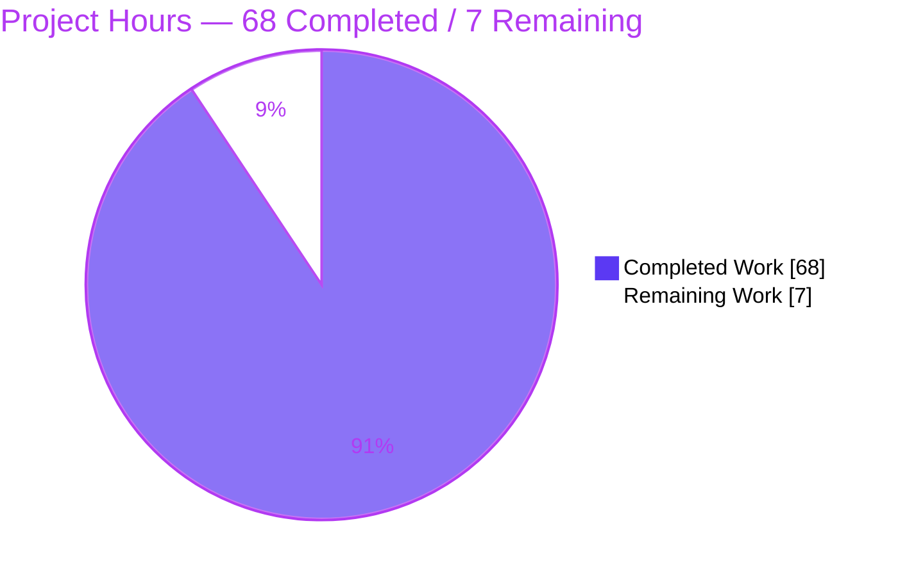
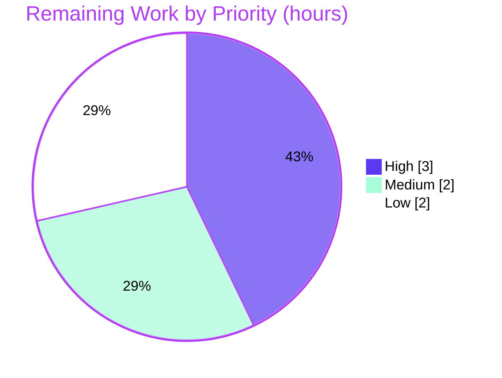

# Blitzy Project Guide — k6 HTTP Tracer Timing Investigation

> **Deliverable:** `blitzy/documentation/k6_ddc3b0b1d23c.md` — a read-only, run-code-first investigation adjudicating whether k6's HTTP request-timing metrics can be trusted and whether five reported anomalies warrant an upstream bug report.

---

## 1. Executive Summary

### 1.1 Project Overview

This project delivers a single authoritative investigation document that determines whether k6's HTTP request-timing metrics (`res.timings`: `blocked`, `connecting`, `tls_handshaking`, `sending`, `waiting`, `receiving`, `duration`) can be trusted for performance analysis, and adjudicates five reported anomalies as expected-by-design versus genuine defects. The audience is k6 users and maintainers debugging load-test timing. Grounded in the run-code-first methodology, every conclusion is backed by real runtime output from the canonical k6 binary plus exact `file:line` source references into the `lib/netext/httpext` tracer subsystem. The verdict: the metrics are trustworthy on all demonstrated paths, and no new upstream bug report is warranted.

### 1.2 Completion Status

The project is **90.7% complete**, measured strictly against Agent Action Plan (AAP) scope plus path-to-production work using the hours-based methodology: `Completion % = Completed Hours ÷ Total Hours = 68 ÷ 75 = 90.7%`.


| Metric | Hours |
|--------|:-----:|
| **Total Hours** | **75** |
| Completed Hours (AI + Manual) | 68 (68 AI + 0 Manual) |
| Remaining Hours | 7 |
| **Percent Complete** | **90.7%** |

> Colors: Completed = Dark Blue `#5B39F3`; Remaining = White `#FFFFFF`.

### 1.3 Key Accomplishments

- ✅ Delivered the single required artifact — `blitzy/documentation/k6_ddc3b0b1d23c.md` (3,120 lines) — named for the source branch.
- ✅ Produced a clear **trust verdict** for all seven populated timing metrics (all trustworthy) plus a correct explanation of the always-zero `looking_up` field.
- ✅ Produced a definitive **upstream recommendation**: no new bug report warranted.
- ✅ Adjudicated all five anomalies with observed evidence: A1 & A2 by-design, A3 "race" refuted, A4 known stdlib quirk (already guarded), A5 "double counting" refuted.
- ✅ Followed run-code-first methodology: canonical `go build`, real `./k6 run` against a local keep-alive HTTP/1.1 and HTTP/2 server, run-to-run distributions reported for the variance anomalies.
- ✅ Adjudicated the "race" hypothesis by execution: full tracer suite under the Go race detector — **253/253 PASS, 0 data races** (independently re-verified).
- ✅ Preserved the **read-only invariant**: only one file added; no source/test/config/vendored file modified; working tree clean.
- ✅ Grounded every claim in observed output plus an exact `file:line` reference, with all inferred (non-observed) statements explicitly labeled.

### 1.4 Critical Unresolved Issues

| Issue | Impact | Owner | ETA |
|-------|--------|-------|-----|
| _None._ No compilation errors, no failing tests, no missing deliverable, no unresolved defects. | None | — | — |

> All five production-readiness gates passed and were independently re-verified during this assessment. There are no blocking issues.

### 1.5 Access Issues

| System/Resource | Type of Access | Issue Description | Resolution Status | Owner |
|-----------------|----------------|-------------------|-------------------|-------|
| Windows test machine | Runtime environment | Anomaly 3's Windows timer-resolution cause could not be directly observed (assessment ran on Linux); it is correctly **labeled as inferred** in the document, per methodology | Open (optional; not an AAP gap) | Human reviewer |

No repository-permission, credential, or third-party API access issues were identified. The build is fully offline (`go mod verify` passes).

### 1.6 Recommended Next Steps

1. **[High]** Have a k6/Go-networking SME review the five anomaly adjudications and the §4 per-metric trust verdict for technical correctness (3h).
2. **[Medium]** Confirm the upstream recommendation by verifying that k6 issue #866 / PR #862 still tracks the HTTP/2 stdlib-retry caveat; decide whether to cross-link the document (1h).
3. **[Medium]** Review, sign off, and merge the document into the documentation tree; accept the §1.1 provenance note about the moving branch-tip banner (1h).
4. **[Low]** Optionally reproduce Anomaly 3's Windows timer-resolution cause on a Windows machine to upgrade that one explanation from "inferred" to "observed" (2h).

---

## 2. Project Hours Breakdown

### 2.1 Completed Work Detail

Every completed component traces to a specific AAP requirement (R1–R20). **Total = 68 hours.**

| Component | Hours | Description |
|-----------|:-----:|-------------|
| Environment setup, canonical build & version provenance | 3 | Build k6 in default config; capture `k6 v0.55.0 (go1.23.12)` banner; document provenance (§1.1). [R9] |
| Reproduction harness construction | 6 | Local keep-alive HTTP/1.1 + HTTP/2 TLS servers, k6 scripts, failure-transparent wrapper scripts (§7). [R11] |
| Source-code investigation & timing-pipeline mapping | 8 | Map tracer/transport/request/response/dialer/runner/metrics/error-codes into the hooks→`Trail`→`res.timings` pipeline (§2). [R3–R8 support] |
| Anomaly 1 adjudication (reuse zeros) | 4 | HTTP/1.1 + HTTP/2, 8-run stability, 24/24 reused samples = 0 (§3.1). [R4] |
| Anomaly 2 adjudication (`blocked` bimodal) | 4 | Same-input repetition, 32-sample distribution, cold vs warm (§3.2). [R5] |
| Anomaly 3 adjudication (Windows all-zero / "race") | 6 | Race-detector run + error/timeout/all-zero-incidence paths + Windows analysis (§3.3). [R6] |
| Anomaly 4 adjudication (`reused=false` + equal timestamps) | 3 | HTTP/2 false-`Reused` stdlib quirk and k6's in-tree guard (§3.4). [R7] |
| Anomaly 5 adjudication (multiple hook calls) | 4 | De-dup proof + HTTP/2 50-VU burst; "double counting" refuted (§3.5). [R8] |
| Maintainers' tracer test-suite execution | 2 | Full suite normal + `-race`; 253/253 PASS, 0 races (§3.3). [R10] |
| Web research | 3 | httptrace contract, keep-alive semantics, HTTP/2 `Reused` quirk, k6 #866/#862 (§2.1, §5). [R15–R17] |
| Per-metric trust verdict + upstream recommendation synthesis | 3 | §4 seven-field trust table; §5 recommendation. [R2, R3] |
| Document authoring | 12 | 3,120-line document, §1–§7, exact citations, complete unelided output. [R1] |
| Coverage pass | 2 | §6 addresses all 8 hooks, structures, five examples, methodology by name. [R14] |
| Citation verification + harness SHA-256 + cleanup + read-only proof | 3 | Verify every `file:line`; §7.3 integrity/cleanup evidence. [R13, R18–R20] |
| QA/review remediation | 5 | Four remediation commits (code-review findings, citation-range fixes, QA Report-5, §4 `blocked` range correction). |
| **Total** | **68** | |

### 2.2 Remaining Work Detail

Each remaining category traces to a path-to-production need. **Total = 7 hours.**

| Category | Hours | Priority |
|----------|:-----:|:--------:|
| SME technical review of the five anomaly adjudications & per-metric trust verdict | 3 | High |
| Upstream recommendation confirmation (verify k6 #866/#862 still tracks the caveat; decide cross-linking) | 1 | Medium |
| Document review, sign-off & merge into docs tree | 1 | Medium |
| Optional Windows reproduction of Anomaly 3 timer-resolution cause (inferred → observed) | 2 | Low |
| **Total** | **7** | |

### 2.3 Hours Reconciliation

- Completed (Section 2.1) = **68h**
- Remaining (Section 2.2) = **7h**
- Total = 68 + 7 = **75h** (matches Section 1.2)
- Completion = 68 ÷ 75 = **90.7%** (matches Sections 1.2, 7, 8)

---

## 3. Test Results

All tests below originate from Blitzy's autonomous validation logs and were **independently re-executed during this assessment** on Go 1.23.12 / `gcc 15.2.0`. The task is read-only, so these are the k6 maintainers' existing suites exercised as validation — no new tests were added.

| Test Category | Framework | Total Tests | Passed | Failed | Coverage % | Notes |
|---------------|-----------|:-----------:|:------:|:------:|:----------:|-------|
| Unit/Integration — full `lib/netext/httpext` (normal) | Go `testing` | 253 | 253 | 0 | N/A¹ | `go test -count=1 ./lib/netext/httpext/` → exit 0, ok 0.266s |
| Unit/Integration — full `lib/netext/httpext` (race detector) | Go `testing` + `-race` | 253 | 253 | 0 | N/A¹ | `CGO_ENABLED=1 go test -race -count=1 -timeout 210s` → exit 0, **0 data races**, ok 4.049s |
| Tracer suite (targeted: `TestTracer` / `TestTracerError` / `TestTracerNegativeHttpSendingValues` / `TestCancelledRequest`) | Go `testing` | 208 | 208 | 0 | N/A¹ | Includes the 200-way parallel cancelled-request stress test; passes normal and under `-race` |
| Dependency integrity | `go mod verify` | — | — | — | — | "all modules verified"; fully vendored, offline build |

¹ Coverage % is not a task metric: this is a read-only investigation that exercises the maintainers' existing suite for validation rather than adding new tests. Pass rate = 100% (253/253).

**Integrity note:** every test row above corresponds to Blitzy's autonomous test-execution logs for this project and was reproduced during assessment.

---

## 4. Runtime Validation & UI Verification

This is a CLI/library project — there is no UI. Runtime validation was performed through the canonical k6 entry point (compiled binary running real scripts).

- ✅ **Operational** — Canonical build: `go build -o k6 .` → exit 0; banner `k6 v0.55.0 (…, go1.23.12, linux/amd64)`.
- ✅ **Operational** — Anomaly 1 (reuse-zeros) reproduced end-to-end during assessment: cold iteration `connecting=0.158482`, `tls=2.197062`; warm iterations `connecting=0`, `tls=0` while `waiting` remained non-zero (real network activity).
- ✅ **Operational** — Anomaly 2 (bimodal `blocked`) reproduced: cold `≈2.52ms` vs warm `≈0.0003ms` for identical requests.
- ✅ **Operational** — Sink agreement confirmed: `http_req_connecting` med `0s`/max `158.48µs` and `http_req_tls_handshaking` med `0s`/max `2.19ms` line up with per-iteration `res.timings`.
- ✅ **Operational** — Anomaly 3 "race" hypothesis: full tracer suite (incl. 200 parallel cancelled requests) under `-race` → exit 0, `DATA_RACE_WARNINGS=0`.
- ✅ **Operational** — Error/timeout paths: all-zero `Trail` on request error (status 0); no-first-byte timeout dominated by `waiting`.
- ⚠ **Partial (by design / inferred)** — Anomaly 3's Windows timer-resolution cause is **inferred**, not observed (no Windows environment); correctly labeled as such in the document.
- ✅ **Operational** — Cleanup discipline: local server stopped by explicit PID, ports `18443`/`18444` freed, harness removed, repository left clean.

---

## 5. Compliance & Quality Review

Cross-maps AAP deliverables and governing rules to Blitzy quality benchmarks. Status reflects independent re-verification during this assessment.

| Benchmark / AAP Rule | Requirement | Status | Progress |
|----------------------|-------------|:------:|:--------:|
| Single deliverable (0.7.1) | Exactly one file: `blitzy/documentation/k6_ddc3b0b1d23c.md` | ✅ Pass | 100% |
| Read-only invariant (0.7.1) | No existing source/test/config/vendored file modified | ✅ Pass | 100% |
| Run-code-first (0.7.2) | Build & run real code paths; observe before writing | ✅ Pass | 100% |
| Canonical entry point (0.7.2) | Values observed via compiled `k6` binary running real scripts | ✅ Pass | 100% |
| Scale & stability (0.7.2) | Magnitudes confirmed stable across ≥2 runs at stated scale | ✅ Pass | 100% |
| Distribution reporting (0.7.2) | Variance anomalies reproduced with unchanged input; distribution reported | ✅ Pass | 100% |
| Race adjudication executed (0.8.1) | "Race" settled by running `-race`, not asserted | ✅ Pass | 100% |
| Grounding (0.7.2) | Every claim has observed output + `file:line`; inference labeled | ✅ Pass | 100% |
| Coverage pass (0.7.2) | Every named item/hook/condition/example addressed | ✅ Pass | 100% |
| Cleanup/non-interference (0.8.1) | Temp artifacts removed; repo unchanged; no leftover processes/ports | ✅ Pass | 100% |
| Trust verdict deliverable (0.1.1) | Per-metric verdict for all seven timings | ✅ Pass | 100% |
| Upstream recommendation deliverable (0.1.1) | Report-vs-by-design decision | ✅ Pass | 100% |
| Dependency integrity (0.4) | No dependency changes; `go mod verify` passes | ✅ Pass | 100% |

**Fixes applied during autonomous validation:** four remediation commits addressed code-review findings, five citation-range imprecisions, QA Report-5 findings, and a §4 `blocked` cold-range that contradicted its cited §3.2 evidence (corrected to `≈2.25–3.09 ms`).

**Outstanding compliance items:** none. The one inferred item (Windows timer cause) is permitted by methodology when the signal cannot be captured and is explicitly labeled.

---

## 6. Risk Assessment

| Risk | Category | Severity | Probability | Mitigation | Status |
|------|----------|:--------:|:-----------:|------------|:------:|
| Windows all-zero timer-resolution cause is inferred, not observed (no Windows env) | Technical | Low | Medium | Correctly labeled inferred per methodology; optional 2h Windows repro (HT-4) | Documented / Accepted |
| Conclusions pinned to Go 1.23.12 stdlib + k6 `ddc3b0b1d`; future upgrade could change hook/reuse semantics | Technical | Low | Low | Citations pinned to baseline commit; re-validate on toolchain/k6 bump | Documented |
| Captured version banner (`commit/6b4e9d2286`) differs from current HEAD (`7ef94938d5`) due to moving branch tip | Technical | Low | Occurred | §1.1 explains provenance and proves the `.go` tree is byte-identical to baseline | Resolved / Documented |
| No material security exposure (read-only doc; no source/dep/config change; `go mod verify` passes) | Security | None | — | N/A | N/A |
| Temporary observation artifacts (servers, `./k6`, ports 18443/18444) could linger | Operational | Low | Low | §7.3 explicit-PID teardown + port-free proof; clean tree re-confirmed | Resolved |
| Point-in-time citations could drift if tracer code later changes | Operational | Low | Low | Pinned to baseline; read-only invariant means no drift now | Documented |
| "No new upstream report" relies on external k6 #866 / PR #862 remaining the correct tracker | Integration | Low | Low | 1h human confirmation (HT-2) | Open (low) |
| No CI/CD, deployment, external-service, or credential integration in scope | Integration | None | — | N/A | N/A |

**Overall risk posture: LOW.** No High/Critical risks. Appropriate for a complete, verified, read-only single-file documentation deliverable.

---

## 7. Visual Project Status

**Project Hours Breakdown** (Completed = Dark Blue `#5B39F3`, Remaining = White `#FFFFFF`):



**Remaining Hours by Priority** (7h total):



**Remaining Hours by Category (Section 2.2):**

| Category | Hours |
|----------|:-----:|
| SME technical review | 3 |
| Upstream recommendation confirmation | 1 |
| Document review, sign-off & merge | 1 |
| Optional Windows reproduction | 2 |
| **Total** | **7** |

> **Integrity check:** "Remaining Work" = 7h in the pie chart equals the Section 1.2 Remaining Hours (7) and the Section 2.2 "Hours" total (7). ✔

---

## 8. Summary & Recommendations

**Achievements.** The project is **90.7% complete** (68 of 75 hours). The single required deliverable — `blitzy/documentation/k6_ddc3b0b1d23c.md` — is complete, committed, and independently verified. It answers both primary questions decisively: k6's `res.timings` are **trustworthy** on all demonstrated paths (HTTP/1.1 and HTTP/2 keep-alive, cold and warm, plus error/timeout), and **no new upstream bug report** is warranted. All five anomalies are adjudicated with observed evidence — two hypotheses ("race", "double counting") are refuted by running the code, two are by-design consequences of HTTP keep-alive and the `httptrace` contract, and one is a known Go stdlib HTTP/2 quirk that k6 already guards in-tree.

**Remaining gaps.** The remaining 7 hours are entirely human review and path-to-production activities — SME validation of the technical conclusions, confirmation of the external tracking issue, document sign-off/merge, and an optional Windows reproduction of the single inferred cause. **No autonomous engineering work (code, build, or tests) remains outstanding.**

**Critical path to production.** (1) SME conclusion review → (2) upstream-tracker confirmation → (3) sign-off and merge. The optional Windows reproduction can proceed in parallel or be deferred.

**Success metrics.** Build exit 0; 253/253 tests pass with zero data races under `-race`; `go mod verify` clean; read-only invariant preserved (single added file); every citation verified; core anomalies independently reproduced. All met.

**Production readiness.** For a documentation deliverable, this is release-ready pending human sign-off. Quality is high: rigorous grounding in observed output, exact `file:line` references, honest labeling of the one inferred item, and complete unelided evidence with a self-contained reproduction harness.

| Success Metric | Target | Actual | Met |
|----------------|:------:|:------:|:---:|
| Deliverable created at correct path | 1 file | 1 file (3,120 lines) | ✅ |
| Anomalies adjudicated | 5 | 5 | ✅ |
| Timing metrics with trust verdict | 7 | 7 (+ `looking_up` explained) | ✅ |
| Tests passing (full package) | 100% | 253/253 | ✅ |
| Data races under `-race` | 0 | 0 | ✅ |
| Read-only invariant | preserved | preserved | ✅ |

---

## 9. Development Guide

Every command below was executed during this assessment on Go 1.23.12 / `gcc 15.2.0` (Linux). Commands are copy-pasteable; run from the repository root unless noted.

### 9.1 System Prerequisites

- **Go** 1.23.x (observed: `go1.23.12`). The `Dockerfile` pins `golang:1.23-alpine3.20`.
- **gcc** (observed: `15.2.0`) — required only for the race detector (`CGO_ENABLED=1`).
- **git** — for provenance/read-only verification.
- OS/arch used: `linux/amd64`. Disk: repo is ~63 MB (excluding `.git`); the built `k6` binary is ~65 MB.

```bash
go version        # expect: go version go1.23.12 linux/amd64
gcc --version     # expect: gcc (Ubuntu 15.2.0-...) 15.2.0
git --version
```

### 9.2 Environment Setup & Read-Only Verification

```bash
# From the repository root
git rev-parse --abbrev-ref HEAD          # blitzy-33959ffe-5247-4d91-b493-c741bbdb5309

# Confirm the read-only invariant: only the deliverable was added since baseline
git diff --name-status ddc3b0b1d..HEAD   # A  blitzy/documentation/k6_ddc3b0b1d23c.md

# Working tree must be clean
git status --porcelain --ignored         # (empty output = clean)
```

### 9.3 Dependency Installation

k6 is fully vendored — no network access is required.

```bash
go mod verify     # expect: all modules verified
```

### 9.4 Canonical Build & Startup

```bash
go build -o k6 .          # exit 0
./k6 version              # k6 v0.55.0 (commit/<hash>, go1.23.12, linux/amd64)
```

### 9.5 Test Execution (validates the "race" adjudication)

```bash
# Full package (normal): expect ok, 253/253 pass
go test -count=1 ./lib/netext/httpext/

# Full package under the race detector: expect exit 0 and ZERO data races
CGO_ENABLED=1 go test -race -count=1 -timeout 210s ./lib/netext/httpext/

# Targeted tracer suite (incl. 200-way parallel cancelled-request stress)
go test -run 'TestTracer|TestCancelledRequest' -count=1 -v ./lib/netext/httpext/
```

### 9.6 Reproducing the Core Anomaly (verification)

Reproduces Anomaly 1 (reuse-zeros) and Anomaly 2 (bimodal `blocked`) through the canonical entry point. Run the harness **outside** the repository tree to preserve the read-only invariant.

```bash
mkdir -p /tmp/obs && cd /tmp/obs
# 1) Create a minimal self-signed TLS keep-alive server on 127.0.0.1:18443
#    (a stdlib-only Go program; see the document §7 appendix for full source).
# 2) Create a k6 script: 1 VU, 4 iterations, insecureSkipTLSVerify, http.get the
#    same endpoint, and console.log res.timings each iteration.

go mod init obs && go build -o server server.go
nohup ./server > server.log 2>&1 &            # capture PID for explicit teardown
SRV_PID=$!

/path/to/k6 run script.js                     # observe timings per iteration
```

**Expected output pattern (observed during assessment):**

```text
status=200 blocked=2.517881 connecting=0.158482 tls=2.197062 waiting=0.459522   # cold (iter 0)
status=200 blocked=0.000299 connecting=0        tls=0        waiting=0.254730   # warm (reused)
status=200 blocked=0.000419 connecting=0        tls=0        waiting=0.153572   # warm (reused)
status=200 blocked=0.000296 connecting=0        tls=0        waiting=0.235953   # warm (reused)
```

`connecting`/`tls_handshaking` are exactly `0` on reused connections while `waiting` stays non-zero — the by-design behavior, not a bug.

### 9.7 Cleanup (leave the repository unchanged)

```bash
kill "$SRV_PID"                               # stop the server by explicit PID
cd / && rm -rf /tmp/obs                        # remove the external harness
# Confirm nothing is left behind:
git -C /path/to/repo status --porcelain --ignored   # (empty = clean)
```

### 9.8 Reading the Deliverable

```bash
wc -l blitzy/documentation/k6_ddc3b0b1d23c.md          # 3120
sed -n '7,82p' blitzy/documentation/k6_ddc3b0b1d23c.md # §1 Bottom line
```

### 9.9 Troubleshooting

- **`go test -race` fails to build:** ensure `CGO_ENABLED=1` and that `gcc` is installed; the race detector requires a C toolchain.
- **TLS handshake / certificate errors in the k6 run:** set `insecureSkipTLSVerify: true` in the script `options` for a self-signed local server.
- **Port already in use (18443/18444):** a previous server may still be running; stop it by its explicit PID (never broad `pkill`).
- **`/dev/tcp` port probe reports "in use" right after kill:** this can be a `TIME_WAIT` socket; re-check after a short wait — the listener is gone once the process exits.
- **Version banner shows a different commit than `ddc3b0b1d`:** expected — Go stamps the banner from current VCS HEAD; the `.go` tree is byte-identical to the baseline (see document §1.1).

---

## 10. Appendices

### A. Command Reference

| Purpose | Command |
|---------|---------|
| Go / gcc versions | `go version` · `gcc --version` |
| Read-only invariant check | `git diff --name-status ddc3b0b1d..HEAD` |
| Working-tree cleanliness | `git status --porcelain --ignored` |
| Dependency integrity | `go mod verify` |
| Canonical build | `go build -o k6 .` |
| Version banner | `./k6 version` |
| Full test suite | `go test -count=1 ./lib/netext/httpext/` |
| Race-detector suite | `CGO_ENABLED=1 go test -race -count=1 -timeout 210s ./lib/netext/httpext/` |
| Targeted tracer suite | `go test -run 'TestTracer\|TestCancelledRequest' -count=1 -v ./lib/netext/httpext/` |
| Run a k6 script | `./k6 run script.js` |

### B. Port Reference

| Port | Purpose | Notes |
|------|---------|-------|
| 18443 | Local keep-alive HTTPS (HTTP/1.1) observation server | Temporary; outside repo; freed after teardown |
| 18444 | Local keep-alive HTTPS (HTTP/2) observation server | Temporary; outside repo; freed after teardown |

### C. Key File Locations

| Path | Role |
|------|------|
| `blitzy/documentation/k6_ddc3b0b1d23c.md` | **The deliverable** (3,120 lines) |
| `lib/netext/httpext/tracer.go` | HTTP tracer; `GotConn` reuse/non-reuse branches, `Done()` `Trail` math (384 lines) |
| `lib/netext/httpext/transport.go` | Fresh per-request `Tracer` (`L205`), metric emission (`L146`) |
| `lib/netext/httpext/request.go` | Populates `res.timings` from the `Trail` (`L98-L106`) |
| `lib/netext/httpext/response.go` | `ResponseTimings` struct (`L34-L43`); always-zero `looking_up` |
| `lib/netext/httpext/tracer_test.go` | Maintainer tests: reuse zero-asserts, Windows hack, 200-way cancellation |
| `lib/netext/dialer.go` | Single-IP resolution (relevant to multiple-`ConnectStart`) |
| `js/runner.go` | Base `net.Dialer` config (`L90-L93`) |
| `metrics/builtin.go` | Metric names + `Trend`/`Time` registration |
| `lib/consts/consts.go` | `Version = "0.55.0"` (`L12`); `FullVersion` banner format (`L52`) |

### D. Technology Versions

| Component | Version |
|-----------|---------|
| Module | `go.k6.io/k6` |
| k6 | v0.55.0 |
| Go toolchain (build/test) | go1.23.12 |
| go.mod declared | `go 1.21`, `toolchain go1.21.13` |
| Dockerfile base | `golang:1.23-alpine3.20` |
| gcc (race detector) | 15.2.0 |
| OS / arch | linux/amd64 |
| Baseline commit | `ddc3b0b1d23c…` |
| Delivery HEAD | `7ef94938d5…` |

### E. Environment Variable Reference

| Variable | Value | Purpose |
|----------|-------|---------|
| `CGO_ENABLED` | `1` | Enables the Go race detector (`go test -race`) |
| `GOTOOLCHAIN` | `local` | Use the locally installed Go toolchain |

### F. Developer Tools Guide

- **Go test race detector** — the primary tool used to adjudicate Anomaly 3's "race" hypothesis; requires `CGO_ENABLED=1` and `gcc`.
- **k6 CLI (`./k6 run`)** — the canonical entry point; all `res.timings` values are observed from real runs, never from debug hooks.
- **git diff / status** — used to prove the read-only invariant and working-tree cleanliness.
- **`go mod verify`** — confirms vendored-dependency integrity for offline builds.

### G. Glossary

| Term | Meaning |
|------|---------|
| `res.timings` | JS-facing object exposing per-request timings to k6 scripts |
| `Trail` | Internal struct built by `Tracer.Done()` holding the seven timing durations |
| `blocked` | Connection-acquisition time = `gotConn − getConn` (DNS + TCP + TLS + pool wait) |
| `connecting` | TCP connect time = `connectDone − connectStart` (0 on reuse) |
| `tls_handshaking` | TLS handshake time (0 on reuse) |
| Keep-alive reuse | Reusing one TCP connection for multiple requests; no new dial/TLS → zero `connecting`/`tls_handshaking` |
| Happy Eyeballs | Dual-stack dialing where `ConnectStart`/`ConnectDone` may fire multiple times (Go stdlib contract) |
| False-`Reused` | Go HTTP/2 stdlib quirk where `GotConn` reports `Reused` inconsistently; k6 guards it in-tree |
| `SwapInt64` vs `CompareAndSwapInt64` | Overwrite-to-latest (reuse branch) vs keep-first (dial/TLS hook de-dup) atomic disciplines |
| AAP | Agent Action Plan — the governing requirements for this task |
