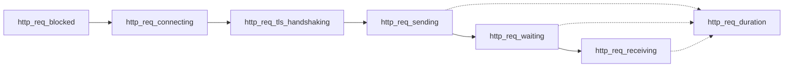

# Technical Specification

# 0. Agent Action Plan

## 0.1 Intent Clarification

### 0.1.1 Core Documentation Objective

Based on the provided requirements, the Blitzy platform understands that the documentation objective is to **create new documentation** that comprehensively answers the user's questions about the Grafana k6 load-testing tool's behavior, workflow, output, and configuration — all derived directly from analysis of the k6 source code and verified through live execution.

- **Documentation Category**: Create new documentation
- **Documentation Type**: Technical knowledge-base answer document (Q&A-style reference)
- **Target Audience**: A developer who is new to k6 and wants to understand its fundamental behavior before writing tests

The user seeks to understand the following specific areas:

- **Basic Workflow**: How to write a minimal k6 load-testing script and execute it against a single HTTP endpoint
- **Execution Output**: What the console output looks like during and after a run — specifically the metrics, their units, and the protocol information reported
- **Run Command**: The exact CLI command used to execute a script, along with available flags
- **Configuration and Environment Variables**: Whether k6 requires any special configuration or environment variables to function
- **External File Generation**: Whether k6 creates any files on disk as a side effect of running a test
- **Script Validation**: Whether k6 enforces any structural or syntactic validation logic on the test script before execution

### 0.1.2 Special Instructions and Constraints

The following constraints have been explicitly provided:

- **No repository file modifications**: The user has stated that no existing repository files may be changed. The implementation rule `SWE-AtlasQnA-Repo` reinforces this: "Do not modify any existing files in the source repository."
- **Temporary artifacts must be cleaned up**: The user permits creating temporary test scripts for experimentation but requires that all such artifacts be deleted before the conversation ends. All temporary files created during analysis (`/tmp/k6_simple_test.js`, `/tmp/k6_with_checks.js`, `/tmp/k6_broken.js`, `/tmp/k6_no_default.js`, `/tmp/k6_threshold_test.js`, `/tmp/k6_results.json`, `/tmp/k6_summary.json`) have already been deleted.
- **Output document format**: Per rule `SWE-AtlasQnA-Repo`, the output must be a new markdown document named `k6_ddc3b0b1d23c.md` placed in the `blitzy/documentation` directory.
- **Answers must be grounded in code**: "Do not make assumptions, base your answers on the code as the truth."
- **Provide rationale**: "Provide thinking / rationale behind the answers."

### 0.1.3 Technical Interpretation

These documentation requirements translate to the following technical documentation strategy:

- To **explain the basic workflow**, we will document the script structure expected by k6 (the `export default function` entry point, the `import http from 'k6/http'` module import pattern, and the `export const options` configuration object), citing the embedded template in `cmd/new.go` and the example script in `examples/http_get.js`.
- To **describe execution output**, we will catalog all built-in metrics from `metrics/builtin.go`, their metric types from `metrics/metric_type.go`, their value types from `metrics/value_type.go`, the time unit (milliseconds) from `metrics/units.go`, the sink aggregation formats from `metrics/sink.go`, and the system tags from `metrics/system_tag.go`. We will also include the actual captured console output from running k6 against `https://test.k6.io`.
- To **document the run command**, we will cite the Cobra command definition in `cmd/run.go` (the `getCmdRun` function), the option flags in `cmd/options.go`, and the runtime option flags in `cmd/runtime_options.go`.
- To **address configuration requirements**, we will document the config file path from `cmd/config.go`, the environment variables from `cmd/config.go` and `cmd/runtime_options.go`, and confirm that no pre-configuration is required for basic usage.
- To **answer file generation questions**, we will explain that k6 does not generate external files by default, and only does so when explicitly requested via `--out`, `--summary-export`, or `--console-output` flags, citing `cmd/run.go` and `cmd/outputs.go`.
- To **describe validation logic**, we will document k6's script validation behavior: JavaScript syntax checking via the Sobek engine, the requirement for a `default` exported function, and threshold expression parsing from `metrics/thresholds_parser.go`.

### 0.1.4 Inferred Documentation Needs

Based on code analysis, the following implicit documentation needs have been identified:

- **Metric type taxonomy**: The user asked about "metrics, units, and protocols" — this requires explaining the four metric types (Counter, Gauge, Trend, Rate) and their respective summary statistics, which is not obvious from the output alone
- **HTTP timing breakdown**: The built-in HTTP metrics decompose request duration into `blocked`, `connecting`, `tls_handshaking`, `sending`, `waiting`, and `receiving` phases — explaining this breakdown adds essential context for understanding the output
- **System tags and protocol detection**: The user asked about "protocols it reports" — this maps to the system tag `proto` (which reports values like `HTTP/2.0`) and `tls_version` (which reports values like `tls1.3`), both visible in the JSON output structure
- **Exit code behavior**: The threshold evaluation logic in `cmd/run.go` determines exit codes, which is critical for CI/CD integration understanding
- **The `checks` metric**: Since checks appear in the output when `check()` is used, the relationship between checks and the `checks` Rate metric should be explained

## 0.2 Documentation Discovery and Analysis

### 0.2.1 Existing Documentation Infrastructure Assessment

Repository analysis reveals a **design-proposal-oriented documentation structure** with minimal user-facing guides within the repository itself. k6's primary user documentation is hosted externally at `https://grafana.com/docs/k6/latest/` and is not part of this codebase.

- **In-repository documentation**: The `docs/` directory contains only `docs/design/` — a collection of architectural design proposals for future features (new HTTP API, file API, distributed execution). No user guides, API references, or tutorials exist within the repository.
- **README.md**: Provides a project overview, feature highlights, and an example script; serves as the main in-repo introduction
- **CONTRIBUTING.md**: Contributor guidelines for code contributions
- **SUPPORT.md**: Routing for support questions
- **SECURITY.md**: Security disclosure process
- **Dependencies.md**: Dependency maintenance policy
- **No documentation generator**: No `mkdocs.yml`, `docusaurus.config.js`, `sphinx.conf.py`, or similar configuration was found in the repository
- **No API documentation tooling**: No JSDoc, Godoc generation configs, or similar tooling detected
- **Diagram support**: Mermaid is not configured in-repo, but k6's external documentation uses it extensively
- **Example scripts**: The `examples/` directory contains 30+ runnable JavaScript example scripts covering HTTP, WebSocket, gRPC, browser, TLS, crypto, custom metrics, thresholds, and more — these serve as living documentation

### 0.2.2 Repository Code Analysis for Documentation

The following search patterns and key directories were examined to extract the information needed for the user's questions:

**Script structure and entry points:**
- `cmd/new.go` — Contains the `defaultNewScriptTemplate` that defines the canonical k6 script structure (imports, options export, default function)
- `examples/http_get.js` — Simplest possible k6 HTTP script (2 lines of code)
- `examples/custom_metrics.js` — Demonstrates the four custom metric types with detailed comments

**Metrics system:**
- `metrics/builtin.go` — Defines all 25+ built-in metric names and their registration with correct metric types and value types
- `metrics/metric_type.go` — Defines `Counter`, `Gauge`, `Trend`, `Rate` enum with supported aggregation methods
- `metrics/value_type.go` — Defines `Default`, `Time`, `Data` value type enum
- `metrics/units.go` — Hardcodes `timeUnit = time.Millisecond` as the emission unit for time-typed metrics
- `metrics/sink.go` — Implements `CounterSink.Format()` (count + rate), `GaugeSink.Format()` (value), `TrendSink.Format()` (min, max, avg, med, p90, p95), `RateSink.Format()` (rate)
- `metrics/system_tag.go` — Defines the 18 system tags including `proto`, `tls_version`, `status`, `method`, `url`, `name`

**Command and configuration:**
- `cmd/run.go` — Full `k6 run` lifecycle: load script → create scheduler → start outputs → run → finalize thresholds → generate summary
- `cmd/config.go` — `Config` struct with `K6_OUT`, `K6_LINGER`, `K6_NO_USAGE_REPORT`, `K6_WEB_DASHBOARD` env vars
- `cmd/runtime_options.go` — Runtime flags and `K6_TYPE`, `K6_COMPATIBILITY_MODE`, `K6_NO_THRESHOLDS`, `K6_NO_SUMMARY`, `K6_SUMMARY_EXPORT`, `K6_TRACES_OUTPUT`, `SSLKEYLOGFILE` env vars
- `cmd/options.go` — All CLI option flags: `--vus`, `--duration`, `--iterations`, `--stage`, `--summary-trend-stats`, etc.
- `cmd/outputs.go` — Output backend constructors: `json`, `cloud`, `csv`, `influxdb`, `web-dashboard`, `experimental-prometheus-rw`, `experimental-opentelemetry`
- `cmd/root.go` — Root command registration, global flags (`--address`, `--config`, `--log-format`, `--no-color`, `--quiet`, `--verbose`)

**Summary rendering:**
- `js/summary.js` — The JavaScript text-summary renderer that formats metrics into the aligned, colorized end-of-test console table
- `js/summary-wrapper.js` — Bootstrap wrapper that supports legacy JSON summary export

**Validation behavior:**
- Sobek engine (in `js/`) performs JavaScript parsing and reports syntax errors
- `cmd/run.go` line 103: `loadConfiguredTest()` validates the script can be loaded and has a `default` export
- `metrics/thresholds_parser.go` — Tokenizes and validates threshold expressions

### 0.2.3 Web Search Research Conducted

- Confirmed that k6's official documentation at `https://grafana.com/docs/k6/latest/` covers metrics, results output, thresholds, and options comprehensively
- Verified that the end-of-test summary prints metrics with trend statistics (avg, min, med, max, p(90), p(95)) in milliseconds by default
- Confirmed `http_req_duration` is the primary metric for HTTP response time analysis, decomposed into sending, waiting, and receiving phases
- Validated that k6 uses HTTP/2.0 protocol detection and TLS version reporting via system tags

## 0.3 Documentation Scope Analysis

### 0.3.1 Code-to-Documentation Mapping

The following source code modules provide the authoritative information needed to answer the user's questions. Each module is mapped to the specific documentation content it enables:

- **Module: `cmd/new.go`**
  - Public APIs: `defaultNewScriptTemplate`, `getCmdNewScript()`
  - Current documentation: Template is self-documenting with inline comments
  - Documentation needed: Extract the canonical script structure to show the user what a basic k6 script looks like

- **Module: `cmd/run.go`**
  - Public APIs: `cmdRun.run()`, `getCmdRun()`, `handleSummaryResult()`
  - Current documentation: Cobra command `Use`, `Short`, `Long`, `Example` text
  - Documentation needed: Document the execution command, its flags, the test lifecycle, and summary generation behavior

- **Module: `cmd/options.go`**
  - Public APIs: `optionFlagSet()`, `getOptions()`
  - Current documentation: Flag help strings in the flag set
  - Documentation needed: Catalog all available CLI flags that control test behavior

- **Module: `cmd/runtime_options.go`**
  - Public APIs: `runtimeOptionFlagSet()`, `getRuntimeOptions()`
  - Current documentation: Flag help strings and environment variable mapping
  - Documentation needed: List all supported environment variables

- **Module: `cmd/config.go`**
  - Public APIs: `Config` struct, `configFlagSet()`
  - Current documentation: `envconfig` struct tags
  - Documentation needed: Document configuration file path and output-related env vars

- **Module: `metrics/builtin.go`**
  - Public APIs: `BuiltinMetrics` struct, `RegisterBuiltinMetrics()`
  - Current documentation: Constant names only, no descriptive documentation
  - Documentation needed: Complete reference table of all built-in metrics with types, units, and descriptions

- **Module: `metrics/metric_type.go`**
  - Public APIs: `Counter`, `Gauge`, `Trend`, `Rate` constants
  - Current documentation: One-line comments for each type
  - Documentation needed: Explain what each metric type measures and how it appears in the summary

- **Module: `metrics/sink.go`**
  - Public APIs: `CounterSink.Format()`, `GaugeSink.Format()`, `TrendSink.Format()`, `RateSink.Format()`
  - Current documentation: None beyond method signatures
  - Documentation needed: Document the aggregation statistics produced by each metric type

- **Module: `metrics/units.go`**
  - Public APIs: `D()`, `ToD()`, `B()`, `timeUnit` constant
  - Current documentation: Brief function comments
  - Documentation needed: Explain that all time-typed metrics are reported in milliseconds

- **Module: `metrics/system_tag.go`**
  - Public APIs: `SystemTag` enum, `DefaultSystemTagSet`
  - Current documentation: Constant names with `//go:generate` comment
  - Documentation needed: List all system tags including protocol-related ones (`proto`, `tls_version`)

- **Module: `cmd/outputs.go`**
  - Public APIs: `getAllOutputConstructors()`, `createOutputs()`
  - Current documentation: Error messages referencing deprecated outputs
  - Documentation needed: List available output backends and how to enable them

### 0.3.2 Documentation Gap Analysis

Given the requirements and repository analysis, the documentation this task addresses fills the following gaps:

- **No beginner-oriented "how k6 works" document** exists in the repository — the README provides a high-level overview but does not walk through the output format or explain individual metrics
- **Built-in metric reference** in the source code (`metrics/builtin.go`) lists names only, with no descriptions of what each metric measures
- **Console output format** is generated by `js/summary.js` but its structure is not documented anywhere in the repository
- **Validation behavior** is implemented across multiple files (`js/`, `cmd/run.go`, `metrics/thresholds_parser.go`) but not documented in a consolidated location
- **Environment variable inventory** is scattered across `cmd/config.go` and `cmd/runtime_options.go` with no central reference
- **File generation behavior** is implicit — the fact that k6 does not create files by default is not explicitly stated anywhere

## 0.4 Documentation Implementation Design

### 0.4.1 Documentation Structure Planning

The output document `blitzy/documentation/k6_ddc3b0b1d23c.md` will be organized as a single comprehensive markdown file with the following structure:

```
blitzy/documentation/
└── k6_ddc3b0b1d23c.md
    ├── Introduction / Context
    ├── Q1: Basic Workflow — Writing and Running a k6 Script
    │   ├── Script Structure (from cmd/new.go, examples/http_get.js)
    │   ├── Minimal Single-HTTP-Request Script
    │   └── Execution Command (from cmd/run.go)
    ├── Q2: Understanding the Output
    │   ├── Output Structure Walkthrough (captured from live execution)
    │   ├── Banner and Execution Metadata
    │   ├── Scenario Description
    │   ├── Checks Section (when applicable)
    │   ├── Metrics Table — Full Breakdown
    │   └── Progress Bar
    ├── Q3: Metrics, Units, and Protocols
    │   ├── Metric Types (Counter, Gauge, Trend, Rate)
    │   ├── Built-in HTTP Metrics Reference Table
    │   ├── Units (ms, µs, kB, %, count/s)
    │   ├── Protocol and TLS Detection (system tags)
    │   └── HTTP Timing Decomposition Diagram
    ├── Q4: Command and Flags
    │   ├── Basic Run Command
    │   ├── Key CLI Flags
    │   └── Example Invocations
    ├── Q5: Configuration and Environment Variables
    │   ├── Config File (default path, format)
    │   ├── Environment Variables Reference
    │   └── In-Script Options
    ├── Q6: External File Generation
    │   ├── Default Behavior (no files)
    │   ├── --out flag (JSON, CSV, InfluxDB)
    │   ├── --summary-export flag
    │   └── --console-output flag
    ├── Q7: Script Validation Logic
    │   ├── JavaScript Syntax Validation
    │   ├── Default Export Requirement
    │   ├── Threshold Expression Validation
    │   └── Options Schema Validation
    └── Source Citations
```

### 0.4.2 Content Generation Strategy

**Information Extraction Approach:**
- Extract the canonical script template from `cmd/new.go` (the `defaultNewScriptTemplate` variable) to show the expected script structure
- Extract built-in metric names and types from `metrics/builtin.go` (the `RegisterBuiltinMetrics` function)
- Extract metric type descriptions and aggregation methods from `metrics/metric_type.go` (the `supportedAggregationMethods()` method)
- Extract unit information from `metrics/units.go` (the `timeUnit = time.Millisecond` constant)
- Extract sink format fields from `metrics/sink.go` (each sink's `Format()` method return map)
- Extract system tags from `metrics/system_tag.go` (the `SystemTag` enum and `DefaultSystemTagSet`)
- Extract CLI flags from `cmd/options.go` and `cmd/runtime_options.go`
- Extract environment variables from `cmd/config.go` and `cmd/runtime_options.go` (the `envconfig` struct tags)
- Use captured live execution output as the authoritative reference for what users will see

**Documentation Standards:**
- Markdown formatting with proper headers (`#`, `##`, `###`)
- Code examples using fenced code blocks with `js` and `bash` language tags
- Tables for metric reference and environment variable lists
- Source citations as inline references: `Source: metrics/builtin.go`
- Mermaid diagram for HTTP timing decomposition

### 0.4.3 Diagram and Visual Strategy

The following Mermaid diagram will be included in the documentation to explain HTTP request timing decomposition:



This diagram illustrates that `http_req_duration` = `http_req_sending` + `http_req_waiting` + `http_req_receiving`, while `http_req_blocked` encompasses the DNS lookup, TCP connection, and TLS handshake phases that occur before the actual request is sent.

## 0.5 Documentation File Transformation Mapping

### 0.5.1 File-by-File Documentation Plan

| Target Documentation File | Transformation | Source Code/Docs | Content/Changes |
|---------------------------|----------------|------------------|-----------------|
| `blitzy/documentation/k6_ddc3b0b1d23c.md` | CREATE | `cmd/new.go`, `cmd/run.go`, `cmd/options.go`, `cmd/runtime_options.go`, `cmd/config.go`, `cmd/outputs.go`, `cmd/root.go`, `cmd/common.go`, `metrics/builtin.go`, `metrics/metric_type.go`, `metrics/value_type.go`, `metrics/units.go`, `metrics/sink.go`, `metrics/system_tag.go`, `metrics/thresholds_parser.go`, `js/summary.js`, `examples/http_get.js`, `examples/custom_metrics.js`, `examples/thresholds.js`, `examples/stages.js`, `README.md` | Comprehensive Q&A document answering all user questions about k6 behavior, metrics, output, commands, configuration, file generation, and validation — grounded in source code evidence and verified via live execution |

No existing files are modified. No files are deleted. No files are used as REFERENCE templates since this is a standalone knowledge-base document.

### 0.5.2 New Documentation File Detail

```
File: blitzy/documentation/k6_ddc3b0b1d23c.md
Type: Technical Q&A / Knowledge-Base Document
Source Code: cmd/new.go, cmd/run.go, cmd/options.go,
             cmd/runtime_options.go, cmd/config.go,
             cmd/outputs.go, metrics/builtin.go,
             metrics/metric_type.go, metrics/value_type.go,
             metrics/units.go, metrics/sink.go,
             metrics/system_tag.go, js/summary.js,
             examples/http_get.js
Sections:
    - Introduction and context
    - Basic workflow: script structure and execution
    - Console output walkthrough with annotated real output
    - Built-in metrics reference (all 25+ metrics with types and units)
    - Metric type taxonomy (Counter, Gauge, Trend, Rate)
    - HTTP timing decomposition with Mermaid diagram
    - CLI command reference (k6 run and key flags)
    - Configuration: config file, environment variables, in-script options
    - External file generation behavior
    - Script validation logic
    - Source citations
Diagrams:
    - Mermaid: HTTP request timing decomposition
    - Mermaid: k6 test lifecycle (init → setup → VU code → teardown → summary)
Key Citations:
    metrics/builtin.go, metrics/sink.go, metrics/units.go,
    cmd/run.go, cmd/new.go, cmd/options.go,
    cmd/runtime_options.go, cmd/config.go, cmd/outputs.go,
    metrics/system_tag.go, js/summary.js
```

### 0.5.3 Documentation Configuration Updates

No documentation configuration files need to be updated. The `blitzy/documentation/` directory is a standalone output location that does not integrate with any documentation generator (no mkdocs, Sphinx, or Docusaurus configuration exists in the repository).

### 0.5.4 Cross-Documentation Dependencies

- **No shared content or includes**: The output document is self-contained
- **No navigation links**: Not part of a documentation site
- **No table of contents updates**: No site-level index to modify
- **No glossary updates**: No existing glossary in the repository

## 0.6 Dependency Inventory

### 0.6.1 Documentation Dependencies

The following tools and packages are relevant to producing and verifying this documentation:

| Registry | Package Name | Version | Purpose |
|----------|--------------|---------|---------|
| Go module | `go.k6.io/k6` | v0.55.0 | The k6 binary itself — installed and executed to capture real output for documentation accuracy |
| Go module | `go` | 1.21.13 | Go toolchain version specified in `go.mod` — the runtime k6 is built with |
| Go module | `github.com/spf13/cobra` | (vendored) | CLI framework that defines the `k6 run` command structure documented in this task |
| Go module | `github.com/spf13/pflag` | (vendored) | Flag parsing library that defines all CLI flags documented in this task |
| Go module | `github.com/mstoykov/envconfig` | (vendored) | Environment variable binding library used by `cmd/config.go` for `K6_*` env vars |
| Binary | `k6` | v0.55.0 | Pre-built k6 binary used for live test execution to verify and capture output |

No documentation generation tools (mkdocs, Sphinx, Docusaurus, typedoc) are required for this task. The output is a plain Markdown file that requires no build step.

### 0.6.2 Documentation Reference Updates

No link updates are required. The new document `blitzy/documentation/k6_ddc3b0b1d23c.md` is a standalone file that does not require integration into any existing navigation, link structure, or documentation site.

## 0.7 Coverage and Quality Targets

### 0.7.1 Documentation Coverage Metrics

The user's prompt contains seven distinct questions. Coverage is measured by whether each question is fully addressed with code-grounded evidence:

| Question | Topic | Coverage Target | Source Files |
|----------|-------|-----------------|--------------|
| Q1 | Basic workflow: writing and running a script | 100% — full walkthrough with minimal script example | `cmd/new.go`, `examples/http_get.js` |
| Q2 | Testing a single HTTP request | 100% — complete working example with explanation | `examples/http_get.js`, `cmd/run.go` |
| Q3 | Console output: metrics, units, protocols | 100% — all 25+ built-in metrics cataloged with types, units, and protocol tags | `metrics/builtin.go`, `metrics/units.go`, `metrics/sink.go`, `metrics/system_tag.go` |
| Q4 | Execution command | 100% — `k6 run` command with all relevant flags | `cmd/run.go`, `cmd/options.go`, `cmd/runtime_options.go` |
| Q5 | Configuration and environment variables | 100% — config file path, all `K6_*` env vars, in-script options | `cmd/config.go`, `cmd/runtime_options.go` |
| Q6 | External file generation | 100% — default behavior (none) and opt-in mechanisms | `cmd/run.go`, `cmd/outputs.go` |
| Q7 | Script validation logic | 100% — syntax, default export, threshold, and options validation | `cmd/run.go`, `metrics/thresholds_parser.go` |

**Overall target coverage**: 100% of user questions answered with source code evidence.

### 0.7.2 Documentation Quality Criteria

**Completeness requirements:**
- Every user question receives a direct, explicit answer
- All built-in HTTP metrics are listed with name, type, unit, and description
- All relevant environment variables are cataloged
- All relevant CLI flags for the `k6 run` command are documented
- Real captured output from live k6 execution is included as the authoritative reference

**Accuracy validation:**
- All metric names verified against `metrics/builtin.go` constants
- All metric types verified against `RegisterBuiltinMetrics()` registration calls
- Time unit (milliseconds) verified from `metrics/units.go` constant `timeUnit = time.Millisecond`
- Sink format fields verified from each sink's `Format()` method in `metrics/sink.go`
- Console output captured from actual k6 v0.55.0 execution against `https://test.k6.io`
- Validation error messages captured from actual k6 execution with broken scripts

**Clarity standards:**
- Progressive disclosure: start with the simplest possible script, then layer in complexity
- Each answer begins with a concise direct response, followed by supporting detail
- Code examples are minimal and focused — no more than 5-10 lines each
- Tables used for structured reference data (metrics, env vars, flags)
- Mermaid diagrams for visual concepts (HTTP timing decomposition)

**Maintainability:**
- Source citations included for every factual claim
- Version-specific: clearly states k6 v0.55.0 as the reference version
- Self-contained: no external links required to understand the content

### 0.7.3 Example and Diagram Requirements

- **Minimum code examples**: At least one complete, runnable k6 script; one `k6 run` invocation; one example of output with thresholds
- **Diagram types**: Mermaid flowchart for HTTP timing decomposition; Mermaid flowchart for k6 test lifecycle
- **Code example testing**: All code examples verified by executing them with the installed k6 v0.55.0 binary during the analysis phase
- **Visual content freshness**: Tied to k6 v0.55.0; output captures are from this specific version

## 0.8 Scope Boundaries

### 0.8.1 Exhaustively In Scope

**New documentation files:**
- `blitzy/documentation/k6_ddc3b0b1d23c.md` — The sole deliverable: a comprehensive markdown document answering all user questions about k6 behavior

**Documentation content areas:**
- Basic k6 script structure and the `export default function` entry point
- The `k6 run` command and its flags (`--vus`, `--duration`, `--iterations`, `--out`, `--summary-export`, etc.)
- Complete built-in metrics reference for HTTP-related metrics (from `metrics/builtin.go`)
- Metric type taxonomy: Counter, Gauge, Trend, Rate (from `metrics/metric_type.go`)
- Value type system: Default, Time (milliseconds), Data (bytes) (from `metrics/value_type.go`)
- Sink aggregation formats: count/rate, value, avg/min/med/max/p(90)/p(95), rate (from `metrics/sink.go`)
- System tags including protocol detection: `proto`, `tls_version`, `status`, `method`, `url` (from `metrics/system_tag.go`)
- Console output format: banner, execution metadata, scenarios, checks, metrics table, progress bar
- Configuration: config file location (`/root/.config/loadimpact/k6/config.json`), environment variables (`K6_*`)
- External file generation: default behavior (none) and opt-in mechanisms (`--out`, `--summary-export`, `--console-output`)
- Script validation: JavaScript syntax checking, `default` export requirement, threshold expression parsing, options validation

**Source code files examined (read-only):**
- `cmd/run.go`, `cmd/new.go`, `cmd/options.go`, `cmd/runtime_options.go`, `cmd/config.go`
- `cmd/outputs.go`, `cmd/root.go`, `cmd/common.go`
- `metrics/builtin.go`, `metrics/metric_type.go`, `metrics/value_type.go`, `metrics/units.go`
- `metrics/sink.go`, `metrics/system_tag.go`, `metrics/thresholds_parser.go`
- `js/summary.js`, `js/summary-wrapper.js`
- `examples/http_get.js`, `examples/custom_metrics.js`, `examples/thresholds.js`, `examples/stages.js`
- `go.mod`, `Makefile`, `README.md`

### 0.8.2 Explicitly Out of Scope

- **Source code modifications**: No Go, JavaScript, or configuration files in the k6 repository will be modified (per explicit user instruction)
- **Test file modifications**: No test files will be created or modified in the repository
- **Feature additions or code refactoring**: This is a documentation-only task
- **Advanced k6 topics**: Cloud execution (`k6 cloud`), distributed testing, browser automation, gRPC testing, WebSocket testing, custom extensions — these are not asked about
- **External documentation updates**: The Grafana k6 docs site (`grafana.com/docs/k6/`) is not part of this repository
- **Non-HTTP metrics**: While WebSocket (`ws_*`), gRPC (`grpc_*`), and browser metrics exist, the user's focus is on HTTP request testing — these will be acknowledged but not exhaustively documented
- **Deployment configuration**: Docker, Kubernetes, CI/CD pipeline configuration — not relevant to the user's questions
- **Performance benchmarking**: The user wants to understand k6's behavior, not benchmark a target system
- **Custom metric creation**: Mentioned for completeness in the metric type taxonomy, but not a focus of the user's questions
- **Output backend configuration**: Detailed InfluxDB, Prometheus, or Grafana Cloud setup — only the existence of `--out` flag and available backends will be noted

## 0.9 Execution Parameters

### 0.9.1 Documentation-Specific Instructions

- **Documentation build command**: Not applicable — the output is a single Markdown file that requires no build step
- **Documentation preview command**: Any Markdown viewer or `cat blitzy/documentation/k6_ddc3b0b1d23c.md`
- **Diagram generation command**: Mermaid diagrams are embedded inline in the Markdown and rendered by any Mermaid-compatible viewer (GitHub, VS Code with Mermaid extension, etc.)
- **Documentation deployment command**: Not applicable — file is committed to the `blitzy/documentation/` directory
- **Default format**: Markdown with embedded Mermaid diagrams and fenced code blocks
- **Citation requirement**: Every technical claim must reference the specific source file (e.g., `Source: metrics/builtin.go`)
- **Style guide**: Follow the implementation rule: provide thinking/rationale behind answers, ground everything in the code as truth, do not make assumptions
- **Documentation validation**: Verify that the Markdown file is well-formed and all code examples are syntactically correct

### 0.9.2 Environment and Runtime Configuration

The following environment was used for analysis and will be documented in the output:

| Component | Value | Source |
|-----------|-------|--------|
| k6 version | v0.55.0 | `lib/consts/consts.go`, verified via `k6 version` |
| Go version (build) | go1.23.3 | Reported by `k6 version` (binary build toolchain) |
| Go version (repo spec) | go1.21 / toolchain go1.21.13 | `go.mod` lines 3-5 |
| Branch name | `k6_ddc3b0b1d23c` | `git branch --show-current` in repository checkout |
| Output file | `blitzy/documentation/k6_ddc3b0b1d23c.md` | Rule `SWE-AtlasQnA-Repo`: filename = branch name |
| Test target URL | `https://test.k6.io` | Used in examples and live execution capture |
| Config file default path | `/root/.config/loadimpact/k6/config.json` | `cmd/root.go` global flag `--config` default |
| Compatibility mode | `extended` | `cmd/runtime_options.go` default |

## 0.10 Rules for Documentation

The following rules govern the creation of the documentation output, derived from the user's explicit instructions and the `SWE-AtlasQnA-Repo` implementation rule:

- **Do not modify any existing files in the source repository**: No Go source files, JavaScript examples, configuration files, or any other existing repository files may be changed. The documentation is produced by reading and analyzing the code, not by altering it.
- **Do not make assumptions — base answers on the code as the truth**: Every factual claim in the document must be traceable to a specific source file and line. When the code does not provide sufficient information, this must be stated explicitly rather than filled in with assumptions.
- **Provide thinking and rationale behind answers**: The document should not merely state facts — it should explain _why_ k6 behaves a certain way by referencing the relevant implementation. For example, when explaining that time metrics are in milliseconds, cite `metrics/units.go` line 7: `const timeUnit = time.Millisecond`.
- **Create the document as `k6_ddc3b0b1d23c.md`**: The filename must match the source branch name (`k6_ddc3b0b1d23c`), and the file must be placed in the `blitzy/documentation/` directory.
- **Clean up all temporary artifacts**: Any temporary test scripts or output files created during analysis must be deleted before the task completes. All such files have already been cleaned up during the analysis phase.
- **Temporary scripts are permitted for experimentation**: The user explicitly allows creating test scripts to verify k6 behavior, as long as they are removed afterward.
- **Ground the output in live execution evidence**: Where possible, include actual k6 output captured from running the tool to ensure the documentation reflects real behavior, not theoretical descriptions.

## 0.11 References

### 0.11.1 Repository Files and Folders Searched

The following files were retrieved and analyzed to derive all conclusions in this Agent Action Plan:

**Root-level files:**
- `go.mod` — Go module definition, Go version (1.21), toolchain (go1.21.13), dependency list
- `Makefile` — Build targets: `build`, `format`, `lint`, `tests`, `clean`
- `README.md` — Project overview, feature list, example script, badge links

**Command layer (`cmd/`):**
- `cmd/run.go` — Full `k6 run` command implementation: script loading, scheduler creation, output management, metrics engine, summary generation, threshold finalization, signal handling, exit code logic
- `cmd/new.go` — `k6 new` command with embedded `defaultNewScriptTemplate` showing canonical script structure (imports, options, default function)
- `cmd/config.go` — `Config` struct with `K6_OUT`, `K6_LINGER`, `K6_NO_USAGE_REPORT`, `K6_WEB_DASHBOARD` environment variable bindings; `configFlagSet()` with `--out`, `--linger`, `--no-usage-report`
- `cmd/runtime_options.go` — `runtimeOptionFlagSet()` with `--include-system-env-vars`, `--compatibility-mode`, `--type`, `--env`, `--no-thresholds`, `--no-summary`, `--summary-export`, `--traces-output`; environment variable handling for `K6_TYPE`, `K6_COMPATIBILITY_MODE`, `K6_NO_THRESHOLDS`, `K6_NO_SUMMARY`, `K6_SUMMARY_EXPORT`, `K6_TRACES_OUTPUT`, `SSLKEYLOGFILE`
- `cmd/options.go` — `optionFlagSet()` with 25+ flags: `--vus`, `--duration`, `--iterations`, `--stage`, `--paused`, `--max-redirects`, `--batch`, `--rps`, `--user-agent`, `--http-debug`, `--insecure-skip-tls-verify`, `--no-connection-reuse`, `--throw`, `--blacklist-ip`, `--summary-trend-stats`, `--summary-time-unit`, `--system-tags`, `--tag`, `--console-output`, `--discard-response-bodies`, `--local-ips`, `--dns`
- `cmd/outputs.go` — Output backend constructors: `json`, `cloud`, `csv`, `influxdb`, `web-dashboard`, `experimental-prometheus-rw`, `experimental-opentelemetry`; deprecated: `kafka`, `statsd`, `datadog`
- `cmd/root.go` — Root command with global flags: `--address`, `--config`, `--log-format`, `--log-output`, `--no-color`, `--profiling-enabled`, `--quiet`, `--verbose`
- `cmd/common.go` — Helper functions: `getNullBool()`, `getNullInt64()`, `getNullDuration()`, `getNullString()`, `handleTestAbortSignals()`

**Metrics subsystem (`metrics/`):**
- `metrics/builtin.go` — All 25+ built-in metric name constants and `RegisterBuiltinMetrics()` function registering each with its MetricType and ValueType
- `metrics/metric_type.go` — `Counter`, `Gauge`, `Trend`, `Rate` enum with `supportedAggregationMethods()`: Counter→[count, rate], Gauge→[value], Rate→[rate], Trend→[avg, min, max, med, percentile]
- `metrics/value_type.go` — `Default`, `Time`, `Data` enum for metric value classification
- `metrics/units.go` — `timeUnit = time.Millisecond` constant; `D()` (duration→float64 in ms), `ToD()` (float64→duration), `B()` (bool→float64)
- `metrics/sink.go` — `CounterSink.Format()` returns `{count, rate}`; `GaugeSink.Format()` returns `{value}`; `TrendSink.Format()` returns `{min, max, avg, med, p(90), p(95)}`; `RateSink.Format()` returns `{rate}`
- `metrics/system_tag.go` — 18 system tags: `proto`, `subproto`, `status`, `method`, `url`, `name`, `group`, `check`, `error`, `error_code`, `tls_version`, `scenario`, `service`, `expected_response`, `iter`, `vu`, `ocsp_status`, `ip`; `DefaultSystemTagSet` enables the first 14

**Summary rendering (`js/`):**
- `js/summary.js` — Text summary renderer: `humanizeValue()`, `humanizeDuration()`, `humanizeBytes()`, `summarizeMetrics()`, `summarizeCheck()`, `summarizeGroup()`, `generateTextSummary()`
- `js/summary-wrapper.js` — Bootstrap wrapper for summary rendering; `oldJSONSummary()` for legacy JSON format

**Example scripts (`examples/`):**
- `examples/http_get.js` — Simplest GET request (2 lines of code)
- `examples/custom_metrics.js` — Demonstrates Counter, Gauge, Rate, Trend custom metrics
- `examples/thresholds.js` — Threshold configuration with `p(95)<500` and tag-filtered thresholds
- `examples/stages.js` — VU ramping with stages (ramp-up, hold, ramp-down)

**Documentation (`docs/`):**
- `docs/design/` — Contains design proposals for future features (not relevant to this task)

### 0.11.2 Attachments

No attachments were provided for this project.

### 0.11.3 External References

- **Grafana k6 documentation**: `https://grafana.com/docs/k6/latest/` — Official k6 user documentation (referenced for validation, not cited as source of truth)
- **Grafana k6 metrics documentation**: `https://grafana.com/docs/k6/latest/using-k6/metrics/` — Official metrics reference (used to cross-validate built-in metric descriptions)
- **Grafana k6 results output documentation**: `https://grafana.com/docs/k6/latest/get-started/results-output/` — Official results output guide (validated output structure)
- **k6 GitHub repository**: `https://github.com/grafana/k6` — The source repository under analysis

