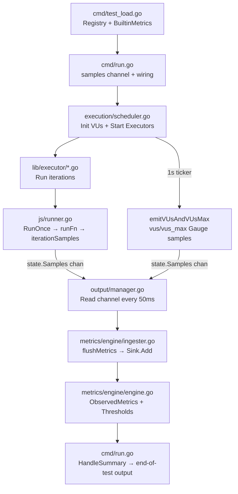

# Technical Specification

# 0. Agent Action Plan

## 0.1 Intent Clarification

### 0.1.1 Core Feature Objective

Based on the prompt, the Blitzy platform understands that the new feature requirement is to **perform a read-only exploration of the Grafana k6 repository** to answer two specific questions, and to capture the findings in a new markdown document — without modifying any existing source code. The concrete objectives are:

- **Run the full test suite** and produce a health report documenting how many tests pass, fail, and are skipped, with root-cause analysis for any non-passing tests
- **Identify the files and modules** responsible for tracking metrics during a k6 load test run, specifically those that count iterations and collect performance data
- **Trace the function-call path** for at least one metric (the `iterations` counter) from test start through to metrics output, showing the data flow through concrete functions and files
- **Create a new markdown document** named `k6_ddc3b0b1d23c.md` in `blitzy/documentation/` that comprehensively answers all three questions with rationale grounded in the source code

Implicit requirements detected:
- The environment must be set up with the correct Go version (Go 1.21, per `go.mod`) before tests can run
- The `-race` flag used in the Makefile's `make tests` target requires CGO, which is disabled in this environment; tests must be run without `-race` and this deviation documented
- The TC39 conformance suite requires an external checkout step and will naturally skip; this must be explained rather than treated as a failure
- "Don't modify anything in the repo" means no changes to existing files — only the new documentation file is permitted

### 0.1.2 Special Instructions and Constraints

- **Read-only mandate**: The user explicitly stated "please don't modify anything in the repo." Per the project implementation rule `SWE-AtlasQnA-Repo`, the only permitted file creation is the new markdown answer document in `blitzy/documentation/`
- **No existing-file modifications**: Existing source, test, config, or documentation files must not be altered
- **Evidence-based answers**: Per the implementation rule, answers must be based on the code as ground truth — no assumptions
- **Thinking/rationale required**: The markdown document must include reasoning behind the answers, not just raw data

### 0.1.3 Technical Interpretation

These feature requirements translate to the following technical implementation strategy:

- To **run the test suite**, we will execute `go test -timeout 300s -v ./...` (without `-race` due to CGO constraints) from the repository root and parse the verbose output to count PASS/FAIL/SKIP results at both the package and individual test level
- To **identify metrics-tracking files**, we will systematically inspect the `metrics/`, `metrics/engine/`, `output/`, `js/runner.go`, `lib/executor/`, `lib/execution.go`, `execution/scheduler.go`, and `cmd/run.go` source files to map the metrics pipeline from sample production through aggregation
- To **trace the `iterations` metric**, we will follow the call chain: `cmd/test_load.go` (registry creation) → `cmd/run.go` (channel + output wiring) → `execution/scheduler.go` (VU init + executor dispatch) → `lib/executor/shared_iterations.go` (iteration loop) → `js/runner.go:RunOnce()`→`runFn()`→`iterationSamples()` (sample emission) → `output/manager.go` (channel read + fan-out) → `metrics/engine/ingester.go:flushMetrics()` (sink aggregation) → `metrics/engine/engine.go` (threshold evaluation + summary)
- To **produce the deliverable**, we will create `blitzy/documentation/k6_ddc3b0b1d23c.md` containing structured sections for test results, metrics architecture, and the traced call path

## 0.2 Repository Scope Discovery

### 0.2.1 Comprehensive File Analysis

The k6 repository is a large Go project (module `go.k6.io/k6`) with 54 packages. The following files and directories were inspected as part of the analysis, grouped by their role in answering the user's questions.

**Metrics Core Package — `metrics/`**

| File | Purpose |
|------|---------|
| `metrics/metric.go` | Defines `Metric` struct (Name, Type, Contains, Tainted, Thresholds, Submetrics, Sink, Observed) and `Submetric` with tag-based filtering |
| `metrics/metric_type.go` | Defines `MetricType` enum: Counter(0), Gauge(1), Trend(2), Rate(3) |
| `metrics/value_type.go` | Defines `ValueType` enum: Default(0), Time(1), Data(2) |
| `metrics/sample.go` | Defines `Sample`, `TimeSeries`, `SampleContainer`, `ConnectedSamples`, `PushIfNotDone()` |
| `metrics/sink.go` | Defines `Sink` interface and four implementations: `CounterSink`, `GaugeSink`, `TrendSink`, `RateSink` |
| `metrics/builtin.go` | Defines all 28 built-in metrics and `RegisterBuiltinMetrics()` |
| `metrics/registry.go` | Defines `Registry` — thread-safe metric store with `NewMetric()` / `MustNewMetric()` |
| `metrics/units.go` | Helper functions `D()` (duration → ms float64) and `B()` (bool → 0/1 float64) |
| `metrics/tags.go` | `TagSet` (atlas-based immutable tag tree), `TagsAndMeta`, `SystemTagSet` |

**Metrics Engine — `metrics/engine/`**

| File | Purpose |
|------|---------|
| `metrics/engine/engine.go` | `MetricsEngine` — holds `ObservedMetrics`, runs threshold evaluation every 2s |
| `metrics/engine/ingester.go` | `OutputIngester` — `output.Output` that flushes buffered samples into sinks via `flushMetrics()` every 50ms |

**Output Pipeline — `output/`**

| File | Purpose |
|------|---------|
| `output/types.go` | `Output` interface: `Start()`, `AddMetricSamples()`, `Stop()` |
| `output/manager.go` | `Manager` — reads samples channel, dispatches to all outputs every 50ms |
| `output/helpers.go` | `SampleBuffer` (thread-safe), `PeriodicFlusher` (timer-driven flush) |

**JavaScript Runtime — `js/`**

| File | Purpose |
|------|---------|
| `js/runner.go` | `VU` and `ActiveVU` — `RunOnce()`, `runFn()`, `iterationSamples()` — VU execution and sample emission |
| `js/modules/k6/metrics/` | User-facing `new Counter()`, `new Trend()` etc. for custom metrics in JS |

**Execution Engine**

| File | Purpose |
|------|---------|
| `execution/scheduler.go` | `Scheduler` — initializes VUs, starts executors, emits `vus`/`vus_max` gauge samples every 1s |
| `lib/executor/shared_iterations.go` | `SharedIterations` executor — distributes iterations across VUs |
| `lib/executor/helpers.go` | `getIterationRunner()` — calls `vu.RunOnce()` and tracks full/interrupted iterations |
| `lib/execution.go` | `ExecutionState` — atomic counters for `fullIterationsCount`, `interruptedIterationsCount` |

**Command Layer**

| File | Purpose |
|------|---------|
| `cmd/run.go` | `k6 run` command — creates samples channel, wires MetricsEngine, OutputManager, Scheduler |
| `cmd/test_load.go` | Creates `metrics.Registry`, calls `RegisterBuiltinMetrics()`, builds `TestPreInitState` |

**Network I/O Metrics**

| File | Purpose |
|------|---------|
| `lib/netext/dialer.go` | `Dialer.IOSamples()` — produces `data_sent` / `data_received` counter samples from atomic byte counters |

**Test Infrastructure (for running the test suite)**

| File | Purpose |
|------|---------|
| `Makefile` | Defines `make tests` → `go test -race -timeout 210s ./...` |
| `go.mod` | Module declaration, Go 1.21 requirement, dependency list |
| `go.sum` | Dependency checksums |

### 0.2.2 Integration Point Discovery

The metrics pipeline has the following key integration points that were traced:

- **VU → Samples Channel**: `js/runner.go:runFn()` pushes `iterationSamples` and `IOSamples` to `u.state.Samples` (the shared `chan metrics.SampleContainer`)
- **Samples Channel → OutputManager**: `output/manager.go` goroutine reads from the channel on a 50ms tick
- **OutputManager → All Outputs**: Fan-out to registered outputs including `OutputIngester`, JSON, CSV, Cloud, etc.
- **OutputIngester → MetricsEngine**: `ingester.go:flushMetrics()` calls `m.Sink.Add(sample)` for each sample, updating in-memory aggregations
- **Submetric Matching**: During `flushMetrics()`, each sample is also checked against all `Submetric` tag filters; matching samples are added to submetric sinks
- **Threshold Evaluation → Sinks**: `engine.go:evaluateThresholds()` reads `Sink.Format()` output every 2s and evaluates threshold expressions
- **Scheduler → VU/VUsMax Emission**: `execution/scheduler.go:emitVUsAndVUsMax()` emits gauge samples on a 1s ticker independently
- **Executor → ExecutionState**: `lib/executor/helpers.go:getIterationRunner()` calls `executionState.AddFullIterations(1)` for progress tracking

### 0.2.3 New File Requirements

Per the implementation rule `SWE-AtlasQnA-Repo`, exactly one new file is created:

| File | Purpose |
|------|---------|
| `blitzy/documentation/k6_ddc3b0b1d23c.md` | Comprehensive markdown document answering the user's three questions: test suite health report, metrics-tracking files/modules identification, and traced function-call walkthrough for the `iterations` metric |

No existing files are modified. No new source, test, or configuration files are created.

## 0.3 Dependency Inventory

### 0.3.1 Key Runtime Dependencies

Since this is a read-only analysis task (no code modification), the only runtime dependency required is the Go toolchain to compile and run the test suite.

| Registry | Package | Version | Purpose |
|----------|---------|---------|---------|
| golang.org | Go toolchain | 1.21.13 | Required runtime per `go.mod` (`go 1.21`, `toolchain go1.21.13`). Used to execute `go test ./...` |

### 0.3.2 Key Project Dependencies (from `go.mod`)

The following are notable dependencies from the project's `go.mod` that are relevant to the metrics pipeline and test execution:

| Registry | Package | Version | Purpose |
|----------|---------|---------|---------|
| go.k6.io | `go.k6.io/k6` | (this repo) | The k6 load testing tool itself — the subject of analysis |
| github.com | `github.com/grafana/sobek` | v0.0.0-20240607083498-... | JavaScript engine (fork of goja) — executes user JS scripts inside VUs |
| github.com | `github.com/sirupsen/logrus` | v1.9.3 | Structured logging used throughout k6 including metrics engine |
| github.com | `github.com/spf13/cobra` | v1.7.0 | CLI framework — powers `k6 run`, `k6 inspect`, etc. |
| github.com | `github.com/spf13/pflag` | v1.0.5 | CLI flag parsing |
| github.com | `github.com/stretchr/testify` | v1.9.0 | Test assertion framework used across all test files |
| github.com | `github.com/mstoykov/atlas` | v0.0.0-20220811071828-... | Immutable tag set data structure used by `metrics.TagSet` |
| github.com | `github.com/mailru/easyjson` | v0.7.7 | Fast JSON serialization for metrics output |
| golang.org | `golang.org/x/time` | v0.5.0 | Rate limiter utilities |
| golang.org | `golang.org/x/crypto` | v0.22.0 | TLS/crypto support (relevant to the failing OCSP test) |
| google.golang.org | `google.golang.org/grpc` | v1.62.1 | gRPC support for gRPC metrics |
| google.golang.org | `google.golang.org/protobuf` | v1.33.0 | Protocol buffer support for cloud output |

### 0.3.3 Dependency Updates

No dependency updates are required. This task is read-only; no modifications to `go.mod`, `go.sum`, or any import statements are needed.

## 0.4 Integration Analysis

### 0.4.1 Existing Code Touchpoints

Since this is a read-only analysis task, no code modifications are made. However, the following integration points were studied to understand the metrics collection pipeline — these are the "touchpoints" that the documentation file explains:

**Command Layer → Metrics Infrastructure**
- `cmd/test_load.go`: Creates `metrics.Registry` and calls `metrics.RegisterBuiltinMetrics(registry)` — the birth of all 28 built-in metrics
- `cmd/run.go`: Creates the `samples` channel (`make(chan metrics.SampleContainer, bufSize)`), instantiates `MetricsEngine`, `OutputIngester`, and `OutputManager`, and wires them together

**Scheduler → VU/Executor Chain**
- `execution/scheduler.go:Init()`: Calls `runner.NewVU()` for each VU, passing the `samplesOut` channel; starts `emitVUsAndVUsMax()` goroutine
- `execution/scheduler.go:Run()`: Calls `runExecutor()` for each configured executor

**Executor → VU Iteration**
- `lib/executor/shared_iterations.go:Run()`: Creates VU goroutines, each calling `runIteration()` from `helpers.go`
- `lib/executor/helpers.go:getIterationRunner()`: Calls `vu.RunOnce()` and updates `executionState.AddFullIterations(1)` or `AddInterruptedIterations(1)`

**VU → Sample Emission**
- `js/runner.go:RunOnce()` → `runFn()`: After JS execution completes, emits `iterationSamples` (IterationDuration Trend + Iterations Counter) and `IOSamples` (DataSent/DataReceived) to `u.state.Samples`

**Output Pipeline → Sink Aggregation**
- `output/manager.go:Start()`: Goroutine reads from `samples` channel every 50ms, calls `AddMetricSamples()` on all outputs
- `metrics/engine/ingester.go:flushMetrics()`: Gets buffered samples, locks `MetricsEngine.MetricsLock`, calls `m.Sink.Add(sample)` for each sample, matches submetric tag filters
- `metrics/engine/engine.go:evaluateThresholds()`: Periodic (2s) goroutine that calls `Sink.Format()` and runs threshold expressions

### 0.4.2 Data Flow Diagram

### 0.4.3 No Modifications Required

No existing code touchpoints need modification. The documentation file (`blitzy/documentation/k6_ddc3b0b1d23c.md`) comprehensively describes these integration points for the new team member's understanding.

## 0.5 Technical Implementation

### 0.5.1 File-by-File Execution Plan

Since this is a Q&A/documentation task governed by the `SWE-AtlasQnA-Repo` rule, the implementation is strictly limited to a single file creation:

- **CREATE**: `blitzy/documentation/k6_ddc3b0b1d23c.md` — The comprehensive markdown document answering all user questions

No existing files are modified. The document is structured into three major sections:

| Document Section | Content | Source Files Analyzed |
|-----------------|---------|----------------------|
| Section 1: Test Suite Health Report | Pass/fail/skip counts at package and test level, root-cause analysis of the 1 failure and 1 skip | `Makefile`, test output from `go test -v ./...` across all 54 packages |
| Section 2: Metrics Architecture | Identification of all files/modules responsible for counting iterations and collecting performance data | `metrics/*.go`, `metrics/engine/*.go`, `output/*.go`, `js/runner.go`, `lib/executor/*.go`, `lib/execution.go`, `execution/scheduler.go`, `cmd/run.go`, `cmd/test_load.go`, `lib/netext/dialer.go` |
| Section 3: Traced Metric Walkthrough | Step-by-step function call trace for the `iterations` counter metric from registration through sample emission to sink aggregation to summary output | Same files as Section 2, traced in execution order |

### 0.5.2 Implementation Approach

The implementation follows three phases:

**Phase 1 — Environment Setup & Test Execution**
- Install Go 1.21.13 (the highest explicitly documented supported version per `go.mod`)
- Run `go test -timeout 300s -v ./...` without `-race` (CGO disabled) and capture full verbose output
- Parse output to extract PASS/FAIL/SKIP counts at top-level test, subtest, and package levels

**Phase 2 — Metrics Architecture Analysis**
- Read source files in `metrics/`, `metrics/engine/`, `output/`, `js/`, `lib/executor/`, `execution/`, and `cmd/` packages
- Map the complete sample flow: VU → channel → OutputManager → OutputIngester → Sink → ThresholdEngine → Summary
- Identify all 28 built-in metrics and their types (Counter, Gauge, Trend, Rate)

**Phase 3 — Documentation Generation**
- Create `blitzy/documentation/k6_ddc3b0b1d23c.md` with structured sections
- Include concrete file paths, function names, and short code snippets as evidence
- Provide architectural diagrams showing the pipeline flow

### 0.5.3 Test Results Produced

The test execution yielded the following data that is documented in the markdown:

| Metric | Value |
|--------|-------|
| Total packages tested | 54 |
| Packages passed | 53 |
| Packages failed | 1 (`go.k6.io/k6/js/modules/k6/http`) |
| Top-level tests passed | 771 |
| Top-level tests failed | 1 (`TestRequestAndBatchTLS/ocsp_stapled_good`) |
| Top-level tests skipped | 1 (`TestTC39` — missing external test262 checkout) |
| All-depth PASS lines | 4,423 |
| All-depth FAIL lines | 2 (parent + child of the same failure) |
| Longest-running package | `lib/executor` at 28.2s |

### 0.5.4 Key Insights Documented

The markdown document captures these architectural insights for the new team member:

- k6 has **four metric types** (Counter, Gauge, Trend, Rate) each with a specialized `Sink` implementation
- **28 built-in metrics** are registered at startup covering VUs, iterations, HTTP, WebSocket, gRPC, and network I/O
- The **sample pipeline** is: VU → Go channel → OutputManager (50ms batch read) → fan-out to all Outputs → OutputIngester → `Sink.Add()` → ThresholdEngine (2s evaluation) → end-of-test summary
- **Iteration counting** happens at two levels: (1) the `iterations` metric via the sample pipeline, and (2) atomic counters in `ExecutionState` for progress tracking
- **Cardinality control** in the ingester warns at 100K unique `TimeSeries` and doubles the threshold each warning

## 0.6 Scope Boundaries

### 0.6.1 Exhaustively In Scope

**Files Created**
- `blitzy/documentation/k6_ddc3b0b1d23c.md` — The sole deliverable

**Files Read for Analysis (metrics pipeline)**
- `metrics/metric.go` — Metric struct definition
- `metrics/metric_type.go` — MetricType enum
- `metrics/value_type.go` — ValueType enum
- `metrics/sample.go` — Sample, TimeSeries, SampleContainer, PushIfNotDone
- `metrics/sink.go` — Sink interface, CounterSink, GaugeSink, TrendSink, RateSink
- `metrics/builtin.go` — 28 built-in metrics and RegisterBuiltinMetrics
- `metrics/registry.go` — Registry (thread-safe metric store)
- `metrics/units.go` — D() and B() helper functions
- `metrics/tags.go` — TagSet, TagsAndMeta
- `metrics/engine/engine.go` — MetricsEngine, threshold evaluation
- `metrics/engine/ingester.go` — OutputIngester, flushMetrics
- `output/types.go` — Output interface
- `output/manager.go` — Manager (channel reader, fan-out)
- `output/helpers.go` — SampleBuffer, PeriodicFlusher
- `js/runner.go` — VU, ActiveVU, RunOnce, runFn, iterationSamples
- `lib/executor/shared_iterations.go` — SharedIterations executor
- `lib/executor/helpers.go` — getIterationRunner
- `lib/execution.go` — ExecutionState atomic counters
- `execution/scheduler.go` — Scheduler, emitVUsAndVUsMax
- `cmd/run.go` — k6 run command, pipeline wiring
- `cmd/test_load.go` — Registry creation, builtin metric registration
- `lib/netext/dialer.go` — IOSamples (data_sent/data_received)

**Files Read for Test Execution Context**
- `Makefile` — Test command reference
- `go.mod` — Go version, module declaration, dependencies
- `.github/workflows/tc39.yml` — TC39 workflow (context for why TestTC39 skips)

**Test Execution Artifacts**
- `/tmp/test_output.txt` — Full verbose test output from `go test -timeout 300s -v ./...`

### 0.6.2 Explicitly Out of Scope

- **No modification of existing files** — All existing `.go`, `.mod`, `.sum`, `.yml`, `.md`, and other files remain untouched per the user's explicit instruction and the `SWE-AtlasQnA-Repo` rule
- **No new source code** — No `.go` files, test files, or configuration files are created
- **No dependency changes** — `go.mod` and `go.sum` are not altered
- **No build artifacts** — No binaries are compiled beyond what `go test` requires
- **Performance benchmarks** — Not requested; only functional test results are in scope
- **Non-metrics subsystems** — While many k6 subsystems (extensions, cloud API, JS compiler) were encountered during exploration, detailed analysis of these is out of scope
- **HTTP module debugging** — The OCSP test failure is documented but not fixed (read-only constraint)
- **TC39 conformance testing** — Documented as skipped but not executed (requires external repo checkout)

## 0.7 Rules for Feature Addition

The following rules were explicitly provided by the user and in the project implementation rules, and are strictly observed:

- **SWE-AtlasQnA-Repo Rule**: Create a new markdown document named `<source_branch_name>.md` (i.e., `k6_ddc3b0b1d23c.md`) that comprehensively answers the question(s) posed in the prompt. The document must be placed in the `blitzy/documentation` directory in the destination repo.
- **No modifications to existing files**: The rule explicitly states "Do not modify any existing files in the source repository." Every existing file in the k6 repository remains untouched.
- **No additional code**: The rule states "Do not add any other code in the source repository (besides the above requested document)." Only the markdown document is created.
- **Code-as-truth**: The rule states "Do not make assumptions, base your answers on the code as the truth." All findings in the document are backed by specific file paths and function names from the source code.
- **Provide rationale**: The rule states "Provide thinking / rationale behind the answers." The document includes reasoning for why the OCSP test fails (environment-specific TLS behavior), why TestTC39 skips (missing external checkout), and how each step of the metrics pipeline connects to the next.
- **User's read-only instruction**: The user said "Just exploring for now, so please don't modify anything in the repo." This reinforces the SWE-AtlasQnA-Repo rule and is strictly honored.

## 0.8 References

### 0.8.1 Files and Folders Searched

The following files were directly read and analyzed to derive the conclusions documented in this plan and in the deliverable markdown:

**Metrics Core (`metrics/` package)**
- `metrics/metric.go`
- `metrics/metric_type.go`
- `metrics/value_type.go`
- `metrics/sample.go`
- `metrics/sink.go`
- `metrics/builtin.go`
- `metrics/registry.go`
- `metrics/units.go`
- `metrics/tags.go`

**Metrics Engine (`metrics/engine/` package)**
- `metrics/engine/engine.go`
- `metrics/engine/ingester.go`

**Output Pipeline (`output/` package)**
- `output/types.go`
- `output/manager.go`
- `output/helpers.go`

**JavaScript Runtime**
- `js/runner.go`

**Execution Engine**
- `execution/scheduler.go`
- `lib/executor/shared_iterations.go`
- `lib/executor/helpers.go`
- `lib/execution.go`

**Command Layer**
- `cmd/run.go`
- `cmd/test_load.go`

**Network I/O**
- `lib/netext/dialer.go`

**Build and Configuration**
- `Makefile`
- `go.mod`

**Folders Explored**
- `/` (repository root)
- `metrics/`
- `metrics/engine/`
- `output/`
- `output/cloud/`
- `js/`
- `js/modules/k6/`
- `lib/`
- `lib/executor/`
- `lib/netext/`
- `execution/`
- `cmd/`

### 0.8.2 Attachments

No attachments were provided for this project.

### 0.8.3 External URLs

No Figma URLs or other external design assets were provided. The analysis is entirely code-based.

### 0.8.4 Test Execution Artifacts

| Artifact | Location | Description |
|----------|----------|-------------|
| Full test output | `/tmp/test_output.txt` | Complete verbose output of `go test -timeout 300s -v ./...` across all 54 packages |

### 0.8.5 Deliverable

| File | Location | Description |
|------|----------|-------------|
| `k6_ddc3b0b1d23c.md` | `blitzy/documentation/k6_ddc3b0b1d23c.md` | Comprehensive markdown document answering the user's three questions: test suite health report, metrics-tracking files/modules, and traced function-call walkthrough |

