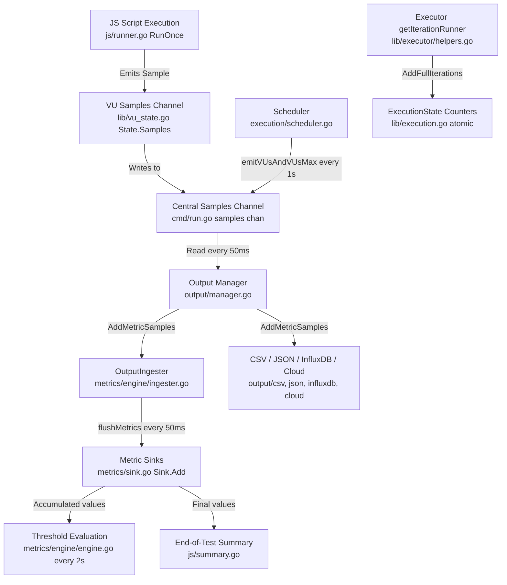

# Technical Specification

# 0. Agent Action Plan

## 0.1 Intent Clarification

### 0.1.1 Core Feature Objective

Based on the prompt, the Blitzy platform understands that the new feature requirement is to **conduct a read-only exploratory analysis of the k6 load testing repository** addressing three specific questions:

- **Test Suite Health Assessment:** Run the full test suite (`go test -race -timeout 600s ./...`) and produce a comprehensive breakdown of how many tests pass, how many fail, how many are skipped, and whether any are broken. The user wants a quantitative summary before diving deeper into the codebase.

- **Metrics Tracking Architecture Identification:** Identify and name the specific files, modules, and code structures responsible for counting iterations and collecting performance data during a k6 test run. This means mapping the entire metrics pipeline from registration through sample collection, aggregation, threshold evaluation, and output.

- **End-to-End Metrics Flow Trace:** Trace through the execution of a simple test script and show the function call chain involved in collecting at least one metric (e.g., `iterations`), demonstrating how data flows from test start to metrics output.

Implicit requirements detected:
- The user is a new team member onboarding onto the k6 project and needs clear, approachable explanations.
- The analysis must be purely observational — no code changes, no refactoring, no modifications of any kind to the repository.
- The output must be a standalone Markdown document placed in `blitzy/documentation/` as per the `SWE-AtlasQnA-Repo` implementation rule.

### 0.1.2 Special Instructions and Constraints

- **CRITICAL: Read-only constraint** — "Just exploring for now, so please don't modify anything in the repo." No existing files may be modified, and no new code may be added to the source tree.
- **SWE-AtlasQnA-Repo rule** — Create a new markdown document named `<source_branch_name>.md` (i.e., `k6_ddc3b0b1d23c.md`) that comprehensively answers the questions posed. Place it in the `blitzy/documentation` directory. Do not modify any existing files. Do not add any other code in the repository besides this document.
- The document must provide thinking and rationale behind the answers, grounded in the actual code as the source of truth.

### 0.1.3 Technical Interpretation

These feature requirements translate to the following technical implementation strategy:

- To **assess test suite health**, we executed `go test -race -timeout 600s -count=1 -v ./...` against the full repository using Go 1.21.13 (the version specified in `go.mod`). The verbose output was captured and parsed for package-level pass/fail/skip statuses and individual test-level results.

- To **identify the metrics tracking architecture**, we performed a systematic deep-search of the repository, reading the source code of every file in the `metrics/`, `metrics/engine/`, `execution/`, `lib/`, `lib/executor/`, `js/`, `cmd/`, and `output/` packages. These are the packages that own the metrics pipeline from definition to output.

- To **trace the metrics flow**, we followed the code path from `main.go` → `cmd.Execute()` → `cmd/run.go` → `execution/scheduler.go` → `lib/executor/constant_vus.go` → `js/runner.go` → `metrics/sample.go` → `metrics/engine/ingester.go` → `output/manager.go`, documenting every function call that participates in emitting the `iterations` built-in metric.

## 0.2 Repository Scope Discovery

### 0.2.1 Comprehensive File Analysis

The k6 repository is a large Go project (~120k lines of test output) organized into clearly separated packages. The following analysis catalogs every directory and file relevant to answering the user's questions.

**Core Metrics Pipeline Files:**

| File Path | Purpose | Relevance |
|---|---|---|
| `metrics/registry.go` | Thread-safe `Registry` for creating and retrieving `*Metric` instances | Central registry — all metrics (built-in and custom) are created here |
| `metrics/builtin.go` | Defines `BuiltinMetrics` struct and `RegisterBuiltinMetrics()` | Registers all 25+ built-in metrics (e.g., `iterations`, `vus`, `http_reqs`) |
| `metrics/metric.go` | Defines `Metric` and `Submetric` structs, `ParseMetricName()` | Core metric data structure with sinks and thresholds |
| `metrics/metric_type.go` | `MetricType` enum: Counter, Gauge, Trend, Rate | Classifies how metric values are aggregated |
| `metrics/sample.go` | `Sample`, `TimeSeries`, `SampleContainer`, `ConnectedSamples`, `PushIfNotDone()`, `GetBufferedSamples()` | The primary data transport unit for metric measurements |
| `metrics/sink.go` | `Sink` interface and concrete sinks: `CounterSink`, `GaugeSink`, `TrendSink`, `RateSink` | Aggregation logic — each sink type accumulates values differently |
| `metrics/tags.go` | `TagSet` (immutable, atlas-backed), `TagsAndMeta`, `EnabledTags` | Tag handling for metric labeling and filtering |
| `metrics/value_type.go` | `ValueType` enum: Default, Time, Data | Indicates units (milliseconds vs bytes vs plain numbers) |
| `metrics/units.go` | `D()` and `B()` helper functions for duration and boolean conversion | Converts `time.Duration` to milliseconds for storage |
| `metrics/system_tag.go` | `SystemTag` bitmask enum for built-in tag categories | Controls which system tags are attached to samples |
| `metrics/thresholds.go` | `Threshold` and `Thresholds` structs, `Run()` for evaluation | Threshold configuration, parsing, and pass/fail evaluation |
| `metrics/thresholds_parser.go` | Tokenizer and parser for threshold expressions | Parses expressions like `p(95)<500` into evaluatable structures |
| `metrics/engine/engine.go` | `MetricsEngine` — threshold evaluation, observed metrics tracking | Orchestrates threshold calculations and tracks which metrics have data |
| `metrics/engine/ingester.go` | `OutputIngester` — bridges buffered samples into sinks | The internal output that routes samples from the channel into metric sinks |

**Execution and Scheduling Files:**

| File Path | Purpose | Relevance |
|---|---|---|
| `main.go` | Entry point — calls `cmd.Execute()` | Start of the call chain |
| `cmd/run.go` | `k6 run` command — orchestrates the entire test lifecycle | Creates scheduler, metrics engine, output manager, and runs the test |
| `execution/scheduler.go` | `Scheduler` — VU initialization, executor launching, `emitVUsAndVUsMax()` | Central orchestrator for test execution; emits VU gauge metrics |
| `execution/abort.go` | Cancellation plumbing for test runs | Provides `NewTestRunContext()` and abort helpers |
| `execution/controller.go` | `Controller` interface for execution coordination | Barrier/signal primitives for local and distributed runs |
| `execution/local/` | Local no-op `Controller` implementation | Used for single-process `k6 run` |

**Executor Files (iteration counting):**

| File Path | Purpose | Relevance |
|---|---|---|
| `lib/executor/constant_vus.go` | `ConstantVUs` executor — runs fixed VUs for a duration | Calls `getIterationRunner()` which calls `vu.RunOnce()` |
| `lib/executor/shared_iterations.go` | `SharedIterations` executor — divides N iterations across VUs | Emits `dropped_iterations` metric if interrupted |
| `lib/executor/per_vu_iterations.go` | `PerVUIterations` — fixed iterations per VU | Each VU runs exactly N iterations |
| `lib/executor/constant_arrival_rate.go` | Constant arrival-rate executor | Schedules iterations at a fixed rate |
| `lib/executor/ramping_arrival_rate.go` | Ramping arrival-rate executor | Variable-rate iteration scheduling |
| `lib/executor/ramping_vus.go` | Ramping VUs executor | Staged VU scaling |
| `lib/executor/externally_controlled.go` | Externally controlled executor | Live control via REST API |
| `lib/executor/base_executor.go` | `BaseExecutor` — shared executor scaffolding | Provides `nextIterationCounters()` and metric tag assembly |
| `lib/executor/helpers.go` | `getIterationRunner()` — the iteration execution closure | The function that calls `vu.RunOnce()` and updates full/interrupted iteration counts |
| `lib/executor/vu_handle.go` | VU lifecycle state machine | Thread-safe start/stop/reuse transitions |

**JS Runtime Files (metric emission):**

| File Path | Purpose | Relevance |
|---|---|---|
| `js/runner.go` | `Runner` and `ActiveVU` — JS execution engine, `RunOnce()`, `runFn()`, `iterationSamples()` | Emits `iterations` and `iteration_duration` samples after each iteration |
| `js/bundle.go` | Script bundling and module resolution | Compiles JS scripts into executable bundles |
| `js/modules_vu.go` | Internal VU adapter for module code | Exposes VU context, state, and callback registration |
| `js/eventloop/` | Event loop for async JS execution | Manages callbacks and promise resolution |

**Output Subsystem Files:**

| File Path | Purpose | Relevance |
|---|---|---|
| `output/types.go` | `Output` interface, `Params` struct, capability interfaces | Defines the contract for all output backends |
| `output/manager.go` | `Manager` — starts/stops outputs, pipes samples from channel to all outputs | Central distribution point for metric samples to all configured outputs |
| `output/helpers.go` | `SampleBuffer` and `PeriodicFlusher` | Shared buffering and periodic flush infrastructure |
| `output/csv/` | CSV output backend | Writes metrics to CSV files |
| `output/json/` | JSON output backend | Writes metrics as JSON |
| `output/influxdb/` | InfluxDB v1 backend | Sends metrics to InfluxDB |
| `output/cloud/` | Grafana Cloud output | Cloud metrics pipeline |

**Shared Library Files:**

| File Path | Purpose | Relevance |
|---|---|---|
| `lib/execution.go` | `ExecutionState` — VU counters, iteration counters, pause/resume | `AddFullIterations()` and `AddInterruptedIterations()` track iteration counts |
| `lib/runner.go` | `Runner`, `ActiveVU`, `InitializedVU` interfaces | Defines the VU lifecycle contract |
| `lib/vu_state.go` | `State` struct — per-VU state including `Samples` channel | Each VU holds a reference to the shared samples channel |
| `lib/test_state.go` | `TestPreInitState`, `TestRunState`, `GroupSummary` | Pre-init and runtime state; `GroupSummary` aggregates check/group metrics |
| `lib/options.go` | `Options` struct — all test configuration | Holds thresholds, scenarios, system tags, and all other config |

### 0.2.2 Web Search Research Conducted

No external web searches were required for this analysis. All findings are derived directly from reading the repository source code, which is the definitive source of truth per the `SWE-AtlasQnA-Repo` rule.

### 0.2.3 New File Requirements

Per the `SWE-AtlasQnA-Repo` implementation rule, a single new file will be created:

- **CREATE:** `blitzy/documentation/k6_ddc3b0b1d23c.md` — A comprehensive Markdown document answering all three of the user's questions with rationale grounded in the source code.

## 0.3 Dependency Inventory

### 0.3.1 Private and Public Packages

The following table lists the key packages relevant to the metrics tracking architecture discovered during analysis:

| Registry | Package Name | Version | Purpose |
|---|---|---|---|
| Go module | `go.k6.io/k6` | v0.55.0 (from `lib/consts`) | The k6 binary itself; the repository under analysis |
| Go module | `github.com/mstoykov/atlas` | (vendored) | Immutable, persistent tag set data structure used by `metrics.TagSet` |
| Go module | `github.com/sirupsen/logrus` | (vendored) | Structured logging used throughout the metrics and execution pipeline |
| Go module | `github.com/spf13/cobra` | (vendored) | CLI framework for `k6 run` and other commands |
| Go module | `gopkg.in/guregu/null.v3` | (vendored) | Nullable types for configuration fields (e.g., `null.Bool`, `null.Int`) |
| Go module | `github.com/grafana/sobek` | (vendored, via bundle) | JavaScript runtime engine (fork of Goja) powering script execution |
| Go module | `github.com/evanw/esbuild` | v0.21.2 | TypeScript/ESM compilation in the JS compiler |
| Go module | `go.opentelemetry.io/otel` | (vendored) | OpenTelemetry tracing integration |
| Go stdlib | `sync/atomic` | (stdlib) | Lock-free counters for iteration counts in `lib/execution.go` |
| Go stdlib | `context` | (stdlib) | Cancellation propagation throughout the execution pipeline |
| Go toolchain | `go` | 1.21.13 | Go toolchain version (pinned in `go.mod` as `toolchain go1.21.13`) |

### 0.3.2 Dependency Updates

No dependency updates are required. This task is a read-only analysis that produces only a documentation file. No imports, packages, or build files will be modified.

## 0.4 Integration Analysis

### 0.4.1 Existing Code Touchpoints

Since this is a pure documentation task, no code modifications are required. However, the following integration touchpoints were analyzed to answer the user's questions about how k6 tracks metrics:

**Metrics Registration Touchpoints:**
- `cmd/run.go` (line ~170): Creates `MetricsEngine` by calling `engine.NewMetricsEngine(testRunState.Registry, logger)` — this is where the metrics engine is initialized with the pre-populated registry.
- `lib/test_state.go` (lines 17–27): `TestPreInitState` holds the `Registry` and `BuiltinMetrics` that were initialized before the test run.
- `metrics/builtin.go` (lines 78–111): `RegisterBuiltinMetrics()` registers all 25+ built-in metrics into the `Registry`, each with its correct type (Counter, Gauge, Trend, Rate) and value type (Default, Time, Data).

**Sample Channel Touchpoints:**
- `cmd/run.go` (line 227): `samples := make(chan metrics.SampleContainer, ...)` — the central buffered channel through which all metric samples flow.
- `lib/vu_state.go` (line 59): `Samples chan<- metrics.SampleContainer` — each VU holds a write-only reference to this channel.
- `js/runner.go` (line 868): `u.state.Samples <- iterationSamples(...)` — the VU pushes iteration metrics into the channel after each iteration completes.

**Output Distribution Touchpoints:**
- `output/manager.go` (lines 42–83): `Manager.Start()` spawns a goroutine that reads from the samples channel every 50ms and calls `AddMetricSamples()` on every registered output.
- `metrics/engine/ingester.go` (lines 62–103): `OutputIngester.flushMetrics()` drains its `SampleBuffer`, acquires the `MetricsEngine.MetricsLock`, and routes each sample into its corresponding `Sink.Add()`.

**Iteration Counting Touchpoints:**
- `lib/executor/helpers.go` (lines 104–141): `getIterationRunner()` returns a closure that calls `vu.RunOnce()`, then either calls `executionState.AddFullIterations(1)` or `executionState.AddInterruptedIterations(1)`.
- `lib/execution.go` (lines 284–310): Atomic counters `fullIterationsCount` and `interruptedIterationsCount` track total iteration completion.
- `js/runner.go` (lines 870–901): `iterationSamples()` emits both `iterations` (Counter, value=1) and `iteration_duration` (Trend, value=elapsed ms) as a `metrics.Samples` slice.

**Threshold Evaluation Touchpoints:**
- `metrics/engine/engine.go` (lines 159–211): `StartThresholdCalculations()` spawns a goroutine that evaluates thresholds every 2 seconds by calling `evaluateThresholds()`.
- `metrics/thresholds.go`: `Thresholds.Run()` evaluates each threshold expression against the current sink values.

### 0.4.2 Metrics Data Flow Diagram

## 0.5 Technical Implementation

### 0.5.1 File-by-File Execution Plan

Since this task is read-only documentation, there is exactly one file to create and zero files to modify.

**Group 1 — Documentation Deliverable:**
- **CREATE:** `blitzy/documentation/k6_ddc3b0b1d23c.md` — The comprehensive Q&A document that answers all three of the user's questions with supporting rationale drawn from the source code.

**No files will be modified.** This is explicitly stated by the user ("please don't modify anything in the repo") and reinforced by the `SWE-AtlasQnA-Repo` implementation rule ("Do not modify any existing files in the source repository").

### 0.5.2 Implementation Approach

The document will be organized into three major sections mapping directly to the user's three questions:

**Section 1 — Test Suite Health Report:**
The full test suite was executed using `go test -race -timeout 600s -count=1 -v ./...` with Go 1.21.13 and CGO_ENABLED=1. The verbose output was parsed to extract:
- Package-level results: 51 passed, 3 failed, 28 had no test files
- Individual test results: 4,421 passed, 3 failed (with 1 subtest), 1 skipped
- Detailed failure analysis for each of the 3 failing tests with root cause assessment

**Section 2 — Metrics Tracking Architecture:**
A module-by-module breakdown of the metrics pipeline, organized by layer:
- **Registration Layer:** `metrics/registry.go`, `metrics/builtin.go`
- **Data Model Layer:** `metrics/metric.go`, `metrics/sample.go`, `metrics/sink.go`
- **Emission Layer:** `js/runner.go`, `execution/scheduler.go`
- **Ingestion Layer:** `metrics/engine/ingester.go`
- **Evaluation Layer:** `metrics/engine/engine.go`, `metrics/thresholds.go`
- **Output Layer:** `output/manager.go`, `output/types.go`

**Section 3 — End-to-End Metrics Flow Trace:**
A step-by-step walkthrough tracing the `iterations` metric through the following function call chain:

1. `main.go:main()` → `cmd.Execute()`
2. `cmd/run.go:cmdRun.run()` — creates `metrics.Registry`, registers built-in metrics, creates samples channel
3. `execution/scheduler.go:Scheduler.Run()` — launches executors, starts VU metric emission
4. `lib/executor/constant_vus.go:ConstantVUs.Run()` — starts VU goroutines, calls `getIterationRunner()`
5. `lib/executor/helpers.go:getIterationRunner()` — returns closure that calls `vu.RunOnce()`
6. `js/runner.go:ActiveVU.RunOnce()` — calls `u.runFn()` to execute the JS default function
7. `js/runner.go:VU.runFn()` — after JS execution, emits `iterationSamples()` to `u.state.Samples`
8. `js/runner.go:iterationSamples()` — creates `metrics.Samples` with `iterations` (value=1) and `iteration_duration` (value=elapsed ms)
9. Sample arrives in `cmd/run.go` samples channel
10. `output/manager.go:Manager.Start()` goroutine reads samples every 50ms, calls `AddMetricSamples()` on all outputs
11. `metrics/engine/ingester.go:OutputIngester.flushMetrics()` — drains buffer, calls `m.Sink.Add(sample)` for each sample
12. `metrics/sink.go:CounterSink.Add()` — increments `c.Value += s.Value` (for the `iterations` Counter metric)
13. `metrics/engine/engine.go:evaluateThresholds()` — periodically checks threshold conditions against sink values
14. End-of-test summary reads `metricsEngine.ObservedMetrics` and renders results

### 0.5.3 Test Suite Results Summary (Key Findings)

**Overall Result: FAIL (3 test failures out of 4,425 total tests)**

| Category | Count |
|---|---|
| Packages with tests that passed | 51 |
| Packages with test failures | 3 |
| Packages with no test files | 28 |
| Individual tests passed | 4,421 |
| Individual tests failed | 3 (plus 1 subtest) |
| Individual tests skipped | 1 |

**Failed Tests:**

| Test Name | Package | Root Cause Analysis |
|---|---|---|
| `TestEventLoopDoesntCrossIterations` | `go.k6.io/k6/cmd/tests` | Timing-sensitive race condition — the test looks for specific stdout text within a retry window and did not find it in time. This is a flaky test due to CI/container timing variability, not a logic bug. |
| `TestRequestAndBatchTLS/ocsp_stapled_good` | `go.k6.io/k6/js/modules/k6/http` | OCSP stapling TLS test failure — likely caused by the test environment lacking proper OCSP responder infrastructure or certificate chain. This is an environment-dependent failure. |
| `TestSetTimeoutOrder` | `go.k6.io/k6/js/modules/k6/timers` | Timer execution ordering mismatch — expected `["five", "six", "last"]` but got `["last", "five", "six"]`. This is a non-deterministic timer ordering race condition in the event loop. |

**Skipped Test:**

| Test Name | Package | Reason |
|---|---|---|
| `TestTC39` | `go.k6.io/k6/js/tc39` | The TC39/Test262 conformance suite requires a special checkout of the test262 test corpus via a script (`checkout.sh`). Without the external test fixtures, the test self-skips. |

## 0.6 Scope Boundaries

### 0.6.1 Exhaustively In Scope

**Documentation deliverable:**
- `blitzy/documentation/k6_ddc3b0b1d23c.md` — the sole output artifact

**Repository files analyzed (read-only) to derive conclusions:**
- `main.go` — entry point
- `cmd/run.go` — test run orchestration
- `metrics/**/*.go` — all files in the metrics package and engine subpackage
- `execution/**/*.go` — scheduler, controller, abort logic
- `lib/executor/**/*.go` — all executor implementations and helpers
- `lib/execution.go` — execution state and iteration counters
- `lib/runner.go` — runner and VU interfaces
- `lib/vu_state.go` — per-VU state including samples channel
- `lib/test_state.go` — test pre-init and run state, GroupSummary
- `js/runner.go` — JS runtime, `RunOnce()`, `runFn()`, `iterationSamples()`
- `output/manager.go` — output manager orchestration
- `output/types.go` — output interface definitions
- `output/helpers.go` — SampleBuffer and PeriodicFlusher
- `go.mod` — dependency manifest and Go version
- `Makefile` — build targets and test command
- All test output from `go test -race -timeout 600s -count=1 -v ./...`

### 0.6.2 Explicitly Out of Scope

- **No modifications** to any existing source file in the repository
- **No new source code** (Go, JS, or otherwise) beyond the documentation Markdown file
- **No dependency changes** — no packages added, removed, or upgraded
- **No build configuration changes** — Makefile, Dockerfile, CI workflows unchanged
- **No refactoring** of any kind
- **No performance optimization** work
- **No fixing** of the 3 identified failing tests
- **Vendor directory** — not analyzed in detail (contains third-party dependencies)
- **Release notes** — not relevant to the technical questions asked
- **Grafana dashboards** (`grafana/`) — not relevant to the metrics tracking code architecture
- **Packaging** (`packaging/`) — not relevant to metrics flow analysis

## 0.7 Rules for Feature Addition

The following rules are explicitly derived from the user's instructions and the project's `SWE-AtlasQnA-Repo` implementation rule:

- **Read-Only Constraint:** "Just exploring for now, so please don't modify anything in the repo." No existing files in the source repository may be modified under any circumstances.
- **Documentation-Only Output:** The `SWE-AtlasQnA-Repo` rule states: "Create a new markdown document named `<source_branch_name>.md` that comprehensively answers the question(s) posed in the prompt." The branch name is `k6_ddc3b0b1d23c`, so the output file is `k6_ddc3b0b1d23c.md`.
- **Placement Rule:** The document must be placed in the `blitzy/documentation` directory in the destination repo.
- **Evidence-Based Answers:** "Do not make assumptions, base your answers on the code as the truth." All conclusions must cite specific files and code paths.
- **Thinking and Rationale Required:** "Provide thinking / rationale behind the answers." The document must explain not just what the code does, but why the answer follows from the code.
- **No Additional Code:** "Do not add any other code in the source repository (besides the above requested document)." Only the Markdown document may be created.

## 0.8 References

### 0.8.1 Files and Folders Searched

The following files and folders were directly retrieved and analyzed during the context-gathering phase:

**Root-level files:**
- `main.go` — entry point calling `cmd.Execute()`
- `go.mod` — Go module definition, Go 1.21 with toolchain go1.21.13
- `Makefile` — build/test/lint targets

**`metrics/` package (all files):**
- `metrics/registry.go` — `Registry`, `NewMetric()`, `MustNewMetric()`, `RootTagSet()`
- `metrics/builtin.go` — `BuiltinMetrics` struct, `RegisterBuiltinMetrics()`
- `metrics/metric.go` — `Metric`, `Submetric`, `ParseMetricName()`, `AddSubmetric()`
- `metrics/metric_type.go` — `MetricType` enum (Counter, Gauge, Trend, Rate)
- `metrics/sample.go` — `Sample`, `TimeSeries`, `SampleContainer`, `PushIfNotDone()`, `GetBufferedSamples()`
- `metrics/sink.go` — `Sink` interface, `CounterSink`, `GaugeSink`, `TrendSink`, `RateSink`, `NewSink()`
- `metrics/tags.go` — `TagSet`, `TagsAndMeta`, `EnabledTags`
- `metrics/value_type.go` — `ValueType` enum
- `metrics/units.go` — `D()`, `B()` conversion helpers
- `metrics/system_tag.go` — `SystemTag` bitmask
- `metrics/thresholds.go` — `Threshold`, `Thresholds` structs
- `metrics/thresholds_parser.go` — threshold expression parser

**`metrics/engine/` subpackage:**
- `metrics/engine/engine.go` — `MetricsEngine`, `CreateIngester()`, `StartThresholdCalculations()`, `evaluateThresholds()`
- `metrics/engine/ingester.go` — `OutputIngester`, `flushMetrics()`, `cardinalityControl`

**`execution/` package:**
- `execution/scheduler.go` — `Scheduler`, `NewScheduler()`, `Init()`, `Run()`, `emitVUsAndVUsMax()`, `initVU()`, `runExecutor()`
- `execution/abort.go` — `NewTestRunContext()`, `AbortTestRun()`
- `execution/controller.go` — `Controller` interface, `SignalAndWait()`

**`cmd/` package:**
- `cmd/run.go` — `cmdRun.run()` full lifecycle orchestration

**`lib/` package:**
- `lib/execution.go` — `ExecutionState`, `AddFullIterations()`, `AddInterruptedIterations()`, `GetFullIterationCount()`
- `lib/runner.go` — `Runner`, `ActiveVU`, `InitializedVU`, `VUActivationParams` interfaces
- `lib/vu_state.go` — `State` struct with `Samples chan<- metrics.SampleContainer`
- `lib/test_state.go` — `TestPreInitState`, `TestRunState`, `GroupSummary`
- `lib/options.go` — (folder summary reviewed)

**`lib/executor/` subpackage:**
- `lib/executor/constant_vus.go` — `ConstantVUs.Run()` implementation
- `lib/executor/base_executor.go` — `BaseExecutor`, `nextIterationCounters()`, `getMetricTags()`
- `lib/executor/helpers.go` — `getIterationRunner()`, `getDurationContexts()`, `getVUActivationParams()`

**`js/` package:**
- `js/runner.go` — `ActiveVU.RunOnce()`, `VU.runFn()`, `iterationSamples()`, `incrIteration()`

**`output/` package:**
- `output/manager.go` — `Manager`, `Start()`, `startOutputs()`, `stopOutputs()`
- `output/types.go` — `Output` interface, `Params`, capability interfaces
- `output/helpers.go` — (folder summary reviewed)

**Test output analyzed:**
- Full verbose test output: 118,914 lines from `go test -race -timeout 600s -count=1 -v ./...`

### 0.8.2 Attachments

No attachments were provided by the user for this project.

### 0.8.3 External URLs

No Figma screens or external URLs were referenced in this task.

