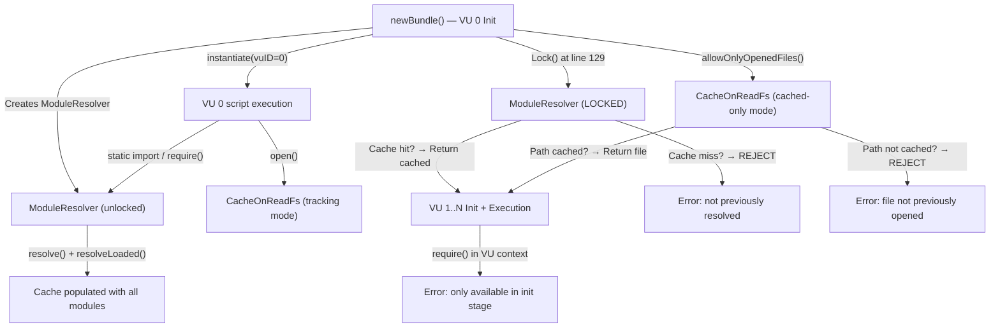

# Technical Specification

# 0. Agent Action Plan

## 0.1 Intent Clarification

### 0.1.1 Core Feature Objective

Based on the prompt, the Blitzy platform understands that the user's requirement is to **investigate and document k6's module resolution behavior during the init stage versus the VU (virtual user) execution stage**, answering several tightly-coupled questions:

- **Module Resolution Freezing**: Whether k6 intentionally "freezes" (locks) module resolution after the init stage, and the exact mechanism by which this occurs.
- **Resolved vs. Rejected Classification**: What precisely counts as an "already resolved" module (eligible for reuse by VUs) versus a "new module" that the runtime will reject.
- **Relative Specifier Resolution Under Multi-Origin Call Stacks**: How relative import specifiers (e.g., `"../shared/utility.js"`) behave when the call stack involves modules imported from different filesystem locations, and whether the resolution is relative to the *calling module* or the *current execution context*.
- **Observable Error Signatures**: The exact error messages or warnings produced when:
  - A module imported during init is used later by VUs (expected: succeeds silently).
  - A module never resolved during init is requested during VU execution (expected: deterministic failure).
- **Non-destructive Investigation**: All observations must be performed using temporary scripts outside the repository. The repository itself must remain unchanged. All temporary artifacts must be cleaned up afterward.

The implicit requirements surfaced by this analysis include:

- Understanding the two-layer protection architecture: the `require()` init-context gate and the `ModuleResolver.Lock()` mechanism.
- Distinguishing between VU 0 (the initial bundle instantiation used for module discovery) and VU 1+ (actual workload VUs that share the locked resolver).
- Understanding that `open()` file access follows a parallel locking pattern to module resolution.
- Understanding that ESM `import()` (dynamic import) is entirely unsupported, independent of locking.

### 0.1.2 Special Instructions and Constraints

- **Repository Integrity**: The user explicitly states "the repository itself should remain unchanged and anything temporary should be cleaned up afterward." This means no files may be committed, modified, or left behind in the k6 source tree.
- **Observation-Only Approach**: Temporary k6 scripts may be written to `/tmp` or similar ephemeral locations to observe behavior, then removed.
- **Implementation Rule — SWE-AtlasQnA-Repo**: A new markdown document named `k6_ddc3b0b1d23c.md` must be created in the `blitzy/documentation` directory. This document must comprehensively answer the posed questions. No existing files in the source repository may be modified.
- **Evidence-Based Answers**: Answers must be grounded in code-level evidence from the repository source, not assumptions.

### 0.1.3 Technical Interpretation

These feature requirements translate to the following technical investigation strategy:

- To **determine whether k6 freezes module resolution**, we will trace the `ModuleResolver.Lock()` call in `js/bundle.go` (line 129) and the `locked` field checks in `js/modules/resolution.go` (lines 70, 146, 166) that guard both built-in and filesystem module resolution.
- To **classify resolved vs. rejected modules**, we will analyze the `ModuleResolver.cache` (a `map[string]moduleCacheElement`) and the `resolve()` method (lines 143–177 of `js/modules/resolution.go`) that checks the cache before consulting the lock.
- To **investigate relative specifier behavior**, we will trace the `resolveSpecifier()` → `loader.Resolve()` chain and the `reversePath()` function (line 198 of `js/modules/resolution.go`) that determines the base directory from the referencing module's record.
- To **demonstrate observable behavior**, we will create temporary k6 scripts exercising the init-vs-VU boundary, run them with the built k6 binary, capture output, and then clean up all temporary files.
- To **produce the deliverable**, we will create `blitzy/documentation/k6_ddc3b0b1d23c.md` containing the full analysis and experimental results.

## 0.2 Repository Scope Discovery

### 0.2.1 Comprehensive File Analysis

Since this task is a **read-only investigation** (no source modifications), the repository scope discovery identifies all files examined to derive conclusions about module resolution behavior. These files constitute the evidentiary basis of the analysis.

**Core Module Resolution Files (Primary Evidence)**

| File | Purpose | Relevance |
|------|---------|-----------|
| `js/modules/resolution.go` | Central `ModuleResolver` struct, `cache`, `locked` field, `Lock()`, `resolve()`, `resolveLoaded()`, `sobekModuleResolver()`, `reversePath()` | **Critical** — Contains the entire freeze/lock mechanism, cache logic, and relative specifier resolution |
| `js/modules/require_impl.go` | `Require()` function, `getCurrentModuleScript()`, `getPreviousRequiringFile()`, call-stack inspection | **Critical** — The `require()` execution path that coordinates resolver usage and parent-module discovery |
| `js/bundle.go` | `newBundle()` orchestration, `Lock()` call at line 129, `requireImpl` struct with init-context gate, `instantiate()`, `setInitGlobals()` | **Critical** — Where VU 0 init runs, the Lock happens, and `require`/`open` are wired with init guards |
| `js/initcontext.go` | `cantBeUsedOutsideInitContextMsg` constant, `openImpl()`, `allowOnlyOpenedFiles()` | **High** — Defines the init-only restriction messages and the parallel file-access locking pattern |
| `js/runner.go` | `newVU()`, `Activate()`, VU lifecycle, `state` assignment | **High** — Shows how each VU is instantiated, how state transitions from nil (init) to non-nil (VU active) |
| `js/modules_vu.go` | `moduleVUImpl` struct with `state`, `initEnv`, `runtime`, `ctx` fields | **High** — The VU adapter that modules interact with; `state == nil` signals init context |

**Module System Supporting Files**

| File | Purpose | Relevance |
|------|---------|-----------|
| `js/modules/modules.go` | `Module`, `Instance`, `VU`, `Exports` interfaces; `Register()` for external modules | Medium — Public API surface for module contract |
| `js/modules/gomodule.go` | Go module adapter wrapping `modules.Module` as Sobek `ModuleRecord` | Medium — How built-in k6 modules participate in the resolver |
| `js/modules/gomodule_basic.go` | Lighter adapter for arbitrary Go values as module records | Low — Simpler bridge variant |
| `js/modules/cjsmodule.go` | CommonJS bridge, `module.exports` wrapping, ESM detection | Medium — How CJS modules are parsed, cached, and resolved |
| `js/jsmodules.go` | Built-in JS module registry assembly, `k6/x` merge logic | Medium — How the `goModules` map is constructed |

**Loader and Filesystem Files**

| File | Purpose | Relevance |
|------|---------|-----------|
| `loader/loader.go` | `Resolve()` function for specifier-to-URL resolution, `resolveFilePath()`, `Dir()`, `Load()` for filesystem/HTTPS loading | **High** — The actual URL resolution logic for relative and absolute specifiers |
| `lib/fsext/cacheonread.go` | `CacheOnReadFs`, `AllowOnlyCached()`, `ErrPathNeverRequestedBefore` | Medium — Parallel caching pattern for `open()` file restrictions |

**Test Files (Secondary Evidence)**

| File | Purpose | Relevance |
|------|---------|-----------|
| `js/init_and_modules_test.go` | Tests for init-context vs VU-context module lifecycle | Medium — Confirms init/VU lifecycle contracts |
| `js/module_loading_test.go` | Tests for CommonJS/ESM loading, globals, and cross-module behavior | Medium — Validates module caching expectations |
| `js/path_resolution_test.go` | Tests for relative path resolution across nested modules | Medium — Validates relative specifier resolution behavior |
| `js/esm_vs_commonjs_test.go` | Tests for ESM vs CJS behavioral differences | Low — Edge-case behavioral contracts |

### 0.2.2 Web Search Research Conducted

No external web searches were required. All answers are derived directly from the k6 source code at commit `ddc3b0b1d` (v0.55.0) and from experiments run with the built binary. The module resolution mechanism is entirely internal to the codebase.

### 0.2.3 New File Requirements

A single new file is required per the implementation rules:

- **CREATE**: `blitzy/documentation/k6_ddc3b0b1d23c.md` — Comprehensive markdown document answering the user's questions about k6 module resolution behavior, including code-level analysis and experimental evidence.

No other files need to be created, modified, or deleted in the repository.

## 0.3 Dependency Inventory

### 0.3.1 Private and Public Packages

Since this task produces only a documentation artifact (a markdown file), no new dependencies are introduced. The relevant packages from the existing `go.mod` that underpin the module resolution system are listed for reference:

| Registry | Package | Version | Purpose |
|----------|---------|---------|---------|
| Go modules | `go.k6.io/k6` | v0.55.0 | The k6 root module containing the JS runtime and module resolver |
| Go modules | `github.com/grafana/sobek` | (vendored) | Fork of goja — the JavaScript engine that provides `ModuleRecord`, `CyclicModuleRecord`, `Runtime`, ESM evaluation | 
| Go modules | `github.com/evanw/esbuild` | v0.21.2 | TypeScript stripping and enhanced script compilation in `js/compiler/` |
| Go modules | `github.com/spf13/afero` | (vendored) | Virtual filesystem abstraction used by `CacheOnReadFs` for file-access caching |
| Go modules | `github.com/sirupsen/logrus` | (vendored) | Structured logging used throughout the module resolver for warning/error output |
| Go (stdlib) | `net/url` | (stdlib) | URL parsing and resolution — the core type for module specifier cache keys |

### 0.3.2 Dependency Updates

No dependency updates are required. This task does not modify any source files, build configurations, or package manifests. The existing `go.mod` and vendored dependencies remain unchanged.

## 0.4 Integration Analysis

### 0.4.1 Existing Code Touchpoints

Since this task is read-only documentation, no code modifications are made. However, the following touchpoints were analyzed to understand the module resolution lifecycle:

**Module Resolution Chain (Read Path)**

- `js/bundle.go` — `newBundle()` (line 87): Creates `ModuleResolver`, calls `instantiate()` for VU 0, then calls `Lock()` at line 129. This is the single point where the module cache becomes frozen.
- `js/bundle.go` — `instantiate()` (line 297): Creates `ModuleSystem` per VU, calls `RunSourceData()` which triggers the Sobek module evaluation pipeline. Each VU gets a fresh Sobek `Runtime` but shares the same locked `ModuleResolver`.
- `js/bundle.go` — `requireImpl.require()` (line 425): The first guard — checks `vu.state == nil` (init context). If state is non-nil (VU is active), `require()` is rejected entirely before reaching the resolver.
- `js/modules/resolution.go` — `resolve()` (line 143): The second guard — for filesystem modules, checks `mr.locked` after cache miss. For `k6/*` modules, checks cache then delegates to `requireModule()` which also checks `mr.locked`.
- `js/modules/resolution.go` — `sobekModuleResolver()` (line 192): The Sobek callback that connects ESM static `import` statements to the k6 resolver. Calls `resolve()` with the parent module's directory derived from `reversePath()`.
- `js/modules/require_impl.go` — `Require()` (line 16): The CommonJS `require()` path that captures the calling module via `getCurrentModuleScript()` (stack inspection), resolves the parent, then delegates to `sobekModuleResolver()`.

**Parallel Locking Patterns**

- `js/initcontext.go` — `allowOnlyOpenedFiles()` (line 65): Called in `instantiate()` when `vuID == 0` completes. Switches the `CacheOnReadFs` to cached-only mode, mirroring the module resolver lock for file I/O.
- `lib/fsext/cacheonread.go` — `AllowOnlyCached()` (line 55): Flips `cachedOnly = true` on the filesystem wrapper, causing any `Open()` for a never-accessed path to return `ErrPathNeverRequestedBefore`.

**VU Lifecycle State Transitions**

- `js/runner.go` — `newVU()` (line 124): Instantiates the bundle for a non-zero VU. The resolver is already locked. Static imports succeed via cache hits. The VU's `state` is set to a non-nil `lib.State` at line 230.
- `js/runner.go` — `Activate()` (line 646): Transitions the VU from initialized to active. At this point, `vu.state != nil`, so `require()` is fully blocked by the init-context gate.

### 0.4.2 Integration Point Summary

## 0.5 Technical Implementation

### 0.5.1 File-by-File Execution Plan

The sole deliverable is a markdown document. The execution plan consists of:

- **CREATE**: `blitzy/documentation/k6_ddc3b0b1d23c.md`
  - Comprehensive Q&A document answering all user questions about k6 module resolution
  - Structured in clear sections covering the locking mechanism, cache semantics, relative specifier resolution, and experimental evidence
  - Includes exact code references with file paths and line numbers
  - Contains reproductions of experimental k6 script runs with actual k6 output
  - All temporary scripts used for experimentation are documented in the file but physically cleaned up from disk

No existing repository files are modified.

### 0.5.2 Implementation Approach

The document will be structured around five major investigation axes, each grounded in specific source files:

**Axis 1 — The Module Resolution Freeze Mechanism**
Establish that `ModuleResolver.Lock()` is called exactly once, after VU 0 init, in `js/bundle.go` line 129. Document the `locked` boolean field in the `ModuleResolver` struct (`js/modules/resolution.go` line 35) and how the `resolve()` method (lines 143–177) checks it as a second gate after cache lookup.

**Axis 2 — What Counts as "Already Resolved"**
Document the `cache map[string]moduleCacheElement` field and the two categories of cache keys:
- Built-in modules (`k6/*`): keyed by bare name string (e.g., `"k6/http"`)
- Filesystem modules: keyed by the fully-resolved absolute URL string (e.g., `"file:///path/to/module.js"`)

Explain that if a module exists in the cache (regardless of how it was imported — static `import` or `require()` — during VU 0 init), it is "already resolved" and available to all subsequent VUs.

**Axis 3 — Relative Specifier Resolution**
Trace the resolution chain: `sobekModuleResolver()` → `resolve(reversePath(referencingModule), specifier)` → `resolveSpecifier(basePWD, arg)` → `loader.Resolve(pwd, moduleSpecifier)`. The `reversePath()` function (line 198) looks up the referencing module in the `reverse map[any]*url.URL` to find its filesystem location, then takes its parent directory. This means relative specifiers are **always resolved relative to the file that contains them**, not relative to the call stack's execution origin. Two modules importing `"../shared/util.js"` from different directories produce the same absolute URL if the filesystem layout is consistent, hitting the same cache entry.

**Axis 4 — The Two-Layer Protection Architecture**
Document the two independent gates that prevent VU-time module loading:
1. **Layer 1 — Init-context gate** (`js/bundle.go` line 425): `require()` checks `vu.state == nil`. During VU execution, `state` is non-nil, so `require()` is rejected with `cantBeUsedOutsideInitContextMsg` before the resolver is even consulted.
2. **Layer 2 — Resolver lock** (`js/modules/resolution.go` line 166): Even in non-VU0 init contexts (where `state` is still nil but the resolver is locked), cache misses are rejected with `notPreviouslyResolvedModule`.

**Axis 5 — Experimental Evidence**
Document a series of k6 script experiments with their exact output, covering:
- Init-imported module reuse by VUs (succeeds silently)
- `require()` of never-seen module in VU context (init-context gate error)
- Dynamic `import()` attempt (unsupported error)
- `require()` in VU context for a previously-imported module (still blocked by init-context gate)
- Non-VU0 init `require()` of a never-resolved module (resolver lock error)
- High-VU-count stress test confirming stable behavior
- Relative specifiers from different call origins resolving correctly
- `open()` parallel restriction behavior

### 0.5.3 Key Findings Summary

The document will conclude with these definitive answers:

| Question | Answer |
|----------|--------|
| Does k6 freeze module resolution after init? | **Yes.** `ModuleResolver.Lock()` is called after VU 0 init completes (`js/bundle.go:129`). |
| What counts as already resolved? | Any module whose resolved URL (or bare name for `k6/*`) exists as a key in `ModuleResolver.cache`. |
| What gets rejected? | Any module not in the cache when the resolver is locked. Error: `the module %q was not previously resolved during initialization (__VU==0)`. |
| Can VUs call `require()`? | **No.** `require()` is blocked in VU execution context by `vu.state != nil` check. Error: `the "require" function is only available in the init stage`. |
| Do relative specifiers cause confusion? | **No.** They are resolved relative to the *containing file*, not the call stack. The `reversePath()` function ensures this via the `reverse` map lookup. |
| Is dynamic `import()` supported? | **No.** k6 does not register a `SetImportModuleDynamically` callback. Error: `dynamic modules not enabled in the host program`. |

## 0.6 Scope Boundaries

### 0.6.1 Exhaustively In Scope

- **Documentation output**:
  - `blitzy/documentation/k6_ddc3b0b1d23c.md` — The sole deliverable
- **Source files analyzed** (read-only):
  - `js/modules/resolution.go` — Module resolver, lock, cache, `resolve()`, `reversePath()`
  - `js/modules/require_impl.go` — `Require()`, call-stack inspection, parent module discovery
  - `js/bundle.go` — Bundle creation, VU 0 init, `Lock()` call, `requireImpl`, `instantiate()`
  - `js/initcontext.go` — Init-only restriction messages, `openImpl()`, `allowOnlyOpenedFiles()`
  - `js/runner.go` — VU lifecycle, `newVU()`, `Activate()`, state transitions
  - `js/modules_vu.go` — VU adapter struct, state/initEnv/runtime fields
  - `js/modules/modules.go` — Module contract interfaces
  - `js/modules/gomodule.go` — Go module adapter
  - `js/modules/cjsmodule.go` — CommonJS bridge
  - `js/jsmodules.go` — Built-in module registry
  - `loader/loader.go` — Specifier resolution (`Resolve()`, `resolveFilePath()`, `Dir()`)
  - `lib/fsext/cacheonread.go` — File caching, `AllowOnlyCached()`, `ErrPathNeverRequestedBefore`
  - `js/init_and_modules_test.go` — Init/VU lifecycle test contracts
  - `js/module_loading_test.go` — Module loading behavior tests
  - `js/path_resolution_test.go` — Relative path resolution tests
  - `go.mod` — Go version (1.21) and dependency declarations
- **Temporary experiment scripts** (created, executed, and cleaned up):
  - k6 scripts in `/tmp/k6_experiments/` testing init-vs-VU module behavior
  - All cleaned up after execution; nothing persists

### 0.6.2 Explicitly Out of Scope

- **Modifications to existing repository files** — No source, test, config, or documentation files in the k6 repository are changed
- **New code features or patches** — No Go code is written or committed
- **Performance optimization** of the module resolver
- **Distributed/cloud execution** module behavior — Analysis is limited to local single-process execution
- **Extension module (`k6/x/*`) loading** specifics beyond noting they follow the same lock pattern
- **Sobek (goja fork) internals** — The vendored JS engine is treated as a black box beyond its public `ModuleRecord` / `CyclicModuleRecord` interfaces
- **TypeScript compilation** path — The `js/compiler/` subsystem is not investigated beyond its role in parsing scripts
- **HTTP/HTTPS remote module loading** — Only local filesystem module resolution is analyzed in detail

## 0.7 Rules for Feature Addition

The user specified the following rules and constraints, which have been strictly observed:

- **SWE-AtlasQnA-Repo Rule**: Create a new markdown document named `k6_ddc3b0b1d23c.md` (matching the source branch name `k6_ddc3b0b1d23c`) that comprehensively answers the questions posed in the prompt. Place this document in the `blitzy/documentation` directory. Base all answers on the code as the truth, not on assumptions. Do not modify any existing files in the source repository. Do not add any other code in the source repository besides the requested document.
- **Non-Destructive Investigation**: Temporary scripts may be used for observation but the repository itself must remain unchanged. All temporary artifacts must be cleaned up afterward.
- **Evidence-Based Analysis**: Build and run the source code to analyze repository behavior as needed. Provide thinking and rationale behind the answers.

## 0.8 References

### 0.8.1 Repository Files and Folders Searched

The following files and folders were systematically explored to derive the conclusions in this Agent Action Plan:

**Root-Level Exploration**
- `/` (repository root) — Full folder listing to identify project structure
- `go.mod` — Go version (1.21), toolchain (go1.21.13), and dependency declarations
- `Makefile`, `Dockerfile`, `docker-compose.yml` — Build and runtime configuration

**Core Module Resolution Files**
- `js/modules/resolution.go` — Full file read; contains `ModuleResolver`, `Lock()`, `resolve()`, `resolveLoaded()`, `reversePath()`, `sobekModuleResolver()`, `Imported()`, `ModuleSystem`, `NewModuleSystem()`, `RunSourceData()`
- `js/modules/require_impl.go` — Full file read; contains `Require()`, `Resolve()`, `CurrentlyRequiredModule()`, `ShouldWarnOnParentDirNotMatchingCurrentModuleParentDir()`, `getCurrentModuleScript()`, `getPreviousRequiringFile()`
- `js/bundle.go` — Full file read; contains `newBundle()`, `instantiate()`, `requireImpl`, `setInitGlobals()`, `generateFileLoad()`
- `js/initcontext.go` — Full file read; contains `cantBeUsedOutsideInitContextMsg`, `openImpl()`, `readFile()`, `allowOnlyOpenedFiles()`
- `js/runner.go` — Partial read (lines 113–260, 640–700); contains `newVU()`, `Activate()`, state assignment
- `js/modules_vu.go` — Full file read; contains `moduleVUImpl` struct

**Module System Supporting Files**
- `js/modules/modules.go` — Summary reviewed; public API surface
- `js/modules/gomodule.go` — Summary reviewed; Go module adapter
- `js/modules/gomodule_basic.go` — Summary reviewed; basic Go value adapter
- `js/modules/cjsmodule.go` — Summary reviewed; CommonJS bridge

**Loader and Filesystem**
- `loader/loader.go` — Full file read; contains `Resolve()`, `resolveFilePath()`, `Dir()`, `Load()`
- `lib/fsext/cacheonread.go` — Full file read; contains `CacheOnReadFs`, `AllowOnlyCached()`, `ErrPathNeverRequestedBefore`

**Test Files**
- `js/init_and_modules_test.go` — Full file read (122 lines)
- `js/module_loading_test.go` — Partial read (first 150 lines)
- `js/path_resolution_test.go` — Partial read (first 100 lines)
- `js/esm_vs_commonjs_test.go` — Full file read (33 lines)

**Folder Summaries Retrieved**
- `/` (root) — Full children listing and summary
- `js/` — Full children listing and summary
- `js/modules/` — Full children listing and summary

**Git History**
- `git log --oneline -5` — Recent commits including `ddc3b0b1d Update comment`
- `git diff HEAD~2 HEAD --stat` — Confirmed changes limited to `js/modules/gomodule.go`

### 0.8.2 Experiments Conducted

Fourteen temporary k6 script experiments were run from `/tmp/k6_experiments/`, all cleaned up after execution. These covered:

| Experiment | Purpose | Key Finding |
|------------|---------|-------------|
| `test_init_module_reuse.js` | Static ESM import during init, use in VU | VUs successfully use init-imported modules |
| `test_unseen_require.js` | `require()` of never-seen module in VU | Error: `"require" function is only available in the init stage` |
| `test_dynamic_import.js` | ESM `import()` during VU | Error: `dynamic modules not enabled in the host program` |
| `test_require_in_init_vs_vu.js` | `require()` in init works, same call in VU fails | Init succeeds, VU blocked by init-context gate |
| `test_nested_static_imports.js` | Chained static imports across modules | All resolve correctly via cache |
| `test_builtin_module_vu.js` | `require("k6/execution")` during VU | Error: init-context gate blocks before resolver |
| `test_relative_specifiers.js` | Same relative specifier from different directories | Both resolve to same absolute URL, cache hit |
| `test_high_vus.js` | 50 VUs, 500 iterations | Stable behavior under load |
| `test_conditional_init.js` | `require()` only in `__VU==0` branch | Non-VU0 VUs don't have the variable but module IS cached |
| `test_vu_nonzero_require_cached.js` | Non-VU0 init `require()` of cached module | Succeeds via cache hit |
| `test_never_seen_in_vu_init.js` | Non-VU0 init `require()` of uncached module | Error: `not previously resolved during initialization (__VU==0)` |
| `test_dynamic_import_init.js` | `import()` during init | Error: `dynamic modules not enabled in the host program` |
| `test_open_vs_module.js` | `open()` during init vs VU | VU blocked with init-only message |
| `test_open_file_restriction.js` | Non-VU0 `open()` of file not opened by VU0 | Error: `open() can't be used with files that weren't previously opened` |

### 0.8.3 Attachments

No external attachments (Figma URLs, design files, or other assets) were provided for this task.

