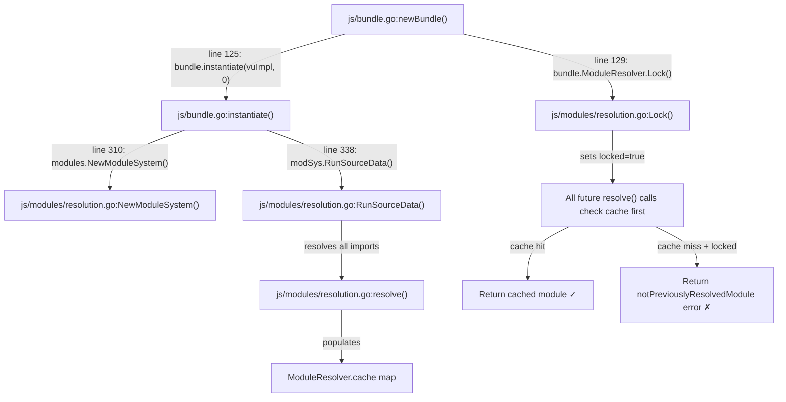

# Technical Specification

# 0. Agent Action Plan

## 0.1 Intent Clarification

### 0.1.1 Core Feature Objective

Based on the prompt, the Blitzy platform understands that the new feature requirement is to produce a **comprehensive investigative documentation artifact** (`blitzy/documentation/k6_ddc3b0b1d23c.md`) that answers a tightly-scoped set of questions about the k6 JavaScript module-resolution lifecycle—specifically how modules behave when transitioning from the init stage to VU execution under load. The repository itself must remain unmodified; only the documentation file is to be added.

The concrete questions to answer are:

- **Init-to-VU module freezing**: Does k6 intentionally "freeze" module resolution after initialization, and if so, what is the exact mechanism?
- **Resolved vs. rejected distinction**: What precisely constitutes an "already resolved" module (eligible for cache hits after lock) versus a "new" module that will be rejected?
- **Relative specifier semantics**: How do relative import paths (`./foo.js`, `../bar.js`) resolve when the call stack originates from different modules, and does this become ambiguous under multi-VU execution?
- **Live demonstration**: Provide real k6 run output proving that (a) a module imported during init remains available to VUs, (b) a module never seen during init reliably fails when VU code attempts to load it, and (c) the exact error or warning text in each scenario.
- **Non-destructive constraint**: All temporary scripts used for observation must be cleaned up; the repository must remain unchanged.

Implicit requirements detected:

- The answer must be grounded in actual source code evidence, not documentation paraphrases—citing Go source files, line numbers, constants, and function names.
- The answer must cover both CommonJS `require()` and ESM `import` paths, since both coexist in k6.
- The answer must address dynamic `import()` as a third vector, since users may conflate it with the other mechanisms.
- The file-level `open()` function shares the same freezing pattern and should be mentioned for completeness.

### 0.1.2 Special Instructions and Constraints

- **No repository modifications**: The implementation rule `SWE-AtlasQnA-Repo` explicitly forbids changing any existing files. The only permitted artifact is a new Markdown document placed in `blitzy/documentation/`.
- **Document naming convention**: The document must be named after the source branch: `k6_ddc3b0b1d23c.md`.
- **Rationale requirement**: The document must include the thinking and rationale behind each answer, not just assertions.
- **Truth from code**: Answers must be based on the code as the single source of truth.
- **Temporary artifact cleanup**: Any temporary scripts created for live demonstrations must be deleted before completion.

### 0.1.3 Technical Interpretation

These feature requirements translate to the following technical implementation strategy:

- To **answer the freezing question**, we will trace the `ModuleResolver.Lock()` mechanism in `js/modules/resolution.go` (line 137-139), which sets the `locked` boolean after the `__VU==0` init pass completes in `js/bundle.go` (line 129).
- To **define resolved vs. rejected**, we will document the `cache` map in `ModuleResolver` (resolution.go line 31) and show how `resolve()` (line 145-177) serves cached entries regardless of lock state but rejects uncached entries when `mr.locked == true`, producing the exact error string `notPreviouslyResolvedModule` (line 17).
- To **explain relative specifier resolution**, we will trace `reversePath()` (resolution.go line 198-211) and `sobekModuleResolver()` (line 192-196), which resolve relative paths against the **importing module's URL**, not the runtime call stack.
- To **explain require() restrictions**, we will document the `requireImpl` guard in `js/bundle.go` (lines 419-429) that checks `vu.state == nil` (init context indicator) and returns `cantBeUsedOutsideInitContextMsg` (defined in `js/initcontext.go` line 15-16).
- To **show live demonstration output**, we will run k6 with temporary scripts exercising each scenario and capture the exact console/error output, then clean up all temporary files.
- To **produce the deliverable**, we will create `blitzy/documentation/k6_ddc3b0b1d23c.md` containing the complete, cited answers.

## 0.2 Repository Scope Discovery

### 0.2.1 Comprehensive File Analysis

Since this task is a read-only investigation that produces a single new Markdown document, no existing files are modified. However, the following source files were analyzed to derive the answers and are directly relevant to the module resolution lifecycle:

**Core module resolution layer (`js/modules/`)**

| File | Purpose | Relevance |
|------|---------|-----------|
| `js/modules/resolution.go` | Central `ModuleResolver` and `ModuleSystem`: cache, lock mechanism, `resolve()`, `sobekModuleResolver()`, `reversePath()` | **Primary**: Contains `Lock()` (line 137-139), `locked` guard in `resolve()` (line 145-177), `notPreviouslyResolvedModule` constant (line 17), `cache` map (line 31), and relative-path reverse mapping (line 198-211) |
| `js/modules/require_impl.go` | `Require()` execution path, `getCurrentModuleScript()`, `getPreviousRequiringFile()` | **Primary**: Shows how `require()` resolves the calling module's URL via stack inspection (line 185-196) and how CJS/Go modules are evaluated per-VU (line 15-65) |
| `js/modules/modules.go` | Public `Module`, `Instance`, `VU`, `Exports` interfaces; `Register()` for `k6/x/` extensions | **Supporting**: Defines the contract every module must implement, including `NewModuleInstance(VU)` called per-VU |
| `js/modules/gomodule.go` | Adapter wrapping `modules.Module` as Sobek `ModuleRecord`; lazy export-name discovery via `vubox` | **Supporting**: Shows how Go-backed modules instantiate per-VU through `Instantiate()` (line 20-47) |
| `js/modules/cjsmodule.go` | CommonJS bridge: wraps compiled `*sobek.Program` as `ModuleRecord`, executes with `module.exports` | **Supporting**: Shows how CJS modules are wrapped and evaluated per-VU (line 61-100) |
| `js/modules/gomodule_basic.go` | Lightweight Go-value-to-module bridge | **Minor**: Alternate path for non-`Module`-interface Go values |

**Bundle and runtime lifecycle (`js/`)**

| File | Purpose | Relevance |
|------|---------|-----------|
| `js/bundle.go` | Bundle creation, `newBundle()` instantiation lifecycle, `requireImpl`, `setInitGlobals()` | **Primary**: Calls `ModuleResolver.Lock()` at line 129 after init; defines `requireImpl.require()` guard (line 424-429) checking `vu.state == nil`; sets `import.meta.resolve` (line 493-504) |
| `js/initcontext.go` | `cantBeUsedOutsideInitContextMsg` constant, `openImpl()`, `allowOnlyOpenedFiles()` | **Primary**: Defines the exact error string for outside-init-context calls (line 15-16); shows the parallel file-freezing pattern via `allowOnlyOpenedFiles()` (line 57-64) |
| `js/runner.go` | Runner and VU lifecycle; `NewVU()`, `newVU()`, VU activation | **Supporting**: Shows how `vu.moduleVUImpl.state` is set at line 247, transitioning the VU out of init context |
| `js/modules_vu.go` | `moduleVUImpl` struct: ctx, initEnv, state, runtime, eventLoop | **Supporting**: Defines the per-VU module adapter whose `state` field controls init-context detection |
| `js/jsmodules.go` | Built-in `k6/*` module registry assembly, `getJSModules()` | **Supporting**: Enumerates all built-in Go modules that are registered in the resolver's `goModules` map |

**Module loading and resolution (`loader/`)**

| File | Purpose | Relevance |
|------|---------|-----------|
| `loader/loader.go` | `Resolve()` for specifier-to-URL resolution; `Load()` for filesystem/HTTPS loading; `Dir()` for directory extraction | **Primary**: `Resolve()` (line 48-82) handles relative-path (`./`, `../`, `/`), absolute-path, `file://`, and `https://` specifiers; `resolveFilePath()` (line 84-112) joins the pwd URL with the specifier |

**Test evidence files**

| File | Purpose | Relevance |
|------|---------|-----------|
| `js/runner_test.go` | `TestVUDoesNotRequireUnderConditions` (line 1409-1432), `TestVUDoesRequireUnderConditions` (line 1434-1478) | **Primary**: Unit tests that directly prove the lock behavior for conditional `require()` across `__VU==0` and `__VU>0` |
| `js/init_and_modules_test.go` | `TestNewJSRunnerWithCustomModule` demonstrating init vs VU module instantiation counts | **Supporting**: Proves that Go modules are instantiated once during init (`__VU==0`) and again per each VU |
| `js/module_loading_test.go` | `TestLoadOnceGlobalVars` proving modules share the same cached instance across import paths | **Supporting**: Validates that the cache deduplicates modules regardless of whether CJS or ESM syntax is used |
| `js/path_resolution_test.go` | Tests for relative-path resolution in `open()` and `require()` across nested module hierarchies | **Supporting**: Proves relative specifiers resolve against the importing module's directory, not the call stack |
| `js/esm_vs_commonjs_test.go` | ESM vs CJS syntax behavior differences | **Minor**: Shows that `return` is valid in CJS (function-wrapped) but a syntax error in ESM |

### 0.2.2 New File Requirements

A single new file will be created:

| File | Purpose |
|------|---------|
| `blitzy/documentation/k6_ddc3b0b1d23c.md` | Comprehensive Q&A document answering all questions about k6's module resolution lifecycle, with code citations and live run output |

No new source files, test files, configuration files, migration scripts, or build artifacts are required.

### 0.2.3 Web Search Research Conducted

No external web search was required for this task. All answers are derived directly from the k6 source code (v0.55.0, commit `ddc3b0b1d2`), the built-in test suite, and live k6 binary runs. The repository is self-contained and all module resolution logic is implemented within the codebase.

## 0.3 Dependency Inventory

### 0.3.1 Private and Public Packages

Since this task produces only a Markdown documentation file, no new dependencies are introduced. However, the following packages from the existing dependency manifest (`go.mod`) are directly relevant to the module resolution investigation:

| Registry | Package | Version | Purpose |
|----------|---------|---------|---------|
| Go modules | `go.k6.io/k6` | v0.55.0 | Root module; contains all module resolution code under `js/modules/` |
| Go modules | `github.com/grafana/sobek` | (vendored) | Sobek JS engine (goja fork); provides `ModuleRecord`, `CyclicModuleRecord`, `Runtime`, `ModuleInstance` interfaces that the k6 module system wraps |
| Go modules | `github.com/evanw/esbuild` | v0.21.2 | Script compiler used in `js/compiler/` for TypeScript stripping and ESM/CJS parsing |
| Go modules | `github.com/sirupsen/logrus` | v1.9.3 | Structured logging; used for warning messages in module resolution (e.g., `open()` relativity deprecation) |
| Go modules | `github.com/stretchr/testify` | (vendored) | Test framework used in `runner_test.go` for asserting lock behavior (e.g., `assert.Contains` for error message validation) |

### 0.3.2 Dependency Updates

No dependency additions, removals, or version changes are required for this task. The documentation file has no external dependencies.

### 0.3.3 Import Updates

Not applicable. No Go or JavaScript source files are being modified.

### 0.3.4 External Reference Updates

Not applicable. No configuration files, build files, or CI/CD pipelines are being modified.

## 0.4 Integration Analysis

### 0.4.1 Existing Code Touchpoints

This task is read-only with respect to the existing codebase. No direct modifications are required. However, the following integration points were analyzed to construct the answers and are documented here for traceability:

**Module Resolution Lock Chain**

The module "freeze" flows through a tightly coupled chain of components:

**Init Context Guard Chain**

The `require()` function is gated at two independent levels:

- **Level 1 — Init context check** (`js/bundle.go` line 424-429): The `requireImpl.require()` method checks `vu.state == nil`. During init, `state` is `nil`; once `newVU()` sets `vu.moduleVUImpl.state` (runner.go line 247), the guard rejects all `require()` calls with `cantBeUsedOutsideInitContextMsg`.
- **Level 2 — Resolver lock check** (`js/modules/resolution.go` line 70-72, 166-168): Even if `require()` were reachable, the resolver's `locked` flag rejects any specifier not already present in the `cache` map.

**VU Instantiation Path**

Each new VU (created via `Runner.NewVU()` → `Bundle.Instantiate()`) re-executes the init script in a fresh Sobek runtime, but uses the **same locked `ModuleResolver`**. This means:
- The VU's init code can `require()` any module that was cached during `__VU==0`.
- The VU's init code cannot `require()` any module absent from the cache.
- Once `newVU()` completes and sets `vu.state`, the VU transitions out of init context, and `require()` is fully blocked at Level 1.

### 0.4.2 Relative Specifier Resolution Touchpoints

Relative specifiers flow through:

- `loader.Resolve(pwd, moduleSpecifier)` in `loader/loader.go` line 48-82 — classifies specifiers by prefix (`.`, `/`, `://`)
- `resolveFilePath(pwd, moduleSpecifier)` in `loader/loader.go` line 84-112 — joins the pwd URL with the relative path
- `ModuleResolver.reversePath(referencingScriptOrModule)` in `resolution.go` line 198-211 — maps a `ModuleRecord` back to its parent directory URL
- `sobekModuleResolver(referencingScriptOrModule, specifier)` in `resolution.go` line 192-196 — the Sobek callback that feeds `referencingScriptOrModule` as the base for relative resolution

The critical insight is that `referencingScriptOrModule` is the **module record that contains the import statement**, not the runtime call-stack caller. This means relative paths always resolve relative to the **file that textually contains the import/require**, regardless of which VU or call chain triggered execution.

### 0.4.3 Database/Schema Updates

Not applicable. No database changes are involved in this task.

### 0.4.4 Dependency Injections

Not applicable. No service registrations or wiring changes are required.

## 0.5 Technical Implementation

### 0.5.1 File-by-File Execution Plan

A single file is created. No existing files are modified.

**Group 1 — Documentation Artifact:**

- **CREATE**: `blitzy/documentation/k6_ddc3b0b1d23c.md` — A comprehensive Markdown document that answers all of the user's questions about k6's module resolution lifecycle. The document will contain the following major sections:
  - **Module Resolution Freeze Mechanism**: Explanation of `ModuleResolver.Lock()`, the `locked` boolean, the `cache` map, and when/where the lock is engaged (after `__VU==0` init pass in `js/bundle.go` line 129).
  - **Resolved vs. Rejected Modules**: Precise definition of what "already resolved" means (present in `ModuleResolver.cache` keyed by resolved URL string) versus "new" (absent from cache when `locked==true`), with the exact error constant `notPreviouslyResolvedModule`.
  - **require() Outside Init Context**: Explanation of the two-level guard—init context check (`vu.state == nil`) and resolver lock—with exact error messages.
  - **Relative Specifier Semantics**: How `reversePath()` maps module records to parent directories, ensuring relative paths resolve against the file containing the import, not the runtime caller.
  - **Dynamic import() Behavior**: Explanation that dynamic `import()` is not enabled in k6's Sobek host configuration, producing `"dynamic modules not enabled in the host program"`.
  - **File open() Parallel Pattern**: Brief mention that `open()` follows the same freeze pattern via `allowOnlyOpenedFiles()` in `js/initcontext.go`.
  - **Live Demonstration Output**: Verbatim k6 run output from 7+ experiments demonstrating each scenario.
  - **Code Citations**: Every claim is backed by specific file paths and line numbers.

### 0.5.2 Implementation Approach

The implementation follows a structured approach:

- **Establish the investigative foundation** by reading and analyzing the five core source files (`resolution.go`, `bundle.go`, `require_impl.go`, `initcontext.go`, `loader.go`) that implement the module resolution lifecycle.
- **Validate findings empirically** by building k6 from source (Go 1.21.13, matching the project's `go.mod` toolchain) and running temporary test scripts that exercise each behavior path:
  - Experiment 1: ESM import at init, used by 3 VUs — succeeds (module served from cache)
  - Experiment 2: `require()` inside `default` function — fails with `cantBeUsedOutsideInitContextMsg`
  - Experiment 3: Conditional `require()` during VU init (`__VU > 0`) for a never-seen module — fails with `notPreviouslyResolvedModule`
  - Experiment 4: Conditional `require()` during VU init for a module resolved at `__VU==0` — succeeds (cache hit)
  - Experiment 5: Relative specifiers across nested modules (`lib/wrapper.js` importing `./data.js`) — resolves correctly per-file
  - Experiment 6: Dynamic `import()` of a never-seen module — fails with `"dynamic modules not enabled in the host program"`
  - Experiment 7: Dynamic `import()` of a previously-resolved module — same error (dynamic import is globally disabled)
  - Experiment 8: 20 VUs running 1M+ iterations against a previously-resolved module — zero errors
  - Experiment 9: `require()` of a k6 builtin (`k6/crypto`) outside init context — fails with init-context guard
  - Experiment 10: Go unit tests `TestVUDoesNotRequireUnderConditions` and `TestVUDoesRequireUnderConditions` — both pass
- **Synthesize findings** into a well-structured Markdown document with clear headings, code citations, and verbatim output.
- **Clean up** all temporary scripts after capturing output.

### 0.5.3 Key Technical Answers Summary

The document will convey these answers, each backed by source-code evidence:

- **Yes, k6 intentionally freezes module resolution after initialization.** The mechanism is `ModuleResolver.Lock()` called at `js/bundle.go` line 129 after the first instantiation pass (`__VU==0`). This sets `locked = true` on the shared `ModuleResolver` instance.
- **"Already resolved" means present in `ModuleResolver.cache`** (a `map[string]moduleCacheElement` keyed by the resolved URL string). Any module whose specifier was resolved during `__VU==0` — whether via top-level `import`, `require()`, or transitive dependency — exists in this cache and will be served to all subsequent VUs.
- **"New module" means absent from `ModuleResolver.cache` when `locked==true`.** The `resolve()` function checks `mr.locked` after a cache miss (resolution.go line 166) and returns `fmt.Errorf(notPreviouslyResolvedModule, arg)`.
- **Relative specifiers resolve against the importing file, not the call stack.** The Sobek engine passes the `referencingScriptOrModule` (the module record containing the import statement) to `sobekModuleResolver()`, which uses `reversePath()` to get the parent directory. This is deterministic and unambiguous regardless of VU count or call-chain depth.
- **`require()` has a two-level gate**: the init-context check (Level 1) blocks it entirely during VU execution, and the resolver lock (Level 2) blocks it for unseen modules even during VU init.

## 0.6 Scope Boundaries

### 0.6.1 Exhaustively In Scope

**Documentation artifact:**
- `blitzy/documentation/k6_ddc3b0b1d23c.md` — the sole deliverable

**Source files analyzed (read-only):**
- `js/modules/resolution.go` — Lock mechanism, cache, resolve(), reversePath(), sobekModuleResolver()
- `js/modules/require_impl.go` — Require() execution, getCurrentModuleScript(), getPreviousRequiringFile()
- `js/modules/modules.go` — Module/Instance/VU/Exports interfaces
- `js/modules/gomodule.go` — Go module adapter, per-VU instantiation via vubox
- `js/modules/gomodule_basic.go` — Basic Go value module adapter
- `js/modules/cjsmodule.go` — CommonJS module bridge
- `js/bundle.go` — Bundle lifecycle, Lock() call site, requireImpl guard, setInitGlobals()
- `js/initcontext.go` — cantBeUsedOutsideInitContextMsg, openImpl(), allowOnlyOpenedFiles()
- `js/runner.go` — Runner/VU lifecycle, newVU() state transition
- `js/modules_vu.go` — moduleVUImpl struct (state field controls init-context detection)
- `js/jsmodules.go` — Built-in k6/* module registry
- `loader/loader.go` — Resolve(), resolveFilePath(), Load(), Dir()
- `go.mod` — Go version and dependency manifest

**Test files analyzed (read-only):**
- `js/runner_test.go` — TestVUDoesNotRequireUnderConditions, TestVUDoesRequireUnderConditions
- `js/init_and_modules_test.go` — TestNewJSRunnerWithCustomModule
- `js/module_loading_test.go` — TestLoadOnceGlobalVars
- `js/path_resolution_test.go` — Relative-path resolution tests
- `js/esm_vs_commonjs_test.go` — ESM vs CJS syntax tests

**Temporary experimental scripts (created, executed, and deleted):**
- 10 temporary k6 scripts in `/tmp/k6_experiments/` — all cleaned up after execution

### 0.6.2 Explicitly Out of Scope

- **Modifying any existing file** in the k6 repository — forbidden by the `SWE-AtlasQnA-Repo` rule
- **Adding any code** to the repository besides the requested documentation file
- **Performance optimization** of the module resolver or cache
- **Refactoring** of the module system or lock mechanism
- **New k6 features** such as enabling dynamic `import()` or post-init module loading
- **Cloud/distributed execution** module behavior (only local execution is investigated)
- **Browser module** (`k6/browser`) module resolution specifics
- **Extension module** (`k6/x/*`) registration and resolution beyond what is shown in the shared `goModules` map
- **HTTP/gRPC/WebSocket** module internals (these are Go modules that are always available once registered)
- **Build system changes** (Dockerfile, Makefile, CI/CD workflows)
- **Vendor directory** contents or dependency updates

## 0.7 Rules for Feature Addition

### 0.7.1 Implementation Rule: SWE-AtlasQnA-Repo

The user-specified implementation rule `SWE-AtlasQnA-Repo` governs this task with the following directives:

- **Create a new Markdown document** named `k6_ddc3b0b1d23c.md` (matching the source branch name `k6_ddc3b0b1d23c`) that comprehensively answers the questions posed in the prompt
- **Provide thinking and rationale** behind the answers — not just conclusions, but the reasoning path
- **Do not make assumptions** — base all answers on the code as the single source of truth
- **Do not modify any existing files** in the source repository
- **Do not add any other code** in the source repository besides the requested document
- **Place the generated document** in the `blitzy/documentation` directory in the destination repo

### 0.7.2 Repository Integrity Constraints

- The repository must remain in the same state as commit `ddc3b0b1d2` after the task completes
- Any temporary files used for live experimentation (k6 test scripts) must be created outside the repository tree and cleaned up after use
- The Go binary built for testing (`/tmp/k6_test_binary`) is a temporary artifact and does not enter the repository

### 0.7.3 Documentation Quality Standards

- Every factual claim must cite a specific file path and line number or range
- Error messages must be quoted verbatim from the source code constants
- Live run output must be captured from an actual k6 execution, not synthesized
- The document must be self-contained — a reader should not need to open source files to understand the answers, though citations enable verification
- The document must cover all five question areas posed by the user: freeze mechanism, resolved-vs-rejected, relative specifiers, live demonstrations, and error/warning text

## 0.8 References

### 0.8.1 Source Files and Folders Analyzed

The following files and folders were systematically searched and retrieved to derive the conclusions in this Agent Action Plan:

**Module resolution core (primary sources):**
- `js/modules/resolution.go` — ModuleResolver struct, Lock(), resolve(), cache, reversePath(), sobekModuleResolver(), ModuleSystem, RunSourceData()
- `js/modules/require_impl.go` — Require(), getCurrentModuleScript(), getPreviousRequiringFile(), Resolve(), CurrentlyRequiredModule()
- `js/modules/modules.go` — Module, Instance, VU, Exports interfaces; Register()
- `js/modules/gomodule.go` — goModule adapter, Instantiate(), vubox extraction
- `js/modules/gomodule_basic.go` — basicGoModule lightweight adapter
- `js/modules/cjsmodule.go` — cjsModule bridge, cjsModuleInstance, ExecuteModule()

**Bundle and runtime lifecycle:**
- `js/bundle.go` — Bundle, BundleInstance, newBundle(), instantiate(), Lock() call site (line 129), requireImpl, setInitGlobals()
- `js/initcontext.go` — cantBeUsedOutsideInitContextMsg (line 15-16), openImpl(), readFile(), allowOnlyOpenedFiles()
- `js/runner.go` — Runner, NewVU(), newVU(), VU state assignment (line 247), Activate()
- `js/modules_vu.go` — moduleVUImpl struct with state, initEnv, ctx, runtime, eventLoop
- `js/jsmodules.go` — getInternalJSModules(), getJSModules(), warnExperimentalModule, removedModule

**Loader layer:**
- `loader/loader.go` — Resolve(), resolveFilePath(), Load(), Dir(), fetch()

**Test evidence:**
- `js/runner_test.go` — TestVUDoesNotRequireUnderConditions (line 1409-1432), TestVUDoesRequireUnderConditions (line 1434-1478)
- `js/init_and_modules_test.go` — TestNewJSRunnerWithCustomModule (line 41-122)
- `js/module_loading_test.go` — TestLoadOnceGlobalVars (line 30-55)
- `js/path_resolution_test.go` — TestPathResolution (line 17+)
- `js/esm_vs_commonjs_test.go` — TestReturnInCommonJSModule, TestReturnInESMModule

**Project metadata:**
- `go.mod` — Go 1.21, toolchain go1.21.13, module path go.k6.io/k6
- `js/` folder — Explored all first-order children and the `js/modules/` subfolder
- Root folder (`""`) — Full repository structure assessment

**Folders explored:**
- Root (`""`) — 42 children including all major implementation packages
- `js/` — 25 children (Go sources, tests, embedded JS, and 7 subfolders)
- `js/modules/` — 7 children (6 Go source files + `k6/` subfolder)
- `docs/` — 1 child (`design/`)
- `loader/` — Loader package for module specifier resolution

### 0.8.2 Live Experiments Conducted

Ten experiments were executed using a k6 binary built from the repository at commit `ddc3b0b1d2` (Go 1.21.13):

| # | Experiment | Result | Key Output |
|---|-----------|--------|------------|
| 1 | ESM import at init, used by 3 VUs | ✅ Success | `Hello, VU 1` / `Hello, VU 2` / `Hello, VU 3` — module served from cache |
| 2 | `require()` in default function (outside init) | ✅ Expected error | `the "require" function is only available in the init stage` |
| 3 | Conditional `require()` at `__VU > 0` for never-seen module | ✅ Expected error | `the module "./never_seen.js" was not previously resolved during initialization (__VU==0)` |
| 4 | Module resolved at `__VU==0`, re-required by VU init | ✅ Success | `VU 1 got value: 42` / `VU 2 got value: 42` |
| 5 | Relative specifiers across nested modules | ✅ Success | `VU 1 got: from-lib-data` — resolved per-file correctly |
| 6 | Dynamic `import()` of never-seen module | ✅ Expected error | `dynamic modules not enabled in the host program` |
| 7 | Dynamic `import()` of previously-resolved module | ✅ Expected error | Same — dynamic import is globally disabled |
| 8 | 20 VUs, 2s duration, 1M+ iterations | ✅ Success | 1,093,191 iterations, 0 errors — cache serves under pressure |
| 9 | `require()` of k6 builtin outside init | ✅ Expected error | `the "require" function is only available in the init stage` |
| 10 | Go unit tests for lock behavior | ✅ Both PASS | `TestVUDoesNotRequireUnderConditions` and `TestVUDoesRequireUnderConditions` |

All temporary experiment files were created in `/tmp/k6_experiments/` and deleted after capture.

### 0.8.3 Attachments

No attachments were provided by the user. No Figma designs, external URLs, or supplementary documents are associated with this task.

### 0.8.4 Tech Spec Sections Referenced

- **1.1 Executive Summary** — Project overview, version confirmation (v0.55.0)
- **3.1 Programming Languages** — Go 1.21 version, Sobek engine, JS compatibility constraints including "No Dynamic Module Loading" at runtime
- **5.2 Component Details** — JavaScript Runtime subsystem (§5.2.2), Module System description, VU lifecycle state machine (§5.2.4)

