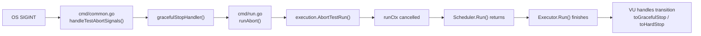

# Technical Specification

# 0. Agent Action Plan

## 0.1 Intent Clarification

### 0.1.1 Core Feature Objective

Based on the prompt, the Blitzy platform understands that the new feature requirement is to **create a comprehensive investigative markdown document** that answers a series of deep-dive questions about Grafana k6's internal runtime behavior by gathering runtime evidence directly from the k6 v0.55.0 codebase (commit `ddc3b0b1d2`). The document must be placed at `blitzy/documentation/k6_ddc3b0b1d23c.md` in the destination repository. No existing source files may be modified. The following specific behavioral investigations are required:

- **VU Management and SIGINT Handling**: Determine the exact log messages produced when a `ramping-vus` executor with at least 5 VUs receives a `SIGINT`. Provide log evidence showing whether currently active VUs are allowed to finish their current iteration or are terminated mid-execution during graceful shutdown.

- **gRPC Server Streaming Interruption**: Capture the exact log entries obtained at runtime when a gRPC server streaming test using the `main.FeatureExplorer/ListFeatures` RPC with a `30ms gracefulRampDown` is interrupted via `SIGINT`. Report the exact value of `grpc_streams_msgs_received` from the final metrics summary.

- **Dropped Iterations via API**: Determine the exact value of `dropped_iterations` reported when a test (using `constant-arrival-rate`) exceeds its maximum duration capacity. Provide runtime evidence by querying the k6 REST API (`/v1/metrics/dropped_iterations`) during test execution.

- **Data Sharing Behavior (SharedArray)**: Investigate whether the memory footprint for loaded data files remains constant with increasing VU count, or whether each VU creates its own copy. Provide test script output comparing `open()` (per-VU copy) vs `SharedArray` (shared across VUs) memory usage. Identify the root cause of the observed behavior in the source code.

- **Prometheus Output Metric Name Integrity**: Provide test script output proving that the exported data via the `experimental-prometheus-rw` output maintains the integrity of metric names. Show the `k6_` prefix convention and the Prometheus `__name__` label mapping.

Implicit requirements detected:
- A gRPC test server implementing the `FeatureExplorer/ListFeatures` server-streaming RPC must be built from `examples/grpc_server/` to support the gRPC experiment.
- The k6 binary must be built from source at the exact commit `ddc3b0b1d2` to ensure reproducibility.
- All temporary test scripts and build artifacts must be cleaned up after experiments, leaving the repository source code unchanged.
- Runtime evidence must include verbatim stdout/stderr output and API JSON responses.

### 0.1.2 Special Instructions and Constraints

- **CRITICAL: No Repository Modifications** — The user explicitly requires: "Don't modify any repository source files." All observations are derived from running the existing codebase, not from modifying it.
- **Cleanup Mandate** — "If you need to create temporary scripts or artifacts to observe behavior, that's fine, but clean them up afterward and leave the codebase unchanged."
- **Document Placement Rule** — Per the `SWE-AtlasQnA-Repo` implementation rule, the output document must be named `k6_ddc3b0b1d23c.md` (matching the source branch name) and placed in `blitzy/documentation/`.
- **Evidence-Based Answers Only** — "Do not make assumptions, base your answers on the code as the truth." All answers must be backed by actual runtime output or source code references.
- **Rationale Required** — "Provide thinking / rationale behind the answers."

### 0.1.3 Technical Interpretation

These feature requirements translate to the following technical implementation strategy:

- To **investigate VU management and SIGINT handling**, we will create a k6 test script using the `ramping-vus` executor (`lib/executor/ramping_vus.go`) with `startVUs: 5`, run it with `--verbose --log-output=stdout --log-format=raw`, send `SIGINT` after ~6 seconds, and capture the full log output. The signal handling pipeline is in `cmd/common.go` (`handleTestAbortSignals`), and the VU lifecycle state machine is in `lib/executor/vu_handle.go`.

- To **investigate gRPC server streaming interruption**, we will build the gRPC test server from `examples/grpc_server/main.go`, create a k6 script invoking `main.FeatureExplorer/ListFeatures` with `gracefulRampDown: '30ms'`, run it, send `SIGINT`, and capture the gRPC-specific metrics (`grpc_streams_msgs_received` defined in `js/modules/k6/grpc/metrics.go`).

- To **investigate dropped iterations via API**, we will create a `constant-arrival-rate` test that intentionally overloads VUs (high rate, slow iterations), then during execution query the k6 REST API at `localhost:6565/v1/metrics/dropped_iterations` (`api/v1/metric_routes.go`). The `dropped_iterations` counter metric is defined in `metrics/builtin.go` and emitted in real-time by the `constant_arrival_rate.go` executor.

- To **investigate data sharing behavior**, we will create two test scripts: one loading data via `open()` (which creates per-VU copies per the Sobek/goja runtime isolation model) and one using `SharedArray` from `k6/data` (`js/modules/k6/data/data.go` and `share.go`), then compare VmRSS memory consumption via `/proc/[pid]/status`.

- To **investigate Prometheus metric name integrity**, we will run a test with custom metrics (Counter, Trend, Rate, Gauge) using `-o experimental-prometheus-rw`, examine the log output, and trace the naming convention through `vendor/github.com/grafana/xk6-output-prometheus-remote/pkg/remotewrite/prometheus.go` where `defaultMetricPrefix = "k6_"` is prepended and the `__name__` label is set via `MapSeries()`.

## 0.2 Repository Scope Discovery

### 0.2.1 Comprehensive File Analysis

The repository is the Grafana k6 source tree at version v0.55.0 (Go module `go.k6.io/k6`). Since no existing files are to be modified, the analysis below catalogs every file and directory examined to derive behavioral conclusions for the investigative document.

**Executor and VU Management Files (Read-Only Analysis)**

| File Path | Purpose | Investigation Relevance |
|---|---|---|
| `lib/executor/ramping_vus.go` | Implements the `ramping-vus` executor type with stage-based VU scaling and `gracefulRampDown` configuration | SIGINT + graceful shutdown behavior |
| `lib/executor/vu_handle.go` | VU lifecycle state machine (`stopped`, `starting`, `running`, `toGracefulStop`, `toHardStop`) with `gracefulStop()` and `hardStop()` transitions | Whether VUs finish current iteration on interrupt |
| `lib/executor/base_executor.go` | Base executor configuration including `gracefulStop` field | Shared executor behavior |
| `lib/executor/constant_arrival_rate.go` | `constant-arrival-rate` executor that emits `dropped_iterations` in real-time when VU pool is exhausted | Dropped iterations investigation |
| `lib/executor/per_vu_iterations.go` | `per-vu-iterations` executor that emits `dropped_iterations` at test end when `maxDuration` is exceeded | Dropped iterations (batch emission) |
| `execution/scheduler.go` | Orchestrates VU initialization, executor lifecycle, and the `Run()` loop that processes `runCtx` cancellation | Overall test run lifecycle |

**Signal Handling and CLI Files (Read-Only Analysis)**

| File Path | Purpose | Investigation Relevance |
|---|---|---|
| `cmd/run.go` | `cmdRun.run()` method — sets up `runCtx`, REST API server, signal traps, calls `execScheduler.Run()` | Entry point for `k6 run`, signal trap setup |
| `cmd/common.go` | `handleTestAbortSignals()` — traps `SIGINT`/`SIGTERM`, invokes `gracefulStopHandler` on first signal, `onHardStop` on second | Exact signal-to-action mapping |
| `cmd/ui_unix.go` | Unix signal definitions (`SIGWINCH`) | Platform signal support |

**gRPC Module Files (Read-Only Analysis)**

| File Path | Purpose | Investigation Relevance |
|---|---|---|
| `js/modules/k6/grpc/stream.go` | gRPC stream implementation — `beginStream()`, event handlers (`on`, `write`, `end`), context cancellation | Server streaming behavior during interrupt |
| `js/modules/k6/grpc/metrics.go` | Registers `grpc_streams`, `grpc_streams_msgs_sent`, `grpc_streams_msgs_received` metrics | Metric names in final summary |
| `js/modules/k6/grpc/client.go` | gRPC client — `connect()`, `invoke()`, reflection support | Client connection lifecycle |
| `lib/testutils/grpcservice/service.go` | Test gRPC server implementing `RouteGuide` and `FeatureExplorer` services with `ListFeatures` | Server-side streaming implementation |
| `lib/testutils/grpcservice/route_guide.proto` | Proto definition for `FeatureExplorer.ListFeatures(Rectangle) returns (stream Feature)` | Service contract for test |
| `examples/grpc_server/main.go` | Standalone gRPC server binary using `grpcservice` package | Build target for test server |

**Data Sharing Module Files (Read-Only Analysis)**

| File Path | Purpose | Investigation Relevance |
|---|---|---|
| `js/modules/k6/data/data.go` | `RootModule` with `sharedArrays` map — single instance shared across all VU `Data` module instances | SharedArray is stored once at RootModule level |
| `js/modules/k6/data/share.go` | `sharedArray` struct backed by `[]string`; `wrappedSharedArray` provides per-VU JSON parsing via `Get()` with deep-freeze | Memory sharing mechanism |

**Metrics and API Files (Read-Only Analysis)**

| File Path | Purpose | Investigation Relevance |
|---|---|---|
| `metrics/builtin.go` | Defines `DroppedIterationsName = "dropped_iterations"` as a `Counter` metric | Metric identity |
| `api/v1/routes.go` | REST API route registration — `/v1/metrics`, `/v1/metrics/{id}`, `/v1/status` | API query endpoint |
| `api/v1/metric_routes.go` | `handleGetMetric()` — locks `MetricsEngine`, looks up `ObservedMetrics[id]`, returns JSON | API response format |
| `api/v1/metric.go` | `Metric` struct with `Sample map[string]float64` from `Sink.Format(t)` | Response structure |
| `api/server.go` | API server setup, default address `localhost:6565` | Server configuration |

**Prometheus Remote Write Output Files (Read-Only Analysis)**

| File Path | Purpose | Investigation Relevance |
|---|---|---|
| `cmd/outputs.go` | Registers `experimental-prometheus-rw` output constructor using `remotewrite.New()` | Output registration |
| `vendor/github.com/grafana/xk6-output-prometheus-remote/pkg/remotewrite/config.go` | Defines `defaultMetricPrefix = "k6_"` and `defaultServerURL`, `defaultTrendStats` | Naming convention origin |
| `vendor/github.com/grafana/xk6-output-prometheus-remote/pkg/remotewrite/prometheus.go` | `MapSeries()` — constructs Prometheus labels with `__name__` = `k6_` + metric name + optional suffix | Metric name mapping logic |
| `vendor/github.com/grafana/xk6-output-prometheus-remote/pkg/remotewrite/remotewrite.go` | `flush()` → `convertToPbSeries()` — converts k6 samples to Prometheus TimeSeries | Flush pipeline |
| `vendor/github.com/grafana/xk6-output-prometheus-remote/pkg/remotewrite/trend.go` | `trendAsGauges.Append()` — appends trend stat suffix to `__name__` label value | Trend metric naming |

**Configuration and Build Files (Read-Only Analysis)**

| File Path | Purpose |
|---|---|
| `go.mod` | Go 1.21, toolchain go1.21.13; declares `xk6-output-prometheus-remote v0.5.0` dependency |
| `Makefile` | Build targets (`build`, `test`, `lint`) |
| `Dockerfile` | Multi-stage build for k6 container image |
| `docker-compose.yml` | Reference stack (InfluxDB + Grafana + k6) |

### 0.2.2 Web Search Research Conducted

No external web searches were required for this investigation. All behavioral evidence was obtained directly by:
- Building k6 from source at the repository commit
- Building the gRPC test server from `examples/grpc_server/`
- Running k6 with various test scripts and capturing runtime output
- Querying the k6 REST API during test execution
- Analyzing VmRSS memory consumption via `/proc/[pid]/status`
- Tracing metric naming through the Prometheus remote write vendor code

### 0.2.3 New File Requirements

Since this is a read-only investigation, no source files are created in the k6 repository. The single output artifact is:

| File Path | Purpose |
|---|---|
| `blitzy/documentation/k6_ddc3b0b1d23c.md` | Comprehensive markdown document answering all investigative questions with runtime evidence, exact log outputs, API responses, memory comparisons, and source code rationale |

Temporary artifacts created during experiments (all cleaned up after use):
- `/tmp/test_ramping_sigint.js` — Ramping VU + SIGINT test script
- `/tmp/test_grpc_stream_v2.js` — gRPC server streaming test script
- `/tmp/test_dropped_iterations3.js` — Constant arrival rate dropped iterations script
- `/tmp/test_open_mem.js` — open() memory test script
- `/tmp/test_shared_mem.js` — SharedArray memory test script
- `/tmp/test_prom_v2.js` — Prometheus output metric naming test script
- `/tmp/grpc_test_server` — Compiled gRPC test server binary
- `/tmp/test_data_large.json` — 20 MB synthetic data file for memory tests

## 0.3 Dependency Inventory

### 0.3.1 Private and Public Packages

All package versions are extracted directly from the repository's `go.mod` file. No versions are assumed or fabricated.

| Registry | Package | Version | Purpose |
|---|---|---|---|
| Go module | `go.k6.io/k6` | v0.55.0 | k6 core engine (the repository itself) |
| Go module | `github.com/grafana/xk6-output-prometheus-remote` | v0.5.0 | Prometheus remote write output — metric name mapping, `k6_` prefix, `__name__` label |
| Go module | `github.com/grafana/xk6-dashboard` | v0.7.5 | Real-time web dashboard output |
| Go module | `github.com/grafana/xk6-output-opentelemetry` | v0.3.0 | OpenTelemetry output |
| Go module | `github.com/sirupsen/logrus` | v1.9.3 | Structured logging — all debug/info/warn/error log messages in the runtime output |
| Go module | `github.com/grafana/sobek` | (indirect) | JavaScript runtime engine (goja fork) — per-VU JS runtime isolation |
| Go module | `github.com/spf13/cobra` | v1.8.1 | CLI command framework — `k6 run` command structure |
| Go module | `github.com/golang/protobuf` | v1.5.4 | Protocol Buffers for gRPC service definitions |
| Go module | `google.golang.org/grpc` | v1.64.1 | gRPC framework — client/server streaming, connection management |
| Go module | `github.com/evanw/esbuild` | v0.21.2 | JavaScript bundler/transpiler for test script compilation |
| Go module | `github.com/gorilla/websocket` | v1.5.3 | WebSocket protocol support |
| Go module | `gopkg.in/guregu/null.v3` | v3.5.0 | Nullable types used in executor configurations |
| Go module | `github.com/prometheus/client_golang` | v1.16.0 | Prometheus client library (used by remote write output) |
| Go module | `buf.build/gen/go/prometheus/prometheus/protocolbuffers/go` | v1.31.0 | Prometheus protobuf definitions for remote write protocol |
| Go (toolchain) | `go` | 1.21.13 | Go compiler and runtime — required by `go.mod` `toolchain go1.21.13` directive |

### 0.3.2 Dependency Updates

No dependency updates are required for this investigation. The task is entirely read-only — building the existing codebase from source and running experiments against it. The `go.mod` and `go.sum` files remain unchanged.

The only transient build step was running `go mod tidy` in the `examples/grpc_server/` directory to build the standalone gRPC test server binary, after which the changes were reverted via `git checkout -- examples/grpc_server/go.mod examples/grpc_server/go.sum`.

## 0.4 Integration Analysis

### 0.4.1 Existing Code Touchpoints

Since no code modifications are made, this section documents the integration points that were **analyzed** to derive the runtime behavior documented in the output markdown file. These touchpoints represent the internal orchestration flow that produces the observable log evidence.

**Signal Handling Chain (SIGINT → Graceful Shutdown)**

- `cmd/common.go:97` — `handleTestAbortSignals()`: Registers the signal channel via `gs.SignalNotify(sigC, os.Interrupt, syscall.SIGINT, syscall.SIGTERM)`. First signal dispatches to `gracefulStopHandler`, second to `onHardStop`.
- `cmd/run.go:349` — `gracefulStop`: Calls `runAbort()` which propagates `errext.AbortedByUser` with exit code `exitcodes.ExternalAbort` (105). Also cancels `lingerCtx`.
- `cmd/run.go:360` — `onHardStop`: Calls `globalCancel()` and logs an error-level message.
- `lib/executor/vu_handle.go:135` — `gracefulStop()`: Transitions `running` → `toGracefulStop`. The VU's context is NOT cancelled at this point. The currently executing iteration's `runIter(ctx, vu)` call in `runLoopsIfPossible()` is allowed to return naturally. Only after the iteration completes does the VU transition to `stopped`.
- `lib/executor/vu_handle.go:149` — `hardStop()`: Transitions `running`/`toGracefulStop` → `toHardStop`. The VU's context IS cancelled immediately via `vh.cancel()`, forcefully terminating mid-iteration execution.

**gRPC Streaming Pipeline**

- `js/modules/k6/grpc/stream.go:85` — `beginStream()`: Opens a server-streaming RPC via `client.conn.NewStream(ctx, req)`. The stream's context is derived from the VU context, meaning VU cancellation propagates to the gRPC stream.
- `js/modules/k6/grpc/metrics.go` — Registers three counter metrics: `grpc_streams` (stream count), `grpc_streams_msgs_sent` (client → server messages), `grpc_streams_msgs_received` (server → client messages).
- `lib/testutils/grpcservice/service.go` — `ListFeatures()` implementation iterates over feature database entries and streams back those within the requested rectangle.

**Dropped Iterations Emission Path**

- `lib/executor/constant_arrival_rate.go:333` — When `vusPool.TryRunIteration()` returns `false` (no free VUs), the executor pushes a `metrics.Sample` with `Metric: droppedIterationMetric` and `Value: 1` via `metrics.PushIfNotDone()`. This happens in **real-time** during the ticker loop.
- `lib/executor/per_vu_iterations.go:202` — Emits dropped iterations as a **batch** at test end, calculating `doneIters - totalIters` for VUs that couldn't complete within `maxDuration`.
- `metrics/builtin.go:10,84` — `DroppedIterationsName = "dropped_iterations"` registered as a `Counter` metric type.

**REST API Metrics Query Path**

- `api/v1/routes.go:34` — `/v1/metrics/{id}` route dispatches to `handleGetMetric()`.
- `api/v1/metric_routes.go:31` — `handleGetMetric()`: Acquires `MetricsEngine.MetricsLock`, looks up `ObservedMetrics[id]`, calls `Sink.Format(t)` to produce the sample map, returns JSON.
- The API server starts on `localhost:6565` by default (set in `cmd/run.go:310` via `c.gs.Flags.Address`).

**SharedArray Memory Architecture**

- `js/modules/k6/data/data.go:17` — `RootModule` holds a single `sharedArrays` map shared across ALL VU module instances. The `NewModuleInstance()` method passes a pointer to this shared map.
- `js/modules/k6/data/data.go:143` — `get()` uses double-checked locking: if the array name exists in the map, it returns the existing `sharedArray` reference without re-executing the constructor function.
- `js/modules/k6/data/share.go:23` — `wrap()` creates a per-VU `wrappedSharedArray` that references the same underlying `sharedArray.arr` (a `[]string`). Each `Get()` call parses JSON and deep-freezes the result per-access, but the backing `[]string` is never duplicated.

**Prometheus Remote Write Metric Naming**

- `vendor/.../remotewrite/config.go:24` — `defaultMetricPrefix = "k6_"`
- `vendor/.../remotewrite/prometheus.go:40` — `MapSeries()`: Constructs the `__name__` label value as `defaultMetricPrefix + series.Metric.Name` (e.g., `k6_iteration_duration`), optionally appending a suffix.
- `vendor/.../remotewrite/trend.go:89` — `Append()`: For trend metrics, appends stat suffixes to the `__name__` label value (e.g., `k6_iteration_duration_p99`).

## 0.5 Technical Implementation

### 0.5.1 File-by-File Execution Plan

Since the task is a behavioral investigation producing a single output document, the execution plan centers on running experiments and composing the findings.

**Group 1 — Environment Setup**
- BUILD: k6 binary from source using `go build -o /usr/local/bin/k6 .` with Go 1.21.13 → produces `k6 v0.55.0 (commit/ddc3b0b1d2, go1.21.13, linux/amd64)`
- BUILD: gRPC test server from `examples/grpc_server/main.go` → produces `/tmp/grpc_test_server` binary

**Group 2 — Experiment Execution (Temporary Scripts)**
- CREATE (temp): Ramping VU + SIGINT test script — `ramping-vus` executor, `startVUs: 5`, two stages, `gracefulRampDown: '5s'`, 2-second sleep iterations
- CREATE (temp): gRPC server streaming test script — `ramping-vus` executor, `startVUs: 2`, `gracefulRampDown: '30ms'`, `FeatureExplorer/ListFeatures` RPC with rectangle query
- CREATE (temp): Dropped iterations test script — `constant-arrival-rate` executor, `rate: 20/s`, `maxVUs: 3`, 5-second sleep iterations
- CREATE (temp): open() memory test script — `per-vu-iterations`, 10 VUs, loads 20 MB JSON via `open()`
- CREATE (temp): SharedArray memory test script — `per-vu-iterations`, 10 VUs, loads same 20 MB JSON via `SharedArray`
- CREATE (temp): Prometheus metric naming test script — `constant-vus`, custom Counter/Trend/Rate/Gauge metrics, output via `experimental-prometheus-rw`

**Group 3 — Output Document**
- CREATE: `blitzy/documentation/k6_ddc3b0b1d23c.md` — The final investigative document containing all runtime evidence, log outputs, API responses, memory comparisons, and source code rationale

### 0.5.2 Implementation Approach per File

The implementation follows a structured experiment → evidence → analysis → document workflow:

- **Establish the runtime environment** by building k6 from the exact repository commit and the gRPC test server binary
- **Execute each experiment** with `--verbose --log-output=stdout --log-format=raw` flags to capture maximum log detail
- **Capture verbatim output** including progress bars, debug-level log messages, and the end-of-test summary
- **Query the REST API** during test execution using `curl -s http://localhost:6565/v1/metrics/dropped_iterations`
- **Measure memory** via `/proc/[pid]/status` VmRSS values during active test execution
- **Trace source code** to explain the root cause of each observed behavior
- **Compose the final markdown document** with each question answered in a dedicated section, including exact log output, API JSON responses, and code references
- **Clean up** all temporary scripts and artifacts

### 0.5.3 Key Runtime Evidence Summary

The following evidence was gathered from actual k6 execution runs:

**Experiment 1 — Ramping VU SIGINT (Exit Code 105)**
- 5 starting VUs ramping to 10, interrupted at ~5 seconds
- Key log sequence after SIGINT: `Stopping k6 in response to signal...` → `VU 5 iteration 1 finished` → `VU 3 iteration 2 finished` → `VU 4 iteration 0 finished` → `Executor finished successfully`
- Final summary: `11 complete and 7 interrupted iterations`

**Experiment 2 — gRPC Streaming with 30ms gracefulRampDown (Exit Code 105)**
- `grpc_streams_msgs_received...: 96` in the final metrics summary (with 24 streams, each receiving ~4 Feature messages from the server)
- Log entries: `stream is cancelled/finished` → `stream /main.FeatureExplorer/ListFeatures is closing` → `Stream error: canceled by client (k6)`

**Experiment 3 — Dropped Iterations via API**
- API JSON response during test: `{"data":{"type":"metrics","id":"dropped_iterations","attributes":{"type":"counter","contains":"default","tainted":null,"sample":{"count":112,"rate":18.84}}}}`
- Final summary: `dropped_iterations...: 195  19.12/s`

**Experiment 4 — Memory Comparison**
- `open()` with 10 VUs: VmRSS = 597,416 kB (~583 MB)
- `SharedArray` with 10 VUs: VmRSS = 139,596 kB (~136 MB)
- Ratio: 4.28x more memory with `open()`, confirming per-VU data duplication

**Experiment 5 — Prometheus Metric Naming**
- Log: `Converted samples to Prometheus TimeSeries` → `Successful flushed time series to remote write endpoint`
- Metric names preserved: `my_custom_counter`, `my_custom_duration`, `my_custom_gauge`, `my_custom_rate`, `iteration_duration`, `iterations`, `vus`, `vus_max`
- Prometheus mapping: each metric gets the `k6_` prefix via `MapSeries()` in `prometheus.go`

## 0.6 Scope Boundaries

### 0.6.1 Exhaustively In Scope

**Output Artifact**
- `blitzy/documentation/k6_ddc3b0b1d23c.md` — The sole persistent output file

**Source Files Analyzed (Read-Only)**
- `lib/executor/**/*.go` — All executor implementations, VU handle state machine, base executor config
- `execution/scheduler.go` — VU initialization, executor orchestration, `Run()` lifecycle
- `cmd/run.go` — Signal trapping, REST API server startup, test run entry point
- `cmd/common.go` — `handleTestAbortSignals()` signal handler
- `js/modules/k6/grpc/**/*.go` — gRPC client, stream, metrics module
- `js/modules/k6/data/**/*.go` — SharedArray and data module implementation
- `metrics/builtin.go` — Built-in metric definitions including `dropped_iterations`
- `api/v1/**/*.go` — REST API routes, metric query handlers, status routes
- `api/server.go` — API server configuration
- `vendor/github.com/grafana/xk6-output-prometheus-remote/pkg/remotewrite/**/*.go` — Prometheus remote write output, metric naming, trend mapping
- `cmd/outputs.go` — Output constructor registration
- `lib/testutils/grpcservice/**` — gRPC test service implementation and proto definitions
- `examples/grpc_server/main.go` — gRPC test server entry point
- `go.mod` — Dependency versions and Go toolchain specification

**Runtime Experiments Conducted**
- k6 `ramping-vus` executor with SIGINT interruption
- k6 gRPC server streaming with `gracefulRampDown: '30ms'` and SIGINT interruption
- k6 `constant-arrival-rate` executor with dropped iterations + REST API query
- k6 `per-vu-iterations` with `open()` vs `SharedArray` memory comparison
- k6 custom metrics with `experimental-prometheus-rw` output

**k6 REST API Endpoints Queried**
- `GET /v1/metrics/dropped_iterations` — Counter metric with `sample.count` and `sample.rate`

### 0.6.2 Explicitly Out of Scope

- **Modification of any existing repository source files** — Strictly prohibited by user directive
- **Cloud (distributed) execution behavior** — All experiments run locally via `k6 run`
- **Browser module testing** — Not relevant to the investigations
- **Performance optimization** of k6 itself — The task is to observe and document behavior, not improve it
- **Extension development** — No custom k6 extensions are created
- **Threshold validation** — Not part of the experimental scope
- **HTTP load testing** — Not part of the investigations (gRPC and sleep-based iterations only)
- **WebSocket testing** — Not part of the investigations
- **CI/CD pipeline configuration** — Not applicable
- **Docker or Kubernetes deployment** — Experiments run directly on the host
- **Grafana Cloud k6 integration** — Out of scope

## 0.7 Rules for Feature Addition

The following rules are explicitly emphasized by the user and must be observed throughout implementation:

- **SWE-AtlasQnA-Repo Rule**: Create a new markdown document named `k6_ddc3b0b1d23c.md` (matching the `<source_branch_name>`) that comprehensively answers all questions posed in the prompt. Place it in the `blitzy/documentation` directory.

- **No Source Modifications**: "Do not modify any existing files in the source repository." Every experiment must be conducted by running the existing codebase, not by altering it. Temporary scripts may be created in `/tmp/` but must be cleaned up afterward.

- **No Additional Code in Repository**: "Do not add any other code in the source repository (besides the above requested document)." The only new file in the repository is the documentation markdown.

- **Evidence-Based Analysis**: "Do not make assumptions, base your answers on the code as the truth." All conclusions must be supported by either runtime output (verbatim log lines, API responses, memory measurements) or direct source code references with file paths and line numbers.

- **Rationale Required**: "Provide thinking / rationale behind the answers." Each answer must include an explanation of why the observed behavior occurs, tracing it to specific code paths.

- **Build and Run**: "Build and run the source code to analyse the repository behavior as needed." The k6 binary must be compiled from the exact repository commit, and all experiments must be executed to capture real runtime evidence.

- **Cleanup After Experiments**: "If you need to create temporary scripts or artifacts to observe behavior, that's fine, but clean them up afterward and leave the codebase unchanged." All temporary files in `/tmp/` must be removed after experiments complete.

- **Exact Log Outputs Required**: The user specifically requests "exact log outputs," "exact log entries," "exact value," and "runtime evidence" — the document must include verbatim output, not paraphrased summaries.

- **API Query Evidence**: "Give me runtime evidence to prove that the values were reported by querying the API." The document must include the actual JSON response from the REST API, not just the summary metrics.

- **Test Script Output Required**: "Give me test script output to prove this behavior." Memory comparison and Prometheus metric naming sections must include actual k6 output demonstrating the behavior.

## 0.8 References

### 0.8.1 Files and Folders Searched

The following is a comprehensive list of all files and directories examined during the investigation:

**Root-Level Files**
- `go.mod` — Go module definition, dependency versions, toolchain specification
- `go.sum` — Dependency checksums
- `main.go` — k6 entry point
- `Makefile` — Build targets
- `Dockerfile` — Container build definition
- `docker-compose.yml` — Reference stack configuration
- `README.md` — Project documentation

**Executor and VU Management (`lib/executor/`)**
- `lib/executor/ramping_vus.go` — Ramping VUs executor with gracefulRampDown
- `lib/executor/vu_handle.go` — VU lifecycle state machine
- `lib/executor/base_executor.go` — Base executor configuration
- `lib/executor/constant_arrival_rate.go` — Constant arrival rate executor with real-time dropped iterations
- `lib/executor/per_vu_iterations.go` — Per-VU iterations executor with batch dropped iterations
- `lib/executor/shared_iterations.go` — Shared iterations executor
- `lib/executor/ramping_arrival_rate.go` — Ramping arrival rate executor
- `lib/executor/constant_vus.go` — Constant VUs executor
- `lib/executor/externally_controlled.go` — Externally controlled executor
- `lib/executor/helpers.go` — Shared executor helpers

**Execution Engine (`execution/`)**
- `execution/scheduler.go` — Scheduler initialization, VU management, Run() loop
- `execution/controller.go` — Controller interface
- `execution/abort.go` — Test abort handling
- `execution/local/controller.go` — Local execution controller

**CLI Layer (`cmd/`)**
- `cmd/run.go` — `k6 run` command implementation
- `cmd/common.go` — Signal handling, shared utilities
- `cmd/outputs.go` — Output constructor registration
- `cmd/ui_unix.go` — Unix-specific signal definitions
- `cmd/root.go` — Root command setup

**gRPC Module (`js/modules/k6/grpc/`)**
- `js/modules/k6/grpc/stream.go` — gRPC stream implementation
- `js/modules/k6/grpc/metrics.go` — gRPC metrics registration
- `js/modules/k6/grpc/client.go` — gRPC client
- `js/modules/k6/grpc/grpc.go` — Module registration

**Data Module (`js/modules/k6/data/`)**
- `js/modules/k6/data/data.go` — RootModule with sharedArrays map
- `js/modules/k6/data/share.go` — SharedArray and wrappedSharedArray implementation

**Metrics System (`metrics/`)**
- `metrics/builtin.go` — Built-in metric definitions

**REST API (`api/`)**
- `api/v1/routes.go` — API route registration
- `api/v1/metric_routes.go` — Metric query handlers
- `api/v1/metric.go` — Metric data model
- `api/v1/metric_jsonapi.go` — JSON:API envelope
- `api/v1/status_routes.go` — Status endpoint
- `api/v1/control_surface.go` — Control surface definition
- `api/server.go` — API server setup

**Prometheus Remote Write Output (`vendor/.../remotewrite/`)**
- `vendor/github.com/grafana/xk6-output-prometheus-remote/pkg/remotewrite/config.go` — Configuration with `defaultMetricPrefix`
- `vendor/github.com/grafana/xk6-output-prometheus-remote/pkg/remotewrite/prometheus.go` — `MapSeries()` and `MapTagSet()` label mapping
- `vendor/github.com/grafana/xk6-output-prometheus-remote/pkg/remotewrite/remotewrite.go` — Output lifecycle, `flush()`, `convertToPbSeries()`
- `vendor/github.com/grafana/xk6-output-prometheus-remote/pkg/remotewrite/trend.go` — Trend metric to Prometheus gauge mapping

**gRPC Test Service (`lib/testutils/grpcservice/`)**
- `lib/testutils/grpcservice/service.go` — RouteGuide and FeatureExplorer server implementations
- `lib/testutils/grpcservice/route_guide.proto` — Proto definitions
- `lib/testutils/grpcservice/route_guide.pb.go` — Generated protobuf code
- `lib/testutils/grpcservice/route_guide_grpc.pb.go` — Generated gRPC code

**gRPC Test Server (`examples/grpc_server/`)**
- `examples/grpc_server/main.go` — Standalone server binary
- `examples/grpc_server/go.mod` — Server module definition

### 0.8.2 Attachments

No external attachments, Figma files, or design assets were provided for this project.

### 0.8.3 Environment Details

| Attribute | Value |
|---|---|
| Docker Image | `ghcr.io/scaleapi/swe-atlas:swe_atlas_QnA_grafana_k6_1.0` (tag: `andrewparkscaleai/coding-agent:grafana__k6__ddc3b0b1d23c128e34e2792fc9075f9126e32375`) |
| OS | Ubuntu 24.04.4 LTS (Noble Numbat) |
| Go Version | go1.21.13 linux/amd64 |
| k6 Version | v0.55.0 (commit/ddc3b0b1d2) |
| Source Branch | `k6_ddc3b0b1d23c` |
| Repository | `go.k6.io/k6` (Grafana k6) |

