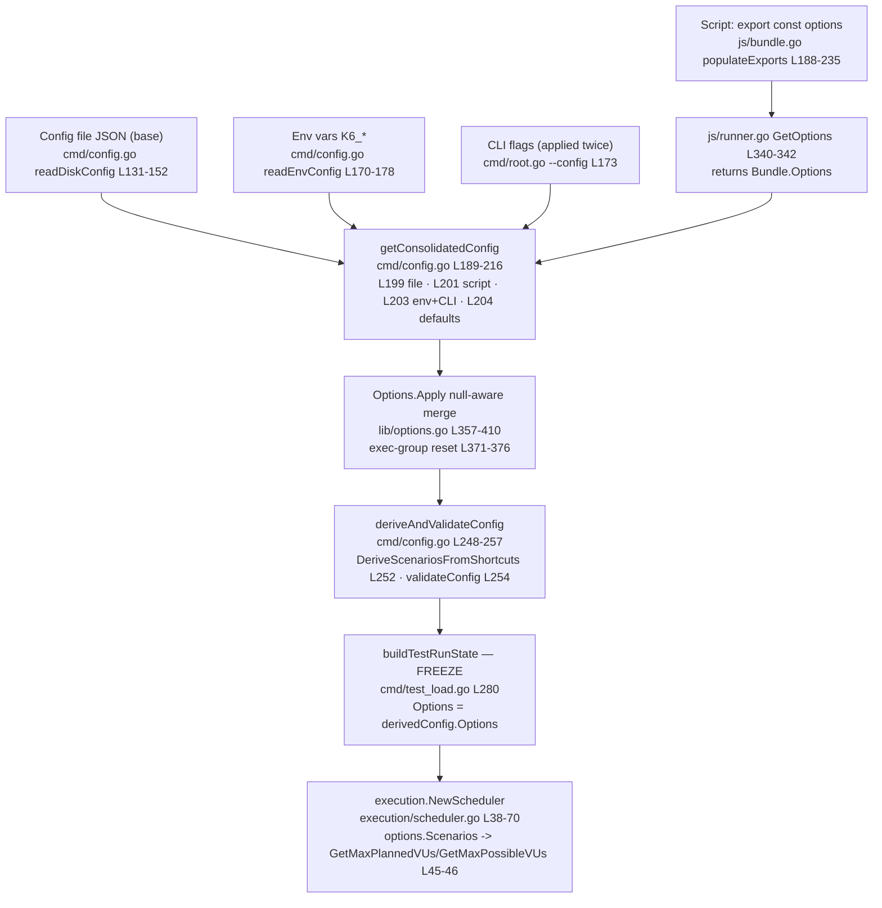

# How k6 Consolidates Test Options, When That Decision Is Frozen, and Which Source Wins

> **Onboarding question answered:** *"People mix `export const options` in the script with CLI flags and sometimes a config file. How does k6 actually consolidate those inputs into the effective options that the scheduler uses, and at what point is that decision considered final for the run? Can you show, with real runs, a couple of conflicting setups where the script says one thing and the CLI/config says another, and prove from the observed output which one takes effect — including how this behaves when multiple VUs are running?"*

|                       |                                                                                                   |
| :-------------------- | :------------------------------------------------------------------------------------------------ |
| **subject**           | Option consolidation, finalization ("freeze"), precedence, and multi-VU hand-off                  |
| **codebase**          | `module go.k6.io/k6` [go.mod:L1], commit `ddc3b0b1d2`                                              |
| **binary of record**  | `k6 v0.55.0 (commit/ddc3b0b1d2, go1.22.2, linux/amd64)` — built from source with vendored deps    |
| **method**            | Source reading (code is the source of truth) + real runs of the from-source binary + official docs |
| **answer (one line)** | `CLI flags > environment variables (K6_*) > script options > config file (JSON) > defaults`        |

## Environment of record and methodology

Everything in this document is grounded in two kinds of evidence, and every behavioral claim carries a `path:line` citation so it can be checked against the tree at commit `ddc3b0b1d2`:

1. **The code itself**, read directly from the repository. Per the governing rule for this investigation — *"do not make assumptions, base your answers on the code as the truth"* — no behavior is asserted that is not visibly implemented in a cited source line.
2. **Real runs** of a k6 binary compiled from this exact source with its vendored dependencies. The binary of record reports its build string as `k6 v0.55.0 (commit/ddc3b0b1d2, go1.22.2, linux/amd64)` — the verbatim `k6 version` output for the environment of record used throughout this document.

The experiments below were executed with that binary using throwaway scripts and config files created **outside** the repository tree and deleted afterward, so the working tree remains byte-for-byte unchanged. The observable in every experiment is the **k6 startup banner** — specifically the lines:

```
scenarios: (100.00%) 1 scenario, N max VUs, Ds max duration (incl. graceful stop):
         * default: N looping VUs for Ds (gracefulStop: 30s)
```

The banner is not a cosmetic summary; it is the executor's *own* self-description rendered from the **already-consolidated, already-frozen** options (see [§5](#5-r4--hand-off-to-the-scheduler--multiple-vu-behavior) and [§7](#7-r3--real-run-experiments)). Reading effective values off the banner is therefore a code-grounded way to observe the result of consolidation. `--quiet` is never passed, because it suppresses this banner.

---

## 1. TL;DR — the answer up front

**Precedence order (highest wins):**

```
CLI flags  >  environment variables (K6_*)  >  script `export const options`  >  config file (JSON)  >  hard-coded defaults
```

**The single most surprising fact:** the **script's exported options outrank the JSON config file.** The config file is only the *base/seed* layer; the script is applied *on top of it*. So if your `config.json` says `vus: 9` and your script says `vus: 2`, the run uses **2** — the script wins. This is counterintuitive because many tools treat an explicit `--config` file as authoritative, but in k6 the config file sits at the *second-lowest* priority, just above hard-coded defaults.

**When is the decision final?** The effective options become immutable at `buildTestRunState` — concretely the assignment `Options: lct.derivedConfig.Options` at **[cmd/test_load.go:L280]** — which runs *after* the layered merge, shortcut-to-scenario derivation, and validation, and *immediately before* the execution scheduler is constructed. From that `*lib.TestRunState` onward, the scheduler and executors read a fixed `Options` value.

**Why this order exists** comes down to two code facts, expanded in [§2](#2-r1--how-consolidation-works) and [§3](#3-the-precedence-order-explained):

1. The explicit **layer order** in `getConsolidatedConfig` [cmd/config.go:L189-L216], where the **CLI config is applied twice** — once as the seed and once last on top of everything.
2. The **null-aware, per-field merge** in `Options.Apply` [lib/options.go:L357-L410], where a field from a higher layer only overrides a lower layer when its nullable `.Valid` flag is set.

This ordering is corroborated three independent ways: by the code, by the real runs in [§7](#7-r3--real-run-experiments), and by the official Grafana k6 [How to use options](https://grafana.com/docs/k6/latest/using-k6/k6-options/how-to/) documentation, which lists the same order and explicitly notes the config file is the second-lowest precedence (the exact links and short quotations are collected in [§7.2](#72-official-documentation-corroboration)).

---

## 2. R1 — How consolidation works

Consolidation is a **layered, null-aware merge**: each input source contributes a partial `lib.Options` value, the layers are combined in a fixed order, and each individual option field overrides the layer beneath it *only* if that field was actually set. To understand it you need to see (a) where each layer's value comes from, (b) how the layers are stacked, and (c) the merge engine that decides, field by field, which layer wins.

### 2.1 Where the script layer comes from

The script's `export const options` object is not magic — it is extracted by the JS bundler and decoded into a Go `lib.Options` struct. In `js/bundle.go`, `populateExports` [js/bundle.go:L188-L235] walks the module's exports, and the `case consts.Options` branch [js/bundle.go:L200] handles the `options` export specifically. It JSON-marshals the exported JavaScript value with `json.Marshal(v.Export())` [js/bundle.go:L205], then decodes it into `b.Options` using a **strict** decoder created with `json.NewDecoder` [js/bundle.go:L210] and hardened by `DisallowUnknownFields()` [js/bundle.go:L211] before `dec.Decode(&b.Options)` [js/bundle.go:L212]. If strict decoding fails (for example, an unknown field), it falls back to a lenient `json.Unmarshal(data, &b.Options)` [js/bundle.go:L213] and logs a warning naming the offending field [js/bundle.go:L220].

Those parsed options are surfaced to the configuration layer through the runner: `GetOptions` simply returns the bundle's options — `return r.Bundle.Options` [js/runner.go:L340-L342]. This is the value that the consolidation code refers to as the *runner options* or *script options* layer.

> **Rationale.** The script layer is "just JSON decoded into `lib.Options`," which is why script options share the exact same type and the exact same nullable-field semantics as every other layer. There is nothing special about the script's representation once it reaches consolidation — it is one `lib.Options` value among several, and it participates in the same merge as the config file, env, and CLI layers.

### 2.2 How the layers are combined — the "CLI applied twice" technique

`getConsolidatedConfig` [cmd/config.go:L189-L216] is the orchestrator. It reads the config file via `readDiskConfig` [cmd/config.go:L131-L152] and the environment via `readEnvConfig` [cmd/config.go:L170-L178], then stacks the layers. A leading comment block explains the intent [cmd/config.go:L180-L188], and the layering itself is these four lines:

```go
// cmd/config.go — getConsolidatedConfig, the order of layering
conf = cliConf.Apply(fileConf)                  // L199: seed = CLI, overlaid by the config file
conf = conf.Apply(Config{Options: runnerOpts})  // L201: then the script (runner) options
conf = conf.Apply(envConf).Apply(cliConf)       // L203: then env (K6_*), then CLI AGAIN (wins)
conf = applyDefault(conf)                        // L204: finally, fill still-unset fields with defaults
```

The crux for anyone debugging precedence: **the CLI config appears twice.** It is the initial seed at [cmd/config.go:L199] *and* it is re-applied last at [cmd/config.go:L203]. Because the merge overlays later layers on top of earlier ones, applying the CLI last gives CLI flags the highest priority of any source. Meanwhile the **config file is applied at [cmd/config.go:L199] as the base**, and is then overwritten by the script options at [cmd/config.go:L201] — which is exactly the mechanical reason the **script outranks the config file**. The environment layer is applied at [cmd/config.go:L203] *before* the final CLI re-application, placing env above the script but below the CLI. Defaults are applied last, but only to fields that are still unset, via `applyDefault` [cmd/config.go:L222-L246].

> **Rationale.** Precedence in k6 is not encoded as priority numbers or a comparator; it is an *emergent property of the application order*. The last layer to write a given field wins, and the only reason CLI flags "win" is that they are literally the last thing applied (after being the first thing applied). Read the four lines above top-to-bottom and the entire precedence order falls out of them.

### 2.3 The null-aware merge engine

`Config.Apply` [cmd/config.go:L71-L92] is the per-layer merge entry point; it delegates the option-level merging to `Options.Apply` [lib/options.go:L357-L410]. The defining characteristic of that engine is that a field from the incoming (higher) layer overrides the existing (lower) layer **only when the higher layer actually supplies a value**. The presence test, however, depends on the field's type. **Many scalar fields are nullable/validity-tracked types** (from `gopkg.in/guregu/null.v3` and k6's own `types` package) carrying a `.Valid` flag — e.g. `VUs`, `Duration`, `Paused`, `RPS` — and these override only when `.Valid` is true. **Other fields are slices, maps, or pointers** — e.g. `Stages`, `Scenarios`, `Thresholds`, `BlacklistIPs`, `ExecutionSegment` — and these override only when non-`nil`. A **few custom presence-tracked types** — e.g. `BlockedHostnames`, `Hosts` — expose their own `.Valid` flag. In every case the rule is identical: the higher layer overrides only the fields it actually set. The `.Valid`-gated scalar case is by far the most common, and the VUs field is representative of it:

```go
// lib/options.go — Options.Apply (representative field)
if opts.VUs.Valid {
    o.VUs = opts.VUs
}
```

This conditional is at [lib/options.go:L361-L363]. The non-scalar fields follow the same principle with a different presence test — for example `if opts.Stages != nil` [lib/options.go:L385], `if opts.Scenarios != nil` [lib/options.go:L397], and `if opts.Thresholds != nil` [lib/options.go:L452] — while a custom presence-tracked type uses its own validity flag, e.g. `if opts.BlockedHostnames.Valid` [lib/options.go:L458]. Because an *unset* field has `.Valid == false` (or remains `nil`), a higher layer that does not mention a field is **transparent** — it does not clobber the value from a lower layer.

> **Rationale.** The null-aware merge is what makes "set on the CLI but not in the script" behave correctly. If `Apply` blindly copied every field, then layering an almost-empty CLI config on top would wipe out everything the script set. Instead, only the handful of fields the user actually specified on the CLI are `.Valid`, so only those override. This is the mechanism that lets the simple four-line layering in §2.2 produce a precise, field-by-field precedence rather than an all-or-nothing replacement.

### 2.4 The execution-settings group rule (why "stages got wiped")

There is one important exception to pure per-field merging. The four execution-shortcut fields — `duration`, `iterations`, `stages`, and `scenarios` — are **mutually exclusive**, so they are treated as a *group*: if a higher layer sets **any one** of them, all four are cleared from the lower layer *before* the higher layer is applied. The clearing is guarded by this conditional:

```go
// lib/options.go — the execution-settings group reset
// (a higher tier that touches ANY of these "will overwrite all of the
//  previous execution settings … from any 'lower' config tiers")
if opts.Duration.Valid || opts.Iterations.Valid || opts.Stages != nil || opts.Scenarios != nil { // L371
    o.Duration   = types.NewNullDuration(0, false) // L373 — CLEAR lower-tier value
    o.Iterations = null.NewInt(0, false)           // L374 — CLEAR
    o.Stages     = nil                             // L375 — CLEAR
    o.Scenarios  = nil                             // L376 — CLEAR
}
// …then each field the higher layer actually set is re-applied just below, e.g.:
if opts.Duration.Valid { o.Duration = opts.Duration } // L379-L381
```

The conditional is at [lib/options.go:L371]; the four fields are first **cleared** (reset to invalid/nil) at [lib/options.go:L373-L376], and then whichever of them the higher layer actually set is re-applied immediately afterward (the duration case is at [lib/options.go:L379-L381]). The clear-then-reapply pairing is the whole point: the lower tier's execution settings are wiped as a group *before* the higher tier writes its own.

> **Rationale.** This is the reason a CLI `--duration` can appear to "wipe" a script's `stages`. It is not a per-field override (which would leave the script's `stages` untouched because `--duration` does not set `stages`); it is a **whole-group reset**. The moment the CLI provides `duration`, the merge zeroes the script's `duration`/`iterations`/`stages`/`scenarios` together and then writes only the CLI's `duration`. The group must move atomically because these settings describe mutually exclusive execution shapes — you cannot meaningfully run "stages from the script *and* a flat duration from the CLI" at the same time.

---

## 3. The precedence order explained

With the mechanism established, the full order follows directly. Reading the layering in §2.2 from the bottom of priority to the top:

| Priority (low → high) | Layer | Where it is applied | Source citation |
| :-- | :-- | :-- | :-- |
| 1 (lowest) | Hard-coded **defaults** | filled into still-unset fields last | `applyDefault` [cmd/config.go:L204, L222-L246] |
| 2 | **Config file** (JSON) | the base/seed, overlaid first | `cliConf.Apply(fileConf)` [cmd/config.go:L199] |
| 3 | **Script** `export const options` | applied on top of the config file | `conf.Apply(Config{Options: runnerOpts})` [cmd/config.go:L201] |
| 4 | **Environment** variables (`K6_*`) | applied above the script | `conf.Apply(envConf)` [cmd/config.go:L203] |
| 5 (highest) | **CLI flags** | re-applied last, on top of everything | `.Apply(cliConf)` [cmd/config.go:L203] |

Two code facts produce this table, and it is worth stating them together because the whole behavior is emergent from their combination:

1. **The explicit layer order with CLI applied twice** [cmd/config.go:L199-L204]. The CLI is the seed (L199) and is re-applied last (L203); the config file is only the seed's first overlay (L199) and is then overwritten by the script (L201).
2. **The per-field `.Valid`-gated override** [lib/options.go:L357-L410]. Each field is overridden only where the higher layer actually set it, so unset higher layers are transparent.

The **counterintuitive consequence** to internalize: because the config file is consumed at L199 as the base and the script is layered over it at L201, **the script always beats the config file**. The config file in k6 is best understood as "defaults you can edit," not as "an authoritative override." This is proven empirically in experiment **E2** ([§7](#7-r3--real-run-experiments)) and corroborated by the official Grafana k6 [How to use options](https://grafana.com/docs/k6/latest/using-k6/k6-options/how-to/) documentation, which places the config file at the second-lowest precedence (just above hard-coded defaults) and states that options set anywhere else override the `--config` options.


---

## 4. R2 — When the decision is final (the "freeze" point)

The options are "live" and layered only for a brief window during `k6 run` startup. The sequence that ends that window is consolidate → derive → validate → **freeze**, and it lives in `cmd/test_load.go` and `cmd/config.go`:

1. **Consolidate + validate.** `consolidateDeriveAndValidateConfig` [cmd/test_load.go:L188-L236] drives the whole thing. It runs the layered merge by calling `getConsolidatedConfig(gs, cliConfig, lt.initRunner.GetOptions())` [cmd/test_load.go:L203] (note that the script layer enters here, via `GetOptions` from §2.1), then parses and validates thresholds [cmd/test_load.go:L213-L223], then derives the final config via `deriveAndValidateConfig` [cmd/test_load.go:L226].
2. **Derive shortcuts → scenarios, then validate.** `deriveAndValidateConfig` [cmd/config.go:L248-L257] converts the `--vus`/`--duration`/`--stage` shortcuts into a concrete executor scenario with `executor.DeriveScenariosFromShortcuts(...)` [cmd/config.go:L252] (detailed in §5), then runs `validateConfig` [cmd/config.go:L254].
3. **THE FREEZE.** `buildTestRunState` [cmd/test_load.go:L265-L284] pins the run's options to the *derived* config:

```go
// cmd/test_load.go:L280 — the freeze
Options: lct.derivedConfig.Options, // we will always run with the derived options
```

That assignment at **[cmd/test_load.go:L280]** is the moment the effective options become immutable for the run. Note that `SetOptions(configToReinject)` is also called a few lines earlier at [cmd/test_load.go:L269] to re-inject the options back into the runner, but the *authoritative* value that the run executes with is the derived `TestRunState.Options` set at L280 — that struct is what the scheduler reads.

> **Rationale.** "When is it final?" has a crisp, single-line answer: **at `buildTestRunState`, [cmd/test_load.go:L280]**, after consolidation + shortcut-derivation + validation and immediately before `execution.NewScheduler`. Before that line, options are still a mutable stack of layers being merged, derived, and validated. After that line, the run carries one fixed `*lib.TestRunState` whose `Options` field never changes; the scheduler and executors only ever read it. The freeze is deliberately placed *after* derivation and validation so that what gets frozen is the fully-resolved, already-checked option set, not a half-merged intermediate.

---

## 5. R4 — Hand-off to the scheduler & multiple-VU behavior

### 5.1 Wiring the frozen options into the scheduler

Once `buildTestRunState` has frozen the options, `cmd/run.go` hands the resulting state to the scheduler:

```go
// cmd/run.go
conf := test.derivedConfig                                     // L127
testRunState, err := test.buildTestRunState(conf.Options)      // L128 (freeze happens inside)
// …
execScheduler, err := execution.NewScheduler(testRunState, controller) // L135
```

The derived config is taken at [cmd/run.go:L127], `buildTestRunState` (which performs the L280 freeze) is called at [cmd/run.go:L128], and the scheduler is constructed at [cmd/run.go:L135]. (The metrics engine is initialized shortly afterward via `engine.NewMetricsEngine(...)` at [cmd/run.go:L170].)

`NewScheduler` [execution/scheduler.go:L38-L70] reads the frozen options — `options := trs.Options` [execution/scheduler.go:L39] — and plans VUs from the **scenarios**, not from raw flags:

```go
// execution/scheduler.go
options := trs.Options                                                // L39
executionPlan := options.Scenarios.GetFullExecutionRequirements(et)   // L44
maxPlannedVUs := lib.GetMaxPlannedVUs(executionPlan)                  // L45
maxPossibleVUs := lib.GetMaxPossibleVUs(executionPlan)               // L46
```

`GetFullExecutionRequirements` is called at [execution/scheduler.go:L44], and the planned/possible VU counts are computed at [execution/scheduler.go:L45-L46]. So the **derived `options.Scenarios`** — not the flags you typed — determine how many VUs are planned and scheduled.

### 5.2 Why settings "win from a different place than expected": shortcut → scenario derivation

This is the key to the user's "VUs/duration/scenario settings seem to win from a different place" confusion. The `--vus`, `--duration`, and `--stage` shortcuts are **not executors by themselves**. They are convenience inputs that, *after* consolidation, are converted into a concrete scenario by `DeriveScenariosFromShortcuts` [lib/executor/execution_config_shortcuts.go:L52]:

- `iterations` ⇒ a **shared-iterations** scenario [lib/executor/execution_config_shortcuts.go:L67]
- `duration` ⇒ a **constant-vus** scenario, built by `getConstantVUsScenario` [lib/executor/execution_config_shortcuts.go:L86]
- `stages` ⇒ a **ramping-vus** scenario [lib/executor/execution_config_shortcuts.go:L94]
- an explicit `scenarios` object ⇒ left **unchanged** [lib/executor/execution_config_shortcuts.go:L96]

So `--vus 7 --duration 3s` does not stay as "two flags"; it becomes a single `constant-vus` scenario named `default`, and *that derived scenario* is what the scheduler plans from (§5.1) and what the banner reflects.

> **Rationale.** The consolidation merge resolves *values*; the derivation step resolves *shape*. A user who sets `--vus` expecting "a VUs knob" is really, after derivation, configuring a `constant-vus` executor scenario. That is why the effective VU count "comes from" the scenarios layer even though the user only ever typed `--vus` — and why an explicit `scenarios` object in the script interacts with `--vus`/`--duration` through the execution-settings group rule of §2.4 rather than as an independent field.

### 5.3 The banner is the executor's own description (the observable)

The startup banner used as evidence throughout §7 is generated by the derived executor itself. The `* default: N looping VUs for Ds (gracefulStop: 30s)` line is the constant-vus executor's description, produced by `fmt.Sprintf("%d looping VUs for %s%s", ...)` [lib/executor/constant_vus.go:L60]. The surrounding `scenarios: (100.00%) 1 scenario, M max VUs, Ds max duration …` summary line is printed by the UI at [cmd/ui.go:L150].

> **Rationale.** This closes the loop on *why reading the banner is valid evidence*: the banner is not a re-statement of the flags you typed, it is the post-freeze executor describing itself from the frozen `Options`. If the banner says `7 looping VUs for 2s`, that is the scheduler's actual plan derived from the consolidated options — making the banner a faithful, code-grounded readout of the effective configuration.


---

## 6. Config-file mechanism & the `-e` vs `K6_*` nuance

### 6.1 Where the config file lives and how it is selected

k6 has a *default* config file path and an *explicit* override:

- The default file name is `defaultConfigFileName = "config.json"` [cmd/state/state.go:L20].
- It is located under the OS user-config directory, resolved with `os.UserConfigDir()` [cmd/state/state.go:L96] and joined as `filepath.Join(homeDir, "loadimpact", "k6", defaultConfigFileName)` [cmd/state/state.go:L152].
- The whole path can be overridden by the `K6_CONFIG` environment variable [cmd/state/state.go:L163-L164].
- The `--config`/`-c` flag is registered at [cmd/root.go:L173]: `flags.StringVarP(&gs.Flags.ConfigFilePath, "config", "c", gs.Flags.ConfigFilePath, "JSON config file")`.

### 6.2 Missing-file tolerance

`readDiskConfig` [cmd/config.go:L131-L152] reads the selected config file, but it deliberately **silences a "file not found" error only when the path is the default** — i.e. when the user did *not* pass `--config`. The guard is:

```go
// cmd/config.go (inside readDiskConfig) — tolerate a missing DEFAULT config only
if errors.Is(err, fs.ErrNotExist) && gs.Flags.ConfigFilePath == gs.DefaultFlags.ConfigFilePath {
    // default config file simply doesn't exist → not an error
}
```

The key condition is at [cmd/config.go:L134].

> **Rationale & implication.** A default config that does not exist is harmless — most users never create `~/.config/loadimpact/k6/config.json`, and k6 must run anyway. But the instant you pass an explicit `--config missing.json`, the path no longer equals the default, the guard no longer applies, and k6 **errors out** because you asked for a file that isn't there. The asymmetry is intentional: silence the absence of the implicit default; surface the absence of an explicitly-requested file.

### 6.3 The `-e`/`--env` vs `K6_*` gotcha

This is one of the most common real-world k6 confusions, and the two behaviors are genuinely different:

- A real **`K6_*` environment variable** *configures an option*. `readEnvConfig` [cmd/config.go:L170-L178] parses `K6_*` variables into the env config layer, which is applied at [cmd/config.go:L203] (above the script, below the final CLI re-apply). So `K6_VUS=5 k6 run script.js` sets the VUs option.
- The **`-e`/`--env` flag** does *not* configure any option. It only injects a key/value into the script-visible `__ENV` object. So `-e VUS=5` makes `__ENV.VUS === "5"` available to the script, but it changes no option unless the script itself reads `__ENV.VUS` and acts on it.

This is proven side-by-side in experiments **E5a** (`-e VUS=5` → no change) and **E5b** (`K6_VUS=5` → option set) in [§7](#7-r3--real-run-experiments). The official Grafana k6 [Environment variables](https://grafana.com/docs/k6/latest/using-k6/environment-variables/) documentation states the same distinction explicitly: the `-e` flag does not configure options — it just provides variables to the script — whereas `K6_ITERATIONS=120 k6 run …` does set iterations.

> **Rationale.** `-e` is a *script input* mechanism (it feeds `__ENV`), while `K6_*` is an *option configuration* mechanism (it feeds `readEnvConfig` and therefore the consolidation merge). They look similar because people often write `-e K6_VUS=…`, but the `K6_` prefix is meaningless to `-e`: it lands in `__ENV` as an ordinary variable and never reaches the option merge. Only a true process environment variable named `K6_VUS` is parsed by `readEnvConfig`.

---

## 7. R3 — Real-run experiments

All experiments below were executed with the from-source binary `/tmp/k6bin/k6` (`k6 v0.55.0 (commit/ddc3b0b1d2, go1.22.2, linux/amd64)`) against a base script created **outside** the repository tree:

```js
// script.js (created under /tmp, deleted afterward)
export const options = { vus: 2, duration: '5s' };
export default function () { }
```

The script declares **2 VUs for 5s**. Each experiment introduces a conflicting value from another source and reads the winner off the startup banner (no `--quiet`). The config-file experiment additionally uses:

```json
// cfg.json (created under /tmp, deleted afterward)
{"vus":9,"duration":"9s"}
```

### E1 — script vs CLI

```
$ /tmp/k6bin/k6 run --vus 7 --duration 2s script.js

     scenarios: (100.00%) 1 scenario, 7 max VUs, 32s max duration (incl. graceful stop):
              * default: 7 looping VUs for 2s (gracefulStop: 30s)
```

**Winner: CLI** — `7 looping VUs for 2s` overrides the script's `2 VUs / 5s`. **Why:** the CLI config is re-applied last at [cmd/config.go:L203], on top of the script layer applied at [cmd/config.go:L201].

### E2 — script vs config file (the counterintuitive one)

```
$ /tmp/k6bin/k6 run --config cfg.json script.js

     scenarios: (100.00%) 1 scenario, 2 max VUs, 35s max duration (incl. graceful stop):
              * default: 2 looping VUs for 5s (gracefulStop: 30s)
```

**Winner: the SCRIPT** — the effective `2 VUs / 5s` are the *script's* values, **not** the config file's `9 / 9s`. **Why:** the config file is consumed as the base at [cmd/config.go:L199], then the script options are layered on top at [cmd/config.go:L201]. This is the headline surprise: an explicit `--config` does **not** outrank the script.

### E3 — env vs script

```
$ K6_VUS=4 K6_DURATION=2s /tmp/k6bin/k6 run script.js

     scenarios: (100.00%) 1 scenario, 4 max VUs, 32s max duration (incl. graceful stop):
              * default: 4 looping VUs for 2s (gracefulStop: 30s)
```

**Winner: env (`K6_*`)** — `4 VUs / 2s` overrides the script's `2 / 5s`. **Why:** `readEnvConfig` [cmd/config.go:L170-L178] parses `K6_*` into the env layer, applied at [cmd/config.go:L203] *after* (above) the script layer but *before* the final CLI re-apply.

### E4 — multiple VUs actually running concurrently

```
$ /tmp/k6bin/k6 run --vus 7 --duration 3s script.js

     scenarios: (100.00%) 1 scenario, 7 max VUs, 33s max duration (incl. graceful stop):
              * default: 7 looping VUs for 3s (gracefulStop: 30s)
running (01.0s), 7/7 VUs, ... complete and 0 interrupted iterations
running (02.0s), 7/7 VUs, ... complete and 0 interrupted iterations
running (03.0s), 1/7 VUs, ... complete and 0 interrupted iterations
running (03.0s), 0/7 VUs, ... complete and 0 interrupted iterations
```

**Result: 7 VUs run concurrently.** The per-second `7/7 VUs` progress lines are the proof of real concurrency; the trailing `1/7` → `0/7` lines are VUs winding down during graceful teardown. (The "complete iterations" counts are machine- and run-specific — the empty default function loops as fast as possible, producing on the order of hundreds of thousands of iterations — so they are shown here as `...`; the invariant to read is the `7/7 VUs` concurrency, not the iteration count.) **Why:** the derived `constant-vus` scenario (from `--vus`/`--duration` via `DeriveScenariosFromShortcuts` [lib/executor/execution_config_shortcuts.go:L52]) drives `GetMaxPlannedVUs`/`GetMaxPossibleVUs` at [execution/scheduler.go:L45-L46], so the frozen scenario — not the raw flags — determines the concurrent VU count.

### E5a — the `-e`/`--env` nuance (no option change)

```
$ /tmp/k6bin/k6 run -e VUS=5 script.js

     scenarios: (100.00%) 1 scenario, 2 max VUs, 35s max duration (incl. graceful stop):
              * default: 2 looping VUs for 5s (gracefulStop: 30s)
```

**Result: no change** — still the script's `2 VUs / 5s`. **Why:** `-e` only populates the script's `__ENV`; it does not feed `readEnvConfig` and therefore never reaches the option merge (§6.3).

### E5b — a real `K6_*` env var (option is set)

```
$ K6_VUS=5 /tmp/k6bin/k6 run script.js

     scenarios: (100.00%) 1 scenario, 5 max VUs, 35s max duration (incl. graceful stop):
              * default: 5 looping VUs for 5s (gracefulStop: 30s)
```

**Result: the env var sets the option** — `5 VUs`, while duration stays the script's `5s` (only `VUS` was set, so by the null-aware merge of §2.3 the unset `K6_DURATION` is transparent and the script's duration survives). Contrast E5a against E5b directly: identical-looking intent, completely different outcome — this is the classic k6 gotcha.

### Summary table

| ID  | Conflict              | Command (abbrev.)              | Observed banner            | Winner / outcome         |
| :-- | :-------------------- | :----------------------------- | :------------------------- | :----------------------- |
| E1  | script vs CLI         | `--vus 7 --duration 2s`        | `7 looping VUs for 2s`     | **CLI**                  |
| E2  | script vs config file | `--config cfg.json` (9/9s)     | `2 looping VUs for 5s`     | **script** (beats file)  |
| E3  | env vs script         | `K6_VUS=4 K6_DURATION=2s`      | `4 looping VUs for 2s`     | **env**                  |
| E4  | multi-VU              | `--vus 7 --duration 3s`        | `7/7 VUs` per second       | **7 concurrent VUs**     |
| E5a | `-e` nuance           | `-e VUS=5`                     | `2 looping VUs for 5s`     | **no change** (`__ENV`)  |
| E5b | `K6_*` nuance         | `K6_VUS=5`                     | `5 looping VUs for 5s`     | **env sets option**      |

The experiments line up perfectly with the layering in §2.2: E1 (CLI last → wins), E2 (config file is the base, script over it → script wins), E3 (env above script), E5a vs E5b (`-e` ≠ `K6_*`), and E4 (frozen scenario drives concurrency).

### 7.1 In-repo test corroboration

The same precedence is exercised by the repository's own table-driven test, `TestConfigConsolidation` [cmd/config_consolidation_test.go:L577], over the case list built in `getConfigConsolidationTestCases` [cmd/config_consolidation_test.go:L146]. Two cases mirror the live runs directly:

- **Env shortcuts derive a constant-vus scenario:** `K6_VUS=10 K6_DURATION=20s` ⇒ `verifyConstLoopingVUs(10, 20s)` [cmd/config_consolidation_test.go:L207] — the env layer both sets the option and drives the same shortcut→scenario derivation seen in E3/E4.
- **A four-layer case proving CLI > env > script > file:** a config-file `stages: 11s:11` + script (`runner`) `VUs: 22` + `K6_VUS=33` + CLI `--stage 44s:44 -s 55s:55` resolves to ramping VUs with `VUs = 33` and the **CLI** stages [cmd/config_consolidation_test.go:L274-L282] — i.e. the CLI stages beat the config-file stages, and env `K6_VUS=33` beats the script's `22`.

The in-repo `TestConfigConsolidation` table test asserts the same precedence behavior; it is cited here as **source-code corroboration** and was **not** rerun for this final evidence (the live-binary runs above are the primary real-run proof). The relevant assertions are the env-shortcut case [cmd/config_consolidation_test.go:L207] and the four-layer case [cmd/config_consolidation_test.go:L274-L282], both within `getConfigConsolidationTestCases` [cmd/config_consolidation_test.go:L146] and driven by `TestConfigConsolidation` [cmd/config_consolidation_test.go:L577]. Reading the assertion helpers directly (`verifyConstLoopingVUs`, `verifyRampingVUs`) confirms, from the codebase's own checks, the same outcomes the live runs produced.

### 7.2 Official-documentation corroboration

The official Grafana k6 documentation independently corroborates both the precedence order and the `-e`/`K6_*` distinction. The concrete sources are:

- **Order of precedence** — [How to use options](https://grafana.com/docs/k6/latest/using-k6/k6-options/how-to/) (`https://grafana.com/docs/k6/latest/using-k6/k6-options/how-to/`). It lists, from lowest to highest: the option's default value, then the config file (`--config`), then the script, then the environment variable, and finally the CLI flag. It states the config-file options take `"the second lowest order of precedence (after defaults)"`, that options set anywhere else override the `--config` options, and that command-line flags hold the highest precedence — matching **E1** and **E2** exactly.
- **`-e`/`--env` vs real `K6_*`** — [Environment variables](https://grafana.com/docs/k6/latest/using-k6/environment-variables/) (`https://grafana.com/docs/k6/latest/using-k6/environment-variables/`). It explains that the `--env` flag only passes variables to the script, with the canonical example that `-e K6_ITERATIONS=120` does *not* configure iterations whereas `K6_ITERATIONS=120 k6 run script.js` *does* — matching **E5a vs E5b**.
- **General multi-source rule** — [Options reference](https://grafana.com/docs/k6/latest/using-k6/k6-options/reference/) (`https://grafana.com/docs/k6/latest/using-k6/k6-options/reference/`). It confirms that most options can be set in several places and that k6 then uses the value from the highest order of precedence.

All three sources — the code, the real runs, and the official docs — agree.


---

## 8. Direct answers to the two questions

**Q1. "How does k6 actually consolidate those inputs into the effective options that the scheduler uses, and at what point is that decision considered final for the run?"**

k6 consolidates inputs with a **layered, null-aware merge**. `getConsolidatedConfig` [cmd/config.go:L189-L216] stacks the layers in a fixed order — config file as the base, then script options, then `K6_*` env, with the **CLI applied twice** (seed first at [cmd/config.go:L199], re-applied last at [cmd/config.go:L203]) — and `Options.Apply` [lib/options.go:L357-L410] merges field by field, overriding a lower layer only where a higher layer's nullable field is `.Valid` (the four mutually-exclusive execution fields move as a group, [lib/options.go:L371-L376]). The net precedence is **CLI > env (`K6_*`) > script > config file > defaults**, with the notable result that the **script beats the config file**. The decision becomes **final at `buildTestRunState`** — the assignment `Options: lct.derivedConfig.Options` at **[cmd/test_load.go:L280]** — which happens after the merge, after `--vus`/`--duration`/`--stage` are derived into a concrete scenario (`DeriveScenariosFromShortcuts` [lib/executor/execution_config_shortcuts.go:L52], invoked via `deriveAndValidateConfig` [cmd/config.go:L248-L257]), and after validation, and **immediately before** `execution.NewScheduler` [cmd/run.go:L135]. From that frozen `*lib.TestRunState`, the scheduler reads `options := trs.Options` [execution/scheduler.go:L39] and never re-consolidates.

**Q2. "Can you show, with real runs, a couple of conflicting setups where the script says one thing and the CLI/config says another, and prove from the observed output which one takes effect — including how this behaves when multiple VUs are running?"**

Yes — six real runs of the from-source binary, each read off the startup banner (§7):

- **E1 — CLI beats script:** script `{vus:2,duration:'5s'}` + `--vus 7 --duration 2s` → banner `7 looping VUs for 2s`.
- **E2 — script beats config file:** script `{vus:2,duration:'5s'}` + `--config cfg.json` holding `{vus:9,duration:'9s'}` → banner `2 looping VUs for 5s` (the script, not the file).
- **E3 — env beats script:** `K6_VUS=4 K6_DURATION=2s` + script `{vus:2,duration:'5s'}` → banner `4 looping VUs for 2s`.
- **E4 — multiple VUs:** `--vus 7 --duration 3s` → banner `7 looping VUs for 3s` and per-second `7/7 VUs` progress lines, proving seven VUs execute concurrently (the derived `constant-vus` scenario drives `GetMaxPlannedVUs`/`GetMaxPossibleVUs` [execution/scheduler.go:L45-L46]).
- **E5a vs E5b — the `-e`/`K6_*` gotcha:** `-e VUS=5` changes nothing (`2 looping VUs for 5s`, because `-e` only feeds `__ENV`), whereas `K6_VUS=5` sets the option (`5 looping VUs for 5s`).

The same behavior is asserted by the in-repo `TestConfigConsolidation` [cmd/config_consolidation_test.go:L577] (cited as source-code corroboration, not rerun for this evidence) and matches the official Grafana k6 documentation (the precise links are in [§7.2](#72-official-documentation-corroboration)).

---

## 9. Appendix

### 9.1 End-to-end consolidation pipeline



### 9.2 Citation index

| Topic | Citation |
| :-- | :-- |
| Module identity | `go.mod:L1` |
| Script options extracted (strict JSON decode + lenient fallback) | `js/bundle.go:L188-L235` (L200, L205, L210, L211, L212, L213, L220) |
| Script options surfaced to config | `js/runner.go:L340-L342` |
| Consolidation orchestrator (layer order, CLI applied twice) | `cmd/config.go:L189-L216` (L199, L201, L203, L204) |
| Per-layer merge entry point | `cmd/config.go:L71-L92` (`Config.Apply`) |
| Config file read + missing-default tolerance | `cmd/config.go:L131-L152` (guard L134) |
| Env (`K6_*`) parsing | `cmd/config.go:L170-L178` |
| Defaults filled last | `cmd/config.go:L222-L246` |
| Derive shortcuts + validate | `cmd/config.go:L248-L257` (L252, L254) |
| Null-aware / presence-aware field merge | `lib/options.go:L357-L410` (`.Valid` scalar example L361-L363; `nil` checks e.g. Stages L385, Scenarios L397, Thresholds L452; custom `.Valid` e.g. BlockedHostnames L458) |
| Execution-settings group reset | `lib/options.go:L371` (resets L373-L376) |
| Consolidate → derive → validate sequence | `cmd/test_load.go:L188-L236` (L203, L213-L223, L226) |
| **Freeze point** | `cmd/test_load.go:L280` (re-inject `SetOptions` L269) |
| Frozen options → scheduler hand-off | `cmd/run.go:L127`, `L128`, `L135` (metrics init L170) |
| Scheduler reads frozen options, plans VUs | `execution/scheduler.go:L38-L70` (L39, L44, L45, L46) |
| Shortcut → scenario derivation | `lib/executor/execution_config_shortcuts.go:L52` (iterations L67, duration L86, stages L94, scenarios L96) |
| Banner: constant-vus self-description | `lib/executor/constant_vus.go:L60` |
| Banner: scenarios summary line | `cmd/ui.go:L150` |
| `--config`/`-c` flag registration | `cmd/root.go:L173` |
| Default config path + `K6_CONFIG` override | `cmd/state/state.go:L20`, `L96`, `L152`, `L163-L164` |
| In-repo precedence test | `cmd/config_consolidation_test.go:L577` (cases L146; env-shortcut L207; four-layer CLI>env>script>file L274-L282) |

### 9.3 Reproducing the experiments

The binary used here was built from source with vendored dependencies, outside the repository tree:

```sh
CGO_ENABLED=0 go build -mod=vendor -trimpath -o /tmp/k6bin/k6 .
/tmp/k6bin/k6 version   # k6 v0.55.0 (commit/ddc3b0b1d2, go1.22.2, linux/amd64)
```

Each experiment in §7 uses a temporary `script.js` (and, for E2, `cfg.json`) created under `/tmp` and removed afterward, so the repository working tree is unaffected. The observable in every case is the startup banner; do **not** pass `--quiet`, which suppresses it.

