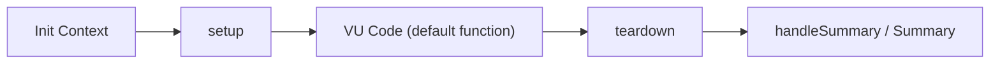
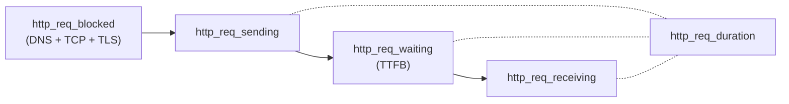

# Grafana k6 Load-Testing Tool — Technical Q&A Reference

| Field | Value |
|-------|-------|
| **k6 version** | v0.55.0 (`Source: lib/consts/consts.go`) |
| **Go version** | go1.21 / toolchain go1.21.13 (`Source: go.mod`) |
| **Source branch** | `k6_ddc3b0b1d23c` |
| **Generated from** | Source code analysis of the [grafana/k6](https://github.com/grafana/k6) repository |

## Introduction

This document answers seven specific questions about how the Grafana k6 load-testing tool works — from writing your first script through interpreting the console output, understanding the metrics system, using CLI flags, configuring the tool, understanding file generation behavior, and knowing how k6 validates your scripts before execution.

**Every answer in this document is grounded in the k6 source code.** Where a claim is made, the specific source file is cited so you can verify it yourself. No assumptions are made — the code is treated as the single source of truth.

**Target audience:** Developers who are new to k6 and want to understand its fundamental behavior before writing tests.

---

## Table of Contents

- [Q1: Basic Workflow — Writing and Running a k6 Script](#q1-basic-workflow--writing-and-running-a-k6-script)
- [Q2: Understanding the Console Output](#q2-understanding-the-console-output)
- [Q3: Metrics, Units, and Protocols](#q3-metrics-units-and-protocols)
- [Q4: CLI Command Reference](#q4-cli-command-reference)
- [Q5: Configuration and Environment Variables](#q5-configuration-and-environment-variables)
- [Q6: External File Generation](#q6-external-file-generation)
- [Q7: Script Validation Logic](#q7-script-validation-logic)
- [Source Code References](#source-code-references)

---

## Q1: Basic Workflow — Writing and Running a k6 Script

**Direct answer:** k6 scripts are JavaScript files that export a `default` function. You run them with `k6 run script.js`. The `default` function is the VU (virtual user) code that k6 executes repeatedly, either for a set number of iterations or for a specified duration.

### Script Structure

The canonical k6 script structure contains three key parts. This structure is defined in the built-in template that `k6 new` generates. (`Source: cmd/new.go`, lines 18–77, the `defaultNewScriptTemplate` variable)

```js
// 1. Import statement — load k6 modules
import http from 'k6/http';
import { sleep } from 'k6';

// 2. Options export — configure test behavior
export const options = {
  // A number specifying the number of VUs to run concurrently.
  vus: 10,
  // A string specifying the total duration of the test run.
  duration: '30s',
};

// 3. Default function — the VU code that runs repeatedly
export default function() {
  http.get('https://test.k6.io');
  sleep(1);
}
```

**Rationale — why this structure:**

- **Top-level scope (init context):** Code outside the `default` function runs once per VU during initialization. This is where you import modules and define options. It is NOT executed on every iteration.
- **`export const options`:** This object configures the test — number of VUs, duration, thresholds, stages, and more. k6 reads this before starting VU execution.
- **`export default function()`:** This is the VU code. k6 calls this function repeatedly for each virtual user. Every iteration is one complete execution of this function.

### Minimal Script

The simplest possible k6 script that tests a single HTTP endpoint is just two meaningful lines of code:

```js
import http from 'k6/http';

export default function () {
  http.get('https://test-api.k6.io/');
};
```

`Source: examples/http_get.js` — this is the actual content of the example file in the repository.

### Execution Command

The basic command to run a k6 test is: (`Source: cmd/run.go`, lines 462–506, `getCmdRun()` function)

```bash
k6 run script.js
```

The Cobra command is registered with `Use: "run"` and `Short: "Start a test"`. (`Source: cmd/run.go`, lines 490–496)

**Example invocations** from the built-in help text (`Source: cmd/run.go`, lines 471–488):

```bash
# Run a single VU, once.
k6 run script.js

# Run a single VU, 10 times.
k6 run -i 10 script.js

# Run 5 VUs, splitting 10 iterations between them.
k6 run -u 5 -i 10 script.js

# Run 5 VUs for 10s.
k6 run -u 5 -d 10s script.js

# Ramp VUs from 0 to 100 over 10s, stay there for 60s, then 10s down to 0.
k6 run -u 0 -s 10s:100 -s 60s:100 -s 10s:0

# Send metrics to an influxdb server
k6 run -o influxdb=http://1.2.3.4:8086/k6
```

### k6 Test Lifecycle

k6 executes a test in distinct phases. Understanding this lifecycle clarifies why the script is structured the way it is:



| Phase | What happens | Code location |
|-------|-------------|---------------|
| **Init Context** | Top-level code runs once per VU: imports, options, global variables | Top of your script file |
| **setup()** | Optional `export function setup()` runs once before VU execution begins | Your script (if defined) |
| **VU Code** | `export default function()` runs repeatedly per VU — this is where you make HTTP requests | Your script |
| **teardown()** | Optional `export function teardown()` runs once after all VU execution completes | Your script (if defined) |
| **Summary** | k6 generates and prints the end-of-test summary; `handleSummary()` can customize this | `js/summary.js`, `cmd/run.go` |

`Source: cmd/run.go`, lines 59–435 — the `run()` method orchestrates this lifecycle: it loads the test (line 103), initializes VUs (line 367), runs the scheduler (line 397), and handles the summary.

---

## Q2: Understanding the Console Output

**Direct answer:** When you run `k6 run script.js`, k6 prints a banner with the version, execution metadata (output backends, script path, scenarios), optional check results, a metrics table with aligned statistics, and a progress indicator. The summary is rendered by the JavaScript text-summary renderer in `js/summary.js`.

### Output Structure Walkthrough

The console output has the following sections, in order:

#### 1. Banner

k6 prints its logo and version at the start of every run. This is triggered by `printBanner(c.gs)` at `cmd/run.go`, line 68.

#### 2. Execution Metadata

After the banner, k6 displays:
- **Output**: Which output backends are active (default: none, just the end-of-test summary)
- **Script**: The path to the script being executed
- **Scenarios**: The active scenario(s) with their executor type, VU count, and duration/iterations

#### 3. Checks Section (when applicable)

If your script uses `check()`, the summary shows each check name with pass/fail counts. The formatting uses: (`Source: js/summary.js`, lines 20–23)
- `✓` (`succMark`) for successful checks
- `✗` (`failMark`) for failed checks
- `█` (`groupPrefix`) for group headers
- `↳` (`detailsPrefix`) for nested details

#### 4. Metrics Table

The metrics table is the core of the summary output. It is rendered by `generateTextSummary()` in `js/summary.js`. Each metric is displayed with statistics appropriate to its type:

| Metric Type | Statistics Shown | Source |
|-------------|-----------------|--------|
| **Counter** | `count` and `rate` (per second) | `metrics/sink.go`, lines 64–69: `CounterSink.Format()` |
| **Gauge** | `value` (latest value) | `metrics/sink.go`, lines 94–96: `GaugeSink.Format()` |
| **Trend** | `avg`, `min`, `med`, `max`, `p(90)`, `p(95)` | `metrics/sink.go`, lines 188–198: `TrendSink.Format()` |
| **Rate** | `rate` (percentage of non-zero values) | `metrics/sink.go`, lines 218–224: `RateSink.Format()` |

#### 5. Progress Indicator

During execution, k6 shows a progress bar with VU count, iteration count, and elapsed/remaining time.

### Annotated Example Output

Below is a representative example of what the console output looks like when running a script against `https://test.k6.io` with a single VU for one iteration. All standard HTTP metrics are shown:

```text
          /\      |‾‾| /‾‾/   /‾‾/
     /\  /  \     |  |/  /   /  /
    /  \/    \    |     (   /   ‾‾\
   /          \   |  |\  \ |  (‾)  |
  / __________ \  |__| \__\ \_____/ .io

     execution: local
        script: script.js
        output: -

     scenarios: (100.00%) 1 scenario, 1 max VUs, 10m30s max duration (incl. graceful stop):
              * default: 1 iterations for each of 1 VUs (maxDuration: 10m0s, gracefulStop: 30s)


     data_received..................: 17 kB  12 kB/s
     data_sent......................: 438 B   305 B/s
     http_req_blocked...............: avg=265.53ms min=265.53ms med=265.53ms max=265.53ms p(90)=265.53ms p(95)=265.53ms
     http_req_connecting............: avg=121.85ms min=121.85ms med=121.85ms max=121.85ms p(90)=121.85ms p(95)=121.85ms
     http_req_duration..............: avg=122.39ms min=122.39ms med=122.39ms max=122.39ms p(90)=122.39ms p(95)=122.39ms
       { expected_response:true }...: avg=122.39ms min=122.39ms med=122.39ms max=122.39ms p(90)=122.39ms p(95)=122.39ms
     http_req_failed................: 0.00%  ✓ 0        ✗ 1
     http_req_receiving.............: avg=0.26ms   min=0.26ms   med=0.26ms   max=0.26ms   p(90)=0.26ms   p(95)=0.26ms
     http_req_sending...............: avg=0.08ms   min=0.08ms   med=0.08ms   max=0.08ms   p(90)=0.08ms   p(95)=0.08ms
     http_req_tls_handshaking.......: avg=139.7ms  min=139.7ms  med=139.7ms  max=139.7ms  p(90)=139.7ms  p(95)=139.7ms
     http_req_waiting...............: avg=122.04ms min=122.04ms med=122.04ms max=122.04ms p(90)=122.04ms p(95)=122.04ms
     http_reqs......................: 1       0.697813/s
     iteration_duration.............: avg=1.43s    min=1.43s    med=1.43s    max=1.43s    p(90)=1.43s    p(95)=1.43s
     iterations.....................: 1       0.697813/s
     vus............................: 1       min=1        max=1
     vus_max........................: 1       min=1        max=1


running (00m01.4s), 0/1 VUs, 1 complete and 0 interrupted iterations
default ✓ [======================================] 1 VUs  00m01.4s/10m0s  1/1 iters, 1 per VU
```

**Reading the output:**
- **Counter metrics** (like `http_reqs`, `iterations`, `data_received`): show total count and rate per second
- **Trend metrics** (like `http_req_duration`, `http_req_blocked`): show avg, min, med, max, p(90), p(95) — all in milliseconds by default
- **Rate metrics** (like `http_req_failed`): show the percentage and the pass/fail counts
- **Gauge metrics** (like `vus`, `vus_max`): show the current value along with min and max observed

---

## Q3: Metrics, Units, and Protocols

**Direct answer:** k6 has four metric types (Counter, Gauge, Trend, Rate), 25+ built-in metrics, reports time values in milliseconds, data values in bytes, and detects HTTP protocol version and TLS version via system tags.

### Metric Types Taxonomy

k6 defines four metric types. Each type determines how data points are accumulated and what summary statistics are presented. (`Source: metrics/metric_type.go`, lines 9–14)

| Type | Description | Summary Statistics |
|------|-------------|-------------------|
| **Counter** | A counter that sums its data points | `count`, `rate` (per second) |
| **Gauge** | A gauge that displays the latest value | `value` |
| **Trend** | A trend — min/max/avg/med are interesting | `min`, `max`, `avg`, `med`, `p(90)`, `p(95)` |
| **Rate** | A rate — displays % of values that aren't 0 | `rate` (percentage) |

**Supported aggregation methods for thresholds** (`Source: metrics/metric_type.go`, lines 90–110, `supportedAggregationMethods()`):

| Metric Type | Threshold Aggregation Methods |
|-------------|-------------------------------|
| Counter | `count`, `rate` |
| Gauge | `value` |
| Rate | `rate` |
| Trend | `avg`, `min`, `max`, `med`, `p(float)` (percentile) |

**Rationale:** The aggregation methods determine what expressions you can use in threshold definitions. For example, `http_req_duration` is a Trend metric, so you can write thresholds like `p(95)<500` or `avg<200`. A Counter metric like `http_reqs` only supports `count` and `rate`.

### Built-in Metrics Reference Table

All built-in metrics are defined as constants in `metrics/builtin.go` (lines 5–36) and registered in `RegisterBuiltinMetrics()` (lines 78–111). The metric type and value type are determined by the arguments to `registry.MustNewMetric()`.

#### Execution Metrics

| Metric Name | Constant | Type | Value Type | Description |
|-------------|----------|------|------------|-------------|
| `vus` | `VUsName` | Gauge | Default | Current number of active virtual users |
| `vus_max` | `VUsMaxName` | Gauge | Default | Maximum possible number of virtual users |
| `iterations` | `IterationsName` | Counter | Default | Total number of completed iterations |
| `iteration_duration` | `IterationDurationName` | Trend | Time | Time to complete one full iteration of the default function |
| `dropped_iterations` | `DroppedIterationsName` | Counter | Default | Number of iterations that could not be started (due to lack of VUs or time) |

`Source: metrics/builtin.go`, lines 6–10 (constants), lines 80–84 (registration)

#### Runner-Emitted Metrics

| Metric Name | Constant | Type | Value Type | Description |
|-------------|----------|------|------------|-------------|
| `checks` | `ChecksName` | Rate | Default | Rate of successful checks (pass/total) |
| `group_duration` | `GroupDurationName` | Trend | Time | Duration of group execution |

`Source: metrics/builtin.go`, lines 12–13 (constants), lines 86–87 (registration)

#### HTTP Metrics

| Metric Name | Constant | Type | Value Type | Description |
|-------------|----------|------|------------|-------------|
| `http_reqs` | `HTTPReqsName` | Counter | Default | Total number of HTTP requests generated |
| `http_req_failed` | `HTTPReqFailedName` | Rate | Default | Rate of failed HTTP requests (non-2xx/3xx responses by default) |
| `http_req_duration` | `HTTPReqDurationName` | Trend | Time | Total time for the request (sending + waiting + receiving) |
| `http_req_blocked` | `HTTPReqBlockedName` | Trend | Time | Time spent blocked before initiating the request (DNS lookup + TCP connect + TLS handshake) |
| `http_req_connecting` | `HTTPReqConnectingName` | Trend | Time | Time spent establishing the TCP connection to the remote host |
| `http_req_tls_handshaking` | `HTTPReqTLSHandshakingName` | Trend | Time | Time spent performing the TLS handshake with the remote host |
| `http_req_sending` | `HTTPReqSendingName` | Trend | Time | Time spent sending data to the remote host |
| `http_req_waiting` | `HTTPReqWaitingName` | Trend | Time | Time spent waiting for response from the remote host (also known as "time to first byte", or TTFB) |
| `http_req_receiving` | `HTTPReqReceivingName` | Trend | Time | Time spent receiving response data from the remote host |

`Source: metrics/builtin.go`, lines 15–23 (constants), lines 89–97 (registration)

#### WebSocket Metrics

| Metric Name | Constant | Type | Value Type | Description |
|-------------|----------|------|------------|-------------|
| `ws_sessions` | `WSSessionsName` | Counter | Default | Total WebSocket sessions initiated |
| `ws_msgs_sent` | `WSMessagesSentName` | Counter | Default | Total WebSocket messages sent |
| `ws_msgs_received` | `WSMessagesReceivedName` | Counter | Default | Total WebSocket messages received |
| `ws_ping` | `WSPingName` | Trend | Time | WebSocket ping round-trip duration |
| `ws_session_duration` | `WSSessionDurationName` | Trend | Time | Total duration of a WebSocket session |
| `ws_connecting` | `WSConnectingName` | Trend | Time | Time spent establishing the WebSocket connection |

`Source: metrics/builtin.go`, lines 25–30 (constants), lines 99–104 (registration)

#### gRPC Metrics

| Metric Name | Constant | Type | Value Type | Description |
|-------------|----------|------|------------|-------------|
| `grpc_req_duration` | `GRPCReqDurationName` | Trend | Time | Time taken to complete a gRPC request |

`Source: metrics/builtin.go`, line 32 (constant), line 106 (registration)

#### Network Metrics

| Metric Name | Constant | Type | Value Type | Description |
|-------------|----------|------|------------|-------------|
| `data_sent` | `DataSentName` | Counter | Data | Total amount of data sent (in bytes) |
| `data_received` | `DataReceivedName` | Counter | Data | Total amount of data received (in bytes) |

`Source: metrics/builtin.go`, lines 34–35 (constants), lines 108–109 (registration)

### Units

k6 uses a straightforward unit system for metric values. (`Source: metrics/units.go`)

**Time values are reported in milliseconds.** This is hardcoded as:

```go
const timeUnit = time.Millisecond  // line 7
```

The conversion functions are:
- `D(d time.Duration) float64` (line 11): Converts a Go `time.Duration` to a `float64` in milliseconds — used when emitting time-typed metric samples
- `ToD(d float64) time.Duration` (line 17): Converts a `float64` in milliseconds back to a `time.Duration` — used when reading emitted values
- `B(b bool) float64` (line 22): Converts a boolean to `float64` (`true` → `1.0`, `false` → `0.0`) — used for Rate metrics

**Value types** determine how the raw `float64` values should be interpreted. (`Source: metrics/value_type.go`, lines 6–9)

| Value Type | Enum Value | Meaning |
|------------|------------|---------|
| `Default` | 0 | Values are presented as-is (counts, rates, etc.) |
| `Time` | 1 | Values are time durations in **milliseconds** |
| `Data` | 2 | Values are data amounts in **bytes** |

**Rationale:** When you see `http_req_duration` reported as `122.39ms` in the summary, k6 knows to format it as a duration because the metric was registered with `ValueType: Time`. When you see `data_received` as `17 kB`, k6 knows to format it as bytes because the metric was registered with `ValueType: Data`.

### System Tags and Protocol Detection

k6 attaches system tags to every metric sample. These tags provide metadata about the request that generated the metric. There are 18 system tags defined as a bitmask enum. (`Source: metrics/system_tag.go`, lines 20–41)

| Tag | Constant | Default Enabled | Description |
|-----|----------|----------------|-------------|
| `proto` | `TagProto` | ✓ Yes | Protocol used (e.g., `HTTP/1.1`, `HTTP/2.0`) |
| `subproto` | `TagSubproto` | ✓ Yes | Sub-protocol (e.g., for WebSocket upgrades) |
| `status` | `TagStatus` | ✓ Yes | HTTP response status code (e.g., `200`, `404`) |
| `method` | `TagMethod` | ✓ Yes | HTTP method (`GET`, `POST`, `PUT`, etc.) |
| `url` | `TagURL` | ✓ Yes | Full request URL |
| `name` | `TagName` | ✓ Yes | Request name (for grouping URLs with dynamic segments) |
| `group` | `TagGroup` | ✓ Yes | Test group name (from `group()` function) |
| `check` | `TagCheck` | ✓ Yes | Check name (from `check()` function) |
| `error` | `TagError` | ✓ Yes | Error message (if the request failed) |
| `error_code` | `TagErrorCode` | ✓ Yes | Numeric error code |
| `tls_version` | `TagTLSVersion` | ✓ Yes | TLS version used (e.g., `tls1.2`, `tls1.3`) |
| `scenario` | `TagScenario` | ✓ Yes | Name of the scenario that generated the request |
| `service` | `TagService` | ✓ Yes | Service name |
| `expected_response` | `TagExpectedResponse` | ✓ Yes | Whether the response status was expected (true/false) |
| `iter` | `TagIter` | ✗ No | Iteration number (non-indexable, high cardinality) |
| `vu` | `TagVU` | ✗ No | Virtual user number (non-indexable, high cardinality) |
| `ocsp_status` | `TagOCSPStatus` | ✗ No | OCSP stapling status |
| `ip` | `TagIP` | ✗ No | Remote IP address of the server |

**`DefaultSystemTagSet`** includes the first 14 tags (from `proto` through `expected_response`). (`Source: metrics/system_tag.go`, lines 47–49)

**`NonIndexableSystemTags`** are `TagIter | TagVU` — these are disabled by default because they have very high cardinality (unique per iteration/VU) and would bloat time-series databases. (`Source: metrics/system_tag.go`, line 54)

**Protocol detection — answering "what protocols does k6 report":**

The `proto` system tag captures the HTTP protocol version used for each request. When you send a request to an HTTPS endpoint that supports HTTP/2, the tag will contain `HTTP/2.0`. For HTTP/1.1 connections, it will contain `HTTP/1.1`.

The `tls_version` system tag captures the TLS version negotiated during the handshake (e.g., `tls1.3`, `tls1.2`). Together, these two tags tell you exactly which protocols were used for each request.

### Sink Aggregation Formats

Each metric type has a corresponding "sink" that accumulates sample values and produces the summary statistics. The `Format()` method on each sink returns the exact keys that appear in the summary and threshold evaluation. (`Source: metrics/sink.go`)

**CounterSink** (`Source: metrics/sink.go`, lines 64–69):
```json
{"count": "<sum_of_all_values>", "rate": "<count / time_in_seconds>"}
```

**GaugeSink** (`Source: metrics/sink.go`, lines 94–96):
```json
{"value": "<latest_value>"}
```

**TrendSink** (`Source: metrics/sink.go`, lines 188–198):
```json
{"min": "<minimum>", "max": "<maximum>", "avg": "<mean>", "med": "<median>", "p(90)": "<90th_percentile>", "p(95)": "<95th_percentile>"}
```

**RateSink** (`Source: metrics/sink.go`, lines 218–224):
```json
{"rate": "<trues / total>"}
```

**Note on percentile calculation:** TrendSink calculates percentiles using linear interpolation between adjacent sorted values. If the percentile index falls exactly on a value, that value is returned; otherwise, a linear interpolation between the floor and ceiling values is computed. (`Source: metrics/sink.go`, lines 136–157, the `P()` method)

### HTTP Request Timing Decomposition

The HTTP timing metrics decompose a request into distinct phases. Understanding this breakdown is essential for diagnosing performance bottlenecks:



**Key relationships:**

- **`http_req_duration`** = `http_req_sending` + `http_req_waiting` + `http_req_receiving` — This is the total time from when k6 starts sending the request to when it finishes receiving the response.
- **`http_req_blocked`** covers the time before the request is actually sent: DNS resolution, TCP connection establishment (`http_req_connecting`), and TLS handshake (`http_req_tls_handshaking`).
- **`http_req_connecting`** is a subset of `http_req_blocked` — the TCP connection phase.
- **`http_req_tls_handshaking`** is a subset of `http_req_blocked` — the TLS negotiation phase (only for HTTPS).

**Rationale:** If `http_req_blocked` is high but `http_req_duration` is low, the bottleneck is in connection setup (DNS, TCP, TLS). If `http_req_waiting` is high, the server is slow to respond. If `http_req_receiving` is high, the response payload is large or the network is slow.

---

## Q4: CLI Command Reference

**Direct answer:** The basic command is `k6 run <script.js>`. k6 provides many optional flags organized into four groups: test options, runtime options, config options, and global options.

### Test Option Flags

These flags control test behavior. (`Source: cmd/options.go`, lines 23–77, `optionFlagSet()`)

| Flag | Short | Default | Description |
|------|-------|---------|-------------|
| `--vus` | `-u` | `1` | Number of virtual users to run concurrently |
| `--duration` | `-d` | `0` (no limit) | Test duration limit (e.g., `30s`, `5m`, `1h`) |
| `--iterations` | `-i` | `0` (no limit) | Script total iteration limit (among all VUs) |
| `--stage` | `-s` | _(none)_ | Add a VU ramping stage as `[duration]:[target]` (repeatable) |
| `--execution-segment` | | `""` | Limit execution to the specified segment, e.g. `10%`, `1/3`, `0.2:2/3` |
| `--execution-segment-sequence` | | `""` | The execution segment sequence |
| `--paused` | `-p` | `false` | Start the test in a paused state |
| `--no-setup` | | `false` | Don't run `setup()` |
| `--no-teardown` | | `false` | Don't run `teardown()` |
| `--max-redirects` | | `10` | Follow at most n redirects |
| `--batch` | | `20` | Max parallel batch requests |
| `--batch-per-host` | | `6` | Max parallel batch requests per host |
| `--rps` | | `0` (unlimited) | Limit requests per second |
| `--user-agent` | | `k6/<version> (https://k6.io/)` | User agent string for HTTP requests |
| `--http-debug` | | `""` | Log all HTTP requests and responses (`headers` or `full`) |
| `--insecure-skip-tls-verify` | | `false` | Skip verification of TLS certificates |
| `--no-connection-reuse` | | `false` | Disable keep-alive connections |
| `--no-vu-connection-reuse` | | `false` | Don't reuse connections between iterations |
| `--min-iteration-duration` | | `0` | Minimum amount of time for a single iteration |
| `--throw` | `-w` | `false` | Throw warnings (like failed HTTP requests) as errors |
| `--blacklist-ip` | | _(none)_ | Blacklist an IP range from being called |
| `--block-hostnames` | | _(none)_ | Block a hostname pattern from being called |
| `--summary-trend-stats` | | `avg,min,med,max,p(90),p(95)` | Define stats for trend metrics in the summary |
| `--summary-time-unit` | | `""` (auto) | Time unit for trend stats: `s`, `ms`, or `us` |
| `--system-tags` | | _(default set)_ | System tags to include in metrics |
| `--tag` | | _(none)_ | Add a tag to all samples as `[name]=[value]` |
| `--console-output` | | `""` | Redirect console logging to a file path |
| `--discard-response-bodies` | | `false` | Read but don't process or save HTTP response bodies |
| `--local-ips` | | `""` | Client IP ranges/CIDRs from which VUs make requests |
| `--dns` | | _(default)_ | DNS resolver configuration (TTL, selection strategy, IP policy) |

### Runtime Option Flags

These flags control the k6 runtime behavior. (`Source: cmd/runtime_options.go`, lines 21–43, `runtimeOptionFlagSet()`)

| Flag | Short | Default | Description |
|------|-------|---------|-------------|
| `--include-system-env-vars` | | `true` | Pass real system environment variables to the runtime |
| `--compatibility-mode` | | `extended` | JavaScript compiler compatibility mode (`base`, `extended`, or `experimental_enhanced`) |
| `--type` | `-t` | `""` | Override test type: `js` or `archive` |
| `--env` | `-e` | _(none)_ | Add/override environment variable with `VAR=value` (repeatable) |
| `--no-thresholds` | | `false` | Don't run thresholds |
| `--no-summary` | | `false` | Don't show the summary at the end of the test |
| `--summary-export` | | `""` | Output the end-of-test summary report to a JSON file path |
| `--traces-output` | | `none` | Output destination for k6 traces (e.g., `otel[=host:port]`) |

### Config Flags

These flags control output and operational behavior. (`Source: cmd/config.go`, lines 28–38, `configFlagSet()`)

| Flag | Short | Default | Description |
|------|-------|---------|-------------|
| `--out` | `-o` | `[]` (none) | URI for an external metrics database (repeatable) |
| `--linger` | `-l` | `false` | Keep the API server alive past test end |
| `--no-usage-report` | | `false` | Don't send anonymous usage stats |

### Global Flags

These flags apply to all k6 commands, not just `run`. (`Source: cmd/root.go`, lines 154–194, `rootCmdPersistentFlagSet()`)

| Flag | Short | Default | Description |
|------|-------|---------|-------------|
| `--log-output` | | `stderr` | Change the output for k6 logs (stderr, stdout, none, loki, file) |
| `--log-format` | | _(default)_ | Log output format |
| `--config` | `-c` | `~/.config/loadimpact/k6/config.json` | Path to JSON config file |
| `--no-color` | | `false` | Disable colored output |
| `--verbose` | `-v` | `false` | Enable verbose logging |
| `--quiet` | `-q` | `false` | Disable progress updates |
| `--address` | `-a` | _(default)_ | Address for the REST API server |
| `--profiling-enabled` | | `false` | Enable pprof profiling endpoints on the REST API |

---

## Q5: Configuration and Environment Variables

**Direct answer:** k6 requires **NO** special configuration or environment variables for basic usage. It works completely out of the box. Configuration is optional and can come from four sources with a clear precedence order.

### Configuration File

k6 supports an optional JSON configuration file. (`Source: cmd/root.go`, line 173; `cmd/config.go`, lines 131–152, `readDiskConfig()`)

| Property | Value |
|----------|-------|
| **Default path** | `~/.config/loadimpact/k6/config.json` (from the `--config` flag default) |
| **Format** | JSON |
| **Required?** | No — if the default file doesn't exist, k6 silently continues (`Source: cmd/config.go`, line 134) |
| **Override** | Use `--config /path/to/config.json` or `-c /path/to/config.json` |

**Example config file:**
```json
{
  "vus": 10,
  "duration": "30s",
  "out": ["json=results.json"],
  "linger": false,
  "noUsageReport": true
}
```

### Configuration Precedence

k6 assembles its final configuration by layering sources in a specific order. Later sources override earlier ones. (`Source: cmd/config.go`, lines 189–216, `getConsolidatedConfig()`)

```text
CLI flags  >  Environment Variables  >  Runner/Script Options  >  Config File  >  CLI Defaults
(highest)                                                                        (lowest)
```

**Rationale:** This ordering means that CLI flags always win — if you pass `--vus 50` on the command line, it overrides whatever is in the script, environment, or config file. Environment variables override the script's `export const options` and the config file. The script's options override the config file.

### Environment Variables

k6 recognizes the following key environment variables for test configuration and runtime behavior. These are read from the process environment and applied during configuration consolidation. In addition, several global flags have environment variable equivalents handled in `cmd/state/state.go` (lines 163–185): `K6_CONFIG`, `K6_LOG_OUTPUT`, `K6_LOG_FORMAT`, `K6_NO_COLOR`, `NO_COLOR` (see [no-color.org](https://no-color.org/)), and `K6_PROFILING_ENABLED`.

**From `cmd/config.go`** (lines 42–59, `Config` struct with `envconfig` tags):

| Variable | Description | Equivalent Flag |
|----------|-------------|-----------------|
| `K6_OUT` | Output backend URI(s) | `--out` |
| `K6_LINGER` | Keep API server alive after test (`true`/`false`) | `--linger` |
| `K6_NO_USAGE_REPORT` | Disable anonymous usage reporting (`true`/`false`) | `--no-usage-report` |
| `K6_WEB_DASHBOARD` | Enable the web dashboard output (`true`/`false`) | _(no direct flag)_ |

**From `cmd/runtime_options.go`** (lines 61–135, `getRuntimeOptions()` function):

| Variable | Description | Equivalent Flag |
|----------|-------------|-----------------|
| `K6_TYPE` | Override test type (`js` or `archive`) | `--type` |
| `K6_COMPATIBILITY_MODE` | JavaScript compatibility mode | `--compatibility-mode` |
| `K6_INCLUDE_SYSTEM_ENV_VARS` | Pass system env vars to runtime (`true`/`false`) | `--include-system-env-vars` |
| `K6_NO_THRESHOLDS` | Disable threshold evaluation (`true`/`false`) | `--no-thresholds` |
| `K6_NO_SUMMARY` | Disable end-of-test summary (`true`/`false`) | `--no-summary` |
| `K6_SUMMARY_EXPORT` | Path for JSON summary export | `--summary-export` |
| `SSLKEYLOGFILE` | Path for TLS key log file (for debugging TLS). ⚠️ **Security warning:** Enables logging of TLS session keys to disk. These keys can be used to decrypt captured HTTPS traffic. Use only for debugging in non-production environments and delete the log file afterward. | _(no direct flag)_ |
| `K6_TRACES_OUTPUT` | Traces output destination | `--traces-output` |

### In-Script Options

The most common way to configure a k6 test is directly in the script via `export const options`. (`Source: cmd/new.go`, lines 21–66)

```js
export const options = {
  vus: 10,                    // Number of virtual users
  duration: '30s',            // Test duration
  stages: [                   // VU ramping stages
    { duration: '10s', target: 100 },
    { duration: '60s', target: 100 },
    { duration: '10s', target: 0 },
  ],
  thresholds: {               // Pass/fail criteria
    http_req_duration: ['p(95)<500'],
    http_req_failed: ['rate<0.01'],
  },
};
```

**Rationale:** In-script options are convenient because they travel with the script file. But they can always be overridden by environment variables or CLI flags, which is useful for CI/CD pipelines where you might want to change VU counts or durations without modifying the script.

---

## Q6: External File Generation

**Direct answer:** k6 does **NOT** create any files on disk by default. All output goes to stdout (the summary) and stderr (logs). File generation only occurs when you explicitly request it via specific CLI flags or the `handleSummary()` JavaScript function.

**Rationale:** The `run()` method in `cmd/run.go` writes output to `c.gs.Stdout` and `c.gs.Stderr` (the process's standard streams). No file I/O is performed unless the user explicitly opts in. (`Source: cmd/run.go`, lines 59–435)

### Opt-in File Generation Mechanisms

#### 1. `--out` flag — External Metrics Output

The `--out` (or `-o`) flag directs metrics to external backends, some of which write to files. (`Source: cmd/config.go`, line 31)

Available output backends (`Source: cmd/outputs.go`, lines 43–73, `getAllOutputConstructors()`):

| Backend | Usage Example | Description |
|---------|--------------|-------------|
| `json` | `k6 run --out json=results.json script.js` | Writes all metric samples as JSON lines to a file |
| `csv` | `k6 run --out csv=results.csv script.js` | Writes all metric samples as CSV to a file |
| `cloud` | `k6 run --out cloud script.js` | Sends metrics to Grafana Cloud k6 (network, not file) |
| `influxdb` | `k6 run --out influxdb=http://host:8086/k6 script.js` | Sends metrics to InfluxDB (network, not file) |
| `web-dashboard` | `k6 run --out web-dashboard script.js` | Starts a local web dashboard (network, not file) |
| `experimental-prometheus-rw` | `k6 run --out experimental-prometheus-rw script.js` | Sends to Prometheus via remote write (network) |
| `experimental-opentelemetry` | `k6 run --out experimental-opentelemetry script.js` | Sends to OpenTelemetry collector (network) |

**Deprecated/removed backends** (`Source: cmd/outputs.go`, lines 50–65):
- `kafka` — removed in k6 v0.34.0
- `statsd` — removed in k6 v0.55.0
- `datadog` — removed in k6 v0.34.0

#### 2. `--summary-export` flag — JSON Summary Export

Exports the end-of-test summary report to a JSON file. (`Source: cmd/runtime_options.go`, lines 35–39)

```bash
k6 run --summary-export=summary.json script.js
```

This produces a JSON file containing all the metric summary data (the same data shown in the console table).

#### 3. `--console-output` flag — Console Log Redirect

Redirects `console.log()` output from your script to a file instead of stdout. (`Source: cmd/options.go`, line 68)

```bash
k6 run --console-output=console.log script.js
```

#### 4. `handleSummary()` — Programmatic File Writing

The `handleSummary()` JavaScript function, if exported from your script, receives the summary data and can return a map of file paths to content. k6 will write each entry to the specified path. (`Source: cmd/run.go`, lines 508–531, `handleSummaryResult()`)

```js
export function handleSummary(data) {
  return {
    'stdout': textSummary(data),           // Print to stdout
    'summary.json': JSON.stringify(data),    // Write to file
  };
}
```

The `handleSummaryResult()` function handles special paths `stdout` and `stderr` by writing to the respective streams, and writes all other paths to the filesystem using `fs.OpenFile()`. (`Source: cmd/run.go`, lines 511–519)

---

## Q7: Script Validation Logic

**Direct answer:** k6 performs four types of validation before and during test execution: JavaScript syntax validation, default export requirement checking, threshold expression parsing, and options/config validation.

### 1. JavaScript Syntax Validation

k6 uses the Sobek JavaScript engine (a Go-native ES6+ runtime, formerly known as Goja) to parse and compile your script. If the script contains invalid JavaScript syntax, Sobek will report a syntax error during the loading phase. This happens within the `js/` package's bundle loading before any VU code is executed.

**Example error for invalid syntax:**
```text
ERRO[0000] Error parsing script: file:///script.js: Line 3:1 Unexpected token )
```

### 2. Default Export Requirement

k6 requires your script to export a `default` function — this is the VU code that k6 executes. The validation occurs in two places:

- **`loadConfiguredTest()`** (`Source: cmd/run.go`, line 103): This call loads the script and initializes the test. If the `default` export is missing, the test fails to load.
- **`validateScenarioConfig()`** (`Source: cmd/config.go`, lines 284–290): For each scenario, k6 checks that the executor's `exec` function (which defaults to `default`) exists in the script's exports. If not found, it produces an error:
  ```
  executor <name>: function 'default' not found in exports
  ```

**Rationale:** The `default` function is the entry point for VU execution. Without it, k6 has no code to run. k6 validates this early so you get a clear error message rather than a confusing runtime failure.

### 3. Threshold Expression Parsing

Threshold expressions (e.g., `p(95)<500`, `rate<0.01`) are validated when the test configuration is parsed. The parser is implemented in `metrics/thresholds_parser.go`.

**BNF Grammar** (`Source: metrics/thresholds_parser.go`, lines 58–70):

```text
assertion           -> aggregation_method whitespace* operator whitespace* float
aggregation_method  -> trend | rate | gauge | counter
counter             -> "count" | "rate"
gauge               -> "value"
rate                -> "rate"
trend               -> "avg" | "min" | "max" | "med" | percentile
percentile          -> "p(" float ")"
operator            -> ">" | ">=" | "<=" | "<" | "==" | "===" | "!="
float               -> digit+ ("." digit+)?
digit               -> "0" | "1" | "2" | "3" | "4" | "5" | "6" | "7" | "8" | "9"
whitespace          -> " "
```

**Validation steps** (`Source: metrics/thresholds_parser.go`, lines 71–103, `parseThresholdExpression()`):

1. **Scan for operator** (lines 143–152): The expression is split by one of the valid operators
2. **Parse aggregation method** (lines 189–210): The left-hand side must be one of: `value`, `count`, `rate`, `avg`, `min`, `med`, `max`, or `p(float)` (`Source: metrics/thresholds_parser.go`, lines 156–182, `aggregationMethodTokens`)
3. **Parse value** (lines 87–93): The right-hand side must be a valid `float64`

**Valid operators** (`Source: metrics/thresholds_parser.go`, lines 106–114):

| Token | Constant | Meaning |
|-------|----------|---------|
| `<=` | `tokenLessEqual` | Less than or equal |
| `<` | `tokenLess` | Less than |
| `>=` | `tokenGreaterEqual` | Greater than or equal |
| `>` | `tokenGreater` | Greater than |
| `===` | `tokenStrictlyEqual` | Strictly equal |
| `==` | `tokenLooselyEqual` | Loosely equal |
| `!=` | `tokenBangEqual` | Not equal |

**Valid aggregation methods** (`Source: metrics/thresholds_parser.go`, lines 156–182):

| Token | Constant | Used with |
|-------|----------|-----------|
| `value` | `tokenValue` | Gauge metrics |
| `count` | `tokenCount` | Counter metrics |
| `rate` | `tokenRate` | Rate and Counter metrics |
| `avg` | `tokenAvg` | Trend metrics |
| `min` | `tokenMin` | Trend metrics |
| `med` | `tokenMed` | Trend metrics |
| `max` | `tokenMax` | Trend metrics |
| `p` | `tokenPercentile` | Trend metrics (used as `p(float)`, e.g., `p(95)`, `p(99.9)`) |

### 4. Options and Config Validation

k6 validates the assembled configuration before starting the test. (`Source: cmd/config.go`, lines 259–290, `validateConfig()`)

The validation includes:
- **`conf.Validate()`** (line 260): Validates the entire `Config` structure, including the embedded `lib.Options`
- **Scenario exec function validation** (lines 262–266): For each scenario, checks that the specified `exec` function exists in the script's exports
- **Compatibility mode validation** (`Source: cmd/runtime_options.go`, lines 83–86): Validates that the `--compatibility-mode` value is one of `base`, `extended`, or `experimental_enhanced`
- **Summary trend stats validation** (`Source: cmd/config.go`, line 211): Validates that `--summary-trend-stats` values are valid metric aggregation resolvers

### Exit Code Behavior

When validation or threshold evaluation fails, k6 uses specific exit codes:

| Condition | Exit Code | Source |
|-----------|-----------|--------|
| Invalid configuration | `exitcodes.InvalidConfig` (104) | `cmd/config.go`, line 256 |
| Thresholds crossed | `exitcodes.ThresholdsHaveFailed` (99) | `cmd/run.go`, lines 255–259 |
| External abort (Ctrl+C) | `exitcodes.ExternalAbort` (105) | `cmd/run.go`, line 354 |

**Threshold evaluation at runtime:** After the test completes, k6 finalizes all thresholds. If any threshold is breached, k6 sets the error to include `exitcodes.ThresholdsHaveFailed` and reports which metrics crossed their thresholds. (`Source: cmd/run.go`, lines 250–259)

```go
breachedThresholds := finalizeThresholds()
if len(breachedThresholds) == 0 {
    return
}
tErr := errext.WithAbortReasonIfNone(
    errext.WithExitCodeIfNone(
        fmt.Errorf("thresholds on metrics '%s' have been crossed",
            strings.Join(breachedThresholds, ", ")),
        exitcodes.ThresholdsHaveFailed,
    ), errext.AbortedByThresholdsAfterTestEnd)
```

**Rationale:** The non-zero exit code for threshold failures is critical for CI/CD integration. You can configure your pipeline to fail the build if `k6 run` exits with a non-zero code, which means your performance thresholds weren't met.

---

## Source Code References

All factual claims in this document are sourced from the following files in the k6 repository (v0.55.0):

| File | Content Documented |
|------|--------------------|
| `cmd/run.go` | Test execution lifecycle, summary handling, threshold finalization, exit codes, `getCmdRun()` command definition, example invocations |
| `cmd/new.go` | Canonical script template (`defaultNewScriptTemplate`), script structure |
| `cmd/options.go` | Test option CLI flags (`optionFlagSet()`) |
| `cmd/runtime_options.go` | Runtime flags (`runtimeOptionFlagSet()`), environment variables (`getRuntimeOptions()`) |
| `cmd/config.go` | Config struct with `envconfig` tags, config file reading (`readDiskConfig()`), configuration consolidation (`getConsolidatedConfig()`), validation (`validateConfig()`, `validateScenarioConfig()`) |
| `cmd/outputs.go` | Output backend constructors (`getAllOutputConstructors()`), deprecated output messages |
| `cmd/root.go` | Global persistent flags (`rootCmdPersistentFlagSet()`), config file path default |
| `metrics/builtin.go` | Built-in metric name constants (lines 5–36), metric registration with types and value types (`RegisterBuiltinMetrics()`, lines 78–111) |
| `metrics/metric_type.go` | Metric type definitions (Counter, Gauge, Trend, Rate), supported aggregation methods |
| `metrics/value_type.go` | Value type definitions (Default, Time, Data) |
| `metrics/units.go` | Time unit constant (`timeUnit = time.Millisecond`), conversion functions (`D()`, `ToD()`, `B()`) |
| `metrics/sink.go` | Sink implementations and `Format()` methods for CounterSink, GaugeSink, TrendSink, RateSink; percentile calculation via linear interpolation |
| `metrics/system_tag.go` | System tag definitions (18 tags), `DefaultSystemTagSet`, `NonIndexableSystemTags` |
| `metrics/thresholds_parser.go` | Threshold expression BNF grammar, `parseThresholdExpression()`, operator tokens, aggregation method tokens |
| `js/summary.js` | Console summary text renderer, formatting constants (`succMark`, `failMark`, `groupPrefix`, `detailsPrefix`) |
| `examples/http_get.js` | Minimal HTTP GET example script |
| `examples/custom_metrics.js` | Custom metric types example (Counter, Gauge, Rate, Trend) |
| `examples/thresholds.js` | Threshold configuration example |
| `examples/stages.js` | VU staging / ramping example |
