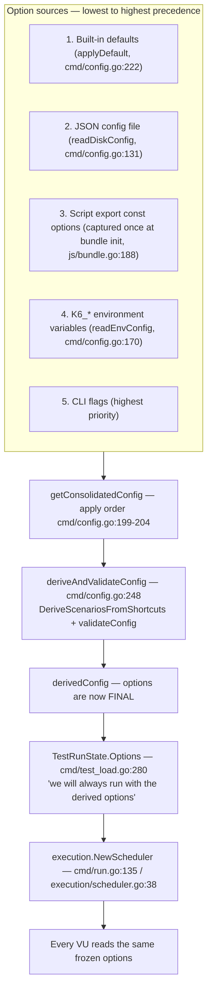

# How k6 consolidates its option sources into the "effective options" the scheduler uses

## The question this document answers

> I'm onboarding onto the k6 codebase and I keep getting tripped up by where "the real options" come from when a test starts. In practice people mix `export const options` in the script with CLI flags and sometimes a config file, and I've seen confusing cases where VUs, duration, or even scenario settings seem to "win" from a different place than you'd expect. How does k6 actually consolidate those inputs into the effective options that the scheduler uses, and at what point is that decision considered final for the run? Can you show, with real runs, a couple of conflicting setups where the script says one thing and the CLI/config says another, and prove from the observed output which one takes effect, including how this behaves when multiple VUs are running?

Restated precisely: k6 merges **four real option sources** — the script's `export const options`, `K6_*` environment variables, a JSON config file, and CLI flags — **plus built-in defaults**, into one consolidated-and-derived `Options` value. This document explains the merge function, the per-option precedence, the exact lifecycle point at which the options become **final**, and it proves — with real runs of deliberately conflicting setups — which source wins for **VUs**, **duration**, and **scenario settings**, including how the frozen options govern **multiple VUs**.

Every behavioral claim below is paired with the exact command that produced it and the exact observed output line ("one claim, one piece of evidence"). Every code reference is given as `file:line` against the commit under study.

---

## Environment and build provenance (why this evidence is attributable)

- **Repository commit:** branch `k6_ddc3b0b1d23c`, HEAD `ddc3b0b1d23c128e34e2792fc9075f9126e32375`; Go module `go.k6.io/k6` (`go.mod` declares `go 1.21` with `toolchain go1.21.13`).
- **Binary under study:** built from *this* checked-out commit with Go 1.23.4, using the repository's vendored dependencies (`GOFLAGS=-mod=vendor`), into a scratch path **outside** the repository (`/tmp/k6scratch/k6bin`) so the working tree is never dirtied.
- **Version banner (quoted verbatim):**

```
k6bin v0.55.0 (commit/ddc3b0b1d2, go1.23.4, linux/amd64)
```

  The `commit/ddc3b0b1d2` segment proves the binary matches the branch under study (`k6_ddc3b0b1d23c`, HEAD `ddc3b0b1d23c…`).

- **Read-only guarantee:** the compiled binary, the temporary scripts, and the temporary config file all lived under `/tmp/k6scratch` (outside the repository) and were deleted afterward; the repository working tree stayed clean (`git status --porcelain` was empty before, during, and after the investigation).

### Reproduction harness

A reader can reproduce every result below with the following steps (no temporary files from this investigation are required — they are described in the appendix):

```
# 1. Build k6 from the checked-out commit, vendored deps, into a scratch path
#    OUTSIDE the repository so the source tree stays clean.
mkdir -p /tmp/k6scratch
cd <repo-root>
GOFLAGS=-mod=vendor go build -o /tmp/k6scratch/k6bin .

# 2. Confirm the binary matches the commit under study.
/tmp/k6scratch/k6bin version
# => k6bin v0.55.0 (commit/ddc3b0b1d2, go1.23.4, linux/amd64)
```

All test runs used `--no-color`. The temporary observation scripts (`s_vus.js`, `s_dur.js`, `config.json`, `s_dur_env.js`, `s_scenarios.js`, `s_vusalone.js`, `s_iters.js`, `s_stages.js`, `s_empty.js`, `s_multivu.js`, `s_freeze.js`) are listed verbatim in the [Appendix](#appendix-temporary-observation-scripts).

---

## Pipeline at a glance



The diagram is a map, not evidence; each hop is proven with a paired run in the sections below.

---

## (a) The option sources and the consolidation mechanism

There are **four real sources plus a layer of built-in defaults**, and they are merged by a single function, `getConsolidatedConfig`.

**Consolidation entry point.** `getConsolidatedConfig` is declared at `cmd/config.go:189`:

```go
func getConsolidatedConfig(gs *state.GlobalState, cliConf Config, runnerOpts lib.Options) (conf Config, err error)
```

Its own intent comment (`cmd/config.go:180-186`) enumerates the plan in order: *start with the CLI-provided options to get shadowed (non-Valid) defaults in there → add the global file config options → add the Runner-provided options (they may come from Bundle too) → add the environment variables → merge the user-supplied CLI flags back in on top, to give them the greatest priority → set some defaults if they weren't previously specified.*

**The apply layering (the heart of the mechanism).** The function performs the merge as a sequence of `Apply` calls (`cmd/config.go:199-204`):

```go
conf = cliConf.Apply(fileConf)               // cmd/config.go:199

conf = conf.Apply(Config{Options: runnerOpts}) // cmd/config.go:201  (the script/runner layer)

conf = conf.Apply(envConf).Apply(cliConf)      // cmd/config.go:203  (env, then CLI on top)
conf = applyDefault(conf)                      // cmd/config.go:204
```

Because the *last* writer for a given field wins, the terminal `.Apply(cliConf)` at `cmd/config.go:203` is what gives CLI flags the highest priority, and `applyDefault` at `cmd/config.go:204` only fills fields that nothing else set.

**Supporting readers and the merge primitive:**

- `readDiskConfig` (`cmd/config.go:131`) reads and JSON-unmarshals the config file into a `Config`.
- `readEnvConfig` (`cmd/config.go:170`) reads `K6_*` variables via `envconfig.Process("", &conf, …)`.
- `applyDefault` (`cmd/config.go:222`) fills only unset fields — each assignment is guarded, e.g. `if !conf.DNS.TTL.Valid { … }` and `if conf.SystemTags == nil { … }`, so it never overwrites a value a higher tier already set.
- `Config.Apply` (`cmd/config.go:70`) delegates option merging to `Options.Apply` and otherwise copies a field only when the incoming tier set it (`if cfg.Linger.Valid { … }`, etc.). Its doc comment states plainly: *"The provided config has priority."*
- `Options.Apply` (`lib/options.go:357`) is the field-by-field merge primitive:

```go
func (o Options) Apply(opts Options) Options
```

  Every field override is gated on the incoming value being explicitly set — e.g. `if opts.VUs.Valid { o.VUs = opts.VUs }` at `lib/options.go:361-363`. This nullable-field design (`null.Int`, `types.NullDuration`, backed by `gopkg.in/guregu/null.v3`) is precisely what implements "only override if the higher tier actually specified this option."

**Where the script options come from — captured once, at bundle init.** The script's `export const options` is *not* re-read during the run. It is decoded exactly once when the JS bundle initializes, in `populateExports` (`js/bundle.go:188`). In the `case consts.Options:` branch (`js/bundle.go:200`), k6 marshals the exported object (`json.Marshal(v.Export())` at `js/bundle.go:205`), builds a strict decoder (`dec.DisallowUnknownFields()` at `js/bundle.go:211`), and decodes it into `b.Options` (`dec.Decode(&b.Options)` at `js/bundle.go:212`). Those captured options are then exposed to the rest of k6 through `GetOptions` (`js/runner.go:340`, `return r.Bundle.Options`) and `SetOptions` (`js/runner.go:435`), and are fed into the runner at construction time by `r.SetOptions(r.Bundle.Options)` (`js/runner.go:101`). This is why `getConsolidatedConfig` receives the script layer as its `runnerOpts` argument — it is the already-captured bundle options.

**Where the config file comes from.** The default config-file name is the literal `config.json` (`defaultConfigFileName = "config.json"`, `cmd/state/state.go:20`), resolved by default to `filepath.Join(homeDir, "loadimpact", "k6", defaultConfigFileName)` (`cmd/state/state.go:152`). It can be overridden by the `K6_CONFIG` environment variable (`cmd/state/state.go:163`):

```go
if val, ok := env["K6_CONFIG"]; ok {
    result.ConfigFilePath = val
}
```

or by the `--config`/`-c` flag (used in the config-vs-script proof in section (b)).

---

## (b) Precedence — who wins, per option

The apply sequence in section (a) yields this precedence ladder, **highest to lowest**:

| Rank | Source | How the code establishes it | Proof run (see below) |
|------|--------|-----------------------------|-----------------------|
| 1 (highest) | **CLI flags** | terminal `.Apply(cliConf)` at `cmd/config.go:203` | B1 (VUs), B2 (duration) |
| 2 | **`K6_*` environment variables** | `.Apply(envConf)` just before CLI at `cmd/config.go:203` | B4 (duration) |
| 3 | **Script `export const options`** | `conf.Apply(Config{Options: runnerOpts})` at `cmd/config.go:201` | B3 (beats config) |
| 4 | **JSON config file** | `cliConf.Apply(fileConf)` base at `cmd/config.go:199` | B3 (loses to script) |
| 5 (lowest) | **Built-in defaults** | `applyDefault(conf)` at `cmd/config.go:204`, fills only unset fields | section (e) empty-script default |

**Why this is the order:** `Config.Apply`/`Options.Apply` only overwrite a field when the *incoming* (higher) tier explicitly set it — every override is gated by a `.Valid` check on a nullable field (e.g. `if opts.VUs.Valid` at `lib/options.go:361`). The script layer is applied first (`cmd/config.go:201`), then env, then CLI last (`cmd/config.go:203`), so CLI overrides env, env overrides the script, the script overrides the config file (the base at `cmd/config.go:199`), and `applyDefault` (`cmd/config.go:204`) only touches fields still unset. Each rung is proven with a paired run below.

### B1 — CLI flag beats script (VUs)

Script `s_vus.js` sets `vus: 2`; the CLI passes `--vus 5`.

```
$ /tmp/k6scratch/k6bin run --no-color --vus 5 s_vus.js
```

Banner (the effective VU count):

```
* default: 5 looping VUs for 2s (gracefulStop: 30s)
```

End-of-test summary rows:

```
vus..................: 5   min=5      max=5
vus_max..............: 5   min=5      max=5
```

**Conclusion:** the CLI `--vus 5` won over the script's `vus: 2` — the banner and both `vus`/`vus_max` rows read `5`, never `2`.

### B2 — CLI flag beats script (duration)

Script `s_dur.js` sets `duration: '3s'`; the CLI passes `--duration 5s`.

```
$ /tmp/k6scratch/k6bin run --no-color --duration 5s s_dur.js
```

Banner:

```
* default: 1 looping VUs for 5s (gracefulStop: 30s)
```

The measured wall-clock time of the run was `5.06s`, matching the `5s` from the CLI (not the script's `3s`). **Conclusion:** CLI `--duration 5s` won over the script's `duration: '3s'`.

### B3 — Script beats the JSON config file (duration)

`config.json` contains `{"duration":"7s"}`; the script `s_dur.js` sets `duration: '3s'`.

```
$ /tmp/k6scratch/k6bin run --no-color --config config.json s_dur.js
```

Banner:

```
* default: 1 looping VUs for 3s (gracefulStop: 30s)
```

Measured wall-clock time was `3.07s` — **not** ~7s. **Conclusion:** the script's `duration: '3s'` beat the config file's `"duration":"7s"`, exactly as the ladder predicts (script layer at `cmd/config.go:201` is applied on top of the file base at `cmd/config.go:199`).

### B4 — Real environment variable beats script (duration)

The real process variable `K6_DURATION=6s` versus the script's `duration: '3s'`.

```
$ K6_DURATION=6s /tmp/k6scratch/k6bin run --no-color s_dur.js
```

Banner:

```
* default: 1 looping VUs for 6s (gracefulStop: 30s)
```

Measured wall-clock time was `6.07s`. **Conclusion:** the `K6_DURATION=6s` environment variable won over the script's `duration: '3s'` (env is applied at `cmd/config.go:203`, above the script layer at `cmd/config.go:201`).

*(The lowest tier — built-in defaults — is demonstrated in section (e): an empty script falls through to the `per-vu-iterations` default of 1 VU / 1 iteration because no other layer set any execution option.)*


---

## (c) The `K6_*` environment layer, and the `-e/--env` nuance

There are **two very different things** that both look like "environment variables" to a new user, and confusing them is a classic source of "the option won from an unexpected place" bugs.

### Real `K6_*` process variables DO configure options

`readEnvConfig` (`cmd/config.go:170`) decodes real process variables into `Options` using the `envconfig` struct tags declared on the fields, e.g. (`lib/options.go:234-237`):

```go
VUs        null.Int           `json:"vus" envconfig:"K6_VUS"`
Duration   types.NullDuration `json:"duration" envconfig:"K6_DURATION"`
Iterations null.Int           `json:"iterations" envconfig:"K6_ITERATIONS"`
Stages     []Stage            `json:"stages" envconfig:"K6_STAGES"`
```

The proof is run **B4** above: `K6_DURATION=6s` produced the banner `* default: 1 looping VUs for 6s (gracefulStop: 30s)` and a `6.07s` wall time, overriding the script's `3s`. That is a real option being set from the environment.

### The `-e/--env` flag does NOT configure options

The `-e`/`--env` flag only injects a value into the script's `__ENV` object; it does **not** touch the `Options`. Script `s_dur_env.js` sets `duration: '3s'` and logs `__ENV.DURATION` from `setup()`.

```
$ /tmp/k6scratch/k6bin run --no-color -e DURATION=9s s_dur_env.js
```

The `setup()` console line proves the value was injected into `__ENV` (quoted verbatim):

```
time="2026-07-01T21:30:41Z" level=info msg="SETUP sees __ENV.DURATION=9s" source=console
```

But the banner is **unchanged** at the script's `3s`:

```
* default: 1 looping VUs for 3s (gracefulStop: 30s)
```

and the measured wall time was `3.07s`. **Conclusion:** `-e DURATION=9s` injected `__ENV.DURATION=9s` into the script, yet the duration *option* stayed at the script's `3s`. Contrast this directly with **B4**, where the real `K6_DURATION=6s` *did* change the option to `6s`. Same-looking string, entirely different effect: `K6_DURATION` is decoded by `readEnvConfig` into `Options.Duration`; `-e DURATION=…` is not.

### `scenarios` has no environment-variable (or CLI-flag) form

The `scenarios` field is deliberately excluded from environment decoding via the `ignored:"true"` tag (`lib/options.go:245`):

```go
Scenarios ScenarioConfigs `json:"scenarios" ignored:"true"`
```

The `ignored:"true"` tag makes the `envconfig` library skip the field (the adjacent comment at `lib/options.go:239-244` explains this is a workaround for an `envconfig` bug), and there is no dedicated `--scenarios` CLI flag either. Consequently `scenarios` can only be supplied by the script `export const options` or the JSON config file — a fact that matters for the cross-tier reset in section (e).

---

## (d) The freeze point — options become final BEFORE the scheduler is built

"The real options" become final at one specific place, and it is *before* the execution scheduler exists. Here is the pipeline, hop by hop.

**1. Consolidate + derive + validate.** `consolidateDeriveAndValidateConfig` is declared at `cmd/test_load.go:188`. Its body calls `getConsolidatedConfig` (`cmd/test_load.go:203`) and then `deriveAndValidateConfig` (`cmd/test_load.go:226`):

```go
derivedConfig, err := deriveAndValidateConfig(consolidatedConfig, lt.initRunner.IsExecutable, gs.Logger)
```

**2. Derivation + validation happen here.** `deriveAndValidateConfig` (`cmd/config.go:248`) runs the shortcut→scenario derivation and then validates:

```go
result.Options, err = executor.DeriveScenariosFromShortcuts(conf.Options, logger)  // cmd/config.go:252
if err == nil {
    err = validateConfig(result, isExecutable)                                     // cmd/config.go:254
}
```

**3. The result is stored as `derivedConfig`.** It is kept on the struct field `derivedConfig Config` (`cmd/test_load.go:243`).

**4. It is frozen into the run state.** In `buildTestRunState`, the run state's `Options` is set to the derived options, with an explicit in-code comment (`cmd/test_load.go:280`) — this is the literal "final" signal:

```go
Options:          lct.derivedConfig.Options, // we will always run with the derived options
```

**5. `k6 run` hands the frozen options to the scheduler.** In `cmd/run.go`, following the comment *"Write the full consolidated *and derived* options back to the Runner."* (`cmd/run.go:126`):

```go
conf := test.derivedConfig                                 // cmd/run.go:127
testRunState, err := test.buildTestRunState(conf.Options)  // cmd/run.go:128
...
execScheduler, err := execution.NewScheduler(testRunState, controller)  // cmd/run.go:135
```

**6. The scheduler is the consumer.** `NewScheduler` (`execution/scheduler.go:38`) reads the already-frozen options and builds the execution plan from them:

```go
func NewScheduler(trs *lib.TestRunState, controller Controller) (*Scheduler, error) {
    options := trs.Options                                              // execution/scheduler.go:39
    ...
    executionPlan := options.Scenarios.GetFullExecutionRequirements(et) // execution/scheduler.go:44
```

Because the script options were captured once at bundle init (`js/bundle.go:188`, section (a)) and the consolidate→derive→validate→freeze all complete *before* `execution.NewScheduler` is constructed, **the effective options are final at the moment the scheduler is built.** Nothing the script does at runtime can change them.

### Decisive proof: a runtime mutation of `options` is ignored

Script `s_freeze.js` declares `{ vus: 2, iterations: 6 }`, and its `default` function mutates the JS `options` object to `999` on every iteration and then logs what it reads back:

```js
export const options = { vus: 2, iterations: 6 };
export default function () {
  options.vus = 999;
  options.iterations = 999;
  console.log(`obs VU=${__VU} ITER=${__ITER} script_reads_options.vus=${options.vus}`);
}
```

```
$ /tmp/k6scratch/k6bin run --no-color s_freeze.js
```

Banner — the run uses the **frozen** `2` VUs and `6` iterations:

```
* default: 6 iterations shared among 2 VUs (maxDuration: 10m0s, gracefulStop: 30s)
```

The console output was **exactly 6 lines**, with VU ids **only `1` and `2`** (never `999`), while each line confirms the JS-side object was in fact mutated to `999`:

```
time="2026-07-01T21:30:44Z" level=info msg="obs VU=2 ITER=0 script_reads_options.vus=999" source=console
time="2026-07-01T21:30:44Z" level=info msg="obs VU=1 ITER=0 script_reads_options.vus=999" source=console
time="2026-07-01T21:30:44Z" level=info msg="obs VU=2 ITER=1 script_reads_options.vus=999" source=console
time="2026-07-01T21:30:44Z" level=info msg="obs VU=2 ITER=2 script_reads_options.vus=999" source=console
time="2026-07-01T21:30:44Z" level=info msg="obs VU=2 ITER=3 script_reads_options.vus=999" source=console
time="2026-07-01T21:30:44Z" level=info msg="obs VU=1 ITER=1 script_reads_options.vus=999" source=console
```

Summary — exactly `6` iterations total:

```
iterations...........: 6   13611.337337/s
```

**Conclusion:** the script *did* mutate its own `options` object (every line reads `script_reads_options.vus=999`), yet the run still executed with the frozen values — exactly **2** VUs (the six lines carry only VU ids `1` and `2`) running exactly **6** shared iterations (here dynamically split as four for VU `2` and two for VU `1`). Mutating `options` at runtime has no effect because the effective options were frozen into `TestRunState.Options` (`cmd/test_load.go:280`) before `execution.NewScheduler` (`execution/scheduler.go:38`) ever read them.


---

## (e) VUs, duration, and scenario settings — the shortcut→scenario derivation

This section addresses each of the three options the question named — **VUs**, **duration**, and **scenarios** — and the two behaviors that produce the "winning from an unexpected place" surprises.

The key insight: `vus`, `duration`, `iterations`, and `stages` are **convenience shortcuts**. Before the run, k6 *rewrites* them into a full `scenarios` map. That rewrite is done by `DeriveScenariosFromShortcuts` (`lib/executor/execution_config_shortcuts.go:52`), called from `deriveAndValidateConfig` (`cmd/config.go:252`). So "the real options" the scheduler consumes always contain a `scenarios` map, even if you only ever wrote `duration`.

### The derivation mapping (proven with `k6 inspect --execution-requirements`)

`DeriveScenariosFromShortcuts` maps shortcuts to executor types as follows:

- **`iterations` (+ `vus`) → `shared-iterations`** — call site `lib/executor/execution_config_shortcuts.go:67`, built by `getSharedIterationsScenario` (declared `…:39`).
- **`duration` (+ `vus`) → `constant-vus`** — call site `lib/executor/execution_config_shortcuts.go:86`, built by `getConstantVUsScenario` (declared `…:21`).
- **`stages` → `ramping-vus`** — call site `lib/executor/execution_config_shortcuts.go:94`, built by `getRampingVUsScenario` (declared `…:28`).
- **nothing set → `per-vu-iterations` with 1 VU / 1 iteration** — default branch `lib/executor/execution_config_shortcuts.go:117-119`:

```go
result.Scenarios = lib.ScenarioConfigs{
    lib.DefaultScenarioName: NewPerVUIterationsConfig(lib.DefaultScenarioName),
}
```

The scenario is keyed by `DefaultScenarioName`, the literal `"default"` (`lib/options.go:21`) — which is why the banner in single-scenario runs reads `* default: …`.

Each mapping is proven by inspecting the *derived* execution requirements (`duration` shortcut, `s_dur.js`):

```
$ /tmp/k6scratch/k6bin inspect --execution-requirements s_dur.js
```

The derived scenario is keyed `default` with executor `constant-vus`:

```
{"default": {"executor": "constant-vus", "startTime": null, "gracefulStop": null, "env": null, "exec": null, "tags": null, "vus": 1, "duration": "3s"}}
```

The other three shortcuts derive as claimed:

```
$ /tmp/k6scratch/k6bin inspect --execution-requirements s_iters.js   # {vus:3, iterations:9}
scenario_name=default executor=shared-iterations

$ /tmp/k6scratch/k6bin inspect --execution-requirements s_stages.js  # {stages:[…]}
scenario_name=default executor=ramping-vus

$ /tmp/k6scratch/k6bin inspect --execution-requirements s_empty.js   # {}
scenario_name=default executor=per-vu-iterations
```

**Inspect nuance (avoid a common confusion):** *plain* `k6 inspect` prints the **raw, pre-derivation** options, where `scenarios` is `null`; only `--execution-requirements` shows the derived scenarios. For `s_dur.js`:

```
$ /tmp/k6scratch/k6bin inspect s_dur.js
{"scenarios": null, "vus": 1, "duration": "3s"}
```

So `scenarios: null` from plain `inspect` does **not** mean "no scenario will run" — it means the shortcut has not been derived into a scenario *yet*. The `--execution-requirements` view above shows the same script deriving into a `constant-vus` scenario.

### Surprise #1 — `vus` alone is silently ignored (with a warning)

Setting `vus` **without** `iterations`/`duration`/`stages` does nothing to the run. Script `s_vusalone.js` is just `{ vus: 5 }`.

```
$ /tmp/k6scratch/k6bin run --no-color s_vusalone.js
```

The warning is emitted verbatim (its format string is at `lib/executor/execution_config_shortcuts.go:102-105`):

```
time="2026-07-01T21:31:23Z" level=warning msg="the `vus=5` option will be ignored, it only works in conjunction with `iterations`, `duration`, or `stages`"
```

and the run falls through to the 1-VU / 1-iteration default:

```
* default: 1 iterations for each of 1 VUs (maxDuration: 10m0s, gracefulStop: 30s)
```

```
iterations...........: 1   9247.272055/s
```

**Conclusion:** `vus: 5` alone was ignored — the run used the `per-vu-iterations` default of 1 VU / 1 iteration. The warning fires from the `default:` branch only when `opts.VUs.Valid && opts.VUs.Int64 != 1` (`lib/executor/execution_config_shortcuts.go:101`), which is exactly why a lone `vus` produces this message.

### Surprise #2 — a higher-tier execution shortcut *wipes* a lower-tier `scenarios` (cross-tier reset)

This is the prime cause of "scenario settings winning from an unexpected place." `Options.Apply` contains a reset (`lib/options.go:371-377`) whose comment (`lib/options.go:365-367`) states that specifying duration/iterations/stages/execution in a higher tier overwrites **all** previous execution settings from lower tiers:

```go
if opts.Duration.Valid || opts.Iterations.Valid || opts.Stages != nil || opts.Scenarios != nil {
    o.Duration = types.NewNullDuration(0, false)
    o.Iterations = null.NewInt(0, false)
    o.Stages = nil
    o.Scenarios = nil
}
```

Script `s_scenarios.js` defines a **named** scenario `my_named_scenario` (a `per-vu-iterations` executor, `vus: 3`, `iterations: 2`).

**Run it alone — the named scenario survives:**

```
$ /tmp/k6scratch/k6bin run --no-color s_scenarios.js
```

```
* my_named_scenario: 2 iterations for each of 3 VUs (maxDuration: 10m0s, gracefulStop: 30s)
```

(The scenarios summary line reported `3 max VUs`, and the run executed `6` iterations = 2 per VU × 3 VUs.) The script's `my_named_scenario` is exactly what ran.

**Now add a higher-tier execution shortcut on the CLI — the named scenario is discarded:**

```
$ /tmp/k6scratch/k6bin run --no-color --vus 4 --duration 2s s_scenarios.js
```

```
* default: 4 looping VUs for 2s (gracefulStop: 30s)
```

The string `my_named_scenario` appeared **0 times** in the entire output. **Conclusion:** because the CLI supplied `--duration` (a higher tier), the cross-tier reset at `lib/options.go:371-377` cleared the script's lower-tier `scenarios`, and the run instead used a freshly derived `constant-vus` scenario keyed `default`. The script's carefully named scenario was silently thrown away — precisely the "scenario settings came from a place I didn't expect" surprise. (Note the interaction with section (c): since `scenarios` has no env/CLI form, you cannot re-supply it from the CLI to win it back — only a lower/equal tier that isn't overridden by an execution shortcut keeps it.)


---

## (f) Multiple-VU behavior — every VU obeys the same frozen options

Once the effective options are frozen (section (d)), the same values govern **every** VU. Script `s_multivu.js` declares `{ vus: 2, iterations: 10 }` and logs its VU/iteration ids; we run it with a conflicting CLI `--vus 5`.

```js
export const options = { vus: 2, iterations: 10 };
export default function () {
  console.log(`obs VU=${__VU} ITER=${__ITER}`);
}
```

```
$ /tmp/k6scratch/k6bin run --no-color --vus 5 s_multivu.js
```

Banner — the CLI `--vus 5` froze the VU count over the script's `2`, and `iterations: 10` became a `shared-iterations` budget:

```
* default: 10 iterations shared among 5 VUs (maxDuration: 10m0s, gracefulStop: 30s)
```

The console output contained **five distinct executing VU ids — `1`, `2`, `3`, `4`, `5`** — proving the frozen VU count of `5` governed the run:

```
obs VU=3 ITER=0
obs VU=5 ITER=0
obs VU=5 ITER=1
obs VU=4 ITER=0
obs VU=4 ITER=1
obs VU=4 ITER=2
obs VU=2 ITER=0
obs VU=1 ITER=0
obs VU=5 ITER=2
obs VU=3 ITER=1
```

There were exactly **10** such iteration lines, and the summary confirms the frozen iteration budget:

```
iterations...........: 10  18333.889461/s
```

**Conclusion:** once frozen, the same effective options govern every VU — all **5** VUs drew from the single `shared-iterations` scenario and *together* executed exactly the frozen **10** iterations (dynamically distributed: VU `4` and VU `5` ran three each, VU `3` two, VUs `1` and `2` one each — summing to 10). This connects directly back to the freeze in section (d): the VU count and the iteration budget were both fixed into `TestRunState.Options` (`cmd/test_load.go:280`) *before* `execution.NewScheduler` (`execution/scheduler.go:38`) built the execution plan via `options.Scenarios.GetFullExecutionRequirements(et)` (`execution/scheduler.go:44`), so no individual VU can deviate from them.

---

## (g) Corroboration (secondary — non-authoritative)

The authoritative evidence in this document is the locally observed output from the binary built at commit `ddc3b0b1d2`. As a secondary cross-check only, the official Grafana k6 "How to use options" documentation enumerates the same five-layer order of precedence — defaults, then the `--config` file, then the script `options`, then the environment variable, and finally the CLI flag as highest — which matches both the observed behavior above and the apply sequence at `cmd/config.go:199-204`. No conflict was found between the observed runtime behavior, the source code, and the official documentation; the documentation is used purely to corroborate, never to substitute for, the observed evidence.

---

## (h) Coverage pass — every named item, with its evidence

| Item the question named | Where answered | Code reference | Observed proof line |
|---|---|---|---|
| Consolidation mechanism | (a) | `getConsolidatedConfig` `cmd/config.go:189`; apply order `cmd/config.go:199-204` | version banner `k6bin v0.55.0 (commit/ddc3b0b1d2, …)` ties evidence to commit |
| Precedence ladder (CLI > `K6_*` env > script > config file > defaults) | (b) | `.Apply(cliConf)` last `cmd/config.go:203`; `applyDefault` `cmd/config.go:204` | B1–B4 banners (below) |
| **VUs** — CLI beats script | (b) B1 | `if opts.VUs.Valid` `lib/options.go:361` | `* default: 5 looping VUs for 2s (gracefulStop: 30s)`; `vus…: 5   min=5      max=5` |
| **duration** — CLI beats script | (b) B2 | `cmd/config.go:203` | `* default: 1 looping VUs for 5s (gracefulStop: 30s)` (wall 5.06s) |
| **duration** — script beats config file | (b) B3 | `cmd/config.go:201` over `:199` | `* default: 1 looping VUs for 3s (gracefulStop: 30s)` (wall 3.07s) |
| **duration** — real env beats script | (b) B4 / (c) | `readEnvConfig` `cmd/config.go:170` | `* default: 1 looping VUs for 6s (gracefulStop: 30s)` (wall 6.07s) |
| `K6_*` env layer | (c) | envconfig tags `lib/options.go:234-237` | (same B4 line) |
| `-e/--env` vs real env-var nuance | (c) | — | `level=info msg="SETUP sees __ENV.DURATION=9s" source=console` + unchanged `… for 3s` banner |
| `scenarios` has no env/CLI form | (c) | `ignored:"true"` `lib/options.go:245` | derivation only via script/config (see (e)) |
| Freeze point | (d) | `derivedConfig` `cmd/test_load.go:226`; `TestRunState.Options` `cmd/test_load.go:280`; `NewScheduler` `execution/scheduler.go:38` | banner `* default: 6 iterations shared among 2 VUs …` |
| Runtime-mutation-ignored proof | (d) | freeze comment `cmd/test_load.go:280` | 6 lines, VU ids only `1`/`2`, each `script_reads_options.vus=999`; `iterations…: 6` |
| **scenarios** — shortcut derivation | (e) | `DeriveScenariosFromShortcuts` `lib/executor/execution_config_shortcuts.go:52` | `constant-vus` / `shared-iterations` / `ramping-vus` / `per-vu-iterations` from `inspect` |
| **scenarios** — vus-alone warning | (e) | `…/execution_config_shortcuts.go:101-105` | `msg="the `vus=5` option will be ignored, it only works in conjunction with `iterations`, `duration`, or `stages`"` |
| **scenarios** — cross-tier reset | (e) | `lib/options.go:371-377` | `my_named_scenario` alone → survives; with `--vus 4 --duration 2s` → `* default: 4 looping VUs for 2s`, 0 occurrences |
| Multi-VU behavior | (f) | `execution/scheduler.go:44` | `* default: 10 iterations shared among 5 VUs …`; VU ids `1,2,3,4,5`; `iterations…: 10` |
| Corroboration (non-authoritative) | (g) | `cmd/config.go:199-204` | official docs match; observed output is authoritative |

**Repository integrity:** the source tree was **not** modified. All temporary scripts, the config file, and the compiled binary lived under `/tmp/k6scratch` (outside the repository) and were removed after observation; `git status --porcelain` reported an empty (clean) working tree before, during, and after the investigation. The only net-new file is this document.

---

## Key takeaways

1. **"The real options" are not any single source.** They are the **consolidated + derived** `Options` produced by `getConsolidatedConfig` (`cmd/config.go:189`) and then `deriveAndValidateConfig` (`cmd/config.go:248`). The convenience shortcuts (`vus`/`duration`/`iterations`/`stages`) are rewritten into a full `scenarios` map before the run, which is why "scenario settings" sometimes appear to come from a place you never wrote them.
2. **The decision is final at the freeze into `TestRunState.Options`** (`cmd/test_load.go:280`, comment *"we will always run with the derived options"*), just before `execution.NewScheduler` (`execution/scheduler.go:38`) — proven by the ignored runtime mutation in section (d).
3. **Two classic surprises:** (1) `vus` alone is silently ignored with a warning (`lib/executor/execution_config_shortcuts.go:101-105`), and (2) any higher-tier execution shortcut wipes a lower-tier `scenarios`/execution config via the cross-tier reset (`lib/options.go:371-377`).

---

## Appendix: temporary observation scripts

These scripts lived under `/tmp/k6scratch` (outside the repository) and were deleted after the investigation. They are reproduced here so the runs above are fully reproducible. All runs used `--no-color`.

```js
// s_vus.js
import { sleep } from 'k6';
export const options = { vus: 2, duration: '2s' };
export default function () { sleep(0.5); }
```

```js
// s_dur.js
import { sleep } from 'k6';
export const options = { vus: 1, duration: '3s' };
export default function () { sleep(0.5); }
```

```json
// config.json
{"duration":"7s"}
```

```js
// s_dur_env.js
import { sleep } from 'k6';
export const options = { vus: 1, duration: '3s' };
export function setup() {
  console.log(`SETUP sees __ENV.DURATION=${__ENV.DURATION}`);
}
export default function () { sleep(0.5); }
```

```js
// s_scenarios.js
export const options = {
  scenarios: {
    my_named_scenario: { executor: 'per-vu-iterations', vus: 3, iterations: 2 },
  },
};
export default function () { }
```

```js
// s_vusalone.js
export const options = { vus: 5 };
export default function () { }
```

```js
// s_iters.js
export const options = { vus: 3, iterations: 9 };
export default function () { }
```

```js
// s_stages.js
import { sleep } from 'k6';
export const options = { stages: [{ duration: '2s', target: 3 }, { duration: '2s', target: 0 }] };
export default function () { sleep(0.5); }
```

```js
// s_empty.js
export const options = {};
export default function () { }
```

```js
// s_multivu.js
export const options = { vus: 2, iterations: 10 };
export default function () {
  console.log(`obs VU=${__VU} ITER=${__ITER}`);
}
```

```js
// s_freeze.js
export const options = { vus: 2, iterations: 6 };
export default function () {
  options.vus = 999;
  options.iterations = 999;
  console.log(`obs VU=${__VU} ITER=${__ITER} script_reads_options.vus=${options.vus}`);
}
```

