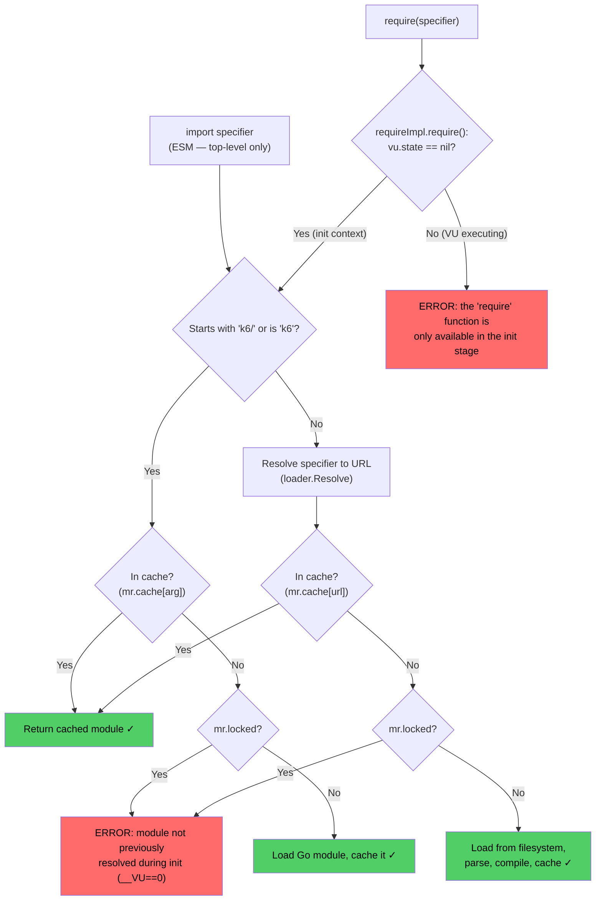
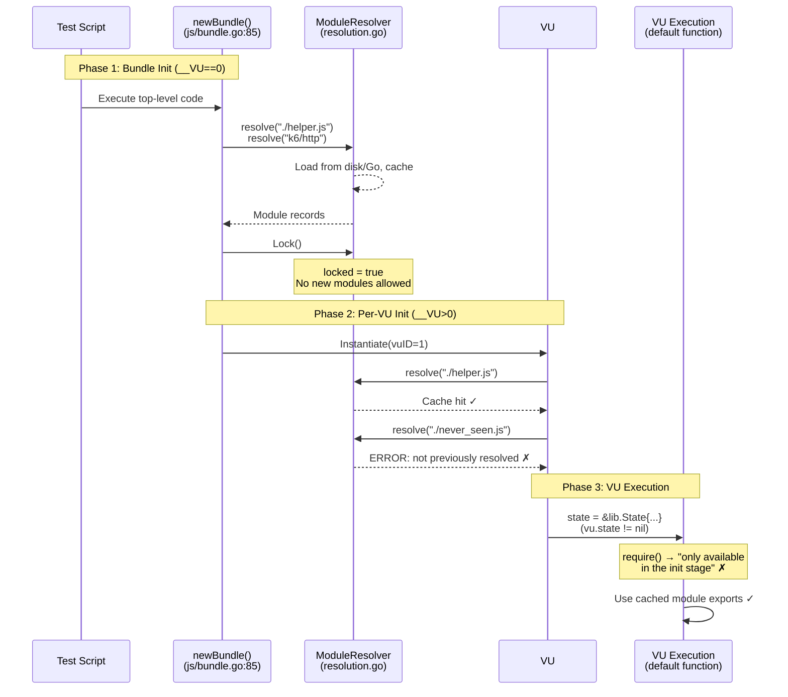

# k6 Module Resolution Freeze: Init vs. VU Execution Deep Dive

> **k6 version**: v0.55.0 (commit ddc3b0b1d2; go.mod minimum: go 1.21, toolchain go1.21.13; binary built with go1.22.2)
>
> This document provides a comprehensive, code-backed investigation into k6's module resolution
> behavior during VU execution versus initialization. Every claim cites the exact source file and
> line number. All experimental outputs are from real k6 runs against the v0.55.0 codebase.

---

## Table of Contents

1. [Why Scripts Fail Under VU Load (Init vs. VU Lifecycle)](#1-why-scripts-fail-under-vu-load-init-vs-vu-lifecycle)
2. [The Module Resolution Freeze Mechanism](#2-the-module-resolution-freeze-mechanism)
3. [Relative Specifier Resolution Across Call Sites](#3-relative-specifier-resolution-across-call-sites)
4. [Empirical Demonstrations (Real k6 Runs)](#4-empirical-demonstrations-real-k6-runs)
5. [The open() Parallel - Analogous Freeze for Files](#5-the-open-parallel---analogous-freeze-for-files)
6. [Summary and Practical Guidance](#6-summary-and-practical-guidance)

---

## 1. Why Scripts Fail Under VU Load (Init vs. VU Lifecycle)

### 1.1 The k6 Test Lifecycle Phases

k6 executes a test script through four high-level phases: **init → setup → VU execution → teardown**. However, the "init" phase itself contains two distinct sub-phases with critically different module-loading permissions, and the transition from init to VU execution introduces a third behavioral boundary. Understanding these three boundaries is the key to understanding why scripts that "work" during development can fail under load.

The three distinct phases relevant to module resolution are:

| Phase | `__VU` value | Module loading behavior |
|-------|-------------|------------------------|
| **Bundle Init** | `0` | Full access — any module can be loaded and cached |
| **Per-VU Init** | `>0` | `require()` works, but ONLY for already-cached modules |
| **VU Execution** | `>0` | `require()` is completely blocked |

### 1.2 Bundle Init (`__VU==0`)

When k6 first parses your script, it creates a **bundle** — a single, shared representation of your test. This happens inside `newBundle()`:

```go
// Source: js/bundle.go:94
// Make a bundle, instantiate it into a throwaway VM to populate caches.
```

The function creates a throwaway VM, instantiates the script with `vuID=0` (which sets `__VU` to `0` in JavaScript), and executes the entire top-level script code:

```go
// Source: js/bundle.go:116-125
vuImpl := &moduleVUImpl{
    ctx:     context.Background(),
    runtime: sobek.New(),
    // ...
}
vuImpl.eventLoop = eventloop.New(vuImpl)
bi, err := bundle.instantiate(vuImpl, 0)
```

During this execution, every `require()` call and every `import` statement triggers the `ModuleResolver.resolve()` method. Because the resolver is **not yet locked**, each new module is loaded from the filesystem (or from the Go module registry for `k6/*` modules), parsed, compiled, and stored in the resolver's cache.

**The critical freeze point** occurs immediately after the bundle init completes:

```go
// Source: js/bundle.go:129
bundle.ModuleResolver.Lock()
```

This single line call sets `mr.locked = true` on the `ModuleResolver`, permanently preventing any new module from being loaded. From this point forward, only modules already in the cache can be resolved.

**Rationale**: This architecture ensures deterministic, reproducible test execution. If different VUs could load different modules at runtime, test results would become non-reproducible. By taking a "snapshot" of all resolved modules at bundle init and replaying from cache for each VU, k6 guarantees that every VU sees the same module graph.

*Source: js/bundle.go:85-129*

### 1.3 Per-VU Init (`__VU>0`)

After the bundle is created and locked, k6 creates individual VUs by calling `Bundle.Instantiate()`:

```go
// Source: js/bundle.go:244-266
func (b *Bundle) Instantiate(ctx context.Context, vuID uint64) (*BundleInstance, error) {
    // Instantiate the bundle into a new VM using a bound init context. This uses a context with a
    // runtime, but no state, to allow module-provided types to function within the init context.
    vuImpl := &moduleVUImpl{
        ctx:     ctx,
        runtime: sobek.New(),
        // ...
    }
    // ...
    bi, err := b.instantiate(vuImpl, vuID)
    // ...
}
```

Each VU gets a fresh JavaScript runtime (`sobek.New()`), and the script's top-level code re-executes — but this time with `__VU > 0`. The `require()` function is still available (because `vu.state == nil` during init — the VU has not yet been "activated"), but the resolver is locked. This means:

- **Cached modules**: `require("./helper.js")` works if `helper.js` was loaded during bundle init
- **New modules**: `require("./never_seen.js")` fails with: `the module "./never_seen.js" was not previously resolved during initialization (__VU==0)`

This is why conditional `require()` calls gated by `__VU > 0` are dangerous — the module was never loaded at `__VU==0`, so it is not in the cache when VUs try to resolve it.

*Source: js/bundle.go:244-266, js/bundle.go:297*

### 1.4 VU Execution (The Default Function)

When k6 transitions a VU from init to execution, it sets the VU's `state` to a non-nil value:

```go
// Source: js/runner.go:230
vu.state = &lib.State{
    Logger:         vu.Runner.preInitState.Logger,
    Options:        vu.Runner.Bundle.Options,
    // ... (many fields)
}
```

And critically:

```go
// Source: js/runner.go:247
vu.moduleVUImpl.state = vu.state
```

The `moduleVUImpl` struct holds a `state *lib.State` field:

```go
// Source: js/modules_vu.go:17-24
type moduleVUImpl struct {
    ctx       context.Context
    initEnv   *common.InitEnvironment
    state     *lib.State
    runtime   *sobek.Runtime
    eventLoop *eventloop.EventLoop
    events    events
}
```

Once `state != nil`, the `requireImpl.require()` method's init-context guard fires:

```go
// Source: js/bundle.go:424-429
func (r *requireImpl) require(specifier string) (*sobek.Object, error) {
    if !r.inInitContext() {
        return nil, fmt.Errorf(cantBeUsedOutsideInitContextMsg, "require")
    }
    return r.modSys.Require(specifier)
}
```

Where `inInitContext` is defined as:

```go
// Source: js/bundle.go:438-439
inInitContext: func() bool { return vu.state == nil },
```

This means that during VU execution (the `export default function()` body), `require()` is **completely blocked** — even for cached modules. The error message is:

```
the "require" function is only available in the init stage (i.e. the global scope),
see https://grafana.com/docs/k6/latest/using-k6/test-lifecycle/ for more information
```

*Source: js/initcontext.go:15-16*

---

## 2. The Module Resolution Freeze Mechanism

### 2.1 The ModuleResolver Struct

The `ModuleResolver` is the central component of k6's module system. It manages module lookup, caching, and the lock mechanism:

```go
// Source: js/modules/resolution.go:29-39
// ModuleResolver knows how to get base Module that can be initialized
type ModuleResolver struct {
    cache     map[string]moduleCacheElement
    goModules map[string]any
    loadCJS   FileLoader
    compiler  *compiler.Compiler
    locked    bool
    reverse   map[any]*url.URL
    base      *url.URL
    usage     *usage.Usage
    logger    logrus.FieldLogger
}
```

Key fields:

- **`cache`** (`map[string]moduleCacheElement`, line 31): Maps specifier strings to resolved module records. This is the sole source for module lookups after locking.
- **`locked`** (`bool`, line 35): The freeze flag. Once set to `true`, no new modules can be loaded.
- **`reverse`** (`map[any]*url.URL`, line 36): Reverse mapping from module records back to their source URLs, used for ESM relative specifier resolution.

### 2.2 The Lock() Method

The `Lock()` method is remarkably simple — it sets a single boolean:

```go
// Source: js/modules/resolution.go:133-139
// Lock locks the module's resolution from any further new resolving operation.
// It means that it relays only its internal cache and on the fact that it has already
// seen previously the module during the initialization.
// It is the same approach used for opening file operations.
func (mr *ModuleResolver) Lock() {
    mr.locked = true
}
```

Note the GoDoc comment explicitly states this is "the same approach used for opening file operations" — a parallel we explore in [Section 5](#5-the-open-parallel---analogous-freeze-for-files).

### 2.3 How the Cache Determines "Already Resolved" vs. "New"

The `resolve()` method is where all module resolution decisions are made. Here is the complete decision logic:

```go
// Source: js/modules/resolution.go:145-177
func (mr *ModuleResolver) resolve(basePWD *url.URL, arg string) (sobek.ModuleRecord, error) {
    switch {
    case arg == "k6", strings.HasPrefix(arg, "k6/"):
        // Builtin or external modules ("k6", "k6/*", or "k6/x/*") are handled
        // specially, as they don't exist on the filesystem.
        if cached, ok := mr.cache[arg]; ok {
            return cached.mod, cached.err
        }
        mod, err := mr.requireModule(arg)
        mr.cache[arg] = moduleCacheElement{mod: mod, err: err}
        return mod, err
    default:
        specifier, err := mr.resolveSpecifier(basePWD, arg)
        if err != nil {
            return nil, err
        }
        // try cache with the final specifier
        if cached, ok := mr.cache[specifier.String()]; ok {
            return cached.mod, cached.err
        }

        if mr.locked {
            return nil, fmt.Errorf(notPreviouslyResolvedModule, arg)
        }
        // Fall back to loading
        data, err := mr.loadCJS(specifier, arg)
        if err != nil {
            mr.cache[specifier.String()] = moduleCacheElement{err: err}
            return nil, err
        }
        return mr.resolveLoaded(basePWD, arg, data)
    }
}
```

The decision flow for any module specifier is:

1. **Is it a `k6/` module?** (line 147) — These are Go-backed built-in modules.
   - Check cache by raw specifier string (line 150). If cached → return it.
   - If not cached → call `requireModule()`, which checks the lock (line 70).

2. **Is it a filesystem module?** (the `default` case, line 156)
   - First, resolve the specifier to an absolute URL using `resolveSpecifier()` (line 157).
   - Check cache by the resolved URL string (line 162). If cached → return it.
   - If not cached AND `mr.locked` is `true` (line 166) → **reject** with `notPreviouslyResolvedModule`.
   - If not cached AND not locked → load from filesystem via `mr.loadCJS()` (line 170), then parse and cache via `resolveLoaded()` (line 175).

The `requireModule()` method for Go modules follows the same pattern:

```go
// Source: js/modules/resolution.go:69-72
func (mr *ModuleResolver) requireModule(name string) (sobek.ModuleRecord, error) {
    if mr.locked {
        return nil, fmt.Errorf(notPreviouslyResolvedModule, name)
    }
    // ... load Go module ...
}
```

The error constant is defined as:

```go
// Source: js/modules/resolution.go:17
const notPreviouslyResolvedModule = "the module %q was not previously resolved during initialization (__VU==0)"
```

### 2.4 The Two-Layer Protection System

k6 has **two distinct protection layers** that prevent module loading at different lifecycle stages. Understanding the distinction is critical because they produce different error messages and fire at different times.

#### Layer 1: Init Context Guard (VU Execution Block)

**Where**: `js/bundle.go:424-429`

**When it fires**: During **VU execution** (when the `export default function()` body runs). At this point, `vu.state != nil`.

**What it does**: Completely blocks `require()` calls — even for already-cached modules.

**Error message**:
```
the "require" function is only available in the init stage (i.e. the global scope),
see https://grafana.com/docs/k6/latest/using-k6/test-lifecycle/ for more information
```
*Source: js/initcontext.go:15-16*

**Mechanism**: The `requireImpl.require()` method checks `r.inInitContext()`, which evaluates `vu.state == nil`. Once `vu.state` is set at `js/runner.go:247`, this check fails and `require()` is rejected immediately — before the module resolver is even consulted.

#### Layer 2: Resolver Lock (New Module Rejection)

**Where**: `js/modules/resolution.go:69-72` (Go modules) and `js/modules/resolution.go:166-168` (filesystem modules)

**When it fires**: During **per-VU init** (`__VU>0`). The `require()` function is still available (Layer 1 allows it — `vu.state` is still `nil`), but the resolver rejects any module not already in its cache.

**What it does**: Allows `require()` for cached modules, rejects new ones.

**Error message**:
```
the module "<specifier>" was not previously resolved during initialization (__VU==0)
```
*Source: js/modules/resolution.go:17*

#### When Each Layer Fires

| Lifecycle Phase | Layer 1 (Init Context) | Layer 2 (Resolver Lock) | `require()` result |
|----------------|----------------------|------------------------|-------------------|
| Bundle Init (`__VU==0`) | Allows (state == nil) | Allows (locked == false) | **Full access** |
| Per-VU Init (`__VU>0`) | Allows (state == nil) | **Rejects new modules** (locked == true) | Cached only |
| VU Execution | **Blocks all** (state != nil) | Not reached | Completely blocked |

### 2.5 Module Resolution Decision Flowchart



> **Note**: ESM `import` statements bypass `requireImpl.require()` entirely and enter the resolver directly via `sobekModuleResolver()` → `resolve()` (see [Section 3.1](#31-esm-import-sobekmoduleresolver--reversepath)). Since `import` is syntactically required at the top level, it always executes during init and never encounters the init-context guard (Layer 1).

---

## 3. Relative Specifier Resolution Across Call Sites

When you write `import { foo } from "./helper.js"` or `require("../lib/util.js")`, k6 must determine what `./` or `../` is relative to. The answer depends on whether you're using ESM `import` or CommonJS `require()`, because each uses a different mechanism to find the "parent" module.

### 3.1 ESM `import`: sobekModuleResolver + reversePath()

When the Sobek JavaScript engine encounters an `import` statement, it calls the `sobekModuleResolver` callback registered by k6:

```go
// Source: js/modules/resolution.go:192-196
func (mr *ModuleResolver) sobekModuleResolver(
    referencingScriptOrModule any, specifier string,
) (sobek.ModuleRecord, error) {
    return mr.resolve(mr.reversePath(referencingScriptOrModule), specifier)
}
```

The key is `reversePath()`, which takes the module record of the *importing* module and finds its URL:

```go
// Source: js/modules/resolution.go:198-211
func (mr *ModuleResolver) reversePath(referencingScriptOrModule interface{}) *url.URL {
    p, ok := mr.reverse[referencingScriptOrModule]
    if !ok {
        if referencingScriptOrModule != nil {
            panic("fix this")
        }
        return mr.base
    }

    if p.String() == "file:///-" {
        return mr.base
    }
    return p.JoinPath("..")
}
```

The `mr.reverse` map (line 199) was populated during module loading — every time `resolveLoaded()` processes a module, it stores the mapping:

```go
// Source: js/modules/resolution.go:128
mr.reverse[mod] = specifier
```

So `reversePath()`:
1. Looks up the referencing module record in `mr.reverse` to find its URL (line 199)
2. If not found and module is `nil`, falls back to `mr.base` (the script's base directory) (line 204)
3. If the URL is `file:///-` (a sentinel for the entry script), falls back to `mr.base` (line 208)
4. Otherwise, returns `p.JoinPath("..")` — the **parent directory** of the importing module (line 210)

The result is used as the `basePWD` for `resolve()`, ensuring that relative specifiers like `"../base_util.js"` are resolved relative to the importing module's location, not the main script's location.

### 3.2 CommonJS `require()`: getCurrentModuleScript + Stack Walking

When `require()` is called, the `ModuleSystem.Require()` method needs to determine the caller's location. It uses a different strategy — JavaScript call stack inspection:

```go
// Source: js/modules/require_impl.go:185-196
func getCurrentModuleScript(vu VU) string {
    rt := vu.Runtime()
    var parent string
    var buf [2]sobek.StackFrame
    frames := rt.CaptureCallStack(2, buf[:0])
    if len(frames) == 0 || frames[1].SrcName() == "file:///-" {
        return vu.InitEnv().CWD.JoinPath("./-").String()
    }
    parent = frames[1].SrcName()

    return parent
}
```

This function:
1. Captures the 2 most recent stack frames (line 189)
2. If the stack is empty or the calling frame's source is `file:///-`, falls back to the CWD (line 190-191)
3. Otherwise, uses `frames[1].SrcName()` — the source file of the **calling** code (line 193)

The calling code in `Require()` then resolves the specifier through the same `sobekModuleResolver`:

```go
// Source: js/modules/require_impl.go:25-28
parentModuleStr := getCurrentModuleScript(ms.vu)
parentModule, _ := ms.resolver.sobekModuleResolver(nil, parentModuleStr)
m, err := ms.resolver.sobekModuleResolver(parentModule, specifier)
```

For nested `require()` chains (e.g., A requires B which requires C), there is also `getPreviousRequiringFile()`:

```go
// Source: js/modules/require_impl.go:198-225
func getPreviousRequiringFile(vu VU) (string, error) {
    rt := vu.Runtime()
    var buf [1000]sobek.StackFrame
    frames := rt.CaptureCallStack(1000, buf[:0])

    for i, frame := range frames[1:] {
        if frame.FuncName() == "go.k6.io/k6/js.(*requireImpl).require-fm" {
            result := frames[i].SrcName()
            if result == "file:///-" {
                return vu.InitEnv().CWD.JoinPath("./-").String(), nil
            }
            return result, nil
        }
    }
    // ...
}
```

This walks up to 1000 stack frames (line 201), looking for the previous `require()` call site (line 205) to determine the correct base path for nested require chains. This is primarily used by `open()` to resolve file paths relative to the `require()` call chain.

### 3.3 How Specifiers Are Resolved to URLs

Both resolution paths eventually call `loader.Resolve()` to turn a specifier string into an absolute URL:

```go
// Source: loader/loader.go:48-82
func Resolve(pwd *url.URL, moduleSpecifier string) (*url.URL, error) {
    if moduleSpecifier == "" {
        return nil, errors.New("local or remote path required")
    }

    if moduleSpecifier[0] == '.' || moduleSpecifier[0] == '/' || filepath.IsAbs(moduleSpecifier) {
        return resolveFilePath(pwd, moduleSpecifier)
    }

    if strings.Contains(moduleSpecifier, "://") {
        u, err := url.Parse(moduleSpecifier)
        // ... validates scheme is "file" or "https" only ...
        return u, err
    }

    // ... rejects cdnjs.com, github.com special URLs ...
    return nil, unresolvableURLError(moduleSpecifier)
}
```

The logic is:
1. Starts with `.` or `/` → resolve as a relative/absolute file path via `resolveFilePath()` (line 53-54)
2. Contains `://` → parse as URL, allow only `file` and `https` schemes (lines 57-70)
3. Everything else → rejected as `unresolvableURLError` (line 81)

### 3.4 Why the Cache Prevents Confusion Under Load

Both ESM and CommonJS resolution converge on the **same `resolve()` method** and the **same cache** (`mr.cache`). The cache key for filesystem modules is the fully-resolved URL string (e.g., `file:///tmp/k6-experiments/lib/base_util.js`), not the original specifier string.

This means that whether a module was first loaded via `import "../base_util.js"` from a subdirectory or via `import "./lib/base_util.js"` from the root, the resolved URL is the same, and the cache returns the same module record. This convergence ensures that:

1. **No module is loaded twice** — even if different callers use different relative paths to reach it
2. **Under VU load**, every VU gets the same module record from the cache, regardless of which file in the dependency tree triggered the resolution
3. **Relative paths remain correct** because the `reversePath()` and `getCurrentModuleScript()` functions always derive the parent module's location dynamically

---

## 4. Empirical Demonstrations (Real k6 Runs)

All experiments were run against k6 v0.55.0 (commit ddc3b0b1d2, go1.22.2, linux/amd64) built from source. Temporary scripts were created in `/tmp/k6-experiments/` and cleaned up after observation.

### Experiment A: Init-Imported Module Used by VUs (SUCCESS)

**Purpose**: Demonstrate that a module imported at the top level during init works correctly across multiple VUs.

**Test script** (`test_init_import.js`):
```javascript
import { greet } from "./helper.js";

export default function() {
    let msg = greet("VU-" + __VU);
    console.log(msg);
}
```

**Helper module** (`helper.js`):
```javascript
export function greet(name) {
    return "Hello, " + name + "!";
}
```

**Command**:
```bash
k6 run --no-usage-report --vus 3 --iterations 6 test_init_import.js
```

**Output**:
```
     scenarios: (100.00%) 1 scenario, 3 max VUs, 10m30s max duration (incl. graceful stop):
              * default: 6 iterations shared among 3 VUs

INFO[0000] Hello, VU-1!  source=console
INFO[0000] Hello, VU-1!  source=console
INFO[0000] Hello, VU-1!  source=console
INFO[0000] Hello, VU-2!  source=console
INFO[0000] Hello, VU-1!  source=console
INFO[0000] Hello, VU-3!  source=console

     iterations...........: 6   5282.145819/s

running (00m00.0s), 0/3 VUs, 6 complete and 0 interrupted iterations
default ✓ [ 100% ] 3 VUs  00m00.0s/10m0s  6/6 shared iters
```

**Analysis**: The `greet` function from `helper.js` was loaded and cached during bundle init (`__VU==0`). Each VU (1, 2, 3) successfully used the cached module. All 6 iterations completed with zero errors.

---

### Experiment B: Never-Seen Module Require During VU Init (FAILURE)

**Purpose**: Demonstrate that `require()` for a module that was never loaded at `__VU==0` fails during per-VU init.

**Test script** (`test_vu_init_require.js`):
```javascript
if (__VU > 0) {
    let mod = require("./conditional_mod.js");
}

export default function() {
    console.log("VU " + __VU + " running");
}
```

**Helper module** (`conditional_mod.js`):
```javascript
export let data = 42;
```

**Command**:
```bash
k6 run --no-usage-report --vus 2 --iterations 4 test_vu_init_require.js
```

**Output**:
```
ERRO[0000] GoError: the module "./conditional_mod.js" was not previously resolved
during initialization (__VU==0)
	at go.k6.io/k6/js.(*requireImpl).require-fm (native)
	at file:///tmp/k6-experiments/test_vu_init_require.js:2:22(17)
hint="error while initializing VU #2 (script exception)"
```

**Analysis**: During bundle init (`__VU==0`), the `if (__VU > 0)` condition was false, so `require("./conditional_mod.js")` never executed. The module was never cached. When VU #2 ran its init code, `__VU > 0` was true, and `require()` attempted to load the module. The resolver's lock check at `js/modules/resolution.go:166-168` fired, producing the exact error message from the `notPreviouslyResolvedModule` constant at `js/modules/resolution.go:17`.

This behavior is verified by the repository's own test: `TestVUDoesNotRequireUnderConditions` at `js/runner_test.go:1409-1432`.

---

### Experiment C: require() During VU Execution (FAILURE)

**Purpose**: Demonstrate that `require()` is completely blocked during VU execution (the default function body), even for a module that exists on disk.

**Test script** (`test_dynamic_require.js`):
```javascript
export default function() {
    let mod = require("./some_module.js");
    console.log("Got: " + mod.value);
}
```

**Helper module** (`some_module.js`):
```javascript
export let value = 99;
```

**Command**:
```bash
k6 run --no-usage-report --vus 1 --iterations 1 test_dynamic_require.js
```

**Output**:
```
ERRO[0000] GoError: the "require" function is only available in the init stage
(i.e. the global scope), see https://grafana.com/docs/k6/latest/using-k6/test-lifecycle/
for more information
	at go.k6.io/k6/js.(*requireImpl).require-fm (native)
	at default (file:///tmp/k6-experiments/test_dynamic_require.js:2:22(3))
executor=shared-iterations scenario=default source=stacktrace
```

**Analysis**: This is **Layer 1** (the init-context guard) in action. The `requireImpl.require()` method at `js/bundle.go:424-429` checks `r.inInitContext()`, which returns `vu.state == nil`. During VU execution, `vu.state` has been set to a non-nil value (at `js/runner.go:247`), so the check fails immediately. The error message is the verbatim `cantBeUsedOutsideInitContextMsg` constant from `js/initcontext.go:15-16`.

Note: the resolver lock (Layer 2) is never even consulted — Layer 1 blocks the call before it reaches the resolver.

---

### Experiment D: Built-in k6 Module Lock Behavior (FAILURE)

**Purpose**: Demonstrate that built-in Go modules (`k6/*`) follow the same lock pattern as filesystem modules.

**Test script** (`test_vu_init_new_k6_module.js`):
```javascript
if (__VU > 0) {
    let crypto = require("k6/crypto");
    console.log("Got crypto: " + typeof crypto.md5);
}

export default function() {
    console.log("VU " + __VU + " running");
}
```

**Command**:
```bash
k6 run --no-usage-report --vus 2 --iterations 4 test_vu_init_new_k6_module.js
```

**Output**:
```
ERRO[0000] GoError: the module "k6/crypto" was not previously resolved during
initialization (__VU==0)
	at go.k6.io/k6/js.(*requireImpl).require-fm (native)
	at file:///tmp/k6-experiments/test_vu_init_new_k6_module.js:2:25(17)
hint="error while initializing VU #1 (script exception)"
```

**Analysis**: Even though `k6/crypto` is a built-in Go module (not a filesystem module), it follows the same cache-or-reject pattern. The `resolve()` method at `js/modules/resolution.go:147-155` checks the cache first (line 150), and if not found, calls `requireModule()` which checks `mr.locked` at line 70. The error confirms that built-in modules are NOT exempt from the resolver lock.

---

### Experiment E: Cached Module Re-Required at VU Init (SUCCESS)

**Purpose**: Demonstrate that a module loaded during bundle init can be successfully re-required during per-VU init.

**Test script** (`test_cached_vu_init.js`):
```javascript
// Load unconditionally at __VU==0 (bundle init)
let mod = require("./reusable_mod.js");
console.log("Init at __VU=" + __VU + ", loaded module");

// Re-require at every VU init (should hit cache)
if (__VU > 0) {
    let mod2 = require("./reusable_mod.js");
    console.log("Re-required at __VU=" + __VU + ", cache hit");
}

export default function() {
    console.log("VU " + __VU + " executing, increment=" + mod.increment());
}
```

**Helper module** (`reusable_mod.js`):
```javascript
export let counter = 0;
export function increment() { counter++; return counter; }
```

**Command**:
```bash
k6 run --no-usage-report --vus 2 --iterations 4 test_cached_vu_init.js
```

**Output**:
```
INFO[0000] Init at __VU=0, loaded module                source=console

INFO[0000] Init at __VU=2, loaded module                source=console
INFO[0000] Init at __VU=1, loaded module                source=console
INFO[0000] Re-required at __VU=2, cache hit             source=console
INFO[0000] Re-required at __VU=1, cache hit             source=console
INFO[0000] VU 1 executing, increment=1                  source=console
INFO[0000] VU 2 executing, increment=1                  source=console
INFO[0000] VU 1 executing, increment=2                  source=console
INFO[0000] VU 2 executing, increment=2                  source=console
```

**Analysis**: The module was loaded at `__VU=0` (bundle init). When VU 1 and VU 2 re-required it, the cache lookup at `js/modules/resolution.go:162-164` found the module and returned it immediately — the lock check at line 166 was never reached. This behavior is verified by `TestVUDoesRequireUnderConditions` at `js/runner_test.go:1434-1478`.

Note that each VU has independent module instances — VU 1 and VU 2 each start their counter at 1, demonstrating per-VU isolation of module state.

---

### Experiment F: Relative Specifiers from Nested Modules (SUCCESS)

**Purpose**: Demonstrate that relative specifiers resolve correctly across nested module hierarchies.

**Directory structure**:
```
test_relative_specifiers.js
lib/
├── base_util.js
└── sub/
    └── deep.js
```

**Main script** (`test_relative_specifiers.js`):
```javascript
import { deepGreet } from "./lib/sub/deep.js";

export default function() {
    let result = deepGreet("VU-" + __VU);
    console.log(result);
}
```

**Nested module** (`lib/sub/deep.js`):
```javascript
import { baseGreet } from "../base_util.js";
export function deepGreet(name) {
    return baseGreet(name) + " (via deep module)";
}
```

**Base module** (`lib/base_util.js`):
```javascript
export function baseGreet(name) {
    return "Base says hi to " + name;
}
```

**Command**:
```bash
k6 run --no-usage-report --vus 2 --iterations 4 test_relative_specifiers.js
```

**Output**:
```
INFO[0000] Base says hi to VU-1 (via deep module)       source=console
INFO[0000] Base says hi to VU-2 (via deep module)       source=console
INFO[0000] Base says hi to VU-1 (via deep module)       source=console
INFO[0000] Base says hi to VU-2 (via deep module)       source=console

     iterations...........: 4   15664.221743/s

running (00m00.0s), 0/2 VUs, 4 complete and 0 interrupted iterations
default ✓ [ 100% ] 2 VUs  00m00.0s/10m0s  4/4 shared iters
```

**Analysis**: The relative specifier `"../base_util.js"` inside `lib/sub/deep.js` was correctly resolved relative to `deep.js`'s location (not the main script's location). This works because:
- During ESM loading, `sobekModuleResolver()` at `js/modules/resolution.go:192-196` calls `reversePath()` with the `deep.js` module record
- `reversePath()` at line 198-211 looks up `deep.js` in `mr.reverse`, finds its URL (`file:///...lib/sub/deep.js`), and returns its parent directory (`file:///...lib/sub/`)
- `loader.Resolve()` then resolves `"../base_util.js"` relative to `file:///...lib/sub/`, correctly producing `file:///...lib/base_util.js`

---

### Experiment G: High VU Count Stability (SUCCESS)

**Purpose**: Demonstrate that init-loaded modules remain stable under high VU counts.

**Test script** (`test_high_vu.js`):
```javascript
import { greet } from "./helper.js";

export default function() {
    let msg = greet("VU-" + __VU);
    if (!msg.startsWith("Hello, VU-")) {
        throw new Error("Unexpected: " + msg);
    }
}
```

**Command**:
```bash
k6 run --no-usage-report --vus 20 --iterations 100 test_high_vu.js
```

**Output**:
```
     iterations...........: 100 251024.178649/s

running (00m00.0s), 00/20 VUs, 100 complete and 0 interrupted iterations
default ✓ [ 100% ] 20 VUs  00m00.0s/10m0s  100/100 shared iters
```

**Analysis**: 20 VUs completed 100 iterations with zero errors. Every VU initialized successfully with the cached `helper.js` module, and every iteration's assertion passed. The module cache served all 20 VUs from the single module record loaded at `__VU==0`.

---

### Experiment H: Dynamic import() of Unseen Module (FAILURE)

**Purpose**: Demonstrate that dynamic `import()` expressions cannot load new modules at runtime.

**Test script** (`test_dynamic_import.js`):
```javascript
export default async function() {
    try {
        let mod = await import("./dynamic_target.js");
        console.log("Got: " + mod.secret);
    } catch(e) {
        console.log("ERROR: " + e);
    }
}
```

**Command**:
```bash
k6 run --no-usage-report --vus 1 --iterations 1 test_dynamic_import.js
```

**Output**:
```
INFO[0000] ERROR: dynamic modules not enabled in the host program  source=console
```

**Analysis**: k6 does not enable the dynamic `import()` feature in the Sobek JavaScript engine. The error message "dynamic modules not enabled in the host program" comes from Sobek itself, not from k6's resolver lock. This is a separate, even more fundamental restriction — k6 simply does not support dynamic `import()` expressions at all.

---

### Experiment I: ESM Import Then Use from VUs (SUCCESS)

**Purpose**: Demonstrate that ESM `import` statements at the top level work correctly across VUs with computed values.

**Test script** (`test_esm_import_then_use.js`):
```javascript
import { add, multiply } from "./math_helper.js";

export default function() {
    let sum = add(__VU, __ITER);
    let product = multiply(__VU, __ITER + 1);
    console.log("VU=" + __VU + " ITER=" + __ITER + " sum=" + sum + " product=" + product);
}
```

**Helper module** (`math_helper.js`):
```javascript
export function add(a, b) { return a + b; }
export function multiply(a, b) { return a * b; }
```

**Command**:
```bash
k6 run --no-usage-report --vus 3 --iterations 9 test_esm_import_then_use.js
```

**Output**:
```
INFO[0000] VU=2 ITER=0 sum=2 product=2                  source=console
INFO[0000] VU=1 ITER=0 sum=1 product=1                  source=console
INFO[0000] VU=1 ITER=1 sum=2 product=2                  source=console
INFO[0000] VU=1 ITER=2 sum=3 product=3                  source=console
INFO[0000] VU=3 ITER=0 sum=3 product=3                  source=console
INFO[0000] VU=3 ITER=1 sum=4 product=6                  source=console
INFO[0000] VU=3 ITER=2 sum=5 product=9                  source=console
INFO[0000] VU=2 ITER=1 sum=3 product=4                  source=console
INFO[0000] VU=1 ITER=3 sum=4 product=4                  source=console

     iterations...........: 9   20275.019374/s

running (00m00.0s), 0/3 VUs, 9 complete and 0 interrupted iterations
default ✓ [ 100% ] 3 VUs  00m00.0s/10m0s  9/9 shared iters
```

**Analysis**: ESM `import` statements are syntactically required to be at the top level, which means they always execute during init and are always cached. All 3 VUs correctly used the imported `add` and `multiply` functions across 9 iterations with computed values that match expectations.

---

### Experiment J: k6/crypto Loaded at Init, Re-Required at VU Init (SUCCESS)

**Purpose**: Demonstrate that a built-in k6 module loaded at `__VU==0` can be re-required from cache at `__VU>0`, and its functionality works correctly during VU execution.

**Test script** (`test_k6_cached_vu_init.js`):
```javascript
let crypto = require("k6/crypto");
console.log("Init at __VU=" + __VU + ", crypto loaded, md5 type: " + typeof crypto.md5);

if (__VU > 0) {
    let crypto2 = require("k6/crypto");
    console.log("Re-required at __VU=" + __VU + ", md5 type: " + typeof crypto2.md5);
}

export default function() {
    let hash = crypto.md5("test-data-" + __VU, "hex");
    console.log("VU " + __VU + " md5=" + hash);
}
```

**Command**:
```bash
k6 run --no-usage-report --vus 2 --iterations 4 test_k6_cached_vu_init.js
```

**Output**:
```
INFO[0000] Init at __VU=0, crypto loaded, md5 type: function  source=console

INFO[0000] Init at __VU=2, crypto loaded, md5 type: function  source=console
INFO[0000] Re-required at __VU=2, md5 type: function          source=console
INFO[0000] Init at __VU=1, crypto loaded, md5 type: function  source=console
INFO[0000] Re-required at __VU=1, md5 type: function          source=console
INFO[0000] VU 1 md5=53df9a92af71509c93686cffd501309a          source=console
INFO[0000] VU 2 md5=4244876f0e645154912e413dcbb89c36          source=console
INFO[0000] VU 1 md5=53df9a92af71509c93686cffd501309a          source=console
INFO[0000] VU 2 md5=4244876f0e645154912e413dcbb89c36          source=console
```

**Analysis**: The `k6/crypto` module was loaded at `__VU=0` and cached with key `"k6/crypto"` in the resolver's cache map. At `__VU=1` and `__VU=2`, the re-require hit the cache at `js/modules/resolution.go:150-152` and returned immediately. The `md5` function worked correctly during VU execution, producing consistent hashes for each VU (VU 1 always produces `53df9a...`, VU 2 always produces `42448...`), confirming deterministic behavior.

---

## 5. The open() Parallel - Analogous Freeze for Files

The module resolution freeze is not an isolated mechanism — it follows a pattern used throughout k6. The `open()` function, which reads files from disk, implements an analogous freeze.

### 5.1 allowOnlyOpenedFiles()

After bundle init, k6 restricts filesystem access:

```go
// Source: js/initcontext.go:56-64
// allowOnlyOpenedFiles enables seen only files
func allowOnlyOpenedFiles(fs fsext.Fs) {
    alreadyOpenedFS, ok := fs.(fsext.OnlyCachedEnabler)
    if !ok {
        return
    }

    alreadyOpenedFS.AllowOnlyCached()
}
```

This function casts the filesystem to `fsext.OnlyCachedEnabler` (line 58) and calls `AllowOnlyCached()` (line 63), which makes the filesystem reject any file that was not previously read during `__VU==0`.

### 5.2 The Corresponding Error

When a VU tries to `open()` a file that was never opened during bundle init, the `readFile()` function produces a specific error:

```go
// Source: js/initcontext.go:34-44
func readFile(fileSystem fsext.Fs, filename string) (data []byte, err error) {
    defer func() {
        if errors.Is(err, fsext.ErrPathNeverRequestedBefore) {
            // loading different files per VU is not supported, so all files should are going
            // to be used inside the scenario should be opened during the init step (without any conditions)
            err = fmt.Errorf(
                "open() can't be used with files that weren't previously opened during initialization (__VU==0), path: %q",
                filename,
            )
        }
    }()
    // ...
}
```

The error message mirrors the module resolution error — both reference `__VU==0` and the initialization phase.

### 5.3 The Parallel

| Mechanism | Freeze Function | Guard Field | Error Message |
|-----------|----------------|-------------|---------------|
| Module Resolution | `ModuleResolver.Lock()` | `mr.locked bool` | `the module %q was not previously resolved during initialization (__VU==0)` |
| File Access | `allowOnlyOpenedFiles()` | Filesystem cache | `open() can't be used with files that weren't previously opened during initialization (__VU==0)` |

The `Lock()` method's own GoDoc explicitly acknowledges this parallel:

> "It is the same approach used for opening file operations."

*Source: js/modules/resolution.go:133-136*

Both mechanisms serve the same purpose: ensuring that all external resource references (modules and files) are resolved during a single, deterministic bundle init pass, then replayed from cache for each VU.

---

## 6. Summary and Practical Guidance

### 6.1 Module Loading Permission Matrix

| Phase | `__VU` | `require()` available? | New modules allowed? | Cached modules allowed? |
|-------|--------|----------------------|---------------------|----------------------|
| **Bundle Init** | `0` | ✅ Yes | ✅ Yes (loaded & cached) | N/A (cache starts empty) |
| **Per-VU Init** | `>0` | ✅ Yes | ❌ No (resolver locked) | ✅ Yes (served from cache) |
| **VU Execution** | `>0` | ❌ No (blocked by init guard) | ❌ No | ❌ No |

### 6.2 k6 Lifecycle Phase Diagram



### 6.3 Practical Recommendations

1. **Import ALL modules at the top level** — outside any `if`, `for`, or function blocks. This ensures they are loaded and cached during bundle init (`__VU==0`).

   ```javascript
   // ✅ CORRECT: Top-level import, always cached
   import http from "k6/http";
   import { check } from "k6";
   import { helper } from "./lib/helper.js";
   ```

2. **Never conditionally require based on `__VU`** — if a module is only `require()`'d when `__VU > 0`, it will never enter the cache and all VUs will fail.

   ```javascript
   // ❌ WRONG: Module never cached because __VU==0 during bundle init
   if (__VU > 0) {
       let mod = require("./per-vu-module.js");
   }

   // ✅ CORRECT: Load unconditionally, use conditionally
   let mod = require("./per-vu-module.js");
   if (__VU > 0) {
       // use mod here
   }
   ```

3. **The same applies to `open()` for files** — all files must be opened during bundle init.

   ```javascript
   // ✅ CORRECT: Open all files unconditionally
   let data = open("./test-data.json");

   export default function() {
       let parsed = JSON.parse(data);
       // use parsed data
   }
   ```

4. **ESM `import` naturally complies** — by JavaScript syntax rules, `import` declarations must appear at the top level of a module, so they always execute during init. Prefer ESM `import` over CommonJS `require()` when possible.

5. **Branch on behavior, not on imports** — if you need different behavior per VU, import the module unconditionally and branch in the default function body:

   ```javascript
   // ✅ CORRECT: Import everything, branch on usage
   import { strategyA } from "./strategy_a.js";
   import { strategyB } from "./strategy_b.js";

   export default function() {
       if (__VU % 2 === 0) {
           strategyA();
       } else {
           strategyB();
       }
   }
   ```

### 6.4 Error Message Quick Reference

If you see this error, here is what happened and how to fix it:

| Error Message | Phase | Layer | Root Cause | Fix |
|---------------|-------|-------|------------|-----|
| `the "require" function is only available in the init stage` | VU Execution | Layer 1 (init guard) | Called `require()` inside `export default function()` | Move `require()` to top-level script scope |
| `the module "X" was not previously resolved during initialization (__VU==0)` | Per-VU Init | Layer 2 (resolver lock) | Module was conditionally loaded only when `__VU > 0` | Remove the condition — load at top level |
| `open() can't be used with files that weren't previously opened during initialization (__VU==0)` | Per-VU Init | Filesystem cache | File was conditionally opened only when `__VU > 0` | Remove the condition — open at top level |

---

*Document generated from k6 source code analysis at commit ddc3b0b1d2. For the official k6 test lifecycle documentation, see: https://grafana.com/docs/k6/latest/using-k6/test-lifecycle/*
