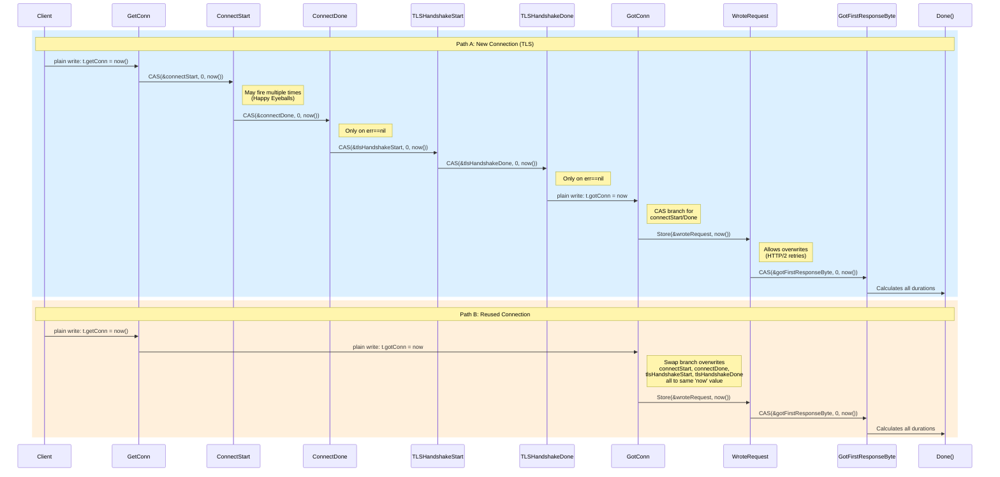
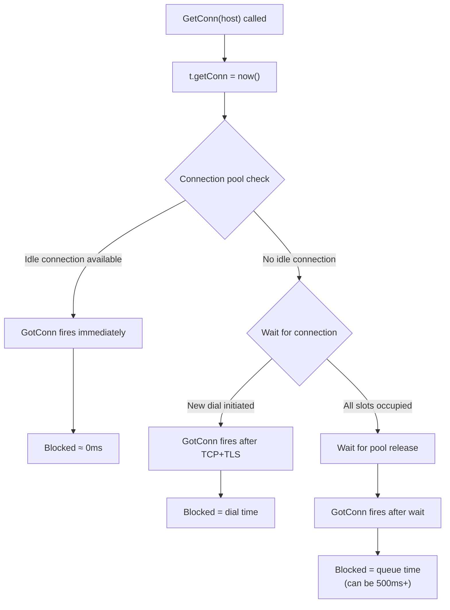
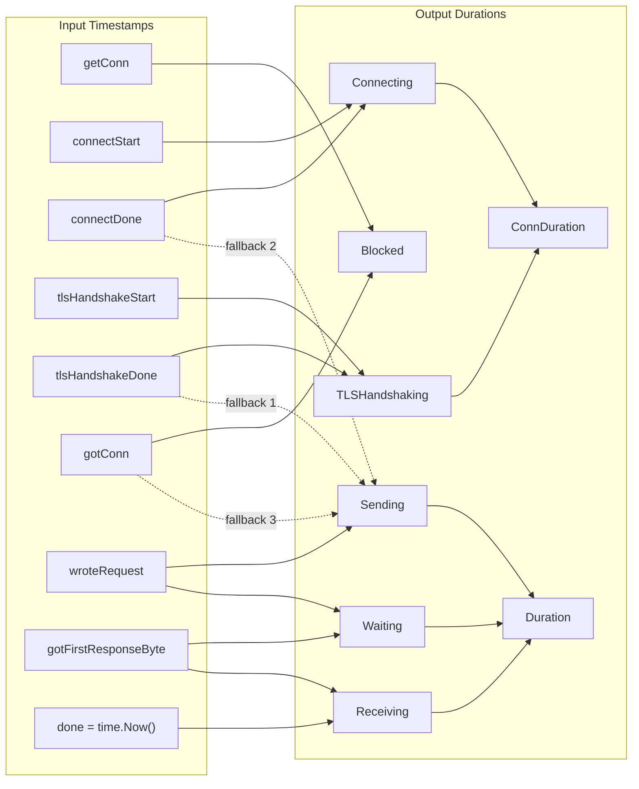

# k6 HTTP Tracer Timing Metrics: Comprehensive Investigation & Q&A

## Document Metadata

| Property | Value |
|----------|-------|
| **Repository** | `go.k6.io/k6` |
| **Branch** | `k6_ddc3b0b1d23c` |
| **Go Version** | 1.21 (toolchain go1.21.13, per `go.mod:3-5`) |
| **Primary File Under Analysis** | `lib/netext/httpext/tracer.go` (385 lines) |
| **Document Type** | Technical Investigation & Q&A Analysis |

---

## Executive Summary

This document provides a definitive, source-code-grounded investigation of the k6 HTTP tracer component (`lib/netext/httpext/tracer.go`) and answers **eight specific observations** reported during load testing. Every conclusion is backed by exact file paths, line numbers, and code logic — no assumptions.

| # | Observation | Verdict |
|---|-------------|---------|
| 1 | Zero Connecting/TLS on subsequent requests | ✅ **Expected behavior by design** — `GotConn()` Swap overwrites timestamps to equal values (`tracer.go:271-277`) |
| 2 | Erratic Blocked timing (~500ms spikes) | ✅ **Expected behavior** — measures real connection pool queuing time (`tracer.go:323-325`) |
| 3 | Windows all-zero metrics | ⚠️ **Known platform limitation** — Windows ~15.6ms timer resolution (`tracer_test.go:33-82`) |
| 4 | Impossible timestamp equality (`connReused==false` yet `connectStart==connectDone==gotConn`) | ⚠️ **Known Go stdlib HTTP/2 bug, handled by k6** — defensive CAS fallback (`tracer.go:279-292`) |
| 5 | Multiple ConnectStart/ConnectDone invocations | ✅ **Expected behavior** — Happy Eyeballs (RFC 6555) dual-stack dialing (`tracer.go:191-222`) |
| 6 | Overall tracer integrity | ✅ **Not broken** — sound concurrent design with atomic operations (`tracer.go:142-384`) |
| 7 | Metric trustworthiness | ✅ **Conditionally trustworthy** — see [Metric Trustworthiness Matrix](#observation-7--metric-trustworthiness-matrix) |
| 8 | Upstream reporting guidance | ℹ️ **No k6 bugs to report; Go stdlib issues already tracked** |

---

## Tracer Architecture Overview

### The `Tracer` Struct

*Source: `lib/netext/httpext/tracer.go:142-159`*

The `Tracer` struct wraps Go's `net/http/httptrace` package to collect granular timing data for each HTTP request. It is explicitly **not safe for reuse** between requests (comment at `tracer.go:145`: "It's NOT safe to reuse Tracers between requests").

```go
// Source: tracer.go:147-159
type Tracer struct {
    getConn              int64
    connectStart         int64
    connectDone          int64
    tlsHandshakeStart    int64
    tlsHandshakeDone     int64
    gotConn              int64
    wroteRequest         int64
    gotFirstResponseByte int64

    connReused     bool
    connRemoteAddr net.Addr
}
```

**Key design decisions:**
- All 8 timestamp fields are `int64` (nanoseconds since epoch) to support Go's `sync/atomic` operations, which require fixed-size integer types.
- The `now()` helper function at `tracer.go:175-177` returns `time.Now().UnixNano()` — the sole timestamp source for all callbacks:
  ```go
  // Source: tracer.go:175-177
  func now() int64 {
      return time.Now().UnixNano()
  }
  ```
- Two non-timestamp fields (`connReused`, `connRemoteAddr`) track connection reuse state and the remote address.

### The `Trail` Struct

*Source: `lib/netext/httpext/tracer.go:14-41`*

The `Trail` struct is the **output** of `tracer.Done()`. It converts the raw `int64` timestamps into human-readable `time.Duration` values:

```go
// Source: tracer.go:14-41
type Trail struct {
    EndTime time.Time

    ConnDuration time.Duration   // Total connect time (Connecting + TLSHandshaking)
    Duration     time.Duration   // Total request duration, excluding DNS and connect

    Blocked        time.Duration // Waiting to acquire a connection.
    Connecting     time.Duration // Connecting to remote host.
    TLSHandshaking time.Duration // Executing TLS handshake.
    Sending        time.Duration // Writing request.
    Waiting        time.Duration // Waiting for first byte.
    Receiving      time.Duration // Receiving response.

    ConnReused     bool
    ConnRemoteAddr net.Addr

    Failed   null.Bool
    Tags     *metrics.TagSet
    Metadata map[string]string
    Samples  []metrics.Sample
}
```

### The `Trace()` Method

*Source: `lib/netext/httpext/tracer.go:162-173`*

`Trace()` returns a `*httptrace.ClientTrace` wired to all 8 handler methods on the `Tracer`:

```go
// Source: tracer.go:162-173
func (t *Tracer) Trace() *httptrace.ClientTrace {
    return &httptrace.ClientTrace{
        GetConn:              t.GetConn,
        ConnectStart:         t.ConnectStart,
        ConnectDone:          t.ConnectDone,
        TLSHandshakeStart:    t.TLSHandshakeStart,
        TLSHandshakeDone:     t.TLSHandshakeDone,
        GotConn:              t.GotConn,
        WroteRequest:         t.WroteRequest,
        GotFirstResponseByte: t.GotFirstResponseByte,
    }
}
```

### Diagram 1: Callback Lifecycle Sequence



### Atomic Operation Inventory

Every callback handler in the `Tracer` uses a specific atomic operation pattern, chosen deliberately based on the callback's concurrency characteristics:

| Callback | Atomic Operation | Line | Reason |
|----------|-----------------|------|--------|
| `GetConn` | Plain write (`t.getConn = now()`) | `tracer.go:188` | First hook called; no concurrent access possible |
| `ConnectStart` | `CompareAndSwapInt64(&t.connectStart, 0, now())` | `tracer.go:201` | Happy Eyeballs may call multiple times; first-write-wins |
| `ConnectDone` | `CompareAndSwapInt64(&t.connectDone, 0, now())` | `tracer.go:218` | Happy Eyeballs; only records on success (`err == nil`) |
| `TLSHandshakeStart` | `CompareAndSwapInt64(&t.tlsHandshakeStart, 0, now())` | `tracer.go:231` | Only first call recorded |
| `TLSHandshakeDone` | `CompareAndSwapInt64(&t.tlsHandshakeDone, 0, now())` | `tracer.go:244` | Only first successful call recorded |
| `GotConn` (reused) | `SwapInt64` on connectStart, connectDone, tlsHandshakeStart, tlsHandshakeDone | `tracer.go:272-276` | Overwrite to prevent stale timestamps from abandoned connections |
| `GotConn` (not reused) | `CompareAndSwapInt64` on same 4 fields | `tracer.go:287-291` | HTTP/2 false-Reused defense; allows retry-safe fallback |
| `WroteRequest` | `StoreInt64(&t.wroteRequest, now())` | `tracer.go:301` | Allows overwrites for HTTP/2 retries (last-write-wins) |
| `GotFirstResponseByte` | `CompareAndSwapInt64(&t.gotFirstResponseByte, 0, now())` | `tracer.go:311` | Only the first response byte matters |

### Transport Lifecycle

*Source: `lib/netext/httpext/transport.go`*

The `transport` struct (unexported) implements `http.RoundTripper` and manages the per-request `Tracer` lifecycle:

1. **`RoundTrip()`** at `transport.go:200-228`:
   - Line 205: Creates a **fresh** `Tracer` instance: `tracer := &Tracer{}`
   - Line 206: Wires the tracer into the request context via `httptrace.WithClientTrace(ctx, tracer.Trace())`
   - Lines 219-225: After the round trip completes, saves the unfinished request (with attached tracer) for later finalization

2. **`measureAndEmitMetrics()`** at `transport.go:77-166`:
   - Line 78: Calls `unfReq.tracer.Done()` to finalize the `Trail`
   - Line 146: Calls `trail.SaveSamples()` to convert durations into metric samples

3. **`processLastSavedRequest()`** at `transport.go:181-198`:
   - Finalizes the last saved request, either when a new request arrives or when `MakeRequest()` finishes reading the response body

### `SaveSamples()` and Metric Emission

*Source: `lib/netext/httpext/tracer.go:44-122`*

`SaveSamples()` emits exactly 8 metric samples (with an optional 9th `HTTPReqFailed` sample added by the transport):

- `http_reqs` (Counter, value: 1)
- `http_req_duration` (Trend, Time)
- `http_req_blocked` (Trend, Time)
- `http_req_connecting` (Trend, Time)
- `http_req_tls_handshaking` (Trend, Time)
- `http_req_sending` (Trend, Time)
- `http_req_waiting` (Trend, Time)
- `http_req_receiving` (Trend, Time)

Duration values are converted to `float64` milliseconds via `metrics.D()` at `metrics/units.go:7-13`:

```go
// Source: metrics/units.go:7-13
const timeUnit = time.Millisecond

func D(d time.Duration) float64 {
    return float64(d) / float64(timeUnit)
}
```

---

## Observation 1 — Zero Connecting/TLS on Reused Connections

### What the User Sees

The first HTTP request to an endpoint shows reasonable values for `connecting` time and `tls_handshaking`, but **all subsequent requests** to the same endpoint report exactly `0` for both metrics, despite network activity being visible.

### What the Code Does

**`GotConn()` handler — reuse branch**

*Source: `lib/netext/httpext/tracer.go:256-294`*

When `GotConn()` is called with `info.Reused == true` (line 262), the tracer executes the reuse branch at lines 271-277:

```go
// Source: tracer.go:257-277 (key excerpt)
now := now()
t.gotConn = now
t.connReused = info.Reused
t.connRemoteAddr = info.Conn.RemoteAddr()

_, isConnTLS := info.Conn.(*tls.Conn)
if info.Reused {
    atomic.SwapInt64(&t.connectStart, now)      // line 272
    atomic.SwapInt64(&t.connectDone, now)        // line 273
    if isConnTLS {
        atomic.SwapInt64(&t.tlsHandshakeStart, now) // line 275
        atomic.SwapInt64(&t.tlsHandshakeDone, now)  // line 276
    }
}
```

This sets `connectStart = connectDone = now`, so when `Done()` calculates durations at lines 340-345:

```go
// Source: tracer.go:340-345
if connectDone != 0 && connectStart != 0 {
    trail.Connecting = time.Duration(connectDone - connectStart)  // = 0
}
if tlsHandshakeDone != 0 && tlsHandshakeStart != 0 {
    trail.TLSHandshaking = time.Duration(tlsHandshakeDone - tlsHandshakeStart)  // = 0
}
```

Both durations compute to `0` because the start and end timestamps are identical.

### Why This Happens

When a connection is reused from Go's idle connection pool, **no TCP handshake or TLS negotiation occurs**. The tracer intentionally sets all four connection timestamps to the same `now` value using `Swap` (unconditional overwrite). The comment at `tracer.go:265-269` explains the rationale:

> The Go stdlib's http module can start connecting to a remote server, only to abandon that connection even before it was fully established and reuse a recently freed already existing connection. We overwrite the different timestamps here, so the other callbacks don't put incorrect values in them (they use CompareAndSwap).

The `Swap` is necessary (rather than just leaving fields at zero) because `ConnectStart`/`ConnectDone` callbacks may have already fired for an abandoned connection attempt before Go decided to reuse an existing connection. The `Swap` overwrites any stale timestamps from that abandoned attempt.

### Test Evidence

*Source: `lib/netext/httpext/tracer_test.go:115-174`*

The `TestTracer` function explicitly tests this behavior:

```go
// Source: tracer_test.go:115
for tnum, isReuse := range []bool{false, true, true} {
```

It runs three iterations: one new connection, then two reused connections. For reused connections, the test **asserts zero values** at lines 161-165:

```go
// Source: tracer_test.go:161-165
case builtinMetrics.HTTPReqConnecting, builtinMetrics.HTTPReqTLSHandshaking:
    if isReuse {
        assert.Equal(t, 0.0, s.Value)
        break
    }
```

### Verdict

✅ **Expected behavior by intentional design.** Zero `Connecting` and `TLSHandshaking` values for reused connections are correct because no TCP/TLS negotiation actually occurs. The tracer's `Swap`-based overwrite at `tracer.go:272-276` ensures clean zero durations even if abandoned connection attempt callbacks had previously fired.

---

## Observation 2 — Erratic Blocked Timing Values

### What the User Sees

The `blocked` metric intermittently shows massive values (~500ms) for some requests and near-zero for identical requests to the same endpoint, with no apparent pattern.

### What the Code Does

**`Done()` — Blocked calculation**

*Source: `lib/netext/httpext/tracer.go:323-325`*

```go
// Source: tracer.go:323-325
if t.gotConn != 0 && t.getConn != 0 && t.gotConn > t.getConn {
    trail.Blocked = time.Duration(t.gotConn - t.getConn)
}
```

`Blocked` measures the elapsed time between:
- `t.getConn`: Set by `GetConn()` at `tracer.go:188` when the HTTP client **requests** a connection from the pool
- `t.gotConn`: Set by `GotConn()` at `tracer.go:261` when a connection is **acquired**

This is **connection pool queuing time**, not network latency.

**`GetConn()` semantics**

*Source: `lib/netext/httpext/tracer.go:179-189`*

The comment at lines 179-186 clarifies: `GetConn` is called even when an idle cached connection is available, but is NOT called when a connection is reused via redirect.

**Transport configuration**

*Source: `js/runner.go:193-201`*

```go
// Source: js/runner.go:199-200
MaxIdleConns:        int(r.Bundle.Options.Batch.Int64),
MaxIdleConnsPerHost: int(r.Bundle.Options.BatchPerHost.Int64),
```

`MaxIdleConnsPerHost` (controlled by the k6 `batchPerHost` option) limits how many idle connections are kept per host. When all connections are in use, subsequent requests **block** in Go's transport layer waiting for a connection to free up.

### Why This Happens

The large `Blocked` values represent genuine time spent waiting in Go's connection pool. When `MaxIdleConnsPerHost` is saturated during high-concurrency load tests, new requests queue until a previously-active connection completes its response and is returned to the pool. The variation is expected because:

1. **Pool availability fluctuates** with concurrent request completion timing
2. A request arriving when a connection just freed up sees `Blocked ≈ 0`
3. A request arriving when all connections are busy sees `Blocked = wait time` (can be 100ms–1000ms+ depending on server response time)

### Diagram 3: Blocked Timing Flowchart



### Verdict

✅ **Expected behavior reflecting real connection pool contention.** High `Blocked` values indicate the test is saturating its connection pool. To reduce queuing, increase `MaxIdleConnsPerHost` by raising the k6 `batchPerHost` option in test configuration.

---

## Observation 3 — Windows All-Zero Metrics

### What the User Sees

On a Windows test machine, ALL timing metrics (`connecting`, `tls_handshaking`, `blocked`, `sending`, `waiting`, `receiving`) occasionally return `0` for random requests, suggesting a possible race condition.

### What the Code Does

**Windows-specific test workaround**

*Source: `lib/netext/httpext/tracer_test.go:28-82`*

The test suite contains an explicit Windows workaround:

```go
// Source: tracer_test.go:28
const traceDelay = 100 * time.Millisecond
```

```go
// Source: tracer_test.go:33-40
if runtime.GOOS == "windows" {
    // HACK: Time resolution is not as accurate on Windows, see:
    //  https://github.com/golang/go/issues/8687
    //  https://github.com/golang/go/issues/41087
    // Which seems to be causing some metrics to have a value of 0,
    // since e.g. ConnectStart and ConnectDone could register the same time.
    // So we force delays in the ClientTrace event handlers
    // to hopefully reduce the chances of this happening.
```

Each callback handler is wrapped with `time.Sleep(traceDelay)` (100ms) to ensure timestamps differ on Windows. For example, the `ConnectStart` wrapper at `tracer_test.go:42-46`:

```go
// Source: tracer_test.go:42-46
ConnectStart: func(a, n string) {
    t.Logf("called ConnectStart at\t\t%v\n", now())
    time.Sleep(traceDelay)
    tracer.ConnectStart(a, n)
},
```

Additionally, `TestTracer` inserts an extra delay before `Done()` on Windows at `tracer_test.go:128-130`:

```go
// Source: tracer_test.go:128-130
if runtime.GOOS == "windows" {
    time.Sleep(traceDelay)
}
```

**Root cause: `now()` resolution on Windows**

*Source: `lib/netext/httpext/tracer.go:175-177`*

```go
func now() int64 {
    return time.Now().UnixNano()
}
```

On Windows, `time.Now()` relies on the system clock interrupt, which defaults to ~15.625ms resolution (64 interrupts per second). When consecutive callbacks fire within the same 15.6ms timer tick, `time.Now().UnixNano()` returns **identical values**. This means:

- `ConnectStart` and `ConnectDone` can record the same nanosecond value
- `Connecting = connectDone - connectStart = 0`
- The same applies to all other adjacent callback pairs

### Go Version Context

*Source: `go.mod:3-5`*

```
go 1.21
toolchain go1.21.13
```

The k6 repository uses Go 1.21. Go 1.23 introduced improved high-resolution timer support on Windows, but k6 on Go 1.21 does NOT benefit from these improvements.

### Why This Happens

Windows' default system clock resolution (~15.6ms) means rapid sequential callbacks within the same HTTP request can produce identical `time.Now().UnixNano()` values. For fast local or LAN connections where the entire TCP handshake, TLS negotiation, request send, and first response byte all complete within a single 15.6ms timer tick, **all timing durations compute to zero**.

The k6 test suite acknowledges this by injecting artificial 100ms delays between callbacks on Windows — a pragmatic workaround for testing only, not applied in production.

### Verdict

⚠️ **Known platform limitation, not a k6 bug.** Windows' timer resolution causes timing granularity issues. This is documented in Go issues [#8687](https://github.com/golang/go/issues/8687) and [#41087](https://github.com/golang/go/issues/41087). Upgrading to Go 1.23+ may partially improve this, but sub-millisecond timer resolution is fundamentally a Windows OS characteristic.

---

## Observation 4 — Impossible Timestamp Equality

### What the User Sees

Internal tracer state sometimes shows a connection flagged as "not reused" (`connReused == false`) while `connectStart`, `connectDone`, and `gotConn` timestamps are all identical — which should be impossible if a real TCP handshake occurred.

### What the Code Does

**`GotConn()` — non-reuse branch (else)**

*Source: `lib/netext/httpext/tracer.go:278-293`*

```go
// Source: tracer.go:278-293
} else {
    // There's a bug in the Go stdlib where an HTTP/2 connection can be reused
    // but the httptrace.GotConnInfo struct will contain a false Reused property...
    // That's probably from a previously made connection that was abandoned and
    // directly put in the connection pool in favor of a just-freed already
    // established connection...
    //
    // Using CompareAndSwap here because the HTTP/2 roundtripper has retries and
    // it's possible this isn't actually the first request attempt...
    atomic.CompareAndSwapInt64(&t.connectStart, 0, now)     // line 287
    atomic.CompareAndSwapInt64(&t.connectDone, 0, now)       // line 288
    if isConnTLS {
        atomic.CompareAndSwapInt64(&t.tlsHandshakeStart, 0, now) // line 290
        atomic.CompareAndSwapInt64(&t.tlsHandshakeDone, 0, now)  // line 291
    }
}
```

### Mechanism Walkthrough

Here is the step-by-step chain that produces the "impossible" equality:

1. **HTTP/2 transport reuses a connection** but reports `GotConnInfo{Reused: false}` — this is a known Go stdlib bug documented in the comment at `tracer.go:279-283`.

2. Since `Reused == false`, the code enters the **else branch** at line 278.

3. Because the connection WAS actually reused, `ConnectStart` and `ConnectDone` callbacks **were never called** — so `t.connectStart == 0` and `t.connectDone == 0`.

4. The CAS operations execute:
   - `CAS(&t.connectStart, 0, now)` — sees `0`, succeeds → writes `now`
   - `CAS(&t.connectDone, 0, now)` — sees `0`, succeeds → writes the **same** `now`

5. The `now` variable was captured at line 257: `now := now()`. This same `now` was already assigned to `t.gotConn` at line 261: `t.gotConn = now`.

6. **Result:** `connectStart == connectDone == gotConn` — all three equal the same `now` value.

### Why This Happens

Go's HTTP/2 transport sometimes reports `Reused: false` for connections that are actually being reused. The k6 code **defensively** handles this by using `CAS(0, now)` instead of `Swap(now)` in the non-reused branch. The logic is:

- If `ConnectStart`/`ConnectDone` DID fire (real new connection), their CAS at the earlier callbacks already wrote non-zero values. The CAS here **fails silently** — no overwrite occurs.
- If `ConnectStart`/`ConnectDone` did NOT fire (false non-reuse from HTTP/2 bug), their fields are still `0`, so the CAS **succeeds** and writes `now`. This produces `Connecting = connectDone - connectStart = 0`, which is the **correct** result for what was actually a reused connection.

The CAS (rather than Swap) is also needed because HTTP/2 round trippers may retry requests, so this might not be the first `GotConn` call for this tracer instance (comment at `tracer.go:285-286`).

### Verdict

⚠️ **Known Go stdlib bug, defensively handled by k6.** The "impossible" timestamp equality is actually k6's defensive CAS logic producing the **correct timing** (zero connection duration) even when the Go stdlib provides incorrect reuse information. The comment at `tracer.go:279-286` explicitly documents this known stdlib bug and the defensive strategy.

---

## Observation 5 — Multiple ConnectStart/ConnectDone Calls

### What the User Sees

The `ConnectStart` and `ConnectDone` `httptrace` hooks fire **multiple times** for a single HTTP request, raising concern about double-counting of connection timing.

### What the Code Does

**`ConnectStart()`**

*Source: `lib/netext/httpext/tracer.go:191-202`*

```go
// Source: tracer.go:191-202
// ConnectStart is called when a new connection's Dial begins.
// If net.Dialer.DualStack (IPv6 "Happy Eyeballs") support is
// enabled (default), this may be called multiple times.
//
// If the connection is reused, this won't be called. Otherwise,
// it will be called after GetConn() and before ConnectDone().
func (t *Tracer) ConnectStart(_, _ string) {
    // If using dual-stack dialing, it's possible to get this
    // multiple times, so the atomic compareAndSwap ensures
    // that only the first call's time is recorded
    atomic.CompareAndSwapInt64(&t.connectStart, 0, now())
}
```

**`ConnectDone()`**

*Source: `lib/netext/httpext/tracer.go:204-222`*

```go
// Source: tracer.go:204-222
// ConnectDone is called when a new connection's Dial
// completes. The provided err indicates whether the
// connection completed successfully.
// If net.Dialer.DualStack ("Happy Eyeballs") support is
// enabled (default), this may be called multiple times.
func (t *Tracer) ConnectDone(_, _ string, err error) {
    // If using dual-stack dialing, it's possible to get this
    // multiple times, so the atomic compareAndSwap ensures
    // that only the first call's time is recorded
    if err == nil {
        atomic.CompareAndSwapInt64(&t.connectDone, 0, now())
    }
    // if there is an error it either is happy eyeballs related and doesn't matter
    // or it will be returned by the http call
}
```

### Happy Eyeballs (RFC 6555) Explanation

When connecting to a host that has both IPv4 (A) and IPv6 (AAAA) DNS records, Go's dialer implements the "Happy Eyeballs" algorithm ([RFC 6555](https://www.rfc-editor.org/rfc/rfc6555)):

1. It initiates **parallel** connection attempts on both IPv4 and IPv6
2. Each attempt triggers its own `ConnectStart`/`ConnectDone` callback pair
3. The first successful connection wins; the other is abandoned

**k6's handling:**

- `CAS(&t.connectStart, 0, now())` — The `CompareAndSwap` atomically checks if the field is still `0` (unset). Only the **first** call succeeds. Subsequent calls from parallel dial attempts see a non-zero value and CAS **fails silently** — the timestamp is NOT overwritten.
- For `ConnectDone`, only successful completions (`err == nil`) are recorded at line 218. Failed attempts (common with Happy Eyeballs when one address family fails) are ignored per the comment at lines 220-221.

### Verdict

✅ **Expected behavior, correctly handled.** Multiple `ConnectStart`/`ConnectDone` calls are documented behavior of Go's `net/http/httptrace` package when dual-stack dialing is active. k6's `CompareAndSwapInt64` first-write-wins pattern correctly records only the first attempt's timestamp, preventing double-counting.

---

## Observation 6 — Overall Tracer Integrity Assessment

### What the User Asks

Is the HTTP tracer component fundamentally broken in its measurement approach?

### Design Philosophy Analysis

**1. Single-use per request**

*Source: `transport.go:205`*

A fresh `Tracer` is created for every HTTP round trip:

```go
// Source: transport.go:205
tracer := &Tracer{}
```

The comment at `tracer.go:145` states: "It's NOT safe to reuse Tracers between requests." This eliminates cross-request data contamination.

**2. Atomic operations for concurrent callback safety**

Every callback handler uses an appropriate atomic operation (see the [Atomic Operation Inventory](#atomic-operation-inventory) table). There are no unprotected writes to shared timestamp fields.

**3. Late-callback awareness**

*Source: `lib/netext/httpext/tracer.go:327-338`*

```go
// Source: tracer.go:327-331
// It's possible for some of the methods of httptrace.ClientTrace to
// actually be called after the http.Client or http.RoundTripper have
// already returned our result and we've called Done(). This happens
// mostly for cancelled requests, but we have to use atomics here as
// well (or use global Tracer locking) so we can avoid data races.
```

All 7 timestamp reads (excluding `getConn`) in `Done()` use `atomic.LoadInt64` at lines 332-338:

```go
// Source: tracer.go:332-338
connectStart := atomic.LoadInt64(&t.connectStart)
connectDone := atomic.LoadInt64(&t.connectDone)
tlsHandshakeStart := atomic.LoadInt64(&t.tlsHandshakeStart)
tlsHandshakeDone := atomic.LoadInt64(&t.tlsHandshakeDone)
gotConn := atomic.LoadInt64(&t.gotConn)
wroteRequest := atomic.LoadInt64(&t.wroteRequest)
gotFirstResponseByte := atomic.LoadInt64(&t.gotFirstResponseByte)
```

### Correctness Review of All 8 Callback Handlers

| # | Handler | Line | Operation | Safety Analysis |
|---|---------|------|-----------|----------------|
| 1 | `GetConn` | 188 | Plain write | Safe — always the first callback, no concurrency possible |
| 2 | `ConnectStart` | 201 | CAS(0, now) | Safe — handles Happy Eyeballs multi-call; first-write-wins |
| 3 | `ConnectDone` | 218 | CAS(0, now) | Safe — handles Happy Eyeballs; only on `err == nil` |
| 4 | `TLSHandshakeStart` | 231 | CAS(0, now) | Safe — first-write-wins |
| 5 | `TLSHandshakeDone` | 244 | CAS(0, now) | Safe — first-write-wins; only on `err == nil` |
| 6 | `GotConn` | 261-293 | Plain writes + Swap/CAS | Safe — plain writes for non-atomic fields (lines 259-260 comment: "shouldn't be called multiple times"); Swap/CAS for timestamps |
| 7 | `WroteRequest` | 301 | Store(now) | Safe — intentionally allows overwrites for HTTP/2 retries |
| 8 | `GotFirstResponseByte` | 311 | CAS(0, now) | Safe — first-byte-wins |

### Stress Test Evidence

*Source: `lib/netext/httpext/tracer_test.go:257-292`*

`TestCancelledRequest` stress-tests the tracer with 200 parallel goroutines, each making an HTTP request and cancelling it at a random time between 0-50ms:

```go
// Source: tracer_test.go:282-291
t.Run("group", func(t *testing.T) {
    t.Parallel()
    for i := 0; i < 200; i++ {
        t.Run(fmt.Sprintf("TestCancelledRequest_%d", i),
            func(t *testing.T) {
                t.Parallel()
                cancelTest(t)
            })
    }
})
```

This test specifically validates that the `Done()` method's atomic reads don't race with late-firing callbacks — it would trigger Go's race detector if any data race existed.

### Verdict

✅ **The tracer is NOT fundamentally broken.** The design follows sound concurrent programming principles:
- Single-use instances prevent cross-request contamination
- Appropriate atomic operations for each access pattern (CAS, Swap, Store, Load)
- Defensive CAS handling for known Go stdlib bugs
- Late-callback awareness via atomic loads in `Done()`

The edge cases users observe are inherent to the `httptrace` callback contract and HTTP/2 protocol behavior, not tracer implementation bugs.

---

## Observation 7 — Metric Trustworthiness Matrix

### What the User Asks

Can the HTTP timing values be reliably used for performance analysis?

### HTTP Metric Registry

*Source: `metrics/builtin.go:15-23, 89-97`*

All HTTP timing metrics are registered with their types:

| Metric Name | Registered As | Unit |
|-------------|--------------|------|
| `http_reqs` | Counter | count |
| `http_req_duration` | Trend, Time | ms |
| `http_req_blocked` | Trend, Time | ms |
| `http_req_connecting` | Trend, Time | ms |
| `http_req_tls_handshaking` | Trend, Time | ms |
| `http_req_sending` | Trend, Time | ms |
| `http_req_waiting` | Trend, Time | ms |
| `http_req_receiving` | Trend, Time | ms |
| `http_req_failed` | Rate | ratio |

Time values are converted from `time.Duration` to `float64` milliseconds by `metrics.D()` at `metrics/units.go:11-13`.

### Metric Trustworthiness Matrix

| Metric | New Conn (HTTP/1.1) | Reused Conn (HTTP/1.1) | Reused Conn (HTTP/2) | Windows (any) |
|--------|:---:|:---:|:---:|:---:|
| `http_req_blocked` | ✅ Reliable | ✅ Reliable (pool queue time) | ✅ Reliable | ⚠️ May be 0 |
| `http_req_connecting` | ✅ Reliable | ℹ️ Always 0 (by design) | ℹ️ Always 0 (may show false `connReused`) | ⚠️ May be 0 |
| `http_req_tls_handshaking` | ✅ Reliable | ℹ️ Always 0 (by design) | ℹ️ Always 0 (may show false `connReused`) | ⚠️ May be 0 |
| `http_req_sending` | ✅ Reliable | ✅ Reliable | ✅ Reliable (measures last write attempt) | ⚠️ May be 0 |
| `http_req_waiting` | ✅ Reliable | ✅ Reliable | ✅ Reliable | ⚠️ May be 0 |
| `http_req_receiving` | ✅ Reliable | ✅ Reliable | ✅ Reliable | ⚠️ May be 0 |
| `http_req_duration` | ✅ Reliable | ✅ Reliable | ✅ Reliable | ⚠️ May be 0 |
| `http_req_failed` | ✅ Reliable | ✅ Reliable | ✅ Reliable | ✅ Reliable |

**Legend:**
- ✅ **Reliable:** Value accurately reflects the measured phase
- ℹ️ **Always 0:** Zero is the CORRECT value — no work was done in this phase for a reused connection
- ⚠️ **May be 0:** Windows timer resolution (~15.6ms) may produce zero values for sub-15ms phases

### Duration Formula

*Source: `lib/netext/httpext/tracer.go:378-381`*

```go
// Source: tracer.go:378-381
// Calculate total times using adjusted values.
trail.EndTime = done
trail.ConnDuration = trail.Connecting + trail.TLSHandshaking
trail.Duration = trail.Sending + trail.Waiting + trail.Receiving
```

**Important:** `Duration` EXCLUDES `Blocked` and connection time — it only measures the request/response cycle (send + wait + receive).

### Sending Duration Fallback Chain

*Source: `lib/netext/httpext/tracer.go:346-359`*

The `Sending` calculation uses a three-level fallback to determine the "start of sending" timestamp:

```go
// Source: tracer.go:346-359
if wroteRequest != 0 {
    switch {
    case tlsHandshakeDone != 0:
        // TLS connection: sending starts after TLS handshake
        trail.Sending = time.Duration(wroteRequest - tlsHandshakeDone)
    case connectDone != 0:
        // Non-TLS connection: sending starts after TCP connect
        trail.Sending = time.Duration(wroteRequest - connectDone)
    default:
        // HTTP/2 false-reuse case: use gotConn as fallback
        trail.Sending = time.Duration(wroteRequest - gotConn)
    }
```

### Diagram 4: Duration Calculation Dependency Graph



### Practical Recommendations

1. **On Linux/macOS:** All metrics are trustworthy for performance analysis across all connection types
2. **On Windows:** Treat sub-15ms metric values with caution — aggregate over many samples for statistical accuracy
3. **`Connecting = 0` and `TLSHandshaking = 0` on reused connections is CORRECT** — do not filter these as measurement errors
4. **High `Blocked` values** indicate connection pool saturation — tune the k6 `batchPerHost` option to increase `MaxIdleConnsPerHost`
5. **`Duration` (= Sending + Waiting + Receiving)** is the most universally reliable composite metric, as it uses `time.Now()` for the endpoint and is least affected by connection-layer edge cases

### Verdict

✅ **Conditionally trustworthy.** On Linux/macOS, all metrics accurately reflect the measured phase. On Windows, timer resolution introduces noise for fast operations. In all cases, zero values for reused connections are correct, not bugs.

---

## Observation 8 — Upstream Reporting Guidance

### What the User Asks

Should any of these behaviors be reported as bugs to k6 or Go stdlib maintainers?

### k6-Specific Issues: None Warranted

Every observed behavior traces to intentional design or defensive handling:

| Behavior | k6's Handling | Bug? |
|----------|---------------|------|
| Zero connecting/TLS on reuse | `Swap` overwrite at `tracer.go:272-276` | No — by design |
| Erratic blocked timing | `gotConn - getConn` formula at `tracer.go:323-325` | No — measures real pool contention |
| Windows all-zero metrics | Acknowledged in `tracer_test.go:33-40` | No — platform limitation |
| Impossible timestamp equality | CAS fallback at `tracer.go:287-291` | No — defensive handling |
| Multiple Connect callbacks | CAS at `tracer.go:201, 218` | No — correctly handles Happy Eyeballs |
| Atomic operation correctness | All 8 handlers use appropriate atomics | No — sound design |

### Go Stdlib Issues: Already Tracked

| Issue | Go Issue | Status | Referenced In |
|-------|----------|--------|--------------|
| HTTP/2 `GotConn.Reused` false-negative | [golang/go#27753](https://github.com/golang/go/issues/27753) | Open/Tracked | `tracer.go:279-283` comment |
| Windows timer resolution (`time.Now()`) | [golang/go#8687](https://github.com/golang/go/issues/8687) | Known | `tracer_test.go:35` comment |
| Windows timer resolution (sleep) | [golang/go#41087](https://github.com/golang/go/issues/41087) | Known | `tracer_test.go:36` comment |
| httptrace/persistConn race condition | [golang/go#59310](https://github.com/golang/go/issues/59310) | Open/Tracked | External research |

### Verdict

ℹ️ **No bugs to report to k6.** All observed behaviors are either intentional design choices, known platform limitations, or Go stdlib issues that are already tracked in the Go issue tracker. Users should monitor Go stdlib issue progress for improvements, particularly:
- The HTTP/2 `GotConn.Reused` false-negative (would eliminate Observation 4)
- Windows timer resolution improvements in Go 1.23+ (would reduce Observation 3)

---

## Supplementary Findings

### Supplementary A: `LookingUp` Field Gap

*Source: `lib/netext/httpext/response.go:35-44`*

The `ResponseTimings` struct exposes a `LookingUp` field:

```go
// Source: response.go:35-44
type ResponseTimings struct {
    Duration       float64 `json:"duration"`
    Blocked        float64 `json:"blocked"`
    LookingUp      float64 `json:"looking_up"`      // <-- NEVER POPULATED
    Connecting     float64 `json:"connecting"`
    TLSHandshaking float64 `json:"tls_handshaking"`
    Sending        float64 `json:"sending"`
    Waiting        float64 `json:"waiting"`
    Receiving      float64 `json:"receiving"`
}
```

However, `updateK6Response()` at `request.go:98-106` does **not** set `LookingUp`:

```go
// Source: request.go:98-106
k6Response.Timings = ResponseTimings{
    Duration:       metrics.D(trail.Duration),
    Blocked:        metrics.D(trail.Blocked),
    // LookingUp is NOT set — field remains 0.0
    Connecting:     metrics.D(trail.Connecting),
    TLSHandshaking: metrics.D(trail.TLSHandshaking),
    Sending:        metrics.D(trail.Sending),
    Waiting:        metrics.D(trail.Waiting),
    Receiving:      metrics.D(trail.Receiving),
}
```

**Root cause:** The `Trail` struct at `tracer.go:14-41` has no `LookingUp` field, and the `Tracer.Trace()` method at `tracer.go:162-173` does not wire `DNSStart`/`DNSDone` hooks. Users who read the JSON output and see `looking_up: 0` should **not** expect DNS timing data — it is a known documentation gap.

### Supplementary B: `WroteRequest` Retry Semantics

*Source: `lib/netext/httpext/tracer.go:296-304`*

```go
// Source: tracer.go:296-304
// WroteRequest is called with the result of writing the
// request and any body. It may be called multiple times
// in the case of retried requests.
func (t *Tracer) WroteRequest(info httptrace.WroteRequestInfo) {
    if info.Err == nil {
        atomic.StoreInt64(&t.wroteRequest, now())
    }
    // if there is an error it will be returned by the http call
}
```

Unlike other handlers that use CAS (first-write-wins), `WroteRequest` uses `Store` (**last-write-wins**). This is intentional: when HTTP/2 retries a request, the `Sending` duration should measure the **last successful write**, not the first failed attempt.

**Implication:** `Sending` does not represent cumulative write time across retries. It measures only the duration of the final successful write.

### Supplementary C: `Done()` Late-Callback Race Awareness

*Source: `lib/netext/httpext/tracer.go:327-338`*

The comment at lines 327-331 acknowledges that httptrace callbacks can fire **after** `Done()` is called:

```go
// Source: tracer.go:327-331
// It's possible for some of the methods of httptrace.ClientTrace to
// actually be called after the http.Client or http.RoundTripper have
// already returned our result and we've called Done(). This happens
// mostly for cancelled requests, but we have to use atomics here as
// well (or use global Tracer locking) so we can avoid data races.
```

All timestamp reads in `Done()` use `atomic.LoadInt64` (lines 332-338) to prevent data races. This means metrics are **best-effort snapshots**, not transactional reads. The test at `tracer_test.go:257-292` (`TestCancelledRequest`) validates this with 200 parallel cancellations.

### Supplementary D: HTTP/2 Enabled by Default

*Source: `js/runner.go:203-207`*

```go
// Source: js/runner.go:203-207
if r.forceHTTP1() {
    transport.TLSNextProto = make(map[string]func(string, *tls.Conn) http.RoundTripper)
} else {
    _ = http2.ConfigureTransport(transport) // line 206 — HTTP/2 enabled
}
```

The `forceHTTP1()` method at `js/runner.go:255-271` only returns `true` when the `GODEBUG` environment variable contains `http2client=0`. This means **HTTP/2 is enabled by default** in k6, and ALL HTTP/2-specific tracer edge cases (Observations 4 and 5) apply to typical k6 usage without any special configuration.

---

## Diagram 2: Tracer State Transitions

The following diagram shows how each `Tracer` timestamp field transitions from its initial zero value through the callback lifecycle for three connection scenarios:

```mermaid
flowchart TB
    subgraph "Scenario A: New TLS Connection"
        A1["All fields = 0<br/>(initial state)"]
        A2["getConn = T1<br/>(GetConn: plain write)"]
        A3["connectStart = T2<br/>(ConnectStart: CAS 0→T2)"]
        A4["connectDone = T3<br/>(ConnectDone: CAS 0→T3)"]
        A5["tlsHandshakeStart = T4<br/>(TLSHandshakeStart: CAS 0→T4)"]
        A6["tlsHandshakeDone = T5<br/>(TLSHandshakeDone: CAS 0→T5)"]
        A7["gotConn = T6<br/>(GotConn: plain write)"]
        A8["wroteRequest = T7<br/>(WroteRequest: Store T7)"]
        A9["gotFirstResponseByte = T8<br/>(GotFirstResponseByte: CAS 0→T8)"]
        A1 --> A2 --> A3 --> A4 --> A5 --> A6 --> A7 --> A8 --> A9
    end

    subgraph "Scenario B: Reused Connection"
        B1["All fields = 0<br/>(initial state)"]
        B2["getConn = T1<br/>(GetConn: plain write)"]
        B3["gotConn = T2<br/>(GotConn: plain write)"]
        B4["connectStart = T2, connectDone = T2<br/>tlsHandshakeStart = T2, tlsHandshakeDone = T2<br/>(GotConn reuse: Swap all to T2)"]
        B5["wroteRequest = T3<br/>(WroteRequest: Store T3)"]
        B6["gotFirstResponseByte = T4<br/>(GotFirstResponseByte: CAS 0→T4)"]
        B1 --> B2 --> B3 --> B4 --> B5 --> B6
    end

    subgraph "Scenario C: HTTP/2 False Non-Reuse"
        C1["All fields = 0<br/>(initial state)"]
        C2["getConn = T1<br/>(GetConn: plain write)"]
        C3["gotConn = T2<br/>(GotConn: plain write)"]
        C4["connectStart = T2, connectDone = T2<br/>(GotConn else: CAS 0→T2, succeeds)"]
        C5["wroteRequest = T3<br/>(WroteRequest: Store T3)"]
        C6["gotFirstResponseByte = T4<br/>(GotFirstResponseByte: CAS 0→T4)"]
        C1 --> C2 --> C3 --> C4 --> C5 --> C6
    end
```



**Key difference between Scenarios B and C:**
- **Scenario B** (genuine reuse): `info.Reused == true`, so `Swap` is used (unconditional overwrite). `connReused` is set to `true`.
- **Scenario C** (HTTP/2 false non-reuse): `info.Reused == false` (Go bug), so `CAS(0, now)` is used. CAS succeeds because fields are still zero (no `ConnectStart`/`ConnectDone` callbacks fired). `connReused` is falsely set to `false`, but the resulting durations are still correctly zero.

---

## Per-Observation Verdict Summary

| # | Observation | Verdict | Root Cause | Key Source |
|---|-------------|---------|------------|------------|
| 1 | Zero Connecting/TLS on reuse | ✅ Expected | `GotConn` Swap overwrites all timestamps to same `now` | `tracer.go:272-276` |
| 2 | Erratic Blocked timing | ✅ Expected | `Blocked = gotConn - getConn` measures pool queuing | `tracer.go:323-325` |
| 3 | Windows all-zero metrics | ⚠️ Platform limitation | Windows ~15.6ms timer resolution | `tracer_test.go:33-82` |
| 4 | Impossible timestamp equality | ⚠️ Go stdlib bug (handled) | HTTP/2 false `Reused` + CAS fallback fills zeros | `tracer.go:279-292` |
| 5 | Multiple Connect callbacks | ✅ Expected | Happy Eyeballs dual-stack dialing | `tracer.go:191-222` |
| 6 | Tracer integrity | ✅ Not broken | Sound atomic design, single-use instances | `tracer.go:142-384` |
| 7 | Metric trustworthiness | ✅ Conditional | Reliable on Linux/macOS; Windows has timer noise | See trust matrix |
| 8 | Upstream reporting | ℹ️ No action needed | All issues are by-design or already tracked | N/A |

---

## References

### Source Files Cited

| File | Key Line Ranges | Purpose |
|------|----------------|---------|
| `lib/netext/httpext/tracer.go` | 14-41, 44-122, 142-159, 162-177, 179-189, 191-202, 204-222, 224-232, 234-247, 249-294, 296-304, 306-312, 314-384 | Core tracer: struct definitions, all 8 callbacks, `Done()` calculation, `Trail` struct, `SaveSamples()` |
| `lib/netext/httpext/tracer_test.go` | 28-86, 88-175, 191-237, 257-292 | Windows workaround, connection reuse tests, negative timing tests, cancellation stress tests |
| `lib/netext/httpext/transport.go` | 20-28, 54-71, 77-166, 181-198, 200-228 | Transport lifecycle: per-request `Tracer` creation, metric finalization |
| `lib/netext/httpext/request.go` | 87-107 | `updateK6Response()` populating `ResponseTimings` from `Trail` |
| `lib/netext/httpext/response.go` | 34-44 | `ResponseTimings` struct with unpopulated `LookingUp` field |
| `metrics/builtin.go` | 15-23, 51-59, 89-97 | HTTP metric constant names, `BuiltinMetrics` struct fields, metric registration |
| `metrics/units.go` | 7-13 | `D()` function converting `time.Duration` to `float64` milliseconds |
| `js/runner.go` | 193-207, 255-271 | Transport configuration (MaxIdleConns, HTTP/2), `forceHTTP1()` |
| `lib/netext/httpext/error_codes.go` | 25-50 | Error code definitions: dial timeout (1211), request timeout (1050), TLS errors (1300+) |
| `lib/netext/dialer.go` | 16-36 | Custom `Dialer` wrapping `net.Dialer` with DNS resolution and blacklisting |
| `go.mod` | 1-5 | Module `go.k6.io/k6`, Go 1.21, toolchain go1.21.13 |

### External References

| Source | URL | Relevance |
|--------|-----|-----------|
| Go `net/http/httptrace` package documentation | https://pkg.go.dev/net/http/httptrace | Authoritative callback contract |
| Go Blog — HTTP Tracing | https://go.dev/blog/http-tracing | Official introduction to httptrace hooks |
| Go Issue #8687 (Windows timer) | https://github.com/golang/go/issues/8687 | Windows system clock resolution |
| Go Issue #41087 (Windows timer) | https://github.com/golang/go/issues/41087 | Windows timer resolution affecting `time.Now()` |
| Go Issue #27753 (HTTP/2 MaxConnsPerHost) | https://github.com/golang/go/issues/27753 | HTTP/2 `GotConn.Reused` false-negative |
| Go Issue #59310 (persistConn race) | https://github.com/golang/go/issues/59310 | Race in Go's stdlib transport with httptrace hooks |
| RFC 6555 (Happy Eyeballs) | https://www.rfc-editor.org/rfc/rfc6555 | Dual-stack connection algorithm |
