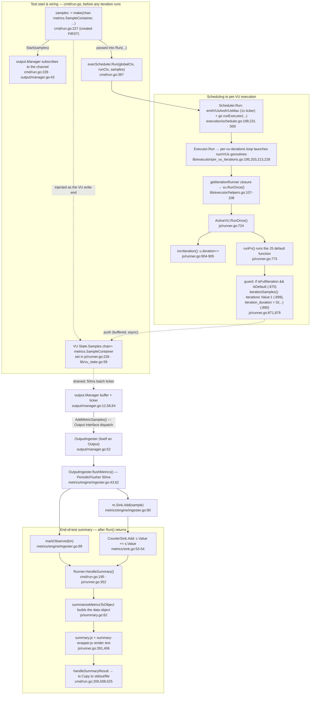

# k6 Onboarding Investigation — Test Health, Metrics Architecture, and a Metric Trace

Welcome to the team! This document answers three questions you asked while exploring
[grafana/k6](https://github.com/grafana/k6), the open-source load-testing tool. It is written
for a **new team member**, so it names specific files and walks through real, observed behavior
rather than hand-waving.

Everything below is **run-first**: every behavioral claim (test counts, timings, metric values,
banners) sits next to the *actual captured output* that produced it. Captured console/JSON blocks
preserve the **verbatim message content**; where a block's original layout used tab-based column
alignment, only that cosmetic spacing was normalized to plain spaces (no value or message token was
altered) — this is called out again where it applies in Q1.

**Labeling convention.** So the basis of each claim is explicit, three markers are used throughout:
**`(observed)`** — directly seen in captured runtime output (a real test run or the Q3 demo);
**`(source-verified)`** — confirmed by reading the exact source at the cited `file:line` in this
checkout; and **`(inferred)`** — reasoned from the code but not directly observed at runtime. Unmarked
sentences are ordinary narrative/exposition.

> **Read-only exploration.** No tracked file in the k6 source tree was modified, added, or deleted to
> produce this document: the only change under version control is this Markdown file, and a `git diff`
> from the base commit confirms the Go sources are byte-identical (see Provenance below). All temporary
> scripts, logs, and JSON used as evidence were created in a private `mktemp -d` directory **outside**
> the checkout and are removed on completion; the compiled `k6` binary is git-ignored (it is a build
> artifact, never part of the tracked source tree) and is likewise removed during cleanup. A final
> `git status --porcelain` inside the checkout shows only this deliverable.

## Provenance (what this was produced against)

| Property | Value |
|----------|-------|
| Module | `go.k6.io/k6` (`go.mod:L1`) |
| Base commit (k6 source under investigation) | `ddc3b0b1d23c128e34e2792fc9075f9126e32375` (branch-derived name `k6_ddc3b0b1d23c`) — every source citation, line number, and runtime observation below is anchored to this commit |
| This document | committed on top of the base as the **sole** change; the Go sources are byte-identical to the base (`git diff ddc3b0b1d23c HEAD` shows only this Markdown file) |
| k6 binary banner | `k6 v0.55.0 (commit/ddc3b0b1d2, go1.23.12, linux/amd64)` — `commit/ddc3b0b1d2` is the short hash of the base commit; see the note below on how a doc-inclusive build differs |
| Go toolchain | `go version go1.23.12 linux/amd64` |
| C compiler (for `-race`) | `gcc (Ubuntu 15.2.0-4ubuntu4) 15.2.0` at `/usr/bin/gcc` |
| Repo scale | **82 packages** (`go list ./...`), **176 `_test.go` files** |
| Build mode | offline / vendored (`vendor/` + `vendor/modules.txt` present) |

The banner and toolchain were captured directly:

```console
$ go version
go version go1.23.12 linux/amd64

$ gcc --version | head -1
gcc (Ubuntu 15.2.0-4ubuntu4) 15.2.0

$ ./k6 version                # k6 built from the base source (commit ddc3b0b1d23c)
k6 v0.55.0 (commit/ddc3b0b1d2, go1.23.12, linux/amd64)
```

> Why a rebuilt banner hash can differ: k6 stamps its version banner from the git commit it is built
> at. The canonical banner above is a build of the **base source** `ddc3b0b1d23c` (short hash
> `ddc3b0b1d2`), which is the commit this document is anchored to. This document is committed on top of
> that base and changes only this Markdown file, so the Go sources are byte-identical; a binary built
> from a checkout that also contains this doc commit therefore behaves identically and differs only in
> the embedded hash string (the observation binary built during this investigation reported
> `commit/a8324e3fd0`). **(observed)**

> Note: `go.mod` only declares the *minimum* supported Go (`go 1.21`, `toolchain go1.21.13`
> — `go.mod:L3`/`go.mod:L5`). We built with Go **1.23.12**, the highest explicitly documented
> version (CI `DEFAULT_GO_VERSION: "1.23.x"`; the `Dockerfile` uses `golang:1.23`).

## One-line answers

- **Q1 (test health):** The suite **compiles cleanly — zero build-failed ("broken") packages** in every
  run. Counting **leaf tests** (the test/subtest functions that actually run assertions, *not* their
  parent aggregate entries — see the counting note below), each of four back-to-back runs executed
  **3,800 leaf tests**: **1 is intentionally skipped** (`js/tc39.TestTC39`) and **5–8 fail**
  (`3,791–3,794 pass`) depending on the run. Of those failures, **5 are consistent** (three gRPC TLS-CA
  subtests + one HTTP OCSP-staple test + one constant-arrival-rate timing segment) and **4 are flaky**
  (timing/scheduling- or connectivity-sensitive). Package-level: of **82** packages, **28 have no test
  files** and **3–4 fail** (3 in three runs, 4 in one — one extra flaky package in a single run).
- **Q2 (what counts iterations & collects data):** Iteration counting lives in `metrics/builtin.go`
  (the `iterations` Counter) and `js/runner.go` (the per-VU hot path), with `lib/executor/*` deciding
  *how many* iterations run. Performance data is collected by the `metrics/` package (types + sinks),
  the `metrics/engine/` ingester, the `output/` manager, and the VU-side `Samples` channel in
  `lib/vu_state.go`.
- **Q3 (data flow for one metric):** A single `iterations` Counter sample (`value: 1`) is emitted at
  the end of each full default-function iteration in `js/runner.go`, pushed onto a buffered channel,
  batched by two independent 50 ms flushers (`output.Manager` and the metrics-engine `OutputIngester`),
  and summed by `CounterSink.Add` before the end-of-test summary renders it.

---

## Q1 — Test-suite health

> *"can you run the tests and tell me how many pass vs fail? Are there any that are skipped or broken?"*

### The command (and why it's the canonical one)

```bash
go test -race -timeout 210s ./...
```

This is not an ad-hoc subset — it is exactly the project's documented entry point:

- The `Makefile` `tests:` target runs it verbatim (`Makefile:L27-L29`; the recipe line is
  tab-indented as Makefiles require):

```makefile
## tests: Executes any unit tests.
tests:
	go test -race -timeout 210s ./...
```

- `CONTRIBUTING.md` designates `make tests` as *the* way to exercise the entire suite
  (`CONTRIBUTING.md:L61`, under "Running the test suite").

`-race` enables Go's data-race detector, which is CGO-backed and therefore needs `gcc` (present,
v15.2.0). `-timeout 210s` is a per-package timeout.

### Methodology (and the counting unit)

Because a load-testing suite naturally contains timing-sensitive tests, health was assessed across
**four** back-to-back runs of the identical, unmodified command, so consistent failures could be
separated from flaky ones. Each run was captured as a machine-readable `-json` event stream written to
a **securely created temporary directory outside the repository** (never into the checkout), with each
run's exit code captured:

```bash
# WORKDIR is created outside the k6 tree with a random, private (0700) name.
WORKDIR="$(mktemp -d "${TMPDIR:-/tmp}/k6health.XXXXXX")"; chmod 700 "$WORKDIR"
for i in 1 2 3 4; do
  go test -race -timeout 210s -json ./... > "$WORKDIR/run${i}.json" 2> "$WORKDIR/run${i}.stderr"
  echo "$?" > "$WORKDIR/run${i}.exit"      # capture each run's exit code
done
```

Tallies come from parsing the `-json` `Action` events (`pass` / `fail` / `skip`); build-broken
detection scans package output for `[build failed]`.

**The counting unit matters (this is why the totals below differ from a naïve tally).** `go test -json`
emits a terminal `pass`/`fail`/`skip` action for **every** test *and* every subtest — including the
**parent** entries that merely aggregate their children (e.g. `TestClient_TlsParameters` is a parent of
`TestClient_TlsParameters/ConnectTls`). Counting parents *and* children together double-counts. Below,
the **primary** pass/fail/skip totals are **leaf tests** (a test with no children); parent aggregate
terminals are reported separately. **(observed)** A terminal is classified as a parent when another
terminal event in the same package has its name plus `"/"` as a prefix.

### Results — package level

Package outcomes are **not** identical across runs — **one run had an extra failing package** — so this
is per-run rather than a single "every run" claim:

| Run | Packages pass | Packages fail | No test files | Build-failed ("broken") | Total |
|-----|--------------:|--------------:|--------------:|------------------------:|------:|
| run1 | 50 | 4 | 28 | 0 | 82 |
| run2 | 51 | 3 | 28 | 0 | 82 |
| run3 | 51 | 3 | 28 | 0 | 82 |
| run4 | 51 | 3 | 28 | 0 | 82 |

**(observed)** The total **82** is `go list ./...`. The three packages that fail in **all four** runs:

- `go.k6.io/k6/js/modules/k6/grpc`
- `go.k6.io/k6/js/modules/k6/http`
- `go.k6.io/k6/lib/executor`

A **fourth** package, `go.k6.io/k6/cmd/tests`, failed in **run1 only** (a flaky output-capture test,
detailed below) — which is exactly why the package-fail count is 4 in run1 and 3 in the other three.

The **28 "no test files"** packages are not errors — they are protobuf-generated and
test-support/helper packages (e.g. `cloudapi/insights/proto/**`, `lib/testutils/**`, `js/modulestest`,
`ui/console`, `execution/local`, `ext`, `lib/consts`, …) that simply ship no `_test.go`. **(observed)**
Go reports each with a **`?`** prefix, *not* `ok`:

```
?   	go.k6.io/k6/lib/consts	[no test files]
?   	go.k6.io/k6/ui/console	[no test files]
```

### Results — test level (leaf tests are primary)

| Run | Wall time | Exit | Leaf pass | Leaf fail | Leaf skip | Leaf total |
|-----|----------:|-----:|----------:|----------:|----------:|-----------:|
| run1 | 69.4 s | 1 | 3791 | 8 | 1 | 3800 |
| run2 | 66.6 s | 1 | 3792 | 7 | 1 | 3800 |
| run3 | 65.1 s | 1 | 3794 | 5 | 1 | 3800 |
| run4 | 65.0 s | 1 | 3794 | 5 | 1 | 3800 |

**(observed)** Every run also produced **626 parent (aggregate) terminal events** — pass/fail rolled up
from children. Leaf **3,800 + parent 626 = 4,426**, so a naïve "count every `pass`/`fail`/`skip` event"
tally yields 4,426 but **double-counts** the 626 parents on top of their leaves. The leaf numbers above
are the honest per-test totals; wall times and exit codes are from each run's captured `.walltime` and
`.exit` files.

Exit code `1` **(observed)** simply reflects that at least one test failed; the toolchain itself ran
fine and **no package failed to compile**.

### Skipped tests

Exactly **one** leaf test is skipped every run, on purpose:

- `go.k6.io/k6/js/tc39 :: TestTC39` — a TC39/ECMAScript conformance suite guarded behind an external
  data checkout. Its skip message **(observed, verbatim from run1)**:

  ```
  === RUN   TestTC39
      tc39_test.go:799: If you want to run tc39 tests, you need to run the 'checkout.sh` script in the directory to get  https://github.com/tc39/test262 at the correct last tested commit (stat TestTC39/test262: no such file or directory)
  --- SKIP: TestTC39 (0.00s)
  ```

  It needs the external `test262` corpus — **skipped, not broken**.

### Failing tests — consistent vs flaky

A failure that appears in **all four** runs is **consistent**; one that appears in some runs but not
others, on the **same unchanged command**, is **flaky**. Every classification below is scoped to *this
exact four-run set* (a larger or different run set could shift a test between the two buckets).

Each excerpt below reproduces the **verbatim message content** from the named run's `-json` stream:
every file path, line number, error string, duration, and `time.Time` value is exactly as emitted, with
**nothing substituted** (no `<t1>`/`<t2>`-style placeholders — the earlier draft of this note used such
placeholders and was wrong to). The only thing altered is *cosmetic layout*: `go test`/testify indent
these detail lines with a leading `8-spaces-then-tab` sequence and separate the label from its value
with a tab, so — purely to keep this Markdown file free of "space-before-tab" whitespace warnings — the
leading indentation and those tab separators are rendered as spaces and trailing spaces are trimmed. No
character of the actual message text is changed.

#### Consistent failures (all 4 runs) — 5 leaf tests

**1) gRPC TLS-CA — `TestClient_TlsParameters/{ConnectTls, ConnectTlsEncryptedKey, ConnectTlsInvokeSuccess}`**
(package `js/modules/k6/grpc`). The failing assertion is `assert.NoError(t, err)` in the shared helper
`assertResponse` (the `cb.err == ""` branch) at **`js/modules/k6/grpc/helpers_test.go:L19`**
**(source-verified)**. Captured block for `ConnectTls` **(observed, run3)**:

```
=== RUN   TestClient_TlsParameters/ConnectTls
=== PAUSE TestClient_TlsParameters/ConnectTls
=== CONT  TestClient_TlsParameters/ConnectTls
    helpers_test.go:19:
        Error Trace: /tmp/blitzy/k6/blitzy-5d914375-726d-4709-9a11-c8af9ba3bd91_21f0f3/js/modules/k6/grpc/helpers_test.go:19
            /tmp/blitzy/k6/blitzy-5d914375-726d-4709-9a11-c8af9ba3bd91_21f0f3/js/modules/k6/grpc/client_test.go:1287
        Error:       Received unexpected error:
            GoError: context deadline exceeded: connection error: desc = "transport: authentication handshake failed: tls: failed to verify certificate: x509: certificate signed by unknown authority (possibly because of \"crypto/rsa: verification error\" while trying to verify candidate authority certificate \"Acme Co\")" at reflect.methodValueCall (native)
        Test:        TestClient_TlsParameters/ConnectTls
--- FAIL: TestClient_TlsParameters/ConnectTls (60.37s)
```

**Cause → effect (source-verified fixture + observed handshake).** The test tells the gRPC client to
trust exactly one CA — the hard-coded `localHostCert` PEM at **`js/modules/k6/grpc/client_test.go:L1160`**
— via `client.connect(..., { tls: { cacerts: ["<localHostCert>"], ... } })` (the three failing subtests'
connect calls are at `client_test.go:L1217` / `L1228` / `L1258`) **(source-verified)**. But the
in-process gRPC endpoint is a Go `httptest` server: `GRPCBIN_ADDR` resolves (via the httpmultibin
`Replacer`) to an HTTP/2 server created with `httptest.NewUnstartedServer(...)` and started with
`StartTLS()` (`lib/testutils/httpmultibin/httpmultibin.go:L333-L338`). Its `TLS` field is assigned a
config returned by `GetTLSClientConfig` (`L314`, `L335`) whose `Certificates` slice is **empty**
(that helper sets only `RootCAs`, `httpmultibin.go:L55-L59`), so `StartTLS()` falls back to injecting
Go's **built-in** certificate `net/http/internal/testcert.LocalhostCert` as the server's presented cert
**(source-verified)**. Both that stdlib cert and the client-trusted `localHostCert` carry the same
Subject `O=Acme Co`, but they are **different keys with different fingerprints** — I decoded both with
`openssl`: the client's trusted CA is `SHA256 AB:60:19:14…` while the server's presented cert is
`SHA256 46:81:74:FD…` **(observed)**. So the client finds a candidate issuer named "Acme Co", tries to
verify the server certificate's RSA signature against it, and the check fails — producing the exact
`crypto/rsa: verification error … candidate authority certificate "Acme Co"` message above. During the
same TLS-CA subtests the httptest server logged the corresponding rejection **(observed, run3)**:

```
2026/07/14 20:12:28 http: TLS handshake error from 127.0.0.1:60442: remote error: tls: bad certificate
```

The handshake keeps retrying until the RPC's context deadline: `ConnectTls`/`ConnectTlsEncryptedKey`
run ~60 s while `ConnectTlsInvokeSuccess` fails in ~5.85 s because it sets `timeout: '5s'`
(`client_test.go:L1258`). **(inferred:** attributing the ~60 s vs ~5 s split to those timeout settings
is reasoning; the durations themselves are observed.**)** The `"Acme Co"` string is produced at runtime
from *both* certificates' Organization field — it is **not** a literal in the grpc source (an earlier
version of this note wrongly attributed it to an unrelated HTTP test file).

**2) HTTP OCSP staple — `TestRequestAndBatchTLS/ocsp_stapled_good`** (package `js/modules/k6/http`).
The subtest performs a **live HTTPS GET to `https://www.wikipedia.org/`** (`request_test.go:L2197`,
request at `L2205`) and throws from JS if the response's stapled OCSP status is not GOOD
(`if (res.ocsp.status != http.OCSP_STATUS_GOOD) { throw … }`, `request_test.go:L2206`), which surfaces
as the Go `assert.NoError(t, err)` at **`request_test.go:L2208`** **(source-verified)**. Captured block
**(observed, run1)**:

```
=== RUN   TestRequestAndBatchTLS/ocsp_stapled_good
=== PAUSE TestRequestAndBatchTLS/ocsp_stapled_good
=== CONT  TestRequestAndBatchTLS/ocsp_stapled_good
    request_test.go:2208:
        Error Trace: /tmp/blitzy/k6/blitzy-5d914375-726d-4709-9a11-c8af9ba3bd91_21f0f3/js/modules/k6/http/request_test.go:2208
        Error:       Received unexpected error:
            Error: wrong ocsp stapled response status: unknown at <eval>:3:58(22)
        Test:        TestRequestAndBatchTLS/ocsp_stapled_good
--- FAIL: TestRequestAndBatchTLS/ocsp_stapled_good (2.01s)
```

**Cause → effect.** The observed stapled OCSP status was **`unknown`**, so the JS `throw` fired. What
this proves is narrow: **no usable GOOD OCSP staple was observed** for that live request in this
environment. It does **not** establish any specific infrastructure fact (e.g. "there is no OCSP
responder"); the outcome depends on live external connectivity *and* on the upstream actually stapling
a GOOD response, so this test is environment-dependent. **(inferred:** the precise reason the staple
came back `unknown` — restricted egress vs. upstream not stapling at that moment — is not determined by
the output.**)**

**3) Constant-arrival-rate timing — `TestConstantArrivalRateRunCorrectTiming/segment_0:1/3_sequence_`**
(package `lib/executor`) fails in all four runs. It asserts that scheduled iteration start times land
within **24 ms** of their expected offsets; under a `-race` build the deltas exceed tolerance. Captured
first assertion from the block **(observed, run3;** the block contains several such assertions, the
first shown verbatim, remaining trace frames elided with `…`**)**:

```
    constant_arrival_rate_test.go:185:
        Error Trace: /tmp/blitzy/k6/blitzy-5d914375-726d-4709-9a11-c8af9ba3bd91_21f0f3/lib/executor/constant_arrival_rate_test.go:185
            …
        Error:       Max difference between 2026-07-14 20:12:23.111512845 +0000 UTC m=+0.308607089 and 2026-07-14 20:12:23.177831607 +0000 UTC m=+0.374925855 allowed is 24ms, but difference was -66.318766ms
        Test:        TestConstantArrivalRateRunCorrectTiming/segment_0:1/3_sequence_
        Messages:    6 expectedTime 300ms
--- FAIL: TestConstantArrivalRateRunCorrectTiming/segment_0:1/3_sequence_ (2.00s)
```

Note the message prints **real `time.Time` values** (not placeholders); across the assertions in this
run the over-tolerance deltas ranged from ~27 ms to ~87 ms. **(inferred:** the sensitivity to a `-race`
build and machine load is a reasonable explanation for why a 24 ms tolerance is exceeded; the deltas
themselves are observed.**)**

#### Flaky failures (varied across the four runs) — 4 leaf tests

- **`cmd/tests :: TestBinaryNameHelpStdout`** — failed in **run1 only** (this is the extra failing
  package in run1). It asserts stdout is empty, but a concurrent gRPC route-guide example logged a
  `GetFeature called with: …` line into the captured stream — a cross-test output-capture race. Captured
  block (its second, human-readable assertion) **(observed, run1)**:

  ```
    cmd_run_test.go:130:
        Error Trace: /tmp/blitzy/k6/blitzy-5d914375-726d-4709-9a11-c8af9ba3bd91_21f0f3/cmd/tests/cmd_run_test.go:130
        Error:       Should be empty, but was [{0xc00039c900 map[] 2026-07-14 20:10:12.888831593 +0000 UTC m=+2.692907398 info <nil> 2026/07/14 20:10:12 GetFeature called with: latitude:410248224  longitude:-747127767 <nil> <nil> }]
        Test:        TestBinaryNameHelpStdout
  --- FAIL: TestBinaryNameHelpStdout (2.48s)
  ```

- **`grpc :: TestClient/BadTLS`** — failed in **run2 only**. A different branch: `assert.Contains(...)`
  at **`helpers_test.go:L22`** **(source-verified)**. **(observed, run2)**:

  ```
    helpers_test.go:22:
        Error Trace: /tmp/blitzy/k6/blitzy-5d914375-726d-4709-9a11-c8af9ba3bd91_21f0f3/js/modules/k6/grpc/helpers_test.go:22
            /tmp/blitzy/k6/blitzy-5d914375-726d-4709-9a11-c8af9ba3bd91_21f0f3/js/modules/k6/grpc/client_test.go:1146
        Error:       "GoError: context deadline exceeded at reflect.methodValueCall (native)" does not contain "certificate signed by unknown authority"
        Test:        TestClient/BadTLS
  --- FAIL: TestClient/BadTLS (1.59s)
  ```

  **(inferred)** Here the handshake reached the context deadline *before* producing the certificate
  error text the test looks for, so the substring match failed — a timing-dependent variant of the same
  TLS-CA scenario as the consistent gRPC failures.

- **`lib/executor :: TestConstantArrivalRateRunCorrectTiming/segment_1/3:2/3_sequence_`** — failed in
  **run1 and run2** (a *second* timing segment of the same constant-arrival-rate test, tripping only in
  the two slightly slower runs).

- **`lib/executor :: TestRampingVUsHandleRemainingVUs`** — failed in **run1 only**, a VU-count
  assertion (it tripped at both `ramping_vus_test.go:L370` and `:L371`). **(observed, run1)**:

  ```
    ramping_vus_test.go:370:
        Error:       Not equal:
            expected: 0x1
            actual  : 0x0
    ramping_vus_test.go:371:
        Error:       Not equal:
            expected: 0x1
            actual  : 0x2
  --- FAIL: TestRampingVUsHandleRemainingVUs (0.08s)
  ```

  **(inferred)** The 0.08 s duration plus run-to-run variability point to a scheduling race in how
  remaining VUs are counted, rather than a deterministic logic error.

### Are any "broken"?

**No. (observed)** "Broken" in Go terms means a package that fails to compile (`[build failed]`). Scanning
every run's `-json` stream for `[build failed]` returns **zero** matches in all four runs. Everything
compiles; the failures above are runtime assertion failures in TLS/OCSP and timing tests, not build
breakage.

### No tests were modified

Per the read-only constraint, **none** of these failing/flaky tests were changed, fixed, or
stabilized — they were only observed and reported.

---

## Q2 — Metrics architecture (which files count iterations and collect performance data)

> *"when I kick off a load test, what parts of the code are responsible for counting iterations and
> collecting performance data? Name the specific files and modules involved."*

At a high level, a running k6 test is a set of **VUs** (virtual users) each executing your default
function in a loop. Every VU writes **samples** (metric measurements) into a channel; a batching
pipeline fans those out to **outputs** and aggregates them into per-metric **sinks**; at the end,
those sinks are rendered into the summary. Here are the specific files, split by the two
responsibilities you named. Every file and line cited in this section was **`(source-verified)`** by
reading this checkout; the data path is additionally **`(observed)`** at runtime in Q3.

### A) Counting iterations

- **`metrics/builtin.go`** — declares the built-in metric *names* (`IterationsName = "iterations"`
  at `L8`, `IterationDurationName = "iteration_duration"` at `L9`, plus `vus`/`vus_max`/
  `dropped_iterations` at `L6`/`L7`/`L10`) and **registers** them in `RegisterBuiltinMetrics`
  (`L78`). The key line for counting is the `iterations` **Counter**:
  ```go
  Iterations: registry.MustNewMetric(IterationsName, Counter),          // metrics/builtin.go:L82
  IterationDuration: registry.MustNewMetric(IterationDurationName, Trend, Time), // L83
  DroppedIterations: registry.MustNewMetric(DroppedIterationsName, Counter),     // L84
  ```
- **`js/runner.go`** — the per-VU hot path that actually *does* the counting each loop:
  - `ActiveVU.RunOnce()` (`L724`) runs one iteration;
  - `incrIteration()` (`L904`) bumps the VU's own counter with `u.iteration++` (`L905`);
  - when a full default-function iteration completes (guard `if isFullIteration && isDefault {` at
    `L870`), it pushes `iterationSamples(...)` (`L871`) onto the VU samples channel;
  - `iterationSamples()` (`L879`) builds the two built-in samples — `iteration_duration` (`L885`,
    value `metrics.D(...)` at `L890`) and `iterations` with literal `Value: 1` (`L894`/`L899`).
- **`lib/executor/*`** — decide *how many* iterations each VU runs (they don't count, they schedule):
  - `lib/executor/per_vu_iterations.go` — executor type `"per-vu-iterations"` (`L19`),
    `PerVUIterationsConfig.Iterations` (`L33`); each VU runs N iterations (unscaled, `GetIterations`
    at `L55`).
  - `lib/executor/shared_iterations.go` — executor type `"shared-iterations"` (`L19`),
    `SharedIterationsConfig.Iterations` (`L36`); a shared budget split across VUs (`GetIterations`
    at `L58`).

### B) Collecting performance data

- **`metrics/` package (the core types & aggregation):**
  - `metrics/registry.go` — the `Registry` (`L12`) that mints and de-duplicates `Metric` objects
    (`NewMetric` `L43`, `MustNewMetric` `L70`, internal `newMetric` `L93`).
  - `metrics/metric.go` — the `Metric` struct (`L12`) carrying its `Name` (`L14`), its `Sink`
    (`L24`), and an `Observed` flag (`L25`).
  - `metrics/metric_type.go` — defines **only** the `MetricType` enum: `type MetricType int` (`L6`)
    with values `Counter`, `Gauge`, `Trend`, `Rate` (`L10-L13`). It *also* holds the string constants
    `defaultString`/`timeString`/`dataString` (`L25-L27`) used when (de)serializing value types, but
    the `ValueType` type itself is **not** declared here. **(source-verified)**
  - `metrics/value_type.go` — defines the separate `ValueType` enum: values `Default`, `Time`, `Data`
    (`L7-L9`) and `type ValueType int` (`L16`). `Time` marks millisecond durations and `Data` marks
    byte amounts; `iteration_duration`, for example, is `Trend` (a `MetricType`) with `Time` (a
    `ValueType`). **(source-verified)**
  - `metrics/sample.go` — `Sample`, `Samples`, and `SampleContainer` — the unit of measurement that
    flows through the whole pipeline.
  - `metrics/sink.go` — the **per-type aggregators** (see the table in Q3): `CounterSink` sums
    (`L53`/`L54`), `GaugeSink` keeps last/min/max (`L82-L88`), `TrendSink` retains values for
    percentiles (`L117-L129`), `RateSink` counts non-zero occurrences (`L210-L213`).
  - `metrics/units.go` — `D()` (`L11`) converts a Go `time.Duration` (nanoseconds) to **milliseconds**
    via `float64(d) / float64(timeUnit)` (`L12`), where `timeUnit = time.Millisecond` (`L7`).
- **`metrics/engine/` (aggregation driver):**
  - `metrics/engine/engine.go` — the `MetricsEngine`, `markObserved`, and threshold cadence
    (`thresholdsRate = 2 * time.Second` at `L21`, ticker at `L173`).
  - `metrics/engine/ingester.go` — the `OutputIngester` (itself an `Output`) that flushes every
    `collectRate = 50 * time.Millisecond` (`L12`/`L43`); `flushMetrics()` (`L62`) calls
    `markObserved(m)` (`L89`) and `m.Sink.Add(sample)` (`L90`).
- **`output/` (fan-out to backends):**
  - `output/types.go` — the `Output` interface (`L44`): `Description` (`L47`), `Start` (`L52`),
    `AddMetricSamples` (`L58`), `Stop` (`L61`). A doc comment (`L42-L43`) says outputs *should* have
    a non-blocking `AddMetricSamples()` and *should* spawn their own goroutine to flush
    asynchronously — an **advisory convention, not an interface-enforced guarantee** (this matters for
    the backpressure discussion in Q3).
  - `output/manager.go` — the `Manager` that drains the samples channel and, every
    `sendBatchToOutputsRate = 50 * time.Millisecond` (`L12`), calls `AddMetricSamples` on each output
    (`Start` `L42`, ticker `L58`, dispatch `L52`).
  - `output/helpers.go` — reusable building blocks: `SampleBuffer` (`L15`, non-blocking
    `AddMetricSamples` `L22`, `GetBufferedSamples` `L34`) and `PeriodicFlusher` (`L55`,
    `NewPeriodicFlusher` `L89`).
- **`lib/vu_state.go`** — the VU-side write end of the pipeline: `Samples chan<- metrics.SampleContainer`
  (`L59`). Every VU pushes its samples here.
- **`js/modules/k6/metrics/metrics.go`** — the user-facing JS constructors for *custom* metrics
  (`Counter`/`Gauge`/`Trend`/`Rate` at `L159-L162`; e.g. `XCounter` at `L168` → `newMetric(call,
  metrics.Counter)` at `L169`).
- **`cmd/run.go`** — wires everything together: creates the buffered `samples` channel (`L227`),
  starts the output `Manager` (`L228`), and runs the scheduler (`L397`).
- **`execution/scheduler.go`** — emits the `vus`/`vus_max` gauges on a **1-second** ticker
  (`emitVUsAndVUsMax` `L199`, `vus_max` gauge `L218`, `ticker := time.NewTicker(1 * time.Second)`
  `L231`).
- **`js/summary.go`** — `summarizeMetricsToObject` (`L62`) transforms the observed sinks into a
  `map[string]interface{}` **data object** for the JS runtime / JSON export; it does **not** itself
  render text or write to stdout (the human-readable rendering and the actual write are separate steps,
  traced end-to-end in Q3). **(source-verified)**

> The metric *semantics* above were cross-checked against the official Grafana k6 documentation
> (`grafana.com/docs/k6`), which describes Counters as summing values, Gauges as tracking the
> smallest/largest/latest, Rates as tracking how frequently a non-zero value occurs, and Trends as
> computing statistics — matching the sink implementations in `metrics/sink.go` exactly.

---

## Q3 — End-to-end trace: one `iterations` Counter sample, from test start to output

> *"Could you trace through running a simple test script and show me the function calls involved in
> collecting at least one metric, so I can see how the data flows from test start to metrics output?"*

### Why the `iterations` Counter is the ideal subject

The `iterations` metric is a **Counter** that is emitted exactly **once per completed default-function
iteration**, always with `value: 1`, and it needs **no network**. That makes its total perfectly
deterministic: `VUs × iterations`. So it's the cleanest possible thing to trace end-to-end.

### The call chain (source-verified, then runtime-confirmed)

The chain below is **source-verified** against this checkout and then **runtime-confirmed** by the demo
(next sections). **Edge styles:** a **solid arrow** is a direct function call / control flow; a
**dashed arrow** is asynchronous data flow over the buffered samples channel; edge *labels* mark an
`Output`-interface dispatch. The key lifecycle detail (which an earlier draft of this diagram got
backwards): the samples channel is **created first** at test start (`cmd/run.go:L227`), the output
`Manager` and the scheduler are started *with* it, and it is **injected into each VU's `State.Samples`
write-end** — VUs later *push* onto that already-existing channel. The channel is **not** created by
the VU, and certainly not created *after* the push.



### The (temporary) script we ran

Created in a **securely-created temporary directory outside the repository** (never inside the
checkout). It is deliberately network-free (`per-vu-iterations`, 2 VUs × 3 iterations, a trivial
`check` + a fixed `sleep(0.1)`), so the numbers are attributable solely to the iteration path:

```javascript
import { check, sleep } from 'k6';

// A deliberately network-free script so the observed metric values are
// deterministic and attributable solely to the iteration-counting path.
// per-vu-iterations: each of the 2 VUs runs exactly 3 iterations => 6 total.
export const options = {
  scenarios: {
    demo: {
      executor: 'per-vu-iterations',
      vus: 2,
      iterations: 3,
      maxDuration: '30s',
    },
  },
};

export default function () {
  // trivial check (no network) + a fixed sleep so iteration_duration ~= 100ms
  check(1, { 'always true': (v) => v === 1 });
  sleep(0.1);
}
```

Run it with an **absolute** binary path, structured JSON output, and telemetry disabled — every
artifact under the private temp dir, with the exit code captured and a guarded cleanup afterward:

```bash
# WORK is a securely-created, private (0700) temp dir OUTSIDE the k6 checkout,
# holding the built k6 binary, demo.js, and all captured output.
WORK="$(mktemp -d "${TMPDIR:-/tmp}/k6demo.XXXXXX")"; chmod 700 "$WORK"
# (write demo.js into "$WORK"; build k6 to "$WORK/k6" from the checkout)

# --no-usage-report : suppress the anonymous end-of-run telemetry POST (see note)
# --quiet --no-color: stable, capturable output
"$WORK/k6" run --no-usage-report --quiet --no-color \
    --out "json=$WORK/demo.json" "$WORK/demo.js" > "$WORK/demo.stdout" 2> "$WORK/demo.stderr"
echo "$?" > "$WORK/demo.exit"          # capture exit code (observed: 0)

# (inspect "$WORK/demo.json" and "$WORK/demo.stdout")
rm -rf -- "$WORK"                       # guarded cleanup: removes only our own temp dir
```

> **Why `--no-usage-report` matters (network hygiene).** A network-free *script* is still not a
> network-free *process* by default. At the end of a run, `cmd/run.go` (`L404`, `if !conf.NoUsageReport.Bool`)
> launches `reportUsage` (`L412`); `cmd/report.go` `createReport` (`L15`) assembles a small JSON payload —
> including the run `duration` (`L20`), `vus_max` (`L23`), and `iterations` (`L24`) — and POSTs it to
> `https://stats.grafana.org/k6-usage-report` (`L41`) via `http.DefaultClient.Do` (`L48`). Passing
> `--no-usage-report` (or `K6_NO_USAGE_REPORT=true`) suppresses that outbound call, so the only network
> behavior left is whatever the script itself does — here, none. **(source-verified)**

### Hop-by-hop, with the real output beside each claim

**Hop 1–4 — Emission (`js/runner.go`).** At the end of each full default-function iteration
(guard `isFullIteration && isDefault`, `L870`), `iterationSamples()` (`L879`) builds two samples: the
`iterations` sample with a literal `Value: 1` (`L899`), and the `iteration_duration` sample whose
value is `metrics.D(endTime.Sub(startTime))` (`L890`). The raw JSON stream shows the metric
*definitions* with their types, confirming `iterations` is a Counter and `iteration_duration` is a
Trend:

```json
{"type":"Metric","data":{"name":"iterations","type":"counter","contains":"default","thresholds":[],"submetrics":null},"metric":"iterations"}
{"type":"Metric","data":{"name":"iteration_duration","type":"trend","contains":"time","thresholds":[],"submetrics":null},"metric":"iteration_duration"}
```

**Hop 5 — the buffered channel (`lib/vu_state.go:L59`, `cmd/run.go:L227`).** Each VU pushes its
samples onto `State.Samples` (`chan<- metrics.SampleContainer`), the buffered channel created in
`cmd/run.go` (`samples := make(chan metrics.SampleContainer, ...)`, `L227`) and handed to both the
output manager (`L228`) and the scheduler (`L397`). The push in `iterationSamples`' caller is a
**plain channel send** — `u.state.Samples <- iterationSamples(...)` (`js/runner.go:L871`, guarded by
`isFullIteration && isDefault` at `L870`), and likewise `u.state.Samples <- ...IOSamples(...)` at
`L868` **(source-verified)**. The buffer keeps that send fast in the common case, but a plain send is
still blocking: if samples are produced faster than the flushers drain them, the buffer fills and the
VU blocks until space frees up (backpressure). So buffering *reduces* how often a VU waits — it does
not guarantee a VU never waits **(source-verified; see the concurrency note below)**.

Every one of the **6** `iterations` points carries `"value":1` — exactly the literal from
`runner.go:L899`, and exactly `VUs × iterations = 2 × 3 = 6`:

```json
{"metric":"iterations","type":"Point","data":{"time":"2026-07-14T20:51:26.101294275Z","value":1,"tags":{"group":"","scenario":"demo"}}}
{"metric":"iterations","type":"Point","data":{"time":"2026-07-14T20:51:26.101307946Z","value":1,"tags":{"group":"","scenario":"demo"}}}
{"metric":"iterations","type":"Point","data":{"time":"2026-07-14T20:51:26.202134645Z","value":1,"tags":{"group":"","scenario":"demo"}}}
{"metric":"iterations","type":"Point","data":{"time":"2026-07-14T20:51:26.202143952Z","value":1,"tags":{"group":"","scenario":"demo"}}}
{"metric":"iterations","type":"Point","data":{"time":"2026-07-14T20:51:26.302920764Z","value":1,"tags":{"group":"","scenario":"demo"}}}
{"metric":"iterations","type":"Point","data":{"time":"2026-07-14T20:51:26.302940159Z","value":1,"tags":{"group":"","scenario":"demo"}}}
```

Note the timestamps cluster into **three pairs ~100 ms apart** (`…26.101` ×2, `…26.202` ×2,
`…26.302` ×2) — the 2 VUs iterating in parallel, three times each, spaced by the `sleep(0.1)`.

**Hop 6–7 — batched fan-out (`output/manager.go`).** The `Manager` drains the channel and flushes to
every registered output on a ticker set to `sendBatchToOutputsRate = 50 * time.Millisecond` (`L12`;
ticker at `L58`), calling `out.AddMetricSamples(...)` (`L52`). The `Output` interface only *advises*
that `AddMetricSamples` be non-blocking — the doc comment reads "All outputs should have non-blocking
`AddMetricSamples()` methods" (`output/types.go:L42`) **(source-verified)** — so it is a convention,
not an enforced guarantee. When outputs honour it, this batching is what decouples the fast VUs from
potentially slow output backends; a misbehaving (blocking) output could still back the pipeline up.

**Hop 8–10 — aggregation (`metrics/engine/ingester.go` → `metrics/sink.go`).** The `OutputIngester`
is *itself* an `Output`, registered like any other, and it flushes on its own
`collectRate = 50 * time.Millisecond` (`L12`, wired via `output.NewPeriodicFlusher(collectRate,
oi.flushMetrics)` at `L43`). `flushMetrics()` (`L62`) does two things per sample: `markObserved(m)`
(`L89`), so the metric shows up in the end-of-test summary, and `m.Sink.Add(sample)` (`L90`), which
routes the value into the metric's type-specific sink. For our Counter, that is:

```go
// metrics/sink.go
func (c *CounterSink) Add(s Sample) {   // L53
	c.Value += s.Value                   // L54
	...
}
```

So the six `value: 1` samples accumulate into `6`.

**Hops 11–13 — the end-of-test summary chain (`js/runner.go` → `cmd/run.go`).** A common
misconception is that `summarizeMetricsToObject` "prints" the summary; it does not. The real chain,
**source-verified**, separates *building the data*, *rendering the text*, and *writing the bytes*:

1. `cmd/run.go`'s deferred summary block (`L192`–`L211`) calls
   `test.initRunner.HandleSummary(globalCtx, &lib.Summary{Metrics: metricsEngine.ObservedMetrics, ...})`
   (`L195`–`L196`) — the observed sinks from Hop 10 are exactly what it passes in.
2. `Runner.HandleSummary` (`js/runner.go:L352`) first calls `summarizeMetricsToObject(...)` (`L353`),
   which **only builds a Go data object**: its signature returns `map[string]interface{}`
   (`js/summary.go:L62`) and it writes nothing to stdout.
3. That object is handed to the JS layer — an optional user-supplied `handleSummary()` runs via
   `runFn` (`L384`), then the built-in text report is produced by injecting the embedded
   `jslibSummaryCode` into the `summaryWrapperLambdaCode` wrapper (`L391`) and running it with `runFn`
   (`L406`). `getSummaryResult` (`L415`) returns a `map[string]io.Reader`, keyed by destination
   (`"stdout"`, `"stderr"`, or a file path) and valued by the *rendered text*.
4. Back in `cmd/run.go` (`L206`), `handleSummaryResult(...)` (defined at `L508`) performs the actual
   write: `getWriter` maps `"stdout"→Stdout`, `"stderr"→Stderr`, else opens the file
   (`L511`–`L520`), and `io.Copy(writer, value)` (`L525`) is where the bytes finally reach
   stdout/the file.

So `summarizeMetricsToObject` supplies the *numbers*, the embedded `summary.js` + `summary-wrapper.js`
turn them into the familiar text table, and `handleSummaryResult`'s `io.Copy` is the sole stdout write.
Below is the **verbatim stdout** our run produced — captured with `--quiet`, which suppresses the
live progress bar so stdout is exactly this summary **(observed)**:

```

     ✓ always true

     checks...............: 100.00% 6 out of 6
     data_received........: 0 B     0 B/s
     data_sent............: 0 B     0 B/s
     iteration_duration...: avg=100.89ms min=100.75ms med=100.8ms max=101.12ms p(90)=101.1ms p(95)=101.11ms
     iterations...........: 6       19.806974/s

```

`iterations...........: 6` — the `CounterSink` summed our six `1`s, end to end. ✓

### The nanosecond → millisecond conversion (why `iteration_duration ≈ 100 ms`)

Our script sleeps `0.1` seconds (100 ms) per iteration. Go durations are nanoseconds, but
`metrics.D()` divides by `time.Millisecond`:

```go
// metrics/units.go
const timeUnit = time.Millisecond          // L7
func D(d time.Duration) float64 {          // L11
	return float64(d) / float64(timeUnit)  // L12
}
```

So `iteration_duration` is reported in milliseconds — and the raw JSON confirms it (~101 ms per
point, matching the ~100 ms sleep plus a little overhead):

```json
{"metric":"iteration_duration","type":"Point","data":{"time":"2026-07-14T20:51:26.101294275Z","value":101.095159,"tags":{"group":"","scenario":"demo"}}}
{"metric":"iteration_duration","type":"Point","data":{"time":"2026-07-14T20:51:26.101307946Z","value":101.124083,"tags":{"group":"","scenario":"demo"}}}
```

### Two independent 50 ms flushers (the "decoupled producer/consumer" design)

There are **two** 50 ms tickers, and they matter:

1. `output.Manager` batches VU samples to outputs every `sendBatchToOutputsRate = 50ms`
   (`output/manager.go:L12`).
2. The metrics-engine `OutputIngester` flushes its buffered samples into sinks every
   `collectRate = 50ms` (`metrics/engine/ingester.go:L12`).

Together with the buffered VU channel, these two flushers keep the VU hot path fast **in the common
case**: a VU pushes its samples and immediately continues iterating while the flushers drain and
aggregate in the background. But "fast in the common case" is not the same as "never blocks." The
VU → channel push is a **plain blocking channel send** — `u.state.Samples <- ...` at
`js/runner.go:L868` and `L871`, and `metrics.PushIfNotDone` likewise does `output <- sample` at
`metrics/sample.go:L135` (its only guard is an up-front `ctx.Err()` check, `L132`) **(source-verified)**.
If VUs produce samples faster than the flushers drain the buffered channel, the buffer fills and the
next send blocks until space frees up — i.e. output/aggregation backpressure propagates back to the
VUs. The design *minimises* that contention (a buffered channel, the two 50 ms drains, and the
convention that outputs keep `AddMetricSamples` non-blocking, `output/types.go:L42`), but it does not
guarantee a VU never waits. (For context, thresholds are evaluated on a slower
`thresholdsRate = 2 * time.Second` cadence, `metrics/engine/engine.go:L21`.)

### Per-metric-type sink behavior (why the type matters)

| Sink | File / line | Behavior |
|------|-------------|----------|
| `CounterSink` | `metrics/sink.go:L53-L54` | Sums values (`c.Value += s.Value`) → our `iterations` total |
| `GaugeSink` | `metrics/sink.go:L82-L88` | Keeps last value plus running min/max |
| `TrendSink` | `metrics/sink.go:L117-L129` | Retains values and computes statistics/percentiles |
| `RateSink` | `metrics/sink.go:L210-L213` | Counts total vs non-zero occurrences (a ratio) |

This matches the official Grafana k6 documentation's descriptions of the four metric types
(`grafana.com/docs/k6`).

### An edge case worth knowing (built-in vs. custom emission)

The iteration built-ins are emitted **only for a full iteration of the default function** — the
emission is guarded by `if isFullIteration && isDefault {` (`js/runner.go:L870`), so `setup()` and
`teardown()` invocations do **not** inflate the `iterations` counter **(source-verified)**.

That guard applies to the *built-in* iteration samples only; it is unrelated to how **custom** metrics
are emitted. A custom metric's `.add()` method builds a `metrics.Sample` and **immediately** pushes it
via `metrics.PushIfNotDone(m.vu.Context(), state.Samples, sample)` on every call
(`js/modules/k6/metrics/metrics.go:L77`, push at `L127`) **(source-verified)** — there is no
`isFullIteration && isDefault` gate on that path. The official Grafana k6 documentation describes
custom metrics as being collected from VU threads "at the end of each VU iteration," which accurately
describes *when the periodic flush/aggregation cycle observes them*; but in the v0.55.0 source the
`Sample` itself is enqueued onto the samples channel the moment `.add()` runs, not deferred to an
end-of-iteration hook **(source-verified — a distinction between the docs' aggregation-level phrasing
and the actual code path).**

### One more observed detail: the `vus` gauge was absent

Our run finished in ~0.3 s, and the `vus`/`vus_max` gauges are emitted on a **1-second** ticker
(`execution/scheduler.go:L231`). So there were **zero** `vus` and `vus_max` points in the JSON — the
run ended before the first tick fired. Rather than a missing metric, this is direct corroboration of
that 1-second emission cadence. Point counts observed: `iterations=6`, `iteration_duration=6`,
`checks=6`, `data_received=6`, `data_sent=6`, `vus=0`, `vus_max=0`.

---

## Appendix — provenance & reproducibility

**Toolchain / binary (captured):**

```console
$ go version
go version go1.23.12 linux/amd64
$ gcc --version | head -1
gcc (Ubuntu 15.2.0-4ubuntu4) 15.2.0
$ ./k6 version                # k6 built from the base source (commit ddc3b0b1d23c)
k6 v0.55.0 (commit/ddc3b0b1d2, go1.23.12, linux/amd64)
```

**Build (offline, vendored):**

```bash
# from inside the checkout; build to a private temp path ($WORK) so the tree stays pristine
GOTOOLCHAIN=local GOPROXY=off go build -o "$WORK/k6" .
```

**Repo scale (re-confirmed):** 82 packages (`go list ./...`), 176 `_test.go` files. No `[build failed]`
package in any run.

**Canonical suite command (run 4×):**

```bash
go test -race -timeout 210s ./...        # Makefile tests: (L27-L29); CONTRIBUTING.md make tests (L61)
```

**Cleanliness:** the k6 `.gitignore` ignores `/k6`, `/k6.exe`, `/dist`, and `*.log`
(`.gitignore:L1-L3`, `L10`), so the compiled binary never dirties the tracked tree; the binary and all
evidence artifacts are kept in a private `mktemp -d` directory outside the repository and removed
during cleanup. A final `git status --porcelain` inside the checkout shows only this document. This
document is committed on top of the base `ddc3b0b1d23c128e34e2792fc9075f9126e32375` as the **sole**
change — `git diff ddc3b0b1d23c HEAD` touches this Markdown file and nothing else. **No k6 source file
was modified, added, or deleted.**

**Terminology cross-check:** the Counter/Gauge/Rate/Trend semantics and the built-in metric set were
validated against the official Grafana k6 documentation (`grafana.com/docs/k6`); all substantive
claims here are grounded in the repository source and the observed runtime output.
