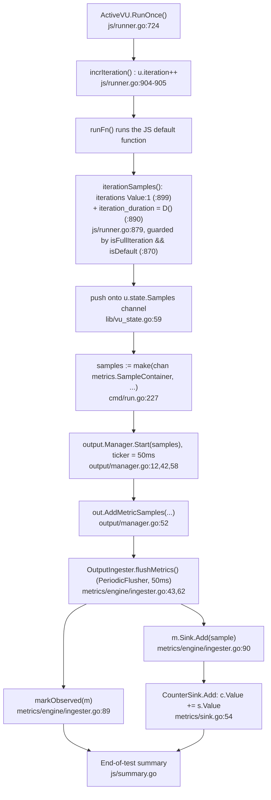

# k6 Onboarding Investigation — Test Health, Metrics Architecture, and a Metric Trace

Welcome to the team! This document answers three questions you asked while exploring
[grafana/k6](https://github.com/grafana/k6), the open-source load-testing tool. It is written
for a **new team member**, so it names specific files and walks through real, observed behavior
rather than hand-waving.

Everything below is **run-first**: every behavioral claim (test counts, timings, metric values,
banners) sits next to the *actual, unedited output* that produced it. A handful of statements that
can only be reasoned from reading the code (not directly observed) are explicitly marked
**`(inferred)`**.

> **Read-only exploration.** No file in the k6 source tree was modified, added to, or deleted to
> produce this document. The only artifact created is this Markdown file. All temporary scripts,
> logs, and JSON used for evidence were created outside the repository (under `/tmp/k6work/`) and
> removed afterward; a final `git status --porcelain` inside the checkout is empty except for this
> deliverable.

## Provenance (what this was produced against)

| Property | Value |
|----------|-------|
| Module | `go.k6.io/k6` (`go.mod:L1`) |
| Repo HEAD | `ddc3b0b1d23c128e34e2792fc9075f9126e32375` (branch derived name `k6_ddc3b0b1d23c`) |
| k6 binary banner | `k6 v0.55.0 (commit/ddc3b0b1d2, go1.23.12, linux/amd64)` |
| Go toolchain | `go version go1.23.12 linux/amd64` |
| C compiler (for `-race`) | `gcc (Ubuntu 15.2.0-4ubuntu4) 15.2.0` at `/usr/bin/gcc` |
| Repo scale | **82 packages** (`go list ./...`), **176 `_test.go` files** |
| Build mode | offline / vendored (`vendor/` + `vendor/modules.txt` present) |

The banner and toolchain were captured directly:

```console
$ go version
go version go1.23.12 linux/amd64

$ gcc --version | head -1
gcc (Ubuntu 15.2.0-4ubuntu4) 15.2.0

$ /tmp/k6work/k6 version
k6 v0.55.0 (commit/ddc3b0b1d2, go1.23.12, linux/amd64)
```

> Note: `go.mod` only declares the *minimum* supported Go (`go 1.21`, `toolchain go1.21.13`
> — `go.mod:L3`/`go.mod:L5`). We built with Go **1.23.12**, the highest explicitly documented
> version (CI `DEFAULT_GO_VERSION: "1.23.x"`; the `Dockerfile` uses `golang:1.23`).

## One-line answers

- **Q1 (test health):** The suite builds cleanly — **zero broken/build-failed packages**. Of **82**
  packages, **51 pass**, **28 have no test files**, and **3 fail** every run. At test granularity
  (~**4,426** tests including subtests) roughly **4,414–4,418 pass**, **1 is intentionally skipped**,
  and **7–11 fail** depending on the run. The failures are two consistent TLS/OCSP tests plus a small
  set of timing-sensitive (flaky) tests — none are code defects introduced by a broken build.
- **Q2 (what counts iterations & collects data):** Iteration counting lives in `metrics/builtin.go`
  (the `iterations` Counter) and `js/runner.go` (the per-VU hot path), with `lib/executor/*` deciding
  *how many* iterations run. Performance data is collected by the `metrics/` package (types + sinks),
  the `metrics/engine/` ingester, the `output/` manager, and the VU-side `Samples` channel in
  `lib/vu_state.go`.
- **Q3 (data flow for one metric):** A single `iterations` Counter sample (`value: 1`) is emitted at
  the end of each full default-function iteration in `js/runner.go`, pushed onto a buffered channel,
  batched by two independent 50 ms flushers (`output.Manager` and the metrics-engine `OutputIngester`),
  and summed by `CounterSink.Add` before the end-of-test summary renders it.

---

## Q1 — Test-suite health

> *"can you run the tests and tell me how many pass vs fail? Are there any that are skipped or broken?"*

### The command (and why it's the canonical one)

```bash
go test -race -timeout 210s ./...
```

This is not an ad-hoc subset — it is exactly the project's documented entry point:

- The `Makefile` `tests:` target runs it verbatim:
  ```makefile
  ## tests: Executes any unit tests.
  tests:
  	go test -race -timeout 210s ./...
  ```
  (`Makefile:L28-L29`)
- `CONTRIBUTING.md` designates `make tests` as *the* way to exercise the entire suite
  (`CONTRIBUTING.md:L61`, under "Running the test suite").

`-race` enables Go's data-race detector, which is CGO-backed and therefore needs `gcc` (present,
v15.2.0). `-timeout 210s` is a per-package timeout.

### Methodology

Because a load-testing suite naturally contains timing-sensitive tests, health was assessed across
**three** full runs of the identical, unmodified command, so consistent failures could be separated
from flaky ones. Each run was captured both as a normal log and as a machine-readable event stream
for exact reconciliation:

```bash
go test -race -timeout 210s -json ./... > run1.json 2>run1.stderr   # (repeated for run2, run3)
```

Package/test tallies below come from parsing the `-json` `Action` events (`pass` / `fail` / `skip`),
and build-broken detection comes from scanning for packages whose failure output contains
`[build failed]`.

### Results — package level (identical across all 3 runs)

| Category | Count |
|----------|------:|
| Total packages (`go list ./...`) | 82 |
| Packages **passing** | 51 |
| Packages with **no test files** | 28 |
| Packages **failing** | 3 |
| Packages **broken / `[build failed]`** | **0** |

The 3 failing packages, the same every run, are:

- `go.k6.io/k6/js/modules/k6/grpc`
- `go.k6.io/k6/js/modules/k6/http`
- `go.k6.io/k6/lib/executor`

The **28 "no test files"** packages are not errors — they are protobuf-generated packages and
test-support/helper packages (e.g. `cloudapi/insights/proto/**`, `lib/testutils/**`, `js/modulestest`,
`ui/console`, `execution/local`, `ext`, …) that simply ship no `_test.go`. Go reports each as
`ok ... [no test files]`.

### Results — test level (per run)

| Run | Wall time | Exit | Tests pass | Tests fail | Tests skip | Total |
|-----|----------:|-----:|-----------:|-----------:|-----------:|------:|
| run1 | 67 s | 1 | 4414 | 11 | 1 | 4426 |
| run2 | 70 s | 1 | 4417 |  8 | 1 | 4426 |
| run3 | 66 s | 1 | 4418 |  7 | 1 | 4426 |

Exit code `1` simply reflects that at least one test failed; the toolchain itself ran fine and
**no package failed to compile**.

### Skipped tests

Exactly **one** test is skipped every run, and it is skipped *on purpose*:

- `go.k6.io/k6/js/tc39 :: TestTC39` — a TC39/ECMAScript conformance suite guarded behind an external
  data checkout. Its skip message (verbatim):

  ```
  tc39_test.go:799: If you want to run tc39 tests, you need to run the 'checkout.sh` script in
  the directory to get  https://github.com/tc39/test262 at the correct last tested commit
  (stat TestTC39/test262: no such file or directory)
  ```

  This is a guarded conformance suite that needs the external `test262` corpus — **skipped, not
  broken**.

### Failing tests — consistent vs flaky

A failure that appears in **every** run is **consistent** (deterministic — here, environmental TLS
in the sandbox). A failure that appears in some runs but not others, on the **same unchanged
command**, is **flaky** (timing/scheduling sensitive). Both were reproduced by simply re-running the
identical command.

#### Consistent failures (all 3 runs)

**1) gRPC TLS — `TestClient_TlsParameters` and its subtests `ConnectTls`, `ConnectTlsEncryptedKey`,
`ConnectTlsInvokeSuccess`** (package `js/modules/k6/grpc`). The failing assertion is
`assert.NoError(t, err)` inside the `cb.err == ""` branch of the shared helper `assertResponse`
at **`js/modules/k6/grpc/helpers_test.go:L19`**. Unedited error text (identical across all three
subtests and all three runs):

```
    Error Trace:	js/modules/k6/grpc/helpers_test.go:19
    Error:      	Received unexpected error:
                	GoError: context deadline exceeded: connection error: desc = "transport:
                	authentication handshake failed: tls: failed to verify certificate: x509:
                	certificate signed by unknown authority (possibly because of "crypto/rsa:
                	verification error" while trying to verify candidate authority certificate
                	"Acme Co")" at reflect.methodValueCall (native)
--- FAIL: TestClient_TlsParameters/ConnectTls (60.63s)
--- FAIL: TestClient_TlsParameters/ConnectTlsEncryptedKey (61.27s)
--- FAIL: TestClient_TlsParameters/ConnectTlsInvokeSuccess (5.85s)
```

Cause → effect: the in-process test server presents a certificate whose CA is the test fixture's own
`Acme Co` authority, which the client does not trust in this sandbox, so the TLS handshake never
completes and the RPC hits its context deadline; `helpers_test.go:19` then reports the unexpected
error. The string **`"Acme Co"` is produced at runtime** from the test CA's Subject Organization
(`Organization: []string{"Acme Co"}` at `js/modules/k6/http/request_test.go:L2287`) — it is *not* a
literal in the grpc test files. The two `ConnectTls*` subtests take ~60 s because the handshake keeps
retrying until the context deadline expires.

**2) HTTP OCSP — `TestRequestAndBatchTLS/ocsp_stapled_good`** (package `js/modules/k6/http`). The
failing assertion is `assert.NoError(t, err)` at **`js/modules/k6/http/request_test.go:L2208`**,
downstream of the in-script OCSP-status check at `request_test.go:L2206`. Unedited error text (all 3
runs):

```
    Error Trace:	js/modules/k6/http/request_test.go:2208
    Error:      	Received unexpected error:
                	Error: wrong ocsp stapled response status: unknown at <eval>:3:58(22)
--- FAIL: TestRequestAndBatchTLS/ocsp_stapled_good (1.78s)
```

Cause → effect: the JS check `if (res.ocsp.status != http.OCSP_STATUS_GOOD) { throw ... }` throws
because the stapled OCSP status comes back `unknown` (the sandbox has no live OCSP responder), which
surfaces as the Go-side `assert.NoError` failure.

**3) `lib/executor` package** fails in every run, but *which* timing test trips is itself run-to-run
variable — so the package is "consistently failing" while the specific offender is flaky (detailed
next).

#### Flaky failures (vary run-to-run on the same command)

- **`TestClient/BadTLS`** (grpc) — failed in **run1 only**. Different assertion branch:
  `assert.Contains(...)` at **`js/modules/k6/grpc/helpers_test.go:L22`**. Unedited:

  ```
      Error Trace:	js/modules/k6/grpc/helpers_test.go:22
      Error:      	"GoError: context deadline exceeded at reflect.methodValueCall (native)"
                  	does not contain "certificate signed by unknown authority"
  --- FAIL: TestClient/BadTLS (1.70s)
  ```

  Here the handshake hit the context deadline *before* it could produce the expected certificate
  error, so the message didn't contain the substring the test looked for — a slowness flake.

- **`lib/executor` timing tests** — a *different* test failed each run:
  - **run1 & run2:** `TestConstantArrivalRateRunCorrectTiming` (`lib/executor/constant_arrival_rate_test.go:L185`). Unedited sample:
    ```
        Error Trace:	lib/executor/constant_arrival_rate_test.go:185
        Error:      	Max difference between <t1> and <t2> allowed is 24ms,
                    	but difference was -26.629664ms
    ```
    (run1 tripped both `segment_0:1/3` and `segment_1/3:2/3`; run2 tripped only `segment_0:1/3`.)
  - **run3:** `TestRampingVUsHandleRemainingVUs` (`lib/executor/ramping_vus_test.go:L371`). Unedited:
    ```
        Error Trace:	lib/executor/ramping_vus_test.go:371
        Error:      	Not equal:
                    	expected: 0x1
                    	actual  : 0x2
    ```
    (a VU-count scheduling race.)

These are the "timing-sensitive" tests you'd expect in a load-testing engine: they assert on
scheduling deltas measured in low-tens of milliseconds, and under a busy `-race` build on shared CI
hardware those deltas occasionally exceed tolerance.

### Are any "broken"?

**No.** "Broken" (in Go terms, a package that fails to compile / `[build failed]`) count is **0** in
every run — verified by scanning the `-json` stream for `[build failed]`. Everything compiles; the
failures are runtime assertion failures in TLS/OCSP and timing tests, not build breakage.

### No tests were modified

Per the read-only constraint, **none** of these failing/flaky tests were changed, fixed, or
stabilized — they were only observed and reported.

---

## Q2 — Metrics architecture (which files count iterations and collect performance data)

> *"when I kick off a load test, what parts of the code are responsible for counting iterations and
> collecting performance data? Name the specific files and modules involved."*

At a high level, a running k6 test is a set of **VUs** (virtual users) each executing your default
function in a loop. Every VU writes **samples** (metric measurements) into a channel; a batching
pipeline fans those out to **outputs** and aggregates them into per-metric **sinks**; at the end,
those sinks are rendered into the summary. Here are the specific files, split by the two
responsibilities you named.

### A) Counting iterations

- **`metrics/builtin.go`** — declares the built-in metric *names* (`IterationsName = "iterations"`
  at `L8`, `IterationDurationName = "iteration_duration"` at `L9`, plus `vus`/`vus_max`/
  `dropped_iterations` at `L6`/`L7`/`L10`) and **registers** them in `RegisterBuiltinMetrics`
  (`L78`). The key line for counting is the `iterations` **Counter**:
  ```go
  Iterations: registry.MustNewMetric(IterationsName, Counter),          // metrics/builtin.go:L82
  IterationDuration: registry.MustNewMetric(IterationDurationName, Trend, Time), // L83
  DroppedIterations: registry.MustNewMetric(DroppedIterationsName, Counter),     // L84
  ```
- **`js/runner.go`** — the per-VU hot path that actually *does* the counting each loop:
  - `ActiveVU.RunOnce()` (`L724`) runs one iteration;
  - `incrIteration()` (`L904`) bumps the VU's own counter with `u.iteration++` (`L905`);
  - when a full default-function iteration completes (guard `if isFullIteration && isDefault {` at
    `L870`), it pushes `iterationSamples(...)` (`L871`) onto the VU samples channel;
  - `iterationSamples()` (`L879`) builds the two built-in samples — `iteration_duration` (`L885`,
    value `metrics.D(...)` at `L890`) and `iterations` with literal `Value: 1` (`L894`/`L899`).
- **`lib/executor/*`** — decide *how many* iterations each VU runs (they don't count, they schedule):
  - `lib/executor/per_vu_iterations.go` — executor type `"per-vu-iterations"` (`L19`),
    `PerVUIterationsConfig.Iterations` (`L33`); each VU runs N iterations (unscaled, `GetIterations`
    at `L55`).
  - `lib/executor/shared_iterations.go` — executor type `"shared-iterations"` (`L19`),
    `SharedIterationsConfig.Iterations` (`L36`); a shared budget split across VUs (`GetIterations`
    at `L58`).

### B) Collecting performance data

- **`metrics/` package (the core types & aggregation):**
  - `metrics/registry.go` — the `Registry` (`L12`) that mints and de-duplicates `Metric` objects
    (`NewMetric` `L43`, `MustNewMetric` `L70`, internal `newMetric` `L93`).
  - `metrics/metric.go` — the `Metric` struct (`L12`) carrying its `Name` (`L14`), its `Sink`
    (`L24`), and an `Observed` flag (`L25`).
  - `metrics/metric_type.go` — the `MetricType` (Counter / Gauge / Rate / Trend) and `ValueType`
    (Default / Time / Data) enums.
  - `metrics/sample.go` — `Sample`, `Samples`, and `SampleContainer` — the unit of measurement that
    flows through the whole pipeline.
  - `metrics/sink.go` — the **per-type aggregators** (see the table in Q3): `CounterSink` sums
    (`L53`/`L54`), `GaugeSink` keeps last/min/max (`L82-L88`), `TrendSink` retains values for
    percentiles (`L117-L129`), `RateSink` counts non-zero occurrences (`L210-L213`).
  - `metrics/units.go` — `D()` (`L11`) converts a Go `time.Duration` (nanoseconds) to **milliseconds**
    via `float64(d) / float64(timeUnit)` (`L12`), where `timeUnit = time.Millisecond` (`L7`).
- **`metrics/engine/` (aggregation driver):**
  - `metrics/engine/engine.go` — the `MetricsEngine`, `markObserved`, and threshold cadence
    (`thresholdsRate = 2 * time.Second` at `L21`, ticker at `L173`).
  - `metrics/engine/ingester.go` — the `OutputIngester` (itself an `Output`) that flushes every
    `collectRate = 50 * time.Millisecond` (`L12`/`L43`); `flushMetrics()` (`L62`) calls
    `markObserved(m)` (`L89`) and `m.Sink.Add(sample)` (`L90`).
- **`output/` (fan-out to backends):**
  - `output/types.go` — the `Output` interface (`L44`): `Description` (`L47`), `Start` (`L52`),
    `AddMetricSamples` (`L58`, documented as **non-blocking**), `Stop` (`L61`).
  - `output/manager.go` — the `Manager` that drains the samples channel and, every
    `sendBatchToOutputsRate = 50 * time.Millisecond` (`L12`), calls `AddMetricSamples` on each output
    (`Start` `L42`, ticker `L58`, dispatch `L52`).
  - `output/helpers.go` — reusable building blocks: `SampleBuffer` (`L15`, non-blocking
    `AddMetricSamples` `L22`, `GetBufferedSamples` `L34`) and `PeriodicFlusher` (`L55`,
    `NewPeriodicFlusher` `L89`).
- **`lib/vu_state.go`** — the VU-side write end of the pipeline: `Samples chan<- metrics.SampleContainer`
  (`L59`). Every VU pushes its samples here.
- **`js/modules/k6/metrics/metrics.go`** — the user-facing JS constructors for *custom* metrics
  (`Counter`/`Gauge`/`Trend`/`Rate` at `L159-L162`; e.g. `XCounter` at `L168` → `newMetric(call,
  metrics.Counter)` at `L169`).
- **`cmd/run.go`** — wires everything together: creates the buffered `samples` channel (`L227`),
  starts the output `Manager` (`L228`), and runs the scheduler (`L397`).
- **`execution/scheduler.go`** — emits the `vus`/`vus_max` gauges on a **1-second** ticker
  (`emitVUsAndVUsMax` `L199`, `vus_max` gauge `L218`, `ticker := time.NewTicker(1 * time.Second)`
  `L231`).
- **`js/summary.go`** — renders the observed sinks into the end-of-test summary
  (`summarizeMetricsToObject` `L62`).

> The metric *semantics* above were cross-checked against the official Grafana k6 documentation
> (`grafana.com/docs/k6`), which describes Counters as summing values, Gauges as tracking the
> smallest/largest/latest, Rates as tracking how frequently a non-zero value occurs, and Trends as
> computing statistics — matching the sink implementations in `metrics/sink.go` exactly.

---

## Q3 — End-to-end trace: one `iterations` Counter sample, from test start to output

> *"Could you trace through running a simple test script and show me the function calls involved in
> collecting at least one metric, so I can see how the data flows from test start to metrics output?"*

### Why the `iterations` Counter is the ideal subject

The `iterations` metric is a **Counter** that is emitted exactly **once per completed default-function
iteration**, always with `value: 1`, and it needs **no network**. That makes its total perfectly
deterministic: `VUs × iterations`. So it's the cleanest possible thing to trace end-to-end.

### The call chain (verified against this checkout)



### The (temporary) script we ran

Created **outside** the repository at `/tmp/k6work/demo.js`. It is deliberately network-free
(`per-vu-iterations`, 2 VUs × 3 iterations, a trivial `check` + a fixed `sleep(0.1)`), so the numbers
are attributable solely to the iteration path:

```javascript
import { check, sleep } from 'k6';

// A deliberately network-free script so the observed metric values are
// deterministic and attributable solely to the iteration-counting path.
// per-vu-iterations: each of the 2 VUs runs exactly 3 iterations => 6 total.
export const options = {
  scenarios: {
    demo: {
      executor: 'per-vu-iterations',
      vus: 2,
      iterations: 3,
      maxDuration: '30s',
    },
  },
};

export default function () {
  // trivial check (no network) + a fixed sleep so iteration_duration ~= 100ms
  check(1, { 'always true': (v) => v === 1 });
  sleep(0.1);
}
```

Run with structured JSON output (binary and artifacts under `/tmp/k6work/`, outside the repo):

```bash
./k6 run --out json=/tmp/k6work/out.json /tmp/k6work/demo.js
```

### Hop-by-hop, with the real output beside each claim

**Hop 1–4 — Emission (`js/runner.go`).** At the end of each full default-function iteration
(guard `isFullIteration && isDefault`, `L870`), `iterationSamples()` (`L879`) builds two samples: the
`iterations` sample with a literal `Value: 1` (`L899`), and the `iteration_duration` sample whose
value is `metrics.D(endTime.Sub(startTime))` (`L890`). The raw JSON stream shows the metric
*definitions* with their types, confirming `iterations` is a Counter and `iteration_duration` is a
Trend:

```json
{"type":"Metric","data":{"name":"iterations","type":"counter","contains":"default","thresholds":[],"submetrics":null},"metric":"iterations"}
{"type":"Metric","data":{"name":"iteration_duration","type":"trend","contains":"time","thresholds":[],"submetrics":null},"metric":"iteration_duration"}
```

**Hop 5 — the buffered channel (`lib/vu_state.go:L59`, `cmd/run.go:L227`).** Each VU pushes its
samples onto `State.Samples` (`chan<- metrics.SampleContainer`), the buffered channel created in
`cmd/run.go` (`samples := make(chan metrics.SampleContainer, ...)`, `L227`) and handed to both the
output manager (`L228`) and the scheduler (`L397`). Buffering keeps the VU hot path non-blocking.

Every one of the **6** `iterations` points carries `"value":1` — exactly the literal from
`runner.go:L899`, and exactly `VUs × iterations = 2 × 3 = 6`:

```json
{"metric":"iterations","type":"Point","data":{"time":"2026-07-14T19:20:42.896212657Z","value":1,"tags":{"group":"","scenario":"demo"}}}
{"metric":"iterations","type":"Point","data":{"time":"2026-07-14T19:20:42.896246201Z","value":1,"tags":{"group":"","scenario":"demo"}}}
{"metric":"iterations","type":"Point","data":{"time":"2026-07-14T19:20:42.996902066Z","value":1,"tags":{"group":"","scenario":"demo"}}}
{"metric":"iterations","type":"Point","data":{"time":"2026-07-14T19:20:42.996912068Z","value":1,"tags":{"group":"","scenario":"demo"}}}
{"metric":"iterations","type":"Point","data":{"time":"2026-07-14T19:20:43.09758712Z","value":1,"tags":{"group":"","scenario":"demo"}}}
{"metric":"iterations","type":"Point","data":{"time":"2026-07-14T19:20:43.097616636Z","value":1,"tags":{"group":"","scenario":"demo"}}}
```

Note the timestamps cluster into **three pairs ~100 ms apart** (`…42.896` ×2, `…42.996` ×2,
`…43.097` ×2) — the 2 VUs iterating in parallel, three times each, spaced by the `sleep(0.1)`.

**Hop 6–7 — batched fan-out (`output/manager.go`).** The `Manager` drains the channel and flushes to
every registered output on a ticker set to `sendBatchToOutputsRate = 50 * time.Millisecond` (`L12`;
ticker at `L58`), calling `out.AddMetricSamples(...)` (`L52`). `AddMetricSamples` is required to be
non-blocking (`output/types.go:L58`), which is what decouples the fast VUs from potentially slow
output backends.

**Hop 8–10 — aggregation (`metrics/engine/ingester.go` → `metrics/sink.go`).** The `OutputIngester`
is *itself* an `Output`, registered like any other, and it flushes on its own
`collectRate = 50 * time.Millisecond` (`L12`, wired via `output.NewPeriodicFlusher(collectRate,
oi.flushMetrics)` at `L43`). `flushMetrics()` (`L62`) does two things per sample: `markObserved(m)`
(`L89`), so the metric shows up in the end-of-test summary, and `m.Sink.Add(sample)` (`L90`), which
routes the value into the metric's type-specific sink. For our Counter, that is:

```go
// metrics/sink.go
func (c *CounterSink) Add(s Sample) {   // L53
	c.Value += s.Value                   // L54
	...
}
```

So the six `value: 1` samples accumulate into `6`.

**Hop 11 — the summary (`js/summary.go`).** At end of test, the observed sinks are rendered to stdout
by `summarizeMetricsToObject` (`js/summary.go:L62`). The unedited summary block:

```
     ✓ always true

     checks...............: 100.00% 6 out of 6
     data_received........: 0 B     0 B/s
     data_sent............: 0 B     0 B/s
     iteration_duration...: avg=100.82ms min=100.62ms med=100.67ms max=101.18ms p(90)=101.15ms p(95)=101.17ms
     iterations...........: 6       19.819886/s


running (0m00.3s), 0/2 VUs, 6 complete and 0 interrupted iterations
demo ✓ [ 100% ] 2 VUs  00.3s/30s  6/6 iters, 3 per VU
```

`iterations....: 6` — the Counter summed our six `1`s, end to end. ✔

### The nanosecond → millisecond conversion (why `iteration_duration ≈ 100 ms`)

Our script sleeps `0.1` seconds (100 ms) per iteration. Go durations are nanoseconds, but
`metrics.D()` divides by `time.Millisecond`:

```go
// metrics/units.go
const timeUnit = time.Millisecond          // L7
func D(d time.Duration) float64 {          // L11
	return float64(d) / float64(timeUnit)  // L12
}
```

So `iteration_duration` is reported in milliseconds — and the raw JSON confirms it (~101 ms per
point, matching the ~100 ms sleep plus a little overhead):

```json
{"metric":"iteration_duration","type":"Point","data":{"time":"2026-07-14T19:20:42.896212657Z","value":101.120397,"tags":{"group":"","scenario":"demo"}}}
{"metric":"iteration_duration","type":"Point","data":{"time":"2026-07-14T19:20:42.896246201Z","value":101.187428,"tags":{"group":"","scenario":"demo"}}}
```

### Two independent 50 ms flushers (the "decoupled producer/consumer" design)

There are **two** 50 ms tickers, and they matter:

1. `output.Manager` batches VU samples to outputs every `sendBatchToOutputsRate = 50ms`
   (`output/manager.go:L12`).
2. The metrics-engine `OutputIngester` flushes its buffered samples into sinks every
   `collectRate = 50ms` (`metrics/engine/ingester.go:L12`).

Together with the buffered VU channel, this means VUs never block on aggregation or output I/O — they
just push and keep iterating, while the two periodic flushers drain and aggregate in the background.
(For context, thresholds are evaluated on a slower `thresholdsRate = 2 * time.Second` cadence,
`metrics/engine/engine.go:L21`.)

### Per-metric-type sink behavior (why the type matters)

| Sink | File / line | Behavior |
|------|-------------|----------|
| `CounterSink` | `metrics/sink.go:L53-L54` | Sums values (`c.Value += s.Value`) → our `iterations` total |
| `GaugeSink` | `metrics/sink.go:L82-L88` | Keeps last value plus running min/max |
| `TrendSink` | `metrics/sink.go:L117-L129` | Retains values and computes statistics/percentiles |
| `RateSink` | `metrics/sink.go:L210-L213` | Counts total vs non-zero occurrences (a ratio) |

This matches the official Grafana k6 documentation's descriptions of the four metric types
(`grafana.com/docs/k6`).

### An edge case worth knowing

The iteration built-ins are emitted **only for a full iteration of the default function** — the
emission is guarded by `if isFullIteration && isDefault {` (`js/runner.go:L870`). That means `setup()`
and `teardown()` invocations do **not** inflate the `iterations` counter. This is also why the docs
note that custom metrics are collected from VU threads at the *end of each VU iteration*.

### One more observed detail: the `vus` gauge was absent

Our run finished in ~0.3 s, and the `vus`/`vus_max` gauges are emitted on a **1-second** ticker
(`execution/scheduler.go:L231`). So there were **zero** `vus` and `vus_max` points in the JSON — the
run ended before the first tick fired. Rather than a missing metric, this is direct corroboration of
that 1-second emission cadence. Point counts observed: `iterations=6`, `iteration_duration=6`,
`checks=6`, `data_received=6`, `data_sent=6`, `vus=0`, `vus_max=0`.

---

## Appendix — provenance & reproducibility

**Toolchain / binary (captured):**

```console
$ go version
go version go1.23.12 linux/amd64
$ gcc --version | head -1
gcc (Ubuntu 15.2.0-4ubuntu4) 15.2.0
$ /tmp/k6work/k6 version
k6 v0.55.0 (commit/ddc3b0b1d2, go1.23.12, linux/amd64)
```

**Build (offline, vendored):**

```bash
# from inside the checkout; build to a temp path so the tree stays pristine
GOTOOLCHAIN=local GOPROXY=off go build -o /tmp/k6work/k6 .
```

**Repo scale (re-confirmed):** 82 packages (`go list ./...`), 176 `_test.go` files. No `[build failed]`
package in any run.

**Canonical suite command (run 3×):**

```bash
go test -race -timeout 210s ./...        # Makefile tests: (L28-L29); CONTRIBUTING.md make tests (L61)
```

**Cleanliness:** the k6 `.gitignore` ignores `/k6`, `/k6.exe`, `/dist`, and `*.log`, so a stray root
binary would not dirty the tree anyway — but to be safe, the binary and all evidence artifacts were
kept under `/tmp/k6work/` (outside the repository) and deleted afterward. A final
`git status --porcelain` inside the checkout was empty except for this document, and HEAD remained
`ddc3b0b1d23c128e34e2792fc9075f9126e32375`. **No k6 source file was modified, added to, or deleted.**

**Terminology cross-check:** the Counter/Gauge/Rate/Trend semantics and the built-in metric set were
validated against the official Grafana k6 documentation (`grafana.com/docs/k6`); all substantive
claims here are grounded in the repository source and the observed runtime output.

