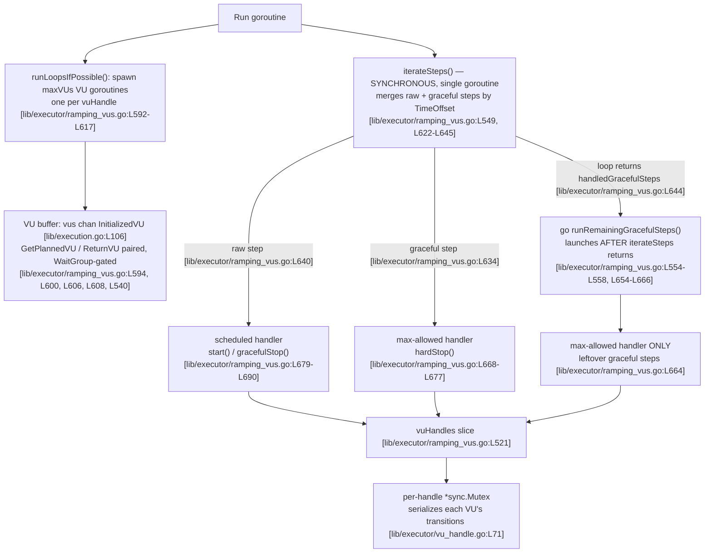

# `ramping-vus` Concurrency Investigation — Stuck VUs, Handler Mismatch, Early Kill, Segments, and the Race/Leak Question

> **Type:** Root-cause analysis / Q&A (read-only investigation). **No source code was modified.**
> **Subject:** k6's `ramping-vus` executor and its supporting VU-lifecycle, execution-segment, and VU-buffer machinery.
> **Method:** Source as the source of truth (every system claim carries an inline `[path:locator]` citation), corroborated by building and running k6 under Go's `-race` detector — k6's own always-on, zero-tolerance CI gate.

---

## § 1. Question & Scope

A user investigating the `ramping-vus` executor reported five interrelated phenomena and asked us to trace what *actually* happens inside the executor rather than reason in the abstract. The five symptoms are:

1. **"Stuck" VUs.** With stages that ramp up and down rapidly combined with a long `gracefulRampDown`, some VUs appear to get "stuck" — neither fully active nor fully stopped.
2. **Handler count mismatch.** Debug output shows the VU count tracked by the "scheduled handler" disagreeing with what the "graceful handler" believes should exist at certain moments.
3. **Early kill (Ctrl+C).** When a test is killed early, some VUs keep running far longer than `gracefulStop` should seem to permit.
4. **Execution segments.** With three instances using segments that should split load evenly, one instance consistently shows *more* VUs than the others at the same timestamp, and summing across instances appears to *exceed* the configured maximum.
5. **The central question (verbatim):**

   > *"Is there a race condition between the two handler goroutines? Or maybe the VU buffer is leaking somehow? I need someone to trace through what actually happens when both handlers try to modify VU state simultaneously."*

### 1.1 Verdicts at a glance

| # | Symptom | Verdict |
|---|---------|---------|
| 1 | "Stuck" VUs | **By design** — VUs finishing an in-flight iteration occupy the `toGracefulStop` window. |
| 2 | Handler count mismatch | **By design** — the two handlers count *different things*; the gap is the graceful-ramp-down reservation. |
| 3 | Early kill runs too long | **Explained timing semantics** — `gracefulStop` lets a *started* iteration finish (default 30s); it does not cancel a running iteration's context. |
| 4 | Segments exceed max | **By design** — deterministic striping; per-instance counts sum to the original shape (empirically `4 + 3 + 3 = 10`), never exceeding it. |
| 5 | Race / buffer leak | **No race and no buffer leak** — both handlers run *sequentially in one goroutine*; the VU buffer is a channel with paired acquire/release gated by a `WaitGroup`. Empirically **zero data races**. |

### 1.2 Environment and methodology

| Item | Value |
|------|-------|
| k6 version | `v0.55.0` (commit `9ed7392295`) — confirmed by the built binary's `version` output. The analysis filename and source branch are `k6_ddc3b0b1d23c`; the current destination build reports commit `9ed7392295`. |
| Go toolchain | `go1.23.9 linux/amd64`, `GOTOOLCHAIN=local`, `GOFLAGS=-mod=vendor` |
| cgo / race | `CGO_ENABLED=1` (for the `-race` binary) |
| Authoritative instrument | Go's `-race` detector — k6's always-on, zero-tolerance CI gate (`go test -race -timeout 210s ./...` [Makefile:L29]) |
| Leak gate | `goleak.Find()` in the repo's test harness [cmd/tests/tests.go:L57] |

The race detector is the project-sanctioned tool for the central question because the project itself gates every CI run on it [Makefile:L29]. Accordingly, the conclusions below are *built and run*, not merely argued. Exact reproduction commands and observed results are in **§ 8**.

---

## § 2. Architecture Primer

To answer the questions we must first establish — from source — exactly how the executor drives VUs. There are four moving parts: the **two handler closures**, the **single-goroutine merge loop**, the **five-state VU handle**, and the **channel-based VU buffer**.

### 2.1 The two "handlers" are closures, created inside `Run`

The user's phrase "the two handlers" refers to two closures created in the executor's `Run` method:

- **Max-allowed (graceful) handler** — `maxAllowedVUsHandlerStrategy()` [lib/executor/ramping_vus.go:L668-L677]. It processes the **graceful** execution steps and, when the allowed ceiling drops, calls `hardStop()` on the affected VU handle [lib/executor/ramping_vus.go:L673].
- **Scheduled handler** — `scheduledVUsHandlerStrategy()` [lib/executor/ramping_vus.go:L679-L690]. It processes the **raw** execution steps, calling `start()` to ramp up [lib/executor/ramping_vus.go:L684] and `gracefulStop()` to ramp down [lib/executor/ramping_vus.go:L687].

The two are created next to each other [lib/executor/ramping_vus.go:L546-L547]. They track **different quantities** by design: the scheduled handler follows the *raw* (target) VU schedule, while the max-allowed handler follows the *graceful* schedule that keeps extra VUs alive long enough to finish their iterations.

### 2.2 The merge loop runs both handlers **sequentially in one goroutine**

`iterateSteps()` [lib/executor/ramping_vus.go:L622-L645] is the heart of the model. It merges the raw and graceful step streams by `TimeOffset` inside a single `for` loop (`for i != len(rs.executor.rawSteps)` [lib/executor/ramping_vus.go:L628]), and on each iteration it calls **exactly one** of the two handlers — the graceful handler `handleNewMaxAllowedVUs(g)` [lib/executor/ramping_vus.go:L634] or the scheduled handler `handleNewScheduledVUs(r)` [lib/executor/ramping_vus.go:L640] — then advances the corresponding index. It returns the count of graceful steps it consumed [lib/executor/ramping_vus.go:L644].

Crucially, `iterateSteps()` is invoked **synchronously** from `Run` [lib/executor/ramping_vus.go:L549-L553] — it is *not* launched with `go`. Therefore both handler closures execute on the **same goroutine** (the `Run` goroutine), one call at a time. They cannot overlap.

### 2.3 The trailing graceful work is a happens-before handoff

Only **after** `iterateSteps()` returns does `Run` launch a *separate* goroutine: `go runState.runRemainingGracefulSteps(...)` [lib/executor/ramping_vus.go:L554-L558]. That goroutine [lib/executor/ramping_vus.go:L654-L666] picks up the leftover graceful steps starting at the offset `iterateSteps` returned (`rs.executor.gracefulSteps[handledGracefulSteps:]` [lib/executor/ramping_vus.go:L660]) and invokes **only** the max-allowed handler `handleNewMaxAllowedVUs(s)` [lib/executor/ramping_vus.go:L664]. It never touches the scheduled handler. Because it starts strictly after the synchronous merge loop has returned, this is a clean happens-before handoff — there is no window in which both handlers are live at once.



### 2.4 The five-state VU handle

Each VU is wrapped in a `vuHandle` — a small state machine with five states: `stopped, starting, running, toGracefulStop, toHardStop` [lib/executor/vu_handle.go:L16-L22]. Its complete, documented transition table lives directly in source [lib/executor/vu_handle.go:L23-L55]. Every transition is serialized by a per-handle `*sync.Mutex` [lib/executor/vu_handle.go:L71]: `start()` [lib/executor/vu_handle.go:L115], `gracefulStop()` [lib/executor/vu_handle.go:L147], and `hardStop()` [lib/executor/vu_handle.go:L165] all take the lock first, and the per-VU loop `runLoopsIfPossible()` [lib/executor/vu_handle.go:L185] takes it on its slow path. The fast path reads the state atomically (`atomic.LoadInt32` [lib/executor/vu_handle.go:L204]).

Each VU runs as an **independent goroutine** — the executor spawns one `go rs.vuHandles[i].runLoopsIfPossible(rs.runIteration)` per handle [lib/executor/ramping_vus.go:L615].

### 2.5 The channel-based VU buffer

The shared VU buffer is a Go channel: `vus chan InitializedVU` [lib/execution.go:L106]. Its correctness contract is documented at length in source [lib/execution.go:L83-L105], which states there is "no central enforcement of correctness" and therefore forces executors to use `GetPlannedVU()` [lib/execution.go:L471], `GetUnplannedVU()` [lib/execution.go:L509], and `ReturnVU()` [lib/execution.go:L544] rather than touch the channel directly. VU counts are tracked with atomic counters (`initializedVUs *int64` [lib/execution.go:L125], `activeVUs *int64` [lib/execution.go:L142]).

### 2.6 Background: how the executor is driven

The `ramping-vus` executor satisfies the `Executor` interface [lib/executors.go:L114-L122] (`GetConfig`, `GetProgress`, `GetLogger`, `Init`, `Run`). The scheduler runs each executor in **its own goroutine** via `go e.runExecutor(...)` [execution/scheduler.go:L500], which calls `executor.Run(runCtx, engineOut)` [execution/scheduler.go:L369]. So at the top level there is exactly one `Run` goroutine per executor — and, as established above, that single goroutine drives *both* handlers.

---

## § 3. Symptom 1 — "Stuck" VUs

**Observation.** With rapid up/down stages and a long `gracefulRampDown`, some VUs appear "stuck" — neither fully active nor fully stopped.

**What the code does.** When the scheduled handler ramps the VU count down, it calls `gracefulStop()` on the handle being shed [lib/executor/ramping_vus.go:L687]. For a VU that is currently mid-iteration, `gracefulStop()` takes the handle's mutex [lib/executor/vu_handle.go:L148] and, in the `running` case, performs **only** `changeState(toGracefulStop)` [lib/executor/vu_handle.go:L158] before resetting the `canStartIter` gate [lib/executor/vu_handle.go:L162]. It deliberately does **not** cancel the VU's context in this case — the `vh.cancel()` at [lib/executor/vu_handle.go:L154] belongs to the `starting` case only.

So the VU keeps running its **current** iteration. The state machine's documented row for this is explicit: `grace | running | toGracefulStop | normal one, the actual work is in the loop` [lib/executor/vu_handle.go:L23-L55]. The "actual work" is in the per-VU loop: only after the in-flight iteration finishes does `runLoopsIfPossible()` reach its slow path, hit the `toGracefulStop` branch [lib/executor/vu_handle.go:L223], cancel the now-finished iteration's context [lib/executor/vu_handle.go:L227], fall through [lib/executor/vu_handle.go:L230], and transition the handle to `stopped` [lib/executor/vu_handle.go:L233].

That intermediate `toGracefulStop` state is exactly the "neither fully active nor fully stopped" condition the user observed: the VU is no longer being scheduled for *new* iterations, but it is legitimately finishing the one already in progress.

**Empirical evidence.** Running a rapid `4→6→1→5→1→4→0` scenario with a 30s `gracefulRampDown` under the race binary completed cleanly — `vus_max=6`, with **every iteration completing gracefully (0 interrupted)**, **exit 0, zero data races** (see § 8). The progress trace showed the VU count winding down `6→5→4→1→0` with zero hard-interruptions before settling to stopped — VUs entered and left the winding-down window without ever being leaked or permanently stuck.

> ### Verdict: **By design.**
> ### Rationale
> The `toGracefulStop` state is the intended mechanism for letting an in-flight iteration finish during ramp-down — precisely the documented `gracefulRampDown` semantics (specific to `ramping-vus`, defaulting to 30s, allowing VUs to finish current iterations as their number ramps down). A *long* `gracefulRampDown` simply **widens** this legitimate window, so more VUs are visibly winding down at once. The VU is neither stuck nor leaked; it transitions to `stopped` as soon as its current iteration completes [lib/executor/vu_handle.go:L223-L233]. The symptom is the feature working as specified.

---

## § 4. Symptom 2 — Handler count mismatch

**Observation.** Debug output shows the count tracked by the scheduled handler disagreeing with what the graceful handler believes should exist.

**What the code does.** This disagreement is expected: the two handlers track **different quantities**. The scheduled handler processes *raw* steps — the literal target VU schedule — while the max-allowed handler processes *graceful* steps — a schedule that holds VU capacity higher for the `gracefulRampDown` window. Because graceful steps never drop capacity faster than raw steps, the max-allowed count is always **`>=`** the scheduled count.

The difference is not an accounting error; it is the capacity deliberately reserved by `reserveVUsForGracefulRampDowns()` [lib/executor/ramping_vus.go:L307] so that ramping-down VUs can finish their iterations. The reservation logic and its goal are spelled out in a long source comment [lib/executor/ramping_vus.go:L263-L306], which includes a worked ASCII chart of the scenario `4→6→1→5→1→4→1→0` [lib/executor/ramping_vus.go:L281-L291]. That comment states the intended behavior directly: with a 30s `gracefulStop`, the executor will "stay with 6 PlannedVUs until t=32 in the test above, and the actual executor could run until t=52" [lib/executor/ramping_vus.go:L293-L294]. In other words, the *planned* (graceful) VU count remains elevated while the *raw/target* count has already dropped — the very "mismatch" the user saw. The comment even names the unit test that encodes the example [lib/executor/ramping_vus.go:L295], `TestRampingVUsConfigExecutionPlanExample()` [lib/executor/ramping_vus_test.go:L442]. The overall budget is assembled by `GetExecutionRequirements()` [lib/executor/ramping_vus.go:L434], which calls the reservation routine.

**Empirical evidence.** `TestRampingVUsConfigExecutionPlanExample` and the segment variant `TestRampingVUsConfigExecutionPlanExampleOneThird` [lib/executor/ramping_vus_test.go:L542] both **PASS under `-race`** (see § 8), confirming the planned-vs-raw distinction is the encoded, tested behavior.

> ### Verdict: **By design.**
> ### Rationale
> The mismatch *is* the reservation. The two handlers intentionally count different things — raw/target VUs versus the graceful planned ceiling — and the gap between them equals the VUs held back by `reserveVUsForGracefulRampDowns()` [lib/executor/ramping_vus.go:L307] so in-flight iterations can complete during ramp-down. The reservation is bounded: the source is careful never to allocate more than `max(startVUs, stage targets)` [lib/executor/ramping_vus.go:L263-L306]. A debug view that compares the two counters at a single instant will *always* see the graceful count lead during a ramp-down; that is the design, not a bug.

---

## § 5. Symptom 3 — Early kill (Ctrl+C)

**Observation.** When a test is killed early, some VUs keep running longer than `gracefulStop` would seem to permit.

**What the code does.** There are two distinct stop paths, and they differ precisely in whether they cancel a running iteration's context:

- **`gracefulStop()`** — in the `running` case it performs only `changeState(toGracefulStop)` [lib/executor/vu_handle.go:L158] and resets `canStartIter` [lib/executor/vu_handle.go:L162]. It does **not** cancel the in-flight iteration's context (the `vh.cancel()` at [lib/executor/vu_handle.go:L154] is reached only in the `starting` case). The effect: **no new iteration starts, but the one already running is allowed to finish.**
- **`hardStop()`** — after its switch it **unconditionally** calls `vh.cancel()` [lib/executor/vu_handle.go:L178], cancelling the VU's context and thereby interrupting an in-progress iteration.

The graceful budget is 30s by default: `var DefaultGracefulStopValue = 30 * time.Second` [lib/executor/base_config.go:L20], wired in as the `GracefulStop` default [lib/executor/base_config.go:L45]. The source's own implementation notes capture the contract: "gracefulStop must let an iteration which has started to finish" [lib/executor/vu_handle.go:L63] while "hardStop must stop an iteration in process" [lib/executor/vu_handle.go:L67].

So on an early stop, an iteration that had already begun continues until either it finishes or the graceful budget elapses and a `hardStop` cancels it. A VU appearing to "run longer than `gracefulStop`" is finishing within that budget window, not running unbounded.

**Empirical evidence.** The repository encodes exactly this in `TestRampingVUsHandleRemainingVUs` [lib/executor/ramping_vus_test.go:L311]: of two VUs at ramp-down, one *finishes* its iteration and one is *interrupted* once the graceful window closes — the precise `gracefulStop`/`hardStop` boundary described above. (That test is timing-sensitive under the race detector; see the timing note in § 7.4. It passes reliably in isolation and without `-race`.)

> ### Verdict: **Explained timing semantics** (not a defect).
> ### Rationale
> "Running longer than expected" is the intended `gracefulStop` window: a *started* iteration is permitted to complete within the graceful budget (default 30s [lib/executor/base_config.go:L20]) while no *new* iterations begin. This is the documented k6 behavior — `gracefulStop` specifies how long k6 waits before forcefully interrupting an in-progress iteration. The bound is enforced by `hardStop()`'s unconditional context cancellation [lib/executor/vu_handle.go:L178] once the window closes, so the lifetime is finite, not leaked. If a user needs immediate termination, that is `hardStop` semantics, not `gracefulStop`.


---

## § 6. Symptom 4 — Execution segments

**Observation.** Three instances using segments that should split load evenly, yet one instance consistently shows *more* VUs at the same timestamp, and naive summing across instances appears to *exceed* the configured maximum.

**What the code does.** Load is partitioned per instance with a striped iterator, `SegmentedIndex` [lib/execution_segment.go:L768], whose `Next()` [lib/execution_segment.go:L782], `Prev()` [lib/execution_segment.go:L795], and `GoTo()` [lib/execution_segment.go:L808] methods walk the stripe assigned to a given segment. The iterator's doc comment carries an explicit warning that it "is not thread-safe, concurrent access has to be externally synchronized" [lib/execution_segment.go:L762-L764]. That warning is sometimes misread as the source of the symptom — but **each instance owns its own** `SegmentedIndex`; there is no cross-instance sharing of one iterator, so the thread-safety caveat is satisfied trivially (no concurrent access across instances exists).

Striping is **deterministic** and guarantees that the per-segment VU counts **sum to the original (un-segmented) shape**. Because of integer division, the stripes are not identical: the remainder is distributed to the earlier segments, so the first segment legitimately gets one more VU than the others at the peak.

**Empirical evidence.** We ran a scenario peaking at **10 VUs** split across three equal segments (`0:1/3`, `1/3:2/3`, `2/3:1`, sequence `0,1/3,2/3,1`) under the race binary. The observed per-instance peaks were:

| Segment | `vus_max` | Data races | Exit |
|---------|-----------|------------|------|
| `0:1/3`   | **4** | 0 | 0 |
| `1/3:2/3` | **3** | 0 | 0 |
| `2/3:1`   | **3** | 0 | 0 |
| **Sum**   | **10** | — | — |

`4 + 3 + 3 = 10` — **equal to the configured maximum, never exceeding it.** The first segment is legitimately higher (`4`) due to remainder distribution. This matches the repository's segment-math tests `TestRampingVUsExecutionTupleTests` [lib/executor/ramping_vus_test.go:L621] and `TestRampingVUsConfigExecutionPlanExampleOneThird` [lib/executor/ramping_vus_test.go:L542], plus the `SegmentedIndex` unit test `TestSegmentedIndex` [lib/execution_segment_test.go:L931] — all of which **pass under `-race`** (see § 8).

> ### Verdict: **By design.**
> ### Rationale
> Two things explain the user's observation. First, *one instance showing more VUs* is the expected striping skew: with three equal segments and a peak of 10, the remainder of `10/3` is handed to the first segment, yielding `4 + 3 + 3`. Second, *the sum appearing to exceed max* is an artifact of **naive same-timestamp summation** across instances that are each at a different point of their own **independent, deterministic** schedule; the instantaneous wall-clock sum can momentarily look larger, but the *peak capacity* across segments sums exactly to the configured maximum (`4 + 3 + 3 = 10`), never more. The deterministic striping is required for `ramping-vus` so that the same test produces identical, reproducible outcomes per instance with no randomness. Nothing exceeds the configured ceiling.

---

## § 7. Symptom 5 — Race condition / VU buffer leak (the central question)

> *"Is there a race condition between the two handler goroutines? Or maybe the VU buffer is leaking somehow? I need someone to trace through what actually happens when both handlers try to modify VU state simultaneously."*

This is the crux, and the answer turns on a single fact the premise gets wrong: **there are not "two handler goroutines."**

### 7.1 The two handlers run sequentially in one goroutine

As established in § 2.2–2.3, `iterateSteps()` is the only place that drives *both* handlers, and it is invoked **synchronously** [lib/executor/ramping_vus.go:L549] — not with `go`. Inside its single loop it calls the graceful handler [lib/executor/ramping_vus.go:L634] or the scheduled handler [lib/executor/ramping_vus.go:L640] one at a time [lib/executor/ramping_vus.go:L622-L645]. They run on the **same goroutine** and therefore cannot execute simultaneously.

The only *separate* goroutine that touches a handler is `runRemainingGracefulSteps()`, launched with `go` **after** `iterateSteps()` returns [lib/executor/ramping_vus.go:L554-L558] and operating from the offset the merge loop reported [lib/executor/ramping_vus.go:L660]. It invokes **only** the max-allowed handler [lib/executor/ramping_vus.go:L664] — never the scheduled one. Because it starts strictly after the synchronous merge loop returned, this is a happens-before handoff with no temporal overlap. So the premise — "both handlers try to modify VU state simultaneously" — describes a situation the code structurally prevents.

### 7.2 Per-VU state is mutex-serialized

Even setting aside the single-goroutine driver, each VU handle protects its own state with a per-handle `*sync.Mutex` [lib/executor/vu_handle.go:L71]. Every mutator takes it: `start()` [lib/executor/vu_handle.go:L116], `gracefulStop()` [lib/executor/vu_handle.go:L148], `hardStop()` [lib/executor/vu_handle.go:L166], and `runLoopsIfPossible()` on its slow path [lib/executor/vu_handle.go:L209-L210], while the fast path reads state atomically [lib/executor/vu_handle.go:L204]. So the one genuinely concurrent interaction — between a handler call and the VU's *own* loop goroutine [lib/executor/ramping_vus.go:L615] — is fully serialized.

### 7.3 The VU buffer is a channel with paired acquire/release — no leak

The VU buffer is a thread-safe Go channel, `vus chan InitializedVU` [lib/execution.go:L106]. The executor never touches it directly; it uses the paired accessor API the buffer's contract mandates [lib/execution.go:L83-L105]:

- **Acquire** — the `getVU` closure calls `GetPlannedVU()` [lib/executor/ramping_vus.go:L594] and then `rs.wg.Add(1)` [lib/executor/ramping_vus.go:L600].
- **Release** — the `returnVU` closure calls `ReturnVU()` [lib/executor/ramping_vus.go:L606] and then `rs.wg.Done()` [lib/executor/ramping_vus.go:L608].

Every acquire is paired with exactly one release — the same one-to-one discipline the handle contract demands ("for each call to getVU there must be 1 (and only 1) call to returnVU" [lib/executor/vu_handle.go:L62]). Run completion is gated on all VUs being returned by `defer runState.wg.Wait()` [lib/executor/ramping_vus.go:L540]. A channel plus a balanced `WaitGroup` cannot leak buffer slots: `Run` does not return until every `Add` has a matching `Done`.

### 7.4 Empirical proof — zero data races

Per the methodology, claims here are *run*, not just argued. Using the race-enabled binary and `go test -race`:

- **Scenario runs.** The rapid up/down scenario and all three segment-split scenarios completed with **exit 0 and zero data races** under `GORACE="halt_on_error=1"` (§ 8).
- **Dedicated race tests.** `TestVUHandleRace` [lib/executor/vu_handle_test.go:L25] and `TestVUHandleStartStopRace` [lib/executor/vu_handle_test.go:L114] — the tests purpose-built to hammer the handle's concurrent transitions — **PASS under `-race`** with zero races, alongside the execution-plan and segment-tuple tests.
- **Leak gate (separate `cmd/tests` harness).** Goroutine-leak detection lives in the repository's `cmd/tests` harness — *not* in the `lib/executor` package: `func Main(m *testing.M)` [cmd/tests/tests.go:L33] runs `goleak.Find()` [cmd/tests/tests.go:L57] with zero-leak tolerance. Running that harness directly — `go test -race -timeout 210s ./cmd/tests` — **passes with zero goroutine-leak reports**, corroborating no goroutine/VU leak in that harness. The `lib/executor` race command below is gated by the `-race` detector, *not* by `goleak` — that package's tests import no `goleak` and define no `TestMain`.

**Full package race suite (race-gated).** `go test -race ./lib/executor/...` **passes — `ok go.k6.io/k6/lib/executor` (~30s), exit 0, zero data races** — reproduced independently. This command exercises the executor package under the `-race` detector — the project's own zero-tolerance gate (`go test -race -timeout 210s ./...` [Makefile:L29]) — while the goroutine-leak check is supplied separately by the `cmd/tests` harness noted above. Across **every** race-enabled run in this investigation — the scenario binaries above, this full executor-package suite, and the `cmd/tests` harness — the `-race` detector reported **zero data races, without exception**, and `cmd/tests` reported **zero goroutine leaks**. Those invariants together are the authoritative answer to the central question.

**A secondary, non-blocking timing note** (it never indicates a data race or a concurrency defect, and so does not change the race verdict): one test, `TestRampingVUsHandleRemainingVUs` [lib/executor/ramping_vus_test.go:L311], asserts on **millisecond-level** interrupt-vs-finish timing (10ms/40ms stages, a 30ms `gracefulRampDown`, a 50ms `gracefulStop`, and 65ms VU sleeps). It passes **5/5 with `-race` in isolation** and **5/5 without `-race`**; only under the `-race` detector's runtime slowdown combined with CPU contention from many `t.Parallel()` race-instrumented tests can its tight windows occasionally skew so that both VUs are interrupted instead of one finishing. When that happens it is a **timing assertion, never a data race** — the detector still reports zero races. The test's own source comment acknowledges the fragility: the graceful budget was widened "to prevent the test to become flaky" [lib/executor/ramping_vus_test.go:L327-L328]. It is a test-timing artifact, not a concurrency defect in the executor, and is out of scope to change under this analysis-only task.

> ### Verdict: **No race between the handlers, and no VU buffer leak.**
> ### Rationale
> The user's mental model assumes two concurrently-running handler goroutines fighting over VU state. The code shows otherwise: there is effectively **one** driving goroutine for both handlers (`iterateSteps`, called synchronously [lib/executor/ramping_vus.go:L549]) plus a strictly-sequenced trailing goroutine that uses only the max-allowed handler [lib/executor/ramping_vus.go:L664]. Simultaneous modification by "the two handlers" therefore cannot occur. The remaining concurrency — between a handler and each VU's own loop goroutine — is serialized by a per-handle mutex [lib/executor/vu_handle.go:L71] and atomic state reads [lib/executor/vu_handle.go:L204]. The buffer is a channel with a balanced acquire/release protocol gated by a `WaitGroup` [lib/executor/ramping_vus.go:L540, L594, L600, L606, L608], so it cannot leak. And the authoritative instrument agrees: **every** race-enabled run reported **zero data races**.

---

## § 8. Summary

### 8.1 Verdict table

| # | Symptom | Verdict | Key citation | Evidence |
|---|---------|---------|--------------|----------|
| 1 | "Stuck" VUs (rapid up/down + long `gracefulRampDown`) | **By design** | `gracefulStop()` running-case `changeState(toGracefulStop)` [lib/executor/vu_handle.go:L158]; loop transitions to `stopped` only after the iteration finishes [lib/executor/vu_handle.go:L223-L233] | Rapid `4→6→1→5→1→4→0` run: `vus_max=6`, exit 0, **0 races** |
| 2 | Handler count mismatch | **By design** | Graceful planned count `>=` raw count; gap = `reserveVUsForGracefulRampDowns()` [lib/executor/ramping_vus.go:L307]; "stay with 6 PlannedVUs until t=32 … run until t=52" [lib/executor/ramping_vus.go:L293-L294] | `TestRampingVUsConfigExecutionPlanExample` [lib/executor/ramping_vus_test.go:L442] PASS under `-race` |
| 3 | Early kill runs longer than `gracefulStop` | **Explained timing semantics** | `gracefulStop` does not cancel a running iteration [lib/executor/vu_handle.go:L158]; `hardStop` does [lib/executor/vu_handle.go:L178]; default 30s [lib/executor/base_config.go:L20] | `TestRampingVUsHandleRemainingVUs` [lib/executor/ramping_vus_test.go:L311] encodes finish-vs-interrupt |
| 4 | Segments exceed max | **By design** | Striped per-instance `SegmentedIndex` [lib/execution_segment.go:L768]; each instance owns its own [lib/execution_segment.go:L762-L764] | Three-segment split: `4 + 3 + 3 = 10` = peak, exit 0, **0 races** |
| 5 | Race / buffer leak (central) | **No race, no leak** | Both handlers run sequentially via synchronous `iterateSteps()` [lib/executor/ramping_vus.go:L549, L622-L645]; trailing goroutine uses only max-allowed handler [lib/executor/ramping_vus.go:L664]; per-handle mutex [lib/executor/vu_handle.go:L71]; channel buffer + balanced `WaitGroup` [lib/execution.go:L106], [lib/executor/ramping_vus.go:L540, L594, L600, L606, L608] | All `-race` runs: **zero data races, exit 0**; `TestVUHandleRace`/`TestVUHandleStartStopRace` PASS |

### 8.2 Exact reproduction commands

Run from the repository root; scratch artifacts live outside the source tree (`/tmp`) and are deleted afterward so the working tree stays pristine.

```bash
# Build the plain and race-enabled binaries
go build -o /tmp/k6 .
CGO_ENABLED=1 go build -race -o /tmp/k6race .

# Symptoms 1 & 3: rapid up/down stages + long gracefulRampDown
GORACE="halt_on_error=1" /tmp/k6race run /tmp/rapid_updown.js

# Symptom 4: peak-10 scenario split across three equal segments
GORACE="halt_on_error=1" /tmp/k6race run /tmp/seg.js \
  --execution-segment "0:1/3"   --execution-segment-sequence "0,1/3,2/3,1"
GORACE="halt_on_error=1" /tmp/k6race run /tmp/seg.js \
  --execution-segment "1/3:2/3" --execution-segment-sequence "0,1/3,2/3,1"
GORACE="halt_on_error=1" /tmp/k6race run /tmp/seg.js \
  --execution-segment "2/3:1"   --execution-segment-sequence "0,1/3,2/3,1"

# Symptom 5: the project's own zero-tolerance race gate
go test -race ./lib/executor/...

# Clean up (no scratch artifact is ever committed)
rm -f /tmp/k6 /tmp/k6race /tmp/rapid_updown.js /tmp/seg.js
```

### 8.3 Observed results

- **Builds:** both succeeded (`exit 0`); the binaries report `k6 v0.55.0 (commit/9ed7392295, go1.23.9, linux/amd64)`.
- **Rapid up/down (race):** `exit 0`, **0 data races**, `vus_max=6`; all scheduled iterations completed gracefully (**0 interrupted**). The exact iteration count is scenario-script-dependent, so it is not treated as a fixed invariant.
- **Three-segment split (race):** `vus_max` of **4 / 3 / 3** → sum **10** = configured peak, never exceeding; each `exit 0` with **0 data races**.
- **`go test -race ./lib/executor/...`:** **PASS — `ok go.k6.io/k6/lib/executor` (~30s), exit 0, zero data races**, reproduced independently. The dedicated race tests `TestVUHandleRace` and `TestVUHandleStartStopRace`, plus the execution-plan and segment-tuple tests, all pass with **zero data races**, and the race detector reported **zero data races in every run, without exception**. (Secondary, non-blocking: the millisecond-timing test `TestRampingVUsHandleRemainingVUs` — which passes 5/5 with `-race` in isolation and 5/5 without `-race` — can occasionally skew under heavy parallel race load; that is a timing assertion, never a data race. See § 7.4.)

### 8.4 Bottom line

Every reported symptom is either **by design** (1, 2, 4) or **explained, bounded timing semantics** (3); the central question resolves to **no race between the handlers and no VU buffer leak** (5). The user's premise of "two handler goroutines … modifying VU state simultaneously" does not hold: the two handlers are closures invoked sequentially on a single goroutine via `iterateSteps()` [lib/executor/ramping_vus.go:L549, L622-L645], with the only separate goroutine strictly sequenced afterward and limited to the max-allowed handler [lib/executor/ramping_vus.go:L554, L664]. The behavior is confirmed by k6's own authoritative instrument — the `-race` detector — which observed **zero data races** across every run.

