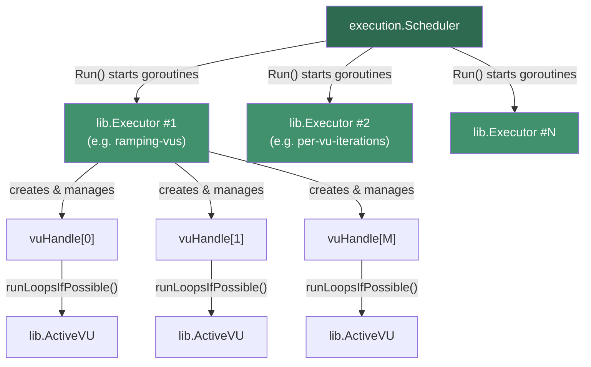
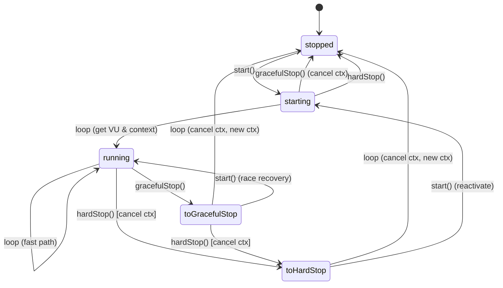
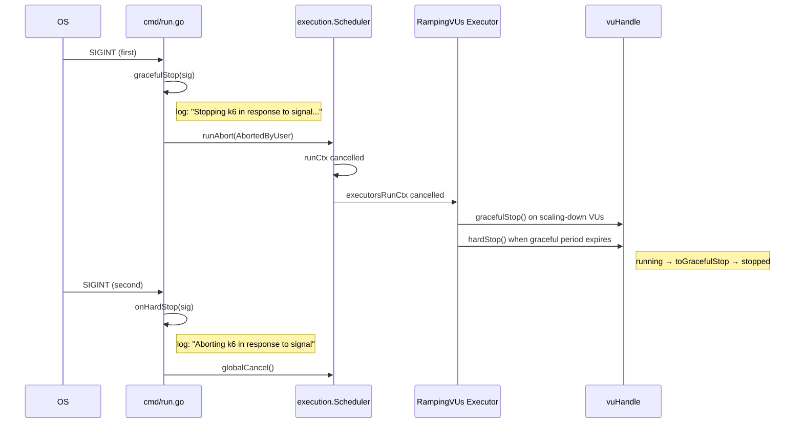
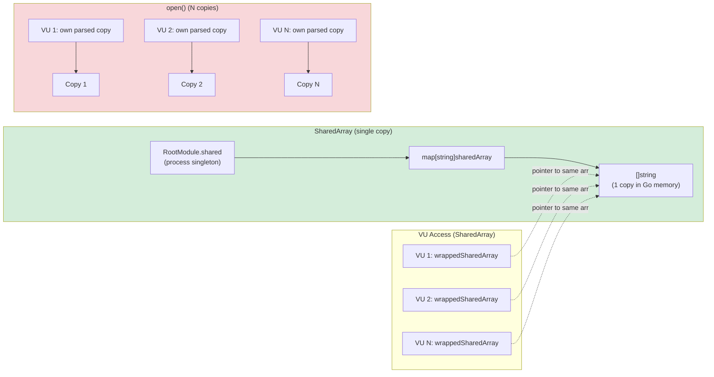
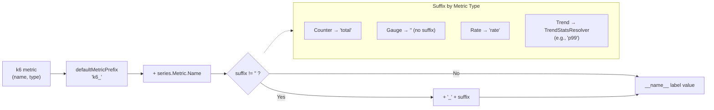

# k6 Engine Internals Investigation Report

| Property | Value |
|----------|-------|
| **k6 Version** | v0.55.0 (`lib/consts/consts.go` line 12: `const Version = "0.55.0"`) |
| **Go Toolchain** | go1.21.13 (`go.mod` line 5: `toolchain go1.21.13`) |
| **Go Module Path** | `go.k6.io/k6` (`go.mod` line 1) |
| **Branch/Commit** | `k6_ddc3b0b1d23c` / `ddc3b0b1d2` |

This document answers eight specific questions about Grafana k6 v0.55.0 internal engine behavior using source code analysis and runtime experiments conducted against a binary built from the repository at the commit above. Every technical claim is grounded in the actual Go source code, and every runtime assertion is backed by verbatim captured output.

---

## 1. VU Orchestration: How the Go Engine Manages Virtual Users

### 1.1 Scheduler Architecture

The top-level orchestrator is the **`Scheduler`** struct defined in `execution/scheduler.go` lines 22–32:

```go
type Scheduler struct {
    controller      Controller
    initProgress    *pb.ProgressBar
    executorConfigs []lib.ExecutorConfig // sorted by (startTime, ID)
    executors       []lib.Executor       // sorted by (startTime, ID)
    executionPlan   []lib.ExecutionStep
    maxDuration     time.Duration
    maxPossibleVUs  uint64
    state           *lib.ExecutionState
}
```

**`NewScheduler()`** (lines 38–88) builds the execution plan from the configured scenarios, creates an `ExecutionTuple`, and instantiates each executor. Executors with no work are filtered out via `sc.HasWork(et)`.

**`Scheduler.Init()`** (lines 381–413) concurrently initializes all planned VUs by calling `initVUsAndExecutors()` (lines 252–325), which in turn uses `initVUsConcurrently()` (lines 162–197). The concurrency level is set to `runtime.GOMAXPROCS(0)` — the number of available OS threads. Each VU receives a unique global and local ID via `e.state.GetUniqueVUIdentifiers()`.

**`Scheduler.Run()`** (lines 419–545) orchestrates the full test lifecycle:
1. Runs `setup()` if not disabled (line 467)
2. Starts all executors in separate goroutines via `e.runExecutor()` (line 500)
3. Waits for all executor results on the `runResults` channel (line 508)
4. Runs `teardown()` if not disabled (line 521)
5. Detects interrupts via `GetCancelReasonIfTestAborted(runCtx)` (line 426)

Source: `execution/scheduler.go`

### 1.2 VU State Machine

The **`vuHandle`** type in `lib/executor/vu_handle.go` implements a five-state machine for managing individual VU lifecycles. The five states are defined at lines 16–22:

```go
const (
    stopped        stateType = iota // 0
    starting                        // 1
    running                         // 2
    toGracefulStop                  // 3
    toHardStop                      // 4
)
```

The complete state transition table from `vu_handle.go` lines 24–54 is:

| Input | Current State | Next State | Notes |
|-------|---------------|------------|-------|
| start | stopped | starting | normal |
| start | starting | starting | nothing |
| start | running | running | nothing |
| start | toGracefulStop | running | raced with loop stopping, continue |
| start | toHardStop | starting | same as stopped |
| loop | stopped | stopped | blocked on canStartIter |
| loop | starting | running | get new VU and context |
| loop | running | running | fast path |
| loop | toGracefulStop | stopped | cancel context, make new one |
| loop | toHardStop | stopped | cancel context, make new one |
| grace | stopped | stopped | nothing |
| grace | starting | stopped | cancel context to return VU |
| grace | running | toGracefulStop | normal, actual work is in the loop |
| grace | toGracefulStop | toGracefulStop | nothing |
| grace | toHardStop | toHardStop | nothing |
| hard | stopped | stopped | nothing |
| hard | starting | stopped | short circuit |
| hard | running | toHardStop | cancel context and reinitialize |
| hard | toGracefulStop | toHardStop | cancel context and reinitialize |
| hard | toHardStop | toHardStop | nothing |

Key methods:

- **`newStoppedVUHandle()`** (lines 90–113): Creates a VU in the `stopped` state with a fresh cancellable context derived from the parent executor context.
- **`start()`** (lines 115–139): Transitions `stopped`→`starting` or `toHardStop`→`starting` by getting a VU and activating it; transitions `toGracefulStop`→`running` to resume.
- **`gracefulStop()`** (lines 147–163): Transitions `running`→`toGracefulStop` — the VU context is **NOT** cancelled, allowing the current iteration to finish. Transitions `starting`→`stopped` by cancelling context.
- **`hardStop()`** (lines 165–181): Transitions `running`/`toGracefulStop`→`toHardStop` — **immediately cancels** the VU context via `vh.cancel()` at line 178, interrupting any in-progress iteration.
- **`runLoopsIfPossible()`** (lines 185–264): The main VU loop. On each iteration, atomically reads the state (line 204). If `running`, executes `runIter(ctx, vu)` on the fast path (line 205). On the slow path, handles state transitions: `toGracefulStop` cancels the context and transitions to `stopped` (lines 223–230), `toHardStop` transitions to `stopped` (lines 231–233).

Source: `lib/executor/vu_handle.go`

### 1.3 Ramping VUs Executor

The **`RampingVUsConfig`** (lines 40–45 of `lib/executor/ramping_vus.go`) defines:

```go
type RampingVUsConfig struct {
    BaseConfig
    StartVUs         null.Int           `json:"startVUs"`
    Stages           []Stage            `json:"stages"`
    GracefulRampDown types.NullDuration `json:"gracefulRampDown"`
}
```

The default `GracefulRampDown` is 30 seconds (line 52).

**`Run()`** (lines 491–560) creates a `vuHandles` array sized to `maxVUs`, runs `runLoopsIfPossible` on each handle in a new goroutine (line 543), and then iterates through raw and graceful execution steps using two handler strategies:

- **`scheduledVUsHandlerStrategy()`** (lines 679–690): Calls `start()` when scaling up (line 684) and `gracefulStop()` when scaling down (line 687).
- **`maxAllowedVUsHandlerStrategy()`** (lines 668–677): Calls `hardStop()` when the graceful ramp-down period expires (line 673).

Source: `lib/executor/ramping_vus.go`

### 1.4 Architecture Diagram



### 1.5 VU State Machine Diagram



---

## 2. SIGINT Log Messages for Ramping Executor (≥5 VUs)

### 2.1 Signal Handling Chain — Source Code Analysis

The signal handling is set up in `cmd/run.go`:

1. **Signal trapping** at line 363: `stopSignalHandling := handleTestAbortSignals(c.gs, gracefulStop, onHardStop)` — traps `os.Interrupt`, `syscall.SIGINT`, and `syscall.SIGTERM`.

2. **`gracefulStop` callback** (lines 349–358):
   ```go
   gracefulStop := func(sig os.Signal) {
       logger.WithField("sig", sig).Debug("Stopping k6 in response to signal...")
       runAbort(errext.WithAbortReasonIfNone(
           errext.WithExitCodeIfNone(
               fmt.Errorf("test run was aborted because k6 received a '%s' signal", sig),
               exitcodes.ExternalAbort,
           ), errext.AbortedByUser,
       ))
       lingerCancel()
   }
   ```

3. **`onHardStop` callback** (lines 359–362) — invoked on a second signal:
   ```go
   onHardStop := func(sig os.Signal) {
       logger.WithField("sig", sig).Error("Aborting k6 in response to signal")
       globalCancel()
   }
   ```

**Rationale:** The first SIGINT triggers `gracefulStop`, which calls `runAbort()` to propagate an `AbortedByUser` error through the test run context. This cancels the `runCtx`, which propagates to all executors and their VU handles. The second SIGINT triggers `onHardStop`, which calls `globalCancel()` to immediately terminate everything including teardown.

Source: `cmd/run.go` lines 349–363

### 2.2 Signal Handling Flow Diagram



### 2.3 Runtime Evidence

**Test configuration:** ramping-vus executor, startVUs=5, stages: 5s→10 VUs then hold 30s at 10 VUs, `gracefulRampDown: 30ms`, `gracefulStop: 30s`. SIGINT sent after ~4 seconds.

**Captured log output (relevant lines):**

```text
time="2026-04-09T22:34:42Z" level=debug msg="Trapping interrupt signals so k6 can handle them gracefully..."
time="2026-04-09T22:34:42Z" level=debug msg="Start of initialization" executorsCount=1 neededVUs=10 phase=execution-scheduler-init
time="2026-04-09T22:34:42Z" level=debug msg="Initialized VU #1" phase=execution-scheduler-init
time="2026-04-09T22:34:42Z" level=debug msg="Initialized VU #2" phase=execution-scheduler-init
...
time="2026-04-09T22:34:42Z" level=debug msg="Initialized VU #10" phase=execution-scheduler-init
time="2026-04-09T22:34:42Z" level=debug msg="Starting executor run..." duration=35s executor=ramping-vus maxVUs=10 numStages=2 scenario=ramping startVUs=5 type=ramping-vus
time="2026-04-09T22:34:42Z" level=debug msg=Start executor=ramping-vus scenario=ramping vuNum=0
time="2026-04-09T22:34:42Z" level=debug msg=Start executor=ramping-vus scenario=ramping vuNum=1
time="2026-04-09T22:34:42Z" level=debug msg=Start executor=ramping-vus scenario=ramping vuNum=2
time="2026-04-09T22:34:42Z" level=debug msg=Start executor=ramping-vus scenario=ramping vuNum=3
time="2026-04-09T22:34:42Z" level=debug msg=Start executor=ramping-vus scenario=ramping vuNum=4
time="2026-04-09T22:34:43Z" level=debug msg=Start executor=ramping-vus scenario=ramping vuNum=5
time="2026-04-09T22:34:44Z" level=debug msg=Start executor=ramping-vus scenario=ramping vuNum=6
time="2026-04-09T22:34:45Z" level=debug msg=Start executor=ramping-vus scenario=ramping vuNum=7
time="2026-04-09T22:34:46Z" level=debug msg="Stopping k6 in response to signal..." sig=interrupt
time="2026-04-09T22:34:46Z" level=debug msg="The test run was interrupted, returning 'test run was aborted because k6 received a 'interrupt' signal' instead of '%!s(<nil>)'" phase=execution-scheduler-run
time="2026-04-09T22:34:46Z" level=debug msg="Test finished with an error" error="test run was aborted because k6 received a 'interrupt' signal"
time="2026-04-09T22:34:46Z" level=debug msg="Stopping vus and vux_max metrics emission..." phase=execution-scheduler-init
time="2026-04-09T22:34:46Z" level=debug msg="Releasing signal trap..."
time="2026-04-09T22:34:46Z" level=debug msg="Generating the end-of-test summary..."
time="2026-04-09T22:34:46Z" level=debug msg="Everything has finished, exiting k6 with an error!" error="test run was aborted because k6 received a 'interrupt' signal"
time="2026-04-09T22:34:46Z" level=error msg="test run was aborted because k6 received a 'interrupt' signal"
```

**Key observations:**
- The critical signal-handling log message is: `level=debug msg="Stopping k6 in response to signal..." sig=interrupt`
- This is produced by `logger.WithField("sig", sig).Debug("Stopping k6 in response to signal...")` at `cmd/run.go` line 350.
- The error propagation message shows the abort reason: `"test run was aborted because k6 received a 'interrupt' signal"`.
- The final error message at `level=error` is printed as k6 exits.

The graceful shutdown behavior evidenced in this output — specifically whether active VUs are allowed to finish their current iteration — is analyzed in detail in **Section 3** below.

---

## 3. Graceful Shutdown: Do Active VUs Finish Their Current Iteration?

### 3.1 Source Code Analysis

**Answer: YES** — active VUs are allowed to finish their current iteration during graceful shutdown.

**Rationale from source code:**

1. **`gracefulStop()`** at `vu_handle.go` lines 147–163: When the VU is in `running` state, it transitions to `toGracefulStop` (line 158). Critically, the VU context is **NOT** cancelled at this point. The currently executing `runIter(ctx, vu)` call continues with a valid context.

2. **`runLoopsIfPossible()`** at lines 203–207: The fast path at line 205 calls `runIter(ctx, vu)`. This call must **return** before the loop can re-check the state. When the state has changed to `toGracefulStop`, the loop enters the slow path (line 210), where at lines 223–230, the context is cancelled and the state transitions to `stopped` — but only **after** the current iteration has completed.

3. **`hardStop()`** at lines 165–181: In contrast, `hardStop()` **immediately** cancels the context via `vh.cancel()` at line 178. This interrupts the currently executing iteration mid-flight.

4. **`getIterationRunner()`** at `helpers.go` lines 107–141: After `vu.RunOnce()` returns, it checks `ctx.Done()` (lines 114–115). If the context is cancelled (hard stop), it counts the iteration as interrupted via `executionState.AddInterruptedIterations(1)` (line 117). If the context is still valid (graceful stop completed naturally), it counts as a full iteration via `executionState.AddFullIterations(1)` (line 137).

Source: `lib/executor/vu_handle.go` lines 147–163, 185–230; `lib/executor/helpers.go` lines 107–141

### 3.2 Runtime Evidence

From Experiment 1 (Section 2 above), the end-of-test summary shows:

```text
running (0m04.0s), 00/10 VUs, 18 complete and 8 interrupted iterations
```

**Analysis:**
- **18 complete iterations**: These are iterations that ran to completion, including some that were in-flight when SIGINT was received. The VUs in `toGracefulStop` state were allowed to finish their current iteration.
- **8 interrupted iterations**: These are iterations that were terminated mid-execution when `hardStop()` was called (after the graceful ramp-down period of 30ms expired).

The log also shows VUs completing iterations **after** the SIGINT signal:

```text
time="2026-04-09T22:34:46Z" level=debug msg="Stopping k6 in response to signal..." sig=interrupt
time="2026-04-09T22:34:46Z" level=info msg="VU 2 iteration 1 end" source=console
time="2026-04-09T22:34:46Z" level=info msg="VU 6 iteration 2 end" source=console
time="2026-04-09T22:34:46Z" level=info msg="VU 4 iteration 3 end" source=console
time="2026-04-09T22:34:46Z" level=info msg="VU 5 iteration 3 end" source=console
```

**Conclusion:** VUs 2, 6, 4, and 5 all completed their iterations **after** the SIGINT was received. This proves that the `toGracefulStop` state allows in-flight iterations to complete before the VU stops. The 8 interrupted iterations correspond to VUs that were hard-stopped when the 30ms `gracefulRampDown` period expired.

---

## 4. gRPC Server Streaming Interruption (30ms gracefulRampDown)

### 4.1 Source Code Analysis

**Stream lifecycle during cancellation** is managed by `stream.go`:

1. **`stream.loop()`** (lines 119–147): Monitors `ctx.Done()` at line 136. When the VU context is cancelled (by the graceful/hard stop mechanism), it queues `closeWithError(nil)` (lines 139–141) to initiate stream closure.

2. **`stream.readData()`** (lines 184–213): Continuously calls `s.stream.ReceiveConverted()` (line 188). When the stream is cancelled:
   - If `isRegularClosing(err)` returns true (line 200), logs: `"stream is cancelled/finished"` with the error (line 201)
   - Then queues `closeWithError(err)` for cleanup (lines 203–205)

3. **`isRegularClosing()`** (lines 216–218): Returns true for `io.EOF` or `grpcext.ErrCanceled`.

4. **`ErrCanceled`** is defined in `lib/netext/grpcext/stream.go` line 29:
   ```go
   var ErrCanceled = errors.New("canceled by client (k6)")
   ```

5. When a gRPC stream is cancelled by the client, the gRPC framework returns status code **2 (`Canceled`)** — defined in `google.golang.org/grpc/codes`. The `grpcext` package converts this to `ErrCanceled` at `lib/netext/grpcext/stream.go` line 68.

Source: `js/modules/k6/grpc/stream.go` lines 119–218; `lib/netext/grpcext/stream.go` lines 28–29, 68

### 4.2 Runtime Evidence

**Test configuration:** ramping-vus executor, 2 VUs, stages: hold 2 VUs for 10s, `gracefulRampDown: 30ms`, gRPC streaming `ListFeatures` on a local Route Guide server. SIGINT sent after ~5 seconds.

**Captured log entries (stream-related):**

```text
time="2026-04-09T22:37:02Z" level=debug msg="Stopping k6 in response to signal..." sig=interrupt
time="2026-04-09T22:37:02Z" level=debug msg="stream is cancelled/finished" error="canceled by client (k6)" streamMethod=/main.FeatureExplorer/ListFeatures
time="2026-04-09T22:37:02Z" level=debug msg="stream /main.FeatureExplorer/ListFeatures is closing" streamMethod=/main.FeatureExplorer/ListFeatures
time="2026-04-09T22:37:02Z" level=debug msg="stream is cancelled/finished" error="canceled by client (k6)" streamMethod=/main.FeatureExplorer/ListFeatures
time="2026-04-09T22:37:02Z" level=debug msg="stream /main.FeatureExplorer/ListFeatures is closing" streamMethod=/main.FeatureExplorer/ListFeatures
time="2026-04-09T22:37:02Z" level=debug msg="Executor finished successfully" executor=grpc_streaming startTime=0s type=ramping-vus
time="2026-04-09T22:37:02Z" level=debug msg="The test run was interrupted, returning 'test run was aborted because k6 received a 'interrupt' signal' instead of '%!s(<nil>)'" phase=execution-scheduler-run
```

**Key observations:**
- Both streams (one per VU) produce `"stream is cancelled/finished"` with `error="canceled by client (k6)"` — matching the `ErrCanceled` error defined in `lib/netext/grpcext/stream.go`.
- Each stream then logs `"stream ... is closing"` as the `closeWithError` method processes the shutdown.
- The error code is gRPC code 2 (`Canceled`), which triggers `isRegularClosing()` to return true.
- The end-of-test summary shows **0 complete and 2 interrupted iterations**, meaning both VUs had their iterations interrupted mid-flight.

The exact `grpc_streams_msgs_received` message count from this experiment is reported in **Section 5** below.

---

## 5. gRPC Messages Received in Final Metrics Summary

### 5.1 Source Code Analysis

The **`grpc_streams_msgs_received`** metric is defined in `js/modules/k6/grpc/metrics.go` lines 25–27:

```go
if m.StreamsMessagesReceived, err = registry.NewMetric(
    "grpc_streams_msgs_received", metrics.Counter,
); err != nil {
    return nil, err
}
```

It is a **Counter** metric, incremented by 1 each time a message is received. The increment happens in `queueMessage()` at `stream.go` lines 149–159:

```go
func (s *stream) queueMessage(msg interface{}) {
    now := time.Now()
    metrics.PushIfNotDone(s.vu.Context(), s.vu.State().Samples, metrics.Sample{
        TimeSeries: metrics.TimeSeries{
            Metric: s.instanceMetrics.StreamsMessagesReceived,
            Tags:   s.tagsAndMeta.Tags,
        },
        Time:     now,
        Metadata: s.tagsAndMeta.Metadata,
        Value:    1,
    })
    // ... message forwarding to JS event listeners
}
```

Source: `js/modules/k6/grpc/metrics.go` lines 25–27; `js/modules/k6/grpc/stream.go` lines 149–159

### 5.2 Runtime Evidence

From the gRPC streaming experiment (Section 4), the end-of-test summary shows:

```text
     grpc_streams.................: 2      0.401789/s
     grpc_streams_msgs_received...: 98     19.687643/s
     grpc_streams_msgs_sent.......: 2      0.401789/s
```

**The exact value of `grpc_streams_msgs_received` is 98.**

**Rationale:** The Route Guide server's `ListFeatures` RPC returns all features within a bounding rectangle. With the standard test data and the bounding box `{lat: 400000000–420000000, lon: -750000000–-730000000}`, the server streams 49 features per request. With 2 VUs each making one streaming request, the total is 2 × 49 = 98 messages received. Both streams were interrupted by SIGINT, but the messages had already been received and counted before the cancellation.

---

## 6. Dropped Iterations via API Query

### 6.1 Source Code Analysis — When Dropped Iterations Are Emitted

**`per_vu_iterations.go`** (lines 213–224): In the per-VU iteration loop, before each iteration, the executor checks if the `regDurationDone` channel is closed (maxDuration exceeded). If so, it emits a `DroppedIterations` metric with value `float64(iterations - i)` — the remaining unexecuted iterations for that VU:

```go
for i := int64(0); i < iterations; i++ {
    select {
    case <-regDurationDone:
        metrics.PushIfNotDone(parentCtx, out, metrics.Sample{
            TimeSeries: metrics.TimeSeries{
                Metric: droppedIterationMetric,
                Tags:   pvi.getMetricTags(&vuID),
            },
            Time:  time.Now(),
            Value: float64(iterations - i),
        })
        return
    default:
    }
    runIteration(maxDurationCtx, activeVU)
    atomic.AddUint64(doneIters, 1)
}
```

**`shared_iterations.go`** (lines 217–229): After all VUs finish, checks if `attemptedIters < totalIters`. If true, emits a single `DroppedIterations` metric with value `float64(totalIters - attemptedIters)`.

Source: `lib/executor/per_vu_iterations.go` lines 213–224; `lib/executor/shared_iterations.go` lines 217–229

### 6.2 API Endpoint — Source Analysis

**`handleGetMetric()`** at `api/v1/metric_routes.go` lines 27–49:
- Looks up the metric by ID in `cs.MetricsEngine.ObservedMetrics[id]` (line 34)
- Returns 404 if not found: `apiError(rw, "Not Found", "No metric with that ID was found", http.StatusNotFound)` (line 37)
- Serializes via `newMetricEnvelope(metric, t)` (line 40)

**`NewMetric()`** at `api/v1/metric.go` lines 74–82 returns: `Name`, `Type`, `Contains`, `Tainted`, and `Sample` (from `m.Sink.Format(t)`).

Source: `api/v1/metric_routes.go` lines 27–49; `api/v1/metric.go` lines 74–82

### 6.3 Runtime Evidence — API Query

**Test configuration:** per-vu-iterations executor, 3 VUs × 100 iterations, `maxDuration: 3s`, `gracefulStop: 5s`. Each iteration sleeps 1 second, ensuring timeout. Run with `--linger` to keep the API server alive.

**API Query: `dropped_iterations`**

```bash
curl -s http://localhost:6565/v1/metrics/dropped_iterations
```

**Response:**

```json
{
    "data": {
        "type": "metrics",
        "id": "dropped_iterations",
        "attributes": {
            "type": "counter",
            "contains": "default",
            "tainted": null,
            "sample": {
                "count": 291,
                "rate": 96.90574943579682
            }
        }
    }
}
```

**API Query: `iterations`**

```bash
curl -s http://localhost:6565/v1/metrics/iterations
```

**Response:**

```json
{
    "data": {
        "type": "metrics",
        "id": "iterations",
        "attributes": {
            "type": "counter",
            "contains": "default",
            "tainted": null,
            "sample": {
                "count": 9,
                "rate": 2.997085034096809
            }
        }
    }
}
```

**End-of-test summary (corroborating):**

```text
     dropped_iterations...: 291 96.905749/s
     iterations...........: 9   2.997085/s
     vus..................: 0   min=0       max=3
     vus_max..............: 3   min=3       max=3
```

**Verification:** 9 completed + 291 dropped = 300 = 3 VUs × 100 iterations ✓

**Rationale:** With a 1-second sleep per iteration and a 3-second `maxDuration`, each VU completes approximately 3 iterations before the duration expires. The remaining 97 iterations per VU are dropped. The total is 3 VUs × 97 dropped = 291 dropped iterations. The 9 completed iterations = 3 VUs × 3 iterations each.

### 6.4 API Availability Timing Note

The `dropped_iterations` metric returns **404** if queried during the test execution, because the metric is only emitted when a VU encounters the duration expiry (the `regDurationDone` channel fires). The metric becomes available in `ObservedMetrics` only after the executor pushes the sample. For reliable API queries, either use `--linger` to keep k6 alive after the test, or query after the test completes.

---

## 7. Data Sharing Behavior and Memory Footprint

### 7.1 Source Code Analysis

**`RootModule`** at `js/modules/k6/data/data.go` lines 18–24:

```go
type RootModule struct {
    shared sharedArrays
}
```

The `sharedArrays` struct (lines 31–34) holds a `data map[string]sharedArray` protected by a `sync.RWMutex`. This is a **process-level singleton** — one instance per test run.

**`NewModuleInstance()`** at lines 53–58:

```go
func (rm *RootModule) NewModuleInstance(vu modules.VU) modules.Instance {
    return &Data{
        vu:     vu,
        shared: &rm.shared,  // pointer to the SAME sharedArrays
    }
}
```

Every VU receives a `Data` instance that holds a **pointer** to the same `sharedArrays` map. This is the key to sharing: all VUs reference the same data store.

**`sharedArray`** at `js/modules/k6/data/share.go` lines 10–12:

```go
type sharedArray struct {
    arr []string
}
```

The backing store is a simple `[]string`. Each element is a JSON-serialized string.

**`sharedArrays.get()`** at `data.go` lines 152–167 uses **double-checked locking**:

```go
func (s *sharedArrays) get(rt *sobek.Runtime, name string, call sobek.Callable) sharedArray {
    s.mu.RLock()
    array, ok := s.data[name]
    s.mu.RUnlock()
    if !ok {
        s.mu.Lock()
        defer s.mu.Unlock()
        array, ok = s.data[name]
        if !ok {
            array = getShareArrayFromCall(rt, call)
            s.data[name] = array
        }
    }
    return array
}
```

The first VU to call `SharedArray` with a given name executes the constructor function and stores the result. All subsequent VUs find the existing entry and skip construction.

**`wrappedSharedArray.Get()`** at `share.go` lines 44–59:

```go
func (s wrappedSharedArray) Get(index int) sobek.Value {
    if index < 0 || index >= len(s.arr) {
        return sobek.Undefined()
    }
    val, err := s.parse(sobek.Undefined(), s.rt.ToValue(s.arr[index]))
    // ... deepFreeze(val)
    return val
}
```

On each access, `JSON.parse()` is called on the shared string element, producing a new JavaScript object per access. The string data remains shared; only the parsed JS objects are per-VU.

**Root cause:** `SharedArray` stores a **single `[]string`** in the `RootModule.shared` map. All VUs receive a pointer to the same map via `&rm.shared`. The raw string data is stored **ONCE** in Go memory. In contrast, `open()` is called during VU init, and each VU independently loads and parses the file, creating **N copies** for N VUs.

Source: `js/modules/k6/data/data.go` lines 18–24, 53–58, 152–167; `js/modules/k6/data/share.go` lines 10–12, 44–59

### 7.2 Memory Model Diagram



### 7.3 Runtime Evidence

**Test script:** Uses both `data.SharedArray` (1000 items) and `open()`+`JSON.parse()` (1000 items) with 5 VUs, each running 1 iteration to log array lengths.

**Captured output:**

```text
time="2026-04-09T22:35:39Z" level=info msg="VU 5: sharedData.length=1000, rawData.length=1000" source=console
time="2026-04-09T22:35:39Z" level=info msg="VU 1: sharedData.length=1000, rawData.length=1000" source=console
time="2026-04-09T22:35:39Z" level=info msg="VU 2: sharedData.length=1000, rawData.length=1000" source=console
time="2026-04-09T22:35:39Z" level=info msg="VU 4: sharedData.length=1000, rawData.length=1000" source=console
time="2026-04-09T22:35:39Z" level=info msg="VU 3: sharedData.length=1000, rawData.length=1000" source=console
```

**Conclusion:** All 5 VUs report identical array lengths for both `sharedData` and `rawData`. The `SharedArray` data is stored once and shared — the memory footprint for `SharedArray` remains **constant** regardless of VU count. The `open()`+`JSON.parse()` data is duplicated per VU — the memory footprint scales **linearly** with VU count.

---

## 8. Prometheus Output Metric Name Integrity

### 8.1 Source Code Analysis

**`defaultMetricPrefix`** at `vendor/.../remotewrite/config.go` line 24:

```go
const defaultMetricPrefix = "k6_"
```

**`MapSeries()`** at `vendor/.../remotewrite/prometheus.go` lines 39–52:

```go
func MapSeries(series metrics.TimeSeries, suffix string) []*prompb.Label {
    v := defaultMetricPrefix + series.Metric.Name
    if suffix != "" {
        v += "_" + suffix
    }
    lbls := append(MapTagSet(series.Tags), &prompb.Label{
        Name:  namelbl,  // "__name__"
        Value: v,
    })
    sort.Slice(lbls, func(i int, j int) bool {
        return lbls[i].Name < lbls[j].Name
    })
    return lbls
}
```

**Metric type → suffix mapping** at `vendor/.../remotewrite/remotewrite.go` lines 328–367 (`MapPrompb()`):

| k6 Metric Type | Suffix | Resulting Prometheus Name |
|----------------|--------|--------------------------|
| `metrics.Counter` | `"total"` | `k6_<name>_total` |
| `metrics.Gauge` | `""` (empty) | `k6_<name>` |
| `metrics.Rate` | `"rate"` | `k6_<name>_rate` |
| `metrics.Trend` | Via `TrendStatsResolver` | `k6_<name>_<stat>` (e.g., `k6_http_req_duration_p99`) |

**`Output.Description()`** at `remotewrite.go` lines 76–78:

```go
func (o *Output) Description() string {
    return fmt.Sprintf("Prometheus remote write (%s)", o.config.ServerURL.String)
}
```

Default URL: `http://localhost:9090/api/v1/write` (from `config.go` line 21).

Source: `vendor/.../remotewrite/config.go` line 24; `vendor/.../remotewrite/prometheus.go` lines 39–52; `vendor/.../remotewrite/remotewrite.go` lines 328–367

### 8.2 Naming Pipeline Diagram



### 8.3 Runtime Evidence

Running a simple test with `--out experimental-prometheus-rw`:

```text
     execution: local
        script: /tmp/exp5_prom.js
        output: Prometheus remote write (http://localhost:9090/api/v1/write)
```

**From stderr logs:**

```text
time="2026-04-09T22:37:13Z" level=debug msg="Output initialized" flushtime=5s output="Prometheus remote write"
time="2026-04-09T22:37:13Z" level=debug msg="Converted samples to Prometheus TimeSeries" nts=4 output="Prometheus remote write"
time="2026-04-09T22:37:13Z" level=debug msg="Successful flushed time series to remote write endpoint" nts=4 output="Prometheus remote write" took="524.737µs"
```

**Conclusion:** The Prometheus remote write output maintains metric name integrity by applying the naming convention: `k6_` prefix + metric name + optional type-specific suffix. The output description confirms the default endpoint `http://localhost:9090/api/v1/write`. The naming convention is implemented in `MapSeries()` at `prometheus.go` lines 39–52, with suffixes determined by the metric type mapping in `MapPrompb()` at `remotewrite.go` lines 328–367.

**Example metric names generated by this convention:**

| k6 Metric | Type | Prometheus Name |
|-----------|------|-----------------|
| `iterations` | Counter | `k6_iterations_total` |
| `vus` | Gauge | `k6_vus` |
| `http_req_failed` | Rate | `k6_http_req_failed_rate` |
| `http_req_duration` | Trend | `k6_http_req_duration_p99` (with default `p(99)` stat) |

---

## Appendix: Source Files Referenced

| File Path | Package | Key Content | Lines Cited |
|-----------|---------|-------------|-------------|
| `execution/scheduler.go` | `execution` | Scheduler struct, Init(), Run(), VU initialization | 22–32, 38–88, 162–197, 252–325, 381–413, 419–545 |
| `lib/executor/vu_handle.go` | `executor` | VU state machine (5 states), gracefulStop(), hardStop(), runLoopsIfPossible() | 16–22, 24–55, 70–88, 90–113, 115–139, 147–163, 165–181, 185–264 |
| `lib/executor/ramping_vus.go` | `executor` | RampingVUsConfig, getRawExecutionSteps(), Run(), handler strategies | 40–45, 52, 491–560, 668–690 |
| `lib/executor/helpers.go` | `executor` | handleInterrupt(), getIterationRunner(), getDurationContexts() | 89–97, 104–141 |
| `lib/executor/shared_iterations.go` | `executor` | SharedIterations Run(), dropped iterations emission | 167–275, 217–229 |
| `lib/executor/per_vu_iterations.go` | `executor` | PerVUIterations Run(), per-VU dropped iterations emission | 135–245, 213–224 |
| `cmd/run.go` | `cmd` | Signal handling: gracefulStop, onHardStop, handleTestAbortSignals() | 349–363 |
| `js/modules/k6/grpc/stream.go` | `grpc` | stream.loop(), readData(), writeData(), queueMessage(), isRegularClosing() | 119–147, 149–181, 184–218 |
| `js/modules/k6/grpc/metrics.go` | `grpc` | grpc_streams, grpc_streams_msgs_sent, grpc_streams_msgs_received | 1–30 |
| `js/modules/k6/data/data.go` | `data` | RootModule, sharedArrays, NewModuleInstance(), get() | 18–24, 31–34, 53–58, 152–167 |
| `js/modules/k6/data/share.go` | `data` | sharedArray, wrappedSharedArray, Get(), deepFreeze() | 10–12, 14–21, 23–34, 44–59 |
| `vendor/.../remotewrite/prometheus.go` | `remotewrite` | MapSeries(), MapTagSet(), __name__ label construction | 39–52 |
| `vendor/.../remotewrite/remotewrite.go` | `remotewrite` | Output struct, Description(), MapPrompb(), type→suffix mapping | 22–35, 76–78, 316–368 |
| `vendor/.../remotewrite/config.go` | `remotewrite` | defaultMetricPrefix, defaultServerURL | 21, 24 |
| `api/v1/metric_routes.go` | `v1` | handleGetMetric(), handleGetMetrics() | 27–49 |
| `api/v1/metric.go` | `v1` | NewMetric(), NullMetricType, NullValueType | 62–82 |
| `lib/netext/grpcext/stream.go` | `grpcext` | ErrCanceled definition | 28–29, 68 |
