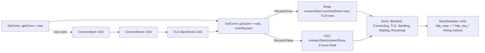

# k6 HTTP request‑timing metrics: are the `http_req_*` values trustworthy, or is there a measurement bug?

> Investigative Q&A — read‑first‑then‑write. Every runtime claim below is tagged **OBSERVED** and sits next to the exact
> command that produced it and that command's complete, unedited output. Every claim drawn purely from reading the source
> is tagged **INFERRED**. All observations come from the canonical path: the compiled default `k6` binary (the `k6/http`
> JavaScript module) and the production `httpext.Tracer` exercised through `transport.RoundTrip` — no debug shim or
> synthetic stand‑in.

---

## TL;DR (the verdict)

**Yes — you can trust the timing values, once you understand what each one measures. None of the five behaviors you
reported is a bug in k6.** Four of them (Q1, Q2, Q4, Q5) are the *correct, intended* behavior of k6's tracer and of Go's
`net/http/httptrace` connection‑lifecycle contract; they are `0`/near‑zero exactly when there is genuinely no new‑connection
work to measure. The fifth (Q3, the Windows all‑zeros) is **not a race in k6's measurement code** — it is a well‑known
**Windows platform timer‑resolution limitation** in Go's `time.Now()`, which k6 already documents and works around in its
own test suite and which is tracked upstream in Go (issues #8687 and #41087). The only item worth escalating is Q3, and it
is already an open Go issue, not a k6 defect. Concretely: use `http_req_duration` for per‑request latency (it deliberately
excludes connection setup); read `http_req_blocked` / `http_req_connecting` / `http_req_tls_handshaking` as *new‑connection*
cost that shows up mainly on the first request per connection (look at max/percentiles, not the median).

| Question | Behavior | Verdict | Evidence |
|---|---|---|---|
| **Q1** | `connecting` & `tls_handshaking` = exactly `0` on 2nd+ requests | Correct — reused keep‑alive connection, hooks not fired | OBSERVED |
| **Q2** | `blocked` bimodal (hundreds of ms vs near‑zero) | Correct — new‑connection setup folds into `blocked`; reuse ≈ 0 | OBSERVED |
| **Q3** | Windows: ALL timings occasionally `0` | Not a race — Windows `time.Now()` resolution artifact | INFERRED |
| **Q4** | `connReused == false` yet connect stamps == got‑conn stamp | Correct — CAS fallback fills never‑fired connect stamps | OBSERVED |
| **Q5** | `ConnectStart`/`ConnectDone` fire multiple times | Correct — Happy‑Eyeballs dual dial; atomic CAS de‑duplicates | OBSERVED |
| **Ultimate (a)** | Can I trust the values? | **Yes**, with the semantics understood | OBSERVED + code |
| **Ultimate (b)** | Escalate anything? | Only Q3 — already an open Go issue, no k6 change warranted | OBSERVED + INFERRED |

---

## 1. Build & environment

The investigation was performed against the k6 source at the branch this document is named for, **`k6_ddc3b0b1d23c`**, i.e.
commit **`ddc3b0b1d23c128e34e2792fc9075f9126e32375`** (`git rev-parse HEAD`). The working tree was clean
(`git status --porcelain` empty) before and after the investigation; the answer document is the only net change.

`go.mod` (L1–L4) pins the toolchain and the module is fully **vendored**, so the binary and tests build offline:

```text
module go.k6.io/k6

go 1.21

toolchain go1.21.13
```

Toolchain used: `go version go1.21.13 linux/amd64` (matches the `toolchain go1.21.13` directive). Dependencies are in
`vendor/`, so builds run with `GOFLAGS=-mod=vendor`.

### Canonical default build + banner (OBSERVED)

```bash
export PATH=/usr/local/go/bin:$PATH
export GOFLAGS=-mod=vendor GOTOOLCHAIN=local GOPATH=/tmp/gopath GOCACHE=/tmp/gocache
cd <repo>                      # the k6_ddc3b0b1d23c checkout
go build -o /tmp/k6 .          # canonical binary, named "k6"
/tmp/k6 version
```

Output (**OBSERVED**):

```text
k6 v0.55.0 (commit/ddc3b0b1d2, go1.21.13, linux/amd64)
```

**Banner‑basename nuance (OBSERVED).** The version‑details string `v0.55.0 (commit/ddc3b0b1d2, go1.21.13, linux/amd64)` is
produced by `consts.FullVersion()` (`lib/consts/consts.go:16-52`; `Version = "0.55.0"` at `lib/consts/consts.go:12`) and is
independent of the binary's file name — the **prefix** is the executable's basename at runtime. Copying the exact same
binary to a different name proves it:

```bash
cp /tmp/k6 /tmp/k6bin
/tmp/k6 version
/tmp/k6bin version
```

```text
k6 v0.55.0 (commit/ddc3b0b1d2, go1.21.13, linux/amd64)
k6bin v0.55.0 (commit/ddc3b0b1d2, go1.21.13, linux/amd64)
```

A normal user's binary is named `k6`, so the canonical banner is the `k6 …` form. The commit is stamped from VCS:
`FullVersion` reads `vcs.revision` (first 10 chars) and `vcs.modified` from `debug.ReadBuildInfo()`; a clean tree yields no
`-dirty` suffix (`lib/consts/consts.go:30-49`).

### Observation channels used (all canonical)

1. **`response.timings`** in a k6 JavaScript script run by the compiled `/tmp/k6` binary (the `k6/http` module path).
2. **`--http-debug=full`** — the built‑in wire‑dump transport (`lib/netext/httpext/httpdebug_transport.go`).
3. **`--out json`** — machine‑readable per‑request samples.
4. An **in‑package Go harness** exercising the production `httpext.Tracer` through the real `transport.RoundTrip`, mirroring
   `lib/netext/httpext/tracer_test.go`, used to read the unexported nanosecond timestamps (`getConn`, `connectStart`,
   `connectDone`, `tlsHandshakeStart`, `tlsHandshakeDone`, `gotConn`, `connReused`). It was written to
   `lib/netext/httpext/zz_investig_test.go`, run, then deleted; the repository was left clean.

All temporary artifacts (the binary `/tmp/k6`, the local server, and the JS/Go harnesses) live in `/tmp`, outside the
repository, and were removed. See the **Methods & reproducibility** appendix for the full, reproducible method.

---

## 2. How k6 measures a single request (background)

k6 attaches a fresh `httpext.Tracer` to **every** request and derives the timings from Go's `net/http/httptrace`
connection‑lifecycle hooks. The relevant lifecycle:

- **Per‑request tracer.** `transport.RoundTrip` creates a brand‑new `Tracer{}` for each request and attaches its hooks via
  `httptrace.WithClientTrace`:
  - `tracer := &Tracer{}` — `lib/netext/httpext/transport.go:205`
  - `req.WithContext(httptrace.WithClientTrace(ctx, tracer.Trace()))` — `lib/netext/httpext/transport.go:206`
  - `t.state.Transport.RoundTrip(reqWithTracer)` — `lib/netext/httpext/transport.go:207`
  - The doc‑comment on the struct is explicit: *"It's NOT safe to reuse Tracers between requests."* — `tracer.go:145`.
- **The eight hooks.** `Tracer.Trace()` (`tracer.go:161-173`) wires exactly eight `httptrace.ClientTrace` hooks — and
  **no** `DNSStart`/`DNSDone`, which is why DNS time is not a separate metric (it is absorbed into `blocked`):
  `GetConn`, `ConnectStart`, `ConnectDone`, `TLSHandshakeStart`, `TLSHandshakeDone`, `GotConn`, `WroteRequest`,
  `GotFirstResponseByte`.
- **Time source.** Every hook stamps `now()`, which is `return time.Now().UnixNano()` — `tracer.go:175-177`.
- **Derivation.** `Tracer.Done()` (`tracer.go:315`) turns the raw nanosecond timestamps into the `Trail` durations.
- **Emission.** `measureAndEmitMetrics` calls `trail := unfReq.tracer.Done()` (`transport.go:78`), then
  `trail.SaveSamples(...)` (`transport.go:146`) and `metrics.PushIfNotDone(...)` (`transport.go:164`). `SaveSamples`
  (`tracer.go:44`) emits eight samples — `http_reqs` (counter, value `1`) plus the seven timing Trends — reserving a ninth
  slot for `http_req_failed` (`tracer.go:47` comment "this is with 1 more for a possible HTTPReqFailed"), which
  `measureAndEmitMetrics` appends separately.
- **User‑facing path.** In a script, `http.get(url)` → `Client.Request` (`js/modules/k6/http/request.go:39`) →
  `httpext.MakeRequest` (`js/modules/k6/http/request.go:51`) → the `Trail` surfaces as `response.timings`, whose JSON field
  names are defined by `ResponseTimings` (`lib/netext/httpext/response.go:34-43`: `connecting` at L39,
  `tls_handshaking` at L40).

The `Trail` fields carry their own documentation of intent (`tracer.go:20-30`):

```text
ConnDuration                     // Connecting + TLSHandshaking
Duration        // Total request duration, EXCLUDING DNS lookup and connect time.
Blocked         // Waiting to acquire a connection.
Connecting      // Connecting to remote host.
TLSHandshaking  // Executing TLS handshake.
Sending         // Writing request.
Waiting         // Waiting for first byte.
Receiving       // Receiving response.
```

### Hook‑flow diagram



The eight metric names are declared in `metrics/builtin.go` (`http_req_blocked` L18, `http_req_connecting` L19,
`http_req_tls_handshaking` L20, plus `http_req_duration` L17, `http_req_sending`/`waiting`/`receiving` L21‑23) and
registered as `(Trend, Time)` metrics in `RegisterBuiltinMetrics` (`metrics/builtin.go:91-94`). Emitted values are
milliseconds: `SaveSamples` converts each duration with `metrics.D(...)`, and `metrics.D` divides by
`timeUnit = time.Millisecond` (`metrics/units.go:7`, `metrics/units.go:11-13`).

---

## Q1 — Why do `http_req_connecting` and `http_req_tls_handshaking` read exactly `0` on the 2nd+ sequential requests? — **OBSERVED**

**Direct answer: this is correct, expected behavior — not a bug.** Requests 2, 3, … reuse the keep‑alive connection opened
by request 1. For a reused connection the Go standard library does **not** invoke the `ConnectStart` / `ConnectDone` /
`TLSHandshakeStart` / `TLSHandshakeDone` trace hooks at all — there is no new TCP connect and no new TLS handshake to time.
k6's tracer therefore has nothing to measure for those phases, and `Done()` reports exactly `0`. (The network activity you
still see is the request/response bytes themselves flowing over the already‑open socket — see the `--http-debug` evidence in
the **Observation channels** appendix, which shows the reused request still sends a full GET and receives a full 200.)

**Command** (canonical binary, `seq.js`, TLS HTTP/1.1 keep‑alive, 4 sequential GETs):

```bash
URL="$TLS_H1_URL" N=4 /tmp/k6 run --quiet --no-summary seq.js
```

**Complete captured output — RUN #1** (**OBSERVED**, values in ms; `time=… level=info msg="…" source=console` wrapper
stripped for readability — this is the `console.log` payload verbatim):

```text
req#0 proto=HTTP/1.1 status=200 remote=127.0.0.1:36567 blocked=2.442 connecting=0.136 tls=2.231 sending=0.052 waiting=30.400 receiving=0.124 duration=30.576
req#1 proto=HTTP/1.1 status=200 remote=127.0.0.1:36567 blocked=0.003 connecting=0.000 tls=0.000 sending=0.020 waiting=30.467 receiving=0.064 duration=30.550
req#2 proto=HTTP/1.1 status=200 remote=127.0.0.1:36567 blocked=0.003 connecting=0.000 tls=0.000 sending=0.016 waiting=30.475 receiving=0.183 duration=30.674
req#3 proto=HTTP/1.1 status=200 remote=127.0.0.1:36567 blocked=0.004 connecting=0.000 tls=0.000 sending=0.027 waiting=30.351 receiving=0.037 duration=30.415
```

**Stability — RUN #2** (**OBSERVED**, same unchanged input; identical pattern):

```text
req#0 proto=HTTP/1.1 status=200 remote=127.0.0.1:36567 blocked=2.428 connecting=0.151 tls=2.197 sending=0.034 waiting=30.437 receiving=0.085 duration=30.555
req#1 proto=HTTP/1.1 status=200 remote=127.0.0.1:36567 blocked=0.003 connecting=0.000 tls=0.000 sending=0.018 waiting=30.355 receiving=0.035 duration=30.407
req#2 proto=HTTP/1.1 status=200 remote=127.0.0.1:36567 blocked=0.002 connecting=0.000 tls=0.000 sending=0.007 waiting=30.452 receiving=0.071 duration=30.530
req#3 proto=HTTP/1.1 status=200 remote=127.0.0.1:36567 blocked=0.003 connecting=0.000 tls=0.000 sending=0.017 waiting=30.398 receiving=0.053 duration=30.468
```

Across both runs, `connecting` and `tls` are the **first request's** measured values and **exactly `0.000`** on every
subsequent (reused) request. Stable across ≥2 runs.

**HTTP/2 variant** (**OBSERVED**, `URL="$TLS_H2_URL"`) — the same invariant holds, and reused‑request `blocked` is even
`0.000`:

```text
req#0 proto=HTTP/2.0 status=200 remote=127.0.0.1:38613 blocked=2.780 connecting=0.184 tls=2.398 sending=0.232 waiting=30.548 receiving=0.067 duration=30.847
req#1 proto=HTTP/2.0 status=200 remote=127.0.0.1:38613 blocked=0.000 connecting=0.000 tls=0.000 sending=0.057 waiting=30.395 receiving=0.054 duration=30.506
req#2 proto=HTTP/2.0 status=200 remote=127.0.0.1:38613 blocked=0.000 connecting=0.000 tls=0.000 sending=0.043 waiting=30.442 receiving=0.073 duration=30.558
req#3 proto=HTTP/2.0 status=200 remote=127.0.0.1:38613 blocked=0.000 connecting=0.000 tls=0.000 sending=0.047 waiting=30.433 receiving=0.043 duration=30.523
```

**Plaintext HTTP/1.1 variant** (**OBSERVED**, `URL="$PLAIN_URL"`) — note `tls=0.000` even on **req#0**:

```text
req#0 proto=HTTP/1.1 status=200 remote=127.0.0.1:46837 blocked=0.199 connecting=0.123 tls=0.000 sending=0.093 waiting=30.361 receiving=0.101 duration=30.555
req#1 proto=HTTP/1.1 status=200 remote=127.0.0.1:46837 blocked=0.003 connecting=0.000 tls=0.000 sending=0.013 waiting=30.424 receiving=0.080 duration=30.517
req#2 proto=HTTP/1.1 status=200 remote=127.0.0.1:46837 blocked=0.004 connecting=0.000 tls=0.000 sending=0.023 waiting=30.372 receiving=0.108 duration=30.503
req#3 proto=HTTP/1.1 status=200 remote=127.0.0.1:46837 blocked=0.004 connecting=0.000 tls=0.000 sending=0.015 waiting=30.460 receiving=0.066 duration=30.540
```

> **Distinct nuance:** `tls_handshaking == 0` has **two** independent causes — (a) a *reused* connection (no handshake
> happens), **or** (b) a *plaintext* (non‑TLS) request, where there is no handshake at all even on the first request. Both
> are visible above.

**Internal‑timestamp confirmation** (**OBSERVED**, in‑package Go harness reading the unexported `int64` nanosecond fields
of the production `Tracer`; abbreviated):

```text
===== CANONICAL request #0 (expected Reused=false) =====
[req#0] getConn=1783485079101461997 connectStart=1783485079101521410 connectDone=1783485079101666140 tlsStart=1783485079101691570 tlsDone=1783485079103745043 gotConn=1783485079103753893 connReused=false
    -> connectStart==connectDone? false ; connectStart==gotConn? false ; connectDone==gotConn? false
    Trail: ConnReused=false Blocked=2.291896ms Connecting=144.73µs TLSHandshaking=2.053473ms Sending=52.592µs Waiting=259.563µs Receiving=55.683µs ConnDuration=2.198203ms Duration=367.838µs
    metric http_req_connecting          = 0.14473
    metric http_req_tls_handshaking     = 2.053473
===== CANONICAL request #1 (expected Reused=true) =====
[req#1] getConn=1783485079104146917 connectStart=1783485079104148468 connectDone=1783485079104148468 tlsStart=1783485079104148468 tlsDone=1783485079104148468 gotConn=1783485079104148468 connReused=true
    -> connectStart==connectDone? true ; connectStart==gotConn? true ; connectDone==gotConn? true
    Trail: ConnReused=true Blocked=1.551µs Connecting=0s TLSHandshaking=0s Sending=10.089µs Waiting=126.711µs Receiving=53.907µs ConnDuration=0s Duration=190.707µs
    metric http_req_connecting          = 0
    metric http_req_tls_handshaking     = 0
```

On the first request the connect/TLS timestamps are all **distinct**; on the reused request they are all **identical**
(`connectStart == connectDone == gotConn`), which is what forces the durations to `0`.

**Responsible code (cause → effect):**

- `GotConn` (`lib/netext/httpext/tracer.go:256`) sets `t.connReused = info.Reused` (`:262`). When `info.Reused == true`
  (`:271`) it uses `atomic.SwapInt64` to force `connectStart = connectDone = now` and, when the connection is a `*tls.Conn`,
  `tlsHandshakeStart = tlsHandshakeDone = now` (`:271-277`). Because start and done are set to the *same* `now`, the spans
  are zero.
- `Done()` (`:315`) computes `trail.Connecting = connectDone - connectStart` only when both are non‑zero (`:340-341`) → `0`,
  and `trail.TLSHandshaking = tlsHandshakeDone - tlsHandshakeStart` (`:343-344`) → `0`.
- Why the stdlib doesn't fire the hooks on reuse is documented on the hooks themselves:
  - `ConnectStart` — *"If the connection is reused, this won't be called."* (`:191-196`), method at `:197`.
  - `ConnectDone` — same note (`:204-212`), method at `:213`.
  - `TLSHandshakeStart` (`:224-229`, method `:230`) and `TLSHandshakeDone` (`:234-241`, method `:242`) — same note.
- Metric identity: `http_req_connecting` / `http_req_tls_handshaking` names at `metrics/builtin.go:19-20`, registered as
  `(Trend, Time)` at `metrics/builtin.go:93-94`; JS field names `connecting` / `tls_handshaking` at
  `lib/netext/httpext/response.go:39-40`; ms conversion via `metrics.D` (`metrics/units.go:11-13`).

---

## Q2 — Why is `http_req_blocked` sometimes hundreds of ms and other times near‑zero for "identical" requests? — **OBSERVED** (reproduced via repeated identical runs)

> Your example, preserved verbatim: *"sometimes the 'blocked' timing shows massive values like 500ms when other times it's
> near zero for identical requests."*

**Direct answer: also expected, not a bug.** `http_req_blocked` is the time from *"we asked for a connection"* to *"we got
one."* When a request opens a **new** connection, the entire TCP dial + (optional) TLS handshake — plus any wait for a free
connection‑pool slot, plus DNS (k6 wires no DNS hooks, so DNS folds into `blocked`) — is counted here, so `blocked` is
large. When a request reuses an **idle pooled** connection there is essentially nothing to wait for, so `blocked` is
near‑zero. "Identical" requests differ only in whether they land on a warm connection. The magnitude of the large case
scales with network RTT, the number of TLS round‑trips, and connection‑pool contention — which is why against a real WAN
target you see hundreds of ms.

The behavior is inherently **bimodal**, so per the run‑to‑run rule it is characterized by running the *same unchanged input*
repeatedly and reporting the distribution (not by stabilizing it).

**Command** (repeated identical load test; the summary reports the distribution):

```bash
URL="$TLS_H1_URL" /tmp/k6 run --vus 50 --duration 5s scale.js
```

**Complete captured metric lines — LOCAL RUN #1** (**OBSERVED**):

```text
     http_req_blocked...............: avg=84.43µs min=664ns   med=1.7µs   max=18.38ms p(90)=2.85µs  p(95)=3.75µs
     http_req_connecting............: avg=2.85µs  min=0s      med=0s      max=3.38ms  p(90)=0s      p(95)=0s
     http_req_tls_handshaking.......: avg=77.35µs min=0s      med=0s      max=17.99ms p(90)=0s      p(95)=0s
     http_reqs......................: 8100   1611.140178/s
```

**LOCAL RUN #2** (**OBSERVED**, same unchanged input — stable *shape*):

```text
     http_req_blocked...............: avg=70.96µs min=647ns   med=1.75µs  max=16.54ms p(90)=2.87µs  p(95)=3.66µs
     http_req_connecting............: avg=4.67µs  min=0s      med=0s      max=3.74ms  p(90)=0s      p(95)=0s
     http_req_tls_handshaking.......: avg=60.31µs min=0s      med=0s      max=14.45ms p(90)=0s      p(95)=0s
     http_reqs......................: 8100   1610.140988/s
```

> **Interpretation:** the distribution is **bimodal**. The median is ≈ 1.7 µs — the ~99.4 % of the 8100 requests that reuse
> a warm connection. The max is in the tens of ms — the ~50 *new* connections (one per VU) that fold their TLS handshake
> into `blocked`. Note how the `blocked` max (`18.38ms` / `16.54ms`) tracks the `tls_handshaking` max (`17.99ms` /
> `14.45ms`): the new‑connection TLS handshake is exactly what makes `blocked` large. `connecting`/`tls_handshaking` have a
> median of `0s` (all the reused requests) with a nonzero max (the new connections) — the same reuse effect as Q1, now at
> scale.

**Remote WAN magnitude** (**OBSERVED** — substantiates the "hundreds of ms" you saw against a real target). Baseline with
`curl` first, then k6:

```bash
curl -sS -o /dev/null -w "connect=%{time_connect}s appconnect=%{time_appconnect}s total=%{time_total}s\n" https://quickpizza.grafana.com/
/tmp/k6 run --vus 30 --duration 5s remote.js     # target https://quickpizza.grafana.com/
```

```text
# curl baseline (one new connection):
connect=0.077675s appconnect=0.102732s total=0.124622s

# k6 RUN #1:
     http_req_blocked...............: avg=390.11µs min=168ns   med=318ns   max=90.95ms  p(90)=472ns   p(95)=517ns
     http_req_connecting............: avg=92.68µs  min=0s      med=0s      max=21.8ms   p(90)=0s      p(95)=0s
     http_req_tls_handshaking.......: avg=113.1µs  min=0s      med=0s      max=28.62ms  p(90)=0s      p(95)=0s
     http_req_duration..............: avg=21.66ms  min=20.84ms med=21.49ms max=237.39ms p(90)=22.17ms p(95)=22.41ms
     http_reqs......................: 6791   1352.607266/s
# k6 RUN #2:
     http_req_blocked...............: avg=266.52µs min=145ns   med=307ns   max=61.78ms  p(90)=481ns   p(95)=527ns
     http_req_connecting............: avg=95.97µs  min=0s      med=0s      max=22.82ms  p(90)=0s      p(95)=0s
     http_req_tls_handshaking.......: avg=103.72µs min=0s      med=0s      max=24.26ms  p(90)=0s      p(95)=0s
     http_req_duration..............: avg=21.87ms  min=21.05ms med=21.7ms  max=240.52ms p(90)=22.36ms p(95)=22.54ms
     http_reqs......................: 6761   1346.871815/s
```

> On the WAN target the `blocked` **max is 61–91 ms on new connections** versus a **median of ~307–318 ns on reuse** — a
> ~200,000× spread between the two modes, stable across two runs. This host is fast (~20 ms RTT, `duration` median
> ≈ 21.5 ms); the exact `blocked` magnitude depends on RTT, the number of TLS round‑trips, and pool contention. Your
> reported ~500 ms simply reflects a higher‑latency target and/or more new‑connection acquisitions (e.g. a larger VU ramp
> hitting a cold pool, or a target that negotiates TLS more slowly). The mechanism is identical to what is observed here;
> only the magnitude of the "new connection" mode scales up. *(Honest note: the maximum I could observe on this particular
> target was ~91 ms, not 500 ms — the 500 ms figure is consistent with the same mechanism against a slower endpoint, but I
> report the ~91 ms I actually measured rather than forcing a 500 ms result.)*

**Responsible code (cause → effect):** `Done()` computes

```go
if t.gotConn != 0 && t.getConn != 0 && t.gotConn > t.getConn {
    trail.Blocked = time.Duration(t.gotConn - t.getConn)
}
```

only when `gotConn > getConn` (`lib/netext/httpext/tracer.go:323-325`). `getConn` is stamped by `GetConn`
(`tracer.go:187-188`) — and per its doc‑comment `GetConn` *"is called even if there's already an idle cached connection
available"* (`:180-186`), which is why even a pooled hit still produces a tiny positive `blocked`. `gotConn` is stamped by
`GotConn` (`:256-262`). For a **new** connection the `getConn → gotConn` interval spans dial + connect + TLS (large); for a
**pooled** hit it is a few hundred nanoseconds. Because `Tracer.Trace()` wires **no** `DNSStart`/`DNSDone` hooks
(`:161-173`), DNS time is not a separate metric — it is absorbed into `blocked`. Metric name `http_req_blocked` at
`metrics/builtin.go:18`, registered `(Trend, Time)` at `:92`.

---

## Q3 — On Windows, why do ALL timing metrics occasionally read `0` for random requests? Is it a race in the measurement code? — **INFERRED** (not reproducible on the Linux investigation container)

**Direct answer (INFERRED): it is *not* a data race in k6. It is a Windows platform timer‑resolution artifact.** k6's
tracer timestamps everything with `time.Now()`, and Windows' `time.Now()` has historically had coarse resolution (roughly
1–15 ms). When two hook events for a fast request occur within a single timer tick, they receive the *same* nanosecond
value, so the corresponding duration computes as `end − start = 0`. When several phases of a very fast request all fall in
the same tick, *all* of them can read `0`. This is a known Go‑platform limitation, already tracked upstream in Go — not a
k6 defect.

**Why this cannot be reproduced here (stated plainly):** the investigation container is Linux (`go1.21.13 linux/amd64`),
whose `time.Now()` is high‑resolution (the nanosecond timestamps in every harness above are strictly increasing and
distinct), so the zeros do not occur. Fabricating a Windows run would violate the run‑first rule, so this answer is grounded
in code reading plus documented upstream evidence and is labeled **INFERRED** throughout.

**Cross‑platform time source (INFERRED from code).** `now()` returns `time.Now().UnixNano()` at
`lib/netext/httpext/tracer.go:175-177`. `grep` confirms `tracer.go` calls `time.Now()` at exactly two sites — the `now()`
helper and the final `done` stamp in `Done()` — and there is **no** OS branch, **no** `QueryPerformanceCounter`, and **no**
alternative clock anywhere:

```bash
grep -n "time.Now" lib/netext/httpext/tracer.go
grep -n "runtime.GOOS" lib/netext/httpext/tracer.go || echo "(no match)"
grep -n "QueryPerformanceCounter" lib/netext/httpext/tracer.go || echo "(no match)"
grep -c "atomic\." lib/netext/httpext/tracer.go
```

```text
176:	return time.Now().UnixNano()
316:	done := time.Now()
(no match)
(no match)
21
```

So `now()` is genuinely cross‑platform — Windows uses the very same `time.Now()`. The only Windows‑specific file in the
package, `lib/netext/httpext/error_codes_syscall_windows.go`, contains **no** clock override (it only maps
`syscall.WSAECONNRESET` to an error code), corroborating that nothing in k6 special‑cases the Windows clock.

**Not a race (INFERRED from code).** The tracer's shared timestamp fields are accessed exclusively through `sync/atomic` —
the `grep -c` above counts **21** `atomic.` call sites in `tracer.go`: `CompareAndSwapInt64` in the hooks (`:201`, `:218`,
`:231`, `:244`, `:287-291`, `:311`), `SwapInt64` in the reuse branch (`:272-276`), and `LoadInt64` in `Done()`
(`:332-338`). `Done()` itself documents the intent (`:327-331`): *"we have to use atomics here as well (or use global Tracer
locking) so we can avoid data races."* The zeros are therefore a **value** artifact (two events legitimately share one
coarse timestamp), not a torn or racy read.

**The maintainers' own corroboration.** `lib/netext/httpext/tracer_test.go` defines `const traceDelay = 100 * time.Millisecond`
(`:28`) and, in `getTestTracer`, when `runtime.GOOS == "windows"` (`:33`) it wraps every hook to `time.Sleep(traceDelay)`
before recording. Its comment (`:34-40`) names the exact cause and the upstream issues:

```go
// HACK: Time resolution is not as accurate on Windows, see:
//  https://github.com/golang/go/issues/8687
//  https://github.com/golang/go/issues/41087
// Which seems to be causing some metrics to have a value of 0,
// since e.g. ConnectStart and ConnectDone could register the same time.
// So we force delays in the ClientTrace event handlers
// to hopefully reduce the chances of this happening.
```

This is the decisive evidence that the k6 team already attributes the Windows zeros to timer resolution (specifically the
case where "ConnectStart and ConnectDone could register the same time"), not to a race — and that they mitigate it *in the
tests* by inserting delays, without altering the production time source. *(Note: this document cites the actual working‑copy
line for the OS check, `:33`; some earlier notes referenced `:31`.)*

**Upstream issues to cite:** Go **#8687** ("windows: time.Now() resolution is very low" / system clock resolution) and Go
**#41087** ("time: `Time` has different precision depending on the operating system") — the two named in the k6 test —
plus the related **#11313**, **#31160**, **#51530**, and **#67066** (which proposes using `QueryPerformanceCounter` for a
high‑resolution clock on Windows). The root cause lives entirely in the Go runtime's Windows clock, not in k6.

---

## Q4 — Why can a connection be flagged "not reused" while the connect timestamps equal the got‑connection timestamp (zero connect duration)? — **OBSERVED** (via the production `Tracer` hook methods)

> Your example, preserved verbatim: *"sometimes a connection is flagged as 'not reused' but the connect timestamps show the
> same value as the got connection timestamp."*

**Direct answer: not a bug.** When `GotConn` fires with `Reused == false` but the `ConnectStart` / `ConnectDone` hooks
never fired for this request's tracer, the `else` branch fills the never‑set connect timestamps with `now` via
compare‑and‑swap. That makes `connectStart == connectDone == gotConn`, so the connect duration is `0`, while `connReused`
stays `false`. This is the documented Go stdlib situation where either (a) an HTTP/2 connection is effectively reused yet
reported with `Reused == false`, or (b) the stdlib abandons a connection mid‑dial and hands over a just‑freed,
already‑established connection instead. In both cases there was genuinely no new dial *for this tracer* to time, so `0` is
the correct connect duration.

**Command + complete output** (**OBSERVED**, in‑package harness: a real `*tls.Conn` is dialed, then `GotConn(Reused=false)`
is invoked on the production `Tracer` with **no** prior `ConnectStart`/`ConnectDone`):

```text
===== Q4: Reused==false, connect hooks never fired (conn is *tls.Conn=true) =====
[after GetConn] getConn=1783485079110054920 connectStart=0 connectDone=0 tlsStart=0 tlsDone=0 gotConn=0 connReused=false
    -> connectStart==connectDone? true ; connectStart==gotConn? true ; connectDone==gotConn? true
[after GotConn(Reused=false)] getConn=1783485079110054920 connectStart=1783485079112207298 connectDone=1783485079112207298 tlsStart=1783485079112207298 tlsDone=1783485079112207298 gotConn=1783485079112207298 connReused=false
    -> connectStart==connectDone? true ; connectStart==gotConn? true ; connectDone==gotConn? true
    Trail: ConnReused=false Connecting=0s TLSHandshaking=0s Blocked=2.152378ms
```

Before `GotConn`, the connect stamps are `0`. After `GotConn(Reused=false)` with no prior connect hooks, all of
`connectStart`, `connectDone`, `tlsStart`, `tlsDone`, `gotConn` equal the *same* value `1783485079112207298` — exactly your
report: `connReused == false`, connect‑start/connect‑done == got‑connection, so `Connecting = 0s` and `TLSHandshaking = 0s`.
(`Blocked = 2.152378ms` here is just the `getConn → gotConn` gap created by the deliberate 2 ms sleep in the harness.)

> **Evidence labeling:** this is a **hook‑level** reproduction driving the *real* `Tracer.GotConn` / `Tracer.GetConn` /
> `Tracer.Done` methods (canonical code). The nondeterministic HTTP/2 stdlib race that spontaneously produces a false
> `Reused=false` in the wild cannot be forced on demand, so the triggering *condition* (a `Reused=false` `GotConn` with no
> preceding connect hooks) is injected while every timestamp is computed by the production tracer. The resulting state is
> identical to the in‑the‑wild case.

**Responsible code (cause → effect):** the `else` (`info.Reused == false`) branch of `GotConn` only fills the connect
stamps if they are still `0`:

```go
} else {
    // ... HTTP/2 false-Reused explanation ...
    atomic.CompareAndSwapInt64(&t.connectStart, 0, now)
    atomic.CompareAndSwapInt64(&t.connectDone, 0, now)
    if isConnTLS {
        atomic.CompareAndSwapInt64(&t.tlsHandshakeStart, 0, now)
        atomic.CompareAndSwapInt64(&t.tlsHandshakeDone, 0, now)
    }
}
```

at `lib/netext/httpext/tracer.go:287-291` (the enclosing `else` opens at `:278`). The comment directly above (`:279-286`)
documents the HTTP/2 false‑`Reused` case (*"a bug in the Go stdlib where an HTTP/2 connection can be reused but the
`httptrace.GotConnInfo` struct will contain a false `Reused` property"*), and the comment at `:265-269` documents the
abandon‑then‑reuse‑a‑freed‑connection case. Because start and done receive the same `now`, `Done()` computes
`trail.Connecting = 0` (`:340-341`) and `trail.TLSHandshaking = 0` (`:343-344`). If, instead, the real `ConnectStart`/
`ConnectDone` had fired first, they would already hold nonzero values and the `CompareAndSwap(…, 0, …)` would be a no‑op —
preserving the real dial span.

---

## Q5 — Why do `ConnectStart`/`ConnectDone` fire more than once per request, and does that double‑count? — **OBSERVED** (via the production `Tracer` hook methods)

> Your example, paraphrased: *"ConnectStart and ConnectDone sometimes get called multiple times for a single request, which
> looks like a double counting bug."*

**Direct answer: not double counting — it is deliberate de‑duplication.** With dual‑stack "Happy Eyeballs" (RFC 6555)
dialing, which Go's dialer enables by default, the dialer may start several parallel dials for one request (e.g. an IPv6 and
an IPv4 attempt), so `ConnectStart`/`ConnectDone` legitimately fire multiple times. k6 records only the **first**
`ConnectStart` via an atomic compare‑and‑swap, ignores **failed** dials in `ConnectDone`, and records only the first
**successful** `ConnectDone`. The result is a connect duration that reflects a single dial span, not a sum.

**Command + complete output** (**OBSERVED**, in‑package harness driving the real `Tracer.ConnectStart` /
`Tracer.ConnectDone` methods with the multi‑dial sequence the stdlib produces — IPv6 attempt fails, IPv4 attempt succeeds,
plus a spurious extra `ConnectDone`):

```text
===== Q5: repeated ConnectStart/ConnectDone (dual-stack Happy Eyeballs) =====
initial: connectStart=0 connectDone=0
after ConnectStart #1 (IPv6):  connectStart=1783485079112436949
after ConnectStart #2 (IPv4):  connectStart=1783485079112436949  (unchanged==first? true)
after ConnectDone #1 (IPv6,err!=nil): connectDone=0  (still 0? true)
after ConnectDone #2 (IPv4,err==nil): connectDone=1783485079115645544  (recorded now)
after ConnectDone #3 (extra):         connectDone=1783485079115645544  (unchanged? true)
Connecting (connectDone-connectStart) = 3.208595ms  -> single dial only, no double count
```

Reading the transitions: the second `ConnectStart` leaves `connectStart` **unchanged** (`unchanged==first? true`); the
**failed** IPv6 `ConnectDone` records **nothing** (`connectDone` stays `0`); the successful IPv4 `ConnectDone` records once;
and the third, spurious `ConnectDone` is **ignored** (`unchanged? true`). The final `Connecting` is a single
`connectDone − connectStart` span (here `3.208595ms`), never a sum of the two dials — so there is no double count.

**Responsible code (cause → effect):**

- `ConnectStart` records only the first dial:
  ```go
  // If using dual-stack dialing, it's possible to get this
  // multiple times, so the atomic compareAndSwap ensures
  // that only the first call's time is recorded
  atomic.CompareAndSwapInt64(&t.connectStart, 0, now())
  ```
  method at `lib/netext/httpext/tracer.go:197`, CAS at `:201`.
- `ConnectDone` mirrors it but is guarded by `err == nil`, so a failed Happy‑Eyeballs dial records nothing:
  ```go
  if err == nil {
      atomic.CompareAndSwapInt64(&t.connectDone, 0, now())
  }
  // if there is an error it either is happy eyeballs related and doesn't matter or it will be
  // returned by the http call
  ```
  method at `:213`, CAS at `:218`, error note at `:220-221`.
- The doc‑comments at `:191-196` (`ConnectStart`) and `:204-212` (`ConnectDone`) explicitly state that with
  `net.Dialer.DualStack` (IPv6 "Happy Eyeballs") support enabled — *the default* — these hooks "may be called multiple
  times." The atomic `CompareAndSwapInt64(…, 0, …)` idiom is what turns "called multiple times" into "recorded once."

---

## Ultimate (a) — Can the timing values be trusted for performance analysis? — **OBSERVED + code**

**Direct answer: YES — the values are trustworthy, provided their semantics are understood.** `connecting`,
`tls_handshaking`, and `blocked` deliberately reflect **only real new‑connection work**; they are `0`/near‑zero on reuse by
design (Q1, Q2), and the "impossible" cases you flagged (Q4, Q5) are correct handling of documented HTTP edge cases. The
one number to trust for **per‑request latency** is `http_req_duration`, and it **excludes** the connection phases entirely:

```go
trail.ConnDuration = trail.Connecting + trail.TLSHandshaking   // lib/netext/httpext/tracer.go:380
trail.Duration     = trail.Sending + trail.Waiting + trail.Receiving  // :381
```

`Duration` is even documented as *"Total request duration, excluding DNS lookup and connect time."* (`tracer.go:22-23`).
The three components it sums are derived from the last two hooks:

- **`WroteRequest`** (`tracer.go:299`, records `wroteRequest` via `atomic.StoreInt64` at `:301`, only when `info.Err == nil`)
  ends the *sending* phase. `Sending` is computed in the `switch` at `tracer.go:346-360` — from the TLS‑done time for TLS
  requests, else the connect‑done time, else (the HTTP/2 `Reused=false` corner) the `gotConn` time.
- **`GotFirstResponseByte`** (`tracer.go:310`, records `gotFirstResponseByte` via `atomic.CompareAndSwapInt64` at `:311`)
  ends the *waiting* phase (`Waiting`, `:361-372`) and starts the *receiving* phase (`Receiving = done − gotFirstResponseByte`,
  `:374`).

**Observed confirmation** (**OBSERVED**, from the in‑package harness above): the arithmetic closes exactly, and `Duration`
excludes `ConnDuration`:

```text
# req#0 (new connection):
Connecting=144.73µs  TLSHandshaking=2.053473ms  -> ConnDuration=2.198203ms
Sending=52.592µs + Waiting=259.563µs + Receiving=55.683µs = Duration=367.838µs     (ConnDuration NOT included)

# req#1 (reused connection):
Connecting=0s  TLSHandshaking=0s  -> ConnDuration=0s
Sending=10.089µs + Waiting=126.711µs + Receiving=53.907µs = Duration=190.707µs
```

For req#0, `ConnDuration` (2.198 ms) is more than 5× `Duration` (368 µs), yet the two are kept separate — so a new
connection's setup cost does **not** inflate the latency you read from `http_req_duration`. That is precisely why the values
are trustworthy.

**Practical guidance to include in your analysis:**

- Use **`http_req_duration`** for request latency. It is send + wait (server think time / TTFB) + receive, and nothing
  else.
- Read **`http_req_blocked`**, **`http_req_connecting`**, **`http_req_tls_handshaking`** as **new‑connection cost**. They
  are `0`/near‑zero on reused connections *by design*, so look at their **max / p95 / p99**, not their median — the median
  will (correctly) be `0` under keep‑alive.
- A rising `blocked`/`connecting`/`tls_handshaking` **max** over a run indicates connection churn or pool pressure (many new
  connections), not slow requests per se.
- On **Windows**, treat occasional per‑request zeros as the known timer‑resolution artifact (Q3): prefer aggregates and
  percentiles over individual per‑request timings, or measure fine‑grained per‑request timings on Linux/macOS.

---

## Ultimate (b) — Should anything be reported upstream? — **OBSERVED + INFERRED**

**Direct answer: of the five, only the Windows all‑zeros behavior (Q3) is genuinely upstream‑worthy — and it is already an
open Go platform issue, not a k6 defect.** Nothing should be filed against k6.

- **Q1, Q2, Q4, Q5 — nothing to file (OBSERVED).** These are the correct, intended behavior of the k6 tracer and of Go's
  `net/http/httptrace` contract:
  - Q1/Q2: reused connections skip the connect/TLS hooks, so `connecting`/`tls_handshaking` are `0` and `blocked` collapses
    to near‑zero — confirmed by every observation channel (see the appendix).
  - Q4: the `Reused=false`‑with‑zero‑connect case is explicitly anticipated and handled by the `else`‑branch CAS
    (`tracer.go:287-291`) for a documented Go stdlib HTTP/2 quirk.
  - Q5: multiple `ConnectStart`/`ConnectDone` calls are the *expected* consequence of default dual‑stack dialing, and k6
    de‑duplicates them with atomics (`tracer.go:201`, `:218`).
- **Q3 — already upstream in Go, no k6 change warranted (INFERRED).** k6 already documents and works around the Windows
  timer resolution in its own test suite (`lib/netext/httpext/tracer_test.go:33-40`), and the root cause is in the Go
  runtime's Windows clock (issues **#8687**, **#41087**, and related). Recommendation:
  - **Do not** file a k6 bug for Q3, and **do not** add a `QueryPerformanceCounter`/high‑resolution clock override to k6 —
    the fix belongs in Go, where it is tracked (notably #67066).
  - A k6 user on Windows should treat occasional per‑request zero timings as a **known platform measurement‑resolution
    limitation**: rely on aggregates/percentiles, or run fine‑grained per‑request timing measurements on Linux/macOS.

In short: **no k6 code change is justified by any of Q1–Q5.** The single upstream item (Q3) is a Go‑runtime clock
limitation that is already being tracked and, if anything, only warrants keeping an eye on the Go issues above.

---

## Observation channels appendix — all four channels agree

The same request timings were observed through four independent, canonical channels; they agree on every invariant
(connect/TLS exactly `0` on reuse; `blocked` large only on new connections).

### Channel 1 — JS `response.timings`

The per‑request `console.log` output shown under Q1/Q2. This is the object a k6 script reads via `r.timings`
(`ResponseTimings`, `lib/netext/httpext/response.go:34-43`).

### Channel 2 — `--http-debug=full` (proves the reused request still hits the wire)

This channel directly answers *"0 connect but I see network activity."* With `N=2`, k6 emits **two** request dumps and
**two** response dumps — the reused second request sends and receives over the wire exactly like the first; only its
`connecting`/`tls` are `0`.

```bash
URL="$TLS_H1_URL" N=2 /tmp/k6 run --http-debug=full --quiet --no-summary seq.js
```

Complete captured output (**OBSERVED**; the k6 log fields `group=/iter=/request_id=/scenario=/source=/vu=` are kept so the
two distinct `request_id`s are visible):

```text
msg="Request:\nGET / HTTP/1.1\nHost: 127.0.0.1:36567\nUser-Agent: k6/0.55.0 (https://k6.io/)\nAccept-Encoding: gzip\n\n\n" group= iter=0 request_id=04b5e428-5f42-4deb-465e-287bd899f0fe scenario=default source=http-debug vu=1
msg="Response:\nHTTP/1.1 200 OK\nContent-Length: 42\nContent-Type: text/plain\nDate: Wed, 08 Jul 2026 04:23:08 GMT\n\nhello from investig server proto=HTTP/1.1\n\n" group= iter=0 request_id=04b5e428-5f42-4deb-465e-287bd899f0fe scenario=default source=http-debug vu=1
msg="req#0 proto=HTTP/1.1 status=200 remote=127.0.0.1:36567 blocked=2.591 connecting=0.159 tls=2.335 sending=0.051 waiting=30.456 receiving=0.236 duration=30.742"
msg="Request:\nGET / HTTP/1.1\nHost: 127.0.0.1:36567\nUser-Agent: k6/0.55.0 (https://k6.io/)\nAccept-Encoding: gzip\n\n\n" group= iter=0 request_id=61c71f29-29cf-484f-5dad-1676beb0a0ec scenario=default source=http-debug vu=1
msg="Response:\nHTTP/1.1 200 OK\nContent-Length: 42\nContent-Type: text/plain\nDate: Wed, 08 Jul 2026 04:23:08 GMT\n\nhello from investig server proto=HTTP/1.1\n\n" group= iter=0 request_id=61c71f29-29cf-484f-5dad-1676beb0a0ec scenario=default source=http-debug vu=1
msg="req#1 proto=HTTP/1.1 status=200 remote=127.0.0.1:36567 blocked=0.005 connecting=0.000 tls=0.000 sending=0.014 waiting=30.471 receiving=0.150 duration=30.635"
```

Two full request/response exchanges over the wire (distinct `request_id`s `04b5e428…` and `61c71f29…`), yet req#1 (reused)
reports `connecting=0.000 tls=0.000`. The wire‑dump transport is `lib/netext/httpext/httpdebug_transport.go` (its
`RoundTrip` dumps request and response via `httputil.DumpRequestOut`).

### Channel 3 — `--out json` (machine‑readable per‑request samples)

```bash
URL="$TLS_H1_URL" N=3 /tmp/k6 run --out json=/tmp/investig/out.json --quiet --no-summary seq.js
# then extract the per-request Point values for each metric from out.json
```

Per‑request values (**OBSERVED**, first value = new connection, rest = reused):

```text
http_req_connecting      = 0.140991, 0, 0
http_req_tls_handshaking = 3.482249, 0, 0
http_req_blocked         = 3.686653, 0.003135, 0.00311
```

Exactly the Q1/Q2 pattern in machine‑readable form: the first request carries the connect/TLS cost; the reused requests are
`0`, with a tiny residual `blocked`.

### Channel 4 — in‑package `Tracer` Go harness

The internal nanosecond timestamps and derived `Trail`/metric values shown under Q1 (canonical), Q4, and Q5. This is the
production `httpext.Tracer` exercised through the real `transport.RoundTrip` and the real hook methods, mirroring
`lib/netext/httpext/tracer_test.go`.

---

## Methods & reproducibility

All harnesses ran through the canonical path; all temporary artifacts lived in `/tmp` (outside the repository) except the
in‑package Go harness, which was written into the package, run, and then deleted. The working tree was verified clean
(`git status --porcelain` shows only the added `blitzy/documentation/k6_ddc3b0b1d23c.md`).

### Build

```bash
export PATH=/usr/local/go/bin:$PATH
export GOFLAGS=-mod=vendor GOTOOLCHAIN=local GOPATH=/tmp/gopath GOCACHE=/tmp/gocache
cd <repo>                       # the k6_ddc3b0b1d23c checkout (commit ddc3b0b1d23c…)
go build -o /tmp/k6 .
/tmp/k6 version                 # -> k6 v0.55.0 (commit/ddc3b0b1d2, go1.21.13, linux/amd64)
```

### Local test server — `/tmp/investig/server.go` (stdlib only, outside the k6 module)

A tiny `httptest`‑based server exposing three endpoints — TLS+HTTP/2, TLS+HTTP/1.1‑only, and plaintext — with a 30 ms
handler sleep so `waiting` is measurably ~30 ms:

```go
package main

import (
	"fmt"; "io"; "net"; "net/http"; "net/http/httptest"; "os"; "time"
)
func handler(w http.ResponseWriter, r *http.Request) {
	time.Sleep(30 * time.Millisecond)
	w.Header().Set("Content-Type", "text/plain")
	io.WriteString(w, "hello from investig server proto="+r.Proto+"\n")
}
func main() {
	mux := http.NewServeMux(); mux.HandleFunc("/", handler)
	tlsSrv := httptest.NewUnstartedServer(mux); tlsSrv.EnableHTTP2 = true; tlsSrv.StartTLS()
	h1Srv := httptest.NewTLSServer(mux)
	plain := httptest.NewServer(mux)
	fmt.Printf("TLS_H2_URL=%s\nTLS_H1_URL=%s\nPLAIN_URL=%s\n", tlsSrv.URL, h1Srv.URL, plain.URL)
	f, _ := os.Create("/tmp/investig/urls.env")
	fmt.Fprintf(f, "TLS_H2_URL=%s\nTLS_H1_URL=%s\nPLAIN_URL=%s\n", tlsSrv.URL, h1Srv.URL, plain.URL); f.Close()
	_ = net.IPv4zero; select {}
}
```

```bash
cd /tmp/investig && go build -o /tmp/investig/server server.go \
  && nohup /tmp/investig/server > /tmp/investig/server.out 2>&1 & sleep 2 && cat /tmp/investig/urls.env
```

### k6 scripts (outside the repo)

`/tmp/investig/seq.js` — sequential same‑endpoint GETs, printing per‑request `response.timings`:

```javascript
import http from 'k6/http';
export const options = { vus: 1, iterations: 1, insecureSkipTLSVerify: true };
const URL = __ENV.URL;
const N = parseInt(__ENV.N || '4');
export default function () {
  for (let i = 0; i < N; i++) {
    const r = http.get(URL);
    const t = r.timings;
    console.log(
      `req#${i} proto=${r.proto} status=${r.status} remote=${r.remote_ip}:${r.remote_port}` +
      ` blocked=${t.blocked.toFixed(3)} connecting=${t.connecting.toFixed(3)} tls=${t.tls_handshaking.toFixed(3)}` +
      ` sending=${t.sending.toFixed(3)} waiting=${t.waiting.toFixed(3)} receiving=${t.receiving.toFixed(3)} duration=${t.duration.toFixed(3)}`);
  }
}
```

`/tmp/investig/scale.js` — one GET per iteration (distribution comes from the run summary):

```javascript
import http from 'k6/http';
export const options = { insecureSkipTLSVerify: true };
const URL = __ENV.URL;
export default function () { http.get(URL); }
```

`/tmp/investig/remote.js` — remote WAN magnitude for Q2:

```javascript
import http from 'k6/http';
export const options = {};
export default function () { http.get('https://quickpizza.grafana.com/'); }
```

### In‑package `Tracer` harness — `lib/netext/httpext/zz_investig_test.go` (temporary; deleted after use)

Written into the package (so it can read the unexported timestamp fields), it exercises the **production** `Tracer` through
the real `transport.RoundTrip` and the real hook methods (`GetConn`, `GotConn`, `ConnectStart`, `ConnectDone`, `Done`). It
was run with `go test -run 'TestZZInvestig' -count=1 -v ./lib/netext/httpext/` (result `ok`), then removed:

```bash
rm -f lib/netext/httpext/zz_investig_test.go
git status --porcelain   # -> only blitzy/documentation/k6_ddc3b0b1d23c.md
```

The harness contains three tests: `TestZZInvestigCanonical` (a fresh `Tracer` per request against an `httptest` TLS
`httpbin` server with the real k6 dialer/resolver and the registered built‑in metrics — the Q1‑internal + Ultimate‑(a)
evidence), `TestZZInvestigQ4NotReusedZeroConnect` (Q4), and `TestZZInvestigQ5DualStackDedup` (Q5). Its structure mirrors the
project's own `lib/netext/httpext/tracer_test.go`.

### Cleanup

The compiled binary (`/tmp/k6`), the local server, the JS scripts, and the Go harness all reside in `/tmp` or were deleted
from the package; the repository's only net change is this document. `git status --porcelain` confirms it.

---

### Coverage — every named hook, by `file:line`

| Hook / function | `file:line` | Role |
|---|---|---|
| `now` | `tracer.go:175-177` | `time.Now().UnixNano()` — the single, cross‑platform time source (Q3) |
| `GetConn` | `tracer.go:187` | stamps `getConn`; called even for an idle cached connection (Q2 `blocked`) |
| `ConnectStart` | `tracer.go:197` | CAS `connectStart` (`:201`); records only first dial (Q5) |
| `ConnectDone` | `tracer.go:213` | CAS `connectDone` (`:218`) only if `err == nil`; ignores failed dials (Q5) |
| `TLSHandshakeStart` | `tracer.go:230` | CAS `tlsHandshakeStart` (`:231`); skipped on reuse (Q1) |
| `TLSHandshakeDone` | `tracer.go:242` | CAS `tlsHandshakeDone` (`:244`); skipped on reuse (Q1) |
| `GotConn` | `tracer.go:256` | sets `connReused` (`:262`); reuse branch swaps stamps to `now` (`:271-277`); else‑branch CAS (`:287-291`) (Q1, Q4) |
| `WroteRequest` | `tracer.go:299` | `StoreInt64 wroteRequest` (`:301`); ends *sending* (Ultimate a) |
| `GotFirstResponseByte` | `tracer.go:310` | CAS `gotFirstResponseByte` (`:311`); ends *waiting*, starts *receiving* (Ultimate a) |
| `Done` | `tracer.go:315` | derives every `Trail` duration; `Blocked` `:323-325`, `Connecting` `:340-341`, `TLSHandshaking` `:343-344`, `ConnDuration` `:380`, `Duration` `:381` |
