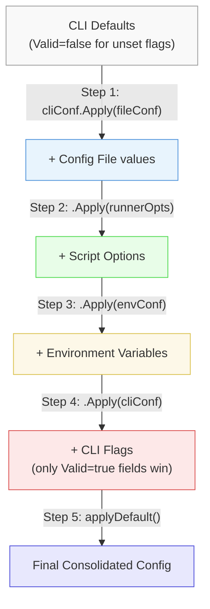
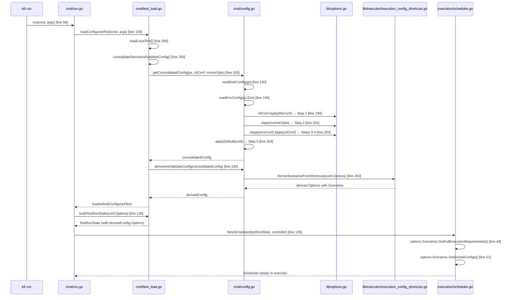

# How k6 Consolidates Run-Time Options: An Architecture Deep-Dive

## Overview

This document provides a comprehensive, source-code-grounded answer to the question: **How does k6 consolidate run-time options from multiple input sources into the single effective configuration that the execution scheduler consumes?**

k6 accepts configuration from four distinct sources — a JSON config file, script-level `export const options`, environment variables prefixed with `K6_`, and CLI flags. These four layers are merged through a carefully ordered sequence of `Apply()` calls that produces a single consolidated `Config`. That config is then *derived* into formal executor/scenario definitions, and the result is handed to the scheduler as the finalized, immutable execution plan.

This analysis covers the **k6 v0.55.0** codebase (commit `ddc3b0b1d2`, Go 1.21.13). Every claim is traced to specific source files and line numbers, and every precedence rule is proven with empirical output from real k6 runs.

> **Official documentation reference:** [k6 Options — Grafana Docs](https://grafana.com/docs/k6/latest/using-k6/k6-options/)

---

## The Four Option Sources

k6 reads run-time configuration from four independent sources. Each source has a different parsing mechanism and a different position in the priority hierarchy. This section describes how each source is read *before* the consolidation step merges them.

### Config File (`~/.config/loadimpact/k6/config.json`)

The config file is a JSON document that provides persistent defaults for any k6 invocation.

**Default path determination:**

The default config file path is set in `GetDefaultFlags()`.

```go
// Source: cmd/state/state.go:148-154
func GetDefaultFlags(homeDir string) GlobalFlags {
    return GlobalFlags{
        Address:          "localhost:6565",
        ProfilingEnabled: false,
        ConfigFilePath:   filepath.Join(homeDir, "loadimpact", "k6", defaultConfigFileName),
        LogOutput:        "stderr",
    }
}
```

The `defaultConfigFileName` constant is `"config.json"` (`Source: cmd/state/state.go:20`). On a typical Linux system, the full default path is `~/.config/loadimpact/k6/config.json`.

**Environment override:** The `K6_CONFIG` environment variable can override this path (`Source: cmd/state/state.go:163`):

```go
if val, ok := env["K6_CONFIG"]; ok {
    result.ConfigFilePath = val
}
```

**Parsing:** The config file is read and parsed in `readDiskConfig()` (`Source: cmd/config.go:131-152`):

```go
func readDiskConfig(gs *state.GlobalState) (Config, error) {
    if _, err := gs.FS.Stat(gs.Flags.ConfigFilePath); err != nil {
        if errors.Is(err, fs.ErrNotExist) && gs.Flags.ConfigFilePath == gs.DefaultFlags.ConfigFilePath {
            err = nil // silently ignore if default path doesn't exist
        }
        return Config{}, err
    }
    data, err := fsext.ReadFile(gs.FS, gs.Flags.ConfigFilePath)
    // ... JSON unmarshal into Config struct ...
}
```

**Key behavior:** If the default config file does not exist, the error is silently suppressed (`Source: cmd/config.go:134`). If a user-specified path via `K6_CONFIG` does not exist, it is treated as an error.

### Script Options (`export const options`)

Script options are the most common way k6 users configure their tests. They are defined inline in the JavaScript test script.

**Extraction:** The script's exported `options` object is extracted during bundle initialization in `Bundle.populateExports()` (`Source: js/bundle.go:188-242`):

```go
func (b *Bundle) populateExports(updateOptions bool, bi *BundleInstance) error {
    // ...
    bi.mainModule.GetExportedNames(func(names []string) {
        for _, k := range names {
            v := bi.getExported(k)
            switch k {
            case consts.Options:  // consts.Options == "options" (Source: lib/consts/js.go:6)
                if !updateOptions || v == nil {
                    continue
                }
                data, err = json.Marshal(v.Export())
                // ... then JSON-unmarshal into b.Options ...
```

The function looks for the `consts.Options` key (the string `"options"`, defined in `Source: lib/consts/js.go:6`). It JSON-marshals the JavaScript value, then unmarshals the JSON into the Go `Bundle.Options` struct (type `lib.Options`) (`Source: js/bundle.go:205-212`).

**Delivery to the consolidation step:** The parsed script options are accessed via `Runner.GetOptions()`:

```go
// Source: js/runner.go:340-341
func (r *Runner) GetOptions() lib.Options {
    return r.Bundle.Options
}
```

This is called during consolidation as `lt.initRunner.GetOptions()` (`Source: cmd/test_load.go:203`).

### Environment Variables (`K6_*`)

Environment variables provide a way to configure k6 from the shell without modifying scripts or creating config files.

**Parsing:** Environment variables are read in `readEnvConfig()` (`Source: cmd/config.go:170-178`):

```go
func readEnvConfig(envMap map[string]string) (Config, error) {
    conf := Config{}
    err := envconfig.Process("", &conf, func(key string) (string, bool) {
        v, ok := envMap[key]
        return v, ok
    })
    return conf, err
}
```

The `envconfig` library processes struct tags like `envconfig:"K6_VUS"`, `envconfig:"K6_DURATION"`, etc. The relevant tags are defined on the `Options` struct (`Source: lib/options.go:228-346`). For example:

```go
VUs        null.Int           `json:"vus" envconfig:"K6_VUS"`
Duration   types.NullDuration `json:"duration" envconfig:"K6_DURATION"`
Iterations null.Int           `json:"iterations" envconfig:"K6_ITERATIONS"`
Stages     []Stage            `json:"stages" envconfig:"K6_STAGES"`
```

### CLI Flags (`--vus`, `--duration`, etc.)

CLI flags have the highest priority in the consolidation pipeline. They are registered and parsed through the `pflag` library.

**Registration:** All option flags are registered in `optionFlagSet()` (`Source: cmd/options.go:23-78`):

```go
func optionFlagSet() *pflag.FlagSet {
    flags := pflag.NewFlagSet("", 0)
    flags.Int64P("vus", "u", 1, "number of virtual users")
    flags.DurationP("duration", "d", 0, "test duration limit")
    flags.Int64P("iterations", "i", 0, "script total iteration limit (among all VUs)")
    flags.StringSliceP("stage", "s", nil, "add a `stage`, as `[duration]:[target]`")
    // ... many more flags ...
}
```

**Parsing with `flags.Changed()` — the key mechanism:** The flags are parsed in `getOptions()` (`Source: cmd/options.go:81-249`). The *critical* detail is how each flag value is wrapped:

```go
// Source: cmd/options.go:82-102
opts := lib.Options{
    VUs:                   getNullInt64(flags, "vus"),
    Duration:              getNullDuration(flags, "duration"),
    Iterations:            getNullInt64(flags, "iterations"),
    Paused:                getNullBool(flags, "paused"),
    // ...
}
```

The helper functions `getNullBool`, `getNullInt64`, `getNullDuration`, and `getNullString` (`Source: cmd/common.go:36-68`) all use `flags.Changed(key)` to set the `Valid` flag:

```go
// Source: cmd/common.go:36-42
func getNullBool(flags *pflag.FlagSet, key string) null.Bool {
    v, err := flags.GetBool(key)
    if err != nil { panic(err) }
    return null.NewBool(v, flags.Changed(key))
}

// Source: cmd/common.go:44-50
func getNullInt64(flags *pflag.FlagSet, key string) null.Int {
    v, err := flags.GetInt64(key)
    if err != nil { panic(err) }
    return null.NewInt(v, flags.Changed(key))
}

// Source: cmd/common.go:52-60
func getNullDuration(flags *pflag.FlagSet, key string) types.NullDuration {
    v, err := flags.GetDuration(key)
    if err != nil { panic(err) }
    return types.NullDuration{Duration: types.Duration(v), Valid: flags.Changed(key)}
}
```

**Why this matters:** If a user does *not* explicitly pass `--vus` on the command line, `flags.Changed("vus")` returns `false`, so `getNullInt64` returns a value with `Valid=false`. During the `Apply()` merge, fields with `Valid=false` are skipped — they do not overwrite values from lower-priority tiers. This is the mechanism that prevents CLI *defaults* from clobbering script or env-var settings.

---

## The Consolidation Pipeline

### Step-by-Step Code Trace

The consolidation process starts when the user runs `k6 run`. The call chain is:

1. `loadAndConfigureLocalTest()` (`Source: cmd/test_load.go:246-256`)
2. → `loadLocalTest()` (loads and initializes the script)
3. → `consolidateDeriveAndValidateConfig()` (`Source: cmd/test_load.go:188-236`)
4. → `getConsolidatedConfig()` (`Source: cmd/config.go:189-216`)
5. → `deriveAndValidateConfig()` (`Source: cmd/config.go:248-257`)

The heart of the consolidation is `getConsolidatedConfig()`. Here is the function with its explanatory comment:

```go
// Source: cmd/config.go:180-216
// Assemble the final consolidated configuration from all of the different sources:
// - start with the CLI-provided options to get shadowed (non-Valid) defaults in there
// - add the global file config options
// - add the Runner-provided options (they may come from Bundle too if applicable)
// - add the environment variables
// - merge the user-supplied CLI flags back in on top, to give them the greatest priority
// - set some defaults if they weren't previously specified
func getConsolidatedConfig(
    gs *state.GlobalState, cliConf Config, runnerOpts lib.Options,
) (conf Config, err error) {
    fileConf, err := readDiskConfig(gs)       // read config file
    // ... error handling ...
    envConf, err := readEnvConfig(gs.Env)     // read env vars
    // ... error handling ...

    conf = cliConf.Apply(fileConf)                         // Step 1
    conf = conf.Apply(Config{Options: runnerOpts})         // Step 2
    conf = conf.Apply(envConf).Apply(cliConf)              // Steps 3 & 4
    conf = applyDefault(conf)                              // Step 5
    // ... trend stats validation ...
    return conf, nil
}
```

### The Five Steps Explained

| Step | Code (Source: cmd/config.go) | What Happens | Why |
|------|------|------|------|
| **1** | `conf = cliConf.Apply(fileConf)` (line 199) | Start with the CLI config as the base, then layer the file config on top. | The CLI config at this point has `Valid=false` for all flags the user did *not* explicitly set, so it's a mostly-empty skeleton. The file config's values fill in the first real settings. |
| **2** | `conf = conf.Apply(Config{Options: runnerOpts})` (line 201) | Layer script options on top of the file config. | Script options override file config values. If the script sets `vus: 5` and the config file had `"vus": 2`, the script wins. |
| **3** | `conf = conf.Apply(envConf)` (first half of line 203) | Layer environment variables on top of the script options. | Env vars override script values. If `K6_VUS=7` is set, it overwrites the script's `vus: 5`. |
| **4** | `.Apply(cliConf)` (second half of line 203) | Re-apply the CLI config on top of everything. | This is the key insight: `cliConf` is applied *twice* (Steps 1 and 4). The second application only overwrites fields where `Valid=true` — i.e., flags the user explicitly provided. This gives CLI flags the highest priority without clobbering lower tiers with default values. |
| **5** | `conf = applyDefault(conf)` (line 204) | Fill in system defaults for any fields that are still unset. | Sets defaults for system tags, summary trend stats, DNS config, setup/teardown timeouts. |

**The `applyDefault()` function** (`Source: cmd/config.go:218-246`) fills remaining gaps:

```go
func applyDefault(conf Config) Config {
    if conf.SystemTags == nil {
        conf.SystemTags = &metrics.DefaultSystemTagSet
    }
    if conf.SummaryTrendStats == nil {
        conf.SummaryTrendStats = lib.DefaultSummaryTrendStats
    }
    defDNS := types.DefaultDNSConfig()
    if !conf.DNS.TTL.Valid { conf.DNS.TTL = defDNS.TTL }
    if !conf.DNS.Select.Valid { conf.DNS.Select = defDNS.Select }
    if !conf.DNS.Policy.Valid { conf.DNS.Policy = defDNS.Policy }
    if !conf.SetupTimeout.Valid {
        conf.SetupTimeout.Duration = types.Duration(60 * time.Second)
    }
    if !conf.TeardownTimeout.Valid {
        conf.TeardownTimeout.Duration = types.Duration(60 * time.Second)
    }
    return conf
}
```

### The `Apply()` Merging Semantics

The `Config.Apply()` method (`Source: cmd/config.go:70-92`) delegates to `Options.Apply()` for the embedded `lib.Options`:

```go
// Source: cmd/config.go:71-72
func (c Config) Apply(cfg Config) Config {
    c.Options = c.Options.Apply(cfg.Options)
    // ... also applies Out, Linger, NoUsageReport, etc. ...
}
```

The `Options.Apply()` method (`Source: lib/options.go:357-517`) implements **field-by-field conditional overriding**. The pattern for each field is:

```go
// Source: lib/options.go:358-362
if opts.Paused.Valid {
    o.Paused = opts.Paused
}
if opts.VUs.Valid {
    o.VUs = opts.VUs
}
```

For nullable types (`null.Int`, `null.Bool`, `types.NullDuration`), the check is `opts.Field.Valid`. For pointer and slice types, the check is `opts.Field != nil`. If the incoming value is not "set" (i.e., `Valid=false` or `nil`), the existing value is preserved.

**This is the mechanism that makes the precedence order work:** When `cliConf` is applied in Step 4, only the flags the user explicitly set (those with `Valid=true` from `flags.Changed()`) overwrite; everything else is left alone.

### The Execution-Shortcut Wipe Rule (CRITICAL)

Located at `Source: lib/options.go:371-377`, this is the most important (and most confusing) behavior in the `Apply()` method:

```go
// Source: lib/options.go:365-377
// Specifying duration, iterations, stages, or execution in a "higher" config tier
// will overwrite all of the previous execution settings (if any) from any
// "lower" config tiers
// Still, if more than one of those options is simultaneously specified in the same
// config tier, they will be preserved, so the validation after we've consolidated
// all of the options can return an error.
if opts.Duration.Valid || opts.Iterations.Valid || opts.Stages != nil || opts.Scenarios != nil {
    o.Duration = types.NewNullDuration(0, false)
    o.Iterations = null.NewInt(0, false)
    o.Stages = nil
    o.Scenarios = nil
}
```

**What this does:** When the incoming options (from a higher-priority tier) specify *any* of the four execution-related fields (`Duration`, `Iterations`, `Stages`, or `Scenarios`), **all four execution fields from the lower-priority tier are wiped to their zero/nil state** *before* the higher-tier's values are applied.

**Why this exists:** The rationale is stated in the code comment (`Source: lib/options.go:365-370`). If a higher-priority tier specifies any execution configuration, it should *completely replace* the lower tier's execution configuration, not merge with it. For example:

- If a script defines `scenarios` with a `shared-iterations` executor, and the user passes `--duration 5s` on the CLI, it would be nonsensical to run both the script's scenarios *and* a duration-based constant-VUs test simultaneously.
- The wipe ensures a clean slate: the CLI's `--duration` becomes the only execution configuration.

**However,** if multiple execution fields are specified in the *same* tier (e.g., both `--duration` and `--iterations` on the CLI), they are all preserved so that the post-consolidation validation can detect the conflict and return an error.

**This is the primary source of "confusing cases":** If a script carefully defines `scenarios` with multiple executors, and the user casually adds `--duration 5s` on the command line, the script's entire scenario configuration is silently wiped. Experiments 5 and 6 below demonstrate this empirically.

---

## Precedence Rules

### Priority Table

| Priority | Source | Wins Over | Mechanism |
|----------|--------|-----------|-----------|
| **1** (Highest) | CLI Flags (`--vus`, `--duration`, etc.) | Everything | Applied last (Step 4) with `Valid=true` only for explicitly-set flags |
| **2** | Environment Variables (`K6_VUS`, `K6_DURATION`, etc.) | Script, Config File, Defaults | Applied in Step 3, after script options |
| **3** | Script (`export const options`) | Config File, Defaults | Applied in Step 2, after file config |
| **4** | Config File (`config.json`) | Defaults only | Applied in Step 1, overwriting CLI skeleton defaults |
| **5** (Lowest) | Built-in Defaults | Nothing | Applied last (Step 5) but only fills unset fields |

### Mermaid Diagram: Consolidation Pipeline



### Code Rationale

The comment block at `Source: cmd/config.go:180-186` explicitly describes the layering strategy:

> *"Assemble the final consolidated configuration from all of the different sources: start with the CLI-provided options to get shadowed (non-Valid) defaults in there, add the global file config options, add the Runner-provided options, add the environment variables, merge the user-supplied CLI flags back in on top, to give them the greatest priority, set some defaults if they weren't previously specified."*

The **double-application of `cliConf`** (Steps 1 and 4) is the elegant mechanism:
- **Step 1** (`cliConf.Apply(fileConf)`) uses `cliConf` as the starting base. Since unset CLI flags have `Valid=false`, the base is essentially empty. The file config fills in the first real values.
- **Step 4** (`.Apply(cliConf)`) re-applies `cliConf` at the very end. Now, only the fields that the user explicitly set on the CLI (those with `Valid=true`) overwrite — giving CLI the highest priority without disturbing values from other tiers.

---

## The Finality Point

### Consolidation → Derivation → Scheduler Handoff

After `getConsolidatedConfig()` produces the consolidated config, the code does not hand it directly to the scheduler. There is an intermediate **derivation** step that converts shortcut options into formal executor/scenario configurations.

**Step 1: Derive scenarios from shortcuts**

`deriveAndValidateConfig()` (`Source: cmd/config.go:248-257`) calls `executor.DeriveScenariosFromShortcuts()`:

```go
func deriveAndValidateConfig(
    conf Config, isExecutable func(string) bool, logger logrus.FieldLogger,
) (result Config, err error) {
    result = conf
    result.Options, err = executor.DeriveScenariosFromShortcuts(conf.Options, logger)
    if err == nil {
        err = validateConfig(result, isExecutable)
    }
    return result, errext.WithExitCodeIfNone(err, exitcodes.InvalidConfig)
}
```

**Step 2: DeriveScenariosFromShortcuts conversion rules**

`DeriveScenariosFromShortcuts()` (`Source: lib/executor/execution_config_shortcuts.go:52-128`) converts shortcut options into formal scenario configurations:

| Condition | Resulting Executor | Helper Function |
|-----------|-------------------|-----------------|
| `iterations` is set | `shared-iterations` | `getSharedIterationsScenario()` (line 67) |
| `duration` is set (no iterations) | `constant-vus` | `getConstantVUsScenario()` (line 86) |
| `stages` is set | `ramping-vus` | `getRampingVUsScenario()` (line 94) |
| `scenarios` explicitly set | Used as-is | (lines 96-97) |
| Nothing set | `per-vu-iterations` (1 VU, 1 iter) | Default (lines 117-119) |

```go
// Source: lib/executor/execution_config_shortcuts.go:52-120
func DeriveScenariosFromShortcuts(opts lib.Options, logger logrus.FieldLogger) (lib.Options, error) {
    result := opts
    switch {
    case opts.Iterations.Valid:
        // ... conflict checks ...
        result.Scenarios = getSharedIterationsScenario(opts.Iterations, opts.Duration, opts.VUs)
    case opts.Duration.Valid:
        // ... conflict checks ...
        result.Scenarios = getConstantVUsScenario(opts.Duration, opts.VUs)
    case len(opts.Stages) > 0:
        // ... conflict checks ...
        result.Scenarios = getRampingVUsScenario(opts.Stages, opts.VUs)
    case len(opts.Scenarios) > 0:
        // Do nothing, scenarios was explicitly specified
    default:
        // No execution parameters — default per-VU-iterations with 1 VU, 1 iteration
        result.Scenarios = lib.ScenarioConfigs{
            lib.DefaultScenarioName: NewPerVUIterationsConfig(lib.DefaultScenarioName),
        }
    }
    return result, nil
}
```

The result is stored as `loadedAndConfiguredTest.derivedConfig` (`Source: cmd/test_load.go:231-234`):

```go
return &loadedAndConfiguredTest{
    loadedTest:         lt,
    consolidatedConfig: consolidatedConfig,
    derivedConfig:      derivedConfig,
}, nil
```

### Where Options Are "Locked In"

The finality point — where options become immutable for the scheduler — spans from `cmd/run.go:126-138`:

```go
// Source: cmd/run.go:126-128
// Write the full consolidated *and derived* options back to the Runner.
conf := test.derivedConfig
testRunState, err := test.buildTestRunState(conf.Options)
```

`buildTestRunState()` (`Source: cmd/test_load.go:265-284`) creates the `TestRunState` with the derived options:

```go
// Source: cmd/test_load.go:277-283
return &lib.TestRunState{
    TestPreInitState: lct.preInitState,
    Runner:           lct.initRunner,
    Options:          lct.derivedConfig.Options, // we will always run with the derived options
    RunTags:          lct.preInitState.Registry.RootTagSet().WithTagsFromMap(configToReinject.RunTags),
    GroupSummary:     lib.NewGroupSummary(lct.preInitState.Logger),
}, nil
```

Note the comment: *"we will always run with the derived options"* (`Source: cmd/test_load.go:280`).

Then the scheduler is created (`Source: cmd/run.go:134-135`):

```go
execScheduler, err := execution.NewScheduler(testRunState, controller)
```

Inside `NewScheduler()` (`Source: execution/scheduler.go:38-88`):

```go
func NewScheduler(trs *lib.TestRunState, controller Controller) (*Scheduler, error) {
    options := trs.Options                                              // line 39
    et, err := lib.NewExecutionTuple(options.ExecutionSegment, ...)     // line 40
    executionPlan := options.Scenarios.GetFullExecutionRequirements(et)  // line 44
    // ...
    executorConfigs := options.Scenarios.GetSortedConfigs()              // line 51
    // ... creates executor instances from the configs ...
}
```

**The finality point is:** After `deriveAndValidateConfig()` returns at `Source: cmd/test_load.go:226` and before `execution.NewScheduler()` at `Source: cmd/run.go:135`. The scheduler reads `derivedConfig.Options` once — it never re-consolidates or re-reads any configuration source.

### Mermaid Sequence Diagram: Startup Lifecycle



---

## Empirical Proof: Conflicting Setups

All experiments below were run using a k6 binary built from the v0.55.0 source (`k6 v0.55.0, commit/ddc3b0b1d2, go1.21.13, linux/amd64`). All scripts were written to `/tmp/`, executed, output captured, and then deleted. Cleanup was verified: `ls /tmp/exp*.js` returns "No such file or directory."

### Experiment 1: CLI Overrides Script Options

**Script** (`/tmp/exp1.js`):
```javascript
import http from 'k6/http';
export const options = { vus: 3, duration: '5s' };
export default function () {
  http.get('https://test.k6.io');
}
```

**Command:**
```bash
/tmp/k6 run --vus 10 --duration 3s /tmp/exp1.js
```

**Key output (truncated):**
```
     scenarios: (100.00%) 1 scenario, 10 max VUs, 33s max duration (incl. graceful stop):
              * default: 10 looping VUs for 3s (gracefulStop: 30s)
     ...
     vus............................: 10     min=10        max=10
     vus_max........................: 10     min=10        max=10

running (03.0s), 00/10 VUs, 631 complete and 0 interrupted iterations
default ✓ [ 100% ] 10 VUs  3s
```

**Result:** CLI wins — **10 VUs**, **3s duration**. The script's `vus: 3` and `duration: '5s'` were overridden.

### Experiment 2: Environment Variable Overrides Script Options

**Script** (`/tmp/exp2.js`):
```javascript
import http from 'k6/http';
export const options = { vus: 3, duration: '5s' };
export default function () {
  http.get('https://test.k6.io');
}
```

**Command:**
```bash
K6_VUS=7 K6_DURATION=2s /tmp/k6 run /tmp/exp2.js
```

**Key output (truncated):**
```
     scenarios: (100.00%) 1 scenario, 7 max VUs, 32s max duration (incl. graceful stop):
              * default: 7 looping VUs for 2s (gracefulStop: 30s)
     ...
     vus............................: 7      min=7        max=7
     vus_max........................: 7      min=7        max=7

running (02.0s), 0/7 VUs, 289 complete and 0 interrupted iterations
default ✓ [ 100% ] 7 VUs  2s
```

**Result:** Env wins — **7 VUs**, **2s duration**. The script's values were overridden by the environment variables.

### Experiment 3: Script Overrides Config File

**Config file** (`/tmp/k6-test-config.json`):
```json
{"vus": 2, "duration": "10s"}
```

**Script** (`/tmp/exp3.js`):
```javascript
import http from 'k6/http';
export const options = { vus: 5, duration: '3s' };
export default function () {
  http.get('https://test.k6.io');
}
```

**Command:**
```bash
K6_CONFIG=/tmp/k6-test-config.json /tmp/k6 run /tmp/exp3.js
```

**Key output (truncated):**
```
     scenarios: (100.00%) 1 scenario, 5 max VUs, 33s max duration (incl. graceful stop):
              * default: 5 looping VUs for 3s (gracefulStop: 30s)
     ...
     vus............................: 5      min=5        max=5
     vus_max........................: 5      min=5        max=5

running (03.0s), 0/5 VUs, 323 complete and 0 interrupted iterations
default ✓ [ 100% ] 5 VUs  3s
```

**Result:** Script wins — **5 VUs**, **3s duration**. The config file's `"vus": 2` and `"duration": "10s"` were overridden by the script.

### Experiment 4: All Four Layers Conflict

**Config file** (`/tmp/k6-test-config.json`):
```json
{"vus": 1, "duration": "20s"}
```

**Script** (`/tmp/exp4.js`):
```javascript
import http from 'k6/http';
export const options = { vus: 3, duration: '10s' };
export default function () {
  http.get('https://test.k6.io');
}
```

**Command:**
```bash
K6_CONFIG=/tmp/k6-test-config.json K6_VUS=5 K6_DURATION=8s /tmp/k6 run --vus 10 --duration 3s /tmp/exp4.js
```

**Key output (truncated):**
```
     scenarios: (100.00%) 1 scenario, 10 max VUs, 33s max duration (incl. graceful stop):
              * default: 10 looping VUs for 3s (gracefulStop: 30s)
     ...
     vus............................: 10     min=10        max=10
     vus_max........................: 10     min=10        max=10

running (03.0s), 00/10 VUs, 636 complete and 0 interrupted iterations
default ✓ [ 100% ] 10 VUs  3s
```

**Result:** CLI wins over all layers — **10 VUs**, **3s duration**. This is the definitive proof: Config file (1 VU, 20s) < Script (3 VUs, 10s) < Env (5 VUs, 8s) < CLI (10 VUs, 3s).

### Experiment 5: CLI Shortcuts Override Script Scenarios (Wipe Rule)

**Script** (`/tmp/exp5.js`):
```javascript
import http from 'k6/http';
export const options = {
  scenarios: {
    my_scenario: {
      executor: 'shared-iterations',
      vus: 3,
      iterations: 10,
      maxDuration: '30s',
    },
  },
};
export default function () {
  console.log(`VU=${__VU} ITER=${__ITER}`);
  http.get('https://test.k6.io');
}
```

**Command:**
```bash
/tmp/k6 run --duration 5s --vus 2 /tmp/exp5.js
```

**Key output (truncated):**
```
     scenarios: (100.00%) 1 scenario, 2 max VUs, 35s max duration (incl. graceful stop):
              * default: 2 looping VUs for 5s (gracefulStop: 30s)
     ...
     vus............................: 2      min=2        max=2
     vus_max........................: 2      min=2        max=2

running (05.0s), 0/2 VUs, 212 complete and 0 interrupted iterations
default ✓ [ 100% ] 2 VUs  5s
```

**Result:** The script's `scenarios` configuration (shared-iterations, 3 VUs, 10 iterations) was **completely wiped**. Instead, the CLI's `--duration 5s --vus 2` produced a `constant-vus` executor with 2 looping VUs for 5 seconds. The scenario name changed from `my_scenario` to `default`, proving the wipe at `Source: lib/options.go:371-377` replaced the entire scenario configuration. Each VU ran over 100 iterations (far exceeding the script's intended 10), confirming this is a time-bounded loop, not a shared-iterations executor.

### Experiment 6: Env Variable Overrides Script Scenarios (Wipe Rule)

**Script** (`/tmp/exp6.js`):
```javascript
import http from 'k6/http';
export const options = {
  scenarios: {
    my_scenario: {
      executor: 'shared-iterations',
      vus: 3,
      iterations: 10,
      maxDuration: '30s',
    },
  },
};
export default function () {
  console.log(`VU=${__VU} ITER=${__ITER}`);
  http.get('https://test.k6.io');
}
```

**Command:**
```bash
K6_ITERATIONS=5 K6_VUS=2 /tmp/k6 run /tmp/exp6.js
```

**Key output (truncated):**
```
     scenarios: (100.00%) 1 scenario, 2 max VUs, 10m30s max duration (incl. graceful stop):
              * default: 5 iterations shared among 2 VUs (maxDuration: 10m0s, gracefulStop: 30s)
     ...
running (00m00.3s), 0/2 VUs, 5 complete and 0 interrupted iterations
default ✓ [ 100% ] 2 VUs  00m00.3s/10m0s  5/5 shared iters
```

**Result:** The script's `scenarios` configuration was **wiped** by the environment variables. `K6_ITERATIONS=5` triggered the wipe rule (`Source: lib/options.go:371-377`), clearing the script's `scenarios`. The derivation step then created a `shared-iterations` executor with 5 iterations shared among 2 VUs (from `K6_VUS=2`). Note: the scenario name changed to `default` (not the script's `my_scenario`), and only 5 total iterations ran — not the script's 10.

### Experiment 7: Multi-VU Shared Iterations

**Script** (`/tmp/exp7.js`):
```javascript
import { sleep } from 'k6';
export const options = {
  scenarios: {
    shared_test: {
      executor: 'shared-iterations',
      vus: 4,
      iterations: 12,
      maxDuration: '30s',
    },
  },
};
export default function () {
  console.log(`VU=${__VU} ITER=${__ITER} - executing shared iteration`);
  sleep(0.1);
}
```

**Command:**
```bash
/tmp/k6 run /tmp/exp7.js
```

**Key output:**
```
     scenarios: (100.00%) 1 scenario, 4 max VUs, 1m0s max duration (incl. graceful stop):
              * shared_test: 12 iterations shared among 4 VUs (maxDuration: 30s, gracefulStop: 30s)

VU=2 ITER=0 - executing shared iteration
VU=3 ITER=0 - executing shared iteration
VU=4 ITER=0 - executing shared iteration
VU=1 ITER=0 - executing shared iteration
VU=4 ITER=1 - executing shared iteration
VU=2 ITER=1 - executing shared iteration
VU=3 ITER=1 - executing shared iteration
VU=1 ITER=1 - executing shared iteration
VU=1 ITER=2 - executing shared iteration
VU=3 ITER=2 - executing shared iteration
VU=4 ITER=2 - executing shared iteration
VU=2 ITER=2 - executing shared iteration

running (0m00.3s), 0/4 VUs, 12 complete and 0 interrupted iterations
shared_test ✓ [ 100% ] 4 VUs  00.3s/30s  12/12 shared iters
```

**Result:** 4 VUs (IDs 1-4) shared exactly 12 iterations. Each VU completed 3 iterations (12 ÷ 4 = 3). The total was exactly 12 — not 12 per VU. This proves:
1. Options were consolidated **once** before any VU started.
2. All 4 VUs operated under the **same** consolidated configuration (12 shared iterations).
3. The `shared-iterations` executor distributed the iteration pool across VUs as intended.

### Experiment 8: Multi-VU Constant VUs with Sleep

**Script** (`/tmp/exp8.js`):
```javascript
import { sleep } from 'k6';
export const options = {
  vus: 3,
  duration: '3s',
};
export default function () {
  console.log(`VU=${__VU} ITER=${__ITER} executing at ${new Date().toISOString()}`);
  sleep(1);
}
```

**Command:**
```bash
/tmp/k6 run /tmp/exp8.js
```

**Key output:**
```
     scenarios: (100.00%) 1 scenario, 3 max VUs, 33s max duration (incl. graceful stop):
              * default: 3 looping VUs for 3s (gracefulStop: 30s)

VU=2 ITER=0 executing at 2026-04-09T22:33:25.557Z
VU=3 ITER=0 executing at 2026-04-09T22:33:25.557Z
VU=1 ITER=0 executing at 2026-04-09T22:33:25.557Z
VU=1 ITER=1 executing at 2026-04-09T22:33:26.557Z
VU=3 ITER=1 executing at 2026-04-09T22:33:26.557Z
VU=2 ITER=1 executing at 2026-04-09T22:33:26.557Z
VU=2 ITER=2 executing at 2026-04-09T22:33:27.558Z
VU=3 ITER=2 executing at 2026-04-09T22:33:27.558Z
VU=1 ITER=2 executing at 2026-04-09T22:33:27.558Z

     iterations.....................: 9   2.99863/s
     vus...........................: 3   min=3     max=3
     vus_max.......................: 3   min=3     max=3

running (03.0s), 0/3 VUs, 9 complete and 0 interrupted iterations
default ✓ [ 100% ] 3 VUs  3s
```

**Result:** All 3 VUs (IDs 1, 2, 3) started simultaneously and ran concurrently for 3 seconds. Each VU completed 3 iterations (with 1-second sleep per iteration), for 9 total. The timestamps prove concurrency — all three VUs logged the same timestamp each second. This confirms:
1. All VUs share the **same** consolidated options (3 VUs, 3s duration).
2. The `constant-vus` executor ran all VUs concurrently for the full duration.
3. Options are consolidated **once** and shared — no per-VU re-consolidation.

---

## Multi-VU Behavior

Options are consolidated **once** during startup, before any VU is created. There is no per-VU consolidation.

**Evidence from code:**

1. `buildTestRunState()` (`Source: cmd/test_load.go:277-283`) creates a single `TestRunState` with `Options: lct.derivedConfig.Options`. This one `Options` struct is shared by all VUs.

2. `NewScheduler()` (`Source: execution/scheduler.go:38-88`) reads `trs.Options` once (line 39), computes the execution plan (line 44), and creates executors (lines 51-70). No per-VU configuration exists — the scheduler creates VU instances that all operate under the same execution plan.

3. The `Options` field in `TestRunState` is set once and never modified after the scheduler begins execution. The scheduler reads `options.Scenarios` to determine how many VUs to create, what type of executor to use, and for how long.

**Evidence from experiments:**

- **Experiment 7** showed 4 VUs sharing exactly 12 iterations — proving all VUs operated under the same `shared-iterations` config.
- **Experiment 8** showed 3 VUs all starting at the same millisecond and running for exactly 3 seconds — proving all VUs shared the same `constant-vus` config with identical duration.

---

## Summary

1. **The five-step `Apply()` chain** (`Source: cmd/config.go:199-204`) transforms four independent option sources into one consolidated `Config`:
   - Step 1: CLI skeleton + file config
   - Step 2: + script options
   - Step 3: + environment variables
   - Step 4: + CLI flags (only explicitly-set ones)
   - Step 5: + built-in defaults (for any remaining gaps)

2. **The precedence order is:** CLI > Env > Script > Config File > Defaults. This works because CLI flags use `flags.Changed()` to set `Valid=true` only for explicitly provided flags, and `Apply()` only overwrites when `Valid=true`.

3. **The execution-shortcut wipe rule** (`Source: lib/options.go:371-377`) clears all four execution fields (`Duration`, `Iterations`, `Stages`, `Scenarios`) from a lower tier when any higher tier specifies any execution configuration. This prevents nonsensical merges but can silently discard carefully crafted scenario configs.

4. **The finality point** is after `deriveAndValidateConfig()` returns (`Source: cmd/test_load.go:226`) and before `execution.NewScheduler()` consumes `trs.Options` (`Source: cmd/run.go:135`). The scheduler reads the derived options once and never re-consolidates.

5. **Multi-VU behavior:** Options are consolidated once, stored in `TestRunState.Options`, and shared by all VUs. There is no per-VU configuration — every VU operates under the same effective options.
