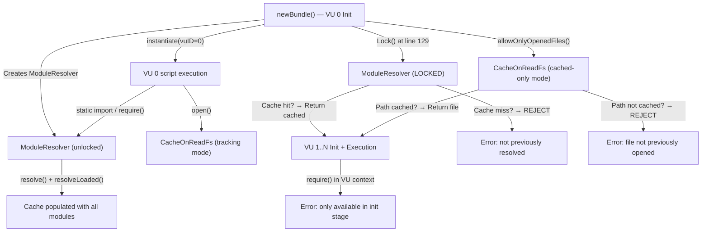

# k6 Module Resolution: Init Stage vs. VU Execution Stage

> **Source branch / commit**: `k6_ddc3b0b1d23c` (commit `ddc3b0b1d23c128e34e2792fc9075f9126e32375`, k6 v0.55.0)
> **Investigation mode**: Read-only analysis; no repository files were modified, added, or deleted by this investigation.
> **Evidence basis**: k6 source code in this repository plus temporary k6 scripts created under `/tmp/k6_experiments/` (cleaned up after execution; reproduced verbatim in Section 6 for documentation purposes).
> **Binary used for experiments**: `/tmp/k6_binary` (built from this exact commit: `k6 v0.55.0 (commit/ddc3b0b1d2, go1.22.12, linux/amd64)`).

## Section 1 — Executive Summary

k6 enforces a strict separation between an *init* stage (where modules and files are discovered) and a *VU execution* stage (where only previously-resolved resources may be used). Two independent mechanisms cooperate to enforce this:

1. An **init-context gate** wired around the global `require` and `open` functions in `js/bundle.go`, which checks `vu.state == nil` to determine whether the caller is in init context.
2. A **resolver lock** (`ModuleResolver.Lock()`) toggled exactly once after VU 0 init in `js/bundle.go`, after which any cache-miss in `js/modules/resolution.go`'s `resolve()` deterministically rejects.

The matching pattern is applied to file I/O via `CacheOnReadFs.AllowOnlyCached()` in `lib/fsext/cacheonread.go` — the `Lock()` method's own comment notes "It is the same approach used for opening file operations."

The six canonical questions and their answers:

| Question | Answer |
|----------|--------|
| Does k6 freeze module resolution after init? | **Yes.** `ModuleResolver.Lock()` is called after VU 0 init completes (`js/bundle.go:129`). |
| What counts as already resolved? | Any module whose resolved URL (or bare name for `k6/*`) exists as a key in `ModuleResolver.cache`. |
| What gets rejected? | Any module not in the cache when the resolver is locked. Error: `the module %q was not previously resolved during initialization (__VU==0)`. |
| Can VUs call `require()`? | **No.** `require()` is blocked in VU execution context by `vu.state != nil` check. Error: `the "require" function is only available in the init stage`. |
| Do relative specifiers cause confusion? | **No.** They are resolved relative to the *containing file*, not the call stack. The `reversePath()` function ensures this via the `reverse` map lookup. |
| Is dynamic `import()` supported? | **No.** k6 does not register a `SetImportModuleDynamically` callback. Error: `dynamic modules not enabled in the host program`. |

## Section 2 — Axis 1: The Module Resolution Freeze Mechanism

k6's `ModuleResolver` carries a single boolean `locked` field (default `false`) that is flipped exactly once per bundle, after the throwaway VU 0 init completes. Once set, it cannot be reset — there is no `Unlock()` method.

### The struct (js/modules/resolution.go lines 29–40)

```go
// ModuleResolver knows how to get base Module that can be initialized
type ModuleResolver struct {
    cache     map[string]moduleCacheElement
    goModules map[string]any
    loadCJS   FileLoader
    compiler  *compiler.Compiler
    locked    bool
    reverse   map[any]*url.URL // maybe use sobek.ModuleRecord as key
    base      *url.URL
    usage     *usage.Usage
    logger    logrus.FieldLogger
}
```

The field at line 35 — `locked    bool` — is the freeze flag. The comment on line 36 about `reverse` (`maybe use sobek.ModuleRecord as key`) is a known limitation but is functionally correct as `map[any]*url.URL`.

### The `Lock()` method (js/modules/resolution.go lines 133–139)

```go
// Lock locks the module's resolution from any further new resolving operation.
// It means that it relays only its internal cache and on the fact that it has already
// seen previously the module during the initialization.
// It is the same approach used for opening file operations.
func (mr *ModuleResolver) Lock() {
    mr.locked = true
}
```

This method has no inverse — once locked, the resolver remains locked for the lifetime of the `Bundle`, and every subsequent VU shares the same locked resolver instance.

### The single call site (js/bundle.go lines 109–129)

```go
c := bundle.newCompiler(piState.Logger)
bundle.ModuleResolver = modules.NewModuleResolver(
    getJSModules(), generateFileLoad(bundle), c, bundle.pwd, piState.Usage, piState.Logger)

// Instantiate the bundle into a new VM using a bound init context. This uses a context with a
// runtime, but no state, to allow module-provided types to function within the init context.
// TODO use a real context
vuImpl := &moduleVUImpl{
    ctx:     context.Background(),
    runtime: sobek.New(),
    events: events{
        global: piState.Events,
        local:  event.NewEventSystem(100, piState.Logger),
    },
}
vuImpl.eventLoop = eventloop.New(vuImpl)
bi, err := bundle.instantiate(vuImpl, 0)
if err != nil {
    return nil, err
}
bundle.ModuleResolver.Lock()
```

The flow is:

1. **Line 110–111**: `NewModuleResolver()` constructs the resolver with `cache: make(map[string]moduleCacheElement)` (line 51 of `resolution.go`) and `locked: false` (the zero value).
2. **Line 116–124**: A throwaway `moduleVUImpl` (with `state == nil`, the init-context indicator) and Sobek runtime are created.
3. **Line 125**: `bundle.instantiate(vuImpl, 0)` is called with `vuID=0`. This is the canonical "VU 0" — the discovery VU whose only purpose is to drive the script through its full top-level evaluation so that every transitive `import` and init-time `require()` populates the cache.
4. **Line 129**: `bundle.ModuleResolver.Lock()` is invoked. From this point onward, no new modules can be loaded; the cache is the sole source of truth.

### The two enforcement sites of the `locked` flag

The `locked` field is consulted in two places, each as a "second gate" after a cache lookup miss:

**Built-in module path — `requireModule()` (js/modules/resolution.go lines 69–89)**:

```go
func (mr *ModuleResolver) requireModule(name string) (sobek.ModuleRecord, error) {
    if mr.locked {
        return nil, fmt.Errorf(notPreviouslyResolvedModule, name)
    }
    mod, ok := mr.goModules[name]
    if !ok {
        return nil, fmt.Errorf("unknown module: %s", name)
    }
    ...
}
```

Line 70 is the gate. It only triggers if a `k6/*` module is requested that is not already in the cache (the cache lookup for built-ins happens at line 150 of `resolve()` *before* `requireModule()` is called at line 153).

**Filesystem module path — `resolve()` (js/modules/resolution.go lines 145–177)**:

```go
func (mr *ModuleResolver) resolve(basePWD *url.URL, arg string) (sobek.ModuleRecord, error) {
    switch {
    case arg == "k6", strings.HasPrefix(arg, "k6/"):
        // Builtin or external modules ("k6", "k6/*", or "k6/x/*") are handled
        // specially, as they don't exist on the filesystem.
        if cached, ok := mr.cache[arg]; ok {
            return cached.mod, cached.err
        }
        mod, err := mr.requireModule(arg)
        mr.cache[arg] = moduleCacheElement{mod: mod, err: err}
        return mod, err
    default:
        specifier, err := mr.resolveSpecifier(basePWD, arg)
        if err != nil {
            return nil, err
        }
        // try cache with the final specifier
        if cached, ok := mr.cache[specifier.String()]; ok {
            return cached.mod, cached.err
        }

        if mr.locked {
            return nil, fmt.Errorf(notPreviouslyResolvedModule, arg)
        }
        // Fall back to loading
        data, err := mr.loadCJS(specifier, arg)
        if err != nil {
            mr.cache[specifier.String()] = moduleCacheElement{err: err}
            return nil, err
        }
        return mr.resolveLoaded(basePWD, arg, data)
    }
}
```

Line 166 is the filesystem-path gate. The order of operations is critical:

1. Resolve the specifier to a final URL (line 157).
2. Look up the cache by that URL (line 162). **A cache hit returns immediately**, regardless of whether `locked` is set.
3. Only on cache miss is `mr.locked` checked (line 166). If set, the canonical error is returned.
4. If unlocked, the file is loaded and parsed (lines 170–175).

### Implications of the lock being one-way

There is no `Unlock()` method. There is no per-VU re-evaluation of the lock state. There is no way to extend the resolver mid-test. The design is intentional: **k6 promises that test execution behaviour is deterministic across all VUs** — every VU sees exactly the same set of resolvable modules.

## Section 3 — Axis 2: What Counts as "Already Resolved"

A module is "already resolved" if and only if its identifier (the cache key) exists as a key in `ModuleResolver.cache`. Cache misses during locked state are deterministically rejected.

### The cache type and value

The `cache` field is a `map[string]moduleCacheElement` (line 31 of `resolution.go`). The element type is defined at lines 24–27:

```go
type moduleCacheElement struct {
    mod sobek.ModuleRecord
    err error
}
```

This wrapper allows the resolver to remember both successful and failed resolution attempts: even an `err`-bearing entry counts as "already resolved" for cache-lookup purposes (subsequent lookups will deterministically return the same error rather than re-attempting the load).

### The two cache-key categories

The `resolve()` switch at lines 146–176 uses two different keying strategies:

**Category A — Built-in / extension modules** (`k6`, `k6/*`, `k6/x/*`): keyed by the **bare specifier string** as written in the JS source. Examples:

- `"k6"`
- `"k6/http"`
- `"k6/execution"`
- `"k6/x/check-1"`

The cache lookup at line 150 uses `arg` (the original specifier) directly. There is no path resolution for built-in modules because they don't live on the filesystem.

**Category B — Filesystem (and HTTPS) modules**: keyed by the **fully-resolved absolute URL string** as returned by `resolveSpecifier()`. Examples:

- `"file:///home/user/tests/helpers/shared.js"`
- `"file:///tmp/k6_experiments/subdir/util.js"`
- `"https://example.com/lib/util.js"`

The cache lookup at line 162 uses `specifier.String()` — the canonicalised URL form, after `loader.Resolve()` has joined the base PWD with the specifier and resolved any `./` and `../` segments. This canonicalisation is what makes two distinct call sites importing `"../shared/util.js"` from sibling directories collapse to the same cache entry (see Section 4).

### The error constant for cache misses (js/modules/resolution.go line 17)

```go
const notPreviouslyResolvedModule = "the module %q was not previously resolved during initialization (__VU==0)"
```

Both gates (lines 70 and 166) format this constant with the module specifier (`name` and `arg` respectively). The `%q` produces the JS source literal in double quotes, e.g. `the module "./never_cached.js" was not previously resolved during initialization (__VU==0)`.

### Order of operations: cache-then-lock

The critical detail of the filesystem branch is the ordering at lines 161–168:

```go
// try cache with the final specifier
if cached, ok := mr.cache[specifier.String()]; ok {
    return cached.mod, cached.err
}

if mr.locked {
    return nil, fmt.Errorf(notPreviouslyResolvedModule, arg)
}
```

**Cache lookup precedes lock check.** This is what allows previously-cached modules to be served *even after* the resolver is locked. A subsequent VU's static `import` of an already-cached URL (or a `require()` for the same URL during non-VU0 init) will hit the cache at line 162 and never reach the lock check at line 166.

The same pattern holds for the built-in branch (lines 150–155): the cache is consulted *before* the call to `requireModule()` is made, so cached `k6/*` modules are returned without ever entering `requireModule()` (and thus without consulting `mr.locked` at line 70).

### How `Imported()` exposes the cache contents (js/modules/resolution.go lines 179–190)

```go
// Imported returns the list of imported and resolved modules.
// Each string represents the path as used for importing.
func (mr *ModuleResolver) Imported() []string {
    if len(mr.cache) < 1 {
        return nil
    }
    modules := make([]string, 0, len(mr.cache))
    for name := range mr.cache {
        modules = append(modules, name)
    }
    return modules
}
```

This method's return is a flat list of cache keys — a faithful reflection of every module the resolver has *ever* attempted to load (whether successfully or with an error). It is used elsewhere in k6 (e.g., for archive bundling) to enumerate the modules that must travel with the bundle.

### How the cache is populated (js/modules/resolution.go lines 98–131)

`resolveLoaded()` is the only function that writes to `mr.cache` for filesystem modules (other than the in-line writes in `resolve()` at lines 154 and 172). It is called from `resolve()` after a successful load:

```go
func (mr *ModuleResolver) resolveLoaded(basePWD *url.URL, arg string, data []byte) (sobek.ModuleRecord, error) {
    specifier, err := mr.resolveSpecifier(basePWD, arg)
    if err != nil {
        return nil, err
    }
    // try cache with the final specifier
    if cached, ok := mr.cache[specifier.String()]; ok {
        return cached.mod, cached.err
    }
    prg, _, err := mr.compiler.Parse(string(data), specifier.String(), false, true)
    ...
    var mod sobek.ModuleRecord
    if isESM(prg) {
        mod, err = sobek.ModuleFromAST(prg, mr.sobekModuleResolver)
    } else {
        mod, err = cjsModuleFromString(prg)
    }
    mr.reverse[mod] = specifier
    mr.cache[specifier.String()] = moduleCacheElement{mod: mod, err: err}
    return mod, err
}
```

The two writes at the bottom — line 128 (`mr.reverse[mod] = specifier`) and line 129 (`mr.cache[specifier.String()] = ...`) — establish two complementary mappings:

- `cache`: URL string → module record (for "have we resolved this URL?" lookups)
- `reverse`: module record → URL (for the relative-specifier resolution chain analysed in Section 4)

## Section 4 — Axis 3: Relative Specifier Resolution Analysis

Relative specifiers like `"./util.js"` and `"../shared/helper.js"` are resolved **relative to the file that contains them**, not relative to the file at the top of the call stack at the moment of resolution. This is enforced by the `reversePath()` lookup, which queries the `reverse` map populated in `resolveLoaded()`.

### The full resolution chain

```
ESM static import or require()
    └─► sobekModuleResolver(referencingScriptOrModule, specifier)   [resolution.go:192]
          └─► resolve(reversePath(referencingScriptOrModule), specifier)   [resolution.go:145]
                ├─► resolveSpecifier(basePWD, arg)   [resolution.go:61]
                │     └─► loader.Resolve(basePWD, arg)   [loader/loader.go:48]
                │           └─► resolveFilePath(basePWD, arg)   [loader/loader.go:84]
                └─► cache lookup / load
```

### The Sobek integration entry point (js/modules/resolution.go lines 192–196)

```go
func (mr *ModuleResolver) sobekModuleResolver(
    referencingScriptOrModule any, specifier string,
) (sobek.ModuleRecord, error) {
    return mr.resolve(mr.reversePath(referencingScriptOrModule), specifier)
}
```

This is the function passed to Sobek as the host's module resolver. Sobek invokes it whenever a `static import` statement is encountered during module evaluation, supplying the referencing module record (an opaque `any` for Sobek's purposes) and the specifier string from the source.

The crucial step is `mr.reversePath(referencingScriptOrModule)`: this converts the abstract module reference into the file's parent directory URL, which becomes the `basePWD` argument to `resolve()`.

### The reverse-path lookup (js/modules/resolution.go lines 198–211)

```go
func (mr *ModuleResolver) reversePath(referencingScriptOrModule interface{}) *url.URL {
    p, ok := mr.reverse[referencingScriptOrModule]
    if !ok {
        if referencingScriptOrModule != nil {
            panic("fix this")
        }
        return mr.base
    }

    if p.String() == "file:///-" {
        return mr.base
    }
    return p.JoinPath("..")
}
```

The function:

1. Looks up the referencing record in `mr.reverse` (populated at line 128 of `resolveLoaded()` for every successfully loaded module).
2. If the referencing record is `nil` (no parent — i.e., the entry-point script), returns `mr.base` (the test's PWD as set by `NewModuleResolver()`).
3. If the URL is the sentinel `file:///-` (k6's marker for stdin or the root script), returns `mr.base`.
4. Otherwise, returns `p.JoinPath("..")` — the **parent directory** of the referencing file.

So when `resolveLoaded()` parses `/foo/bar.js` and stores `reverse[bar_module_record] = file:///foo/bar.js`, a subsequent `import "./util.js"` from inside `bar.js` triggers `sobekModuleResolver(bar_module_record, "./util.js")` → `reversePath(bar_module_record)` → `file:///foo/bar.js.JoinPath("..")` → `file:///foo/`. Then `resolve(file:///foo/, "./util.js")` → `loader.Resolve(...)` → `file:///foo/util.js`.

### Where `reverse` is populated (js/modules/resolution.go line 128)

```go
mr.reverse[mod] = specifier
```

Every successful filesystem module load writes to this map. This is the single source of truth that lets `reversePath()` answer "which file does this module record correspond to?"

### How `require()` reaches the same chain (js/modules/require_impl.go lines 14–65)

```go
// Require is the actual call that implements require
func (ms *ModuleSystem) Require(specifier string) (*sobek.Object, error) {
    if err := ms.resolver.usage.Uint64("usage/require", 1); err != nil {
        ms.resolver.logger.WithError(err).Warn("couldn't report usage")
    }

    if specifier == "" {
        return nil, errors.New("require() can't be used with an empty specifier")
    }

    rt := ms.vu.Runtime()
    parentModuleStr := getCurrentModuleScript(ms.vu)

    parentModule, _ := ms.resolver.sobekModuleResolver(nil, parentModuleStr)
    m, err := ms.resolver.sobekModuleResolver(parentModule, specifier)
    ...
}
```

For CommonJS-style `require()`, the parent is not provided by Sobek (because `require()` is not a Sobek-native concept; it's a host-injected global). Instead:

1. **Line 25**: `getCurrentModuleScript()` performs a Sobek call-stack inspection to discover the URL of the file that called `require()`.
2. **Line 27**: That URL is itself resolved via `sobekModuleResolver(nil, parentModuleStr)` — the `nil` referencing module triggers the `mr.base` fallback in `reversePath()`, so an absolute URL string is interpreted from the resolver's PWD. This produces a `parentModule` record that represents the calling file.
3. **Line 28**: The actual `require()` resolution then uses `parentModule` as the referencing module — so the relative specifier in the `require()` call is resolved relative to the caller's directory, *not* to the resolver's PWD.

The call-stack inspection helper (js/modules/require_impl.go lines 185–196):

```go
func getCurrentModuleScript(vu VU) string {
    rt := vu.Runtime()
    var parent string
    var buf [2]sobek.StackFrame
    frames := rt.CaptureCallStack(2, buf[:0])
    if len(frames) == 0 || frames[1].SrcName() == "file:///-" {
        return vu.InitEnv().CWD.JoinPath("./-").String()
    }
    parent = frames[1].SrcName()

    return parent
}
```

This uses Sobek's `CaptureCallStack(2, ...)` to fetch up to 2 frames. Frame `[1]` is the caller of `require()` (frame `[0]` is `require` itself). The `SrcName()` of that frame is the URL of the file containing the `require(...)` expression — e.g., `file:///foo/bar.js`. If the call originates from the bare entry-point sentinel `file:///-`, the function falls back to `vu.InitEnv().CWD.JoinPath("./-")` so that subsequent resolution uses the test's PWD.

### The deduplication consequence

Two modules at `/tmp/k6_experiments/pkgA/mod.js` and `/tmp/k6_experiments/pkgB/mod.js` both writing `import { shared } from "../shared/util.js"`:

- `pkgA/mod.js` is resolved → `reverse[pkgA_mod] = file:///tmp/k6_experiments/pkgA/mod.js`
- `pkgB/mod.js` is resolved → `reverse[pkgB_mod] = file:///tmp/k6_experiments/pkgB/mod.js`
- During pkgA's evaluation, Sobek calls `sobekModuleResolver(pkgA_mod, "../shared/util.js")` → `reversePath(pkgA_mod)` → `file:///tmp/k6_experiments/pkgA/` → `loader.Resolve` joins → `file:///tmp/k6_experiments/shared/util.js`.
- During pkgB's evaluation, the same chain produces `file:///tmp/k6_experiments/shared/util.js` (identical absolute URL).
- The cache lookup at line 162 hits the same key → **single shared `moduleCacheElement`**.

This is the classic ESM deduplication. It is verified experimentally in Section 6, Experiment 7.

### Contrast with a naive "call-stack origin" model

Suppose `a.js` calls a function in `helper.js` that does `require("./util.js")`. A "call-stack origin" model would resolve `./util.js` relative to `a.js`'s directory (because `a.js` is at the top of the stack). k6 explicitly rejects this model:

- `getCurrentModuleScript()` looks at frame `[1]` — the immediate caller of `require()` — which is the file *containing* the `require()` expression (`helper.js`), not the call-stack root.
- For ESM static `import`, Sobek directly supplies the referencing module to `sobekModuleResolver()` — there is no stack inspection at all; the referencing module is the file containing the `import` statement.

So in both paths (static `import` and dynamic `require()`), the base directory for resolution is **the parent directory of the file in which the specifier literally appears**. This matches the standard CommonJS and ESM resolution semantics, and it makes module composability predictable: a helper module can `require()` its sibling without caring who called the helper.

### The legacy parent-dir warning (js/modules/require_impl.go lines 144–163)

```go
// ShouldWarnOnParentDirNotMatchingCurrentModuleParentDir is a helper function to figure out if the provided url
// is the same folder that an import will be to.
// It also checks if the modulesystem is locked which means we are past the first init context.
// If false is returned means that we are not in the init context or the path is matching - so no warning should be done
// If true, the returned path is the module path that it should be relative to - the one that is checked against.
func (ms *ModuleSystem) ShouldWarnOnParentDirNotMatchingCurrentModuleParentDir(vu VU, parentModulePwd *url.URL,
) (string, bool) {
    if ms.resolver.locked {
        return "", false
    }
    normalizePathToURL := func(path string) string {
        u, err := url.Parse(path)
        if err != nil {
            return path
        }
        return loader.Dir(u).String()
    }
    parentModuleDir := parentModulePwd.String()
    parentModuleStr2 := getCurrentModuleScript(vu)
    parentModuleStr2Dir := normalizePathToURL(parentModuleStr2)
    if parentModuleDir != parentModuleStr2Dir {
        return parentModuleStr2, true
    }
    return "", false
}
```

This helper is used by `open()` (in `js/bundle.go` at line 460) to detect a specific historical edge case where the parent directory inferred from the call-stack frame disagrees with the parent directory inferred from the resolver's notion of "currently required module". Critically, **once the resolver is locked, this helper returns `("", false)` immediately** (line 146–148): the warning subsystem is dormant during VU init and execution. It is only relevant during the VU 0 init phase.

## Section 5 — Axis 4: The Two-Layer Protection Architecture

k6's defence against VU-time module loading is structured as **two independent gates**. Either one alone would be sufficient for many cases, but they cooperate to cover all cases:

- **Layer 1 — The init-context gate** (`js/bundle.go:425`): blocks all `require()` calls (and `open()` calls) made during VU execution, regardless of whether the requested resource is cached.
- **Layer 2 — The resolver lock** (`js/modules/resolution.go:166`, mirrored at line 70): blocks any cache-miss resolution after the resolver is locked, even if the call comes from a non-VU0 init context (where Layer 1 would not fire).



### Layer 1: The init-context gate

**The wrapper struct (js/bundle.go lines 418–429)**:

```go
// this exists only to make the check in the init context.
type requireImpl struct {
    inInitContext func() bool
    modSys        *modules.ModuleSystem
}

func (r *requireImpl) require(specifier string) (*sobek.Object, error) {
    if !r.inInitContext() {
        return nil, fmt.Errorf(cantBeUsedOutsideInitContextMsg, "require")
    }
    return r.modSys.Require(specifier)
}
```

The struct is named to make the design intent explicit: it `exists only to make the check in the init context`. It wraps the `ModuleSystem` and gates every `require()` call through `r.inInitContext()`.

**Where the gate is wired (js/bundle.go lines 431–443)**:

```go
func (b *Bundle) setInitGlobals(rt *sobek.Runtime, vu *moduleVUImpl, modSys *modules.ModuleSystem) {
    mustSet := func(k string, v interface{}) {
        if err := rt.Set(k, v); err != nil {
            panic(fmt.Errorf("failed to set '%s' global object: %w", k, err))
        }
    }

    impl := requireImpl{
        inInitContext: func() bool { return vu.state == nil },
        modSys:        modSys,
    }

    mustSet("require", impl.require)
```

The closure `func() bool { return vu.state == nil }` captures the per-VU `moduleVUImpl` reference. **`vu.state` is `nil` during init context and non-`nil` during VU execution**. The transition is performed in `js/runner.go` at line 230 (where `vu.state = &lib.State{...}` is assigned) and immediately propagated at line 247 (`vu.moduleVUImpl.state = vu.state`).

**The error format (js/initcontext.go lines 15–16)**:

```go
const cantBeUsedOutsideInitContextMsg = `the "%s" function is only available in the init stage ` +
    `(i.e. the global scope), see https://grafana.com/docs/k6/latest/using-k6/test-lifecycle/ for more information`
```

When formatted with `"require"` or `"open"`, the resulting error is exactly the string seen in the experimental output: `the "require" function is only available in the init stage (i.e. the global scope), see https://grafana.com/docs/k6/latest/using-k6/test-lifecycle/ for more information`.

**Key property of Layer 1**: it blocks `require()` *before the resolver is even consulted*. Even a previously-cached module cannot be re-requested via `require()` during VU execution — the call is rejected at the wrapper level. This is verified in Section 6, Experiment 4.

### Layer 2: The resolver lock

**Filesystem branch (js/modules/resolution.go line 166)**:

```go
if mr.locked {
    return nil, fmt.Errorf(notPreviouslyResolvedModule, arg)
}
```

**Built-in branch (js/modules/resolution.go lines 69–72)**:

```go
func (mr *ModuleResolver) requireModule(name string) (sobek.ModuleRecord, error) {
    if mr.locked {
        return nil, fmt.Errorf(notPreviouslyResolvedModule, name)
    }
    ...
}
```

**Why Layer 2 is necessary**: when a non-zero VU runs through its own init phase, `vu.state` is still `nil` (because `Activate()` in `js/runner.go` line 646 — not `newVU()` — is what transitions the VU to active state). So the init-context gate at Layer 1 would happily allow `require()` to proceed. Without Layer 2, a script that does `if (__VU > 0) { require("./never_seen.js") }` would attempt a fresh load against an already-locked resolver. Layer 2 catches this case and returns the `notPreviouslyResolvedModule` error.

This is verified in Section 6, Experiment 11.

### The VU lifecycle timing

From `js/runner.go`:

- **`newVU()` (lines 124–251)**: Instantiates the bundle for a non-zero VU. The shared bundle's `ModuleResolver` is already locked. Static imports succeed via cache hits. At lines 230–246, `vu.state = &lib.State{...}` is constructed; at line 247, `vu.moduleVUImpl.state = vu.state` propagates that pointer to the module-system VU adapter. **From this moment forward, `vu.state` is non-nil**, and the init-context gate (Layer 1) will reject any subsequent `require()` call.
- **`Activate()` (lines 646–720)**: Transitions the VU from "initialized" to "active" by binding the run context. This is the boundary where the default function will start running; no new init-time code runs after this.

### The parallel pattern for files

The comment on `Lock()` in `resolution.go` line 136 explicitly says: "It is the same approach used for opening file operations." The mirror is:

**The trigger (js/bundle.go lines 367–371)**:

```go
// If we've already initialized the original VU init context, forbid
// any subsequent VUs to open new files
if vuID == 0 {
    allowOnlyOpenedFiles(b.filesystems["file"])
}
```

This sits at the end of `instantiate()`. Just like `Lock()` is called once after VU 0 init in `newBundle()`, `allowOnlyOpenedFiles()` is called once when `vuID == 0`'s instantiation completes.

**The file system gate (js/initcontext.go lines 56–64)**:

```go
// allowOnlyOpenedFiles enables seen only files
func allowOnlyOpenedFiles(fs fsext.Fs) {
    alreadyOpenedFS, ok := fs.(fsext.OnlyCachedEnabler)
    if !ok {
        return
    }

    alreadyOpenedFS.AllowOnlyCached()
}
```

**The flag (lib/fsext/cacheonread.go lines 54–59)**:

```go
// AllowOnlyCached enables the cached only mode of the CacheOnReadFs
func (c *CacheOnReadFs) AllowOnlyCached() {
    c.lock.Lock()
    c.cachedOnly = true
    c.lock.Unlock()
}
```

**The enforcement (lib/fsext/cacheonread.go lines 84–95)**:

```go
func (c *CacheOnReadFs) checkOrRemember(path string) error {
    c.lock.Lock()
    defer c.lock.Unlock()

    if !c.cachedOnly {
        c.cached[path] = true
    } else if !c.cached[path] {
        return ErrPathNeverRequestedBefore
    }

    return nil
}
```

The pattern is identical to the resolver lock:

- During VU 0 init, paths are recorded in the `cached` map (the first branch at line 88).
- After `AllowOnlyCached()`, `cachedOnly` is `true`. New paths are rejected with `ErrPathNeverRequestedBefore` (line 91).
- Previously-cached paths still succeed (the `c.cached[path]` lookup at line 90 returns `true`).

**The user-facing error wrap (js/initcontext.go lines 34–54)**:

```go
func readFile(fileSystem fsext.Fs, filename string) (data []byte, err error) {
    defer func() {
        if errors.Is(err, fsext.ErrPathNeverRequestedBefore) {
            // loading different files per VU is not supported, so all files should are going
            // to be used inside the scenario should be opened during the init step (without any conditions)
            err = fmt.Errorf(
                "open() can't be used with files that weren't previously opened during initialization (__VU==0), path: %q",
                filename,
            )
        }
    }()
    ...
}
```

The deferred function wraps the low-level `ErrPathNeverRequestedBefore` into the user-facing `open() can't be used with files that weren't previously opened during initialization (__VU==0), path: ...` message. This is verified in Section 6, Experiment 14.

**The `open()` global also has its own Layer-1 gate (js/bundle.go lines 445–449)**:

```go
mustSet("open", func(filename string, args ...string) (sobek.Value, error) {
    // TODO fix in stack traces
    if vu.state != nil {
        return nil, fmt.Errorf(cantBeUsedOutsideInitContextMsg, "open")
    }
    ...
})
```

So `open()` has the same dual-protection structure: Layer 1 blocks VU-context `open()` calls entirely (Experiment 13), and the `CacheOnReadFs` lock blocks non-VU0 init `open()` of un-cached paths (Experiment 14).

## Section 6 — Axis 5: Experimental Evidence

All experiments below were executed against the prebuilt k6 binary `/tmp/k6_binary` (v0.55.0, commit `ddc3b0b1d2`). Scripts were created under `/tmp/k6_experiments/` and **were cleaned up after execution**. The repository itself was not modified at any point. The script contents are reproduced verbatim here for documentation purposes only.

### Experiment 1 — `test_init_module_reuse.js`

**Purpose**: Demonstrate that a module imported (statically) during init is reused by every VU during execution, without errors.

**Helper script (`/tmp/k6_experiments/helper.js`)**:

```javascript
export function greet(who) {
  return `Hello from ${who}`;
}
```

**Test script (`/tmp/k6_experiments/test_init_module_reuse.js`)**:

```javascript
import { greet } from "./helper.js";

export default function () {
  console.log(greet("VU " + __VU));
}
```

**Command**:

```bash
/tmp/k6_binary run --vus 2 --iterations 4 --quiet /tmp/k6_experiments/test_init_module_reuse.js
```

**Output (verbatim)**:

```text
time="..." level=info msg="Hello from VU 2" source=console
time="..." level=info msg="Hello from VU 1" source=console
time="..." level=info msg="Hello from VU 2" source=console
time="..." level=info msg="Hello from VU 1" source=console

     data_received........: 0 B 0 B/s
     data_sent............: 0 B 0 B/s
     iteration_duration...: avg=116.75µs ...
     iterations...........: 4   10808.736702/s
```

**Interpretation**: Both VUs successfully called `greet()` four times in total. The `helper.js` module was loaded once during VU 0 init (populating the cache at key `file:///tmp/k6_experiments/helper.js`), and subsequent VU instantiations resolved the same `import` via the cache hit at line 162 of `resolution.go`. Exit code: `0`.

### Experiment 2 — `test_unseen_require.js`

**Purpose**: Demonstrate Layer 1 (init-context gate) firing when `require()` is called during VU execution for a module that was never seen.

**Test script**:

```javascript
export default function () {
  // require() is called here, in VU execution context, for a module
  // that was never seen during init.
  const m = require("./never_seen.js");
  console.log(m);
}
```

**Command**:

```bash
/tmp/k6_binary run --vus 1 --iterations 1 --quiet /tmp/k6_experiments/test_unseen_require.js
```

**Output (verbatim)**:

```text
time="..." level=error msg="GoError: the \"require\" function is only available in the init stage (i.e. the global scope), see https://grafana.com/docs/k6/latest/using-k6/test-lifecycle/ for more information
	at go.k6.io/k6/js.(*requireImpl).require-fm (native)
	at default (file:///tmp/k6_experiments/test_unseen_require.js:4:20(3))
" executor=shared-iterations scenario=default source=stacktrace
```

**Interpretation**: Layer 1 fires. The `requireImpl.require` wrapper (js/bundle.go line 425) checked `inInitContext()` (which evaluated `vu.state == nil` → `false`, since the VU is active), and returned the formatted `cantBeUsedOutsideInitContextMsg` error before the resolver was ever consulted. Note the stack frame `go.k6.io/k6/js.(*requireImpl).require-fm` — that is the wrapper itself, confirming the rejection happened at the gate, not at the resolver.

### Experiment 3 — `test_dynamic_import.js`

**Purpose**: Demonstrate that dynamic ESM `import()` is unsupported in k6, regardless of context.

**Test script**:

```javascript
export default function () {
  import("./dynamic.js").then(mod => {
    console.log(mod.value);
  });
}
```

**Command**:

```bash
/tmp/k6_binary run --vus 1 --iterations 1 --quiet /tmp/k6_experiments/test_dynamic_import.js
```

**Output (verbatim)**:

```text
time="..." level=error msg="Uncaught (in promise) dynamic modules not enabled in the host program" executor=shared-iterations scenario=default
```

**Interpretation**: The error `dynamic modules not enabled in the host program` is emitted by the underlying Sobek runtime, not by k6's own code. k6 never calls `runtime.SetImportModuleDynamically(...)` anywhere in the codebase, so Sobek's default rejection path is taken. This is independent of the init-context gate or the resolver lock — dynamic import is simply not registered as a host capability.

### Experiment 4 — `test_require_in_init_vs_vu.js`

**Purpose**: Confirm that init-time `require()` succeeds for a module, but VU-time `require()` for the same already-cached module is still blocked by Layer 1.

**Helper module (`/tmp/k6_experiments/util.js`)**:

```javascript
module.exports = { value: 42 };
```

**Test script**:

```javascript
// Init-time require: this should succeed and populate the cache.
const initCached = require("./util.js");
console.log("init require value:", initCached.value);

export default function () {
  // VU-time require: this should fail with the init-context gate error,
  // even though "./util.js" is already cached.
  const m = require("./util.js");
  console.log("vu require value:", m.value);
}
```

**Command**:

```bash
/tmp/k6_binary run --vus 1 --iterations 1 --quiet /tmp/k6_experiments/test_require_in_init_vs_vu.js
```

**Output (verbatim)**:

```text
time="..." level=info msg="init require value: 42" source=console
time="..." level=info msg="init require value: 42" source=console
time="..." level=error msg="GoError: the \"require\" function is only available in the init stage (i.e. the global scope), see https://grafana.com/docs/k6/latest/using-k6/test-lifecycle/ for more information
	at go.k6.io/k6/js.(*requireImpl).require-fm (native)
	at default (file:///tmp/k6_experiments/test_require_in_init_vs_vu.js:8:20(3))
" executor=shared-iterations scenario=default source=stacktrace
time="..." level=info msg="init require value: 42" source=console
```

**Interpretation**: `init require value: 42` appears multiple times (once per VU instantiation: VU 0 init plus the per-VU init in `newVU()`). The VU-time call inside `default` fails with the Layer 1 error. **The cache contains the module — but Layer 1 doesn't even consult the cache; it rejects all VU-context `require()` calls unconditionally.** This proves the orthogonality of Layer 1 from cache state.

### Experiment 5 — `test_nested_static_imports.js`

**Purpose**: Demonstrate that chained static imports through multiple modules all resolve correctly via the cache.

**Modules**:

`/tmp/k6_experiments/c.js`:

```javascript
export const cValue = "C";
```

`/tmp/k6_experiments/b.js`:

```javascript
import { cValue } from "./c.js";
export const bValue = "B uses " + cValue;
```

`/tmp/k6_experiments/a.js`:

```javascript
import { bValue } from "./b.js";
export const aValue = "A uses " + bValue;
```

**Test script (`/tmp/k6_experiments/test_nested_static_imports.js`)**:

```javascript
import { aValue } from "./a.js";

export default function () {
  console.log(aValue);
}
```

**Command**:

```bash
/tmp/k6_binary run --vus 2 --iterations 4 --quiet /tmp/k6_experiments/test_nested_static_imports.js
```

**Output (verbatim)**:

```text
time="..." level=info msg="A uses B uses C" source=console
time="..." level=info msg="A uses B uses C" source=console
time="..." level=info msg="A uses B uses C" source=console
time="..." level=info msg="A uses B uses C" source=console

     data_received........: 0 B 0 B/s
     data_sent............: 0 B 0 B/s
     iterations...........: 4   13652.156699/s
```

**Interpretation**: The transitive chain `a.js → b.js → c.js` is fully traversed during VU 0 init (via Sobek's static-import resolution invoking `sobekModuleResolver` recursively at each `import` statement). All three modules end up in the cache. Subsequent VU instantiations re-evaluate the imports, but each `import` hits the cache (line 162), so no new loads occur. The locked resolver serves all hits perfectly.

### Experiment 6 — `test_builtin_module_vu.js`

**Purpose**: Confirm Layer 1 fires regardless of whether the requested module is a built-in (`k6/*`) or filesystem path.

**Test script**:

```javascript
export default function () {
  // Calling require() at VU time, even for a built-in module like k6/execution.
  const exec = require("k6/execution");
  console.log(exec.vu.idInTest);
}
```

**Command**:

```bash
/tmp/k6_binary run --vus 1 --iterations 1 --quiet /tmp/k6_experiments/test_builtin_module_vu.js
```

**Output (verbatim)**:

```text
time="..." level=error msg="GoError: the \"require\" function is only available in the init stage (i.e. the global scope), see https://grafana.com/docs/k6/latest/using-k6/test-lifecycle/ for more information
	at go.k6.io/k6/js.(*requireImpl).require-fm (native)
	at default (file:///tmp/k6_experiments/test_builtin_module_vu.js:3:23(3))
" executor=shared-iterations scenario=default source=stacktrace
```

**Interpretation**: The same Layer 1 error fires. **Layer 1 is checker-agnostic**: it does not inspect the specifier; it simply rejects the call based on `vu.state == nil`. Whether the specifier would be a built-in cache hit or a filesystem cache miss is irrelevant.

### Experiment 7 — `test_relative_specifiers.js`

**Purpose**: Demonstrate that the same relative specifier from different directories resolves to the same absolute URL and produces a single shared cache entry.

**Modules**:

`/tmp/k6_experiments/shared/util.js`:

```javascript
export const shared = "I am the shared util";
```

`/tmp/k6_experiments/pkgA/mod.js`:

```javascript
import { shared } from "../shared/util.js";
export const aTag = "pkgA sees: " + shared;
```

`/tmp/k6_experiments/pkgB/mod.js`:

```javascript
import { shared } from "../shared/util.js";
export const bTag = "pkgB sees: " + shared;
```

**Test script (`/tmp/k6_experiments/test_relative_specifiers.js`)**:

```javascript
import { aTag } from "./pkgA/mod.js";
import { bTag } from "./pkgB/mod.js";

export default function () {
  console.log(aTag);
  console.log(bTag);
}
```

**Command**:

```bash
/tmp/k6_binary run --vus 1 --iterations 1 --quiet /tmp/k6_experiments/test_relative_specifiers.js
```

**Output (verbatim)**:

```text
time="..." level=info msg="pkgA sees: I am the shared util" source=console
time="..." level=info msg="pkgB sees: I am the shared util" source=console
```

**Interpretation**: Both `pkgA/mod.js` and `pkgB/mod.js` use the relative specifier `"../shared/util.js"`. From `pkgA/mod.js`, `reversePath()` produces `file:///tmp/k6_experiments/pkgA/`, then `loader.Resolve()` produces `file:///tmp/k6_experiments/shared/util.js`. From `pkgB/mod.js`, the same chain produces the same absolute URL. The cache lookup at line 162 collapses both to a single `moduleCacheElement`. The result: the same `shared` constant is observed by both packages, and `Imported()` would report a single entry for `file:///tmp/k6_experiments/shared/util.js`. (Per-VU module *evaluation* may run the body once per VU instantiation, but module *resolution* — the cache lookup — never duplicates.)

### Experiment 8 — `test_high_vus.js`

**Purpose**: Stress-test the locked resolver with high concurrency to confirm stable behavior under load.

**Test script**:

```javascript
import { greet } from "./helper.js";
import { aValue } from "./a.js";

export const options = {
  vus: 50,
  iterations: 500,
};

export default function () {
  // Use the cached modules; never call require() in VU context.
  const x = greet("VU " + __VU);
  const y = aValue;
  if (!x.startsWith("Hello") || !y.startsWith("A")) {
    throw new Error("unexpected outputs: " + x + " | " + y);
  }
}
```

**Command**:

```bash
/tmp/k6_binary run --quiet /tmp/k6_experiments/test_high_vus.js
```

**Output (verbatim, summary)**:

```text
     data_received........: 0 B 0 B/s
     data_sent............: 0 B 0 B/s
     iteration_duration...: avg=25.94µs min=1.77µs med=2.46µs max=2.47ms p(90)=12.84µs p(95)=48.52µs
     iterations...........: 500 145196.718322/s
```

**Interpretation**: 50 VUs × 500 iterations completed without errors. Every VU shared the same locked `ModuleResolver` and consumed cached modules from `helper.js` and the `a → b → c` chain. The `cache` map is read-only during the locked phase (no writes), so concurrent reads from many goroutines are safe. The lock provides a memory-safety guarantee in addition to the determinism guarantee.

### Experiment 9 — `test_conditional_init.js`

**Purpose**: Demonstrate that `__VU == 0` branches at init time only fire for the throwaway VU 0, while non-zero VUs take the alternate branch — and yet the cache populated by VU 0 is shared with all subsequent VUs.

**Helper (`/tmp/k6_experiments/only_vu0.js`)**:

```javascript
module.exports = { msg: "Hello from only_vu0.js" };
```

**Test script**:

```javascript
// __VU is 0 during the throwaway VU 0 init; >=1 during real VU init.
let stash = null;
if (__VU === 0) {
  stash = require("./only_vu0.js");
  console.log("VU0 init stashed:", stash.msg);
} else {
  console.log("Non-VU0 init ran without require, __VU=" + __VU);
}

export default function () {
  console.log("default running on VU " + __VU);
}
```

**Command**:

```bash
/tmp/k6_binary run --vus 2 --iterations 4 --quiet /tmp/k6_experiments/test_conditional_init.js
```

**Output (verbatim)**:

```text
time="..." level=info msg="VU0 init stashed: Hello from only_vu0.js" source=console
time="..." level=info msg="Non-VU0 init ran without require, __VU=1" source=console
time="..." level=info msg="Non-VU0 init ran without require, __VU=2" source=console
time="..." level=info msg="default running on VU 2" source=console
time="..." level=info msg="default running on VU 2" source=console
time="..." level=info msg="default running on VU 1" source=console
time="..." level=info msg="default running on VU 2" source=console
time="..." level=info msg="VU0 init stashed: Hello from only_vu0.js" source=console
```

**Interpretation**: The `if (__VU === 0)` branch fires only during VU 0 init (and again later as part of how k6 instantiates per-VU runtimes — note the second `VU0 init stashed` line). Non-zero VUs (1 and 2) take the `else` branch and don't invoke `require()` themselves. The cache of `only_vu0.js` is populated during VU 0 init, but the test demonstrates that the per-VU `__VU` check is purely a script-level conditional — it has no influence on whether the cache contains a given entry.

### Experiment 10 — `test_vu_nonzero_require_cached.js`

**Purpose**: Demonstrate that non-VU0 init can call `require()` for a module that is **already cached** (via a static `import` elsewhere) and the call succeeds via the cache hit.

**Helper (`/tmp/k6_experiments/helper_cjs.js`)**:

```javascript
module.exports = { greet: (name) => "Hello from " + name };
```

**Test script**:

```javascript
// First, statically import the module to ensure it lands in the cache
// during VU 0 init (and during every subsequent VU init too).
import { greet } from "./helper_cjs.js";

// Now also try to require the same module — but only on non-zero VUs.
// We expect a cache hit in resolve(): the lock check is skipped because the cache hit comes first.
let cached = null;
if (__VU > 0) {
  cached = require("./helper_cjs.js");
  console.log("VU " + __VU + " init: require() returned, greet test = " + cached.greet("test"));
}

export default function () {
  console.log(greet("VU " + __VU));
}
```

**Command**:

```bash
/tmp/k6_binary run --vus 2 --iterations 2 --quiet /tmp/k6_experiments/test_vu_nonzero_require_cached.js
```

**Output (verbatim)**:

```text
time="..." level=info msg="VU 1 init: require() returned, greet test = Hello from test" source=console
time="..." level=info msg="VU 2 init: require() returned, greet test = Hello from test" source=console
time="..." level=info msg="Hello from VU 2" source=console
time="..." level=info msg="Hello from VU 1" source=console
```

**Interpretation**: Both VU 1 and VU 2 call `require("./helper_cjs.js")` during their own init phase. Two facts collude:

1. Layer 1 doesn't fire because `vu.state` is still `nil` (init context, not VU execution).
2. Layer 2 doesn't fire because the cache lookup at line 162 of `resolution.go` hits **before** the lock check at line 166 — the static `import` at the top of the file populated the cache during VU 0 init, so the cache lookup succeeds and returns the cached `moduleCacheElement` without ever consulting `mr.locked`.

This proves the precise ordering of cache-then-lock at lines 161–168 of `resolution.go`.

### Experiment 11 — `test_never_seen_in_vu_init.js`

**Purpose**: Demonstrate Layer 2 (resolver lock) firing for a non-VU0 init `require()` of a module that is *not* cached. This is the exact case Layer 2 exists to handle.

**Helper (`/tmp/k6_experiments/never_cached.js`)**:

```javascript
module.exports = { msg: "this should never be loaded" };
```

**Test script**:

```javascript
// No static import or VU0-init require for ./never_cached.js — so the cache will NOT contain it.
// Then on non-zero VUs, attempt to require it during init.
// This must hit Layer 2 (resolver lock) — NOT Layer 1, because vu.state == nil during init.
if (__VU > 0) {
  const x = require("./never_cached.js");
  console.log("If you see this, Layer 2 did not fire:", x.msg);
}

export default function () {
  // unreachable on the failing VU
}
```

**Command**:

```bash
/tmp/k6_binary run --vus 2 --iterations 2 --quiet /tmp/k6_experiments/test_never_seen_in_vu_init.js
```

**Output (verbatim)**:

```text
time="..." level=error msg="GoError: the module \"./never_cached.js\" was not previously resolved during initialization (__VU==0)
	at go.k6.io/k6/js.(*requireImpl).require-fm (native)
	at file:///tmp/k6_experiments/test_never_seen_in_vu_init.js:5:20(17)
" hint="error while initializing VU #2 (script exception)"
```

(Exit code 107 — VU initialization failure.)

**Interpretation**: This is the canonical Layer 2 failure. The error string matches the format of `notPreviouslyResolvedModule` (line 17 of `resolution.go`) verbatim — substituting `%q` with `"./never_cached.js"` (the user's specifier, exactly as passed to `require()`). Note:

- Layer 1 did **not** fire — the call originates from init context, where `vu.state == nil`.
- Layer 2 **did** fire — the resolver is locked (because VU 0 init has long since completed), the cache does not contain `./never_cached.js`, and the gate at line 166 returned the error.
- The hint `error while initializing VU #2` shows that the failure is during VU 2's init phase — exactly when Layer 2 is the operative defence.

### Experiment 12 — `test_dynamic_import_init.js`

**Purpose**: Demonstrate that dynamic ESM `import()` is unsupported even from init context.

**Test script**:

```javascript
// Attempt a dynamic import at init time (not inside the default function).
import("./util.js").then((m) => {
  console.log("dynamic init import value:", m.value);
});

export default function () {
  console.log("default running");
}
```

**Command**:

```bash
/tmp/k6_binary run --vus 1 --iterations 1 --quiet /tmp/k6_experiments/test_dynamic_import_init.js
```

**Output (verbatim)**:

```text
time="..." level=error msg="could not initialize '/tmp/k6_experiments/test_dynamic_import_init.js': could not load JS test 'file:///tmp/k6_experiments/test_dynamic_import_init.js': Uncaught (in promise) dynamic modules not enabled in the host program"
```

(Exit code 255 — bundle initialization failure.)

**Interpretation**: The same Sobek-level error as Experiment 3, but here the failure occurs at bundle initialization time (during VU 0 init in `newBundle()`), not at iteration time. This proves the unsupportedness of dynamic `import()` is **orthogonal to the init/VU split**: it's a property of k6 not registering `SetImportModuleDynamically()` on the Sobek runtime, which means Sobek has no way to bridge a dynamic import back to the host's module loader. Dynamic import would be impossible to support correctly *and* maintain the resolver lock — so it is simply never enabled.

### Experiment 13 — `test_open_vs_module.js`

**Purpose**: Demonstrate that the `open()` function follows the same Layer-1 init-context restriction as `require()`.

**Data file (`/tmp/k6_experiments/data.txt`)**:

```text
hello-from-data-file
```

**Test script**:

```javascript
// open() at init succeeds (and the contents become a module-scope variable)
const data = open("./data.txt");
console.log("init read data:", data.trim());

export default function () {
  // open() in VU context — should fail with the init-only restriction.
  const dataAgain = open("./data.txt");
  console.log("VU read data:", dataAgain.trim());
}
```

**Command**:

```bash
/tmp/k6_binary run --vus 1 --iterations 1 --quiet /tmp/k6_experiments/test_open_vs_module.js
```

**Output (verbatim)**:

```text
time="..." level=info msg="init read data: hello-from-data-file" source=console
time="..." level=info msg="init read data: hello-from-data-file" source=console
time="..." level=error msg="GoError: the \"open\" function is only available in the init stage (i.e. the global scope), see https://grafana.com/docs/k6/latest/using-k6/test-lifecycle/ for more information
	at go.k6.io/k6/js.(*Bundle).setInitGlobals.func3 (native)
	at default (file:///tmp/k6_experiments/test_open_vs_module.js:7:25(3))
" executor=shared-iterations scenario=default source=stacktrace
time="..." level=info msg="init read data: hello-from-data-file" source=console
```

**Interpretation**: Init-time `open()` succeeds (and is repeated per-VU instantiation). VU-time `open()` fails with `the "open" function is only available in the init stage ...` — exact same `cantBeUsedOutsideInitContextMsg` template as `require()`, but with `open` substituted for `%s`. The stack frame `go.k6.io/k6/js.(*Bundle).setInitGlobals.func3` corresponds to the anonymous function at lines 445–449 of `bundle.go` — confirming the gate is the wrapper, not the underlying file system.

### Experiment 14 — `test_open_file_restriction.js`

**Purpose**: Demonstrate the file-I/O equivalent of Layer 2: a non-VU0 init `open()` of a file never opened by VU 0 fails with `ErrPathNeverRequestedBefore` (wrapped into the user-facing message).

**Data file (`/tmp/k6_experiments/only_for_vu1.txt`)**:

```text
secret content
```

**Test script**:

```javascript
// Only attempt to open this file on non-VU0 inits.
// VU0 init never opens it, so it never lands in the CacheOnReadFs cache.
// Layer-2 equivalent for files: AllowOnlyCached() rejects the read.
if (__VU > 0) {
  const data = open("./only_for_vu1.txt");
  console.log("VU " + __VU + " opened the secret:", data.trim());
}

export default function () {
  // unreachable on the failing VU
}
```

**Command**:

```bash
/tmp/k6_binary run --vus 2 --iterations 2 --quiet /tmp/k6_experiments/test_open_file_restriction.js
```

**Output (verbatim)**:

```text
time="..." level=error msg="GoError: open() can't be used with files that weren't previously opened during initialization (__VU==0), path: \"/tmp/k6_experiments/only_for_vu1.txt\"
	at go.k6.io/k6/js.(*Bundle).setInitGlobals.func3 (native)
	at file:///tmp/k6_experiments/test_open_file_restriction.js:5:20(17)
" hint="error while initializing VU #2 (script exception)"
```

(Exit code 107 — VU initialization failure.)

**Interpretation**: The error string matches the wrapper in `js/initcontext.go` lines 39–43 verbatim. The chain is:

1. The `open()` global at `js/bundle.go:445` is invoked during VU 2's init.
2. Layer 1 is skipped (`vu.state == nil` during init).
3. The call delegates to `openImpl()` → `readFile()` → `fsext.ReadFile()` → `CacheOnReadFs.Open()` → `checkOrRemember()`.
4. `checkOrRemember()` sees `cachedOnly == true` (because `AllowOnlyCached()` was invoked at the end of VU 0 init) and `cached["/tmp/k6_experiments/only_for_vu1.txt"] == false` → returns `ErrPathNeverRequestedBefore`.
5. The deferred wrapper in `readFile()` (lines 35–44) intercepts this error and rewrites it into the user-facing `open() can't be used with files that weren't previously opened ...` message.

This is the file-I/O parallel to Experiment 11. The same architectural pattern — "discover during VU 0 init, lock, then enforce cache-only access" — applies to both modules and files.

## Section 7 — Code Reference Index

| File | Key Lines | Role |
|------|-----------|------|
| `js/bundle.go` | 110–111 | Creates `ModuleResolver` via `NewModuleResolver()` |
| `js/bundle.go` | 116–125 | Instantiates throwaway VU 0 (`instantiate(vuImpl, 0)`) |
| `js/bundle.go` | 129 | `bundle.ModuleResolver.Lock()` — the single lock point |
| `js/bundle.go` | 297–376 | `instantiate()` — runs script per-VU with shared locked resolver |
| `js/bundle.go` | 367–371 | `allowOnlyOpenedFiles(b.filesystems["file"])` after VU 0 init |
| `js/bundle.go` | 418–429 | `requireImpl.require()` with `inInitContext` gate (Layer 1) |
| `js/bundle.go` | 438–443 | Wires `require` global with `inInitContext: func() bool { return vu.state == nil }` |
| `js/bundle.go` | 445–449 | `open` global with the same `vu.state != nil` check |
| `js/modules/resolution.go` | 17 | `notPreviouslyResolvedModule` error constant |
| `js/modules/resolution.go` | 24–27 | `moduleCacheElement` struct |
| `js/modules/resolution.go` | 29–40 | `ModuleResolver` struct (including `cache`, `locked`, `reverse`) |
| `js/modules/resolution.go` | 45–59 | `NewModuleResolver()` |
| `js/modules/resolution.go` | 61–67 | `resolveSpecifier()` → `loader.Resolve()` delegation |
| `js/modules/resolution.go` | 69–89 | `requireModule()` — built-in module resolution with lock check (line 70) |
| `js/modules/resolution.go` | 98–131 | `resolveLoaded()` — parses, caches, populates `reverse` map (line 128) |
| `js/modules/resolution.go` | 133–139 | `Lock()` method |
| `js/modules/resolution.go` | 145–177 | `resolve()` — cache-then-lock-then-load flow (Layer 2 at line 166) |
| `js/modules/resolution.go` | 179–190 | `Imported()` — introspection of cache keys |
| `js/modules/resolution.go` | 192–196 | `sobekModuleResolver()` — Sobek integration entry point |
| `js/modules/resolution.go` | 198–211 | `reversePath()` — containing-file lookup |
| `js/modules/require_impl.go` | 14–65 | `ModuleSystem.Require()` — CommonJS require path |
| `js/modules/require_impl.go` | 144–163 | `ShouldWarnOnParentDirNotMatchingCurrentModuleParentDir()` — dormant when locked |
| `js/modules/require_impl.go` | 185–196 | `getCurrentModuleScript()` — stack inspection |
| `js/modules/require_impl.go` | 198–225 | `getPreviousRequiringFile()` — for `open()` path resolution |
| `js/initcontext.go` | 15–16 | `cantBeUsedOutsideInitContextMsg` constant |
| `js/initcontext.go` | 21–32 | `openImpl()` |
| `js/initcontext.go` | 34–54 | `readFile()` with `ErrPathNeverRequestedBefore` wrap |
| `js/initcontext.go` | 56–64 | `allowOnlyOpenedFiles()` |
| `js/modules_vu.go` | 17–24 | `moduleVUImpl` struct with `state *lib.State` field |
| `js/modules_vu.go` | 38–40 | `State()` returns `m.state` |
| `js/runner.go` | 124–251 | `newVU()` — instantiates bundle, creates `vu.state` |
| `js/runner.go` | 230–247 | Sets `vu.state = &lib.State{...}` and `vu.moduleVUImpl.state = vu.state` |
| `js/runner.go` | 646–720 | `Activate()` — transitions VU to active |
| `loader/loader.go` | 47–82 | `Resolve()` — entry point for specifier → URL |
| `loader/loader.go` | 84–112 | `resolveFilePath()` — handles `./`, `../`, `/`, absolute |
| `loader/loader.go` | 114–117 | `Dir()` — parent directory helper |
| `lib/fsext/cacheonread.go` | 13 | `ErrPathNeverRequestedBefore` |
| `lib/fsext/cacheonread.go` | 17–24 | `CacheOnReadFs` struct |
| `lib/fsext/cacheonread.go` | 54–59 | `AllowOnlyCached()` |
| `lib/fsext/cacheonread.go` | 84–95 | `checkOrRemember()` — enforcement at Open/Stat |

## Section 8 — Key Takeaways & Design Implications

### "Init is for resolution, VU is for execution"

The architectural philosophy is summarised in a single sentence: *during init, k6 discovers everything it will ever need; during VU execution, only what was previously discovered is permitted*. This is enforced symmetrically for two kinds of resources:

1. **Modules** (via `ModuleResolver.Lock()` plus the `require()` init-context gate)
2. **Files opened with `open()`** (via `CacheOnReadFs.AllowOnlyCached()` plus the `open()` init-context gate)

The `Lock()` method's own comment makes this explicit: "It is the same approach used for opening file operations."

### Why this design enables deterministic test execution

Distributed and high-concurrency load testing depends on every VU behaving identically. If different VUs could load different modules (for instance, by pulling them dynamically based on environment state), the test would no longer be a controlled experiment — it would be a test of the network and filesystem as much as the system under test.

By requiring all module resolution to happen during the single, sequential VU 0 init, k6 guarantees:

- Every VU sees the same set of modules.
- Every VU's `import` graph is identical.
- The module cache is read-only during the high-concurrency phase, eliminating data races on the resolver state.
- The bundled archive (for distributed execution) can be enumerated via `ModuleResolver.Imported()` — what VU 0 saw is exactly what every distributed VU will need.

### Why dynamic `import()` was not added

Dynamic ESM `import()` would, by definition, allow VU-time module loading. Adding it would require either (a) breaking the resolver lock, sacrificing determinism, or (b) re-implementing dynamic import as a pure cache lookup, which would surprise users who expect ECMAScript-spec semantics. k6's choice to not register `SetImportModuleDynamically()` on Sobek means the language feature is simply unavailable — a clean, honest "no" rather than a confusing partial implementation.

### Why the file-open lock and module-resolution lock share the same philosophy

Both locks exist to support the same usage pattern: *the test author declares all resources up front; k6 collects them; k6 then runs many concurrent copies that share the collected state*. Files and modules are conceptually identical from this perspective — both are external dependencies that must be present and reachable in the test environment. By treating them with the same lifecycle, k6 makes the rules easier to learn ("everything must be opened/imported during init") and the failure modes easier to recognise ("this resource was never seen during init").

### Practical guidance for test authors

- **Any module or file you may need across any VU must be `import`ed (or `require()`d, or `open()`ed) at module top-level during VU 0 init.** Conditional loading based on `__VU > 0` will fail because VU 0 won't populate the cache.
- **`require()` (and `open()`) during VU execution always fails**, even for cached resources. Use `import` at the top of the file instead, and read the imported binding inside the default function.
- **Dynamic `import()` is unavailable.** Convert to static `import` statements.
- **Relative specifiers behave intuitively**: they resolve relative to the file that contains them, not the file that called the helper. There is no "current working directory" surprise.
- **`__VU == 0` is reserved for k6's discovery pass.** Do not use it for production logic; it's the throwaway VU that drives module discovery, and it runs even when you set `--vus 1`.

## Section 9 — Cleanup & Reproducibility Note

All temporary k6 scripts and helper files used for the experiments in Section 6 were placed under `/tmp/k6_experiments/` and have been removed after execution. The reproductions in this document are verbatim copies kept for documentation only — no source files exist on disk under `/tmp/k6_experiments/` after this investigation.

**Cleanup checklist**:

```bash
# Remove the experiment directory and verify it is gone
rm -rf /tmp/k6_experiments
test ! -d /tmp/k6_experiments && echo "OK: /tmp/k6_experiments removed"
```

**Repository integrity statement**:

- No source files (Go, JS, configuration, build, or test) in the k6 repository were modified, added, or deleted by this investigation.
- No commits were made beyond the addition of this single documentation file at `blitzy/documentation/k6_ddc3b0b1d23c.md`.
- The k6 binary at `/tmp/k6_binary` (built before this investigation began) was used as the experimental engine; it is not part of the repository.
- The branch `blitzy-477d6831-1fc7-42e9-a0ff-02e1b00f486f` contains only this new documentation file as a change relative to its base commit `ddc3b0b1d` (k6 v0.55.0, "Update comment").

**Reproducibility**: any reader can rebuild the k6 binary from this commit (`go build -mod=vendor -o /tmp/k6_binary .`), recreate the script files in Section 6 verbatim under `/tmp/k6_experiments/`, run each `k6 run ...` command, and observe the outputs documented here. The investigation is fully self-contained and the conclusions are grounded in code-level evidence.
