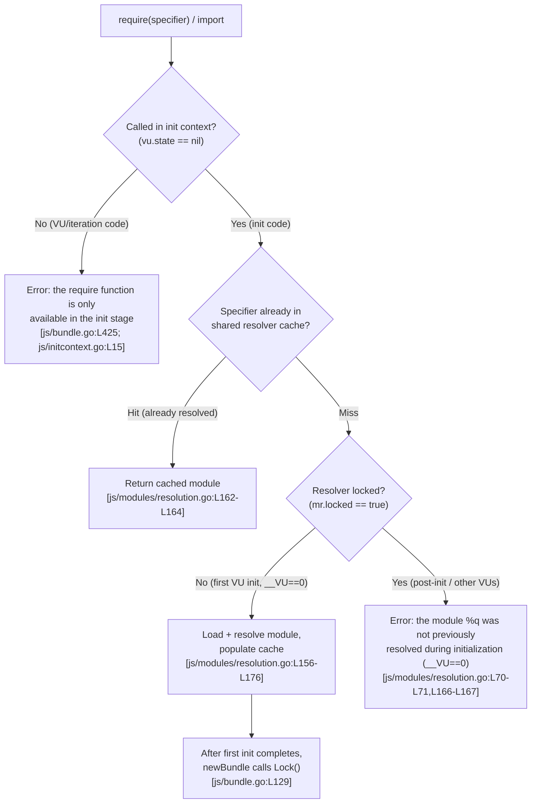

# k6 JavaScript Module Resolution: Init vs. VU Stages, the Resolver Freeze, and Relative Specifiers

> **Scope & reproducibility.** All findings in this document pertain to **grafana/k6 at commit `ddc3b0b1d23c128e34e2792fc9075f9126e32375`**, built from source as **`k6 v0.55.0 (commit/ddc3b0b1d2, go1.23.4, linux/amd64)`**. Every behavioral claim carries an inline source citation in the form `[<path>:<locator>]`, and every empirical claim (Q4) is backed by a **real k6 run** whose error/warning text and exit code are reproduced verbatim below.
>
> **Methodology.** The k6 source repository is treated as the source of truth. To capture the run transcripts, k6 was compiled to a path **outside** the repository (`/tmp/k6bin/k6`) and the demonstration scripts were placed in an ephemeral scratch directory **outside** the repository (`/tmp/k6demos`). Both were removed afterward. The repository remained **byte-for-byte unchanged** throughout (`git status --porcelain` reported zero changes). The `/tmp/k6demos/...` paths shown in the transcripts are those ephemeral scratch locations.
>
> **Citation correction.** The exit-code constants live in `errext/exitcodes/codes.go` (a file named `codes.go`, not `exitcodes.go`). All locators below reflect the actual on-disk source at the pinned commit.

---

## 1. TL;DR

**Q1 — Why do some scripts work in init but fail once the test runs with many VUs (especially with dynamic `require()`)?**
k6 runs **init code once per VU** and **VU code (the `default` function) repeatedly**. A **single** `ModuleResolver` is shared across all VUs `[js/bundle.go:L44]`; each VU gets its own `ModuleSystem` wrapper over that same resolver `[js/modules/resolution.go:L213-L218]`. After the **first** VU's init completes, k6 **locks** the resolver `[js/bundle.go:L129]`. From then on, a `require()` for a specifier that was **never resolved during the first init** is rejected. A module loaded *conditionally* — e.g. inside `if (__VU > 0) { require("./x.js") }` — is skipped during the first init (where `__VU == 0`), so it first hits the resolver only when a real VU initializes, by which time the resolver is locked. "Many VUs" does not *cause* the failure; it merely guarantees that the conditional/dynamic `require()` actually executes.

**Q2 — Does k6 freeze module resolution, and what is "already resolved" vs. "a new module to reject"?**
Yes. `ModuleResolver.Lock()` sets a boolean flag `locked = true` `[js/modules/resolution.go:L35,L137-L139]`. After that, **"already resolved" means a cache hit** — the specifier is present in the shared resolver cache, which is consulted *before* the lock is checked `[js/modules/resolution.go:L162-L164]`. **"A new module to reject" means a cache miss while `locked == true`** — the resolver then returns the error `the module %q was not previously resolved during initialization (__VU==0)` `[js/modules/resolution.go:L17,L166-L167]`. Built-ins are cached by literal name (`"k6"`, `"k6/http"`, …) `[js/modules/resolution.go:L150-L152]`; file modules are cached by their **absolute** resolved URL `[js/modules/resolution.go:L129,L162-L164]`.

**Q3 — How do relative specifiers behave when resolution depends on which module is executing?**
A relative specifier such as `"./shared.js"` is resolved against the directory of the **currently-executing (referencing) module**, which k6 reads from the JavaScript **call stack** via `getCurrentModuleScript` → `rt.CaptureCallStack(2, …)` `[js/modules/require_impl.go:L25,L185-L196]`, converted to a base directory by `reversePath` `[js/modules/resolution.go:L198-L211]`. The cache key is the resulting **absolute** URL, so the *same* literal `"./shared.js"` can resolve to *different* files depending on which module called `require` `[js/initcontext_test.go:L734]`.

**Q4 — Empirical proof.**
A module seen at init **can** be re-`require()`'d later by VUs (DEMO 1, exit `0`); a never-seen module **reliably fails** with the frozen-resolver error (DEMO 2, exit `107`). The same `"./shared.js"` resolves to two different files depending on the caller (DEMO 3, exit `0`). All exact error/warning strings and exit codes are in §6.

> **Premise correction (see §10):** The freeze is **deterministic and load-independent**. `Lock()` is called *exactly once*, right after the first VU's init `[js/bundle.go:L129]`. There is **no** "runtime pressure" trigger anywhere in the resolution path.

---

## 2. Stage model (init vs. VU) and the single shared resolver

A k6 script has two execution stages:

- **Init code** — everything at module top level (imports, `require()`, `open()`, constant setup). It runs **once per VU**, at the moment that VU is constructed.
- **VU code** — the exported `default` function (and lifecycle hooks). It runs **repeatedly** (once per iteration) for the duration of the test.

The boundary between the two is enforced by a single predicate: a VU is "in init context" exactly when its runtime `state` is `nil`. The `require` wrapper is gated on this: `inInitContext: func() bool { return vu.state == nil }` `[js/bundle.go:L439]`.

**One resolver, shared by all VUs.** The bundle holds a single resolver:

- The field is `ModuleResolver *modules.ModuleResolver` `[js/bundle.go:L44]`.
- It is created **once** via `modules.NewModuleResolver(...)` `[js/bundle.go:L110-L111]`.
- The first init runs as `bundle.instantiate(vuImpl, 0)` — i.e. with `__VU == 0` `[js/bundle.go:L125]` — and is **immediately** followed by `bundle.ModuleResolver.Lock()` `[js/bundle.go:L129]`.

**Per-VU wrappers over the same resolver.** Each VU's instantiation builds a *new* `ModuleSystem` around the *same* `*ModuleResolver`:

```go
type ModuleSystem struct {
    vu            VU
    instanceCache map[sobek.ModuleRecord]sobek.ModuleInstance
    resolver      *ModuleResolver
}
```
`[js/modules/resolution.go:L213-L218]`, constructed by `NewModuleSystem(resolver, vu)` `[js/modules/resolution.go:L221]`.

Consequently the `locked` flag and the resolution **cache** are shared across all VUs, even though each VU runs in its own Sobek (goja-fork) runtime with **shared-nothing** JavaScript state. That isolation of *runtime* state — distinct from the *shared* resolver — is corroborated by `TestLoadGlobalVarsAreNotSharedBetweenVUs` `[js/module_loading_test.go:L209]`.

This split is the entire root cause of the "works in init, fails later" phenomenon: VU-local JS state is recreated per VU, but the module **resolver** (and its lock) is a single shared object that has already been frozen by the time any VU with `__VU > 0` runs its init.

---

## 3. The three guards (frequently conflated — each has different symptoms and error text)

Three *independent* mechanisms produce "works in init, fails later" symptoms. They are not the same, and they fail differently. Distinguishing them is the core of **Q1**.

### (a) Init-stage gate — `require()`/`open()` may only be *called* during init

The `require` wrapper rejects any call made outside init context:

```go
func (r *requireImpl) require(specifier string) (*sobek.Object, error) {
    if !r.inInitContext() {
        return nil, fmt.Errorf(cantBeUsedOutsideInitContextMsg, "require")
    }
    return r.modSys.Require(specifier)
}
```
`[js/bundle.go:L424-L427]`, with `inInitContext` defined as `func() bool { return vu.state == nil }` `[js/bundle.go:L439]`. The `open` global has the analogous guard `if vu.state != nil { … "open" }` `[js/bundle.go:L445-L449]`.

The message constant is:

> `the "%s" function is only available in the init stage (i.e. the global scope), see https://grafana.com/docs/k6/latest/using-k6/test-lifecycle/ for more information`

`[js/initcontext.go:L15-L16]`.

**Symptom:** this exception is thrown from **VU/iteration code**. In a minimal run it is logged **each iteration** (with `source=stacktrace`), the offending iteration is dropped, and the run can still **exit `0`**. This is materially different from guard (b). Corroborated by `TestVUIntegrationRequireFunctionError` `[js/runner_test.go:L1260]` (asserts "only available in the init stage"). See **DEMO 4** (§6).

### (b) Frozen resolver — after `Lock()`, resolving any *new* specifier fails

Once `mr.locked == true`, both resolution paths reject a cache miss:

- Built-in path: `if mr.locked { return nil, fmt.Errorf(notPreviouslyResolvedModule, name) }` `[js/modules/resolution.go:L70-L71]`.
- File path: `if mr.locked { return nil, fmt.Errorf(notPreviouslyResolvedModule, arg) }` `[js/modules/resolution.go:L166-L167]`.

The message constant is:

> `the module %q was not previously resolved during initialization (__VU==0)`

`[js/modules/resolution.go:L17]`.

**Symptom:** **fatal**. It is thrown during **per-VU init**, which aborts VU creation and terminates the run with exit code **`107`** (`ScriptException` — see §6). Corroborated by `TestVUDoesNotRequireUnderConditions` `[js/runner_test.go:L1409]` (a conditional `require` reached only when `__VU > 0`) and its success counterpart `TestVUDoesRequireUnderConditions` `[js/runner_test.go:L1434]`. See **DEMO 1** (success) vs. **DEMO 2** (failure) in §6.

### (c) Dynamic `import()` — not available in the standard host program

Static ESM `import` declarations are resolved during init, so the imported modules enter the shared cache before `Lock()`. A *runtime dynamic* `import()` expression, however, is not wired up in the standard k6 host program, so the dynamic-loading path that users actually reach at runtime is `require()`. That is why the freeze is observed through `require()` rather than through `import()`. (Stated narrowly and only as far as the source supports.)

### Connecting (a)–(c) back to Q1

"Many VUs" never *causes* a resolution failure on its own. What changes with more VUs is simply that **per-VU init runs for VUs where `__VU > 0`**. Any `require()` placed behind a condition like `if (__VU > 0)` is skipped during the first init (`__VU == 0`), so the specifier is **absent from the cache** when the resolver later locks. The first VU that actually executes that branch hits guard (b) and the run dies with exit `107`. The fix is to make the `require()` unconditional at init (so the module is cached during the first init), after which VUs may freely re-`require()` it — exactly the DEMO 1 vs. DEMO 2 contrast.

---

## 4. Freeze mechanics — "already resolved" vs. "a new module to reject"

This is the core of **Q2**.

**The freeze flag.** The resolver carries a boolean:

```go
type ModuleResolver struct {
    cache     map[string]moduleCacheElement
    goModules map[string]any
    loadCJS   FileLoader
    compiler  *compiler.Compiler
    locked    bool
    ...
}
```
`[js/modules/resolution.go:L30-L40]` (the flag itself is at `[js/modules/resolution.go:L35]`).

**`Lock()` sets it** — and its doc comment states the design intent verbatim:

```go
// Lock locks the module's resolution from any further new resolving operation.
// It means that it relays only its internal cache and on the fact that it has already
// seen previously the module during the initialization.
// It is the same approach used for opening file operations.
func (mr *ModuleResolver) Lock() {
    mr.locked = true
}
```
`[js/modules/resolution.go:L133-L139]`.

### The crux: "already resolved" = cache **hit**; "new module to reject" = cache **miss while locked**

In `resolve()`, the cache is consulted **before** the lock is ever checked. That ordering is what makes a module seen at init always resolvable afterward:

- **Built-ins** — cache checked first: `if cached, ok := mr.cache[arg]; ok { return cached.mod, cached.err }` `[js/modules/resolution.go:L150-L152]`.
- **File modules** — cache checked first: `if cached, ok := mr.cache[specifier.String()]; ok { return cached.mod, cached.err }` `[js/modules/resolution.go:L162-L164]`.

Only **after** the cache miss does the file path test the lock: `if mr.locked { return nil, fmt.Errorf(notPreviouslyResolvedModule, arg) }` `[js/modules/resolution.go:L166-L167]` (built-ins: `[js/modules/resolution.go:L70-L71]`). Because the cache lookup precedes the lock check, a specifier resolved during the first init is a **hit** forever after — even once the resolver is locked. A specifier never resolved during init is a **miss**, and while locked, a miss is rejected.

So, precisely:

| Term | Meaning in code | Outcome when locked |
|------|-----------------|---------------------|
| **"Already resolved"** | Specifier key present in `mr.cache` (a hit at `[js/modules/resolution.go:L150-L152]` or `[js/modules/resolution.go:L162-L164]`) | Returns the cached module — **succeeds** |
| **"New module to reject"** | Specifier key absent from `mr.cache` (a miss) with `mr.locked == true` | Returns `notPreviouslyResolvedModule` — **fails** `[js/modules/resolution.go:L17]` |

### Cache key semantics

- **Built-ins** are keyed by their **literal name** — `"k6"`, `"k6/http"`, `"k6/x/..."` `[js/modules/resolution.go:L150-L152]`.
- **File modules** are keyed by their **absolute resolved URL string**. Population happens at `mr.cache[specifier.String()] = moduleCacheElement{mod: mod, err: err}` `[js/modules/resolution.go:L129]`, where `specifier` is the absolute URL. This absolute-vs-relative distinction is exactly what `TestCacheAbsolutePathsNotRelative` exists to lock down `[js/initcontext_test.go:L734]`.

### Deterministic lock point

`Lock()` is invoked **once**, immediately after the first init in `newBundle` `[js/bundle.go:L129]`. The freeze is therefore **load-independent** — see §10.

---

## 5. Relative-specifier / call-stack resolution (cache key = absolute URL)

This is the core of **Q3**.

When you call `require("./shared.js")`, k6 must decide *relative to what*. The answer is: **relative to the module that is currently executing the `require`**, which k6 discovers from the JavaScript call stack.

**1. `Require()` reads the current module from the call stack.**

```go
rt := ms.vu.Runtime()
parentModuleStr := getCurrentModuleScript(ms.vu)
parentModule, _ := ms.resolver.sobekModuleResolver(nil, parentModuleStr)
m, err := ms.resolver.sobekModuleResolver(parentModule, specifier)
```
`[js/modules/require_impl.go:L24-L28]`. The "parent" is the currently-executing module string.

**2. `getCurrentModuleScript` captures the caller's frame.**

```go
func getCurrentModuleScript(vu VU) string {
    rt := vu.Runtime()
    var parent string
    var buf [2]sobek.StackFrame
    frames := rt.CaptureCallStack(2, buf[:0])
    if len(frames) == 0 || frames[1].SrcName() == "file:///-" {
        return vu.InitEnv().CWD.JoinPath("./-").String()
    }
    parent = frames[1].SrcName()
    return parent
}
```
`[js/modules/require_impl.go:L185-L196]`. It captures two stack frames `[js/modules/require_impl.go:L189]`; if there is no caller frame or the caller is the synthetic `"file:///-"` entry, it falls back to the current working directory `[js/modules/require_impl.go:L190-L191]`; otherwise the parent is the caller's source name `[js/modules/require_impl.go:L193]`.

**3. `reversePath` turns the referencing module into a base directory.**

```go
func (mr *ModuleResolver) reversePath(referencingScriptOrModule interface{}) *url.URL {
    p, ok := mr.reverse[referencingScriptOrModule]
    if !ok {
        if referencingScriptOrModule != nil {
            panic("fix this")
        }
        return mr.base
    }
    if p.String() == "file:///-" {
        return mr.base
    }
    return p.JoinPath("..")
}
```
`[js/modules/resolution.go:L198-L211]`. A `nil` referrer or a `"file:///-"` referrer falls back to the resolver `base` `[js/modules/resolution.go:L204,L207-L209]`; otherwise the base is the **directory of the referencing module**, `p.JoinPath("..")` `[js/modules/resolution.go:L210]`.

**4. The loader resolves the relative path against that base.** `loader.Resolve` `[loader/loader.go:L48]`, `loader.Dir` `[loader/loader.go:L115]`, and `loader.Load` `[loader/loader.go:L122]` perform the actual path arithmetic and source loading.

**Conclusion.** The literal string `"./shared.js"` is *not* the cache key. It is first resolved — against the directory of whichever module is currently executing — into an **absolute URL**, and *that* absolute URL is the cache key `[js/modules/resolution.go:L129,L162-L164]`. Therefore the same `"./shared.js"` written in two different modules can resolve to two different files. This is corroborated by `TestCacheAbsolutePathsNotRelative` `[js/initcontext_test.go:L734]` (where `/a/import.js` and `/b/import.js` each import `"./interesting.js"` and correctly receive `/a/interesting.js` vs. `/b/interesting.js`), and by `TestPathResolution` `[js/path_resolution_test.go:L17]` and `TestImportMetaResolve` `[js/path_resolution_test.go:L342]`. See **DEMO 3** (§6) for the live proof.


---

## 6. Real-run transcripts (the heart of Q4) — reproduced verbatim

All transcripts below were captured from the from-source build described above. k6 emits each log entry as a **single line**; the escaped quotes `\"` and the literal `\n` (k6's encoding of newlines inside the `msg=` field) are reproduced exactly as emitted. Timestamps are elided as `time="..."` (they are wall-clock and run-specific); throughput figures are environment-specific and likewise elided.

**Exit-code legend** (from `errext/exitcodes/codes.go`): `ScriptException = 107` `[errext/exitcodes/codes.go:L48]`; for reference, `InvalidConfig = 104` `[errext/exitcodes/codes.go:L36]`, `ExternalAbort = 105` `[errext/exitcodes/codes.go:L41]`, `ScriptAborted = 108` `[errext/exitcodes/codes.go:L52]`.

**Build banner (stated once):**

```
$ go build -o /tmp/k6bin/k6 .      # built from the checked-out commit with Go 1.23.4 (vendored deps)
$ /tmp/k6bin/k6 version
k6 v0.55.0 (commit/ddc3b0b1d2, go1.23.4, linux/amd64)
```

### DEMO 1 — SUCCESS: a module seen at init can be re-`require()`'d by VUs (exit 0)

`seen.js`:
```js
exports.message = "hello from seen.js";
```

`success.js`:
```js
// Unconditional require runs during the first init (__VU==0), so "./seen.js"
// enters the shared resolver cache BEFORE Lock() is called.
require("./seen.js");

if (__VU > 0) {
  // Reached only by real VUs. Cache HIT -> succeeds even though the resolver is locked.
  const m = require("./seen.js");
  console.log("VU " + __VU + " re-required ./seen.js OK: " + m.message);
}

exports.default = function () {};
```

Command and result (one `source=console` line per VU; order varies because VUs run concurrently):
```
$ /tmp/k6bin/k6 run --vus 4 --iterations 8 success.js
time="..." level=info msg="VU 2 re-required ./seen.js OK: hello from seen.js" source=console
time="..." level=info msg="VU 4 re-required ./seen.js OK: hello from seen.js" source=console
time="..." level=info msg="VU 3 re-required ./seen.js OK: hello from seen.js" source=console
time="..." level=info msg="VU 1 re-required ./seen.js OK: hello from seen.js" source=console
     iterations...........: 8 ...
# exit code: 0
```

Because `require("./seen.js")` runs **unconditionally** at init, `"./seen.js"` is cached during the first init (`__VU == 0`). Every later VU's `require("./seen.js")` is a **cache hit** `[js/modules/resolution.go:L162-L164]`, so it succeeds even though the resolver is locked.

### DEMO 2 — FREEZE FAILURE: a never-seen module reliably fails (exit 107)

`never-seen.js`:
```js
exports.message = "hello from never-seen.js";
```

`freeze.js`:
```js
// "./never-seen.js" is NOT required during init (__VU==0); it never enters the cache.
if (__VU > 0) {
  // Reached only by real VUs. Cache MISS while locked -> REJECTED.
  const m = require("./never-seen.js");
  console.log("VU " + __VU + " got " + m.message);
}

exports.default = function () {};
```

Command and result (verbatim `stderr` line):
```
$ /tmp/k6bin/k6 run --vus 4 --iterations 8 freeze.js
time="..." level=error msg="GoError: the module \"./never-seen.js\" was not previously resolved during initialization (__VU==0)\n\tat go.k6.io/k6/js.(*requireImpl).require-fm (native)\n\tat file:///tmp/k6demos/freeze.js:4:20(8)\n" hint="error while initializing VU #3 (script exception)"
# exit code: 107
```

`"./never-seen.js"` is never required during the first init, so it is absent from the cache. When a VU with `__VU > 0` reaches the conditional `require`, it is a **cache miss while locked**, rejected at `[js/modules/resolution.go:L166-L167]` with the message constant `[js/modules/resolution.go:L17]`. The error is **fatal during per-VU init** (`error while initializing VU`), so the run exits **`107`**.

> **Note on nondeterminism:** which VU number appears in the `hint` (`#2`, `#3`, …) varies between runs because VUs initialize concurrently — this run reported `VU #3`. The **error itself is deterministic**; only the VU index varies.

### DEMO 3 — RELATIVE SPECIFIER: the same `"./shared.js"` resolves to different files (exit 0)

`relative/dirA/shared.js`: `exports.who = "I am dirA/shared.js";`
`relative/dirB/shared.js`: `exports.who = "I am dirB/shared.js";`

`relative/dirA/mod.js`:
```js
const shared = require("./shared.js");
exports.whoAmI = function () { return shared.who; };
```

`relative/dirB/mod.js`:
```js
const shared = require("./shared.js");
exports.whoAmI = function () { return shared.who; };
```

`relative/main.js`:
```js
const a = require("./dirA/mod.js");
const b = require("./dirB/mod.js");
console.log('From dirA/mod.js, "./shared.js" -> ' + a.whoAmI());
console.log('From dirB/mod.js, "./shared.js" -> ' + b.whoAmI());
exports.default = function () {};
```

Command and result (verbatim; the two distinct lines below repeat once per init pass because the `console.log` statements sit in init code):
```
$ /tmp/k6bin/k6 run --iterations 1 relative/main.js
time="..." level=info msg="From dirA/mod.js, \"./shared.js\" -> I am dirA/shared.js" source=console
time="..." level=info msg="From dirB/mod.js, \"./shared.js\" -> I am dirB/shared.js" source=console
# exit code: 0
```

Although both `dirA/mod.js` and `dirB/mod.js` contain the *identical* string `require("./shared.js")`, each resolves relative to its own directory — `dirA/mod.js` resolves to `dirA/shared.js`, and `dirB/mod.js` to `dirB/shared.js`. The base directory is computed from the currently-executing module via `getCurrentModuleScript` `[js/modules/require_impl.go:L185-L196]` and `reversePath` `[js/modules/resolution.go:L198-L211]`, and the two resulting **absolute URLs** are distinct cache keys `[js/modules/resolution.go:L129,L162-L164]`.

### DEMO 4 — Init-stage gate: `require` inside the `default` (VU) function

`require_in_vu.js`:
```js
exports.default = function () {
  require("k6/http");
};
```

Result (verbatim):
```
$ /tmp/k6bin/k6 run --iterations 1 require_in_vu.js
time="..." level=error msg="GoError: the \"require\" function is only available in the init stage (i.e. the global scope), see https://grafana.com/docs/k6/latest/using-k6/test-lifecycle/ for more information\n\tat go.k6.io/k6/js.(*requireImpl).require-fm (native)\n\tat file:///tmp/k6demos/extra/require_in_vu.js:2:10(3)\n" executor=shared-iterations scenario=default source=stacktrace
# exit code: 0   (iteration-level exception: logged each iteration, iteration dropped, run still exits 0)
```

This is **guard (a)**. The call is made from VU code, so `inInitContext()` is false `[js/bundle.go:L425,L439]` and the init-stage message constant is returned `[js/initcontext.go:L15-L16]`. Crucially, its symptom differs from guard (b): it is logged with `source=stacktrace`, the iteration is dropped, and — with no other failure — the run **exits `0`**. (Running with `--iterations 3` logs the same error three times, once per iteration, confirming the per-iteration behavior.) Contrast this with DEMO 2's fatal exit `107`.

### DEMO 5 — Empty specifier (at init, exit 107)

`empty_specifier.js`:
```js
require("");
exports.default = function () {};
```

Result (verbatim):
```
$ /tmp/k6bin/k6 run --iterations 1 empty_specifier.js
time="..." level=error msg="GoError: require() can't be used with an empty specifier\n\tat go.k6.io/k6/js.(*requireImpl).require-fm (native)\n\tat file:///tmp/k6demos/extra/empty_specifier.js:1:35(3)\n" hint="script exception"
# exit code: 107
```

The empty specifier is rejected immediately by `Require()` via `errors.New("require() can't be used with an empty specifier")` `[js/modules/require_impl.go:L20-L22]`, before any resolution. Thrown at init, it is fatal (exit `107`).


---

## 7. The `open()` filesystem analog

The resolver freeze has a direct filesystem counterpart, and the `Lock()` doc comment says so explicitly: *"It is the same approach used for opening file operations"* `[js/modules/resolution.go:L133-L136]`. k6 restricts the filesystem to files that were already opened during init via `allowOnlyOpenedFiles` `[js/initcontext.go:L56-L64]`. Opening a file that was never opened during init fails with:

> `open() can't be used with files that weren't previously opened during initialization (__VU==0), path: %q`

`[js/initcontext.go:L39-L42]`. This is corroborated by `TestVUDoesNotOpenUnderConditions` `[js/runner_test.go:L1336]`.

### DEMO 6 — `open()` of a never-opened file (exit 107)

`open_never.js`:
```js
if (__VU > 0) {
  open("./data.txt");
}
exports.default = function () {};
```

Result (verbatim):
```
$ /tmp/k6bin/k6 run --vus 2 --iterations 4 open_never.js
time="..." level=error msg="GoError: open() can't be used with files that weren't previously opened during initialization (__VU==0), path: \"/tmp/k6demos/extra/data.txt\"\n\tat go.k6.io/k6/js.(*Bundle).setInitGlobals.func3 (native)\n\tat file:///tmp/k6demos/extra/open_never.js:2:7(7)\n" hint="error while initializing VU #1 (script exception)"
# exit code: 107
```

Exactly like the resolver freeze: the file is never opened during the first init, so opening it from a VU with `__VU > 0` is rejected during per-VU init (exit `107`). As with DEMO 2, the VU index in the `hint` is nondeterministic (this run reported `VU #1`); the error is deterministic.

### DEMO 7 — `open()`-relativity deprecation warning (exit 0)

k6 currently resolves a relative `open()` path against the directory of the **requiring** module, not the module the `open()` call is written in. When those directories differ, k6 emits a one-time deprecation warning. The trigger is `ShouldWarnOnParentDirNotMatchingCurrentModuleParentDir` `[js/modules/require_impl.go:L144-L162]` (which returns early — i.e. does **not** warn — once the resolver is locked), and the warning is emitted at `[js/bundle.go:L463-L467]`. The setup below mirrors `TestPathResolution`'s "open complex" case `[js/path_resolution_test.go:L51-L72]`.

`owc/A/B/data.txt`: `data file`

`owc/A/C/B/script.js`:
```js
// Here the path is relative to this module but to the one calling
module.exports = () =>  open("./../data.txt");
```

`owc/A/B/B/script.js`:
```js
module.exports = require("./../../C/B/script.js")();
```

`owc/A/A/A/A/script.js`:
```js
let data = require("./../../../B/B/script.js");
if (data != "data file") {
  throw new Error("wrong content " + data);
}
export default function() {}
```

Result (verbatim):
```
$ /tmp/k6bin/k6 run --iterations 1 owc/A/A/A/A/script.js
time="..." level=warning msg="open() was used and is currently relative to 'file:///tmp/k6demos/owc/A/B/B/', but in the future it will be aligned with how `require` and imports work and will be relative to 'file:///tmp/k6demos/owc/A/C/B/script.js'. This means that in the future open will open relative path relative to the module/file it is written in. You can future proof this by using `import.meta.resolve()` to get relative paths to the file it is written in the current k6 version."
# exit code: 0   (warning only)
```

The `open("./../data.txt")` lives in `A/C/B/script.js` but is *invoked* from `A/B/B/script.js`; today the path resolves relative to the caller's directory (`file:///.../A/B/B/`), which is why the warning points out the future change to align `open()` with how `require`/imports resolve (relative to the file the call is written in). The run still **exits `0`** — it is a warning, not an error.


---

## 8. Edge case — the ESM/CJS mixing guard

k6 installs throwing accessor globals for `module` and `exports` so that *reading* them inside an ESM module surfaces a clear error instead of silently returning `undefined`. The accessor is built by `warnAboutModuleMixing` `[js/bundle.go:L478-L490]`, which defines a getter/setter that returns:

> `you are trying to access identifier %q, this likely is due to mixing ECMAScript Modules (ESM) and CommonJS syntax. This isn't supported in the JavaScript standard, please use only one or the other`

In a **CommonJS** module, by contrast, `module` and `exports` are not globals at all — they are passed as **function parameters** that shadow those throwing globals. See `ExecuteModule` `[js/modules/cjsmodule.go:L61-L100]`: a fresh `module` object is created with `module.Set("exports", cmi.exports)` `[js/modules/cjsmodule.go:L71]`, then the wrapped module function is invoked as `call(cmi.exports, module, cmi.exports)` `[js/modules/cjsmodule.go:L77]`. A module that sets `exports` to `null` is rejected with `errors.New("CommonJS's exports must not be null")` `[js/modules/cjsmodule.go:L83]`.

### DEMO 8 — accessing `module` from an ESM module (exit 107)

`esm_mixing.js`:
```js
export const x = 1;
const sneaky = module;
export default function () {};
```

Result (verbatim):
```
$ /tmp/k6bin/k6 run --iterations 1 esm_mixing.js
time="..." level=error msg="GoError: you are trying to access identifier \"module\", this likely is due to mixing ECMAScript Modules (ESM) and CommonJS syntax. This isn't supported in the JavaScript standard, please use only one or the other\n\tat file:///tmp/k6demos/extra/esm_mixing.js:2:16(13)\n" hint="script exception"
# exit code: 107
```

Because `export` markers make the file an ESM module, the global `module` accessor is active; reading it throws, and the error is fatal at init (exit `107`).

---

## 9. Design rationale — why the freeze exists

The freeze, and the broader requirement that all module imports and file opens happen during init, exist to enable **archiving and distributed execution**. k6 supports bundling a test into a self-contained archive (`k6 archive`) and running tests across distributed instances (k6 cloud / distributed runs); to do that, k6 must know *every* module and file the test will ever touch **up front**, during init, so it can collect and ship them. If a VU could pull in an arbitrary new module mid-test, the archive could be incomplete and a distributed run could diverge.

The code states the same idea: the resolver, once locked, *"relays only its internal cache"* and relies on *"having already seen previously the module during the initialization,"* and it is *"the same approach used for opening file operations"* `[js/modules/resolution.go:L133-L136]`. The filesystem analog (§7) and the matching `(__VU==0)` wording in both error messages (`[js/modules/resolution.go:L17]` and `[js/initcontext.go:L39-L42]`) reflect one unified design principle.

This is a **deliberate design property**, not a performance optimization that kicks in under load. (The official k6 test-lifecycle and module-system documentation describe the same init-vs-VU split and the rationale for resolving everything during init; the code remains the source of truth here.)

---

## 10. Critical premise correction — the freeze is *not* triggered by "runtime pressure"

> **The premise that k6 freezes module resolution "when the runtime is under pressure" is incorrect and is corrected here.**

- `Lock()` is invoked **exactly once**, immediately after the first VU's init completes, in `newBundle`: `bundle.ModuleResolver.Lock()` `[js/bundle.go:L129]`.
- It is therefore **deterministic and completely independent of VU count or runtime load**. There is **no** "pressure"-based, throughput-based, or VU-count-based trigger anywhere in the resolution path. The only state involved is the single boolean `locked` `[js/modules/resolution.go:L35]`, flipped once by `Lock()` `[js/modules/resolution.go:L137-L139]`.
- High VU counts merely make the symptom **visible**. The freeze happens at the same point regardless of how many VUs you configure; more VUs simply means more per-VU inits execute, so a conditional/dynamic `require()` guarded by something like `if (__VU > 0)` is *eventually executed* against the already-locked resolver. DEMO 1 (cached at init → succeeds) versus DEMO 2 (never cached → fails) is the empirical proof: both runs lock the resolver at the identical point; only whether the specifier was cached during the first init differs.

In short: the freeze is a fixed lifecycle event, and "many VUs" is the *trigger for executing the conditional code*, not the trigger for the freeze.


---

## 11. Corroborating existing tests (read-only)

These tests in the k6 source encode the exact behaviors documented above. They were read for corroboration only; none were modified.

| Behavior | Test | Locator |
|----------|------|---------|
| Freeze on a conditional `require` reached only when `__VU > 0` | `TestVUDoesNotRequireUnderConditions` | `[js/runner_test.go:L1409]` |
| Success counterpart — module seen at init is re-`require()`'able by VUs | `TestVUDoesRequireUnderConditions` | `[js/runner_test.go:L1434]` |
| Init-stage gate — `require` outside init → "only available in the init stage" | `TestVUIntegrationRequireFunctionError` | `[js/runner_test.go:L1260]` |
| `open()` freeze analog — never-opened file rejected | `TestVUDoesNotOpenUnderConditions` | `[js/runner_test.go:L1336]` |
| `require` semantics / cache behavior | `TestRequire` | `[js/initcontext_test.go:L27]` |
| Cache keyed by **absolute** path, not the relative string | `TestCacheAbsolutePathsNotRelative` | `[js/initcontext_test.go:L734]` |
| Relative path resolution semantics (incl. "open complex") | `TestPathResolution` | `[js/path_resolution_test.go:L17]` |
| `import.meta.resolve()` resolution semantics | `TestImportMetaResolve` | `[js/path_resolution_test.go:L342]` |
| Per-VU shared-nothing JS isolation (distinct from the shared resolver) | `TestLoadGlobalVarsAreNotSharedBetweenVUs` | `[js/module_loading_test.go:L209]` |

---

## 12. Control-flow diagram

The following diagram summarizes the decision path for `require(specifier)` / `import`. Read top to bottom: first the init-stage gate (guard a), then the shared-cache lookup (the "already resolved" hit), then the lock check (the freeze, guard b). The `LOCK` node records *when* the resolver is frozen — once, right after the first init.



- **A → B:** every `require`/`import` first passes the init-stage gate. A call from VU code (`vu.state != nil`) is rejected immediately (`E1`, guard a) `[js/bundle.go:L425]`, `[js/initcontext.go:L15-L16]`.
- **B → C:** in init context, the shared cache is consulted. A **hit** ("already resolved") returns the cached module (`OK`) `[js/modules/resolution.go:L162-L164]`.
- **C → D:** on a **miss**, the lock is checked. If unlocked (only true during the first init, `__VU == 0`), the module is loaded and cached (`LOAD`) `[js/modules/resolution.go:L156-L176]`. If locked, the call is rejected (`E2`, guard b) `[js/modules/resolution.go:L70-L71,L166-L167]`.
- **LOAD → LOCK:** after the first init finishes, `newBundle` calls `Lock()` exactly once `[js/bundle.go:L129]`.

---

## 13. Reproduction appendix

These steps reproduce every transcript above against commit `ddc3b0b1d23c128e34e2792fc9075f9126e32375` (k6 v0.55.0).

**1. Toolchain & build.** Use Go 1.23.4. From the repository root, build to a path **outside** the repo so the working tree stays clean (dependencies are vendored — do **not** modify `go.mod`/`go.sum`):

```
$ go build -o /tmp/k6bin/k6 .
$ /tmp/k6bin/k6 version
k6 v0.55.0 (commit/ddc3b0b1d2, go1.23.4, linux/amd64)
```

> Toolchain context: `go.mod` declares `go 1.21` `[go.mod:L3]` with `toolchain go1.21.13` `[go.mod:L5]`; k6 CI uses a newer Go, and the evidence in this document was captured with Go 1.23.4.

**2. Scratch scripts (outside the repo).** Place all demo files from §6–§8 in an ephemeral scratch directory such as `/tmp/k6demos` (the exact paths shown in the transcripts), then run the commands shown in each demo. The directory layout used here was:

```
/tmp/k6demos/seen.js
/tmp/k6demos/success.js
/tmp/k6demos/never-seen.js
/tmp/k6demos/freeze.js
/tmp/k6demos/relative/{dirA,dirB}/{shared.js,mod.js}
/tmp/k6demos/relative/main.js
/tmp/k6demos/extra/{require_in_vu.js,empty_specifier.js,open_never.js,esm_mixing.js}
/tmp/k6demos/owc/A/B/data.txt
/tmp/k6demos/owc/A/C/B/script.js
/tmp/k6demos/owc/A/B/B/script.js
/tmp/k6demos/owc/A/A/A/A/script.js
```

**3. Clean up & verify integrity.** Delete the scratch directory and the compiled binary (`rm -rf /tmp/k6demos /tmp/k6bin`). Confirm the repository is untouched:

```
$ git status --porcelain
$            # zero lines of output → byte-for-byte unchanged
```

Throughout the investigation and all demonstration runs, the k6 repository remained **byte-for-byte unchanged**; the compiled binary and every scratch script lived entirely outside the repository and were removed afterward.

---

*Document generated for grafana/k6 @ `ddc3b0b1d23c128e34e2792fc9075f9126e32375` (k6 v0.55.0, go1.23.4, linux/amd64). All code citations verified against the on-disk source at that commit; all run transcripts captured from a from-source build.*

