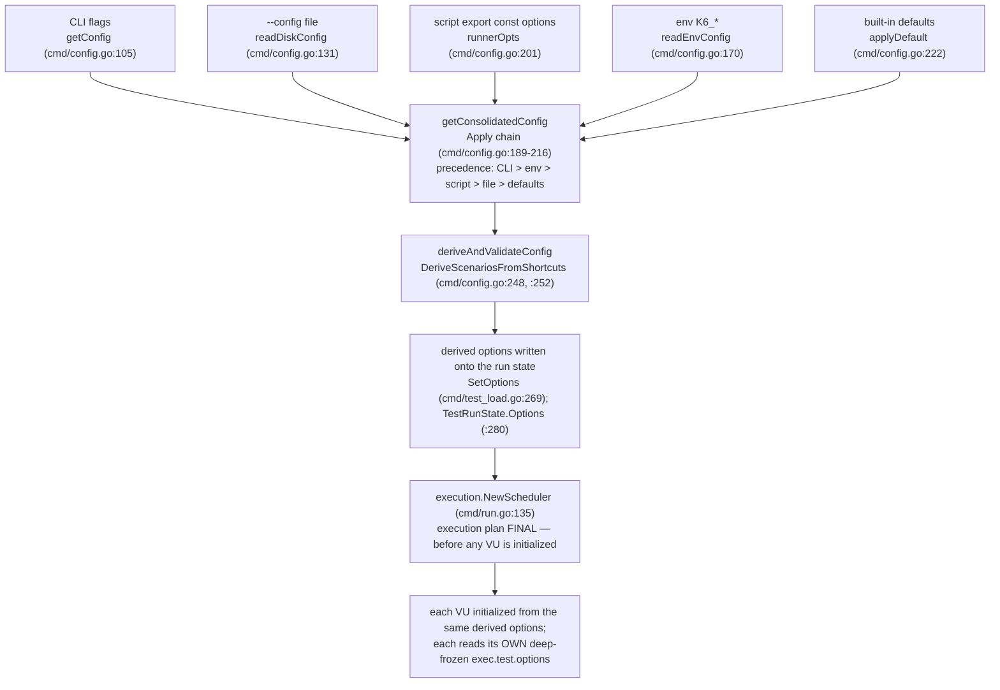

# How k6 decides the "real" options: consolidation, precedence, and the freeze point

You are new to `grafana/k6`. You put an `export const options` object in your test script, you sometimes also pass command-line flags, and occasionally you add a `--config` file — and you have noticed that **"VUs, duration, or scenario settings win from an unexpected place."** This document answers, from the source code and from real runs of a canonically-built `k6`, exactly **how k6 consolidates every option source into the single effective set the scheduler uses**, **at which instant that decision becomes final**, and **why one setting can appear to come from a different place than another**. Every factual claim below is backed either by a `file:line` citation into the source at commit `ddc3b0b1d2`, or by the complete, unedited output of a real `k6 run`.

> **How the evidence was produced (run-first).** `k6` was built from source in its default configuration and executed through its real `k6 run` entry point; the seven runs in **Section 5** are the actual, unedited program output (no debug hooks, no bypasses), and **each condition was executed three times** (see *“Repeat evidence and stability”* at the end of Section 5). The seven run commands and their full output are in **Section 5**; the exact, self-contained build-and-run transcript that produced them — including the `go build` command — is in **Section 7**. Software under test: `k6 v0.55.0 (commit/ddc3b0b1d2, go1.23.12, linux/amd64)`.

## 1. Direct answer (read this first)

**Precedence — highest wins:**

> **CLI flags  >  environment `K6_*`  >  script `export const options`  >  `--config` file  >  built-in defaults**

Whatever the highest-priority source sets for a given option is the value the test runs with; anything a source leaves unset falls through to the next source down.

**When the decision becomes final (the freeze point).** The sources are merged by `getConsolidatedConfig` (`cmd/config.go:189-216`); then the execution shortcuts (`vus`/`duration`/`stages`/`iterations`) are *derived* into a concrete scenario (`deriveAndValidateConfig` → `DeriveScenariosFromShortcuts`); then the derived options are *written onto the run state* — `SetOptions` reinjects them into the runner (`cmd/test_load.go:269`) and `TestRunState.Options` is set to `derivedConfig.Options` with the code's own comment `// we will always run with the derived options` (`cmd/test_load.go:280`). The `k6 run` command reads that derived config (`cmd/run.go:127`) and constructs the execution scheduler with `execution.NewScheduler(...)` (`cmd/run.go:135`). **That scheduler construction — which happens before any VU is initialized — is the point at which the effective execution plan is final for the run:** nothing after it re-consolidates the options. Every VU is then initialized from these same derived options, and at runtime each VU reads those same values through `exec.test.options`, exposed as a deep-frozen (read-only) object (mechanism traced in Section 3; per-VU values shown live in Section 5, Run 7; object identity shown in Section 7.9).

**Why a value can seem to come from "an unexpected place."** Two facts combine:

1. The `--config` file sits **below** the script in precedence, so a value in `export const options` overrides the same value in a `--config` file (see Run 4). Many people expect a config *file* to beat the script; it does not.
2. Inside `Options.Apply` there is a **mutual-exclusion rule** (`lib/options.go:365-377`): when a higher tier sets **any one** of `duration`/`iterations`/`stages`/`scenarios`, k6 **clears all four** of them from the lower tiers — they move as a single group. But `vus` is applied **independently** (`lib/options.go:361-363`). So your effective `vus` can be inherited from one tier while your duration/stages/scenario definition comes from another — exactly the "wins from an unexpected place" surprise. Section 4 explains this mechanically.

The table below summarizes the seven runs that prove the ordering; their full, unedited output is in Section 5. (`"$BIN"` is the absolute path to the freshly-built binary; it is defined in the Section 7 transcript.)

| Run | Conflict | Command | Observed banner | Winner |
|-----|----------|---------|-----------------|--------|
| 1 | Baseline (script only) | `"$BIN" run script.js` | `3 max VUs … 3 looping VUs for 3s` | Script |
| 2 | CLI vs script | `"$BIN" run --vus 7 --duration 2s script.js` | `7 max VUs … 7 looping VUs for 2s` | CLI |
| 3 | Env vs script | `K6_VUS=5 K6_DURATION=4s "$BIN" run script.js` | `5 max VUs … 5 looping VUs for 4s` | Env |
| 4 | Config file vs script | `"$BIN" run --config cfg.json script.js` | `3 max VUs … 3 looping VUs for 3s` | Script |
| 5 | Config file vs defaults | `"$BIN" run --config cfg.json noopts.js` | `2 max VUs … 2 looping VUs for 9s` | Config file |
| 6 | Full stack (all four) | `K6_VUS=5 K6_DURATION=4s "$BIN" run --config cfg.json --vus 7 --duration 2s script.js` | `7 max VUs … 7 looping VUs for 2s` | CLI (top) |
| 7 | Multiple VUs | `"$BIN" run --vus 3 --duration 2s multivu.js` (script `vus:1`) | `3 max VUs … 3 looping VUs for 2s`; every VU logs `executor=constant-vus vus=3 duration=2s` | CLI (concurrency) |

**Observed precedence chain:** `CLI (7 / 2s) > env K6_* (5 / 4s) > script (3 / 3s) > --config file (2 / 9s) > built-in defaults`.

## 2. How the options are consolidated: `getConsolidatedConfig` and the `Apply` chain

The single effective configuration is assembled by **`getConsolidatedConfig`** in `cmd/config.go` (`cmd/config.go:189-216`). It composes several `Config` values with **`Config.Apply`** (`cmd/config.go:71-92`), and `Config.Apply` in turn calls **`Options.Apply`** (`lib/options.go:357-517`) for the option fields.

**The override rule is field-by-field, and “set” is defined per field type.** A field in the argument overrides the same field in the receiver **only when that field is set** — but the test for “set” depends on the field's type:

- **Nullable scalar options** — `vus`, `duration`, `iterations`, `paused`, and the boolean `Config`-level flags — are built on the nullable wrappers from `gopkg.in/guregu/null.v3` and count as set **only when their `.Valid` flag is `true`** (e.g. `if opts.VUs.Valid`, `if opts.Duration.Valid`).
- **Composite options** use a **non-`nil` / non-empty** test instead: `Stages` and `Scenarios` override when the slice/map is **non-`nil`** (`if opts.Stages != nil`, `if opts.Scenarios != nil`), and the `Config`-level `Out` and `Collectors` slices override when **`len(...) > 0`**.

An unset field — a null wrapper whose `.Valid` is `false`, or a `nil` slice/map — is **transparent**: it does not overwrite the lower tier, so the lower tier shows through. `Config.Apply` makes the two styles explicit side by side:

```go
func (c Config) Apply(cfg Config) Config {
	c.Options = c.Options.Apply(cfg.Options)
	if len(cfg.Out) > 0 {
		c.Out = cfg.Out
	}
	if cfg.Linger.Valid {
		c.Linger = cfg.Linger
	}
	if cfg.NoUsageReport.Valid {
		c.NoUsageReport = cfg.NoUsageReport
	}
	if cfg.WebDashboard.Valid {
		c.WebDashboard = cfg.WebDashboard
	}
	if cfg.NoArchiveUpload.Valid {
		c.NoArchiveUpload = cfg.NoArchiveUpload
	}
	if len(cfg.Collectors) > 0 {
		c.Collectors = cfg.Collectors
	}
	return c
}
```

(The per-field tests inside `Options.Apply` — scalar `.Valid` for `vus`/`duration`/`iterations`, non-`nil` for `stages`/`scenarios` — are shown in Section 4.)

**Because `Apply` is one-directional, the *order* of the `Apply` calls is what encodes precedence.** Here is the doc-comment header and the merge chain (the four ordered assignments), verbatim:

```go
// Assemble the final consolidated configuration from all of the different sources:
// - start with the CLI-provided options to get shadowed (non-Valid) defaults in there
// - add the global file config options
// - add the Runner-provided options (they may come from Bundle too if applicable)
// - add the environment variables
// - merge the user-supplied CLI flags back in on top, to give them the greatest priority
// - set some defaults if they weren't previously specified
// TODO: add better validation, more explicit default values and improve consistency between formats
// TODO: accumulate all errors and differentiate between the layers?
func getConsolidatedConfig(gs *state.GlobalState, cliConf Config, runnerOpts lib.Options) (conf Config, err error) {
	fileConf, err := readDiskConfig(gs)
	if err != nil {
		return conf, errext.WithExitCodeIfNone(err, exitcodes.InvalidConfig)
	}
	envConf, err := readEnvConfig(gs.Env)
	if err != nil {
		return conf, errext.WithExitCodeIfNone(err, exitcodes.InvalidConfig)
	}

	conf = cliConf.Apply(fileConf)

	conf = conf.Apply(Config{Options: runnerOpts})

	conf = conf.Apply(envConf).Apply(cliConf)
	conf = applyDefault(conf)
```

Read the four assignments in order (lines 199, 201, 203, 204):

1. `conf = cliConf.Apply(fileConf)` (`cmd/config.go:199`) — start from the CLI skeleton (so non-`Valid` CLI placeholders are present), then let the **`--config` file** override.
2. `conf = conf.Apply(Config{Options: runnerOpts})` (`cmd/config.go:201`) — let the **script's `export const options`** (passed in as `runnerOpts`) override the file.
3. `conf = conf.Apply(envConf).Apply(cliConf)` (`cmd/config.go:203`) — let the **`K6_*` environment** override, and then **merge the CLI flags back in on top**. The CLI is applied **last**, so it has the greatest priority.
4. `conf = applyDefault(conf)` (`cmd/config.go:204`) — fill in built-in **defaults** only for fields that are still unset.

The function's own doc-comment says the same thing in the code's words: *"merge the user-supplied CLI flags back in on top, to give them the greatest priority"* (`cmd/config.go:185`). The result is the precedence **CLI > env > script > `--config` file > defaults**.

**The sources that feed the chain:**

| Source | Loader | Location |
|--------|--------|----------|
| CLI flags (pflags) | `getConfig` | `cmd/config.go:105-125` |
| `--config` file (JSON) | `readDiskConfig` | `cmd/config.go:131-152` |
| script `export const options` | passed in as `runnerOpts` | consumed at `cmd/config.go:201` |
| `K6_*` environment | `readEnvConfig` | `cmd/config.go:170-178` |
| built-in defaults | `applyDefault` | `cmd/config.go:222-246` |

**How the `--config` file is located.** The persistent `--config/-c` flag is registered on the root command — `flags.StringVarP(&gs.Flags.ConfigFilePath, "config", "c", ...)` (`cmd/root.go:173`). When you do not pass `-c`, the default path is `os.UserConfigDir()/loadimpact/k6/config.json` — `filepath.Join(homeDir, "loadimpact", "k6", defaultConfigFileName)` (`cmd/state/state.go:152`, with `defaultConfigFileName = "config.json"` at `cmd/state/state.go:20`), and the path can be overridden by the `K6_CONFIG` environment variable (`cmd/state/state.go:163-164`). Running with a clean `HOME` that contains no such file is the canonical "normal user with no prior config" state used for the runs (Section 7).

**End-to-end flow** (consolidate → derive → reinject → schedule):



## 3. When the decision is final: derive, reinject, and construct the scheduler

Consolidation produces the merged `Config`, but two more steps happen before the run is locked in.

**(a) Derive the shortcuts into a concrete scenario.** `deriveAndValidateConfig` (`cmd/config.go:248-257`) calls `executor.DeriveScenariosFromShortcuts` (call at `cmd/config.go:252`; implementation `lib/executor/execution_config_shortcuts.go:52-120`), which turns the `vus`/`duration`/`stages`/`iterations` shortcuts into an explicit `scenarios.default` entry with a concrete executor:

```go
func deriveAndValidateConfig(
	conf Config, isExecutable func(string) bool, logger logrus.FieldLogger,
) (result Config, err error) {
	result = conf
	result.Options, err = executor.DeriveScenariosFromShortcuts(conf.Options, logger)
	if err == nil {
		err = validateConfig(result, isExecutable)
	}
	return result, errext.WithExitCodeIfNone(err, exitcodes.InvalidConfig)
}
```

**(b) Store the derived config and reinject it into the runner.** In `cmd/test_load.go` the consolidated config is produced at `cmd/test_load.go:203` and the derived config at `cmd/test_load.go:226`. `buildTestRunState` then reinjects the options into the runner via `SetOptions` (`cmd/test_load.go:269`) and writes the **derived** options onto the `TestRunState`:

```go
func (lct *loadedAndConfiguredTest) buildTestRunState(
	configToReinject lib.Options,
) (*lib.TestRunState, error) {
	// This might be the full derived or just the consodlidated options
	if err := lct.initRunner.SetOptions(configToReinject); err != nil {
		return nil, err
	}

	// it pre-loads system certificates to avoid doing it on the first TLS request.
	// This is done async to avoid blocking the rest of the loading process as it will not stop if it fails.
	go loadSystemCertPool(lct.preInitState.Logger)

	return &lib.TestRunState{
		TestPreInitState: lct.preInitState,
		Runner:           lct.initRunner,
		Options:          lct.derivedConfig.Options, // we will always run with the derived options
		RunTags:          lct.preInitState.Registry.RootTagSet().WithTagsFromMap(configToReinject.RunTags),
		GroupSummary:     lib.NewGroupSummary(lct.preInitState.Logger),
	}, nil
```

Note line 280: `Options: lct.derivedConfig.Options, // we will always run with the derived options`. This *writes* the derived options onto the run state; it is not itself a “freeze” of a runtime object (the per-VU freeze happens later, in step (d)).

**(c) `k6 run` reads the derived config and builds the scheduler.**

```go
	conf := test.derivedConfig
	testRunState, err := test.buildTestRunState(conf.Options)
	if err != nil {
		return err
	}

	// Create a local execution scheduler wrapping the runner.
	logger.Debug("Initializing the execution scheduler...")
	execScheduler, err := execution.NewScheduler(testRunState, controller)
```

`execution.NewScheduler(testRunState, controller)` (`cmd/run.go:135`) — which runs **before any VU is initialized** — is the instant at which the effective **execution plan** is final for the run. Everything after this point (spawning VUs, iterating) uses the derived options that were written onto the `TestRunState`; nothing re-consolidates them.

**(d) Each VU is initialized from those same derived options, and reads them at runtime through a deep-frozen `exec.test.options` object.** `SetOptions` sets the runner's bundle to the derived options (`js/runner.go:434-436`):

```go
// SetOptions sets the test Options to the provided data and makes necessary changes to the Runner.
func (r *Runner) SetOptions(opts lib.Options) error {
	r.Bundle.Options = opts
```

When a VU is created, its `lib.State` receives that same bundle's options (`js/runner.go:232`) — a per-VU `Options` value, not a shared pointer to one object:

```go
	vu.state = &lib.State{
		Logger:         vu.Runner.preInitState.Logger,
		Options:        vu.Runner.Bundle.Options,
```

At runtime, `exec.test` is itself an **accessor property** on the execution module (`js/modules/k6/execution/execution.go:47-61` — defined via `o.DefineAccessorProperty("test", …)` at `:48` and registered at `:61`), so **every** read of `exec.test` calls `newTestInfo()` and returns a *fresh* test-info object. Each of those test-info objects lazily builds and caches its **own** deep-frozen options object in a closure variable (`optionsObject`) that is local to that single `newTestInfo()` call (`js/modules/k6/execution/execution.go:168-200` — the cache variable is declared at `:171`, and it is populated on the first read of `.options`, `:184-197`):

```go
		"options": func() interface{} {
			vuState := mi.vu.State()
			if vuState == nil {
				common.Throw(rt, testInfoInitContextErr)
			}
			if optionsObject == nil {
				opts, err := optionsAsObject(rt, vuState.Options)
				if err != nil {
					common.Throw(rt, err)
				}
				optionsObject = opts
			}
			return optionsObject
		},
```

`optionsAsObject` builds that object by JSON round-tripping the options, deleting the shortcut keys `vus`/`iterations`/`duration`/`stages` (they have been folded into the derived scenario), and then **deep-freezing** it with `common.FreezeObject` (`js/modules/k6/execution/execution.go:283-338`; the freeze is at `:333`):

```go

	mustDelete("vus")
	mustDelete("iterations")
	mustDelete("duration")
	mustDelete("stages")

	consoleOutput := sobek.Null()
	if options.ConsoleOutput.Valid {
		consoleOutput = rt.ToValue(options.ConsoleOutput.String)
	}
	mustSetReadOnlyProperty("consoleOutput", consoleOutput)

	localIPs := sobek.Null()
	if options.LocalIPs.Valid {
		raw, marshalErr := options.LocalIPs.MarshalText()
		if err != nil {
			common.Throw(rt, marshalErr)
		}
		localIPs = rt.ToValue(string(raw))
	}
	mustSetReadOnlyProperty("localIPs", localIPs)

	err = common.FreezeObject(rt, obj)
	if err != nil {
		common.Throw(rt, err)
	}

	return obj, nil
```

**Conclusion.** The **execution plan** is final at `execution.NewScheduler` (`cmd/run.go:135`), before any VU is initialized. Every VU is then initialized from the *same* derived options. Two consequences follow from the accessor mechanism above, and both are observed live in Section 7.9: (1) the option **values** every VU reads through `exec.test.options` are identical and deep-frozen (read-only); and (2) object *identity* is **per-access, not per-VU** — a *retained* handle (`const h = exec.test`) returns one cached options object on repeated `h.options` reads, whereas two *separate* `exec.test.options` reads return **different** frozen objects with identical content. The probe in Section 7.9 reports, for every VU, `retainedSame=true directSame=false retainedVsDirect=false frozen=true`. That is why the per-VU logs in Section 5, Run 7 report identical *values* (identical content) — not because the VUs, or repeated accesses, share one object.

## 4. The "unexpected place" symptom, explained mechanically

The surprise lives inside **`Options.Apply`** (`lib/options.go:357-517`), where two adjacent pieces behave asymmetrically.

**`vus` is applied on its own** (`lib/options.go:361-363`): if the higher tier sets `vus`, it overrides; otherwise the lower tier's `vus` survives untouched. **But `duration`/`iterations`/`stages`/`scenarios` move as one mutually-exclusive group** — when the higher tier sets **any one** of them, the guard clears **all four** inherited from lower tiers (`lib/options.go:365-377`):

```go
func (o Options) Apply(opts Options) Options {
	if opts.Paused.Valid {
		o.Paused = opts.Paused
	}
	if opts.VUs.Valid {
		o.VUs = opts.VUs
	}

	// Specifying duration, iterations, stages, or execution in a "higher" config tier
	// will overwrite all of the previous execution settings (if any) from any
	// "lower" config tiers
	// Still, if more than one of those options is simultaneously specified in the same
	// config tier, they will be preserved, so the validation after we've consolidated
	// all of the options can return an error.
	if opts.Duration.Valid || opts.Iterations.Valid || opts.Stages != nil || opts.Scenarios != nil {
		// TODO: emit a warning or a notice log message if overwrite lower tier config options?
		o.Duration = types.NewNullDuration(0, false)
		o.Iterations = null.NewInt(0, false)
		o.Stages = nil
		o.Scenarios = nil
	}
```

So if a higher tier specifies only `duration`, it wipes any `stages`/`iterations`/`scenarios` (and the `duration`) a lower tier had — they are one execution-definition group, and mixing halves from two tiers is not allowed. Meanwhile `vus`, being independent, can still be inherited from a *different* tier. **That asymmetry is precisely why "VUs, duration, or scenario settings win from an unexpected place":** your effective `vus` and your effective duration/stages/scenario can legitimately originate from two different sources.

Immediately below the guard, the same function shows the **per-field “set” tests** from Section 2 in one place — scalar `.Valid` for `duration`/`iterations`, non-`nil` for `stages`/`scenarios` — and, in a code comment, the crucial timing fact used in the next paragraph (`lib/options.go:379-399`):

```go
	if opts.Duration.Valid {
		o.Duration = opts.Duration
	}
	if opts.Iterations.Valid {
		o.Iterations = opts.Iterations
	}
	if opts.Stages != nil {
		o.Stages = []Stage{}
		for _, s := range opts.Stages {
			if s.Duration.Valid {
				o.Stages = append(o.Stages, s)
			}
		}
	}
	// o.Execution can also be populated by the duration/iterations/stages config shortcuts, but
	// that happens after the configuration from the different sources is consolidated. It can't
	// happen here, because something like `K6_ITERATIONS=10 k6 run --vus 5 script.js` wont't
	// work correctly at this level.
	if opts.Scenarios != nil {
		o.Scenarios = opts.Scenarios
	}
```

**Two more asymmetries worth knowing:**

- **A hand-written `scenarios` object can only come from the script or the `--config` file — but shortcut-*derived* scenarios can come from anywhere.** The long-form `scenarios` map has no CLI flag and is tagged `ignored:"true"` (`lib/options.go:245`), so the `envconfig` decoder skips it; you cannot type a `scenarios` object into an environment variable or a CLI flag. The execution-shortcut environment variables that *do* work are `K6_VUS`/`K6_DURATION`/`K6_ITERATIONS`/`K6_STAGES` (`lib/options.go:234-237`):

```go
	VUs        null.Int           `json:"vus" envconfig:"K6_VUS"`
	Duration   types.NullDuration `json:"duration" envconfig:"K6_DURATION"`
	Iterations null.Int           `json:"iterations" envconfig:"K6_ITERATIONS"`
	Stages     []Stage            `json:"stages" envconfig:"K6_STAGES"`

	// TODO: remove the `ignored:"true"` from the field tags, it's there so that
	// the envconfig library will ignore those fields.
	//
	// We should support specifying execution segments via environment
	// variables, but we currently can't, because envconfig has this nasty bug
	// (among others): https://github.com/kelseyhightower/envconfig/issues/113
	Scenarios                ScenarioConfigs           `json:"scenarios" ignored:"true"`
```

  This does **not** mean scenario *settings* are unreachable from the CLI or the environment. The `vus`/`duration`/`iterations`/`stages` shortcuts — wherever they arrive from (CLI flags, `K6_*` env, script, or `--config` file) — are converted into a concrete `scenarios.default` entry **after** the sources are consolidated, by `DeriveScenariosFromShortcuts` (`lib/executor/execution_config_shortcuts.go:52-120`). `Options.Apply` itself flags this timing in the comment shown just above (`lib/options.go:393-396`): the execution config “can also be populated by the duration/iterations/stages config shortcuts, but that happens after the configuration from the different sources is consolidated.” So a *hand-written* `scenarios` map comes only from the script or config JSON, whereas a *shortcut-derived* scenario — e.g. the `constant-vus` scenario produced by `--duration` — can absolutely originate from the CLI or the environment. **Run 7 shows exactly this: the CLI's `--duration 2s` yields a `constant-vus` scenario.**

- **A bare `vus` with no `duration`/`iterations`/`stages` is ignored for execution shaping**, with an explicit warning (`lib/executor/execution_config_shortcuts.go:101-105`):

```go
	default:
		// Check if we should emit some warnings
		if opts.VUs.Valid && opts.VUs.Int64 != 1 {
			logger.Warnf(
				"the `vus=%d` option will be ignored, it only works in conjunction with `iterations`, `duration`, or `stages`",
				opts.VUs.Int64,
			)
```

**Tie-back to Run 4** (`"$BIN" run --config cfg.json script.js`, config `{vus:2,duration:"9s"}`, script `{vus:3,duration:"3s"}`): the script is a *higher* tier than the config file, and the script sets `duration`, which triggers the group-clear of the config file's `duration`. The script's `vus:3` also overrides the file's `vus:2`. Net effect: the script's **`3 VUs / 3s` wins** over the config's `2 VUs / 9s` — observed in Section 5, Run 4.

## 5. Empirical proof: seven real runs

**The proof surface.** k6 prints the effective execution plan at startup via `printExecutionDescription` (`cmd/ui.go:99-165`). The `scenarios:` banner is produced by this format string (`cmd/ui.go:149-150`):

```go
	fmt.Fprintf(buf, "     scenarios: %s\n", valueColor.Sprintf(
		"(%.2f%%) %s, %d max VUs, %s max duration (incl. graceful stop):",
```

so the banner reads `scenarios: (100.00%) 1 scenario, N max VUs, Xs max duration (incl. graceful stop):` followed by `* default: N looping VUs for Ys (gracefulStop: 30s)`. Here **`N`** is the effective VU count, **`Ys`** the effective duration, and **`Xs = Ys + 30s`** (the default 30s graceful-stop is added on top — observed below as 3s→33s, 2s→32s, 4s→34s, 9s→39s). This banner *is* the observable consolidated decision. (Do **not** pass `--quiet`: it routes this banner to debug output instead of stdout — `if gs.Flags.Quiet { gs.Logger.Debug(buf.String()) }`, `cmd/ui.go:160-164`. The runs below do not use `--quiet`; piped / non-TTY output is already color-free.)

Each run shows its **exact command** and its **complete, unedited output** (repetition 1; all three repetitions are compared in *Repeat evidence and stability* below). Commands use `"$BIN"`, the absolute path to the freshly-built binary, and run from the fixtures directory; both are set up by the Section 7 transcript, which also lists the fixtures.

### Run 1 — baseline, script only  →  **script wins**

Command: `"$BIN" run script.js`

```text

         /\      Grafana   /‾‾/  
    /\  /  \     |\  __   /  /   
   /  \/    \    | |/ /  /   ‾‾\ 
  /          \   |   (  |  (‾)  |
 / __________ \  |_|\_\  \_____/ 

     execution: local
        script: script.js
        output: -

     scenarios: (100.00%) 1 scenario, 3 max VUs, 33s max duration (incl. graceful stop):
              * default: 3 looping VUs for 3s (gracefulStop: 30s)


running (01.0s), 3/3 VUs, 0 complete and 0 interrupted iterations
default   [  33% ] 3 VUs  1.0s/3s

running (02.0s), 3/3 VUs, 3 complete and 0 interrupted iterations
default   [  67% ] 3 VUs  2.0s/3s

running (03.0s), 3/3 VUs, 6 complete and 0 interrupted iterations
default   [ 100% ] 3 VUs  3.0s/3s

     data_received........: 0 B 0 B/s
     data_sent............: 0 B 0 B/s
     iteration_duration...: avg=1s min=1s med=1s max=1s p(90)=1s p(95)=1s
     iterations...........: 9   2.998029/s
     vus..................: 3   min=3      max=3
     vus_max..............: 3   min=3      max=3


running (03.0s), 0/3 VUs, 9 complete and 0 interrupted iterations
default ✓ [ 100% ] 3 VUs  3s
```

The script's `export const options = { vus: 3, duration: '3s' }` is the only source, so the banner shows `3 looping VUs for 3s`.

### Run 2 — CLI flags vs script  →  **CLI wins**

Command: `"$BIN" run --vus 7 --duration 2s script.js`

```text

         /\      Grafana   /‾‾/  
    /\  /  \     |\  __   /  /   
   /  \/    \    | |/ /  /   ‾‾\ 
  /          \   |   (  |  (‾)  |
 / __________ \  |_|\_\  \_____/ 

     execution: local
        script: script.js
        output: -

     scenarios: (100.00%) 1 scenario, 7 max VUs, 32s max duration (incl. graceful stop):
              * default: 7 looping VUs for 2s (gracefulStop: 30s)


running (01.0s), 7/7 VUs, 0 complete and 0 interrupted iterations
default   [  50% ] 7 VUs  1.0s/2s

running (02.0s), 7/7 VUs, 7 complete and 0 interrupted iterations
default   [ 100% ] 7 VUs  2.0s/2s

     data_received........: 0 B 0 B/s
     data_sent............: 0 B 0 B/s
     iteration_duration...: avg=1s min=1s med=1s max=1s p(90)=1s p(95)=1s
     iterations...........: 14  6.993212/s
     vus..................: 7   min=7      max=7
     vus_max..............: 7   min=7      max=7


running (02.0s), 0/7 VUs, 14 complete and 0 interrupted iterations
default ✓ [ 100% ] 7 VUs  2s
```

The CLI `--vus 7 --duration 2s` overrides the script's `3 / 3s` -> `7 looping VUs for 2s`. Proves **CLI > script**.

### Run 3 — environment vs script  →  **env wins**

Command: `K6_VUS=5 K6_DURATION=4s "$BIN" run script.js`

```text

         /\      Grafana   /‾‾/  
    /\  /  \     |\  __   /  /   
   /  \/    \    | |/ /  /   ‾‾\ 
  /          \   |   (  |  (‾)  |
 / __________ \  |_|\_\  \_____/ 

     execution: local
        script: script.js
        output: -

     scenarios: (100.00%) 1 scenario, 5 max VUs, 34s max duration (incl. graceful stop):
              * default: 5 looping VUs for 4s (gracefulStop: 30s)


running (01.0s), 5/5 VUs, 0 complete and 0 interrupted iterations
default   [  25% ] 5 VUs  1.0s/4s

running (02.0s), 5/5 VUs, 5 complete and 0 interrupted iterations
default   [  50% ] 5 VUs  2.0s/4s

running (03.0s), 5/5 VUs, 10 complete and 0 interrupted iterations
default   [  75% ] 5 VUs  3.0s/4s

running (04.0s), 5/5 VUs, 15 complete and 0 interrupted iterations
default   [ 100% ] 5 VUs  4.0s/4s

     data_received........: 0 B 0 B/s
     data_sent............: 0 B 0 B/s
     iteration_duration...: avg=1s min=1s med=1s max=1s p(90)=1s p(95)=1s
     iterations...........: 20  4.996368/s
     vus..................: 5   min=5      max=5
     vus_max..............: 5   min=5      max=5


running (04.0s), 0/5 VUs, 20 complete and 0 interrupted iterations
default ✓ [ 100% ] 5 VUs  4s
```

The real process environment `K6_VUS=5 K6_DURATION=4s` overrides the script's `3 / 3s` -> `5 looping VUs for 4s`. Proves **env > script**.

### Run 4 — config file vs script  →  **script wins**

Command: `"$BIN" run --config cfg.json script.js`

```text

         /\      Grafana   /‾‾/  
    /\  /  \     |\  __   /  /   
   /  \/    \    | |/ /  /   ‾‾\ 
  /          \   |   (  |  (‾)  |
 / __________ \  |_|\_\  \_____/ 

     execution: local
        script: script.js
        output: -

     scenarios: (100.00%) 1 scenario, 3 max VUs, 33s max duration (incl. graceful stop):
              * default: 3 looping VUs for 3s (gracefulStop: 30s)


running (01.0s), 3/3 VUs, 0 complete and 0 interrupted iterations
default   [  33% ] 3 VUs  1.0s/3s

running (02.0s), 3/3 VUs, 3 complete and 0 interrupted iterations
default   [  67% ] 3 VUs  2.0s/3s

running (03.0s), 3/3 VUs, 6 complete and 0 interrupted iterations
default   [ 100% ] 3 VUs  3s

     data_received........: 0 B 0 B/s
     data_sent............: 0 B 0 B/s
     iteration_duration...: avg=1s min=1s med=1s max=1s p(90)=1s p(95)=1s
     iterations...........: 9   2.998722/s
     vus..................: 3   min=3      max=3
     vus_max..............: 3   min=3      max=3


running (03.0s), 0/3 VUs, 9 complete and 0 interrupted iterations
default ✓ [ 100% ] 3 VUs  3s
```

Config `{vus:2,duration:"9s"}` vs script `{vus:3,duration:"3s"}` -> the **script** wins with `3 looping VUs for 3s`. The `--config` file is *below* the script in precedence - this is the key surprise (see Section 4).

### Run 5 — config file vs defaults  →  **config file wins**

Command: `"$BIN" run --config cfg.json noopts.js`

```text

         /\      Grafana   /‾‾/  
    /\  /  \     |\  __   /  /   
   /  \/    \    | |/ /  /   ‾‾\ 
  /          \   |   (  |  (‾)  |
 / __________ \  |_|\_\  \_____/ 

     execution: local
        script: noopts.js
        output: -

     scenarios: (100.00%) 1 scenario, 2 max VUs, 39s max duration (incl. graceful stop):
              * default: 2 looping VUs for 9s (gracefulStop: 30s)


running (01.0s), 2/2 VUs, 1 complete and 0 interrupted iterations
default   [  11% ] 2 VUs  1.0s/9s

running (02.0s), 2/2 VUs, 2 complete and 0 interrupted iterations
default   [  22% ] 2 VUs  2.0s/9s

running (03.0s), 2/2 VUs, 4 complete and 0 interrupted iterations
default   [  33% ] 2 VUs  3.0s/9s

running (04.0s), 2/2 VUs, 6 complete and 0 interrupted iterations
default   [  44% ] 2 VUs  4.0s/9s

running (05.0s), 2/2 VUs, 8 complete and 0 interrupted iterations
default   [  56% ] 2 VUs  5.0s/9s

running (06.0s), 2/2 VUs, 10 complete and 0 interrupted iterations
default   [  67% ] 2 VUs  6.0s/9s

running (07.0s), 2/2 VUs, 12 complete and 0 interrupted iterations
default   [  78% ] 2 VUs  7.0s/9s

running (08.0s), 2/2 VUs, 14 complete and 0 interrupted iterations
default   [  89% ] 2 VUs  8.0s/9s

running (09.0s), 2/2 VUs, 16 complete and 0 interrupted iterations
default   [ 100% ] 2 VUs  9.0s/9s

     data_received........: 0 B 0 B/s
     data_sent............: 0 B 0 B/s
     iteration_duration...: avg=1s min=1s med=1s max=1s p(90)=1s p(95)=1s
     iterations...........: 18  1.998876/s
     vus..................: 2   min=2      max=2
     vus_max..............: 2   min=2      max=2


running (09.0s), 0/2 VUs, 18 complete and 0 interrupted iterations
default ✓ [ 100% ] 2 VUs  9s
```

With a script that exports no options, the `--config` file `{vus:2,duration:"9s"}` overrides the built-in defaults -> `2 looping VUs for 9s`. Proves **`--config` file > defaults**.

### Run 6 — full stack - all four sources at once  →  **CLI wins (top of precedence)**

Command: `K6_VUS=5 K6_DURATION=4s "$BIN" run --config cfg.json --vus 7 --duration 2s script.js`

```text

         /\      Grafana   /‾‾/  
    /\  /  \     |\  __   /  /   
   /  \/    \    | |/ /  /   ‾‾\ 
  /          \   |   (  |  (‾)  |
 / __________ \  |_|\_\  \_____/ 

     execution: local
        script: script.js
        output: -

     scenarios: (100.00%) 1 scenario, 7 max VUs, 32s max duration (incl. graceful stop):
              * default: 7 looping VUs for 2s (gracefulStop: 30s)


running (01.0s), 7/7 VUs, 0 complete and 0 interrupted iterations
default   [  50% ] 7 VUs  1.0s/2s

running (02.0s), 7/7 VUs, 7 complete and 0 interrupted iterations
default   [ 100% ] 7 VUs  2.0s/2s

     data_received........: 0 B 0 B/s
     data_sent............: 0 B 0 B/s
     iteration_duration...: avg=1s min=1s med=1s max=1s p(90)=1s p(95)=1s
     iterations...........: 14  6.994475/s
     vus..................: 7   min=7      max=7
     vus_max..............: 7   min=7      max=7


running (02.0s), 0/7 VUs, 14 complete and 0 interrupted iterations
default ✓ [ 100% ] 7 VUs  2s
```

All four sources set VUs and duration simultaneously; the CLI `--vus 7 --duration 2s` beats env (`5/4s`), script (`3/3s`), and config file (`2/9s`) at once -> `7 looping VUs for 2s`.

### Run 7 — multiple VUs  →  **CLI governs concurrency**

Command: `"$BIN" run --vus 3 --duration 2s multivu.js`

```text

         /\      Grafana   /‾‾/  
    /\  /  \     |\  __   /  /   
   /  \/    \    | |/ /  /   ‾‾\ 
  /          \   |   (  |  (‾)  |
 / __________ \  |_|\_\  \_____/ 

     execution: local
        script: multivu.js
        output: -

     scenarios: (100.00%) 1 scenario, 3 max VUs, 32s max duration (incl. graceful stop):
              * default: 3 looping VUs for 2s (gracefulStop: 30s)

time="2026-07-13T17:48:10Z" level=info msg="VU#1 executor=constant-vus vus=3 duration=2s" source=console
time="2026-07-13T17:48:10Z" level=info msg="VU#2 executor=constant-vus vus=3 duration=2s" source=console
time="2026-07-13T17:48:10Z" level=info msg="VU#3 executor=constant-vus vus=3 duration=2s" source=console

running (01.0s), 3/3 VUs, 0 complete and 0 interrupted iterations
default   [  50% ] 3 VUs  1.0s/2s

running (02.0s), 3/3 VUs, 3 complete and 0 interrupted iterations
default   [ 100% ] 3 VUs  2s

     data_received........: 0 B 0 B/s
     data_sent............: 0 B 0 B/s
     iteration_duration...: avg=1s min=1s med=1s max=1s p(90)=1s p(95)=1s
     iterations...........: 6   2.996494/s
     vus..................: 3   min=3      max=3
     vus_max..............: 3   min=3      max=3


running (02.0s), 0/3 VUs, 6 complete and 0 interrupted iterations
default ✓ [ 100% ] 3 VUs  2s
```

The script exports `vus: 1`, but the CLI passes `--vus 3 --duration 2s`. The banner shows `3 max VUs … 3 looping VUs for 2s`, and each VU logs the runtime-effective executor read from `exec.test.options.scenarios.default`. This proves three things:

- **(a) Concurrency follows the consolidated VU count.** Three VUs run (`VU#1`, `VU#2`, `VU#3`) — the CLI's `3`, not the script's `vus: 1`.
- **(b) Every VU sees options with identical *content*.** All three log `executor=constant-vus vus=3 duration=2s`; the script's `vus: 1` is nowhere at runtime. Each VU reads these values from a deep-frozen `exec.test.options` object (mechanism in Section 3(d): the accessor `js/modules/k6/execution/execution.go:47-61`, the per-access cache `:168-200`, and the freeze `:283-338`); the content every VU sees is identical, which is why the logged values match exactly. (The object-*identity* nuance — repeated `exec.test.options` accesses return distinct but value-identical frozen objects — is demonstrated in Section 7.9.) Note the script reads `exec.test.options.scenarios.default.vus`, **not** `exec.test.options.vus`: the top-level `vus`/`duration`/`iterations`/`stages` keys are deleted when the object is built (`js/modules/k6/execution/execution.go:312-315`), because those shortcuts have been folded into the derived scenario.
- **(c) The `constant-vus` executor was derived from the `duration` shortcut.** `DeriveScenariosFromShortcuts` maps a `duration`-based shortcut to `constant-vus` (`lib/executor/execution_config_shortcuts.go:69` → `:86`; the executor type string `constantVUsType = "constant-vus"` is at `lib/executor/constant_vus.go:18`).

*(The three per-VU log lines may appear in any order between runs — that is normal concurrency — but the values `executor=constant-vus vus=3 duration=2s` are identical every time; see the repetition matrix below.)*

**Observed precedence chain (from the seven runs):** `CLI (7 / 2s) > env K6_* (5 / 4s) > script export const options (3 / 3s) > --config file (2 / 9s) > built-in defaults`. This is exactly the order encoded by the `Apply` chain (Section 2).

### Repeat evidence and stability (all three repetitions)

Every condition above was executed **three times** by the Section 7 transcript (repetition 1 is the output shown above). The **consolidated decision** — the `scenarios:` banner and the `* default:` line — was **byte-identical across all three repetitions of all seven runs**. The table records, per run, that invariant decision signature together with the fields that *do* vary between repetitions (iteration count, `iterations/s`, and the summary `vus min/max`).

| Run | Invariant decision (banner → default), all 3 reps | `iterations` (rep 1 / 2 / 3) | `iterations/s` (rep 1 / 2 / 3) | `vus min–max` (rep 1 / 2 / 3) |
|-----|---------------------------------------------------|------------------------------|--------------------------------|-------------------------------|
| 1 | `3 max VUs, 33s` → `3 looping VUs for 3s` | 9 / 9 / 9 | 2.998029 / 2.997593 / 2.998731 | 3–3 / 3–3 / 3–3 |
| 2 | `7 max VUs, 32s` → `7 looping VUs for 2s` | 14 / 18 / 14 | 6.993212 / 5.997035 / 6.992224 | 7–7 / 4–7 / 7–7 |
| 3 | `5 max VUs, 34s` → `5 looping VUs for 4s` | 20 / 20 / 20 | 4.996368 / 4.99757 / 4.998262 | 5–5 / 5–5 / 5–5 |
| 4 | `3 max VUs, 33s` → `3 looping VUs for 3s` | 9 / 9 / 9 | 2.998722 / 2.998468 / 2.997722 | 3–3 / 3–3 / 3–3 |
| 5 | `2 max VUs, 39s` → `2 looping VUs for 9s` | 18 / 18 / 18 | 1.998876 / 1.998734 / 1.998898 | 2–2 / 2–2 / 2–2 |
| 6 | `7 max VUs, 32s` → `7 looping VUs for 2s` | 14 / 14 / 14 | 6.994475 / 6.994152 / 6.990914 | 7–7 / 7–7 / 7–7 |
| 7 | `3 max VUs, 32s` → `3 looping VUs for 2s` | 6 / 6 / 6 | 2.996494 / 2.997697 / 2.997266 | 3–3 / 3–3 / 3–3 |

For **Run 7**, the three per-VU log lines carry identical *values* in every repetition (`executor=constant-vus vus=3 duration=2s`); only their **print order** differs — rep 1: `1,2,3`, rep 2: `1,2,3`, rep 3: `3,1,2` — which is ordinary concurrency, not a change in the consolidated decision.

**Observed variability (none of it changes the decision).** Between repetitions the only things that varied were: wall-clock timestamps; the trailing digits of `iterations/s`; the per-VU print order in Run 7; and, occasionally, a **graceful-stop tail**. In this capture, Run 2's second repetition showed such a tail: it recorded **18** iterations instead of 14, with `vus min=4 max=7` and `iterations/s=5.997035`, because VUs that were mid-iteration when the 2s window elapsed finished during the default 30s graceful stop (recall `Xs = Ys + 30s`). **The consolidated decision was unaffected — the banner still read `7 max VUs … 7 looping VUs for 2s`.** (This tail is intermittent: across repeated sessions it can land on a different repetition or run; it never alters the consolidated decision.)

The complete, unedited output of the **second repetition** of each run follows.

#### Run 1 — repetition 2

Command: `"$BIN" run script.js`

```text

         /\      Grafana   /‾‾/  
    /\  /  \     |\  __   /  /   
   /  \/    \    | |/ /  /   ‾‾\ 
  /          \   |   (  |  (‾)  |
 / __________ \  |_|\_\  \_____/ 

     execution: local
        script: script.js
        output: -

     scenarios: (100.00%) 1 scenario, 3 max VUs, 33s max duration (incl. graceful stop):
              * default: 3 looping VUs for 3s (gracefulStop: 30s)


running (01.0s), 3/3 VUs, 0 complete and 0 interrupted iterations
default   [  33% ] 3 VUs  1.0s/3s

running (02.0s), 3/3 VUs, 3 complete and 0 interrupted iterations
default   [  67% ] 3 VUs  2.0s/3s

running (03.0s), 3/3 VUs, 6 complete and 0 interrupted iterations
default   [ 100% ] 3 VUs  3s

     data_received........: 0 B 0 B/s
     data_sent............: 0 B 0 B/s
     iteration_duration...: avg=1s min=1s med=1s max=1s p(90)=1s p(95)=1s
     iterations...........: 9   2.997593/s
     vus..................: 3   min=3      max=3
     vus_max..............: 3   min=3      max=3


running (03.0s), 0/3 VUs, 9 complete and 0 interrupted iterations
default ✓ [ 100% ] 3 VUs  3s
```

#### Run 2 — repetition 2

Command: `"$BIN" run --vus 7 --duration 2s script.js`

```text

         /\      Grafana   /‾‾/  
    /\  /  \     |\  __   /  /   
   /  \/    \    | |/ /  /   ‾‾\ 
  /          \   |   (  |  (‾)  |
 / __________ \  |_|\_\  \_____/ 

     execution: local
        script: script.js
        output: -

     scenarios: (100.00%) 1 scenario, 7 max VUs, 32s max duration (incl. graceful stop):
              * default: 7 looping VUs for 2s (gracefulStop: 30s)


running (01.0s), 7/7 VUs, 0 complete and 0 interrupted iterations
default   [  50% ] 7 VUs  1.0s/2s

running (02.0s), 7/7 VUs, 7 complete and 0 interrupted iterations
default   [ 100% ] 7 VUs  2.0s/2s

running (03.0s), 4/7 VUs, 14 complete and 0 interrupted iterations
default ↓ [ 100% ] 7 VUs  2s

     data_received........: 0 B 0 B/s
     data_sent............: 0 B 0 B/s
     iteration_duration...: avg=1s min=1s med=1s max=1s p(90)=1s p(95)=1s
     iterations...........: 18  5.997035/s
     vus..................: 4   min=4      max=7
     vus_max..............: 7   min=7      max=7


running (03.0s), 0/7 VUs, 18 complete and 0 interrupted iterations
default ✓ [ 100% ] 7 VUs  2s
```

This is the graceful-stop tail described above: **18** iterations and `vus min=4 max=7`, while the consolidated decision (`7 max VUs … 7 looping VUs for 2s`) is unchanged from repetitions 1 and 3.

#### Run 3 — repetition 2

Command: `K6_VUS=5 K6_DURATION=4s "$BIN" run script.js`

```text

         /\      Grafana   /‾‾/  
    /\  /  \     |\  __   /  /   
   /  \/    \    | |/ /  /   ‾‾\ 
  /          \   |   (  |  (‾)  |
 / __________ \  |_|\_\  \_____/ 

     execution: local
        script: script.js
        output: -

     scenarios: (100.00%) 1 scenario, 5 max VUs, 34s max duration (incl. graceful stop):
              * default: 5 looping VUs for 4s (gracefulStop: 30s)


running (01.0s), 5/5 VUs, 0 complete and 0 interrupted iterations
default   [  25% ] 5 VUs  1.0s/4s

running (02.0s), 5/5 VUs, 5 complete and 0 interrupted iterations
default   [  50% ] 5 VUs  2.0s/4s

running (03.0s), 5/5 VUs, 10 complete and 0 interrupted iterations
default   [  75% ] 5 VUs  3.0s/4s

running (04.0s), 5/5 VUs, 15 complete and 0 interrupted iterations
default   [ 100% ] 5 VUs  4.0s/4s

     data_received........: 0 B 0 B/s
     data_sent............: 0 B 0 B/s
     iteration_duration...: avg=1s min=1s med=1s max=1s p(90)=1s p(95)=1s
     iterations...........: 20  4.99757/s
     vus..................: 5   min=5     max=5
     vus_max..............: 5   min=5     max=5


running (04.0s), 0/5 VUs, 20 complete and 0 interrupted iterations
default ✓ [ 100% ] 5 VUs  4s
```

#### Run 4 — repetition 2

Command: `"$BIN" run --config cfg.json script.js`

```text

         /\      Grafana   /‾‾/  
    /\  /  \     |\  __   /  /   
   /  \/    \    | |/ /  /   ‾‾\ 
  /          \   |   (  |  (‾)  |
 / __________ \  |_|\_\  \_____/ 

     execution: local
        script: script.js
        output: -

     scenarios: (100.00%) 1 scenario, 3 max VUs, 33s max duration (incl. graceful stop):
              * default: 3 looping VUs for 3s (gracefulStop: 30s)


running (01.0s), 3/3 VUs, 3 complete and 0 interrupted iterations
default   [  33% ] 3 VUs  1.0s/3s

running (02.0s), 3/3 VUs, 3 complete and 0 interrupted iterations
default   [  67% ] 3 VUs  2.0s/3s

running (03.0s), 3/3 VUs, 6 complete and 0 interrupted iterations
default ↓ [ 100% ] 3 VUs  3s

     data_received........: 0 B 0 B/s
     data_sent............: 0 B 0 B/s
     iteration_duration...: avg=1s min=1s med=1s max=1s p(90)=1s p(95)=1s
     iterations...........: 9   2.998468/s
     vus..................: 3   min=3      max=3
     vus_max..............: 3   min=3      max=3


running (03.0s), 0/3 VUs, 9 complete and 0 interrupted iterations
default ✓ [ 100% ] 3 VUs  3s
```

#### Run 5 — repetition 2

Command: `"$BIN" run --config cfg.json noopts.js`

```text

         /\      Grafana   /‾‾/  
    /\  /  \     |\  __   /  /   
   /  \/    \    | |/ /  /   ‾‾\ 
  /          \   |   (  |  (‾)  |
 / __________ \  |_|\_\  \_____/ 

     execution: local
        script: noopts.js
        output: -

     scenarios: (100.00%) 1 scenario, 2 max VUs, 39s max duration (incl. graceful stop):
              * default: 2 looping VUs for 9s (gracefulStop: 30s)


running (01.0s), 2/2 VUs, 2 complete and 0 interrupted iterations
default   [  11% ] 2 VUs  1.0s/9s

running (02.0s), 2/2 VUs, 2 complete and 0 interrupted iterations
default   [  22% ] 2 VUs  2.0s/9s

running (03.0s), 2/2 VUs, 4 complete and 0 interrupted iterations
default   [  33% ] 2 VUs  3.0s/9s

running (04.0s), 2/2 VUs, 6 complete and 0 interrupted iterations
default   [  44% ] 2 VUs  4.0s/9s

running (05.0s), 2/2 VUs, 8 complete and 0 interrupted iterations
default   [  56% ] 2 VUs  5.0s/9s

running (06.0s), 2/2 VUs, 10 complete and 0 interrupted iterations
default   [  67% ] 2 VUs  6.0s/9s

running (07.0s), 2/2 VUs, 12 complete and 0 interrupted iterations
default   [  78% ] 2 VUs  7.0s/9s

running (08.0s), 2/2 VUs, 14 complete and 0 interrupted iterations
default   [  89% ] 2 VUs  8.0s/9s

running (09.0s), 2/2 VUs, 16 complete and 0 interrupted iterations
default ↓ [ 100% ] 2 VUs  9s

     data_received........: 0 B 0 B/s
     data_sent............: 0 B 0 B/s
     iteration_duration...: avg=1s min=1s med=1s max=1s p(90)=1s p(95)=1s
     iterations...........: 18  1.998734/s
     vus..................: 2   min=2      max=2
     vus_max..............: 2   min=2      max=2


running (09.0s), 0/2 VUs, 18 complete and 0 interrupted iterations
default ✓ [ 100% ] 2 VUs  9s
```

#### Run 6 — repetition 2

Command: `K6_VUS=5 K6_DURATION=4s "$BIN" run --config cfg.json --vus 7 --duration 2s script.js`

```text

         /\      Grafana   /‾‾/  
    /\  /  \     |\  __   /  /   
   /  \/    \    | |/ /  /   ‾‾\ 
  /          \   |   (  |  (‾)  |
 / __________ \  |_|\_\  \_____/ 

     execution: local
        script: script.js
        output: -

     scenarios: (100.00%) 1 scenario, 7 max VUs, 32s max duration (incl. graceful stop):
              * default: 7 looping VUs for 2s (gracefulStop: 30s)


running (01.0s), 7/7 VUs, 0 complete and 0 interrupted iterations
default   [  50% ] 7 VUs  1.0s/2s

running (02.0s), 7/7 VUs, 7 complete and 0 interrupted iterations
default   [ 100% ] 7 VUs  2.0s/2s

     data_received........: 0 B 0 B/s
     data_sent............: 0 B 0 B/s
     iteration_duration...: avg=1s min=1s med=1s max=1s p(90)=1s p(95)=1s
     iterations...........: 14  6.994152/s
     vus..................: 7   min=7      max=7
     vus_max..............: 7   min=7      max=7


running (02.0s), 0/7 VUs, 14 complete and 0 interrupted iterations
default ✓ [ 100% ] 7 VUs  2s
```

#### Run 7 — repetition 2

Command: `"$BIN" run --vus 3 --duration 2s multivu.js`

```text

         /\      Grafana   /‾‾/  
    /\  /  \     |\  __   /  /   
   /  \/    \    | |/ /  /   ‾‾\ 
  /          \   |   (  |  (‾)  |
 / __________ \  |_|\_\  \_____/ 

     execution: local
        script: multivu.js
        output: -

     scenarios: (100.00%) 1 scenario, 3 max VUs, 32s max duration (incl. graceful stop):
              * default: 3 looping VUs for 2s (gracefulStop: 30s)

time="2026-07-13T17:48:36Z" level=info msg="VU#1 executor=constant-vus vus=3 duration=2s" source=console
time="2026-07-13T17:48:36Z" level=info msg="VU#2 executor=constant-vus vus=3 duration=2s" source=console
time="2026-07-13T17:48:36Z" level=info msg="VU#3 executor=constant-vus vus=3 duration=2s" source=console

running (01.0s), 3/3 VUs, 0 complete and 0 interrupted iterations
default   [  50% ] 3 VUs  1.0s/2s

running (02.0s), 3/3 VUs, 3 complete and 0 interrupted iterations
default ↓ [ 100% ] 3 VUs  2s

     data_received........: 0 B 0 B/s
     data_sent............: 0 B 0 B/s
     iteration_duration...: avg=1s min=1s med=1s max=1s p(90)=1s p(95)=1s
     iterations...........: 6   2.997697/s
     vus..................: 3   min=3      max=3
     vus_max..............: 3   min=3      max=3


running (02.0s), 0/3 VUs, 6 complete and 0 interrupted iterations
default ✓ [ 100% ] 3 VUs  2s
```

## 6. Coverage of every named item

| Named item | Where proven (runs) | Code reference(s) |
|------------|---------------------|-------------------|
| script `export const options` | Runs 1, 4 | `cmd/config.go:201` (`conf.Apply(Config{Options: runnerOpts})`) |
| CLI flags | Runs 2, 6 | `cmd/config.go:203` (CLI applied last); flag registration `cmd/root.go:173` |
| `--config` file | Runs 4, 5 | `cmd/config.go:199`; `readDiskConfig` `cmd/config.go:131-152`; `cmd/root.go:173` |
| `K6_*` environment variables | Runs 3, 6 | `readEnvConfig` `cmd/config.go:170-178`; env tags `lib/options.go:234-237` |
| VUs | Runs 1–7 (banner "N max VUs" / "N looping VUs") | applied independently `lib/options.go:361-363` |
| duration | Runs 1–6 (banner "for Ys") | mutual-exclusion group `lib/options.go:365-377` |
| scenario settings | Run 7 (`executor=constant-vus`, derived from the `--duration` shortcut) **and Section 7.8** (explicit long-form `scenarios` object conflict — script `scenarios` beat `--config` `scenarios`) | hand-written long-form scenarios only via script/`--config` (`scenarios` `ignored:"true"` `lib/options.go:245`); shortcut-derived scenarios via CLI/env through `DeriveScenariosFromShortcuts` `lib/executor/execution_config_shortcuts.go:52-120` |
| multiple-VU behavior | Run 7 (per-VU identical logs); object identity in Section 7.9 | each VU initialized from the same derived options (`js/runner.go:232`) and reads identical, deep-frozen option **values** through `exec.test.options` (accessor `js/modules/k6/execution/execution.go:47-61`; per-access cache `:168-200`; freeze `:283-338`); plan fixed at `cmd/run.go:135` |
| finalization / freeze point | (mechanism, Section 3) | `cmd/test_load.go:280`; `cmd/run.go:127`; `cmd/run.go:135` |

## 7. Build/run reproducibility and corroboration

### 7.1 Self-contained build-and-run transcript

The following script is exactly what produced every output in this document. It is **self-contained** and **fail-fast** (`set -euo pipefail`): it creates a **private scratch directory outside the repository** (`mktemp -d`, mode `0700`), obtains a **clean checkout of k6 at the canonical commit** `ddc3b0b1d2`, builds with **vendored dependencies, offline** (`GOTOOLCHAIN=local`, `GOPROXY=off`, `-mod=vendor`), **verifies the binary's identity**, writes the fixtures, runs every condition **three times** with a **clean `HOME`** using the **absolute path** to the freshly-built binary, and **removes its scratch directory on exit** via a narrowly-scoped `trap`. Set `K6_REPO` to a k6 checkout that contains commit `ddc3b0b1d2`.

```bash
#!/usr/bin/env bash
# Reproduce the canonical k6 build and the seven option-precedence runs.
# Everything happens in a private scratch dir OUTSIDE the repository.
set -euo pipefail

# --- Inputs -----------------------------------------------------------------
# K6_REPO : a k6 repository that contains commit $BASE_COMMIT.
#           (On this delivered branch, $BASE_COMMIT is an ancestor of HEAD:
#            it is the last k6 *source* commit; the answer document is added
#            in later commit(s) on top of it.)
K6_REPO="${K6_REPO:?set K6_REPO to a k6 checkout}"
BASE_COMMIT=ddc3b0b1d23c128e34e2792fc9075f9126e32375

# --- 1. Private scratch outside the repo (0700) -----------------------------
LAB="$(mktemp -d)"; chmod 700 "$LAB"
trap 'rm -rf "$LAB"' EXIT           # narrowly-scoped cleanup: only our scratch
mkdir -p "$LAB/fx" "$LAB/home" "$LAB/out"

# --- 2. Clean checkout of k6 at the canonical commit ------------------------
git clone --quiet --shared "$K6_REPO" "$LAB/src"
git -C "$LAB/src" -c advice.detachedHead=false checkout --quiet "$BASE_COMMIT"

# --- 3. Canonical build: default config, vendored deps, offline -------------
( cd "$LAB/src" && GOTOOLCHAIN=local GOPROXY=off go build -mod=vendor -trimpath -o "$LAB/k6" . )
BIN="$LAB/k6"                       # absolute path to the freshly-built binary

# --- 4. Prove the canonical build identity ----------------------------------
"$BIN" version

# --- 5. Fixtures (outside the repo) -----------------------------------------
cat > "$LAB/fx/script.js" <<'JS'
import { sleep } from 'k6';
export const options = { vus: 3, duration: '3s' };
export default function () {
  sleep(1);
}
JS
cat > "$LAB/fx/noopts.js" <<'JS'
import { sleep } from 'k6';
export default function () {
  sleep(1);
}
JS
cat > "$LAB/fx/multivu.js" <<'JS'
import exec from 'k6/execution';
import { sleep } from 'k6';
export const options = { vus: 1 };
export default function () {
  if (exec.vu.iterationInScenario === 0) {
    const d = exec.test.options.scenarios.default;
    console.log(`VU#${exec.vu.idInTest} executor=${d.executor} vus=${d.vus} duration=${d.duration}`);
  }
  sleep(1);
}
JS
printf '{"vus":2,"duration":"9s"}' > "$LAB/fx/cfg.json"
# extra fixtures for the supplementary demonstrations (Sections 7.7 and 7.8)
cat > "$LAB/fx/envprobe.js" <<'JS'
import exec from 'k6/execution';
import { sleep } from 'k6';
export const options = {};
export default function () {
  if (exec.vu.idInTest === 1 && exec.vu.iterationInScenario === 0) {
    const sc = exec.test.options.scenarios.default;
    console.log(`EFFECTIVE executor=${sc.executor} vus=${sc.vus} duration=${sc.duration} iterations=${sc.iterations}`);
    console.log(`__ENV.K6_VUS=${__ENV.K6_VUS} __ENV.K6_DURATION=${__ENV.K6_DURATION} __ENV.K6_ITERATIONS=${__ENV.K6_ITERATIONS}`);
  }
  sleep(1);
}
JS
cat > "$LAB/fx/scn_script.js" <<'JS'
import exec from 'k6/execution';
import { sleep } from 'k6';
export const options = {
  scenarios: {
    script_only: { executor: 'shared-iterations', vus: 4, iterations: 8, maxDuration: '10s' },
  },
};
export default function () {
  if (exec.vu.iterationInScenario === 0) {
    console.log(`VU#${exec.vu.idInTest} scenario=${exec.scenario.name} names=${JSON.stringify(Object.keys(exec.test.options.scenarios))}`);
  }
  sleep(1);
}
JS
printf '{"scenarios":{"cfg_only":{"executor":"constant-vus","vus":2,"duration":"5s"}}}' > "$LAB/fx/cfg_scn.json"
cat > "$LAB/fx/identity_probe.js" <<'JS'
import exec from 'k6/execution';
// Three VUs, one iteration each, so every VU logs its identity comparison exactly once.
export const options = {
  scenarios: {
    probe: { executor: 'per-vu-iterations', vus: 3, iterations: 1 },
  },
};
export default function () {
  const h = exec.test;                                   // retain ONE exec.test handle
  const retainedSame      = (h.options === h.options);            // same object cached within one handle?
  const directSame        = (exec.test.options === exec.test.options); // two fresh exec.test accesses?
  const retainedVsDirect  = (h.options === exec.test.options);         // retained vs a fresh access?
  const frozen            = Object.isFrozen(exec.test.options);        // deep-frozen / read-only?
  console.log(`VU#${exec.vu.idInTest} retainedSame=${retainedSame} directSame=${directSame} retainedVsDirect=${retainedVsDirect} frozen=${frozen}`);
}
JS

# --- 6. Clean, non-interfering environment for every run --------------------
# Start every run from a known-clean baseline: a private HOME (so no user
# ~/.config/loadimpact/k6/config.json is auto-loaded) AND no inherited k6
# option variables. An exported K6_VUS/K6_DURATION/K6_ITERATIONS/... in the
# caller's shell would otherwise land in the environment tier and silently
# override the script, defeating the demonstration.
export HOME="$LAB/home"                    # no ~/.config/loadimpact/k6/config.json
for _kv in $(compgen -v K6_ 2>/dev/null || true); do   # clear inherited K6_* option vars,
  [ "$_kv" = K6_REPO ] && continue                     # but preserve K6_REPO (our own input:
  unset "$_kv"                                          # a repo path, not a k6 option)
done
unset XDG_CONFIG_HOME 2>/dev/null || true  # ignore an alternate XDG config dir
export K6_NO_USAGE_REPORT=true             # hermetic, fully-offline runs (no telemetry call)
cd "$LAB/fx"                               # run from the fixtures dir

# --- 7. The seven conditions, each repeated 3x (combined stdout+stderr) -----
for rep in 1 2 3; do
                              "$BIN" run script.js                                                        > "$LAB/out/run1_rep$rep.txt" 2>&1
                              "$BIN" run --vus 7 --duration 2s script.js                                  > "$LAB/out/run2_rep$rep.txt" 2>&1
  K6_VUS=5 K6_DURATION=4s     "$BIN" run script.js                                                        > "$LAB/out/run3_rep$rep.txt" 2>&1
                              "$BIN" run --config cfg.json script.js                                      > "$LAB/out/run4_rep$rep.txt" 2>&1
                              "$BIN" run --config cfg.json noopts.js                                      > "$LAB/out/run5_rep$rep.txt" 2>&1
  K6_VUS=5 K6_DURATION=4s     "$BIN" run --config cfg.json --vus 7 --duration 2s script.js                > "$LAB/out/run6_rep$rep.txt" 2>&1
                              "$BIN" run --vus 3 --duration 2s multivu.js                                 > "$LAB/out/run7_rep$rep.txt" 2>&1
done

# --- 7b. Supplementary demonstrations --------------------------------------
# Section 7.8 — explicit long-form `scenarios` object precedence:
"$BIN" run --config cfg_scn.json scn_script.js   > "$LAB/out/scn_script_vs_cfg.txt"   2>&1   # script scenarios win
"$BIN" run --config cfg_scn.json noopts.js       > "$LAB/out/scn_cfg_vs_default.txt"  2>&1   # config scenarios win over defaults
# Section 7.7 — the -e/--env flag vs a real process K6_* variable:
"$BIN" run envprobe.js                                                                > "$LAB/out/env_a_baseline.txt"  2>&1
"$BIN" run -e K6_VUS=9 -e K6_DURATION=5s envprobe.js                                  > "$LAB/out/env_b_eflag.txt"     2>&1
"$BIN" run --include-system-env-vars=false -e K6_VUS=9 -e K6_DURATION=5s envprobe.js  > "$LAB/out/env_c_flagoff.txt"    2>&1
# Section 7.9 — per-VU exec.test.options object identity:
"$BIN" run identity_probe.js                                                          > "$LAB/out/identity_probe.txt"  2>&1

# --- 8. Repository integrity (delivered repo must be unchanged) -------------
echo "### git status --short (worktree) ###"
git -C "$K6_REPO" status --short
echo "### git diff --name-status $BASE_COMMIT..HEAD ###"
git -C "$K6_REPO" diff --name-status "$BASE_COMMIT"..HEAD
echo "### non-doc paths changed since baseline (must be empty) ###"
git -C "$K6_REPO" diff --name-only "$BASE_COMMIT"..HEAD | grep -v '^blitzy/documentation/' || echo '(none)'

# scratch removed automatically by the trap on exit
```

Running it prints the canonical version banner (below) and, at the end, the repository-integrity checks (Section 7.4). Go 1.23.12 is the toolchain (observed in the banner above); the repository pins the 1.23.x line via CI's `DEFAULT_GO_VERSION: "1.23.x"` (`.github/workflows/build.yml:27`) and the `golang:1.23-alpine3.20` build image (`Dockerfile:1`), both above the `go 1.21` floor declared in `go.mod` (`go.mod:3`). The build produced exactly:

```text
k6 v0.55.0 (commit/ddc3b0b1d2, go1.23.12, linux/amd64)
```

### 7.2 Why the commit is `ddc3b0b1d2` (and what a build of the branch tip shows)

k6 derives its commit string **at build time** from the Git revision recorded by the Go toolchain: `debug.ReadBuildInfo()` reads the `vcs.revision` setting and keeps its first ten characters, appending `-dirty` if `vcs.modified` is `true` (`lib/consts/consts.go:16-53`):

```go
	for _, s := range buildInfo.Settings {
		switch s.Key {
		case "vcs.revision":
			commitLen := 10
			if len(s.Value) < commitLen {
				commitLen = len(s.Value)
			}
			commit = s.Value[:commitLen]
		case "vcs.modified":
			if s.Value == "true" {
				dirty = true
			}
		default:
		}
	}

	if commit == "" {
		return fmt.Sprintf("%s (%s)", Version, goVersionArch)
	}

	if dirty {
		commit += "-dirty"
	}

	return fmt.Sprintf("%s (commit/%s, %s)", Version, commit, goVersionArch)
```

The canonical software under investigation is k6 at **source commit `ddc3b0b1d2`**. On this delivered branch that commit is an **ancestor of `HEAD`**: the documentation commit(s) that add and refine *this document* sit on top of it, and `git diff --name-status ddc3b0b1d2..HEAD` shows exactly one added file — the document itself (Section 7.4). Consequently, building a clean checkout of `ddc3b0b1d2` (as the transcript does) stamps `commit/ddc3b0b1d2`, whereas building the delivered branch **tip** would stamp the documentation commit instead — `commit/<first ten hex digits of HEAD>`, per the mechanism above. Both are the same k6 source as far as option consolidation is concerned; only the recorded revision differs. This is why the transcript checks out `ddc3b0b1d2` explicitly rather than building the tip.

### 7.3 Fixtures

The script writes these four fixtures into the scratch fixtures directory (outside the repository):

`script.js`

```javascript
import { sleep } from 'k6';
export const options = { vus: 3, duration: '3s' };
export default function () {
  sleep(1);
}
```

`noopts.js`

```javascript
import { sleep } from 'k6';
export default function () {
  sleep(1);
}
```

`multivu.js`

```javascript
import exec from 'k6/execution';
import { sleep } from 'k6';
export const options = { vus: 1 };
export default function () {
  if (exec.vu.iterationInScenario === 0) {
    const d = exec.test.options.scenarios.default;
    console.log(`VU#${exec.vu.idInTest} executor=${d.executor} vus=${d.vus} duration=${d.duration}`);
  }
  sleep(1);
}
```

`cfg.json`

```json
{"vus":2,"duration":"9s"}
```

### 7.4 Repository integrity (delivered repo is unchanged k6 source)

The source repository is left byte-for-byte unchanged as far as k6 itself is concerned: **the only file this work adds is this document**, and **no k6 source, test, configuration, vendored-dependency, or build file is created, modified, or deleted**. Step 8 of the transcript above emits the confirming checks, run against the delivered repository (`$K6_REPO`). One check is *durable* (independent of when it is run); the other reports the *worktree* and therefore depends only on whether the documentation commit has been made yet.

1. **Durable proof — the whole history since the baseline adds exactly one file.** The baseline source commit `ddc3b0b1d2` is an ancestor of `HEAD` (Section 7.2), so `git diff --name-status ddc3b0b1d2..HEAD` compares the last k6 *source* commit against the delivered tip. It reports a single addition (`A`) and nothing else, regardless of when it is run:

```text
$ git diff --name-status ddc3b0b1d23c128e34e2792fc9075f9126e32375..HEAD
A	blitzy/documentation/k6_ddc3b0b1d23c.md
```

   Filtering that same comparison for any path *outside* `blitzy/documentation/` makes the exclusivity explicit — nothing remains, so no k6 source, test, config, vendor, or build file changed between the baseline and `HEAD`:

```text
$ git diff --name-only ddc3b0b1d23c128e34e2792fc9075f9126e32375..HEAD | grep -v '^blitzy/documentation/' || echo '(none)'
(none)
```

2. **Worktree state — at most this one file, and never any k6 file.** `git status --short` reports only *uncommitted* changes, so its output legitimately differs depending on whether the documentation commit is already in place. Both of the following are real captures from the delivered repository, and in **either** state the sole path that can appear is `blitzy/documentation/k6_ddc3b0b1d23c.md`:

   - **Delivered state — the documentation commit is in place.** The worktree is clean and the command prints nothing:

```text
$ git status --short
```

   - **In-flight state — the document is not yet committed.** The command lists exactly this one file (here as a tracked-but-modified entry) and no other:

```text
$ git status --short
 M blitzy/documentation/k6_ddc3b0b1d23c.md
```

Together these answer two distinct questions — *"what has the branch changed since the baseline k6 source?"* (exactly one added file, always) and *"is anything uncommitted in the worktree right now?"* (nothing once the document is committed; at most the document itself beforehand). The durable check is authoritative for *"is the k6 source unchanged?"*; the worktree check confirms that whatever is pending is only ever this document. Every output above is the real one captured from the delivered repository.

### 7.5 In-repo corroboration

k6 ships unit tests that assert this precedence directly: `cmd/config_consolidation_test.go` (597 lines) contains cases such as `// Check if CLI shortcuts generate correct execution values` (`cmd/config_consolidation_test.go:165`) and `// CLI overrides all, falling back to env` (`cmd/config_consolidation_test.go:458`) — confirming the observed order from inside the codebase. The `--config/-c` flag (`cmd/root.go:173`) and the default config path plus `K6_CONFIG` override (`cmd/state/state.go:152`, `:163-164`) are the plumbing that makes the `--config` tier reachable.

### 7.6 Official documentation corroboration

Grafana's k6 documentation states the same order of precedence. **“How to use options”** lists, from lowest to highest: the option's default value, then a `--config` file, then the script value, then the environment variable, then the CLI flag (highest) — <https://grafana.com/docs/k6/latest/using-k6/k6-options/how-to/>. This matches the observed order in Runs 1–6 exactly. The **“Options reference”** and **“Environment variables”** pages give the full option catalog and the `-e/--env` semantics — <https://grafana.com/docs/k6/latest/using-k6/k6-options/reference/> and <https://grafana.com/docs/k6/latest/using-k6/environment-variables/>. One caveat, resolved by observation rather than by reading: the “Environment variables” page states that the `-e/--env` flag does *not* configure options, but for the canonical `k6 run` invocation the observed behavior is the **opposite** — a `-e K6_*` variable *does* set the option, because `k6 run` enables `--include-system-env-vars` by default (demonstrated in Section 7.7). Runs 3 and 6 sidestep this subtlety entirely by using **real process environment variables** (`K6_VUS=…`, `K6_DURATION=…`), which set options directly and unambiguously regardless of that flag.


### 7.7 The `-e/--env` flag *does* configure options under `k6 run` (observed)

Grafana's “Environment variables” page says the `-e/--env` flag only populates the script's `__ENV` object and does not configure options. **Running the canonical binary shows the opposite for `k6 run`:** a `-e K6_*` variable also *sets the corresponding option*. The reason is that `k6 run` enables `--include-system-env-vars` **by default** — `k6 run --help` prints `--include-system-env-vars   pass the real system environment variables to the runtime (default true)`, and the run command requests that default via `runtimeOptionFlagSet(true)` (`cmd/run.go:441`). With the flag on, `cmd/runtime_options.go:116-117` aliases the runtime environment onto the process environment map (`opts.Env = environment`, i.e. `gs.Env`), each `-e VAR=value` is written into that same map (`cmd/runtime_options.go:131`), and consolidation then reads it back through `readEnvConfig(gs.Env)` (`cmd/config.go:194`). So a `-e K6_VUS=…` lands in the **environment tier** of the `Apply` chain — just like a real process `K6_VUS`.

The three conditions below share one probe that prints, exactly once (first iteration of `VU#1`), both the effective executor read from the frozen `exec.test.options` and the `__ENV` values:

`envprobe.js`

```javascript
import exec from 'k6/execution';
import { sleep } from 'k6';
export const options = {};
export default function () {
  if (exec.vu.idInTest === 1 && exec.vu.iterationInScenario === 0) {
    const sc = exec.test.options.scenarios.default;
    console.log(`EFFECTIVE executor=${sc.executor} vus=${sc.vus} duration=${sc.duration} iterations=${sc.iterations}`);
    console.log(`__ENV.K6_VUS=${__ENV.K6_VUS} __ENV.K6_DURATION=${__ENV.K6_DURATION} __ENV.K6_ITERATIONS=${__ENV.K6_ITERATIONS}`);
  }
  sleep(1);
}
```

**(a) Baseline — no environment, no `-e`.** The default per-VU-iterations executor; `__ENV` empty.

Command: `"$BIN" run envprobe.js`

```text

         /\      Grafana   /‾‾/  
    /\  /  \     |\  __   /  /   
   /  \/    \    | |/ /  /   ‾‾\ 
  /          \   |   (  |  (‾)  |
 / __________ \  |_|\_\  \_____/ 

     execution: local
        script: envprobe.js
        output: -

     scenarios: (100.00%) 1 scenario, 1 max VUs, 10m30s max duration (incl. graceful stop):
              * default: 1 iterations for each of 1 VUs (maxDuration: 10m0s, gracefulStop: 30s)

time="2026-07-13T19:17:11Z" level=info msg="EFFECTIVE executor=per-vu-iterations vus=null duration=undefined iterations=null" source=console
time="2026-07-13T19:17:11Z" level=info msg="__ENV.K6_VUS=undefined __ENV.K6_DURATION=undefined __ENV.K6_ITERATIONS=undefined" source=console

running (00m01.0s), 1/1 VUs, 0 complete and 0 interrupted iterations
default   [   0% ] 1 VUs  00m01.0s/10m0s  0/1 iters, 1 per VU

     data_received........: 0 B 0 B/s
     data_sent............: 0 B 0 B/s
     iteration_duration...: avg=1s min=1s med=1s max=1s p(90)=1s p(95)=1s
     iterations...........: 1   0.999028/s
     vus..................: 1   min=1      max=1
     vus_max..............: 1   min=1      max=1


running (00m01.0s), 0/1 VUs, 1 complete and 0 interrupted iterations
default ✓ [ 100% ] 1 VUs  00m01.0s/10m0s  1/1 iters, 1 per VU
```

**(b) `-e K6_VUS=9 -e K6_DURATION=5s` — the flag *sets* the options.** The banner is `9 looping VUs for 5s` and the effective executor is `constant-vus vus=9 duration=5s`; `__ENV` is populated too.

Command: `"$BIN" run -e K6_VUS=9 -e K6_DURATION=5s envprobe.js`

```text

         /\      Grafana   /‾‾/  
    /\  /  \     |\  __   /  /   
   /  \/    \    | |/ /  /   ‾‾\ 
  /          \   |   (  |  (‾)  |
 / __________ \  |_|\_\  \_____/ 

     execution: local
        script: envprobe.js
        output: -

     scenarios: (100.00%) 1 scenario, 9 max VUs, 35s max duration (incl. graceful stop):
              * default: 9 looping VUs for 5s (gracefulStop: 30s)

time="2026-07-13T19:16:35Z" level=info msg="EFFECTIVE executor=constant-vus vus=9 duration=5s iterations=undefined" source=console
time="2026-07-13T19:16:35Z" level=info msg="__ENV.K6_VUS=9 __ENV.K6_DURATION=5s __ENV.K6_ITERATIONS=undefined" source=console

running (01.0s), 9/9 VUs, 0 complete and 0 interrupted iterations
default   [  20% ] 9 VUs  1.0s/5s

running (02.0s), 9/9 VUs, 9 complete and 0 interrupted iterations
default   [  40% ] 9 VUs  2.0s/5s

running (03.0s), 9/9 VUs, 18 complete and 0 interrupted iterations
default   [  60% ] 9 VUs  3.0s/5s

running (04.0s), 9/9 VUs, 27 complete and 0 interrupted iterations
default   [  80% ] 9 VUs  4.0s/5s

running (05.0s), 9/9 VUs, 36 complete and 0 interrupted iterations
default   [ 100% ] 9 VUs  5.0s/5s

     data_received........: 0 B 0 B/s
     data_sent............: 0 B 0 B/s
     iteration_duration...: avg=1s min=1s med=1s max=1s p(90)=1s p(95)=1s
     iterations...........: 45  8.993789/s
     vus..................: 9   min=9      max=9
     vus_max..............: 9   min=9      max=9


running (05.0s), 0/9 VUs, 45 complete and 0 interrupted iterations
default ✓ [ 100% ] 9 VUs  5s
```

**(c) Same `-e` flags, but `--include-system-env-vars=false` — options revert to default.** The banner is back to the default `1 VU` per-VU-iterations plan, yet `__ENV.K6_VUS=9`/`K6_DURATION=5s` are still populated — isolating the default-on `--include-system-env-vars` as the exact reason `-e` reaches the option tier.

Command: `"$BIN" run --include-system-env-vars=false -e K6_VUS=9 -e K6_DURATION=5s envprobe.js`

```text

         /\      Grafana   /‾‾/  
    /\  /  \     |\  __   /  /   
   /  \/    \    | |/ /  /   ‾‾\ 
  /          \   |   (  |  (‾)  |
 / __________ \  |_|\_\  \_____/ 

     execution: local
        script: envprobe.js
        output: -

     scenarios: (100.00%) 1 scenario, 1 max VUs, 10m30s max duration (incl. graceful stop):
              * default: 1 iterations for each of 1 VUs (maxDuration: 10m0s, gracefulStop: 30s)

time="2026-07-13T19:17:12Z" level=info msg="EFFECTIVE executor=per-vu-iterations vus=null duration=undefined iterations=null" source=console
time="2026-07-13T19:17:12Z" level=info msg="__ENV.K6_VUS=9 __ENV.K6_DURATION=5s __ENV.K6_ITERATIONS=undefined" source=console

running (00m01.0s), 1/1 VUs, 0 complete and 0 interrupted iterations
default   [   0% ] 1 VUs  00m01.0s/10m0s  0/1 iters, 1 per VU

     data_received........: 0 B 0 B/s
     data_sent............: 0 B 0 B/s
     iteration_duration...: avg=1s min=1s med=1s max=1s p(90)=1s p(95)=1s
     iterations...........: 1   0.9988/s
     vus..................: 1   min=1    max=1
     vus_max..............: 1   min=1    max=1


running (00m01.0s), 0/1 VUs, 1 complete and 0 interrupted iterations
default ✓ [ 100% ] 1 VUs  00m01.0s/10m0s  1/1 iters, 1 per VU
```

This is why **Runs 3 and 6 use real process `K6_*` variables** rather than `-e`: process variables set options directly and unambiguously, independent of `--include-system-env-vars`. It is also a case where writing from observation (this report's method) corrected a claim that the official page would otherwise suggest.

### 7.8 Explicit `scenarios` object precedence (direct evidence)

Runs 1–6 use the `vus`/`duration` execution *shortcuts*. This section proves the same precedence for a **hand-written long-form `scenarios` object**, directly answering the "explicit scenario settings" part of the question. The `--config` file and the script each define a *different* explicit `scenarios` map; the script is the higher-precedence tier, so its `scenarios` must win — and because `duration`/`iterations`/`stages`/`scenarios` move as one mutually-exclusive group (Section 4), the config file's scenario must be **replaced**, not merged.

`cfg_scn.json`

```json
{"scenarios":{"cfg_only":{"executor":"constant-vus","vus":2,"duration":"5s"}}}
```

`scn_script.js`

```javascript
import exec from 'k6/execution';
import { sleep } from 'k6';
export const options = {
  scenarios: {
    script_only: { executor: 'shared-iterations', vus: 4, iterations: 8, maxDuration: '10s' },
  },
};
export default function () {
  if (exec.vu.iterationInScenario === 0) {
    console.log(`VU#${exec.vu.idInTest} scenario=${exec.scenario.name} names=${JSON.stringify(Object.keys(exec.test.options.scenarios))}`);
  }
  sleep(1);
}
```

**Script `scenarios` vs `--config` `scenarios` → script wins.** The banner is `script_only: 8 iterations shared among 4 VUs`, and every VU logs `names=["script_only"]` — the config file's `cfg_only` scenario is **absent** from the effective `exec.test.options.scenarios`, confirming whole-group replacement rather than a merge.

Command: `"$BIN" run --config cfg_scn.json scn_script.js`

```text

         /\      Grafana   /‾‾/  
    /\  /  \     |\  __   /  /   
   /  \/    \    | |/ /  /   ‾‾\ 
  /          \   |   (  |  (‾)  |
 / __________ \  |_|\_\  \_____/ 

     execution: local
        script: scn_script.js
        output: -

     scenarios: (100.00%) 1 scenario, 4 max VUs, 40s max duration (incl. graceful stop):
              * script_only: 8 iterations shared among 4 VUs (maxDuration: 10s, gracefulStop: 30s)

time="2026-07-13T18:57:28Z" level=info msg="VU#4 scenario=script_only names=[\"script_only\"]" source=console
time="2026-07-13T18:57:28Z" level=info msg="VU#1 scenario=script_only names=[\"script_only\"]" source=console
time="2026-07-13T18:57:28Z" level=info msg="VU#3 scenario=script_only names=[\"script_only\"]" source=console
time="2026-07-13T18:57:28Z" level=info msg="VU#2 scenario=script_only names=[\"script_only\"]" source=console

running (01.0s), 4/4 VUs, 0 complete and 0 interrupted iterations
script_only   [   0% ] 4 VUs  01.0s/10s  0/8 shared iters

running (02.0s), 4/4 VUs, 4 complete and 0 interrupted iterations
script_only   [  50% ] 4 VUs  02.0s/10s  4/8 shared iters

     data_received........: 0 B 0 B/s
     data_sent............: 0 B 0 B/s
     iteration_duration...: avg=1s min=1s med=1s max=1s p(90)=1s p(95)=1s
     iterations...........: 8   3.996125/s
     vus..................: 4   min=4      max=4
     vus_max..............: 4   min=4      max=4


running (02.0s), 0/4 VUs, 8 complete and 0 interrupted iterations
script_only ✓ [ 100% ] 4 VUs  02.0s/10s  8/8 shared iters
```

**Reverse: `--config` `scenarios` vs a no-options script → config wins over defaults.** With the script supplying no options, the config file's explicit `scenarios` object is the highest tier present, so `cfg_only: 2 looping VUs for 5s` is used.

Command: `"$BIN" run --config cfg_scn.json noopts.js`

```text

         /\      Grafana   /‾‾/  
    /\  /  \     |\  __   /  /   
   /  \/    \    | |/ /  /   ‾‾\ 
  /          \   |   (  |  (‾)  |
 / __________ \  |_|\_\  \_____/ 

     execution: local
        script: noopts.js
        output: -

     scenarios: (100.00%) 1 scenario, 2 max VUs, 35s max duration (incl. graceful stop):
              * cfg_only: 2 looping VUs for 5s (gracefulStop: 30s)


running (01.0s), 2/2 VUs, 0 complete and 0 interrupted iterations
cfg_only   [  20% ] 2 VUs  1.0s/5s

running (02.0s), 2/2 VUs, 2 complete and 0 interrupted iterations
cfg_only   [  40% ] 2 VUs  2.0s/5s

running (03.0s), 2/2 VUs, 4 complete and 0 interrupted iterations
cfg_only   [  60% ] 2 VUs  3.0s/5s

running (04.0s), 2/2 VUs, 6 complete and 0 interrupted iterations
cfg_only   [  80% ] 2 VUs  4.0s/5s

running (05.0s), 2/2 VUs, 8 complete and 0 interrupted iterations
cfg_only   [ 100% ] 2 VUs  5.0s/5s

     data_received........: 0 B 0 B/s
     data_sent............: 0 B 0 B/s
     iteration_duration...: avg=1s min=1s med=1s max=1s p(90)=1s p(95)=1s
     iterations...........: 10  1.998874/s
     vus..................: 2   min=2      max=2
     vus_max..............: 2   min=2      max=2


running (05.0s), 0/2 VUs, 10 complete and 0 interrupted iterations
cfg_only ✓ [ 100% ] 2 VUs  5s
```

Together these confirm the precedence order for an explicit `scenarios` object exactly as for the shortcuts: the script's `scenarios` beats the `--config` file's, and the `--config` file's `scenarios` beats the built-in defaults.

### 7.9 Per-VU `exec.test.options` object identity (observed)

Section 3(d) explains that `exec.test` is an accessor property (`js/modules/k6/execution/execution.go:47-61`) that returns a **fresh** test-info object on every access, and that each test-info object caches its **own** deep-frozen options object in a closure variable local to a single `newTestInfo()` call (`:168-200`). The consequence this probe demonstrates directly is that **object identity is per-access, not per-VU**, while the option **values** every VU reads are identical and read-only. Each VU runs one iteration and compares: a retained handle against itself (`retainedSame`), two fresh `exec.test.options` accesses (`directSame`), the retained object against a fresh access (`retainedVsDirect`), and whether the object is frozen (`frozen`).

`identity_probe.js`

```javascript
import exec from 'k6/execution';
// Three VUs, one iteration each, so every VU logs its identity comparison exactly once.
export const options = {
  scenarios: {
    probe: { executor: 'per-vu-iterations', vus: 3, iterations: 1 },
  },
};
export default function () {
  const h = exec.test;                                   // retain ONE exec.test handle
  const retainedSame      = (h.options === h.options);            // same object cached within one handle?
  const directSame        = (exec.test.options === exec.test.options); // two fresh exec.test accesses?
  const retainedVsDirect  = (h.options === exec.test.options);         // retained vs a fresh access?
  const frozen            = Object.isFrozen(exec.test.options);        // deep-frozen / read-only?
  console.log(`VU#${exec.vu.idInTest} retainedSame=${retainedSame} directSame=${directSame} retainedVsDirect=${retainedVsDirect} frozen=${frozen}`);
}
```

**Every VU reports `retainedSame=true directSame=false retainedVsDirect=false frozen=true`.** The retained handle returns one cached options object on repeated reads (`retainedSame=true`); two separate `exec.test.options` accesses return **different** frozen objects (`directSame=false`), and the retained object differs from a fresh access (`retainedVsDirect=false`); every options object is deep-frozen (`frozen=true`). All three VUs report the same booleans because the derived option **content** is identical for every VU — the objects differ only in identity, never in value.

Command: `"$BIN" run identity_probe.js`

```text

         /\      Grafana   /‾‾/  
    /\  /  \     |\  __   /  /   
   /  \/    \    | |/ /  /   ‾‾\ 
  /          \   |   (  |  (‾)  |
 / __________ \  |_|\_\  \_____/ 

     execution: local
        script: identity_probe.js
        output: -

     scenarios: (100.00%) 1 scenario, 3 max VUs, 10m30s max duration (incl. graceful stop):
              * probe: 1 iterations for each of 3 VUs (maxDuration: 10m0s, gracefulStop: 30s)

time="2026-07-13T22:45:09Z" level=info msg="VU#1 retainedSame=true directSame=false retainedVsDirect=false frozen=true" source=console
time="2026-07-13T22:45:09Z" level=info msg="VU#2 retainedSame=true directSame=false retainedVsDirect=false frozen=true" source=console
time="2026-07-13T22:45:09Z" level=info msg="VU#3 retainedSame=true directSame=false retainedVsDirect=false frozen=true" source=console

     data_received........: 0 B 0 B/s
     data_sent............: 0 B 0 B/s
     iteration_duration...: avg=2.65ms min=2.59ms med=2.66ms max=2.71ms p(90)=2.7ms p(95)=2.7ms
     iterations...........: 3   1036.260481/s


running (00m00.0s), 0/3 VUs, 3 complete and 0 interrupted iterations
probe ✓ [ 100% ] 3 VUs  00m00.0s/10m0s  3/3 iters, 1 per VU
```

Re-running the same command produced identical booleans for all three VUs (only the concurrent VU log order differed), confirming the behavior is stable.
